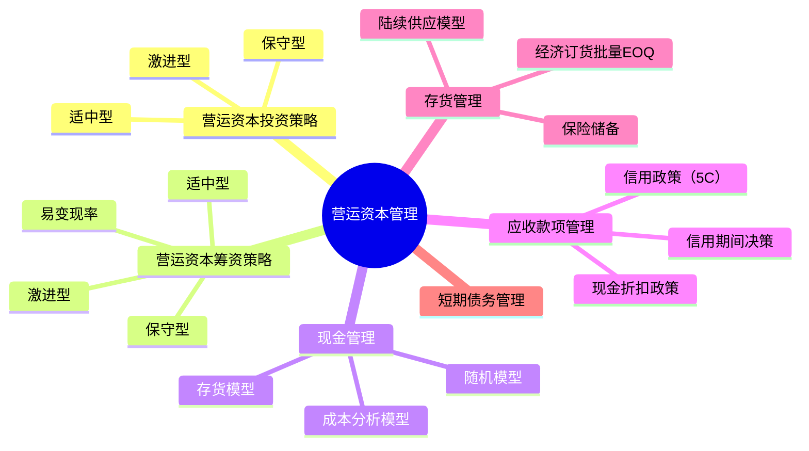

## 1. 章节定位

| 项目 | 信息 |
|------|------|
| 所属科目 | 财务成本管理 |
| 难度等级 | 3 |
| 历年分值 | 6-8分 |
| 建议学时 | 6-8h |

## 2. 考情分析

营运资本管理是财管中计算公式密集的章节，题型以客观题和计算题为主。核心考点包括：营运资本投资策略与筹资策略（适中型、保守型、激进型）、易变现率的计算、最佳现金持有量的三种模型（成本分析模型、存货模型、随机模型）、信用政策决策（信用期间、信用标准、现金折扣）、经济订货批量模型（EOQ）及保险储备的计算。

近年趋势强调信用政策决策的综合计算（改变信用政策增加的收益与增加的成本比较）和存货经济订货批量的扩展模型（陆续供应、保险储备）。考生须熟练掌握 EOQ 基本公式 $\sqrt{2KD/K_c}$ 及其变形。

**命题规律**：
1. 易变现率的计算与筹资策略判断几乎每年必考，需区分高峰期与淡季；
2. EOQ 基本模型及陆续供应模型是计算题核心，公式变形常考；
3. 信用政策决策（收益增加 vs 成本增加）是综合计算题高频考点；
4. 现金持有量三种模型的适用条件与公式是客观题常考点；
5. 补偿性余额、贴现法下的实际利率计算偶有考查。

**学习提示**：本章公式多但逻辑清晰。建议以"成本权衡"为主线贯穿学习：投资策略权衡持有成本与短缺成本；现金管理权衡机会成本与交易成本；存货管理权衡订货成本与储存成本；信用政策权衡收益增加与成本增加。重点掌握 EOQ 公式及其在陆续供应下的变形，以及信用政策决策的五步计算法。

**与其他章节的关联**：本章向上承接第二章（流动比率、速动比率等短期偿债能力指标）、第五章（资本成本用于应收账款应计利息计算），向下连接第十五章（本量利分析中的变动成本率用于信用政策决策）。

## 3. 知识框架



## 4. 核心精讲

### 一、营运资本投资策略

营运资本投资策略决定流动资产投资的相对规模，分为三种：

| 策略 | 特点 | 持有成本 | 短缺成本 | 风险报酬 |
|------|------|----------|----------|----------|
| 适中型 | 短缺成本与持有成本之和最小 | 适中 | 适中 | 风险与报酬平衡 |
| 保守型 | 流动资产/收入比高，持有较多现金、存货 | 高 | 低 | 风险低、报酬低 |
| 激进型 | 流动资产/收入比低，持有最少现金、存货 | 低 | 高 | 风险高、报酬高 |

**最优投资规模**：短缺成本与持有成本之和最小化，即两者相等时的投资规模。

**三种投资策略的图形理解**：

```
总成本
  |    激进型（持有成本低，短缺成本高）
  |       ╱╲
  |      ╱  ╲
  |     ╱    ╲  适中型（总成本最低）
  |    ╱      ╲╱‾‾╲
  |   ╱              ╲  保守型（持有成本高，短缺成本低）
  |  ╱                ╲
  | ╱                  ╲
  └──────────────────────流动资产投资规模
```

**成本权衡逻辑**：
- 持有成本（机会成本）：流动资产越多，占用资金越多，机会成本越高；
- 短缺成本：流动资产越少，缺货、断现金风险越大，短缺成本越高；
- 最优投资规模：两者之和最小，即两条成本曲线交点附近。

### 二、营运资本筹资策略

营运资本筹资策略决定流动资产所需资金中短期来源与长期来源的比例。

**流动资产分类**：
- **稳定性流动资产**：即使经营淡季仍需保留的流动资产（长期需求）；
- **波动性流动资产**：受季节性、周期性影响的流动资产（短期需求）。

**资金来源分类**：
- **短期来源**：短期金融负债（如短期借款）；
- **长期来源**：股东权益 + 长期债务 + 经营性流动负债（自发性负债）。

**易变现率**：

$$\text{易变现率} = \frac{\text{股东权益} + \text{长期债务} - \text{长期资产}}{\text{经营性流动资产}}$$

易变现率越高，资金来源持续性越强，偿债压力越小，越保守。

**易变现率的直观理解**：分子表示"长期资金满足长期资产后剩余可用于流动资产的部分"，分母是流动资产总额。比值越高，说明流动资产由长期资金支持的比例越大，越稳定。

**三种筹资策略**：

| 策略 | 资金匹配关系 | 易变现率 | 风险 | 报酬 |
|------|-------------|----------|------|------|
| 适中型 | 波动性流动资产用短期金融负债；稳定性流动资产和长期资产用长期资金 | 介于两者之间（高峰期<1，淡季=1） | 适中 | 适中 |
| 保守型 | 部分波动性流动资产也用长期资金支持 | 高（淡季>1，有闲置资金投资短期证券） | 低 | 低 |
| 激进型 | 部分稳定性流动资产用短期金融负债支持 | 低（高峰期和淡季均<1） | 高 | 高 |

**三种筹资策略的资金匹配图示**：

```
         适中型                保守型                激进型
         ┌────┐               ┌────┐               ┌────┐
长期资产  │████│ 长期资金      │████│ 长期资金      │████│ 短期资金（部分）
         ├────┤               ├────┤               ├────┤
稳定性FA │████│ 长期资金      │████│ 长期资金      │████│ 长期资金（部分）
         ├────┤               ├────┤               ├────┤
波动性FA │░░░░│ 短期资金      │░░░░│ 长期资金（部分）│░░░░│ 短期资金
         └────┘               └────┘               └────┘
```

**适中型筹资策略公式**：

$$\text{长期资产} + \text{稳定性流动资产} = \text{股东权益} + \text{长期债务} + \text{经营性流动负债}$$

$$\text{波动性流动资产} = \text{短期金融负债}$$

**保守型筹资策略**：长期资金 > 长期资产 + 稳定性流动资产，部分波动性流动资产也由长期资金支持，淡季有闲置资金可投短期有价证券。

**激进型筹资策略**：长期资金 < 长期资产 + 稳定性流动资产，部分稳定性流动资产（甚至长期资产）由短期金融负债支持，风险最高。

### 三、现金管理

#### （一）现金持有成本

- **机会成本**：现金占用丧失的投资收益；
- **管理成本**：现金管理费用（固定）；
- **短缺成本**：现金不足造成的损失。

**成本与现金持有量的关系**：

| 成本类型 | 与现金持有量的关系 |
|---------|------------------|
| 机会成本 | 正相关（持有越多，机会成本越高） |
| 管理成本 | 固定（与持有量无关） |
| 短缺成本 | 负相关（持有越多，短缺成本越低） |

#### （二）成本分析模型

寻找使机会成本、管理成本、短缺成本之和最小的现金持有量。

**特点**：考虑三种成本，管理成本固定不影响决策，故实质是权衡机会成本与短缺成本。

**适用条件**：现金需求较稳定，可预测。

**局限**：短缺成本难以准确计量。

#### （三）存货模型（鲍曼模型）

假设现金均匀消耗，定期补充。

**假设条件**：
1. 现金需求稳定且可预测；
2. 现金均匀消耗；
3. 通过出售有价证券补充现金；
4. 有价证券利率已知且稳定。

**相关成本**：机会成本 + 交易成本

- 机会成本 $= (C/2) \times K$（平均现金持有量 × 机会成本率）
- 交易成本 $= (T/C) \times F$（转换次数 × 每次成本）

**最佳现金持有量**：

$$C^* = \sqrt{\frac{2 \times T \times F}{K}}$$

其中：
- $T$：一定期间现金总需求量；
- $F$：每次有价证券转换固定成本；
- $K$：持有现金的机会成本率（短期有价证券利率）。

**最小相关总成本**：

$$TC^* = \sqrt{2 \times T \times F \times K}$$

**模型推导**：总成本 $TC = (C/2) \times K + (T/C) \times F$，对 $C$ 求导令其等于0，得 $C^* = \sqrt{2TF/K}$。

#### （四）随机模型（米勒-奥尔模型）

适用于现金流量不确定的情况。

**现金返回线**：

$$R = \sqrt[3]{\frac{3 \times b \times \delta^2}{4 \times i}} + L$$

**现金上限**：

$$H = 3R - 2L$$

其中：
- $b$：每次有价证券转换固定成本；
- $\delta^2$：每日现金流量方差；
- $i$：有价证券日利息率；
- $L$：现金下限；
- $R$：现金返回线（目标水平）；
- $H$：现金上限。

**决策规则**：现金达到上限 $H$ 时，买入 $H - R$ 有价证券；现金降至下限 $L$ 时，卖出 $R - L$ 有价证券。

**随机模型的特点**：
- 现金在 $[L, H]$ 区间内波动时不操作，只在触及上下限时调整；
- 现金流量越不稳定（$\delta^2$ 越大），返回线 $R$ 越高，区间越宽；
- 转换成本越高（$b$ 越大），调整频率越低，区间越宽。

**三种现金管理模型比较**：

| 模型 | 适用场景 | 考虑成本 | 公式 | 特点 |
|------|---------|---------|------|------|
| 成本分析模型 | 现金需求稳定 | 机会+管理+短缺 | 无固定公式（列表比较） | 简单，但短缺成本难计量 |
| 存货模型 | 现金需求稳定可预测 | 机会+交易 | $C^* = \sqrt{2TF/K}$ | 类似EOQ，假设严格 |
| 随机模型 | 现金流量不确定 | 机会+交易 | $R = \sqrt[3]{3b\delta^2/(4i)} + L$ | 适用性广，实操性强 |

### 四、应收款项管理

#### （一）信用政策要素

1. **信用期间**：允许客户付款的最长期限；
2. **信用标准**：客户获得信用的条件（5C 系统）；
3. **现金折扣政策**：提前付款的优惠。

**5C 系统详解**：

| 5C | 含义 | 评估内容 |
|-----|------|---------|
| 品质（Character） | 客户履约还债的意愿 | 历史信用记录、商业信誉 |
| 能力（Capacity） | 客户偿债的现金流能力 | 流动比率、现金流状况 |
| 资本（Capital） | 客户的财务实力 | 净资产、资产负债率 |
| 抵押（Collateral） | 客户可提供的担保 | 抵押物价值、可变现性 |
| 条件（Conditions） | 客户所处经济环境 | 行业前景、宏观经济 |

**信用期间的表示**：如"2/10, 1/20, n/30"表示10天内付款享2%折扣，10-20天内付款享1%折扣，30天内全额付款。

#### （二）信用政策决策

比较改变信用政策后的**收益增加**与**成本增加**：

**收益增加**：

$$\Delta \text{收益} = \Delta \text{销售量} \times \text{单位边际贡献}$$

或：

$$\Delta \text{收益} = \Delta \text{销售额} \times (1 - \text{变动成本率})$$

**成本增加**（五项）：

1. **应收账款占用资金应计利息增加**：

$$\text{应收账款应计利息} = \frac{\text{销售额}}{360} \times \text{平均收现期} \times \text{变动成本率} \times \text{资本成本}$$

**计算要点**：
- 日销售额 $= 销售额 / 360$；
- 应收账款平均余额 $= 日销售额 \times 平均收现期$；
- 应收账款占用资金 $= 应收账款平均余额 \times 变动成本率$（只对变动成本计息，因固定成本不随销售增加）；
- 应计利息 $= 占用资金 \times 资本成本$。

2. **存货增加占用资金应计利息**：

$$\text{存货应计利息} = \text{存货增加额} \times \text{变动成本率} \times \text{资本成本}$$

3. **收账费用增加**：通常题目直接给出；

4. **坏账损失增加**：

$$\text{坏账损失} = \text{销售额} \times \text{坏账损失率}$$

5. **现金折扣成本增加**（若有折扣政策）：

$$\text{现金折扣成本} = \text{销售额} \times \text{享受折扣比例} \times \text{折扣率}$$

**决策规则**：若收益增加 > 成本增加（即税前收益净增加 > 0），则改变信用政策。

**信用政策决策的五步计算法**：
1. 计算收益增加（销售增加带来的边际贡献）；
2. 计算应收账款应计利息增加（新旧方案差额）；
3. 计算其他成本增加（坏账、收账、折扣、存货利息）；
4. 汇总成本增加总额；
5. 比较收益增加与成本增加，做决策。

### 五、存货管理

#### （一）经济订货批量基本模型（EOQ）

**假设**：
1. 需求量稳定且可预测；
2. 即时补充（一次到货）；
3. 无数量折扣；
4. 无缺货成本。

**相关成本**：变动订货成本 + 变动储存成本

- 变动订货成本 $= (D/Q) \times K$（订货次数 × 每次成本）
- 变动储存成本 $= (Q/2) \times K_c$（平均库存 × 单位储存成本）

**经济订货批量**：

$$Q^* = \sqrt{\frac{2 \times K \times D}{K_c}}$$

其中：
- $D$：年需求量；
- $K$：每次订货成本；
- $K_c$：单位存货年储存成本。

**模型推导**：总成本 $TC = (D/Q) \times K + (Q/2) \times K_c$，对 $Q$ 求导令其等于0，得 $Q^* = \sqrt{2KD/K_c}$。

**最优订货次数**：$N^* = D / Q^*$

**最优订货周期**：$T^* = 360 / N^*$（天）

**最小相关总成本**：

$$TC^* = \sqrt{2 \times K \times D \times K_c}$$

**EOQ 模型的相关公式汇总**：

| 指标 | 公式 |
|------|------|
| 经济订货批量 | $Q^* = \sqrt{2KD/K_c}$ |
| 最优订货次数 | $N^* = D/Q^*$ |
| 最优订货周期 | $T^* = 360/N^*$（天） |
| 最小相关总成本 | $TC^* = \sqrt{2KDK_c}$ |
| 经济订货量占用资金 | $= (Q^*/2) \times 单价$ |

**关键规律**：在 EOQ 下，变动订货成本 = 变动储存成本（两者相等时总成本最小）。

#### （二）存货陆续供应模型

当存货陆续入库（而非一次到货）时：

**陆续供应的特点**：存货边送边用，最高库存量 $= Q \times (1 - d/p)$，而非 $Q$。

**经济订货批量**：

$$Q^* = \sqrt{\frac{2 \times K \times D}{K_c \times (1 - d/p)}}$$

其中：
- $p$：每日送货量；
- $d$：每日耗用量；
- $d/p$：每日入库后被消耗的比例；
- $(1 - d/p)$：送货期间净库存增加比例。

**最小相关总成本**：

$$TC^* = \sqrt{2 \times K \times D \times K_c \times (1 - d/p)}$$

**陆续供应模型与基本模型的关系**：
- 当 $p \to \infty$（即时补充，即一次到货）时，$d/p \to 0$，$(1-d/p) \to 1$，陆续模型退化为基本模型；
- 陆续供应下 EOQ 更大（因分母多了 $(1-d/p) < 1$），总成本更低（因储存成本降低）。

**陆续供应模型的应用**：自制 vs 外购决策。若自制（陆续生产），用陆续供应模型算成本；若外购（一次到货），用基本 EOQ 算成本，比较两者择优。

#### （三）保险储备

为应对需求不确定性，设置保险储备 $B$。

**再订货点**：

$$R = \text{平均需求} \times \text{提前期} + B$$

**最佳保险储备**：使缺货成本与保险储备成本之和最小。

$$TC(B) = \text{缺货成本} + B \times K_c$$

其中：
- 缺货成本 $= 缺货量 \times 概率 \times 单位缺货成本 \times 订货次数$；
- 保险储备成本 $= B \times K_c$（全年持有保险储备的成本）。

**保险储备决策步骤**：
1. 计算不同保险储备水平下的缺货量与缺货成本；
2. 计算对应的保险储备成本；
3. 求两者之和（总成本），选总成本最小的 $B$。

**保险储备的直觉**：保险储备越高，缺货概率越低（缺货成本下降），但保险储备成本上升。最佳点是两者的权衡。

### 六、短期债务管理

**短期借款**：
- **信贷额度**：银行允许借款的最高限额；
- **周转信贷协议**：银行承诺的信贷额度，需支付承诺费；
- **补偿性余额**：银行要求借款人在银行保持最低存款余额，提高了实际利率。

**补偿性余额下的实际利率**：

$$\text{实际利率} = \frac{\text{名义利率}}{1 - \text{补偿性余额比例}}$$

**贴现法付息下的实际利率**：

$$\text{实际利率} = \frac{\text{利息}}{\text{借款金额} - \text{利息}} = \frac{\text{名义利率}}{1 - \text{名义利率}}$$

## 5. 典型例题

**【例题 1】（计算题·易变现率）**

某企业经营淡季占用流动资产 300 万元、长期资产 500 万元；经营高峰期额外增加 200 万元季节性存货。企业股东权益 + 长期债务 + 经营性流动负债合计为 800 万元，高峰期借入短期借款 200 万元。

要求：计算高峰期和淡季的易变现率，判断筹资策略类型。

**答案**：

高峰期：
- 经营性流动资产 $= 300 + 200 = 500$（万元）
- 易变现率 $= (800 - 500) / 500 = 300 / 500 = 60\%$

淡季：
- 经营性流动资产 $= 300$（万元）
- 长期资金来源 $= 800$ 万元，高于长期资产 500 万元，闲置 300 万元可投资短期有价证券
- 易变现率 $= (800 - 500) / 300 = 300 / 300 = 100\%$

因长期资金（800）= 长期资产（500）+ 稳定性流动资产（300），波动性流动资产（200）= 短期金融负债（200），属**适中型筹资策略**。

---

**【例题 2】（计算题·EOQ）**

某公司年需求某材料 3600 件，每次订货成本 25 元，单位年储存成本 2 元。

要求：计算经济订货批量、最优订货次数、最优订货周期、最小相关总成本。

**答案**：

- $Q^* = \sqrt{2 \times 25 \times 3600 / 2} = \sqrt{90000} = 300$（件）
- $N^* = 3600 / 300 = 12$（次）
- $T^* = 360 / 12 = 30$（天）
- $TC^* = \sqrt{2 \times 25 \times 3600 \times 2} = \sqrt{360000} = 600$（元）

---

**【例题 3】（计算题·信用政策决策）**

某公司当前年赊销额 1000 万元，信用期间 30 天，变动成本率 60%，资本成本 10%。拟将信用期间延长至 60 天，预计年赊销额增至 1200 万元，坏账损失率从 2% 升至 3%，收账费用从 10 万元增至 15 万元。

要求：判断是否应改变信用政策。

**答案**：

**收益增加**：
$= (1200 - 1000) \times (1 - 60\%) = 200 \times 40\% = 80$（万元）

**成本增加**：
1. 应收账款应计利息增加：
   - 原方案：$1000/360 \times 30 \times 60\% \times 10\% = 5$（万元）
   - 新方案：$1200/360 \times 60 \times 60\% \times 10\% = 12$（万元）
   - 增加：$12 - 5 = 7$（万元）

2. 坏账损失增加：
   - 原方案：$1000 \times 2\% = 20$（万元）
   - 新方案：$1200 \times 3\% = 36$（万元）
   - 增加：$36 - 20 = 16$（万元）

3. 收账费用增加：$15 - 10 = 5$（万元）

**总成本增加** $= 7 + 16 + 5 = 28$（万元）

**税前收益净增加** $= 80 - 28 = 52$（万元）> 0

应改变信用政策。

---

**【例题 4】（计算题·现金存货模型）**

某公司年现金需求量 500 万元，每次有价证券转换成本 100 元，有价证券年利率 8%。

要求：计算最佳现金持有量和最小相关总成本。

**答案**：

$$C^* = \sqrt{\frac{2 \times 5000000 \times 100}{8\%}} = \sqrt{\frac{1000000000}{0.08}} = \sqrt{12500000000} \approx 111803 \text{（元）} \approx 11.18 \text{（万元）}$$

$$TC^* = \sqrt{2 \times 5000000 \times 100 \times 8\%} = \sqrt{80000000} \approx 8944 \text{（元）} \approx 0.89 \text{（万元）}$$

---

**【例题 5】（计算题·陆续供应模型）**

某公司年需求某零件 7200 件，每次订货（生产准备）成本 50 元，单位年储存成本 4 元。若自制，每日产量 60 件，每日耗用 20 件。

要求：计算陆续供应下的经济订货批量和最小相关总成本。

**答案**：

- $d/p = 20/60 = 1/3$，$1 - d/p = 2/3$

$$Q^* = \sqrt{\frac{2 \times 50 \times 7200}{4 \times (2/3)}} = \sqrt{\frac{720000}{8/3}} = \sqrt{270000} \approx 520 \text{（件）}$$

$$TC^* = \sqrt{2 \times 50 \times 7200 \times 4 \times (2/3)} = \sqrt{1920000} \approx 1386 \text{（元）}$$

**解析**：陆续供应模型在基本 EOQ 基础上，分母乘以 $(1-d/p)$，总成本乘以 $\sqrt{(1-d/p)}$。本题 $(1-d/p)=2/3$，故 EOQ 比基本模型大，总成本比基本模型小。

---

**【例题 6】（计算题·保险储备）**

某公司年需求 3600 件，每年订货 12 次，单位缺货成本 5 元，单位年储存成本 2 元。提前期 10 天，提前期内日需求量概率分布如下：

| 日需求 | 8件 | 10件 | 12件 | 14件 |
|--------|-----|------|------|------|
| 概率 | 0.2 | 0.5 | 0.2 | 0.1 |

要求：计算最佳保险储备（平均日需求10件，提前期10天，平均需求100件）。

**答案**：

提前期内总需求 = 10 × 日需求。平均需求 = 100 件。

| 保险储备 B | 缺货量 | 期望缺货量 | 缺货成本 | 储存成本 | 总成本 |
|-----------|--------|-----------|---------|---------|--------|
| 0 | 20(概率0.2)+40(概率0.1) | $20\times0.2+40\times0.1=8$ | $8\times5\times12=480$ | $0\times2=0$ | 480 |
| 20 | 20(概率0.1) | $20\times0.1=2$ | $2\times5\times12=120$ | $20\times2=40$ | 160 |
| 40 | 0 | 0 | 0 | $40\times2=80$ | 80 |

**决策**：B=40 时总成本最小（80元），故最佳保险储备为40件。

再订货点 $R = 100 + 40 = 140$（件）。

**解析**：保险储备决策需逐一计算不同 B 下的缺货成本与储存成本之和，选总成本最小的。注意缺货量 = 超过平均需求的部分。

---

**【例题 7】（计算题·随机模型）**

某公司每日现金流量标准差 800 元，每次有价证券转换成本 50 元，有价证券日利率 0.02%，现金下限设为 2000 元。

要求：计算现金返回线和现金上限。

**答案**：

每日现金流量方差 $\delta^2 = 800^2 = 640000$

$$R = \sqrt[3]{\frac{3 \times 50 \times 640000}{4 \times 0.0002}} + 2000 = \sqrt[3]{\frac{96000000}{0.0008}} + 2000 = \sqrt[3]{120000000000} + 2000 \approx 4932 + 2000 = 6932 \text{（元）}$$

$$H = 3R - 2L = 3 \times 6932 - 2 \times 2000 = 20796 - 4000 = 16796 \text{（元）}$$

**解析**：随机模型用立方根计算返回线，上下限区间为 $[L, H]$。现金触及上限时买入 $H-R$ 证券，触及下限时卖出 $R-L$ 证券。

---

**【例题 8】（综合·信用政策含现金折扣）**

某公司年赊销 2000 万元，信用期间 30 天，变动成本率 60%，资本成本 10%。拟提供"2/10, n/30"折扣，预计50%客户享受折扣（10天付款），50%客户仍30天付款。赊销增至 2200 万元，坏账损失率从 1.5% 降至 1%，收账费用从 8 万元降至 5 万元。

要求：判断是否应改变信用政策。

**答案**：

**收益增加** $= (2200 - 2000) \times (1 - 60\%) = 200 \times 40\% = 80$（万元）

**成本增加**：
1. 应收账款应计利息：
   - 原方案：$2000/360 \times 30 \times 60\% \times 10\% = 10$（万元）
   - 新方案平均收现期 $= 50\% \times 10 + 50\% \times 30 = 20$（天）
   - 新方案：$2200/360 \times 20 \times 60\% \times 10\% = 7.33$（万元）
   - 增加：$7.33 - 10 = -2.67$（万元）（减少）

2. 坏账损失：
   - 原方案：$2000 \times 1.5\% = 30$（万元）
   - 新方案：$2200 \times 1\% = 22$（万元）
   - 增加：$22 - 30 = -8$（万元）（减少）

3. 收账费用：$5 - 8 = -3$（万元）（减少）

4. 现金折扣成本：$2200 \times 50\% \times 2\% = 22$（万元）（新增）

**总成本增加** $= -2.67 + (-8) + (-3) + 22 = 8.33$（万元）

**税前收益净增加** $= 80 - 8.33 = 71.67$（万元）> 0

应改变信用政策。

**解析**：含现金折扣的信用政策决策需计算平均收现期（加权平均），并新增现金折扣成本项。注意折扣政策可能缩短收现期、降低坏账，带来成本节约。

## 6. 记忆口诀

**三种筹资策略易变现率**：
> 保守高、适中中、激进低；
> 淡季易变现率 > 100% 为保守型。

**EOQ 公式**：
> $Q^* = \sqrt{2KD/K_c}$；
> 最小成本 $= \sqrt{2KDK_c}$（注意分母分子 $K_c$ 位置）。

**陆续供应模型**：
> 基本 EOQ 乘以 $\sqrt{1/(1-d/p)}$；
> 总成本乘以 $\sqrt{(1-d/p)}$。

**应收账款应计利息**：
> 销售额/360 × 平均收现期 × 变动成本率 × 资本成本；
> 注意只对变动成本部分计息。

**信用政策决策**：
> 收益增加（边际贡献）vs 成本增加（利息+坏账+收账+折扣）；
> 净增收益 > 0 则可行。

## 7. 同步练习

**1.（单选题）** 某企业采用激进型筹资策略，下列说法中正确的是（　）。

A. 易变现率较高
B. 资金来源持续性强
C. 部分稳定性流动资产由短期金融负债支持
D. 偿债压力小

**2.（单选题）** 某公司年需求量 6400 件，每次订货成本 50 元，单位年储存成本 4 元。则经济订货批量为（　）件。

A. 200
B. 400
C. 600
D. 800

**3.（计算题）** 某公司年现金需求 360 万元，每次转换成本 200 元，有价证券年利率 10%。计算最佳现金持有量和最小相关总成本。

**4.（计算题）** 某公司年赊销 800 万元，信用期间 30 天，变动成本率 70%，资本成本 8%。拟延长至 45 天，赊销增至 1000 万元。计算应收账款应计利息的增加额。

**5.（单选题）** 某银行借款名义利率 8%，补偿性余额比例 20%。则实际利率为（　）。

A. 8%
B. 10%
C. 12%
D. 16%

---

**练习答案**：1.C　2.B（$\sqrt{2 \times 50 \times 6400 / 4} = \sqrt{160000} = 400$）　3. $C^* = \sqrt{2 \times 3600000 \times 200 / 10\%} = 120000$元 = 12万元；$TC^* = \sqrt{2 \times 3600000 \times 200 \times 10\%} = 12000$元 = 1.2万元　4. 原方案：$800/360 \times 30 \times 70\% \times 8\% = 3.73$万元；新方案：$1000/360 \times 45 \times 70\% \times 8\% = 7.00$万元；增加 3.27万元　5.B（$8\% / (1-20\%) = 10\%$）
