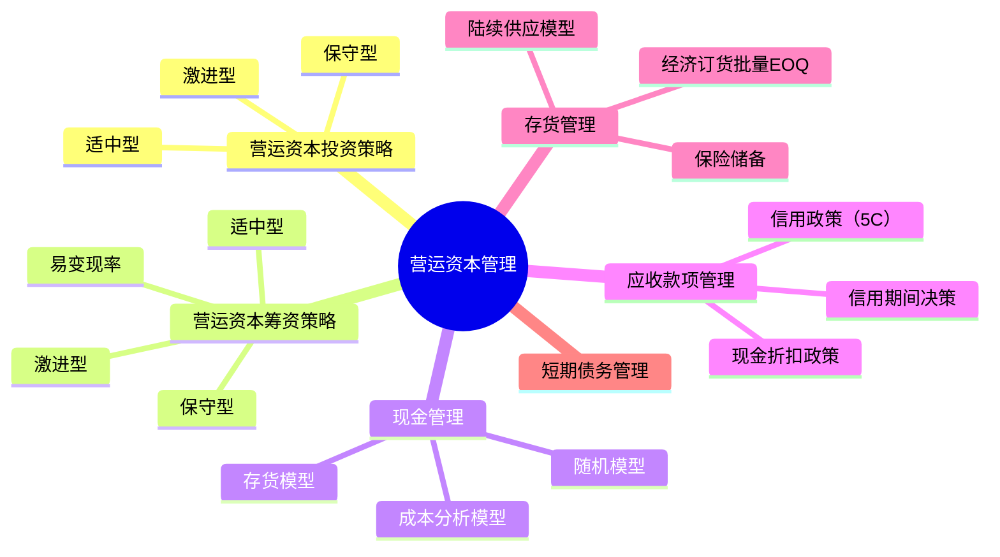

## 📍 章节定位

| 项目 | 信息 |
|------|------|
| **所属科目** | 📊 财务成本管理 |
| **难度等级** | ⭐⭐⭐ |
| **历年分值** | 6-8分 |
| **建议学时** | 6-8h |

## 📝 考情分析

营运资本管理是财管中计算公式密集的章节，题型以客观题和计算题为主。核心考点包括：营运资本投资策略与筹资策略（适中型、保守型、激进型）、易变现率的计算、最佳现金持有量的三种模型（成本分析模型、存货模型、随机模型）、信用政策决策（信用期间、信用标准、现金折扣）、经济订货批量模型（EOQ）及保险储备的计算。

近年趋势强调信用政策决策的综合计算（改变信用政策增加的收益与增加的成本比较）和存货经济订货批量的扩展模型（陆续供应、保险储备）。考生须熟练掌握 EOQ 基本公式 $\sqrt{2KD/K_c}$ 及其变形。

## 🧠 知识框架

## 📖 核心精讲

### 一、营运资本投资策略

营运资本投资策略决定流动资产投资的相对规模，分为三种：

| 策略 | 特点 | 持有成本 | 短缺成本 | 风险报酬 |
|------|------|----------|----------|----------|
| **适中型** | 短缺成本与持有成本之和最小 | 适中 | 适中 | 风险与报酬平衡 |
| **保守型** | 流动资产/收入比高，持有较多现金、存货 | 高 | 低 | 风险低、报酬低 |
| **激进型** | 流动资产/收入比低，持有最少现金、存货 | 低 | 高 | 风险高、报酬高 |

**最优投资规模**：短缺成本与持有成本之和最小化，即两者相等时的投资规模。

### 二、营运资本筹资策略

营运资本筹资策略决定流动资产所需资金中短期来源与长期来源的比例。

**流动资产分类**：
- **稳定性流动资产**：即使经营淡季仍需保留的流动资产（长期需求）；
- **波动性流动资产**：受季节性、周期性影响的流动资产（短期需求）。

**易变现率**：

$$\text{易变现率} = \frac{\text{股东权益} + \text{长期债务} - \text{长期资产}}{\text{经营性流动资产}}$$

易变现率越高，资金来源持续性越强，偿债压力越小，越保守。

**三种筹资策略**：

| 策略 | 资金匹配关系 | 易变现率 | 风险 |
|------|-------------|----------|------|
| **适中型** | 波动性流动资产用短期金融负债；稳定性流动资产和长期资产用长期资金 | 介于两者之间 | 适中 |
| **保守型** | 部分波动性流动资产也用长期资金支持 | 高（>1时营业低谷） | 低 |
| **激进型** | 部分稳定性流动资产用短期金融负债支持 | 低（<1） | 高 |

**适中型筹资策略公式**：

$$\text{长期资产} + \text{稳定性流动资产} = \text{股东权益} + \text{长期债务} + \text{经营性流动负债}$$

$$\text{波动性流动资产} = \text{短期金融负债}$$

### 三、现金管理

#### （一）现金持有成本

- **机会成本**：现金占用丧失的投资收益；
- **管理成本**：现金管理费用（固定）；
- **短缺成本**：现金不足造成的损失。

#### （二）成本分析模型

寻找使机会成本、管理成本、短缺成本之和最小的现金持有量。

#### （三）存货模型（鲍曼模型）

假设现金均匀消耗，定期补充。

**相关成本**：机会成本 + 交易成本

**最佳现金持有量**：

$$C^* = \sqrt{\frac{2 \times T \times F}{K}}$$

其中：
- $T$：一定期间现金总需求量；
- $F$：每次有价证券转换固定成本；
- $K$：持有现金的机会成本率（短期有价证券利率）。

**最小相关总成本**：

$$TC^* = \sqrt{2 \times T \times F \times K}$$

#### （四）随机模型（米勒-奥尔模型）

适用于现金流量不确定的情况。

**现金返回线**：

$$R = \sqrt[3]{\frac{3 \times b \times \delta^2}{4 \times i}} + L$$

**现金上限**：

$$H = 3R - 2L$$

其中：
- $b$：每次有价证券转换固定成本；
- $\delta^2$：每日现金流量方差；
- $i$：有价证券日利息率；
- $L$：现金下限；
- $R$：现金返回线（目标水平）；
- $H$：现金上限。

**决策规则**：现金达到上限 $H$ 时，买入 $H - R$ 有价证券；现金降至下限 $L$ 时，卖出 $R - L$ 有价证券。

### 四、应收款项管理

#### （一）信用政策要素

1. **信用期间**：允许客户付款的最长期限；
2. **信用标准**：客户获得信用的条件（5C 系统）；
3. **现金折扣政策**：提前付款的优惠。

**5C 系统**：品质（Character）、能力（Capacity）、资本（Capital）、抵押（Collateral）、条件（Conditions）。

#### （二）信用政策决策

比较改变信用政策后的**收益增加**与**成本增加**：

**收益增加**：

$$\Delta \text{收益} = \Delta \text{销售量} \times \text{单位边际贡献}$$

**成本增加**：
1. **应收账款占用资金应计利息增加**：

$$\text{应收账款应计利息} = \frac{\text{销售额}}{360} \times \text{平均收现期} \times \text{变动成本率} \times \text{资本成本}$$

2. **存货增加占用资金应计利息**；
3. **收账费用增加**；
4. **坏账损失增加**；
5. **现金折扣成本增加**（若有折扣政策）：

$$\text{现金折扣成本} = \text{销售额} \times \text{享受折扣比例} \times \text{折扣率}$$

**决策规则**：若收益增加 > 成本增加，则改变信用政策。

### 五、存货管理

#### （一）经济订货批量基本模型（EOQ）

**假设**：
1. 需求量稳定且可预测；
2. 即时补充（一次到货）；
3. 无数量折扣；
4. 无缺货成本。

**相关成本**：变动订货成本 + 变动储存成本

**经济订货批量**：

$$Q^* = \sqrt{\frac{2 \times K \times D}{K_c}}$$

其中：
- $D$：年需求量；
- $K$：每次订货成本；
- $K_c$：单位存货年储存成本。

**最优订货次数**：$N^* = D / Q^*$

**最优订货周期**：$T^* = 360 / N^*$（天）

**最小相关总成本**：

$$TC^* = \sqrt{2 \times K \times D \times K_c}$$

#### （二）存货陆续供应模型

当存货陆续入库（而非一次到货）时：

**经济订货批量**：

$$Q^* = \sqrt{\frac{2 \times K \times D}{K_c \times (1 - d/p)}}$$

其中：
- $p$：每日送货量；
- $d$：每日耗用量；
- $d/p$：每日入库后被消耗的比例。

**最小相关总成本**：

$$TC^* = \sqrt{2 \times K \times D \times K_c \times (1 - d/p)}$$

#### （三）保险储备

为应对需求不确定性，设置保险储备 $B$。

**再订货点**：

$$R = \text{平均需求} \times \text{提前期} + B$$

**最佳保险储备**：使缺货成本与保险储备成本之和最小。

$$TC(B) = \text{缺货成本} + B \times K_c$$

### 六、短期债务管理

**短期借款**：
- **信贷额度**：银行允许借款的最高限额；
- **周转信贷协议**：银行承诺的信贷额度，需支付承诺费；
- **补偿性余额**：银行要求借款人在银行保持最低存款余额，提高了实际利率。

**补偿性余额下的实际利率**：

$$\text{实际利率} = \frac{\text{名义利率}}{1 - \text{补偿性余额比例}}$$

**贴现法付息下的实际利率**：

$$\text{实际利率} = \frac{\text{利息}}{\text{借款金额} - \text{利息}} = \frac{\text{名义利率}}{1 - \text{名义利率}}$$

## 💡 典型例题

**【例题 1】（计算题·易变现率）**

某企业经营淡季占用流动资产 300 万元、长期资产 500 万元；经营高峰期额外增加 200 万元季节性存货。企业股东权益 + 长期债务 + 经营性流动负债合计为 800 万元，高峰期借入短期借款 200 万元。

要求：计算高峰期和淡季的易变现率，判断筹资策略类型。

**答案**：

高峰期：
- 经营性流动资产 $= 300 + 200 = 500$（万元）
- 易变现率 $= (800 - 500) / 500 = 300 / 500 = 60\%$

淡季：
- 经营性流动资产 $= 300$（万元）
- 长期资金来源 $= 800$ 万元，高于长期资产 500 万元，闲置 300 万元可投资短期有价证券
- 易变现率 $= (800 - 500) / 300 = 300 / 300 = 100\%$

因长期资金（800）= 长期资产（500）+ 稳定性流动资产（300），波动性流动资产（200）= 短期金融负债（200），属**适中型筹资策略**。

---

**【例题 2】（计算题·EOQ）**

某公司年需求某材料 3600 件，每次订货成本 25 元，单位年储存成本 2 元。

要求：计算经济订货批量、最优订货次数、最优订货周期、最小相关总成本。

**答案**：

- $Q^* = \sqrt{2 \times 25 \times 3600 / 2} = \sqrt{90000} = 300$（件）
- $N^* = 3600 / 300 = 12$（次）
- $T^* = 360 / 12 = 30$（天）
- $TC^* = \sqrt{2 \times 25 \times 3600 \times 2} = \sqrt{360000} = 600$（元）

---

**【例题 3】（计算题·信用政策决策）**

某公司当前年赊销额 1000 万元，信用期间 30 天，变动成本率 60%，资本成本 10%。拟将信用期间延长至 60 天，预计年赊销额增至 1200 万元，坏账损失率从 2% 升至 3%，收账费用从 10 万元增至 15 万元。

要求：判断是否应改变信用政策。

**答案**：

**收益增加**：
$= (1200 - 1000) \times (1 - 60\%) = 200 \times 40\% = 80$（万元）

**成本增加**：
1. 应收账款应计利息增加：
   - 原方案：$1000/360 \times 30 \times 60\% \times 10\% = 5$（万元）
   - 新方案：$1200/360 \times 60 \times 60\% \times 10\% = 12$（万元）
   - 增加：$12 - 5 = 7$（万元）

2. 坏账损失增加：
   - 原方案：$1000 \times 2\% = 20$（万元）
   - 新方案：$1200 \times 3\% = 36$（万元）
   - 增加：$36 - 20 = 16$（万元）

3. 收账费用增加：$15 - 10 = 5$（万元）

**总成本增加** $= 7 + 16 + 5 = 28$（万元）

**税前收益净增加** $= 80 - 28 = 52$（万元）> 0

应改变信用政策。

---

**【例题 4】（计算题·现金存货模型）**

某公司年现金需求量 500 万元，每次有价证券转换成本 100 元，有价证券年利率 8%。

要求：计算最佳现金持有量和最小相关总成本。

**答案**：

$$C^* = \sqrt{\frac{2 \times 5000000 \times 100}{8\%}} = \sqrt{\frac{1000000000}{0.08}} = \sqrt{12500000000} \approx 111803 \text{（元）} \approx 11.18 \text{（万元）}$$

$$TC^* = \sqrt{2 \times 5000000 \times 100 \times 8\%} = \sqrt{80000000} \approx 8944 \text{（元）} \approx 0.89 \text{（万元）}$$

## 🎯 记忆口诀

**三种筹资策略易变现率**：
> 保守高、适中中、激进低；
> 淡季易变现率 > 100% 为保守型。

**EOQ 公式**：
> $Q^* = \sqrt{2KD/K_c}$；
> 最小成本 $= \sqrt{2KDK_c}$（注意分母分子 $K_c$ 位置）。

**陆续供应模型**：
> 基本 EOQ 乘以 $\sqrt{1/(1-d/p)}$；
> 总成本乘以 $\sqrt{(1-d/p)}$。

**应收账款应计利息**：
> 销售额/360 × 平均收现期 × 变动成本率 × 资本成本；
> 注意只对变动成本部分计息。

**信用政策决策**：
> 收益增加（边际贡献）vs 成本增加（利息+坏账+收账+折扣）；
> 净增收益 > 0 则可行。

## ✅ 同步练习

**1.（单选题）** 某企业采用激进型筹资策略，下列说法中正确的是（　）。

A. 易变现率较高
B. 资金来源持续性强
C. 部分稳定性流动资产由短期金融负债支持
D. 偿债压力小

**2.（单选题）** 某公司年需求量 6400 件，每次订货成本 50 元，单位年储存成本 4 元。则经济订货批量为（　）件。

A. 200
B. 400
C. 600
D. 800

**3.（计算题）** 某公司年现金需求 360 万元，每次转换成本 200 元，有价证券年利率 10%。计算最佳现金持有量和最小相关总成本。

**4.（计算题）** 某公司年赊销 800 万元，信用期间 30 天，变动成本率 70%，资本成本 8%。拟延长至 45 天，赊销增至 1000 万元。计算应收账款应计利息的增加额。

**5.（单选题）** 某银行借款名义利率 8%，补偿性余额比例 20%。则实际利率为（　）。

A. 8%
B. 10%
C. 12%
D. 16%

---

**练习答案**：1.C　2.B（$\sqrt{2 \times 50 \times 6400 / 4} = \sqrt{160000} = 400$）　3. $C^* = \sqrt{2 \times 3600000 \times 200 / 10\%} = 120000$元 = 12万元；$TC^* = \sqrt{2 \times 3600000 \times 200 \times 10\%} = 12000$元 = 1.2万元　4. 原方案：$800/360 \times 30 \times 70\% \times 8\% = 3.73$万元；新方案：$1000/360 \times 45 \times 70\% \times 8\% = 7.00$万元；增加 3.27万元　5.B（$8\% / (1-20\%) = 10\%$）
