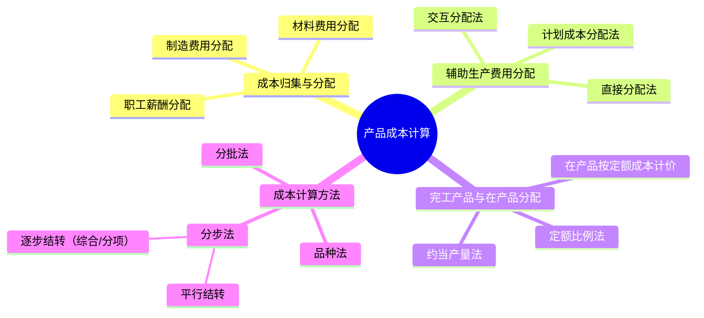

## 📍 章节定位

| 项目 | 信息 |
|------|------|
| **所属科目** | 📊 财务成本管理 |
| **难度等级** | ⭐⭐⭐⭐ |
| **历年分值** | 6-8分 |
| **建议学时** | 6-8h |

## 📝 考情分析

产品成本计算是成本管理会计部分的核心章节，题型以计算综合题为主。核心考点包括：要素费用的归集与分配、辅助生产费用的三种分配方法（直接分配法、交互分配法、计划成本分配法）、完工产品与在产品之间的成本分配（约当产量法、定额比例法）、三种基本成本计算方法（品种法、分批法、分步法）的特点与适用条件、逐步结转分步法与平行结转分步法的比较。

近年趋势重点考查分步法下的成本还原、约当产量法的计算、辅助生产费用交互分配法。考生须熟练掌握各种分配方法的计算步骤和会计处理逻辑。

## 🧠 知识框架

## 📖 核心精讲

### 一、产品成本的归集和分配

#### （一）生产费用的分类

- **直接材料**：构成产品实体的原料、主要材料；
- **直接人工**：直接从事产品生产工人的薪酬；
- **制造费用**：生产车间为组织和管理生产发生的间接费用（机物料消耗、车间管理人员薪酬、折旧等）；
- **燃料和动力**：生产用燃料、电力等（可单列或并入制造费用）。

#### （二）要素费用的归集和分配

**1. 材料费用分配**

直接用于某产品的材料直接计入该产品成本；几种产品共同耗用的材料按一定标准分配。

按定额消耗量比例分配：

$$\text{分配率} = \frac{\text{材料实际成本}}{\sum (\text{各产品产量} \times \text{单位消耗定额})}$$

某产品应分配材料 $= \text{该产品定额消耗量} \times \text{分配率}$

**2. 职工薪酬分配**

按生产工时比例分配：

$$\text{分配率} = \frac{\text{生产工人工资总额}}{\sum \text{各产品实用工时}}$$

某产品应分配工资 $= \text{该产品实用工时} \times \text{分配率}$

**3. 制造费用分配**

按生产工时比例、机器工时比例、直接工资比例等分配：

$$\text{制造费用分配率} = \frac{\text{制造费用总额}}{\sum \text{各产品分配标准（工时等）}}$$

### 二、辅助生产费用的归集和分配

辅助生产车间为基本生产车间提供服务，其费用最终分配计入产品成本。三种分配方法：

#### （一）直接分配法

不考虑辅助生产车间之间相互提供劳务的情况，直接将辅助生产费用分配给辅助生产以外的各受益对象。

$$\text{分配率} = \frac{\text{辅助生产费用总额}}{\text{对外（辅助生产以外）提供劳务总量}}$$

**优点**：计算简便。
**缺点**：未考虑辅助车间相互服务，分配不准确。

#### （二）交互分配法

分两步：
1. **交互分配**：辅助车间之间按交互分配率分配；
2. **对外分配**：将交互分配后的费用对外分配。

**交互分配率** $= \text{辅助生产费用} / \text{提供劳务总量}$

**对外分配率** $= (\text{原费用} + \text{交互分配转入} - \text{交互分配转出}) / \text{对外提供劳务量}$

**优点**：分配准确。
**缺点**：计算复杂。

#### （三）计划成本分配法**

按计划单位成本分配辅助生产费用，实际成本与计划成本的差额计入管理费用。

**优点**：便于考核成本计划执行情况。
**缺点**：计划成本偏离实际时影响准确性。

### 三、完工产品与在产品的成本分配

月初在产品成本 + 本月生产费用 = 本月完工产品成本 + 月末在产品成本

分配方法：

#### （一）不计算在产品成本法

月末在产品数量很少，忽略不计，全部费用由完工产品负担。

#### （二）在产品按年初固定成本计价法

在产品数量稳定，按年初固定成本计价。年末需调整。

#### （三）在产品按所耗直接材料成本计价法

在产品只负担直接材料成本，其他费用由完工产品负担。适用于材料费用占比大的企业。

#### （四）约当产量法（重点）

将月末在产品按完工程度折算为相当于完工产品的数量（约当产量），再按比例分配费用。

$$\text{约当产量} = \text{在产品数量} \times \text{完工程度}$$

**分配率** $= \frac{\text{某项费用总额}}{\text{完工产品数量} + \text{在产品约当产量}}$

- **完工产品分配额** $= \text{完工产品数量} \times \text{分配率}$
- **月末在产品分配额** $= \text{约当产量} \times \text{分配率}$

**注意分配的层次**：
- **直接材料**：若材料在生产开始时一次投入，在产品完工程度按100%计算；若随生产进度陆续投入，按完工程度计算；
- **直接人工、制造费用**：按在产品完工程度（通常为50%，或按工时确定）计算约当产量。

#### （五）定额比例法

按完工产品与在产品的定额比例分配费用。

**材料分配率** $= \frac{\text{材料费用总额}}{\text{完工产品材料定额} + \text{在产品材料定额}}$

#### （六）在产品按定额成本计价法

月末在产品按定额成本计算，全部实际费用脱离定额的差异由完工产品负担。

### 四、产品成本计算的基本方法

#### （一）品种法

**特点**：以产品品种为成本计算对象。

**适用**：大量大批单步骤生产，或管理上不要求分步骤计算成本的多步骤生产（如发电、采掘）。

**要点**：
- 成本计算对象为产品品种；
- 成本计算期定期按月进行（与会计期间一致）；
- 月末一般有在产品，需在完工产品与在产品之间分配费用。

#### （二）分批法

**特点**：以产品批别为成本计算对象。

**适用**：单件小批生产（如造船、重型机械、专用设备）。

**要点**：
- 成本计算对象为产品批别（订单）；
- 成本计算期不定期，与生产周期一致；
- 一般不需在完工产品与在产品之间分配费用（一批要么全完工要么全未完工）。

**简化的分批法**（不分批计算在产品成本法）：日常只归集直接费用，间接费用月末按累计分配率分配。

#### （三）分步法

**特点**：以产品生产步骤为成本计算对象。

**适用**：大量大批多步骤生产（如纺织、冶金、机械制造）。

**要点**：
- 成本计算对象为各步骤半成品和最终产成品；
- 成本计算期定期按月进行；
- 月末需在完工产品与在产品之间分配费用。

分步法分为两种：

**1. 逐步结转分步法**（计算半成品成本）

按加工顺序逐步计算各步骤半成品成本，并随实物转移结转。

- **综合结转**：上一步骤半成品成本以"半成品"项目综合转入下一步骤；
- **分项结转**：上一步骤半成品成本按原始成本项目（直接材料、直接人工、制造费用）分别转入。

**成本还原**（综合结转法下）：

将产成品中"半成品"项目按上一步骤半成品成本结构还原为原始成本项目。

$$\text{还原分配率} = \frac{\text{产成品所耗半成品成本}}{\text{上步骤完工半成品成本}}$$

**2. 平行结转分步法**（不计算半成品成本）

各步骤只归集本步骤发生的费用，不结转半成品成本。月末将各步骤应计入产成品成本的份额平行汇总。

**特点**：
- 各步骤不计算半成品成本，不结转半成品成本；
- 各步骤费用在产成品与广义在产品（含本步骤完工但未最终完工的半成品）之间分配；
- 半成品成本不随实物结转。

#### （四）逐步结转 vs 平行结转 比较

| 项目 | 逐步结转分步法 | 平行结转分步法 |
|------|---------------|---------------|
| 半成品成本 | 计算 | 不计算 |
| 半成品成本结转 | 随实物转移结转 | 不结转 |
| 在产品含义 | 狭义在产品（本步骤在制） | 广义在产品（本步骤及后续步骤在制） |
| 成本还原 | 综合结转需还原 | 不需还原 |
| 适用 | 需要半成品成本信息 | 不需要半成品成本信息 |

## 💡 典型例题

**【例题 1】（计算题·约当产量法）**

某产品月初在产品成本：直接材料 5000 元，直接人工 2000 元，制造费用 1000 元。本月发生：直接材料 25000 元，直接人工 13000 元，制造费用 7000 元。本月完工 200 件，月末在产品 100 件，完工程度 50%。材料在生产开始时一次投入。

要求：用约当产量法计算完工产品和月末在产品成本。

**答案**：

(1) 直接材料分配（材料一次投入，在产品按100%计算）：
- 在产品约当产量 $= 100 \times 100\% = 100$（件）
- 分配率 $= (5000 + 25000) / (200 + 100) = 30000 / 300 = 100$（元/件）
- 完工产品材料 $= 200 \times 100 = 20000$（元）
- 在产品材料 $= 100 \times 100 = 10000$（元）

(2) 直接人工分配（按完工程度）：
- 在产品约当产量 $= 100 \times 50\% = 50$（件）
- 分配率 $= (2000 + 13000) / (200 + 50) = 15000 / 250 = 60$（元/件）
- 完工产品人工 $= 200 \times 60 = 12000$（元）
- 在产品人工 $= 50 \times 60 = 3000$（元）

(3) 制造费用分配（同人工）：
- 分配率 $= (1000 + 7000) / (200 + 50) = 8000 / 250 = 32$（元/件）
- 完工产品制造费用 $= 200 \times 32 = 6400$（元）
- 在产品制造费用 $= 50 \times 32 = 1600$（元）

(4) 汇总：
- 完工产品成本 $= 20000 + 12000 + 6400 = 38400$（元）
- 月末在产品成本 $= 10000 + 3000 + 1600 = 14600$（元）

**解析**：约当产量法关键在于确定完工程度。材料一次投入按100%，人工和制造费用按完工程度。

---

**【例题 2】（计算题·辅助生产费用交互分配法）**

某企业有供电、供水两个辅助车间。供电车间发生费用 12000 元，供水车间发生费用 4000 元。供电车间供电 30000 度，其中供水车间耗用 5000 度；供水车间供水 2000 吨，其中供电车间耗用 200 吨。基本生产车间耗电 20000 度、耗水 1500 吨；行政管理部门耗电 5000 度、耗水 300 吨。

要求：用交互分配法分配辅助生产费用。

**答案**：

(1) 交互分配：
- 供电交互分配率 $= 12000 / 30000 = 0.4$（元/度）
- 供水交互分配率 $= 4000 / 2000 = 2$（元/吨）
- 供电车间分配给供水车间 $= 5000 \times 0.4 = 2000$（元）
- 供水车间分配给供电车间 $= 200 \times 2 = 400$（元）

(2) 交互分配后费用：
- 供电车间 $= 12000 + 400 - 2000 = 10400$（元）
- 供水车间 $= 4000 + 2000 - 400 = 5600$（元）

(3) 对外分配：
- 供电对外分配率 $= 10400 / (30000 - 5000) = 10400 / 25000 = 0.416$（元/度）
- 供水对外分配率 $= 5600 / (2000 - 200) = 5600 / 1800 = 3.111$（元/吨）

(4) 对外分配额：
- 基本生产车间：
  - 电 $= 20000 \times 0.416 = 8320$（元）
  - 水 $= 1500 \times 3.111 = 4667$（元）
- 行政管理部门：
  - 电 $= 5000 \times 0.416 = 2080$（元）
  - 水 $= 300 \times 3.111 = 933$（元）

**解析**：交互分配法先在辅助车间内部按原费用率分配，再按调整后费用率对外分配。

---

**【例题 3】（概念题）**

下列关于平行结转分步法的说法中，正确的是？

A. 需要计算各步骤半成品成本
B. 半成品成本随实物转移结转
C. 各步骤费用在产成品与广义在产品之间分配
D. 需要进行成本还原

**答案**：C

**解析**：平行结转分步法不计算半成品成本（A错），不结转半成品成本（B错），不需成本还原（D错）；在产品是广义在产品（C正确）。

## 🎯 记忆口诀

**约当产量法**：
> 材料一次投，在产品100%算；
> 人工制造按完工程度，约当产量 = 数量 × 完工程度。

**辅助费用三方法**：
> 直接分配最简单，无视相互服务；
> 交互分配两步走，先内后外最准确；
> 计划分配按计划，差额计入管理费用。

**三种成本计算方法**：
> 品种法：大量大批单步骤，按月计算；
> 分批法：单件小批按订单，完工才算；
> 分步法：大量大批多步骤，分步汇总。

**逐步结转 vs 平行结转**：
> 逐步算半成品，实物跟着走，综合要还原；
> 平行不算半成品，各步各分配，广义在产品。

## ✅ 同步练习

**1.（单选题）** 下列成本计算方法中，适用于单件小批生产的是（　）。

A. 品种法
B. 分批法
C. 逐步结转分步法
D. 平行结转分步法

**2.（单选题）** 某产品月初在产品和本月发生的直接材料费用合计 60000 元，材料在生产开始时一次投入。本月完工 400 件，月末在产品 200 件。则月末在产品材料成本为（　）元。

A. 10000
B. 20000
C. 30000
D. 40000

**3.（计算题）** 某产品本月完工 500 件，月末在产品 200 件，完工程度 40%。月初在产品和本月发生直接人工合计 29000 元。用约当产量法计算完工产品和在产品应负担的直接人工。

**4.（单选题）** 在平行结转分步法下，某步骤的在产品是指（　）。

A. 本步骤正在加工的在产品
B. 本步骤完工但未最终完工的半成品
C. 本步骤及后续步骤的所有在产品（广义在产品）
D. 全部在产品

**5.（多选题）** 下列关于辅助生产费用分配方法的说法中，正确的有（　）。

A. 直接分配法不考虑辅助车间相互提供劳务
B. 交互分配法先在辅助车间内部交互分配，再对外分配
C. 计划成本分配法的差额计入管理费用
D. 交互分配法计算结果比直接分配法更准确

---

**练习答案**：1.B　2.B（$60000 \times 200/(400+200) = 20000$）　3. 约当产量 $= 200 \times 40\% = 80$件；分配率 $= 29000 / (500+80) = 50$元/件；完工产品 $= 500 \times 50 = 25000$元；在产品 $= 80 \times 50 = 4000$元　4.C　5.ABCD
