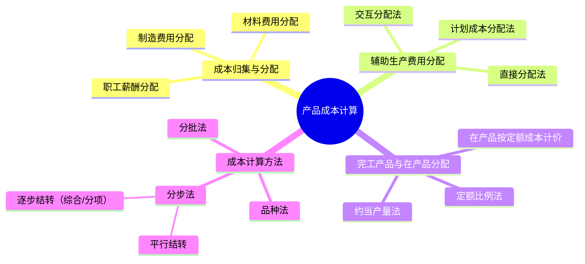

## 1. 章节定位

| 项目 | 信息 |
|------|------|
| 所属科目 | 财务成本管理 |
| 难度等级 | 4 |
| 历年分值 | 6-8分 |
| 建议学时 | 6-8h |

## 2. 考情分析

产品成本计算是成本管理会计部分的核心章节，题型以计算综合题为主。核心考点包括：要素费用的归集与分配、辅助生产费用的三种分配方法（直接分配法、交互分配法、计划成本分配法）、完工产品与在产品之间的成本分配（约当产量法、定额比例法）、三种基本成本计算方法（品种法、分批法、分步法）的特点与适用条件、逐步结转分步法与平行结转分步法的比较。

近年趋势重点考查分步法下的成本还原、约当产量法的计算、辅助生产费用交互分配法。考生须熟练掌握各种分配方法的计算步骤和会计处理逻辑。

**命题规律**：
1. 约当产量法的计算几乎每年必考，尤其注意材料一次投入与陆续投入的区别；
2. 辅助生产费用交互分配法是计算题高频考点，需掌握两步分配流程；
3. 逐步结转分步法下的成本还原是难点，常出综合大题；
4. 三种成本计算方法的特点与适用条件是客观题常考点；
5. 逐步结转与平行结转的比较是客观题高频考点。

**学习提示**：本章核心是"归集-分配-计算"三步走。先归集各项要素费用，再分配辅助生产费用，最后在完工产品与在产品之间分配。重点掌握约当产量法（注意材料与加工费用的完工程度差异）、交互分配法（两步走）、成本还原（将综合半成品项目还原为原始成本项目）。建议通过完整例题理解各方法的计算链条。

**与其他章节的关联**：本章向下连接第十四章（标准成本法在标准成本基础上进行差异分析）、第十五章（本量利分析中的变动成本法与完全成本法区别源于成本计算口径）。

## 3. 知识框架

## 4. 核心精讲

### 一、产品成本的归集和分配

#### （一）生产费用的分类

- **直接材料**：构成产品实体的原料、主要材料；
- **直接人工**：直接从事产品生产工人的薪酬；
- **制造费用**：生产车间为组织和管理生产发生的间接费用（机物料消耗、车间管理人员薪酬、折旧等）；
- **燃料和动力**：生产用燃料、电力等（可单列或并入制造费用）。

#### （二）要素费用的归集和分配

**1. 材料费用分配**

直接用于某产品的材料直接计入该产品成本；几种产品共同耗用的材料按一定标准分配。

按定额消耗量比例分配：

$$\text{分配率} = \frac{\text{材料实际成本}}{\sum (\text{各产品产量} \times \text{单位消耗定额})}$$

某产品应分配材料 $= \text{该产品定额消耗量} \times \text{分配率}$

**2. 职工薪酬分配**

按生产工时比例分配：

$$\text{分配率} = \frac{\text{生产工人工资总额}}{\sum \text{各产品实用工时}}$$

某产品应分配工资 $= \text{该产品实用工时} \times \text{分配率}$

**3. 制造费用分配**

按生产工时比例、机器工时比例、直接工资比例等分配：

$$\text{制造费用分配率} = \frac{\text{制造费用总额}}{\sum \text{各产品分配标准（工时等）}}$$

### 二、辅助生产费用的归集和分配

辅助生产车间为基本生产车间提供服务，其费用最终分配计入产品成本。三种分配方法：

#### （一）直接分配法

不考虑辅助生产车间之间相互提供劳务的情况，直接将辅助生产费用分配给辅助生产以外的各受益对象。

$$\text{分配率} = \frac{\text{辅助生产费用总额}}{\text{对外（辅助生产以外）提供劳务总量}}$$

**优点**：计算简便。
**缺点**：未考虑辅助车间相互服务，分配不准确。

#### （二）交互分配法

分两步：
1. **交互分配**：辅助车间之间按交互分配率分配；
2. **对外分配**：将交互分配后的费用对外分配。

**交互分配率** $= \text{辅助生产费用} / \text{提供劳务总量}$

**对外分配率** $= (\text{原费用} + \text{交互分配转入} - \text{交互分配转出}) / \text{对外提供劳务量}$

**优点**：分配准确。
**缺点**：计算复杂。

#### （三）计划成本分配法

按计划单位成本分配辅助生产费用，实际成本与计划成本的差额计入管理费用。

**优点**：便于考核成本计划执行情况，简化核算。
**缺点**：计划成本偏离实际时影响准确性。

**三种辅助生产费用分配方法比较**：

| 方法 | 是否考虑交互服务 | 分配步骤 | 准确性 | 计算量 |
|------|----------------|---------|--------|--------|
| 直接分配法 | 不考虑 | 一步直接对外分配 | 低 | 小 |
| 交互分配法 | 考虑 | 两步（先交互，再对外） | 高 | 大 |
| 计划成本分配法 | 考虑（按计划价） | 按计划价分配，差额入管理费 | 中（取决于计划准确性） | 中 |

**选择建议**：
- 辅助车间相互服务少：用直接分配法；
- 辅助车间相互服务多：用交互分配法；
- 有完善计划成本体系：用计划成本分配法。

### 三、完工产品与在产品的成本分配

月初在产品成本 + 本月生产费用 = 本月完工产品成本 + 月末在产品成本

分配方法：

#### （一）不计算在产品成本法

月末在产品数量很少，忽略不计，全部费用由完工产品负担。

#### （二）在产品按年初固定成本计价法

在产品数量稳定，按年初固定成本计价。年末需调整。

#### （三）在产品按所耗直接材料成本计价法

在产品只负担直接材料成本，其他费用由完工产品负担。适用于材料费用占比大的企业。

#### （四）约当产量法（重点）

将月末在产品按完工程度折算为相当于完工产品的数量（约当产量），再按比例分配费用。

$$\text{约当产量} = \text{在产品数量} \times \text{完工程度}$$

**分配率** $= \frac{\text{某项费用总额}}{\text{完工产品数量} + \text{在产品约当产量}}$

- **完工产品分配额** $= \text{完工产品数量} \times \text{分配率}$
- **月末在产品分配额** $= \text{约当产量} \times \text{分配率}$

**注意分配的层次**（关键考点）：

| 费用项目 | 材料一次投入 | 材料陆续投入 |
|---------|------------|------------|
| 直接材料 | 在产品完工程度 = 100%（按数量分配） | 按材料投入程度计算 |
| 直接人工 | 按加工程度（通常50%） | 按加工程度（通常50%） |
| 制造费用 | 按加工程度（通常50%） | 按加工程度（通常50%） |

**完工程度的确定方法**：
- **50% 假设**：若在产品均匀加工，完工程度通常取50%；
- **按工时计算**：$\text{完工程度} = \frac{\text{已完成工时}}{\text{总工时}} \times 100\%$；
- **按工序计算**：各工序在产品完工程度 $= \frac{\text{前面工序累计工时} + \text{本工序工时} \times 50\%}{\text{总工时}}$（本工序按50%因在产品均匀分布）。

**约当产量法的计算步骤**：
1. 确定各费用项目的完工程度（材料与加工费用可能不同）；
2. 计算在产品约当产量 $= 在产品数量 \times 完工程度$；
3. 计算分配率 $= 费用总额 / (完工产品数量 + 约当产量)$；
4. 分配：完工产品 $= 完工数量 \times 分配率$，在产品 $= 约当产量 \times 分配率$。

#### （五）定额比例法

按完工产品与在产品的定额比例分配费用。

**材料分配率** $= \frac{\text{材料费用总额}}{\text{完工产品材料定额} + \text{在产品材料定额}}$

#### （六）在产品按定额成本计价法

月末在产品按定额成本计算，全部实际费用脱离定额的差异由完工产品负担。

### 四、产品成本计算的基本方法

#### （一）品种法

**特点**：以产品品种为成本计算对象。

**适用**：大量大批单步骤生产，或管理上不要求分步骤计算成本的多步骤生产（如发电、采掘）。

**要点**：
- 成本计算对象为产品品种；
- 成本计算期定期按月进行（与会计期间一致）；
- 月末一般有在产品，需在完工产品与在产品之间分配费用。

#### （二）分批法

**特点**：以产品批别为成本计算对象。

**适用**：单件小批生产（如造船、重型机械、专用设备）。

**要点**：
- 成本计算对象为产品批别（订单）；
- 成本计算期不定期，与生产周期一致；
- 一般不需在完工产品与在产品之间分配费用（一批要么全完工要么全未完工）。

**简化的分批法**（不分批计算在产品成本法）：日常只归集直接费用，间接费用月末按累计分配率分配。

#### （三）分步法

**特点**：以产品生产步骤为成本计算对象。

**适用**：大量大批多步骤生产（如纺织、冶金、机械制造）。

**要点**：
- 成本计算对象为各步骤半成品和最终产成品；
- 成本计算期定期按月进行；
- 月末需在完工产品与在产品之间分配费用。

分步法分为两种：

**1. 逐步结转分步法**（计算半成品成本）

按加工顺序逐步计算各步骤半成品成本，并随实物转移结转。

- **综合结转**：上一步骤半成品成本以"半成品"项目综合转入下一步骤；
- **分项结转**：上一步骤半成品成本按原始成本项目（直接材料、直接人工、制造费用）分别转入。

**成本还原**（综合结转法下）：

将产成品中"半成品"项目按上一步骤半成品成本结构还原为原始成本项目。

$$\text{还原分配率} = \frac{\text{产成品所耗半成品成本}}{\text{上步骤完工半成品成本}}$$

**成本还原的步骤**：
1. 计算还原分配率 $= 产成品中"半成品"项目金额 / 上步骤完工半成品总成本$；
2. 将上步骤半成品的各成本项目（材料、人工、制造费用）乘以还原分配率，得到还原后的各项目金额；
3. 若有多步骤，从最后一步逐步向前还原，直到第一步骤；
4. 将还原后的各成本项目加总，得到产成品的原始成本结构。

**成本还原的目的**：综合结转法下，产成品成本中"半成品"是一个综合项目，无法反映原始的材料、人工、制造费用构成。成本还原将"半成品"拆解为原始成本项目，便于成本分析和控制。

**成本还原示例**：
- 产成品成本中"半成品"项目 = 8000元
- 上步骤完工半成品成本结构：材料5000元、人工2000元、制造费用1000元（合计8000元）
- 还原分配率 = 8000 / 8000 = 1
- 还原后：材料5000元、人工2000元、制造费用1000元
- 将这些金额与产成品本步骤发生的费用相加，得到最终成本结构

**2. 平行结转分步法**（不计算半成品成本）

各步骤只归集本步骤发生的费用，不结转半成品成本。月末将各步骤应计入产成品成本的份额平行汇总。

**特点**：
- 各步骤不计算半成品成本，不结转半成品成本；
- 各步骤费用在产成品与广义在产品（含本步骤完工但未最终完工的半成品）之间分配；
- 半成品成本不随实物结转。

#### （四）逐步结转 vs 平行结转 比较

| 项目 | 逐步结转分步法 | 平行结转分步法 |
|------|---------------|---------------|
| 半成品成本 | 计算 | 不计算 |
| 半成品成本结转 | 随实物转移结转 | 不结转 |
| 在产品含义 | 狭义在产品（本步骤在制） | 广义在产品（本步骤及后续步骤在制） |
| 成本还原 | 综合结转需还原 | 不需还原 |
| 适用 | 需要半成品成本信息 | 不需要半成品成本信息 |

## 5. 典型例题

**【例题 1】（计算题·约当产量法）**

某产品月初在产品成本：直接材料 5000 元，直接人工 2000 元，制造费用 1000 元。本月发生：直接材料 25000 元，直接人工 13000 元，制造费用 7000 元。本月完工 200 件，月末在产品 100 件，完工程度 50%。材料在生产开始时一次投入。

要求：用约当产量法计算完工产品和月末在产品成本。

**答案**：

(1) 直接材料分配（材料一次投入，在产品按100%计算）：
- 在产品约当产量 $= 100 \times 100\% = 100$（件）
- 分配率 $= (5000 + 25000) / (200 + 100) = 30000 / 300 = 100$（元/件）
- 完工产品材料 $= 200 \times 100 = 20000$（元）
- 在产品材料 $= 100 \times 100 = 10000$（元）

(2) 直接人工分配（按完工程度）：
- 在产品约当产量 $= 100 \times 50\% = 50$（件）
- 分配率 $= (2000 + 13000) / (200 + 50) = 15000 / 250 = 60$（元/件）
- 完工产品人工 $= 200 \times 60 = 12000$（元）
- 在产品人工 $= 50 \times 60 = 3000$（元）

(3) 制造费用分配（同人工）：
- 分配率 $= (1000 + 7000) / (200 + 50) = 8000 / 250 = 32$（元/件）
- 完工产品制造费用 $= 200 \times 32 = 6400$（元）
- 在产品制造费用 $= 50 \times 32 = 1600$（元）

(4) 汇总：
- 完工产品成本 $= 20000 + 12000 + 6400 = 38400$（元）
- 月末在产品成本 $= 10000 + 3000 + 1600 = 14600$（元）

**解析**：约当产量法关键在于确定完工程度。材料一次投入按100%，人工和制造费用按完工程度。

---

**【例题 2】（计算题·辅助生产费用交互分配法）**

某企业有供电、供水两个辅助车间。供电车间发生费用 12000 元，供水车间发生费用 4000 元。供电车间供电 30000 度，其中供水车间耗用 5000 度；供水车间供水 2000 吨，其中供电车间耗用 200 吨。基本生产车间耗电 20000 度、耗水 1500 吨；行政管理部门耗电 5000 度、耗水 300 吨。

要求：用交互分配法分配辅助生产费用。

**答案**：

(1) 交互分配：
- 供电交互分配率 $= 12000 / 30000 = 0.4$（元/度）
- 供水交互分配率 $= 4000 / 2000 = 2$（元/吨）
- 供电车间分配给供水车间 $= 5000 \times 0.4 = 2000$（元）
- 供水车间分配给供电车间 $= 200 \times 2 = 400$（元）

(2) 交互分配后费用：
- 供电车间 $= 12000 + 400 - 2000 = 10400$（元）
- 供水车间 $= 4000 + 2000 - 400 = 5600$（元）

(3) 对外分配：
- 供电对外分配率 $= 10400 / (30000 - 5000) = 10400 / 25000 = 0.416$（元/度）
- 供水对外分配率 $= 5600 / (2000 - 200) = 5600 / 1800 = 3.111$（元/吨）

(4) 对外分配额：
- 基本生产车间：
  - 电 $= 20000 \times 0.416 = 8320$（元）
  - 水 $= 1500 \times 3.111 = 4667$（元）
- 行政管理部门：
  - 电 $= 5000 \times 0.416 = 2080$（元）
  - 水 $= 300 \times 3.111 = 933$（元）

**解析**：交互分配法先在辅助车间内部按原费用率分配，再按调整后费用率对外分配。

---

**【例题 3】（概念题）**

下列关于平行结转分步法的说法中，正确的是？

A. 需要计算各步骤半成品成本
B. 半成品成本随实物转移结转
C. 各步骤费用在产成品与广义在产品之间分配
D. 需要进行成本还原

**答案**：C

**解析**：平行结转分步法不计算半成品成本（A错），不结转半成品成本（B错），不需成本还原（D错）；在产品是广义在产品（C正确）。

---

**【例题 4】（计算题·成本还原）**

某企业生产甲产品经过两个步骤。第二步骤产成品成本资料如下：半成品项目 18000 元，直接材料 2000 元，直接人工 3000 元，制造费用 2000 元，合计 25000 元。第一步骤完工半成品成本结构：直接材料 10000 元，直接人工 4000 元，制造费用 2000 元，合计 16000 元。

要求：对产成品成本进行成本还原。

**答案**：

(1) 还原分配率 $= 18000 / 16000 = 1.125$

(2) 还原后半成品各项目：
- 直接材料 $= 10000 \times 1.125 = 11250$（元）
- 直接人工 $= 4000 \times 1.125 = 4500$（元）
- 制造费用 $= 2000 \times 1.125 = 2250$（元）

(3) 还原后产成品成本结构：
- 直接材料 $= 11250 + 2000 = 13250$（元）
- 直接人工 $= 4500 + 3000 = 7500$（元）
- 制造费用 $= 2250 + 2000 = 4250$（元）
- 合计 $= 13250 + 7500 + 4250 = 25000$（元）

**解析**：成本还原将"半成品"综合项目按上步骤半成品成本结构拆解为原始成本项目，再加回本步骤发生的费用，得到最终按原始项目反映的成本。

---

**【例题 5】（计算题·辅助生产费用直接分配法）**

沿用例2数据，用直接分配法分配辅助生产费用。

**答案**：

直接分配法不考虑辅助车间相互服务，直接对外分配：

(1) 供电对外分配率 $= 12000 / (30000 - 5000) = 12000 / 25000 = 0.48$（元/度）

(2) 供水对外分配率 $= 4000 / (2000 - 200) = 4000 / 1800 = 2.222$（元/吨）

(3) 对外分配额：
- 基本生产车间：
  - 电 $= 20000 \times 0.48 = 9600$（元）
  - 水 $= 1500 \times 2.222 = 3333$（元）
- 行政管理部门：
  - 电 $= 5000 \times 0.48 = 2400$（元）
  - 水 $= 300 \times 2.222 = 667$（元）

**对比**：直接分配法计算简便，但未考虑供电与供水车间的相互服务，结果不如交互分配法准确。

---

**【例题 6】（计算题·约当产量法·材料陆续投入）**

某产品经两道工序加工，材料在各工序开始时一次投入。第一工序材料定额 60%，第二工序材料定额 40%。月初在产品成本：直接材料 4000 元，加工费 2000 元。本月发生：直接材料 16000 元，加工费 18000 元。本月完工 300 件，月末在产品：第一工序 100 件，第二工序 50 件。加工费完工程度均为50%。

要求：用约当产量法计算完工产品和在产品成本。

**答案**：

(1) 材料分配（材料在各工序开始时投入，按工序完工程度）：
- 第一工序在产品材料完工程度 $= 60\%$（第一工序材料已投入）
- 第二工序在产品材料完工程度 $= 100\%$（第一、二工序材料均已投入）
- 在产品材料约当产量 $= 100 \times 60\% + 50 \times 100\% = 60 + 50 = 110$（件）
- 材料分配率 $= (4000 + 16000) / (300 + 110) = 20000 / 410 = 48.78$（元/件）
- 完工产品材料 $= 300 \times 48.78 = 14634$（元）
- 在产品材料 $= 110 \times 48.78 = 5366$（元）

(2) 加工费分配（按50%完工程度）：
- 在产品加工费约当产量 $= (100 + 50) \times 50\% = 75$（件）
- 加工费分配率 $= (2000 + 18000) / (300 + 75) = 20000 / 375 = 53.33$（元/件）
- 完工产品加工费 $= 300 \times 53.33 = 16000$（元）
- 在产品加工费 $= 75 \times 53.33 = 4000$（元）

(3) 汇总：
- 完工产品成本 $= 14634 + 16000 = 30634$（元）
- 月末在产品成本 $= 5366 + 4000 = 9366$（元）

**解析**：材料陆续投入时，需按各工序材料投入程度计算约当产量，与加工费的完工程度（50%）不同。

---

**【例题 7】（概念题·三种方法适用条件）**

判断下列生产类型最适合用哪种成本计算方法：

A. 发电厂
B. 造船厂
C. 纺织厂
D. 专用设备定制

**答案**：

| 企业 | 最适合方法 | 原因 |
|------|-----------|------|
| A. 发电厂 | 品种法 | 大量大步单步骤生产，产品单一 |
| B. 造船厂 | 分批法 | 单件小批生产，按订单生产 |
| C. 纺织厂 | 分步法 | 大量大步多步骤生产，需分步骤计算 |
| D. 专用设备定制 | 分批法 | 单件小批，按订单生产 |

**解析**：品种法适用大量大批单步骤；分批法适用单件小批；分步法适用大量大批多步骤。

---

**【例题 8】（综合·平行结转分步法）**

某企业生产甲产品经过两个生产步骤。第一步骤本月发生费用：直接材料 30000 元，直接人工 10000 元，制造费用 10000 元。第二步骤本月发生费用：直接人工 8000 元，制造费用 6000 元。本月完工产成品 200 件。第一步骤广义在产品约当产量：材料40件，加工费20件。第二步骤在产品约当产量：加工费10件（第二步骤不投料）。

要求：用平行结转分步法计算产成品成本。

**答案**：

第一步骤（广义在产品）：
- 材料分配率 $= 30000 / (200 + 40) = 125$（元/件）
- 加工费分配率 $= (10000 + 10000) / (200 + 20) = 20000 / 220 = 90.91$（元/件）
- 计入产成品份额 $= 200 \times (125 + 90.91) = 200 \times 215.91 = 43182$（元）

第二步骤：
- 加工费分配率 $= (8000 + 6000) / (200 + 10) = 14000 / 210 = 66.67$（元/件）
- 计入产成品份额 $= 200 \times 66.67 = 13333$（元）

产成品总成本 $= 43182 + 13333 = 56515$（元）

**解析**：平行结转分步法各步骤只归集本步骤费用，按产成品数量计算各步骤应计入份额，平行汇总。第一步骤用广义在产品（含第二步骤在产品），第二步骤只算本步骤加工费。

## 6. 记忆口诀

**约当产量法**：
> 材料一次投，在产品100%算；
> 人工制造按完工程度，约当产量 = 数量 × 完工程度。
> 材料陆续投，按各工序投入程度算；
> 加工费按50%（均匀加工假设）。

**辅助费用三方法**：
> 直接分配最简单，无视相互服务；
> 交互分配两步走，先内后外最准确；
> 计划分配按计划，差额计入管理费用。

**交互分配法两步口诀**：
> 第一步：交互分配率 = 原费用 / 总劳务量；
> 互分配后费用 = 原费用 + 转入 - 转出；
> 第二步：对外分配率 = 调整后费用 / 对外劳务量。

**三种成本计算方法**：
> 品种法：大量大批单步骤，按月计算；
> 分批法：单件小批按订单，完工才算；
> 分步法：大量大批多步骤，分步汇总。

**逐步结转 vs 平行结转**：
> 逐步算半成品，实物跟着走，综合要还原；
> 平行不算半成品，各步各分配，广义在产品。

**成本还原口诀**：
> 还原分配率 = 产成品半成品成本 / 上步骤半成品总成本；
> 上步骤各项目 × 分配率 = 还原后金额；
> 多步骤逐步向前还原，直到第一步骤。

**完工程度确定口诀**：
> 均匀加工取50%；
> 按工时算 = 已完工时 / 总工时；
> 按工序算 = 前序累计 + 本序×50% / 总工时。

**广义 vs 狭义在产品**：
> 逐步结转用狭义（本步骤在制）；
> 平行结转用广义（本步骤及后续步骤在制）。

## 7. 同步练习

**1.（单选题）** 下列成本计算方法中，适用于单件小批生产的是（　）。

A. 品种法
B. 分批法
C. 逐步结转分步法
D. 平行结转分步法

**2.（单选题）** 某产品月初在产品和本月发生的直接材料费用合计 60000 元，材料在生产开始时一次投入。本月完工 400 件，月末在产品 200 件。则月末在产品材料成本为（　）元。

A. 10000
B. 20000
C. 30000
D. 40000

**3.（计算题）** 某产品本月完工 500 件，月末在产品 200 件，完工程度 40%。月初在产品和本月发生直接人工合计 29000 元。用约当产量法计算完工产品和在产品应负担的直接人工。

**4.（单选题）** 在平行结转分步法下，某步骤的在产品是指（　）。

A. 本步骤正在加工的在产品
B. 本步骤完工但未最终完工的半成品
C. 本步骤及后续步骤的所有在产品（广义在产品）
D. 全部在产品

**5.（多选题）** 下列关于辅助生产费用分配方法的说法中，正确的有（　）。

A. 直接分配法不考虑辅助车间相互提供劳务
B. 交互分配法先在辅助车间内部交互分配，再对外分配
C. 计划成本分配法的差额计入管理费用
D. 交互分配法计算结果比直接分配法更准确

**6.（单选题）** 在逐步结转分步法下，综合结转法需要进行成本还原，原因是（　）。

A. 半成品成本未随实物转移
B. 产成品中"半成品"项目无法反映原始成本构成
C. 各步骤费用未在完工产品与在产品之间分配
D. 半成品成本计算不准确

**7.（计算题）** 某企业有供电、机修两个辅助车间。供电车间费用 8000 元，供电 20000 度，其中机修车间耗用 4000 度；机修车间费用 6000 元，提供修理工时 3000 小时，其中供电车间耗用 500 小时。基本生产车间耗电 12000 度、耗修理工时 2000 小时；管理部门耗电 4000 度、耗修理工时 500 小时。用交互分配法分配辅助生产费用。

**8.（单选题）** 某产品材料在生产开始时一次投入，月初在产品和本月发生直接材料合计 40000 元，本月完工 300 件，月末在产品 100 件。则完工产品材料成本为（　）元。

A. 10000
B. 20000
C. 30000
D. 40000

**9.（计算题）** 某产成品成本中"半成品"项目 12000 元，本步骤直接材料 2000 元、直接人工 3000 元、制造费用 1000 元。上步骤完工半成品成本：直接材料 8000 元、直接人工 4000 元、制造费用 2000 元（合计14000元）。进行成本还原，计算还原后产成品各成本项目。

**10.（多选题）** 下列关于逐步结转分步法和平行结转分步法的说法中，正确的有（　）。

A. 逐步结转法需要计算半成品成本，平行结转法不需要
B. 逐步结转法的在产品是狭义在产品，平行结转法是广义在产品
C. 两种方法都需要进行成本还原
D. 逐步结转法下半成品成本随实物转移结转

---

**练习答案**：1.B　2.B（$60000 \times 200/(400+200) = 20000$）　3. 约当产量 $= 200 \times 40\% = 80$件；分配率 $= 29000 / (500+80) = 50$元/件；完工产品 $= 500 \times 50 = 25000$元；在产品 $= 80 \times 50 = 4000$元　4.C　5.ABCD　6.B（综合结转下"半成品"是综合项目，需还原为原始成本项目）　7. 交互分配：电分配率$=8000/20000=0.4$元/度，修分配率$=6000/3000=2$元/小时；供电分给机修$=4000\times0.4=1600$元，机修分给供电$=500\times2=1000$元；调整后：供电$=8000+1000-1600=7400$元，机修$=6000+1600-1000=6600$元；对外分配：电$=7400/16000=0.4625$元/度，修$=6600/2500=2.64$元/小时；基本车间：电$=12000\times0.4625=5550$元，修$=2000\times2.64=5280$元；管理：电$=4000\times0.4625=1850$元，修$=500\times2.64=1320$元　8.C（材料一次投入，$40000\times300/(300+100)=30000$）　9. 还原分配率$=12000/14000=0.857$；还原后：材料$=8000\times0.857=6857$元，人工$=4000\times0.857=3429$元，制造$=2000\times0.857=1714$元；最终：材料$=6857+2000=8857$元，人工$=3429+3000=6429$元，制造$=1714+1000=2714$元　10.ABD（平行结转法不需成本还原，C错）
