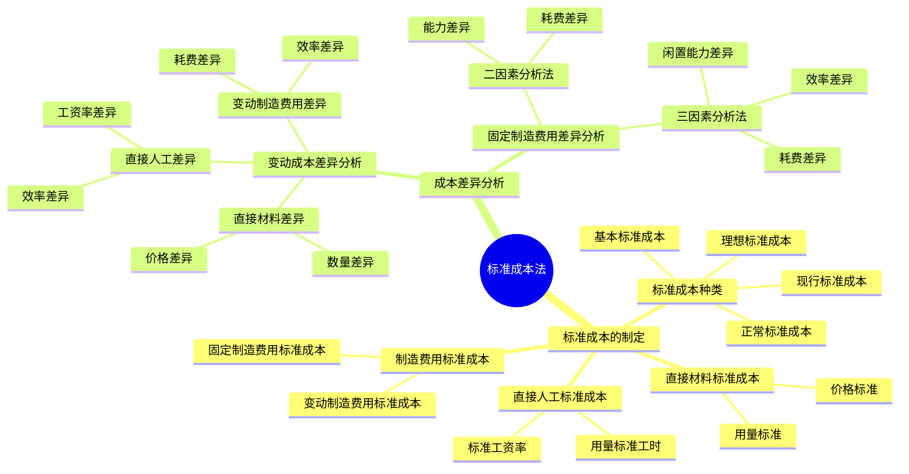

## 1. 章节定位

| 项目 | 信息 |
|------|------|
| 所属科目 | 财务成本管理 |
| 难度等级 | 3 |
| 历年分值 | 3-4分 |
| 建议学时 | 4-5h |

## 2. 考情分析

标准成本法是成本管理的重要方法，核心在于标准成本的制定与成本差异的分析。本章题型以计算分析题为主，客观题也会涉及标准成本种类的辨析。重点考点包括：理想标准成本与正常标准成本的区分、现行标准成本与基本标准成本的区分、直接材料/直接人工/变动制造费用的差异分析（价格差异与数量差异）、固定制造费用的二因素分析法与三因素分析法。

近年趋势强调差异分析的综合应用，尤其固定制造费用三因素分析法是高频考点，考生必须熟练掌握各项差异的计算公式、责任归属及差异间的勾稽关系。

## 3. 知识框架

## 4. 核心精讲

### 一、标准成本的概念与种类

#### （一）标准成本的概念

标准成本是通过精确的调查、分析与技术测定而制定的，用来评价实际成本、衡量工作效率的一种**目标成本**。在标准成本中，基本上排除了不应该发生的"浪费"，因此被认为是一种"应该成本"。

"标准成本"一词在实际工作中有两种含义：
- **单位产品的标准成本**（准确地说应称为"成本标准"）：

$$\text{成本标准} = \text{单位产品标准消耗量} \times \text{标准单价}$$

- **实际产量的标准成本总额**：

$$\text{标准成本（总额）} = \text{实际产量} \times \text{单位产品标准成本}$$

实施标准成本法一般有以下几个步骤：(1) 制定单位产品标准成本；(2) 根据实际产量和成本标准计算产品的标准成本；(3) 汇总计算实际成本；(4) 计算标准成本与实际成本的差异；(5) 分析成本差异发生的原因；(6) 向成本负责人提供成本控制报告。

#### （二）标准成本的种类

**1. 按制定所依据的生产技术和经营管理水平分**

| 类型 | 含义 | 特点 |
|------|------|------|
| 理想标准成本 | 在最优的生产条件下，利用现有的规模和设备能够达到的最低成本 | 理论业绩标准、理想价格、最高生产能力利用水平；要求太高，不宜作为考核依据 |
| 正常标准成本 | 在效率良好的条件下，根据下期一般应该发生的生产要素消耗量、预计价格和预计生产经营能力利用程度制定出来的标准成本 | 包含一般难以避免的损耗和低效率；大于理想标准成本，小于历史平均水平；具有客观性、现实性、激励性、稳定性 |

在标准成本系统中，广泛使用**正常标准成本**。

**2. 按适用期分**

| 类型 | 含义 | 用途 |
|------|------|------|
| 现行标准成本 | 根据其适用期间应该发生的价格、效率和生产经营能力利用程度等预计的标准成本 | 可成为评价实际成本的依据，也可用来对存货和销货成本计价；决定因素变化时需修订 |
| 基本标准成本 | 一经制定，只要生产的基本条件无重大变化，就不予变动的标准成本 | 与各期实际成本对比，可反映成本变动的趋势；不宜用来直接评价工作效率和成本控制的有效性 |

**生产的基本条件的重大变化**是指：产品的物理结构变化、重要原材料和劳动力价格的重要变化、生产技术和工艺的根本变化。而市场供求变化导致的售价变化、生产经营能力利用程度的变化、工作方法改变引起的效率变化等，**不属于**生产的基本条件变化，不需要修订基本标准成本。

### 二、标准成本的制定

制定标准成本，通常首先确定直接材料和直接人工的标准成本，其次确定制造费用的标准成本，最后汇总确定单位产品的标准成本。

制定一个成本项目的标准成本，一般需要分别确定其**用量标准**和**价格标准**，两者相乘后得出该成本项目的单位产品标准成本：

$$\text{单位产品标准成本} = \text{用量标准} \times \text{价格标准}$$

- **用量标准**：包括单位产品材料消耗量、单位产品直接人工工时等，主要由生产技术部门主持制定；
- **价格标准**：包括标准的原材料单价、小时工资率、小时制造费用分配率等，由会计部门和有关其他部门共同研究确定。

#### （一）直接材料标准成本

- **用量标准**：现有技术条件生产单位产品所需的材料数量，包括必不可少的消耗以及各种难以避免的损耗。一般采用统计方法、工业工程法或其他技术分析方法确定。
- **价格标准**：预计下一年度需要支付的进料单位成本，包括发票价格、运费、检验和正常损耗等成本，是取得材料的**完全成本**。

$$\text{直接材料标准成本} = \sum (\text{单位产品某种材料标准消耗量} \times \text{该材料标准单价})$$

#### （二）直接人工标准成本

- **用量标准**：单位产品的标准工时，包括直接加工操作必不可少的时间、必要的间隙和停工（如工间休息、设备调整准备时间）、不可避免的废品耗用工时等。
- **价格标准**：标准工资率。计件工资制下是预定的每件产品支付的工资除以标准工时，或者是预定的小时工资；月工资制下需根据月工资总额和可用工时总量计算。

$$\text{直接人工标准成本} = \text{单位产品标准工时} \times \text{标准工资率}$$

#### （三）制造费用标准成本

制造费用的标准成本按部门分别编制，然后汇总。按变动成本法原理，分为变动制造费用和固定制造费用两部分。

**1. 变动制造费用标准成本**

- **用量标准**：通常采用单位产品直接人工工时标准，也有企业采用机器工时或其他用量标准。
- **价格标准**：单位工时变动制造费用的标准分配率。

$$\text{变动制造费用标准分配率} = \frac{\text{变动制造费用预算总数}}{\text{直接人工标准总工时}}$$

$$\text{单位产品变动制造费用标准成本} = \text{单位产品直接人工标准工时} \times \text{变动制造费用标准分配率}$$

**2. 固定制造费用标准成本**

如果企业采用变动成本计算，固定制造费用不计入产品成本，不需要制定其标准成本。如果采用完全成本计算，固定制造费用要计入产品成本，需要确定其标准成本。

- **用量标准**：与变动制造费用的用量标准相同，并且两者要保持一致，以便进行差异分析。
- **价格标准**：单位工时的标准分配率。

$$\text{固定制造费用标准分配率} = \frac{\text{固定制造费用预算总数}}{\text{直接人工标准总工时}}$$

$$\text{单位产品固定制造费用标准成本} = \text{单位产品直接人工标准工时} \times \text{固定制造费用标准分配率}$$

### 三、变动成本差异的分析

直接材料、直接人工和变动制造费用都属于变动成本，其成本差异分析的基本方法相同。由于实际成本的高低取决于实际用量和实际价格，标准成本的高低取决于标准用量和标准价格，所以成本差异可以归结为**价格差异**与**数量差异**两类：

$$\text{成本差异} = \text{实际数量} \times \text{实际价格} - \text{标准数量} \times \text{标准价格}$$

$$= \text{实际数量} \times (\text{实际价格} - \text{标准价格}) + (\text{实际数量} - \text{标准数量}) \times \text{标准价格}$$

$$= \text{价格差异} + \text{数量差异}$$

> **说明**：成本差异计算结果为正数表示超支（不利差异，用 U 表示）；为负数表示节约（有利差异，用 F 表示）。价格差异与数量差异之和应等于成本总差异，可据此验算。

#### （一）直接材料差异分析

$$\text{直接材料价格差异} = \text{实际数量} \times (\text{实际价格} - \text{标准价格})$$

$$\text{直接材料数量差异} = (\text{实际数量} - \text{标准数量}) \times \text{标准价格}$$

$$\text{直接材料成本差异} = \text{实际成本} - \text{标准成本} = \text{价格差异} + \text{数量差异}$$

**责任归属**：
- **价格差异**：在材料采购过程中形成，应由**采购部门**负责（原因包括供应厂家调整售价、未能及时进货造成紧急采购、运输方式不当等）。
- **数量差异**：在材料耗用过程中形成，通常反映**生产部门**的成本控制业绩（原因包括工人操作疏忽造成废品废料增加、新工人上岗用料多、机器工具不适等）；但有时也可能是采购材料质量低劣导致用量超标，此时属采购部门责任。

#### （二）直接人工差异分析

$$\text{直接人工工资率差异} = \text{实际工时} \times (\text{实际工资率} - \text{标准工资率})$$

$$\text{直接人工效率差异} = (\text{实际工时} - \text{标准工时}) \times \text{标准工资率}$$

$$\text{直接人工成本差异} = \text{实际直接人工成本} - \text{标准直接人工成本} = \text{工资率差异} + \text{效率差异}$$

**责任归属**：
- **工资率差异**：主要由**人力资源部门**管控（原因包括工人升级或降级使用、奖励制度未产生实效、工资率调整、加班或使用临时工、出勤率变化等）。
- **效率差异**：主要属于**生产部门**的责任（原因包括工作环境不良、工人经验不足、新工人上岗多、机器工具选用不当、设备故障、生产计划安排不当等）；但材料质量不高也会影响生产效率。

#### （三）变动制造费用差异分析

$$\text{变动制造费用耗费差异} = \text{实际工时} \times (\text{变动制造费用实际分配率} - \text{变动制造费用标准分配率})$$

$$\text{变动制造费用效率差异} = (\text{实际工时} - \text{标准工时}) \times \text{变动制造费用标准分配率}$$

$$\text{变动制造费用成本差异} = \text{实际变动制造费用} - \text{标准变动制造费用} = \text{耗费差异} + \text{效率差异}$$

**责任归属**：
- **耗费差异**：是实际支出与按实际工时和标准费率计算的预算数（弹性预算）之间的差额，反映耗费水平脱离标准，是**部门经理**的责任。
- **效率差异**：由于实际工时脱离标准工时导致，其形成原因与人工效率差异相似。

### 四、固定制造费用差异分析

固定制造费用的差异分析与各项变动成本差异分析不同，其分析方法有**二因素分析法**和**三因素分析法**两种。

#### （一）二因素分析法

二因素分析法将固定制造费用差异分为**耗费差异**和**生产能力利用差异**（简称能力差异）两部分。

$$\text{固定制造费用耗费差异} = \text{固定制造费用实际数} - \text{固定制造费用预算数}$$

$$\text{固定制造费用能力差异} = \text{固定制造费用预算数} - \text{固定制造费用标准成本}$$

$$= (\text{生产能力} - \text{实际产量标准工时}) \times \text{固定制造费用标准分配率}$$

$$\text{固定制造费用成本差异} = \text{实际固定制造费用} - \text{标准固定制造费用} = \text{耗费差异} + \text{能力差异}$$

**说明**：固定费用与变动费用不同，不因业务量而变，故差异分析有别于变动费用。耗费差异以原来的预算数作为标准，实际数超过预算数即视为耗费过多；能力差异反映实际产量标准工时未能达到生产能力而造成的损失。

#### （二）三因素分析法

三因素分析法将固定制造费用成本差异分为**耗费差异**、**效率差异**和**闲置能力差异**三部分。耗费差异的计算与二因素分析法相同，不同的是将二因素分析法中的"能力差异"进一步分为两部分：一部分是实际工时未达生产能力而形成的**闲置能力差异**，另一部分是实际工时脱离标准工时而形成的**效率差异**。

$$\text{固定制造费用闲置能力差异} = (\text{生产能力} - \text{实际工时}) \times \text{固定制造费用标准分配率}$$

$$\text{固定制造费用效率差异} = (\text{实际工时} - \text{实际产量标准工时}) \times \text{固定制造费用标准分配率}$$

$$\text{固定制造费用成本差异} = \text{耗费差异} + \text{闲置能力差异} + \text{效率差异}$$

**关键勾稽关系**：三因素分析法中的闲置能力差异与效率差异之和，等于二因素分析法中的"能力差异"。

### 五、差异分析公式汇总表

| 成本项目 | 价格差异 | 数量差异 |
|----------|----------|----------|
| 直接材料 | 实际数量×(实际价格−标准价格) | (实际数量−标准数量)×标准价格 |
| 直接人工 | 实际工时×(实际工资率−标准工资率) | (实际工时−标准工时)×标准工资率 |
| 变动制造费用 | 实际工时×(实际分配率−标准分配率)（耗费差异） | (实际工时−标准工时)×标准分配率（效率差异） |

| 固定制造费用 | 二因素分析法 | 三因素分析法 |
|--------------|--------------|--------------|
| 耗费差异 | 实际数−预算数 | 实际数−预算数 |
| 能力差异/闲置能力差异 | (生产能力−实际产量标准工时)×标准分配率 | (生产能力−实际工时)×标准分配率 |
| 效率差异 | — | (实际工时−实际产量标准工时)×标准分配率 |

## 5. 典型例题

**【例题 1】（直接材料差异）**

某企业本月生产产品 400 件，使用材料 2500 千克，材料单价为 0.55 元/千克；单位产品的直接材料标准成本为 3 元，即每件产品耗用 6 千克直接材料，每千克标准价格 0.5 元。

要求：计算直接材料价格差异、数量差异和成本总差异。

**答案**：

- 标准数量 $= 400 \times 6 = 2400$（千克）

- 直接材料价格差异 $= 2500 \times (0.55 - 0.5) = 125$（元）（U）

- 直接材料数量差异 $= (2500 - 2400) \times 0.5 = 50$（元）（U）

- 直接材料成本差异 $= 2500 \times 0.55 - 400 \times 6 \times 0.5 = 1375 - 1200 = 175$（元）（U）

验算：$125 + 50 = 175$（元）（U），计算正确。

**解析**：价格差异由采购部门负责，数量差异通常由生产部门负责。

---

**【例题 2】（直接人工差异）**

某企业本月生产产品 400 件，实际使用工时 890 小时，支付工资 4539 元；直接人工的标准成本是 10 元/件，即每件产品标准工时为 2 小时，标准工资率为 5 元/小时。

要求：计算直接人工工资率差异、效率差异和成本总差异。

**答案**：

- 实际工资率 $= 4539 \div 890 = 5.10$（元/小时）
- 标准工时 $= 400 \times 2 = 800$（小时）

- 直接人工工资率差异 $= 890 \times (5.10 - 5) = 89$（元）（U）

- 直接人工效率差异 $= (890 - 800) \times 5 = 450$（元）（U）

- 直接人工成本差异 $= 4539 - 400 \times 10 = 539$（元）（U）

验算：$89 + 450 = 539$（元）（U），计算正确。

---

**【例题 3】（变动制造费用差异）**

本月实际产量 400 件，使用工时 890 小时，实际发生变动制造费用 1958 元；变动制造费用标准成本为 4 元/件，即每件产品标准工时为 2 小时，标准的变动制造费用分配率为 2 元/小时。

要求：计算变动制造费用耗费差异、效率差异和成本总差异。

**答案**：

- 实际分配率 $= 1958 \div 890 = 2.2$（元/小时）
- 标准工时 $= 400 \times 2 = 800$（小时）

- 变动制造费用耗费差异 $= 890 \times (2.2 - 2) = 178$（元）（U）

- 变动制造费用效率差异 $= (890 - 800) \times 2 = 180$（元）（U）

- 变动制造费用成本差异 $= 1958 - 400 \times 4 = 358$（元）（U）

验算：$178 + 180 = 358$（元）（U），计算正确。

---

**【例题 4】（固定制造费用差异——二因素与三因素分析法）**

本月实际产量 400 件，发生固定制造成本 1424 元，实际工时为 890 小时；企业生产能力为 500 件即 1000 小时；每件产品固定制造费用标准成本为 3 元/件，即每件产品标准工时为 2 小时，标准分配率为 1.5 元/小时。

要求：(1) 用二因素分析法计算固定制造费用各项差异；(2) 用三因素分析法计算固定制造费用各项差异。

**答案**：

固定制造费用预算数 $= 1000 \times 1.5 = 1500$（元）；实际产量标准工时 $= 400 \times 2 = 800$（小时）。

**(1) 二因素分析法**

- 耗费差异 $= 1424 - 1500 = -76$（元）（F）

- 能力差异 $= (1000 - 800) \times 1.5 = 300$（元）（U）

- 成本总差异 $= 1424 - 400 \times 3 = 224$（元）（U）

验算：$-76 + 300 = 224$（元）（U），计算正确。

**(2) 三因素分析法**

- 耗费差异 $= 1424 - 1500 = -76$（元）（F）（与二因素分析法相同）

- 闲置能力差异 $= (1000 - 890) \times 1.5 = 165$（元）（U）

- 效率差异 $= (890 - 800) \times 1.5 = 135$（元）（U）

- 成本总差异 $= -76 + 165 + 135 = 224$（元）（U）

验算：闲置能力差异 + 效率差异 $= 165 + 135 = 300$（元），等于二因素分析法中的能力差异，计算正确。

**解析**：三因素分析法将二因素分析法的"能力差异"进一步分解为闲置能力差异（生产能力与实际工时的差异）和效率差异（实际工时与实际产量标准工时的差异），分析更细致。

## 6. 记忆口诀

**标准成本四种类**：
> 按水平分：理想（最优最低）vs 正常（广泛使用）；
> 按适用期分：现行（随条件修订）vs 基本（仅基本条件变化才改）。

**变动成本差异两分法**：
> 价差 = 实量 ×（实价 − 标价）；
> 量差 =（实量 − 标量）× 标价；
> 两者相加 = 总差异（正 U 负 F）。

**三项变动成本差异名称对应**：
> 材料——价格差异 + 数量差异；
> 人工——工资率差异 + 效率差异；
> 变动制造——耗费差异 + 效率差异。

**固定制造费用二因素 vs 三因素**：
> 二因素：耗费 + 能力；
> 三因素：耗费 + 闲置能力 + 效率；
> 闲置 + 效率 = 能力（勾稽关系）。

**责任归属速记**：
> 材料价格归采购，材料数量归生产；
> 人工工资率归人力，人工效率归生产；
> 变动制造耗费归部门经理，效率归生产。

## 7. 同步练习

**1.（单选题）** 下列关于标准成本的说法中，正确的是（　）。

A. 理想标准成本考虑了难以避免的损耗和低效率，广泛使用
B. 正常标准成本大于理想标准成本，但小于历史平均水平
C. 基本标准成本在市场售价变化时需要修订
D. 现行标准成本一经制定不予变动

**2.（单选题）** 下列各项中，属于生产的基本条件重大变化、需要修订基本标准成本的是（　）。

A. 市场供求变化导致的售价变化
B. 工作方法改变引起的效率变化
C. 重要原材料和劳动力价格的重要变化
D. 生产经营能力利用程度的变化

**3.（计算题）** 某企业本月生产甲产品 500 件，实际耗用 A 材料 12000 千克，实际单价 8 元/千克；单位产品标准成本中 A 材料为 22.5 元，即每件耗用 3 千克，每千克标准价格 7.5 元。

要求：计算 A 材料的价格差异、数量差异和成本总差异，并标明有利（F）或不利（U）。

**4.（计算题）** 某企业本月生产乙产品 1000 件，实际工时 2100 小时，实际发生工资 107100 元；单位产品标准工时 2 小时，标准工资率 50 元/小时。

要求：计算直接人工工资率差异、效率差异和成本总差异。

**5.（计算题）** 某企业本月生产丙产品 800 件，实际工时 1700 小时，生产能力为 1000 件即 2000 小时；实际发生固定制造费用 9600 元，固定制造费用标准分配率 5 元/小时，单位产品标准工时 2 小时。

要求：分别用二因素分析法和三因素分析法计算固定制造费用的各项差异。

**6.（单选题）** (2023年) 甲公司生产 X 产品仅需消耗 M 材料，材料用量标准 3.4 千克/件，价格标准 0.45 元/千克。2023 年 5 月，采购 M 材料 2000 千克，单价 0.5 元/千克，当月生产产品 500 件，实际耗用当月采购的 M 材料 1600 千克，X 产品直接材料价格差异是（　）。

A. 不利差异 100 元
B. 不利差异 80 元
C. 不利差异 75 元
D. 不利差异 45 元

**7.（单选题）** (2022年) 甲公司产销 X 产品。2022 年 7 月预算产量 4000 件，每件产品标准工时为 2 小时，变动制造费用标准分配率为 26 元/小时。实际产量 4250 件，实际工时 7650 小时，实际变动制造费用 214200 元。则本月变动制造费用耗费差异是（　）元。

A. 不利差异 17000
B. 不利差异 15300
C. 有利差异 22100
D. 有利差异 6800

**8.（单选题）** (2022年) 甲企业产销 X 产品，2022 年 7 月计划产量 1000 件，单位产品材料消耗标准为 5 千克。本月实际产量 900 件，月初车间已领未用材料 100 千克，本月实际领料 4800 千克，月末已领未用材料 120 千克。本月材料用量差异是（　）。

A. 不利差异 300 千克
B. 不利差异 280 千克
C. 有利差异 200 千克
D. 不利差异 320 千克

**9.（单选题）** (2020年) 甲公司生产乙产品，产能 3000 件，每件产品标准工时 2 小时，固定制造费用标准分配率 10 元/小时。本月实际产量 2900 件，实际工时 5858 小时，实际发生固定制造费用 66000 元。采用三因素分析法分析固定制造费用差异，闲置能力差异是（　）元。

A. 不利差异 1420
B. 不利差异 580
C. 不利差异 6000
D. 不利差异 8000

**10.（单选题）** (2019年) 甲企业生产能力 1100 件，每件产品标准工时 1.1 小时，固定制造费用标准分配率 8 元/小时。本月实际产量 1200 件，实际工时 1000 小时，固定制造费用 12000 元。固定制造费用标准成本是（　）元。

A. 9680
B. 10560
C. 14520
D. 8000

**11.（多选题）** (2023年) 企业采用标准成本法时，下列关于直接材料标准成本制定的表述中，正确的有（　）。

A. 在确定材料标准价格时考虑仓储成本
B. 各材料的用量标准可用工业工程法确定，不考虑损耗数量
C. 应分材料确定用量标准和价格标准，最后进行汇总
D. 材料标准价格是材料的买价、保险费、装卸运输费等取得成本之和

**12.（多选题）** (2022年) 甲公司月生产能力为 10400 件，单位产品标准工时为 1.5 小时，固定制造费用标准分配率为 1200 元/小时。本月实际产量 8000 件，实际工时 10000 小时，实际发生固定制造费用 1900 万元。下列各项表述中正确的有（　）。

A. 固定制造费用能力差异为不利差异 432 万元
B. 固定制造费用成本差异为不利差异 460 万元
C. 固定制造费用耗费差异为有利差异 28 万元
D. 固定制造费用效率差异为有利差异 240 万元

**13.（多选题）** (2021年) 甲公司 2021 年 7 月在实际产量的基础上进行成本差异分析，发现本月直接材料成本发生超支 100000 元，原因可能有（　）。

A. 直接材料单价上涨
B. 实际产量高于预期产量
C. 直接材料单耗上升
D. 实际销量高于预期产量

**14.（多选题）** (2021年) 下列各项材料数量差异中，应由生产部门负责的有（　）。

A. 工人操作疏忽导致废料增加
B. 工艺流程管理不善造成用料增多
C. 购入材料质量不稳定造成使用量超标
D. 机器设备没有正常操作导致多耗材料

---

**练习答案**：

1. **B**。理想标准成本排除浪费、不宜考核，A 错；正常标准成本大于理想标准成本、小于历史平均水平，广泛使用，B 正确；基本标准成本在市场售价变化时**不**需修订，C 错；现行标准成本在决定因素变化时需修订，D 错。

2. **C**。A、B、D 均不属于生产的基本条件变化，不需要修订基本标准成本；重要原材料和劳动力价格的重要变化属于基本条件变化，C 正确。

3. 标准数量 $= 500 \times 3 = 15000$（千克）。
   - 价格差异 $= 12000 \times (8 - 7.5) = 6000$（元）（U）
   - 数量差异 $= (12000 - 15000) \times 7.5 = -22500$（元）（F）
   - 成本总差异 $= 12000 \times 8 - 500 \times 22.5 = 96000 - 112500 = -16500$（元）（F）
   - 验算：$6000 + (-22500) = -16500$（元）（F），正确。

4. 实际工资率 $= 107100 \div 2100 = 51$（元/小时）；标准工时 $= 1000 \times 2 = 2000$（小时）。
   - 工资率差异 $= 2100 \times (51 - 50) = 2100$（元）（U）
   - 效率差异 $= (2100 - 2000) \times 50 = 5000$（元）（U）
   - 成本总差异 $= 107100 - 1000 \times 2 \times 50 = 107100 - 100000 = 7100$（元）（U）
   - 验算：$2100 + 5000 = 7100$（元）（U），正确。

5. 固定制造费用预算数 $= 2000 \times 5 = 10000$（元）；实际产量标准工时 $= 800 \times 2 = 1600$（小时）。
   - **二因素分析法**：
     - 耗费差异 $= 9600 - 10000 = -400$（元）（F）
     - 能力差异 $= (2000 - 1600) \times 5 = 2000$（元）（U）
     - 成本总差异 $= 9600 - 800 \times 2 \times 5 = 9600 - 8000 = 1600$（元）（U）
     - 验算：$-400 + 2000 = 1600$（元）（U），正确。
   - **三因素分析法**：
     - 耗费差异 $= 9600 - 10000 = -400$（元）（F）
     - 闲置能力差异 $= (2000 - 1700) \times 5 = 1500$（元）（U）
     - 效率差异 $= (1700 - 1600) \times 5 = 500$（元）（U）
     - 成本总差异 $= -400 + 1500 + 500 = 1600$（元）（U）
     - 验算：闲置能力差异 + 效率差异 $= 1500 + 500 = 2000$（元），等于二因素分析法的"能力差异"，正确。

6. **B**。直接材料价格差异 $= 1600 \times (0.5 - 0.45) = 80$（元），正数为不利差异。注意：价格差异按实际耗用数量计算，采购量 2000 千克为干扰条件。

7. **B**。变动制造费用耗费差异 $= 214200 - 26 \times 7650 = 15300$（元），正数为不利差异。

8. **B**。本月材料耗用量 $= 100 + 4800 - 120 = 4780$（千克），用量差异 $= 4780 - 900 \times 5 = 280$（千克），正数为不利差异。

9. **A**。闲置能力差异 $= (3000 \times 2 - 5858) \times 10 = 1420$（元），正数为不利差异。

10. **B**。固定制造费用标准成本 $= 1200 \times 1.1 \times 8 = 10560$（元），按实际产量标准工时计算，与预算产量无关。

11. **CD**。仓储成本直接计入当期损益，不计入直接材料价格标准（A 错）；用量标准应考虑必不可少的消耗及难以避免的损失（B 错）；应分材料确定用量标准和价格标准，最后进行汇总（C 对）；材料标准价格是买价、保险费、装卸运输费等取得成本之和（D 对）。

12. **ABD**。成本差异 $= 1900 - 8000 \times 1.5 \times 1200/10000 = 460$（万元），不利差异（B 对）；能力差异 $= (10400 - 8000) \times 1.5 \times 1200/10000 = 432$（万元），不利差异（A 对）；耗费差异 $= 1900 - 10400 \times 1.5 \times 1200/10000 = 28$（万元），为**不利**差异（C 错）；效率差异 $= (10000 - 8000 \times 1.5) \times 1200/10000 = -240$（万元），为有利差异（D 对）。

13. **AC**。直接材料成本差异为正（超支），说明单位产品实际材料成本高于标准成本，可能原因是材料单价上涨（A 对）或单耗上升（C 对）；成本差异分析基于实际产量，实际产量高于预期产量不产生差异（B 错）；销量与成本差异无关（D 错）。

14. **ABD**。工人操作疏忽（A）、工艺流程管理不善（B）、机器设备操作不当（D）产生的数量差异均发生在生产过程中，应由生产部门负责；购入材料质量不稳定属于采购环节原因，应由采购部门负责（C 错）。
