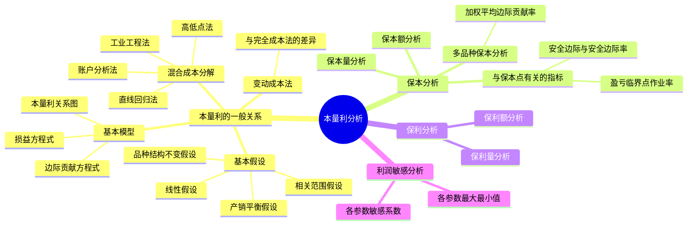

## 1. 章节定位

| 项目 | 信息 |
|------|------|
| 所属科目 | 财务成本管理 |
| 难度等级 | 3 |
| 历年分值 | 4-5分 |
| 建议学时 | 5-6h |

## 2. 考情分析

本量利分析是管理会计的核心内容，研究成本、业务量、利润之间的相互关系。本章题型涵盖客观题与计算分析题，几乎每年必考。重点考点包括：混合成本的分解方法（高低点法、回归直线法）、变动成本法与完全成本法的差异、损益方程式与边际贡献方程式、保本点（盈亏临界点）的计算、安全边际与安全边际率、多品种保本分析（加权平均边际贡献率）、保利分析（保利量与保利额）、利润敏感分析（敏感系数的计算）。

近年趋势强调综合应用，常将保本分析、保利分析与敏感分析结合出计算大题。考生必须熟练掌握边际贡献、安全边际等核心公式的灵活运用，以及敏感系数的计算与排序。

## 3. 知识框架

## 4. 核心精讲

### 一、混合成本的分解

为了构建线性的总成本模型 $y = a + bx$（其中 $a$ 为固定成本，$b$ 为单位变动成本），须将混合成本拆解为固定部分和变动部分。混合成本分解的方法主要有四种。

#### （一）账户分析法

根据会计核算账户中各成本的特点来分解混合成本，将比较接近变动成本的账户或项目归为变动成本，比较接近固定成本的归为固定成本。该方法简单、粗糙，但方便操作。

#### （二）工业工程法

运用工业工程的研究方法，逐项确定成本构成的每个因素，在此基础上直接估算固定成本和单位变动成本。可在没有历史成本数据、历史数据不可靠或需要验证时使用，尤其是在建立标准成本和制定预算时比历史成本分析更加科学。

#### （三）直线回归法

根据一系列历史成本资料，用数学上的最小平方法原理，计算能代表平均成本水平的回归线的截距和斜率，以作为固定成本和单位变动成本。

回归方程 $Y = a + bX$ 的参数计算公式：

$$b = \frac{n\sum XY - \sum X \sum Y}{n\sum X^2 - (\sum X)^2}$$

$$a = \frac{\sum Y - b \sum X}{n}$$

该方法计算最精确，但计算繁琐，可利用 Excel 等统计软件直接输出回归结果。决定系数 $R^2$ 越接近 1，说明自变量对因变量的解释程度越高。

#### （四）高低点法

取业务量（如产量）的最高点和最低点，分解混合成本：

$$\text{单位变动成本} = \frac{\text{最高点成本} - \text{最低点成本}}{\text{最高点产量} - \text{最低点产量}}$$

$$\text{固定成本} = \text{高点（或低点）的总成本} - \text{单位变动成本} \times \text{高点（或低点）产量}$$

> **说明**：高低点法计算简单，但仅利用了高低点数据，忽略了其他数据信息；如果高低点为异常值时，则不具有代表性。

### 二、变动成本法

#### （一）变动成本法与完全成本法的区别

| 项目 | 变动成本法 | 完全成本法（吸收成本法） |
|------|-----------|------------------------|
| 产品成本 | 直接材料、直接人工、变动制造费用 | 直接材料、直接人工、变动制造费用、**固定制造费用** |
| 期间费用 | 固定制造费用、变动销售与管理费用、固定销售与管理费用 | 变动销售与管理费用、固定销售与管理费用 |

**核心差别**在于对固定制造费用的处理：变动成本法将固定制造费用作为期间费用一次进入当期损益；完全成本法将固定制造费用计入产品成本，随存货的流转而递延或释放。

#### （二）两种方法下利润的差异

用 $P$ 表示完全成本法下的当期利润（息税前利润），$P_v$ 表示变动成本法下的当期利润，两者之差用 $\Delta P$ 表示：

$$\Delta P = P - P_v = \text{期末存货中固定制造费用} - \text{期初存货中固定制造费用}$$

- 当期末存货吸收的固定制造费用 > 期初存货释放的固定制造费用时，完全成本法利润 > 变动成本法利润；
- 反之，完全成本法利润 < 变动成本法利润。

### 三、本量利分析的基本假设

| 假设 | 内容 |
|------|------|
| 相关范围假设 | 包括期间假设和业务量假设，成本性态划分限定在一定期间和一定业务量范围内 |
| 线性假设 | 固定成本不变（$a$ 为常数）；变动成本与业务量成完全线性关系（$b$ 为常数）；销售收入与数量成完全线性关系（单价 $p$ 为常数） |
| 产销平衡假设 | 假设产量等于销量，本量利分析中的"量"指销售数量 |
| 品种结构不变假设 | 多品种企业中各种产品的销售收入占总收入的比重不变 |

> **关系**：相关范围假设是最基本的假设，是本量利分析的出发点；线性假设由相关范围假设衍生而来；产销平衡假设与品种结构不变假设是对线性假设的进一步补充。

### 四、本量利分析的基本模型

#### （一）损益方程式

**基本的损益方程式**：

$$\text{息税前利润} = \text{单价} \times \text{销量} - \text{单位变动成本} \times \text{销量} - \text{固定成本}$$

$$= (p - v) \times Q - a$$

其中：$p$ 为单价；$v$ 为单位变动成本；$Q$ 为销量；$a$ 为固定成本。

该方程式含有 5 个相互联系的变量，给定其中 4 个，便可求出第 5 个变量的值。

#### （二）边际贡献方程式

**1. 边际贡献**

边际贡献（又称贡献毛益）是指销售收入减去变动成本后的差额：

$$\text{边际贡献} = \text{销售收入} - \text{变动成本} = (p - v) \times Q$$

$$\text{单位边际贡献} = p - v$$

边际贡献首先用于补偿企业的固定成本，如果还有剩余才形成利润，如果不足以补偿固定成本则产生亏损。

区分：
- **制造边际贡献** = 销售收入 − 变动生产成本
- **产品边际贡献** = 制造边际贡献 − 变动销售和管理费用

> 通常，"边际贡献"未加定语时指"产品边际贡献"。

**2. 边际贡献率与变动成本率**

$$\text{边际贡献率} = \frac{\text{边际贡献}}{\text{销售收入}} \times 100\% = \frac{\text{单位边际贡献}}{\text{单价}} \times 100\%$$

$$\text{变动成本率} = \frac{\text{变动成本}}{\text{销售收入}} \times 100\% = \frac{\text{单位变动成本}}{\text{单价}} \times 100\%$$

**关键关系**：

$$\text{变动成本率} + \text{边际贡献率} = 1$$

**3. 边际贡献方程式**

由于 息税前利润 = 边际贡献 − 固定成本，故：

$$\text{息税前利润} = \text{销量} \times \text{单位边际贡献} - \text{固定成本}$$

**4. 边际贡献率方程式**

$$\text{息税前利润} = \text{销售收入} \times \text{边际贡献率} - \text{固定成本}$$

该方程式可用于多品种企业，关键是计算多种产品的**加权平均边际贡献率**。

### 五、保本分析

保本分析（盈亏临界分析）研究如何确定保本点，即企业收入和成本相等、边际贡献等于固定成本时的状态。

#### （一）保本量分析（单一产品）

令息税前利润 = 0，此时的销售量即为保本量：

$$\text{保本量} = \frac{\text{固定成本}}{\text{单价} - \text{单位变动成本}} = \frac{\text{固定成本}}{\text{单位边际贡献}}$$

#### （二）保本额分析

令息税前利润 = 0，此时的销售额即为保本额：

$$\text{保本额} = \frac{\text{固定成本}}{\text{边际贡献率}}$$

#### （三）与保本点有关的指标

**1. 盈亏临界点作业率**

$$\text{盈亏临界点作业率} = \frac{\text{盈亏临界点销售量（额）}}{\text{实际或预计销售量（额）}} \times 100\%$$

该比率表明企业保本的业务量在实际或预计业务量中所占的比重，也表明保本状态下的生产经营能力利用程度。

**2. 安全边际与安全边际率**

$$\text{安全边际额} = \text{实际或预计销售额} - \text{盈亏临界点销售额}$$

$$\text{安全边际量} = \text{实际或预计销售量} - \text{盈亏临界点销售量}$$

$$\text{安全边际率} = \frac{\text{安全边际（量或额）}}{\text{实际或预计销售量（额）}} \times 100\%$$

安全边际和安全边际率的数值越大，企业发生亏损的可能性越小，企业越安全。

**3. 关键关系式**

$$\text{盈亏临界点作业率} + \text{安全边际率} = 1$$

$$\text{息税前利润} = \text{安全边际额} \times \text{边际贡献率}$$

$$\text{销售息税前利润率} = \text{安全边际率} \times \text{边际贡献率}$$

> **理解**：只有安全边际才能为企业提供利润，盈亏临界点销售额扣除变动成本后只能为企业补偿固定成本。安全边际部分的边际贡献等于企业利润。

#### （四）多品种情况下的保本分析

多品种下采用加权平均边际贡献率：

$$\text{加权平均边际贡献率} = \frac{\sum \text{各产品边际贡献}}{\sum \text{各产品销售收入}} \times 100\%$$

$$= \sum (\text{各产品边际贡献率} \times \text{各产品销售占总销售比重})$$

$$\text{保本销售总额} = \frac{\text{固定成本总额}}{\text{加权平均边际贡献率}}$$

$$\text{某产品保本销售额} = \text{保本销售总额} \times \text{该产品销售百分比}$$

$$\text{某产品保本销售量} = \frac{\text{该产品保本销售额}}{\text{该产品销售单价}}$$

### 六、保利分析

保利分析研究在单价和成本水平一定的情况下，为确保目标利润可以实现而必须达到的销售量或销售额。

#### （一）保利量分析

**不考虑企业所得税时**：

$$\text{保利量} = \frac{\text{固定成本} + \text{目标利润}}{\text{单价} - \text{单位变动成本}} = \frac{\text{固定成本} + \text{目标利润}}{\text{单位边际贡献}}$$

**考虑企业所得税时**（目标利润为税后利润）：

$$\text{保利量} = \frac{\text{固定成本} + \frac{\text{税后目标利润}}{1 - \text{企业所得税税率}}}{\text{单位边际贡献}}$$

#### （二）保利额分析

**不考虑企业所得税时**：

$$\text{保利额} = \frac{\text{固定成本} + \text{目标利润}}{\text{边际贡献率}}$$

**考虑企业所得税时**：

$$\text{保利额} = \frac{\text{固定成本} + \frac{\text{税后目标利润}}{1 - \text{企业所得税税率}}}{\text{边际贡献率}}$$

### 七、利润敏感分析

敏感分析主要研究有关参数发生多大变化会使盈利转为盈亏平衡，以及各参数变化对利润变化的影响程度。

#### （一）各参数的最大（最小）值

即使利润降为 0 时各参数的界限值：

- **单价最小值**：令利润 = 0，求单价 $p$；
- **单位变动成本最大值**：令利润 = 0，求单位变动成本 $v$；
- **固定成本最大值**：令利润 = 0，求固定成本 $a$；
- **销售量最小值**：即保本量。

#### （二）各参数的敏感系数

敏感系数反映某参数变动引起利润变动的程度：

$$\text{敏感系数} = \frac{\text{目标值（利润）变动百分比}}{\text{参数值变动百分比}}$$

- 敏感系数为正值，表明该参数与利润同向增减；
- 敏感系数为负值，表明该参数与利润反向增减；
- 敏感系数的绝对值越大，该因素越敏感。

**各参数敏感系数的公式化计算**（基于本量利基本模型）：

| 参数 | 敏感系数 |
|------|----------|
| 单价 | $\dfrac{p \times Q}{\text{利润}}$ |
| 单位变动成本 | $-\dfrac{v \times Q}{\text{利润}}$ |
| 固定成本 | $-\dfrac{a}{\text{利润}}$ |
| 销量 | $\dfrac{(p - v) \times Q}{\text{利润}}$ |

> **注意**：单价的敏感系数绝对值通常最大，因为单价直接影响销售收入且与销量相乘；固定成本的敏感系数绝对值通常最小。

## 5. 典型例题

**【例题 1】（基本损益方程式与保本分析）**

某企业仅产销一种产品，销售单价为 2 元，单位变动成本为 1.2 元，固定成本为 1600 元/月，实际或预计销售额为 5000 元。

要求：(1) 计算保本量和保本额；(2) 计算盈亏临界点作业率、安全边际额、安全边际率；(3) 计算边际贡献率并用两种方法验证利润；(4) 计算销售息税前利润率。

**答案**：

(1) 
- 单位边际贡献 $= 2 - 1.2 = 0.8$（元）
- 边际贡献率 $= 0.8 \div 2 = 40\%$
- 保本量 $= 1600 \div 0.8 = 2000$（件）
- 保本额 $= 1600 \div 40\% = 4000$（元）

(2)
- 实际或预计销量 $= 5000 \div 2 = 2500$（件）
- 盈亏临界点作业率 $= 4000 \div 5000 = 80\%$
- 安全边际额 $= 5000 - 4000 = 1000$（元）
- 安全边际量 $= 2500 - 2000 = 500$（件）
- 安全边际率 $= 1000 \div 5000 = 20\%$
- 验算：盈亏临界点作业率 + 安全边际率 $= 80\% + 20\% = 100\%$

(3)
- 方法一（安全边际）：利润 $=$ 安全边际额 $\times$ 边际贡献率 $= 1000 \times 40\% = 400$（元）
- 方法二（损益方程式）：利润 $= 2 \times 2500 - 1.2 \times 2500 - 1600 = 5000 - 3000 - 1600 = 400$（元）

(4) 销售息税前利润率 $=$ 安全边际率 $\times$ 边际贡献率 $= 20\% \times 40\% = 8\%$

---

**【例题 2】（多品种保本分析）**

某企业计划生产 A、B、C 三种产品，固定成本总额为 50000 元，相关资料如下：

| 项目 | A 产品 | B 产品 | C 产品 |
|------|--------|--------|--------|
| 销售额（元） | 30000 | 15000 | 35000 |
| 边际贡献率 | 50% | 60% | 50% |

要求：(1) 计算加权平均边际贡献率和保本销售总额；(2) 计算 B 产品的保本销售额和保本销售量（B 产品单价 15 元）。

**答案**：

(1)
- 总销售额 $= 30000 + 15000 + 35000 = 80000$（元）
- 各产品销售比重：A $= 30000/80000 = 37.5\%$；B $= 15000/80000 = 18.75\%$；C $= 35000/80000 = 43.75\%$
- 加权平均边际贡献率 $= 37.5\% \times 50\% + 18.75\% \times 60\% + 43.75\% \times 50\%$
  $= 18.75\% + 11.25\% + 21.875\% = 51.875\%$
- 保本销售总额 $= 50000 \div 51.875\% \approx 96386$（元）

(2)
- B 产品保本销售额 $= 96386 \times 18.75\% \approx 18072$（元）
- B 产品保本销售量 $= 18072 \div 15 \approx 1205$（件）

---

**【例题 3】（保利分析）**

沿用例题 1 的资料（单价 2 元，单位变动成本 1.2 元，固定成本 1600 元），目标利润为 1500 元。

要求：(1) 不考虑企业所得税，计算保利量和保利额；(2) 假设企业所得税税率 25%，目标税后利润为 1500 元，计算保利量和保利额。

**答案**：

(1) 不考虑企业所得税：
- 保利量 $= (1600 + 1500) \div (2 - 1.2) = 3100 \div 0.8 = 3875$（件）
- 保利额 $= (1600 + 1500) \div 40\% = 3100 \div 0.4 = 7750$（元）

(2) 考虑企业所得税（税率 25%）：
- 税前目标利润 $= 1500 \div (1 - 25\%) = 2000$（元）
- 保利量 $= (1600 + 2000) \div 0.8 = 3600 \div 0.8 = 4500$（件）
- 保利额 $= (1600 + 2000) \div 40\% = 3600 \div 0.4 = 9000$（元）

---

**【例题 4】（利润敏感分析）**

某企业只生产一种产品，销售单价为 2 元，单位变动成本为 1.2 元，预计固定成本为 40000 元，产销量预计达 100000 件，假设没有利息支出和所得税。

要求：(1) 计算预计利润；(2) 计算各参数（单价、单位变动成本、固定成本、销量）的敏感系数；(3) 确定各参数的最大（最小）值。

**答案**：

(1) 预计利润 $= 100000 \times (2 - 1.2) - 40000 = 80000 - 40000 = 40000$（元）

(2) 各参数变动 20% 时：

| 参数 | 变动后值 | 新利润 | 利润变动百分比 | 敏感系数 |
|------|----------|--------|----------------|----------|
| 单价 +20% | 2.4 | $100000 \times (2.4-1.2) - 40000 = 80000$ | $(80000-40000)/40000 = 100\%$ | $100\%/20\% = 5$ |
| 单位变动成本 +20% | 1.44 | $100000 \times (2-1.44) - 40000 = 16000$ | $(16000-40000)/40000 = -60\%$ | $-60\%/20\% = -3$ |
| 固定成本 +20% | 48000 | $100000 \times (2-1.2) - 48000 = 32000$ | $(32000-40000)/40000 = -20\%$ | $-20\%/20\% = -1$ |
| 销量 +20% | 120000 | $120000 \times (2-1.2) - 40000 = 56000$ | $(56000-40000)/40000 = 40\%$ | $40\%/20\% = 2$ |

**敏感程度排序**：单价（5）> 单位变动成本（−3）> 销量（2）> 固定成本（−1）。

> 单价敏感系数为正且绝对值最大，说明提价是提高盈利的最有效手段，价格下跌也是企业的最大威胁。

(3) 令利润 = 0，求各参数界限：
- 单价最小值：$100000 \times (p - 1.2) - 40000 = 0$，解得 $p = 1.6$（元）（降低 20%）
- 单位变动成本最大值：$100000 \times (2 - v) - 40000 = 0$，解得 $v = 1.6$（元）（上升 33.3%）
- 固定成本最大值：$100000 \times (2 - 1.2) - a = 0$，解得 $a = 80000$（元）（增加 100%）
- 销量最小值（保本量）：$Q \times (2 - 1.2) - 40000 = 0$，解得 $Q = 50000$（件）（完成 50%）

## 6. 记忆口诀

**混合成本分解四方法**：
> 账户分析最简单，工业工程无数据用；
> 直线回归最精确，高低两点快速算。

**变动成本法 vs 完全成本法**：
> 变动法：产品成本只含变动生产成本，固定制造费用进期间费用；
> 完全法：固定制造费用进产品成本，随存货流转而递延。
> 利润差 = 期末存货固定制造费用 − 期初存货固定制造费用。

**本量利核心公式**：
> 利润 = 单价×销量 − 单位变动×销量 − 固定成本；
> 边际贡献 = 销售收入 − 变动成本 = 单位边际贡献×销量；
> 边际贡献率 + 变动成本率 = 1。

**保本点公式**：
> 保本量 = 固定成本 ÷ 单位边际贡献；
> 保本额 = 固定成本 ÷ 边际贡献率。

**安全边际四关系**：
> 作业率 + 安全边际率 = 1；
> 利润 = 安全边际额 × 边际贡献率；
> 销售利润率 = 安全边际率 × 边际贡献率；
> 安全边际越大，企业越安全。

**敏感系数排序**（通常）：
> 单价（最大正）> 变动成本（负）> 销量（正）> 固定成本（最小负）；
> 系数 = 利润变动% ÷ 参数变动%。

## 7. 同步练习

**1.（单选题）** 下列关于边际贡献和边际贡献率的说法中，正确的是（　）。

A. 边际贡献率 + 变动成本率 = 0
B. 制造边际贡献 = 销售收入 − 变动生产成本 − 变动销售和管理费用
C. 产品边际贡献 = 销售收入 − 变动成本
D. 边际贡献率 = 单位变动成本 ÷ 单价

**2.（单选题）** 某企业仅产销一种产品，单价 10 元，单位变动成本 6 元，固定成本 2000 元，预计销量 800 件。则安全边际率为（　）。

A. 25%
B. 37.5%
C. 40%
D. 62.5%

**3.（计算题）** 某企业产销 A、B 两种产品，固定成本总额 60000 元。A 产品单价 20 元，单位变动成本 12 元，预计销售量 6000 件；B 产品单价 15 元，单位变动成本 9 元，预计销售量 4000 件。

要求：(1) 计算加权平均边际贡献率；(2) 计算保本销售总额；(3) 计算 A 产品的保本销售额和保本销售量。

**4.（计算题）** 某企业仅产销一种产品，单价 50 元，单位变动成本 30 元，固定成本 80000 元，目标税后利润 60000 元，企业所得税税率 25%。

要求：(1) 计算保利量；(2) 计算保利额。

**5.（计算题）** 某企业只生产一种产品，单价 10 元，单位变动成本 6 元，固定成本 40000 元，预计销量 20000 件。

要求：(1) 计算预计利润；(2) 计算单价、单位变动成本、固定成本、销量的敏感系数；(3) 确定单价的敏感程度是否高于销量的敏感程度。

**6.（单选题）** (2024年) 甲公司某项作业的成本 Y 存在三个成本动因 X1、X2、X3，公司搜集整理了近期的相关历史数据，采用直线回归法分别就 X1、X2、X3 模拟 Y 的一元线性成本函数得出如下结果：

Y = 9000 + 6X1（R² = 0.1）
Y = 2000 + 6X2（R² = 0.4）
Y = 5000 + 350X3（R² = 0.8）

其中，函数中的常数为每周固定成本，公司采用成本加成法为对外提供的该项作业进行定价，价格为完全成本加成 10%。如果某订单需要 3 周完成，消耗 X1、X2、X3 的数量分别为 18000、6000、500 单位，那么基于最优成本函数预计成本制定的订单价格为（　）元。

A. 209000
B. 148500
C. 105600
D. 190000

**7.（单选题）** (2023年) 甲公司只产销一种产品，目前年产销量 200 万件，息税前利润对销量的敏感系数为 4，处于盈利状态，假定其他条件不变，甲公司盈亏临界点的销量是（　）万件。

A. 192
B. 150
C. 50
D. 200

**8.（单选题）** (2022年) 甲公司机修车间总成本与机修工时呈线性关系：y = a + bx，其中 a 为月固定成本，b 为单位变动成本。为构建模型，拟用最近 5 个月的实际成本数据测算 a 与 b。相关数据如下：

| 2022年 | 机修工时 x（小时） | 实际成本 y（元） |
|--------|-------------------|------------------|
| 8月 | 89 | 645 |
| 9月 | 105 | 722 |
| 10月 | 100 | 701 |
| 11月 | 108 | 742 |
| 12月 | 110 | 750 |
| 合计 | 512 | 3560 |

假设全年固定成本是月固定成本的 12 倍。2023 年机修车间预计提供 1200 小时机修服务，根据该模型测算，最接近预计机修总成本的是（　）元。

A. 8400
B. 9500
C. 7500
D. 6200

**9.（单选题）** (2022年) 已知年正常销售量是 10 万件，单价是 40 元，变动成本率为 60%，安全边际率为 25%，假设变动成本率、销量和固定成本不变，则利润对单价的敏感系数为（　）。

A. 10
B. 4
C. 1
D. 2

**10.（单选题）** (2022年) 甲公司空调维修合同规定：每年上门维修不超过 5 次时，维修费用总计 3000 元；超过 5 次时，在此基础上超出次数按每次 1000 元付费。根据成本性态分析，该项维修费用属于（　）。

A. 半变动成本
B. 阶梯式成本
C. 半固定成本
D. 延期变动成本

**11.（单选题）** (2021年) 甲便利店销售一种新产品，销售单价 10 元，单位变动成本 2 元，年固定成本总额 1000 万元，企业所得税税率 25%，全年税后目标利润 5250 万元。该产品全年的保利额是（　）万元。

A. 10000
B. 7812.5
C. 6250
D. 5375

**12.（单选题）** (2020年) 甲公司产销一种产品，相关信息如下：单位售价 30 元，单位变动制造成本 7 元，固定制造费用 95000 元，固定管理费用 65000 元，销售佣金为售价的 10%。该产品的盈亏临界点销售量是（　）件。

A. 3250
B. 4000
C. 4750
D. 8000

**13.（单选题）** (2019年) 甲公司销售收入为 50 万元，边际贡献率为 30%，该公司仅有 K、W 两个部门，其中 K 部门变动成本为 30 万元，边际贡献率为 25%。下列各项中错误的是（　）。

A. K 部门的变动成本率为 70%
B. K 部门的边际贡献为 10 万元
C. W 部门的边际贡献率为 50%
D. W 部门的销售收入为 10 万元

**14.（多选题）** (2023年) 甲公司生产一种产品，单价 30 元，月固定成本 108000 元，月正常销售量 30000 件，盈亏临界点 18000 件，下列表述正确的有（　）。

A. 销售息税前利润率为 8%
B. 变动成本总额为 720000 元
C. 安全边际率为 40%
D. 安全边际额为 252000 元

**15.（多选题）** (2022年) 甲公司只产销 X 产品，单位变动成本为 12 元，变动成本率为 40%，2022 年变动成本总额 6000 万元，息税前利润 1800 万元。2023 年销量预计增长 8%，假设其他因素不变，下列各项中正确的有（　）。

A. 2023 年盈亏临界点作业率 74.07%
B. 2023 年销售收入 15000 万元
C. 2023 年预计息税前利润 2520 万元
D. 2023 年保本销售额 12000 万元

**16.（多选题）** (2021年) 下列各项中，通常属于约束性固定成本的有（　）。

A. 培训费
B. 折旧费
C. 广告费
D. 取暖费

**17.（多选题）** (2021年) 在本量利分析中，假设其他因素不变，单位产品变动成本上升时，下列说法中正确的有（　）。

A. 安全边际下降
B. 盈亏临界点作业率下降
C. 销售息税前利润率下降
D. 单位边际贡献下降

**18.（多选题）** (2018年) 甲公司的经营处于盈亏临界点，下列表述正确的有（　）。

A. 安全边际额等于零
B. 经营杠杆系数等于零
C. 边际贡献等于固定成本
D. 销售额等于销售收入线与总成本线交点处销售额

---

**练习答案**：

1. **C**。边际贡献率 + 变动成本率 = 1，A 错；制造边际贡献 = 销售收入 − 变动生产成本（不含变动销售和管理费用），B 错；产品边际贡献 = 销售收入 − 变动成本，C 正确；边际贡献率 = 单位边际贡献 ÷ 单价，D 错。

2. **B**。
   - 单位边际贡献 $= 10 - 6 = 4$（元）；保本量 $= 2000 \div 4 = 500$（件）
   - 预计销量 800 件；安全边际量 $= 800 - 500 = 300$（件）
   - 安全边际率 $= 300 \div 800 = 37.5\%$，选 B。

3.
   - A 销售额 $= 20 \times 6000 = 120000$（元）；A 边际贡献率 $= (20-12)/20 = 40\%$
   - B 销售额 $= 15 \times 4000 = 60000$（元）；B 边际贡献率 $= (15-9)/15 = 40\%$
   - 总销售额 $= 120000 + 60000 = 180000$（元）
   - 销售比重：A $= 120000/180000 = 66.67\%$；B $= 60000/180000 = 33.33\%$
   - (1) 加权平均边际贡献率 $= 66.67\% \times 40\% + 33.33\% \times 40\% = 40\%$
   - (2) 保本销售总额 $= 60000 \div 40\% = 150000$（元）
   - (3) A 产品保本销售额 $= 150000 \times 66.67\% = 100000$（元）；A 产品保本销售量 $= 100000 \div 20 = 5000$（件）
   - 验算利润：总边际贡献 $= 180000 \times 40\% = 72000$；利润 $= 72000 - 60000 = 12000$（元）$> 0$，预计销售超过保本点，合理。

4. 
   - 边际贡献率 $= (50 - 30) \div 50 = 40\%$
   - 税前目标利润 $= 60000 \div (1 - 25\%) = 80000$（元）
   - (1) 保利量 $= (80000 + 80000) \div (50 - 30) = 160000 \div 20 = 8000$（件）
   - (2) 保利额 $= (80000 + 80000) \div 40\% = 160000 \div 0.4 = 400000$（元）

5. 
   - (1) 预计利润 $= 20000 \times (10 - 6) - 40000 = 80000 - 40000 = 40000$（元）
   - (2) 各参数敏感系数：
     - 单价：$10 \times 20000 \div 40000 = 5$
     - 单位变动成本：$-6 \times 20000 \div 40000 = -3$
     - 固定成本：$-40000 \div 40000 = -1$
     - 销量：$(10-6) \times 20000 \div 40000 = 2$
   - (3) 单价敏感系数（5）的绝对值大于销量敏感系数（2）的绝对值，单价的敏感程度高于销量，是。

6. **A**。R² 越接近 1 拟合程度越高，最优成本函数为 Y = 5000 + 350X3（R² = 0.8）。订单价格 $= (5000 \times 3 + 350 \times 500) \times (1 + 10\%) = 209000$（元）。

7. **B**。息税前利润对销量的敏感系数为 4。从盈利状态降到盈亏临界点，息税前利润下降 $100\%$，销量下降 $= 100\% \div 4 = 25\%$，盈亏临界点销量 $= 200 \times (1 - 25\%) = 150$（万件）。

8. **A**。高低点法：b $= (750 - 645) \div (110 - 89) = 5$，a $= 645 - 89 \times 5 = 200$（元/月），全年固定成本 $= 200 \times 12 = 2400$（元），预计机修总成本 $= 2400 + 1200 \times 5 = 8400$（元）。

9. **B**。盈亏临界点作业率 $= 1 - 25\% = 75\%$，盈亏临界点销量 $= 10 \times 75\% = 7.5$（万件），固定成本 $= 7.5 \times 40 \times (1 - 60\%) = 120$（万元）。单价 40 元时利润 $= 10 \times 40 \times 40\% - 120 = 40$（万元）；单价提高 10% 使利润增加 $= 10 \times 40 \times 10\% \times 40\% = 16$（万元），增幅 $40\%$，敏感系数 $= 40\% \div 10\% = 4$。

10. **D**。一定业务量范围内总额保持稳定，超出特定业务量后开始随业务量同比例增长，属于延期变动成本。

11. **A**。单位边际贡献 $= 10 - 2 = 8$（元），税前目标利润 $= 5250 \div (1 - 25\%) = 7000$（万元），保利量 $= (1000 + 7000) \div 8 = 1000$（万件），保利额 $= 1000 \times 10 = 10000$（万元）。

12. **D**。盈亏临界点销售量 $= (95000 + 65000) \div (30 - 7 - 30 \times 10\%) = 160000 \div 20 = 8000$（件）。注意销售佣金（售价的 10%）也属于单位变动成本。

13. **A**。选错误的。K 部门变动成本率 $= 1 - 25\% = 75\%$（不是 70%），A 错；K 部门销售收入 $= 30 \div 75\% = 40$（万元），边际贡献 $= 40 \times 25\% = 10$（万元），B 对；公司边际贡献总额 $= 50 \times 30\% = 15$（万元），W 部门边际贡献 $= 15 - 10 = 5$（万元），W 部门销售收入 $= 50 - 40 = 10$（万元），D 对，W 部门边际贡献率 $= 5 \div 10 = 50\%$，C 对。

14. **ABC**。单位边际贡献 $= 108000 \div 18000 = 6$（元），单位变动成本 $= 30 - 6 = 24$（元），变动成本总额 $= 30000 \times 24 = 720000$（元），B 对；息税前利润 $= 30000 \times 6 - 108000 = 72000$（元），销售息税前利润率 $= 72000 \div (30000 \times 30) = 8\%$，A 对；安全边际率 $= (30000 - 18000) \div 30000 = 40\%$，C 对；安全边际额 $= 12000 \times 30 = 360000$（元），D 错。

15. **ACD**。2022 年销量 $= 6000 \div 12 = 500$（万件），2023 年销量 $= 500 \times 1.08 = 540$（万件），单价 $= 12 \div 40\% = 30$（元），单位边际贡献 $= 30 - 12 = 18$（元）；固定成本 $= 500 \times 18 - 1800 = 7200$（万元），盈亏临界点销量 $= 7200 \div 18 = 400$（万件），2023 年盈亏临界点作业率 $= 400 \div 540 = 74.07\%$，A 对；2023 年销售收入 $= 540 \times 30 = 16200$（万元），B 错；2023 年息税前利润 $= 540 \times 18 - 7200 = 2520$（万元），C 对；保本销售额 $= 400 \times 30 = 12000$（万元），D 对。

16. **BD**。约束性固定成本是不能通过当前管理决策行动改变数额的固定成本，如折旧费（B）、取暖费（D）；培训费（A）、广告费（C）属于酌量性固定成本。

17. **ACD**。单位变动成本上升 → 单位边际贡献下降（D 对），盈亏临界点销售量提高 → 安全边际下降（A 对）、盈亏临界点作业率上升（B 错），息税前利润下降而营业收入不变 → 销售息税前利润率下降（C 对）。

18. **ACD**。盈亏临界点时安全边际额等于零（A 对），经营杠杆系数趋近无穷大而非零（B 错），边际贡献等于固定成本（C 对），销售额等于总收入线与总成本线交点处销售额（D 对）。
