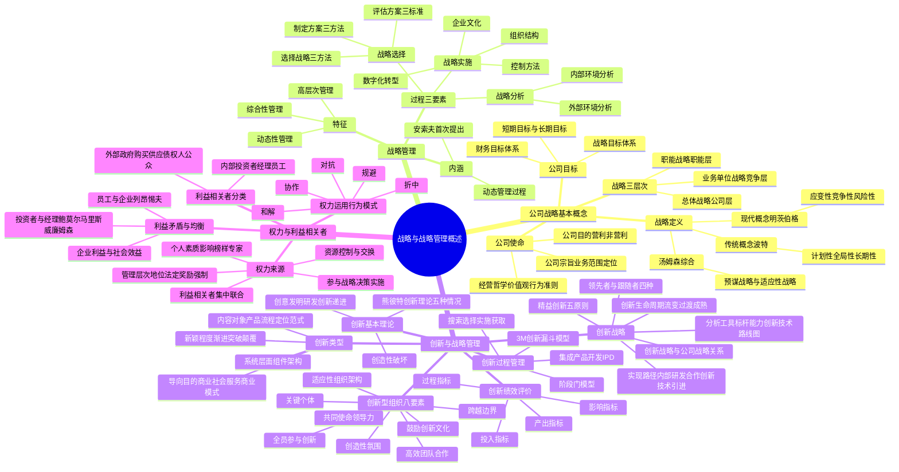

## 1. 章节定位

| 项目 | 信息 |
|------|------|
| 所属科目 | 公司战略与风险管理 |
| 难度等级 | 2 |
| 历年分值 | 6-10 分 |
| 建议学时 | 8-10 小时 |
| 知识关联章节 | 第2章 战略分析（PEST、五力模型）、第3章 战略选择（创新战略对应蓝海战略）、第4章 战略实施（组织结构与文化建设）、第5章 公司治理（利益相关者理论）、第6章 风险管理概述（创新风险） |

## 2. 考情分析

本章是公司战略与风险管理科目的开篇章，历年分值约 6-10 分，是后续各章的理论基础。命题以客观题为主，主观题多与本章节概念辨析结合考查（如使命与目标、战略层次、利益相关者均衡、创新类型等）。

**命题规律**：本章偏重概念理解与框架识别，考题多为定义辨析、分类判断、案例归类。近年随"创新驱动发展"国家战略的强化，创新管理部分分值明显上升，主观题偶有涉及（如分析某企业创新类型或创新组织建设）。

**高频考点分布**：

1. **公司战略的传统概念与现代概念**：波特传统概念强调计划性、全局性、长期性；明茨伯格现代概念强调应变性、竞争性、风险性。汤姆森"战略既是预先性又是反应性"是高频判断题考点。
2. **公司使命三要素**：公司目的（营利/非营利）、公司宗旨（业务范围与定位）、经营哲学（价值观与行为准则）。
3. **公司目标体系**：财务目标体系与战略目标体系的区分；短期目标与长期目标。
4. **公司战略的三个层次**：总体战略（公司层）、业务单位战略（竞争层）、职能战略（职能层）。
5. **战略管理三要素**：战略分析、战略选择、战略实施；战略选择过程的三个组成部分（制定方案、评估方案、选择战略）与评估三标准（适宜性、可接受性、可行性）。
6. **创新理论**：熊彼特创新理论五种情况、"创造性破坏"概念；创意、发明、研发、创新的递进关系。
7. **创新类型四种划分**：按内容对象（产品/流程/定位/范式创新）、按新颖程度（渐进/突破/颠覆）、按系统层面（组件/架构）、按导向目的（商业/社会/服务/商业模式）。
8. **创新生命周期模型**：阿伯内西和厄特巴克的三阶段（流变、过渡、成熟）及其特征。
9. **领先者战略与跟随者战略**：四种细分（技术领先、市场细分、技术跟随、技术合理化）。
10. **精益创新五原则**：客户导向、行动、试错、聚焦、迭代。
11. **创新型组织八要素**：共同使命领导力、适应性组织架构、关键个体、全员参与、高效团队、创造性氛围、跨越边界、鼓励创新的文化。
12. **创新过程管理**：搜索—选择—实施—获取四阶段；三种流程模型（阶段—门模型、3M 创新漏斗模型、集成产品开发 IPD）。
13. **利益相关者分类**：内部利益相关者（投资者、经理阶层、企业员工）与外部利益相关者（政府、购买者和供应者、债权人、社会公众）。
14. **利益矛盾与均衡**：鲍莫尔销售最大化模型、马里斯增长模型、威廉姆森管理权限模型、列昂惕夫模型。
15. **权力来源五种**：资源控制与交换、管理层次中的地位（法定权/奖励权/强制权）、个人素质和影响（榜样权/专家权）、参与战略决策与实施、利益相关者集中或联合。
16. **权力运用五种行为模式**：对抗、和解、协作、折中、规避（合作性与坚定性两维坐标）。

**联动考查方式**：
- 与第2章联动：利益相关者分析与 PEST 中政治法律环境、五力模型中供应者/购买者讨价还价能力结合；
- 与第3章联动：创新战略的细分类型与总体战略、业务单位战略选择结合；颠覆性创新与蓝海战略相呼应；
- 与第4章联动：创新型组织要素与组织结构、企业文化结合；
- 与第5章联动：利益相关者理论与公司治理结构结合。

**备考建议**：
- 本章重在"框架记忆+概念辨析"，建议制作思维导图理清各分类的对应关系；
- "传统概念 vs 现代概念"是高频考点，对比记忆"计划性、全局性、长期性"与"应变性、竞争性、风险性"；
- 创新类型四种划分体系庞杂，建议用案例记忆每种类型的代表例子；
- 利益相关者的三个均衡模型（鲍莫尔、马里斯、威廉姆森）必考，注意每个模型的核心变量；
- 权力运用五种行为模式必须能用合作性-坚定性二维坐标定位。

## 3. 知识框架

## 4. 核心精讲

### 4.1 公司战略的基本概念

#### 4.1.1 公司战略的定义

"战略"一词最早源于军事领域，指军事家对战争全局的规划和指挥。1962 年，美国学者钱德勒（A. D. Chandler）在《战略与结构》一书中将战略定义为"确定企业基本长期目标、选择行动途径和为实现这些目标进行资源分配"，标志着"战略"正式被引入企业经营管理领域，由此形成公司战略的概念。

对企业战略含义的多种表述可分为**传统概念**和**现代概念**两大类。

**（一）公司战略的传统概念**

美国哈佛大学教授波特（Porter M）是传统概念的典型代表。他认为"战略是公司为之奋斗的终点与公司为达到它们而寻求的途径的结合物"。波特的定义概括了 20 世纪六七十年代对公司战略的普遍认识，强调公司战略的三大属性——**计划性、全局性和长期性**。

**（二）公司战略的现代概念**

20 世纪 80 年代以来，企业外部环境变化速度加快，以计划为基点的传统概念受到批评。加拿大学者明茨伯格（Mintzberg H）在 1989 年提出，将战略视为理性计划的产物并不正确，许多成功的企业战略是在事先无计划的情况下产生的。他将战略定义为"一系列或整套的决策或行动方式"，包括刻意安排的（计划性）战略和任何临时出现的（非计划性）战略。

现代概念与传统概念的本质区别在于：现代概念更强调战略另一方面的属性——**应变性、竞争性和风险性**。

事实上，大部分公司的战略是事先计划与突发应变的组合。美国学者汤姆森（Thomson S）1998 年指出："战略既是预先性的（预谋战略），又是反应性的（适应性战略）"。在瞬息万变的环境里，公司战略意味着企业要主动预测未来及其影响因素，而不是被动地对变化作出反应。

**【案例 G 公司的战略进化】** G 公司是一家以电子设备和电器产品制造为主的多元化经营公司，由多个业务集团构成。在其 100 多年的发展历程中，公司全面推行全球化战略，在 130 多个国家拥有 10 多万名员工。20 世纪 50 年代公司业务过于分散，60 年代末通过并购另外一家电器公司实现业务整合，70 年代公司将业务单位重新组织为内部独立单位，集中人力物力资源，使销售额和利润大幅增长。每当市场上出现新的技术或竞争机会时，G 公司就会实施新一轮的业务重组或组织架构调整。100 年来 G 公司经历了多次大规模并购和业务拆分，在多次全球金融危机中也存活下来。G 公司的战略充分体现了现代概念中**应变性、竞争性和风险性**的特质。

#### 4.1.2 公司的使命与目标

针对波特定义中"终点"的概念，有的公司用"使命"或"目的"表述，也有的公司用"使命"与"目标"加以层次上的区别。教材将企业生存、发展、获利等根本性目的作为公司使命的一部分，而将公司目标作为使命的具体化。

**（一）公司的使命**

公司使命首先阐明企业组织的根本性质与存在理由，一般包括三个方面：

| 要素 | 含义 | 关键内容 |
|------|------|---------|
| 公司目的 | 企业组织的根本性质和存在理由的直接体现 | 营利组织首要目的是为所有者带来经济价值，其次履行社会责任；非营利组织首要目的是提高社会福利 |
| 公司宗旨 | 阐述公司长期的战略意向，说明目前和未来所从事的经营业务范围 | 德鲁克："公司的业务是什么"="公司的宗旨是什么"；反映企业定位（产品/服务、顾客对象、市场、技术） |
| 经营哲学 | 公司为其经营活动方式所确立的价值观、基本信念和行为准则 | 企业文化的高度概括；通过对利益相关者态度、共同价值观、政策目标、管理风格体现 |

**（二）公司目标**

公司目标是公司使命的具体化。德鲁克对公司目标的概括为："各项目标必须从'我们的企业是什么，它将会是什么，它应该是什么'引导出来。它们不是一种抽象的概念，而是行动的承诺，借以实现企业的使命；它们也是一种用以衡量工作成绩的标准。"

公司目标是一个体系，需要建立两种业绩标准：

| 目标体系 | 内容指标 |
|---------|---------|
| 财务目标体系 | 市场占有率、收益增长率、投资回报率、股利增长率、股票价格评价、现金流等 |
| 战略目标体系 | 获取足够的市场竞争优势；在产品质量、客户服务或产品革新上压倒竞争对手；整体成本低于竞争对手；提高公司声誉；增强国际市场竞争力；确立技术领导地位；获得持久竞争力；把握重要成长机会等 |

两种目标体系都应从短期目标和长期目标两个维度体现。短期目标体系集中精力提高短期经营业绩；长期目标体系促使管理者考虑现在应采取什么行动，使公司进入可以在相当长时期内良性经营的状态。

**【案例 J 汽车集团使命与战略目标的演进】** J 汽车集团自 1997 年进入汽车领域至 2020 年经历了三个主要发展阶段：

- **第一阶段（1998—2002 年）"简单造车，价格取胜"**：使命为"造老百姓买得起的轿车"，战略目标是用低价位实现中国轿车进家庭。当时国内家轿市场处于起步阶段，吉利凭借价格优势打入市场，明确以经济型轿车为经营主线、以国内老百姓为首要顾客群。
- **第二阶段（2003—2007 年）"自主创新、技术整洁"**：使命升级为"造老百姓买得起的好车"，战略目标升级为以质量取胜并拥有自主研发能力、自有技术和自主品牌。"好车"加入"质量"成为关键要素，并强调自主研发。
- **第三阶段（2008—2015 年）"全面转型、全球出击"**：使命重新定义为"造全世界最环保、最安全的好车，让吉利汽车跑遍全世界"，战略目标是用 5—10 年时间完成从单纯低成本战略向高技术、高质量、高效率、国际化战略转型；到 2015 年在海外建成 15 个生产基地，实现产品 2/3 外销。

三阶段使命变化体现了企业由国内到全球、由低价到环保安全的战略视野升级，反映出经营哲学与公司宗旨的协同进化。

#### 4.1.3 公司战略的层次

一般将公司战略分为三个层次：

| 战略层次 | 别称 | 涉及管理层次 | 核心任务 |
|---------|------|------------|---------|
| 总体战略 | 公司层战略 | 公司最高管理层 | 根据企业目标选择企业可以竞争的经营领域，合理配置企业经营所必需的资源，使各项经营业务相互支持、相互协调；常涉及整个企业的财务结构和组织结构 |
| 业务单位战略 | 竞争战略 | 事业部门管理层 | 将公司战略所包括的企业目标、发展方向和措施具体化，形成本业务单位具体的竞争与经营战略；针对不断变化的外部环境在各自经营领域中有效竞争 |
| 职能战略 | 职能层战略 | 职能部门管理层 | 涉及营销、财务、生产、研发（R&D）、人力资源、信息技术等各职能部门如何更好地配置企业内部资源，为各级战略服务，提高组织效率 |

**关键说明**：
- 对于单业务公司，总体战略和业务单位战略合二为一，只有对业务多元化的公司，二者的区分才有意义。
- 在职能战略中，**协同作用**具有重要意义：首先体现在单个职能中各种活动的协调性与一致性，其次体现在各个不同职能战略和业务流程或活动之间的协调性与一致性。

### 4.2 公司战略管理

#### 4.2.1 战略管理的内涵

"战略管理"一词由安索夫（Ansoff H. I.）在 1976 年《从战略规划到战略管理》一书中首先提出。1979 年安索夫出版《战略管理论》，认为战略管理是指将企业的日常业务决策同长期计划决策相结合而形成的一系列经营管理业务。美国学者斯坦纳（Steiner G. A.）1982 年在《企业政策与战略》中提出，战略管理是根据企业外部环境和内部条件确定企业目标，保证目标的正确落实并使企业使命最终得以实现的一个动态过程。

综合各方表述，企业战略管理的含义可界定为：**企业战略管理是为实现企业的使命和战略目标，科学地分析企业的内外部环境与条件，制定战略决策，评估、选择并实施战略方案，控制战略绩效的动态管理过程**。

#### 4.2.2 战略管理的特征

与传统的职能管理相比，战略管理具有三大特征：

| 特征 | 内容 |
|------|------|
| 综合性管理 | 战略管理为企业发展指明基本方向和前进道路，对象不仅包括研发、生产、人力资源、财务、市场营销等具体职能，还包括统领各项职能战略的竞争战略和公司层战略；涉及企业所有管理部门、业务单位及所有相关因素 |
| 高层次管理 | 战略管理的核心是对企业现在及未来的整体经营活动进行规划和管理，关系到企业长远生存发展；追求企业长期健康稳定发展和长久竞争力；必须由企业高层领导推动和实施 |
| 动态性管理 | 内外部条件和因素总是不断变化，战略管理必须及时了解、研究和应对变化的情况，对战略进行必要修正，确保战略目标的实现；适应企业内外部各种条件和因素的变化进行适当调整或变更 |

#### 4.2.3 战略管理过程

战略管理包含三个关键要素：**战略分析——了解组织所处的环境和相对竞争地位；战略选择——战略制定、评估和选择；战略实施——采取措施使战略发挥作用**。

**（一）战略分析**

战略分析的主要目的是评价影响企业目前和今后发展的关键因素，并确定在战略选择步骤中的具体影响因素。战略分析主要包括外部环境分析和内部环境分析：

- **外部环境分析**：从宏观环境、产业环境和竞争环境等方面展开，了解企业所处的环境正在发生哪些变化，这些变化将给企业带来哪些机会和威胁。
- **内部环境分析**：从资源与能力、价值链和业务组合等方面展开，了解企业自身所处的相对地位，企业具有哪些资源以及战略能力。

**（二）战略选择**

战略分析阶段明确了"企业目前处于什么位置"，战略选择阶段所要回答的问题是"企业向何处发展"。

**1. 可选择的战略类型**

| 战略层次 | 战略类型 |
|---------|---------|
| 总体战略（公司层战略） | 发展战略、稳定战略、收缩战略 |
| 业务单位战略（竞争战略） | 基本竞争战略、中小企业的竞争战略、蓝海战略 |
| 职能战略（职能层战略） | 市场营销战略、生产运营战略、研究与开发战略、采购战略、人力资源战略、财务战略 |

**2. 战略选择过程**

约翰逊和施乐斯（Johnson G. & Scholes K）1989 年提出战略选择过程的三个组成部分：

**（1）制定战略选择方案**。根据不同层次管理人员介入战略分析和战略选择工作的程度，可将战略形成的方法分为三种：

| 方法 | 流程 | 特点 |
|------|------|------|
| 自上而下 | 总部高层先制定总体战略，下属各部门根据自身实际情况具体化 | 集权程度高 |
| 自下而上 | 最高管理层不作具体规定，要求各部门提交方案，总部协调平衡后确认 | 分权程度高 |
| 上下结合 | 最高管理层和下属各部门管理人员共同参与，通过沟通磋商制定 | 集权分权结合 |

三种方法的主要区别在于战略制定中**集权与分权程度不同**。

**（2）评估战略备选方案**。评估战略备选方案通常使用三个标准：

| 标准 | 内容 |
|------|------|
| 适宜性标准 | 考虑选择的战略是否发挥了企业的优势、克服了劣势；是否利用了机会、将威胁削弱到最低程度；是否有助于企业实现目标 |
| 可接受性标准 | 考虑选择的战略能否被企业利益相关者接受；经理们和利益相关团体的不同价值观和期望在很大程度上影响战略选择 |
| 可行性标准 | 对战略的评估最终要落实到战略收益、风险和可行性分析的财务指标上 |

**（3）选择战略**。如果多个指标对多个战略方案的评价产生不一致的结果，最终的战略选择可考虑：①根据企业目标选择战略；②提交上级管理部门审批；③聘请外部专家进行战略选择工作。

**（三）战略实施**

战略实施就是将战略转化为行动并取得成果的过程。在这一过程中要切实做好以下工作：

1. 调整和完善企业的组织结构，使之适合公司战略的定位；
2. 推进企业文化的建设，使企业文化成为实现公司战略目标的驱动力和重要支撑；
3. 运用财务和非财务手段、方法，监督战略实施进程，及时发现和纠正偏差；
4. 采用先进技术尤其是数字化技术，构建新型企业组织，转变经营模式，支持企业数字化转型和数字化战略的实施；
5. 协调好企业战略、组织结构、文化建设和技术创新与变革诸方面的关系。

战略管理不是一次性的工作，而是循环往复的过程。战略制定固然重要，但在一定意义上说，**战略实施更为重要**。制定良好的战略仅是战略成功的一部分，只有有效实施，企业的使命和目标才能够顺利实现。

### 4.3 创新与创新战略管理

创新是引领发展的第一动力。以人工智能（AI）为代表的新一代科技革命正深刻改变并重塑人类的生产生活方式，加速社会各领域的数智化转型。创新成为企业战略中极为重要的组成部分。

#### 4.3.1 创新的定义与基本理论

**（一）创意、发明、研发与创新的递进关系**

| 概念 | 含义 | 侧重点 |
|------|------|--------|
| 创意（idea） | 基于对现实事物的理解和认知，产生出尚未经过实践检验的想法或灵感 | 思维活动的最初萌芽，创新过程的源头和起点 |
| 发明（invention） | 创意的首次技术实现，通过具体的方案设计或原型制作，将抽象思维转化为有形成果 | 技术层面的突破与实际应用，通常以获得专利保护作为标志 |
| 研发（R&D） | 为增进知识储备和创造新应用而开展的一系列协调性、系统性的创造活动 | 连接创意、发明与创新的重要纽带；衡量企业技术创新能力的核心指标 |
| 创新（innovation） | 一个完整的价值创造过程，指将创意或发明成功转化为具有价值的系统性活动 | 通过新构想的商业化实施，为客户创造价值并为企业带来经济或社会价值 |

**案例：智能终端触控屏技术**。从创意到创新完整展现了递进历程：始于"用手指直接触摸屏幕进行操作"的构想；工程师研发下诞生首个触控屏原型，实现"从 0 到 1"的突破即发明；初代原型笨重难用，进入漫长的实验室研发阶段，诸多公司持续技术优化解决精度、成本和可靠性问题；最终手机公司将其与软硬件深度融合并推出智能手机，这一商业化应用构成了创新——不仅改变了手机行业，更重塑了现代人的生活方式。

**（二）创新的基本理论**

创新理论在经济学理论体系中占据特殊且核心的地位。传统经济学主要关注"如何在静态中分配资源"，而创新理论则揭示了经济是如何实现动态增长和质的变化与飞跃。

**熊彼特创新理论**：约瑟夫·熊彼特（Joseph Schumpeter）在《经济发展理论》中系统阐述了"创新理论"，将创新定义为"建立一种新的生产函数"，即把生产要素和生产条件进行"新的组合"并引入现有的生产体系，具体体现在五个方面：

1. 引入新产品（提供消费者尚不熟悉的产品，或赋予现有产品新的特性）；
2. 采用新工艺（在生产过程中采用新的方法，不必基于新科学发现，而是生产方式上的革新）；
3. 开辟新市场（进入该产业以前未曾进入过的市场领域，无论该市场是否已经存在）；
4. 获得新的供应来源（获取原材料或半成品的新供给渠道，无论新开发还是已存在）；
5. 实现新的组织方式（建立或打破一种垄断地位，从而创造新的产业组织结构）。

熊彼特强调，创新的本质不仅在于新产品、新技术或新市场的简单出现，更重要的是它们对现有经济结构和市场格局所产生的"**创造性破坏**"作用。在此基础上，熊彼特提出创新驱动的经济周期理论：创新行为引发模仿效应，模仿活动打破原有垄断格局，刺激大规模投资，推动经济进入繁荣期；当创新扩散到足够多的企业时，超额利润逐渐消失，经济转向衰退；此时市场开始期待新一轮创新的出现，从而形成周期性的经济波动。

20 世纪 60—80 年代，罗伯特·索罗（Robert Solow）和保罗·罗默（Paul Romer）提出新古典增长理论，证明技术创新是经济长期增长的主要动力和源泉。克里斯托夫·弗里曼（Christopher Freeman）和理查德·纳尔逊（Richard Nelson）等创立新熊彼特学派，提出"国家创新系统"理论和"技术演化"理论。

2025 年，诺贝尔经济学奖授予聚焦"创新驱动型经济增长"的三位学者，他们的研究为熊彼特"创造性破坏"理论提供了严谨的数学模型与历史制度分析，共同揭示创新并非经济增长的副产品，而是其根本动力。

#### 4.3.2 创新类型体系

创新可从四个维度进行划分。

**（一）按创新内容与对象划分**

| 类型 | 含义 | 案例 |
|------|------|------|
| 产品创新 | 推出全新的或显著改进的产品或服务，通过功能创新、外观设计或技术升级满足市场需求 | 某汽车制造商注重车型设计多样性，但都采用相同零部件和底盘（基础产品与产品家族）；某啤酒企业以"1258"核心工艺打造德式小麦啤酒基础产品，延伸出毛尖茶啤、茉莉花茶啤等"产品家族" |
| 流程创新 | 采用全新的或经过重大改造的生产方法、设备或辅助性活动，提升内部运营效率 | 某汽车公司引入全自动化焊装生产线，实现车身焊接 100% 自动化 |
| 定位创新 | 在不改变产品核心功能的前提下，通过重新界定产品的品类归属、应用场景或消费者心智认知，将现有产品导入全新的市场空间 | 英国 Lucozade 1927 年作为葡萄糖饮品帮助儿童发育和病人康复，后摒弃与疾病的关联，重新定位为提高运动效能的饮品；清凉毛巾强调"3 秒瞬降 3.5℃"，重新定位为"户外随身降温神器" |
| 范式创新 | 突破单一产品或业务的局限，重新定义企业价值创造的思维模式和底层逻辑，改变"为什么这样做"和"如何可持续盈利" | 传统建筑公司向从事低碳建筑的设计、材料开发和建造的公司转型；商业模式创新是典型的范式创新 |

**（二）按创新的新颖程度与影响划分**

| 类型 | 核心内涵 | 追求目标 | 影响范围 | 风险程度 | 典型例子 |
|------|---------|---------|---------|---------|---------|
| 渐进性创新 | 对现有产品、服务或流程进行小幅度、持续性优化 | 提升效率、降低成本、优化体验 | 局部、特定 | 较低 | 智能手机相机像素逐年提升 |
| 突破性创新 | 基于重大科技突破或科学发现，使产品、服务性能产生质的飞跃 | 创造更高性能，开拓全新市场或重新定义现有市场 | 全局性、根本性 | 很高 | 高能量密度电池技术 |
| 颠覆性创新 | 基于全新的技术范式、商业模式或设计理念，重新定义用户需求和价值标准 | 完全替代原有的主导技术或商业模式 | 系统性、生态性，彻底改变行业竞争格局和市场结构 | 极高 | 数码相机颠覆胶卷 |

颠覆性创新的典型特征：初期性能可能不如主流产品，但在便利性或成本方面具有显著优势；从边缘市场开始，逐步蚕食主流市场；最终可能完全替代原有的主导技术或商业模式。企业若能主动拥抱并引领颠覆性创新，便有可能重塑产业格局，实现"换道超车"。

**（三）按创新系统层面划分**

| 类型 | 含义 | 案例 |
|------|------|------|
| 组件创新（模块创新） | 专注于产品或服务系统中单一模块的技术改进，在不影响整体架构的前提下提升局部性能 | 电池企业改进锂离子电池的正极材料，通过纳米涂层技术将能量密度提升 30% 同时降低成本 |
| 架构创新 | 涉及多种组件的系统性技术重构，通过重新设计各组件间的连接方式、协作逻辑和整体结构来实现创新 | 家电集团将冰箱、空调等嵌入智能模块，通过统一云平台和 App 实现互联互通，构建全屋智能家居系统 |

**（四）按创新导向与目的划分**

| 类型 | 含义 |
|------|------|
| 商业创新 | 以实现盈利增长、获取竞争优势和扩大市场份额为核心驱动力，创造经济价值 |
| 社会创新 | 以解决社会问题、创造社会价值和增进公共利益为根本宗旨，同时创造社会价值与商业价值；与可持续发展理念高度契合 |
| 服务创新 | 聚焦于服务领域的价值创造，通过重新设计服务流程、改进交付方式或创新服务模式提升客户体验 |
| 商业模式创新 | 致力于改变企业创造、传递和获取价值的基本商业逻辑，重构价值链、重新定义客户关系或创新收入模式 |

#### 4.3.3 创新战略的制定与执行

**（一）创新战略与公司战略的关系**

公司战略的本质特征应该是一种创新战略，创新战略则是公司战略的最高导向和得以实现的根本路径。

创新战略根植于企业使命之中，作为顶层战略导向，为公司层战略的制定提供根本指引，为业务层战略注入差异化动力，并渗透到各项职能层战略的具体执行中。创新战略既是无处不在的，又是居于主导地位的，统领和驱动着整个战略体系，形成以创新为核心的战略一体化格局。

**（二）创新战略的分析方法与工具**

| 工具 | 核心特征 |
|------|---------|
| 标杆分析 | 将企业各项经营活动与内外部最佳实践进行系统性比较，以优秀企业的做法作为改进与创新的基准；分为战略层次、运营管理层次、操作层次标杆分析 |
| 能力地图 | 把企业拥有的知识和资源用图表展示出来，方便企业梳理内部资源与能力，识别创新优势与短板 |
| 创新地图 | 以创新所需要的技术能力与商业模式为标准，可视化用户需求和痛点，从中寻找和确定创新机会点 |
| 技术路线图 | 运用图形、表格和文字等多种形式，系统性地描述技术演进的时间序列、发展步骤以及各技术环节之间的逻辑关系 |

**（三）创新的战略模式**

**1. 创新生命周期**

阿伯内西（Abernathy W.）和厄特巴克（Utterback J.）基于产业发展规律提出创新生命周期模型，将创新发展过程划分为三阶段：

| 阶段 | 别称 | 特征 | 创新重点 | 竞争重点 |
|------|------|------|---------|---------|
| 流变阶段 | 酝酿阶段 | 全新技术或市场出现，技术路径和市场需求高度不确定性；新旧技术并存且同步快速改进；众多参与者进行大量实验和快速学习；最具潜力的设计方案逐渐吸纳大量创业资源，最终形成主导设计 | 产品重大变革 | 产品性能 |
| 过渡阶段 | — | 创新活动从基础概念开发转向产品差异化和重大流程创新；企业围绕已确立的主导设计进行精细化改进 | 伴随生产规模扩大的重大流程创新 | 产品差异化 |
| 成熟阶段 | — | 创新活动焦点转向成本控制、价格优化和效率提升；关注渐进性的产品和流程创新、产品线标准化以及资本密集化发展 | 渐进性产品与流程改进 | 降低成本 |

当创新空间逐渐收窄时，外部新的创新可能性开始形成，新技术的出现将对现有产业规则构成挑战，从而启动新一轮的创新周期。

**能力陷阱**：当颠覆性技术出现时，许多组织会陷入能力陷阱——尽管在原有技术领域积累了深厚的专业知识，却难以顺利过渡到新的技术范式。转型困难源于两大关键因素：①企业被既有投资所束缚，对已投入的研发成本、设备资产和市场渠道产生路径依赖；②组织内部的认知框架和运营模式具有强大的惯性，管理层的思维定势和既定的制度安排都会阻碍企业重新配置资源。前瞻性企业能够突破这种局限，善于识别技术发展的趋势性变化，灵活运用自身的核心资产，实现从传统业务向新兴领域的成功跨越。这种差异化表现反映了企业**动态能力**的重要性。

**2. 领先者战略与跟随者战略**

按照领先度和范围两个维度，可将技术创新战略划分为四种类型：

| 战略类型 | 领先度 | 范围 | 关键特征 |
|---------|--------|------|---------|
| 技术领先战略 | 领先者 | 全部 | 在广泛领域建立核心技术优势，通过持续研发投入维持技术竞争主导地位；要求企业拥有强大综合实力和卓越研发能力 |
| 市场细分战略 | 领先者 | 有选择的 | 基于自身技术优势，针对特定市场领域开发相应技术解决方案；适合资源相对有限但在某些专业技术领域具有突出能力的中小企业 |
| 技术跟随战略 | 跟随者 | 全部 | 在相对广泛的范围内维持技术创新的普适性特征；通过快速学习和复制行业领先者的产品、技术，选择在产品成长期前期推出自己的产品 |
| 技术合理化战略 | 跟随者 | 有选择的 | 在所选定的范围内保持技术创新的实用性和适应性；通过复制和改进的方式，以更低成本开拓市场空间；通常选择在产品成长期或更晚阶段进入市场 |

**3. 创新战略的实现路径**

| 路径 | 内容 |
|------|------|
| 内部研发 | 企业依托内部力量进行技术创新的传统路径；涵盖产品维度（新产品原创设计和现有产品功能优化）、技术维度（前沿技术探索和成熟技术改进）、工艺维度（生产制造过程技术升级和效率改善）、流程维度（系统性分析生产管理各环节的内在联系） |
| 合作创新 | 通过整合具有互补优势的创新主体，建立风险共担、收益共享的合作机制；表现为企业间的战略技术联盟，以及企业与高等院校、科研机构之间的产学研深度融合 |
| 技术引进 | 通过多元化的技术获取渠道提升创新能力；包括招募行业顶尖人才、购买或授权使用先进技术、与全球创新组织建立合作网络等；要求企业具备敏锐的技术嗅觉和全球视野 |

**4. 精益创新**

精益创新是一种以快速验证和持续优化为核心的创新管理方法。强调摒弃传统的长周期产品开发模式，转而采用敏捷的创新策略：首先快速构建"最小可行产品"（MVP），然后通过持续的市场测试、用户反馈和数据分析来驱动产品的迭代升级。

精益创新的五个核心原则：

| 原则 | 内容 |
|------|------|
| 客户导向原则 | 将客户的真实需求和痛点作为创新活动的出发点和归宿；深入理解目标用户的使用场景、行为习惯和期望 |
| 行动原则 | 从"先规划再执行"转向"边做边学"的敏捷模式；通过实际行动获得的市场反馈比理论分析更有价值 |
| 试错原则 | 摒弃追求完美预测的传统思维，建立科学的试错机制；通过小规模、低成本的试验测试不同的产品概念和商业假设 |
| 聚焦原则 | 在有限资源约束下，战略性地选择目标用户群体；主动筛选和识别最具价值的"天使用户" |
| 迭代原则 | 将持续改进和快速响应作为创新的基本节奏；建立产品开发的快速推进机制，根据市场反馈及时调整 |

**案例：驰达汽车 K1 精益创新**。驰达汽车是中国新能源车企，决定推出面向年轻家庭的智能电动车 K1。项目启动初期未直接大规模量产，而是先推出"创始版"车型，仅包含最核心的智能驾驶辅助和长续航功能，通过线上预定收集首批"种子"用户。车辆交付后，团队通过专属社区、App 和车机系统持续收集用户的海量行驶数据和功能使用反馈。他们发现用户对"露营模式"和"车内 K 歌"等功能有强烈需求，而一些预设的复杂设置则很少被使用。于是团队以每周一次的频率通过空中下载技术（OTA）进行软件更新，快速迭代，陆续增加受欢迎的场景化功能，并简化操作逻辑。这种"硬件预埋、软件迭代"的模式，使产品在交付时只是一个"半成品"，但能根据用户真实需求快速进化，最终成长为一款高度贴合市场的"完整品"，极大提升了用户满意度，避免了在错误功能上浪费大量开发资源。最终 K1 成为国内汽车市场的一款畅销产品。

#### 4.3.4 构建创新型组织

创新型组织包括以下八个方面的组成要素：

**1. 共同使命、领导力与创新意愿**：建立清晰明确的企业使命表述，凝聚全体成员共识；高层管理者的深度参与和长期承诺是组织创新成功的关键；高层管理者必须具备坚定的创新意愿，拥有承担风险的勇气，将失败视为学习和成长的宝贵机会。

**2. 适应性组织架构**：传统层级化组织结构缺乏跨部门整合机制，难以支持信息自由流动和跨职能协作。学者伯恩斯和斯托克区分了"有机型"和"机械型"两种组织结构：有机型更适应快速变化的环境，机械型更适合稳定的环境条件。在快速发展的行业中，企业倾向于采用更有机的组织结构；成熟行业则更多采用机械型组织结构。创新管理的关键在于实现匹配性，在"有机型"和"机械型"之间找到恰当的平衡点。

**3. 关键个体**：①发明者或团队领导者——关键技术知识的源泉；②组织发起者——未必精通技术细节，但对创新潜力充满信心，拥有权力和影响力，能整合组织力量清除障碍；③技术把关人员——在非正式网络中自然形成，负责将信息传递给最需要的相关人员；④项目经理、"商业创新推动者"等其他重要角色。

**4. 全员参与创新**：经历五个循序渐进的阶段——自发性全员创新阶段；组织正式推动全员创新尝试阶段；将全员创新习惯与组织战略目标有机结合阶段；引入对个体或小组"赋权"新要素阶段；达到全员创新最高境界阶段。

**5. 高效团队合作**：相较于个体工作，团队能够更顺畅地产生创意并更灵活地寻找问题解决方案。团队经历组建、磨合、规范化和执行四个发展阶段。支撑高效团队协作的核心要素包括：明确的任务和目标、有效的团队领导力、团队角色和个人行为风格的良好平衡、团队内部有效的冲突解决机制、与外部组织的持续沟通联络。

**6. 创造性的氛围**：从六个关键因素分析——①信任与开放性；②挑战与参与；③组织松驰度（当前所需资源与组织可获得全部资源之间的差异，当伴随较大风险的创新和变革成为必然选择时应保持适当的组织松驰度）；④冲突和争论（维持建设性的冲突水平）；⑤风险承担（在风险承担和稳定性之间保持平衡）；⑥自由度（在个人、工作团队和组织之间保持适当平衡）。

**7. 跨越边界**：成功的创新型组织对外部刺激保持开放态度。培养外部导向意识，强化与组织内外部多方位客户的联系和协同。开放式创新需要与多方面利益相关者建立联系，包括供应商、合作伙伴、竞争者、监管机构和众多其他主体。

**8. 鼓励创新的文化**：建立容错试错的文化环境，允许创新中的合理失败；尊重创新者的个性，包容不同的思维方式；建立创新激励机制，奖励创新成果；支持员工持续学习、不断探索新领域。

#### 4.3.5 创新过程管理

**（一）创新管理的四个阶段**

| 阶段 | 核心任务 |
|------|---------|
| 搜索阶段 | 发现创新机遇；捕捉外部环境中与潜在变革相关的各种信号（新兴技术出现、细分市场需求涌现、政策环境和竞争格局变化）；核心难题在于识别驱动创新的关键因素 |
| 选择阶段 | 确定创新的方向和理由；结合自身技术基础和核心能力，从众多机会和市场中作出与整体商业战略相一致的抉择；开展技术市场机会信号分析、企业现有知识体系评估、创新活动与整体经营绩效改善关联性研究 |
| 实施阶段 | 逐步整合各类知识资源并产出创新成果；初期的不确定性逐渐被对知识的具体需求和成本上升的现实压力所替代 |
| 获取阶段 | 获得实际价值；通过多样化新方法在采购、销售等运营环节获得更丰厚收益；运用知识产权保护体系维持竞争优势；在后续创新中保持主导地位 |

**（二）创新流程模型**

**1. 阶段—门模型**：由加拿大研究者库珀（R. Cooper）于 1991 年创建。核心思想是把整个创新流程切分成若干连续的执行阶段（市场研究、概念开发、定义产品、技术开发、产品设计、原型制作、测试检验、全面生产以及市场推广等），在各阶段之间设置决策门（关口）。跨职能团队或决策委员会综合考虑技术、市场、财务等因素，评估阶段性成果，决定是继续推进到下一阶段、终止项目还是重新修改。优势：阶段性管理配合决策门使产品创新过程更加精准可控；构建灵活的反馈调整体系；资源投入采取分阶段配置模式，避免项目初期大规模一次性投资风险。

**2. 3M 创新漏斗模型**：美国 3M 公司提出并率先实施，将创新管理划分为三个阶段：

| 阶段 | 内容 |
|------|------|
| 涂鸦式创新 | 鼓励全体员工开展头脑风暴，自由探索和寻找创新机遇；企业允许技术人员用 15% 工作时间进行涂鸦式创新思考；对所有创新志愿者给予关爱和保护，容许犯错 |
| 设计式创新 | 通过评价筛选将具有重大价值和意义的创新纳入设计式创新体系；列入加速发展计划，获得生产、营销以及跨部门组织的支持；通过产品设计、技术开发、原型生产、测试检验和上市推广等步骤，实现创意概念向产品的转化和初步商业化 |
| 引领式创新 | 对设计式创新中成功的产品项目增加投资，邀请各领域专家提供专业化指导；业务部门主动在营销和供应链管理等方面提供支持；新产品的生产和销售规模逐步扩大 |

**3. 集成产品开发（IPD）流程**：相比其他管理方法，IPD 具有三个显著特点：

- 摒弃纯技术路线，强调市场和客户需求对产品开发和创新的根本性作用；
- 将产品开发作为投资来管理，在每个重要阶段都从技术角度和商业角度进行可行性评估；
- 强调企业内部各个部门之间、开发团队与外部合作者之间的密切沟通与协作。

**【案例 华为公司 IPD 流程实践】** 华为在 1999 年引入 IBM 咨询团队，正式实施 IPD 流程变革。IPD 将产品开发视为投资行为，设立 IPMT（集成组合管理团队）作为投资决策机构，PDT（产品开发团队）作为跨部门执行机构。通过市场管理（MM）流程与 IPD 流程结合，确保研发资源投向最有市场价值的产品方向。IPD 实施后，华为产品开发周期大幅缩短，研发投入产出比显著提升，从一家国内通信设备商成长为全球领先的信息与通信技术（ICT）基础设施和智能终端提供商。这一实践充分体现了 IPD"将产品开发作为投资来管理"和"强调跨部门协同"的核心理念。

#### 4.3.6 创新绩效评价与衡量

创新绩效评价体系通过投入、过程、产出和影响四个维度，构建从资源配置到价值实现的完整评估链：

| 指标维度 | 衡量内容 | 典型指标 |
|---------|---------|---------|
| 投入指标 | 企业在创新活动中投入的各类资源要素 | 研发投入占销售收入比重、研发人员数量、研发设备投入 |
| 过程指标 | 创新活动的执行效率和管理水平 | 项目开发周期、各阶段通过率 |
| 产出指标 | 创新活动的直接成果和技术产出 | 新产品数量、专利申请与授权数量 |
| 影响指标 | 创新成果对企业经营绩效和市场竞争力的实际贡献 | 创新对市场份额的提升幅度、对利润率的提升幅度 |

**【案例 天志公司在无人机产品和技术领域的创新探索】** 天志公司是中国无人机行业的领军企业。

- **产品创新**：2006 年 1 月成功制作出第一台样品，并在航拍爱好者中广受好评；2008 年第一个较为成熟的直升机飞行系统 XP3.1 在天志公司问世；2012 年天志精灵 PH1 横空出世，高度的集成一体化很快就获得了第一批消费者的认可。
- **定位创新和范式创新**：天志公司的无人机产品和技术使得更多的人获得了认识世界的全新视角，让人们从地面的二维平面上升到三维空间去观察思考，其产品和技术点燃了更多领域的创新。影视航拍、农业、能源、电力、测绘、安防等产业与无人机产业深度融合，天志公司的无人机技术正在成为这些产业创新所依赖的基础设施——这既是定位创新，也是范式创新。
- **基础产品和产品家族**：天志公司借助其无人机产品和技术作为基础产品和产品家族，使持续的创新达到理想的效果。全球有 10 万名无人机技术开发者通过天志公司的平台实现各种各样的开发项目，由于天志公司技术的不断深化和创新，竞争对手不易模仿，更难以超越。
- **从渐进式到突破式**：天志公司的无人机产品和技术经历了渐进式到突破式创新的发展和跨越。

### 4.4 战略管理中的权力与利益相关者

美国管理学家卡斯特（Kast F.）、罗森茨韦克（Rosenzweig J. E.）指出："目标的制定过程基本上是一个政治过程，各不同利益集团之间讨价还价的结果形成了目标。"公司战略的制定与实施和各利益相关者利益与权力的均衡密不可分。

**利益相关者**是对企业产生影响的，或者受企业行为影响的任何团体和个人。

#### 4.4.1 企业主要的利益相关者

**（一）内部利益相关者及其利益期望**

| 利益相关者 | 提供资源 | 主要利益期望 |
|-----------|---------|------------|
| 投资者（股东与机构投资者） | 资本（机器设备、厂房建筑、原料动力、土地资源；获得其他生产要素的必要前提） | 资本收益——股息、红利；传统理论认为是利润最大化；如投资者不止一方，争得多数股权也是各方股东的利益所在 |
| 经理阶层（高、中层管理人员） | 管理知识和技能，将各种生产力要素结合成整体 | 销售额最大化；企业增长能给经理人员带来金钱和非金钱方面的好处（如职业发展机会）；销售量与经理人员薪酬水平正相关，与企业客户、分销商数量以及融资能力密切相关 |
| 企业员工（操作层劳动者、专业技术人员、基层管理人员及职员） | 各种基本要素，企业的基本力量 | 个人收入和职业稳定的极大化 |

**（二）外部利益相关者及其利益期望**

| 利益相关者 | 提供资源/角色 | 主要利益期望 |
|-----------|------------|------------|
| 政府 | 公共设施及服务（道路、通信、教育、安全）；制定政策法规；协调国内外关系 | 提供就业、支付税款、履行法律责任、促进经济增长、确保国际支付平衡；最直接利益期望是税收 |
| 购买者和供应者 | 购买者是产品（或服务）的直接承受者；供应者为企业提供必需的生产要素 | 在各自所处的阶段增加更多的价值 |
| 债权人 | 资金（与投资者不同的是企业以偿付贷款本金和利息的方式给予回报） | 理想的现金流量管理状况，较高的偿付贷款和利息的能力 |
| 社会公众 | — | 承担一系列社会责任（保护自然环境、赞助和支持社会公益事业等）；上市公司股民还要求企业对广大股民负责，遵循企业会计准则，提供财务绩效信息，制止内幕交易、非法操纵股票和隐瞒财务数据等 |

#### 4.4.2 企业利益相关者的利益矛盾与均衡

**（一）投资者与经理人员的矛盾与均衡**

三个代表性模型：

| 模型 | 提出者 | 核心论点 |
|------|--------|---------|
| 销售最大化模型 | 鲍莫尔（Baumol W. J.） | 经理总是期望企业获得最大化销售收益（销售量与经理薪酬正相关，与客户、分销商数量以及融资能力密切相关）；股东追求利润最大化；各方利益均衡的结果是企业在两种产出量中选择一个中间点 |
| 增长模型 | 马里斯（Marris R. L.） | "平衡状态"模型；企业经理人员的主要目标是企业规模的增长，但受到股东们共同利益的制约；较高的股票市场价格有助于企业新资本证券发行和资产估价，有助于避免被廉价兼并，对经理人员和股东双方都有利；经理人员和股东在市场评价、兼并的风险和其他共同利益的驱使下，可能将企业的增长率确定在双方都接受的一个区域内 |
| 管理权限模型 | 威廉姆森（Williamson O. E.） | 经理们力求使他们的权力和声望最大化；体现在三个重要变量：雇员开支（雇用人员的数量和质量）、酬金开支（支出账目、高质量办公服务等）和可支配的投资开支（超越严格经济动机，反映管理者权力和偏好的投资）；经理人员运用自身相对股东的信息优势来实现对自身利益的追求 |

**（二）企业员工与企业（股东或经理）之间的利益矛盾与均衡**

**列昂惕夫（Leontief W.）模型**：员工的代表工会决定工资，企业决定就业水平。员工追求工资收入最大化和工作稳定（反映在企业就业水平高）；企业为追求利润最大化就要选择最佳就业水平，在工资水平的约束下实现企业利润最大化。员工与企业讨价还价的博弈结果将在某一点实现均衡，均衡点偏向于哪一方的利益，取决于双方讨价还价实力的大小。

**（三）企业利益与社会效益的矛盾与均衡**

企业外部利益相关者对企业的共同期望是企业应承担一系列社会责任，包括：①保证企业利益相关者的基本利益要求（如履行缴纳税金义务、按时偿还债务、保护股民基本权益、正确处理与供应者和购买者的利益分配）；②保护自然环境（处理污水、有毒废料和一般废料；制定安全政策；珍惜稀缺资源）；③赞助和支持社会公益事业（赞助慈善事业、支持公共卫生和教育事业、支援落后国家和地区）。

**弗里德曼（Friedman M.）**认为："企业的任务就是经营企业""企业的唯一目标就是追求利润最大化"。但强调企业自身经济利益绝不意味着企业在追求利润最大化时可以不负相应的社会责任。事实上，在社会效益与企业利益之间，也总是存在一个讨价还价的均衡点。

西尔特（Cyert R. M.）和马奇（March J. G.）的论述可作为对以上各利益相关者利益博弈的总结：企业在组织上由各种利益集团结合在一起，共同经营，由于成员们承认共存的需要，并有使他们的目标更为接近的欲望，从而使企业幸存下来。**企业最后确定的各种目标是一种妥协，最终的均衡点几乎总是低于最大值**。

#### 4.4.3 权力与战略过程

**权力（power）**是指个人或利益相关者能够采取（或者说服其他有关方面采取）某些行动的能力。权力不同于职权（authority），二者有四点区别：

| 区别 | 权力 | 职权 |
|------|------|------|
| 影响力方向 | 在各个方面 | 沿企业管理层次自上而下 |
| 接受性 | 受制权力的人不一定能够接受 | 一般能够被下属接受 |
| 来源 | 来自各个方面 | 包含在企业指定的职位或功能之内 |
| 识别 | 很难识别和标榜 | 在企业组织结构图上很容易确定 |

**政治**是权力的运用，由具体的战略和策略组成。

**（一）企业利益相关者的权力来源**

| 权力来源 | 内容 |
|---------|------|
| 对资源的控制与交换的权力 | 利益相关者由于控制着企业所需的具体资源而存在许多交换权力的机会；行动的有效性取决于所提供资源的稀缺程度与企业对这些资源的依赖程度 |
| 在管理层次中的地位 | 包括法定权（legitimate power）、奖励权（reward power）、强制权（coercive power）；法定权来源于对奖励权或强制权的行使；强制权意味着敌对关系且会减少长期合作的预期，奖励权更为积极并能发展为一种长期关系 |
| 个人的素质和影响 | 非正式职权的重要来源；约翰·科特提出成功管理者需要建立榜样权（referent power）和专家权（expert power）；专家权来源于对其他人或作为整体组织而言有价值的特殊知识的占有；榜样权为受人尊敬的人所拥有，他们因具有某些特殊能力或性格特征而得到尊重 |
| 参与或影响企业的战略决策与实施过程 | 接近决策制定人本身就是一种权力来源；财务专家经常参与战略决策与实施；与外部环境打交道的个人或利益相关者能够减少、控制或者吸收环境当中的不确定因素；支持企业价值链上关键环节的外部利益相关者享有权力 |
| 利益相关者集中或联合的程度 | 股东、经理、劳动者影响企业决策的实力与自身联合程度有关；八小时工作制及法定最低工资制是工人阶级联合斗争的结果；小股东团结一致运用"用脚投票"的市场机制能够对不称职的经理形成制约；供应商、购买者的集中程度越高，讨价还价的潜力就越大 |

**（二）在战略决策与实施过程中的权力运用**

用合作性和坚定性两维坐标来描述企业某一利益相关者在企业战略决策与实施过程中的行为模式，可分为五种类型：

| 行为模式 | 坚定性 | 合作性 | 含义 |
|---------|--------|--------|------|
| 对抗 | 高 | 低 | 坚定行为和不合作行为的组合；目的在于使对方彻底就范，根本不考虑对方的要求，并坚信自己有能力实现所追求的目标 |
| 和解 | 低 | 高 | 不坚定行为与合作行为的组合；设法满足对方的要求，目的在于保持或改进现存的关系；通常表现为默认和让步 |
| 协作 | 高 | 高 | 坚定行为与合作行为的组合；既考虑自己的利益，也考虑对方的利益，力图寻求相互利益的最佳结合点，使双方的利益都得到满足 |
| 折中 | 中 | 中 | 中等程度的坚定性和中等程度的合作性行为的组合；通过各方利益相关者之间的讨价还价，相互作出让步，达成双方都能接受的协议；可采取积极方式（承诺、补偿）或消极方式（威胁、惩罚要挟） |
| 规避 | 低 | 低 | 不坚定行为与不合作行为的组合；分两种情况：当预期将要发生矛盾与冲突时通过调整来躲避冲突；当矛盾与冲突实际发生时主动或被动撤出 |

## 5. 典型例题

**【例题 1】（战略概念辨析与案例归类）**

M 公司是一家成立于 2010 年的中国智能手机厂商。在公司发展过程中：

（1）2010—2014 年，M 公司以"为发烧而生"为口号，主要通过互联网直销模式销售高性价比智能手机，迅速占领市场。其创始人雷某提出"硬件综合净利润率永远不超过 5%"的经营哲学。

（2）2014—2019 年，M 公司开始投资生态链企业，围绕手机核心构建包括智能家居、可穿戴设备在内的"产品家族"，所有产品共享 MIUI 操作系统和云服务架构。

（3）2020 年起，M 公司决定进军智能电动汽车领域，宣布"投入 100 亿美元，10 年周期造车"，将公司定位从"手机公司"升级为"智能生态公司"。

要求：
（1）分别指出 M 公司在三个阶段体现的战略属性（传统概念还是现代概念），并说明理由；
（2）指出 M 公司进军智能电动汽车领域所体现的创新类型（按内容与对象划分）；
（3）指出 M 公司"硬件综合净利润率永远不超过 5%"的经营哲学属于公司使命的哪个要素。

**答案**：

（1）M 公司的战略在三个阶段均体现了**现代概念**的属性——应变性、竞争性和风险性。理由：M 公司从手机单一业务到生态链布局再到智能电动汽车，每一次战略转型都是对外部环境变化（消费电子生态化、新能源汽车兴起）的主动应变；通过商业模式创新（互联网直销、生态链投资）形成竞争优势；进入全新业务领域（造车）体现了风险承担能力。这符合明茨伯格"一系列或整套的决策或行动方式"的现代概念定义。

（2）M 公司进军智能电动汽车领域体现了**范式创新**。范式创新是突破单一产品或业务的局限，重新定义企业价值创造的思维模式和底层逻辑，改变"为什么这样做"和"如何可持续盈利"。M 公司从"手机公司"升级为"智能生态公司"，将其价值创造逻辑从消费电子扩展到智能出行生态，重构了企业的商业模式和价值链，符合范式创新的特征。

（3）"硬件综合净利润率永远不超过 5%"的经营哲学属于公司使命中的**经营哲学**要素。经营哲学是公司为其经营活动方式所确立的价值观、基本信念和行为准则，是企业文化的高度概括。"不超过 5%"体现了公司对利益相关者（用户、员工、合作伙伴）的态度、共同价值观和行为准则，是经营哲学的典型表现。

**解析**：本题综合考查战略概念辨析、创新类型识别和使命要素分类。注意现代概念的核心是"应变性、竞争性、风险性"，范式创新的核心是"重新定义思维模式和底层逻辑"，经营哲学的核心是"价值观、基本信念和行为准则"。

**【例题 2】（利益相关者矛盾与均衡模型）**

某上市公司 A 是一家大型连锁零售企业，近年来发生以下事件：

（1）公司总经理张某为了扩大公司规模，连续三年开设 200 家新店，导致公司资产负债率上升、当期利润下滑，但销售额增长 30%；部分股东对此表示不满，认为应优先保证利润分配。

（2）公司一线员工工会要求提高基础工资并增加带薪休假天数，公司管理层以利润压力为由拒绝，工会威胁将组织罢工。

要求：分别运用相关理论模型分析上述两类利益矛盾。

**答案**：

（1）总经理张某与股东之间的利益矛盾，可用以下三个模型分析：

- **鲍莫尔"销售最大化"模型**：张某作为经理追求销售额最大化（销售量与经理薪酬正相关，与公司客户、分销商数量以及融资能力密切相关），而股东追求利润最大化。扩张导致销售额增长 30% 但利润下滑，正是销售最大化与利润最大化冲突的典型表现。最终双方将在两种产出量中选择一个中间点达成均衡。
- **马里斯增长模型**：张某的主要目标是企业规模增长（200 家新店），但受到股东共同利益的制约。如果较高的股票市场价格有助于企业新资本发行和避免被廉价兼并，双方可能将增长率确定在双方都接受的一个区域内。
- **威廉姆森管理权限模型**：张某通过扩张追求权力和声望最大化，体现在雇员开支（新店员工）、酬金开支和可支配投资开支（新店建设投资）三个变量上，运用自身相对股东的信息优势实现对自身利益的追求。

（2）公司管理层与员工工会之间的利益矛盾，适用**列昂惕夫模型**分析：

工会决定工资（要求提高基础工资并增加带薪休假），企业决定就业水平（以利润压力为由拒绝）。员工追求工资收入最大化和工作稳定；企业为追求利润最大化就要选择最佳就业水平，在工资水平约束下实现利润最大化。员工与企业讨价还价的博弈结果将在某一点实现均衡，均衡点偏向于哪一方的利益，取决于双方讨价还价实力的大小。工会威胁罢工是提高自身谈判实力的一种手段。

**解析**：本题考查利益相关者利益矛盾与均衡的经典模型。注意区分投资者与经理人员矛盾（三个模型）和员工与企业矛盾（列昂惕夫模型）的适用范围，并理解各模型的核心变量。

**【例题 3】（权力运用行为模式）**

某跨国化工企业 B 计划在中国西部某市投资建设一座大型化工厂，引发以下利益相关者的不同反应：

（1）当地环保组织担心化工厂可能污染环境，组织公众在项目选址地静坐抗议，要求企业彻底放弃该项目。

（2）当地政府部门对该项目表示支持，但要求企业必须采用国际最严格的环保标准，并配套建设污水处理设施，企业经评估后接受这一要求。

（3）周边某化工原料供应商担心新化工厂会改变原料采购结构，影响其订单，但暂未采取任何行动，仅在观望中等待项目进展。

要求：分别指出上述三方利益相关者采用的权力运用行为模式。

**答案**：

（1）环保组织采用的是**对抗**模式。对抗是坚定行为和不合作行为的组合。环保组织通过组织公众静坐抗议，要求企业彻底放弃该项目，根本不考虑企业的要求，坚信自己有能力实现所追求的目标（阻止项目落地）。这符合对抗模式的特征。

（2）当地政府部门和企业的互动体现了**协作**模式。协作是坚定行为与合作行为的组合。政府部门坚定要求企业采用国际最严格的环保标准（坚定性），企业经评估后接受这一要求（合作性）。双方既考虑自己的利益（政府希望引进投资但确保环保；企业希望项目落地），也考虑对方的利益，力图寻求相互利益的最佳结合点（投资落地与环保达标双赢），使双方的利益都得到满足。

（3）周边化工原料供应商采用的是**规避**模式。规避是不坚定行为与不合作行为的组合。供应商担心订单受影响但暂未采取任何行动、仅在观望中等待，属于"当预期将要发生矛盾与冲突时，通过调整来躲避冲突"的规避情形。

**解析**：本题考查权力运用五种行为模式的识别。判断关键是合作性与坚定性两维坐标：对抗（高坚定、低合作）、和解（低坚定、高合作）、协作（高坚定、高合作）、折中（中坚定、中合作）、规避（低坚定、低合作）。

## 6. 记忆口诀

**战略概念对比**："传统波特计划全局长期，现代明茨应变竞争风险"——传统概念强调计划性、全局性、长期性；现代概念强调应变性、竞争性、风险性。汤姆森综合："既是预先性又是反应性"。

**公司使命三要素**："目的营利非营利、宗旨业务范围定位、经营哲学价值观准则"——公司目的（营利/非营利）、公司宗旨（业务范围和企业定位）、经营哲学（价值观、基本信念、行为准则）。

**战略三层次**："总体公司层选领域配资源、业务单位层竞争、职能层配置资源服务"——总体战略（公司层）选择经营领域并配置资源；业务单位战略（竞争层）针对经营领域有效竞争；职能战略（职能层）配置内部资源为各级战略服务。

**战略管理三特征**："综合、高层次、动态"——综合性管理、高层次管理、动态性管理。

**战略管理三要素**："分析位置、选择方向、实施行动"——战略分析（企业目前处于什么位置）、战略选择（企业向何处发展）、战略实施（将战略转化为行动）。

**战略形成三方法**："自上而下总部主导、自下而上部门提案、上下结合共同参与"——区别在集权与分权程度。

**评估三标准**："适宜发挥优势利用机会、可接受利益相关者接受、可行财务指标"——适宜性、可接受性、可行性。

**熊彼特创新五情况**："新产品、新工艺、新市场、新供应、新组织"——引入新产品、采用新工艺、开辟新市场、获得新供应来源、实现新组织方式。

**创新四划分**："内容对象产品流程定位范式、新颖程度渐进突破颠覆、系统层面组件架构、导向目的商业社会服务商业模式"。

**颠覆性创新特征**："初期性能低便利成本优、边缘蚕食主流、最终替代主导"。

**创新生命周期三阶段**："流变出主导设计、过渡流程创新、成熟降成本"——流变阶段（酝酿阶段，形成主导设计）、过渡阶段（流程创新）、成熟阶段（降低成本）。

**领先跟随四战略**："领先全部是技术领先、领先有选择是市场细分、跟随全部是技术跟随、跟随有选择是技术合理化"。

**精益创新五原则**："客户导向、行动、试错、聚焦、迭代"——客户导向原则、行动原则、试错原则、聚焦原则、迭代原则。

**创新型组织八要素**："使命领导、组织架构、关键个体、全员参与、团队、氛围、跨越边界、文化"——共同使命领导力与创新意愿、适应性组织架构、关键个体、全员参与创新、高效团队合作、创造性的氛围、跨越边界、鼓励创新的文化。

**创新过程四阶段**："搜索发现、选择方向、实施路径、获取价值"——搜索（发现机遇）、选择（确定方向）、实施（路径）、获取（价值）。

**创新流程三模型**："阶段门、3M 漏斗、IPD 集成产品开发"——库珀阶段—门模型、3M 创新漏斗模型（涂鸦—设计—引领）、集成产品开发 IPD。

**创新绩效四指标**："投入、过程、产出、影响"——投入指标（资源）、过程指标（效率）、产出指标（成果）、影响指标（贡献）。

**内部利益相关者三主体**："投资者要股息红利、经理要销售额最大化、员工要收入稳定"——投资者（资本收益）、经理阶层（销售额最大化）、企业员工（收入和职业稳定）。

**外部利益相关者四主体**："政府要税收就业、买卖方要增值、债权人要偿债、公众要社会责任"。

**投资者与经理三模型**："鲍莫尔销售最大化、马里斯增长平衡、威廉姆森管理权限"——销售最大化模型、增长模型、管理权限模型（雇员开支、酬金开支、可支配投资开支三变量）。

**员工与企业一模型**："列昂惕夫工会定工资企业定就业"——工会决定工资，企业决定就业水平，博弈均衡点偏向取决于双方实力。

**权力与职权四区别**："权力各方难识别不一定接受；职权自上而下易识别下属接受"。

**权力五来源**："资源控制、管理层次地位、个人素质影响、参与决策、集中联合"——对资源的控制与交换、在管理层次中的地位（法定权、奖励权、强制权）、个人的素质和影响（榜样权、专家权）、参与或影响战略决策与实施、利益相关者集中或联合的程度。

**权力运用五模式（合作性—坚定性二维）**："对抗高坚定低合作、和解低坚定高合作、协作双高、折中双中、规避双低"——对抗（坚定不合作）、和解（不坚定合作）、协作（坚定合作）、折中（中等坚定中等合作）、规避（不坚定不合作）。
