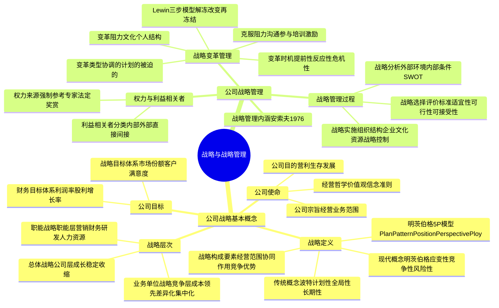
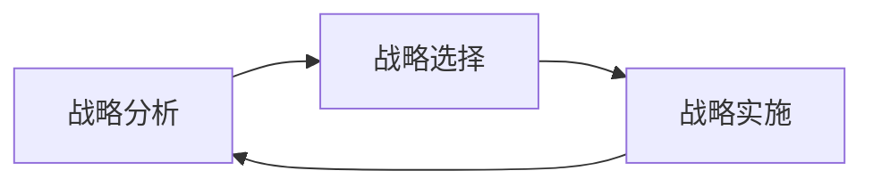

## 📍 章节定位

| 项目 | 信息 |
|------|------|
| **所属科目** | 🎯 公司战略与风险管理 |
| **难度等级** | ⭐ |
| **历年分值** | 2-3分 |
| **建议学时** | 3-4h |
| **核心地位** | 全书基础入门章，概念性为主 |

## 📝 考情分析

本章是本科目的开篇，奠定战略管理的基本概念框架。分值较低，历年约为 2-3 分，主要以客观题（单选、多选）形式考查，偶尔会以简答题的形式考查战略变革管理。命题密度虽不高，但概念辨析精细，是后续各章学习的"语言基础"。

### 命题规律与重点考查趋势

近五年考查频率较高的考点分布如下：

| 考点 | 出题频次 | 题型偏好 | 难度 |
|------|----------|----------|------|
| 战略定义（传统 vs 现代） | ★★★★★ | 单选 | 易 |
| 公司使命三要素 | ★★★★ | 单选/多选 | 易 |
| 战略层次对应关系 | ★★★★ | 单选/多选 | 中 |
| 战略管理过程三环节 | ★★★ | 多选 | 易 |
| 战略变革类型与时机 | ★★★★ | 单选/案例 | 中 |
| 战略变革阻力克服 | ★★ | 简答/案例 | 中 |
| 公司目标体系（财务 vs 战略） | ★★ | 多选 | 易 |

### 命题热点

1. **战略定义的属性辨析**：传统概念（波特）强调"计划性、全局性、长期性"，现代概念（明茨伯格）强调"应变性、竞争性、风险性"。命题陷阱常为"以下属于传统概念属性的是"——注意现代概念不包含"终点"。
2. **公司使命与目标的区分**：使命是定性、长远、根本性质的；目标是定量、可衡量、可分解的。命题陷阱：将"市场份额达到 30%"误判为使命——实为公司战略目标。
3. **战略层次的对应判断**：通过给定案例（如"宝洁决定退出某类日化业务"）判断属于哪一层次战略。典型案例：海尔集团层面决定"白电+黑电+米家"布局属于总体战略，"洗衣机业务采用差异化战略"属于业务单位战略。
4. **战略变革时机识别**：根据案例情境判断是提前性、反应性还是危机性变革。命题陷阱：当企业"在行业出现新技术苗头时立即转型"为提前性变革；"在竞争对手颠覆后才跟进"为反应性变革；"在业绩大幅下滑濒临破产时才转型"为危机性变革。

### 与前后章联系

- **承前**：本章是战略科目起点，无前置章节。但与《财务成本管理》中的"业绩评价"、《审计》中的"风险评估"概念有交叉。
- **启后**：本章提出的"战略分析→战略选择→战略实施"三环节直接对应第二、三、四章内容。其中第 2 章战略分析承接"战略分析"环节，第 3 章战略选择承接"战略选择"环节，第 4 章战略实施承接"战略实施"环节。本章的"战略层次"概念贯穿第 3 章（总体战略/业务单位战略/职能战略各对应一节）。本章的"战略变革"概念与第 4 章"战略控制与变革管理"内容深度衔接。

### 学习方法建议

本章内容相对抽象，建议采用"概念对比 + 案例锚定"的方法：
- **概念对比法**：将易混淆概念成对记忆（传统 vs 现代、使命 vs 目标、财务目标 vs 战略目标、提前性 vs 反应性 vs 危机性）。
- **案例锚定法**：每个概念配一个典型企业案例（如华为、海尔、阿里巴巴），通过案例反推概念，避免死记硬背。
- **图表化整理**：使用思维导图梳理战略层次、战略管理过程等结构化知识。

## 🧠 知识框架

## 📖 核心精讲

### 一、公司战略的基本概念

#### （一）公司战略的定义

| 概念类型 | 代表学者 | 核心观点 | 强调属性 |
|----------|----------|----------|----------|
| **传统概念** | 波特（Porter） | 战略是公司终点与达到终点途径的结合 | 计划性、全局性、长期性 |
| **现代概念** | 明茨伯格（Mintzberg） | 战略是一系列或整套决策或行动方式 | 应变性、竞争性、风险性 |

> 📌 **核心区别**：传统概念包含"终点"（目标），现代概念不包含"终点"只包含"途径"。实际企业战略是预谋（计划）与应急（适应）的组合。

1962年，钱德勒（Alfred D. Chandler）首次将"战略"引入企业管理领域，定义为"确定企业基本长期目标、选择行动途径和为实现这些目标进行资源分配"。

**战略发展历程关键节点**：

| 年份 | 学者 | 贡献 |
|------|------|------|
| 1962 | 钱德勒（Chandler） | 《战略与结构》，将"战略"概念引入企业管理 |
| 1965 | 安索夫（Ansoff） | 《公司战略》，提出"战略四要素" |
| 1976 | 安索夫 | 提出"战略管理"概念 |
| 1980 | 波特（Porter） | 《竞争战略》，提出五力模型和三大通用竞争战略 |
| 1987 | 明茨伯格（Mintzberg） | 提出战略 5P 模型与现代战略概念 |

#### （二）明茨伯格的 5P 战略模型

明茨伯格认为，战略应从五个维度理解，每个维度以字母"P"开头，简称 5P：

| 5P | 中文 | 含义 | 体现 |
|----|------|------|------|
| **Plan（计划）** | 战略是一种计划 | 战略是有意识、有目的的行动方案 | 强调"预谋性" |
| **Pattern（模式）** | 战略是一种模式 | 战略是企业在过去行为中体现的一致性模式 | 强调"已实现的战略" |
| **Position（定位）** | 战略是一种定位 | 战略是企业在环境中的位置选择 | 体现"外部环境适应性" |
| **Perspective（观念）** | 战略是一种观念 | 战略是共享的思维方式和企业文化 | 体现"内部一致性" |
| **Ploy（计谋）** | 战略是一种计谋 | 战略是针对竞争对手的策略性手段 | 体现"竞争性" |

> 📌 **5P 关系**：Plan 强调未来、Pattern 强调过去；Position 强调外部、Perspective 强调内部；Ploy 强调竞争对抗。5P 是互补而非互斥的关系。

**案例锚定——华为的 5P 战略**：
- **Plan**：华为《基本法》明确提出"成为世界级优秀企业"的长期计划；
- **Pattern**：华为多年来坚持"压强原则"，将资源聚焦于核心业务；
- **Position**：华为在ICT领域定位为"端到端解决方案提供商"；
- **Perspective**：华为"以客户为中心、以奋斗者为本"的核心价值观；
- **Ploy**：华为早期"农村包围城市"的市场进入策略，避开与西方厂商正面竞争。

#### （三）公司战略的构成要素

公司战略由四个要素构成：

| 要素 | 含义 | 体现层次 | 案例 |
|------|------|----------|------|
| **经营范围** | 企业从事生产经营活动的领域和地域 | 总体战略 | 海尔从白电扩展至黑电、智能家居 |
| **协同作用** | 各业务之间、各职能之间的协同效应 | 总体战略/职能战略 | 小米"铁人三项"（硬件+新零售+互联网）协同 |
| **竞争优势** | 企业在特定业务领域超越竞争对手的能力 | 业务单位战略 | 比亚迪新能源汽车的垂直整合优势 |
| **资源配置** | 企业资源和能力的部署与分配 | 全部层次 | 阿里将云计算资源优先分配给电商生态 |

#### （四）公司的使命与目标

公司使命阐明企业组织的根本性质与存在理由，包括三个方面：

| 要素 | 含义 | 核心问题 |
|------|------|----------|
| **公司目的** | 企业组织的根本性质和存在理由 | 为什么存在？ |
| **公司宗旨** | 阐述长期战略意向，说明经营业务范围 | 我们做什么？ |
| **经营哲学** | 价值观、基本信念和行为准则 | 我们信仰什么？ |

**1. 公司目的**

企业性质不同，其根本目的也不同：

| 企业类型 | 公司目的 |
|----------|----------|
| 营利组织 | 经济利润最大化、股东财富最大化 |
| 非营利组织 | 满足社会公共需要、提供公共服务 |
| 政府机构 | 维护公共利益、提供公共产品 |

**案例锚定——典型企业使命**：

| 企业 | 使命表述 | 要素识别 |
|------|----------|----------|
| 华为 | "构建万物互联的智能世界" | 公司宗旨 |
| 阿里巴巴 | "让天下没有难做的生意" | 公司宗旨 |
| 腾讯 | "用户为本，科技向善" | 经营哲学 |
| 比亚迪 | "为地球降温 1℃" | 公司宗旨 |
| 小米 | "始终坚持做感动人心、价格厚道的好产品" | 经营哲学 |
| 蒙牛 | "提供绿色、营养、健康的乳制品" | 公司宗旨 |

**2. 公司宗旨**

公司宗旨应明确回答"企业目前和未来将要从事的经营业务范围"，包括：
- **产品/服务范围**：企业所提供的产品或服务类别；
- **市场范围**：企业的目标客户和市场地域；
- **地理范围**：企业经营的地理区域；
- **技术范围**：企业运用的核心技术。

**3. 经营哲学**

经营哲学是企业文化的重要构成，包括：价值观、信念、行为准则、道德标准。例如华为的"以客户为中心、以奋斗者为本、长期艰苦奋斗"，强生信奉的"客户第一、员工第二、股东第三"信条。

**4. 公司目标**

**公司目标**是公司使命的具体化，分为两类：

| 目标类型 | 关注点 | 典型指标 | 时间维度 |
|----------|--------|----------|----------|
| **财务目标体系** | 经营业绩 | 投资回报率、收益率、股利增长率、股票价格、现金流 | 短期 |
| **战略目标体系** | 竞争地位 | 市场份额、产品质量、客户服务、技术领先、成本优势、竞争优势 | 长期 |

> 📌 **命题陷阱**：财务目标一定是量化可衡量的（如"投资回报率 15%"），战略目标可量化也可定性（如"成为行业技术领导者"）。两者都应从短期和长期两个维度体现，构成完整的目标体系。

**财务目标与战略目标的对比案例**：

| 企业 | 财务目标 | 战略目标 |
|------|----------|----------|
| 华为 | 营业收入年增长 10% | 5G 标准专利数全球第一 |
| 阿里巴巴 | GMV 突破 10 万亿 | 全球前三云计算服务商 |
| 茅台 | 净利润率保持 50% | 高端白酒品牌价值第一 |

#### （五）公司战略的层次

| 战略层次 | 别称 | 管理层次 | 核心问题 | 主要内容 |
|----------|------|----------|----------|----------|
| **总体战略** | 公司层战略 | 最高管理层 | 进入哪些经营领域？如何配置资源？ | 成长型战略（一体化、密集型、多元化）、稳定型战略、收缩型战略 |
| **业务单位战略** | 竞争战略 | 事业部门 | 如何在特定业务中竞争？ | 成本领先、差异化、集中化 |
| **职能战略** | 职能层战略 | 职能部门 | 各职能部门如何支撑总体和业务战略？ | 营销、财务、研发、人力资源、生产等职能策略 |

**三个层次战略的关系**：上层为下层提供方向与约束，下层为上层提供支撑与保障；上层战略决定下层战略，下层战略服从上层战略。

**案例锚定——海尔集团三层战略**：

| 层次 | 海尔案例 |
|------|----------|
| **总体战略** | "白电+黑电+智能家居+工业互联网平台"多元化布局；从产品制造商向"物联网生态品牌"转型 |
| **业务单位战略** | 冰箱业务采用差异化战略（高端品牌卡萨帝）；洗衣机业务采用成本领先战略（统帅品牌）；智能制造业务（卡奥斯平台）服务外部客户 |
| **职能战略** | 营销：以"人单合一"模式重塑客户关系；财务：推行"日清日高"财务管控；人力资源：内部"创客化"改革，员工成为创客 |

> 📌 对于单业务公司，总体战略和业务单位战略合二为一；只有多元化公司才需要区分这两个层次。例如一家纯服装制造企业，其总体战略与业务单位战略基本重合。

### 二、公司战略管理

#### （一）战略管理的内涵

"战略管理"一词由安索夫于1976年首次提出。战略管理是将企业日常业务决策与长期计划决策相结合的一系列经营管理业务。

战略管理的核心：制定和实施企业战略，关键是分析外部环境和内部条件，确定使命和战略目标，形成动态平衡。

**战略管理的特征**：

| 特征 | 含义 |
|------|------|
| **综合性** | 涉及企业各个层级、各个职能、各项资源 |
| **高层次** | 由企业最高管理层主导和决策 |
| **全局性** | 着眼于企业整体长远发展 |
| **动态性** | 战略需要随环境变化进行动态调整 |
| **风险性** | 战略决策影响深远，存在不确定性 |

**战略管理与经营管理的区别**：

| 维度 | 经营管理 | 战略管理 |
|------|----------|----------|
| 时间维度 | 短期 | 长期 |
| 决策层级 | 中基层管理者 | 高层管理者 |
| 决策范围 | 职能/业务 | 全公司/事业部 |
| 关注点 | 效率（把事情做对） | 方向（做对的事情） |
| 不确定性 | 较低 | 较高 |

#### （二）战略管理过程

战略管理是一个循环过程，包括三个核心环节：

| 环节 | 核心任务 | 主要内容 | 关键工具 |
|------|----------|----------|----------|
| **战略分析** | 了解组织所处环境和相对竞争地位 | 外部环境分析（PEST/五力）、内部环境分析（价值链/资源能力）、SWOT综合分析 | PEST、波特五力、价值链、SWOT、BCG 矩阵 |
| **战略选择** | 形成战略方案并选择 | 评价备选方案（适宜性、可行性、可接受性）、选择战略、制定政策 | SPACE矩阵、战略群组分析、BCG矩阵 |
| **战略实施** | 将战略转化为行动 | 组织结构调整、企业文化适配、资源配置、战略控制 | 7S模型、平衡计分卡、预算控制 |

> 📌 **战略评估的标准**（理查德·鲁梅尔特提出）：
> - **一致性（Consistency）**：战略目标与各层级策略是否协调一致；
> - **适宜性（Consonance）**：是否符合环境和企业条件；
> - **可行性（Feasibility）**：企业是否有能力实施；
> - **可接受性（Advantage）**：利益相关者是否接受，能否建立/保持竞争优势。

**战略分析环节细化的四个子环节**：

1. **外部环境分析**：宏观环境（PEST/PESTEL）、行业环境（波特五力、竞争结构）、竞争对手分析；
2. **内部环境分析**：资源能力分析（VRIO模型）、价值链分析、核心竞争力识别；
3. **综合分析**：SWOT 矩阵，将外部机会/威胁与内部优势/劣势组合；
4. **战略地图绘制**：明确战略目标之间的因果关系。

**战略选择环节细化的三个子环节**：

1. **生成战略方案**：基于战略分析结果，制定多个备选方案；
2. **评价战略方案**：根据适宜性、可行性、可接受性标准评估；
3. **选择战略方案**：综合考虑利益相关者诉求和资源约束。

**战略实施环节细化的四个子环节**：

1. **组织结构调整**：使组织结构适应战略需要（钱德勒命题："结构追随战略"）；
2. **企业文化适配**：推动企业文化变革以支撑战略落地；
3. **资源配置**：将财务、人力、技术资源按战略优先级分配；
4. **战略控制与变革管理**：建立战略控制系统，及时识别偏差并调整。

#### （三）权力与利益相关者

**1. 利益相关者分类**

| 类型 | 含义 | 举例 |
|------|------|------|
| **内部利益相关者** | 企业内部群体 | 股东、管理层、员工 |
| **外部利益相关者** | 企业外部群体 | 供应商、客户、政府、社区、竞争对手 |

按"权力-利益"矩阵进一步分类：

| 分类 | 权力大小 | 利益相关性 | 应对策略 |
|------|----------|-----------|----------|
| **关键群体（A）** | 高权力、高利益 | 最高 | 重点管理，密切合作 |
| **影响者（B）** | 高权力、低利益 | 较高 | 保持满意 |
| **重要群体（C）** | 低权力、高利益 | 中等 | 保持知情 |
| **最小努力群体（D）** | 低权力、低利益 | 最低 | 监督即可 |

**2. 企业权力的来源**

| 权力来源 | 含义 | 体现 |
|----------|------|------|
| **强制权力** | 通过惩罚或威胁施加影响 | 解雇、降职 |
| **参考权力** | 基于认同和崇拜 | 行业领袖的号召力 |
| **专家权力** | 基于专业知识和技能 | 技术专家在决策中的话语权 |
| **法定权力** | 基于职位和制度规定 | CEO对经营决策的最终决定权 |
| **奖赏权力** | 通过奖励施加影响 | 晋升、加薪、奖金 |

### 三、战略变革管理

#### （一）战略变革的类型

| 变革类型 | 含义 | 特点 | 典型案例 |
|----------|------|------|----------|
| **协调的变革** | 管理层预期并计划变革 | 主动性、计划性 | 华为向"全场景智慧生活"战略升级 |
| **计划的变革** | 管理层主动推进渐进式变革 | 渐进、有序 | 海尔"人单合一"模式渐进式推进 |
| **被迫的变革** | 外部环境迫使企业变革 | 被动、应急 | 诺基亚在智能手机冲击下的转型 |

**变革程度的另一种分类（渐进 vs 激进）**：

| 类型 | 速度 | 范围 | 风险 | 适用情境 |
|------|------|------|------|----------|
| **渐进式变革** | 缓慢 | 局部 | 较低 | 环境变化温和、企业内部资源充足 |
| **激进式变革** | 快速 | 全面 | 较高 | 环境发生颠覆性变化、企业面临生存危机 |

#### （二）战略变革的时机选择

| 时机 | 含义 | 风险 | 典型案例 |
|------|------|------|----------|
| **提前性变革** | 预见性变革，提前于危机发生 | 最优选择，风险最低 | 比亚迪 2003 年进入新能源汽车领域 |
| **反应性变革** | 危机已出现但不严重时变革 | 适中 | 京东在阿里电商冲击下加快自营物流建设 |
| **危机性变革** | 危机严重时才变革 | 风险最高，可能为时已晚 | 诺基亚在 iPhone 推出 5 年后才转向 Windows Phone，错失时机 |

> 📌 **最优时机**：提前性变革，即在问题出现前预判并采取行动。企业管理者应建立环境监测机制，及时识别变革信号。

**变革时机判断的三个信号**：
1. **经营信号**：销售额下降、利润下滑、市场份额持续减少；
2. **环境信号**：技术变革、政策调整、消费者偏好改变、新进入者颠覆；
3. **内部信号**：员工流失率上升、内部协调成本增加、关键人才出走。

#### （三）战略变革的阻力

**阻力来源**：

| 类型 | 来源 | 具体表现 |
|------|------|----------|
| **文化阻力** | 企业文化与变革方向不一致 | "我们一直是这么做的"思维定式 |
| **个人阻力** | 员工对未知的恐惧、利益受损 | 担心职位调整、薪酬下降 |
| **结构阻力** | 组织结构和制度不适应变革 | 部门壁垒阻碍跨职能协作、绩效考核不适配 |

**克服阻力的策略**：

| 策略 | 具体做法 | 适用场景 |
|------|----------|----------|
| **沟通与参与** | 向员工解释变革必要性，让其参与方案制定 | 变革涉及面广、员工认同度低 |
| **培训与支持** | 提供技能培训和心理疏导 | 变革要求新能力、员工焦虑明显 |
| **谈判与激励** | 通过利益交换和激励补偿获得支持 | 关键利益相关者利益受损 |
| **强制与合作** | 利用职权推动变革，必要时引入外部力量 | 变革紧迫、阻力顽固 |

#### （四）Lewin 三步变革模型

社会心理学家库尔特·卢因（Kurt Lewin）提出的经典变革模型，将变革分为三个阶段：

| 阶段 | 含义 | 关键活动 | 比喻 |
|------|------|----------|------|
| **解冻（Unfreeze）** | 打破现状，激发变革动机 | 沟通危机感、削弱阻力 | 将冰块从当前形状融化 |
| **改变（Change）** | 实施新的行为和模式 | 培训、试点、推广 | 重新塑造冰块形状 |
| **再冻结（Refreeze）** | 巩固新行为，使其成为新常态 | 制度化、绩效考核挂钩 | 让新形状的冰块固化 |

**案例锚定——海尔"人单合一"变革三阶段**：
- **解冻**：张瑞敏 2005 年提出"流程再造"，打破原有职能制结构；
- **改变**：推行自主经营体模式，员工直接面对用户；
- **再冻结**：通过"日清日高"机制、创客制股权激励固化新文化。

#### （五）变革管理的其他经典模型

**1. Kotter 八步变革模型**

| 步骤 | 内容 |
|------|------|
| 1 | 建立紧迫感 |
| 2 | 组建领导联盟 |
| 3 | 形成愿景和战略 |
| 4 | 沟通变革愿景 |
| 5 | 授权员工行动 |
| 6 | 创造短期胜利 |
| 7 | 巩固成果并推动更多变革 |
| 8 | 将新做法制度化 |

**2. McKinsey 7S 模型**（在第 4 章战略实施中详细展开）

7S 模型认为组织变革需协调七个要素：硬件要素（战略 Strategy、结构 Structure、制度 Systems）+ 软件要素（风格 Style、员工 Staff、技能 Skills、共同价值观 Shared Values）。

## 💡 典型例题

**【例题 1】（单选题，传统概念 vs 现代概念）**

明茨伯格提出的战略现代概念强调的属性是（ ）。
A. 计划性、全局性、长期性
B. 应变性、竞争性、风险性
C. 系统性、专业性、二重性
D. 客观性、战略性、可行性

**答案**：B

**解析**：传统概念由波特提出，强调"计划性、全局性、长期性"，包含"终点"（目标）；现代概念由明茨伯格提出，强调"应变性、竞争性、风险性"，不包含"终点"只包含"途径"。A 是传统概念；C、D 均非教材列举的属性。

**【例题 2】（单选题，使命 vs 目标）**

下列各项中，属于公司使命的是（ ）。
A. 投资回报率达到 15%
B. 成为行业技术领导者
C. 公司宗旨
D. 市场份额提升至 30%

**答案**：C

**解析**：公司使命包括公司目的、公司宗旨、经营哲学三要素，"公司宗旨"本身就是使命的组成部分。A、D 是量化指标，属于公司目标（财务目标/战略目标）；B "成为行业技术领导者"是定性的战略目标，不属于使命。命题陷阱：使命是定性的"为什么、做什么、信仰什么"，目标是可衡量可分解的"达到什么程度"。

**【例题 3】（单选题，战略层次识别）**

某大型家电集团决定退出黑色家电业务，集中资源发展白色家电和智能家居业务。该决策属于（ ）。
A. 总体战略
B. 业务单位战略
C. 职能战略
D. 经营战略

**答案**：A

**解析**：总体战略（公司层战略）解决"进入、退出、保留哪些经营领域"的问题。该集团决定"退出黑色家电、发展白色家电和智能家居"属于经营范围和资源配置的决策，是典型的总体战略。业务单位战略是在特定业务中如何竞争（如成本领先/差异化），职能战略是各部门的具体策略。

**【例题 4】（单选题，变革时机判断）**

某传统零售企业在电商兴起初期（行业渗透率不足 5%）即开始布局线上渠道，整合线上线下资源，实现全渠道零售。该企业的战略变革时机属于（ ）。
A. 提前性变革
B. 反应性变革
C. 危机性变革
D. 协调性变革

**答案**：A

**解析**：提前性变革是指管理者在问题出现前预判环境变化并主动采取行动，是变革的最佳时机。本题企业在电商兴起初期（渗透率不足 5%）即布局线上，属于"预见性变革，提前于危机发生"，为提前性变革。反应性变革是危机已出现但不严重时变革；危机性变革是危机严重时才变革；"协调的变革"是变革类型而非时机分类。

**【例题 5】（多选题，明茨伯格 5P 模型）**

明茨伯格提出的战略 5P 模型包括（ ）。
A. Plan（计划）
B. Pattern（模式）
C. Position（定位）
D. Perspective（观念）
E. Ploy（计谋）

**答案**：ABCDE

**解析**：5P 模型是明茨伯格 1987 年提出，包括 Plan（计划）、Pattern（模式）、Position（定位）、Perspective（观念）、Ploy（计谋）五个维度。其中 Plan 强调未来预谋性、Pattern 强调过去行为模式、Position 强调外部定位、Perspective 强调内部观念、Ploy 强调竞争对抗计谋。

**【例题 6】（多选题，战略变革阻力来源）**

下列各项中，属于战略变革阻力来源的有（ ）。
A. 企业文化与变革方向不一致
B. 员工对未知的恐惧
C. 组织结构不适应变革
D. 管理层对变革的支持
E. 员工利益可能受损

**答案**：ABCE

**解析**：战略变革的阻力主要来自三个方面：①文化阻力（A，企业文化与变革方向不一致）；②个人阻力（B、E，员工对未知的恐惧、利益受损）；③结构阻力（C，组织结构和制度不适应变革）。D 是促进变革的因素，不是阻力。

**【例题 7】（简答题，变革管理案例）**

某传统制造企业在数字化转型过程中遇到以下问题：①部分老员工抵触新系统，担心自己被裁员；②中层管理者担心部门权力被削减，消极配合；③组织架构仍是职能制，与数字化要求的扁平化、跨职能协作不匹配。

要求：分析该企业战略变革的阻力来源，并提出克服阻力的具体措施。

**答案**：

（1）阻力来源分析：
- 老员工抵触属于**个人阻力**——对未知的恐惧和利益受损（担心被裁员）；
- 中层管理者消极配合属于**个人阻力**和**结构阻力**——担心权力被削减、利益受损；
- 组织架构不匹配属于**结构阻力**——职能制结构与数字化要求不匹配。

（2）克服阻力的措施：
- **沟通与参与**：向员工清晰传达数字化转型的必要性和对员工的长远价值，让老员工和中层管理者参与转型方案制定，增强认同感；
- **培训与支持**：为老员工提供数字化技能培训，建立"导师制"由数字化骨干"一对一"辅导，帮助其适应新系统；
- **激励与谈判**：建立数字化转型的激励补偿机制，对积极配合并达成转型目标的部门和个人给予奖金、股权或晋升机会；对中层管理者明确转型后新的职责和发展空间；
- **组织结构变革**：推动职能制向矩阵式或事业部制转变，建立跨职能的数字化项目团队，配套调整绩效考核体系；
- **强制与合作**：对顽固抵触、消极怠工的人员，必要时通过岗位调整或退出机制推动变革；同时引入外部咨询机构协助变革落地。

**解析**：本题综合考查变革阻力来源识别和克服阻力的策略。考生应将"个人阻力、文化阻力、结构阻力"三类来源与案例具体表现对应，并针对性地提出沟通、培训、激励、结构变革、强制等措施。

## 🎯 记忆口诀

- **传统vs现代**：传统"计全长"（计划、全局、长期）vs 现代"应竞险"（应变、竞争、风险）。传统包含"终点"，现代只有"途径"。
- **5P 模型**：Plan（计划未来）、Pattern（模式过去）、Position（定位外部）、Perspective（观念内部）、Ploy（计谋竞争）——"计模定观计"五字记忆。
- **使命三要素**："目（目的）宗（宗旨）哲（哲学）"——为什么存在、做什么、信仰什么。
- **使命 vs 目标**：使命定性长远，目标定量可分。使命是"为什么/做什么/信仰什么"，目标是"达到什么程度"。
- **目标双体系**：财务目标"短利"（投资回报率/股利/股价），战略目标"长竞"（市场份额/技术领先/竞争优势）。
- **战略三层次**："总（总体）业（业务单位）职（职能）"——从高到低，上层管"做什么"下层管"怎么做"。
- **战略管理三环节**："分（分析）选（选择）施（实施）"——循环往复。
- **战略评估四标准**：一致（一致）、适宜（适宜）、可行（可行）、可接受（可接受）。
- **变革三类型**：协（协调）计（计划）被（被迫）——从主动到被动。
- **变革三时机**："提（提前）反（反应）危（危机）"——越早越好，提前最优。
- **变革三阻力**：文（文化）人（个人）结（结构）——文化、个人、结构三类阻力。
- **Lewin 三步**：解冻（破现状）、改变（新模式）、再冻结（固化）——"冰块三态变化"比喻。
- **权力五来源**：强（强制）参（参考）专（专家）法（法定）赏（奖赏）——"强参专法赏"。
- **利益相关者矩阵**：双高（高权力高利益）重点管，双低（低权力低利益）只监督，权力高利益低要满意，权力低利益高保知情。

## ✅ 同步练习

**1. [单选]** 以下属于公司使命的是（ ）。
A. 投资回报率达到15%  B. 成为行业技术领导者  C. 公司宗旨  D. 市场份额提升至30%

**2. [单选]** "战略管理"一词首次由哪位学者提出？（ ）
A. 波特  B. 明茨伯格  C. 安索夫  D. 钱德勒

**3. [多选]** 战略管理过程包括（ ）。
A. 战略分析  B. 战略选择  C. 战略实施  D. 战略控制

**4. [简答]** 简述公司战略的三个层次及其核心问题。

**5. [案例分析]** 某企业在行业出现新技术趋势时，选择立即进行战略转型。但在转型过程中遇到员工抵触，部分中层管理人员因担心职位调整而消极配合。请分析该企业战略变革的时机类型，并提出克服阻力的建议。

> 参考答案：1.C（A、D是目标，B是战略目标；宗旨属于使命的一部分）  2.C  3.ABC  4.见核心精讲"公司战略的层次"  5.时机类型为"提前性变革"（预见新技术趋势提前转型，属最优时机）。克服阻力建议：①加强沟通，向员工解释变革的必要性和前景；②让员工参与变革方案制定，增强认同感；③提供培训和支持，帮助员工适应新要求；④建立激励补偿机制，对配合变革的员工给予奖励；⑤对核心岗位人员进行单独沟通，消除职位担忧。
