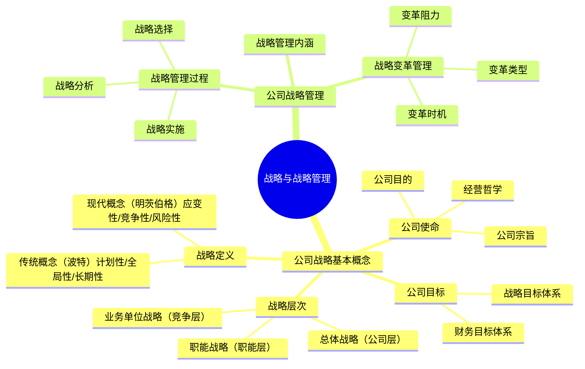
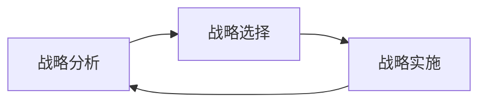

## 📍 章节定位

| 项目 | 信息 |
|------|------|
| **所属科目** | 🎯 公司战略与风险管理 |
| **难度等级** | ⭐ |
| **历年分值** | 2-3分 |
| **建议学时** | 3-4h |
| **核心地位** | 全书基础入门章，概念性为主 |

## 📝 考情分析

本章是本科目的开篇，奠定战略管理的基本概念框架。分值较低，以客观题为主。

命题规律：
- **战略定义**：传统概念（波特）vs 现代概念（明茨伯格）的属性区分
- **公司使命**：公司目的、公司宗旨、经营哲学三方面
- **战略层次**：总体战略、业务单位战略、职能战略的对应关系
- **战略管理过程**：战略分析→战略选择→战略实施
- **战略变革**：变革类型、变革时机选择

本章内容多为概念性知识点，需准确区分易混淆概念。

## 🧠 知识框架

## 📖 核心精讲

### 一、公司战略的基本概念

#### （一）公司战略的定义

| 概念类型 | 代表学者 | 核心观点 | 强调属性 |
|----------|----------|----------|----------|
| **传统概念** | 波特（Porter） | 战略是公司终点与达到终点途径的结合 | 计划性、全局性、长期性 |
| **现代概念** | 明茨伯格（Mintzberg） | 战略是一系列或整套决策或行动方式 | 应变性、竞争性、风险性 |

> 📌 **核心区别**：传统概念包含"终点"（目标），现代概念不包含"终点"只包含"途径"。实际企业战略是预谋（计划）与应急（适应）的组合。

1962年，钱德勒首次将"战略"引入企业管理领域，定义为"确定企业基本长期目标、选择行动途径和为实现这些目标进行资源分配"。

#### （二）公司的使命与目标

公司使命阐明企业组织的根本性质与存在理由，包括三个方面：

| 要素 | 含义 | 核心问题 |
|------|------|----------|
| **公司目的** | 企业组织的根本性质和存在理由 | 为什么存在？ |
| **公司宗旨** | 阐述长期战略意向，说明经营业务范围 | 我们做什么？ |
| **经营哲学** | 价值观、基本信念和行为准则 | 我们信仰什么？ |

**公司目标**是公司使命的具体化，分为两类：

| 目标类型 | 关注点 | 典型指标 |
|----------|--------|----------|
| **财务目标体系** | 经营业绩 | 投资回报率、收益率、股利增长率、股票价格 |
| **战略目标体系** | 竞争地位 | 市场份额、产品质量、客户服务、技术领先、竞争优势 |

> 📌 财务目标关注短期经营业绩；战略目标关注长远竞争力和业务前景。两者都应从短期和长期两个维度体现。

#### （三）公司战略的层次

| 战略层次 | 别称 | 管理层次 | 核心问题 |
|----------|------|----------|----------|
| **总体战略** | 公司层战略 | 最高管理层 | 进入哪些经营领域？如何配置资源？ |
| **业务单位战略** | 竞争战略 | 事业部门 | 如何在特定业务中竞争？ |
| **职能战略** | 职能层战略 | 职能部门 | 各职能部门如何支撑总体和业务战略？ |

> 📌 对于单业务公司，总体战略和业务单位战略合二为一；只有多元化公司才需要区分这两个层次。

### 二、公司战略管理

#### （一）战略管理的内涵

"战略管理"一词由安索夫于1976年首次提出。战略管理是将企业日常业务决策与长期计划决策相结合的一系列经营管理业务。

战略管理的核心：制定和实施企业战略，关键是分析外部环境和内部条件，确定使命和战略目标，形成动态平衡。

#### （二）战略管理过程

战略管理是一个循环过程，包括三个核心环节：

| 环节 | 核心任务 | 主要内容 |
|------|----------|----------|
| **战略分析** | 了解组织所处环境和相对竞争地位 | 外部环境分析（PEST/五力）、内部环境分析（价值链/资源能力）、SWOT综合分析 |
| **战略选择** | 形成战略方案并选择 | 评价备选方案（适宜性、可行性、可接受性）、选择战略、制定政策 |
| **战略实施** | 将战略转化为行动 | 组织结构调整、企业文化适配、资源配置、战略控制 |

> 📌 **战略评估的标准**：①适宜性（是否符合环境和企业条件）；②可行性（企业是否有能力实施）；③可接受性（利益相关者是否接受）。

### 三、战略变革管理

#### （一）战略变革的类型

| 变革类型 | 含义 | 特点 |
|----------|------|------|
| **协调的变革** | 管理层预期并计划变革 | 主动性、计划性 |
| **计划的变革** | 管理层主动推进渐进式变革 | 渐进、有序 |
| **被迫的变革** | 外部环境迫使企业变革 | 被动、应急 |

#### （二）战略变革的时机选择

| 时机 | 含义 | 风险 |
|------|------|------|
| **提前性变革** | 预见性变革，提前于危机发生 | 最优选择，风险最低 |
| **反应性变革** | 危机已出现但不严重时变革 | 适中 |
| **危机性变革** | 危机严重时才变革 | 风险最高，可能为时已晚 |

> 📌 **最优时机**：提前性变革，即在问题出现前预判并采取行动。

#### （三）战略变革的阻力

**阻力来源**：
1. **文化阻力**：企业文化与变革方向不一致
2. **个人阻力**：员工对未知的恐惧、利益受损
3. **结构阻力**：组织结构和制度不适应变革

**克服阻力的策略**：沟通与参与、培训与支持、谈判与激励、强制与合作。

## 💡 典型例题

**【单选】** 明茨伯格提出的战略现代概念强调的属性是（ ）。
A. 计划性、全局性、长期性  B. 应变性、竞争性、风险性  C. 系统性、专业性、二重性  D. 客观性、战略性、可行性

**【参考答案】** B

## 🎯 记忆口诀

- **传统vs现代**：传统"计全长"（计划、全局、长期）vs 现代"应竞险"（应变、竞争、风险）
- **使命三要素**："目（目的）宗（宗旨）哲（哲学）"——为什么存在、做什么、信仰什么
- **战略三层次**："总（总体）业（业务单位）职（职能）"——从高到低
- **战略管理三环节**："分（分析）选（选择）施（实施）"——循环往复
- **变革三时机**："提（提前）反（反应）危（危机）"——越早越好

## ✅ 同步练习

**1. [单选]** 以下属于公司使命的是（ ）。
A. 投资回报率达到15%  B. 成为行业技术领导者  C. 公司宗旨  D. 市场份额提升至30%

**2. [单选]** "战略管理"一词首次由哪位学者提出？（ ）
A. 波特  B. 明茨伯格  C. 安索夫  D. 钱德勒

**3. [多选]** 战略管理过程包括（ ）。
A. 战略分析  B. 战略选择  C. 战略实施  D. 战略控制

**4. [简答]** 简述公司战略的三个层次及其核心问题。

**5. [案例分析]** 某企业在行业出现新技术趋势时，选择立即进行战略转型。但在转型过程中遇到员工抵触，部分中层管理人员因担心职位调整而消极配合。请分析该企业战略变革的时机类型，并提出克服阻力的建议。

> 参考答案：1.C（A、D是目标，B是战略目标；宗旨属于使命的一部分）  2.C  3.ABC  4.见核心精讲"公司战略的层次"  5.时机类型为"提前性变革"（预见新技术趋势提前转型，属最优时机）。克服阻力建议：①加强沟通，向员工解释变革的必要性和前景；②让员工参与变革方案制定，增强认同感；③提供培训和支持，帮助员工适应新要求；④建立激励补偿机制，对配合变革的员工给予奖励；⑤对核心岗位人员进行单独沟通，消除职位担忧。
