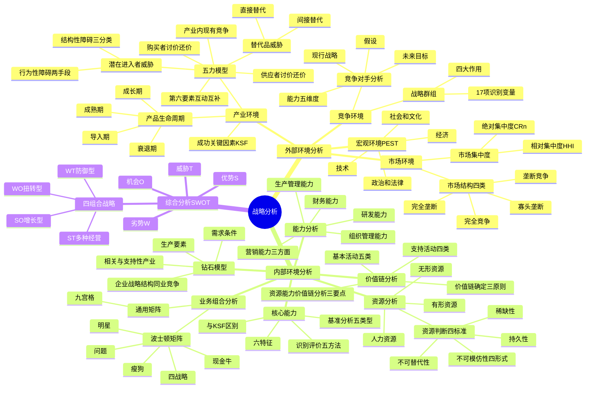

## 1. 章节定位

| 项目 | 信息 |
|------|------|
| 所属科目 | 公司战略与风险管理 |
| 难度等级 | 4 |
| 历年分值 | 12-18 分 |
| 建议学时 | 14-18 小时 |
| 知识关联章节 | 第1章 战略管理过程（战略分析要素）、第3章 战略选择（竞争战略与五力模型应对）、第4章 战略实施（组织能力匹配）、第6章 风险管理概述（外部环境风险识别） |

## 2. 考情分析

本章是公司战略与风险管理科目的核心重难点章节，历年分值约 12-18 分，是必考主观题章节。主观题常要求考生基于给定案例运用 PEST、五力模型、价值链、波士顿矩阵、SWOT 等工具进行分析，客观题则集中在概念辨析与分类判断。

**命题规律**：本章框架多、模型多、案例多。命题人以给定企业案例为载体，要求考生识别所运用的分析工具、判断模型要素归属、推断战略选择。近年考试强调"分析+应用"，单纯记忆已不足以应对主观题。

**高频考点分布**：

1. **PEST 分析**：政治和法律、经济、社会和文化、技术四类环境因素的识别；每类环境下的细分要素（如人口因素、社会流动性、消费心理、生活方式变化、文化传统、价值观）；典型案例（WS 公司滤水壶决策）。
2. **产品生命周期**：导入期、成长期、成熟期、衰退期四阶段的特征（销量、价格、利润、竞争、经营风险、战略路径）；Y 白药改变牙膏产业生命周期曲线形状的案例；生命周期理论的批评。
3. **波特五力模型**：潜在进入者威胁（结构性障碍三分类与七种障碍、行为性障碍两种报复手段）、替代品威胁（直接替代与间接替代、性能—价格比）、供应者和购买者讨价还价能力（四要素）、产业内现有企业竞争（五种激烈情形）；对付五种竞争力的战略；五力模型的局限性；亚非第六要素——互动互补作用力。
4. **成功关键因素（KSF）**：三个确认问题；与技术、制造、分销、营销、技能相关的 KSF；不同产业的 KSF 差异；产品生命周期各阶段 KSF 变化；KSF 与企业核心能力的区别。
5. **市场集中度**：绝对集中度 CRn 的计算与优缺点；相对集中度（洛伦兹曲线、基尼系数、HHI 指数）；HHI 的计算与优缺点；影响市场集中度的因素（供给端、需求端、政策制度、外部冲击）。
6. **市场结构分类**：完全竞争、垄断竞争、寡头垄断、完全垄断四类与 CRn、HHI 的对应关系。
7. **竞争对手分析**：未来目标、假设、现行战略、能力四方面；能力的五个维度（核心能力、成长能力、快速反应能力、适应变化能力、持久力）；子公司分析的特殊考虑。
8. **战略群组**：战略群组的识别变量（17 项）；战略群组分析的四个作用（了解竞争状况、移动障碍、群组内竞争着眼点、预测市场变化发现战略机会）；蓝海战略延伸。
9. **企业资源**：有形资源、无形资源、人力资源；资源判断四标准（稀缺性、不可模仿性四种形式、不可替代性、持久性）。
10. **企业能力**：研发能力、生产管理能力、营销能力（产品竞争能力、销售活动能力、市场决策能力）、财务能力、组织管理能力。
11. **核心能力**：普雷哈拉德和哈梅尔的树根—树干—花果比喻；核心能力六特征（价值性、独特性、可延展性、不可替代性、动态性、整合性）；识别评价方法（自我评价、产业内部比较、基准分析、成本驱动力和作业成本法、收集竞争对手信息）；基准分析五种类型（内部基准、竞争性基准、过程或活动基准、一般基准、顾客基准）。
12. **钻石模型**：生产要素（初级与高级、一般与专业）、需求条件、相关与支持性产业、企业战略企业结构和同业竞争四要素。
13. **价值链分析**：基本活动五类（内部后勤、生产经营、外部后勤、市场销售、服务）；支持活动四类（采购管理、技术开发、人力资源管理、企业基础设施）；价值链确定的三原则；企业资源能力的价值链分析三个要点。
14. **波士顿矩阵**：市场增长率（10% 分界）与相对市场占有率（1.0 分界）；四类业务（明星、问题、现金牛、瘦狗）；四种战略（发展、保持、收割、放弃）；启示与局限。
15. **通用矩阵**：九宫格改进；左上方三格增长发展战略、右下方三格停止转移撤退战略、对角线三格维持或有选择发展。
16. **SWOT 分析**：优势、劣势、机会、威胁；四类组合战略（SO 增长型、WO 扭转型、ST 多种经营、WT 防御型）。

**联动考查方式**：
- 与第3章联动：五力模型分析与基本竞争战略（成本领先、差异化、集中化）选择；波士顿矩阵业务定位与发展/稳定/收缩战略选择；
- 与第4章联动：价值链支持活动与组织结构、企业文化匹配；
- 与第6章联动：PEST 中政治法律、技术因素与外部风险识别；
- 与第1章联动：利益相关者分析与五力模型中供应者/购买者讨价还价能力结合。

**备考建议**：
- 牢记每个分析工具的"要素清单"和"判断标准"——本章主观题核心得分点；
- 区分易混概念：成功关键因素（产业和市场层次）vs 企业核心能力（企业层次）；有形资源 vs 无形资源；基本活动 vs 支持活动；
- 五力模型的"结构性障碍三分类"（规模经济、关键资源控制、市场优势）与"波特七种障碍"的对应关系必须掌握；
- 波士顿矩阵四类业务的"市场增长率—相对市场占有率—现金流—战略"四要素对应要熟；
- HHI 计算公式与 CRn 计算公式必须能熟练运用，注意市场份额以百分数还是小数代入；
- 案例题答题模板：先识别工具，再列示要素，最后结合案例材料逐项对应分析。

## 3. 知识框架

## 4. 核心精讲

### 4.1 企业外部环境分析

企业的外部环境可以从宏观环境、产业环境、市场环境和竞争环境等几个层面展开。

#### 4.1.1 宏观环境分析（PEST）

宏观环境因素可以概括为四类：政治和法律因素（Political）、经济因素（Economic）、社会和文化因素（Social）、技术因素（Technological）。四个英文首字母组合为 PEST，故称 PEST 分析。

**（一）政治和法律环境**

政治和法律环境是指那些制约和影响企业的政治要素和法律系统，以及其运行状态。政治环境包括国家的政治制度、权力机构、颁布的方针政策、政治团体和政治形势等因素；法律环境包括国家制定的法律、法规、法令以及国家的执法机构等。

政治环境分析一般包括四个方面：①企业所在国家和地区的政局稳定状况；②政府行为对企业的影响（如政府如何拥有国家土地、自然资源及其储备）；③执政党所持的态度和推行的基本政策（外交政策、人口政策、税收政策、进出口限制等），以及这些政策的连续性和稳定性；④各政治利益集团对企业活动产生的影响。

法律环境分析的四大目的：①保护企业，反对不正当竞争；②保护消费者（涵盖商品包装、商标、食品卫生、广告等法规）；③保护员工（招聘法律和健康与安全法规）；④保护公众权益免受不合理企业行为的损害。

**（二）经济环境**

经济环境包括社会经济结构、经济发展水平与状况、经济体制、宏观经济政策和其他经济条件等要素。与政治法律环境相比，经济环境对企业生产经营的影响更直接、更具体。

| 要素 | 含义 |
|------|------|
| 社会经济结构 | 国民经济中不同经济成分、不同产业部门及社会再生产各方面组成国民经济整体时的相互适应性、量的比例以及排列关联状况；包括产业结构、分配结构、交换结构、消费结构和技术结构 |
| 经济发展水平与状况 | 国家经济发展的规模、速度和所达到的水平；常用指标有 GDP、人均 GDP、人均国民收入和经济增长速度等；其他因素包括税收水平、通货膨胀率、贸易差额和汇率、失业率、利率、信贷投放以及政府补助等 |
| 经济体制 | 国家经济组织的形式，规定了国家与企业、企业与企业、企业与各经济部门之间的关系 |
| 宏观经济政策 | 实现国家经济发展目标的战略和策略，包括综合性的全国发展战略和财政政策、货币政策、产业政策、国民收入分配政策等 |
| 其他经济条件 | 工资水平、供应商及竞争对手产品和服务的价格变化等 |

**（三）社会和文化环境**

社会和文化环境包括人口因素、社会流动性、消费心理、生活方式变化、文化传统和价值观等。

| 要素 | 内容 |
|------|------|
| 人口因素 | 居民地理分布及密度、年龄、教育水平、国籍等；分析变量包括结婚率、离婚率、出生率、死亡率、人口平均寿命、年龄和地区分布、民族和性别比例、教育水平和生活方式差异等 |
| 社会流动性 | 社会分层情况、各阶层差异、阶层间转换可能、人口内部各群体规模、财富及其构成变化、不同区域人口分布等；对产品定位与调整、市场细分策略制定非常重要 |
| 消费心理 | 顾客在购物过程中追求新鲜感多于实际需求等心理；企业应有不同产品类型以满足不同顾客心理需求 |
| 生活方式变化 | 人们对物质需求越来越高，对社交、自尊、求知、审美等精神需求越来越强烈 |
| 文化传统 | 国家或地区在较长历史时期内形成的社会习惯；如中国春节、西方圣诞节为某些行业带来商机 |
| 价值观 | 社会公众评价各种行为的观念和标准；不同国家和地区存在差异 |

**（四）技术环境**

技术环境包括国家科技体制、科技政策、科技水平和科技发展趋势等。技术环境对战略的影响包括：①技术进步使企业能对市场及客户进行更有效的分析；②新技术的出现使社会对本行业产品和服务的需求增加；③技术进步可创造竞争优势；④技术进步可导致现有产品被淘汰或大大缩短产品生命周期；⑤新技术的发展使企业可更多关注环境保护、社会责任及可持续成长等问题。

**【案例 WS 公司滤水壶战略决策的 PEST 分析】** WS 公司总经理刘涛在国外旅游时接触到德国 B 滤水壶，决定将其引入中国市场。决策依据 PEST 分析：
- 政治和法律因素：2012 年 7 月 1 日起《生活饮用水卫生标准》在中国国内强制性实施，饮用水监测指标从 35 项提升到 106 项。
- 经济因素：改革开放后中国经济迅速发展，能满足人民群众日益增长的对健康和品质生活追求的产品通常都会有较好的市场表现。
- 社会和文化因素：居民生活质量大大提高，普通消费者的生活重点已经从追求温饱渐渐过渡到寻求健康的新阶段。
- 技术因素：城市自来水处理工艺及技术标准相对不高；B 滤水壶核心在于独有的双重滤芯技术，采用椰壳活性碳、无钠离子交换树脂等自有专利技术。

#### 4.1.2 产业环境分析

**（一）产品生命周期**

波特认为产业发展要经过四个阶段：导入期、成长期、成熟期和衰退期。这些阶段以产业销售额增长率曲线的拐点划分，产业的增长与衰退由于新产品的创新和推广过程而呈"S"形。

| 阶段 | 用户与产品 | 营销与产能 | 价格与利润 | 战略目标 | 战略路径 | 经营风险 |
|------|----------|----------|----------|---------|---------|---------|
| 导入期 | 用户很少，只有高收入用户尝试；产品设计新颖但质量有待提高，尤其是可靠性；产品类型、特点、性能和目标市场尚在变化 | 竞争对手很少；营销成本高，广告费用大；销量小，产能过剩，生产成本高 | 价格弹性较小，采用高价格、高毛利政策；但销量小使净利润较低 | 扩大市场份额，争取成为"领头羊" | 投资于研究开发和技术改进，提高产品质量 | 非常高；产品能否成功、能否被顾客接受、能否达到经济生产规模、能否取得相应市场份额均存在不确定性 |
| 成长期 | 产品销量节节攀升，客户群已扩大；消费者接受参差不齐的质量，对质量要求不高；各厂家产品在技术和性能方面有较大差异 | 广告费用较高但每单位销售收入分担的广告费在下降；生产能力不足，需向大批量生产转换，建立大宗分销渠道；竞争者涌入，争夺人才和资源，出现兼并等意外事件 | 需求大于供应，产品价格最高，单位产品净利润也最高 | 争取最大市场份额，并坚持到成熟期的到来 | 市场营销，改变价格形象和质量形象 | 有所下降，主要是产品本身的不确定性在降低；但竞争激烈导致市场不确定性增加 |
| 成熟期 | 市场巨大但基本饱和；新的客户减少，主要靠老客户重复购买；产品逐步标准化，差异不明显，技术和质量改进缓慢 | 竞争者之间出现挑衅性的价格竞争；生产稳定，局部生产能力过剩 | 产品价格开始下降，毛利率和净利润率均下降，利润空间适中 | 巩固市场份额的同时提高投资报酬率 | 提高效率，降低成本 | 进一步降低，达到中等水平；销售额和市场份额、盈利水平都比较稳定，现金流量容易预测 |
| 衰退期 | 客户对性价比要求很高；各企业产品差别小，价格差异缩小；为降低成本，产品质量可能会出现问题 | 产能严重过剩，只有大批量生产并有自己销售渠道的企业才具有竞争力；有些竞争者先于产品退出市场 | 产品的价格、毛利都很低；只有到后期，多数企业退出后，价格才有望上扬 | 首先是防御，获取最后的现金流 | 控制成本，以求能维持正的现金流量；缺乏成本控制优势则采用退却战略尽早退出 | 进一步降低，主要悬念是产品在什么时间节点将完全退出市场 |

**产品生命周期理论的批评**：①各阶段持续时间随产业不同而显著不同，且产业究竟处于哪一阶段通常不清楚；②产业的增长并不总是呈"S"形，有的跳过成熟阶段直接从成长走向衰亡，有的衰退后又重新上升，有的似乎完全跳过导入期；③公司可以通过产品创新和重新定位影响增长曲线形状；④与生命周期每一阶段相联系的竞争属性随着产业不同而不同。

**【案例 Y 白药改变牙膏产业生命周期曲线形状】** 2004 年 Y 白药进入日化行业时，中国日化行业已进入成熟期：竞争者之间出现挑衅性的价格竞争，市场基本饱和，产业销售额达到前所未有的规模，产品差异不明显，局部生产能力过剩，每年都有相当数量的日化企业欲退出市场，国际巨头产品价格开始向下移动。Y 白药没有重蹈本土企业中低端路线，通过市场调研了解到消费者对口腔健康日益重视，而市场上牙膏产品大多专注于美白、防蛀等基础功能，解决口腔健康问题的药物牙膏还是市场"空白点"。Y 白药创出独特的日化加药物牙膏，综合解决消费者口腔健康问题，树立"价值高、价格高、挡次高"的"三高"形象。Y 白药牙膏进入日化市场改变了本土品牌中低端化的现状，提升了整个牙膏行业的价格体系。随着 Y 白药推出功能化的高端产品，国际品牌也纷纷推出功能化的高端牙膏产品，整个市场呈现出"销售成长大于销售成长"的新特点，牙膏消费区间也逐渐向中高端移动。这说明 Y 白药的进入改变了中国牙膏产业生命周期曲线的形状，产业在一段时间之后又重新上升。

**（二）产业五种竞争力（波特五力模型）**

波特在《竞争战略》中提出五力模型，认为在每一个产业中都存在五种基本竞争力量：潜在进入者、替代品、购买者、供应者与现有竞争者间的抗衡。这五种力量共同决定产业竞争的强度以及产业利润率。

**1. 潜在进入者的进入威胁**

潜在进入者将在两个方面减少现有厂商的利润：第一，进入者会瓜分原有的市场份额；第二，进入者减少了市场集中，从而激发现有企业间的竞争，减少价格—成本差。进入威胁的大小取决于呈现的进入障碍与准备进入者可能遇到的现有在位者的反击，前者称为"结构性障碍"，后者称为"行为性障碍"。

**（1）结构性障碍**。波特指出存在七种主要障碍：规模经济、产品差异、资金需求、转换成本、分销渠道、其他优势及政府政策。按照贝恩（Bain J.）的分类，这七种主要障碍可归纳为三种主要进入障碍：

| 贝恩三分类 | 内容 |
|-----------|------|
| 规模经济 | 在一定时期内，企业所生产的产品或劳务的绝对量增加时，其单位成本趋于下降；当产业规模经济很显著时，处于最小有效规模（MES）或超过最小有效规模经营的老企业对于较小的新进入者就有成本优势 |
| 现有企业对关键资源的控制 | 一般表现为对资金、专利或专有技术、原材料供应、分销渠道、学习曲线（又称"经验曲线"）等资源及资源使用方法的积累与控制。学习曲线是指当某一产品累积生产量增加时，由于经验和专有技术的积累所带来的产品单位成本的下降 |
| 现有企业的市场优势 | 主要表现在品牌优势上（产品差异化的结果）；还表现在政府政策上 |

**区分规模经济与学习经济**：规模经济使得当经济活动处于一个比较大的规模时，能够以较低的单位成本进行生产；学习经济是由于累积经验而导致的单位成本的减少。即使在学习经济很小的情况下，规模经济也可能是很大的（如铝罐制造等简单资本密集型生产）；在规模经济很小时，学习经济也可以是很大的（如计算机软件开发等复杂的劳动密集型产业）。

**（2）行为性障碍（或战略性障碍）**。指现有企业对进入者实施报复手段所形成的进入障碍。报复手段主要有限制进入定价和进入对方领域两类：

- **限制进入定价**：在位的大企业报复进入者的重要武器，特别是在技术优势正在削弱、投资正在增加的市场上。在位企业试图通过实施低价来告诉进入者自己是低成本的，进入将是无利可图的。
- **进入对方领域**：寡头垄断市场上常见的报复行为，目的在于抵消进入者抢先采取行动可能带来的优势，避免对方的行动给自己带来的风险。

**【案例 GL 公司对 MD 公司的行为性障碍】** 当 MD 公司宣布大举进入微波炉产业时，当时占据微波炉产业霸主地位的 GL 公司再次举起了"价格战"的大旗（限制进入定价），并且同时宣布大举进军 MD 公司已有的优势产业空调、冰箱产业及风扇、电暖器等（进入对方领域），以彼之道还之彼身，对 MD 公司微波炉进行全面围剿。GL 公司将行为性障碍的两种报复手段运用到极致。

**2. 替代品的替代威胁**

产品替代有两类：

| 类型 | 含义 | 例子 |
|------|------|------|
| 直接产品替代 | 某一种产品直接取代另一种产品 | 苹果计算机取代微软计算机 |
| 间接产品替代 | 由能起到相同作用的产品非直接地取代另外一些产品 | 人工合成纤维取代天然布料 |

波特五力模型中所指替代品威胁是间接替代品。直接替代品与间接替代品的界限并不一定十分清晰，取决于对产业边界的界定。

老产品能否被新产品替代，主要取决于两种产品的**性能—价格比**的比较（即价值工程中"价值"的概念：价值=功能/成本）。如果新产品的性能—价格比高于老产品，新产品对老产品的替代就具有必然性。对于老产品来说，当替代品的威胁日益严重时，老产品往往已处于成熟期或衰退期，此时产品设计和生产标准化程度较高，技术已相当成熟，因此老产品提高产品价值的主要途径是降低成本与价格。

替代品之间的竞争规律：价值高的产品获得竞争优势。几种替代品长期共存也是常见情况（如汽车、火车、飞机、轮船长期共存）。

**3. 供应者、购买者讨价还价的能力**

五力模型的水平方向是对产业价值链的描述。产业价值链上每一个环节都具有双重身份：对其上游单位来说是购买者，对其下游单位来说是供应者。购买者和供应者讨价还价的能力大小取决于以下四方面实力：

| 要素 | 对供应者有利 | 对购买者有利 |
|------|------------|------------|
| 集中程度或业务量大小 | 少数几家公司控制供应者集团，销售给较零散的购买者 | 购买者购买力集中，或对卖方来说交易很可观 |
| 产品差异化程度与资产专用性 | 供应者产品存在差异，替代品不能竞争；上游产品高度专用化 | 供应者产品是标准的或没有差别，购买者可寻找最低价格 |
| 纵向一体化程度 | 供应者表现出前向一体化的现实威胁 | 购买者实行部分一体化或存在后向一体化的现实威胁 |
| 信息掌握的程度 | 供应者充分掌握购买者的有关信息，了解购买者转换成本 | 购买者充分了解需求、实际市场价格甚至供应商成本等信息 |

劳动力也是供应者的一部分，短缺的、高技能的雇员以及紧密团结起来的劳工可以与雇主讨价还价而削减相当一部分产业利润潜力。

**4. 产业内现有企业的竞争**

产业内现有企业的竞争在以下几种情况下可能很激烈：①产业内有众多的或势均力敌的竞争对手；②产业发展缓慢；③顾客认为所有的商品都是同质的；④产业中存在过剩的生产能力；⑤产业进入障碍低且退出障碍高。

**对付五种竞争力的战略**：①公司自我定位，通过利用成本优势或差异优势把公司与五种竞争力相隔离；②识别在产业的哪一个细分市场中五种竞争力的影响更小（波特"集中化战略"）；③努力改进这五种竞争力（与供应者或购买者建立长期战略联盟，寻求进入阻绝战略减少潜在进入者威胁等）。

**五力模型的局限性**：①该分析模型基本上是静态的；②能够确定行业的盈利能力，但对于非营利机构，有关获利能力的假设可能是错误的；③假设一旦进行了分析企业就可以制定战略处理分析结果，这只是理想方式；④假设战略制定者可以了解整个行业信息，但这一假设在现实中不一定存在；⑤低估了企业与供应商、客户或分销商、合资企业之间可能建立长期合作关系以减轻相互之间威胁的可能性；⑥对产业竞争力的构成要素考虑不够全面。

**第六要素——互动互补作用力**：哈佛商学院教授亚非（Yoffie D.）在波特研究的基础上，根据企业全球化经营的特点，提出第六个要素——互动互补作用力。任何一个产业内部都存在不同程度的互补互动（指互相配合一起使用）的产品或服务业务。在产业发展初期阶段，企业可考虑控制部分互补品的供应；随着行业发展，企业应有意识地帮助和促进互补行业的健康发展，可考虑采用捆绑式经营或交叉补贴销售等策略。

**（三）成功关键因素分析**

成功关键因素（KSF）是指公司在特定市场获得盈利必须拥有的技能和资产。确认产业成功关键因素必须考虑三个问题：①顾客在各个竞争品牌之间进行选择的基础是什么？②产业中的一个卖方厂商要取得竞争成功需要哪些资源和竞争能力？③产业中的一个卖方厂商获取持久的竞争优势必须采取哪些措施？

成功关键因素因产业不同而不同：在啤酒行业，KSF 是强大的批发分销商网络和上乘的广告；在服装生产行业，KSF 是吸引人的设计和色彩组合、清晰的市场定位与营销以及具有快速反应能力的敏捷供应链；在铝罐行业，KSF 是将生产工厂置于最终用户的近处（区域性市场份额比全国性市场份额重要）。

成功关键因素随着产品生命周期的演变而变化：导入期注重广告宣传、开辟销售渠道、提高生产效率、利用金融杠杆；成长期注重建立商标信誉、改进产品质量、集聚资源；成熟期注重加强和顾客的关系、降低成本、控制成本；衰退期注重选择市场区域、改善企业形象、缩减生产能力、保持价格优势。

即使是处于同一产业中的不同企业，也可能对 KSF 有不同侧重。例如苹果、小米、三星都是全球智能手机产业中的著名企业：苹果侧重于生态系统整合能力和极致的用户体验设计；小米侧重于严苛的成本控制、极高的供应链效率和全品类产品生态扩张；三星侧重于前沿硬件技术研发、纵向产业链整合能力和全球化市场覆盖能力。

#### 4.1.3 市场环境分析

**（一）市场集中度**

市场集中度是从特定市场内企业数量和规模两个因素分析市场结构的指标，反映了该市场内企业的竞争和垄断程度。

**1. 绝对集中度（CRn）**

绝对集中度是指特定市场内规模最大的前 n 家企业的某一指标（如销售收入、产量、资产总额等）占全市场总量的比重，计算公式：

$$CR_n = \frac{\text{前 } n \text{ 家企业的某一指标总和}}{\text{全市场该指标总量}} \times 100\%$$

**举例**：以销售额为指标，假设 2024 年中国家电市场总销售额为 10000 亿元，头部 3 家企业的销售额分别为企业甲 2000 亿元、企业乙 1200 亿元、企业丙 800 亿元，则该市场的绝对集中度为：CR3 =（2000+1200+800）/10000 = 40%。

**CRn 的优点**：①数据容易获取，计算简便；②适用场景广泛；③直观反映头部企业的市场控制力；④便于横向或纵向对比。

**CRn 的缺点**：①未直接反映头部企业内部的份额分布，无法体现寡头间的竞争差异；②n 值选择具有一定主观性并可能导致分析结果偏差；③仅关注头部企业，忽略中小企业的分布差异；④对市场边界的界定要求很高；⑤仅依赖规模指标，无法反映企业实际竞争能力的差异。

**2. 相对集中度（HHI）**

赫芬达尔—赫希曼指数（HHI）是衡量市场相对集中度的核心指标，通过计算市场内所有企业市场份额的平方和得出：

$$HHI = \sum (S_i^2)$$

其中 Si 代表市场中第 i 家企业的市场份额。若以百分比计算，HHI 取值范围是 0—10000；若以小数形式计算，取值范围是 0—1。

**举例**：假设 2024 年中国某区域智能手机市场上的总销售额为 1000 亿元，共有 8 家企业，企业甲 40%、企业乙 30%、企业丙 20%、其他 5 家共 10%，则 HHI = 40² + 30² + 20² + 10² = 1600 + 900 + 400 + 100 = 3000。

**HHI 的优点**：①能精准反映头部企业对市场的主导程度（平方运算放大头部权重）；②涵盖市场内所有企业，不遗漏中小企业影响；③计算逻辑简单且精准，结果易于解读和比较；④便于对市场进行监管，支持"反垄断"决策。

**HHI 的缺点**：①市场份额数据的可得性和准确性受到限制；②对市场边界界定极其敏感；③仅反映市场结构，忽略竞争行为和市场效率，可能误判竞争实质；④无法反映市场集中度高的来源，可能将高效竞争误判为垄断。

**（二）影响市场集中度的因素**

| 维度 | 因素 |
|------|------|
| 供给端 | 规模经济和范围经济；进入壁垒与退出壁垒；技术创新与专利壁垒；企业并购活动；资源掌控能力 |
| 需求端 | 市场规模与增长速度；消费者偏好与产品差异化；需求稳定性与周期性 |
| 政策与制度环境 | 反垄断与竞争政策；市场准入与监管政策 |
| 外部冲击 | 颠覆性技术创新；自然灾害与公共危机；全球化与国际贸易政策 |

**（三）市场结构的分类**

依据市场集中度，可将市场结构划分为四类：

| 市场结构 | CRn | HHI | 企业数量与产品差异 | 进入退出壁垒 | 定价权 | 例子 |
|---------|-----|-----|------------------|------------|--------|------|
| 完全竞争 | CR4<10% | HHI<100 | 无数小企业，产品完全同质 | 无壁垒，自由进入退出 | 无定价权，企业是价格接受者 | 农产品市场、普通小商品批发市场 |
| 垄断竞争 | 10%≤CR4<30% | 100≤HHI<1000 | 较多企业（数十至数百家），产品有一定差异 | 市场壁垒较低 | 弱定价权（可通过差异化提价） | 餐饮、服装、日化用品市场 |
| 寡头垄断 | 30%≤CR4<90% | 1000≤HHI<8000 | 少量企业（2—10家），产品同质或有差异 | 市场壁垒较高 | 强定价权，相互依存，易形成价格联盟 | 汽车、钢铁、智能手机市场 |
| 完全垄断 | CR4=100% | HHI=10000 | 一家企业，产品无替代品 | 市场壁垒极高 | 绝对定价权 | 公用事业、专利垄断企业 |

#### 4.1.4 竞争环境分析

**（一）竞争对手分析**

对竞争对手的分析有四个方面的主要内容：竞争对手的**未来目标、假设、现行战略和能力**。

**1. 竞争对手的未来目标**。分析因素包括：①竞争对手的财务目标；②竞争对手对于风险的态度（喜欢风险采用进攻型战略，厌恶风险采用保守型或撤退型战略）；③竞争对手的价值观；④竞争对手的组织结构；⑤竞争对手的会计系统、控制与激励系统；⑥竞争对手领导阶层的情况；⑦对竞争对手行为的各种政府或社会限制。

如果竞争对手是某个较大公司的一个子公司，还需注意：①母公司的总体目标和经营现状；②母公司对子公司及其业务的态度；③母公司招聘、激励、约束子公司经理人员的方法。

**2. 竞争对手的假设**。分为两类：①竞争对手对自己的假设（自视为知名公司、产业领袖、低成本生产者等）；②竞争对手对产业及产业中其他企业的假设（认为产业正处在成长期等）。不正确的假设可造成本企业及其他企业的战略契机。竞争对手的盲点可能是根本看不到事件的重要性，或者可能是觉察得很慢。

**3. 竞争对手的现行战略**。判断竞争对手现行战略的方法是了解其在各项业务和各个职能领域采用的关键性经营方针，以及它如何寻求各项业务之间及各个职能之间的相互联系。

**4. 竞争对手的能力**。应着重分析以下五方面能力：

| 能力维度 | 内容 |
|---------|------|
| 核心能力 | 企业在某项或某些职能活动方面独有的长处或优势，如行业领先的研发能力、客户服务能力、组织及文化优势等 |
| 成长能力 | 企业在所处产业中发展壮大的潜力，取决于人员、技术开发与创新、生产能力、财务状况等 |
| 快速反应能力 | 企业对所处环境变化的敏感程度和迅速采取正确应对措施的能力；由自由现金储备、留存借贷能力、厂房设备余力、定型的但尚未推出的新产品等因素决定 |
| 适应变化的能力 | 企业随着外部环境改变适时调整资源配置、经营方式和采取相关行动的能力 |
| 持久力 | 企业在处于不利环境或收入、现金流面临压力时，能够坚持以待局面改变的时间长短；由现金储备、管理人员协调统一、长远的财务目标等决定 |

**（二）产业内的战略群组**

一个战略群组是指某一个产业中在某一战略方面采用相同或相似战略，或具有相同战略特征的各公司组成的集团。

**识别战略群组的变量**（17 项）：产品（或服务）差异化程度；各地区交叉的程度；细分市场的数目；所使用的分销渠道；品牌的数量；营销的力度；纵向一体化程度；产品的服务质量；技术领先程度；研究开发能力；成本定位；能力的利用率；价格水平；装备水平；所有者结构；与政府、金融界等外部利益相关者的关系；组织的规模。

为了识别战略群组，必须选择这些特征的 2—3 项，并且将该产业的每个公司在"战略群组分析图"上标出来。选择划分产业内战略群组的特征要避免选择同一产业中所有公司都相同的特征。

**战略群组分析的四大作用**：
1. 有助于很好地了解战略群组间的竞争状况，主动地发现近处和远处的竞争者；
2. 有助于了解各战略群组之间的"移动障碍"（一个群组转向另一个群组的障碍）；
3. 有助于了解战略群组内企业竞争的主要着眼点；
4. 利用战略群组图还可以预测市场变化或发现战略机会。

2005 年欧洲工商管理学院 W. 钱·金（W. Chan Kim）和勒妮·莫博涅（Renee Mauborgne）撰写《蓝海战略》一书，进一步延伸了战略群组分析的思路。"蓝海战略"是指不局限于现有产业边界，而是极力打破这样的边界条件，通过提供创新产品和服务，开辟并占领新的市场空间的战略。

### 4.2 企业内部环境分析

通过内部环境分析，企业可以决定"能够做什么"，即企业所拥有的独特资源与能力所能支持的行为。

#### 4.2.1 资源与能力分析

**（一）企业资源分析**

企业资源主要分为三种：有形资源、无形资源和人力资源。

| 资源类型 | 含义 | 内容 |
|---------|------|------|
| 有形资源 | 可见的、能用货币直接计量的资源 | 物质资源（土地、厂房、生产设备、原材料等）；财务资源（应收账款、有价证券等）。资产负债表所记录的账面价值并不能完全代表有形资源的战略价值 |
| 无形资源 | 企业长期积累的、没有实物形态的，甚至难以用货币精确度量的资源 | 品牌、商誉、技术诀窍、专利、商标、企业文化、社会网络、组织模式和组织经验以及信息、数据等。资产负债表中的无形资产并不能代表企业的全部无形资源 |
| 人力资源 | 企业员工以及与员工相关的各种因素 | 员工数量和结构（年龄、受教育结构）；员工拥有的知识、能力和素质（学习力、适应力、创造力、道德法律素质、文化素质、专业素质、身心素质）；有效地组织、管理、培育、发展前两类人力资源的体制和机制 |

**决定企业竞争优势的企业资源判断标准**：

| 标准 | 内容 |
|------|------|
| 稀缺性 | 掌握处于短缺供应状态的资源，其他竞争对手不能获取，便能获得竞争优势；持久拥有则竞争优势可持续 |
| 不可模仿性 | 竞争优势的来源，价值创造的核心。四种形式：①物理上独特的资源（物质本身特性决定，如极佳地理位置、矿物开采权、法律保护专利）；②具有路径依赖性的资源（必须经过长期积累才能获得，如海尔售后服务优势需要多年完善营销体制）；③具有因果含糊性的资源（形成原因不能给出清晰解释，如企业文化——美国西南航空公司"家庭式愉快，节俭而投入"文化）；④具有经济制约性的资源（竞争对手已具有复制能力，但因市场空间有限不能竞争） |
| 不可替代性 | 资源如果很容易被替代，竞争者仍可通过获取替代资源改变竞争地位 |
| 持久性 | 资源贬值速度越慢，越有利于形成核心竞争力；有形资源往往有损耗周期，无形资源和人力资源很难确定贬值速度 |

**（二）企业能力分析**

企业能力来源于企业有形资源、无形资源和人力资源的整合。企业的主要能力划分为五类：

| 能力类型 | 衡量内容 |
|---------|---------|
| 研发能力 | 研发计划、研发组织、研发过程和研发效果 |
| 生产管理能力 | 生产过程、生产能力、库存管理、人力资源管理和质量管理五个方面 |
| 营销能力 | 产品竞争能力（市场地位、收益性、成长性）；销售活动能力（销售组织、销售绩效、销售渠道）；市场决策能力（以产品竞争能力、销售活动能力的分析结果为依据） |
| 财务能力 | 筹集资金能力（资产负债率、流动比率、已获利息倍数）；使用和管理资金能力（投资报酬率、销售利润率、资产周转率） |
| 组织管理能力 | 职能管理体系的任务分工；岗位责任；集权和分权情况；组织结构；管理层次和管理范围的匹配 |

**（三）企业的核心能力**

1990 年美国学者普雷哈拉德（Prahalad C. K.）和英国学者哈梅尔（Hamel G.）在《哈佛商业评论》发表《公司核心能力》，提出竞争优势的真正源泉在于"管理层将公司范围内的技术和生产技能合并为使各业务可以迅速适应变化机会的能力"。

**核心能力的概念**：核心能力又称核心竞争力，是指企业在具有重要竞争意义的经营活动中能够持续比其竞争对手做得更好的能力。普雷哈拉德和哈梅尔形象地把企业的核心能力、核心产品和最终产品分别比喻为一棵树的树根、树干和花果。以日本本田公司为例，其核心竞争力是强大的研发能力（特别是发动机的研发与制造技术）；核心产品是各种性能优越的发动机；最终产品是专业赛车、摩托车以及割草机、节能车、小型飞机、雪地车等。

**核心能力的六特征**：

| 特征 | 内容 |
|------|------|
| 价值性 | 能够帮助企业在创造价值的活动中做得比竞争对手更优秀，向顾客提供超出期望的利益，为企业创造长期竞争优势和超过行业平均利润水平的利润 |
| 独特性 | 企业所独有的，同行竞争者不会拥有相同的核心能力；难以通过市场交易获取，也难以通过复制或模仿获得 |
| 可延展性 | 既能不断衍生出新的核心产品和最终产品，也可以溢出、渗透、辐射、扩散到企业经营的其他相关产业 |
| 不可替代性 | 企业的核心能力是其他能力不可替代的 |
| 动态性 | 随着时间和环境的变化，核心能力也会发生变化和调整；引起变化的主要因素有技术进步、消费者需求变化、竞争对手行动和企业自身资源及其配置改变 |
| 整合性 | 企业将多个领域的多种优势资源融合在一起，从而产生协同作用的结果 |

**核心能力的识别与评价方法**：①企业的自我评价；②产业内部比较；③基准分析；④成本驱动力和作业成本法；⑤收集竞争对手的信息。

**基准分析的五种类型**：

| 基准类型 | 含义 | 例子 |
|---------|------|------|
| 内部基准 | 企业内部各个部门之间互为基准进行学习与比较 | 处于不同地理区域的部门互为基准 |
| 竞争性基准 | 直接以竞争对手为基准进行比较 | 直接收集竞争对手的产品、经营过程及业绩信息 |
| 过程或活动基准 | 以具有类似核心经营业务的企业为基准进行比较，但二者产品和服务不存在直接竞争关系 | 电冰箱制造商以空调生产企业为基准对象 |
| 一般基准 | 以具有相同业务功能的企业为基准进行比较 | 金融业以酒店业为基准（都是服务行业） |
| 顾客基准 | 以顾客的预期为基准进行比较 | — |

**核心能力与成功关键因素的区别**：成功关键因素是产业和市场层次的特性，不是针对某个个别公司；拥有成功关键因素是获得竞争优势的必要条件，而不是充分条件。例如，所有大品牌运动鞋公司都有专设的产品发展部门、供应商和销售网络以及很大的营销预算，但只有少数如耐克才能将这些活动做得很出色，从而创造出高于竞争对手的价值。企业核心能力和成功关键因素的共同之处在于它们都是公司盈利能力的指示器。

#### 4.2.2 钻石模型

1990 年波特在《国家竞争优势》中构建钻石模型，识别出影响国家产业竞争优势的四个主要因素：

| 要素 | 内容 |
|------|------|
| 生产要素 | 初级生产要素（天然资源、气候、地理位置、非技术工人、资金等）和高级生产要素（现代通信、信息、交通等基础设施，受过高等教育的人力、研究机构等）；一般生产要素和专业生产要素（高级专业人才、专业研究机构以及专用的软硬件设施等）。高级生产要素和专业生产要素对获得竞争优势具有不容置疑的重要性，必须自己投资创造。丰富的资源或廉价的成本因素往往造成没有效率的资源配置；人工短缺、资源不足等不利因素反而会形成刺激产业创新的压力 |
| 需求条件 | 主要是本国市场的需求；本地客户的本质非常重要，特别是内行而挑剔的客户会激发出该国企业的竞争优势；本地客户本质的另一个重要方面是预期性需求 |
| 相关与支持性产业 | 一个优势产业不是单独存在的，一定是同国内相关强势产业一同崛起（产业集群现象）；本国供应商是产业创新和升级过程中不可缺少的一环；有竞争力的本国产业通常会带动相关产业的竞争力 |
| 企业战略、企业结构和同业竞争 | 企业的战略取向是影响国家竞争力的重要因素；推进企业走向国际化竞争的动力可能来自国际需求的拉力或与本地企业结构相关的竞争者的压力；创造与持续产业竞争优势的最大关联因素是国内市场强有力的竞争对手 |

钻石模型着眼于国家（或地区）的产业层面，也可看作对国家（或地区）企业整体角度的资源配置分析框架。

#### 4.2.3 价值链分析

波特在《竞争优势》中引入"价值链"概念：企业每项生产经营活动都是其创造价值的经济活动，企业所有互不相同但又相互关联的生产经营活动构成创造价值的一个动态过程，即价值链。

**（一）价值链的两类活动**

| 活动类别 | 内容 |
|---------|------|
| 基本活动（主体活动） | ①内部后勤（进货物流）：与产品投入有关的进货、仓储和分配等活动；②生产经营：将投入转化为最终产品的活动（加工、装配、包装、设备维修、检测等）；③外部后勤（出货物流）：与产品的库存、分送给购买者有关的活动（最终产品入库、接受订单、送货等）；④市场销售：促进和引导购买者购买企业产品的活动（广告、定价、销售渠道等）；⑤服务：与保持和提高产品价值有关的活动（培训、修理、零部件供应和产品调试等） |
| 支持活动（辅助活动） | ①采购管理（广义，包括原材料采购和其他资源投入的购买与管理）；②技术开发（改进企业产品和工序的一系列技术活动，包括生产性技术和非生产性技术）；③人力资源管理（招聘、雇用、培训、提拔和退休等）；④企业基础设施（组织结构、惯例、控制系统以及文化等） |

**（二）价值链确定**

价值链中的每一项活动都能进一步分解为一些相互分离的活动。分离这些活动的基本原则：①具有不同的经济性；②对产品差异化产生很大的潜在影响；③在成本中所占比例很大或所占比例在上升。

**（三）企业资源能力的价值链分析**

价值链分析的关键是认识到企业不是机器、货币和人员的随机组合。企业资源能力的价值链分析要明确三点：

1. **确认支持企业竞争优势的关键性活动**。在关键活动的基础上建立和强化这种优势很可能使企业获得成功。支持企业竞争优势的关键性活动事实上就是企业的独特能力的一部分。
2. **明确价值链内各种活动之间的联系**。选择或构筑最佳的联系方式对于提高价值创造和战略能力十分重要。例如，传统的库存管理与准时生产（JIT）反映了基本活动与支持活动之间不同的联系方式。
3. **明确价值系统内各项价值活动之间的联系**。价值活动的联系不仅存在于企业价值链内部，而且存在于企业与企业的价值链之间（包括供应商、分销商和客户在内的价值系统）。

**【案例 海浪水泥企业资源与能力分析】** 海浪水泥公司成立于 1997 年，主要从事水泥及其熟料的生产和销售，2002 年成功上市。海浪水泥总部坐落于 A 省（全国石灰石储量第一大的省份，且石灰石质量较高），凭借先天优势坐拥原材料成本和质量优势。水泥产品体积大、重量重、价值低，资源点和消费点的空间不匹配造成运输成本居高不下。海浪水泥利用自身位居长江附近的地理位置优势，积极推行其他水泥企业难以复制的"T 型"战略布局：在拥有丰富石灰石资源的地区建设大规模生产的熟料基地，利用长江的低成本水运物流，在长江沿岸拥有大容量水泥消费的城市建设粉磨厂，形成"熟料基地+长江水运+沿江粉磨厂深入江南、江北市场的'T 型'生产和物流格局"，改变了之前通过"中小规模水泥工厂+公路运输+工地"的生产物流模式。公司率先在国内新型干法水泥生产线低投资、国产化的研发方面取得突破性进展，标志着中国水泥制造业的技术水平跨入世界先进行列。公司强化终端销售市场的开拓，推行中心城市一体化销售模式；物流体系实现了工业化和信息化的深度融合，以 GPS 和 GIS 为核心的物流调度信息系统实现了一体化、可视化的管理。2018 年公司营业收入同比增长 70.50%，净利润同步增长 88.05%。

从企业资源角度分析：①有形资源（原材料、地理位置、生产线、码头、物流信息系统等）；②无形资源（先进技术、品牌声誉）。从资源"不可模仿性"分析：①物理上独特的资源（石灰石资源、长江附近地理位置）；②具有路径依赖性的资源（通过 T 型战略实施巩固的"资源—生产—物流—市场"产业链优势）。从企业能力分析：研发能力（新型干法水泥生产线低投资国产化研发）；生产管理能力（T 型生产和物流格局）；营销能力（产品竞争能力——低价高质；销售活动能力——中心城市一体化销售模式、GPS/GIS 物流调度；市场决策能力——T 型战略布局）；财务能力（营收增长 70.50%、净利润增长 88.05%）；组织管理能力（T 型战略布局不断完善）。

#### 4.2.4 业务组合分析

**（一）波士顿矩阵**

波士顿矩阵由美国波士顿咨询公司创始人布鲁斯·亨德森（Bruce Henderson）于 1970 年首创。决定产品结构的基本因素有两个：市场引力（最主要综合指标——市场增长率）与企业实力（最主要内在要素——市场占有率）。

**基本原理**：纵轴表示市场增长率（10% 为高低分界），横轴表示企业在产业中的相对市场占有率（1.0 为高低分界，即本企业某项业务的市场份额与该业务市场上最大竞争对手的市场份额之比）。

| 业务类型 | 市场增长率 | 相对市场占有率 | 特征 | 适宜战略 | 管理组织 |
|---------|----------|--------------|------|---------|---------|
| "明星"业务 | 高 | 高 | 处于迅速增长的市场，具有很大的市场份额；增长和获利有极好的长期机会，但是企业资源的主要消费者，需要大量投资 | 积极扩大经济规模和市场机会，以长远利益为目标，提高市场占有率，加强竞争地位 | 事业部形式，由对生产技术和销售两方面都很内行的经营者负责 |
| "问题"业务 | 高 | 低 | 通常处于最差的现金流量状态；一方面市场增长率高需要大量投资，另一方面相对市场占有率低能够生成的资金很少 | 选择性投资战略；首先确定那些经过改进可能会成为"明星"的业务进行重点投资；对其他将来有希望成为"明星"的业务在一段时期内采取扶持对策 | 智囊团或项目组等形式，选拔有规划能力、敢于冒风险的人负责 |
| "现金牛"业务 | 低 | 高 | 处于成熟的低速增长的市场中，市场地位有利，盈利率高，本身不需要投资，反而能为企业提供大量资金 | 收割战略（把设备投资和其他投资尽量压缩；采用榨油式方法争取在短时间内获取更多利润）；对于市场增长率仍有所增长的业务，进一步进行市场细分，采用保持战略 | 事业部制，经营者最好是市场营销型人物 |
| "瘦狗"业务 | 低 | 低 | 处于饱和的市场当中，竞争激烈，可获利润很低，不能成为企业资金的来源 | 收割或放弃战略；对那些还能自我维持的业务，逐渐减少批量，缩小经营范围，加强内部管理；对那些市场增长率和企业市场占有率均极低的业务则应立即放弃 | 最好将"瘦狗"产品并入其他事业部，统一管理 |

**波士顿矩阵的四种战略**：①发展（以提高相对市场占有率为目标，增加资金投入，甚至不惜放弃短期收益——适用于想尽快成为"明星"的"问题"业务）；②保持（维持投资现状，目标是保持该项业务现有的市场占有率——适用于较大的"现金牛"业务）；③收割（为控制成本、减少亏损和增加现金流而减少投资——适用于处境不佳的"现金牛"业务、没有发展前途的"问题"业务和"瘦狗"业务）；④放弃（目标在于清理和撤销某些业务，减轻负担——适用于无利可图的"瘦狗"业务和"问题"业务）。

**波士顿矩阵的启示**：①最早组合分析方法之一，被广泛运用；②将企业不同经营业务综合在一个矩阵中，简单明了；③指出每个业务经营单位在竞争中的地位、作用和任务，使企业能够有选择地和集中运用有限的资金；④帮助企业推断竞争对手对相关业务的总体安排。

**波士顿矩阵的局限**：①实践中确定各业务的市场增长率和相对市场占有率比较困难；②过于简单（两个单一指标分别代表产业吸引力和企业竞争地位，不能全面反映；两个坐标划分都只有两个位级，划分过粗）；③暗含假设市场份额与投资回报呈正相关（有时不成立）；④暗含假设资金是企业的主要资源（许多企业重要资源是时间和人员的创造力）；⑤实际运用中有很多困难。

**（二）通用矩阵**

通用矩阵又称行业吸引力矩阵，是美国通用电气公司设计的一种业务组合分析方法。

**基本原理**：改进波士顿矩阵过于简化的不足——①在两个坐标轴上都增加了中间等级；②纵轴用多个指标反映产业吸引力，横轴用多个指标反映企业竞争地位。九个区域的划分更好地说明了企业中处于不同竞争环境和不同地位的各类业务的状态。

影响产业吸引力的因素：产业增长率、市场价格、市场规模、获利能力、市场结构、竞争结构、技术及社会政治因素等。影响经营业务竞争地位的因素：相对市场占有率、市场增长率、买方增长率、产品差别化、生产技术、生产能力、管理水平等。

| 区域位置 | 战略 |
|---------|------|
| 左上方三个方格 | 增长与发展战略，企业应优先分配其资源 |
| 右下方三个方格 | 停止、转移、撤退战略 |
| 对角线三个方格 | 维持或有选择地发展战略，维持原有发展规模，同时调整发展方向 |

**通用矩阵的局限**：①用综合指标测算产业吸引力和企业竞争地位，指标表现可能不一致，评价结果会由于指标权数分配不准确而存在偏差；②划分较细，对于业务类型较多的多元化大公司必要性不大，且需要更多数据，方法比较繁杂，不易操作。

### 4.3 企业内外部环境综合分析（SWOT）

#### 4.3.1 基本原理

SWOT 分析法是一种综合考虑企业内部环境和外部环境的各种因素，进行系统评价，从而选择最佳战略的方法：

| 字母 | 含义 | 内容 |
|------|------|------|
| S（Strengths） | 企业内部的优势 | 相对于竞争对手而言，表现在资金、技术设备、员工素质、产品、市场、管理技能等方面 |
| W（Weaknesses） | 企业内部的劣势 | 相对于竞争对手而言的不足 |
| O（Opportunities） | 企业外部环境中的机会 | 环境中对企业有利的因素（如政府支持、高新技术的应用、良好的与购买者和供应者的关系等） |
| T（Threats） | 企业外部环境中的威胁 | 环境中对企业不利的因素（如新竞争对手的出现、市场增长缓慢、购买者和供应者讨价还价能力增强、技术老化等） |

判断企业内部优势和劣势的两项标准：①单项的优势和劣势；②综合的优势和劣势（选定一些重要因素加以评价打分，根据重要程度按加权平均法加以确定）。

#### 4.3.2 SWOT 分析的应用

SWOT 分析最核心的部分是评价企业的优势和劣势、判断企业所面临的机会和威胁并作出决策。根据企业内外部环境组合，分为四类战略：

| 组合 | 内部条件 | 外部环境 | 战略类型 | 战略内容 |
|------|---------|---------|---------|---------|
| SO | 优势 | 机会 | 增长型战略 | 开发市场、增加产量等，利用内部优势抓住外部机会 |
| WO | 劣势 | 机会 | 扭转型战略 | 充分利用环境带来的机会，设法消除劣势 |
| ST | 优势 | 威胁 | 多种经营战略 | 利用自己的优势，在多样化经营上寻找长期发展的机会；或进一步增强自身竞争优势，以对抗威胁 |
| WT | 劣势 | 威胁 | 防御型战略 | 进行业务调整，设法避开威胁和消除劣势 |

SWOT 分析成为战略分析与战略选择两个阶段的连接点。值得注意的是，几个不同象限会出现相同的战略方向——例如"规模化发展风电产业"既属于 SO 战略又属于 ST 战略。企业在进行 SWOT 分析之后，对于可选择的战略方向还要进行总结和梳理，最终确定公司战略选择的主要方向。

## 5. 典型例题

**【例题 1】（五力模型综合应用）**

M 公司是中国高端白酒行业的龙头企业，近年来实施以下战略举措：（1）采取"公司+农户"的订单模式，大力开发建设生态酿酒原料生产基地，从源头上抓好质量关；（2）启动"酿酒废弃物热化学能源化与资源化综合利用技术"研究项目，实现"高粱种植—白酒—固废资源化利用—优质高粱种植—优质白酒酿造"的绿色循环产业链；（3）投资实施智能化包装中心技改项目，打造自动化、智能化的现代化包装基地；（4）通过音乐、艺术等国际通用的"语"将白酒文化传播到世界各地，拓展海外市场，抵消了部分进口红酒在国内市场的替代威胁。

要求：运用五力模型分析 M 公司在高端白酒业所具备的竞争优势对应应对了哪些竞争力量。

**答案**：

（1）**潜在进入者的进入威胁**。一些以原中低速酒为主的企业开始转型升级，调整产品结构，增加高端产品占比，以适应国内消费升级的变化趋势。高端白酒在窖池、工艺、环境、品牌等多方面的要求形成进入障碍。

（2）**替代品的替代威胁**。对国内白酒而言，进口红酒在国内市场的替代威胁不可小觑。M 公司通过音乐、艺术等国际通用的"语"将白酒文化传播到世界各地，拓展海外市场，抵消了部分进口红酒在国内市场的替代威胁。

（3）**供应者讨价还价**。M 公司采取"公司+农户"的订单模式，大力开发建设生态酿酒原料生产基地，从源头上抓好质量关——通过控制关键资源（原料）降低供应者讨价还价能力。

（4）**购买者讨价还价**。高端白酒由于在窖池、工艺、环境、品牌等多方面的特征，长期处于供不应求的状态，使其对消费者具有更强的议价能力；并且高端白酒具备一定的收藏价值，对价格不敏感的高端白酒客户来说议价能力更弱。一些以原中低速酒为主的企业转型升级，调整产品结构增加高端产品占比，可能改变这一格局。

（5）**产业内现有企业的竞争**。S 省既有多家全国品牌大企业，也有诸多地方品牌中小企业。M 公司作为国内名优白酒品牌家族的龙头企业，通过一系列战略举措巩固其在高端白酒业的竞争优势。

**解析**：本题考查五力模型的综合应用。答题要点是逐一对应五力，结合案例材料说明企业战略举措如何应对每种竞争力量。注意替代品威胁中要区分进口红酒对国内白酒的间接替代关系。

**【例题 2】（波士顿矩阵应用）**

WY 公司是国内最大的豆奶生产企业。自 2002 年以来公司凭借其在豆奶行业的优势地位，积累了大量的资金，积极寻找新的投资领域。WY 公司在豆奶行业的成功经营使之获得了共享品渠道、研发资源等多方面的竞争优势。

（1）乳制品业：国内市场过去十年每年以两位数的增长速度迅猛发展。自 2002 年开始，WY 公司在短时间内收购了散布全国各地的数家乳制品生产企业，实现了公司乳制品业在全国范围内的快速布局，占据了行业的优势地位。

（2）酒业：国内名优白酒生产企业销售收入和利润稳定。WY 公司采用控股两家酒业公司的方式进入白酒业，公司酒业得以快速发展，在白酒业市场占有率不断提升。

（3）粮油业：2008 年开始，WY 公司进入成熟的粮油行业。WY 公司在成熟的粮油行业的成功经营，市场占有率为其进一步战略扩张提供了大量的现金流。

（4）房地产业务：WY 公司曾尝试进入房地产业，但由于经验不足，公司房地产业务最终对外出售。

要求：运用波士顿矩阵分析方法，对 WY 公司所投资的乳制品业、酒业、粮油业、房地产业务进行业务分类及其发展方向分析。

**答案**：

（1）**乳制品业和酒业属于"明星"业务**（高增长—强竞争地位）。
- 乳制品业在过去的十年中每年以两位数的增长速度迅猛发展（市场增长率高）；WY 公司在短时间内收购了散布全国各地的数家乳制品生产企业，实现了公司乳制品业在全国范围内的快速布局，占据了行业的优势地位（相对市场占有率高）。
- 国内名优白酒生产企业销售收入和利润稳定；WY 公司酒业得以快速发展，在白酒业市场占有率不断提升（市场增长率高、相对市场占有率上升）。
- 发展方向：为了保护和扩展"明星"业务在增长的市场上占主导地位，企业应在短期内优先供给其所需的资源，支持其继续发展。

（2）**粮油业属于"现金牛"业务**（低增长—强竞争地位）。
- WY 公司在成熟的粮油行业的成功经营（市场增长率低——成熟行业），市场占有率为其进一步战略扩张提供了大量的现金流（相对市场占有率高）。
- 发展方向：这类业务处于成熟的低速增长的市场中，市场地位有利，盈利率高，本身不需要投资，反而能为企业提供大量资金，用以支持其他业务的发展。可采用收割战略或保持战略。

（3）**房地产业务属于"瘦狗"业务**（低增长—弱竞争地位）。
- 房地产业已进入了一个寒冬期（市场增长率低），由于经验不足，公司房地产业务最终对外出售（相对市场占有率低）。
- 发展方向：对这类产品应采用放弃战略。WY 公司最终对外出售房地产业务正是放弃战略的体现。

**解析**：本题考查波士顿矩阵的综合应用。答题关键：①根据"市场增长率"和"相对市场占有率"两个指标判断业务类型；②结合案例材料给出每个业务的依据；③针对每类业务给出相应的发展战略。

**【例题 3】（SWOT 分析应用）**

一家电力企业拟发展风能业务，经分析得出以下信息：

- 优势（S）：秉承集团公司的办电经验及良好客户关系；秉承集团公司的无形资源；全新公司的优势；规模化运作电力项目的整体能力；集团公司的支持与实力。
- 劣势（W）：风电产业开发经验不足；风电产业市场份额较小；风电价格呈下降趋势；风电储备资源不足。
- 机会（O）：国民经济持续增长形成的空间；良好的外部环境和政策前景；率先行动者的机遇优势；世界风电产业的发展经验；常规发电竞争力的减弱。
- 威胁（T）：竞争对手的竞争优势；潜在进入者的加入；中小水电的替代压力；竞价上网的改革趋势；世界风电产业的快速发展引起与供应商砍价地位的降低。

要求：根据 SWOT 分析，为该企业发展风能业务提出战略建议。

**答案**：

（1）**SO 战略（增长型战略）**：利用集团办电经验和良好客户关系（S），抓住国民经济持续增长形成的空间和良好的外部环境政策前景（O），规模化发展风电产业；利用集团无形资源和全新公司优势（S），抓住率先行动者的机遇优势（O），争取中小水电联动开发；利用规模化运作电力项目整体能力（S），抓住世界风电产业发展经验（O），规模化促进国产化。

（2）**WO 战略（扭转型战略）**：针对风电产业开发经验不足（W），利用世界风电产业发展经验（O），寻找有经验的国际战略合作伙伴；针对风电储备资源不足和市场份额较小（W），抓住率先行动者的机遇优势（O），尽早进入竞争对手公司尚未涉足的海上风力发电领域；针对风电价格呈下降趋势（W），抓住良好的外部环境和政策前景（O），选择新型高效风机，尽快形成规模并积累经验。

（3）**ST 战略（多种经营战略）**：利用集团办电经验和良好客户关系及规模化运作电力项目的整体能力（S），应对竞争对手的竞争优势和潜在进入者的加入（T），抢占优质风电资源；利用集团的支持与实力（S），应对竞价上网的改革趋势（T），规模化发展风电产业；利用秉承集团公司的无形资源（S），应对中小水电的替代压力（T），争取中小水电联动开发；利用规模化运作能力（S），应对与供应商砍价地位的降低（T），规模化促进国产化。

（4）**WT 战略（防御型战略）**：针对风电产业开发经验不足和风电储备资源不足（W），面对竞争对手的竞争优势和潜在进入者的加入（T），寻找有经验的国际战略合作伙伴；针对风电产业市场份额较小（W），面对竞价上网的改革趋势（T），尽快培养并吸引风电人才；针对风电价格呈下降趋势（W），面对中小水电的替代压力（T），聘请有经验的风电专家。

**解析**：SWOT 分析的关键是结合企业内外部条件提出有针对性的战略。注意同一战略方向可能同时属于多个象限（如"规模化发展风电产业"既属于 SO 战略又属于 ST 战略），这是 SWOT 分析的常见现象，最终需进行总结梳理确定公司战略选择的主要方向。

## 6. 记忆口诀

**PEST 四要素**："政治法律、经济、社会文化、技术"——四类宏观环境因素。

**产品生命周期四阶段特征**："导入高价比高风险、成长最大份额市场营销、成熟巩固份额提效率、衰退防御最后现金流"——分别对应四阶段战略目标与路径。经营风险由高到低：导入期最高，衰退期最低。

**五力模型五力量**："潜在进入、替代品、供应者、购买者、产业内现有竞争"——五种竞争力量共同决定产业竞争强度和利润率。

**进入障碍两分类**："结构性障碍贝恩三：规模经济、关键资源控制、市场优势；行为性障碍两手段：限制进入定价、进入对方领域"——波特七种障碍归为贝恩三种。

**替代品两分类**："直接替代苹果替微软，间接替代合成纤维替天然布料"——波特五力所指替代品是间接替代品。

**性能—价格比**："价值=功能/成本"——价值工程基本公式，决定替代关系。

**对付五力三战略**："自我定位成本差异隔离、识别细分集中化、改进五力建联盟"——三种应对战略。

**五力局限六条**："静态、非营利不准、理想化、信息完备、低估合作、考虑不全"——五力模型六大局限。亚非第六要素：互动互补作用力。

**KSF 三问题**："顾客选择基础、成功需要资源、持久竞争优势措施"——确认 KSF 必须考虑三个问题。

**资源判断四标准**："稀缺、不可模仿、不可替代、持久"——四标准。不可模仿四形式："物理独特、路径依赖、因果含糊、经济制约"。

**核心能力六特征**："价值、独特、可延展、不可替代、动态、整合"——六特征。

**基准分析五类型**："内部、竞争性、过程或活动、一般、顾客"——五种基准类型。

**钻石模型四要素**："生产要素、需求条件、相关与支持性产业、企业战略结构同业竞争"——波特钻石模型。

**价值链两类活动**："基本五类：内部后勤、生产经营、外部后勤、市场销售、服务；支持四类：采购管理、技术开发、人力资源管理、企业基础设施"——基本活动和支持活动。

**价值链确定三原则**："不同经济性、差异化潜在影响大、成本比例大或上升"——分离活动三原则。

**波士顿矩阵四业务**："高增长高份额明星、高增长低份额问题、低增长高份额现金牛、低增长低份额瘦狗"——四类业务。分界线：市场增长率 10%、相对市场占有率 1.0。

**波士顿矩阵四战略**："发展求明星、保持大现金牛、收割不佳现金牛无前途问题瘦狗、放弃无利瘦狗问题"——四种战略。

**通用矩阵九宫格**："左上三格增长发展、右下三格停止转移撤退、对角线三格维持有选择发展"——九宫格战略。

**SWOT 四组合**："SO 增长型、WO 扭转型、ST 多种经营、WT 防御型"——四类组合战略。
