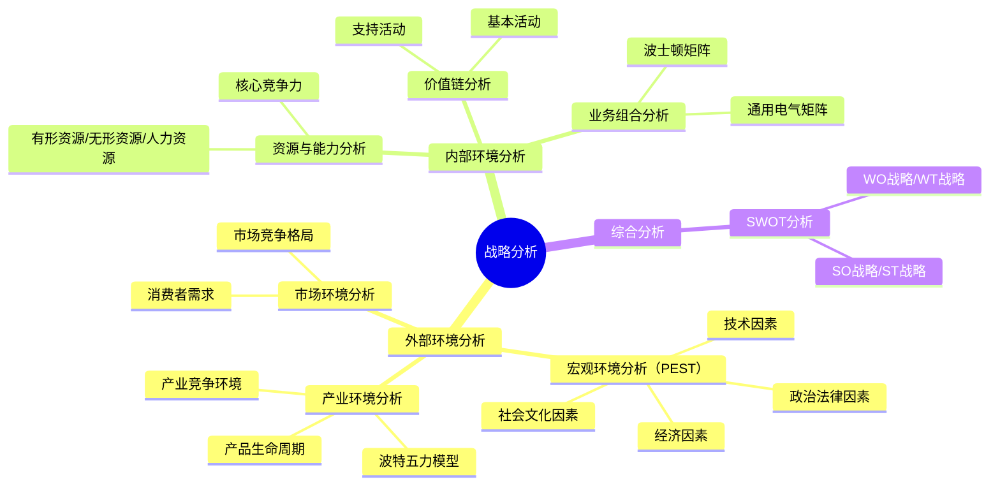
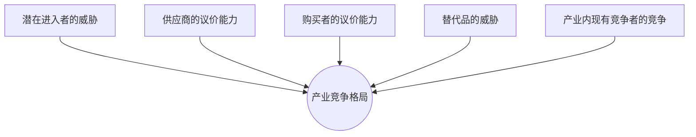

## 📍 章节定位

| 项目 | 信息 |
|------|------|
| **所属科目** | 🎯 公司战略与风险管理 |
| **难度等级** | ⭐⭐⭐ |
| **历年分值** | 5-8分 |
| **建议学时** | 8-10h |
| **核心地位** | 战略管理篇基础，案例分析必备工具 |

## 📝 考情分析

本章是战略管理三大环节（分析-选择-实施）的第一环，提供战略分析的核心工具框架，是主观题案例分析的基础。

命题规律：
- **PEST分析**：给案例判断属于哪类宏观环境因素（P/E/S/T）
- **波特五力模型**：分析产业竞争格局，判断某力强弱及策略应对
- **产品生命周期**：判断产业所处阶段及对应战略
- **价值链分析**：识别企业价值链活动及竞争优势来源
- **SWOT分析**：从案例提取S/W/O/T并匹配战略
- **波士顿矩阵/GE矩阵**：业务组合分析与战略建议

本章工具常与第三章（战略选择）结合考查：先用分析工具诊断，再提出战略建议。

## 🧠 知识框架

## 📖 核心精讲

### 一、宏观环境分析（PEST分析）

宏观环境因素概括为四类，英文首字母组合为PEST：

| 因素 | 英文 | 主要内容 |
|------|------|----------|
| **政治和法律因素** | Political | 政局稳定、政府行为、法律法规、政策方针、国际政治 |
| **经济因素** | Economic | 社会经济结构、经济发展水平、经济体制、宏观经济政策、其他经济条件 |
| **社会和文化因素** | Social | 人口因素、社会流动性、消费心理、生活方式、文化传统、价值观 |
| **技术因素** | Technological | 技术水平、技术力量、新技术发展、科技政策 |

> 📌 **法律环境四大目的**：①保护企业（反不正当竞争）；②保护消费者；③保护员工；④保护公众权益。

> 📌 **案例信号词**：税收政策/法规→P；GDP/通胀率/利率/汇率→E；人口/老龄化/消费习惯→S；新技术/专利/研发→T。

### 二、产业环境分析

#### （一）产品生命周期

产业发展经历四个阶段，以销售额增长率曲线拐点划分：

| 阶段 | 特征 | 战略目标 | 战略路径 | 经营风险 |
|------|------|----------|----------|----------|
| **导入期** | 用户少、产品质量待提高、竞争者少、成本高 | 扩大市场份额，争当"领头羊" | 投资研发和技术改进 | 非常高 |
| **成长期** | 销量攀升、客户群扩大、竞争者涌入、价格最高 | 争取最大市场份额 | 市场营销 | 较高（下降） |
| **成熟期** | 市场饱和、产品标准化、价格竞争激烈、利润适中 | 巩固市场份额，提高投资报酬率 | 提高效率，降低成本 | 中等（进一步降低） |
| **衰退期** | 客户要求性价比、产品差异小、产能过剩、价格低 | 防御，获取最后现金流 | 控制成本，维持正现金流 | 进一步降低 |

> 📌 **关键拐点**：成熟期开始的标志是"竞争者之间出现挑衅性的价格竞争"。

**产品生命周期理论的局限性**：
1. 各阶段持续时间因产业不同而差异显著，阶段界限不清晰
2. 产业增长不总是"S"形
3. 企业可通过创新和重新定位影响曲线形状
4. 竞争属性因产业不同而不同

#### （二）波特五力模型

波特五力模型分析产业竞争格局的五种竞争力量：

| 竞争力量 | 含义 | 影响因素 |
|----------|------|----------|
| **潜在进入者威胁** | 新进入者带来的竞争压力 | 进入壁垒高低（规模经济、产品差异、资本需求、转换成本、分销渠道、政府政策） |
| **供应商议价能力** | 供应商提价或降质的能力 | 供应商集中度、替代品、买方重要性、产品差异、前向一体化威胁 |
| **购买者议价能力** | 买方压价或要求提高质量的能力 | 买方集中度、购买量、产品差异、转换成本、后向一体化威胁、信息透明度 |
| **替代品威胁** | 替代产品/服务满足同样需求 | 替代品性价比、转换成本、买方替代意愿 |
| **产业内现有竞争** | 产业内企业之间的竞争 | 竞争者数量与势均力敌、产业增长速度、固定成本、产品差异、退出壁垒 |

> 📌 **应对策略**：将五种力量化为对己有利——提高进入壁垒、寻找低议价能力的供应商/客户、减少替代品吸引力、避免恶性竞争。

#### （三）产业竞争环境分析

重点关注产业内竞争格局，包括竞争者数量、市场份额分布、竞争激烈程度等。

### 三、内部环境分析

#### （一）企业资源与能力分析

**资源分类**：

| 资源类型 | 含义 | 示例 |
|----------|------|------|
| **有形资源** | 可见的、有实物形态的资产 | 厂房、设备、资金 |
| **无形资源** | 无实物形态但具有价值的资产 | 品牌、专利、商誉、技术 |
| **人力资源** | 员工的知识、技能和经验 | 管理团队、技术人才 |

**核心竞争力判断标准**（四性）：
1. **稀缺性**：少数企业拥有的资源/能力
2. **不可模仿性**：竞争对手难以复制（路径依赖、因果模糊、历史独特性）
3. **不可替代性**：无替代品或替代方案
4. **价值性**：能创造价值、抓住机会或化解威胁

#### （二）价值链分析

波特价值链将企业活动分为基本活动和支持活动：

| 活动类型 | 具体活动 |
|----------|----------|
| **基本活动**（5项） | ①内部后勤（进货物流）；②生产经营；③外部后勤（出货物流）；④市场营销；⑤服务 |
| **支持活动**（4项） | ①采购管理；②技术开发；③人力资源管理；④企业基础设施 |

> 📌 **价值链分析要点**：识别哪些活动创造价值（增值活动）、哪些不创造价值（非增值活动），找到竞争优势来源。支持活动贯穿所有基本活动。

#### （三）业务组合分析

##### 1. 波士顿矩阵（BCG Matrix）

以市场增长率和相对市场份额两维度划分四类业务：

| 业务类型 | 市场增长率 | 相对市场份额 | 特征 | 战略 |
|----------|-----------|-------------|------|------|
| **明星业务** | 高 | 高 | 高增长高份额，需大量资金 | 发展：保持领先 |
| **问题业务** | 高 | 低 | 高增长低份额，需大量资金但有风险 | 选择性投资或放弃 |
| **现金牛业务** | 低 | 高 | 低增长高份额，现金流入大于需求 | 收获：维持市场份额 |
| **瘦狗业务** | 低 | 低 | 低增长低份额，利润低 | 撤退：清理或退出 |

> 📌 **资金流向**：现金牛→明星→问题（有前景的）。瘦狗业务应考虑退出。

##### 2. 通用电气矩阵（GE Matrix）

以市场吸引力和企业竞争地位两维度（各分为高/中/低三档），形成9个方格：

| 区域 | 战略 |
|------|------|
| **绿灯区**（高吸引力+高竞争力） | 投资发展 |
| **黄灯区**（中等吸引力或竞争力） | 选择性投资 |
| **红灯区**（低吸引力+低竞争力） | 收获或撤退 |

### 四、SWOT分析

SWOT分析综合评估企业内部条件和外部环境：

| | 机会（Opportunity） | 威胁（Threat） |
|------|------|------|
| **优势（Strength）** | **SO战略**：发挥优势利用机会（增长型） | **ST战略**：发挥优势规避威胁（多元化） |
| **劣势（Weakness）** | **WO战略**：克服劣势利用机会（扭转型） | **WT战略**：克服劣势规避威胁（防御型） |

> 📌 **SWOT分析要点**：S/W是内部因素（可控），O/T是外部因素（不可控）。战略匹配原则：扬长避短、趋利避害。

## 💡 典型例题

**【2022年综合题节选】** 某新能源汽车企业拥有自主研发的电池技术专利（行业领先），但产能不足且销售渠道薄弱。国家出台新能源汽车补贴政策，市场快速增长，但传统车企纷纷转型进入该领域。请用SWOT分析该企业并给出战略建议。

**【参考答案】**
- **S（优势）**：自主研发电池技术专利，行业领先
- **W（劣势）**：产能不足，销售渠道薄弱
- **O（机会）**：国家补贴政策，市场快速增长
- **T（威胁）**：传统车企转型进入，竞争加剧

战略建议：
- **SO战略**：利用补贴政策和市场增长，发挥电池技术优势扩大产能，抢占市场份额
- **WO战略**：借助政策红利吸引投资，扩建产能，建设销售渠道
- **ST战略**：以技术专利建立壁垒，通过差异化应对竞争
- **WT战略**：与有渠道优势的企业战略联盟，弥补渠道短板

## 🎯 记忆口诀

- **PEST四因素**："政（政治法律）经（经济）社（社会文化）技（技术）"
- **产品生命周期四阶段**："导入高风研发先，成长营销抢份额，成熟降本提效率，衰退控本收现金"
- **波特五力**："进（进入者）供（供应商）买（购买者）替（替代品）竞（现有竞争）"
- **价值链五基本四支持**："内（内部后勤）生（生产）外（外部后勤）销（营销）服（服务）+采（采购）技（技术）人（人力）基（基础设施）"
- **核心竞争力四性**："稀（稀缺）模（不可模仿）替（不可替代）价（价值）"
- **波士顿矩阵**："明星高双高要发展，问题高增长低份额要选择，现金牛低增长高份额要收获，瘦狗双低要撤退"
- **SWOT四战略**："SO增长ST多元，WO扭转WT防御"

## ✅ 同步练习

**1. [单选]** 某国提高进口关税，这对国内企业属于PEST分析中的（ ）。
A. 政治法律因素  B. 经济因素  C. 社会文化因素  D. 技术因素

**2. [单选]** 在波士顿矩阵中，市场增长率高但相对市场份额低的业务是（ ）。
A. 明星业务  B. 问题业务  C. 现金牛业务  D. 瘦狗业务

**3. [多选]** 下列属于波特价值链基本活动的有（ ）。
A. 内部后勤  B. 采购管理  C. 市场营销  D. 服务

**4. [简答]** 简述波特五力模型中的五种竞争力量。

**5. [案例分析]** 某企业主营智能手机业务，拥有自研芯片技术（行业领先），但品牌知名度较低。当前智能手机市场增长放缓，竞争激烈，但5G技术普及带来换机潮。请用SWOT分析并给出战略建议。

> 参考答案：1.A  2.B  3.ACD（B为支持活动）  4.见核心精讲"波特五力模型"  5.S：自研芯片技术领先；W：品牌知名度低；O：5G换机潮；T：市场增长放缓、竞争激烈。建议：SO战略——以芯片技术优势抓住5G换机机会推出差异化产品；WO战略——加大品牌营销投入提升知名度；ST战略——以技术壁垒应对竞争；WT战略——聚焦细分市场（如高端旗舰）建立品牌。
