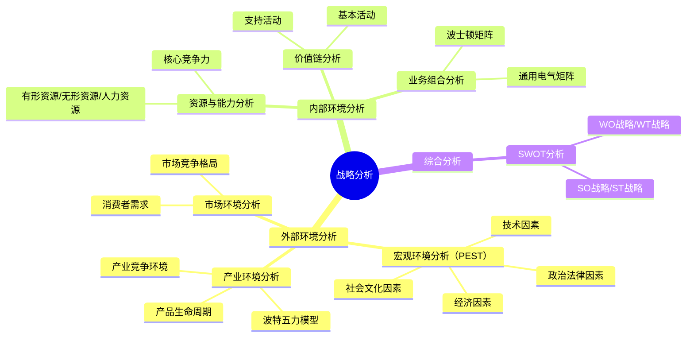
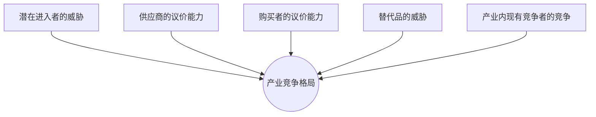

## 📍 章节定位

| 项目 | 信息 |
|------|------|
| **所属科目** | 🎯 公司战略与风险管理 |
| **难度等级** | ⭐⭐⭐ |
| **历年分值** | 5-8分 |
| **建议学时** | 8-10h |
| **核心地位** | 战略管理篇基础，案例分析必备工具 |

## 📝 考情分析

本章是战略管理三大环节（分析-选择-实施）的第一环，提供战略分析的核心工具框架，是主观题案例分析的基础。历年分值约 5-8 分，是本科目主观题（综合题）的主要考查章节之一，工具应用密度大、案例结合度高。

### 命题规律与重点考查趋势

近五年考查频率较高的考点分布如下：

| 考点 | 出题频次 | 题型偏好 | 难度 |
|------|----------|----------|------|
| PEST/PESTEL 分析 | ★★★★★ | 单选/案例 | 易 |
| 产品生命周期判断 | ★★★★ | 单选/案例 | 中 |
| 波特五力模型 | ★★★★★ | 案例/简答 | 中 |
| 五力之"进入壁垒"因素 | ★★★★ | 多选 | 中 |
| 价值链活动识别 | ★★★★ | 多选/案例 | 中 |
| 核心竞争力"四性"判断 | ★★★★ | 单选/案例 | 中 |
| 波士顿矩阵业务判断 | ★★★★★ | 案例 | 中 |
| GE 矩阵与波士顿矩阵对比 | ★★ | 单选 | 难 |
| SWOT 战略匹配 | ★★★★★ | 综合 | 中 |
| 战略群组分析 | ★★ | 案例 | 难 |

### 命题热点

1. **PEST 因素识别**：给定案例描述（如"国家提高新能源汽车购置补贴"），判断属于 P/E/S/T 哪类因素。命题陷阱：税收政策、财政补贴属"政治法律因素"而非"经济因素"；汇率、利率属"经济因素"而非"政治法律因素"。
2. **五力强弱判断**：分析某行业的进入壁垒、议价能力等。命题陷阱：分销渠道控制是"进入壁垒"因素而非"购买者议价能力"。
3. **价值链活动区分**：基本活动 vs 支持活动的识别。命题陷阱：采购管理是支持活动（不是基本活动），易与"进货物流"混淆。
4. **波士顿矩阵资金流向**：现金牛业务产生的现金应流向明星业务和有前景的问题业务，瘦狗业务应撤退。
5. **SWOT 战略匹配**：根据内外部因素组合判断 SO/ST/WO/WT 战略。命题陷阱：WO 是"扭转型战略"，WT 是"防御型战略"，ST 是"多种经营战略"。

### 与前后章联系

- **承前**：承接第 1 章"战略管理过程"中的"战略分析"环节。
- **启后**：本章分析结果是第 3 章"战略选择"的依据。例如 SWOT 分析的 SO 战略对应第 3 章的成长型战略，WT 战略对应收缩型战略；波士顿矩阵的"明星业务"对应发展战略，"瘦狗业务"对应撤退战略。

### 学习方法建议

本章是"工具箱"章节，建议采用"模型记忆 + 案例练习"的方法：
- **模型记忆法**：每个分析工具的结构（维度、要素、分类）必须精确记忆；
- **案例练习法**：每个工具配 2-3 个企业案例（华为、海尔、小米、阿里等）做完整分析；
- **对比记忆法**：波士顿矩阵 vs GE 矩阵、五力模型 vs 价值链、PEST vs SWOT；
- **口诀锚定法**：用口诀快速回忆工具结构（如"政经社技"、"进供买替竞"）。

## 🧠 知识框架

## 📖 核心精讲

### 一、宏观环境分析（PEST分析）

宏观环境因素概括为四类，英文首字母组合为 PEST：

| 因素 | 英文 | 主要内容 | 案例 |
|------|------|----------|------|
| **政治和法律因素** | Political | 政局稳定、政府行为、法律法规、政策方针、国际政治 | 国家出台新能源汽车补贴政策；反垄断法对互联网平台的监管 |
| **经济因素** | Economic | 社会经济结构、经济发展水平、经济体制、宏观经济政策、其他经济条件 | GDP 增速、利率调整、汇率波动、通胀率、居民可支配收入 |
| **社会和文化因素** | Social | 人口因素、社会流动性、消费心理、生活方式、文化传统、价值观 | 老龄化趋势、Z 世代消费观念、国潮文化兴起、单身经济 |
| **技术因素** | Technological | 技术水平、技术力量、新技术发展、科技政策 | 5G/6G、人工智能、区块链、新能源技术、生物技术 |

> 📌 **法律环境四大目的**：①保护企业（反不正当竞争法、反垄断法）；②保护消费者（消费者权益保护法）；③保护员工（劳动法、安全生产法）；④保护公众权益（环保法、产品质量法）。

> 📌 **案例信号词速记**：税收政策/法规/政府补贴/反垄断调查→P；GDP/通胀率/利率/汇率/可支配收入→E；人口/老龄化/消费习惯/生活方式/文化传统→S；新技术/专利/研发/技术突破→T。

**PEST 扩展为 PESTEL 模型**：在 PEST 基础上增加环境因素（Environmental）和法律因素（Legal）单独列出。CPA 教材以 PEST 为主，PESTEL 作为扩展了解。

**案例锚定——中国新能源汽车行业的 PEST 分析**：

| 因素 | 具体内容 |
|------|----------|
| **P（政治法律）** | "双碳"目标顶层设计、新能源汽车购置补贴与免征购置税政策、《新能源汽车产业发展规划（2021-2035）》、积分制管理 |
| **E（经济）** | GDP 持续增长带动消费升级、原油价格波动提升电动车经济性、电池成本下降带动整车价格下探 |
| **S（社会）** | 消费者环保意识增强、年轻一代对新科技接受度高、城市限牌限行政策使新能源车具备路权优势 |
| **T（技术）** | 动力电池能量密度提升、充电技术进步（800V 高压快充）、智能驾驶技术成熟、车规级芯片国产化 |

### 二、产业环境分析

#### （一）产品生命周期

产业发展经历四个阶段，以销售额增长率曲线拐点划分：

| 阶段 | 销量特征 | 产品/技术 | 竞争者 | 价格水平 | 战略目标 | 战略路径 | 经营风险 |
|------|----------|-----------|--------|----------|----------|----------|----------|
| **导入期** | 用户少、增长慢 | 质量待提高、变化大 | 少 | 高 | 扩大市场份额，争当"领头羊" | 投资研发和技术改进 | 非常高 |
| **成长期** | 销量攀升、客户群扩大 | 质量提高、性能优化 | 大量涌入 | 最高 | 争取最大市场份额 | 市场营销，扩大产能 | 较高（下降） |
| **成熟期** | 市场饱和、增长放缓 | 标准化、差异化小 | 数量稳定，价格战激烈 | 下降 | 巩固市场份额，提高投资报酬率 | 提高效率，降低成本 | 中等（进一步降低） |
| **衰退期** | 销量下降、客户流失 | 差异小、性价比敏感 | 退出增多 | 低 | 防御，获取最后现金流 | 控制成本，维持正现金流 | 进一步降低 |

> 📌 **关键拐点**：成熟期开始的标志是"竞争者之间出现挑衅性的价格竞争"。衰退期的客户特点为"性价比敏感"。

**案例锚定——智能手机行业生命周期判断**：
- 2007-2012 年：导入期（iPhone 引领智能手机革命，安卓阵营跟进）；
- 2012-2016 年：成长期（销量高速增长，小米/华为/OPPO/vivo 等品牌崛起）；
- 2017 年至今：成熟期（全球出货量见顶，价格战激烈，头部品牌集中度提升）；
- 部分细分（如折叠屏、AI 手机）仍处于导入期/成长期。

**产品生命周期理论的局限性**：
1. 各阶段持续时间因产业不同而差异显著，阶段界限不清晰；
2. 产业增长不总是"S"形（如技术驱动型产业可能跨越式发展）；
3. 企业可通过创新和重新定位影响曲线形状（如苹果通过 iPhone 重新定义手机产业）；
4. 竞争属性因产业不同而不同（同一阶段不同产业竞争激烈程度差异大）。

#### （二）波特五力模型

波特五力模型（Michael Porter, 1979）分析产业竞争格局的五种竞争力量，用于评估产业吸引力：

**1. 潜在进入者的威胁**

进入壁垒越高，潜在进入者威胁越小。**进入壁垒的七大因素**：

| 进入壁垒 | 含义 | 案例 |
|----------|------|------|
| **规模经济** | 大规模生产降低单位成本，新进入者难以匹敌 | 半导体芯片制造需巨额投资，台积电规模优势显著 |
| **产品差异** | 现有品牌忠诚度高，新进入者需大量营销投入 | 高端白酒品牌壁垒，新品牌难以建立消费者认同 |
| **资本需求** | 进入产业所需的大量初始投资 | 电信运营商、商业银行的资本门槛 |
| **转换成本** | 买方更换供应商的成本 | 企业更换 ERP 系统的迁移成本极高 |
| **分销渠道** | 现有企业对分销渠道的控制 | 可口可乐/百事可乐对零售渠道的把控 |
| **政府政策** | 政府对进入产业的限制 | 金融、电信、医药行业的牌照制度 |
| **与规模无关的成本优势** | 学习曲线、专利、专有技术、关键资源控制 | ASML 的 EUV 光刻机专利壁垒 |

**2. 供应商的议价能力**

供应商议价能力强的情况：

| 影响因素 | 含义 |
|----------|------|
| 供应商集中度高于买方 | 少数供应商控制市场，如 ASML 在高端光刻机市场的垄断 |
| 替代品少 | 供应商产品无替代品或替代品性能差 |
| 买方不是供应商的重要客户 | 供应商不依赖个别买方 |
| 产品差异化 | 供应商产品独特，买方难以转换 |
| 前向一体化威胁 | 供应商有可能直接进入买方业务领域 |

**3. 购买者的议价能力**

购买者议价能力强的情况：

| 影响因素 | 含义 |
|----------|------|
| 买方集中度高 | 少数大客户采购量占比高（如沃尔玛对供应商的议价能力） |
| 购买量大 | 大宗采购具有议价优势 |
| 产品标准化程度高 | 买方可选择多家供应商 |
| 转换成本低 | 买方更换供应商成本低 |
| 后向一体化威胁 | 买方可能自己生产该产品 |
| 信息透明度高 | 买方了解供应商成本结构 |

**4. 替代品的威胁**

替代品满足同样需求，威胁大小取决于：
- 替代品的性价比（性能/价格比）；
- 买方转换成本；
- 买方替代意愿。

> 📌 **替代品 vs 直接竞争者**：替代品是不同产业、满足同样需求的产品；直接竞争者是同产业内竞争对手。例如高铁与航空是替代品关系，南航与东航是直接竞争者。

**5. 产业内现有竞争者的竞争强度**

影响产业内竞争强度的因素：

| 因素 | 竞争强度 |
|------|----------|
| 竞争者数量多且势均力敌 | 强 |
| 产业增长缓慢 | 强（争夺存量市场） |
| 固定成本高或库存成本高 | 强（需要扩大销量分摊成本） |
| 产品差异小或转换成本低 | 强（价格战） |
| 退出壁垒高 | 强（即使亏损也难以退出） |
| 战略赌注高 | 强 |

> 📌 **应对策略**：将五种力量化为对己有利——提高进入壁垒、寻找低议价能力的供应商/客户、减少替代品吸引力、避免恶性竞争。

**案例锚定——中国乳制品行业的五力分析**：

| 力量 | 强度 | 分析 |
|------|------|------|
| 潜在进入者威胁 | 较弱 | 品牌壁垒（消费者对食品安全高度敏感）、奶源控制、规模经济 |
| 供应商议价能力 | 较强 | 上游奶源集中度高（规模化牧场少），原奶价格由少数大型牧场影响 |
| 购买者议价能力 | 中等 | 消费者分散，议价能力弱；但零售渠道（商超、电商）集中度高，议价能力强 |
| 替代品威胁 | 中等 | 豆奶、植物蛋白饮料、果汁等是部分替代品 |
| 产业内竞争 | 较强 | 伊利、蒙牛双寡头格局，光明、新希望等区域品牌竞争，价格战激烈 |

#### （三）产业竞争环境分析

**1. 战略群组分析**

战略群组是指产业内采用相似战略、服务于相似细分市场、拥有相似资源/能力的企业集群。例如中国手机市场的战略群组：
- 高端群组：苹果、华为（旗舰机型 5000 元以上）；
- 中端群组：小米、OPPO、vivo（1500-5000 元）；
- 入门群组：realme、Redmi、荣耀（1500 元以下）。

**战略群组分析的用途**：
- 识别产业内竞争格局（哪些群组竞争更激烈）；
- 识别"移动壁垒"（群组间转移的障碍）；
- 评估各群组的吸引力；
- 预测市场变化方向。

**2. 竞争对手分析（波特四维度模型）**

| 维度 | 内容 |
|------|------|
| 未来目标 | 竞争对手的战略意图和驱动力 |
| 现行战略 | 竞争对手当前在做什么 |
| 假设 | 竞争对手对自己和产业的认知 |
| 能力 | 竞争对手的资源、能力和优势劣势 |

### 三、内部环境分析

#### （一）企业资源与能力分析

**资源分类**：

| 资源类型 | 含义 | 示例 |
|----------|------|------|
| **有形资源** | 可见的、有实物形态的资产 | 厂房、设备、土地、资金、原材料 |
| **无形资源** | 无实物形态但具有价值的资产 | 品牌、专利、商誉、技术、商标、版权、客户关系 |
| **人力资源** | 员工的知识、技能和经验 | 管理团队、技术人才、组织文化、员工忠诚度 |

**资源与能力的关系**：资源是能力的载体，能力是运用资源完成特定任务的本领。核心竞争力是组织跨业务单位协调多种资源的能力，是持续竞争优势的源泉。

**核心竞争力的判断标准（"四性"）**：

| 标准 | 含义 | 案例 |
|------|------|------|
| **稀缺性** | 少数企业拥有的资源/能力 | ASML 的 EUV 光刻机制造技术全球独有 |
| **不可模仿性** | 竞争对手难以复制 | 不可模仿性的来源：路径依赖（华为 5G 研发积累）、因果模糊（海底捞服务体验）、历史独特性（茅台酿造工艺） |
| **不可替代性** | 无替代品或替代方案 | 中石油的油气资源在短期内不可替代 |
| **价值性** | 能创造价值、抓住机会或化解威胁 | 阿里云的算力为双 11 提供基础设施保障 |

> 📌 **判断顺序**：先判断是否"有价值"（不有价值则是劣势），再判断是否"稀缺"，再判断是否"不可模仿"，最后判断是否"不可替代"。只有四性同时满足，才是核心竞争力。

**VRIO 模型扩展**：在四性基础上增加"组织"（Organization）要素——企业是否有合适的组织架构和制度来利用这些资源/能力。即"有价值、稀缺、难以模仿、组织支持"四要素。

**案例锚定——华为核心竞争力分析**：

| 标准 | 华为案例 |
|------|----------|
| **价值性** | 5G 技术为运营商提供领先的网络解决方案，创造巨大商业价值 |
| **稀缺性** | 5G 标准必要专利数量全球第一，少数企业拥有 |
| **不可模仿性** | 每年研发投入超销售收入 15%，30 余年技术积累形成路径依赖 |
| **不可替代性** | 5G 端到端解决方案能力，替代品有限 |
| **组织支持** | "以奋斗者为本"的研发激励机制、矩阵式研发组织 |

#### （二）价值链分析

波特价值链（Porter's Value Chain）将企业活动分为基本活动和支持活动：

| 活动类型 | 具体活动 | 案例（智能手机企业） |
|----------|----------|---------------------|
| **基本活动**（5项） | ①内部后勤（进货物流）；②生产经营；③外部后勤（出货物流）；④市场营销；⑤服务 | ①元器件入库；②整机组装；③成品配送至渠道；④广告投放、品牌建设；⑤售后维修 |
| **支持活动**（4项） | ①采购管理；②技术开发；③人力资源管理；④企业基础设施 | ①芯片、屏幕采购；②自研芯片、操作系统；③研发人员招聘培训；④财务、法务、行政 |

> 📌 **价值链分析要点**：
> - 识别哪些活动创造价值（增值活动）、哪些不创造价值（非增值活动）；
> - 找到竞争优势来源（成本优势或差异化优势）；
> - 支持活动贯穿所有基本活动，影响其效率和价值创造能力；
> - 价值链分析可向上游（供应商价值链）和下游（渠道价值链、客户价值链）扩展，构成"价值系统"。

**价值链分析的应用步骤**：
1. 识别企业价值链活动（基本 + 支持）；
2. 分析每项活动的成本和价值贡献；
3. 找出竞争优势来源（成本领先活动 / 差异化活动）；
4. 优化价值链（强化增值活动、外包非增值活动、协同上下游）。

**案例锚定——小米价值链分析**：

| 价值链活动 | 小米的做法 | 竞争优势来源 |
|-----------|-----------|--------------|
| 内部后勤 | 供应链数字化管理，与供应商深度协同 | 成本优势 |
| 生产经营 | 代工模式，轻资产运营 | 成本优势 |
| 外部后勤 | 小米之家 + 电商直营，缩短渠道 | 成本优势 |
| 市场营销 | "粉丝经济"、社群运营、口碑传播 | 差异化优势 |
| 服务 | MIUI 持续迭代、社区服务、IoT 生态 | 差异化优势 |
| 采购管理 | 围绕核心元器件集中采购、战略投资供应商 | 成本优势 |
| 技术开发 | 澎湃芯片研发、AIoT 平台 | 差异化优势 |
| 人力资源 | 工程师文化、股权激励 | 差异化优势 |
| 企业基础设施 | 互联网化组织、扁平管理 | 差异化优势 |

#### （三）业务组合分析

##### 1. 波士顿矩阵（BCG Matrix）

波士顿矩阵（Boston Consulting Group, 1968）以市场增长率和相对市场份额两维度划分四类业务：

| 业务类型 | 市场增长率 | 相对市场份额 | 特征 | 现金流 | 战略 |
|----------|-----------|-------------|------|--------|------|
| **明星业务** | 高 | 高 | 高增长高份额，需大量资金 | 净现金流量可能为负 | 发展：保持领先 |
| **问题业务** | 高 | 低 | 高增长低份额，需大量资金但有风险 | 净现金流量为负 | 选择性投资或放弃 |
| **现金牛业务** | 低 | 高 | 低增长高份额，现金流入大于需求 | 净现金流量为正（最大） | 收获：维持市场份额 |
| **瘦狗业务** | 低 | 低 | 低增长低份额，利润低 | 净现金流量为正或负 | 撤退：清理或退出 |

> 📌 **资金流向**：现金牛→明星→问题（有前景的）。瘦狗业务应考虑退出。健康的业务组合应拥有"现金牛"提供现金、"明星"提供未来现金牛、"问题"中筛选出未来明星。

**波士顿矩阵的运用步骤**：
1. 计算各业务的市场增长率和相对市场份额；
2. 绘制矩阵图，将各业务定位；
3. 分析各业务的现金流情况；
4. 制定战略（发展/选择/收获/撤退）；
5. 评估业务组合的平衡性（是否有现金牛供养明星和问题业务）。

**波士顿矩阵的局限性**：
- 仅考虑两个维度，难以全面反映业务复杂性；
- "瘦狗业务"未必没有价值（如战略性业务、生态入口业务）；
- 市场增长率和市场份额的测量存在主观性；
- 忽略业务之间的协同效应。

**案例锚定——海尔集团业务组合（简化示例）**：

| 业务 | 市场增长率 | 相对市场份额 | 类型 | 战略建议 |
|------|-----------|-------------|------|----------|
| 卡萨帝高端冰箱 | 高 | 高 | 明星 | 加大投入，保持领先 |
| 智能家居生态 | 高 | 低 | 问题 | 选择性投资，重点突破 |
| 海尔洗衣机（传统） | 低 | 高 | 现金牛 | 收获，维持市场份额 |
| 部分传统小家电 | 低 | 低 | 瘦狗 | 考虑退出或转型 |

##### 2. 通用电气矩阵（GE Matrix）

通用电气矩阵以市场吸引力（industry attractiveness）和企业竞争地位（business strength）两维度（各分为高/中/低三档），形成 9 个方格：

| 区域 | 市场吸引力 | 竞争地位 | 战略 |
|------|-----------|----------|------|
| **绿灯区**（投资发展） | 高 | 高 | 加大投资，优先发展 |
| **黄灯区**（选择性投资） | 中等 | 中等 | 选择性投资，重点突破 |
| **红灯区**（收获/撤退） | 低 | 低 | 收获或撤退 |

**波士顿矩阵 vs 通用电气矩阵对比**：

| 对比维度 | 波士顿矩阵 | 通用电气矩阵 |
|----------|-----------|--------------|
| 维度数量 | 2 个 | 2 个 |
| 维度内容 | 市场增长率、相对市场份额 | 市场吸引力、竞争地位 |
| 分档 | 2 档（高/低） | 3 档（高/中/低） |
| 方格数 | 4 个 | 9 个 |
| 评估指标 | 单一指标 | 多指标加权综合 |
| 适用场景 | 简单业务组合分析 | 复杂业务组合分析 |
| 精细度 | 较粗 | 较细 |

##### 3. SPACE 矩阵（战略地位与行动评价矩阵）

SPACE 矩阵从四个维度评估企业战略地位：

| 维度 | 内容 |
|------|------|
| **财务优势（FP）** | 投资回报率、杠杆比率、偿债能力、流动性、现金流量 |
| **竞争优势（CA）** | 市场份额、产品质量、客户忠诚度、技术领先、垂直整合 |
| **产业优势（IS）** | 增长潜力、利润潜力、财务稳定性、技术要求、资源利用率 |
| **环境稳定性（ES）** | 技术变化、通胀率、需求变化、价格弹性、竞争压力 |

四个维度组合形成四个象限，对应不同的战略选择：
- 进取型战略（FP+IS 高，CA+ES 低）
- 保守型战略（FP+CA 高，IS+ES 低）
- 防御型战略（FP+CA 低，IS+ES 低）
- 竞争型战略（CA+IS 高，FP+ES 低）

### 四、SWOT分析

SWOT 分析综合评估企业内部条件（优势 S、劣势 W）和外部环境（机会 O、威胁 T）：

| | 机会（Opportunity） | 威胁（Threat） |
|------|------|------|
| **优势（Strength）** | **SO 战略**：发挥优势利用机会（增长型战略） | **ST 战略**：发挥优势规避威胁（多元化/多种经营战略） |
| **劣势（Weakness）** | **WO 战略**：克服劣势利用机会（扭转型战略） | **WT 战略**：克服劣势规避威胁（防御型战略） |

> 📌 **SWOT 分析要点**：
> - **S/W 是内部因素**（可控），来源于资源能力分析、价值链分析；
> - **O/T 是外部因素**（不可控），来源于 PEST 分析、五力分析、产品生命周期分析；
> - **战略匹配原则**：扬长避短、趋利避害。SO 是最理想战略，WT 是最不利战略。

**SWOT 分析的步骤**：
1. 列出外部环境的机会和威胁（基于 PEST、五力、生命周期分析）；
2. 列出内部条件的优势和劣势（基于资源能力、价值链分析）；
3. 构造 SWOT 矩阵；
4. 进行战略组合匹配（SO、ST、WO、WT）；
5. 选择最优战略或战略组合。

**四类战略的内涵**：

| 战略 | 内涵 | 案例 |
|------|------|------|
| **SO 战略（增长型）** | 利用内部优势抓住外部机会，是最理想战略 | 华为利用 5G 技术优势（S）+ 全球 5G 商用部署机会（O）扩大全球市场份额 |
| **ST 战略（多种经营）** | 利用内部优势规避或减轻外部威胁，分散风险 | 小米利用互联网服务优势（S）+ 手机市场增长放缓威胁（T）拓展 IoT 生态业务 |
| **WO 战略（扭转型）** | 利用外部机会改进内部劣势，实现转型 | 传统零售企业利用电商兴起机会（O）+ 自身线下渠道薄弱（W）通过战略合作补齐 |
| **WT 战略（防御型）** | 努力克服内部劣势规避外部威胁，是最后防线 | 中小企业在国际巨头进入（T）+ 自身技术薄弱（W）情况下，收缩战线、聚焦细分市场 |

**案例锚定——比亚迪 SWOT 分析（2023 年）**：

| 维度 | 内容 |
|------|------|
| **S（优势）** | 刀片电池技术领先；垂直整合能力强（电池、电机、电控、芯片自研）；成本控制优秀 |
| **W（劣势）** | 高端品牌认知度低于 BBA；海外市场份额低；智能驾驶技术相对落后 |
| **O（机会）** | 全球碳中和政策推动新能源汽车渗透率提升；国内充电基础设施完善；出口政策支持 |
| **T（威胁）** | 特斯拉降价竞争；传统车企转型加速；补贴退坡；上游锂资源价格波动 |

战略建议：
- **SO 战略**：发挥电池和垂直整合优势，扩大全球市场份额，抓住新能源渗透机会；
- **ST 战略**：以成本优势应对特斯拉价格战，加快海外建厂；
- **WO 战略**：通过仰望等高端品牌提升品牌溢价；加大智驾研发投入；
- **WT 战略**：聚焦中低端市场防御，避免与高端品牌正面竞争。

## 💡 典型例题

**【例题 1】（单选题，PEST 因素识别）**

某国政府宣布对新能源汽车免征车辆购置税的政策延长至 2027 年。这一举措对国内新能源汽车企业而言，属于 PEST 分析中的（ ）。
A. 政治和法律因素
B. 经济因素
C. 社会和文化因素
D. 技术因素

**答案**：A

**解析**：税收政策、政府补贴、法律法规都属于政治和法律因素（P）。命题陷阱：考生容易将"购置税"误判为经济因素，但实际上税收政策、政府财政政策、法规都属于政治法律因素。经济因素主要是 GDP、利率、汇率、通胀率、可支配收入等宏观经济指标。

**【例题 2】（单选题，波士顿矩阵）**

某家电企业旗下有四类业务：A 业务市场增长率 8%，相对市场份额 1.5；B 业务市场增长率 25%，相对市场份额 0.4；C 业务市场增长率 30%，相对市场份额 2.0；D 业务市场增长率 3%，相对市场份额 0.3。下列关于各业务类型判断正确的是（ ）。
A. A 是明星业务，B 是问题业务，C 是现金牛业务，D 是瘦狗业务
B. A 是现金牛业务，B 是问题业务，C 是明星业务，D 是瘦狗业务
C. A 是问题业务，B 是瘦狗业务，C 是明星业务，D 是现金牛业务
D. A 是现金牛业务，B 是明星业务，C 是问题业务，D 是瘦狗业务

**答案**：B

**解析**：波士顿矩阵以"市场增长率"（通常以 10% 为高低分界）和"相对市场份额"（以 1.0 为高低分界）两维度划分。
- A 业务：增长率 8%（低）+ 份额 1.5（高）= 现金牛业务；
- B 业务：增长率 25%（高）+ 份额 0.4（低）= 问题业务；
- C 业务：增长率 30%（高）+ 份额 2.0（高）= 明星业务；
- D 业务：增长率 3%（低）+ 份额 0.3（低）= 瘦狗业务。

**【例题 3】（多选题，进入壁垒）**

下列各项中，属于波特五力模型中"潜在进入者威胁"的进入壁垒因素的有（ ）。
A. 规模经济
B. 产品差异
C. 转换成本
D. 供应商集中度
E. 分销渠道控制

**答案**：ABCE

**解析**：进入壁垒的七大因素包括：规模经济、产品差异、资本需求、转换成本、分销渠道、政府政策、与规模无关的成本优势。D 供应商集中度属于"供应商议价能力"的影响因素，不属于进入壁垒。

**【例题 4】（多选题，价值链基本活动）**

下列各项中，属于波特价值链基本活动的有（ ）。
A. 内部后勤
B. 采购管理
C. 生产经营
D. 市场营销
E. 服务

**答案**：ACDE

**解析**：基本活动 5 项：①内部后勤（进货物流）；②生产经营；③外部后勤（出货物流）；④市场营销；⑤服务。支持活动 4 项：①采购管理；②技术开发；③人力资源管理；④企业基础设施。B 采购管理属于支持活动。

**【例题 5】（单选题，核心竞争力四性）**

某企业拥有一项独有技术专利，全球仅此一家企业掌握，且该技术能显著降低产品成本并提升性能。该技术专利最可能构成企业的（ ）。
A. 资源优势
B. 一般能力
C. 核心竞争力
D. 比较优势

**答案**：C

**解析**：核心竞争力需同时满足四性：①价值性（能降低成本并提升性能，有价值）；②稀缺性（全球仅此一家）；③不可模仿性（专利保护，难以模仿）；④不可替代性（独有技术，无替代方案）。该技术专利同时满足四性，构成核心竞争力。

**【例题 6】（综合题，SWOT 分析）**

**【2022年综合题节选】** 某新能源汽车企业拥有自主研发的电池技术专利（行业领先），但产能不足且销售渠道薄弱。国家出台新能源汽车补贴政策，市场快速增长，但传统车企纷纷转型进入该领域。请用 SWOT 分析该企业并给出战略建议。

**答案**：
- **S（优势）**：自主研发电池技术专利，行业领先；
- **W（劣势）**：产能不足，销售渠道薄弱；
- **O（机会）**：国家补贴政策，市场快速增长；
- **T（威胁）**：传统车企转型进入，竞争加剧。

战略建议：
- **SO 战略**：利用补贴政策和市场增长，发挥电池技术优势扩大产能，抢占市场份额；
- **WO 战略**：借助政策红利吸引投资，扩建产能，建设销售渠道；
- **ST 战略**：以技术专利建立壁垒，通过差异化应对竞争；
- **WT 战略**：与有渠道优势的企业战略联盟，弥补渠道短板。

**解析**：SWOT 分析的关键是正确识别内外部因素，并进行战略匹配。S/W 来源于内部资源和能力分析（电池技术专利是优势，产能和渠道是劣势）；O/T 来源于外部环境分析（补贴政策和市场增长是机会，传统车企转型是威胁）。SO 是增长型战略（最理想），WO 是扭转型战略，ST 是多种经营战略，WT 是防御型战略。

**【例题 7】（综合题，五力分析）**

某家电零售连锁企业在 A 市经营多年，门店数量行业第一。但近年来：(1) 电商平台快速发展，越来越多的消费者选择线上购买家电；(2) 上游家电品牌商集中度高，议价能力强；(3) 该市近年新进入两家全国性家电连锁企业；(4) 消费者对家电产品的价格敏感度高。

要求：用波特五力模型分析该企业面临的产业竞争环境。

**答案**：

| 五力要素 | 强度 | 分析 |
|----------|------|------|
| 潜在进入者威胁 | 较强 | 全国性家电连锁企业进入 A 市，威胁加大 |
| 供应商议价能力 | 较强 | 上游家电品牌商集中度高，议价能力强 |
| 购买者议价能力 | 较强 | 消费者价格敏感度高，且可通过电商比价 |
| 替代品威胁 | 较强 | 电商平台成为线下零售的强替代品 |
| 产业内现有竞争 | 较强 | 全国性连锁进入后，竞争者数量增加，竞争加剧 |

**综合判断**：该企业面临五力均较强的产业环境，整体产业吸引力下降。建议：
- 加强线上线下融合（O2O 模式），应对电商替代；
- 通过规模采购和自有品牌降低对供应商议价的依赖；
- 提升服务体验（送货、安装、售后）形成差异化；
- 加强会员体系，提高客户忠诚度，降低价格敏感度。

**解析**：本题考查五力模型的应用。关键是要将案例描述准确映射到五力要素上，并给出战略建议。注意"电商平台"是替代品而非直接竞争者（不同产业）。

## 🎯 记忆口诀

- **PEST 四因素**："政（政治法律）经（经济）社（社会文化）技（技术）"——税收/法规/补贴属 P，GDP/利率/汇率属 E，人口/老龄化/生活方式属 S，专利/新技术属 T。
- **法律四目的**："保企保客保员保众"——保护企业、消费者、员工、公众权益。
- **产品生命周期四阶段**："导入高风研发先，成长营销抢份额，成熟降本提效率，衰退控本收现金"——风险递减，战略依次为研发→营销→降本→控本。
- **生命周期关键拐点**："价格战出现=成熟期开始"。
- **波特五力**："进（进入者）供（供应商）买（购买者）替（替代品）竞（现有竞争）"——五种力量决定产业吸引力。
- **进入壁垒七因素**："规产资转渠政无"——规模经济、产品差异、资本需求、转换成本、分销渠道、政府政策、与规模无关的成本优势。
- **替代品 vs 直接竞争者**："不同产业同样需求=替代品；同产业=直接竞争"——高铁 vs 航空是替代品。
- **价值链五基本四支持**："内（内部后勤）生（生产）外（外部后勤）销（营销）服（服务）+采（采购）技（技术）人（人力）基（基础设施）"——支持活动贯穿所有基本活动。
- **核心竞争力四性**："稀（稀缺）模（不可模仿）替（不可替代）价（价值）"——四性同时满足才是核心竞争力。
- **不可模仿性三来源**："路（路径依赖）因（因果模糊）历（历史独特性）"。
- **波士顿矩阵**："明星高双高要发展，问题高增长低份额要选择，现金牛低增长高份额要收获，瘦狗双低要撤退"——资金流向：现金牛→明星→问题（有前景的）。
- **波士顿 vs GE 矩阵**："波二二四，GE 三三九"——波士顿 2 维度各 2 档共 4 格，GE 2 维度各 3 档共 9 格。
- **SWOT 四战略**："SO 增长 ST 多元，WO 扭转 WT 防御"——SO 最理想，WT 最不利。
- **SWOT 内外区分**："SW 内可控，OT 外不可控"——S/W 来自内部资源能力，O/T 来自外部环境。
- **SPACE 矩阵四维度**："财竞产环"——财务优势、竞争优势、产业优势、环境稳定性。

## ✅ 同步练习

**1. [单选]** 某国提高进口关税，这对国内企业属于PEST分析中的（ ）。
A. 政治法律因素  B. 经济因素  C. 社会文化因素  D. 技术因素

**2. [单选]** 在波士顿矩阵中，市场增长率高但相对市场份额低的业务是（ ）。
A. 明星业务  B. 问题业务  C. 现金牛业务  D. 瘦狗业务

**3. [多选]** 下列属于波特价值链基本活动的有（ ）。
A. 内部后勤  B. 采购管理  C. 市场营销  D. 服务

**4. [简答]** 简述波特五力模型中的五种竞争力量。

**5. [案例分析]** 某企业主营智能手机业务，拥有自研芯片技术（行业领先），但品牌知名度较低。当前智能手机市场增长放缓，竞争激烈，但5G技术普及带来换机潮。请用SWOT分析并给出战略建议。

> 参考答案：1.A  2.B  3.ACD（B为支持活动）  4.见核心精讲"波特五力模型"  5.S：自研芯片技术领先；W：品牌知名度低；O：5G换机潮；T：市场增长放缓、竞争激烈。建议：SO战略——以芯片技术优势抓住5G换机机会推出差异化产品；WO战略——加大品牌营销投入提升知名度；ST战略——以技术壁垒应对竞争；WT战略——聚焦细分市场（如高端旗舰）建立品牌。
