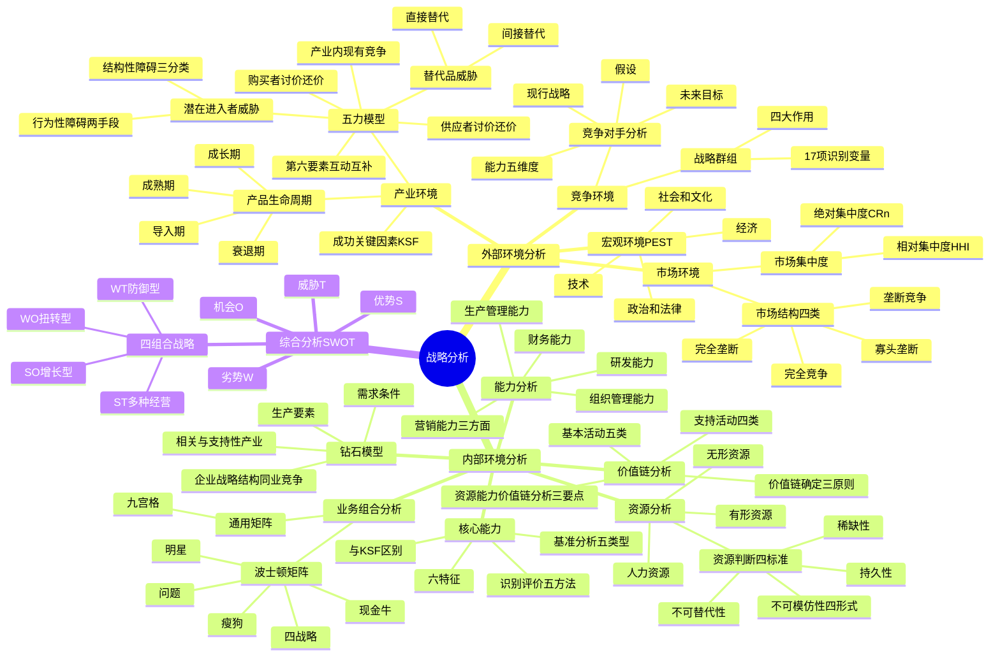

## 1. 章节定位

| 项目 | 信息 |
|------|------|
| 所属科目 | 公司战略与风险管理 |
| 难度等级 | 4 |
| 历年分值 | 12-18 分 |
| 建议学时 | 14-18 小时 |
| 知识关联章节 | 第1章 战略管理过程（战略分析要素）、第3章 战略选择（竞争战略与五力模型应对）、第4章 战略实施（组织能力匹配）、第6章 风险管理概述（外部环境风险识别） |

## 2. 考情分析

本章是公司战略与风险管理科目的核心重难点章节，历年分值约 12-18 分，是必考主观题章节。主观题常要求考生基于给定案例运用 PEST、五力模型、价值链、波士顿矩阵、SWOT 等工具进行分析，客观题则集中在概念辨析与分类判断。

**命题规律**：本章框架多、模型多、案例多。命题人以给定企业案例为载体，要求考生识别所运用的分析工具、判断模型要素归属、推断战略选择。近年考试强调"分析+应用"，单纯记忆已不足以应对主观题。

**高频考点分布**：

1. **PEST 分析**：政治和法律、经济、社会和文化、技术四类环境因素的识别；每类环境下的细分要素（如人口因素、社会流动性、消费心理、生活方式变化、文化传统、价值观）；典型案例（WS 公司滤水壶决策）。
2. **产品生命周期**：导入期、成长期、成熟期、衰退期四阶段的特征（销量、价格、利润、竞争、经营风险、战略路径）；Y 白药改变牙膏产业生命周期曲线形状的案例；生命周期理论的批评。
3. **波特五力模型**：潜在进入者威胁（结构性障碍三分类与七种障碍、行为性障碍两种报复手段）、替代品威胁（直接替代与间接替代、性能—价格比）、供应者和购买者讨价还价能力（四要素）、产业内现有企业竞争（五种激烈情形）；对付五种竞争力的战略；五力模型的局限性；亚非第六要素——互动互补作用力。
4. **成功关键因素（KSF）**：三个确认问题；与技术、制造、分销、营销、技能相关的 KSF；不同产业的 KSF 差异；产品生命周期各阶段 KSF 变化；KSF 与企业核心能力的区别。
5. **市场集中度**：绝对集中度 CRn 的计算与优缺点；相对集中度（洛伦兹曲线、基尼系数、HHI 指数）；HHI 的计算与优缺点；影响市场集中度的因素（供给端、需求端、政策制度、外部冲击）。
6. **市场结构分类**：完全竞争、垄断竞争、寡头垄断、完全垄断四类与 CRn、HHI 的对应关系。
7. **竞争对手分析**：未来目标、假设、现行战略、能力四方面；能力的五个维度（核心能力、成长能力、快速反应能力、适应变化能力、持久力）；子公司分析的特殊考虑。
8. **战略群组**：战略群组的识别变量（17 项）；战略群组分析的四个作用（了解竞争状况、移动障碍、群组内竞争着眼点、预测市场变化发现战略机会）；蓝海战略延伸。
9. **企业资源**：有形资源、无形资源、人力资源；资源判断四标准（稀缺性、不可模仿性四种形式、不可替代性、持久性）。
10. **企业能力**：研发能力、生产管理能力、营销能力（产品竞争能力、销售活动能力、市场决策能力）、财务能力、组织管理能力。
11. **核心能力**：普雷哈拉德和哈梅尔的树根—树干—花果比喻；核心能力六特征（价值性、独特性、可延展性、不可替代性、动态性、整合性）；识别评价方法（自我评价、产业内部比较、基准分析、成本驱动力和作业成本法、收集竞争对手信息）；基准分析五种类型（内部基准、竞争性基准、过程或活动基准、一般基准、顾客基准）。
12. **钻石模型**：生产要素（初级与高级、一般与专业）、需求条件、相关与支持性产业、企业战略企业结构和同业竞争四要素。
13. **价值链分析**：基本活动五类（内部后勤、生产经营、外部后勤、市场销售、服务）；支持活动四类（采购管理、技术开发、人力资源管理、企业基础设施）；价值链确定的三原则；企业资源能力的价值链分析三个要点。
14. **波士顿矩阵**：市场增长率（10% 分界）与相对市场占有率（1.0 分界）；四类业务（明星、问题、现金牛、瘦狗）；四种战略（发展、保持、收割、放弃）；启示与局限。
15. **通用矩阵**：九宫格改进；左上方三格增长发展战略、右下方三格停止转移撤退战略、对角线三格维持或有选择发展。
16. **SWOT 分析**：优势、劣势、机会、威胁；四类组合战略（SO 增长型、WO 扭转型、ST 多种经营、WT 防御型）。

**联动考查方式**：
- 与第3章联动：五力模型分析与基本竞争战略（成本领先、差异化、集中化）选择；波士顿矩阵业务定位与发展/稳定/收缩战略选择；
- 与第4章联动：价值链支持活动与组织结构、企业文化匹配；
- 与第6章联动：PEST 中政治法律、技术因素与外部风险识别；
- 与第1章联动：利益相关者分析与五力模型中供应者/购买者讨价还价能力结合。

**备考建议**：
- 牢记每个分析工具的"要素清单"和"判断标准"——本章主观题核心得分点；
- 区分易混概念：成功关键因素（产业和市场层次）vs 企业核心能力（企业层次）；有形资源 vs 无形资源；基本活动 vs 支持活动；
- 五力模型的"结构性障碍三分类"（规模经济、关键资源控制、市场优势）与"波特七种障碍"的对应关系必须掌握；
- 波士顿矩阵四类业务的"市场增长率—相对市场占有率—现金流—战略"四要素对应要熟；
- HHI 计算公式与 CRn 计算公式必须能熟练运用，注意市场份额以百分数还是小数代入；
- 案例题答题模板：先识别工具，再列示要素，最后结合案例材料逐项对应分析。

## 3. 知识框架

## 4. 核心精讲

### 4.1 企业外部环境分析

企业的外部环境可以从宏观环境、产业环境、市场环境和竞争环境等几个层面展开。

#### 4.1.1 宏观环境分析（PEST）

宏观环境因素可以概括为四类：政治和法律因素（Political）、经济因素（Economic）、社会和文化因素（Social）、技术因素（Technological）。四个英文首字母组合为 PEST，故称 PEST 分析。

**（一）政治和法律环境**

政治和法律环境是指那些制约和影响企业的政治要素和法律系统，以及其运行状态。政治环境包括国家的政治制度、权力机构、颁布的方针政策、政治团体和政治形势等因素；法律环境包括国家制定的法律、法规、法令以及国家的执法机构等。

政治环境分析一般包括四个方面：①企业所在国家和地区的政局稳定状况；②政府行为对企业的影响（如政府如何拥有国家土地、自然资源及其储备）；③执政党所持的态度和推行的基本政策（外交政策、人口政策、税收政策、进出口限制等），以及这些政策的连续性和稳定性；④各政治利益集团对企业活动产生的影响。

法律环境分析的四大目的：①保护企业，反对不正当竞争；②保护消费者（涵盖商品包装、商标、食品卫生、广告等法规）；③保护员工（招聘法律和健康与安全法规）；④保护公众权益免受不合理企业行为的损害。

**（二）经济环境**

经济环境包括社会经济结构、经济发展水平与状况、经济体制、宏观经济政策和其他经济条件等要素。与政治法律环境相比，经济环境对企业生产经营的影响更直接、更具体。

| 要素 | 含义 |
|------|------|
| 社会经济结构 | 国民经济中不同经济成分、不同产业部门及社会再生产各方面组成国民经济整体时的相互适应性、量的比例以及排列关联状况；包括产业结构、分配结构、交换结构、消费结构和技术结构 |
| 经济发展水平与状况 | 国家经济发展的规模、速度和所达到的水平；常用指标有 GDP、人均 GDP、人均国民收入和经济增长速度等；其他因素包括税收水平、通货膨胀率、贸易差额和汇率、失业率、利率、信贷投放以及政府补助等 |
| 经济体制 | 国家经济组织的形式，规定了国家与企业、企业与企业、企业与各经济部门之间的关系 |
| 宏观经济政策 | 实现国家经济发展目标的战略和策略，包括综合性的全国发展战略和财政政策、货币政策、产业政策、国民收入分配政策等 |
| 其他经济条件 | 工资水平、供应商及竞争对手产品和服务的价格变化等 |

**（三）社会和文化环境**

社会和文化环境包括人口因素、社会流动性、消费心理、生活方式变化、文化传统和价值观等。

| 要素 | 内容 |
|------|------|
| 人口因素 | 居民地理分布及密度、年龄、教育水平、国籍等；分析变量包括结婚率、离婚率、出生率、死亡率、人口平均寿命、年龄和地区分布、民族和性别比例、教育水平和生活方式差异等 |
| 社会流动性 | 社会分层情况、各阶层差异、阶层间转换可能、人口内部各群体规模、财富及其构成变化、不同区域人口分布等；对产品定位与调整、市场细分策略制定非常重要 |
| 消费心理 | 顾客在购物过程中追求新鲜感多于实际需求等心理；企业应有不同产品类型以满足不同顾客心理需求 |
| 生活方式变化 | 人们对物质需求越来越高，对社交、自尊、求知、审美等精神需求越来越强烈 |
| 文化传统 | 国家或地区在较长历史时期内形成的社会习惯；如中国春节、西方圣诞节为某些行业带来商机 |
| 价值观 | 社会公众评价各种行为的观念和标准；不同国家和地区存在差异 |

**（四）技术环境**

技术环境包括国家科技体制、科技政策、科技水平和科技发展趋势等。技术环境对战略的影响包括：①技术进步使企业能对市场及客户进行更有效的分析；②新技术的出现使社会对本行业产品和服务的需求增加；③技术进步可创造竞争优势；④技术进步可导致现有产品被淘汰或大大缩短产品生命周期；⑤新技术的发展使企业可更多关注环境保护、社会责任及可持续成长等问题。

**【案例 WS 公司滤水壶战略决策的 PEST 分析】** WS 公司总经理刘涛在国外旅游时接触到德国 B 滤水壶，决定将其引入中国市场。决策依据 PEST 分析：
- 政治和法律因素：2012 年 7 月 1 日起《生活饮用水卫生标准》在中国国内强制性实施，饮用水监测指标从 35 项提升到 106 项。
- 经济因素：改革开放后中国经济迅速发展，能满足人民群众日益增长的对健康和品质生活追求的产品通常都会有较好的市场表现。
- 社会和文化因素：居民生活质量大大提高，普通消费者的生活重点已经从追求温饱渐渐过渡到寻求健康的新阶段。
- 技术因素：城市自来水处理工艺及技术标准相对不高；B 滤水壶核心在于独有的双重滤芯技术，采用椰壳活性碳、无钠离子交换树脂等自有专利技术。

#### 4.1.2 产业环境分析

**（一）产品生命周期**

波特认为产业发展要经过四个阶段：导入期、成长期、成熟期和衰退期。这些阶段以产业销售额增长率曲线的拐点划分，产业的增长与衰退由于新产品的创新和推广过程而呈"S"形。

| 阶段 | 用户与产品 | 营销与产能 | 价格与利润 | 战略目标 | 战略路径 | 经营风险 |
|------|----------|----------|----------|---------|---------|---------|
| 导入期 | 用户很少，只有高收入用户尝试；产品设计新颖但质量有待提高，尤其是可靠性；产品类型、特点、性能和目标市场尚在变化 | 竞争对手很少；营销成本高，广告费用大；销量小，产能过剩，生产成本高 | 价格弹性较小，采用高价格、高毛利政策；但销量小使净利润较低 | 扩大市场份额，争取成为"领头羊" | 投资于研究开发和技术改进，提高产品质量 | 非常高；产品能否成功、能否被顾客接受、能否达到经济生产规模、能否取得相应市场份额均存在不确定性 |
| 成长期 | 产品销量节节攀升，客户群已扩大；消费者接受参差不齐的质量，对质量要求不高；各厂家产品在技术和性能方面有较大差异 | 广告费用较高但每单位销售收入分担的广告费在下降；生产能力不足，需向大批量生产转换，建立大宗分销渠道；竞争者涌入，争夺人才和资源，出现兼并等意外事件 | 需求大于供应，产品价格最高，单位产品净利润也最高 | 争取最大市场份额，并坚持到成熟期的到来 | 市场营销，改变价格形象和质量形象 | 有所下降，主要是产品本身的不确定性在降低；但竞争激烈导致市场不确定性增加 |
| 成熟期 | 市场巨大但基本饱和；新的客户减少，主要靠老客户重复购买；产品逐步标准化，差异不明显，技术和质量改进缓慢 | 竞争者之间出现挑衅性的价格竞争；生产稳定，局部生产能力过剩 | 产品价格开始下降，毛利率和净利润率均下降，利润空间适中 | 巩固市场份额的同时提高投资报酬率 | 提高效率，降低成本 | 进一步降低，达到中等水平；销售额和市场份额、盈利水平都比较稳定，现金流量容易预测 |
| 衰退期 | 客户对性价比要求很高；各企业产品差别小，价格差异缩小；为降低成本，产品质量可能会出现问题 | 产能严重过剩，只有大批量生产并有自己销售渠道的企业才具有竞争力；有些竞争者先于产品退出市场 | 产品的价格、毛利都很低；只有到后期，多数企业退出后，价格才有望上扬 | 首先是防御，获取最后的现金流 | 控制成本，以求能维持正的现金流量；缺乏成本控制优势则采用退却战略尽早退出 | 进一步降低，主要悬念是产品在什么时间节点将完全退出市场 |

**产品生命周期理论的批评**：①各阶段持续时间随产业不同而显著不同，且产业究竟处于哪一阶段通常不清楚；②产业的增长并不总是呈"S"形，有的跳过成熟阶段直接从成长走向衰亡，有的衰退后又重新上升，有的似乎完全跳过导入期；③公司可以通过产品创新和重新定位影响增长曲线形状；④与生命周期每一阶段相联系的竞争属性随着产业不同而不同。

**【案例 Y 白药改变牙膏产业生命周期曲线形状】** 2004 年 Y 白药进入日化行业时，中国日化行业已进入成熟期：竞争者之间出现挑衅性的价格竞争，市场基本饱和，产业销售额达到前所未有的规模，产品差异不明显，局部生产能力过剩，每年都有相当数量的日化企业欲退出市场，国际巨头产品价格开始向下移动。Y 白药没有重蹈本土企业中低端路线，通过市场调研了解到消费者对口腔健康日益重视，而市场上牙膏产品大多专注于美白、防蛀等基础功能，解决口腔健康问题的药物牙膏还是市场"空白点"。Y 白药创出独特的日化加药物牙膏，综合解决消费者口腔健康问题，树立"价值高、价格高、挡次高"的"三高"形象。Y 白药牙膏进入日化市场改变了本土品牌中低端化的现状，提升了整个牙膏行业的价格体系。随着 Y 白药推出功能化的高端产品，国际品牌也纷纷推出功能化的高端牙膏产品，整个市场呈现出"销售成长大于销售成长"的新特点，牙膏消费区间也逐渐向中高端移动。这说明 Y 白药的进入改变了中国牙膏产业生命周期曲线的形状，产业在一段时间之后又重新上升。

**（二）产业五种竞争力（波特五力模型）**

波特在《竞争战略》中提出五力模型，认为在每一个产业中都存在五种基本竞争力量：潜在进入者、替代品、购买者、供应者与现有竞争者间的抗衡。这五种力量共同决定产业竞争的强度以及产业利润率。

**1. 潜在进入者的进入威胁**

潜在进入者将在两个方面减少现有厂商的利润：第一，进入者会瓜分原有的市场份额；第二，进入者减少了市场集中，从而激发现有企业间的竞争，减少价格—成本差。进入威胁的大小取决于呈现的进入障碍与准备进入者可能遇到的现有在位者的反击，前者称为"结构性障碍"，后者称为"行为性障碍"。

**（1）结构性障碍**。波特指出存在七种主要障碍：规模经济、产品差异、资金需求、转换成本、分销渠道、其他优势及政府政策。按照贝恩（Bain J.）的分类，这七种主要障碍可归纳为三种主要进入障碍：

| 贝恩三分类 | 内容 |
|-----------|------|
| 规模经济 | 在一定时期内，企业所生产的产品或劳务的绝对量增加时，其单位成本趋于下降；当产业规模经济很显著时，处于最小有效规模（MES）或超过最小有效规模经营的老企业对于较小的新进入者就有成本优势 |
| 现有企业对关键资源的控制 | 一般表现为对资金、专利或专有技术、原材料供应、分销渠道、学习曲线（又称"经验曲线"）等资源及资源使用方法的积累与控制。学习曲线是指当某一产品累积生产量增加时，由于经验和专有技术的积累所带来的产品单位成本的下降 |
| 现有企业的市场优势 | 主要表现在品牌优势上（产品差异化的结果）；还表现在政府政策上 |

**区分规模经济与学习经济**：规模经济使得当经济活动处于一个比较大的规模时，能够以较低的单位成本进行生产；学习经济是由于累积经验而导致的单位成本的减少。即使在学习经济很小的情况下，规模经济也可能是很大的（如铝罐制造等简单资本密集型生产）；在规模经济很小时，学习经济也可以是很大的（如计算机软件开发等复杂的劳动密集型产业）。

**（2）行为性障碍（或战略性障碍）**。指现有企业对进入者实施报复手段所形成的进入障碍。报复手段主要有限制进入定价和进入对方领域两类：

- **限制进入定价**：在位的大企业报复进入者的重要武器，特别是在技术优势正在削弱、投资正在增加的市场上。在位企业试图通过实施低价来告诉进入者自己是低成本的，进入将是无利可图的。
- **进入对方领域**：寡头垄断市场上常见的报复行为，目的在于抵消进入者抢先采取行动可能带来的优势，避免对方的行动给自己带来的风险。

**【案例 GL 公司对 MD 公司的行为性障碍】** 当 MD 公司宣布大举进入微波炉产业时，当时占据微波炉产业霸主地位的 GL 公司再次举起了"价格战"的大旗（限制进入定价），并且同时宣布大举进军 MD 公司已有的优势产业空调、冰箱产业及风扇、电暖器等（进入对方领域），以彼之道还之彼身，对 MD 公司微波炉进行全面围剿。GL 公司将行为性障碍的两种报复手段运用到极致。

**2. 替代品的替代威胁**

产品替代有两类：

| 类型 | 含义 | 例子 |
|------|------|------|
| 直接产品替代 | 某一种产品直接取代另一种产品 | 苹果计算机取代微软计算机 |
| 间接产品替代 | 由能起到相同作用的产品非直接地取代另外一些产品 | 人工合成纤维取代天然布料 |

波特五力模型中所指替代品威胁是间接替代品。直接替代品与间接替代品的界限并不一定十分清晰，取决于对产业边界的界定。

老产品能否被新产品替代，主要取决于两种产品的**性能—价格比**的比较（即价值工程中"价值"的概念：价值=功能/成本）。如果新产品的性能—价格比高于老产品，新产品对老产品的替代就具有必然性。对于老产品来说，当替代品的威胁日益严重时，老产品往往已处于成熟期或衰退期，此时产品设计和生产标准化程度较高，技术已相当成熟，因此老产品提高产品价值的主要途径是降低成本与价格。

替代品之间的竞争规律：价值高的产品获得竞争优势。几种替代品长期共存也是常见情况（如汽车、火车、飞机、轮船长期共存）。

**3. 供应者、购买者讨价还价的能力**

五力模型的水平方向是对产业价值链的描述。产业价值链上每一个环节都具有双重身份：对其上游单位来说是购买者，对其下游单位来说是供应者。购买者和供应者讨价还价的能力大小取决于以下四方面实力：

| 要素 | 对供应者有利 | 对购买者有利 |
|------|------------|------------|
| 集中程度或业务量大小 | 少数几家公司控制供应者集团，销售给较零散的购买者 | 购买者购买力集中，或对卖方来说交易很可观 |
| 产品差异化程度与资产专用性 | 供应者产品存在差异，替代品不能竞争；上游产品高度专用化 | 供应者产品是标准的或没有差别，购买者可寻找最低价格 |
| 纵向一体化程度 | 供应者表现出前向一体化的现实威胁 | 购买者实行部分一体化或存在后向一体化的现实威胁 |
| 信息掌握的程度 | 供应者充分掌握购买者的有关信息，了解购买者转换成本 | 购买者充分了解需求、实际市场价格甚至供应商成本等信息 |

劳动力也是供应者的一部分，短缺的、高技能的雇员以及紧密团结起来的劳工可以与雇主讨价还价而削减相当一部分产业利润潜力。

**4. 产业内现有企业的竞争**

产业内现有企业的竞争在以下几种情况下可能很激烈：①产业内有众多的或势均力敌的竞争对手；②产业发展缓慢；③顾客认为所有的商品都是同质的；④产业中存在过剩的生产能力；⑤产业进入障碍低且退出障碍高。

**对付五种竞争力的战略**：①公司自我定位，通过利用成本优势或差异优势把公司与五种竞争力相隔离；②识别在产业的哪一个细分市场中五种竞争力的影响更小（波特"集中化战略"）；③努力改进这五种竞争力（与供应者或购买者建立长期战略联盟，寻求进入阻绝战略减少潜在进入者威胁等）。

**五力模型的局限性**：①该分析模型基本上是静态的；②能够确定行业的盈利能力，但对于非营利机构，有关获利能力的假设可能是错误的；③假设一旦进行了分析企业就可以制定战略处理分析结果，这只是理想方式；④假设战略制定者可以了解整个行业信息，但这一假设在现实中不一定存在；⑤低估了企业与供应商、客户或分销商、合资企业之间可能建立长期合作关系以减轻相互之间威胁的可能性；⑥对产业竞争力的构成要素考虑不够全面。

**第六要素——互动互补作用力**：哈佛商学院教授亚非（Yoffie D.）在波特研究的基础上，根据企业全球化经营的特点，提出第六个要素——互动互补作用力。任何一个产业内部都存在不同程度的互补互动（指互相配合一起使用）的产品或服务业务。在产业发展初期阶段，企业可考虑控制部分互补品的供应；随着行业发展，企业应有意识地帮助和促进互补行业的健康发展，可考虑采用捆绑式经营或交叉补贴销售等策略。

**（三）成功关键因素分析**

成功关键因素（KSF）是指公司在特定市场获得盈利必须拥有的技能和资产。确认产业成功关键因素必须考虑三个问题：①顾客在各个竞争品牌之间进行选择的基础是什么？②产业中的一个卖方厂商要取得竞争成功需要哪些资源和竞争能力？③产业中的一个卖方厂商获取持久的竞争优势必须采取哪些措施？

成功关键因素因产业不同而不同：在啤酒行业，KSF 是强大的批发分销商网络和上乘的广告；在服装生产行业，KSF 是吸引人的设计和色彩组合、清晰的市场定位与营销以及具有快速反应能力的敏捷供应链；在铝罐行业，KSF 是将生产工厂置于最终用户的近处（区域性市场份额比全国性市场份额重要）。

成功关键因素随着产品生命周期的演变而变化：导入期注重广告宣传、开辟销售渠道、提高生产效率、利用金融杠杆；成长期注重建立商标信誉、改进产品质量、集聚资源；成熟期注重加强和顾客的关系、降低成本、控制成本；衰退期注重选择市场区域、改善企业形象、缩减生产能力、保持价格优势。

即使是处于同一产业中的不同企业，也可能对 KSF 有不同侧重。例如苹果、小米、三星都是全球智能手机产业中的著名企业：苹果侧重于生态系统整合能力和极致的用户体验设计；小米侧重于严苛的成本控制、极高的供应链效率和全品类产品生态扩张；三星侧重于前沿硬件技术研发、纵向产业链整合能力和全球化市场覆盖能力。

#### 4.1.3 市场环境分析

**（一）市场集中度**

市场集中度是从特定市场内企业数量和规模两个因素分析市场结构的指标，反映了该市场内企业的竞争和垄断程度。

**1. 绝对集中度（CRn）**

绝对集中度是指特定市场内规模最大的前 n 家企业的某一指标（如销售收入、产量、资产总额等）占全市场总量的比重，计算公式：

$$CR_n = \frac{\text{前 } n \text{ 家企业的某一指标总和}}{\text{全市场该指标总量}} \times 100\%$$

**举例**：以销售额为指标，假设 2024 年中国家电市场总销售额为 10000 亿元，头部 3 家企业的销售额分别为企业甲 2000 亿元、企业乙 1200 亿元、企业丙 800 亿元，则该市场的绝对集中度为：CR3 =（2000+1200+800）/10000 = 40%。

**CRn 的优点**：①数据容易获取，计算简便；②适用场景广泛；③直观反映头部企业的市场控制力；④便于横向或纵向对比。

**CRn 的缺点**：①未直接反映头部企业内部的份额分布，无法体现寡头间的竞争差异；②n 值选择具有一定主观性并可能导致分析结果偏差；③仅关注头部企业，忽略中小企业的分布差异；④对市场边界的界定要求很高；⑤仅依赖规模指标，无法反映企业实际竞争能力的差异。

**2. 相对集中度（HHI）**

赫芬达尔—赫希曼指数（HHI）是衡量市场相对集中度的核心指标，通过计算市场内所有企业市场份额的平方和得出：

$$HHI = \sum (S_i^2)$$

其中 Si 代表市场中第 i 家企业的市场份额。若以百分比计算，HHI 取值范围是 0—10000；若以小数形式计算，取值范围是 0—1。

**举例**：假设 2024 年中国某区域智能手机市场上的总销售额为 1000 亿元，共有 8 家企业，企业甲 40%、企业乙 30%、企业丙 20%、其他 5 家共 10%，则 HHI = 40² + 30² + 20² + 10² = 1600 + 900 + 400 + 100 = 3000。

**HHI 的优点**：①能精准反映头部企业对市场的主导程度（平方运算放大头部权重）；②涵盖市场内所有企业，不遗漏中小企业影响；③计算逻辑简单且精准，结果易于解读和比较；④便于对市场进行监管，支持"反垄断"决策。

**HHI 的缺点**：①市场份额数据的可得性和准确性受到限制；②对市场边界界定极其敏感；③仅反映市场结构，忽略竞争行为和市场效率，可能误判竞争实质；④无法反映市场集中度高的来源，可能将高效竞争误判为垄断。

**（二）影响市场集中度的因素**

| 维度 | 因素 |
|------|------|
| 供给端 | 规模经济和范围经济；进入壁垒与退出壁垒；技术创新与专利壁垒；企业并购活动；资源掌控能力 |
| 需求端 | 市场规模与增长速度；消费者偏好与产品差异化；需求稳定性与周期性 |
| 政策与制度环境 | 反垄断与竞争政策；市场准入与监管政策 |
| 外部冲击 | 颠覆性技术创新；自然灾害与公共危机；全球化与国际贸易政策 |

**（三）市场结构的分类**

依据市场集中度，可将市场结构划分为四类：

| 市场结构 | CRn | HHI | 企业数量与产品差异 | 进入退出壁垒 | 定价权 | 例子 |
|---------|-----|-----|------------------|------------|--------|------|
| 完全竞争 | CR4<10% | HHI<100 | 无数小企业，产品完全同质 | 无壁垒，自由进入退出 | 无定价权，企业是价格接受者 | 农产品市场、普通小商品批发市场 |
| 垄断竞争 | 10%≤CR4<30% | 100≤HHI<1000 | 较多企业（数十至数百家），产品有一定差异 | 市场壁垒较低 | 弱定价权（可通过差异化提价） | 餐饮、服装、日化用品市场 |
| 寡头垄断 | 30%≤CR4<90% | 1000≤HHI<8000 | 少量企业（2—10家），产品同质或有差异 | 市场壁垒较高 | 强定价权，相互依存，易形成价格联盟 | 汽车、钢铁、智能手机市场 |
| 完全垄断 | CR4=100% | HHI=10000 | 一家企业，产品无替代品 | 市场壁垒极高 | 绝对定价权 | 公用事业、专利垄断企业 |

#### 4.1.4 竞争环境分析

**（一）竞争对手分析**

对竞争对手的分析有四个方面的主要内容：竞争对手的**未来目标、假设、现行战略和能力**。

**1. 竞争对手的未来目标**。分析因素包括：①竞争对手的财务目标；②竞争对手对于风险的态度（喜欢风险采用进攻型战略，厌恶风险采用保守型或撤退型战略）；③竞争对手的价值观；④竞争对手的组织结构；⑤竞争对手的会计系统、控制与激励系统；⑥竞争对手领导阶层的情况；⑦对竞争对手行为的各种政府或社会限制。

如果竞争对手是某个较大公司的一个子公司，还需注意：①母公司的总体目标和经营现状；②母公司对子公司及其业务的态度；③母公司招聘、激励、约束子公司经理人员的方法。

**2. 竞争对手的假设**。分为两类：①竞争对手对自己的假设（自视为知名公司、产业领袖、低成本生产者等）；②竞争对手对产业及产业中其他企业的假设（认为产业正处在成长期等）。不正确的假设可造成本企业及其他企业的战略契机。竞争对手的盲点可能是根本看不到事件的重要性，或者可能是觉察得很慢。

**3. 竞争对手的现行战略**。判断竞争对手现行战略的方法是了解其在各项业务和各个职能领域采用的关键性经营方针，以及它如何寻求各项业务之间及各个职能之间的相互联系。

**4. 竞争对手的能力**。应着重分析以下五方面能力：

| 能力维度 | 内容 |
|---------|------|
| 核心能力 | 企业在某项或某些职能活动方面独有的长处或优势，如行业领先的研发能力、客户服务能力、组织及文化优势等 |
| 成长能力 | 企业在所处产业中发展壮大的潜力，取决于人员、技术开发与创新、生产能力、财务状况等 |
| 快速反应能力 | 企业对所处环境变化的敏感程度和迅速采取正确应对措施的能力；由自由现金储备、留存借贷能力、厂房设备余力、定型的但尚未推出的新产品等因素决定 |
| 适应变化的能力 | 企业随着外部环境改变适时调整资源配置、经营方式和采取相关行动的能力 |
| 持久力 | 企业在处于不利环境或收入、现金流面临压力时，能够坚持以待局面改变的时间长短；由现金储备、管理人员协调统一、长远的财务目标等决定 |

**（二）产业内的战略群组**

一个战略群组是指某一个产业中在某一战略方面采用相同或相似战略，或具有相同战略特征的各公司组成的集团。

**识别战略群组的变量**（17 项）：产品（或服务）差异化程度；各地区交叉的程度；细分市场的数目；所使用的分销渠道；品牌的数量；营销的力度；纵向一体化程度；产品的服务质量；技术领先程度；研究开发能力；成本定位；能力的利用率；价格水平；装备水平；所有者结构；与政府、金融界等外部利益相关者的关系；组织的规模。

为了识别战略群组，必须选择这些特征的 2—3 项，并且将该产业的每个公司在"战略群组分析图"上标出来。选择划分产业内战略群组的特征要避免选择同一产业中所有公司都相同的特征。

**战略群组分析的四大作用**：
1. 有助于很好地了解战略群组间的竞争状况，主动地发现近处和远处的竞争者；
2. 有助于了解各战略群组之间的"移动障碍"（一个群组转向另一个群组的障碍）；
3. 有助于了解战略群组内企业竞争的主要着眼点；
4. 利用战略群组图还可以预测市场变化或发现战略机会。

2005 年欧洲工商管理学院 W. 钱·金（W. Chan Kim）和勒妮·莫博涅（Renee Mauborgne）撰写《蓝海战略》一书，进一步延伸了战略群组分析的思路。"蓝海战略"是指不局限于现有产业边界，而是极力打破这样的边界条件，通过提供创新产品和服务，开辟并占领新的市场空间的战略。

### 4.2 企业内部环境分析

通过内部环境分析，企业可以决定"能够做什么"，即企业所拥有的独特资源与能力所能支持的行为。

#### 4.2.1 资源与能力分析

**（一）企业资源分析**

企业资源主要分为三种：有形资源、无形资源和人力资源。

| 资源类型 | 含义 | 内容 |
|---------|------|------|
| 有形资源 | 可见的、能用货币直接计量的资源 | 物质资源（土地、厂房、生产设备、原材料等）；财务资源（应收账款、有价证券等）。资产负债表所记录的账面价值并不能完全代表有形资源的战略价值 |
| 无形资源 | 企业长期积累的、没有实物形态的，甚至难以用货币精确度量的资源 | 品牌、商誉、技术诀窍、专利、商标、企业文化、社会网络、组织模式和组织经验以及信息、数据等。资产负债表中的无形资产并不能代表企业的全部无形资源 |
| 人力资源 | 企业员工以及与员工相关的各种因素 | 员工数量和结构（年龄、受教育结构）；员工拥有的知识、能力和素质（学习力、适应力、创造力、道德法律素质、文化素质、专业素质、身心素质）；有效地组织、管理、培育、发展前两类人力资源的体制和机制 |

**决定企业竞争优势的企业资源判断标准**：

| 标准 | 内容 |
|------|------|
| 稀缺性 | 掌握处于短缺供应状态的资源，其他竞争对手不能获取，便能获得竞争优势；持久拥有则竞争优势可持续 |
| 不可模仿性 | 竞争优势的来源，价值创造的核心。四种形式：①物理上独特的资源（物质本身特性决定，如极佳地理位置、矿物开采权、法律保护专利）；②具有路径依赖性的资源（必须经过长期积累才能获得，如海尔售后服务优势需要多年完善营销体制）；③具有因果含糊性的资源（形成原因不能给出清晰解释，如企业文化——美国西南航空公司"家庭式愉快，节俭而投入"文化）；④具有经济制约性的资源（竞争对手已具有复制能力，但因市场空间有限不能竞争） |
| 不可替代性 | 资源如果很容易被替代，竞争者仍可通过获取替代资源改变竞争地位 |
| 持久性 | 资源贬值速度越慢，越有利于形成核心竞争力；有形资源往往有损耗周期，无形资源和人力资源很难确定贬值速度 |

**（二）企业能力分析**

企业能力来源于企业有形资源、无形资源和人力资源的整合。企业的主要能力划分为五类：

| 能力类型 | 衡量内容 |
|---------|---------|
| 研发能力 | 研发计划、研发组织、研发过程和研发效果 |
| 生产管理能力 | 生产过程、生产能力、库存管理、人力资源管理和质量管理五个方面 |
| 营销能力 | 产品竞争能力（市场地位、收益性、成长性）；销售活动能力（销售组织、销售绩效、销售渠道）；市场决策能力（以产品竞争能力、销售活动能力的分析结果为依据） |
| 财务能力 | 筹集资金能力（资产负债率、流动比率、已获利息倍数）；使用和管理资金能力（投资报酬率、销售利润率、资产周转率） |
| 组织管理能力 | 职能管理体系的任务分工；岗位责任；集权和分权情况；组织结构；管理层次和管理范围的匹配 |

**（三）企业的核心能力**

1990 年美国学者普雷哈拉德（Prahalad C. K.）和英国学者哈梅尔（Hamel G.）在《哈佛商业评论》发表《公司核心能力》，提出竞争优势的真正源泉在于"管理层将公司范围内的技术和生产技能合并为使各业务可以迅速适应变化机会的能力"。

**核心能力的概念**：核心能力又称核心竞争力，是指企业在具有重要竞争意义的经营活动中能够持续比其竞争对手做得更好的能力。普雷哈拉德和哈梅尔形象地把企业的核心能力、核心产品和最终产品分别比喻为一棵树的树根、树干和花果。以日本本田公司为例，其核心竞争力是强大的研发能力（特别是发动机的研发与制造技术）；核心产品是各种性能优越的发动机；最终产品是专业赛车、摩托车以及割草机、节能车、小型飞机、雪地车等。

**核心能力的六特征**：

| 特征 | 内容 |
|------|------|
| 价值性 | 能够帮助企业在创造价值的活动中做得比竞争对手更优秀，向顾客提供超出期望的利益，为企业创造长期竞争优势和超过行业平均利润水平的利润 |
| 独特性 | 企业所独有的，同行竞争者不会拥有相同的核心能力；难以通过市场交易获取，也难以通过复制或模仿获得 |
| 可延展性 | 既能不断衍生出新的核心产品和最终产品，也可以溢出、渗透、辐射、扩散到企业经营的其他相关产业 |
| 不可替代性 | 企业的核心能力是其他能力不可替代的 |
| 动态性 | 随着时间和环境的变化，核心能力也会发生变化和调整；引起变化的主要因素有技术进步、消费者需求变化、竞争对手行动和企业自身资源及其配置改变 |
| 整合性 | 企业将多个领域的多种优势资源融合在一起，从而产生协同作用的结果 |

**核心能力的识别与评价方法**：①企业的自我评价；②产业内部比较；③基准分析；④成本驱动力和作业成本法；⑤收集竞争对手的信息。

**基准分析的五种类型**：

| 基准类型 | 含义 | 例子 |
|---------|------|------|
| 内部基准 | 企业内部各个部门之间互为基准进行学习与比较 | 处于不同地理区域的部门互为基准 |
| 竞争性基准 | 直接以竞争对手为基准进行比较 | 直接收集竞争对手的产品、经营过程及业绩信息 |
| 过程或活动基准 | 以具有类似核心经营业务的企业为基准进行比较，但二者产品和服务不存在直接竞争关系 | 电冰箱制造商以空调生产企业为基准对象 |
| 一般基准 | 以具有相同业务功能的企业为基准进行比较 | 金融业以酒店业为基准（都是服务行业） |
| 顾客基准 | 以顾客的预期为基准进行比较 | — |

**核心能力与成功关键因素的区别**：成功关键因素是产业和市场层次的特性，不是针对某个个别公司；拥有成功关键因素是获得竞争优势的必要条件，而不是充分条件。例如，所有大品牌运动鞋公司都有专设的产品发展部门、供应商和销售网络以及很大的营销预算，但只有少数如耐克才能将这些活动做得很出色，从而创造出高于竞争对手的价值。企业核心能力和成功关键因素的共同之处在于它们都是公司盈利能力的指示器。

#### 4.2.2 钻石模型

1990 年波特在《国家竞争优势》中构建钻石模型，识别出影响国家产业竞争优势的四个主要因素：

| 要素 | 内容 |
|------|------|
| 生产要素 | 初级生产要素（天然资源、气候、地理位置、非技术工人、资金等）和高级生产要素（现代通信、信息、交通等基础设施，受过高等教育的人力、研究机构等）；一般生产要素和专业生产要素（高级专业人才、专业研究机构以及专用的软硬件设施等）。高级生产要素和专业生产要素对获得竞争优势具有不容置疑的重要性，必须自己投资创造。丰富的资源或廉价的成本因素往往造成没有效率的资源配置；人工短缺、资源不足等不利因素反而会形成刺激产业创新的压力 |
| 需求条件 | 主要是本国市场的需求；本地客户的本质非常重要，特别是内行而挑剔的客户会激发出该国企业的竞争优势；本地客户本质的另一个重要方面是预期性需求 |
| 相关与支持性产业 | 一个优势产业不是单独存在的，一定是同国内相关强势产业一同崛起（产业集群现象）；本国供应商是产业创新和升级过程中不可缺少的一环；有竞争力的本国产业通常会带动相关产业的竞争力 |
| 企业战略、企业结构和同业竞争 | 企业的战略取向是影响国家竞争力的重要因素；推进企业走向国际化竞争的动力可能来自国际需求的拉力或与本地企业结构相关的竞争者的压力；创造与持续产业竞争优势的最大关联因素是国内市场强有力的竞争对手 |

钻石模型着眼于国家（或地区）的产业层面，也可看作对国家（或地区）企业整体角度的资源配置分析框架。

#### 4.2.3 价值链分析

波特在《竞争优势》中引入"价值链"概念：企业每项生产经营活动都是其创造价值的经济活动，企业所有互不相同但又相互关联的生产经营活动构成创造价值的一个动态过程，即价值链。

**（一）价值链的两类活动**

| 活动类别 | 内容 |
|---------|------|
| 基本活动（主体活动） | ①内部后勤（进货物流）：与产品投入有关的进货、仓储和分配等活动；②生产经营：将投入转化为最终产品的活动（加工、装配、包装、设备维修、检测等）；③外部后勤（出货物流）：与产品的库存、分送给购买者有关的活动（最终产品入库、接受订单、送货等）；④市场销售：促进和引导购买者购买企业产品的活动（广告、定价、销售渠道等）；⑤服务：与保持和提高产品价值有关的活动（培训、修理、零部件供应和产品调试等） |
| 支持活动（辅助活动） | ①采购管理（广义，包括原材料采购和其他资源投入的购买与管理）；②技术开发（改进企业产品和工序的一系列技术活动，包括生产性技术和非生产性技术）；③人力资源管理（招聘、雇用、培训、提拔和退休等）；④企业基础设施（组织结构、惯例、控制系统以及文化等） |

**（二）价值链确定**

价值链中的每一项活动都能进一步分解为一些相互分离的活动。分离这些活动的基本原则：①具有不同的经济性；②对产品差异化产生很大的潜在影响；③在成本中所占比例很大或所占比例在上升。

**（三）企业资源能力的价值链分析**

价值链分析的关键是认识到企业不是机器、货币和人员的随机组合。企业资源能力的价值链分析要明确三点：

1. **确认支持企业竞争优势的关键性活动**。在关键活动的基础上建立和强化这种优势很可能使企业获得成功。支持企业竞争优势的关键性活动事实上就是企业的独特能力的一部分。
2. **明确价值链内各种活动之间的联系**。选择或构筑最佳的联系方式对于提高价值创造和战略能力十分重要。例如，传统的库存管理与准时生产（JIT）反映了基本活动与支持活动之间不同的联系方式。
3. **明确价值系统内各项价值活动之间的联系**。价值活动的联系不仅存在于企业价值链内部，而且存在于企业与企业的价值链之间（包括供应商、分销商和客户在内的价值系统）。

**【案例 海浪水泥企业资源与能力分析】** 海浪水泥公司成立于 1997 年，主要从事水泥及其熟料的生产和销售，2002 年成功上市。海浪水泥总部坐落于 A 省（全国石灰石储量第一大的省份，且石灰石质量较高），凭借先天优势坐拥原材料成本和质量优势。水泥产品体积大、重量重、价值低，资源点和消费点的空间不匹配造成运输成本居高不下。海浪水泥利用自身位居长江附近的地理位置优势，积极推行其他水泥企业难以复制的"T 型"战略布局：在拥有丰富石灰石资源的地区建设大规模生产的熟料基地，利用长江的低成本水运物流，在长江沿岸拥有大容量水泥消费的城市建设粉磨厂，形成"熟料基地+长江水运+沿江粉磨厂深入江南、江北市场的'T 型'生产和物流格局"，改变了之前通过"中小规模水泥工厂+公路运输+工地"的生产物流模式。公司率先在国内新型干法水泥生产线低投资、国产化的研发方面取得突破性进展，标志着中国水泥制造业的技术水平跨入世界先进行列。公司强化终端销售市场的开拓，推行中心城市一体化销售模式；物流体系实现了工业化和信息化的深度融合，以 GPS 和 GIS 为核心的物流调度信息系统实现了一体化、可视化的管理。2018 年公司营业收入同比增长 70.50%，净利润同步增长 88.05%。

从企业资源角度分析：①有形资源（原材料、地理位置、生产线、码头、物流信息系统等）；②无形资源（先进技术、品牌声誉）。从资源"不可模仿性"分析：①物理上独特的资源（石灰石资源、长江附近地理位置）；②具有路径依赖性的资源（通过 T 型战略实施巩固的"资源—生产—物流—市场"产业链优势）。从企业能力分析：研发能力（新型干法水泥生产线低投资国产化研发）；生产管理能力（T 型生产和物流格局）；营销能力（产品竞争能力——低价高质；销售活动能力——中心城市一体化销售模式、GPS/GIS 物流调度；市场决策能力——T 型战略布局）；财务能力（营收增长 70.50%、净利润增长 88.05%）；组织管理能力（T 型战略布局不断完善）。

#### 4.2.4 业务组合分析

**（一）波士顿矩阵**

波士顿矩阵由美国波士顿咨询公司创始人布鲁斯·亨德森（Bruce Henderson）于 1970 年首创。决定产品结构的基本因素有两个：市场引力（最主要综合指标——市场增长率）与企业实力（最主要内在要素——市场占有率）。

**基本原理**：纵轴表示市场增长率（10% 为高低分界），横轴表示企业在产业中的相对市场占有率（1.0 为高低分界，即本企业某项业务的市场份额与该业务市场上最大竞争对手的市场份额之比）。

| 业务类型 | 市场增长率 | 相对市场占有率 | 特征 | 适宜战略 | 管理组织 |
|---------|----------|--------------|------|---------|---------|
| "明星"业务 | 高 | 高 | 处于迅速增长的市场，具有很大的市场份额；增长和获利有极好的长期机会，但是企业资源的主要消费者，需要大量投资 | 积极扩大经济规模和市场机会，以长远利益为目标，提高市场占有率，加强竞争地位 | 事业部形式，由对生产技术和销售两方面都很内行的经营者负责 |
| "问题"业务 | 高 | 低 | 通常处于最差的现金流量状态；一方面市场增长率高需要大量投资，另一方面相对市场占有率低能够生成的资金很少 | 选择性投资战略；首先确定那些经过改进可能会成为"明星"的业务进行重点投资；对其他将来有希望成为"明星"的业务在一段时期内采取扶持对策 | 智囊团或项目组等形式，选拔有规划能力、敢于冒风险的人负责 |
| "现金牛"业务 | 低 | 高 | 处于成熟的低速增长的市场中，市场地位有利，盈利率高，本身不需要投资，反而能为企业提供大量资金 | 收割战略（把设备投资和其他投资尽量压缩；采用榨油式方法争取在短时间内获取更多利润）；对于市场增长率仍有所增长的业务，进一步进行市场细分，采用保持战略 | 事业部制，经营者最好是市场营销型人物 |
| "瘦狗"业务 | 低 | 低 | 处于饱和的市场当中，竞争激烈，可获利润很低，不能成为企业资金的来源 | 收割或放弃战略；对那些还能自我维持的业务，逐渐减少批量，缩小经营范围，加强内部管理；对那些市场增长率和企业市场占有率均极低的业务则应立即放弃 | 最好将"瘦狗"产品并入其他事业部，统一管理 |

**波士顿矩阵的四种战略**：①发展（以提高相对市场占有率为目标，增加资金投入，甚至不惜放弃短期收益——适用于想尽快成为"明星"的"问题"业务）；②保持（维持投资现状，目标是保持该项业务现有的市场占有率——适用于较大的"现金牛"业务）；③收割（为控制成本、减少亏损和增加现金流而减少投资——适用于处境不佳的"现金牛"业务、没有发展前途的"问题"业务和"瘦狗"业务）；④放弃（目标在于清理和撤销某些业务，减轻负担——适用于无利可图的"瘦狗"业务和"问题"业务）。

**波士顿矩阵的启示**：①最早组合分析方法之一，被广泛运用；②将企业不同经营业务综合在一个矩阵中，简单明了；③指出每个业务经营单位在竞争中的地位、作用和任务，使企业能够有选择地和集中运用有限的资金；④帮助企业推断竞争对手对相关业务的总体安排。

**波士顿矩阵的局限**：①实践中确定各业务的市场增长率和相对市场占有率比较困难；②过于简单（两个单一指标分别代表产业吸引力和企业竞争地位，不能全面反映；两个坐标划分都只有两个位级，划分过粗）；③暗含假设市场份额与投资回报呈正相关（有时不成立）；④暗含假设资金是企业的主要资源（许多企业重要资源是时间和人员的创造力）；⑤实际运用中有很多困难。

**（二）通用矩阵**

通用矩阵又称行业吸引力矩阵，是美国通用电气公司设计的一种业务组合分析方法。

**基本原理**：改进波士顿矩阵过于简化的不足——①在两个坐标轴上都增加了中间等级；②纵轴用多个指标反映产业吸引力，横轴用多个指标反映企业竞争地位。九个区域的划分更好地说明了企业中处于不同竞争环境和不同地位的各类业务的状态。

影响产业吸引力的因素：产业增长率、市场价格、市场规模、获利能力、市场结构、竞争结构、技术及社会政治因素等。影响经营业务竞争地位的因素：相对市场占有率、市场增长率、买方增长率、产品差别化、生产技术、生产能力、管理水平等。

| 区域位置 | 战略 |
|---------|------|
| 左上方三个方格 | 增长与发展战略，企业应优先分配其资源 |
| 右下方三个方格 | 停止、转移、撤退战略 |
| 对角线三个方格 | 维持或有选择地发展战略，维持原有发展规模，同时调整发展方向 |

**通用矩阵的局限**：①用综合指标测算产业吸引力和企业竞争地位，指标表现可能不一致，评价结果会由于指标权数分配不准确而存在偏差；②划分较细，对于业务类型较多的多元化大公司必要性不大，且需要更多数据，方法比较繁杂，不易操作。

### 4.3 企业内外部环境综合分析（SWOT）

#### 4.3.1 基本原理

SWOT 分析法是一种综合考虑企业内部环境和外部环境的各种因素，进行系统评价，从而选择最佳战略的方法：

| 字母 | 含义 | 内容 |
|------|------|------|
| S（Strengths） | 企业内部的优势 | 相对于竞争对手而言，表现在资金、技术设备、员工素质、产品、市场、管理技能等方面 |
| W（Weaknesses） | 企业内部的劣势 | 相对于竞争对手而言的不足 |
| O（Opportunities） | 企业外部环境中的机会 | 环境中对企业有利的因素（如政府支持、高新技术的应用、良好的与购买者和供应者的关系等） |
| T（Threats） | 企业外部环境中的威胁 | 环境中对企业不利的因素（如新竞争对手的出现、市场增长缓慢、购买者和供应者讨价还价能力增强、技术老化等） |

判断企业内部优势和劣势的两项标准：①单项的优势和劣势；②综合的优势和劣势（选定一些重要因素加以评价打分，根据重要程度按加权平均法加以确定）。

#### 4.3.2 SWOT 分析的应用

SWOT 分析最核心的部分是评价企业的优势和劣势、判断企业所面临的机会和威胁并作出决策。根据企业内外部环境组合，分为四类战略：

| 组合 | 内部条件 | 外部环境 | 战略类型 | 战略内容 |
|------|---------|---------|---------|---------|
| SO | 优势 | 机会 | 增长型战略 | 开发市场、增加产量等，利用内部优势抓住外部机会 |
| WO | 劣势 | 机会 | 扭转型战略 | 充分利用环境带来的机会，设法消除劣势 |
| ST | 优势 | 威胁 | 多种经营战略 | 利用自己的优势，在多样化经营上寻找长期发展的机会；或进一步增强自身竞争优势，以对抗威胁 |
| WT | 劣势 | 威胁 | 防御型战略 | 进行业务调整，设法避开威胁和消除劣势 |

SWOT 分析成为战略分析与战略选择两个阶段的连接点。值得注意的是，几个不同象限会出现相同的战略方向——例如"规模化发展风电产业"既属于 SO 战略又属于 ST 战略。企业在进行 SWOT 分析之后，对于可选择的战略方向还要进行总结和梳理，最终确定公司战略选择的主要方向。

## 5. 典型例题

**【例题 1】（五力模型综合应用）**

M 公司是中国高端白酒行业的龙头企业，近年来实施以下战略举措：（1）采取"公司+农户"的订单模式，大力开发建设生态酿酒原料生产基地，从源头上抓好质量关；（2）启动"酿酒废弃物热化学能源化与资源化综合利用技术"研究项目，实现"高粱种植—白酒—固废资源化利用—优质高粱种植—优质白酒酿造"的绿色循环产业链；（3）投资实施智能化包装中心技改项目，打造自动化、智能化的现代化包装基地；（4）通过音乐、艺术等国际通用的"语"将白酒文化传播到世界各地，拓展海外市场，抵消了部分进口红酒在国内市场的替代威胁。

要求：运用五力模型分析 M 公司在高端白酒业所具备的竞争优势对应应对了哪些竞争力量。

**答案**：

（1）**潜在进入者的进入威胁**。一些以原中低速酒为主的企业开始转型升级，调整产品结构，增加高端产品占比，以适应国内消费升级的变化趋势。高端白酒在窖池、工艺、环境、品牌等多方面的要求形成进入障碍。

（2）**替代品的替代威胁**。对国内白酒而言，进口红酒在国内市场的替代威胁不可小觑。M 公司通过音乐、艺术等国际通用的"语"将白酒文化传播到世界各地，拓展海外市场，抵消了部分进口红酒在国内市场的替代威胁。

（3）**供应者讨价还价**。M 公司采取"公司+农户"的订单模式，大力开发建设生态酿酒原料生产基地，从源头上抓好质量关——通过控制关键资源（原料）降低供应者讨价还价能力。

（4）**购买者讨价还价**。高端白酒由于在窖池、工艺、环境、品牌等多方面的特征，长期处于供不应求的状态，使其对消费者具有更强的议价能力；并且高端白酒具备一定的收藏价值，对价格不敏感的高端白酒客户来说议价能力更弱。一些以原中低速酒为主的企业转型升级，调整产品结构增加高端产品占比，可能改变这一格局。

（5）**产业内现有企业的竞争**。S 省既有多家全国品牌大企业，也有诸多地方品牌中小企业。M 公司作为国内名优白酒品牌家族的龙头企业，通过一系列战略举措巩固其在高端白酒业的竞争优势。

**解析**：本题考查五力模型的综合应用。答题要点是逐一对应五力，结合案例材料说明企业战略举措如何应对每种竞争力量。注意替代品威胁中要区分进口红酒对国内白酒的间接替代关系。

**【例题 2】（波士顿矩阵应用）**

WY 公司是国内最大的豆奶生产企业。自 2002 年以来公司凭借其在豆奶行业的优势地位，积累了大量的资金，积极寻找新的投资领域。WY 公司在豆奶行业的成功经营使之获得了共享品渠道、研发资源等多方面的竞争优势。

（1）乳制品业：国内市场过去十年每年以两位数的增长速度迅猛发展。自 2002 年开始，WY 公司在短时间内收购了散布全国各地的数家乳制品生产企业，实现了公司乳制品业在全国范围内的快速布局，占据了行业的优势地位。

（2）酒业：国内名优白酒生产企业销售收入和利润稳定。WY 公司采用控股两家酒业公司的方式进入白酒业，公司酒业得以快速发展，在白酒业市场占有率不断提升。

（3）粮油业：2008 年开始，WY 公司进入成熟的粮油行业。WY 公司在成熟的粮油行业的成功经营，市场占有率为其进一步战略扩张提供了大量的现金流。

（4）房地产业务：WY 公司曾尝试进入房地产业，但由于经验不足，公司房地产业务最终对外出售。

要求：运用波士顿矩阵分析方法，对 WY 公司所投资的乳制品业、酒业、粮油业、房地产业务进行业务分类及其发展方向分析。

**答案**：

（1）**乳制品业和酒业属于"明星"业务**（高增长—强竞争地位）。
- 乳制品业在过去的十年中每年以两位数的增长速度迅猛发展（市场增长率高）；WY 公司在短时间内收购了散布全国各地的数家乳制品生产企业，实现了公司乳制品业在全国范围内的快速布局，占据了行业的优势地位（相对市场占有率高）。
- 国内名优白酒生产企业销售收入和利润稳定；WY 公司酒业得以快速发展，在白酒业市场占有率不断提升（市场增长率高、相对市场占有率上升）。
- 发展方向：为了保护和扩展"明星"业务在增长的市场上占主导地位，企业应在短期内优先供给其所需的资源，支持其继续发展。

（2）**粮油业属于"现金牛"业务**（低增长—强竞争地位）。
- WY 公司在成熟的粮油行业的成功经营（市场增长率低——成熟行业），市场占有率为其进一步战略扩张提供了大量的现金流（相对市场占有率高）。
- 发展方向：这类业务处于成熟的低速增长的市场中，市场地位有利，盈利率高，本身不需要投资，反而能为企业提供大量资金，用以支持其他业务的发展。可采用收割战略或保持战略。

（3）**房地产业务属于"瘦狗"业务**（低增长—弱竞争地位）。
- 房地产业已进入了一个寒冬期（市场增长率低），由于经验不足，公司房地产业务最终对外出售（相对市场占有率低）。
- 发展方向：对这类产品应采用放弃战略。WY 公司最终对外出售房地产业务正是放弃战略的体现。

**解析**：本题考查波士顿矩阵的综合应用。答题关键：①根据"市场增长率"和"相对市场占有率"两个指标判断业务类型；②结合案例材料给出每个业务的依据；③针对每类业务给出相应的发展战略。

**【例题 3】（SWOT 分析应用）**

一家电力企业拟发展风能业务，经分析得出以下信息：

- 优势（S）：秉承集团公司的办电经验及良好客户关系；秉承集团公司的无形资源；全新公司的优势；规模化运作电力项目的整体能力；集团公司的支持与实力。
- 劣势（W）：风电产业开发经验不足；风电产业市场份额较小；风电价格呈下降趋势；风电储备资源不足。
- 机会（O）：国民经济持续增长形成的空间；良好的外部环境和政策前景；率先行动者的机遇优势；世界风电产业的发展经验；常规发电竞争力的减弱。
- 威胁（T）：竞争对手的竞争优势；潜在进入者的加入；中小水电的替代压力；竞价上网的改革趋势；世界风电产业的快速发展引起与供应商砍价地位的降低。

要求：根据 SWOT 分析，为该企业发展风能业务提出战略建议。

**答案**：

（1）**SO 战略（增长型战略）**：利用集团办电经验和良好客户关系（S），抓住国民经济持续增长形成的空间和良好的外部环境政策前景（O），规模化发展风电产业；利用集团无形资源和全新公司优势（S），抓住率先行动者的机遇优势（O），争取中小水电联动开发；利用规模化运作电力项目整体能力（S），抓住世界风电产业发展经验（O），规模化促进国产化。

（2）**WO 战略（扭转型战略）**：针对风电产业开发经验不足（W），利用世界风电产业发展经验（O），寻找有经验的国际战略合作伙伴；针对风电储备资源不足和市场份额较小（W），抓住率先行动者的机遇优势（O），尽早进入竞争对手公司尚未涉足的海上风力发电领域；针对风电价格呈下降趋势（W），抓住良好的外部环境和政策前景（O），选择新型高效风机，尽快形成规模并积累经验。

（3）**ST 战略（多种经营战略）**：利用集团办电经验和良好客户关系及规模化运作电力项目的整体能力（S），应对竞争对手的竞争优势和潜在进入者的加入（T），抢占优质风电资源；利用集团的支持与实力（S），应对竞价上网的改革趋势（T），规模化发展风电产业；利用秉承集团公司的无形资源（S），应对中小水电的替代压力（T），争取中小水电联动开发；利用规模化运作能力（S），应对与供应商砍价地位的降低（T），规模化促进国产化。

（4）**WT 战略（防御型战略）**：针对风电产业开发经验不足和风电储备资源不足（W），面对竞争对手的竞争优势和潜在进入者的加入（T），寻找有经验的国际战略合作伙伴；针对风电产业市场份额较小（W），面对竞价上网的改革趋势（T），尽快培养并吸引风电人才；针对风电价格呈下降趋势（W），面对中小水电的替代压力（T），聘请有经验的风电专家。

**解析**：SWOT 分析的关键是结合企业内外部条件提出有针对性的战略。注意同一战略方向可能同时属于多个象限（如"规模化发展风电产业"既属于 SO 战略又属于 ST 战略），这是 SWOT 分析的常见现象，最终需进行总结梳理确定公司战略选择的主要方向。

## 6. 记忆口诀

**PEST 四要素**："政治法律、经济、社会文化、技术"——四类宏观环境因素。

**产品生命周期四阶段特征**："导入高价比高风险、成长最大份额市场营销、成熟巩固份额提效率、衰退防御最后现金流"——分别对应四阶段战略目标与路径。经营风险由高到低：导入期最高，衰退期最低。

**五力模型五力量**："潜在进入、替代品、供应者、购买者、产业内现有竞争"——五种竞争力量共同决定产业竞争强度和利润率。

**进入障碍两分类**："结构性障碍贝恩三：规模经济、关键资源控制、市场优势；行为性障碍两手段：限制进入定价、进入对方领域"——波特七种障碍归为贝恩三种。

**替代品两分类**："直接替代苹果替微软，间接替代合成纤维替天然布料"——波特五力所指替代品是间接替代品。

**性能—价格比**："价值=功能/成本"——价值工程基本公式，决定替代关系。

**对付五力三战略**："自我定位成本差异隔离、识别细分集中化、改进五力建联盟"——三种应对战略。

**五力局限六条**："静态、非营利不准、理想化、信息完备、低估合作、考虑不全"——五力模型六大局限。亚非第六要素：互动互补作用力。

**KSF 三问题**："顾客选择基础、成功需要资源、持久竞争优势措施"——确认 KSF 必须考虑三个问题。

**资源判断四标准**："稀缺、不可模仿、不可替代、持久"——四标准。不可模仿四形式："物理独特、路径依赖、因果含糊、经济制约"。

**核心能力六特征**："价值、独特、可延展、不可替代、动态、整合"——六特征。

**基准分析五类型**："内部、竞争性、过程或活动、一般、顾客"——五种基准类型。

**钻石模型四要素**："生产要素、需求条件、相关与支持性产业、企业战略结构同业竞争"——波特钻石模型。

**价值链两类活动**："基本五类：内部后勤、生产经营、外部后勤、市场销售、服务；支持四类：采购管理、技术开发、人力资源管理、企业基础设施"——基本活动和支持活动。

**价值链确定三原则**："不同经济性、差异化潜在影响大、成本比例大或上升"——分离活动三原则。

**波士顿矩阵四业务**："高增长高份额明星、高增长低份额问题、低增长高份额现金牛、低增长低份额瘦狗"——四类业务。分界线：市场增长率 10%、相对市场占有率 1.0。

**波士顿矩阵四战略**："发展求明星、保持大现金牛、收割不佳现金牛无前途问题瘦狗、放弃无利瘦狗问题"——四种战略。

**通用矩阵九宫格**："左上三格增长发展、右下三格停止转移撤退、对角线三格维持有选择发展"——九宫格战略。

**SWOT 四组合**："SO 增长型、WO 扭转型、ST 多种经营、WT 防御型"——四类组合战略。

## 7. 同步练习

**1.（单选题）** 近期商务部、海关总署决定对特定无人驾驶航空飞行器或无人驾驶飞艇相关物项实施出口管制。飞疆无人机出口公司受此影响，产品出口额大幅降低，不得不转变研发思路，以开发符合出口条件的无人机产品。对于飞疆无人机出口公司而言，这种影响属于（　）。

A. 技术因素
B. 政治和法律因素
C. 经济因素
D. 社会和文化因素

**2.（单选题）** 凌飞公司是一家汽车制造企业，在2020年萌生进入半导体领域的想法，但困难重重。最终在2022年6月，凌飞公司成功生产出了在半导体领域应用广泛的高精密半导体芯片，并公开了技术专利，该产品从技术到材料都打破了外企对高精密半导体芯片的专利封锁。对于生产高精密半导体芯片的外国企业来说，凌飞公司跨行业进入半导体领域的突破行为给自身带来了重大不利影响。从五种竞争力分析角度来看，生产高精密半导体芯片的外国企业所面临的是（　）。

A. 产业内现有企业的竞争
B. 潜在进入者的进入威胁
C. 替代品的替代威胁
D. 供应者的讨价还价能力

**3.（单选题）** 甲公司的资产负债率、流动比率和已获利息倍数等指标均比同行业其他企业高，说明甲公司具有较强的（　）。

A. 生产管理能力
B. 筹集资金的能力
C. 使用和管理资金的能力
D. 组织管理能力

**4.（单选题）** 乐乐玩具厂主营婴儿玩具的生产。由于在制作的过程中需要严格把控玩具质量，所以该玩具厂在招聘时十分看重应聘者的自身素质，并且厂长贾某以身作则，一直强调要做有素质的人。根据企业资源分析，该玩具厂具备的资源是（　）。

A. 有形资源
B. 无形资源
C. 人力资源
D. 物质资源

**5.（单选题）** 和平公司的主营业务为无人驾驶汽车的研发和生产。目前该公司所处的无人驾驶汽车产业发展尚且不够成熟，在技术上还有很大的不确定性和进步空间，商业模式也正处于摸索发展阶段，汽车的性能、目标市场等方面还处于不断发展变化当中。按照产品生命周期理论，无人驾驶汽车产业所处阶段是（　）。

A. 导入期
B. 成长期
C. 成熟期
D. 衰退期

**6.（单选题）** 下列关于技术资源的描述中正确的是（　）。

A. 技术资源一般都反映在企业的资产负债表中
B. 技术资源的战略价值可通过查阅企业资产负债表确定
C. 技术资源具有先进性、独创性和独占性
D. 技术资源涉及设备、专利、原材料

**7.（单选题）** 主营医药研发、制造的海旺公司对本企业的产品市场占有率、市场覆盖率等指标进行详尽调查分析。依据企业资源与能力分析理论，海旺公司主要分析的是本企业的（　）。

A. 企业资源
B. 企业能力
C. 企业核心能力
D. 成功关键因素

**8.（单选题）** 下列各项活动中，属于价值链中支持活动的是（　）。

A. 丁公司针对已销售的空调除了提供安装服务以外，三个月内还免费上门清洁一次
B. 乙公司最近借助"世界杯"，成功地进行了一次市场促销活动，使销售量大增
C. 丙公司最近改造了其使用多年的仓库，使产成品霉损率进一步降低
D. 戊公司决定进军欧盟市场，为避免不必要的法律违规和纠纷，将法律合规职能从总裁办公室中分离出来，单独成立了法律合规部

**9.（单选题）** 对竞争对手进行分析可以从四个方面入手，分别是竞争对手的未来目标、假设、现行战略和潜在能力。下列各项中属于对竞争对手的能力进行分析的是（　）。

A. 竞争对手未来的发展目标是成为行业领袖
B. 竞争对手现在采用的是成本领先战略
C. 竞争对手有很强的销售队伍培训技能
D. 竞争对手自视为低成本生产者

**10.（单选题）** 2008年美国次贷危机爆发，波及我国大部分金融企业。在此期间，国外投行K预计其竞争对手中国的甲银行将会逐步降低权益类投资，并逐渐降低对客户的理财产品的收益率。投行K对甲银行进行的上述分析属于（　）。

A. 财务能力分析
B. 快速反应能力分析
C. 成长能力分析
D. 适应变化的能力分析

**11.（单选题）** 明德公司聘请咨询公司对公司所在产业进行了研究。咨询公司给出如下结论：产品的销售群已经扩大，消费者对质量的要求不高，各厂家的产品在技术和性能方面有较大差异。根据以上信息可以判断，明德公司在该阶段最适合采取的战略路径是（　）。

A. 投资于研究与开发和技术改进，提高产品质量
B. 市场营销，此时是改变价格形象和质量形象的好时机
C. 提高效率，降低成本
D. 控制成本，如果缺乏成本控制的优势，就应尽早退出

**12.（单选题）** 环耀集团管理层为了更好地了解竞争对手，制定了一系列可以区分不同战略群组的变量。在下列各项中，不属于识别战略群组特征的变量是（　）。

A. 各地区交叉的程度
B. 纵向一体化程度
C. 品牌的数量
D. 所属地理位置

**13.（单选题）** 达美公司在全国各地拥有10多个仓储物流中心，还控制了多个中药材交易市场。基于此优势，达美公司决定构建一个中药材电子商务市场，并把它建成"实体市场与虚拟市场相结合"、中药材电子交易与结算服务为一体的中药材大宗交易平台。目前许多企业计划进入中药材电子商务业务。达美公司给潜在进入者设置的进入障碍是（　）。

A. 规模经济
B. 资金需求
C. 产品差异
D. 现有企业对关键资源的控制

**14.（单选题）** 西康公司主要从事消化类、抗肿瘤类及其他药品的研发、生产和销售，为了分析自身是否具备竞争优势，特聘请M评估机构对本公司的核心能力进行识别与评价。下列各项中，M评估机构在评估西康公司核心能力时不可以选择的方法是（　）。

A. 基准分析
B. 成功关键因素
C. 产业内部比较
D. 成本驱动力和作业成本法

**15.（单选题）** 石胡公司是国内一家大型家电零售连锁企业，在发展的过程中，借鉴某著名网上购物商城的营销策略。从基准分析的基准类型角度看属于（　）。

A. 内部基准
B. 竞争性基准
C. 过程或活动基准
D. 顾客基准

**16.（单选题）** 兴月公司是一家多元化经营公司，该公司于2010年开展连锁汽车加油站业务。兴月公司对于该业务的管理组织采用项目组形式，并选拔了一位有规划能力敢于冒险的人负责。根据波士顿矩阵分析，兴月公司对于连锁汽车加油站业务的定位是（　）。

A. 明星业务
B. 现金牛业务
C. 瘦狗业务
D. 问题业务

**17.（单选题）** 新杨建材是一家主营建筑防水材料生产、销售的企业。建筑防水材料属于一种新型建筑材料，各个企业纷纷进行研究、生产。新杨建材通过观察与其竞争的九江建材，了解到九江建材在生产能力扩充、质量控制、设备安装等方面远远超过自身。根据竞争对手优势与劣势分析框架，新杨建材对九江建材分析的方面是（　）。

A. 产品
B. 研究和工程能力
C. 营销与销售
D. 运营

**18.（单选题）** 在利用波特钻石模型分析德国或日本的汽车产业时，发现这些国家的汽车产业背后都有强大的钢铁、电子等产业存在，这属于（　）。

A. 生产要素
B. 需求条件
C. 相关与支持性产业
D. 企业战略、企业结构和同业竞争

**19.（单选题）** 麦迪公司是Z国一家成功经营多年的连锁快餐企业，营业收入和利润率长期位居行业第一。2018年，Z国劳动力、水电、食材价格大幅上涨造成餐饮企业盈利水平普遍下降，麦迪公司的经营也受到很大影响。根据SWOT分析，麦迪公司应采用（　）。

A. 增长型战略
B. 多种经营战略
C. 扭转型战略
D. 防御型战略

**20.（单选题）** 随着智能家电市场的不断扩大，传统家电的价格、毛利越来越低，一些生产传统家电的企业为减少成本而降低产品质量，造成传统家电的消费者进一步减少。依据产品生命周期各阶段中的成功关键因素，下列属于传统家电产业现阶段在财力方面的成功关键因素是（　）。

A. 集聚资源以支持生产
B. 控制成本
C. 利用金融杠杆
D. 提高财务管理和控制系统的效率

**21.（单选题）** 甲公司是一家铝罐生产商，他把自己的生产工厂建在啤酒厂的附近，用顶端传输器直接把产品传送到啤酒厂的装瓶线上，这样可为啤酒生产商节约生产安排、装运以及存货等费用。从企业资源能力的价值链分析理论看，甲公司的做法体现的是（　）。

A. 确认支持企业竞争优势的关键性活动
B. 明确价值链内各种活动之间的联系
C. 明确价值系统内各项活动之间的联系
D. 明确对企业降低成本起关键性的活动

**22.（单选题）** 对于房地产业来说，交通、家具、电器、学校、汽车、物业管理、银行贷款、有关保险、社区、家庭服务等会对住房建设产生影响，进而影响到整个房地产业的结构。上述内容表明产业内存在（　）。

A. 供应者讨价还价能力
B. 互动互补作用力
C. 购买者讨价还价能力
D. 替代品的威胁

**23.（单选题）** 甲公司是一家主要从事彩电生产的企业。根据五力模型分析，下列各项中，可以直接体现产业内现有企业竞争激烈的是（　）。

A. 进入彩电业的资金障碍比较小
B. 互联网、手机电视的出现
C. 彩电产品差异化小，消费者的转换成本比较低
D. 平板电视的主要硬件供应商有能力生产平板电视

**24.（单选题）** 松涛公司以"文化娱乐性"和"观光游览性"为两维坐标，将旅游业分为不同的战略群组，并将"文化娱乐性高、观光游览性低"的文艺演出与"文化娱乐性低、观光游览性高"的实景旅游两类功能结合起来，率先创建了"人物山水"旅游项目，它将震撼的文艺演出置于秀丽山水之中，让观众在观赏歌舞演出的同时将身心融于自然。松涛公司采用战略群组分析的主要思路是（　）。

A. 了解战略群组间的竞争状况
B. 了解战略群组间的"移动障碍"
C. 预测市场变化或发现战略机会
D. 了解战略群组内企业竞争的主要着眼点

**25.（单选题）** 钰关公司是一家游戏制作及运营公司。当团队游戏模式开始在游戏受众中受欢迎时，钰关公司的竞争对手便迅速开始研发团队协作游戏以抢占市场。钰关公司对竞争对手的分析属于（　）。

A. 核心能力
B. 成长能力
C. 快速反应能力
D. 适应变化能力

**26.（单选题）** 思嘉公司是一家集板材与家居研发、生产、销售、服务于一体的新型综合性公司。为了缓解厂房扩张导致公司现金流急剧紧张的局面，公司计划与业内老牌企业A公司进行竞争性基准分析。下列各项中，属于思嘉公司应主要关注并采用的基准对象是（　）。

A. 完善的员工培训计划
B. 能吸引年轻消费群体的营销策划
C. 占公司60%支出的板材采购管理
D. 产品安全责任体系

**27.（单选题）** 宝罗核电集团公司全面落实"三位一体"发展战略和"建设具有全球竞争力的世界一流清洁能源服务商"发展目标，立足"三新一高"要求，于2019年提出了以"最少的组织机构人数、最少的生产外委项目、最少的库存、最低的运行成本、最优的大修工期"为主要内容的"四最一优"管理期望。通过两年多的实施，"四最一优"已取得初步成效，公司发展基础不断夯实，经营业绩持续提升，为实现业界创新领头羊和业绩排头兵的目标，开创健康、可持续、高质量发展的新局面提供了有力保证。宝罗公司的竞争优势来源于（　）。

A. 具有路径依赖性的资源
B. 具有因果含糊性的资源
C. 物理上独特的资源
D. 具有经济制约性的资源

**28.（单选题）** 目前外资奶粉品牌在国内的优势在于一、二线城市的线上市场。翔鹤公司在2013年就预测到未来线下的婴幼儿奶粉渠道会逐步向母婴店靠拢，因此，翔鹤公司提早布局，成为最早布局母婴店的品牌。此外，翔鹤公司加大在三四线城市的渠道布局，其业务人员扎根市场，结合当地实际情况开展各类工作，而很多外资品牌对三四线城市的渠道布局却完全浮于表面。从竞争对手能力（优势与劣势）分析角度，简要分析翔鹤公司与外资品牌"错位经营"的主要着眼点是（　）。

A. 公司业务组合
B. 营销与销售
C. 分销渠道
D. 产品

**29.（单选题）** 耀迪公司是一家新能源汽车生产、销售企业。随着新能源汽车越来越受到消费者的喜爱，各个车企竞相推出各种优惠活动来提高销量，而同样作为从事新能源汽车业务的耀迪公司来说要想在产业中脱颖而出，应具备的成功关键因素是（　）。

A. 生产技术
B. 售后服务
C. 设计能力
D. 生产设施

**30.（单选题）** 游戏产业是一个高科技产业，对于自主开发产品的企业来说，创意、美工、开发团队的资金耗费占了大头。一般来说，一款网络游戏的研发费用要接近千万人民币，即使是低成本运营的游戏也要耗费几百万左右，这对于多数资金并不充足的网络游戏开发公司来说是一种沉重的负担。以上体现了产业潜在进入者威胁中的（　）。

A. 规模经济
B. 客户忠诚度
C. 资金需求
D. 分销渠道

**31.（单选题）** 澳优公司是一家生产水下摄影设备的公司，目前被公认为行业技术标杆。该公司创始人认为澳优公司在技术创新方面核心能力的形成前提是企业战略、研发、营销、人力资源等各职能能够发挥出合力。澳优公司创始人的说法表明，该公司核心能力的特征是（　）。

A. 动态性
B. 可延展性
C. 独特性
D. 整合性

**32.（单选题）** B公司的主营业务为啤酒，2016年上半年新开辟了一种品牌，截至2018年初该品牌啤酒前两个年度的市场增长率就达到25%并且已经占据了最大的市场份额。下列关于该业务的说法正确的是（　）。

A. 此业务属于现金牛业务
B. 此业务处于最差的现金流量状态
C. 对于此业务该公司的战略是积极扩大经济规模和市场机会，加强竞争地位
D. 该公司应该整顿产品系列，将此业务与其他事业部合并，进行统一的管理

**33.（单选题）** 天海公司是一家咖啡机制造企业，该公司2022年产品销售收入为33.01亿元，同比增长77.9%，市场占有率为23%，同比提高35%。从企业营销能力分析角度看，上述数据体现了天海公司的（　）。

A. 销售活动能力
B. 销售组织能力
C. 市场决策能力
D. 产品竞争能力

**34.（单选题）** 召华手机公司近期公布了一项最新申请成功的技术专利，该专利是一项手机显微镜技术专利，只需要5毫米的距离，就可以实现400倍的放大，可以用手机轻轻松松看到细菌，让手机也具有显微镜的功能。通过这一技术专利，进一步巩固了召华公司的竞争优势。在下列具有不可模仿性的资源中，召华公司的竞争优势来源于（　）。

A. 物理上独特的资源
B. 具有路径依赖性的资源
C. 具有因果含糊性的资源
D. 具有经济制约性的资源

**35.（单选题）** （2018年）平阳公司是国内一家中型煤炭企业，近年来在政府出台压缩过剩产能政策、行业竞争异常激烈的情况下，经营每况愈下，市场份额大幅缩减。根据SWOT分析，平阳公司应采取（　）。

A. 扭转型战略
B. 增长型战略
C. 防御型战略
D. 多种经营战略

**36.（单选题）** （2020年）甲公司是一家汽车制造企业，该公司通过售后用户体验追踪系统随时掌握、分析不同车型的质量问题，并与汽车分销商共享相关信息，不断提高前来维修的客户的满意度。甲公司的上述做法属于该公司价值链中的（　）。

A. 内部后勤
B. 外部后勤
C. 基础设施
D. 服务

**37.（单选题）** （2020年）飞牛公司是一家农用无人机研发和制造企业。下列各项中，符合飞牛公司SWOT分析要求的是（　）。

A. 农用无人机市场竞争日趋激烈，飞牛公司缺乏精通业务的营销人员，应加大相关人才的招聘和培养力度。此为WT战略
B. 农用无人机市场需求旺盛，飞牛公司缺乏精通业务的营销人员，应与有实力的公司合作。此为SO战略
C. 农用无人机市场竞争日趋激烈，飞牛公司有较强的研发和制造能力，应加大技术和产品创新力度。此为WO战略
D. 农用无人机市场需求旺盛，飞牛公司有较强的研发和制造能力，应加快业务发展。此为ST战略

**38.（单选题）** （2020年）广记公司是一家卤制品生产企业。该公司凭借其长期积累形成的原料配制秘方和生产工艺诀窍等资源生产的多种卤制品，深受消费者喜爱，近年国内市场占有率一直位居第一。在下列资源不可模仿性的形式中，广记公司的上述资源属于（　）。

A. 具有经济制约性的资源
B. 具有因果含糊性的资源
C. 物理上独特的资源
D. 具有路径依赖性的资源

**39.（单选题）** （2020年）宝灵公司是一家牙膏生产企业。目前牙膏行业的销售额达到前所未有的规模，各个企业生产的不同品牌的牙膏在质量和功效等方面差别不大，价格竞争十分激烈。在上述情况下，宝灵公司的战略重点应是（　）。

A. 扩大市场份额
B. 争取最大市场份额
C. 提高投资报酬率
D. 在巩固市场份额的同时提高投资报酬率

**40.（单选题）** （2022年）目前，量子材料产业不断推出新产品，但质量和可靠性有待提高，企业虽然可以采用高价格、高毛利的政策，但因为产品销量小且营销成本、生产成本高，所以净利润较低。下列各项中，属于量子材料产业生命周期现阶段在财力方面的成功关键因素是（　）。

A. 提高财务管理和控制系统的效率
B. 集聚资源以支持生产
C. 控制成本
D. 利用金融杠杆

**41.（单选题）** （2019年）实行多元化经营的达梦公司在家装行业有很强的竞争力，市场占有率达50%以上。近年来家装市场进入低速增长阶段，根据波士顿矩阵原理，下列各项中，对达梦公司的家装业务表述正确的是（　）。

A. 该业务应采用放弃战略，将剩余资源向其他业务转移
B. 该业务应由对生产技术和销售两方面都很内行的经营者负责
C. 该业务的经营者最好是市场营销型人物
D. 该业务需要增加投资以加强竞争地位

**42.（单选题）** （2019年）龙苑公司是一家制作泥塑工艺品的家族企业。该公司成立100多年来，经过世代相传积累了丰富的泥塑工艺品制作经验和精湛技艺，产品远销国内外。目前一些企业试图进入泥塑工艺品制作领域。根据上述信息，龙苑公司给潜在进入者设置的障碍是（　）。

A. 资金需求
B. 学习曲线
C. 行为性障碍
D. 分销渠道

**43.（单选题）** （2018年）H公司经营造船、港口建设、海运和相关智能设备制造四部分业务，这些业务的市场增长率分别为7.5%、9%、10.5%、18%，相对市场占有率分别为1.2、0.3、1.1和0.6。该公司四部分业务中，适合采用智囊团或项目组等管理组织的是（　）。

A. 港口建设业务
B. 造船业务
C. 相关智能设备制造业务
D. 海运业务

**44.（单选题）** （2022年）飞象公司是一家洁具生产企业，该公司以产品多样性和销售区域覆盖率为变量对所在产业的所有企业进行分组后，决定率先采取少品种、广覆盖的战略以获取竞争优势。下列关于飞象公司采用上述分析方法的目的的表述中，正确的是（　）。

A. 了解竞争对手的现行战略
B. 了解群组内企业竞争的主要着眼点
C. 了解产业成功关键因素
D. 分析和规划企业的业务组合

**45.（单选题）** （2018年）甲公司是C国著名的生产和经营电动汽车的厂商，2017年，公司制定了国际化战略，拟到某发展中国家N国投资建厂。为此，甲公司委托专业机构对N国的现有条件进行了认真详细的分析。根据波特的钻石模型理论，下列分析中不属于钻石模型四要素的是（　）。

A. N国电动汽车零部件市场比较落后，供应商管理水平较低
B. N国电动汽车市场刚刚兴起，市场需求增长较快
C. N国政府为了保护本国汽车产业，对甲公司的进入设定了限制条件
D. N国劳动力价格相对C国较低，工人技术水平和文化素质不高

**46.（单选题）** （2022年）良友公司是一家文具制造商，该公司秉承"一切从消费者角度考虑"的理念，不断优化产品设计、选材、工艺流程、包装等环节，打造出深受消费者喜爱的品牌，取得出色的经营业绩和竞争优势。从决定企业竞争优势的企业资源判断标准来看，良友公司的竞争优势来源于其拥有的资源的（　）。

A. 稀缺性
B. 不可模仿性
C. 不可替代性
D. 持久性

**47.（单选题）** （2017年）2007—2013年，S公司在作为P公司最大的元器件和闪存供应商的同时，推出了原创智能手机和平板电脑，成为P公司在智能手机和平板电脑市场主要的竞争对手，P公司很想摆脱对S公司的依赖，但由于S公司在生产关键零件方面的能力显著强于其他公司，因而短期内P公司仍离不开S公司。这一案例中，影响S公司对P公司讨价还价能力的主要因素是（　）。

A. 业务量
B. 产品差异化程度与资产专用性程度
C. 纵向一体化程度
D. 信息把握程度

**48.（单选题）** （2017年）近年来，国内智能家电产业的产品销量节节攀升，竞争者不断涌入。各厂家的产品虽然在技术和性能方面有较大差异，但均可被消费者接受。产品由于供不应求，价格高企。在产品寿命周期的这个阶段，从市场角度看，国内智能家电产业的成功关键因素应当是（　）。

A. 建立商标信誉，开拓新销售渠道
B. 保护现有市场，渗入别人的市场
C. 选择区域市场，改善企业形象
D. 广告宣传，开辟销售渠道

**49.（单选题）** （2021年）近年来，越来越多的消费产品生产企业采用互联网与大数据分析技术及时准确地了解消费者的需求，承接客户订单，发布新产品信息，建立高效、完善的物流配送和售后服务平台，取得良好的经营业绩。上述行为涉及消费产品行业（　）。

A. 与技术相关的成功关键因素
B. 与市场营销相关的成功关键因素
C. 与技能相关的成功关键因素
D. 与分销相关的成功关键因素

**50.（单选题）** （2023年）玉林公司是一家矿泉水生产企业。为评价、提高自身的营销管理能力，该公司聘请一家管理咨询公司对矿泉水行业领先企业的营销模式、客户管理制度和业绩等，进行调查、分析、对比，收获颇丰。下列各项中，属于玉林公司在基准分析中采用的基准类型是（　）。

A. 竞争性基准
B. 顾客基准
C. 一般基准
D. 过程或活动基准

**51.（单选题）** （2017年）环美公司原以家电产品的生产和销售为主业，近年来逐渐把业务范围扩展到新能源、房地产、生物制药等行业。依据波士顿矩阵分析法，下列各项环美公司对其业务所做定位的描述中，错误的是（　）。

A. 家电业务的多数产品进入成熟期，公司在家电行业竞争优势显著。公司应当对该业务加大投资力度，以维持公司在行业中的优势地位
B. 新能源行业发展潜力巨大、前景广阔，公司在该领域竞争优势不足。公司应当对新能源业务进行重点投资，以提高市场占有率
C. 房地产业进入"寒冬"期，公司的房地产业务始终没有获利。公司应当果断地从该业务中撤出
D. 生物制药行业近年来发展迅猛，公司收购的一家生物制药企业由弱到强，竞争优势日益显现。公司应当在短期内优先供给其所需资源，支持该业务继续发展

**52.（单选题）** （2023年）近来，适应各种电动交通工具发展的需要，5G智能充电桩应运而生。目前，5G智能充电桩产品的类型、特点、性能尚处在不断发展变化当中，产品质量尤其是可靠性有待进一步提高。根据产品生命周期理论，5G智能充电设备企业在现阶段的战略目标是（　）。

A. 扩大市场份额，争取成为"领头羊"
B. 巩固市场份额
C. 提高投资报酬率
D. 提高效率，降低成本

**53.（单选题）** （2016年）甲专车公司是基于互联网的专车服务提供商。甲专车公司采用"专业车辆、专业司机"的运营模式，利用移动互联网及大数据技术为客户提供"随时随地、专人专车"的全新服务体验，在专车服务市场取得很大的成功。甲专车公司给潜在进入者设置的进入障碍是（　）。

A. 规模经济
B. 资金需求
C. 价格优势
D. 产品差异

**54.（单选题）** （2016年）哈佛商学院教授亚非在波特教授五种竞争力研究基础上，提出了影响产业利润的第六个要素。下列各项中，体现该要素作用的是（　）。

A. 某火力发电企业并购了一家煤矿，降低了原材料成本
B. 某地区交通条件的改善促进了该地区房地产业的发展
C. 某牛奶供应商控制了全市的销售渠道，使其他牛奶供应商在该市难以立足
D. 两家大型超市通过降低销售，争夺消费者

**55.（单选题）** （2016年）M国的甲航空公司专营国内城际航线，以低成本战略取得很大成功。专营H国国内城际航线的H国乙航空公司也采用低成本战略，学习甲公司的成本控制措施，在H国竞争激烈的航空市场取得了良好的业绩。乙公司的基准分析类型是（　）。

A. 内部基准
B. 竞争性基准
C. 一般基准
D. 过程或活动基准

**56.（单选题）** A公司较早进入社区开超市进行获利，B公司随后也加入，但是因为居民规模和购买力有限，B公司失败了。下列选项中属于决定A公司竞争优势的企业资源判断标准是（　）。

A. 经济制约性资源
B. 因果含糊性资源
C. 物理上独特的资源
D. 不可替代性资源

**57.（单选题）** 天志公司是无人飞行器控制系统及无人机解决方案的研发和生产商。随着无人机产业与影视航拍、农业、能源、电力、测绘、安防等产业深度融合，天志公司的无人机技术正在成为这些产业创新所依赖的"基础设施"。在这一过程中，天志公司凭借无人机产品和技术点燃了更多领域的创新，打造出自己的核心能力。根据上述资料，该公司的核心能力体现出的特征是（　）。

A. 价值性
B. 独特性
C. 可延展性
D. 不可替代性

**58.（单选题）** 杭州亚运会的开幕使得杭州的景色让全球人民叹为观止。尤其杭州的西湖，这里一年四季风景各异，春夏两季风景更胜，人们可以坐在游船上面欣赏西湖的美丽风光，也可以直接乘船到湖中心的三潭印月欣赏西湖美景，这些景色是游客在其他景区看不到的，让游客流连忘返。根据资源优势的判定标准，西湖的竞争优势来源于（　）。

A. 资源的稀缺性
B. 资源的不可模仿性
C. 资源的不可替代性
D. 资源的持久性

**59.（单选题）** 王某经营一家蛋糕店，尝试利用波特的价值链理论分析蛋糕店的各项活动。下列活动中属于蛋糕店外部后勤活动的是（　）。

A. 聘请广告公司为企业进行广告策划
B. 蛋糕样式的设计制作
C. 将采购的面粉入库
D. 将定制的蛋糕送到顾客指定的地点

**60.（单选题）** 白美公司是一家以家化产品为主体的多元化经营企业，业务范围涉及洗发水、美白化妆品、假发、食品等产品。白美公司对其业务现状进行了认真仔细地分析，下列各项中符合SWOT分析的是（　）。

A. 洗发水行业增长迅速，但公司市场占有率不高，这时应该采用SO战略
B. 美白化妆品行业增长迅速，公司市场占有率很高，宜采用WO战略
C. 假发行业不景气，公司市场占有率不高，应采用WT战略
D. 食品行业近年来一直增长很快，但公司此项业务刚刚起步，应采用ST战略

**61.（单选题）** 财通公司是一家综合性上市证券公司，目前该公司的市场部正在调研自己的投资顾问产品，在调查过程中，发现本公司的投顾产品一直在本区域内处于领先地位，但受困于当前市场处于低速增长阶段，公司现有投顾产品一直难以拓展。根据波士顿矩阵的原理，财通公司投顾产品应该采用的策略是（　）。

A. 加大宣传力度，利用强大的市场定位营销
B. 维持投资现状，以保持现有市场份额为主
C. 继续对投顾产品进行研究开发，推出更具竞争力的投顾产品
D. 市场环境低迷，应该果断退出投顾领域，转向其他领域

**62.（单选题）** 江龙公司是一家手机公司，在2023年8月发布了全新一代折叠屏手机。江龙公司的技术部门为折叠屏手机开发了最新的"龙骨转轴"技术，其关键零部件采用了全新的"超级钢"，这种材料强度达到了1800兆帕，可以提供强大的支撑力，保证转轴的稳定性和耐用性。江龙公司的上述活动属于价值链活动中的（　）。

A. 采购管理
B. 人力资源管理
C. 生产经营
D. 技术开发

**63.（单选题）** 宏能公司是A国最大的汽车制造企业。目前A国的智能电动汽车产业蓬勃发展，而宏能公司智能电动汽车业务的市场占有率高达35%占据了行业第一的位置。根据通用矩阵的相关知识，宏能公司的智能电动汽车业务应采取（　）。

A. 增长与发展战略
B. 维持战略
C. 有选择地发展战略
D. 停止、转移、撤退战略

**64.（单选题）** 在元宵节这个传统节日里，市场对元宵的需求量就会大幅增加，而相关食品企业也不会错过这个销售黄金时间，纷纷从品种和价格上下功夫，提高销售量。从环境分析角度看，这属于（　）。

A. 政治法律因素
B. 经济因素
C. 社会文化因素
D. 技术因素

**65.（多选题）** 下列关于产品生命周期的表述中，正确的有（　）。

A. 以产业销售额增长率曲线的拐点划分，产品生命周期可以划分为导入期、成长期、成熟期和衰退期4个阶段
B. 成熟期开始的标志是竞争者之间出现挑衅性的价格竞争
C. 与产品生命周期每一阶段相联系的竞争属性随着产业的不同而不同
D. 一个产业所处的生命周期具体阶段通常比较清晰

**66.（多选题）** 产业环境分析中的五力模型是三江集团进行战略分析时最常用的工具之一。在下列各项中，购买者的讨价还价能力比较强的有（　）。

A. 购买者从卖方购买的产品占卖方销售量的比例不大
B. 市场上存在大量替代品
C. 购买者充分了解供应商的成本信息
D. 购买者有能力自行制造或提供供应商的产品或服务

**67.（多选题）** A企业是我国一家生产空调的龙头企业，在最近的市场调查中发现，国内另外一家生产手机的知名公司乙公司正准备进入空调产业，于是A企业开始进行大幅度降价，以阻止该公司的进入。A企业的行为属于进入障碍中的（　）。

A. 规模经济
B. 现有企业对关键资源的控制
C. 限制进入定价
D. 行为性障碍

**68.（多选题）** 随着近年来市场环境的波动，许多企业开始重视战略的外部环境分析，四海汽车集团在进行战略分析时，特别注重经济环境因素。下列关于经济环境因素说法正确的有（　）。

A. 社会经济结构中包括产业结构
B. 宏观经济政策是实现国家经济发展目标的战略和策略
C. 金融危机爆发，使得汽车产业走下坡路，汽车需求疲软，这属于经济环境因素
D. 经济环境因素包括社会经济结构、经济发展水平与状况、经济体制等

**69.（多选题）** 戊公司是一家钢铁企业，在2017年的市场分析中，主要涉及了下列情况，其中会造成产业内现有企业竞争激烈的有（　）。

A. 由于国家财政的支持和基建投资、地产投资的快速增长，钢铁产业的发展迅速
B. 钢铁产品具有标准化，购买者可以轻易地转换供应商
C. 钢铁产业生产能力过剩
D. 由于国家政策的限制和行业投入资本金较多，市场上竞争对手数量较少

**70.（多选题）** 国内卫浴产品企业可分为两类：一类是知名的国际品牌企业，其产品实现了功能性和外观时尚性的完美结合，但研发和投资成本都很大，产品价格高；第二类是国内老品牌企业，其产品的功能性和外观性都与国际品牌产品有较大差距，价格也显著低于国际品牌产品。有专家建议，在激烈的竞争中第二类企业应当增强售后服务功能以提升竞争力，因为国内各类企业都没有对该功能给予应有的重视。根据上述内容，下列各项中，对战略群组分析作用的理解正确的有（　）。

A. 了解战略群组内企业竞争的主要着眼点
B. 了解各战略群组之间的移动障碍
C. 运用战略群组分析发现战略机会
D. 了解战略群组间的竞争状况

**71.（多选题）** 甲公司是一家钢铁企业，在下列市场环境分析中，属于企业技术环境分析的有（　）。

A. 钢铁企业自主创新能力普遍提高，推动钢铁行业技术进步，在钢铁生产方面也出现了许多专利，如冷轧硅钢片、彩涂板、镀锌板等
B. 世界经济的发展，新技术、新设备、新材料、新工艺的采用，信息与自动化技术的发展，为钢铁行业降低成本、提高产能提供了条件
C. 近年来国家致力于经济发展方式转变和经济结构调整，工业中有重要地位的钢铁行业得到了应有的重视
D. 国家完善各项法律法规体系，保障钢铁企业在经济纠纷和国际贸易中的权益

**72.（多选题）** 按照波特的价值链理论，企业的下列各项活动中，属于基本活动的有（　）。

A. 某电器商场提供电器产品的安装服务和售后支持
B. 某食品企业进行营业推广，增加产品销量
C. 某快速消费品公司组建运输车队提高送货速度
D. 企业成立法务部处理企业的相关法律事务

**73.（多选题）** 中辰公司是一家汽车产业研究机构。近期该公司对国内汽车产业的发展状况进行了分析。根据波特构建的钻石模型分析框架，下列关于该公司所做的分析中，能够体现有利于提升中国汽车产业竞争优势的因素有（　）。

A. 国内汽车产业处于发展期，已出现若干个拥有国际影响力的汽车品牌
B. 国内汽车市场竞争激烈
C. 国内汽车企业注重加工制造过程和产品设计，采取促进产品持续改进、更新的战略
D. 国内汽车零配件产业发达，并与汽车制造商保持紧密的联系

**74.（多选题）** 一直以来，我国在高端数控机床领域落后于发达国家，海阳公司经过长期的探索与实践积累，最终在2022年研发出了3D一体化打印技术和相关机床产品，无论多么精密度的零部件都能被"打印"出来，深受国内客户欢迎。经过多年的经验积累，海阳公司在高端数控机床领域已成功申请数十项独创性专利技术。海阳公司拥有的具有不可模仿性的资源有（　）。

A. 物理上独特的资源
B. 具有因果含糊性的资源
C. 具有路径依赖性的资源
D. 具有经济制约性的资源

**75.（多选题）** A公司刚刚进入冰箱行业，目前冰箱市场的70%由该行业的龙头企业W公司占有。A公司经过市场分析后，决定大幅降价，但是W公司获得消息后认为自己的产品具有很高的顾客忠诚度，拒不降价，最终A公司的销售大幅上升，W公司失掉了"半壁江山"。这一情况说明（　）。

A. W公司假设A公司的降价行动并不会影响它的市场占有率
B. W公司关于其公司情形的假设不正确
C. A公司对W公司的假设是不正确的
D. A公司分析、了解W公司的假设具有重要的战略意义

**76.（多选题）** 近年来，新兴的石墨烯行业在政府政策的大力支持下加速发展。目前，亚良公司的产品在石墨烯业务市场占有率超过50%。根据波士顿矩阵原理，下列各项中，对亚良公司的石墨烯业务表述正确的有（　）。

A. 应在短期内优先供给它所需的资源
B. 应由对生产技术和销售两方面都很内行的经营者负责
C. 采用榨油式方法，争取在短时间内获取更多利润，为其他产品提供资金
D. 应采取选择性投资战略

**77.（多选题）** 力川公司是一家电动摩托车生产公司。为应对电动摩托车行业现有企业的竞争并取得优势，该公司可以采取的策略有（　）。

A. 增加研发投入，实现产品、技术创新
B. 与发电机、蓄电池等关键零部件供应商建立长期战略联盟
C. 提高生产效率，将产品成本降至同类产品最低
D. 实施专业化智能售后服务，率先解决售后服务痛点

**78.（多选题）** 海连股份特别重视整合集团内的企业资源和能力，并认为结构优化可以带来经济效益的提升。在下列企业管理层关于企业资源和能力的价值链分析的说法中，正确的有（　）。

A. 价值链中各项活动对组织竞争优势的影响不同
B. 价值链中的基本活动之间、支持活动之间和基本活动与支持活动之间都会存在各种联系
C. 价值活动的联系只存在于企业价值链内部
D. 企业与企业之间的价值链也会存在一定的联系

**79.（多选题）** 甲公司是一家电力设备制造企业。为了正确评价自身的核心能力，甲公司选取了国内一家知名的同类上市公司进行基准分析。下列各项中，属于甲公司选择基准对象时应关注的领域有（　）。

A. 能够显著改善客户关系的活动
B. 能够衡量企业业绩的活动
C. 能够最终影响企业结果的活动
D. 占用企业较多资金的活动

**80.（多选题）** （2020年）卓力公司是一家汽车玻璃生产企业，拟在S国投资建立汽车玻璃生产基地，并对S国的相关环境进行了分析。卓力公司所做的下列分析中，符合钻石模型要素分析要求的有（　）。

A. S国的汽车玻璃业发展落后，仅有一家本国汽车玻璃生产企业，其他国家的汽车玻璃生产企业尚未进入
B. S国政府鼓励并支持该国汽车玻璃业的发展
C. S国的汽车制造业处于成长期
D. S国的土地租金和电力价格长期处于较低水平

**81.（多选题）** （2020年）英华公司是一家从事少儿智力开发的企业。该企业成立十几年来，凭借其自主研发的独特高效的教育训练方法、国内一流的少儿智力开发团队和多年打造出的"英华"品牌，在业内一直占据龙头地位。随着业务量的持续快速增加，该企业在保持营业收入和利润不断增长的同时，把收费降到行业最低水平，使许多试图进入该行业的企业望而却步。英华公司给潜在进入者设置的进入障碍有（　）。

A. 限制进入定价
B. 规模经济
C. 现有企业对关键资源的控制
D. 现有企业的市场优势

**82.（多选题）** （2020年）凯阳公司拥有发电设备制造、新能源开发、电站建设和环保4部分业务，这些业务的市场增长率依次为5.5%、11%、5%和13%，相对市场占有率依次为1.3、1.1、0.8和0.2。根据波士顿矩阵原理，上述4部分业务中，可以视情况采取收割战略的有（　）。

A. 发电设备制造业务
B. 环保业务
C. 新能源开发业务
D. 电站建设业务

**83.（多选题）** （2019年）近几年VR（虚拟现实）产品的销售量节节攀升，顾客群逐渐扩大；不同企业的产品在技术和性能方面有较大差异；消费者对产品质量的要求不高。从市场角度看，现阶段VR行业的成功关键因素有（　）。

A. 保护自己的现有市场
B. 开拓新销售渠道
C. 建立商标信誉
D. 改善企业形象

**84.（多选题）** （2012年）甲公司是一家有机蔬菜生产供应商，通过分析普通蔬菜生产商对有机蔬菜行业盈利能力的影响，认为普通蔬菜生产商的影响力主要是波特五力模型中所提及的（　）。

A. 购买商的议价能力
B. 潜在进入者的威胁
C. 替代产品的威胁
D. 供应商的议价能力

**85.（多选题）** （2019年）巨能公司是多家手机制造企业的电池供应商。根据波特的五种竞争力分析理论，下列各项关于巨能公司与其客户讨价还价能力的说法中，正确的有（　）。

A. 巨能公司能够进行前向一体化时，其讨价还价能力越强
B. 巨能公司提供的电池差异化程度越高，其讨价还价能力越强
C. 巨能公司的客户购买量越大，巨能公司讨价还价能力越强
D. 巨能公司掌握的客户的转换成本信息越多，其讨价还价能力越强

**86.（多选题）** （2021年）奥本钢铁公司近期兼并了本国的两家钢铁企业，其钢铁产量增加了将近一倍，生产成本随之降到行业最低水平。根据波特的产业五种竞争力理论，奥本钢铁公司的上述兼并有利于该公司（　）。

A. 应对潜在进入者的进入威胁
B. 增强对供应者讨价还价的能力
C. 增强对购买者讨价还价的能力
D. 增强对其他钢铁企业的竞争力

**87.（多选题）** （2022年）博通公司是一家橡胶轮胎生产商，该公司的主要竞争对手是某跨国公司旗下的艾菲公司。近来博通公司对艾菲公司未来竞争战略的目标进行了分析。下列各项中，属于博通公司在上述分析中应考虑的因素有（　）。

A. 艾菲公司的会计系统、控制和激励系统
B. 艾菲公司如何看待橡胶轮胎行业的发展趋势
C. 艾菲公司母公司对子公司及其业务的态度
D. 艾菲公司母公司领导阶层的情况

**88.（多选题）** 佳佳公司是我国一家无人机生产企业。该公司自2010年开始从事国际化经营，在全球主要市场建立了14个生产基地，在公司的集中管理下，产能规模位居全球首位。在全球主要的无人机消费市场，该公司无人机产品的市场占有率由最初的20%逐渐提高到60%。鉴于无人机销售市场还在不断地扩大，经推测，未来一段时期内该公司的市场占有率还将进一步提高。以上案例材料体现的企业能力有（　）。

A. 组织管理能力
B. 财务能力
C. 营销能力
D. 生产管理能力

**89.（多选题）** 乙公司是一家大型电力企业，现如今该公司决定进入风能领域，发展风能业务，对此该公司进行了SWOT分析。下列关于SWOT分析的表述中，正确的有（　）。

A. 乙公司拥有良好的发电经验及客户关系，而国家近期出台了相关政策，支持发展风电产业，乙公司决定规模化发展风电产业。该公司的战略属于增长型战略
B. 乙公司风电产业开发经验不足，但是国家近期出台了相关政策，支持发展风电产业，该公司决定寻找有经验的国际战略合作伙伴。该公司的战略属于多元化战略
C. 国家近期出台了相关政策，乙公司具有率先行动者的机遇，但是该公司风电产业开发经验不足，乙公司决定寻找有经验的国际战略合作伙伴。该公司的战略属于扭转型战略
D. 乙公司面临中小水电的替代压力，并且该公司风电产业开发经验不足，乙公司决定进行业务调整，选择进入新型高效风机业务领域，尽快形成规模并积累经验。该公司的战略属于防御型战略

**90.（多选题）** 近年来，汽车玻璃制造商万众公司大力推行"提升高附加值功能化汽车玻璃的智能工厂"建设，研发汽车玻璃新材料、新产品，突破材料、工艺、装备、检测试验等关键技术。此外，通过自动化和信息化不断融合，搭建了数字化的链接通道，打通市场调研、研发、生产、管控、供给、销售等各个环节，实现定制化产品以销定产、自动化制造、智能化运营。在提升制造柔性化、智能化和高效率的同时，万众还在力求让自己遍布全球各地的工厂更加紧密地联网，与客户和供应商无缝的信息化对接也在积极推进。依据企业资源能力的价值链分析理论，万众公司构筑的竞争优势包括（　）。

A. 确认支持企业竞争优势的关键性活动
B. 明确价值链内各种活动之间的联系
C. 明确价值系统内各项价值活动之间的联系
D. 明确价值链内的单个活动

**91.（简答题）** 贵州江台公司的主要业务是江台酒及系列酒的生产与销售，主导产品"贵州江台酒"是我国大曲酱香型白酒的鼻祖和典型代表，具有酱香味突出、典雅细腻、酒体醇厚、回味悠长、空杯持久香等特点，酿造历史悠久，至今已有800多年的历史，最早可追溯至汉代。从新中国成立以来，一代又一代江台人始终坚持匠心酿造美好、卓越铸就品质，致力于生产工艺和产品质量提升，不断对标世界一流企业。人才资源是江台发展的第一资源，公司目前有4.3万名员工，人才济济，现有博士110人，硕士999人，高级技师207人，高级工883人，技师446人，国家级、省级白酒评委200余人，专家、创新型人才20人，品酒师497人。

江台酒厂位于贵州省江台镇，赤水河穿流而过，其地处地势较低的河谷，冬暖夏热少雨，风小湿润，十分适合酿酒微生物的生成和繁衍；赤水河水被层层过滤、吸收、转化还含有土质中的多种有益矿物质，让其成为理想的酿酒用水；赤水河的河谷两岸，是酿造顶好酱酒糯高粱生长的宝地。江台酒的生产酿造离不开15.03平方公里的地理标志保护区域，在这个特殊的空间范围内，造就了美丽的迤逦青山、蜿蜒赤水和紫红土壤，成就了独一无二且无法复制的自然生态环境，"山、水、林、土、河、微"构成了生命共同体，江台神奇的地域空间已成为江台品牌表达的重要元素。正是这样的神秘空间，才蕴养出了"风来隔壁三家醉，雨后开瓶十里香"的绝世琼浆，才有"美酒出江台""离开江台镇酿不出江台酒"的品牌佳话。江台酒的生产工艺是历代酿酒师在长期的生产实践中，巧妙地利用酿酒的基本原理，结合当地特殊的自然条件创造出来的。其主要特点是选料讲究、高温制曲、高温堆积发酵、高温接酒、生产周期长，精心勾兑等。

江台酒在20世纪就以巴拿马万国博览会金奖之主示人，国家领导人称其为"国酒"，又稳固了江台的龙头地位，高端的"基因"成为江台酒塑造尊贵形象的先天优势。从1958年用于外销的飞天江台诞生至今，江台公司一直坚持以飞天江台高端大单品为核心的品牌聚焦战略，并借助年份酒、纪念酒等超高端特色单品继续提升品牌价值，一步步铸牢高端尊贵的品牌形象。即便在2013—2014年的白酒行业寒冬期，受白酒塑化剂事件和政府限制三公消费影响，其他白酒营收普遍下滑的情况下，江台酒的营业收入依然取得了16.60%的增长，品牌力可谓经受住了时间的考验。

要求：
（1）依据企业资源的主要类型，简要分析江台公司的主要优势。
（2）依据资源的不可模仿性的四种形式，简要分析江台酒创造竞争优势的来源。

**92.（简答题）** 2004年，春城白药开始尝试进军日化行业。而此时日化行业的竞争已经异常激烈。B公司、L公司、D公司、H公司等国际巨头们凭借其规模经济、品牌、技术、渠道和服务等优势，基本上占领了C国日化行业的高端市场，占据了C国牙膏市场60%以上的份额；清雅公司、蓝天公司等本土日化企业由于普遍存在产品特色不突出、品牌记忆度弱等问题，加上自身实力不足，因而多是在区域市场的中低端市场生存。整个产业的销售额达到前所未有的规模，且市场基本饱和。谁想要扩大市场份额，都会遇到竞争对手的顽强抵抗。已有相当数量的本土日化企业淡出市场。价格竞争开始成为市场竞争的主要手段，定位在高端市场的国际巨头们也面临着发展的"瓶颈"，市场份额、增长速度、盈利能力都面临着新的考验，它们的产品价格开始向下移动。

春城白药进入日化行业先从牙膏市场开始。春城白药没有重蹈本土企业的中低端路线，而是反其道而行之。通过市场调研，春城白药了解到广大消费者对口腔健康日益重视，而当时市场上的牙膏产品大多专注于美白、防蛀等基础功能，具有更多口腔保健功能的药物牙膏还是市场"空白点"。于是，春城白药创出了一个独特的、有助于综合解决消费者口腔健康问题的药物牙膏——春城白药牙膏，并以此树立起高价值、高价格、高端的"三高"形象。

春城白药进入牙膏市场短短几年表现突出，不仅打破本土品牌低端化的现状，还提升了整个牙膏行业价格体系。从2010年开始，随着春城白药推出功能化的高端产品，国际巨头们也纷纷凭借自身竞争优势推出功能化的高端产品抢占市场。B公司推出抗过敏牙膏；L公司推出全优七效系列牙膏；D公司推出去渍牙膏；H公司推出专效抗敏牙膏。这些功能性很强的口腔保健牙膏定价都与春城白药牙膏不相上下。这些功能化的高端牙膏产品出现后，消费者的需求得到进一步满足，整个市场呈现出"销售额增长大于销售量增长"的新特点。

要求：
（1）简要分析春城白药进军日化行业时，日化行业所处的产品生命周期发展阶段。
（2）运用"解决口腔健康问题功能程度"和"价格水平"两个战略特征，各分为"高""低"两个档次，对2010年以前的B公司、L公司、D公司、H公司、清雅公司、蓝天公司、春城白药进行战略群组划分。
（3）根据战略群组分析的作用，分析：①定位在高端市场的国际巨头们的产品价格开始向下移动的依据；②春城白药在日化行业中战略群组定位的依据；③B公司、L公司、D公司、H公司相继推出功能化高端牙膏的依据。

**93.（简答题）** 光澜公司是C国一家二级民营电信运营商，专注于宽带接入业务。

光澜公司的供应商主要分为带宽供应商和设备供应商。带宽供应商主要是3家一级电信运营商，他们控制了绝大部分互联网出口带宽资源。光澜公司与其他二级电信运营商一样，只能从这3家一级运营商手中购买带宽资源。设备供应商数量多、规模小，光澜公司每年都可以选择从不同供应商手中采购大量设备，在价格及付款方式等方面已达成很好的默契。光澜公司客户主要是中小企业，这些企业的资金实力有限，对光澜公司产品的价格比较敏感，加之光澜公司目前的产品比较单一，容易被竞争对手复制，因而使客户具有较强的议价能力。

2013年，C国政府制定政策，将宽带定位于重要的公共基础设施；放宽了民间资本进入电信运营业的限制，以适应经济快速增长和互联网普及率迅速提高的需求。面对十分广阔的市场前景，许多投资者跃跃欲试，准备跻身于宽带接入行业。尤其是3家一级运营商，手中积累了大量资金，打造"全产业链"正在成为其战略取向。一旦它们的业务延伸到宽带接入领域，将很可能成为该领域的主导者。有的一级供应商还有可能一举用更为先进的4G技术来代替传统的宽带接入技术，从根本上改变行业竞争格局。这些一级运营商在直接介入宽带业务之前，已经利用其市场知名度和资金优势，调整市场开发策略，通过扶植众多的代理商参与市场竞争。这些代理商虽然目前实力较弱，覆盖区域较小，但价格灵活，服务的客户比较集中，它们往往以价格为利器与光澜公司展开竞争，其中个别代理商提供的产品价格已达到与光澜公司产品价格持平甚至略低的水平。

要求：
（1）从宏观环境角度简要分析光澜公司面临的机会与威胁。
（2）从五种竞争力角度简要分析光澜公司面临的机会与威胁。

**94.（简答题）** （2020年）W镇是一个有1300年建镇史的江南水乡古镇，因其历史街区保留了大量经典明清建筑群，被称为"江南六大古镇"之一。1999年6月，当地政府组建W镇旅游公司，开始了W镇古镇保护和旅游开发历程。然而，W镇的起步条件相对落后，旅游资源与其他江南水乡古镇雷同，且同一地区Z庄和X镇已小有名气，W镇旅游如果不能另辟蹊径，很难满足日益挑剔的旅游消费者的品味。

在吸收借鉴其他古镇旅游开发经验教训的基础上，W镇旅游公司走出了一条创新发展的路径，实现了古镇旅游转型升级和遗产活化保护的协调发展。

（1）多元化的产品、业态和盈利模式：观光+休闲度假+商务+会展+文化。W镇的旅游开发定位在商务和休闲市场，设计开发出W镇戏剧节、木心美术馆、现代艺术展、互联网大会等新产品，多业态复合经营已成为增加营业收入的主力。

（2）脱胎换骨式基建改造和整体风貌保护。W镇进行了大规模的脱胎换骨式的基建改造，实现了给排水系统、水电气系统的全面升级。景区保护基于街区风貌的整体打造，对建筑外立面和空间、周边环境进行系统整治，使古建筑更适合居住。

（3）外来资本和本土专业化管理相结合。W镇与一家上市旅游公司合作，后者既是战略投资者，又是旅游产品推介的渠道商。同时，政府和投资者之间达成共识，全权委托深谙当地文脉的本土专业团队开展经营管理工作，形成"内容商+渠道商+资本+政府"的经营管理模式。

（4）社区重构和部分空心化。W镇将全部居民迁出，再将部分商铺返租给原来的部分住户。这样"部分空心化"的社区重构，使得居民与游客的矛盾不复存在，也便于整体产权开发和集中统一管理，有效遏制过度商业化的问题。

自2001年开放迎客以来，W镇旅游开发获得的惊人发展受到专家和同行的肯定，被誉为中国古镇保护之"W镇模式"。

要求：
（1）依据钻石模型四要素，简要分析W镇旅游业发展的优势。
（2）依据企业资源的主要类型，简要分析W镇旅游业发展的优势。

**95.（简答题）** （2019年）海浪水泥公司成立于1997年，主要从事水泥及其熟料的生产和销售，2002年2月成功上市。

海浪水泥总部坐落于A省。A省是全国水泥生产主要原材料石灰石储量第二大的省份，且石灰石质量较高。海浪水泥凭借先天条件坐拥原材料成本和质量优势。

水泥产品体积大、单位重量价值低，而且其资源点和消费点的空间不匹配，这些是造成水泥行业运输成本居高不下的主要原因。海浪水泥利用自身位居长江附近的地理位置优势，积极推行其他水泥企业难以复制的"T型"战略布局：在拥有丰富石灰石资源的区域建立大规模生产的熟料基地，利用长江的低成本水运物流，在长江沿岸拥有大容量水泥消费的城市群建立粉磨厂，形成"竖端"熟料基地+长江水运、"横端"粉磨厂深入江、浙、沪等地市场的"T型"生产和物流格局，改变了之前通过"中小规模水泥工厂+公路运输+工地"的生产物流模式，解决了长江沿岸城市石灰石短缺与当地水泥消耗量大之间的矛盾。

海浪水泥不断完善"T型"战略布局，率先在国内新型干法水泥生产线低投资、国产化的研发方面取得突破性进展，这标志着中国水泥制造业的技术水平跨入世界先进行列，确保公司为市场提供规模可观的低价高质产品；公司在沿江、沿海建造了多个万吨级装卸水泥和熟料的专用码头，着力建设或租赁中转库等水路上岸通道；集团下设物流公司，在集团总部设立了物流调度中心；公司强化对终端销售市场的开拓，推行中心城市一体化销售模式，在各区域市场建立贸易平台；公司物流体系实现了工业化和信息化的深度融合，以GPS和GIS为核心的物流调度信息系统实现了一体化、可视化的管理。通过"T型"战略的实施，海浪水泥进一步巩固了其"资源—生产—物流—市场"的产业链优势。

2018年海浪水泥年报显示：公司营业收入同比大幅增长70.50%，净利润同步增长88.05%，净利润增长幅度超过营业收入增长幅度。

要求：
（1）从企业资源角度，简要分析海浪水泥的竞争优势；分析海浪水泥资源"不可模仿性"的主要形式。
（2）简要分析海浪水泥企业能力。

**96.（简答题）** （2018年）2003年，"电池大王"环亚公司收购了一家汽车制造公司，成立了环亚汽车公司。环亚汽车公司将其电池生产技术优势与汽车制造技术相结合，迅速成为国内新能源汽车领域的龙头企业。

新能源汽车生产的关键在于掌握三大核心零部件电机、电控与电池的生产制造技术以及具有完备的整车组装能力。环亚汽车公司下大力气增强企业这些关键性活动的竞争优势。

环亚汽车公司在包括电机、电控与电池生产领域投入的研发费用占销售收入比例达4.13%，远高于国内同类汽车生产企业的研发投入占比，与国际知名汽车品牌企业相当。环亚汽车公司自主研发的磷酸铁锂电池（锂电池的一种）及管理系统安全性能好、使用寿命长；环亚汽车公司的锂电池专利数量名列国内第一。环亚汽车公司自主研发的永磁同步电机功率大、扭矩大，足够满足双模电动汽车（拥有燃油驱动与电能驱动两种动力系统，驱动力可以由电动机单独供给，也可以由发动机与电动机耦合供给，与混合动力汽车并无差别）与纯电动汽车的动力需求。环亚汽车公司自主研发的动力系统匹配技术能够保证动力电池、驱动电机及整车系统的匹配，保证整车运行效率。此外，2008年环亚汽车公司以近2亿元的价格收购了半导体制造企业中达公司，此次收购使环亚汽车公司拥有了电动汽车驱动电机的研发能力和生产能力。2011年环亚汽车公司与国际知名老牌汽车制造企业D公司成立合资企业，借助D公司掌握的汽车结构以及安全领域的专有技术，增强了公司在汽车整车组装方面的研发能力和生产能力。为了进一步扩大新能源汽车生产制造规模，环亚汽车公司又将在新能源轿车制造的优势延展至新能源客车制造。2009年环亚汽车公司以6000万元的价格收购国内美泽客车公司，获得客车生产许可证；2014年环亚汽车公司又与国内广贸汽车集团分别按51%、49%的持股比例合资设立新能源客车公司，注册资本3亿元人民币。

近年来，环亚汽车公司开启了向产业上下游延展的战略新举措。2015年环亚汽车公司收购专门从事盐湖资源综合利用产品的开发、加工与销售的东州公司，这一收购整合了环亚汽车公司汽车零部件的生产。2016年环亚汽车公司以49%的持股比例，与青山盐湖工业公司及深域投资公司共同建立合资企业，注册资本5亿元人民币。此次合作实现了环亚汽车公司的动力锂电池优势与盐湖锂资源优势相结合。2015年环亚汽车公司与广安银行分别以80%、20%的持股比例合资成立环亚汽车金融公司，注册资本5亿元人民币。这是环亚汽车公司向汽车服务市场延伸的一个重大事件。

到目前为止，环亚汽车公司是全球少有的同时掌握新能源电池、电机、电控及充电配套、整车制造等核心技术以及拥有成熟市场推广经验的企业之一。环亚新能源汽车的足迹已遍布全球的50个国家和地区。

要求：
简要分析环亚汽车公司在分析自身的资源和能力，从而构筑其竞争优势的过程中，是如何体现价值链分析方法的。

**97.（简答题）** （2021年）Q省地处QS高原腹地，具有发展太阳能产业的独特资源优势。近年来，随着国内外清洁能源需求的不断增长，Q省以电力企业为依托，抓住人才、技术、资金等关键资源，打造光伏一条龙全产业链，实现经济、生态保护和民生改善多赢。

作为Q省TL戈壁滩光伏产业园区的核心企业，河天水电公司将生态保护的理念融入到产业园区的建设中。TL戈壁滩日照多，降水少，风沙大，几乎没有多少绿色植被，刮风沙时，经常有小石子被吹起来，造成光伏板破损率比较高。河天水电公司开展了光伏生态产业种植的研究试验工作，根据当地土壤、水质的特点，种植雪菊、紫苏、透骨草等高原生态作物。这些作物牢牢抓住土壤，解决了光伏电板易损、报废的问题。产业园区要定期清洗光伏板，而冲洗光伏板的水能灌溉作物，作物的生长又使水土更好地得到保持，光伏板下因此形成了小型绿色生态园。

由于植被长势太好，甚至会遮蔽光伏电板，而且冬季可能引发火灾。为解决这一问题，河天水电公司与附近几个村庄合作，发展小尾寒羊的养殖。为了避免羊吃草的随意性，公司规划出了放羊路线，请牧民按规划到光伏产业园区放羊，羊吃不到的地方就请牧民手动除草，工资另算。

光伏电站不仅带来了生态的良性循环，还发展了当地的养殖产业，对于实现当地牧民的脱贫目标，功不可没。

要求：
（1）依据钻石模型四要素，简要分析Q省打造光伏一条龙全产业链的优势。
（2）依据"企业利益与社会效益"的相互关系，简要分析Q省打造光伏一条龙全产业链过程中企业所承担的社会责任。

**98.（简答题）** （2020年）随着国内消费的不断升级，中高端白酒产品日益成为酒业的消费热点。由于高端白酒在窖池、工艺、环境、品牌等多方面的进入门槛很高，高端白酒长期处于供小于求的状态，使其对消费者具有更强的议价能力，并且高端白酒通常具备一定的收藏价值，这对价格不太敏感的高端酒客户来说更具吸引力。一些以中端酒为主的酒企开始转型升级，调整产品结构，增加高端产品的占比，以适应国内消费升级的变化趋势。此外，对国内白酒业整体而言，进口红酒的冲击不可小视，如今商务宴请中喝红酒的人越来越多，进口红酒抢占了一定的市场份额。

S省酒业具有悠久的历史。改革开放后，S省白酒地理优势、技术优势和人才优势逐步凸显，白酒产业迅速发展，保持着较强的盈利能力。S省既有多家全国品牌大企业，也有诸多地方品牌中小企业。2019年1月，S省白酒行业协会指出，要做专做优做强白酒名优企业，提升企业效益，增强企业核心竞争力，支持名优企业通过兼并、收购等多种方式整合省内中小企业；支持名优企业之间强强联合、战略合作，推进白酒产业与旅游文化产业的融合发展，充分发挥S省得天独厚的旅游文化资源。

作为国内名优白酒品牌的龙头企业之一，S省致臻老窑公司近年来实施一系列战略举措以打造其在高端白酒业的竞争优势：

（1）采取"公司+农户"的订单模式，大力开发建设生态酿酒原料生产基地，从源头上把好质量关。

（2）投资实施智能化包装中心技改项目，打造自动化、智能化的现代化包装基地，推动公司包装物流体系的转型升级。

（3）通过音乐、艺术等国际通用的"语言"将白酒文化传播到世界各地，拓展海外市场，抵消了部分进口红酒在国内市场的替代威胁。

要求：
（1）从五种竞争力分析角度，简要分析致臻老窑公司在高端白酒行业所具备的竞争优势。
（2）依据钻石模型四要素，简要分析S省白酒业发展的优势。

**99.（简答题）** A股份有限公司（以下简称A公司或公司）系汽车零部件制造商，自2013年起，公司瞄准新能源汽车——燃料电池汽车的未来发展机会，开始转型生产燃料电池汽车的燃料电池动力系统。通过一系列研究开发、技术许可等，2015年公司掌握了燃料电池动力系统生产的核心技术，其自主研发的质子交换膜燃料电池动力系统，已获得多项国际专利，销售客户包括国内前三大客运车制造商。由于公司产品性能稳定、使用寿命长，受到燃料电池汽车制造商的高度认可。

公司董事长李某具有多年的汽车零部件技术研发经历及行业工作经验。公司设立后一直从事汽车零部件制造，积累了丰富的生产管理经验；同时和国内多家一线汽车制造商建立并保持着长期的合作关系，拥有优秀的销售团队和畅通的销售渠道。在研发能力上，公司具有数量较多的技术储备，也汇聚了一批经验丰富的研发人员，形成了较强的研发能力。

与纯电动汽车不同，燃料电池汽车利用氢能源——将氢气转化为电能，只要保障氢气供给，燃料电池就会持续输出电能，具有补充氢气快、零污染排放等优势；并且燃料电池汽车的运输半径更大，能满足如重型卡车等商用车长距离续航里程的要求。但是由于目前燃料电池汽车的生产成本较高，并且需要加氢站、氢气物流等基础配套设施的支持，短期内更适用于商用车、客运车、特定路线的运输车，将来是否可以推广应用到家用轿车尚存在不确定性。

因此，我国燃料电池汽车处于发展初期，尚未开始大规模商业化生产，一线汽车制造商仅小规模采购燃料电池动力系统进行测试生产，燃料电池动力系统及相关配件的制造商数量也较少。随着国家对环保问题的日益重视，有关部委出台政策鼓励氢能源的发展；工信部在《中国制造2025》中提出"到2025年，制氢、加氢等配套基础设施基本完善，燃料电池汽车实现区域小规模运行"的目标；财政部颁布《2016—2020年新能源汽车推广应用财政支持政策》，逐步减少对纯电动汽车补贴，但对燃料电池汽车补贴在2020年前保持不变。我国多个地方政府也相继推出地方性政策以支持燃料电池汽车的发展，例如设立环保产业园区，鼓励新能源企业入驻园区，提供免费厂房和税收优惠政策等。与此同时，国内部分传统汽车配件制造企业逐步加大在燃料电池领域的投入，风险投资机构也看好燃料电池的发展空间，陆续开始投资。

鼓励政策的相继出台和风险资本的逐渐流入，推动着燃料电池汽车的商业转化，我国燃料电池汽车预计将有较大的发展空间及较高的增长率。根据《中国氢能产业基础设施发展蓝皮书（2016）》：到2020年，规划的加氢站数量达到100座、燃料电池汽车达到10000辆、氢能轨道交通车达到50列；到2030年，加氢站数量达到1000座，燃料电池汽车保有量达到200万辆。

目前，阻碍燃料电池汽车发展的主要原因在于生产成本较高，其中燃料电池动力系统成本约占燃料电池汽车成本的50%，因此，降低燃料电池动力系统的成本是推动燃料电池汽车发展、占领和扩大燃料电池动力系统市场的关键。但是现阶段，我国在电堆、气体循环系统等燃料电池动力系统关键组件的生产技术和国外相比还存在一定的差距，主要依赖进口，议价能力不强。

通过调研，李某认为未来一线汽车制造商将会大规模增加燃料电池动力系统的采购数量，随着燃料电池动力系统产量上升，形成规模经济，生产成本必然存在下降的空间。据此，李某在A公司董事会议上确定将"抓住市场机会，增加产品销量，降低燃料电池动力系统的成本"作为公司的战略目标。技术部负责人陈磊指出公司并没有掌握燃料电池动力系统的两个关键组件——电堆和气体循环系统生产的核心技术，目前依赖进口，通过增加产量降低可控成本的空间有限。李某认同陈磊的观点，据此将"通过并购，逐步掌握核心技术，增强公司在激烈市场竞争中的实力"也确定为公司的战略目标。

由于燃料电池汽车的独特优势，欧美汽车强国也纷纷推出燃料电池动力系统的战略规划，大力扶持本国燃料电池动力系统制造企业的发展，抢占包括中国在内的各国市场份额。

要求：
（1）简要分析我国燃料电池动力系统所处的生命周期。
（2）依据SWOT分析理论，简要分析A公司的优势、劣势、机会以及威胁。
（3）指出李某确定的两个战略目标在SWOT战略分析中所属的战略类型，简要说明理由。

**100.（简答题）** 海新公司成立于1985年，是一家从事视频监控产品研发、生产和集成服务的企业。公司成立之初，国内视频监控产品用户寥寥，主要限于公安、交通等管理部门；市场上产品虽然种类、数量较少，使用中故障率较高，但用户的刚性需求使价格高企；生产企业不多，规模普遍较小，都致力于改进生产技术和开发性能、质量更高的新一代产品，彼此为扩大市场份额展开竞争。海新公司为走出一条发展的新路，敏锐地搜寻和捕捉市场机会，以抢占正在受到越来越多的消费者关注的家庭安防用品细分市场为目标，组织人员攻克关键技术难关，研制出构成家庭安防系统的闭路监控电视子系统、门禁子系统、报警子系统。通过考察学习、吸收国外先进企业的技术与管理，几年后，海新公司的产品性能、质量达到国际先进企业同类产品的水平，同时通过不断改进工艺和生产流程使价格比国外先进企业低20%~25%。1990年，海新公司生产的家庭安防用品的市场占有率高达72%，海新公司随之成为国内视频监控行业的知名企业。凭借企业品牌的影响力，海新公司逐渐把业务范围扩展到机场、铁路枢纽及其他重要公共基础设施的视频监控设备研发、制造领域。

20世纪90年代后，国内视频监控产品的市场需求迅速增加并日益多元化，先后扩展到金融、IT、电信、家电、消防等领域，吸引大量企业进入视频监控行业；市场上产品虽然"鱼龙混杂"，质量、性能参差不齐，但由于供不应求，都能以比以往更高的价格售出，销售量不断增加；各个企业为分到"最大一块蛋糕"，纷纷对资金、原材料供应、技术等展开争夺。海新公司以创新的理念积极引进、培养图像数据摄取、处理、存储、传输、显示及相关技术人才，同时筹集资金并购了两家计算机、网络技术开发和设备生产企业，对原有生产体系进行信息化升级改造，一方面使产品的可靠性、安全性明显提升，另一方面使产品的功能得到改善和扩展，实现了视频监控系统、用户操作系统与相关管理、指挥系统的实时互联互通。海新公司首创的新型模式识别技术解决了困扰行业多年的图像处理与计算机视觉、语言语音信息处理兼容的难题，获得国家专利。进入21世纪后，数字城市、和谐社区的建设催生了对视频监控产品的大量新需求，同时，智能识别、分析和云计算的推广为视频监控技术和产品迭代提供了动力和工具。海新公司抓住机遇，以国际领先的产品为标杆，以自身多年积累的创新资源为基础，投入5亿多元研发、生产出能够适应更为复杂和多变的场景、识别和分析更多的异常行为和事件的新型智能化产品，该产品的生物识别、目标检测与分析、自动跟踪识别等性能与国际领先产品并驾齐驱。

2015年以后，随着新技术的扩散和普及，市场上视频监控产品的品种、规格、质量逐渐趋于一致，企业之间为争取扩大市场份额而展开的价格战愈演愈烈，产品价格趋降。海新公司适应新形势和客户需求，通过招标采购、更新生产设施、改进工艺流程等，提高了劳动生产率，降低产品成本约15%。此外，海新公司还与著名大学、研究机构合作，开发、研制成功高度智能化、性能优越的太空视频监控产品，该产品的部分性能处于国际领先水平。

要求：
（1）简要分析海新公司的发展所经历的产业生命周期阶段。
（2）根据产业生命周期各阶段中的成功关键因素，简要说明海新公司在产业生命周期不同阶段的研发重点。

**101.（简答题）** L集团是一家民营企业，主要从事机械制造及相关业务，是国内的行业龙头。L集团主要股东包括集团创始人Z先生和另外八位公司关键管理人员。L集团的业务包括以下四个板块，在集团管理架构中分别属于四个事业部。

（1）通用机械（General Machinery）。L集团在创业之初是从生产通用机械起家的。产品包括各类通用型的机床、磨床等生产设备，其制造的设备广泛应用于各类生产型企业，并由于质量稳定、价格适中，一直受到客户的普遍认可，在国内保持着较高的市场份额，每年无需大量的资金投入即可为L集团带来稳定而可观的收益。但由于通用机械国内总体市场增长缓慢，因此L集团这一板块的业务增长也较为缓慢。

（2）专用机械（Special Machinery）。从20世纪90年代，L集团开始进入利润更高、增长更快的专用机械市场。与通用机械不同，专用机械应用于特定行业，一般按客户订单生产，需要符合客户特定的技术要求，因此需要公司在研发和技术方面给予大量的投入。L集团经过多年不懈的努力，其生产的专用机械在国产专用设备市场上的份额已跻身前三，近年来一直保持着强劲的增长速度。然而L集团的管理层也清晰地意识到，自身的技术水平虽然在国内居于领先，但与国际同行相比仍相差甚远，高端领域的客户仍然毫无例外地采购欧美进口的专用设备。虽然专用机械业务有着很好的长期发展前景，但此项业务的长期发展还需L集团持续地加大投入。

（3）配件及服务（Components and Services）。这一业务板块主要是销售上述两类设备的配件，以及提供维修、保养、技术培训、技术咨询等服务。目前这一业务板块在L集团总体销售收入中的比例不到5%，市场份额很低，增长缓慢，并处于亏损状态。管理层通过调研发现，配件及服务市场整体近年来正在快速增长，事实上，在中国开展业务的国际同行们在配件及服务上取得的销售收入可以达到总体销售收入20%以上，并且利润率非常可观。他们经过深入研究后认为，L集团应当可以凭借多年来积累的客户基础将这一业务板块发展起来，形成新的增长点。

（4）钢材贸易（Steel Trading）。L集团在2000年左右开始涉足钢材贸易，初衷是通过这一业务，一方面获取贸易利润，另一方面服务自身的原料采购。然而，由于钢材贸易市场竞争激烈，市场趋于饱和，该业务的市场份额非常小，可获利润很低却常常需要占用大量的营运资金，而且也并没有服务L集团自身的原料采购。由于其并非L集团的核心业务，公司无法投入相应足够的资源去支持这一业务板块的发展。

要求：
（1）利用波士顿矩阵对L集团的四个业务板块做出分析，指出这四个业务板块分别属于波士顿矩阵中的哪一类型业务并简要阐述判断依据。
（2）基于四个业务板块所属类型的特点和现状，分别针对下一步战略简要提出建议。

**102.（简答题）** 成霜药业是一家以化学合成多肽药品为特色的高科技上市企业，专业从事药品研发、生产和销售，依靠国家的专利技术以及成霜药业与社会公众一致契合的价值观，成功研制出基泰（注射用胸腺法新）、注射用生长抑素、注射用胸腺五肽3个化学合成多肽药物，在生物制品领域获得巨大的成功。在获得巨大利润之后，成霜药业将工厂中的制药设备全部由全自动化取代人工，极大地促进企业的持续性发展，并且利用剩余的资金进军当下大火的半导体行业，同时结合政府发布的并购重组的利好政策，在2024年发布公告拟购买力行半导体股份有限公司（以下简称"力行股份"）100%股份，自此成霜药业的股票大涨。

在收购力行股份之后，成霜药业管理层不会插手力行股份的业务，并且力行股份可以依靠成霜药业的资金进行半导体研发。力行股份利用资金着眼于将半导体应用于工业化进程中，通过招聘有才能以及具有创造力的新型人才，来进一步对超晶格量子阱材料进行研发，使得半导体材料在很大程度上提高超高亮度、红绿蓝光材料以及光通信材料，并且按照市场更新新一代的电子器件以及电路等要求进行强化，来满足未来世界半导体发展的方向，最终力行股份生产出成本低廉、结构稳定、拥有卓越的电学特性的新型半导体材料。

成霜药业将自身的库房腾出一部分供生产完成的半导体材料存放，以便物流运输，并且力行股份在2024年底与半导体材料供应商达成战略合作，将以较低的成本获得半导体材料。依靠力行股份本身的质量保证以及成霜药业的威望，力行股份的营业收入翻了一番。

要求：
（1）运用PEST分析模型简要分析成霜药业面临的宏观环境。
（2）运用价值链分析方法，简要分析力行股份是如何通过运用价值链分析自身的资源和能力而构筑其竞争优势的。

**103.（综合题）** （2018年）资料一

2010年4月，由6名工程师、2名设计师组成的联合团队创建的科通科技公司正式成立。公司成立之初，公司CEO刘毅与股东们就有一个想法：要做一款设计好、品质高而价格又便宜的智能手机。

2010年的手机市场，还是国际品牌的天下，功能机仍是主体，智能手机的价格至少在3000~4000元。虽然也有一些国产品牌手机，但大多数是低质低价的山寨机。

为了开发物美价廉的智能手机，科通公司首先运用互联网工具，让用户参与到手机硬件的设计、研发之中，通过用户的反馈意见，了解市场的最新需求。而此前其他公司的研发模式都是封闭的，动辄一两年，开发者以为做到了最好，但其实未必是用户喜欢的，而且一两年时间过去，市场很可能已经变化。其次，坚持做顶级配置，真材实料，高性能，高体验，强调超用户预期的最强性价比。第三，以品牌和口碑积累粉丝，靠口口相传，节省大量广告费用。第四，开创了官网直销预订购买的发售方式，不必通过中间商，产品可以直接送到消费者手上，省去了实体店铺的各种费用和中间的渠道费用。

2011年8月16日，科通公司发布了第一款"为发烧而生"的科通手机。这款号称顶级配置的手机定价只有1999元，几乎是同配置手机价格的一半。科通手机2012年实现销售量719万部。2014年二季度，科通手机占据国内智能手机市场的第一名，科通公司在全球也成为第三大手机厂商。

短短5年时间，科通公司的估值增长180倍，高达460亿美元。科通成为国内乃至全球成长最迅猛的企业，一度是全球估值最高的初创企业。刘毅总结科通公司成功的秘诀是"用互联网思维做消费电子，这是科通在过去5年取得成绩的理论基础"。在刘毅看来，"互联网思维"体现在两个关键点上：一是用户体验，利用互联网接近用户，了解他们的感受和需求；二是效率，利用互联网技术提高企业的运行效率，使优质的产品以高性价比的形式出现，做到"感动人心、价格厚道"。

科通的成功模式成为各行各业观摩学习的范本，大量企业开始对标科通，声称要用科通模式颠覆自己所在行业。"做XX行业的科通"，成为众多企业的口号。

资料二

然而，在2015年，迅猛增长的科通遇到了前所未有的危机。一方面，销量越来越大就意味着要与数百个零部件供应商建立良好高效的合作协同关系，不能有丝毫闪失。而科通的供货不足、发货缓慢被指为"饥饿营销"，开始颇受质疑。另一方面，竞争对手越来越多、越来越强大。H公司推出的互联网手机品牌R手机成为科通手机强劲的对手，O公司和V公司也借助强大的线下渠道开始崛起。芯片供应商G公司的一脚急刹车成为导火线。在经历了5年的超高速增长后，2015年下半年，科通公司放缓了飞速前进的脚步。由于市场日趋饱和，整个智能手机行业的增速下滑，虽然科通手机2015年7000万部的销量依然是国内出货量最高的手机，但刘毅在年初喊出的8000万部销量的目标没能实现。

科通手机销量下滑的趋势并没有止住。2016年，科通手机首次跌出全球出货量前五；在国内市场，科通手机也从第一跌到了第五，季度出货量跌幅一度超过40%，全年出货量暴跌36%。而这一年，以线下渠道为主的O公司和V公司成为手机行业的新星，其手机出货量不仅增幅超过100%，而且双双超过科通公司进入全球前五、国内前三。

因为增速放缓，一直被顶礼膜拜的科通模式在这一年开始遭遇前所未有的质疑。科通公司似乎自己也乱了节奏，在渠道、品牌和产品等方面都出现了不少问题。

科通公司认识到过于迅猛的发展背后还有很多基础没有夯实，亟待主动减速、积极补课。2016年，科通公司内部开始进行架构和模式多维调整。

（1）刘毅亲自负责科通手机供应链管理。前供应链负责人转任首席科学家，负责手机前沿技术研究。这意味着科通公司从组织架构上加大对供应链的管理力度。

（2）开启"新零售"战略。所谓新零售就是指通过线上线下互动融合的运营方式，将电商的经验和优势发挥到实体零售中。让消费者既能享用线下看得见摸得着的良好体验，又能获取电商一样的低价格。截至2018年3月10日，全国范围内已有330个实体店"科通之家"，覆盖186座城市。

（3）早年一直坚持口碑营销从未请过代言人的科通公司在2016年开始改变策略，先后邀请几位明星作为代言人，赢得不少新老客户。

2017年科通公司开始重新恢复高速增长。2017年第二季度，科通手机的出货量环比增长70%，达2316万部，开创了科通手机季度出货量的新纪录。2017年第四季度，在其他全球前五名的智能手机厂商出货量全部负增长的情况下，科通手机出货量增长96.9%。

资料三

2014年，刘毅开始意识到"智能硬件"和"万物互联"可能是比智能手机更大的发展机遇。于是，科通公司开启了科通生态链计划，运用科通公司已经积累的大量资金，准备在5年内投资100家创业公司，在这些公司复制科通模式。

科通公司抽出20名工程师，让他们从产品的角度看待拟投资的创业公司，通过与创业公司团队的沟通，了解这家公司的未来走向。科通生态链团队不仅做投资，而且是一个孵化器，从ID、外观、结构、硬件、软件、云服务、供应链、采购、品牌等诸多方面给予创业公司全方位的支持。这些创业公司有一大半是科通生态链团队从零开始孵化的。但是，科通公司并没有控股任何一家科通生态链团队，所有的公司都是独立的。这样有利于在统一的价值观和目标下，生态链企业各自发挥技术创新优势，同时降低科通公司整体内部协调整合的成本，规避经营风险。

科通生态链的投资主要围绕以下5大方向：①手机周边，如手机的耳机、移动电源、蓝牙音箱；②智能可穿戴设备，如科通手环、智能手表；③传统白电的智能化，如净水器、净化器；④极客酷玩类产品，如平衡车、3D打印机；⑤生活方式类，如科通插线板。

2016年，科通生态链宣布使用全新的麦家品牌，除了手机、电视、路由器等继续使用科通品牌，科通生态链的其他产品都将成为"麦家"成员。2016年，科通生态链企业的总营业收入超过了150亿元。至2018年5月，科通已经投资了90多家生态链企业，涉足上百个行业。在移动电源、空气净化器、可穿戴设备、平衡车等许多新兴产品领域，麦家的多个产品已经做到全球数量第一。科通生态链公司也出现多个独角兽（指那些估值达到10亿美元以上的初创企业）。

由于科通品牌给人们高性价比的印象已经根深蒂固，因而不少人认为科通生态链企业的产品无法盈利。但实际上，科通生态链企业已经有多家实现盈利。这是因为科通公司利用其规模经济带来的全球资源优势帮助这些生态链企业提高效率。科通公司运用其全球供应链优势能够让生态链上的小公司瞬间拥有几百亿供应链提供的能力。

科通公司还建成了全球最大消费类物联网平台，连接超过1亿台智能设备。通过这种独特的战略联盟模式，科通公司投资和带动了更多志同道合的创业者，围绕手机业务构建起手机配件、智能硬件、生活消费产品三层产品矩阵；科通公司也从一家手机公司过渡到一个涵盖众多消费电子产品、软硬件和内容全覆盖的互联网企业。

2018年7月，科通公司成功上市。

要求：
（1）简要分析科通公司从初创时期到上市之前公司宗旨的变化。
（2）依据"战略钟"理论，简要分析科通智能手机与科通生态链产品所采用的竞争战略类型。
（3）针对"科通的成功模式成为各行各业观摩学习的范本"，依据核心能力评价理论，简要分析本案例中向科通公司学习的企业进行基准分析的基准类型。
（4）简要分析科通公司在2015年面临的市场风险（影响因素）。
（5）简要分析科通公司2016年所采用的收缩战略（撤退战略）的主要方式。
（6）简要分析科通生态链所采用的发展战略的类型及其优点、途径及该途径的动因。
（7）简要分析科通公司的企业能力。

**104.（综合题）** （2014年）资料一

C国蓝先生在D国攻读物理学硕士学位期间，兼职于D国一家光伏产业的公司，从事光伏组件的销售业务。蓝先生熟悉太阳能电极板零部件产品的销售渠道及客户群体，积累了丰富的销售经验及客户资源，善于搜集客户需求信息，并能够根据客户需求对产品提出改进的建议。

2008年蓝先生回国创业，与几位具有丰富行业经验的有识之士按不同比例出资成立了蓝天公司。蓝天公司认为，石油、煤炭等传统能源都是不可再生能源，而且会产生污染。太阳能是传统能源重要的替代品，光伏产业作为对太阳能的开发利用，已经被社会接受并获得推崇，国内外市场需求不断攀升，市场潜力巨大。各国政府鼓励光伏产业发展的政策相继出台。光伏产业生产技术已被市场认可，企业生产成本与产品价格不断降低。蓝天公司因此选择生产太阳能光伏电池板，产品主要出口欧洲市场，供光伏设备装机时使用。蓝天公司的产品在欧洲市场的交易以美元结算，以预防欧元币值的大幅度变动。

蓝天公司的光伏电池板是基于以往积累的客户需求做出的改良产品，研发成本较低，相对市场上的一般产品具有一定的优势。蓝天公司根据市场变化，不断对产品进行再创新，比同行业的竞争者获得了更高的利润和更多的客户。

在C国，由于近年来国际市场对光伏产品需求的快速增长和光伏产品的丰厚利润，吸引了大量产业资本蜂拥而入。一些低端制造企业，也从2009年起投资或组建光伏项目，光伏电池板生产企业很多。蓝天公司基于自身的技术与外销渠道优势，与国内多家光伏电池板生产商达成协议，采用代工模式（OEM），由生产商按照蓝天公司的订单要求，为其提供符合标准的产品。

蓝天公司的主要客户是欧洲太阳能发电企业。欧洲国家的太阳能发电产业发展迅速，对光伏电池板需求很大，且不断增长，为公司提供了广阔的发展空间。

基于自身优势及市场状况，蓝天公司将收付款模式设定为，在收到客户全部货款后发货，并且在收到合格产品后，支付生产商剩余货款。由此，蓝天公司可以很好地控制资金周转，也有效防范了一些销售舞弊行为。同时，不必在生产阶段投入资金，仅赚取产品购销差价，以最小的资金投入获得最大的资金收益。

蓝天公司的光伏电池板业务经营很成功，至2010年已实现净利润1900万元。

资料二

2010年底，蓝天公司召开股东会，研究公司下一步发展方向。蓝先生认为，对于太阳能光伏电池板制造商而言，进军电池板销售业务领域障碍不大。根据他了解的信息，受利润吸引已经有更多的企业投入到这一行业中，其中不乏一批大型太阳能光伏电池板生产企业，这些企业产销一体的优势对蓝天公司业务形成威胁，且对市场的供需状况带来重大影响，2011年以后的市场不一定乐观。因此蓝先生认为，公司应该基于自身的研发实力，开发新的太阳能光伏产品，以有效规避光伏电池板行业由卖方市场转向买方市场的市场风险，同时，可以充分发挥公司自身的优势，将企业做强做大。

根据市场环境的变化，蓝天公司开始研发和生产光伏电池接线盒。接线盒在光伏电池组件中起着非常重要的作用。蓝天公司凭借自身研发实力很快研制出新型光伏电池接线盒，并开始投放市场。这使得蓝天公司的客户从原来的光伏发电企业，扩展到光伏电池板的生产企业，使公司原来的供应商变成了公司的客户。

蓝天公司研发的新型光伏电池接线盒供不应求，急需扩大生产规模。传统精密制造企业中山公司提出与其合作的意愿。中山公司正在寻求新的发展机遇，而与蓝天公司合作生产新型太阳能光伏电池接线盒，正是中山公司向新兴产业转型的契机。于是蓝天公司与中山公司以合资企业的形式达成上马新型太阳能光伏电池接线盒生产线的协议，目标是3年内实现1.5亿元的销售收入。根据协议，总投资为1000万元，蓝天公司以研发成果及100万元资金为投入，占40%股份，其余资金由中山公司投资，占60%的股份。该项目于2011年初投产。

资料三

随着全球太阳能光伏产业的日益成熟，光伏产业技术革新日新月异，各国政府的相关政策也在不断调整，C国政府已经缩减了对光伏行业的税收优惠政策范围。蓝先生认为，蓝天公司处于太阳能光伏产业的中游，必须向产业链的下游拓展，才能最终成为太阳能光伏企业中的重要一员。蓝天公司于2011年5月将发展方向投向太阳能光伏产业链的下游，开始从事光伏逆变器的研发工作，并于2012年8月底投入生产。在太阳能光伏发电系统中，逆变器效率的高低是决定太阳能电池容量大小的重要因素，与接线盒相比，逆变器具有更高的科技含量，产品进入门槛更高，也意味着竞争对手相对减少。

对于新研发的光伏逆变器及其生产线，蓝天公司采用了不同于与中山公司合作的方式，以投入自有资金为主，再吸收部分风险投资资金入股，以有效降低融资成本，并能完全掌控生产线的运作。

2011年，C国大型制造企业上天公司提出与蓝天公司共同开拓光伏产品海外市场的意向，蓝天公司与上天公司签订了营销合作协议，由蓝天公司负责上天公司产品在海外市场的销售。至此，蓝天公司从基于合资形式的太阳能光伏电池接线盒生产线，到采取控股方式的太阳能光伏逆变器生产线，再到与上天公司合作的太阳能光伏产品贸易业务，蓝天公司在光伏产业中的产业链不断延伸，其组织结构也从创业期的职能制发展成为矩阵制。蓝天公司正在一步步地实现"成为国内乃至全球太阳能光伏产业的优秀企业"的目标。

要求：
（1）从宏观环境角度简要分析蓝天公司2008年初创时光伏产业所面临的机会与2010年后光伏产业所面临的威胁。
（2）从产业五种竞争力角度分析蓝天公司从2008年开始经营光伏电池板业务时所面临的机会与2010年后所面临的威胁。
（3）简要分析蓝天公司与合作伙伴所结成的战略联盟的类型、各方的主要动因。
（4）简要分析蓝天公司企业能力的主要表现。
（5）简要分析蓝天公司在发展中注重规避的主要市场风险（影响因素）。

**105.（综合题）** 资料一

中至公司是国内一家专注于乘用车车身零部件及相关模具的开发、生产与销售的企业，成立于1985年。公司目前已经与国内主要的汽车整车生产厂商建立了稳定的合作关系，成为这些整车生产商的一级零部件供应商。2015年，中至公司通过收购恒义公司快速进入新能源汽车零部件领域，新增了电池箱下托盘总成、电机壳、电驱总成等新能源汽车零部件业务。2016年初通过收购云图公司进入汽车胎压监测系统、汽车爆胎监测与安全控制系统、电动尾门等汽车电子产品的研发、生产、销售、服务领域。

经过长期的生产实践和研发，公司在自动化冲压模具的设计与研究、螺母板成形模具与工艺优化、冲压过程CAD仿真技术及优化技术研究、高强度冲压件应用开发及冷冲压模具成型工艺研发、多工位级进模具研发等方面做了大量研究，积累了一批在乘用车冲压及焊接总成件行业的核心工艺技术。公司通过产品技术革新、加强内控管理，信息化实施得到全面提升。U9ERP、MES系统全部正常上线运行达到精准管控预期效果，大幅度降低了运营成本。公司在原材料采购、生产设备采购、制造过程管理、质量检测等多个环节确保公司产品的质量优势。2020年，公司实现营业收入41.33亿元，较去年同期增长11.05%，实现净利润5.2亿元，较去年同期增长47.02%。

资料二

圣安汽车有限公司（以下简称"圣安公司"）总部位于中国内地，成立于1992年，由中至公司与法国A公司合资组建。圣安公司采用双品牌构架，拥有多种车型，布局各个细分车型。在营销方法上，圣安公司确立了"产品聚焦""区域聚焦"和"客户聚焦"三个聚焦的核心主张，强化客户关系管理，并开始致力于完善渠道网络布局，在产业内部率先向二三线城市及农村市场进行延伸和覆盖，持续提升营销能力。运用低价策略，深入开发低端市场需求。

资料三

随着国家刺激汽车消费的一系列政策逐步退出，汽车消费政策环境面临政策基调从"偏暖"向"中性"的变化。国内汽车销量难以恢复以往几年的高增长态势。鉴于此种环境，2011年，圣安公司开始加大整车出口，计划在未来三年内出口所占比重达到45%，同时，在Y国建立了合资企业，利用当地廉价的劳动力资源和便利的海上运输优势实现产品当地生产当地销售，并可出口到其他国家。

Y国汽车业整体水平并不高。长期以来，Y国汽车业受高关税保护，2004年以前关税高达300%，近年来为把汽车销售市场做大，带动汽车工业的发展，关税在逐年降低。Y国政府还提供了税收、贷款等多方面的优惠政策，鼓励外国企业在Y国投资建厂。2010—2015年，Y国经济年均增长速度达到7.2%。2017年人均GDP为1162美元，虽然整体不富裕，但老百姓对汽车消费的要求很高。他们宁愿坐公共汽车，也不愿意开质量差、外观不美的私家车。

要求：
（1）根据资料一，简要分析中至公司实施发展战略所采用的途径。
（2）根据材料一，简要分析中至公司的企业能力。
（3）根据资料二，简要分析圣安公司实施的营销组合。
（4）根据材料三，简要分析圣安公司进行国际化经营的动因。
（5）运用PEST分析模型简要分析圣安公司在Y国建立合资企业面临的宏观环境。

---

**练习答案**：65.ABC（D错误：产业所处的生命周期具体阶段通常并不清晰，削弱了其作为规划工具的有用之处）　66.BCD（A：购买者购买量占卖方销量比例不大，对卖方不构成威胁，议价能力弱）　67.CD（A企业大幅降价以阻止进入者，属行为性障碍中的限制进入定价）　68.ABCD　69.BC（产品同质、顾客易转换供应商以及生产能力过剩均使竞争激烈；A产业发展迅速、D竞争对手数量少均不激烈）　70.ABCD（四选项均为战略群组分析的作用）　71.AB（专利、新技术新设备新工艺的采用属技术环境；C属经济环境、D属法律环境）　72.ABC（安装售后=服务、营业推广=市场销售、运输车队=外部后勤，均为基本活动；成立法务部=企业基础设施，属支持活动）　73.BCD（B市场竞争激烈促进改进创新、C注重设计持续改进战略、D零配件产业发达均提升竞争优势；A产业处于发展期不属于钻石模型四要素的作用）　74.AC（成功申请数十项专利=物理上独特；长期探索与实践积累=路径依赖）　75.ABD（W公司自认顾客忠诚度高拒不降价，其假设不正确，且认为A公司降价不影响其市场占有率；A公司借此了解W公司的假设具有重要战略意义；C错误）　76.AB（市场增长快且占有率超50%属明星业务：短期内优先供给资源、由对生产技术和销售都内行的经营者负责；C属现金牛做法、D属问题业务做法）　77.BCD（B与供应者建立长期战略联盟、C成本优势隔离、D差异优势隔离，均为对付五种竞争力的战略；A增加研发投入不属于）　78.ABD（价值链各活动对竞争优势影响不同；基本活动、支持活动内部及相互之间均存在联系；价值活动联系不仅存在于企业内部，还存在于企业与企业之间，C错误）　79.ACD（基准对象关注：占用较多资金的活动、能显著改善与顾客关系的活动、能最终影响企业结果的活动）　80.ACD（A仅一家本国企业=企业战略结构与同业竞争、C汽车制造业成长期=需求条件、D土地租金电力低价=生产要素；B政府政策不属于钻石模型四要素）　81.BCD（独特教育训练方法和一流团队=关键资源控制、龙头品牌=市场优势；收费降至行业最低是因业务量快速增加摊薄固定成本，属规模经济而非限制进入定价）　82.ABD（发电设备制造=现金牛、电站建设=瘦狗、环保=问题，均可视情况采取收割战略；新能源开发=明星，宜采取发展战略）　83.BC（VR行业处于成长期，市场角度KSF为建立商标信誉、开拓新销售渠道；A属成熟期、D属衰退期）　84.BC（普通蔬菜生产商既可能是潜在进入者，也可能是替代产品）　85.ABD（前向一体化、产品差异化程度高、掌握客户转换成本信息均增强供应者议价能力；客户购买量越大供应者议价能力越弱，C错误）　86.ABCD（兼并提高集中度，产量增加近一倍、成本降至行业最低形成规模经济，可应对潜在进入者威胁，并增强对供应者、购买者及其他钢铁企业的讨价还价能力）　87.AC（分析竞争对手未来目标应考虑会计系统、控制与激励系统，以及母公司对子公司及其业务的态度；B属于对假设的分析、D属领导阶层情况）　88.ACD（集中管理全球14个生产基地=组织管理能力、产能全球首位=生产管理能力、市场占有率提升=营销能力；材料未体现财务能力）　89.ACD（S+O=SO增长型；O+W=WO扭转型；T+W=WT防御型；B中机会+劣势应为扭转型战略而非多元化战略）　90.ABC（研发新材料突破关键技术=确认关键性活动、打通市场调研到销售各环节=明确价值链内活动联系、全球工厂联网与客户供应商对接=明确价值系统内联系；D属迷惑选项）　91.（1）优势：①有形资源——江台镇独特河谷地理环境、15.03平方公里地理标志保护区域等自然资源；②无形资源——"离开江台镇酿不出江台酒"的品牌佳话、独特酿造工艺、巴拿马金奖与"国酒"声誉及高端品牌形象；③人力资源——4.3万名员工、博士110人、国家级省级白酒评委200余人等人才队伍。（2）不可模仿性来源：①物理上独特的资源——独一无二且无法复制的自然生态环境；②具有路径依赖性的资源——800多年酿造历史、历代酿酒师长期生产实践积累的工艺。　92.（1）成熟期：竞争者之间出现挑衅性价格竞争、市场基本饱和、产品差异不明显、局部生产能力过剩。（2）3个群组：第一群组（功能程度低、价格高）=B/L/D/H公司；第二群组（功能程度低、价格低）=清雅公司、蓝天公司；第三群组（功能程度高、价格高）=春城白药。（3）①国际巨头价格下移，因第一、二群组间及各群组内部竞争激烈，且其进入第二群组的移动障碍不高；②春城白药定位于第三群组，因该细分市场是蓝海——药物牙膏还是市场"空白点"；③国际巨头相继推出功能化高端牙膏，是尝试进入第三群组，对国际巨头而言该移动障碍也不高。　93.（1）机会：政治法律（政府将宽带定位为重要公共基础设施、放宽民间资本进入限制）、经济（经济快速增长）、社会文化（互联网普及率迅速提高）；威胁：技术（4G技术代替传统宽带接入技术）。（2）威胁：潜在进入者（众多投资者跃跃欲试、一级运营商打造全产业链）、替代品（4G技术）、购买者议价（客户价格敏感、产品单一易被复制）、供应商议价（3家一级运营商控制绝大部分出口带宽资源）、现有竞争者（代理商以价格为利器竞争）；机会：供应商议价（设备供应商数量多规模小，公司采购选择余地大）。　94.（1）钻石模型：①生产要素——1300年建镇史与明清建筑群（初级）、脱胎换骨式基建改造与本土专业团队（高级）、多元化产品业态（专业）；②需求条件——日益挑剔的旅游消费者；③相关与支持性产业——观光+休闲度假+商务+会展+文化、基建改造和风貌保护；④企业战略结构和同业竞争——与Z庄、X镇的竞争促使另辟蹊径。（2）企业资源：①有形资源——历史街区、明清建筑群、外来资本、基建改造；②无形资源——多元化业态和盈利模式、社区重构模式、"W镇模式"声誉；③人力资源——深谙当地文脉的本土专业团队。　95.（1）竞争优势：有形资源——石灰石原材料成本质量优势、长江附近地理位置、T型战略布局、万吨级专用码头与物流体系；无形资源——新型干法水泥生产线国产化研发突破。不可模仿性：①物理上独特——先天原材料成本质量优势与长江地理位置；②路径依赖——"资源—生产—物流—市场"产业链优势。（2）企业能力：①研发能力——率先实现新型干法生产线低投资国产化；②生产管理能力——T型生产和物流格局；③营销能力——产品竞争能力（低价高质）、销售活动能力（中心城市一体化销售、GPS/GIS物流调度）、市场决策能力（T型战略布局与不断完善）；④财务能力——营业收入增长70.50%、净利润增长88.05%；⑤组织管理能力——推行并不断完善T型战略布局。　96. 价值链分析体现：①确认支持企业竞争优势的关键性活动——掌握电机、电控与电池三大核心零部件技术及整车组装能力并下大力气增强；②明确价值链内各种活动之间的联系——研发费用占比4.13%、收购中达公司、与D公司合资、收购美泽客车、与广贸合资等构筑最佳联系；③明确价值系统内各项价值活动之间的联系——收购东州公司、与青山盐湖合资、成立汽车金融公司等向产业上下游延伸。　97.（1）钻石模型：①生产要素——日照多降水少等独特资源，抓住人才、技术、资金等关键资源；②需求条件——国内外清洁能源需求不断增长；③相关与支持性产业——种植高原生态作物、发展小尾寒羊养殖等生态循环产业；④企业战略结构和同业竞争——核心企业河天水电公司将生态保护理念融入产业园区建设。（2）社会责任：①保证利益相关者基本利益——实现经济、生态保护和民生改善多赢；②保护自然环境——光伏板下形成小型绿色生态园、生态良性循环；③赞助和支持社会公益事业——发展养殖产业助力当地牧民脱贫。　98.（1）竞争优势：①潜在进入者威胁较小——高端白酒进入门槛很高；②购买者议价能力较小——供小于求、具备收藏价值；③供应者议价能力较小——"公司+农户"订单模式从源头把好质量关；④替代品威胁较小——以国际通用"语言"传播白酒文化、拓展海外市场抵消进口红酒替代威胁；⑤同业竞争能力较强——国内名优白酒品牌龙头企业之一。（2）钻石模型：①生产要素——地理、技术、人才优势；②需求条件——消费升级使中高端白酒成为热点；③相关与支持性产业——生态酿酒原料基地、智能化包装基地、白酒与旅游文化产业融合；④企业战略结构和同业竞争——名优企业兼并整合、强强联合战略合作。　99.（1）导入期：产品类型特点性能目标市场尚在变化、用户很少（仅小规模测试采购）、制造商数量较少、销量小成本高。（2）SWOT：优势——掌握核心技术、多项国际专利、客户含国内前三大客车制造商、产品性能稳定受认可、董事长行业经验、丰富生产管理经验、优秀销售团队与畅通渠道、较强研发能力；劣势——销量小未形成规模经济成本高、关键组件依赖进口议价能力不强、可控成本下降空间有限；机会——部委及地方政府政策鼓励、风险资本流入、预计有较大发展空间；威胁——国内传统配件企业加大投入、欧美汽车强国扶持本国企业抢占市场。（3）①"抓住市场机会，增加产品销量，降低燃料电池动力系统成本"属WO扭转型战略（扭转成本高的劣势、抓住市场机会）；②"通过并购逐步掌握核心技术，增强竞争实力"属WT防御型战略（针对关键组件依赖进口的劣势与市场竞争激烈的威胁）。　100.（1）①导入期——用户寥寥、故障率较高、价格高企、生产企业不多规模较小、战略目标扩大市场份额、战略路径研发改进提高质量；②成长期——销量节节攀升客户群扩大、产品鱼龙混杂、竞争者涌入、价格最高、争夺人才与资源、战略目标争取最大市场份额；③成熟期——挑衅性价格竞争价格趋降、品种规格质量趋于一致、战略路径提高效率降低成本。（2）研发重点：①导入期——掌握技术秘诀，攻克关键技术难关研制闭路监控、门禁、报警子系统；②成长期——提高产品质量和功能，信息化升级、研发新型智能化产品；③成熟期——降低成本、开发新品种，降低产品成本约15%、研制太空视频监控产品。　101.（1）①通用机械=现金牛（低增长—强竞争地位）：市场增长缓慢但份额高、无需大量资金投入即可带来稳定可观收益；②专用机械=明星（高增长—强竞争地位）：市场利润高增长快、份额跻身国产前三且保持强劲增长，需持续加大研发投入；③配件及服务=问题（高增长—弱竞争地位）：市场快速增长而公司份额很低且亏损；④钢材贸易=瘦狗（低增长—弱竞争地位）：市场趋于饱和、份额小利润低却占用大量营运资金。（2）①现金牛——压缩设备投资、榨油式获取利润为其他业务提供资金，可采取保持战略，领导者最好是市场营销型人物；②明星——短期优先供给所需资源，积极扩大经济规模与市场机会提高市场占有率，由对生产技术和销售都内行的人才领导；③问题——详细分析发展障碍并改进、给予一段时期扶持并列入长期计划，选拔有规划能力敢于冒险的人才，以智囊团或项目组形式发展；④瘦狗——采用收割或放弃战略，逐步缩小停止业务，将资源留给其他板块。　102.（1）PEST：①政治与法律——政府发布的并购重组利好政策；②社会和文化——与社会公众一致契合的价值观；③技术——依靠国家专利技术研制出3个化学合成多肽药物。（2）价值链：①确认支持企业竞争优势的关键性活动——招聘新型人才研发超晶格量子阱材料、腾出库房存放半导体材料；②明确价值链内各种活动之间的联系——利用资金将半导体应用于工业化、人才研发与库房存放相互配合；③明确价值系统内各项价值活动之间的联系——与半导体材料供应商达成战略合作，以较低成本获得材料。　103.（1）宗旨变化：初创时期定位于做"设计好、品质好而价格又便宜"的手机业务；上市前扩展为"围绕手机业务构建起手机配件、智能硬件、生活消费产品三层产品矩阵"，从手机公司过渡到涵盖众多消费电子产品、软硬件和内容全覆盖的互联网企业。（2）混合战略（差异化与成本领先兼顾）：顶级配置高性能高体验（差异化）与1999元约为同配置一半的定价（低成本），"感动人心、价格厚道"。（3）过程或活动基准——大量企业对标科通、声称"做XX行业的科通"，产品服务不存在直接竞争关系，属于以类似核心经营业务的企业为基准比较。（4）2015年市场风险：①物资供应充足性、稳定性与价格变化风险——供货不足发货缓慢被指"饥饿营销"、芯片供应商G公司急刹车；②潜在进入者、竞争者、替代品竞争风险——R手机强劲对手、O/V公司线下渠道崛起。（5）收缩战略方式：①紧缩与集中战略中的机制变革——刘毅亲自负责供应链管理、前负责人转任首席科学家；②转向战略中的调整营销策略——开启"新零售"战略、请明星代言人。（6）相关多元化（同心多元化）——生态链围绕手机周边、智能可穿戴、传统白电智能化等5大方向。优点：①利用原有产业知识能力营销渠道获取融合优势；②利用未被充分利用的资源（抽出20名工程师）；③运用盈余资金；④运用企业形象声誉进入新产业。途径：战略联盟（不控股任何生态链公司、公司独立）。动因：①促进技术创新；②避免经营风险；③实现资源互补；④开拓新的市场；⑤降低协调成本。（7）企业能力：①研发能力——互联网思维让用户参与设计研发、顶级配置真材实料；②生产管理能力——互联网技术提高运行效率、规模经济与供应链优势；③营销能力——产品竞争能力（销量全球前列）、销售活动能力（口碑营销、官网直销、新零售、代言人）、市场决策能力（低价智能手机定位、生态链计划）；④财务能力——积累大量资金、2018年成功上市、多家生态链企业盈利；⑤组织管理能力——架构模式多维调整、工程师参与投资决策、生态链独立运营。　104.（1）机会（2008年）：政治法律——各国政府鼓励光伏产业政策出台；经济——国内外市场需求不断攀升潜力巨大；社会文化——光伏产业已被社会接受并获得推崇；技术——生产技术被市场认可、成本价格不断降低。威胁（2010年后）：政治法律——C国缩减光伏税收优惠范围；技术——技术革新日新月异。（2）机会（2008年）：供应者——大量资本涌入电池板生产企业很多；购买者——欧洲太阳能发电企业需求大且不断增长；现有竞争者——改良产品研发成本低有优势、不断再创新获更高利润；替代品——太阳能是传统能源重要替代品。威胁（2010年后）：潜在进入者——制造商进军销售领域障碍不大；供应商——产销一体大型企业对市场供需带来重大影响；购买者——行业由卖方市场转向买方市场；现有竞争者——产销一体优势形成威胁。（3）联盟类型：与国内多家生产商达成OEM协议=功能性协议（契约式）；与中山公司合资建接线盒生产线=合资企业（股权参与）；逆变器生产线以自有资金为主吸收风险投资入股=相互持股（股权参与）；与上天公司签订营销合作协议=功能性协议（契约式）。动因：①促进技术创新；②避免经营风险；③避免或减少竞争；④实现资源互补；⑤开拓新的市场。（4）企业能力：①研发能力——改良产品再创新、接线盒供不应求、逆变器技术含量高；②生产管理能力——以自有资金为主完全掌控生产线运作；③营销能力——熟悉销售渠道客户群体、能据客户需求改进产品；④财务能力——收付款模式控制资金周转、合资及风险投资降低融资成本；⑤组织管理能力——从职能制发展为矩阵制。（5）市场风险：①产品或服务价格及供需变化风险——大型企业产销一体对市场供需带来重大影响；②原材料配件等物资供应充足性稳定性价格变化风险——更多企业投入、大型电池板生产企业产销一体威胁；③潜在进入者、竞争者、替代品竞争风险——制造商进军销售领域障碍不大、技术革新日新月异；④汇率变化风险——产品以美元结算预防欧元币值大幅变动。　105.（1）实施途径：①外部发展（并购）——2015年收购恒义公司进入新能源汽车零部件领域、2016年初收购云图公司进入汽车电子产品领域；②战略联盟——与国内主要整车生产厂商建立稳定合作关系成为一级零部件供应商；③内部发展（新建）——长期生产实践和研发积累冲压及焊接总成件核心工艺技术。（2）企业能力：①研发能力——在自动化冲压模具设计研究、螺母板成形模具与工艺优化等方面积累核心工艺技术；②生产管理能力——产品技术革新、加强内控管理、信息化全面提升、U9ERP与MES系统上线降低运营成本、多环节确保质量优势。（3）营销组合：产品——双品牌架构多种车型布局各细分车型、产品聚焦；价格——运用低价策略深入开发低端市场需求；渠道——完善渠道网络布局向二三线城市及农村市场延伸覆盖；促销——强化客户关系管理、确立"三个聚焦"核心主张、持续提升营销能力。（4）国际化经营动因：①寻求市场——国内汽车销量难以恢复高增长、加大整车出口、在Y国合资当地生产当地销售；②寻求效率——利用Y国廉价劳动力资源和便利的海上运输优势。（5）PEST：①政治和法律——Y国政府提供税收、贷款等优惠政策鼓励外资建厂、关税逐年降低；②经济——2010—2015年年均增长7.2%、人均GDP 1162美元整体不富裕；③社会和文化——老百姓对汽车消费要求很高、宁愿坐公交也不开质量差外观不美的私家车。
