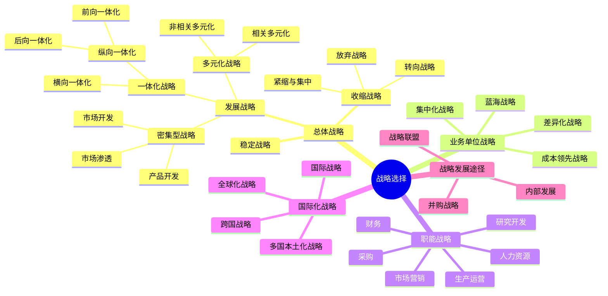

## 📍 章节定位

| 项目 | 信息 |
|------|------|
| **所属科目** | 🎯 公司战略与风险管理 |
| **难度等级** | ⭐⭐⭐⭐⭐ |
| **历年分值** | 10-12分 |
| **建议学时** | 12-15h |
| **核心地位** | 全书最核心章节，主观题必考 |

## 📝 考情分析

本章是本科目考试的绝对核心，分值占比最高。近五年主观题几乎全部出自本章，常以案例分析形式考查总体战略类型辨识、并购动因与风险、战略联盟类型判断、基本竞争战略选择等。

命题规律：
- **总体战略类型辨识**：给案例判断属于一体化（前向/后向/横向）、密集型（市场渗透/开发/产品开发）、多元化（相关/非相关）是高频考点
- **并购与战略联盟**：并购动因、并购失败原因、战略联盟类型（合资/契约）几乎每年必考
- **基本竞争战略**：成本领先、差异化、集中化的适用条件与风险
- **蓝海战略**：重塑原则与六路径框架是近年新增热点
- **国际化战略**：四种类型（国际、多国本土、全球、跨国）的辨析

备考建议：务必能从案例中精准提取"战略信号词"，建立"案例描述→战略类型"的映射。

## 🧠 知识框架

## 📖 核心精讲

### 一、总体战略（公司层战略）

总体战略是企业最高层次的战略，选择企业可以竞争的经营领域，合理配置资源。总体战略分为**发展战略、稳定战略和收缩战略**三大类。

#### （一）发展战略

发展战略强调充分利用外部机会和内部优势，向更高层次发展。包括一体化战略、密集型战略和多元化战略三种基本类型。

##### 1. 一体化战略

一体化战略是对具有优势和增长潜力的产品或业务，沿经营链条纵向或横向延展业务深度和广度。

| 类型 | 含义 | 适用条件 | 风险 |
|------|------|----------|------|
| **前向一体化** | 获得分销商或零售商的所有权或控制权 | 销售商成本高/可靠性差；产业增长潜力大；具备资金人力；销售环节利润率高 | 不熟悉新业务领域；投资大、资产专用性强，退出成本高 |
| **后向一体化** | 获得供应商的所有权或控制权 | 供应商成本高/可靠性差；供应商少而竞争者多；产业增长潜力大；供应环节利润率高 | 同上 |
| **横向一体化** | 向产业价值链相同阶段扩张 | 产业竞争激烈；规模经济显著；符合反垄断法；产业增长潜力大 | 反垄断风险；整合难度大 |

> 📌 **案例信号词**：自建物流/渠道→前向一体化；收购原料供应商/矿权→后向一体化；并购同行企业→横向一体化。

##### 2. 密集型战略（安索夫矩阵）

密集型战略基于安索夫"产品—市场战略组合"矩阵：

| | 现有产品 | 新产品 |
|------|------|------|
| **现有市场** | **市场渗透** | **产品开发** |
| **新市场** | **市场开发** | **多元化** |

- **市场渗透**：在现有市场靠单一产品增加市场份额。适用：整体市场增长中；企业市场地位强大；风险低、投资少。
- **市场开发**：将现有产品打入新市场（新区域/新细分）。适用：存在未开发市场；有新销售渠道；企业有过剩产能。
- **产品开发**：在原有市场推出新产品。适用：产品信誉度高；高新技术产业；高速增长阶段；研发能力强。

##### 3. 多元化战略

| 类型 | 含义 | 特点 |
|------|------|------|
| **相关多元化** | 以现有业务/市场为基础进入相关领域 | 可利用现有能力，风险较低 |
| **非相关多元化** | 进入与现有产品/市场无关的领域 | 分散风险，但管理难度大 |

多元化优点：分散风险；利用剩余资源；获取协同效应；增强市场影响力。
多元化风险：来自原有经营产业的风险；市场整体风险；产业进入风险；产业退出风险；内部经营整合风险。

#### （二）稳定战略

稳定战略指企业在战略期基本保持原有经营范围和目标。优点是风险较小；缺点是可能丧失发展机遇。

#### （三）收缩战略

收缩战略指企业因经营状况恶化或环境不利，缩小经营范围或减少资源投入。

| 类型 | 含义 |
|------|------|
| **紧缩与集中战略** | 短期削减开支、集中资源于核心业务 |
| **转向战略** | 调整或扭转衰退局面，改变经营方向 |
| **放弃战略** | 出售或停止某项业务 |

### 二、业务单位战略（竞争战略）

#### （一）基本竞争战略（波特三大战略）

| 战略类型 | 核心思路 | 适用条件 | 风险 |
|----------|----------|----------|------|
| **成本领先** | 成为产业中成本最低者 | 规模经济显著；产品标准化；价格敏感；转换成本低 | 技术变化使投资贬值；易被模仿；忽视需求变化 |
| **差异化** | 提供独特产品/服务 | 产品多样化；顾客需求差异大；创新能力强 | 成本过高；差异化被模仿；买方需求趋同 |
| **集中化** | 聚焦特定细分市场 | 细分市场差异显著；竞争者未关注；企业资源有限 | 细分市场消失；竞争者侵入；成本差异缩小 |

> 💡 **集中化战略**又可分为集中成本领先和集中差异化两种。集中化战略的风险包括：细分市场需求消失、竞争者找到更细分市场、成本差异缩小使集中成本优势丧失。

#### （二）蓝海战略

蓝海战略要求打破价值与成本的权衡，开创无人争抢的市场空间。

**蓝海战略的六项原则**：

| 原则类型 | 具体原则 |
|----------|----------|
| **战略制定原则** | ①重建市场边界；②关注全局而非数字；③超越现有需求；④遵循合理的战略顺序 |
| **战略执行原则** | ⑤克服关键组织障碍；⑥将战略执行建成战略的一部分 |

**重塑市场边界的六条路径**：
1. 跨越替代性产业
2. 跨越战略集团
3. 跨越买方链条
4. 跨越互补性产品或服务
5. 跨越针对买方的功能与情感导向
6. 跨越时间

### 三、职能战略

职能战略涉及企业各职能部门如何配置资源为各级战略服务。

| 职能战略 | 核心内容 |
|----------|----------|
| **市场营销战略** | 目标市场选择、市场定位（产品/价格/渠道/促销） |
| **生产运营战略** | 产能规划、选址、工艺设计、供应链管理 |
| **研发战略** | 研发类型（产品研究/流程研究）、研发模式（自主/委托/联合） |
| **采购战略** | 供应商管理、采购模式、库存管理 |
| **人力资源战略** | 招聘、培训、绩效、薪酬、员工关系 |
| **财务战略** | 融资、投资、股利分配 |

### 四、国际化战略

| 战略类型 | 全球学习 | 当地响应 | 特点 |
|----------|----------|----------|------|
| **国际战略** | 弱 | 弱 | 将本国产品销往海外，总部控制 |
| **多国本土化战略** | 弱 | 强 | 满足各国本地需求，成本较高 |
| **全球化战略** | 强 | 弱 | 标准化产品全球销售，规模经济 |
| **跨国战略** | 强 | 强 | 兼顾全球效率与本地响应，最复杂 |

> 📌 **记忆要点**：用"全球学习×当地响应"两维度判断。国际=都弱；多国本土化=响应强学习弱；全球化=学习强响应弱；跨国=都强。

### 五、战略发展途径

#### （一）内部发展（内生发展）

企业利用自身资源创建新业务。优点：风险可控、共享专长、易整合；缺点：速度慢、需新壁垒突破。

#### （二）并购战略

**并购动因**：
1. 避开进入壁垒，迅速进入市场
2. 获取协同效应（经营协同、财务协同、管理协同）
3. 获取规模经济
4. 削减竞争压力
5. 获取被并购方的资源/能力

**并购失败的原因**：
- 决策不当（并购前未充分评估）
- 支付过高的并购费用
- 并购后不能很好地整合
- 跨文化整合困难
- 并购过程遭遇法律/反垄断审查

**并购的类型**：
- 按产业：横向并购、纵向并购、混合并购
- 按意向：善意并购、敌意并购
- 按支付方式：现金并购、股票并购、综合并购

#### （三）战略联盟

战略联盟是两个或以上企业为实现资源共享、风险共担而结成的合作伙伴关系。

| 类型 | 特点 | 优势 | 劣势 |
|------|------|------|------|
| **合资企业（股权式）** | 共同出资设立新企业 | 控制力强、关系紧密 | 投资大、退出难、灵活性低 |
| **契约式联盟** | 通过协议合作，不设新企业 | 灵活、成本低 | 控制力弱、稳定性差 |

**战略联盟的动因**：促进技术创新；避免经营风险；避免或限制竞争；实现资源互补；开拓新市场；降低协调成本。

> 📌 **核心区分**：合资=设新企业（股权）；契约式=技术授权、生产外包、联合营销等（无新企业）。

## 💡 典型例题

**【2024年综合题节选】** 某家电企业原以代工生产为主，后收购上游压缩机厂和下游连锁卖场，并自建电商平台。请判断该企业实施了何种总体战略。

**【参考答案】**
该企业实施了**纵向一体化战略**（包含前向和后向）：
- 收购上游压缩机厂→**后向一体化**（控制供应商，确保关键原材料供应）
- 收购下游连锁卖场+自建电商平台→**前向一体化**（控制销售渠道，增强对消费者的敏感性）

适用条件分析：家电产业增长潜力大；原有供应商/销售商成本高；企业具备资金和人力资源；供应和销售环节利润率较高。

## 🎯 记忆口诀

- **总体战略三分类**："发展-稳定-收缩"，发展又有"一体-密集-多元"
- **安索夫矩阵**："现有新产品，现有新市场"两两组合→渗透、开发、开发、多元
- **波特三战略**："成本领先抢低价，差异化走独特，集中化切蛋糕"
- **蓝海六路径**："替集链补功时"（替代、集团、链条、互补、功能、时间）
- **国际化四战略**："国多全跨"——国际（都弱）、多国（响强）、全球（学强）、跨国（都强）
- **并购失败五原因**："决策不当付太高，整合困难跨文化，法律审查也来扰"

## ✅ 同步练习

**1. [单选]** 某食品企业收购了多家连锁超市，该战略属于（ ）。
A. 前向一体化  B. 后向一体化  C. 横向一体化  D. 多元化

**2. [单选]** 以下属于蓝海战略制定原则的是（ ）。
A. 克服关键组织障碍  B. 重建市场边界  C. 将战略执行建成战略的一部分  D. 超越现有需求

**3. [多选]** 跨国战略的特点包括（ ）。
A. 全球学习能力强  B. 本地响应能力强  C. 标准化产品全球销售  D. 兼顾效率与响应

**4. [简答]** 简述并购战略失败的主要原因。

**5. [案例分析]** 甲公司是一家国内知名运动品牌企业，主要通过经销商渠道销售。近年公司收购了一家海外运动品牌以拓展国际市场，同时自建线上旗舰店并开发智能运动穿戴设备。请分析甲公司采取了哪些总体战略和战略发展途径。

> 参考答案：1.A  2.BD  3.ABD  4.见核心精讲"并购失败的原因"  5.前向一体化（自建线上渠道）、相关多元化（智能穿戴设备）、国际化战略；并购战略（收购海外品牌）、内部发展（开发智能设备）。
