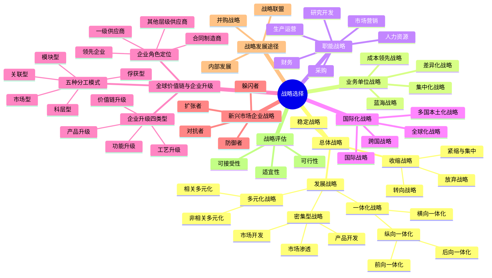

## 1. 章节定位

| 项目 | 信息 |
|------|------|
| 所属科目 | 公司战略与风险管理 |
| 难度等级 | 5 |
| 历年分值 | 10-12 分 |
| 建议学时 | 12-15 小时 |
| 核心地位 | 全书最核心章节，主观题必考 |

## 2. 考情分析

本章是本科目考试的绝对核心，分值占比最高（10-12 分）。近五年主观题几乎全部出自本章，常以案例分析形式考查总体战略类型辨识、并购动因与风险、战略联盟类型判断、基本竞争战略选择等。

### 命题规律与重点考查趋势

近五年考查频率较高的考点分布如下：

| 考点 | 出题频次 | 题型偏好 | 难度 |
|------|----------|----------|------|
| 一体化战略辨识（前向/后向/横向） | ★★★★★ | 案例/单选 | 中 |
| 密集型战略（安索夫矩阵） | ★★★★ | 案例/单选 | 中 |
| 多元化战略（相关/非相关） | ★★★★ | 案例 | 中 |
| 收缩战略三种类型 | ★★★ | 单选/多选 | 易 |
| 波特三大竞争战略选择 | ★★★★★ | 案例 | 中 |
| 蓝海战略六路径 | ★★★★ | 案例/多选 | 中 |
| 并购动因与失败原因 | ★★★★★ | 案例/简答 | 中 |
| 战略联盟（股权式 vs 契约式） | ★★★★ | 案例/单选 | 中 |
| 国际化战略四类型 | ★★★ | 单选/多选 | 中 |
| 职能战略识别 | ★★ | 单选 | 易 |

### 命题热点

1. **总体战略类型辨识**：给案例判断属于一体化（前向/后向/横向）、密集型（市场渗透/开发/产品开发）、多元化（相关/非相关）是高频考点。命题陷阱：判断"前向"还是"后向"要以企业原有位置为参照——向消费者方向延伸是前向，向原料方向延伸是后向。
2. **并购与战略联盟**：并购动因、并购失败原因、战略联盟类型（合资/契约）几乎每年必考。命题陷阱：合资企业是"股权式联盟"，技术授权、生产外包是"契约式联盟"。
3. **基本竞争战略**：成本领先、差异化、集中化的适用条件与风险。命题陷阱：集中化战略可分为"集中成本领先"和"集中差异化"两种。
4. **蓝海战略**：重塑原则与六路径框架是近年热点。命题陷阱：六路径中"跨越替代性产业"是指替代品产业，而非直接竞争者。
5. **国际化战略**：四种类型（国际、多国本土、全球、跨国）的辨析。命题陷阱：跨国战略是"全球学习强+本地响应强"的复杂战略。

### 与前后章联系

- **承前**：本章承接第 2 章"战略分析"的结果。战略分析得出的内外部条件，决定本章的战略选择。例如 SWOT 的 SO 战略对应本章的发展战略，WT 战略对应收缩战略。
- **启后**：本章选择的战略需要第 4 章"战略实施"来落地。组织结构、企业文化、资源配置等都是战略实施的支撑。

### 学习方法建议

- **信号词锚定法**：建立"案例描述→战略类型"的信号词映射（如"自建物流"→前向一体化，"收购供应商"→后向一体化，"并购同行"→横向一体化）；
- **案例分类法**：将华为、海尔、小米、阿里巴巴、比亚迪等企业的战略行为按本章框架分类记忆；
- **对比记忆法**：相关 vs 非相关多元化、股权式 vs 契约式联盟、国际 vs 多国本土化 vs 全球化 vs 跨国战略；
- **完整分析训练**：综合题训练中先做战略分析（第 2 章），再做战略选择（第 3 章），最后做战略实施建议（第 4 章），形成完整答题链条。

## 3. 知识框架

## 4. 核心精讲

### 一、总体战略（公司层战略）

总体战略是企业最高层次的战略，选择企业可以竞争的经营领域，合理配置资源。总体战略分为**发展战略、稳定战略和收缩战略**三大类。

#### （一）发展战略

发展战略强调充分利用外部机会和内部优势，向更高层次发展。包括一体化战略、密集型战略和多元化战略三种基本类型。

##### 1. 一体化战略

一体化战略是对具有优势和增长潜力的产品或业务，沿经营链条纵向或横向延展业务深度和广度。

| 类型 | 含义 | 适用条件 | 风险 | 案例 |
|------|------|----------|------|------|
| **前向一体化** | 获得分销商或零售商的所有权或控制权（向下游消费者方向延伸） | 销售商成本高/可靠性差；产业增长潜力大；具备资金人力；销售环节利润率高 | 不熟悉新业务领域；投资大、资产专用性强，退出成本高 | 茅台自建直营店、京东自建物流、比亚迪自建销售网络 |
| **后向一体化** | 获得供应商的所有权或控制权（向上游原料方向延伸） | 供应商成本高/可靠性差；供应商少而竞争者多；产业增长潜力大；供应环节利润率高 | 同上 | 比亚迪自研电池、特斯拉收购锂矿、海尔自建压缩机厂 |
| **横向一体化** | 向产业价值链相同阶段扩张（并购同行） | 产业竞争激烈；规模经济显著；符合反垄断法；产业增长潜力大 | 反垄断风险；整合难度大 | 美的并购小天鹅、滴滴快的合并、吉利收购沃尔沃 |

> **案例信号词速记**：自建物流/渠道/直营店→前向一体化；收购原料供应商/矿权/自研零部件→后向一体化；并购同行企业/同业合并→横向一体化。

**判断前向 vs 后向的关键**：以企业原有位置为参照——向消费者方向延伸（销售端）是前向，向原料方向延伸（采购端）是后向。

##### 2. 密集型战略（安索夫矩阵）

密集型战略基于安索夫（Ansoff）"产品—市场战略组合"矩阵：

| | 现有产品 | 新产品 |
|------|------|------|
| **现有市场** | **市场渗透** | **产品开发** |
| **新市场** | **市场开发** | **多元化** |

| 战略 | 含义 | 适用条件 | 案例 |
|------|------|----------|------|
| **市场渗透** | 在现有市场靠单一产品增加市场份额 | 整体市场增长中；企业市场地位强大；风险低、投资少 | 瑞幸咖啡加大补贴争夺现有市场 |
| **市场开发** | 将现有产品打入新市场（新区域/新细分） | 存在未开发市场；有新销售渠道；企业有过剩产能 | 蜜雪冰城开拓海外市场、华莱士下沉三四线城市 |
| **产品开发** | 在原有市场推出新产品 | 产品信誉度高；高新技术产业；高速增长阶段；研发能力强 | 苹果向 iPhone 用户推出 AirPods、Apple Watch |

##### 3. 多元化战略

| 类型 | 含义 | 特点 | 案例 |
|------|------|------|------|
| **相关多元化** | 以现有业务/市场为基础进入相关领域 | 可利用现有能力，风险较低 | 华为从通信设备进入手机、小米从手机进入 IoT |
| **非相关多元化** | 进入与现有产品/市场无关的领域 | 分散风险，但管理难度大 | 格力进入手机和芯片、海尔进入金融业务 |

**相关 vs 非相关的判断**：是否在技术、生产、市场、渠道、管理等方面存在协同。

**多元化的优点**：
- 分散风险（不同业务周期互补）；
- 利用剩余资源（资金、管理能力、品牌）；
- 获取协同效应（业务间资源共享）；
- 增强市场影响力。

**多元化的风险**：
- 来自原有经营产业的风险（原有业务风险未消除）；
- 市场整体风险（系统性风险无法分散）；
- 产业进入风险（对新产业不熟悉）；
- 产业退出风险（资产专用性强、退出壁垒高）；
- 内部经营整合风险（管理复杂度上升、协同效应未达成）。

#### （二）稳定战略

稳定战略指企业在战略期基本保持原有经营范围和目标。

- **优点**：风险较小、避免开发新业务的风险、保持现有市场地位；
- **缺点**：可能丧失发展机遇、对外部环境变化应对迟缓、内部动力不足。

适用情境：产业成熟、企业市场份额稳定、外部环境相对稳定、企业资源有限。

#### （三）收缩战略

收缩战略指企业因经营状况恶化或环境不利，缩小经营范围或减少资源投入。

| 类型 | 含义 | 案例 |
|------|------|------|
| **紧缩与集中战略** | 短期削减开支、集中资源于核心业务 | 阿里 2023 年"1+6+N"分拆后聚焦核心电商业务 |
| **转向战略** | 调整或扭转衰退局面，改变经营方向 | 联想从 PC 转向 PC+移动+数据中心 |
| **放弃战略** | 出售或停止某项业务 | 雅虎出售核心互联网业务给 Verizon |

**收缩战略的退出障碍**：

| 退出障碍 | 含义 |
|----------|------|
| **固定资产的专用性** | 资产难以转用或出售 |
| **退出成本** | 员工安置、合同违约金、清理成本 |
| **内部战略联系** | 该业务与其他业务有协同关系 |
| **感情障碍** | 管理层对业务有情感依恋 |
| **政府与社会约束** | 政府出于就业、税收考虑阻碍退出 |

### 二、业务单位战略（竞争战略）

#### （一）基本竞争战略（波特三大战略）

| 战略类型 | 核心思路 | 适用条件 | 风险 | 案例 |
|----------|----------|----------|------|------|
| **成本领先** | 成为产业中成本最低者 | 规模经济显著；产品标准化；价格敏感；转换成本低；具备资本与供应链优势 | 技术变化使投资贬值；易被模仿；忽视需求变化 | 沃尔玛、拼多多、春秋航空 |
| **差异化** | 提供独特产品/服务 | 产品多样化；顾客需求差异大；创新能力强；品牌形象突出 | 成本过高；差异化被模仿；买方需求趋同 | 苹果、茅台、星巴克 |
| **集中化** | 聚焦特定细分市场 | 细分市场差异显著；竞争者未关注；企业资源有限 | 细分市场消失；竞争者侵入；成本差异缩小 | 劳斯莱斯（高端汽车）、Lululemon（瑜伽服） |

> **集中化战略**又可分为：
> - **集中成本领先**：在细分市场上以低成本竞争（如神州专车聚焦企业用户、低成本）；
> - **集中差异化**：在细分市场上以差异化竞争（如保时捷聚焦豪华跑车）。
>
> 集中化战略的风险包括：①细分市场需求消失；②竞争者找到更细分市场；③成本差异缩小使集中成本优势丧失；④大企业侵入细分市场。

**三大战略的实现路径对比**：

| 战略 | 资源投入重点 | 组织要求 | 控制重点 |
|------|-------------|----------|----------|
| **成本领先** | 规模化生产、流程优化、供应链管理 | 严格成本控制、效率导向 | 成本指标、生产效率 |
| **差异化** | 研发、品牌、营销、服务 | 创新能力、灵活性、品质导向 | 产品质量、品牌价值 |
| **集中化** | 细分市场深度开发 | 专业化、敏捷响应 | 细分市场份额、客户满意度 |

#### （二）蓝海战略

蓝海战略（Kim & Mauborgne, 2005）要求打破价值与成本的权衡，开创无人争抢的市场空间。

**红海 vs 蓝海对比**：

| 维度 | 红海战略 | 蓝海战略 |
|------|----------|----------|
| 竞争空间 | 已有市场空间 | 未开发市场空间 |
| 竞争策略 | 击败竞争对手 | 无人争抢，重塑竞争规则 |
| 需求 | 满足现有需求 | 创造新需求 |
| 价值-成本关系 | 价值高则成本高，或成本低则价值低 | 同时追求高价值和低成本 |

**蓝海战略的六项原则**：

| 原则类型 | 具体原则 |
|----------|----------|
| **战略制定原则** | ①重建市场边界；②关注全局而非数字；③超越现有需求；④遵循合理的战略顺序 |
| **战略执行原则** | ⑤克服关键组织障碍；⑥将战略执行建成战略的一部分 |

**重塑市场边界的六条路径**：

| 路径 | 含义 | 案例 |
|------|------|------|
| ①跨越替代性产业 | 从替代品中寻找灵感 | 太阳马戏团结合马戏与戏剧，开创新形态 |
| ②跨越战略集团 | 从不同定位的战略集团中寻找机会 | 丰田凌志同时挑战奔驰和高档日本车 |
| ③跨越买方链条 | 重新定义买方角色 | 媒体从面向读者转向面向广告商 |
| ④跨越互补性产品或服务 | 考虑产品使用前、中、后的整体体验 | 喜剧公司提供停车位、餐饮等配套 |
| ⑤跨越针对买方的功能与情感导向 | 将功能型转为情感型，或反之 | 西斯韦尔将钟表从情感型转为功能型 |
| ⑥跨越时间 | 预测未来趋势，提前布局 | 苹果预判智能手机趋势，推出 iPhone |

**案例锚定——中国企业的蓝海战略**：
- **小米生态链**：跨越"手机"与"IoT 产品"的边界，开创"智能生活一站式"市场；
- **喜茶**：跨越"传统茶饮"与"咖啡文化"的边界，开创"新式茶饮"市场；
- **小红书**：跨越"电商"与"社交"的边界，开创"内容种草"市场。

### 三、职能战略

职能战略涉及企业各职能部门如何配置资源为各级战略服务。

| 职能战略 | 核心内容 | 关键决策 |
|----------|----------|----------|
| **市场营销战略** | 目标市场选择、市场定位 | STP（细分、目标、定位）、4P（产品、价格、渠道、促销） |
| **生产运营战略** | 产能规划、选址、工艺设计、供应链管理 | JIT（准时制）、精益生产、柔性制造 |
| **研发战略** | 研发类型、研发模式 | 产品研究 vs 流程研究；自主研发 vs 委托研发 vs 联合研发 |
| **采购战略** | 供应商管理、采购模式、库存管理 | 集中采购 vs 分散采购；JIT 采购 |
| **人力资源战略** | 招聘、培训、绩效、薪酬、员工关系 | 人才梯队建设、绩效考核体系、股权激励 |
| **财务战略** | 融资、投资、股利分配 | 资本结构优化、并购融资、股利政策 |

**财务战略的矩阵分析（基于"价值创造-现金剩余"）**：

| 象限 | 价值创造能力 | 现金状况 | 财务战略 |
|------|-------------|----------|----------|
| ① | 高 | 剩余 | 投资增长、回购股份 |
| ② | 高 | 短缺 | 增发股份、降低股利 |
| ③ | 低 | 剩余 | 重组业务、分配现金 |
| ④ | 低 | 短缺 | 剥离资产、清算退出 |

### 四、国际化战略

企业国际化经营战略基本上有四种类型，可以通过"**全球协作（全球学习）**"的程度和"**本土独立性和适应能力（当地响应）**"的程度所构成的两维坐标体现。

| 战略类型 | 全球学习 | 当地响应 | 特点 | 案例 |
|----------|----------|----------|------|------|
| **国际战略** | 弱 | 弱 | 将本国产品销往海外，总部控制 | 早期苹果将美国产品销往全球、宝洁早期在海外的工厂只生产母公司开发的差异化产品 |
| **多国本土化战略** | 弱 | 强 | 满足各国本地需求，成本较高 | 联合利华针对不同国家推出不同配方、肯德基在中国推出豆浆油条、皮蛋瘦肉粥 |
| **全球化战略** | 强 | 弱 | 标准化产品全球销售，规模经济 | 英特尔芯片全球标准化、宝洁全球化研发集中布局 |
| **跨国战略** | 强 | 强 | 兼顾全球效率与本地响应，最复杂 | 宝洁、ABB、华为全球化运营 |

#### （一）国际战略

国际战略是指企业将其具有价值的产品与技能转移到国外的市场，以创造价值的举措。企业多把产品开发的职能留在母国，而在东道国建立制造和营销职能。企业总部一般严格地控制产品与市场战略的决策权。

- **适用条件**：企业的特殊竞争力在国外市场拥有竞争优势，且该市场降低成本的压力较小；
- **局限性**：当当地市场要求根据本地情况提供产品与服务时不适合；由于在国外各生产基地都有厂房设备，形成重复建设，加大了经营成本。

#### （二）多国本土化战略

多国本土化战略根据不同国家的不同市场，提供更能满足当地市场需要的产品和服务。将自己国家所开发出的产品和技能转移到国外市场，而且在重要的国家市场上从事生产经营活动。

- **适用条件**：当地市场强烈要求根据当地需求提供产品和服务并降低成本时；
- **局限性**：成本结构较高，无法获得经验曲线效益和区位效益；生产设施重复建设；过于本土化使子公司过于独立，企业最终会指挥不动自己的子公司，难以将自己的产品和服务向这些子公司转移。

**案例锚定**：肯德基（KFC）在中国实施多国本土化战略，相继推出皮蛋瘦肉粥、香菇鸡肉粥、油条等适合中国人口味的产品，成为消费者最钟爱的快餐连锁品牌之一。

#### （三）全球化战略

全球化战略是向全世界的市场推销标准化的产品和服务，并在较有利的国家集中进行生产经营活动，由此形成经验曲线和规模经济效益，以获得高额利润。企业采取这种战略主要是为了实施**成本领先战略**。实施全球化战略的跨国公司是通过提供标准化的产品来促使不同国家的习俗和偏好趋同。

- **适用条件**：成本压力大且当地特殊要求小；
- **局限性**：在要求提供当地特色的产品的市场上不合适；对东道国需求差异的反应和灵活性较差。

#### （四）跨国战略

跨国战略是在全球激烈竞争的情况下，为了形成以经验为基础的成本效益和区位效益，转移企业的核心竞争力，同时为满足当地市场需要而制定和实施的一种国际化经营战略。

跨国企业既要集中资源在母国运营以实现规模经济和保护核心竞争力，也要将部分资源分散在母国以外的地方以降低成本和建立竞争优势。母公司与子公司、子公司与子公司的关系是**双向的**——不仅母公司向子公司提供产品与技术，子公司也向母公司和其他子公司提供产品与技术。

- **核心决策**：哪些资源和能力应集中在母国运营；哪些资源可以在母国外集中运营；哪些资源应在某区域内分散使用；
- **特点**：跨国战略目前被认为是跨国企业**最佳的战略选择**，试图兼顾全球效率与地区适应性；
- **实践难点**：地区适应性和全球化效率之间的平衡点难以确定，最优平衡是主观的和经常变动的。随着具有个性化、智能化、连接性、生态化特征的数字化技术的迅猛发展，跨国战略成为跨国企业可能的现实选择。

> **记忆要点**：用"全球学习×当地响应"两维度判断。
> - 国际=都弱（最简单）；
> - 多国本土化=响应强学习弱；
> - 全球化=学习强响应弱；
> - 跨国=都强（最复杂、最优）。

### 五、全球价值链与企业升级

#### （一）全球价值链的概念

全球价值链是指在全球范围内为实现商品或服务价值而连接生产、销售、回收处理等过程的全球性跨国企业网络组织，涉及从原料采集和运输、半成品和成品的生产和分销，直至最终消费和回收处理的过程。当今全球贸易总额中大约 60% 来自中间商品和服务贸易。

全球价值链理论起源于波特"价值链"概念，包含三个核心概念：
1. **产品内国际分工**：特定产品不同的生产环节在地理空间上分散到不同国家，由不同国家进行专业化生产。具备三个特点：①产品生产环节分解为多个过程；②生产环节在两个或两个以上国家进行；③至少一国使用了进口产品生产并出口。
2. **全球生产网络**：跨国企业运用对外直接投资、国际贸易、非股权安排等方式参与产品内国际分工，彼此之间形成的相互影响、相互促进的关联关系。
3. **全球价值链**：连接生产、销售、回收处理等过程的全球性跨国企业网络组织。

#### （二）全球价值链中企业的角色定位

| 角色 | 特点 | 价值增值 | 案例 |
|------|------|----------|------|
| **领先企业** | 拥有产品、技术、品牌、营销渠道、规模经济等垄断优势；担负全球价值链战略制定、组织领导；拥有绝对控制力和影响力 | 获取最高利润（如芯片产业高达 60%） | 英特尔、苹果、宝洁 |
| **一级供应商** | 技术能力较强、成本优势较高；起桥梁作用；承担部件生产、组装、物流等外围管理工作 | 较高利润（约 20%） | 日本、韩国关键零部件供应商 |
| **其他层级供应商** | 以微弱比较优势参与；承接非关键环节的非核心生产活动（简单组装、OEM 等） | 较低利润（约 10%） | 中国等发展中国家的代工厂（二级 4700 家、三级 31600 家） |
| **合同制造商** | 为领先企业提供除关键环节设计和营销外的配套服务；具备一定技术能力（如 ODM）；参与多个全球价值链，对领先企业依赖度较低 | 中等利润 | 中国台湾 PC 产业的 ODM 厂商 |

#### （三）全球价值链的五种分工模式

| 分工模式 | 协调机制 | 供应商特点 | 适用产业 |
|----------|----------|------------|----------|
| **科层型** | 对外直接投资，领先企业协调性高 | 供应商被垂直整合，受全面管理控制；能快捷获得领先企业现成资产 | 高知识产权、高质量风险、高品牌价值产品 |
| **市场型** | 市场交易，领先企业协调性低 | 交易伙伴间无正式合作；客户转换成本低；信息流动仅限贸易渠道 | 商品及商品化产品 |
| **俘获型** | 非股权形式，领先企业协调性较高 | 供应商被"锁定"在狭窄范围内（简单组装、贴牌）；对领先企业依赖度高 | 汽车产业供应商分级结构 |
| **模块型** | 非股权形式，领先企业协调性较低 | 选择和更换供应商便利；信息流动量较高；供应商参与多个价值链 | 电子产业 |
| **关联型** | 非股权形式，领先企业协调性中等 | 合作伙伴相互依存度高；交易交流频繁；转换成本高，供应更稳定 | 复杂规格、难以编码的产品 |

#### （四）发展中国家企业升级的四种类型

汉弗莱和施米茨（Humphrey and Schmitz, 2002）提出企业升级从易到难的 4 种类型：

| 升级类型 | 含义 | 案例 |
|----------|------|------|
| **工艺升级** | 通过生产技术改进和生产组织管理效率提升实现 | 农业供应商采用良好农业规范（GAP），改进田间管理、收割、存储运输 |
| **产品升级** | 通过改进产品设计（甚至开发突破性产品）提高竞争力 | 旅游业提供高品质酒店或生态旅游、医疗旅游等高档次产品 |
| **功能升级** | 通过占领价值链更高附加值环节实现升级 | 从 OEM 到 ODM 的提升 |
| **价值链升级** | 通过进入壁垒更高的价值链或获取更高地位提升盈利能力 | 汽车零部件供应商进入整车制造；从 OEM→ODM→OBM（自有品牌制造商） |

> **升级规律**：一般认为，企业升级遵循"工艺升级→产品升级→功能升级→价值链升级"的循序渐进的发展进程。不同分工模式对升级影响不同：科层型和俘获型下功能升级和价值链升级较难发生；模块型和市场型下供应商可基于自主核心能力实现功能升级和价值链升级，最终成为新的价值链中的领先者。

**案例锚定——万向公司角色与升级转变**：
- 1984 年：与 U 国公司签订 OEM 协议（其他层级供应商）；
- 2003 年：成为一级供应商（桥梁作用）；
- 2014 年：收购新能源电动汽车公司，全面进入整车制造产业（**价值链升级**）。

### 六、新兴市场的企业战略

新兴市场是指一些市场发展潜力巨大的发展中国家。在全球化竞争中，新兴市场本土企业必须关注两个问题：①所在产业面临的全球化压力有多大？②所在公司优势资源的跨国转移能力怎样？

#### （一）按产业特性配置资源

不同产业面临的全球化压力不同：

| 产业类型 | 全球化压力 | 本土化压力 | 战略选择 | 典型产业 |
|----------|------------|------------|----------|----------|
| 全球化产业 | 高 | 低 | 全球化战略 | 飞机、相机、家用电子产品、计算机、航天、汽车 |
| 多国本土化产业 | 低 | 高 | 多国本土化战略 | 服装、包装食品、水泥 |
| 中间产业 | 中 | 中 | 灵活选择 | 合成纤维、钢铁 |

#### （二）新兴市场本土企业的战略选择

根据"产业全球化压力"和"企业优势资源跨国转移能力"两个维度，新兴市场本土企业有四种战略选择：

| 战略类型 | 产业全球化压力 | 企业优势资源跨国转移能力 | 含义 | 典型做法 |
|----------|----------------|--------------------------|------|----------|
| **防御者（Defender）** | 低 | 低 | 专注于本土市场，利用本地优势抵御外资 | 在本土市场上专注于具有优势的细分市场；调整产品适应本地需求 |
| **扩张者（Expander）** | 低 | 高 | 将本地优势资源向其他新兴市场扩张 | 将在本国市场上积累的优势资源向其他新兴市场转移 |
| **躲闪者（Dodger）** | 高 | 低 | 与外资合作或被并购，避免正面竞争 | 与外资成立合资企业；将业务出售给外资；专注于外资忽视的细分市场 |
| **对抗者（Contender）** | 高 | 高 | 与外资在全球市场竞争 | 将资源转移到全球竞争的关键环节；建立世界级能力；通过并购获取关键资源 |

> **记忆要点**："防扩躲对"——
> - 防御者：压力低能力低，专注本土细分；
> - 扩张者：压力低能力高，向其他新兴市场扩张；
> - 躲闪者：压力高能力低，与外资合作或退出；
> - 对抗者：压力高能力高，与外资全球竞争。

**案例锚定——中国企业的四种战略**：
- **防御者**：中国本土水泥企业利用本地销售网络和政府关系，专注于区域市场；
- **扩张者**：华为早期将在中国积累的通信设备制造能力向亚非拉新兴市场扩张；
- **躲闪者**：中国部分汽车厂商与外资成立合资企业（如一汽-大众、上汽-通用）；
- **对抗者**：比亚迪、大疆等企业在电池/无人机产业建立世界级能力，与全球领先企业对抗。

### 七、战略发展途径

#### （一）内部发展（内生发展）

企业利用自身资源创建新业务。

- **优点**：风险可控、共享专长、易整合、积累内部能力；
- **缺点**：速度慢、需突破进入壁垒、难以获得规模经济、可能错过市场机会。

适用情境：产业进入壁垒低、企业具备相关能力、市场发展缓慢。

#### （二）并购战略

**并购动因**：
1. 避开进入壁垒，迅速进入市场（缩短进入时间）；
2. 获取协同效应（经营协同、财务协同、管理协同）；
3. 获取规模经济（扩大规模降低单位成本）；
4. 削减竞争压力（并购竞争对手）；
5. 获取被并购方的资源/能力（技术、品牌、人才、渠道）；
6. 分散经营风险（多元化并购）。

**协同效应的三种类型**：

| 协同类型 | 含义 | 案例 |
|----------|------|------|
| **经营协同** | 业务整合带来效率提升 | 共享销售渠道、共享研发成果、规模经济 |
| **财务协同** | 财务整合带来效益 | 合理避税、提高负债能力、降低资本成本 |
| **管理协同** | 管理能力转移带来效益 | 优秀管理团队输出到被并购企业 |

**并购失败的原因**：
- **决策不当**：并购前未充分评估（如对目标企业价值高估、对协同效应预期过高）；
- **支付过高的并购费用**：溢价过高，难以收回投资；
- **并购后不能很好地整合**：业务、组织、文化整合困难；
- **跨文化整合困难**：跨国并购文化冲突（如上汽并购双龙失败）；
- **并购过程遭遇法律/反垄断审查**：监管否决（如阿里收购美团被反垄断阻止）。

**并购的类型**：

| 分类标准 | 类型 |
|----------|------|
| 按产业 | 横向并购（同业）、纵向并购（上下游）、混合并购（无关） |
| 按意向 | 善意并购（协商一致）、敌意并购（强行收购） |
| 按支付方式 | 现金并购、股票并购、综合并购（现金+股票+债券） |
| 按是否通过证券交易所 | 协议收购、要约收购 |

**案例锚定——典型并购案例**：

| 并购方 | 被并购方 | 年份 | 类型 | 结果 |
|--------|----------|------|------|------|
| 吉利 | 沃尔沃 | 2010 | 横向并购（跨国） | 成功，吉利品牌升级 |
| 美的 | 库卡（KUKA） | 2016 | 横向并购（跨国） | 成功，进入机器人领域 |
| 海尔 | 通用电气家电 | 2016 | 横向并购（跨国） | 成功，全球化布局 |
| 上汽 | 双龙 | 2004 | 横向并购（跨国） | 失败，文化冲突 |
| 阿里 | 饿了么 | 2018 | 横向并购 | 整合中 |

#### （三）战略联盟

战略联盟是两个或以上企业为实现资源共享、风险共担而结成的合作伙伴关系。

| 类型 | 特点 | 优势 | 劣势 | 案例 |
|------|------|------|------|------|
| **合资企业（股权式）** | 共同出资设立新企业 | 控制力强、关系紧密、利益深度绑定 | 投资大、退出难、灵活性低 | 一汽-大众、上汽-通用 |
| **契约式联盟** | 通过协议合作，不设新企业 | 灵活、成本低、易调整 | 控制力弱、稳定性差 | 技术授权、生产外包、联合营销、联合研发 |

**战略联盟的动因**：
1. 促进技术创新（联合研发分担成本）；
2. 避免经营风险（共享风险）；
3. 避免或限制竞争（联盟阻止恶性竞争）；
4. 实现资源互补（各自优势互补）；
5. 开拓新市场（利用合作伙伴渠道）；
6. 降低协调成本（相比并购，联盟成本低）。

**股权式联盟 vs 契约式联盟对比**：

| 对比维度 | 股权式联盟 | 契约式联盟 |
|----------|-----------|-----------|
| 是否设新企业 | 是 | 否 |
| 投资规模 | 大 | 小 |
| 控制力 | 强 | 弱 |
| 灵活性 | 低 | 高 |
| 退出难度 | 难 | 易 |
| 关系稳定性 | 高 | 低 |
| 利益分配 | 按股权比例 | 按协议约定 |

> **核心区分**：合资=设新企业（股权）；契约式=技术授权、生产外包、联合营销、联合研发等（无新企业）。

**案例锚定——战略联盟典型案例**：
- **华为与徕卡**：联合研发手机摄像头（契约式联盟，联合研发）；
- **小米与飞利浦**：小米生态链接入飞利浦照明产品（契约式联盟，渠道合作）；
- **一汽-大众**：合资企业（股权式联盟）；
- **雷军与 李斌**：小米投资蔚来，但未控制（股权投资，不构成控制性联盟）。

### 八、战略评估与选择

战略评估的三个标准（鲁梅尔特）：

| 标准 | 含义 |
|------|------|
| **适宜性** | 战略是否符合环境分析得出的 SWOT 结论，是否抓住了机会、规避了威胁、发挥了优势、克服了劣势 |
| **可行性** | 企业是否有足够的资源、能力、资金实施该战略 |
| **可接受性** | 战略是否符合利益相关者（股东、员工、客户、政府）的期望，风险是否可接受 |

## 5. 典型例题

**【例题 1】（单选题，一体化战略辨识）**

某食品企业原以生产加工为主，后收购了一家连锁超市和一家包装材料厂。该企业实施的总体战略是（ ）。
A. 多元化战略
B. 横向一体化战略
C. 前向一体化与后向一体化战略
D. 密集型战略

**答案**：C

**解析**：收购连锁超市（下游销售渠道）属于前向一体化；收购包装材料厂（上游原料供应商）属于后向一体化。两者合起来属于纵向一体化战略。横向一体化是并购同行；多元化是进入无关领域；密集型是基于现有产品市场的扩张。

**【例题 2】（单选题，安索夫矩阵）**

某国内知名运动品牌为拓展海外市场，将现有产品出口至东南亚国家。该战略属于安索夫矩阵中的（ ）。
A. 市场渗透
B. 市场开发
C. 产品开发
D. 多元化

**答案**：B

**解析**：市场开发是指将现有产品打入新市场（新区域/新细分市场）。本题是"现有产品+新市场（东南亚）"，属于市场开发。市场渗透是现有产品+现有市场；产品开发是新产品+现有市场；多元化是新产品+新市场。

**【例题 3】（单选题，竞争战略选择）**

某企业专注于高端奢侈品市场，通过独特的设计、稀缺的材料和精湛的工艺建立品牌壁垒，产品价格远高于行业平均水平。该企业采用的竞争战略是（ ）。
A. 成本领先战略
B. 差异化战略
C. 集中差异化战略
D. 集中成本领先战略

**答案**：C

**解析**：聚焦特定细分市场（高端奢侈品）是"集中化"特征；通过独特设计、稀缺材料、精湛工艺建立差异化是"差异化"特征。两者结合为集中差异化战略。如果是在全产业范围差异化，则为差异化战略。

**【例题 4】（多选题，蓝海战略六路径）**

下列各项中，属于蓝海战略"重塑市场边界六路径"的有（ ）。
A. 跨越替代性产业
B. 跨越战略集团
C. 跨越买方链条
D. 跨越互补性产品或服务
E. 跨越时间

**答案**：ABCDE

**解析**：六路径包括：①跨越替代性产业；②跨越战略集团；③跨越买方链条；④跨越互补性产品或服务；⑤跨越针对买方的功能与情感导向；⑥跨越时间。ABCDE 全部正确。

**【例题 5】（多选题，并购失败原因）**

下列各项中，属于企业并购失败主要原因的有（ ）。
A. 决策不当，并购前未充分评估
B. 支付过高的并购费用
C. 并购后不能很好地整合
D. 跨文化整合困难
E. 并购过程遭遇法律或反垄断审查

**答案**：ABCDE

**解析**：并购失败原因包括：①决策不当；②支付过高的并购费用；③并购后不能很好地整合；④跨文化整合困难；⑤并购过程遭遇法律/反垄断审查。ABCDE 全部正确。

**【例题 6】（综合题，总体战略辨识）**

**【2024年综合题节选】** 某家电企业原以代工生产为主，后收购上游压缩机厂和下游连锁卖场，并自建电商平台。请判断该企业实施了何种总体战略。

**答案**：
该企业实施了**纵向一体化战略**（包含前向和后向）：
- 收购上游压缩机厂→**后向一体化**（控制供应商，确保关键原材料供应）
- 收购下游连锁卖场+自建电商平台→**前向一体化**（控制销售渠道，增强对消费者的敏感性）

适用条件分析：家电产业增长潜力大；原有供应商/销售商成本高；企业具备资金和人力资源；供应和销售环节利润率较高。

**解析**：判断一体化战略类型的关键是识别"延伸方向"——向消费者方向是前向，向原料方向是后向。本题"收购压缩机厂"（压缩机是家电的零部件，属上游）是后向；"收购连锁卖场+自建电商"（销售渠道，属下游）是前向。

**【例题 7】（综合题，战略联盟辨识）**

某新能源汽车企业 A 与互联网企业 B 战略合作：双方共同出资 5 亿元设立智能驾驶研发公司，A 占股 51%，B 占股 49%。同时，A 还与芯片企业 C 签订长期供货协议，约定 C 优先向 A 供应最新一代自动驾驶芯片。

要求：判断 A 企业与 B、C 企业的合作分别属于哪种战略联盟类型，并说明理由。

**答案**：

| 合作对象 | 联盟类型 | 理由 |
|----------|----------|------|
| B 企业 | 股权式联盟（合资企业） | 双方共同出资设立新企业（智能驾驶研发公司），按股权比例控制 |
| C 企业 | 契约式联盟 | 通过长期供货协议合作，未设立新企业，仅约定优先供应条款 |

**解析**：股权式联盟的特征是"共同出资设立新企业"，控制力强但灵活性低；契约式联盟的特征是"通过协议合作，不设新企业"，灵活但稳定性差。判断关键是有无设立新企业、是否涉及股权。

**【例题 8】（综合题，国际化战略辨识）**

某中国手机企业在国际化过程中：(1) 早期将国内生产的标准化手机销往海外，由国内总部统一控制研发、生产和品牌；(2) 后期为适应印度市场，在印度本地建厂、本地化产品设计（增加双卡双待、强化相机美颜）；(3) 同时在全球范围建立研发中心，将中国、印度、欧洲的研发成果相互共享。

要求：分别判断三个阶段的国际化战略类型。

**答案**：

| 阶段 | 战略类型 | 理由 |
|------|----------|------|
| 第一阶段 | 国际战略 | 全球学习弱（仅总部研发）、当地响应弱（标准化产品全球销售） |
| 第二阶段 | 多国本土化战略 | 当地响应强（本地化建厂和产品设计）、全球学习弱（未提及研发共享） |
| 第三阶段 | 跨国战略 | 全球学习强（研发成果全球共享）、当地响应强（仍保持本地化产品） |

**解析**：国际化战略的判断用"全球学习×当地响应"两维度。国际=都弱；多国本土化=响应强学习弱；全球化=学习强响应弱；跨国=都强。第三阶段同时具备"研发全球共享"和"本地化产品"，是跨国战略。

**【例题 9】（单选题，全球价值链企业角色）**

某跨国企业在全球价值链中拥有产品、技术、品牌、营销渠道等垄断优势，担负全球价值链战略制定和组织领导工作，在全球生产网络中拥有绝对的控制力和影响力。该企业属于（ ）。
A. 领先企业  B. 一级供应商  C. 合同制造商  D. 其他层级供应商

**答案**：A

**解析**：领先企业的特征是拥有产品、技术、品牌、营销渠道、规模经济等垄断优势，担负全球价值链战略制定、组织领导以及管理工作，在全球生产网络中拥有绝对的控制力和影响力。一级供应商起桥梁作用；合同制造商为领先企业提供配套服务但参与多个价值链；其他层级供应商承接非关键环节。

**【例题 10】（单选题，企业升级类型）**

某发展中国家汽车零部件企业通过自主研发和品牌建设，从初始设备制造商（OEM）逐步发展为初始设计制造商（ODM），最终成为自有品牌制造商（OBM），进入整车制造产业。该企业实现的是（ ）。
A. 工艺升级  B. 产品升级  C. 功能升级  D. 价值链升级

**答案**：D

**解析**：从 OEM→ODM→OBM 并进入整车制造产业，是进入了技术壁垒和资本壁垒更高的价值链（从零部件到整车），属于价值链升级。工艺升级是生产技术和组织管理效率提升；产品升级是改进产品设计；功能升级是占领价值链更高附加值环节（如 OEM→ODM）。本题不仅完成了功能升级，还进入了新的价值链，故为价值链升级。

**【例题 11】（单选题，新兴市场企业战略）**

某中国服装企业主要面向国内市场，利用本土销售网络和符合当地消费者偏好的特色产品在国内市场上具有竞争优势，但缺乏向海外转移优势资源的能力，且服装产业全球化压力较低。该企业最适宜采取的战略是（ ）。
A. 防御者  B. 扩张者  C. 躲闪者  D. 对抗者

**答案**：A

**解析**：根据"产业全球化压力×企业优势资源跨国转移能力"两维度判断：产业全球化压力低+企业优势资源跨国转移能力低=防御者。该企业面临服装产业（低全球化压力）且缺乏海外转移能力，应专注于本土市场利用本地优势抵御外资，属于防御者战略。

## 6. 记忆口诀

- **总体战略三分类**："发展-稳定-收缩"，发展又有"一体-密集-多元"。
- **一体化三类型**："前（前向）后（后向）横（横向）"——前向是销售端（向消费者），后向是采购端（向原料），横向是同业并购。判断关键：以企业原位置为参照。
- **案例信号词**："自建物流/直营店"→前向；"收购供应商/自研零件"→后向；"并购同行"→横向。
- **安索夫矩阵**："现有新产品，现有新市场"两两组合→渗透（现现）、开发（市场开发=现产新市）、开发（产品开发=新产现市）、多元（新新）。
- **多元化两类**："相关协同低风险，非相关分散高风险"。
- **多元化五风险**："原有市场整体入退整合"——原有产业风险、市场整体风险、产业进入风险、产业退出风险、内部整合风险。
- **波特三战略**："成本领先抢低价，差异化走独特，集中化切蛋糕"。
- **集中化两类**："集中成本（细分低成本）、集中差异（细分独特）"。
- **蓝海六路径**："替集链补功时"（替代、集团、链条、互补、功能、时间）。
- **蓝海六原则**："重建边界看全局，超越需求顺顺序；克服障碍建执行"——制定 4 + 执行 2。
- **国际化四战略**："国多全跨"——国际（都弱）、多国（响强学弱）、全球（学强响弱）、跨国（都强）。
- **并购失败五原因**："决策不当付太高，整合困难跨文化，法律审查也来扰"。
- **协同效应三类**："经财管"——经营协同、财务协同、管理协同。
- **战略联盟两类**："股权合资设新企，契约协议不设企"——判断关键是有无设新企业。
- **战略评估三标准**："适宜（适合 SWOT）、可行（有能力）、可接受（利益相关者接受）"。
- **收缩战略三类型**："紧（紧缩）转（转向）放（放弃）"——从短期削减到业务退出。
- **全球价值链四角色**："领（领先企业）一（一级供应商）其（其他层级）合（合同制造商）"——控制力从高到低，利润从高到低。
- **五种分工模式**："科市俘模关"——科层型（直接投资）、市场型（市场交易）、俘获型（锁定）、模块型（标准化）、关联型（相互依存）。
- **企业升级四类型**："工产功值"——工艺升级→产品升级→功能升级→价值链升级（从易到难，循序渐进）。
- **新兴市场四战略**："防扩躲对"——防御者（低低）、扩张者（低高）、躲闪者（高低）、对抗者（高高）。两维度判断：产业全球化压力×企业优势资源跨国转移能力。

## 7. 同步练习

**1.（单选题）** 乐家家具集团为保证生产经营活动能够平稳运行，集团规定采购业务需要分散在多家供应商完成，以减少依赖性风险。依据资料，乐家家具集团采取的货源策略优点是（ ）。
A. 可以帮助企业获得质量和性能不断提高改进的供应品
B. 有利于企业信息的保密
C. 可以获得更多的知识和技术
D. 有助于实现规模经济

---

**2.（单选题）** 李维大学毕业后创建了一家"梦幻雪"饮品店。根据市场调研，他发现市场中喜欢喝碳酸饮料的消费者占20%，喜欢喝果蔬汁饮料的消费者占35%，喜欢喝茶类饮料的消费者占25%，喜欢喝含乳饮料的消费者占20%。李维决定，针对上述不同类型的消费者分别研发符合其口味的饮品，并实施不同的营销策略。李维采取的目标市场选择策略是（ ）。
A. 无差异性营销策略
B. 集中性营销策略
C. 差异性营销策略
D. 集中差异化策略

---

**3.（单选题）** 目前家电市场愈加饱和，很多厂商陷入价格战的红海。从事家电生产的家雀集团根据消费者的个性化要求，通过生产不同颜色的家电以及不断优化家电的功能，取得了巨大的成功，产品未上市预订人数就突破了百万。从人力资源获取策略看，在此背景下面对人才缺口，家雀集团适宜采取的招募渠道是（ ）。
A. 内部招募
B. 外部招募
C. 两者兼顾
D. 网络招募

---

**4.（单选题）** 根据国务院印发的新能源汽车产业发展规划推测，未来几年我国新能源汽车行业仍将保持高速增长的发展态势，至2030年，预计销量将突破1400万辆。零星公司计划进入新能源汽车产业，经过调研，决定发展为新能源汽车提供能源的充电桩业务，避开目前激烈竞争的新能源汽车生产与销售行业。依据蓝海战略，零星公司重建市场边界的基本法则是（ ）。
A. 审视他择产业
B. 跨越战略群组
C. 重新界定产业的买方群体
D. 放眼互补性产品或服务

---

**5.（单选题）** M公司以出口原料番茄酱为主营业务。为了进一步提升产品竞争力，M公司研发出番茄汁、番茄籽油、番茄红素等产品。依据全球价值链和发展中国家企业升级角度看，M公司升级的类型是（ ）。
A. 价值链升级
B. 产品升级
C. 工艺升级
D. 功能升级

---

**6.（单选题）** 吉烈公司是一家国际知名的剃须护理企业。2023年该公司推出七夕专属礼盒，消费者购买剃须刀可以免费获得5个刀头以及旅行盒。吉烈公司的上述做法体现的促销组合要素是（ ）。
A. 广告促销
B. 公关宣传
C. 人员推销
D. 营业推广

---

**7.（单选题）** 海能公司是一家对讲机的生产销售企业。经过研究人员不懈的努力，海能公司研制出第一部新型智能对讲机，在定价方面将价格定在与产品质量和性能相匹配的水平上，并且海能公司在保证自身收益的同时使对讲机的价格符合消费者的预期。下列选项中，属于海能公司采用的新产品定价策略的是（ ）。
A. 渗透定价策略
B. 撇脂定价策略
C. 温和定价策略
D. 公平定价策略

---

**8.（单选题）** 美国的甲公司推出了一款七喜汽水，由于可口可乐和百事可乐是市场的领导品牌，占有率极高，在消费者心中的地位不可动摇，所以，公司决定将七喜汽水定位于"非可乐型饮料"，就避免了与两大巨头的正面竞争，并占领了目标市场上的一个"空白点"。成功的市场定位使七喜汽水在龙争虎斗的饮料市场上稳稳占据了老三的位置。依材料分析，甲公司的市场定位是（ ）。
A. 避强定位
B. 迎头定位
C. 并存定位
D. 取代定位

---

**9.（单选题）** 顺驰公司是国内一家汽车玻璃制造商。该公司和供应商签订协议，规定由供应商管理公司库存，确定最佳库存量，制定并执行库存补充措施，合理控制库存水平，同时双方不断监督协议执行情况，适时修订协议内容，使库存管理得到持续改进。该公司的采购模式类型是（ ）。
A. MRP采购模式
B. JIT采购模式
C. VMI采购模式
D. 数字化采购模式

---

**10.（单选题）** 怀花日化用品公司根据市场销售情况，推出了79元的套餐产品，包括2瓶净含量为1000ml的柔顺营养护发素和1瓶净含量为750ml的生姜健发洗发露。消费者在购买产品时，发现套餐产品内的平均售价要比单独购买其中的某些产品优惠、划算的多。怀花日化用品公司上述措施体现的定价策略是（ ）。
A. 产品捆绑定价
B. 关联产品定价
C. 推广折扣定价
D. 系列产品定价

---

**11.（单选题）** 五龙公司是一家猎头服务公司，主要是为年轻毕业群体与各大企业的人力资源部门建立联系，年轻毕业群体将自己的信息放在五龙公司的APP中，而五龙公司收取一定的费用后会利用大数据进行筛选，帮助毕业群体推送给各企业的人力资源部门，从而解决"年轻群体就业难，企业招聘难"的问题。五龙公司的商业模式创新类型是（ ）。
A. 平台商业模式
B. 长尾商业模式
C. 免费商业模式
D. 直销模式

---

**12.（单选题）** 正科公司是一家实施国际化经营的锂电池模组制造企业，掌握了锂电池模组制造的核心技术。该公司在全球锂电池价值链中具有产品、品牌等垄断优势，承担核心技术研究和营销渠道构建等功能。下列各项中，符合正科公司在全球锂电池价值链中的角色定位的是（ ）。
A. 领先企业
B. 其他层级供应商
C. 合同制造商
D. 一级供应商

---

**13.（单选题）** 四方公司是一家电子产品生产商。在四方公司、批发商、零售商和消费者构成的分销渠道中，各个渠道成员各自为政、各行其是，没有一个成员能够完全控制其他成员。根据渠道成员之间的关系，上述渠道系统属于（ ）。
A. 松散型渠道系统
B. 垂直渠道系统
C. 水平渠道系统
D. 集中渠道系统

---

**14.（单选题）** 甲银行是国内一家商业银行，2008年10月甲银行纽约分行在曼哈顿开业。该分行依托甲银行的国内资源，致力成为专业的美元清算银行，客户主要定位于在美国投资的中国企业、在中国扩张的美国企业、从事中美贸易的美国公司等。根据上述信息可以判断，甲银行建立纽约分行的动因是（ ）。
A. 寻求市场
B. 寻求效率
C. 寻求资源
D. 寻求现成资产

---

**15.（单选题）** 主营手机生产业务的甲乙公司通过战略联盟方式进行合作，为共同确立新品手机生产技术的行业标准，双方在技术开发和市场开拓等方面采取了协调一致的行动，并为此联合分担风险。根据战略联盟的分类，甲乙公司的战略联盟属于（ ）。
A. 研究开发阶段的战略联盟
B. 生产制造阶段的战略联盟
C. 销售阶段的战略联盟
D. 全面性的战略联盟

---

**16.（单选题）** HN公司是一家软件公司，公司发布的每条开放源码都能让客户享受七年的免费技术支持，客户从这种形式中获益。HN公司与传统软件企业的收费模式不同，它只收取会员费。当客户缴纳年费后，便可以让用户获得HN公司发布的所有最新源码的使用权、无限制时间的技术支持。HN公司这种免费商业模式的盈利模式属于（ ）。
A. 增值服务收费模式
B. 广告模式
C. 交叉补贴模式
D. 非货币市场模式

---

**17.（单选题）** 面对来势汹汹并且实力雄厚的外国竞争对手，"防御者"可以利用本土优势进行防御，具体做法不包括（ ）。
A. 把目光集中于喜欢本国产品的客户，而不考虑那些崇尚国际品牌的客户
B. 加强分销网络的建设和管理，缓解国外竞争对手的竞争压力
C. 频繁地调整产品和服务，以适应客户特别的甚至是独一无二的需求
D. 重新定义自己的核心业务，避开与跨国竞争对手的直接竞争

---

**18.（单选题）** 阳丰公司是一家成熟的焊接企业，该公司通过网络合作延伸自身的竞争优势，从而保证了竞争优势的领先性。该公司通过实现规模经济持续地在相对成熟的核心业务中创造价值，提升自己的经济效益，获得利润。阳丰公司采取的网络合作联盟的类型是（ ）。
A. 动态网络合作联盟
B. 静态网络合作联盟
C. 稳定网络合作联盟
D. 波动网络合作联盟

---

**19.（单选题）** 宏达公司是一家电脑生产销售商。近年来随着宏达公司的快速发展，通过进行商业模式布局来帮助公司建立具有独特核心竞争力的运行系统以及商业模式创新，其中通过采用低价的价值主张、最大程度地采用自动化和外包，使得利润翻一番。下列选项中，属于宏达公司商业模式创新的要素是（ ）。
A. 价值主张
B. 价值创造
C. 价值获取
D. 价值实现

---

**20.（单选题）** 大华股份公司将旗下经营不善的子公司A汽车公司剥离出去，以应对流动资金不足的困境。大华股份公司采取的战略类型是（ ）。
A. 收缩战略
B. 稳定战略
C. 发展战略
D. 一体化战略

---

**21.（单选题）** 甲企业是一家制造型企业，其在不收购其他企业的情况下利用自身的规模、利润、活动等内部的资源来实现扩张。通过上述案例可以判断，该企业实现发展的途径为（ ）。
A. 并购
B. 内部发展
C. 战略联盟
D. 合并

---

**22.（单选题）** 进入夏季，啤酒会受到广大消费者的格外青睐，为了吸引消费者的购买欲望，酒类生产商都会纷纷降价销售，各大卖场也会开设啤酒促销专区。为了减少残酷的竞争，获得竞争优势，Q公司决定并购位于S省的竞争对手—L啤酒公司。由此可见，Q公司进行并购的动机是（ ）。
A. 避开进入壁垒，迅速进入，争取市场机会
B. 获得协同效应
C. 克服企业负外部性，减少竞争，增强对市场的控制力
D. 决策不当的并购

---

**23.（单选题）** 卿卿公司是全球最大的电子产品厂商，其涉足的各项电子科技产品，在外观方面，很好地把握住了消费者的求异心理；在系统方面，一直注重原创技术，采用全新的MACOSX系统和iOS系统，使得其产品的稳定性和响应能力得到提升。下列各项中，属于卿卿公司竞争战略实施条件的是（ ）。
A. 企业所在产业技术变革较快，创新成为竞争的焦点
B. 目标市场在市场容量、成长速度等方面具有相对的吸引力
C. 产品具有较高的价格弹性，市场中存在大量价格敏感用户
D. 购买者不太关注品牌

---

**24.（单选题）** B公司是一家大型传媒公司，为了拓展业务，并购一家规模较小的电影制片厂。并购后原制片厂的人员很难接受B公司的企业文化，导致问题频出。最终B公司此次并购战略以失败告终。根据资料分析，B公司此次并购失败的原因是（ ）。
A. 跨国并购面临政治风险
B. 决策不当的并购
C. 并购后不能很好地进行企业整合
D. 支付过高的并购费用

---

**25.（单选题）** 万敬公司主营空调制造、销售。压缩机是制造空调需要的重要零部件，在万敬公司的经营中起着重要作用，万敬公司与其压缩机的主要供应商A公司订立协议结成联盟，目的是降低该零部件的供应价格，降低采购成本，并使A公司产生规模效益。万敬公司采取的交易策略是（ ）。
A. 市场交易策略
B. 短期交易策略
C. 功能性联盟策略
D. 创新性联盟策略

---

**26.（单选题）** 新鸿公司为了在饮料市场建立竞争优势，开发了一款苹果醋饮品，这款产品选用的是新疆阿克苏红心苹果原料，自带天然红色。饮料产品果香浓郁，清甜酸爽，再加上气泡的充盈，产品品质极高。在设计上，以红心阿克为命名，拼音与少数民族语言的结合设计，创新地理标志性苹果醋饮品，均凸显了产品的独特性。该款饮品上市后，获得了诸多消费者的争相购买。新鸿公司采用的基本竞争战略是（ ）。
A. 集中化战略
B. 混合战略
C. 差异化战略
D. 成本领先战略

---

**27.（单选题）** 大欧公司是一家汽车制造企业，每年都需要耗费巨额资金购进大量的车规级芯片。为了改变现状，大欧公司和几家科技公司联合成立了一家合资企业，以共同研发车规级芯片产品，经过努力，成功设计、研发出了我国首颗先进的7nm车规级芯片。大欧公司采取的发展战略属于（ ）。
A. 前向一体化战略
B. 后向一体化战略
C. 产品开发战略
D. 多元化战略

---

**28.（单选题）** 登江种业是国内一家从事水稻、玉米等农作物种子的研发、繁育、加工和销售，以及各类农副产品收购、加工和销售的企业。随着国家出台一系列利好出口贸易的政策以及登江种业自身的迅速发展，登江种业开始将业务向海外发展，将企业加工的农副产品出口国外。登江种业可以选择的目标市场区域路径是（ ）。
A. 从发达国家到发展中国家
B. 从发展中国家到发达国家
C. 发展中国家
D. 发达国家

---

**29.（单选题）** 颇丰公司是一家科技公司，拥有很多专利，并且具有很强的系统研发能力，但是营销手段存在缺陷；而凤巢科技公司具有完善的国内营销网络，但是本身的研发能力有限。两家公司决定进行合作，用对方的优势去弥补自身的劣势。根据上述信息，两家公司合作的动因是（ ）。
A. 促进技术创新
B. 避免经营风险
C. 避免或减少竞争
D. 实现资源互补

---

**30.（单选题）** 国内连锁酒店万家公司与主营大数据业务的大胜公司签订战略合作协议，商定由万家公司免费向大胜公司开放相关数据收集平台，大胜公司则无偿为万家公司提供数字化酒店管理系统。下列各项中，属于上述两个公司结成的战略联盟的特点是（ ）。
A. 企业对联盟的控制力较强
B. 更具有战略联盟的本质特征
C. 有利于企业长久合作
D. 有利于扩大企业资金实力

---

**31.（单选题）** 甲公司是一家刚刚创立的高科技企业，对于风险投资者来说，最希望甲公司采用的财务风险与经营风险的搭配是（ ）。
A. 高经营风险与高财务风险的搭配
B. 高经营风险与低财务风险的搭配
C. 低经营风险与低财务风险的搭配
D. 低经营风险与高财务风险的搭配

---

**32.（单选题）** 甲公司是一家横跨电子、房地产及保险产业的大型集团企业，拥有足够的资金实力，获得资本市场青睐。现董事会决定开展物流项目从而进入物流业。下列各项中，不属于甲公司从事多元化经营获得的优势是（ ）。
A. 能够充分利用盈余资金
B. 运用在电子行业的良好形象成功进入物流业
C. 更容易在资本市场上获得融资
D. 物流项目给企业既有的经营带来了一定的影响

---

**33.（单选题）** 在日益兴起的游戏软件开发产业中，企业对竞争对手、顾客特点和产业条件的信息了解较少，由此在产品及市场定位、市场营销和服务等方面面临多种选择。根据上述信息，从新兴产业内部结构的共同特征角度来看，游戏软件开发产业所具有的特征是（ ）。
A. 战略的不确定性
B. 成本的迅速变化
C. 技术的不确定性
D. 产业进入壁垒较高

---

**34.（单选题）** 甲公司是一家新成立的快餐企业，为了不断激励自身奋发向上，甲公司将自己的产品定位于与现有竞争者乙公司产品重合的市场位置，争夺同样的顾客群体。由于十分了解乙公司，因此，甲公司敢于和乙公司"对着干"，以求最终能够和乙公司在快餐市场上平分秋色。依据材料分析，甲公司的市场定位属于（ ）。
A. 迎头定位
B. 避强定位
C. 并存定位
D. 取代定位

---

**35.（单选题）** 朵朵机械是一家全球领先企业。为减少内部化分工模式难以避免的交易复杂化，朵朵机械会寻求并"锁定"一些自身能力不强的供应商进行交易。案例中朵朵机械采用的全球价值链分工模式是（ ）。
A. 市场型价值链
B. 模块型价值链
C. 关联型价值链
D. 俘获型价值链

---

**36.（单选题）** 20世纪80年代，我国C牌卫生纸是高档卫生纸的代表，使用C牌卫生纸是富有的象征。对于高收入的消费群体来说，C牌卫生纸的集中化战略是成功的。但是随着人们收入的提高以及价值观念的更新，过去的高档卫生纸成为普及的一般商品，导致C牌卫生纸也成了众多品牌中不引人注目的品牌，不得不进行价格战。通过C牌卫生纸的例子，可以看出采取集中化战略的风险是（ ）。
A. 购买者群体之间的需求差异变小
B. 竞争对手的进入与竞争
C. 竞争对手的模仿使已建立的差异缩小甚至转向
D. 技术的变化可能使过去用于降低成本的投资与积累的经验一笔勾销

---

**37.（单选题）** 长虹家电公司首次进军东南亚市场，但是在制定出口贸易定价时由于海外物流、关税等隐含成本较高，且需应对汇率波动风险，因此必须确保海外收益显著超过国内，实现更高利润，否则将暂停出口业务。根据上述案例，长虹家电需要采用的出口贸易定价策略是（ ）。
A. 短期低价抢占市场
B. 定价偏高以覆盖风险
C. 与国内收益水平接近
D. 仅抵消变动成本后倾销过剩产能

---

**38.（单选题）** 领行新能源汽车制造商在创新科技日发布会上发布了一款领行mini平板，这款平板不仅仅是一部平板，还是自家品牌汽车的专用"操控器"。该平板全球首创了"车控APP"，实现了十几项功能一键直达，比如自动泊车、寻找车位等。领行新能源汽车制造商的发展战略属于（ ）。
A. 产品开发战略
B. 多元化战略
C. 差异化战略
D. 市场开发战略

---

**39.（单选题）** 有报告称，汽车产业未来会朝着"无人驾驶+出行空间"发展。对此，T汽车制造公司领导层开始布局智能汽车制造业务，这一举动在同行眼中无异于一种不切实际、不顾代价的冒险行为。根据以上材料，智能汽车制造产业目前存在的发展障碍主要是（ ）。
A. 专有技术选择、获取与应用的困难
B. 被替代产品的反应
C. 缺少承担风险的胆略与能力
D. 塑造产业结构

---

**40.（单选题）** A公司经营高档餐厅，在内地完成布点，其连锁店也开到了中国香港、澳门特区。目前A公司已经编制完成了国际化经营方案，该方案允许各地分店集中关注其所在地的消费需求、行业状况、政治法律制度和社会标准的特点。根据上述内容，该方案选择的国际化经营战略是（ ）。
A. 跨国战略
B. 全球化战略
C. 多国本土化战略
D. 国际市场开发战略

---

**41.（单选题）** 星星公司主要从事汽车玻璃制造和销售业务。2022年，公司汽车玻璃业务的投资资本回报率为7%，销售增长率为6%，加权平均资本成本为7.5%，可持续增长率为7%。根据财务战略矩阵，星星公司的汽车玻璃业务属于（ ）。
A. 减损型现金短缺业务
B. 增值型现金剩余业务
C. 增值型现金短缺业务
D. 减损型现金剩余业务

---

**42.（单选题）** 智能门锁具有密码、指纹、刷卡、手机等多种解锁方式，大大提高了安全性和便利性，逐渐被市场认可，销量日益增加。A公司根据智能门锁的市场销售趋势，新增加了一条生产线，将产能扩大了50%以应对未来暴增的需求。A公司采取的平衡产能与需求的方法是（ ）。
A. 领先策略
B. 资源订单式生产
C. 订单生产式生产
D. 库存生产式生产

---

**43.（单选题）** 近几年来，随着互联网餐饮的兴起，大部分高端餐饮遭遇寒潮。面对困境，淮扬菜老品牌A餐饮公司携新作"游园京梦"惊艳而来，餐厅空间设计以扬州园林为设计参考，既给空间营造出轻盈缥缈的文化气氛，又给消费者制造了游园京梦餐厅独有的视觉空间记忆点，A餐饮公司从听觉、视觉、触觉多维度打造出一个精致高雅的餐厅，以感官冲击塑造交互体验。该公司实施蓝海战略的路径是（ ）。
A. 跨越时间，参与塑造外部潮流
B. 重新界定产业的买方群体
C. 跨越战略群组
D. 重设客户的功能性或情感性诉求

---

**44.（单选题）** 天兴公司针对教师、主播推出了一款胖大海菊花果茶。这一战略决策主要依据的是消费者市场细分变量中的（ ）。
A. 人口因素
B. 行为因素
C. 地理因素
D. 心理因素

---

**45.（单选题）** 法国S公司是一家在小家电生产领域处于领先地位的世界性公司。S公司并购了中国的同样生产小家电的B公司。S公司实施该并购案所采取的战略是（ ）。
A. 纵向一体化战略
B. 横向一体化战略
C. 多元化战略
D. 混合一体化战略

---

**46.（单选题）** 长振公司是一家汽车电池生产企业，依靠多年的电池技术攻关优势，开始筹划构建自己的联盟，目前已与某国汽车生产商M建立国际电池合资公司，双方将通过整合优势资源，弥补技术短板，进而实现边际成本逐步下降。长振公司与生产商M建立合资企业的目标是（ ）。
A. 加强现有业务
B. 将国外产品引入国内市场
C. 将国内产品打入国外市场
D. 经营一种新业务

---

**47.（单选题）** 亮星公司是一家精酿啤酒生产与销售公司，近期开发了疯老虎精酿啤酒。疯老虎精酿啤酒液，料值是很多竞品的1倍多。很多国内鲜啤盲目拼价格，用低料值产品打市场，比如1.5L的PET产品，售价极低。而疯老虎的酒液料值高，最低出厂价是这类低端产品的1倍。疯老虎精酿啤酒上市后，成为了目前精酿啤酒中增速最猛、热度高的品牌之一。依据战略钟理论，亮星公司实施的竞争战略属于（ ）。
A. 集中差异化战略
B. 混合战略
C. 差异化战略
D. 成本领先战略

---

**48.（单选题）** 长风公司主营业务包括精密零组件业务和智能声学整机业务。公司在天线模组、MEMS传感器及其他电子元器件等精密零组件领域内通过ODM模式与国外科技和消费电子行业内的领先客户合作进行产品研制。长风公司国际化经营的主要方式是（ ）。
A. 非股权形式
B. 全资子公司
C. 对外直接投资
D. 出口贸易

---

**49.（单选题）** 家电市场的竞争异常激烈，这就促使家电企业不断加大研发力度，力求通过推出性能更佳、成本更低的新产品，以吸引消费者，保持或扩大市场份额。依据上述资料分析，家电企业的研发动力来源属于（ ）。
A. 市场需求
B. 技术进步
C. 市场竞争
D. 法规政策

---

**50.（单选题）** 当某个业务单元的投资资本回报率小于资本成本并且可持续增长率大于销售增长率时，应当采用的战略是（ ）。
A. 增加借款
B. 分配剩余现金
C. 出售该业务单元
D. 彻底重组

---

**51.（单选题）** 国内经营母婴产品的A公司开启了国际化经营战略，在国外成立了30余家子公司。A公司作为母公司会将产品的研发技术和新产品提供给子公司，子公司也会把当地畅销的产品提供给A公司和其他子公司。A公司的国际化经营战略类型为（ ）。
A. 国际战略
B. 跨国战略
C. 全球化战略
D. 多国本土化战略

---

**52.（单选题）** 甲公司是国内一家语言培训公司，公司率先采用引进外籍教师"一对一"的培训方式，在国内外办出了名气。考生们慕名而来，公司因此又获得规模经济优势。甲公司竞争战略的类型属于（ ）。
A. 集中化战略
B. 混合战略
C. 差异化战略
D. 成本领先战略

---

**53.（单选题）** S公司是一家服装生产企业。为了减少库存，该公司持续打造柔性快反供应链，生产部门依据销售部门提供的销售情况实时调整产品生产，实现库存降低或是零库存。S公司的生产运营战略所涉及的主要因素是（ ）。
A. 种类
B. 批量
C. 需求变动
D. 可见性

---

**54.（单选题）** 目前TCL已经跃居国内彩电业老大之位，分析它的成功可以发现，其竞争优势来源于其自建的销售网络。TCL从1992年开始建立第一个销售分公司，最终加强了TCL对销售渠道和零售终端的控制，这正是TCL能在彩电业脱颖而出的重要原因。根据以上信息可以判断，TCL采用的总体战略是（ ）。
A. 后向一体化战略
B. 前向一体化战略
C. 密集型战略
D. 横向一体化战略

---

**55.（单选题）** 青元公司是一家中国影视娱乐制作公司。该公司制作了多部影视作品，并且将这些影视作品成功地推向了东南亚市场，广受这些地区人民的欢迎，收获无数粉丝，公司也因此获得了极大的经济效益。这些影视作品在东南亚广受欢迎的原因是地理相邻、文化相通、情感相融等。从战略选择角度看，青元公司扮演的角色可称为（ ）。
A. 防御者战略
B. 扩张者战略
C. 躲闪者战略
D. 抗衡者战略

---

**56.（单选题）** 甲公司是一家五星级酒店，一直以来，尽管其价格比同类酒店稍高，但凭借着其品牌效应和高端服务，一直在市场占据着较大的份额。然而近年来，随着国家大力提倡节俭的观念，星级酒店明显受到影响，特别是商务人士，在出差时往往单位都限制了住宿标准，使得他们在出差的时候更多考虑的是经济型酒店。根据以上信息判断，甲公司采用的竞争战略的风险是（ ）。
A. 企业形成产品差别化的成本过高
B. 市场需求发生变化
C. 竞争对手的模仿和进攻使已建立的差异缩小甚至转向
D. 狭小的目标市场导致高成本

---

**57.（单选题）** 乙公司是一家位于北京地区的餐饮企业，主打老北京传统风味。由于北京餐饮行业的竞争激烈，该公司收购一家健康食品供应商来降低食品材料的成本，以此该公司的食品单价降低获得了巨大的销量。根据以上信息可以判断，该企业的战略是（ ）。
A. 集中成本领先战略
B. 集中差异化战略
C. 目标集中战略
D. 多元化战略

---

**58.（单选题）** 东光公司是国内一家著名的动漫产品制造与销售企业。近年来，面对国外一些文化娱乐巨头制作的动漫产品陆续进入国内市场，该公司将业务聚焦于反映中华优秀传统文化的动漫产品设计、开发与制作，不断推出新的产品和服务，并加强分销网络的建设和管理，赢得了越来越多的国内消费者的喜爱和好评，巩固了在本土市场上的竞争优势。从本土企业战略选择的角度看，属于东光公司采用的战略是（ ）。
A. 躲闪者战略
B. 抗衡者战略
C. 防御者战略
D. 扩张者战略

---

**59.（单选题）** 2006年，甲公司依靠强大的研发实力向市场推出一款智能手机产品，受到追求时尚的消费者欢迎，在市场上迅速树立起企业的形象，并拥有一批固定的"粉丝"。2009年，该公司在原有智能手机的基础上，对其进行了大规模改进，推出新一代智能手机，又在"粉丝"中掀起一波购买高潮。这种战略属于（ ）。
A. 市场渗透战略
B. 产品开发战略
C. 市场开发战略
D. 多元化战略

---

**60.（单选题）** 甲公司是一家运动鞋销售企业。公司在开展销售业务时，采用了实体店铺、网上商城、信息媒体等渠道进行产品的推广和销售。从企业营销组合中分销策略的角度分析，甲公司采用的分销渠道是（ ）。
A. 多渠道
B. 全渠道
C. 跨渠道
D. 单渠道

---

**61.（单选题）** 智能家居在智能化和人性化方面的突破引起了追求质量的消费者的广泛关注。下列选项中，不属于智能家居这一新兴产业发展障碍的是（ ）。
A. 零配件采购供应链长，部分组件供应短缺
B. 引领智能产品消费趋势的是个性化设计的产品或极少部分批量定制，难以实现规模效应
C. 传统家电生产企业降价促销
D. 顾客对智能家居仍持观望态度

---

**62.（单选题）** 启星公司是一家专为工业加工设备企业提供管理咨询服务的企业，该公司建议其客户在制定生产运营战略时，选择高效供应链以取得更好的收益。下列各项中，属于启星公司提出上述建议的依据是（ ）。
A. 工业加工设备属于个性化需求产品
B. 工业加工设备企业处于产品的品种多、产量低、难以预见的环境中
C. 高效供应链追求降低"实物成本"
D. 高效供应链适用于厂家较少、对价格不太敏感的行业

---

**63.（单选题）** P公司将旗下洗发水产品目标人群分为重度使用者、轻度使用者和偶尔使用者三类，分别设计超大规格、正常规格和小袋包装三种类型，以满足其各自的需求。这一战略决策主要依据的是消费者市场细分变量中的（ ）。
A. 人口因素
B. 行为因素
C. 地理因素
D. 心理因素

---

**64.（单选题）** 玉皇公司是世界最大的计算机芯片制造商，从公司创立之初就决心要推出奔腾系列芯片。随之制定了耗资巨大的促销计划，拟每年花1亿美元，鼓励计算机的制造商在其产品上同时使用"玉皇"的标识。对参与这一计划的计算机制造商给予3%折扣，若在计算机外包装上也注有"玉皇"的话，则给予5%折扣。玉皇公司所采取的品牌策略属于（ ）。
A. 统一品牌
B. 个别品牌
C. 分类品牌
D. 复合品牌

---

**65.（单选题）** 下列选项中，适宜采用市场渗透战略的是（ ）。
A. 甲公司发现邻国市场上对本企业生产的同类产品需求旺盛，但是当地的供应量不足
B. 乙公司在现有行业中经营多年，竞争优势明显，但该行业被称为"夕阳行业"
C. 丙公司从自身实际出发，决定将经营重心集中在现有产品或市场领域
D. 丁公司希望避免资金投入和开发风险，以及资源重新配置和组合的成本

---

**66.（单选题）** 云衣公司专注于生产、销售青少年汉服。随着古风消费市场的崛起，服装生产企业之间的竞争更加激烈，云衣公司联合当地文旅局，举办了一场汉服大秀，来增加产品的曝光率。根据安索夫矩阵，云衣公司采用的战略是（ ）。
A. 市场开发战略
B. 产品开发战略
C. 多元化战略
D. 市场渗透战略

---

**67.（单选题）** 力辉公司是一家新能源电池生产商。该公司为增强研发能力，收购了某储能技术研究院。下列各项中，属于力辉公司采取的总体战略是（ ）。
A. 产品开发战略
B. 一体化战略
C. 多元化战略
D. 市场开发战略

---

**68.（单选题）** 甲公司是一家新能源汽车研发、生产企业，公司计划研发一款新型的汽车产品。甲公司在经过市场需求调研之后，开始对产品进行设计，最终确定了产品的功能、特性和整体汽车的架构、汽车产品的界面与交互。根据研发的流程，甲公司目前所处的阶段属于（ ）。
A. 调研阶段
B. 产品设计阶段
C. 开发和测试阶段
D. 产品制造阶段

---

**69.（单选题）** （2021年）太奇公司是一家生产饮料的外资企业，该公司薪酬结构由基本工资、津贴和福利构成，其薪酬水平是国内饮料行业公司的3倍。太奇公司采用的薪酬水平策略是（ ）。
A. 混合型策略
B. 滞后型策略
C. 匹配型策略
D. 领先型策略

---

**70.（单选题）** （2021年）北星咖啡馆通过精选原料和优化操作、服务流程，使顾客只需付出同种咖啡最低的价格就能享受顶级口味的咖啡。根据战略钟分析，北星咖啡馆采取的竞争战略是（ ）。
A. 低价战略
B. 混合战略
C. 高值战略
D. 集中差异化战略

---

**71.（单选题）** （2020年）云澜公司是一家面向全球的家具和室内饰品生产商。该公司根据不同国家和地区的消费者是崇尚传统还是追求时尚来为他们设计、生产具有不同风格和质地的产品。云澜公司对消费者市场的细分依据是（ ）。
A. 行为因素
B. 心理因素
C. 地理因素
D. 人口因素

---

**72.（单选题）** （2021年）方舟公司是国内首家专营私人定制国内外自由行项目的旅行社。近年来，该社先后并购了多家规模较小但经营各具特色的旅行社，有效拓展了业务种类和范围，取得高于其他旅行社的经济效益。方舟公司并购多家旅行社的动机是（ ）。
A. 容易从企业资源获得财务支持
B. 获得协同效应
C. 降低协调成本
D. 保持统一的管理风格和企业文化

---

**73.（单选题）** （2020年）经营健身房的永强公司率先采用新技术，在其拥有的所有分店统一推出智能健身设备。使用该设备，健身者可以比以往节省50%时间达到同样的健身效果，因此该设备受到健身者的好评。但由于购置、使用、维护智能健身设备耗资很大，而需求和使用率有限，永强公司入不敷出，经营陷入困境。从零散产业角度看，下列各项中，属于永强公司进行战略选择未能避免的战略陷阱是（ ）。
A. 对新产品作出过度反应
B. 寻求支配地位
C. 过分集权化
D. 不能保持严格的战略约束力

---

**74.（单选题）** （2018年）近年来，建筑机械制造商凯达公司所处行业的市场基本饱和，销售额比较稳定，企业之间的价格竞争十分激烈。在这种情况下，凯达公司宜采用的股利分配政策是（ ）。
A. 零股利政策
B. 低股利政策
C. 稳健的高股利分配政策
D. 全部分配的股利政策

---

**75.（单选题）** （2020年）近年来，人们不断增加的对健康水源的需求催生了越来越多的滤水壶生产企业。目前这些企业提供的产品性能、质量大体相同，彼此之间为争夺客户展开挑衅性的价格竞争；行业规模达到前所未有的水平；任何一个企业扩大市场份额都十分困难。下列各项中，属于上述企业所具有的经营特征的是（ ）。
A. 经营风险非常高
B. 资金来源于保留盈余+债务
C. 具有中等的股利分配率
D. 市盈率非常高

---

**76.（单选题）** （2020年）达康公司是国内一家中成药品生产企业。为了保障原材料的稳定供给与产品质量，自2015年以来投资建设了3个原料药材现代化种植基地，收购了2个原属于其他药品公司的药材种植企业，全面推进原料药材规范化绿色种植工程。下列各项中，属于达康公司采用上述战略适用条件的是（ ）。
A. 中成药品产业增长潜力较大
B. 达康公司现有销售商的销售成本较高
C. 达康公司存在过剩的生产能力
D. 中成药品产业竞争较为激烈

---

**77.（单选题）** （2019年）甲燃气公司负责某市的民用天然气供给业务。近年来该市的民用天然气需求量比较稳定，甲燃气公司主要通过向银行贷款取得更新设备所需的资金。该公司财务风险与经营风险的搭配属于（ ）。
A. 高经营风险与低财务风险
B. 高经营风险与高财务风险
C. 低经营风险与高财务风险
D. 低经营风险与低财务风险

---

**78.（单选题）** （2020年）爱视公司发明了一款供视障患者使用的智能眼镜，使用者在对这种眼镜发出去往某目的地的指令后，就能在行走过程中不断收到眼镜发出的引导信息，从而避开障碍物，保持正确的行走路线。目前，该款眼镜价格较高，性能还有待完善，因此销售量小，公司净利润率较低。爱视公司现阶段的资金来源应是（ ）。
A. 风险资本
B. 权益投资增加
C. 债务
D. 保留盈余+债务

---

**79.（单选题）** （2019年）为了拓展国际业务，国内玩具制造商甲公司收购了H国玩具制造商乙公司，并很快打开H国玩具市场。其后不久，甲公司发现乙公司在被收购前卷入的一场知识产权纠纷，将导致甲公司面临严重的经营风险。甲公司在并购中失败的原因是（ ）。
A. 决策不当
B. 支付过高的并购费用
C. 并购后不能很好地进行企业整合
D. 跨国并购所面临的政治风险

---

**80.（单选题）** （2022年）安平公司是一家实施国际化经营的风电设备制造企业，具有较强的技术能力和较大的成本优势。该公司为在全球风电设备价值链中具有产品、技术、品牌等垄断优势的跨国公司提供塔筒、机舱罩等零部件的生产、组装、物流等业务的外围管理工作。下列各项中，符合安平公司在全球风电设备价值链中的角色定位的是（ ）。
A. 领先企业
B. 其他层级供应商
C. 合同制造商
D. 一级供应商

---

**81.（单选题）** （2019年）2015年，国内研发和制造铁路设备的东盛公司开启了国际化经营战略，在国外成立了多家子公司。东盛公司在国内的母公司保留技术和产品开发的职能，在国外的子公司只生产由母公司开发的产品。东盛公司采取的国际化经营战略类型的特点是（ ）。
A. 全球协作程度低，本土独立性和适应能力高
B. 全球协作程度高，本土独立性和适应能力低
C. 全球协作程度高，本土独立性和适应能力高
D. 全球协作程度低，本土独立性和适应能力低

---

**82.（单选题）** （2022年）耀辉公司是一家玻璃工艺生产企业。该公司与某国玻璃生产商多利公司建立合资企业，共同研制生产出用于大型船体建造的重量轻、成本低、坚固耐用的玻璃钢板。耀辉公司与多利公司创建合资企业的目标是（ ）。
A. 加强现有业务
B. 将国外产品引入国内市场
C. 将国内产品打入国外市场
D. 经营一种新业务

---

**83.（单选题）** （2018年）多邦公司是一家驼羊毛制品生产和销售企业，产品销往多个国家和地区。为了确保产品质优价廉，该公司在最适合驼羊生长的L国建立统一的驼羊养殖场，并在加工条件最好的N国设厂生产驼羊毛制品。多邦公司国际化经营的战略类型是（ ）。
A. 多国本土化战略
B. 国际战略
C. 跨国战略
D. 全球化战略

---

**84.（单选题）** （2021年）福门公司是R国一个专为老年人提供洗澡、理发等上门清洁服务的企业，建立了遍布全国城镇的服务网络，在R国老年人清洁服务市场占有90%以上的份额。下列各项中，属于福门公司所采用的竞争战略实施条件的是（ ）。
A. 老年人清洁服务市场容量有限
B. 在目标市场上，成长速度缺乏吸引力
C. 在老年人清洁服务市场上没有其他竞争对手采取类似的战略
D. 老年人清洁服务的需求与其他群体差异不大

---

**85.（单选题）** （2021年）伊峰公司是一家从事光学仪器研发和制造的企业。该公司拟投资进入尚处于产业导入期的新型显示技术产业。从新兴产业战略选择角度看，下列各项中，属于该公司近期进入新型显示技术产业需具备的条件是（ ）。
A. 新型显示技术的变化比较迅速
B. 为了塑造新型显示技术产业结构，需付出开辟市场较高的代价
C. 顾客忠诚的重要性在早期不显著
D. 企业的形象与声望对顾客至关重要

---

**86.（单选题）** （2021年）贝康公司是一家生产婴幼儿奶粉的企业，该公司近期率先推出一种营养成分最接近母乳且比其他奶粉更易于婴幼儿消化吸收的产品，深受消费者欢迎。目前贝康公司因业务发展需要招聘新员工。从人力资源获取策略看，该公司甄选新员工的方法应是（ ）。
A. 面试
B. 简历审查
C. 心理测试
D. 多重方法

---

**87.（单选题）** （2021年）泰瑞公司原是一家提供管理咨询服务的企业。2020年以来，该公司采用收缩战略以应对利润下滑的局面，调整了管理层领导班子，采用了更具有激励作用的薪酬制度。泰瑞公司采用的收缩战略的方式是（ ）。
A. 机制变革
B. 财政和财务战略
C. 削减成本战略
D. 拆产为股

---

**88.（单选题）** （2017年）国内家电企业宏洁集团在2016年5月宣布，将斥资45亿美元收购发达国家G国工业机器人制造商K公司。K公司是该国市场上领先的专注于工业制造流程数字化的企业，其研发的机器人已经被用来装配轿车和飞机。宏洁集团收购K公司的动机是（ ）。
A. 寻求市场
B. 寻求效率
C. 寻求资源
D. 寻求现成资产

---

**89.（单选题）** （2017年）奇天公司是国内通信行业的知名企业。面对日益加剧的全球化压力，奇天公司于1998年开始实施全球化扩张行动，成功建立了全球性的市场网络和研发平台。奇天公司始终坚持在通信行业的主航道上聚焦，在国际市场上站稳了脚跟。根据以上描述，奇天公司作为新兴市场本土企业所选择的战略是（ ）。
A. "防御者"战略
B. "躲闪者"战略
C. "抗衡者"战略
D. "扩张者"战略

---

**90.（单选题）** （2017年）竹岭公司是我国知名的白酒生产企业。随着我国公务消费改革的日益推进，白酒市场需求发生了重大变化，该公司积极应对这一变化，对旗下白酒品牌重新进行了定位，并按照"系列酒薄利多销"的策略，快速实现了从满足公务消费向大众消费需求的转型。该公司采取的总体战略类型是（ ）。
A. 多元化战略
B. 产品开发战略
C. 放弃战略
D. 转向战略

---

**91.（单选题）** （2018年）长森公司是一家从事智能化产品研发和生产的高科技公司，最初的产品是智能手机。近两年来，公司业务范围扩展到智能家电和智能机器人制造等领域。长森公司的发展战略类型属于（ ）。
A. 同心多元化
B. 离心多元化
C. 市场渗透
D. 产品开发

---

**92.（单选题）** （2016年）瑞祥公司是一家啤酒制造和销售企业。2016年年初，公司管理层预计该年夏天温度较高，加上该年属于奥运年，啤酒的销量将比上年有较大的增长。因此瑞祥公司决定加大公司上半年的产量，以应对未来需求的增长。瑞祥公司采用的平衡产能与需求的方法是（ ）。
A. 库存生产式
B. 订单生产式
C. 资源订单式
D. 准时生产式

---

**93.（单选题）** （2016年）甲公司是一家高科技环保企业，其自主研发的智能呼吸窗刚一推向市场，即受到消费者欢迎，产品供不应求，企业一直处于满负荷生产状态。为满足持续增长的订单要求，公司决定增加一条生产流水线。甲公司所实施的产能计划属于（ ）。
A. 滞后策略
B. 匹配策略
C. 维持策略
D. 领先策略

---

**94.（单选题）** （2022年）近年来，射频识别设备逐渐进入人们的生活和越来越多的产业。随着市场的扩大，竞争者涌入，企业都以取得最大市场份额为战略目标。各个企业的产品在技术和性能上有较大差异。为了在竞争中胜出，企业之间开始争夺人才和资源。下列各项中，适合目前射频识别设备生产企业在资本结构上的经营特征是（ ）。
A. 股东权益
B. 保留盈余+债务
C. 股东权益+债务
D. 主要是股东权益

---

**95.（单选题）** （2015年）下列股利政策中，适合于成熟企业且能为投资者提供可预测的现金流量的是（ ）。
A. 零股利政策
B. 固定股利政策
C. 剩余股利政策
D. 固定股利支付率政策

---

**96.（单选题）** （2019年）面对国外著名医药公司在中国市场上不断扩张，多年从事药品研发、生产和销售的康达公司为了自身的长期发展，把药品的生产和销售业务转让给其他公司，同时与国外某医药公司合作专注于新药品的研发业务。从本土企业战略选择的角度看，康达公司扮演的角色可称为（ ）。
A. 防御者
B. 扩张者
C. 抗衡者
D. 躲闪者

---

**97.（单选题）** （2018年）经营中式快餐的力元公司于2015年宣布其战略目标是建成门店覆盖全国的"快餐帝国"。由于扩张过快、缺乏相关资源保障、各地流行菜系经营者的激烈竞争以及不同消费者口味难以调和的矛盾，该战略目标未能实现，公司经营也陷入危机。从零散产业角度看，下列各项中，属于力元公司进行战略选择未能避免的战略陷阱是（ ）。
A. 不能保持严格的战略约束力
B. 寻求支配地位
C. 不了解竞争者的战略目标和管理费用
D. 过分集权化

---

**98.（单选题）** （2022年）灵水公司是一家主营茶叶种植、加工和销售的企业。下列各项关于该公司未来三年生产经营规划的表述中，能够体现该公司基本竞争战略的是（ ）。
A. 市场占有率达到行业第一
B. 率先开发适合不同体质消费者饮用的特色茶
C. 与某茶叶科研所建立战略联盟，茶叶加工达到行业领先水平
D. 茶叶种植面积年均扩大5%

---

**99.（单选题）** Z公司自主推出生活方式品牌"Z造"，提供从家用电器、厨房用具、家居家装到个护美妆、食品生鲜等全品类优质商品的生产、销售、配送及售后等一站式购物体验。Z公司通过自营物流配送体系建设与运营，实现了仓储、运输、配送、售后服务全流程高标准、高品质、高效率运作。客户在Z公司平台下单后，次日Z公司就可以借助物流体系将产品配送至客户手中。根据以上信息可以判断，Z公司采取的配送网络类型属于（ ）。
A. 分销商存货加承运人交付
B. 制造商存货加直送
C. 分销商存货加到户交付
D. 零售商存货加顾客自提

---

**100.（单选题）** 下列关于企业稳定战略的表述，正确的是（ ）。
A. 采用稳定战略的企业容易减弱风险意识，降低对风险的敏感性
B. 企业无法充分利用原有生产经营领域的资源
C. 采用稳定战略的企业仍然需要投入一定的资金开发新产品和新市场
D. 企业集中于原有的经营范围和产品，无法增加竞争优势

---

**101.（单选题）** 小鸟新能源汽车与传统汽车制造企业南风股份决定展开紧密合作，在双方管理层讨论采用股权式战略联盟还是契约式战略联盟时，出现较大分歧。下列关于这两种战略联盟类型的表述中，正确的是（ ）。
A. 股权式战略联盟更强调相关企业的协调与默契
B. 契约式战略联盟结构比较松散，缺乏稳定性和长远利益
C. 股权式战略联盟的灵活性比较好，但是不利于长久合作
D. 契约式战略联盟按出资比例分配利益

---

**102.（单选题）** 科尔公司是全球领先的数控加工设备生产企业。数控加工设备的规格和结构非常复杂，为了减少交易复杂化，该公司在全球寻求并锁定一些自身能力不强的供应商进行交易，从而获得电路板、显示器、键盘以及相应的软件等零配件稳定的货源，科尔公司为这些供应商提供清晰的书面指示，以保证供应商生产的产品符合要求。下列各项中，属于科尔公司与其供应商结成的全球价值链分工模式对供应商的主要影响是（ ）。
A. 能够快捷地获得领先企业的现成资产
B. 对科尔公司依赖度高
C. 供应商更容易生产差异化产品
D. 供应商是被垂直整合的，受到全面的管理控制

---

**103.（多选题）** 甲公司是一家生产办公用品的企业，近期公司计划实施新的薪酬激励政策。在制定薪酬激励政策时，公司董事长要求确保员工的薪酬与其能力、贡献等相匹配，避免内部或外部的不公平现象，同时还要遵守最低工资标准、社会保险等方面的法律规定。甲公司在制定新的薪酬激励政策时，遵循的原则有（ ）。
A. 战略性原则
B. 公平性原则
C. 合法性原则
D. 经济性原则

---

**104.（多选题）** H公司是一家手机研发、生产与销售企业。根据财务数据显示，公司的投资资本回报率为15%，资本成本为10%，销售增长率为20%，可持续增长率为16%。根据财务战略矩阵，H公司应该采用的财务战略有（ ）。
A. 彻底重组
B. 提高经营效率
C. 增加权益资本
D. 分配剩余现金

---

**105.（多选题）** 大风食品集团是一家以方便面生产、销售为主营业务，横跨面粉、挂面、粉丝、面点、饮料、种植等多个领域的全国大型综合性食品企业。公司实行以销定产，接收消费者的个性化需求订单，并借助智能化生产模式，实现降本增效，保证了规模化生产、食品安全和产品品质。根据以上信息可以判断，该公司生产运营战略的竞争重点有（ ）。
A. 交货期
B. 质量
C. 成本
D. 制造柔性

---

**106.（多选题）** 亚杰公司一直坚持以研发生产豆浆机为核心事业。2010年，亚杰公司的主营业务达到了巅峰后连续两年以大约百分之十五的速度衰退。为了摆脱困境，建立新的增长点，亚杰公司通过相关多元化经营，利用公司所掌握的资产和信息技术，配置公司在产品生产运营流程中的资源，最大限度地满足市场需求，获得超额收益。依据上述信息，亚杰公司采取多元化战略的优点包括（ ）。
A. 分散风险
B. 利用未被充分利用的资源
C. 运用盈余资金
D. 当企业在原产业无法增长时找到新的增长点

---

**107.（多选题）** 主营山地自行车生产业务的星火公司最近新研发出轻便快速的公路车以及能够轻松驾驭岩石的电助力自行车，同时公路车和电助力自行车根据不同人群设计出不同的型号供消费者进行选择。下列各项中，属于星火公司采用的产品组合策略有（ ）。
A. 拓展产品组合的宽度
B. 增加产品组合的长度
C. 增加产品组合的深度
D. 提高产品组合的关联度

---

**108.（多选题）** 目前在全球智能教学设备产业价值链中，设备由各种电子、机械模块组合而成，零部件、设备生产过程等均实现了标准化，供应商也因此具有提供"一揽子"生产服务和模块型产品的能力。下列各项中，属于全球智能教学设备产业价值链分工模式领先企业与供应商关系的主要特点有（ ）。
A. 领先企业有效控制生产，交易相对简单
B. 产品规格信息不容易整合和传播
C. 领先企业协调性较低
D. 领先企业选择和更换供应商便利

---

**109.（多选题）** Z牌手机生产企业在进行手机的研发过程中，根据消费者的年龄对产品的外观、规格进行了不同的设计，满足不同年龄段消费者使用需求。依据市场营销战略理论，下列关于Z牌手机企业选择的战略表述正确的有（ ）。
A. 对单一、窄小的目标市场依赖性大，若目标市场情况发生变化，会面临极大风险
B. 产品品种、规格、款式单一，有利于标准化及大规模生产和销售，发挥规模经济的优势，有利于降低成本
C. 有利于阻止竞争对手进入，增强企业竞争力
D. 小批量、多品种，生产机动灵活，在一定程度上分散或减少了经营风险

---

**110.（多选题）** 海能公司是一家生产防盗门窗的企业。由于所处市场竞争激烈，管理层决定采用蓝海战略，开拓一个全新的非竞争性的市场空间。下列关于蓝海战略的说法中，正确的有（ ）。
A. 蓝海战略力图使客户和企业的价值都出现飞跃，由此开辟一个全新的、非竞争性的市场空间
B. 蓝海战略通过重建市场边界来降低搜寻风险
C. 蓝海战略制定中通过遵循合理的战略顺序来降低规划风险
D. 蓝海战略执行中通过克服关键组织障碍来降低组织风险

---

**111.（多选题）** 甲公司是一家A股上市的科技公司，主要从事人工智能产品的研发、生产和销售业务。为了进一步提高公司的销售业绩，甲公司实施了新的薪酬激励政策。新的薪酬激励政策包括以下组成部分：①根据员工承担的工作内容，每月发放相对固定的基本工资；②年末根据公司经营业绩情况，会额外发放1~3个月的奖金；③如果公司股价在未来三年内上涨15%，公司管理层成员可以获得1‰的股权奖励。甲公司的薪酬结构策略有（ ）。
A. 基本薪酬
B. 可变薪酬
C. 股权激励收入
D. 期权激励收入

---

**112.（多选题）** 甲公司是一家提供网络小说阅读的公司。最近甲公司新推出了一套网络小说读物，该小说一共三册。为了更好地将小说推向市场，提高市场占有率，甲公司采取的策略是：对于小说上册中的前15章，免费提供给所有读者阅读，如果阅读者想要继续阅读，需要支付一定费用，但费用仅仅是同类新出版小说平均阅读价格的75%。案例材料中涉及的新产品定价策略有（ ）。
A. 撇脂定价策略
B. 渗透定价策略
C. 温和定价策略
D. 免费定价策略

---

**113.（多选题）** 新龙公司是国内小家电出口龙头企业，早期发挥其生产制造优势，为海外客户贴牌生产西式小家电，进而为位于发达国家的A公司做初始设计，打造自身设计能力。目前新龙开始创建自有品牌，通过自主品牌打开了内销市场，并且内销业务占比不断提高。依据全球价值链和发展中国家企业升级角度看，新龙公司升级的类型有（ ）。
A. 价值链升级
B. 产品升级
C. 工艺升级
D. 功能升级

---

**114.（多选题）** 月无公司是一家剃须刀生产销售企业。为了让更多的人了解并购买手动剃须刀，月无公司将剃须刀架与刀片分开，把剃须刀架免费赠给客户，而刀片则需要顾客自己购买，同时每位购买者可以通过自身的使用感受提出意见，如果最终被月无公司所采用则免费获得一套新的手动剃须刀。月无公司所建立免费商业模式的盈利模式有（ ）。
A. 增值服务收费模式
B. 广告模式
C. 交叉补贴模式
D. 非货币市场模式

---

**115.（多选题）** 随着网络直播平台的兴起，诸多公司开始通过直播平台来推销产品。净春公司近期也进入了DY直播卖货领域，公司会在DY短视频平台播放产品推广的短视频、广告等内容，并在短视频、广告下面附上净春直播间链接地址，顾客点击链接会直接进入产品销售直播间，由直播人员进一步介绍产品信息并解答顾客的问题，直播间还会定期提供一定的优惠券，广受消费者欢迎。依材料分析，上述举措涉及的促销组合要素有（ ）。
A. 广告促销
B. 营业推广
C. 公关营销
D. 人员推销

---

**116.（多选题）** 中星公司是一家主要从事IC芯片的设计与研发、技术推广、技术咨询、技术转让业务的公司，2023年中星公司拟在不收购其他企业的情况下利用自身的规模、利润、活动等内部资源来实现扩张。中星公司采取的发展战略实现途径的动因可能有（ ）。
A. 不存在合适的收购对象
B. 保持统一的管理风格和企业文化
C. 企业难以接触到其他企业的知识和系统
D. 企业有能力克服结构性与行为性障碍

---

**117.（多选题）** 林枫公司是一家手表制造商。近年来，受海内外经济形势的不利影响，林枫公司决定采用收缩战略，并实施了以下具体措施：削减成本，缩小部分国内分部的规模并调整管理层领导机构；调整现有的产品和服务；将部分海外的子公司关闭。根据上述信息，林枫公司实施收缩战略的方式有（ ）。
A. 放弃战略
B. 转向战略
C. 撤退战略
D. 紧缩与集中战略

---

**118.（多选题）** 海思科技是全球领先的消费电子防护玻璃龙头。公司主营业务始终专注于中高端视窗防护玻璃面板、外观防护新材料。在特斯拉供应链中，该公司已成为全球核心一级供应商，核心供应中控组件、B柱模块的整体功能组件，这些标准化的组件也成为其他新能源汽车制造商的首要选择。下列选项中，不符合该公司的全球价值链分工模式中领先企业与供应商关系的主要特点的有（ ）。
A. 领先企业选择和更换供应商便利、交易相对简单
B. 领先企业协调性较低
C. 产品规格信息易于传播
D. 领先企业协调性高

---

**119.（多选题）** 恒丰公司是一家钢笔生产商，打算采用蓝海战略开辟新的非竞争性的市场空间。在调研期间，恒丰公司了解到蓝海战略的六项原则对应降低六种风险因素。恒丰公司想要降低管理、规划、组织的风险，需要考虑的原则有（ ）。
A. 重建市场边界
B. 注重全局而非数字
C. 克服关键组织障碍
D. 将战略执行建成战略的一部分

---

**120.（多选题）** 力辉公司主营水泥、瓷砖、瓷质浴具的生产和销售。近期，该公司拟采用收缩战略，出售水泥业务。根据汤普森提出的清单，下列各项中属于力辉公司采用收缩战略需考虑的困难或问题有（ ）。
A. 腾下来的资源如何运用
B. 水泥回转窑、搅拌机等固定资产的专用性程度
C. 力辉公司的水泥生产与瓷砖、瓷质浴具的生产之间存在内部战略联系
D. 寻找一个愿意合理出价的买主

---

**121.（多选题）** 甲公司是一家以创新为中心的粮食食品公司。该公司看准开发大米系列食品的现有市场的潜力，在原有方便米粉的基础上，研制了方便米片、精米点心和大米膨化食品。甲公司采取的密集型战略的适用情况包括（ ）。
A. 企业产品具有较高的市场信誉度和顾客满意度
B. 企业所在产业正处于高速增长阶段
C. 企业具有较强的研究与开发能力
D. 可以充分利用企业对市场的了解

---

**122.（多选题）** 甲股份公司是一家先进制造企业，依托规模效应、学习曲线及技术创新，取得了比行业平均成本低30%左右的优势。从竞争战略视角出发，下列薪酬策略不符合甲公司实际情况的有（ ）。
A. 固定薪酬
B. 可变薪酬
C. 固定薪酬+可变薪酬
D. 间接薪酬

---

**123.（多选题）** 大业公司是一家通讯设备公司。随着社会经济以及信息化、数字化的发展，企业之间的联系日益紧密、扩大和深化，企业战略联盟逐渐突破传统的合作关系形成动态的、开放的网络合作联盟，大业公司就是依靠这种环境组建的网络合作联盟，而大业公司在选取网络合作联盟成员时需要进行评估和判断。对于新成员企业的具体评估与判断标准包括（ ）。
A. 对相关业务领域的理解、优势和潜力
B. 对现有联盟成员企业的业务内容的重叠度
C. 与现有联盟成员企业战略的相容性
D. 与现有联盟成员企业的合作历史

---

**124.（多选题）** Y国甲公司是一家智能手机制造商，该公司没有采取传统的与零售商合作的模式，而是采用直接在网上面向用户销售并直接邮寄的模式，同时也允许顾客在全国指定的100家提货点自行领取购买的手机，这些措施极大地降低了营销成本。依据以上信息，甲公司所采取的配送网络包括（ ）。
A. 制造商存货加直送
B. 分销商存货加到户交付
C. 制造商或分销商存货加顾客自提
D. 零售商存货加顾客自提

---

**125.（多选题）** 大华公司是一家专注于微生物发酵行业的高新技术企业。2016年，公司的食品添加剂分公司经营持续严重亏损。2017年初，大华公司决定关闭该分公司并进行清算，采用买断方式终止与员工的劳动合同。消息一经传出，立即引发了分公司职工的抗议。在当地政府的协调下，最终双方达成一致。大华公司关闭分公司面临的退出障碍有（ ）。
A. 固定资产的专用性程度
B. 退出成本
C. 感情障碍
D. 政府和社会约束

---

**126.（多选题）** 音节跳动是中国一家短视频分享平台，旗下有一款乐享软件，用户可以使用乐享软件内的背景音乐来制作短视频。2017年，音节跳动以10亿美元收购了M国的Musical.ly，以壮大自己的音乐版权库。音节跳动收购Musical.ly以后，利用其用户基础，推出了乐享软件的海外版—TikTok，短短几年时间，TikTok在M国爆红，迅速打开了M国的市场。音节跳动进行国际化经营的动因有（ ）。
A. 寻求市场
B. 寻求效率
C. 寻求资源
D. 寻求现成资产

---

**127.（多选题）** 经飞公司是一家经营皮鞋的公司。目前该公司所处产业的销售额达到前所未有的规模，而且比较稳定，扩大市场份额显得很困难。该公司的主要战略途径是提高效率，降低成本。根据财务战略选择理论，下列各项中，属于现阶段经飞公司所具有的经营特征有（ ）。
A. 高股利分配率
B. 经营风险最低而财务风险最高
C. 资金来源是保留盈余和债务资金
D. 股价迅速增长

---

**128.（多选题）** 甲公司是一家自来水企业，目前的经营状况良好，企业管理层相对比较保守，打算在目前的经营环境和内部条件下进行经营，集中资源用于现有的经营范围和产品。甲公司目前采用的总体战略的缺点有（ ）。
A. 外部环境发生变化时，会使企业陷入困境
B. 增加资源重新配置和组合的成本
C. 降低企业对风险的敏感性和适应性
D. 风险非常大

---

**129.（多选题）** 戊公司是国内一家智能手机生产商，产品销往全球多个国家和地区。该公司在世界一流科技、研发大国M国设立手机芯片研发中心，在劳动力成本较低的东南亚Y国建立手机组装厂，以规范化的流程获得高质量与低成本的智能手机。戊公司采取的国际化经营战略类型的特点包括（ ）。
A. 该种战略充分考虑到东道国的需求，同时也要保证跨国公司的战略目标和核心能力的实现
B. 可以形成经验曲线和规模经济效益
C. 这种战略试图兼顾全球效率与地区适应性这两种战略需要
D. 通过提供标准化的产品促使不同国家的习俗和偏好趋同

---

**130.（多选题）** 唐风酒楼为一家餐饮连锁企业。成立以来，只按照创始人的要求制作宫廷菜肴，以其独特品味和餐饮美食称号，获得了越来越多的消费者喜爱和优异的业绩。从竞争战略实施条件分析，该企业应具备的条件有（ ）。
A. 很强的市场营销能力
B. 消费者转换成本低
C. 餐饮服务价格弹性高
D. 消费者需求多样化

---

**练习答案**：1.C（多货源少批量策略的优点：可获得更多知识和技术）　2.C（差异性营销策略：选择多个细分市场分别设计生产不同产品）　3.A（差异化战略对应的员工来源为内部来源）　4.D（放眼互补性产品或服务：为新能源汽车提供充电桩业务）　5.B（产品升级：研发番茄汁、番茄籽油等提升产品竞争力）　6.D（营业推广：采用非媒体手段进行的产品推广活动）　7.C（温和定价策略：价格定在与产品品质相匹配或同类平均水平）　8.A（避强定位：回避与强敌直接对抗、填补市场空位）　9.C（VMI采购模式：由供应商管理企业库存并持续改进）　10.A（产品捆绑定价：组合产品给予低于整体价格）　11.A（平台商业模式：连接多个特定群体并提供互动机制）　12.A（领先企业：承担核心技术研究和营销渠道构建）　13.A（松散型渠道系统：渠道成员各自为政）　14.A（寻求市场：发展中国家对外投资最重要的动机）　15.D（全面性战略联盟：共同确立行业标准等紧密合作）　16.A（增值服务收费模式：免费基础服务+收费增值服务）　17.D（"躲闪者"战略可能选择的做法）　18.C（稳定网络合作联盟：通过网络合作延伸竞争优势）　19.D（价值实现：通过正确机制在价值定位上产生利润）　20.A（被动收缩战略：为应对流动资金不足而出售业务）　21.B（内部发展：不收购企业而利用自身资源扩张）　22.C（并购动机：克服企业负外部性、减少竞争）　23.A（差异化战略的实施条件）　24.C（并购失败原因：企业文化整合问题频出）　25.C（功能性联盟策略：降低供应价格、使A公司产生规模效益）　26.C（差异化战略：产品具有独特性）　27.B（后向一体化：进入汽车零配件供应领域）　28.D（发展中国家初级产品主要流向发达国家）　29.D（战略联盟动因：资源互补）　30.B（契约式战略联盟更具战略联盟本质特征）　31.A（风险投资者偏好高财务风险+高经营风险的搭配）　32.D（从事多元化经营的风险）　33.A（新兴产业特征：战略的不确定性）　34.A（迎头定位：与竞争对手"对着干"）　35.D（俘获型价值链：锁定自身能力不强的供应商）　36.A（集中化战略的基础消失）　37.B（出口定价偏高，以期获得大于国内市场的收益）　38.B（相关多元化：与汽车使用相关的产品）　39.C（新兴产业障碍：缺少承担风险的胆略与能力）　40.C（多国本土化战略：强调满足当地市场需求）　41.D（减损型现金剩余：投资资本回报率<资本成本且销售增长率<可持续增长率）　42.D（库存生产式生产：收到订单前即开始生产）　43.D（重设客户的功能性或情感性诉求）　44.A（人口细分：教师、主播属职业变量）　45.B（横向一体化：收购同行业小家电企业）　46.A（加强现有业务：弥补技术短板、实现边际成本下降）　47.A（集中差异化战略：高价高值）　48.A（非股权形式合约制造：ODM模式）　49.C（研发动力来源：市场竞争）　50.C（减损型现金剩余首选提高投资资本回报率）　51.B（跨国战略：母公司与子公司关系双向）　52.B（混合战略：差异性与低成本兼具）　53.C（根据需求变动实时调整产品生产）　54.B（前向一体化：获得下游销售渠道的控制权）　55.B（扩张者：向偏好相似市场延伸本土优势）　56.B（差异化战略风险：市场需求发生变化）　57.A（集中成本领先战略：集中细分市场+低成本）　58.C（防御者：聚焦本土市场巩固竞争优势）　59.B（产品开发战略：原有市场开发新产品）　60.B（全渠道：整合实体店铺、网上商城、信息媒体等）　61.B（规模经济属产业零散原因，非新兴产业发展障碍）　62.C（高效供应链：降低"实物成本"）　63.B（行为细分：按消费者对产品的使用率划分）　64.D（复合品牌策略：多个品牌共同推广同一产品）　65.C（市场渗透战略的适用情形）　66.D（市场渗透战略：通过更强营销手段获得更大市场占有率）　67.B（后向一体化：收购上游储能技术研究院）　68.B（研发流程的产品设计阶段）　69.D（领先型策略：薪酬水平高于市场平均）　70.B（混合战略：以最低价格享受顶级口味）　71.B（心理因素细分：崇尚传统还是追求时尚）　72.B（并购动机：获得协同效应）　73.A（战略陷阱：对新产品作出过度反应）　74.C（成熟期适合采用分配率高的股利政策）　75.B（成熟期资金来源：保留盈余+债务）　76.A（后向一体化的适用条件）　77.C（低经营风险+高财务风险：需求量稳定+主要靠银行贷款）　78.A（导入期资金来源：风险资本）　79.A（并购决策不当：未认真分析目标企业潜在成本效益）　80.D（一级供应商：承担零部件生产、组装、物流等外围管理）　81.D（国际战略：母国保留开发职能、东道国制造营销）　82.D（经营一种新业务：新产品用于新市场）　83.D（全球化战略：在较有利的国家集中生产经营）　84.C（集中化战略的实施条件）　85.D（早期进入新兴产业适当的情形）　86.D（差异化战略匹配多重方法甄选人才）　87.A（收缩战略方式：机制变革）　88.D（寻求现成资产：获取发达国家垄断优势）　89.C（抗衡者：产业全球化程度高且可向海外移植）　90.D（转向战略：重新定位产品并调整营销策略）　91.A（相关多元化：智能家电与智能手机同属智能化产品）　92.A（库存生产式生产：预计销量增长即加大生产）　93.A（滞后策略：满负荷生产后才增加产能）　94.D（成长期：企业间开始争夺人才和资源）　95.B（固定股利政策：每年支付固定或稳定增长的股利）　96.D（"躲闪者"战略：专注细分市场、转向价值链某些环节）　97.B（战略陷阱：寻求支配地位）　98.B（差异化战略：率先开发特色茶）　99.B（制造商存货加直送：绕过零售商直接送达最终顾客）　100.A（稳定战略缺点：减弱风险意识、降低敏感性和适应性）　101.B（契约式战略联盟先天不足：控制能力差、组织效率低下）　102.B（俘获型价值链：锁定自身能力不强的供应商）　103.BC（薪酬激励原则：公平性原则+合法性原则）　104.BC（增值型现金短缺解决途径：提高可持续增长率、增加权益资本）　105.BCD（竞争力因素TQCF：制造柔性、成本、质量）　106.ABD（多元化战略动因：分散风险、建立新增长点、利用未充分利用的资源）　107.ABCD（产品组合策略：宽度、长度、关联度、深度）　108.CD（模块型价值链特点：模块化标准化、提供"一揽子"生产服务）　109.CD（差异性营销策略）　110.ABD（蓝海战略原则降低相应风险）　111.ABC（薪酬结构：基本薪酬、可变薪酬、股权激励收入）　112.BD（免费定价产品部分免费+渗透定价策略）　113.AD（功能升级+价值链升级）　114.CD（交叉补贴模式+非货币市场模式）　115.ABD（广告促销+人员推销+营业推广）　116.AB（内部发展战略的动因）　117.ABD（收缩战略方式：紧缩与集中、转向、放弃）　118.CD（非股权形式分工模式与其他模式特点辨析）　119.BCD（蓝海战略六项原则与风险降低的对应）　120.AD（收缩战略的困难：汤普森清单；BC属波特退出障碍）　121.ABC（产品开发战略的适用条件）　122.BCD（成本领先战略适合固定薪酬，BCD不符合甲公司情况）　123.ABCD（网络合作联盟新成员评估判断标准）　124.AC（制造商存货加直送+制造商或分销商存货加顾客自提）　125.BD（退出成本+感情障碍）　126.AD（寻求现成资产+寻求市场）　127.AC（成熟期特征：高股利分配率、资金来源保留盈余和债务）　128.AC（稳定战略的缺点）　129.BD（全球化战略特点：形成经验曲线和规模经济效益、提供标准化产品）　130.AD（差异化战略实施条件：很强的市场营销能力、消费者需求多样化）
