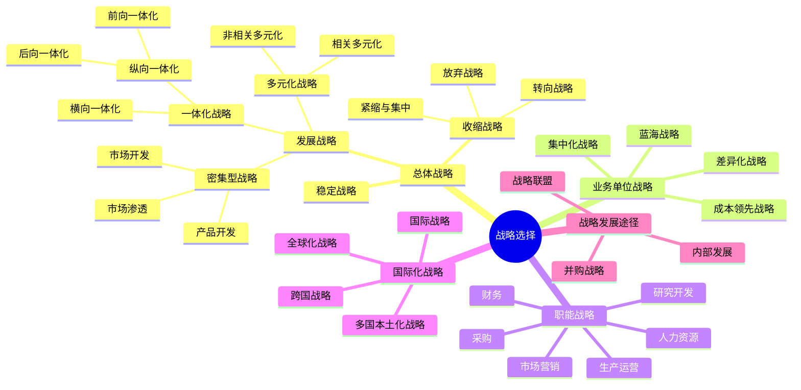

## 📍 章节定位

| 项目 | 信息 |
|------|------|
| **所属科目** | 🎯 公司战略与风险管理 |
| **难度等级** | ⭐⭐⭐⭐⭐ |
| **历年分值** | 10-12分 |
| **建议学时** | 12-15h |
| **核心地位** | 全书最核心章节，主观题必考 |

## 📝 考情分析

本章是本科目考试的绝对核心，分值占比最高（10-12 分）。近五年主观题几乎全部出自本章，常以案例分析形式考查总体战略类型辨识、并购动因与风险、战略联盟类型判断、基本竞争战略选择等。

### 命题规律与重点考查趋势

近五年考查频率较高的考点分布如下：

| 考点 | 出题频次 | 题型偏好 | 难度 |
|------|----------|----------|------|
| 一体化战略辨识（前向/后向/横向） | ★★★★★ | 案例/单选 | 中 |
| 密集型战略（安索夫矩阵） | ★★★★ | 案例/单选 | 中 |
| 多元化战略（相关/非相关） | ★★★★ | 案例 | 中 |
| 收缩战略三种类型 | ★★★ | 单选/多选 | 易 |
| 波特三大竞争战略选择 | ★★★★★ | 案例 | 中 |
| 蓝海战略六路径 | ★★★★ | 案例/多选 | 中 |
| 并购动因与失败原因 | ★★★★★ | 案例/简答 | 中 |
| 战略联盟（股权式 vs 契约式） | ★★★★ | 案例/单选 | 中 |
| 国际化战略四类型 | ★★★ | 单选/多选 | 中 |
| 职能战略识别 | ★★ | 单选 | 易 |

### 命题热点

1. **总体战略类型辨识**：给案例判断属于一体化（前向/后向/横向）、密集型（市场渗透/开发/产品开发）、多元化（相关/非相关）是高频考点。命题陷阱：判断"前向"还是"后向"要以企业原有位置为参照——向消费者方向延伸是前向，向原料方向延伸是后向。
2. **并购与战略联盟**：并购动因、并购失败原因、战略联盟类型（合资/契约）几乎每年必考。命题陷阱：合资企业是"股权式联盟"，技术授权、生产外包是"契约式联盟"。
3. **基本竞争战略**：成本领先、差异化、集中化的适用条件与风险。命题陷阱：集中化战略可分为"集中成本领先"和"集中差异化"两种。
4. **蓝海战略**：重塑原则与六路径框架是近年热点。命题陷阱：六路径中"跨越替代性产业"是指替代品产业，而非直接竞争者。
5. **国际化战略**：四种类型（国际、多国本土、全球、跨国）的辨析。命题陷阱：跨国战略是"全球学习强+本地响应强"的复杂战略。

### 与前后章联系

- **承前**：本章承接第 2 章"战略分析"的结果。战略分析得出的内外部条件，决定本章的战略选择。例如 SWOT 的 SO 战略对应本章的发展战略，WT 战略对应收缩战略。
- **启后**：本章选择的战略需要第 4 章"战略实施"来落地。组织结构、企业文化、资源配置等都是战略实施的支撑。

### 学习方法建议

- **信号词锚定法**：建立"案例描述→战略类型"的信号词映射（如"自建物流"→前向一体化，"收购供应商"→后向一体化，"并购同行"→横向一体化）；
- **案例分类法**：将华为、海尔、小米、阿里巴巴、比亚迪等企业的战略行为按本章框架分类记忆；
- **对比记忆法**：相关 vs 非相关多元化、股权式 vs 契约式联盟、国际 vs 多国本土化 vs 全球化 vs 跨国战略；
- **完整分析训练**：综合题训练中先做战略分析（第 2 章），再做战略选择（第 3 章），最后做战略实施建议（第 4 章），形成完整答题链条。

## 🧠 知识框架

## 📖 核心精讲

### 一、总体战略（公司层战略）

总体战略是企业最高层次的战略，选择企业可以竞争的经营领域，合理配置资源。总体战略分为**发展战略、稳定战略和收缩战略**三大类。

#### （一）发展战略

发展战略强调充分利用外部机会和内部优势，向更高层次发展。包括一体化战略、密集型战略和多元化战略三种基本类型。

##### 1. 一体化战略

一体化战略是对具有优势和增长潜力的产品或业务，沿经营链条纵向或横向延展业务深度和广度。

| 类型 | 含义 | 适用条件 | 风险 | 案例 |
|------|------|----------|------|------|
| **前向一体化** | 获得分销商或零售商的所有权或控制权（向下游消费者方向延伸） | 销售商成本高/可靠性差；产业增长潜力大；具备资金人力；销售环节利润率高 | 不熟悉新业务领域；投资大、资产专用性强，退出成本高 | 茅台自建直营店、京东自建物流、比亚迪自建销售网络 |
| **后向一体化** | 获得供应商的所有权或控制权（向上游原料方向延伸） | 供应商成本高/可靠性差；供应商少而竞争者多；产业增长潜力大；供应环节利润率高 | 同上 | 比亚迪自研电池、特斯拉收购锂矿、海尔自建压缩机厂 |
| **横向一体化** | 向产业价值链相同阶段扩张（并购同行） | 产业竞争激烈；规模经济显著；符合反垄断法；产业增长潜力大 | 反垄断风险；整合难度大 | 美的并购小天鹅、滴滴快的合并、吉利收购沃尔沃 |

> 📌 **案例信号词速记**：自建物流/渠道/直营店→前向一体化；收购原料供应商/矿权/自研零部件→后向一体化；并购同行企业/同业合并→横向一体化。

**判断前向 vs 后向的关键**：以企业原有位置为参照——向消费者方向延伸（销售端）是前向，向原料方向延伸（采购端）是后向。

##### 2. 密集型战略（安索夫矩阵）

密集型战略基于安索夫（Ansoff）"产品—市场战略组合"矩阵：

| | 现有产品 | 新产品 |
|------|------|------|
| **现有市场** | **市场渗透** | **产品开发** |
| **新市场** | **市场开发** | **多元化** |

| 战略 | 含义 | 适用条件 | 案例 |
|------|------|----------|------|
| **市场渗透** | 在现有市场靠单一产品增加市场份额 | 整体市场增长中；企业市场地位强大；风险低、投资少 | 瑞幸咖啡加大补贴争夺现有市场 |
| **市场开发** | 将现有产品打入新市场（新区域/新细分） | 存在未开发市场；有新销售渠道；企业有过剩产能 | 蜜雪冰城开拓海外市场、华莱士下沉三四线城市 |
| **产品开发** | 在原有市场推出新产品 | 产品信誉度高；高新技术产业；高速增长阶段；研发能力强 | 苹果向 iPhone 用户推出 AirPods、Apple Watch |

##### 3. 多元化战略

| 类型 | 含义 | 特点 | 案例 |
|------|------|------|------|
| **相关多元化** | 以现有业务/市场为基础进入相关领域 | 可利用现有能力，风险较低 | 华为从通信设备进入手机、小米从手机进入 IoT |
| **非相关多元化** | 进入与现有产品/市场无关的领域 | 分散风险，但管理难度大 | 格力进入手机和芯片、海尔进入金融业务 |

**相关 vs 非相关的判断**：是否在技术、生产、市场、渠道、管理等方面存在协同。

**多元化的优点**：
- 分散风险（不同业务周期互补）；
- 利用剩余资源（资金、管理能力、品牌）；
- 获取协同效应（业务间资源共享）；
- 增强市场影响力。

**多元化的风险**：
- 来自原有经营产业的风险（原有业务风险未消除）；
- 市场整体风险（系统性风险无法分散）；
- 产业进入风险（对新产业不熟悉）；
- 产业退出风险（资产专用性强、退出壁垒高）；
- 内部经营整合风险（管理复杂度上升、协同效应未达成）。

#### （二）稳定战略

稳定战略指企业在战略期基本保持原有经营范围和目标。

- **优点**：风险较小、避免开发新业务的风险、保持现有市场地位；
- **缺点**：可能丧失发展机遇、对外部环境变化应对迟缓、内部动力不足。

适用情境：产业成熟、企业市场份额稳定、外部环境相对稳定、企业资源有限。

#### （三）收缩战略

收缩战略指企业因经营状况恶化或环境不利，缩小经营范围或减少资源投入。

| 类型 | 含义 | 案例 |
|------|------|------|
| **紧缩与集中战略** | 短期削减开支、集中资源于核心业务 | 阿里 2023 年"1+6+N"分拆后聚焦核心电商业务 |
| **转向战略** | 调整或扭转衰退局面，改变经营方向 | 联想从 PC 转向 PC+移动+数据中心 |
| **放弃战略** | 出售或停止某项业务 | 雅虎出售核心互联网业务给 Verizon |

**收缩战略的退出障碍**：

| 退出障碍 | 含义 |
|----------|------|
| **固定资产的专用性** | 资产难以转用或出售 |
| **退出成本** | 员工安置、合同违约金、清理成本 |
| **内部战略联系** | 该业务与其他业务有协同关系 |
| **感情障碍** | 管理层对业务有情感依恋 |
| **政府与社会约束** | 政府出于就业、税收考虑阻碍退出 |

### 二、业务单位战略（竞争战略）

#### （一）基本竞争战略（波特三大战略）

| 战略类型 | 核心思路 | 适用条件 | 风险 | 案例 |
|----------|----------|----------|------|------|
| **成本领先** | 成为产业中成本最低者 | 规模经济显著；产品标准化；价格敏感；转换成本低；具备资本与供应链优势 | 技术变化使投资贬值；易被模仿；忽视需求变化 | 沃尔玛、拼多多、春秋航空 |
| **差异化** | 提供独特产品/服务 | 产品多样化；顾客需求差异大；创新能力强；品牌形象突出 | 成本过高；差异化被模仿；买方需求趋同 | 苹果、茅台、星巴克 |
| **集中化** | 聚焦特定细分市场 | 细分市场差异显著；竞争者未关注；企业资源有限 | 细分市场消失；竞争者侵入；成本差异缩小 | 劳斯莱斯（高端汽车）、Lululemon（瑜伽服） |

> 💡 **集中化战略**又可分为：
> - **集中成本领先**：在细分市场上以低成本竞争（如神州专车聚焦企业用户、低成本）；
> - **集中差异化**：在细分市场上以差异化竞争（如保时捷聚焦豪华跑车）。
>
> 集中化战略的风险包括：①细分市场需求消失；②竞争者找到更细分市场；③成本差异缩小使集中成本优势丧失；④大企业侵入细分市场。

**三大战略的实现路径对比**：

| 战略 | 资源投入重点 | 组织要求 | 控制重点 |
|------|-------------|----------|----------|
| **成本领先** | 规模化生产、流程优化、供应链管理 | 严格成本控制、效率导向 | 成本指标、生产效率 |
| **差异化** | 研发、品牌、营销、服务 | 创新能力、灵活性、品质导向 | 产品质量、品牌价值 |
| **集中化** | 细分市场深度开发 | 专业化、敏捷响应 | 细分市场份额、客户满意度 |

#### （二）蓝海战略

蓝海战略（Kim & Mauborgne, 2005）要求打破价值与成本的权衡，开创无人争抢的市场空间。

**红海 vs 蓝海对比**：

| 维度 | 红海战略 | 蓝海战略 |
|------|----------|----------|
| 竞争空间 | 已有市场空间 | 未开发市场空间 |
| 竞争策略 | 击败竞争对手 | 无人争抢，重塑竞争规则 |
| 需求 | 满足现有需求 | 创造新需求 |
| 价值-成本关系 | 价值高则成本高，或成本低则价值低 | 同时追求高价值和低成本 |

**蓝海战略的六项原则**：

| 原则类型 | 具体原则 |
|----------|----------|
| **战略制定原则** | ①重建市场边界；②关注全局而非数字；③超越现有需求；④遵循合理的战略顺序 |
| **战略执行原则** | ⑤克服关键组织障碍；⑥将战略执行建成战略的一部分 |

**重塑市场边界的六条路径**：

| 路径 | 含义 | 案例 |
|------|------|------|
| ①跨越替代性产业 | 从替代品中寻找灵感 | 太阳马戏团结合马戏与戏剧，开创新形态 |
| ②跨越战略集团 | 从不同定位的战略集团中寻找机会 | 丰田凌志同时挑战奔驰和高档日本车 |
| ③跨越买方链条 | 重新定义买方角色 | 媒体从面向读者转向面向广告商 |
| ④跨越互补性产品或服务 | 考虑产品使用前、中、后的整体体验 | 喜剧公司提供停车位、餐饮等配套 |
| ⑤跨越针对买方的功能与情感导向 | 将功能型转为情感型，或反之 | 西斯韦尔将钟表从情感型转为功能型 |
| ⑥跨越时间 | 预测未来趋势，提前布局 | 苹果预判智能手机趋势，推出 iPhone |

**案例锚定——中国企业的蓝海战略**：
- **小米生态链**：跨越"手机"与"IoT 产品"的边界，开创"智能生活一站式"市场；
- **喜茶**：跨越"传统茶饮"与"咖啡文化"的边界，开创"新式茶饮"市场；
- **小红书**：跨越"电商"与"社交"的边界，开创"内容种草"市场。

### 三、职能战略

职能战略涉及企业各职能部门如何配置资源为各级战略服务。

| 职能战略 | 核心内容 | 关键决策 |
|----------|----------|----------|
| **市场营销战略** | 目标市场选择、市场定位 | STP（细分、目标、定位）、4P（产品、价格、渠道、促销） |
| **生产运营战略** | 产能规划、选址、工艺设计、供应链管理 | JIT（准时制）、精益生产、柔性制造 |
| **研发战略** | 研发类型、研发模式 | 产品研究 vs 流程研究；自主研发 vs 委托研发 vs 联合研发 |
| **采购战略** | 供应商管理、采购模式、库存管理 | 集中采购 vs 分散采购；JIT 采购 |
| **人力资源战略** | 招聘、培训、绩效、薪酬、员工关系 | 人才梯队建设、绩效考核体系、股权激励 |
| **财务战略** | 融资、投资、股利分配 | 资本结构优化、并购融资、股利政策 |

**财务战略的矩阵分析（基于"价值创造-现金剩余"）**：

| 象限 | 价值创造能力 | 现金状况 | 财务战略 |
|------|-------------|----------|----------|
| ① | 高 | 剩余 | 投资增长、回购股份 |
| ② | 高 | 短缺 | 增发股份、降低股利 |
| ③ | 低 | 剩余 | 重组业务、分配现金 |
| ④ | 低 | 短缺 | 剥离资产、清算退出 |

### 四、国际化战略

| 战略类型 | 全球学习 | 当地响应 | 特点 | 案例 |
|----------|----------|----------|------|------|
| **国际战略** | 弱 | 弱 | 将本国产品销往海外，总部控制 | 早期苹果将美国产品销往全球 |
| **多国本土化战略** | 弱 | 强 | 满足各国本地需求，成本较高 | 联合利华针对不同国家推出不同配方 |
| **全球化战略** | 强 | 弱 | 标准化产品全球销售，规模经济 | 英特尔芯片全球标准化 |
| **跨国战略** | 强 | 强 | 兼顾全球效率与本地响应，最复杂 | 宝洁、ABB、华为全球化运营 |

> 📌 **记忆要点**：用"全球学习×当地响应"两维度判断。
> - 国际=都弱（最简单）；
> - 多国本土化=响应强学习弱；
> - 全球化=学习强响应弱；
> - 跨国=都强（最复杂、最优）。

### 五、战略发展途径

#### （一）内部发展（内生发展）

企业利用自身资源创建新业务。

- **优点**：风险可控、共享专长、易整合、积累内部能力；
- **缺点**：速度慢、需突破进入壁垒、难以获得规模经济、可能错过市场机会。

适用情境：产业进入壁垒低、企业具备相关能力、市场发展缓慢。

#### （二）并购战略

**并购动因**：
1. 避开进入壁垒，迅速进入市场（缩短进入时间）；
2. 获取协同效应（经营协同、财务协同、管理协同）；
3. 获取规模经济（扩大规模降低单位成本）；
4. 削减竞争压力（并购竞争对手）；
5. 获取被并购方的资源/能力（技术、品牌、人才、渠道）；
6. 分散经营风险（多元化并购）。

**协同效应的三种类型**：

| 协同类型 | 含义 | 案例 |
|----------|------|------|
| **经营协同** | 业务整合带来效率提升 | 共享销售渠道、共享研发成果、规模经济 |
| **财务协同** | 财务整合带来效益 | 合理避税、提高负债能力、降低资本成本 |
| **管理协同** | 管理能力转移带来效益 | 优秀管理团队输出到被并购企业 |

**并购失败的原因**：
- **决策不当**：并购前未充分评估（如对目标企业价值高估、对协同效应预期过高）；
- **支付过高的并购费用**：溢价过高，难以收回投资；
- **并购后不能很好地整合**：业务、组织、文化整合困难；
- **跨文化整合困难**：跨国并购文化冲突（如上汽并购双龙失败）；
- **并购过程遭遇法律/反垄断审查**：监管否决（如阿里收购美团被反垄断阻止）。

**并购的类型**：

| 分类标准 | 类型 |
|----------|------|
| 按产业 | 横向并购（同业）、纵向并购（上下游）、混合并购（无关） |
| 按意向 | 善意并购（协商一致）、敌意并购（强行收购） |
| 按支付方式 | 现金并购、股票并购、综合并购（现金+股票+债券） |
| 按是否通过证券交易所 | 协议收购、要约收购 |

**案例锚定——典型并购案例**：

| 并购方 | 被并购方 | 年份 | 类型 | 结果 |
|--------|----------|------|------|------|
| 吉利 | 沃尔沃 | 2010 | 横向并购（跨国） | 成功，吉利品牌升级 |
| 美的 | 库卡（KUKA） | 2016 | 横向并购（跨国） | 成功，进入机器人领域 |
| 海尔 | 通用电气家电 | 2016 | 横向并购（跨国） | 成功，全球化布局 |
| 上汽 | 双龙 | 2004 | 横向并购（跨国） | 失败，文化冲突 |
| 阿里 | 饿了么 | 2018 | 横向并购 | 整合中 |

#### （三）战略联盟

战略联盟是两个或以上企业为实现资源共享、风险共担而结成的合作伙伴关系。

| 类型 | 特点 | 优势 | 劣势 | 案例 |
|------|------|------|------|------|
| **合资企业（股权式）** | 共同出资设立新企业 | 控制力强、关系紧密、利益深度绑定 | 投资大、退出难、灵活性低 | 一汽-大众、上汽-通用 |
| **契约式联盟** | 通过协议合作，不设新企业 | 灵活、成本低、易调整 | 控制力弱、稳定性差 | 技术授权、生产外包、联合营销、联合研发 |

**战略联盟的动因**：
1. 促进技术创新（联合研发分担成本）；
2. 避免经营风险（共享风险）；
3. 避免或限制竞争（联盟阻止恶性竞争）；
4. 实现资源互补（各自优势互补）；
5. 开拓新市场（利用合作伙伴渠道）；
6. 降低协调成本（相比并购，联盟成本低）。

**股权式联盟 vs 契约式联盟对比**：

| 对比维度 | 股权式联盟 | 契约式联盟 |
|----------|-----------|-----------|
| 是否设新企业 | 是 | 否 |
| 投资规模 | 大 | 小 |
| 控制力 | 强 | 弱 |
| 灵活性 | 低 | 高 |
| 退出难度 | 难 | 易 |
| 关系稳定性 | 高 | 低 |
| 利益分配 | 按股权比例 | 按协议约定 |

> 📌 **核心区分**：合资=设新企业（股权）；契约式=技术授权、生产外包、联合营销、联合研发等（无新企业）。

**案例锚定——战略联盟典型案例**：
- **华为与徕卡**：联合研发手机摄像头（契约式联盟，联合研发）；
- **小米与飞利浦**：小米生态链接入飞利浦照明产品（契约式联盟，渠道合作）；
- **一汽-大众**：合资企业（股权式联盟）；
- **雷军与 李斌**：小米投资蔚来，但未控制（股权投资，不构成控制性联盟）。

### 六、战略评估与选择

战略评估的三个标准（鲁梅尔特）：

| 标准 | 含义 |
|------|------|
| **适宜性** | 战略是否符合环境分析得出的 SWOT 结论，是否抓住了机会、规避了威胁、发挥了优势、克服了劣势 |
| **可行性** | 企业是否有足够的资源、能力、资金实施该战略 |
| **可接受性** | 战略是否符合利益相关者（股东、员工、客户、政府）的期望，风险是否可接受 |

## 💡 典型例题

**【例题 1】（单选题，一体化战略辨识）**

某食品企业原以生产加工为主，后收购了一家连锁超市和一家包装材料厂。该企业实施的总体战略是（ ）。
A. 多元化战略
B. 横向一体化战略
C. 前向一体化与后向一体化战略
D. 密集型战略

**答案**：C

**解析**：收购连锁超市（下游销售渠道）属于前向一体化；收购包装材料厂（上游原料供应商）属于后向一体化。两者合起来属于纵向一体化战略。横向一体化是并购同行；多元化是进入无关领域；密集型是基于现有产品市场的扩张。

**【例题 2】（单选题，安索夫矩阵）**

某国内知名运动品牌为拓展海外市场，将现有产品出口至东南亚国家。该战略属于安索夫矩阵中的（ ）。
A. 市场渗透
B. 市场开发
C. 产品开发
D. 多元化

**答案**：B

**解析**：市场开发是指将现有产品打入新市场（新区域/新细分市场）。本题是"现有产品+新市场（东南亚）"，属于市场开发。市场渗透是现有产品+现有市场；产品开发是新产品+现有市场；多元化是新产品+新市场。

**【例题 3】（单选题，竞争战略选择）**

某企业专注于高端奢侈品市场，通过独特的设计、稀缺的材料和精湛的工艺建立品牌壁垒，产品价格远高于行业平均水平。该企业采用的竞争战略是（ ）。
A. 成本领先战略
B. 差异化战略
C. 集中差异化战略
D. 集中成本领先战略

**答案**：C

**解析**：聚焦特定细分市场（高端奢侈品）是"集中化"特征；通过独特设计、稀缺材料、精湛工艺建立差异化是"差异化"特征。两者结合为集中差异化战略。如果是在全产业范围差异化，则为差异化战略。

**【例题 4】（多选题，蓝海战略六路径）**

下列各项中，属于蓝海战略"重塑市场边界六路径"的有（ ）。
A. 跨越替代性产业
B. 跨越战略集团
C. 跨越买方链条
D. 跨越互补性产品或服务
E. 跨越时间

**答案**：ABCDE

**解析**：六路径包括：①跨越替代性产业；②跨越战略集团；③跨越买方链条；④跨越互补性产品或服务；⑤跨越针对买方的功能与情感导向；⑥跨越时间。ABCDE 全部正确。

**【例题 5】（多选题，并购失败原因）**

下列各项中，属于企业并购失败主要原因的有（ ）。
A. 决策不当，并购前未充分评估
B. 支付过高的并购费用
C. 并购后不能很好地整合
D. 跨文化整合困难
E. 并购过程遭遇法律或反垄断审查

**答案**：ABCDE

**解析**：并购失败原因包括：①决策不当；②支付过高的并购费用；③并购后不能很好地整合；④跨文化整合困难；⑤并购过程遭遇法律/反垄断审查。ABCDE 全部正确。

**【例题 6】（综合题，总体战略辨识）**

**【2024年综合题节选】** 某家电企业原以代工生产为主，后收购上游压缩机厂和下游连锁卖场，并自建电商平台。请判断该企业实施了何种总体战略。

**答案**：
该企业实施了**纵向一体化战略**（包含前向和后向）：
- 收购上游压缩机厂→**后向一体化**（控制供应商，确保关键原材料供应）
- 收购下游连锁卖场+自建电商平台→**前向一体化**（控制销售渠道，增强对消费者的敏感性）

适用条件分析：家电产业增长潜力大；原有供应商/销售商成本高；企业具备资金和人力资源；供应和销售环节利润率较高。

**解析**：判断一体化战略类型的关键是识别"延伸方向"——向消费者方向是前向，向原料方向是后向。本题"收购压缩机厂"（压缩机是家电的零部件，属上游）是后向；"收购连锁卖场+自建电商"（销售渠道，属下游）是前向。

**【例题 7】（综合题，战略联盟辨识）**

某新能源汽车企业 A 与互联网企业 B 战略合作：双方共同出资 5 亿元设立智能驾驶研发公司，A 占股 51%，B 占股 49%。同时，A 还与芯片企业 C 签订长期供货协议，约定 C 优先向 A 供应最新一代自动驾驶芯片。

要求：判断 A 企业与 B、C 企业的合作分别属于哪种战略联盟类型，并说明理由。

**答案**：

| 合作对象 | 联盟类型 | 理由 |
|----------|----------|------|
| B 企业 | 股权式联盟（合资企业） | 双方共同出资设立新企业（智能驾驶研发公司），按股权比例控制 |
| C 企业 | 契约式联盟 | 通过长期供货协议合作，未设立新企业，仅约定优先供应条款 |

**解析**：股权式联盟的特征是"共同出资设立新企业"，控制力强但灵活性低；契约式联盟的特征是"通过协议合作，不设新企业"，灵活但稳定性差。判断关键是有无设立新企业、是否涉及股权。

**【例题 8】（综合题，国际化战略辨识）**

某中国手机企业在国际化过程中：(1) 早期将国内生产的标准化手机销往海外，由国内总部统一控制研发、生产和品牌；(2) 后期为适应印度市场，在印度本地建厂、本地化产品设计（增加双卡双待、强化相机美颜）；(3) 同时在全球范围建立研发中心，将中国、印度、欧洲的研发成果相互共享。

要求：分别判断三个阶段的国际化战略类型。

**答案**：

| 阶段 | 战略类型 | 理由 |
|------|----------|------|
| 第一阶段 | 国际战略 | 全球学习弱（仅总部研发）、当地响应弱（标准化产品全球销售） |
| 第二阶段 | 多国本土化战略 | 当地响应强（本地化建厂和产品设计）、全球学习弱（未提及研发共享） |
| 第三阶段 | 跨国战略 | 全球学习强（研发成果全球共享）、当地响应强（仍保持本地化产品） |

**解析**：国际化战略的判断用"全球学习×当地响应"两维度。国际=都弱；多国本土化=响应强学习弱；全球化=学习强响应弱；跨国=都强。第三阶段同时具备"研发全球共享"和"本地化产品"，是跨国战略。

## 🎯 记忆口诀

- **总体战略三分类**："发展-稳定-收缩"，发展又有"一体-密集-多元"。
- **一体化三类型**："前（前向）后（后向）横（横向）"——前向是销售端（向消费者），后向是采购端（向原料），横向是同业并购。判断关键：以企业原位置为参照。
- **案例信号词**："自建物流/直营店"→前向；"收购供应商/自研零件"→后向；"并购同行"→横向。
- **安索夫矩阵**："现有新产品，现有新市场"两两组合→渗透（现现）、开发（市场开发=现产新市）、开发（产品开发=新产现市）、多元（新新）。
- **多元化两类**："相关协同低风险，非相关分散高风险"。
- **多元化五风险**："原有市场整体入退整合"——原有产业风险、市场整体风险、产业进入风险、产业退出风险、内部整合风险。
- **波特三战略**："成本领先抢低价，差异化走独特，集中化切蛋糕"。
- **集中化两类**："集中成本（细分低成本）、集中差异（细分独特）"。
- **蓝海六路径**："替集链补功时"（替代、集团、链条、互补、功能、时间）。
- **蓝海六原则**："重建边界看全局，超越需求顺顺序；克服障碍建执行"——制定 4 + 执行 2。
- **国际化四战略**："国多全跨"——国际（都弱）、多国（响强学弱）、全球（学强响弱）、跨国（都强）。
- **并购失败五原因**："决策不当付太高，整合困难跨文化，法律审查也来扰"。
- **协同效应三类**："经财管"——经营协同、财务协同、管理协同。
- **战略联盟两类**："股权合资设新企，契约协议不设企"——判断关键是有无设新企业。
- **战略评估三标准**："适宜（适合 SWOT）、可行（有能力）、可接受（利益相关者接受）"。
- **收缩战略三类型**："紧（紧缩）转（转向）放（放弃）"——从短期削减到业务退出。

## ✅ 同步练习

**1. [单选]** 某食品企业收购了多家连锁超市，该战略属于（ ）。
A. 前向一体化  B. 后向一体化  C. 横向一体化  D. 多元化

**2. [单选]** 以下属于蓝海战略制定原则的是（ ）。
A. 克服关键组织障碍  B. 重建市场边界  C. 将战略执行建成战略的一部分  D. 超越现有需求

**3. [多选]** 跨国战略的特点包括（ ）。
A. 全球学习能力强  B. 本地响应能力强  C. 标准化产品全球销售  D. 兼顾效率与响应

**4. [简答]** 简述并购战略失败的主要原因。

**5. [案例分析]** 甲公司是一家国内知名运动品牌企业，主要通过经销商渠道销售。近年公司收购了一家海外运动品牌以拓展国际市场，同时自建线上旗舰店并开发智能运动穿戴设备。请分析甲公司采取了哪些总体战略和战略发展途径。

> 参考答案：1.A  2.BD  3.ABD  4.见核心精讲"并购失败的原因"  5.前向一体化（自建线上渠道）、相关多元化（智能穿戴设备）、国际化战略；并购战略（收购海外品牌）、内部发展（开发智能设备）。
