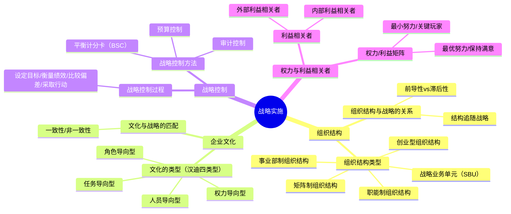

## 📍 章节定位

| 项目 | 信息 |
|------|------|
| **所属科目** | 🎯 公司战略与风险管理 |
| **难度等级** | ⭐⭐⭐ |
| **历年分值** | 4-6分 |
| **建议学时** | 6-8h |
| **核心地位** | 战略管理篇落地环节，案例分析常考 |

## 📝 考情分析

本章关注战略如何有效落地实施，涉及组织结构、企业文化、战略控制等。近年命题趋势：

- **组织结构类型**：职能制、事业部制、矩阵制、战略业务单元（SBU）的辨析是高频客观题
- **组织结构与战略的关系**："结构追随战略"（钱德勒）的核心思想
- **企业文化类型**：权力导向、角色导向、任务导向、人员导向（汉迪四类型）
- **战略控制方法**：平衡计分卡（BSC）四维度
- **利益相关者分析**：权力/利益矩阵

本章常以案例分析形式考查：判断企业组织结构类型、分析文化与战略匹配度、设计战略控制体系。

## 🧠 知识框架

## 📖 核心精讲

### 一、组织结构

#### （一）组织结构的主要类型

| 类型 | 特点 | 优点 | 缺点 | 适用 |
|------|------|------|------|------|
| **创业型组织结构** | 创始人直接管理，无明确职能分工 | 灵活、决策快 | 难以扩展 | 小型初创企业 |
| **职能制组织结构** | 按职能（营销、生产、财务等）划分 | 专业化、规模经济 | 部门壁垒、响应慢 | 单一产品/市场企业 |
| **事业部制组织结构** | 按产品/地区/客户划分事业部 | 自主性强、响应快 | 资源重复、协调难 | 多元化/大型企业 |
| **矩阵制组织结构** | 职能+项目双线管理 | 灵活、资源共享 | 双重领导、冲突多 | 项目驱动型企业 |
| **战略业务单元（SBU）** | 类似事业部但更独立 | 战略聚焦、培养管理人才 | 管理成本高 | 大型多元化集团 |

**事业部制三种细分**：
- **产品事业部**：按产品线划分（如家电事业部、手机事业部）
- **区域事业部**：按地理区域划分（如华北区、华南区）
- **客户事业部**：按客户类型划分（如企业客户、个人客户）

#### （二）组织结构与战略的关系

钱德勒提出"**结构追随战略**"：组织结构的调整应服务于战略实施。

| 维度 | 含义 |
|------|------|
| **前导性** | 组织结构的变化先于战略实施，体现战略意图 |
| **滞后性** | 组织结构的变化慢于战略调整，因为结构调整涉及人事变动 |

> 📌 **关键原则**：战略决定结构，结构支撑战略。不同战略类型需要不同的组织结构匹配：单一战略→职能制；多元化战略→事业部制。

### 二、企业文化

#### （一）企业文化的类型（查尔斯·汉迪四类型）

| 类型 | 特点 | 适用 |
|------|------|------|
| **权力导向型** | 权力集中于高层，少数人掌权 | 小型/家族企业 |
| **角色导向型** | 强调规则和程序，各司其职 | 大型传统企业、国企 |
| **任务导向型** | 强调任务完成和团队协作 | 项目型/高科技企业 |
| **人员导向型** | 以员工需求为中心，企业服务于成员 | 咨询/创意类企业 |

#### （二）文化与战略的匹配

| 情形 | 处理方式 |
|------|----------|
| **文化与战略一致** | 战略实施顺利，文化成为竞争优势 |
| **文化与战略不一致** | 需调整文化或修改战略，否则实施受阻 |

> 📌 文化具有很强的稳定性和路径依赖性，改变企业文化比改变组织结构更困难、更缓慢。

### 三、战略控制

#### （一）战略控制过程

战略控制是一个动态循环过程：

1. **设定目标**：将战略目标分解为可衡量的绩效指标
2. **衡量绩效**：收集实际执行数据
3. **比较偏差**：分析实际与计划的差异
4. **采取行动**：纠正偏差或调整战略

#### （二）战略控制方法

##### 1. 预算控制

通过预算编制、执行和考核实施控制。包括增量预算和零基预算。

| 预算类型 | 特点 | 优缺点 |
|----------|------|--------|
| **增量预算** | 在上期基础上增减 | 简单但可能固化低效 |
| **零基预算** | 从零开始重新评估 | 科学但工作量大 |

##### 2. 平衡计分卡（BSC）

平衡计分卡从四个维度综合衡量企业绩效：

| 维度 | 核心问题 | 典型指标 |
|------|----------|----------|
| **财务维度** | 股东如何看待我们？ | 投资回报率、利润增长率 |
| **顾客维度** | 顾客如何看待我们？ | 顾客满意度、市场份额 |
| **内部流程维度** | 我们擅长什么？ | 生产周期、质量合格率 |
| **创新与学习维度** | 我们能否持续改进？ | 员工培训、新产品占比 |

> 📌 **平衡计分卡要点**：四个维度相互关联，财务是最终结果，顾客和内部流程是驱动因素，创新学习是长期基础。

##### 3. 审计控制

通过内部审计和外部审计实施控制。

### 四、权力与利益相关者

#### （一）利益相关者

| 类型 | 利益相关者 |
|------|------------|
| **内部利益相关者** | 股东、管理层、员工 |
| **外部利益相关者** | 供应商、客户、政府、社区、债权人 |

#### （二）权力/利益矩阵

根据利益相关者的权力大小和利益高低分为四类：

| | 利益低 | 利益高 |
|------|------|------|
| **权力高** | **最小努力**：保持知情 | **关键玩家**：重点管理，密切合作 |
| **权力低** | **最小努力**：定期监测 | **保持满意**：保持沟通，提供信息 |

> 📌 **核心策略**：对"关键玩家"（高权力高利益）投入最多精力管理；对"保持满意"（低权力高利益）保持沟通；对两类"最小努力"群体适度关注。

## 💡 典型例题

**【多选】** 下列属于平衡计分卡维度的有（ ）。
A. 财务维度  B. 顾客维度  C. 内部流程维度  D. 创新与学习维度

**【参考答案】** ABCD
解析：平衡计分卡包括财务、顾客、内部流程、创新与学习四个维度，全面衡量企业绩效。

## 🎯 记忆口诀

- **组织结构五类型**："创业职能事业矩阵SBU"——从小到大、从简单到复杂
- **结构追随战略**：钱德勒名言，"战略先行，结构跟上"
- **文化四类型**："权（权力）角（角色）任（任务）人（人员）"——汉迪四分
- **平衡计分卡四维度**："财（财务）客（顾客）内（内部流程）学（创新学习）"
- **利益相关者矩阵**："关（关键玩家）保（保持满意）最（最小努力×2）"——高权力高利益最关键

## ✅ 同步练习

**1. [单选]** 某大型多元化企业按产品线设立独立事业部，各事业部自负盈亏。该组织结构属于（ ）。
A. 职能制  B. 事业部制  C. 矩阵制  D. 创业型

**2. [单选]** "结构追随战略"是哪位学者提出的？（ ）
A. 波特  B. 明茨伯格  C. 钱德勒  D. 安索夫

**3. [多选]** 下列属于汉迪企业文化类型的有（ ）。
A. 权力导向型  B. 角色导向型  C. 任务导向型  D. 人员导向型

**4. [简答]** 简述平衡计分卡的四个维度及其相互关系。

**5. [案例分析]** 某科技公司在发展初期采用职能制结构，随着业务扩展到多个产品线，原有的职能部门难以协调各产品线的研发和销售。公司决定进行组织变革。请分析该公司应采用何种组织结构，并说明理由。

> 参考答案：1.B  2.C  3.ABCD  4.见核心精讲"平衡计分卡"  5.建议采用事业部制组织结构。理由：公司业务已扩展到多个产品线，属于多元化发展；事业部制按产品线划分，各事业部自主经营、自负盈亏，能够快速响应市场变化；克服了职能制下跨部门协调困难的问题。遵循"结构追随战略"原则，多元化战略需要事业部制匹配。
