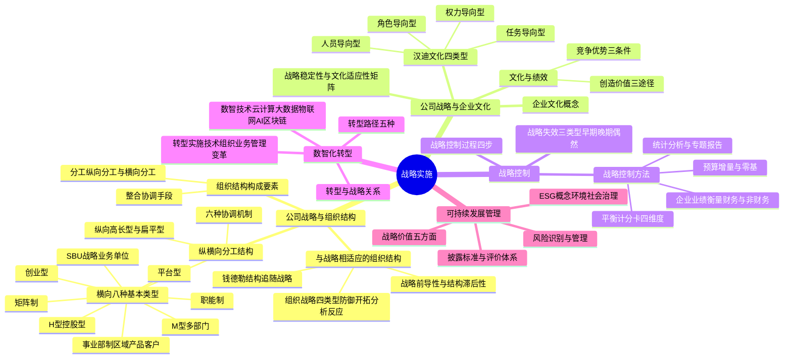

## 1. 章节定位

| 项目 | 信息 |
|------|------|
| 所属科目 | 公司战略与风险管理 |
| 难度等级 | 3 |
| 历年分值 | 6-8 分 |
| 建议学时 | 8-10 小时 |
| 知识关联章节 | 第3章战略选择（战略实施是战略选择的落地）、第5章公司治理（治理结构是实施保障） |

## 2. 考情分析

本章关注战略如何有效落地实施，涵盖组织结构、企业文化、战略控制、数智化转型与可持续发展管理五大板块。历年分值约 6-8 分，既有客观题也有案例分析题，命题密度适中。

**命题规律**：本章内容覆盖面广，客观题集中在概念辨识（组织结构类型、文化类型、平衡计分卡四维度），主观题常以案例形式考查组织结构辨识、文化与战略匹配、战略控制方法选择等。

**高频考点分布**：

1. **组织结构类型辨识**：8 种横向分工结构类型（创业型、职能制、事业部制、M 型、SBU、矩阵制、H 型、平台型）的辨识与适用条件是高频考点，常以案例描述判断结构类型。
2. **结构与战略的关系**：钱德勒"结构追随战略"理论，战略前导性与组织结构滞后性的辨析。
3. **组织的战略类型**：防御型、开拓型、分析型、反应型四类组织的特征与适应场景。
4. **汉迪企业文化四类型**：权力导向型、角色导向型、任务导向型、人员导向型的辨识。
5. **战略稳定性与文化适应性矩阵**：四象限的处理策略（以企业使命为基础、加强协同作用、根据文化进行管理、重新制定战略）。
6. **平衡计分卡**：四维度（财务、顾客、内部流程、创新与学习）及五个平衡关系。
7. **战略失效三类型**：早期失效、晚期失效、偶然失效的区分。
8. **预算控制**：增量预算与零基预算的优缺点对比。
9. **数智化转型**：数智技术（云计算、大数据、物联网、AI、区块链）的基本概念与转型路径。

**备考建议**：

- 组织结构类型用"规模递进"线索串联：创业型（最小）→ 职能制 → 事业部制 → M 型 → SBU → 矩阵制/H 型/平台型（最复杂）；
- 平衡计分卡四维度用"因果链"记忆：创新与学习（基础）→ 内部流程（保障）→ 顾客（结果）→ 财务（终极目标）；
- 案例题训练时，先判断组织结构类型，再分析文化与战略匹配度，最后给出战略控制建议。

## 3. 知识框架

## 4. 核心精讲

### 一、公司战略与组织结构

#### （一）组织结构的构成要素

组织结构是组织为实现共同目标而进行的各种分工和协调的系统。其基本构成要素是**分工与整合**。

| 要素 | 含义 | 分类 |
|------|------|------|
| **分工** | 企业为创造价值而对其人员和资源进行的分配 | 纵向分工（决策权分配）、横向分工（人员与部门配置） |
| **整合** | 企业为实现预期目标而用来协调人员与职能的手段 | 跨职能团队、委员会、协调机制等 |

#### （二）纵向分工结构

纵向分工是指企业高层管理人员选择适当的管理层次和控制幅度。基本有两种形式：

| 类型 | 特征 | 优点 | 缺点 |
|------|------|------|------|
| **高长型组织结构** | 管理层次多，控制幅度窄 | 有利于内部控制 | 对市场变化反应慢；信息传递失真大；管理费用高 |
| **扁平型组织结构** | 管理层次少，控制幅度宽 | 及时反映市场变化；信息传递准确；管理费用低 | 容易造成管理失控 |

**纵向分工结构的管理问题**：

1. **集权与分权**：

| 类型 | 决策权分布 | 结构特征 | 优点 | 缺点 |
|------|-----------|----------|------|------|
| **集权型** | 高层掌握决策权 | 层级式、高长型 | 易协调；易沟通规范；危急时快速决策；规模经济 | 忽视个别部门；决策慢；基层发展有限 |
| **分权型** | 决策权下放 | 扁平型 | 减少沟通障碍；提高反应能力；激励员工 | 协调难度增大 |

2. **中层管理人员人数**：高长型需要更多中层管理人员，增加行政管理费用。
3. **信息传递**：层次越多，信息越易失真。
4. **协调与激励**：扁平型更能调动管理人员积极性。

#### （三）横向分工结构的八种基本类型

| 类型 | 适用场景 | 优点 | 缺点 | 中国企业案例 |
|------|----------|------|------|-------------|
| **创业型** | 小型企业 | 简单、灵活 | 缺乏专业分工；依赖个人能力 | 创业初期的小微企业 |
| **职能制** | 单一业务企业 | 规模经济；培养职能专家；效率高；易于监控 | 协调难；难以确定产品盈亏；各自为政；反应慢 | 多数中型制造企业 |
| **事业部制** | 多产品线/多区域企业 | 区域/产品决策快；削减费用；灵活性强；易于出售不良事业部 | 管理成本重复；资源争夺；协调难 | 海尔按产品线设事业部 |
| **M 型（多部门）** | 大型多元化企业 | 持续成长；总部减负；调动积极性；财务评估 | 成本分摊难；资源竞争；转移价格冲突 | 通用电气传统架构 |
| **SBU（战略业务单位）** | 大型多元化企业 | 降低总部控制跨度；减轻信息过度；协调类似产品线；易于评估 | 增加垂直管理层；关系疏远；资源竞争 | 通用电气 70 年代改革 |
| **矩阵制** | 复杂项目管理 | 项目经理动力强；优先考虑关键项目；决策优；部门协作；双重权力约束 | 权力划分不清；管理者冲突；协调成本高 | 华为项目制与职能制并行 |
| **H 型（控股型）** | 多元化集团 | 业务单元自主性高；分散风险；母公司管理费低；节税收益 | 控制力弱；协同效应差 | 复星集团、中信集团 |
| **平台型** | 互联网/高科技/新零售 | 响应快；创新强；资源利用率高；生态系统构建；降低管理成本 | 管理难度大；领导力要求高；文化冲突风险 | 华为数据中台、阿里商业生态 |

**事业部制的三种细分**：

| 细分类型 | 划分依据 | 案例 |
|----------|----------|------|
| **区域事业部制** | 按地理位置划分 | 北美区、亚太区、欧洲区 |
| **产品/品牌事业部制** | 按产品或品牌划分 | 洗衣机事业部、空调事业部 |
| **客户/市场细分事业部制** | 按客户类型划分 | 公司银行部、私人银行部 |

**平台型组织结构的四种类型**：

| 类型 | 特征 | 案例 |
|------|------|------|
| **资源赋能型** | 内部平台化，整合中后台能力 | 华为数据中台、京东技术中台 |
| **生态系统型** | 外部平台化，连接生产者与消费者 | 淘宝、滴滴、苹果 iOS、鸿蒙系统 |
| **投资孵化型** | 类似风投，提供资源但不参与运营 | 海尔海创汇 |
| **混合型** | 内外结合的综合体 | 亚马逊 AWS、腾讯微信 |

#### （四）横向分工结构的六种协调机制

| 协调机制 | 含义 | 适用场景 |
|----------|------|----------|
| **相互适应、自行调整** | 非正式沟通达成协调 | 最简单或极复杂的组织 |
| **直接指挥、直接控制** | 一人决策发布指令 | 小型组织、紧急情况 |
| **工作过程标准化** | 预先制定工作标准 | 生产线、流水作业 |
| **工作成果标准化** | 规定最终目标，不限途径 | 出版社与印刷厂 |
| **技艺（知识）标准化** | 对成员技能标准化 | 外科大夫与麻醉师 |
| **共同价值观** | 全员共有价值观和使命 | 成熟企业的文化管理 |

> **记忆要点**：组织从简单到复杂，协调机制依次为：相互适应→直接指挥→过程标准化→成果标准化→技艺标准化→共同价值观。但企业往往混合使用多种机制。

#### （五）与公司战略相适应的组织结构

**1. 钱德勒"结构追随战略"理论**

艾尔弗雷德·钱德勒在《战略和结构》中首次提出**组织结构服从战略**的理论。通过对杜邦、通用汽车、标准石油、西尔斯等公司的研究发现：企业选择新战略后，组织结构往往滞后于战略变化，直到管理问题显现才被迫调整结构。

**2. 战略前导性与组织结构滞后性**

| 特性 | 含义 | 原因 |
|------|------|------|
| **战略前导性** | 战略变化快于组织结构变化 | 企业一旦意识到机会，首先在战略上反应 |
| **组织结构滞后性** | 结构变化慢于战略变化 | 新旧结构交替有惯性；管理人员抵制变革 |

**3. 企业发展阶段与组织结构的对应关系**

| 发展阶段 | 战略类型 | 对应组织结构 |
|----------|----------|-------------|
| 创立初期 | 市场渗透战略 | 创业型组织结构 |
| 发展期 | 市场开发战略 | 职能制组织结构 |
| 进一步发展 | 纵向一体化战略 | 事业部制组织结构 |
| 成熟期 | 多元化战略 | SBU、矩阵制或 H 型结构 |

**4. 组织的战略类型（迈尔斯和斯诺）**

| 类型 | 特征 | 技术与行政管理 | 适用环境 | 风险 |
|------|------|---------------|----------|------|
| **防御型组织** | 追求稳定环境，生产有限产品，占领小部分市场 | 高度成本效率的核心技术；机械式结构 | 稳定产业 | 难以应对市场环境重大改变 |
| **开拓型组织** | 追求动态环境，探索新产品和市场机会 | 灵活多样的技术；有机式结构 | 动荡环境 | 利润较低；资源分散；缺乏效率 |
| **分析型组织** | 结合防御型和开拓型，既有稳定产品又寻求新机会 | 双重技术核心（稳定+灵活）；矩阵结构 | 中等动荡环境 | 管理复杂；应变能力受限 |
| **反应型组织** | 动荡不定的调整模式，缺乏随机应变机制 | 无一致模式 | 仅在上述三种都无法运用时 | 永远处于不稳定状态，是下策 |

> **记忆要点**：防御型=守（稳定+效率）；开拓型=攻（动态+灵活）；分析型=攻守兼备（双重核心）；反应型=无策略（下策）。一个企业成为反应型组织的三原因：①决策层未明文表达战略；②未形成适用战略的组织结构；③只注重保持现有战略与结构关系，忽视环境变化。

### 二、公司战略与企业文化

#### （一）企业文化的概念

企业文化是企业成员共有的哲学、意识形态、价值观、信仰、假定、期望态度和道德规范。它代表了企业内部的行为指南，不能由契约明确下来，但制约和规范着企业的管理者和员工。

#### （二）企业文化的类型（查尔斯·汉迪四分类）

| 类型 | 核心特征 | 组织结构 | 优点 | 缺点 | 典型企业 |
|------|----------|----------|------|------|----------|
| **权力导向型** | 掌权人对下属绝对控制 | 传统框架 | 决策快 | 忽视人的价值；中层低士气高流失 | 家族企业、新开创企业 |
| **角色导向型** | 追求理性和秩序，重视合法性、忠诚和责任 | 重视等级和地位 | 稳定性、持续性；稳定环境中效率高 | 不适合动荡环境 | 国有企业、政府机构 |
| **任务导向型** | 关心不断解决问题，按贡献评估 | 矩阵式 | 适应性强；速度和灵活性 | 成本高；无连续性 | 新兴产业、高科技企业 |
| **人员导向型** | 企业为成员需要服务 | 职权多余 | 员工满意度高 | 不易管理；企业目标难以统一 | 俱乐部、协会、咨询公司 |

#### （三）文化与绩效

**企业文化为企业创造价值的三个途径**：

1. **文化简化了信息处理**：价值观和行为准则使员工活动集中于特定范围，减少决策成本，促进工作专门化。
2. **文化补充了正式控制**：基于文化认同的自我控制（团体控制）比正式制度控制更有效。奥奇提出三种控制模式：官僚控制（专业化、个人责任）、团体控制（组织准则和价值系统）、市场控制（价格基础）。
3. **文化促进了合作并减少讨价还价成本**：通过"相互强化"的道德规范，减轻企业内权力运用的危害效应。

**企业文化成为维持竞争优势源泉的三个条件**（杰伊·巴尼）：

| 条件 | 含义 |
|------|------|
| **创造价值** | 文化必须为企业创造价值 |
| **特有性** | 文化必须是企业所特有的，不同于市场上大多数企业 |
| **难模仿性** | 文化体现了企业的历史积累，复杂性使其他企业很难效仿 |

#### （四）战略稳定性与文化适应性矩阵

以"组织要素变化程度"（纵轴）和"文化潜在一致性"（横轴）构建矩阵：

| 象限 | 组织要素变化 | 文化一致性 | 处理策略 | 关键措施 |
|------|-------------|-----------|----------|----------|
| **第一象限** | 大 | 高 | **以企业使命为基础** | 考虑与基本使命的关系；发挥现有人员作用；奖励系统保持一致；不破坏已有行为准则 |
| **第二象限** | 小 | 高 | **加强协同作用** | 利用有利条件巩固文化；利用文化稳定期解决经营问题 |
| **第三象限** | 小 | 低 | **根据文化进行管理** | 研究变化是否带来成功机会；在不影响总体文化前提下实行不同文化管理 |
| **第四象限** | 大 | 低 | **重新制定战略或进行文化管理** | 考察是否必要推行新战略；若必须实施则进行文化管理（讲明意义、招聘新人员、奖励新文化、形成新规范） |

### 三、战略控制

#### （一）战略失效与战略控制

**战略失效**是指企业战略实施的结果偏离了预定的战略目标或战略管理的理想状态。

| 失效类型 | 发生时间 | 原因 |
|----------|----------|------|
| **早期失效** | 战略实施初期 | 新战略未被员工理解和接受；实施者对新环境不适应 |
| **晚期失效** | 实施一段时间后 | 战略环境预测与现实差距随时间推移越来越大 |
| **偶然失效** | 实施过程中 | 意想不到的偶然因素 |

**战略控制**是指企业在战略实施过程中，检测环境变化，检查业务进展，评估经营绩效，与既定战略目标比较，发现偏差并纠正。

**战略控制与预算控制的区别**：

| 维度 | 战略控制 | 预算控制 |
|------|----------|----------|
| 期间 | 几年到十几年 | 一年以下 |
| 方法 | 定性+定量 | 定量 |
| 重点 | 内部+外部 | 内部 |
| 纠正 | 不断纠正行为 | 预算期结束后纠正 |

#### （二）战略控制过程（四步）

| 步骤 | 内容 |
|------|------|
| **1. 设定控制目标** | 依据战略目标，结合内外部变化，设定控制标准或指标 |
| **2. 选择控制方法** | 收集和处理经营信息，监测环境，衡量业绩的方法和工具 |
| **3. 实施控制措施** | 衡量评价业绩，与目标比较，分析差距原因，制定纠正措施 |
| **4. 反馈控制效果** | 将效果反馈给决策者、部门经理和员工，推动持续改进 |

#### （三）战略控制方法

**1. 预算**

| 预算类型 | 含义 | 优点 | 缺点 |
|----------|------|------|------|
| **增量预算** | 在前期预算基础上增加 | 工作量少；相对稳定；避免冲突；易协调 | 不考虑变化；保守观念；无降低成本动力；鼓励用光预算 |
| **零基预算** | 以零为基点，逐项审查 | 合理分配资金；调动积极性；增强成本效益意识；鼓励创新；科学透明 | 工作量大；可能追求短期利益；引起部门矛盾 |

**2. 企业业绩衡量**

- **财务衡量指标**：盈利能力（毛利率、净利润率、ROCE）、股东投资（每股盈余、市净率、股息率、市盈率）、流动性（流动比率、速动比率、存货周转期）、负债和杠杆（负债率、现金流量比率）。
- **非财务衡量指标**：服务质量（投诉数量、客户等待时间）、人力资源（员工周转率、培训时间）、营销（市场份额、客户数量）、生产（工艺先进性、质量标准）、研发（专利数量、设计创新能力）。

**3. 平衡计分卡（重点）**

卡普兰和诺顿提出的平衡计分卡从**四个角度**将组织战略转化为可操作的衡量指标和目标值：

| 维度 | 核心问题 | 常用指标 | 因果关系 |
|------|----------|----------|----------|
| **财务角度** | 战略实施对股东价值的贡献 | 营业收入、利润增长率、资产回报率、股东回报率、现金流量、EVA | 结果性指标（滞后） |
| **顾客角度** | 如何满足顾客需求、提高顾客价值 | 顾客满意度、投诉率、准时交货率、市场份额、客户保留率 | 结果性指标 |
| **内部流程角度** | 哪些业务流程表现优异 | 信息系统覆盖率、订单准时交付率、采购成本和周期、安全事故率 | 驱动性指标 |
| **创新与学习角度** | 如何保持变革和改进能力 | 研发费用占销售额比例、新产品销售额占比、员工培训费用、员工满意度 | 驱动性指标（领先） |

**平衡计分卡的五个平衡**：

1. 财务指标与非财务指标的平衡；
2. 长期目标与短期目标的平衡；
3. 结果性指标与动因性指标的平衡；
4. 内部利益相关者与外部利益相关者的平衡；
5. 领先指标与滞后指标的平衡。

**平衡计分卡的作用**：

- 为企业战略管理提供强有力的支持；
- 提高企业整体管理效率和效果；
- 促进部门合作，完善协调机制；
- 完善激励机制，提高员工参与度；
- 促进企业立足实际、着眼未来，实现长期可持续发展。

**4. 统计分析与专题报告**

| 方法 | 特点 |
|------|------|
| **统计分析报告** | 以统计数据为主体；以科学指标体系分析；逻辑严密、脉络清晰 |
| **专题报告** | 对特定问题深入调查研究；有助于开阔战略视野；可委托外部专业机构完成 |

### 四、公司战略与数智化转型

#### （一）数智技术发展

| 数智技术 | 定位 | 核心特征 |
|----------|------|----------|
| **云计算** | 技术基石 | IaaS（基础设施）、PaaS（平台）、SaaS（软件）三层服务，按需供给、弹性伸缩 |
| **大数据** | 核心资源 | 多样性、大量性、高速性、价值性 |
| **物联网** | 感知与互联 | 传感器技术、射频识别技术、嵌入式系统技术 |
| **移动互联网** | 关键载体 | 人人在线、时时可交互，打通服务与用户的"最后一公里" |
| **人工智能** | 核心驱动力 | 机器学习、自然语言理解、图像识别，实现从"数字化"到"智能化"飞跃 |
| **区块链** | 信任基石 | 分布式账本、智能合约、加密算法，确保数据可信与有序流动 |

**数智化应用三阶段**：

| 阶段 | 核心特征 | 典型应用 |
|------|----------|----------|
| **信息化** | 业务流程电子化 | ERP、OA系统 |
| **数字化** | 数据贯通与价值挖掘 | 数据中台、商业智能仪表盘 |
| **数智化** | AI自主决策与生态协同 | 智能体协同、数字孪生、动态定价 |

#### （二）数智化转型与公司战略的关系

- **公司战略引领数智化转型**：战略决定转型方向（定向）、资源投入（定投）、变革深度（定标）。
- **数智化转型支撑公司战略**：赋能前瞻决策、加速精准执行、驱动动态优化。

#### （三）数智化转型实施

**四大变革**：

| 变革类型 | 核心内容 | 中国企业案例 |
|----------|----------|-------------|
| **技术变革** | 数智化基础设施、数智化研发 | 华为5G+AI研发平台 |
| **组织变革** | 建立数智化企业架构（共享型+敏捷型）、培育数智化人才 | 海尔"三化"机制（企业平台化、用户个性化、员工创客化） |
| **业务变革** | 营销数智化、生产数智化、供应链数智化 | 华为全球核算3天完成月报 |
| **管理变革** | 财务管理数智化、人才管理数智化、风险管理数智化 | 企业"大风控"数字生态 |

**五种转型路径**：流程优化驱动、数据赋能驱动、技术应用驱动、商业模式创新、全面协同。

### 五、公司战略与可持续发展管理

#### （一）可持续发展管理概念

可持续发展管理以**环境（E）、社会（S）、治理（G）**三大维度为核心，推动企业从单一利润导向转向多元价值创造。

#### （二）可持续发展管理的战略价值

| 价值 | 内容 |
|------|------|
| **指明发展方向** | 从环境、社会和治理角度指明"环境友好、负责任、可信赖"的新方向 |
| **提升企业形象** | 及时发现风险点；降低法律和声誉损害；增强员工归属感 |
| **提升核心竞争力** | 提升品牌无形资产；驱动创新能力；满足新消费趋势 |
| **增强盈利能力** | 短期可能影响利润，长期提升资产质量和经营绩效 |
| **满足利益相关者需求** | 从各利益相关者角度思考问题，回应多方需求 |

#### （三）可持续发展管理披露标准

2024年财政部印发《企业可持续披露准则——基本准则（试行）》，沪、深、北交易所发布《上市公司可持续发展报告指引》。ESG三大维度披露内容：

| 维度 | 重点披露内容 |
|------|-------------|
| **环境（E）** | 气候变化应对（碳减排目标）、资源与污染管理（能源消耗、废水废气）、生物多样性保护 |
| **社会（S）** | 员工权益（薪酬差距、安全事故）、供应链与社区责任、客户与数据安全 |
| **治理（G）** | 治理机制制度化、尽职调查、利益相关方沟通、反商业贿赂、反不正当竞争 |

## 5. 典型例题

**【例题 1】（单选题，组织结构辨识）**

某企业随着规模扩大，拥有多条产品线，按产品种类设立若干事业部，每个事业部负责产品开发、生产和营销。该企业的组织结构属于（ ）。
A. 职能制组织结构
B. 区域事业部制结构
C. 产品/品牌事业部制结构
D. 矩阵制组织结构

**答案**：C

**解析**：按产品种类设立事业部、每个事业部负责该产品的全部方面（开发、生产、营销），是产品/品牌事业部制结构的典型特征。职能制是按职能划分部门；区域事业部制是按地理位置划分；矩阵制是双重命令结构。

**【例题 2】（单选题，文化类型辨识）**

某高科技企业采用矩阵式组织结构，强调速度和灵活性，员工可根据专长获得相应权力，企业从各部门抽调人员组成项目组解决问题。该企业的企业文化属于（ ）。
A. 权力导向型
B. 角色导向型
C. 任务导向型
D. 人员导向型

**答案**：C

**解析**：任务导向型文化的特征是关心不断解决问题、采用矩阵式结构、强调速度和灵活性、专长是权力的主要来源、无连续性。高科技企业符合这些特征。权力导向型是传统框架、绝对控制；角色导向型追求理性和秩序、重视等级；人员导向型是企业为员工服务。

**【例题 3】（单选题，战略失效类型）**

某企业在实施新战略半年后，由于前期对市场的预测与实际情况偏差越来越大，导致战略效果逐渐下降。这种战略失效属于（ ）。
A. 早期失效
B. 晚期失效
C. 偶然失效
D. 战略失败

**答案**：B

**解析**：晚期失效是指战略实施一段时间后，之前对战略环境的预测与现实之间的差距随时间推移越来越大，造成战略失效。早期失效发生在实施初期，原因是员工未理解和接受；偶然失效是意想不到的偶然因素导致。

**【例题 4】（多选题，平衡计分卡）**

下列关于平衡计分卡的表述中，正确的有（ ）。
A. 平衡计分卡从财务、顾客、内部流程、创新与学习四个角度衡量企业业绩
B. 平衡计分卡体现了财务指标与非财务指标的平衡
C. 平衡计分卡中创新与学习指标属于结果性指标
D. 平衡计分卡每个企业的具体指标内容可以不同
E. 平衡计分卡的四个维度指标相互联系、彼此加强

**答案**：ABDE

**解析**：C 错误，创新与学习指标属于驱动性指标（领先指标），不是结果性指标。财务指标才是结果性指标（滞后指标）。ABDE 均正确：四维度（A）、财务与非财务平衡（B）、企业应根据自身情况选择指标（D）、四维度紧密联系相互支持（E）。

**【例题 5】（多选题，组织战略类型）**

下列关于组织的战略类型的表述中，正确的有（ ）。
A. 防御型组织追求稳定的环境，创造具有高度成本效率的核心技术
B. 开拓型组织追求动态环境，具有灵活性但缺乏效率
C. 分析型组织是防御型和开拓型组织的结合体
D. 反应型组织是最佳的战略组织形态
E. 反应型组织在对外部环境的反应上采取动荡不定的调整模式

**答案**：ABCE

**解析**：D 错误，反应型组织是一种下策，只有在防御型、开拓型、分析型都无法运用时才考虑使用。ABCE 均正确。

**【例题 6】（综合题，组织结构辨识与文化匹配）**

某大型制造企业 A 成立之初采用创业型组织结构，由创始人直接管理。随着规模扩大到 500 人，企业改为职能制结构，设立生产、营销、财务、人事等部门。近年来企业进入多个产品领域，拥有 5 条产品线，总部指挥出现顾此失彼的情况。企业决定进行组织结构变革。

要求：(1) 分析 A 企业当前职能制结构的不足；(2) 建议 A 企业应采用何种组织结构，并说明理由；(3) 若 A 企业的文化属于角色导向型，分析其对新战略实施的影响。

**答案**：

(1) 职能制结构在 A 企业当前的不足：
- 多产品线下，难以确定各产品的盈亏；
- 职能部门之间各自为政，协调困难；
- 集权化决策机制放慢了对 5 条产品线的反应速度；
- 对战略重要流程过度细分，出现协调问题。

(2) 建议 A 企业采用**事业部制组织结构**（按产品设立事业部）。理由：
- 企业拥有 5 条产品线，符合事业部制适用条件（多产品线企业）；
- 每个事业部可集中精力于自身产品经营；
- 结构更具灵活性，有助于实施产品差异化战略；
- 易于出售或关闭经营不善的事业部。

(3) 角色导向型文化追求理性和秩序，重视合法性、忠诚和责任，强调等级和地位。在稳定环境中可能促进高效率，但不太适合动荡环境。若 A 企业新战略要求快速响应市场变化和创新，角色导向型文化可能成为阻碍（组织结构滞后性），企业需要根据战略稳定性与文化适应性矩阵，在第三或第四象限采取"根据文化进行管理"或"重新制定战略/进行文化管理"策略。

**【例题 7】（综合题，平衡计分卡应用）**

某连锁零售企业拟采用平衡计分卡进行业绩管理。请为该企业设计四个维度的关键指标，并说明四个维度之间的因果关系。

**答案**：

| 维度 | 关键指标 |
|------|----------|
| **财务角度** | 营业收入增长率、净利润率、资产回报率、同店销售额增长 |
| **顾客角度** | 顾客满意度、会员复购率、市场份额、客户投诉解决率 |
| **内部流程角度** | 库存周转率、订单准时交付率、门店数字化覆盖率、商品缺货率 |
| **创新与学习角度** | 员工培训费用及次数、新产品销售额占比、员工流动率、员工满意度 |

**因果关系**：创新与学习（员工培训提升能力）→ 改善内部流程（库存管理优化、数字化提升效率）→ 提升顾客满意度（更好服务、更快交付）→ 实现财务目标（收入增长、利润提升）。前一个维度是后一个维度的驱动因素，形成因果链条。

## 6. 记忆口诀

- **组织结构八类型**："创业职能事业部，M 型 SBU 矩阵制，H 型控股平台型"——按规模递进，从小到大。
- **纵向分工两类型**："高长控制强但反应慢，扁平反应快但易失控"。
- **集权vs分权**："集权协调易决策快，忽视基层决策慢；分权反应快激励强，协调难度会增大"。
- **六种协调机制**："相互适应直接指挥，过程成果技艺标准化，共同价值观"——从简单到复杂。
- **钱德勒命题**："结构追随战略"——战略前导（先变），结构滞后（后变）。
- **组织战略四类型**："防御守稳定，开拓攻动态，分析攻守兼备，反应无策略是下策"。
- **汉迪文化四类型**："权力角色任务人员"——权力（家族）、角色（国企）、任务（高科技）、人员（俱乐部）。
- **文化竞争优势三条件**："创造价值、特有、难模仿"。
- **战略文化矩阵四象限**："使命协同文化管，重新制定或文化管理"——第一象限以使命为基础，第二象限加强协同，第三象限根据文化管理，第四象限重新制定战略或文化管理。
- **战略失效三类型**："早期不理解，晚期预测偏，偶然想不到"。
- **平衡计分卡四维度**："财顾内创"——财务、顾客、内部流程、创新与学习。因果链：创新学习→内部流程→顾客→财务。
- **五个平衡**："财非财、长短、果因、内外、领滞后"——财务与非财务、长期与短期、结果与动因、内部与外部、领先与滞后。
- **预算两类型**："增量保守易操作，零基科学工作量大"。
- **数智技术六项**："云大物移人区"——云计算、大数据、物联网、移动互联网、人工智能、区块链。
- **数智化三阶段**："信息（电子化）→数字（数据化）→数智（智能化）"。
- **ESG三维度**："环境（E）减碳保护，社会（S）员工社区，治理（G）制度合规"。
