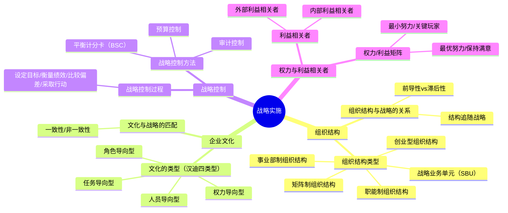

## 📍 章节定位

| 项目 | 信息 |
|------|------|
| **所属科目** | 🎯 公司战略与风险管理 |
| **难度等级** | ⭐⭐⭐ |
| **历年分值** | 4-6分 |
| **建议学时** | 6-8h |
| **核心地位** | 战略管理篇落地环节，案例分析常考 |

## 📝 考情分析

本章关注战略如何有效落地实施，涉及组织结构、企业文化、战略控制、利益相关者等。历年分值约 4-6 分，命题密度适中。

### 命题规律与重点考查趋势

近五年考查频率较高的考点分布如下：

| 考点 | 出题频次 | 题型偏好 | 难度 |
|------|----------|----------|------|
| 组织结构类型辨识 | ★★★★★ | 单选/案例 | 中 |
| 事业部制三种细分 | ★★★ | 单选/多选 | 易 |
| 结构与战略关系（钱德勒命题） | ★★★★ | 单选 | 易 |
| 前导性 vs 滞后性 | ★★★ | 单选 | 中 |
| 汉迪文化四类型 | ★★★★ | 单选/多选 | 中 |
| 文化与战略匹配 | ★★★ | 案例 | 中 |
| 平衡计分卡四维度 | ★★★★★ | 多选/案例 | 中 |
| 预算控制（增量 vs 零基） | ★★ | 单选 | 易 |
| 权力/利益矩阵 | ★★★ | 案例 | 中 |
| 战略控制过程四步 | ★★ | 简答 | 易 |

### 命题热点

1. **组织结构类型辨识**：给定案例描述，判断是职能制、事业部制、矩阵制还是 SBU。命题陷阱：SBU 与事业部制的区别在于 SBU 更独立（通常有独立战略决策权）。
2. **结构与战略的关系**：钱德勒"结构追随战略"的核心思想，前导性（结构先变）与滞后性（结构后变）的区分。
3. **企业文化类型**：汉迪四类型的辨识。命题陷阱：任务导向型适用于高科技企业（如华为），角色导向型适用于国企/银行。
4. **平衡计分卡**：四维度的辨识与指标匹配。命题陷阱：财务维度是结果，顾客/内部流程/创新学习是驱动因素。
5. **权力/利益矩阵**：四类利益相关者的应对策略。命题陷阱：高权力高利益是"关键玩家"，需重点管理。

### 与前后章联系

- **承前**：本章承接第 3 章"战略选择"——选定的战略需要相应的组织结构、文化、控制体系来落地。例如多元化战略需要事业部制，成本领先需要严格的成本控制体系。
- **启后**：本章的"战略控制"概念与第 6 章风险管理、第 7 章内部控制有逻辑关联。平衡计分卡的内部流程维度与内部控制框架相通。

### 学习方法建议

- **结构识别法**：通过案例描述（如"按产品线划分"、"双线汇报"）快速识别组织结构类型；
- **匹配记忆法**：战略类型与组织结构的匹配（单一战略→职能制，多元化→事业部制，项目驱动→矩阵制）；
- **案例锚定法**：每个组织结构、文化类型配企业案例（华为、海尔、阿里、银行等）；
- **维度记忆法**：平衡计分卡四维度、文化四类型、利益相关者四象限都用"四象限"思维记忆。

## 🧠 知识框架

## 📖 核心精讲

### 一、组织结构

#### （一）组织结构的主要类型

| 类型 | 特点 | 优点 | 缺点 | 适用 | 案例 |
|------|------|------|------|------|------|
| **创业型组织结构** | 创始人直接管理，无明确职能分工 | 灵活、决策快、成本低 | 难以扩展、过度依赖创始人 | 小型初创企业 | 初创期的字节跳动、早期老干妈 |
| **职能制组织结构** | 按职能（营销、生产、财务等）划分 | 专业化、规模经济、效率高 | 部门壁垒、响应慢、跨职能协调难 | 单一产品/市场企业 | 大型银行、单一业务制造商 |
| **事业部制组织结构** | 按产品/地区/客户划分事业部 | 自主性强、响应快、培养管理人才 | 资源重复、协调难、管理成本高 | 多元化/大型企业 | 海尔（产品事业部）、可口可乐（区域事业部） |
| **矩阵制组织结构** | 职能+项目双线管理 | 灵活、资源共享、专业与项目兼顾 | 双重领导、冲突多、协调复杂 | 项目驱动型企业 | 华为（职能+产品线）、IBM |
| **战略业务单元（SBU）** | 类似事业部但更独立 | 战略聚焦、培养管理人才、独立核算 | 管理成本高、可能各自为政 | 大型多元化集团 | 通用电气（GE）、联合利华 |

**事业部制三种细分**：

| 细分类型 | 划分依据 | 案例 |
|----------|----------|------|
| **产品事业部** | 按产品线划分 | 海尔（白电事业部、黑电事业部、智能家居事业部） |
| **区域事业部** | 按地理区域划分 | 可口可乐（北美区、亚太区、欧洲区） |
| **客户事业部** | 按客户类型划分 | 银行（个人金融事业部、对公业务事业部、投行事业部） |

**H 型结构（控股型）**：通过股权控制多个独立法人企业，母公司不直接参与经营。例如复星集团、华润集团。

**矩阵制的双重领导关系**：
- 纵向：职能部门经理（专业能力发展、人员管理）；
- 横向：项目经理/产品线经理（项目执行、业务结果）。
- 员工同时向两位上级汇报，需要明确的权责划分。

#### （二）组织结构与战略的关系

钱德勒（Chandler, 1962）提出"**结构追随战略**"（Structure follows strategy）：组织结构的调整应服务于战略实施。

| 维度 | 含义 | 体现 |
|------|------|------|
| **前导性** | 组织结构的变化先于战略实施，体现战略意图 | 主动调整结构以支撑新战略 |
| **滞后性** | 组织结构的变化慢于战略调整，因为结构调整涉及人事变动 | 战略已调整但结构未及时跟进 |

**战略发展阶段与组织结构的演进**：

| 战略阶段 | 战略类型 | 组织结构 | 案例 |
|----------|----------|----------|------|
| 第一阶段 | 单一业务、市场渗透 | 创业型 → 职能制 | 初创期阿里职能制 |
| 第二阶段 | 纵向一体化、相关多元化 | 职能制 → 事业部制 | 海尔从职能制转向产品事业部 |
| 第三阶段 | 非相关多元化、跨国经营 | 事业部制 → SBU/矩阵制 | 通用电气采用 SBU 结构 |

> 📌 **关键原则**：战略决定结构，结构支撑战略。不同战略类型需要不同的组织结构匹配：
> - 单一战略→职能制；
> - 多元化战略→事业部制或 SBU；
> - 项目驱动型业务→矩阵制；
> - 跨国经营→全球矩阵或区域事业部。

### 二、企业文化

#### （一）企业文化的类型（查尔斯·汉迪四类型）

| 类型 | 特点 | 适用 | 案例 |
|------|------|------|------|
| **权力导向型** | 权力集中于高层，少数人掌权，决策快 | 小型/家族企业 | 老干妈、初创企业 |
| **角色导向型** | 强调规则和程序，各司其职，稳定但僵化 | 大型传统企业、国企、银行 | 国有银行、传统制造企业 |
| **任务导向型** | 强调任务完成和团队协作，灵活创新 | 项目型/高科技企业 | 华为、谷歌、字节跳动 |
| **人员导向型** | 以员工需求为中心，企业服务于成员 | 咨询/创意类企业、合伙制企业 | 律师事务所、咨询公司 |

**文化类型的对比维度**：

| 维度 | 权力型 | 角色型 | 任务型 | 人员型 |
|------|--------|--------|--------|--------|
| 决策方式 | 高层集中 | 按规则程序 | 团队协商 | 个人自主 |
| 权力来源 | 职位/个人魅力 | 法定职位 | 专业能力 | 个人专长 |
| 协调机制 | 个人指令 | 规章制度 | 共同目标 | 共同价值观 |
| 适应变化 | 较快 | 慢 | 快 | 中等 |

#### （二）文化与战略的匹配

| 情形 | 处理方式 | 案例 |
|------|----------|------|
| **文化与战略一致** | 战略实施顺利，文化成为竞争优势 | 华为"以客户为中心"文化与全球化战略一致 |
| **文化与战略不一致** | 需调整文化或修改战略，否则实施受阻 | 传统企业数字化转型遇到"经验主义"文化阻力 |

**文化与战略匹配的四个层次**（Schwartz & Davis）：

| 匹配度 | 风险 | 处理策略 |
|--------|------|----------|
| 一致 | 低风险 | 利用文化促进战略 |
| 风险可控 | 中等风险 | 监控并小幅调整 |
| 主要风险 | 较高风险 | 调整文化以适应战略 |
| 严重不匹配 | 高风险 | 改变战略或重组企业 |

> 📌 文化具有很强的稳定性和路径依赖性，改变企业文化比改变组织结构更困难、更缓慢，通常需要 3-5 年甚至更长时间。

**案例锚定——华为文化演进**：
- 创业期：狼性文化（任务导向型），强调拼搏和结果；
- 成长期：以客户为中心、以奋斗者为本（任务+人员混合）；
- 全球化期：兼容并蓄，融入全球化人才观（人员导向型增强）。

### 三、战略控制

#### （一）战略控制过程

战略控制是一个动态循环过程：

1. **设定目标**：将战略目标分解为可衡量的绩效指标（如平衡计分卡指标）；
2. **衡量绩效**：收集实际执行数据（财务报表、运营数据、客户调研）；
3. **比较偏差**：分析实际与计划的差异，识别偏差原因；
4. **采取行动**：纠正偏差或调整战略（如调整目标、改进执行、改变战略）。

**战略控制与业务控制的区别**：

| 维度 | 战略控制 | 业务控制 |
|------|----------|----------|
| 时间跨度 | 长期（3-5 年） | 短期（月度/季度） |
| 控制层次 | 高层管理者 | 中基层管理者 |
| 关注重点 | 战略方向是否正确 | 经营活动是否按计划执行 |
| 信息来源 | 内外部综合 | 内部经营数据 |

#### （二）战略控制方法

##### 1. 预算控制

通过预算编制、执行和考核实施控制。包括增量预算和零基预算。

| 预算类型 | 特点 | 优点 | 缺点 | 适用 |
|----------|------|------|------|------|
| **增量预算** | 在上期基础上增减 | 简单、稳定、连续性强 | 可能固化低效、鼓励"用完预算" | 稳定经营环境 |
| **零基预算** | 从零开始重新评估每项支出 | 科学、消除低效、灵活 | 工作量大、需投入资源 | 战略转型期、成本压力大的企业 |

##### 2. 平衡计分卡（BSC）

平衡计分卡（Kaplan & Norton, 1992）从四个维度综合衡量企业绩效，将战略转化为可操作指标：

| 维度 | 核心问题 | 典型指标 | 案例（华为） |
|------|----------|----------|--------------|
| **财务维度** | 股东如何看待我们？ | 投资回报率、利润增长率、收入增长率、现金流 | 营业收入增长率、净利润率 |
| **顾客维度** | 顾客如何看待我们？ | 顾客满意度、市场份额、客户留存率、新客户获取数 | NPS（净推荐值）、客户复购率 |
| **内部流程维度** | 我们擅长什么？ | 生产周期、质量合格率、订单交付准时率、流程效率 | 项目交付准时率、研发周期 |
| **创新与学习维度** | 我们能否持续改进？ | 员工培训时长、新产品占比、专利数、员工满意度 | 研发投入占比、专利申请数、人才流失率 |

> 📌 **平衡计分卡要点**：
> - 四个维度相互关联，构成因果关系链；
> - **财务是最终结果**（滞后指标），顾客和内部流程是**驱动因素**（领先指标），创新学习是**长期基础**；
> - 战略地图：创新学习→内部流程改善→顾客满意度提升→财务绩效改善。

**平衡计分卡的运用步骤**：
1. 明确企业战略目标；
2. 将战略目标分解为四个维度的具体指标；
3. 设定指标的衡量标准和目标值；
4. 定期（月度/季度/年度）跟踪指标；
5. 根据指标偏差调整战略执行。

##### 3. 审计控制

| 审计类型 | 执行主体 | 重点 |
|----------|----------|------|
| **内部审计** | 企业内审部门 | 经营效率、内部控制有效性、风险预警 |
| **外部审计** | 独立会计师事务所 | 财务报表真实合规 |
| **政府审计** | 政府审计机关 | 国企、上市公司合规性 |

##### 4. 统计报告控制

通过定期统计报告（日报、周报、月报、季报、年报）监控战略执行情况。

### 四、权力与利益相关者

#### （一）利益相关者

| 类型 | 利益相关者 | 主要诉求 |
|------|------------|----------|
| **内部利益相关者** | 股东 | 投资回报、股价增长 |
| | 管理层 | 薪酬、权力、职业发展 |
| | 员工 | 工资、福利、职业发展、工作环境 |
| **外部利益相关者** | 供应商 | 货款回收、长期合作 |
| | 客户 | 产品质量、价格、服务 |
| | 政府 | 税收、就业、合规、社会稳定 |
| | 债权人 | 偿债能力、利息保障 |
| | 社区 | 就业、环境、社会责任 |

#### （二）权力/利益矩阵

根据利益相关者的权力大小和利益高低分为四类（Mendelow 矩阵）：

| | 利益低 | 利益高 |
|------|------|------|
| **权力高** | **保持满意**（B）：权力大但利益少，需保持其满意 | **关键玩家**（A）：权力大利益高，重点管理 |
| **权力低** | **最小努力**（D）：权力小利益少，监督即可 | **保持知情**（C）：权力小但利益高，保持沟通 |

**应对策略详解**：

| 类别 | 应对策略 | 案例 |
|------|----------|------|
| **关键玩家（A）** | 重点管理，密切合作，让其参与决策 | 大股东、核心管理层、关键供应商 |
| **保持满意（B）** | 维持其满意，避免其干预 | 监管机构（一般事项）、大型银行 |
| **保持知情（C）** | 保持沟通，提供信息，避免其不满 | 普通员工、社区、小客户 |
| **最小努力（D）** | 监督即可，不需大量投入 | 一般供应商、零散客户 |

> 📌 **核心策略**：对"关键玩家"（高权力高利益）投入最多精力管理；对"保持满意"（高权力低利益）维持满意；对"保持知情"（低权力高利益）保持沟通；对"最小努力"群体适度关注即可。

**利益相关者权力来源**（参考第 1 章）：强制权力、参考权力、专家权力、法定权力、奖赏权力。

### 五、战略实施中的关键问题

#### （一）战略失效

战略失效是指战略实施结果偏离预期目标的现象。可分为：

| 失效类型 | 发生时间 | 原因 |
|----------|----------|------|
| **早期失效** | 战略实施初期 | 战略未充分理解、配套未到位、员工不适应 |
| **偶然失效** | 实施过程中 | 突发外部事件（如疫情、政策变化） |
| **晚期失效** | 实施后期 | 战略过时、环境变化、内部懈怠 |

**应对策略**：建立战略控制系统，及时识别偏差并调整；保持战略的弹性与适应性。

#### （二）战略控制系统

战略控制系统包括：
- **战略控制**：评估战略方向是否正确，是否需要调整战略；
- **业务控制**：评估战略执行是否到位，是否需要改进执行；
- **绩效控制**：评估员工和部门绩效，是否达到目标。

**控制系统设计的关键问题**：
- 控制信息是否准确、及时；
- 控制标准是否合理、可衡量；
- 控制频率是否适当；
- 控制成本是否低于控制收益。

### 六、信息技术在战略实施中的作用

信息技术（IT）已成为现代企业战略实施的重要支撑，主要体现在：

| 作用维度 | 具体体现 | 案例 |
|----------|----------|------|
| **组织结构扁平化** | IT 减少信息传递层级，支持扁平化组织 | 海尔"人单合一"通过数字化平台实现小微单元直接对接用户 |
| **流程优化** | ERP、BPR 等提升流程效率 | 阿里通过中台系统整合共享业务，提升复用效率 |
| **决策支持** | 大数据、BI 提供决策依据 | 京东通过大数据预测需求，优化库存和物流 |
| **协同整合** | 协同办公、知识管理平台促进跨部门协作 | 飞书、钉钉等工具支撑企业远程协同 |
| **绩效监控** | 数字化看板、实时仪表盘 | 顺丰物流实时跟踪系统 |

### 七、战略实施的常见障碍与对策

| 障碍类型 | 表现 | 对策 |
|----------|------|------|
| **战略理解障碍** | 员工对战略意图理解不一致 | 战略宣贯、目标分解、KPI 体系 |
| **资源匹配障碍** | 资金、人才、技术资源不足 | 战略资源配置优先级、外部融资、人才引进 |
| **组织结构障碍** | 结构不适配战略 | 组织变革、流程再造 |
| **文化冲突障碍** | 文化与战略方向不一致 | 文化变革、价值观重塑 |
| **绩效激励障碍** | 考核体系与战略目标脱节 | 重建 KPI、平衡计分卡、股权激励 |
| **沟通协调障碍** | 跨部门协作不畅 | 建立跨部门机制、信息化协同平台 |

**案例锚定——阿里巴巴战略实施的"中台战略"**：
阿里 2015 年提出"大中台、小前台"战略，将共享业务（支付、用户、商品、搜索等）沉淀到中台，前台业务单元（淘宝、天猫、菜鸟等）快速调用中台能力。这一组织变革支撑了阿里多元化业务的快速创新。2023 年阿里又调整为"1+6+N"分拆模式，进一步放权各业务集团。这是"结构追随战略"的典型实践。

## 💡 典型例题

**【例题 1】（单选题，组织结构辨识）**

某大型多元化企业集团旗下有家电、地产、金融、医疗四大业务板块，每个板块独立核算、独立战略决策，由集团总部通过股权控制，但不直接参与经营。该集团的组织结构属于（ ）。
A. 职能制
B. 事业部制
C. 矩阵制
D. H 型结构（控股型）

**答案**：D

**解析**：H 型结构（控股型）的特点是通过股权控制多个独立法人企业，母公司不直接参与经营。本题集团通过股权控制四大板块但不直接经营，符合 H 型结构。事业部制是母公司直接经营下的分权；矩阵制是双重领导；职能制是按职能划分。

**【例题 2】（单选题，文化与战略匹配）**

某传统国企推进数字化转型战略，但员工普遍依赖原有流程和规章制度，对创新持保守态度，导致数字化项目推进缓慢。该企业的文化类型最可能是（ ）。
A. 权力导向型
B. 角色导向型
C. 任务导向型
D. 人员导向型

**答案**：B

**解析**：角色导向型文化强调规则和程序、各司其职，稳定但僵化，适用于大型传统企业和国企。本题"员工依赖原有流程和规章制度、对创新持保守态度"是典型的角色导向型文化特征，与数字化转型的创新需求不匹配。

**【例题 3】（多选题，平衡计分卡维度）**

下列属于平衡计分卡维度的有（ ）。
A. 财务维度
B. 顾客维度
C. 内部流程维度
D. 创新与学习维度
E. 社会责任维度

**答案**：ABCD

**解析**：平衡计分卡包括财务、顾客、内部流程、创新与学习四个维度。E 社会责任维度不属于经典 BSC 四维度。命题陷阱：有些企业增加"社会责任"维度，但 CPA 教材的 BSC 是四维度。

**【例题 4】（多选题，汉迪文化四类型）**

下列属于查尔斯·汉迪提出的企业文化类型的有（ ）。
A. 权力导向型
B. 角色导向型
C. 任务导向型
D. 人员导向型
E. 创新导向型

**答案**：ABCD

**解析**：汉迪四类型包括：权力导向型、角色导向型、任务导向型、人员导向型。E 创新导向型不属于汉迪分类。

**【例题 5】（单选题，权力/利益矩阵）**

某企业正在进行重大战略转型，员工因担心裁员而集体抗议，导致转型受阻。在权力/利益矩阵中，员工属于（ ）。
A. 关键玩家（高权力高利益）
B. 保持满意（高权力低利益）
C. 保持知情（低权力高利益）
D. 最小努力（低权力低利益）

**答案**：C

**解析**：员工对战略转型有高利益关系（涉及裁员），但单个员工权力较小。集体抗议提升了组织层面权力，但在权力/利益矩阵中员工通常属于"低权力高利益"的"保持知情"类别。企业应通过沟通、参与、激励等方式应对。命题陷阱：集体抗议不改变员工在矩阵中的基本定位，但企业应加强沟通以防止其升级为"关键玩家"。

**【例题 6】（综合题，组织结构与战略匹配）**

某科技公司在发展初期采用职能制结构，随着业务扩展到多个产品线（智能手机、智能穿戴、智能家居、IoT 平台），原有的职能部门（研发部、市场部、生产部等）难以协调各产品线的研发节奏、市场推广和供应链管理，出现了"研发资源争抢、市场推广各自为战、客户体验不一致"等问题。公司决定进行组织变革。

要求：
(1) 分析该公司原有组织结构存在的问题；
(2) 建议该公司应采用何种组织结构，并说明理由；
(3) 简述变革过程中可能遇到的阻力及应对措施。

**答案**：

(1) 原有职能制结构存在的问题：
- 职能部门壁垒导致跨产品线协调困难；
- 研发、市场、生产资源在多产品线间争抢；
- 各产品线缺乏专属的市场和研发负责团队，响应慢；
- 客户体验不一致（无产品线整体负责人）。

(2) 建议采用**产品事业部制组织结构**：
- 按产品线划分事业部（智能手机事业部、智能穿戴事业部、智能家居事业部、IoT 平台事业部）；
- 每个事业部下设研发、市场、生产等职能团队，独立核算、自主经营；
- 集团总部保留战略、财务、人力、品牌等共享职能；
- 理由：①遵循"结构追随战略"原则，多元化业务需要事业部制匹配；②各事业部自主经营，能够快速响应市场变化；③事业部独立核算便于绩效评估和资源分配；④共享职能（财务、人力、品牌）保持集团协同。

(3) 变革阻力及应对措施：

| 阻力类型 | 具体表现 | 应对措施 |
|----------|----------|----------|
| 个人阻力 | 部门负责人担心权力被削弱；员工担心岗位调整 | 沟通转型必要性、设计合理的岗位过渡方案、提供激励补偿 |
| 结构阻力 | 原有职能制下的考核体系、流程不适应事业部制 | 重新设计绩效考核体系、调整业务流程、建立跨事业部协同机制 |
| 文化阻力 | "本位主义"思维与事业部制的协同要求冲突 | 推动"集团利益优先"价值观、建立跨事业部协作机制 |

**解析**：本题综合考查组织结构辨识、战略与结构匹配、变革管理。关键是遵循"结构追随战略"原则，多元化业务应匹配事业部制；同时识别变革阻力的三类来源并提出针对性措施。

## 🎯 记忆口诀

- **组织结构五类型**："创业职能事业矩阵 SBU"——从小到大、从简单到复杂。
- **事业部三细分**："产（产品）区（区域）客（客户）"——按产品线、地理区域、客户类型。
- **结构与战略匹配**："单一→职能，多元→事业部，项目→矩阵，控股→H 型"。
- **结构追随战略**：钱德勒名言，"战略先行，结构跟上"——前导性（结构先变）vs 滞后性（结构后变）。
- **文化四类型**："权（权力）角（角色）任（任务）人（人员）"——汉迪四分。权力型家族企业，角色型国企银行，任务型高科技，人员型咨询创意。
- **文化匹配四层次**："一致可控主要严重"——风险递增，处理从"利用"到"重组"。
- **战略控制四步**："设（设定目标）量（衡量绩效）较（比较偏差）行（采取行动）"——动态循环。
- **预算两类型**："增量（上期基础上加减）简单固化；零基（从零评估）科学费力"。
- **平衡计分卡四维度**："财（财务）客（顾客）内（内部流程）学（创新学习）"——财务是结果，顾客/流程是驱动，学习是基础。
- **BSC 因果链**："学（创新学习）→内（内部流程）→客（顾客满意）→财（财务绩效）"——形成战略地图。
- **利益相关者矩阵**："关（关键玩家）保（保持满意）知（保持知情）最（最小努力）"——高权力高利益最关键，低权力低利益最省力。
- **战略失效三类型**："早（早期失效）偶（偶然失效）晚（晚期失效）"——初期未理解、突发外部事件、后期过时。
- **审计三类型**："内（内部审计）外（外部审计）政（政府审计）"——分别关注经营效率、财务真实、合规性。

## ✅ 同步练习

**1. [单选]** 某大型多元化企业按产品线设立独立事业部，各事业部自负盈亏。该组织结构属于（ ）。
A. 职能制  B. 事业部制  C. 矩阵制  D. 创业型

**2. [单选]** "结构追随战略"是哪位学者提出的？（ ）
A. 波特  B. 明茨伯格  C. 钱德勒  D. 安索夫

**3. [多选]** 下列属于汉迪企业文化类型的有（ ）。
A. 权力导向型  B. 角色导向型  C. 任务导向型  D. 人员导向型

**4. [简答]** 简述平衡计分卡的四个维度及其相互关系。

**5. [案例分析]** 某科技公司在发展初期采用职能制结构，随着业务扩展到多个产品线，原有的职能部门难以协调各产品线的研发和销售。公司决定进行组织变革。请分析该公司应采用何种组织结构，并说明理由。

> 参考答案：1.B  2.C  3.ABCD  4.见核心精讲"平衡计分卡"  5.建议采用事业部制组织结构。理由：公司业务已扩展到多个产品线，属于多元化发展；事业部制按产品线划分，各事业部自主经营、自负盈亏，能够快速响应市场变化；克服了职能制下跨部门协调困难的问题。遵循"结构追随战略"原则，多元化战略需要事业部制匹配。
