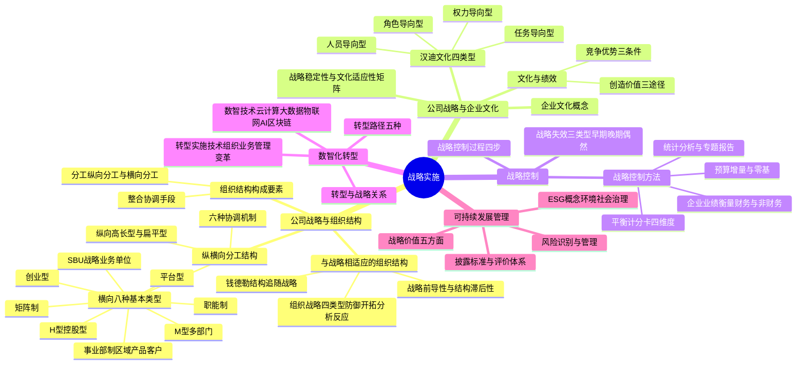

## 1. 章节定位

| 项目 | 信息 |
|------|------|
| 所属科目 | 公司战略与风险管理 |
| 难度等级 | 3 |
| 历年分值 | 6-8 分 |
| 建议学时 | 8-10 小时 |
| 知识关联章节 | 第3章战略选择（战略实施是战略选择的落地）、第5章公司治理（治理结构是实施保障） |

## 2. 考情分析

本章关注战略如何有效落地实施，涵盖组织结构、企业文化、战略控制、数智化转型与可持续发展管理五大板块。历年分值约 6-8 分，既有客观题也有案例分析题，命题密度适中。

**命题规律**：本章内容覆盖面广，客观题集中在概念辨识（组织结构类型、文化类型、平衡计分卡四维度），主观题常以案例形式考查组织结构辨识、文化与战略匹配、战略控制方法选择等。

**高频考点分布**：

1. **组织结构类型辨识**：8 种横向分工结构类型（创业型、职能制、事业部制、M 型、SBU、矩阵制、H 型、平台型）的辨识与适用条件是高频考点，常以案例描述判断结构类型。
2. **结构与战略的关系**：钱德勒"结构追随战略"理论，战略前导性与组织结构滞后性的辨析。
3. **组织的战略类型**：防御型、开拓型、分析型、反应型四类组织的特征与适应场景。
4. **汉迪企业文化四类型**：权力导向型、角色导向型、任务导向型、人员导向型的辨识。
5. **战略稳定性与文化适应性矩阵**：四象限的处理策略（以企业使命为基础、加强协同作用、根据文化进行管理、重新制定战略）。
6. **平衡计分卡**：四维度（财务、顾客、内部流程、创新与学习）及五个平衡关系。
7. **战略失效三类型**：早期失效、晚期失效、偶然失效的区分。
8. **预算控制**：增量预算与零基预算的优缺点对比。
9. **数智化转型**：数智技术（云计算、大数据、物联网、AI、区块链）的基本概念与转型路径。

**备考建议**：

- 组织结构类型用"规模递进"线索串联：创业型（最小）→ 职能制 → 事业部制 → M 型 → SBU → 矩阵制/H 型/平台型（最复杂）；
- 平衡计分卡四维度用"因果链"记忆：创新与学习（基础）→ 内部流程（保障）→ 顾客（结果）→ 财务（终极目标）；
- 案例题训练时，先判断组织结构类型，再分析文化与战略匹配度，最后给出战略控制建议。

## 3. 知识框架

## 4. 核心精讲

### 一、公司战略与组织结构

#### （一）组织结构的构成要素

组织结构是组织为实现共同目标而进行的各种分工和协调的系统。其基本构成要素是**分工与整合**。

| 要素 | 含义 | 分类 |
|------|------|------|
| **分工** | 企业为创造价值而对其人员和资源进行的分配 | 纵向分工（决策权分配）、横向分工（人员与部门配置） |
| **整合** | 企业为实现预期目标而用来协调人员与职能的手段 | 跨职能团队、委员会、协调机制等 |

#### （二）纵向分工结构

纵向分工是指企业高层管理人员选择适当的管理层次和控制幅度。基本有两种形式：

| 类型 | 特征 | 优点 | 缺点 |
|------|------|------|------|
| **高长型组织结构** | 管理层次多，控制幅度窄 | 有利于内部控制 | 对市场变化反应慢；信息传递失真大；管理费用高 |
| **扁平型组织结构** | 管理层次少，控制幅度宽 | 及时反映市场变化；信息传递准确；管理费用低 | 容易造成管理失控 |

**纵向分工结构的管理问题**：

1. **集权与分权**：

| 类型 | 决策权分布 | 结构特征 | 优点 | 缺点 |
|------|-----------|----------|------|------|
| **集权型** | 高层掌握决策权 | 层级式、高长型 | 易协调；易沟通规范；危急时快速决策；规模经济 | 忽视个别部门；决策慢；基层发展有限 |
| **分权型** | 决策权下放 | 扁平型 | 减少沟通障碍；提高反应能力；激励员工 | 协调难度增大 |

2. **中层管理人员人数**：高长型需要更多中层管理人员，增加行政管理费用。
3. **信息传递**：层次越多，信息越易失真。
4. **协调与激励**：扁平型更能调动管理人员积极性。

#### （三）横向分工结构的八种基本类型

| 类型 | 适用场景 | 优点 | 缺点 | 中国企业案例 |
|------|----------|------|------|-------------|
| **创业型** | 小型企业 | 简单、灵活 | 缺乏专业分工；依赖个人能力 | 创业初期的小微企业 |
| **职能制** | 单一业务企业 | 规模经济；培养职能专家；效率高；易于监控 | 协调难；难以确定产品盈亏；各自为政；反应慢 | 多数中型制造企业 |
| **事业部制** | 多产品线/多区域企业 | 区域/产品决策快；削减费用；灵活性强；易于出售不良事业部 | 管理成本重复；资源争夺；协调难 | 海尔按产品线设事业部 |
| **M 型（多部门）** | 大型多元化企业 | 持续成长；总部减负；调动积极性；财务评估 | 成本分摊难；资源竞争；转移价格冲突 | 通用电气传统架构 |
| **SBU（战略业务单位）** | 大型多元化企业 | 降低总部控制跨度；减轻信息过度；协调类似产品线；易于评估 | 增加垂直管理层；关系疏远；资源竞争 | 通用电气 70 年代改革 |
| **矩阵制** | 复杂项目管理 | 项目经理动力强；优先考虑关键项目；决策优；部门协作；双重权力约束 | 权力划分不清；管理者冲突；协调成本高 | 华为项目制与职能制并行 |
| **H 型（控股型）** | 多元化集团 | 业务单元自主性高；分散风险；母公司管理费低；节税收益 | 控制力弱；协同效应差 | 复星集团、中信集团 |
| **平台型** | 互联网/高科技/新零售 | 响应快；创新强；资源利用率高；生态系统构建；降低管理成本 | 管理难度大；领导力要求高；文化冲突风险 | 华为数据中台、阿里商业生态 |

**事业部制的三种细分**：

| 细分类型 | 划分依据 | 案例 |
|----------|----------|------|
| **区域事业部制** | 按地理位置划分 | 北美区、亚太区、欧洲区 |
| **产品/品牌事业部制** | 按产品或品牌划分 | 洗衣机事业部、空调事业部 |
| **客户/市场细分事业部制** | 按客户类型划分 | 公司银行部、私人银行部 |

**平台型组织结构的四种类型**：

| 类型 | 特征 | 案例 |
|------|------|------|
| **资源赋能型** | 内部平台化，整合中后台能力 | 华为数据中台、京东技术中台 |
| **生态系统型** | 外部平台化，连接生产者与消费者 | 淘宝、滴滴、苹果 iOS、鸿蒙系统 |
| **投资孵化型** | 类似风投，提供资源但不参与运营 | 海尔海创汇 |
| **混合型** | 内外结合的综合体 | 亚马逊 AWS、腾讯微信 |

#### （四）横向分工结构的六种协调机制

| 协调机制 | 含义 | 适用场景 |
|----------|------|----------|
| **相互适应、自行调整** | 非正式沟通达成协调 | 最简单或极复杂的组织 |
| **直接指挥、直接控制** | 一人决策发布指令 | 小型组织、紧急情况 |
| **工作过程标准化** | 预先制定工作标准 | 生产线、流水作业 |
| **工作成果标准化** | 规定最终目标，不限途径 | 出版社与印刷厂 |
| **技艺（知识）标准化** | 对成员技能标准化 | 外科大夫与麻醉师 |
| **共同价值观** | 全员共有价值观和使命 | 成熟企业的文化管理 |

> **记忆要点**：组织从简单到复杂，协调机制依次为：相互适应→直接指挥→过程标准化→成果标准化→技艺标准化→共同价值观。但企业往往混合使用多种机制。

#### （五）与公司战略相适应的组织结构

**1. 钱德勒"结构追随战略"理论**

艾尔弗雷德·钱德勒在《战略和结构》中首次提出**组织结构服从战略**的理论。通过对杜邦、通用汽车、标准石油、西尔斯等公司的研究发现：企业选择新战略后，组织结构往往滞后于战略变化，直到管理问题显现才被迫调整结构。

**2. 战略前导性与组织结构滞后性**

| 特性 | 含义 | 原因 |
|------|------|------|
| **战略前导性** | 战略变化快于组织结构变化 | 企业一旦意识到机会，首先在战略上反应 |
| **组织结构滞后性** | 结构变化慢于战略变化 | 新旧结构交替有惯性；管理人员抵制变革 |

**3. 企业发展阶段与组织结构的对应关系**

| 发展阶段 | 战略类型 | 对应组织结构 |
|----------|----------|-------------|
| 创立初期 | 市场渗透战略 | 创业型组织结构 |
| 发展期 | 市场开发战略 | 职能制组织结构 |
| 进一步发展 | 纵向一体化战略 | 事业部制组织结构 |
| 成熟期 | 多元化战略 | SBU、矩阵制或 H 型结构 |

**4. 组织的战略类型（迈尔斯和斯诺）**

| 类型 | 特征 | 技术与行政管理 | 适用环境 | 风险 |
|------|------|---------------|----------|------|
| **防御型组织** | 追求稳定环境，生产有限产品，占领小部分市场 | 高度成本效率的核心技术；机械式结构 | 稳定产业 | 难以应对市场环境重大改变 |
| **开拓型组织** | 追求动态环境，探索新产品和市场机会 | 灵活多样的技术；有机式结构 | 动荡环境 | 利润较低；资源分散；缺乏效率 |
| **分析型组织** | 结合防御型和开拓型，既有稳定产品又寻求新机会 | 双重技术核心（稳定+灵活）；矩阵结构 | 中等动荡环境 | 管理复杂；应变能力受限 |
| **反应型组织** | 动荡不定的调整模式，缺乏随机应变机制 | 无一致模式 | 仅在上述三种都无法运用时 | 永远处于不稳定状态，是下策 |

> **记忆要点**：防御型=守（稳定+效率）；开拓型=攻（动态+灵活）；分析型=攻守兼备（双重核心）；反应型=无策略（下策）。一个企业成为反应型组织的三原因：①决策层未明文表达战略；②未形成适用战略的组织结构；③只注重保持现有战略与结构关系，忽视环境变化。

### 二、公司战略与企业文化

#### （一）企业文化的概念

企业文化是企业成员共有的哲学、意识形态、价值观、信仰、假定、期望态度和道德规范。它代表了企业内部的行为指南，不能由契约明确下来，但制约和规范着企业的管理者和员工。

#### （二）企业文化的类型（查尔斯·汉迪四分类）

| 类型 | 核心特征 | 组织结构 | 优点 | 缺点 | 典型企业 |
|------|----------|----------|------|------|----------|
| **权力导向型** | 掌权人对下属绝对控制 | 传统框架 | 决策快 | 忽视人的价值；中层低士气高流失 | 家族企业、新开创企业 |
| **角色导向型** | 追求理性和秩序，重视合法性、忠诚和责任 | 重视等级和地位 | 稳定性、持续性；稳定环境中效率高 | 不适合动荡环境 | 国有企业、政府机构 |
| **任务导向型** | 关心不断解决问题，按贡献评估 | 矩阵式 | 适应性强；速度和灵活性 | 成本高；无连续性 | 新兴产业、高科技企业 |
| **人员导向型** | 企业为成员需要服务 | 职权多余 | 员工满意度高 | 不易管理；企业目标难以统一 | 俱乐部、协会、咨询公司 |

#### （三）文化与绩效

**企业文化为企业创造价值的三个途径**：

1. **文化简化了信息处理**：价值观和行为准则使员工活动集中于特定范围，减少决策成本，促进工作专门化。
2. **文化补充了正式控制**：基于文化认同的自我控制（团体控制）比正式制度控制更有效。奥奇提出三种控制模式：官僚控制（专业化、个人责任）、团体控制（组织准则和价值系统）、市场控制（价格基础）。
3. **文化促进了合作并减少讨价还价成本**：通过"相互强化"的道德规范，减轻企业内权力运用的危害效应。

**企业文化成为维持竞争优势源泉的三个条件**（杰伊·巴尼）：

| 条件 | 含义 |
|------|------|
| **创造价值** | 文化必须为企业创造价值 |
| **特有性** | 文化必须是企业所特有的，不同于市场上大多数企业 |
| **难模仿性** | 文化体现了企业的历史积累，复杂性使其他企业很难效仿 |

#### （四）战略稳定性与文化适应性矩阵

以"组织要素变化程度"（纵轴）和"文化潜在一致性"（横轴）构建矩阵：

| 象限 | 组织要素变化 | 文化一致性 | 处理策略 | 关键措施 |
|------|-------------|-----------|----------|----------|
| **第一象限** | 大 | 高 | **以企业使命为基础** | 考虑与基本使命的关系；发挥现有人员作用；奖励系统保持一致；不破坏已有行为准则 |
| **第二象限** | 小 | 高 | **加强协同作用** | 利用有利条件巩固文化；利用文化稳定期解决经营问题 |
| **第三象限** | 小 | 低 | **根据文化进行管理** | 研究变化是否带来成功机会；在不影响总体文化前提下实行不同文化管理 |
| **第四象限** | 大 | 低 | **重新制定战略或进行文化管理** | 考察是否必要推行新战略；若必须实施则进行文化管理（讲明意义、招聘新人员、奖励新文化、形成新规范） |

### 三、战略控制

#### （一）战略失效与战略控制

**战略失效**是指企业战略实施的结果偏离了预定的战略目标或战略管理的理想状态。

| 失效类型 | 发生时间 | 原因 |
|----------|----------|------|
| **早期失效** | 战略实施初期 | 新战略未被员工理解和接受；实施者对新环境不适应 |
| **晚期失效** | 实施一段时间后 | 战略环境预测与现实差距随时间推移越来越大 |
| **偶然失效** | 实施过程中 | 意想不到的偶然因素 |

**战略控制**是指企业在战略实施过程中，检测环境变化，检查业务进展，评估经营绩效，与既定战略目标比较，发现偏差并纠正。

**战略控制与预算控制的区别**：

| 维度 | 战略控制 | 预算控制 |
|------|----------|----------|
| 期间 | 几年到十几年 | 一年以下 |
| 方法 | 定性+定量 | 定量 |
| 重点 | 内部+外部 | 内部 |
| 纠正 | 不断纠正行为 | 预算期结束后纠正 |

#### （二）战略控制过程（四步）

| 步骤 | 内容 |
|------|------|
| **1. 设定控制目标** | 依据战略目标，结合内外部变化，设定控制标准或指标 |
| **2. 选择控制方法** | 收集和处理经营信息，监测环境，衡量业绩的方法和工具 |
| **3. 实施控制措施** | 衡量评价业绩，与目标比较，分析差距原因，制定纠正措施 |
| **4. 反馈控制效果** | 将效果反馈给决策者、部门经理和员工，推动持续改进 |

#### （三）战略控制方法

**1. 预算**

| 预算类型 | 含义 | 优点 | 缺点 |
|----------|------|------|------|
| **增量预算** | 在前期预算基础上增加 | 工作量少；相对稳定；避免冲突；易协调 | 不考虑变化；保守观念；无降低成本动力；鼓励用光预算 |
| **零基预算** | 以零为基点，逐项审查 | 合理分配资金；调动积极性；增强成本效益意识；鼓励创新；科学透明 | 工作量大；可能追求短期利益；引起部门矛盾 |

**2. 企业业绩衡量**

- **财务衡量指标**：盈利能力（毛利率、净利润率、ROCE）、股东投资（每股盈余、市净率、股息率、市盈率）、流动性（流动比率、速动比率、存货周转期）、负债和杠杆（负债率、现金流量比率）。
- **非财务衡量指标**：服务质量（投诉数量、客户等待时间）、人力资源（员工周转率、培训时间）、营销（市场份额、客户数量）、生产（工艺先进性、质量标准）、研发（专利数量、设计创新能力）。

**3. 平衡计分卡（重点）**

卡普兰和诺顿提出的平衡计分卡从**四个角度**将组织战略转化为可操作的衡量指标和目标值：

| 维度 | 核心问题 | 常用指标 | 因果关系 |
|------|----------|----------|----------|
| **财务角度** | 战略实施对股东价值的贡献 | 营业收入、利润增长率、资产回报率、股东回报率、现金流量、EVA | 结果性指标（滞后） |
| **顾客角度** | 如何满足顾客需求、提高顾客价值 | 顾客满意度、投诉率、准时交货率、市场份额、客户保留率 | 结果性指标 |
| **内部流程角度** | 哪些业务流程表现优异 | 信息系统覆盖率、订单准时交付率、采购成本和周期、安全事故率 | 驱动性指标 |
| **创新与学习角度** | 如何保持变革和改进能力 | 研发费用占销售额比例、新产品销售额占比、员工培训费用、员工满意度 | 驱动性指标（领先） |

**平衡计分卡的五个平衡**：

1. 财务指标与非财务指标的平衡；
2. 长期目标与短期目标的平衡；
3. 结果性指标与动因性指标的平衡；
4. 内部利益相关者与外部利益相关者的平衡；
5. 领先指标与滞后指标的平衡。

**平衡计分卡的作用**：

- 为企业战略管理提供强有力的支持；
- 提高企业整体管理效率和效果；
- 促进部门合作，完善协调机制；
- 完善激励机制，提高员工参与度；
- 促进企业立足实际、着眼未来，实现长期可持续发展。

**4. 统计分析与专题报告**

| 方法 | 特点 |
|------|------|
| **统计分析报告** | 以统计数据为主体；以科学指标体系分析；逻辑严密、脉络清晰 |
| **专题报告** | 对特定问题深入调查研究；有助于开阔战略视野；可委托外部专业机构完成 |

### 四、公司战略与数智化转型

#### （一）数智技术发展

| 数智技术 | 定位 | 核心特征 |
|----------|------|----------|
| **云计算** | 技术基石 | IaaS（基础设施）、PaaS（平台）、SaaS（软件）三层服务，按需供给、弹性伸缩 |
| **大数据** | 核心资源 | 多样性、大量性、高速性、价值性 |
| **物联网** | 感知与互联 | 传感器技术、射频识别技术、嵌入式系统技术 |
| **移动互联网** | 关键载体 | 人人在线、时时可交互，打通服务与用户的"最后一公里" |
| **人工智能** | 核心驱动力 | 机器学习、自然语言理解、图像识别，实现从"数字化"到"智能化"飞跃 |
| **区块链** | 信任基石 | 分布式账本、智能合约、加密算法，确保数据可信与有序流动 |

**数智化应用三阶段**：

| 阶段 | 核心特征 | 典型应用 |
|------|----------|----------|
| **信息化** | 业务流程电子化 | ERP、OA系统 |
| **数字化** | 数据贯通与价值挖掘 | 数据中台、商业智能仪表盘 |
| **数智化** | AI自主决策与生态协同 | 智能体协同、数字孪生、动态定价 |

#### （二）数智化转型与公司战略的关系

- **公司战略引领数智化转型**：战略决定转型方向（定向）、资源投入（定投）、变革深度（定标）。
- **数智化转型支撑公司战略**：赋能前瞻决策、加速精准执行、驱动动态优化。

#### （三）数智化转型实施

**四大变革**：

| 变革类型 | 核心内容 | 中国企业案例 |
|----------|----------|-------------|
| **技术变革** | 数智化基础设施、数智化研发 | 华为5G+AI研发平台 |
| **组织变革** | 建立数智化企业架构（共享型+敏捷型）、培育数智化人才 | 海尔"三化"机制（企业平台化、用户个性化、员工创客化） |
| **业务变革** | 营销数智化、生产数智化、供应链数智化 | 华为全球核算3天完成月报 |
| **管理变革** | 财务管理数智化、人才管理数智化、风险管理数智化 | 企业"大风控"数字生态 |

**五种转型路径**：流程优化驱动、数据赋能驱动、技术应用驱动、商业模式创新、全面协同。

### 五、公司战略与可持续发展管理

#### （一）可持续发展管理概念

可持续发展管理以**环境（E）、社会（S）、治理（G）**三大维度为核心，推动企业从单一利润导向转向多元价值创造。

#### （二）可持续发展管理的战略价值

| 价值 | 内容 |
|------|------|
| **指明发展方向** | 从环境、社会和治理角度指明"环境友好、负责任、可信赖"的新方向 |
| **提升企业形象** | 及时发现风险点；降低法律和声誉损害；增强员工归属感 |
| **提升核心竞争力** | 提升品牌无形资产；驱动创新能力；满足新消费趋势 |
| **增强盈利能力** | 短期可能影响利润，长期提升资产质量和经营绩效 |
| **满足利益相关者需求** | 从各利益相关者角度思考问题，回应多方需求 |

#### （三）可持续发展管理披露标准

2024年财政部印发《企业可持续披露准则——基本准则（试行）》，沪、深、北交易所发布《上市公司可持续发展报告指引》。ESG三大维度披露内容：

| 维度 | 重点披露内容 |
|------|-------------|
| **环境（E）** | 气候变化应对（碳减排目标）、资源与污染管理（能源消耗、废水废气）、生物多样性保护 |
| **社会（S）** | 员工权益（薪酬差距、安全事故）、供应链与社区责任、客户与数据安全 |
| **治理（G）** | 治理机制制度化、尽职调查、利益相关方沟通、反商业贿赂、反不正当竞争 |

## 5. 典型例题

**【例题 1】（单选题，组织结构辨识）**

某企业随着规模扩大，拥有多条产品线，按产品种类设立若干事业部，每个事业部负责产品开发、生产和营销。该企业的组织结构属于（ ）。
A. 职能制组织结构
B. 区域事业部制结构
C. 产品/品牌事业部制结构
D. 矩阵制组织结构

**答案**：C

**解析**：按产品种类设立事业部、每个事业部负责该产品的全部方面（开发、生产、营销），是产品/品牌事业部制结构的典型特征。职能制是按职能划分部门；区域事业部制是按地理位置划分；矩阵制是双重命令结构。

**【例题 2】（单选题，文化类型辨识）**

某高科技企业采用矩阵式组织结构，强调速度和灵活性，员工可根据专长获得相应权力，企业从各部门抽调人员组成项目组解决问题。该企业的企业文化属于（ ）。
A. 权力导向型
B. 角色导向型
C. 任务导向型
D. 人员导向型

**答案**：C

**解析**：任务导向型文化的特征是关心不断解决问题、采用矩阵式结构、强调速度和灵活性、专长是权力的主要来源、无连续性。高科技企业符合这些特征。权力导向型是传统框架、绝对控制；角色导向型追求理性和秩序、重视等级；人员导向型是企业为员工服务。

**【例题 3】（单选题，战略失效类型）**

某企业在实施新战略半年后，由于前期对市场的预测与实际情况偏差越来越大，导致战略效果逐渐下降。这种战略失效属于（ ）。
A. 早期失效
B. 晚期失效
C. 偶然失效
D. 战略失败

**答案**：B

**解析**：晚期失效是指战略实施一段时间后，之前对战略环境的预测与现实之间的差距随时间推移越来越大，造成战略失效。早期失效发生在实施初期，原因是员工未理解和接受；偶然失效是意想不到的偶然因素导致。

**【例题 4】（多选题，平衡计分卡）**

下列关于平衡计分卡的表述中，正确的有（ ）。
A. 平衡计分卡从财务、顾客、内部流程、创新与学习四个角度衡量企业业绩
B. 平衡计分卡体现了财务指标与非财务指标的平衡
C. 平衡计分卡中创新与学习指标属于结果性指标
D. 平衡计分卡每个企业的具体指标内容可以不同
E. 平衡计分卡的四个维度指标相互联系、彼此加强

**答案**：ABDE

**解析**：C 错误，创新与学习指标属于驱动性指标（领先指标），不是结果性指标。财务指标才是结果性指标（滞后指标）。ABDE 均正确：四维度（A）、财务与非财务平衡（B）、企业应根据自身情况选择指标（D）、四维度紧密联系相互支持（E）。

**【例题 5】（多选题，组织战略类型）**

下列关于组织的战略类型的表述中，正确的有（ ）。
A. 防御型组织追求稳定的环境，创造具有高度成本效率的核心技术
B. 开拓型组织追求动态环境，具有灵活性但缺乏效率
C. 分析型组织是防御型和开拓型组织的结合体
D. 反应型组织是最佳的战略组织形态
E. 反应型组织在对外部环境的反应上采取动荡不定的调整模式

**答案**：ABCE

**解析**：D 错误，反应型组织是一种下策，只有在防御型、开拓型、分析型都无法运用时才考虑使用。ABCE 均正确。

**【例题 6】（综合题，组织结构辨识与文化匹配）**

某大型制造企业 A 成立之初采用创业型组织结构，由创始人直接管理。随着规模扩大到 500 人，企业改为职能制结构，设立生产、营销、财务、人事等部门。近年来企业进入多个产品领域，拥有 5 条产品线，总部指挥出现顾此失彼的情况。企业决定进行组织结构变革。

要求：(1) 分析 A 企业当前职能制结构的不足；(2) 建议 A 企业应采用何种组织结构，并说明理由；(3) 若 A 企业的文化属于角色导向型，分析其对新战略实施的影响。

**答案**：

(1) 职能制结构在 A 企业当前的不足：
- 多产品线下，难以确定各产品的盈亏；
- 职能部门之间各自为政，协调困难；
- 集权化决策机制放慢了对 5 条产品线的反应速度；
- 对战略重要流程过度细分，出现协调问题。

(2) 建议 A 企业采用**事业部制组织结构**（按产品设立事业部）。理由：
- 企业拥有 5 条产品线，符合事业部制适用条件（多产品线企业）；
- 每个事业部可集中精力于自身产品经营；
- 结构更具灵活性，有助于实施产品差异化战略；
- 易于出售或关闭经营不善的事业部。

(3) 角色导向型文化追求理性和秩序，重视合法性、忠诚和责任，强调等级和地位。在稳定环境中可能促进高效率，但不太适合动荡环境。若 A 企业新战略要求快速响应市场变化和创新，角色导向型文化可能成为阻碍（组织结构滞后性），企业需要根据战略稳定性与文化适应性矩阵，在第三或第四象限采取"根据文化进行管理"或"重新制定战略/进行文化管理"策略。

**【例题 7】（综合题，平衡计分卡应用）**

某连锁零售企业拟采用平衡计分卡进行业绩管理。请为该企业设计四个维度的关键指标，并说明四个维度之间的因果关系。

**答案**：

| 维度 | 关键指标 |
|------|----------|
| **财务角度** | 营业收入增长率、净利润率、资产回报率、同店销售额增长 |
| **顾客角度** | 顾客满意度、会员复购率、市场份额、客户投诉解决率 |
| **内部流程角度** | 库存周转率、订单准时交付率、门店数字化覆盖率、商品缺货率 |
| **创新与学习角度** | 员工培训费用及次数、新产品销售额占比、员工流动率、员工满意度 |

**因果关系**：创新与学习（员工培训提升能力）→ 改善内部流程（库存管理优化、数字化提升效率）→ 提升顾客满意度（更好服务、更快交付）→ 实现财务目标（收入增长、利润提升）。前一个维度是后一个维度的驱动因素，形成因果链条。

## 6. 记忆口诀

- **组织结构八类型**："创业职能事业部，M 型 SBU 矩阵制，H 型控股平台型"——按规模递进，从小到大。
- **纵向分工两类型**："高长控制强但反应慢，扁平反应快但易失控"。
- **集权vs分权**："集权协调易决策快，忽视基层决策慢；分权反应快激励强，协调难度会增大"。
- **六种协调机制**："相互适应直接指挥，过程成果技艺标准化，共同价值观"——从简单到复杂。
- **钱德勒命题**："结构追随战略"——战略前导（先变），结构滞后（后变）。
- **组织战略四类型**："防御守稳定，开拓攻动态，分析攻守兼备，反应无策略是下策"。
- **汉迪文化四类型**："权力角色任务人员"——权力（家族）、角色（国企）、任务（高科技）、人员（俱乐部）。
- **文化竞争优势三条件**："创造价值、特有、难模仿"。
- **战略文化矩阵四象限**："使命协同文化管，重新制定或文化管理"——第一象限以使命为基础，第二象限加强协同，第三象限根据文化管理，第四象限重新制定战略或文化管理。
- **战略失效三类型**："早期不理解，晚期预测偏，偶然想不到"。
- **平衡计分卡四维度**："财顾内创"——财务、顾客、内部流程、创新与学习。因果链：创新学习→内部流程→顾客→财务。
- **五个平衡**："财非财、长短、果因、内外、领滞后"——财务与非财务、长期与短期、结果与动因、内部与外部、领先与滞后。
- **预算两类型**："增量保守易操作，零基科学工作量大"。
- **数智技术六项**："云大物移人区"——云计算、大数据、物联网、移动互联网、人工智能、区块链。
- **数智化三阶段**："信息（电子化）→数字（数据化）→数智（智能化）"。
- **ESG三维度**："环境（E）减碳保护，社会（S）员工社区，治理（G）制度合规"。

## 7. 同步练习

**1.（单选题）** 中诺教育公司根据大环境及业务需求调整总体战略并逐步更新组织结构，而管理人员仍习惯运用旧的职权和沟通渠道去管理，结果造成经营失控，严重影响了公司经营业绩的增长。根据钱德勒的组织结构服从战略的理论判断，这体现的是（　）。

A. 战略的前导性
B. 组织结构的滞后性
C. 防御型组织
D. 开拓型组织

**2.（单选题）** 青风公司是一家初创企业，其采用的组织结构是传统框架。在公司内部，掌权人李林试图对下属保持绝对控制。青风公司的企业文化类型是（　）。

A. 权力导向型
B. 角色导向型
C. 任务导向型
D. 人员导向型

**3.（单选题）** 天源公司是一家智能产品制造商。天源公司在技术开发和行政管理上具有很大的灵活性，由技术、研发、销售等部门人员组成的项目组拥有产品开发的自主选择权。近年来该公司适应不断变化的市场需求，陆续开发出智能手表、智能窗帘、智能床垫、扫地机器人等产品。天源公司所采取的组织的战略类型是（　）。

A. 防御型组织
B. 开拓型组织
C. 分析型组织
D. 反应型组织

**4.（单选题）** 亨氏影视是一家影视公司，随着公司规模的不断壮大，公司业务范围也在不断拓展。在最近召开的公司董事会议中，与会人员就是否将法律管理部门分为法务部门和版权管理部门进行讨论。本案例中涉及的亨氏影视组织结构的构成要素是（　）。

A. 纵向分工
B. 横向分工
C. 整合
D. 扁平型组织结构

**5.（单选题）** 丙销售公司为了激励员工，采用全面预算体系来激发员工关注个人绩效的兴趣和提升绩效的积极性。从预算的作用看，该公司这样做的主要目的是（　）。

A. 激励员工提高业绩
B. 协调企业各个职能机构的活动
C. 促进企业内部合理授权
D. 促使企业发现战略实施中的偏差

**6.（单选题）** 星路公司是一家拥有3500名员工的汽车配件生产公司，匹配了11个管理层次。近期该公司减少了4个管理层次，同时适当地扩大了各管理级别的职权范围，以提高整体运作效率。根据以上调整要求，星路公司可以采用的结构类型为（　）。

A. 创业型组织结构
B. 高长型组织结构
C. 职能制组织结构
D. 扁平型组织结构

**7.（单选题）** 甲公司在生产经营过程中，预算编制是根据前一年度的花费金额，结合预算年度的支出变动和总体规划，在基期数据的基础上调整得到下一年度的预算报表。下列关于该预算特点的说法中错误的是（　）。

A. 预算编制工作量较少，相对容易操作
B. 预算变动较小且循序渐进
C. 比较容易对预算做协调
D. 容易因资金分配规则改变而引起冲突

**8.（单选题）** 简图公司是一家坚果炒货生产企业，该公司拥有自己的配送网络系统。公司近期的销售业绩有所下滑，管理层经过调查发现主要是由于内部原因造成的，因此要求加强公司的业绩衡量和考核，以便更好地扭转目前的不利局面。简图公司针对目前的内部情况，选取的部分非财务业绩计量指标包括销售增长、市场份额、客户数量等，上述业绩计量可能针对的评价领域是（　）。

A. 服务
B. 人力资源
C. 市场营销
D. 物流

**9.（单选题）** 美梆公司是一家打印机生产商。为了以数字化技术为基础生产新型打印机，公司招揽各种专才以及全才组成团队联盟，团队成员在动机、价值取向和目标追求上具有高度的一致性，并且团队具有高度的自主性，最终通过不懈的努力打造出全自动的数字化打印机。从数字化技术对组织结构的影响角度，本案例体现的是（　）。

A. 组织扁平化在企业之间的形式
B. 传统与数字的融合结构
C. 团队结构
D. 虚拟组织

**10.（单选题）** 魂核玩具是一家大型玩具生产厂家，经营多种玩具产品。为了更好地经营和管理各产品的生产，该厂以产品为基础设立若干产品部，后来企业的规模进一步扩大，又分别成立了营销部、财务部、人力资源部、生产部等职能部门，并由各职能部门委派人员到各产品部工作。魂核玩具的组织结构类型为（　）。

A. 职能制组织结构
B. 事业部制组织结构
C. 矩阵制组织结构
D. H型结构

**11.（单选题）** F公司是一家经营石油勘探业务的企业。一直以来，该公司管理层都要求在实际业绩的基础上，增加相应的内容编制新的预算。根据以上信息，F公司采用的预算编制类型是（　）。

A. 零基预算
B. 滚动预算
C. 增量预算
D. 定期预算

**12.（单选题）** 瑞奇公司是一家电动汽车生产及销售公司。为构建高质量的、可持续的"出海"模式，要转变思路，品牌向上，开放合作，成果共享。公司近期制定了一项新的战略，由于是一项新的战略，公司十分重视战略控制过程，特别要求将实施战略控制措施的效果或结果及时反馈给企业决策者、部门经理和一般员工，以推动战略控制的持续改进和战略目标的实现。根据上述材料，瑞奇公司的做法属于战略控制过程中的（　）。

A. 设定战略控制的目标
B. 选择战略控制的方法
C. 实施战略控制措施
D. 反馈战略控制效果

**13.（单选题）** 海格是集研发、生产、销售、服务于一体的专业化空调生产企业。该公司有一套非常严格的制造流程来控制成本和提高产品质量，从而占据了空调市场的大部分份额。根据横向分工结构的基本协调机制分类，该公司采用的基本协调机制是（　）。

A. 技艺（知识）标准化
B. 相互适应，自行调整
C. 工作成果标准化
D. 工作过程标准化

**14.（单选题）** 鹏和公司是一家研发生产智能手机的公司。在设计新一代智能手机时，该公司技术人员认为手机可以成为家庭整体电器的遥控器与指挥棒，决定以其手机为切入点，实现各项产品的对接，设计一套从硬件到软件的整体解决方案。依据上述材料分析，数字化技术对鹏和公司产品和服务的影响主要体现在（　）。

A. 个性化
B. 智能化
C. 连接性
D. 生态化

**15.（单选题）** 某房地产开发公司管理人员指定专人对房地产开发战略进行研究，要求形成包括问题与现状、对策与建议等有关内容的研究报告，以供管理层参考。从战略控制方法的角度来看，对房地产开发战略的研究报告属于（　）。

A. 统计分析报告
B. 专题报告
C. 数据分析报告
D. 理论分析报告

**16.（单选题）** 2024年，酷爱摄影的吴谐集资50万元创办了一家摄影工作室。该摄影工作室由4名员工组成，吴谐作为领导者负责所有的重要经营决策，并对这些员工实施直接管理，员工负责执行相应的工作任务。对于这家工作室，最适合采用的组织结构类型是（　）。

A. 创业型组织结构
B. 事业部制组织结构
C. M型组织结构
D. 职能制组织结构

**17.（单选题）** 安心农场是一家从事果蔬种植、水产养殖的企业，设有种植部、养殖部、采购部、销售部和财务部等业务管理部门，各部门主管直接对农场总经理负责。下列各项中，属于安心农场采用的组织结构的优点是（　）。

A. 不利于培养职能专家
B. 不易于董事会监控各个部门
C. 由于职能管理是常规和重复的任务，因而工作效率得到提高
D. 职能之间容易发生冲突，各自为政

**18.（单选题）** 甲公司引入了ESG绩效衡量的战略控制方法，在2023年末，公司管理层邀请A机构对自身的ESG业绩和风险进行评估。A机构评估人员坚持以事实为依据，以资料和数据为客观证明，对甲公司ESG表现作出公正、公平、规范的评价。A机构评估人员在进行ESG业绩和风险评估时，坚持的原则是（　）。

A. 客观性
B. 独立性
C. 一致性
D. 适宜性

**19.（单选题）** 金吞公司主营智能安防产品业务。2023年2月，公司管理层基于外部环境变化，在保持原有经营规模、战略方针的基础上，对组织结构、管理制度进行了适当调整，但遭到大多数员工的反对。根据战略稳定性与文化适应性矩阵的要求，金吞公司在实施上述新战略时，应当（　）。

A. 加强协同作用
B. 以企业使命为基础
C. 根据文化进行管理
D. 重新制定战略或进行文化管理

**20.（单选题）** A公司是一家家电生产企业。前期仅拥有三个产品事业部：燃气系列产品事业部、洗衣系列产品事业部以及电子系列产品事业部。后期通过收购生产空调、冰箱和火炉产品的B公司和生产小型家电产品的C公司，扩大了公司规模。并购后，A公司原来的总经理直接管辖A公司、B公司、C公司，而A公司、B公司、C公司分别管理自己的事业部。根据以上材料分析，下列各项中不属于A公司并购后组织结构优点的是（　）。

A. 有利于企业持续成长
B. 每一个公司都有其自身的高层管理者，总经理及总部员工的工作量会有所减轻
C. 在公司之间分摊企业的管理成本比较容易
D. 职权被分派到总部下面的每个公司，并且在每个公司内部进行再次分派

**21.（单选题）** 丽岛同城是一家处于导入期的网站，其业务主要是通过网络订购的方式销售国外特色食品。该公司决定采用平衡计分卡来对企业绩效进行衡量。下列选项中，属于顾客角度的计量指标是（　）。

A. 营业收入
B. 顾客投诉率
C. 计划准确率
D. 专利等级和数量

**22.（单选题）** 某银行公司与投资银行部负责大中型企业客户业务，私人客户与资产管理部负责小型企业客户业务和个人业务。这体现的是（　）。

A. 区域事业部制结构
B. 矩阵制组织结构
C. 客户细分事业部制结构
D. 产品事业部制结构

**23.（单选题）** 胡星公司是一家电子元器件生产制造商。随着胡星公司生产电子元器件的种类越来越多，该公司开始组建扫地机器人，该产品实现了对使用数据的实时抓取，通过这些数据分析消费者的使用行为，以便为消费者提供更好的使用体验。该扫地机器人一经推出，深受消费者的喜爱。下列选项中，属于胡星公司数字化技术对产品和服务的影响方面的是（　）。

A. 个性化
B. 智能化
C. 连接性
D. 生态化

**24.（单选题）** 元气公司是一家主营视频自媒体的企业，拥有200名员工，分别从事平台运营、后期制作、策划、推广、商务、广告、经纪等业务，工作内容极其复杂，事先不能全部规范。元气公司应采用的组织协调机制是（　）。

A. 超前的间接协调机制
B. 直接指挥，直接控制
C. 共同价值观
D. 相互适应，自行调整

**25.（单选题）** 宏信公司专注存储芯片产品的研发、生产、测试及销售，该公司结合实际情况采用员工周转率、市场份额、销量增长、技术专利数量和等级等指标衡量企业业绩。下列关于宏信公司采用的衡量指标相关表述中错误的是（　）。

A. 容易被非财务管理人员理解并使用
B. 容易发现业绩变化或进行业绩比较
C. 激励、控制的人员范围较广，覆盖了对财务结果无任何责任的人员
D. 一些衡量企业长期业绩的非财务指标有利于避免短期行为

**26.（单选题）** （2020年）升达公司是一家控股企业，下属多个分别主营石油化工、物流、机械制造等业务的独立经营的子公司。升达公司不干预子公司的战略决策和业务活动，仅根据市场前景和子公司的经营状况做出对子公司增加或减少投资的决策。升达公司应采取的组织结构类型是（　）。

A. 事业部组织结构
B. H型组织结构
C. 战略业务单位组织结构
D. M型组织结构

**27.（单选题）** （2021年）传统汽车制造企业华阳公司实施数字化战略转型，提高电子商务采购金额与总采购金额的比例以及ERP系统的覆盖率。根据上述情况，属于华阳公司数字化转型主要方面的是（　）。

A. 技术变革
B. 组织变革
C. 管理变革
D. 流程变革

**28.（单选题）** （2020年）格朗公司是一家从事环境艺术的企业。该公司的业务以创意为核心，员工根据个人的爱好、专长和成长需要，自主选择从事建筑设计、室内装潢、城市雕塑和壁画制作等工作，公司则为员工的工作需要提供必要的服务。格朗公司的企业文化类型是（　）。

A. 权力导向型
B. 任务导向型
C. 角色导向型
D. 人员导向型

**29.（单选题）** （2018年）风华公司的主营业务是生产、销售体育运动器材。从去年起，该公司在保留原有业务的同时寻找新的市场机会，开发出适合个人使用的运动健康体测仪并尝试性投放市场。该仪器可随时把使用者在运动中的有关生物指数进行显示并记录下来，从而帮助使用者了解自己的健康状况并选择适当的运动方式。风华公司适宜采取的组织战略类型是（　）。

A. 开拓型组织
B. 创新型组织
C. 反应型组织
D. 分析型组织

**30.（单选题）** （2021年）斯威公司是一家休闲服装生产企业。近期该公司与其他具有不同资源与优势的企业建立了以信息网络为基础的企业联盟体，通过网络来联系设计创意、制作人员和资产设备，共同开拓市场，共享技术与消息，费用分担。从组织结构角度看，上述企业联盟体（　）。

A. 具有灵活性较差的局限性
B. 是组织扁平化在企业之间的形式
C. 是传统组织结构与新型组织结构的结合
D. 是以资金流管理为核心的组织形式

**31.（单选题）** （2022年）2020年底，主营办公用品业务的永豪公司预计随着流感的持续和居家办公人数的增加，对小型便捷打印机、复印机的需求量将会增长，因此根据以往同类项目的收支水平，将下一年的预算增加8%以购置新的生产设备，将小型便捷打印机、复印机的产能提高12%。下列各项中，属于永豪公司采用的预算类型的优点的是（　）。

A. 有利于管理层及部门经理积极进取和企业创新
B. 预算编制工作量较少，相对容易操作
C. 与相关部门和员工的业绩联系起来，提供了降低成本的动力
D. 有利于根据实际需要合理分配资金

**32.（单选题）** （2019年）华蓓公司是Y市一家生产婴幼儿用品的企业。各年来公司在Y市婴幼儿用品市场拥有稳定的市场占有率。为了巩固其竞争优势，华蓓公司运用竞争性定价阻止竞争对手进入其经营领域，并实施有利于保持高效率的"机械式"组织机制。华蓓公司所采取的组织的类型属于（　）。

A. 防御型组织
B. 开拓型组织
C. 反应型组织
D. 分析型组织

**33.（单选题）** （2021年）诺力公司曾是一家著名的手机及相关设备制造企业，其生产的手机曾是世界第一品牌，占据将近一半的市场份额。2013年该公司启动战略转型，将业务聚焦于模拟机业务上，而越来越多的消费者更青睐不断改进的智能手机。后来在智能手机制造巨头的竞争挤压下，诺力公司的经营跌入谷底并一蹶不振，最终在手机市场上被淘汰出局。诺力公司实施战略转型失效的原因是（　）。

A. 战略实施过程中各种信息的传递和反馈受阻
B. 战略实施所需要资源条件与现实存在资源条件间出现了较大缺口
C. 企业外部环境出现了较大变化，现有战略一时难以适应
D. 企业内部缺乏沟通，企业成员之间缺乏协作共事的愿望

**34.（单选题）** （2019年）图美公司是某出版社所属的一家印刷厂，该公司按照出版社提供的文稿、图片和质量要求从事印刷、装订工作。图美公司适宜采用的组织协调机制是（　）。

A. 共同价值观
B. 相互适应，自行调整
C. 工作成果标准化
D. 技艺（知识）标准化

**35.（单选题）** （2019年）2017年，主营电子商城业务的鑫茂公司制定和实施了新零售战略，对原有业务进行了较大调整，建立了多家商品销售实体店，线下线上业务协同开展。这一变革得到企业固有文化支持。根据战略稳定性和文化适应性矩阵要求，该公司在实施上述新战略时应（　）。

A. 以企业使命为基础
B. 加强协调作用
C. 重新制定战略或进行文化管理
D. 根据文化进行管理

**36.（单选题）** （2021年）L公司是H国一家主营智能照明系统研发和制造的企业，在全球20多个国家设有分部。每个分部都凭借母公司先进的电磁调压及电子感应技术，独立设计、生产和销售各种智能灯具、光源等产品，以满足所在国的市场需求。L公司国际化经营组织结构的类型应是（　）。

A. 国际部结构
B. 全球区域分部结构
C. 全球产品分部结构
D. 跨国结构

**37.（单选题）** （2018年）家电制造商I公司于2015年并购了一家同类企业。I公司在保留被并购企业原有组织的同时，实行了新的绩效考核制度，结果遭到被并购企业大多数员工反对。本案例中I公司处理被并购企业战略稳定性与文化适应性关系时正确的做法是（　）。

A. 以企业使命为基础
B. 加强协调作用
C. 根据文化的要求进行管理
D. 重新制定战略或进行文化管理

**38.（单选题）** （2018年）贝乐玩具公司成立十年来，生产和经营规模逐步扩大，玩具产品的品种不断增加。为了提高工作效率并实现规模经济，该公司应采用的组织结构是（　）。

A. M型组织结构
B. 事业部制组织结构
C. 创业型组织结构
D. 职能制组织结构

**39.（单选题）** （2020年）华通公司是一家铁路建造企业。该公司把施工单位划分为轨道、桥梁、涵洞等若干项目组，每个项目组都包括从事技术、采购、运输、生产等活动的人员，每个人员都受项目组主管和所属职能部门主管的双重领导。下列各项中属于华通公司采用的组织结构的优点的是（　）。

A. 权力划分比较清晰
B. 实现了各个部门之间的协作
C. 容易协调管理者之间的关系
D. 职能专家更加关注自身的业务范围

**40.（单选题）** （2016年）2002年，小王在市区黄金位置开了一家咖啡店。由于经营业绩有方，小店开业不到一个月就创造了销售佳绩。正在小王准备大干一场时，社会上一场流行性疾病袭来，小店经营陷入困境。小王采取各种措施挽救失败后，不得不关闭了咖啡店。根据战略失效理论，小王创业没达到预期目标属于（　）。

A. 前期失效
B. 正常失效
C. 偶然失效
D. 晚期失效

**41.（单选题）** （2017年）育英公司是一家英语培训机构，定位于高端培训。该公司实行纯英文教学，全部课程由外籍教师授课，另外配备一名中文教师担任助教，所有教师须有5年以上的教学经验。育英公司培训活动中的组织协调机制是（　）。

A. 相互适应，自行调整
B. 技艺（知识）标准化
C. 工作过程标准化
D. 工作成果标准化

**42.（单选题）** （2017年）丁国的S公司是一家全球500强企业，依靠严格的规章制度进行精细化管理，内部等级分明，决策权集中在上层，资历在员工晋升中发挥着重要作用。S公司的企业文化类型是（　）。

A. 任务导向型
B. 权力导向型
C. 角色导向型
D. 人员导向型

**43.（单选题）** 大华保险公司依托医疗大数据智能化管理系统，将来自保险机构、医院和药房的诸如疾病发病率、治疗效果和医疗费用等方面的大数据及时进行"提纯"和整合，对潜在目标客户进行精细化管理，从而实现对健康保费的有效控制。本案例主要体现的大数据特征是（　）。

A. 大量性
B. 多样性
C. 价值性
D. 高速性

**44.（单选题）** 海达生鲜连锁超市通过数字化布局，加快线上线下全渠道布局，对全渠道范围零售要素进行重新整合，推动多元化经营发展，陆续推出了无人商店、"快餐店+生鲜超市"等多种零售新业态，并融入了更多娱乐要素和休闲元素。数字化技术对海达生鲜战略的影响属于（　）。

A. 数字化技术对组织结构的影响
B. 数字化技术对经营模式的影响
C. 数字化技术对产品和服务的影响
D. 数字化技术对业务流程的影响

**45.（单选题）** 中科公司专注于医疗用品的生产和销售。公司目前设有健康防护、安全输注及创新孵化三大业务部，分管不同的事业部。其中健康防护部涉及防护手套、防护服、个人用眼护具等多个事业部。下列各项中属于中科公司采用的组织结构类型优点的是（　）。

A. 有利于培养职能专家
B. 有利于企业持续成长
C. 能够使用诸如资本回报率等指标对各个事业部的绩效进行财务评估和比较
D. 降低了企业总部的控制跨度

**46.（单选题）** 海丰公司是一家智能家电产品研发、生产和销售商。在数字化的驱动下，该公司摒弃了传统的科层制的架构模式，采用了自创的平台化组织模式。以上涉及该公司数字化战略转型的方面是（　）。

A. 技术变革
B. 组织变革
C. 管理变革
D. 生产变革

**47.（单选题）** 云下公司是一家游戏平台运营商，该公司建立了平衡计分卡业绩衡量体系。下列关于该公司采用的业绩衡量指标中，能够体现企业长期目标和短期目标之间相平衡的是（　）。

A. 员工收入与数字化技术采用率
B. 游戏市场份额与员工收入
C. 新玩家开发率与游戏开发周期
D. 员工培训费用及次数与利润增长率

**48.（多选题）** 寸能公司是一家大型餐饮集团，该公司采用集权型的决策方式。下列属于集权型决策特点的有（　）。

A. 易于协调各职能间的决策
B. 有助于实现规模经济
C. 危急情况下能够作出快速决策
D. 具有较宽的管理幅度并呈现出扁平型结构

**49.（多选题）** 甲公司是一家刚成立不久的服装设计公司。在一次公司领导大会上，就公司的纵向分工结构组织层次问题展开了激烈的讨论。下列属于纵向分工结构企业内部遇到的管理问题有（　）。

A. 集权与分权
B. 中层管理人员人数
C. 信息传递
D. 协调与激励

**50.（多选题）** 华立食品公司积极践行"奉献绿色食品，赋能美好生活"的企业使命，制定了行之有效的ESG业绩衡量指标体系。下列关于华立食品公司制定的ESG评价指标体系中，涉及社会维度的有（　）。

A. 食品安全性和质量达到国际先进标准
B. 产品低碳包装物的使用率达到80%以上
C. 对各级管理人员进行管理培训，每年不少于2次
D. 建立完善的风险管理体系，确保重大风险发生率为零

**51.（多选题）** A公司是一家专注于厨房机器人研发与销售的创业型公司，A公司通过其开发的智能面包制造机R获得了多轮融资。但是，A公司在开发R之初，没有资源来构建一个可以对设备进行管理部署，以及处理和存储相关数据的IT基础架构。A公司几经对比，最终选择借助AWS物联网和云计算服务来构建IT基础设施。A公司还通过运用客户关系管理系统、数据仓库及商业智能技术，一年之内在全球销售了2万多台R。该案例涉及企业数字化战略转型的方面有（　）。

A. 技术变革
B. 组织变革
C. 管理变革
D. 生产变革

**52.（多选题）** 甲公司是一家生产制造企业，通过采用统计分析报告来分析该公司产品的市场竞争力。下列关于统计分析报告的说法正确的有（　）。

A. 统计分析报告以统计数据为主体
B. 统计分析报告具有独特的表达方式和结构特点
C. 统计分析报告有助于企业对某一重要而具体的问题进行深入研究
D. 统计分析报告特点之一是逻辑严密、脉络清晰、层次分明

**53.（多选题）** 图灵公司是一家社交媒体平台，其业务内容包括内容社区、产品电商等。该公司使用客户数量、销售增长、APP store下载排名等指标衡量其市场营销业绩。根据企业业绩衡量相关内容，下列选项中，属于该公司使用上述指标局限性的有（　）。

A. 难以避免外部环境中某些因素的变化，造成不能真实衡量和反映企业业绩
B. 难以同时采用定性和定量方法进行业绩分析和衡量
C. 不能使用统一的比率标准，因此不易发现业绩变化
D. 不利于避免短期行为

**54.（多选题）** 明桥公司是国内一家工业电子商务服务平台，专注于塑化行业。针对塑化原料贸易信息不透明及交易流程长等行业痛点，明桥公司建立了塑化原材料上下游对接通道平台，提供大量供应商的信息数据，满足采购商的专业化采购需求；同时将仓储公司、物流公司等关联服务方整合到平台，提供一站式互联网服务，贸易双方省去各个打交道的环节，大大减低贸易成本。根据上述材料，明桥公司数字化技术对企业经营模式的影响主要体现在（　）。

A. 互联网思维的影响
B. 多元化经营的影响
C. 消费者参与的影响
D. 技术化革新的影响

**55.（多选题）** 光星公司是一家大型建筑工程设计公司，主要承接各种建筑工程设计项目。由于项目繁多且复杂，该公司在承接项目时，通常会从各个部门抽调员工，组成临时项目小组，以满足项目设计的具体需求。根据以上信息，光星公司采取的组织结构类型的特点有（　）。

A. 能够有效地优先考虑关键项目，加强对产品和市场的关注
B. 协调产品和职能时会更加高效便捷，有助于节省时间成本和财务成本，提高决策效率
C. 双重权力使得职能经理不再只关注自身的业务范围
D. 这种组织结构包含两条预算权力线以及两个绩效和奖励来源

**56.（多选题）** 戊企业在处理战略与文化的关系时，遇到了极大的挑战，该企业首先要考察是否有必要推行这个新战略。为了处理这种重大的变革，戊企业需要采取的管理行动有（　）。

A. 企业应向全体员工讲明变革的意义
B. 企业需招聘或从内部提拔一批与新文化相符的人员
C. 企业应将奖励的重点放在具有新文化意识的事业部或个人的身上，促进企业文化的转变
D. 企业应倡导并形成新的行为规范，保证新战略的顺利实施

**57.（多选题）** 长生公司是一家研发与应用ESG评价体系的投资研究机构。该公司基于ESG披露标准，结合自己的评价方法、指标和模型对企业ESG业绩和风险进行评估。下列选项中，属于ESG评价原则的有（　）。

A. 客观性
B. 独立性
C. 可行性
D. 适宜性

**58.（多选题）** 甲银行为显著提高业务流程的质量和效率，在众多数字化技术中采用区块链技术优化跨境支付流程。下列选项中，属于数字化技术对甲银行业务流程影响的表现有（　）。

A. 提高甲银行信息和知识存储、传播的能力
B. 促进甲银行业务流程重组
C. 促进甲银行业务流程创新
D. 增强甲银行数据驱动决策的能力

**59.（多选题）** 春风公司是一家单晶硅太阳能板生产企业。该公司所取得的下列各项业绩中，属于战略性业绩的有（　）。

A. 产品销售额和资产回报率均处于行业领先水平
B. 对电池片的研发取得重大创新，获得国家发明专利
C. 产品质量合格率达到100%
D. 公司获得政府主管部门颁发的国家级优秀创新型企业称号

**60.（多选题）** 长安公司通过互联网技术搭建了以手机业务为中心的信息分享平台，该平台为公司带来了机遇，同时也使公司面临一系列问题。由于平台建设技术由A公司提供，关键核心技术并未掌握在长安公司手中，导致平台使用成本较高，某些方面无法满足个性化需求。同时平台的子系统之间并未建立有效的数据交换服务，各业务系统数据描述标准不一，造成严重的数据不一致。随着平台客户数量越来越多，导致数据量暴增，如何储存、筛选、分析大量信息成为公司亟待解决的难题，而数据量的暴增导致公司无法使用传统服务器进行管理，需要借助云系统，但该系统存在泄漏客户隐私信息的情况。根据上述资料，长安公司在数字化战略转型中面临的困难包括（　）。

A. 法律问题
B. 数据容量问题
C. "数据孤岛"问题
D. 核心数字技术问题

**61.（多选题）** 彩韵公司是一家从事创意室内设计的公司。该公司的业务以创造为核心，设计师根据房间整体布局、房主个人爱好，自主设计装修风格和进行装潢等工作。公司则为设计师的工作需要提供必要的服务。根据以上信息，下列关于彩韵公司的企业文化的类型说法正确的有（　）。

A. 彩韵公司的企业文化类型属于人员导向型
B. 这类文化具有很强的适应性，个人能高度控制自己分内的工作，在十分动荡或经常变化的环境中会很成功
C. 这类文化是小业主企业的典型模式，它要求相信个人
D. 这类文化中的人员不易管理，企业能给他们施加的影响很小

**62.（多选题）** 甲公司是一家集料、工、贸于一体的综合性国有工程承包公司。长期以来，公司存在着信息孤岛、项目监管乏力等方面的诸多问题。为实现企业效益目标，事中事后的及时控制与调整，甲公司推翻原有的预算，不受以往预算安排的影响，拟采用新的预算方式。这种新的预算类型优点包括（　）。

A. 预算编制工作量较少，相对容易操作
B. 比较容易对预算进行协调
C. 增强员工的成本效益意识
D. 有利于根据实际需要合理分配资金

**63.（多选题）** 宫韵公司是一家智能手机生产制造商。随着技术的不断进步和消费者需求的日益增长，宫韵公司开始进入家居、汽车、佩戴、影音等智能化产品领域，通过数字化技术将这些智能化产品连接起来，在各类智能产品之间进行数据的交互，共同为消费者提供一个无缝的使用场景，同时依靠科技节约资源、降低能耗，促进低碳化发展。宫韵公司上述做法所体现的数字化技术对产品和服务的影响有（　）。

A. 个性化
B. 智能化
C. 连接性
D. 生态化

**64.（多选题）** （2013年）甲公司是沿海地区的一家大型物流配送企业，业务量位居全国同行业三甲之列。该公司的业务明确定位于只做文件与小件业务，承诺在国内一、二线城市快件24小时送达，其他城市不超过36小时。为此，公司在全国建立了2个快递分拨中心、50多个中转场及100多个直营网点。甲公司采用平衡计分卡对企业绩效进行衡量。从顾客的角度看，甲公司平衡计分卡的内容可以包括（　）。

A. 订单准时交付率
B. 顾客满意度
C. 顾客投诉率
D. 投诉解决率

**65.（多选题）** （2020年）创维公司是一家拥有3000多名员工的高科技企业，该公司的组织结构从上至下分为总经理、部门经理、一线管理人员和基层员工4个层次。根据组织纵向分工结构理论，创维公司采用的组织结构通常具有的特征有（　）。

A. 可以及时反映市场变化
B. 企业战略难以实施
C. 容易造成管理的失控
D. 企业管理费用会大幅度增加

**66.（多选题）** （2019年）美邦服装公司每年都采用投资回报率、销售利润率、资产周转率等比率指标对经营业绩进行评价。下列各项中，属于该公司采用的绩效评价指标局限性的有（　）。

A. 比率有时不能准确反映真实情况
B. 信息的使用存在局限性
C. 信息获取比较容易
D. 使用比率评价可能鼓励短期行为

**67.（多选题）** （2019年）以生产、销售多种石化产品为主业的东昌公司对本企业的经营活动和人员，按照北方区域和南方区域进行划分。公司总部负责计划、协调和安排资源，区域分部负责所在区域的所有经营活动、产品销售和客户维护。下列各项中，属于东昌公司组织结构优点的有（　）。

A. 可以削减差旅费用
B. 能实现更好更快的地区经营决策
C. 可以避免管理成本的重复
D. 易于处理跨区域的大客户事务

**68.（多选题）** （2021年）天方出租汽车公司于2017年开始利用基于大数据的预测性分析系统，对其投入运营的10000多辆出租车进行数据收集与分析，实时检测这些车辆的行驶车况，以便及时地进行预防性维修，杜绝安全事故发生。天方出租汽车公司的上述做法所体现的数字化技术对产品和服务的影响有（　）。

A. 个性化
B. 多样化
C. 智能化
D. 连接性

**69.（多选题）** （2018年）龙都钢铁公司每年都用投资报酬率、销售利润率、资产周转率等比率对经营绩效进行衡量、评价。下列各项中，属于该公司采用上述绩效衡量、评价指标的主要原因有（　）。

A. 相对于实物数量或货币的绝对数值，比率对企业业绩的衡量更为适合
B. 比率提供了总结企业业绩和经营成果的工具、方法
C. 能够激励和控制对财务结果无任何责任的人员
D. 可以避免短期行为

**70.（多选题）** （2018年）研发、生产治疗糖尿病药品的仁康公司采用平衡计分卡进行绩效管理。下列各项中，属于该公司的平衡计分卡内部流程角度包括的内容有（　）。

A. 设备利用率
B. 研发费用占销售额比例
C. 项目进度及完成率
D. 员工流动率

**71.（多选题）** （2015年）大众火锅店规定：10万元以下的开支，各个分店的店长就可以做主；普通的一线员工，拥有免单权，而且可以根据客人的需求，赠送水果盘。根据组织纵向分工结构集权与分权理论，大众火锅店这种组织方式的优点有（　）。

A. 降低管理成本
B. 易于协调各职能间的决策
C. 提高企业对市场的反应能力
D. 能够对普通员工产生激励效应

**72.（多选题）** 善科公司是一家生产销售通信设备的科技公司。该公司奉行狼性企业文化，它要求团队中每个成员都必须十分清楚个人和团队的共同目标，明确每个人的角色定位和在组织中的作用，在各自的专业领域保持敏锐的洞察力和前瞻思考，分工合作，相互照应，以快速敏捷的运作有效地发挥角色所赋予的最大潜能，从而推动整个企业系统的快速和高效运转。根据上述信息，善科公司的企业文化为企业创造价值的途径包括（　）。

A. 文化简化了信息处理
B. 文化为企业创造价值
C. 文化促进了合作减少讨价还价成本
D. 文化补充了正式控制

**73.（多选题）** 甲集团以电脑软件起家，立志要做"中国的蓝色巨人"。但在还远远没长成"巨人"的时候，就开始投资生物工程和房地产。由于摊子太大，公司资金链出现了断裂，并最终使公司发展陷入了停顿。根据以上信息可以判断，该公司战略失效的主要原因有（　）。

A. 企业内部缺乏沟通
B. 战略实施所需的资源条件与现实存在的资源条件之间出现较大缺口
C. 用人不当，主管人员、作业人员不称职或玩忽职守
D. 管理者决策错误

**74.（多选题）** 在数字化技术的支持下，某些组织设计并采用了一些新型的组织结构以增强组织竞争力，其中最为重要的是团队结构和虚拟组织。下列关于新型组织结构说法正确的有（　）。

A. 信息技术使得团队之间的沟通和组织对团队的有效监督成为可能
B. 虚拟组织具有灵活性强的优点
C. 虚拟组织是组织扁平化在企业之间的形式
D. 虚拟组织可以作为协调组织活动的主要方式

**75.（多选题）** 戊公司是一家处于经营垄断产业中的企业，在对其外部环境的反应上采取的是一种动荡不定的调整模式，缺少在变化的环境中随机应变的机制。戊公司采用该组织战略类型的原因可能有（　）。

A. 决策层没有明文表达企业战略
B. 管理层次中没有形成可适用于现有战略的组织结构
C. 只注重保持现有的战略与结构的关系，忽视了外部环境条件的变化
D. 处于不稳定的状态

**76.（多选题）** ESG是一种新型的投资理念，受到社会及人们广泛关注。甲公司依据所处行业特点，在公司业绩衡量中引进ESG绩效衡量方法，设计了8个主要评价指标体系，包括股东权益保护、高管薪酬、员工环境意识、绿色采购、企业文化、ESG管理、反贪污受贿政策、纳税透明度。甲公司ESG评价指标体系涉及的方面有（　）。

A. 环境维度
B. 社会维度
C. 治理维度
D. 盈利维度

**77.（简答题）** 米才公司是一家在2010年就以互联网产品开发思维为主，以新零售实现手机产品和互联网服务全域营销的新科技公司，并成功跻身世界五百强。成立不久，米才公司就开始制定企业的数字化转型战略并选择了SAP的数字化产品与服务，具体来说，基于SAP ERP从财务、计划、采购、销售、供应链和HR等关键管理维度，建成了数字化管理平台，可以加强对公司的生产经营管控、企业运营决策的管理能力，形成适应数字经济的新型组织体系。公司同时以开放共享理念，建立企业数字化生态体系，以连接客户和上下游合作伙伴、第三方服务商等，形成了以价值创造为核心的全面开放、协同共生、共建共享的数字化生态共同体。米才公司在数字化战略转型的同时，重新设立专门的大数据管理团队以及岗位，主要负责数据安全管理工作的落实，并利用新兴技术构建了包括以数据安全态势感知为核心的动态安全防御体系、以数据安全治理管控平台为核心的数据安全治理体系和安全数据治理平台等，有效提升了公司的网络安全水平。

要求：
（1）简要分析米才公司在数字化战略转型过程中涉及的主要任务。
（2）简要分析米才公司数字化战略转型的主要方面。

**78.（简答题）** 经济型酒店作为近年来快速发展的酒店业态，以其价格实惠、服务优质、舒适安全的特点，获得了广大消费者的青睐。帝君是C国一家经济型酒店，在短短几年内迅速崛起，成为行业内的佼佼者。成立之初，总经理负责所有事物的决策，对下属进行直接控制，并由下属执行系列工作任务。伴随着我国对外开放政策，帝君酒店逐渐发展壮大起来，销售额近十年来平均增长15%以上，员工也由原来的不足200人增加到了2000多人。2022年，帝君酒店完成了架构调整，设立一级职能部门，涉及人力资源部、财务部、客房部、市场营销部等。其中人力资源部负责员工招聘、培训和福利管理，重视员工成长，提供良好的职业发展空间。财务部负责酒店的财务管理和预算制定，通过严格的成本控制，确保酒店的盈利能力。客房部负责客房的清洁和维护，该部门采用标准化操作流程，确保客房始终保持整洁、舒适的状态。市场营销部负责品牌推广和客户关系管理，运用大数据分析工具，精准定位目标客户，提高营销效果。调整完成后，酒店相关业务实现专业化分工并进一步实现规模经济，提高了管理效率，为实现跨越式发展提供了组织与人力资源保障。

帝君酒店目前的考核指标以财务指标为唯一考核依据，采用相互打分的方式，绩效考核仅仅实现了考核功能，但是员工并不清楚自己的工作对酒店的贡献。公司对员工所关注的高绩效回报没有客观的评价标准，绩效考核流于形式。据此帝君对发展战略进行了梳理，并根据平衡计分卡的四个维度，提取了下一年度酒店的如下关键绩效指标：
（1）提高酒店的资产回报率，使之达到1.8%。
（2）提高酒店的数字化信息系统覆盖率，不断提高智能化水平。
（3）客人投诉率下降3%。
（4）争取下一年的市场份额达到25%。
（5）将接待客户的时间和次数作为服务质量的评价标准之一。
（6）加大对员工培训的次数和费用支出，提升服务质量。
（7）酒店在服务好客户的同时，也需要提高员工的满意度。

要求：
（1）简要分析帝君酒店2022年前后采用的组织结构类型，并分析2022年调整完成后采用的组织结构优点。
（2）根据平衡计分卡业绩衡量方法，对帝君酒店下一年度的关键绩效指标进行分类。

**79.（简答题）** 福美公司是M国一家大型电子工业公司，多年来一直实行生产部门和职能部门共同管理的管理模式。公司实行的这套管理体制曾发挥过重要的作用，取得了极为良好的效果，使这个总部设在D州的仪器公司发展成为世界上最大的半导体制造商，每年的销售额超过30亿美元。公司的发展计划重点强调技术改革，提高产品质量和扩大生产。公司大量投资于研究与发展，并极为注意降低生产成本。因此，公司迅速发展，产品的市场份额不断扩大。

在20世纪70年代初期，该公司采用了三角形发展战略：一是继续发展半导体集成电路，供给本身需要和市场的需要；二是发展商用电子计算机和电子玩具；三是研制小型电子计算机系统产品。这种战略在20世纪70年代期间取得了很大的成功。

然而，到了1981年，公司的利润大幅度地下降。公司领导开始意识到必须对生产系统进行一次彻底的检查和调整，首先涉及的就是对组织结构设置进行改革。在原有组织结构内，由原来传统的职能部门——工程技术部门、设计部门、生产部门和财务部门形成一个生产半导体薄片的统一系统。同时又设立多个跨这些职能部门的产品/顾客中心（Product-Customer Centers）；每个产品/顾客中心自行负责对每种新产品的设计、生产和推销。

为了促进生产力的发展，公司授权各中心的经理，要求他们各自对其盈亏负责，但是，各中心的经理却无权指挥各职能部门。据说，这样做不是靠权威的指挥，而是通过说服工作，可以使职能部门的经理们更集中于研制可盈利的产品。然而，就是这样的组织安排带来了许多的问题。例如，产品/顾客中心研制的一种计数手表需要一种新型的半导体薄片，希望职能部门提供。但是，有关的职能部门只从其本身需要考虑，认为其本身不需要这种半导体薄片，因而拒绝中心的要求，不愿与中心协作，这样就导致产品/顾客中心的计数手表的生产无法进行。

在进行组织体制的改革中，公司仍旧保持其现有组织结构。但是，为了使产品/顾客中心能与职能部门平起平坐，拥有同等的权力，他们砍掉了一些较小的产品/顾客中心，只保留了一些大的产品/顾客中心。同时设法使职能部门和产品/顾客中心之间的活动更为协调，更为统一，这样管理就会更有条理。但是，随着企业的发展，这样的改革也带来了两方面的问题：
（1）组织结构的改变必然带来组织气氛的改变。一个职工曾对其组织气氛进行这样的描述：职工对其上司感到可怕。经理们定的目标太高，而职工根本就不敢提意见，如果职工对上司有些不同意见的话，轻则被经理批评，嘲弄一番，说你工作不努力，重则认为你犯了一个严重的错误。这样，职工只好默不作声，或只好遵照上司的意图行事，隐瞒了各自的实情。
（2）这种改革涉及公司的集权问题。公司不断发展，组织规模不断扩大，但是，公司仍要维持其权威性的统一指挥领导。在这种情况下，中下级管理人员的权力就很小，而绝大多数重要的决策都由上级制定，然后再一级一级地往下传达。

要求：
（1）简要分析福美公司1981年以后采用的横向组织结构类型，并说明该组织结构的缺点。
（2）简要分析采取集权型结构对福美公司的影响，并说明集权型结构本身的优缺点。

**80.（简答题）** （2022年）从21世纪初起，三镇钢铁集团为了提高产品质量、降低成本、减少能源消耗、最大限度地满足客户个性化需求，使用先进的信息技术，实现了产品的优化设计、制造和管理。集团通过对钢铁生产过程中的原料运输、储存、投料到焦化、冶炼、连铸、轧钢等基础信息资源进行深度开发和利用，实现了管理高度集中、产销高度衔接、数据高度一致和信息高度安全。

精准的温度控制是钢铁生产中保障产品质量、降低能耗的关键环节。传统钢铁厂因各生产环节衔接不畅，导致温度不稳定。2016年，三镇钢铁集团引进并开发了数字监测和分析系统，实现了对高炉铁水、炼钢钢水、出钢钢坯等各工序温度情况的实时跟踪，并基于模型预测目标温度，为铁水指吊、出钢节奏、精炼加热升温提供指导。

2018年，三镇钢铁集团在现有技术基础上引进5G专网技术，利用5G网络低时延、大带宽、广连接等优势，打通厂区内的信息孤岛，并与国内数据服务商和云服务商开展全方位合作，构建了钢铁工业数据收集平台和私有云监测平台，实现了数据双向互通、数据融合，在市场预判、交易节点、产品结构、硬件健康状态等方面提供全面实时的数据支撑和量化监测。2019年，集团建成三镇智慧中心，下设7个工作岛，实时收集分析生产区35万个互联设备的数据，监测、调度8大工序、30个系统，替代了原来的42个中控室，让400多名员工撤出操作现场。2020年，集团打造了全国钢铁行业首个智能环保无人原料场、无人码头系统、智慧铁水运输系统。2021年，集团在钢铁工业大数据平台基础上，打通基于分布式数据存储中心的管控架构，打造了一个具有去中心化、不可篡改、全程留痕、公开透明等特点的产业协同体系，实现了降本增效。

要求：
（1）简要分析三镇钢铁数字化技术的发展历程。
（2）简要分析三镇钢铁数字化技术的应用领域。

**81.（综合题）** 资料一：甲公司是典型的家族式企业集团，在30个地区开展业务，共拥有上万余名雇员，年收入超过50亿，并一度被视为牛奶制品产业成功企业的代表。1990年，22岁的王林继承了祖父创建的冷冻食品公司，后开创了经营牛奶制品的甲公司。当时，要想在牛奶行业做出名堂绝非易事，因为当地政府对国有牛奶企业在当地的销售实行法律保护，但甲公司通过挨家挨户送货上门的销售方式，赢得了消费者的青睐。甲公司在牛奶行业真正引起革命，则是将牛奶作为健康食品。1995年，甲公司开始销售经鉴定具有维他命C的牛奶，这种不断创新的精神使其将竞争对手一个个甩在了后面，创新经营使企业获得了较大的市场份额及长足的发展。随着人们生活水平的提高，牛奶作为健康食品，受到了大家的推崇。

甲公司迅速成功的另一个原因，则在于其对外包装的不断改进。在国外纸盒包装技术的影响下，牛奶业获得了新的发展机遇。这种新式硬纸盒与原来的包装相比，可以随意变形，更卫生，有利于保护牛奶不受光化作用，并可以将存放时间延长3天。同时，还可以在硬纸盒的外壳上印上生产厂家的名称，使生产"品牌牛奶"成为可能。甲公司是当地第一家使用硬纸盒包装生产牛奶的公司。从那时起，"甲"品牌就出现在牛奶盒上。同年，甲公司引进了国外先进的牛奶加工处理技术，使牛奶可保存6个月，不需要经过冷冻贮存就可以完整地储藏其营养成分。这种新的牛奶食品刚投入市场，效果就立竿见影，甲公司逐渐发展成为最大的牛奶制造商。2000年，甲公司的营业额超过了30亿元，甲公司占据了明显的市场优势。由于政府牛奶销售新规定的出台，甲公司的产品开始在全国销售，甲公司也逐渐成为国家级的大型公司。但是，甲公司发展中存在的严重问题就是把超市当成唯一的渠道，结果使得大量的国内竞争品牌从超市之外迅速成长起来，最后对超市进行"绝地大反攻"，挤占甲品牌的市场份额。

资料二：2000年之前，甲公司将市场划分为不同的区域，并对应成立分部进行管理。进入2000年之后，甲公司开始大刀阔斧的扩张。因为饮料市场在销售体系、团队和品牌建设等环节与牛奶市场符合度较高，所以甲公司扩张首先表现在饮料行业中，为了迅速进入饮料市场，甲公司并购了当时在市场中已经立足的A公司，通过并购的形式获得了A公司的品牌、销售团队以及生产设备。很快甲公司借助并购实现了饮料市场中的又一次飞跃，其销售的果汁饮料一经面市，就受到消费者的青睐。随着甲公司实力的不断加强，积累了雄厚的资金和人力资源，公司在2006年成立了一家子公司——M广告公司，主要业务是承接社会上各种类型的广告制作、宣传活动。不仅如此，甲公司积极践行ESG理念，并将其融入经营管理全流程。甲公司十分注重员工环境意识，积极参与环保行动成为了一项重要任务，有效地促进企业可持续发展。并且在乡村振兴、济困赈灾等方面累计捐赠达2000万元，荣获"公益企业"奖。

要求：
（1）根据资料一，运用PEST分析方法对甲公司所面临的外部环境进行分析。
（2）根据资料一，分析甲公司的战略创新类型。
（3）根据资料二，分析甲公司2000年之前采用的组织结构类型。
（4）根据资料二，简要分析甲公司在进入2000年之后实施的发展战略的细分类型（如战略类型可进一步细分，应将其细分），以及主要实现途径。
（5）根据资料二，依据企业发展阶段与组织结构理论，分析甲公司适合采用的组织结构类型。
（6）根据材料二，简要分析甲公司关于ESG评级指标体系所涉及的维度。

---

**练习答案**：1.B（组织结构的滞后性：组织结构变化慢于战略变化，原有组织结构和人员惯性导致经营失控）　2.A（权力导向型文化：掌权人试图对下属保持绝对控制，常见于家族式企业和新开创企业）　3.B（开拓型组织：技术开发和行政管理具有很大灵活性，不断适应市场开发新产品）　4.B（横向分工：讨论是否将法律管理部门分设，属于高层管理人员在分配人员、职能部门方面的横向分工选择）　5.A（全面预算体系激发员工关注个人绩效，体现预算激励员工提高业绩的作用）　6.D（扁平型组织结构：管理层次少、各管理级别职权范围大）　7.D（增量预算缺点：容易因资金分配规则改变引起冲突，选项D说法错误）　8.C（销售增长、市场份额、客户数量均属对市场营销领域的衡量）　9.C（团队结构：以团队作为协调组织活动的主要方式，团队成员高度自主、目标一致）　10.C（矩阵制组织结构：按产品设立产品部+由各职能部门委派人员到各产品部工作）　11.C（增量预算：在以前期间预算或实际业绩的基础上增加相应内容编制新预算）　12.D（反馈战略控制效果：将战略控制措施效果及时反馈给决策者、部门经理和员工）　13.D（工作过程标准化：通过预先制定的工作标准协调生产经营活动）　14.C（连接性：智能产品之间的连接，手机成为家电的遥控器与指挥棒）　15.B（专题报告：指定专人对特定问题进行深入调查研究形成研究报告）　16.A（创业型组织结构：领导者负责所有重要经营决策并直接管理员工）　17.C（职能制组织结构优点：职能管理是常规和重复性任务，工作效率得到提高）　18.A（ESG评价客观性原则：以事实为依据、以资料和数据为客观证明）　19.C（根据文化进行管理：组织结构"适当"调整（变化小）但与企业文化不太一致）　20.C（M型组织结构中在公司之间分摊管理成本比较困难，选项C不属于其优点）　21.B（顾客角度：顾客投诉率；营业收入属财务角度）　22.C（客户细分事业部制结构：按大中型企业、小型企业、个人客户划分）　23.B（智能化：实时抓取使用数据、分析消费者行为以提供更好体验）　24.D（相互适应，自行调整：工作内容极其复杂、事先不能全部规范）　25.B（非财务指标不能使用统一的比率标准，因而不易发现业绩变化）　26.B（H型组织结构：控股企业不干预子公司战略决策和业务活动）　27.C（管理变革：电子商务采购金额比例属业务数字化管理、ERP系统覆盖率属财务数字化管理）　28.D（人员导向型文化：企业存在的目的主要是为成员的需要服务）　29.D（分析型组织：保留原有业务的同时寻找新的市场机会）　30.B（虚拟组织：组织扁平化在企业之间的形式，以信息网络为基础共享技术与信息）　31.B（增量预算优点：预算编制工作量较少，相对容易操作；ACD属零基预算优点）　32.A（防御型组织：竞争性定价阻止竞争者进入+保持高效率的"机械式"组织机制）　33.C（战略转型失效：外部环境发生较大变化而现有战略一时难以适应）　34.C（工作成果标准化：按出版社提供的文稿、图片和质量要求从事印刷、装订）　35.A（以企业使命为基础：组织要素变化大（较大调整）但文化潜在一致性大（获固有文化支持））　36.B（全球区域分部结构：各分部独立设计、生产、销售以满足所在国市场需求）　37.C（根据文化的要求进行管理：保留原有组织（变化小）但新制度遭反对（文化一致性小））　38.D（职能制组织结构：提高工作效率、实现规模经济）　39.B（矩阵制优点：实现了各个部门之间的协作）　40.C（偶然失效：流行性疾病属偶然因素）　41.B（技艺（知识）标准化：教师须具备5年以上教学经验等标准化知识技能）　42.C（角色导向型文化：依靠严格规章制度精细化管理、等级分明、资历重要）　43.C（价值性：大数据经"提纯"整合后价值密度高）　44.B（数字化技术对经营模式的影响：线上线下融合推动多元化经营发展）　45.D（战略业务单位组织结构优点：降低了企业总部的控制跨度；A属职能制优点、BC属M型优点）　46.B（组织变革：摒弃传统科层制、采用平台化组织模式）　47.D（员工培训费用及次数属创新与学习角度、利润增长率属财务角度，体现长期与短期目标平衡）　48.ABC（集权型决策特点：易于协调各职能决策、有助于实现规模经济、危急时快速决策；D属分权型特点）　49.ABCD（纵向分工管理问题：集权与分权、中层管理人员人数、信息传递、协调与激励）　50.AC（社会维度：产品安全与质量、员工培训与发展；B属环境维度、D属治理维度）　51.AC（技术变革：借助AWS物联网和云计算构建IT基础设施；管理变革：运用客户关系管理系统等实现营销数字化）　52.ABD（统计分析报告特点：以统计数据为主体、具有独特表达方式和结构特点、逻辑严密脉络清晰；C属专题报告优点）　53.AC（非财务指标局限：难以避免外部环境因素变化造成失真、不能使用统一比率标准）　54.AB（互联网思维的影响+多元化经营的影响）　55.ACD（矩阵制特点：能优先考虑关键项目、双重权力使职能经理不只关注自身业务、包含两条预算权力线；B说法错误）　56.ABCD（处理战略与文化重大变革的四个方面管理行动）　57.ABD（ESG评价原则：客观性、独立性、一致性、适宜性；C"可行性"不属于）　58.ABCD（数字化技术对业务流程的影响：促进业务流程重组、提高信息知识存储传播能力、促进流程创新、增强数据驱动决策能力）　59.BD（战略性业绩：重大创新、企业声誉；AC属经营性业绩）　60.ABCD（数字化战略转型困难：法律问题（泄露隐私）、数据容量问题、数据孤岛问题、核心数字技术问题）　61.AD（人员导向型文化特点：人员不易管理、企业施加的影响小；B属任务导向型特点、C属权力导向型特点）　62.CD（零基预算优点：增强员工成本效益意识、有利于根据实际需要合理分配资金；AB属增量预算优点）　63.BCD（数字化技术影响：智能化、连接性（万物互联）、生态化（节约资源降低能耗））　64.BCD（顾客角度：顾客满意度、顾客投诉率、投诉解决率；A订单准时交付率属内部流程角度）　65.AC（扁平型结构特征：管理层次少、及时反映市场变化、容易造成管理失控；BD属高长型结构特征）　66.ABD（比率局限性：不能准确反映真实情况、信息使用存在局限、可能鼓励短期行为；C信息获取存在困难）　67.AB（区域事业部制优点：削减差旅费用、实现更好更快的地区经营决策；CD是其缺点）　68.CD（智能化（实时检测车况预防性维修）+连接性（收集分析车辆数据））　69.AB（使用比率评价的主要原因：更适合衡量业绩、提供总结业绩和经营成果的工具方法；CD说法错误）　70.AC（内部流程角度：设备利用率、项目进度及完成率；B研发费用占销售额比例和D员工流动率属创新与学习角度）　71.ACD（分权型结构优点：降低管理成本、提高市场反应能力、对员工产生激励效应；B属集权型优点）　72.AC（文化简化了信息处理+文化促进了合作减少讨价还价成本）　73.BD（战略失效原因：资源条件与现实存在较大缺口（资金链断裂）+管理者决策错误（摊子太大盲目扩张））　74.ABC（A、B、C正确；D错误：以团队作为协调组织活动主要方式的是团队结构而非虚拟组织）　75.ABC（反应型组织形成原因：决策层没有明文表达战略、管理层次中未形成适用组织结构、只注重保持现有战略与结构关系）　76.AC（环境维度：员工环境意识、绿色采购；治理维度：股东权益保护、高管薪酬、企业文化、ESG管理、反贪污受贿政策、纳税透明度）　77.（1）三项主要任务：①构建数字化组织设计、转变经营管理模式（制定数字化转型战略、推动数字化组织变革形成新型组织体系）；②打破"数据孤岛"、打造企业数字化生态体系；③利用新兴技术提升企业网络安全水平。（2）三个主要方面：①技术变革——构建动态安全防御体系、数据安全治理体系等；②组织变革——形成适应数字经济的新型组织体系；③管理变革——基于SAP ERP建成数字化管理平台、建立数字化生态体系。　78.（1）①2022年前采用创业型组织结构——总经理负责所有事务决策、对下属直接控制；2022年后采用职能制组织结构——设立人力资源部、财务部、客房部、市场营销部等一级职能部门。②职能制优点：在单一部门内集中某一类型活动实现规模经济；职能管理是常规和重复性任务，工作效率提高。（2）按平衡计分卡四维度分类：①财务角度——提高资产回报率至1.8%；②内部流程角度——提高数字化信息系统覆盖率、将接待客户的时间和次数作为服务质量评价标准；③顾客角度——客人投诉率下降3%、市场份额达到25%；④创新与学习角度——提高数字化信息系统覆盖率、加大员工培训次数和费用、提高员工满意度。　79.（1）矩阵制组织结构——由传统职能部门形成统一系统，同时设立多个跨职能部门的产品/顾客中心。缺点：权力划分不清晰、双重权力易使管理者产生冲突、管理层难以接受双重权力结构、协调所有产品和职能增加时间成本和财务成本导致决策时间过长。（2）影响：中下级管理人员权力小，绝大多数重要决策由上级制定，决策需逐级上报、决策时间过长。集权型优点：易于协调各职能决策、规范上下沟通形式、与企业目标一致、危急时快速决策、有助于实现规模经济、便于外部机构密切监控；缺点：不重视个别部门要求、决策时间过长　80.（1）发展历程：①信息化——使用先进信息技术实现产品优化设计、制造和管理，对原料运输、储存、投料到焦化、冶炼、连铸、轧钢等基础信息资源深度开发利用，实现管理高度集中、产销高度衔接、数据高度一致和信息高度安全；②数字化——2016年引进并开发数字监测和分析系统，对高炉铁水、炼钢钢水、出钢钢坯等工序温度实时跟踪，并基于模型预测目标温度为铁水指吊、出钢节奏、精炼加热升温提供指导；③智能化——2019年建成三镇智慧中心，2020年打造全国钢铁行业首个智能环保无人原料场、无人码头系统、智慧铁水运输系统。（2）六大应用：①大数据——与数据服务商和云服务商合作构建钢铁工业数据收集平台和私有云监测平台，实现数据双向互通、数据融合，为市场预判、交易节点、产品结构、硬件健康状态等提供实时数据支撑和量化监测；②人工智能——三镇智慧中心下设7个工作岛，实时收集分析35万个互联设备的数据，监测调度8大工序30个系统，替代原来42个中控室；③移动互联网——引进5G专网技术，利用低时延、大带宽、广连接优势打通厂区内信息孤岛；④云计算——与数据服务商和云服务商合作构建数据收集平台和私有云监测平台，实现数据双向互通、数据融合；⑤物联网——智慧中心实时收集分析35万个互联设备数据，监测调度8大工序，替代42个中控室，让400多名员工撤出操作现场；⑥区块链——2021年在钢铁工业大数据平台基础上打通基于分布式数据存储中心的管控架构，打造去中心化、不可篡改、全程留痕、公开透明的产业协同体系，实现降本增效。　81.（1）PEST分析：①政治和法律因素——当地政府对国有牛奶企业实行法律保护，政府牛奶销售新规定的出台使甲公司逐渐成为国家级大型公司；②经济因素——人们生活水平提高，大量国内竞争品牌从超市之外迅速成长起来，挤占甲品牌的市场份额；③社会和文化因素——随着生活水平提高，牛奶作为健康食品受到大家推崇；④技术因素——国外纸盒包装技术、国外先进牛奶加工处理技术的影响。（2）战略创新四类型：①产品创新——销售经鉴定具有维他命C的牛奶、引进先进牛奶加工处理技术使牛奶可保存6个月；②流程创新——不断改进外包装，是当地第一家使用硬纸盒包装生产牛奶的公司；③定位创新——将牛奶重新定位为健康食品；④范式创新——通过挨家挨户送货上门的销售方式赢得消费者青睐，"品牌牛奶"成为可能。（3）2000年之前采用区域事业部制组织结构——将市场划分为不同区域并对应成立分部进行管理。（4）进入饮料行业属多元化—相关多元化（并购A公司，属外部发展/并购）；进入广告业属多元化—非相关多元化（成立M广告公司，属内部发展/新建）。（5）甲公司采用多元化经营战略，可根据规模和市场具体情况采用矩阵制组织结构或战略业务单位组织结构或H型组织结构。（6）ESG维度：①环境维度——注重员工环境意识、积极参与环保行动，有效促进企业可持续发展；②社会维度——在乡村振兴、济困赈灾等方面累计捐赠达2000万元，荣获"公益企业"奖。
