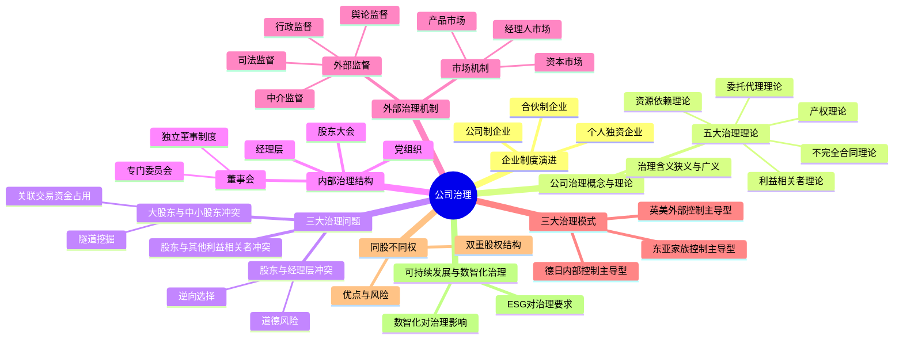

## 1. 章节定位

| 项目 | 信息 |
|------|------|
| 所属科目 | 公司战略与风险管理 |
| 难度等级 | 2 |
| 历年分值 | 3-5 分 |
| 建议学时 | 4-6 小时 |
| 知识关联章节 | 第4章战略实施（组织结构是治理载体）、第6章风险管理（治理是风控基础） |

## 2. 考情分析

本章聚焦公司治理的基本理论、治理结构与内外部治理机制，并延伸至同股不同权、可持续发展管理与数智化治理。历年分值约 3-5 分，以客观题为主，偶有简答题涉及治理问题辨识与机制设计。

**命题规律**：本章理论性强、概念密集，客观题集中在治理理论辨识、治理结构权责划分、三大治理模式对比、独立董事制度、同股不同权特征等知识点。主观题常以案例形式考查治理问题辨识（如委托代理冲突类型、隧道挖掘行为判断）及治理机制完善建议。

**高频考点分布**：

1. **企业制度演进**：个人独资企业、合伙制企业、公司制企业三类型的特征对比与优缺点。
2. **公司治理概念**：公司治理的广义与狭义理解，所有权与经营权分离是治理产生的根源。
3. **公司治理五大理论**：产权理论、委托代理理论、不完全合同理论、资源依赖理论、利益相关者理论的辨识与应用。
4. **三大治理问题**：股东与经理层的委托代理冲突（道德风险、逆向选择）、大股东与中小股东的隧道挖掘（关联交易、资金占用）、股东与其他利益相关者的冲突。
5. **内部治理结构**：股东大会（最高权力机构）、董事会（决策与监督）、经理层（执行）、党组织（政治核心）的权责划分；独立董事制度与董事会专门委员会。
6. **外部治理机制**：市场机制（产品市场、资本市场、经理人市场）与外部监督（行政、司法、中介、舆论监督）。
7. **三大治理模式**：英美外部控制主导型、德日内部控制主导型、东亚家族控制主导型的特征对比。
8. **同股不同权（双重股权结构）**：含义、优点（保持控制权稳定、利于长期决策）、风险（代理人风险加剧、中小股东权益受损）。
9. **可持续发展管理与公司治理**：ESG对治理结构优化、治理机制完善、信息披露质量提升的要求。
10. **数智化与公司治理**：数智化对治理效率、信息透明度、决策优化、外部治理机制赋能的影响。

**备考建议**：

- 用"问题导向"线索串联本章：所有权与经营权分离→产生委托代理问题→需要治理机制→内部治理（结构）+外部治理（市场与监督）；
- 三大治理模式用"股权结构"记忆：英美=股权分散+资本市场约束；德日=股权集中+银行主导；东亚=家族控股+内部人控制；
- 三大治理问题用"冲突双方"辨识：股东vs经理层（道德风险/逆向选择）、大股东vs中小股东（隧道挖掘）、股东vs其他利益相关者（特别是债权人、员工）。

## 3. 知识框架

## 4. 核心精讲

### 一、企业制度演进

公司治理问题的产生根源于企业制度的演进，特别是公司制企业中所有权与经营权的分离。

| 企业类型 | 特征 | 优点 | 缺点 |
|----------|------|------|------|
| **个人独资企业** | 由一个自然人投资，财产为投资人个人所有 | 设立简便；决策灵活；利润独享；无双重征税 | 难以筹集大额资金；无限责任；存续受限于投资人寿命 |
| **合伙制企业** | 两个或两个以上合伙人共同出资、共负盈亏 | 筹资能力增强；专业互补；税负较轻 | 合伙人承担无限连带责任（普通合伙人）；转让困难；存续不稳定 |
| **公司制企业** | 独立法人，所有权与经营权分离 | 有限责任；筹资能力强；存续稳定；股权可转让 | 设立程序复杂；存在代理成本；双重征税（公司所得税+股东个人所得税） |

> **记忆要点**：公司制企业是公司治理问题产生的制度基础——所有权与经营权分离导致委托代理关系出现，进而产生治理需求。

### 二、公司治理的概念

**公司治理**有狭义与广义两层含义：

| 层次 | 含义 | 关注焦点 |
|------|------|----------|
| **狭义公司治理** | 企业所有者（主要是股东）对经营者的一种监督与制衡机制 | 所有者与经营者的权利义务关系；通过制度安排合理配置所有者与经营者之间的权利与责任 |
| **广义公司治理** | 通过一套包括正式或非正式的内部或外部的制度或机制，来协调公司与所有利益相关者之间的利益关系 | 股东、债权人、供应商、雇员、政府、社区等所有利益相关者之间的利益关系 |

公司治理的**核心问题**：代理问题——在所有权与经营权分离的情况下，如何使拥有控制权的经营者为所有者的利益最大化服务。

### 三、公司治理理论

| 理论 | 核心观点 | 对治理的启示 |
|------|----------|-------------|
| **产权理论** | 产权是剩余索取权与剩余控制权的统一；私有产权的清晰界定是效率的前提 | 明晰产权是公司治理的基础；剩余索取权与剩余控制权应尽可能匹配 |
| **委托代理理论** | 所有权与经营权分离形成委托代理关系；由于信息不对称、契约不完全，代理人可能偏离委托人利益 | 需要通过激励约束机制（薪酬激励、监督机制）使代理人利益与委托人利益趋于一致 |
| **不完全合同理论** | 由于人的有限理性、交易成本的存在，契约总是不完全的；剩余控制权（产权）的配置至关重要 | 治理结构的设计应关注剩余控制权的合理配置，以应对契约未预见的情况 |
| **资源依赖理论** | 企业依赖外部环境获取资源；董事会是连接企业与外部资源的关键机制 | 董事会的构成应考虑获取外部资源的能力（如引入具有行业经验、政府关系、金融背景的董事） |
| **利益相关者理论** | 企业不仅要为股东服务，还要考虑债权人、员工、供应商、客户、社区等利益相关者的利益 | 治理目标应从"股东利益最大化"拓展为"利益相关者利益平衡"；治理结构应容纳利益相关者代表 |

> **记忆要点**：产权理论讲"基础"（产权清晰）；委托代理理论讲"问题"（代理人偏离）；不完全合同理论讲"配置"（剩余控制权）；资源依赖理论讲"资源"（董事会连接外部）；利益相关者理论讲"范围"（从股东到利益相关者）。

### 四、公司治理的三大问题

| 治理问题 | 冲突双方 | 主要表现 | 治理对策 |
|----------|----------|----------|----------|
| **委托代理问题（第一类代理问题）** | 股东 vs 经理层 | **道德风险**（经理层偷懒、在职消费、过度投资）；**逆向选择**（经理层隐瞒信息、操纵业绩） | 薪酬激励（股权激励、绩效奖金）；董事会监督；外部审计；经理人市场约束 |
| **隧道挖掘问题（第二类代理问题）** | 大股东 vs 中小股东 | 大股东通过**关联交易**转移利益；**资金占用**（大股东违规占用上市公司资金）；**利益输送**（低价转让资产、高价收购大股东资产） | 独立董事制度；关联交易披露与表决回避；累积投票制；中小股东权益保护机制 |
| **股东与其他利益相关者冲突** | 股东 vs 债权人/员工/社区等 | 股东通过高风险项目损害债权人利益；过度裁员损害员工利益；忽视环保损害社区利益 | 债权人保护条款（债务契约）；员工参与治理（职工董事）；社会责任与ESG披露 |

**隧道挖掘的常见手法**：

1. **关联交易**：大股东利用控制权，使上市公司与其关联方进行不公允的交易（如高价采购、低价销售）；
2. **资金占用**：大股东直接违规借用上市公司资金，长期不还；
3. **担保掏空**：上市公司为大股东及其关联方提供违规担保；
4. **资产置换**：以劣质资产置换上市公司的优质资产；
5. **现金股利政策操纵**：大股东在高分红年度套现，或在需要再融资时压低分红。

> **案例锚定**：中国资本市场早期隧道挖掘问题突出，如ST猴王、ST猴王集团占用上市公司资金；ST达尔曼大股东通过关联交易转移资产。近年来监管趋严，《公司法》《证券法》修订强化了中小股东保护。

### 五、内部治理结构

公司内部治理结构是通过"三会一层"（股东大会、董事会、监事会、经理层）的权责划分形成的制衡机制。中国上市公司治理结构中，党组织发挥政治核心作用。

#### （一）股东大会

股东大会是公司的**最高权力机构**，由全体股东组成。

| 职权类别 | 具体内容 |
|----------|----------|
| **决定类** | 决定公司的经营方针和投资计划；选举和更换非由职工代表担任的董事、监事；决定有关董事、监事的报酬事项 |
| **审批类** | 审议批准董事会、监事会的报告；审议批准公司的年度财务预算方案、决算方案；审议批准公司的利润分配方案和弥补亏损方案 |
| **决议类** | 对公司增加或者减少注册资本作出决议；对发行公司债券作出决议；对公司合并、分立、解散、清算或者变更公司形式作出决议；修改公司章程 |

**股东大会的表决机制**：

| 事项类型 | 表决要求 |
|----------|----------|
| 普通决议 | 出席会议股东所持表决权的**过半数**通过 |
| 特别决议 | 出席会议股东所持表决权的**三分之二以上**通过（修改章程、增减注册资本、合并分立解散等） |
| 关联交易表决 | 关联股东**回避表决**，由非关联股东表决 |
| 中小股东权益保护 | 单独或合计持股**3%以上**股东可提出临时提案；持股**10%以上**可请求召开临时股东大会 |

#### （二）董事会

董事会是股东大会选举产生的决策机构，对股东大会负责，是公司治理的**核心**。

| 职权类别 | 具体内容 |
|----------|----------|
| **执行类** | 召集股东大会；执行股东大会决议 |
| **决策类** | 决定公司的经营计划和投资方案；制订年度财务预算方案、决算方案、利润分配方案、弥补亏损方案；制订增减注册资本、发行债券方案；拟订合并分立解散方案 |
| **人事类** | 决定聘任或解聘公司经理及其报酬事项；根据经理提名，决定聘任或解聘副经理、财务负责人及其报酬事项 |
| **治理类** | 制定公司的基本管理制度 |

**董事会的构成**：

| 类别 | 含义 | 特点 |
|------|------|------|
| **内部董事（执行董事）** | 同时担任公司管理职务的董事 | 熟悉公司业务；但缺乏独立性 |
| **外部董事** | 不在公司担任管理职务的董事 | — |
| **独立董事** | 独立于公司股东且不在公司担任除董事外其他职务的外部董事 | 上市公司独立董事占比不低于**1/3**；至少包括一名会计专业人士 |

**独立董事的独立性要求**：不得与公司存在重大利益关系，具体包括：①最近一年内不在公司或其附属企业任职；②不直接或间接持有公司发行股份1%以上；③不是公司前10名股东；④不在与公司存在重大业务往来的单位任职等。

**董事会专门委员会**：上市公司董事会应设立以下专门委员会，其中审计、薪酬与考核、提名委员会中**独立董事应占多数**并担任召集人：

| 专门委员会 | 主要职责 |
|------------|----------|
| **审计委员会** | 监督内部审计制度及实施；审查财务信息及其披露；审查内控制度；提议聘请或更换外部审计机构 |
| **薪酬与考核委员会** | 制定董事及高管薪酬方案；制定考核标准并进行考核 |
| **提名委员会** | 研究董事、高管的选择标准和程序；广泛搜寻合格人选；对候选人进行审查并提出建议 |
| **战略与风险管理委员会** | 对公司长期发展战略规划、重大投资融资方案、风险管理制度进行研究和审议 |

#### （三）监事会

监事会是公司的**独立监督机构**，对股东大会负责，与董事会并行。

| 职权 | 内容 |
|------|------|
| **财务监督** | 检查公司财务 |
| **行为监督** | 对董事、高级管理人员执行职务的行为进行监督；对违反法律法规、公司章程或股东会决议的董事、高管提出罢免建议 |
| **纠正权** | 当董事、高管的行为损害公司利益时，要求予以纠正 |
| **提案权** | 提议召开临时股东大会；向股东大会提出提案 |
| **诉讼权** | 对董事、高管损害公司利益的行为，代表公司向人民法院提起诉讼 |

**监事会构成**：成员不少于3人，由股东代表和职工代表组成，其中**职工代表比例不低于1/3**。

#### （四）经理层

经理层是公司的**执行机构**，由董事会聘任或解聘，对董事会负责。

主要职权：主持公司的生产经营管理工作；组织实施董事会决议；组织实施公司年度经营计划和投资方案；拟订公司内部管理机构设置方案和基本管理制度；制定公司的具体规章；提请聘任或解聘副经理、财务负责人；决定聘任或解聘除应由董事会决定聘任或解聘以外的负责管理人员。

#### （五）党组织的政治核心作用

在中国特色现代企业制度下，党组织在公司治理中发挥**领导核心和政治核心作用**。国有企业重大经营管理事项须经党委会前置研究讨论后，再交由董事会决策。上市公司党建工作中，党组织发挥"把方向、管大局、保落实"的作用。

### 六、外部治理机制

外部治理机制通过市场机制和外部监督约束经营者和控股股东的行为。

#### （一）市场机制

| 市场类型 | 治理机制 | 作用方式 |
|----------|----------|----------|
| **产品市场** | 竞争压力 | 产品市场竞争激烈时，经营不善的企业会被淘汰；经营业绩差反映管理层能力不足，面临被解雇风险 |
| **资本市场** | 接管威胁与股价信号 | 经营业绩差导致股价下跌，可能引发恶意收购；股价表现与管理层薪酬挂钩（通过股权激励） |
| **经理人市场** | 声誉机制 | 职业经理人市场对管理者的声誉进行评估；业绩优秀者获得更高薪酬的职位；业绩差者被市场淘汰 |

#### （二）外部监督

| 监督类型 | 监督主体 | 主要内容 |
|----------|----------|----------|
| **行政监督** | 证券监管机构（证监会）、国资监管机构（国资委） | 审批核准、信息披露监管、违法违规查处、公司治理规范 |
| **司法监督** | 法院、检察院 | 通过民事诉讼（股东代表诉讼、证券欺诈赔偿）、刑事追究（内幕交易、操纵市场等罪名）维护各方权益 |
| **中介监督** | 会计师事务所、律师事务所、评级机构 | 外部审计对财务信息真实性的鉴证；法律意见书对合规性的判断；信用评级对偿债能力的评估 |
| **舆论监督** | 媒体、自媒体、分析师 | 揭露公司治理问题（如财务造假、关联交易）；引导公众关注；倒逼监管介入 |

> **案例锚定**：瑞幸咖啡财务造假案——浑水机构发布做空报告（中介/舆论监督）→ 针对性调查 → SEC处罚 → 退市。体现了外部监督链条的协同作用。

### 七、三大治理模式对比

| 维度 | 英美模式（外部控制主导型） | 德日模式（内部控制主导型） | 东亚模式（家族控制主导型） |
|------|---------------------------|---------------------------|---------------------------|
| **股权结构** | 股权分散，机构投资者为主 | 股权集中，银行和法人相互持股 | 家族控股，股权高度集中 |
| **治理核心** | 资本市场（外部控制） | 银行和法人股东（内部控制） | 家族控制（内部人控制） |
| **董事会特征** | 单层制，独立董事为主 | 双层制（监事会+董事会），职工参与 | 家族成员主导，独立性弱 |
| **监督机制** | 资本市场接管、外部审计、诉讼 | 银行监督、监事会监督 | 家族监督、关系网络 |
| **利益相关者** | 股东至上 | 兼顾员工、银行等利益相关者 | 家族利益优先 |
| **典型国家** | 美国、英国 | 德国、日本 | 韩国、新加坡、中国台湾等 |
| **优势** | 市场效率高；资源配置灵活；透明度高 | 长期关系稳定；抗收购能力强；兼顾利益相关者 | 决策效率高；长期导向；代理成本低 |
| **劣势** | 短期主义；易被恶意收购；代理成本高 | 市场流动性差；外部约束弱；透明度不足 | 中小股东权益受损；隧道挖掘风险；治理透明度低 |

### 八、同股不同权（双重股权结构）

**同股不同权**是指公司发行具有不同表决权的多类股份，通常表现为创始人/管理层持有高表决权股份（如B类股，每股10票或更多），公众投资者持有低表决权股份（如A类股，每股1票）。

| 要素 | 内容 |
|------|------|
| **结构特征** | 发行A类股（1股1票，公众持有）和B类股（1股多票，创始人/管理层持有） |
| **采用动因** | 保持创始团队控制权稳定；抵御恶意收购；支持长期战略决策；适应创新导向企业需要 |
| **适用场景** | 科技创新企业（需要长期投入、抵御短期主义）；创始人价值突出的企业 |

**双重股权结构的优点**：

1. **稳定控制权**：创始团队即使持股比例下降，仍能保持对公司的控制，利于长期战略实施；
2. **抵御恶意收购**：避免公司被恶意收购方夺取控制权；
3. **支持长期主义**：减少资本市场短期业绩压力，支持研发投入和创新；
4. **吸引人才**：可通过发行低表决权股份融资或用于股权激励，而不稀释控制权。

**双重股权结构的风险**：

1. **代理人风险加剧**：创始团队拥有超强控制权，外部股东监督能力被削弱，委托代理问题更为突出；
2. **中小股东权益受损**：创始团队可能利用控制权进行利益输送、关联交易等隧道挖掘行为；
3. **内部人控制**：缺乏有效制衡，决策失误的风险增大；
4. **治理透明度下降**：控制权集中导致信息披露质量可能下降。

**中国的实践**：科创板、创业板允许设置特别表决权（WVR）结构，但对持有主体资格、表决权差异比例（不超过10倍）、特殊事项一票一权等作出了限制，以平衡控制权稳定与中小股东保护。

### 九、可持续发展管理与公司治理

可持续发展管理以**ESG（环境Environmental、社会Social、治理Governance）**为核心，对公司治理提出了新要求。

| 治理影响 | 具体要求 |
|----------|----------|
| **优化公司治理结构** | 建立更加多元化的董事会，引入独立董事和职工董事；确保各利益相关者权益得到保障 |
| **完善公司治理机制** | 建立科学的决策机制、合理的内部控制机制、有效的监督机制；运营活动符合可持续发展要求 |
| **提升公司治理水平** | 促使内部治理更加规范、透明和高效；减少经营风险和法律、声誉风险 |
| **提高信息披露质量** | 及时、准确披露环境、社会和治理（ESG）方面的关键绩效指标；强化审计委员会对ESG信息披露的监督职责 |
| **推动公司治理国际化** | 适应国际市场竞争环境；满足国际消费者和国际供应链合作伙伴的要求；逐步提高治理标准 |

### 十、数智化与公司治理

**数智化**是数字化、智能化的深度融合，涵盖大数据、人工智能、移动互联网、云计算、物联网、区块链等现代前沿信息技术，驱动企业技术变革、组织变革、管理变革。

**数智化对公司治理的影响**：

| 影响维度 | 具体表现 |
|----------|----------|
| **提升治理效率** | 降低利益相关方获取信息的成本和门槛；调动市场各方参与公司治理的积极性；减少"搭便车"现象；延伸信息流通渠道 |
| **提高信息透明度** | 打破信息孤岛；降低信息不对称；区块链技术通过分布式记账提高信息质量；互联网和移动通信帮助投资者实时获取公司动态 |
| **优化企业决策** | 从经验判断转向数据驱动；数字化董事会流程提高决策质量；大数据分析和人工智能帮助把握市场趋势和客户需求 |
| **赋能外部治理机制** | 资本市场治理：数据精准治理、信息传播网络、治理主体多元化；产品市场治理：消费者和投资者参与监督；控制权市场治理：重塑内部权力分配格局 |

> **记忆要点**：数智化治理的四个关键词——**效率**（降低治理成本）、**透明**（打破信息不对称）、**决策**（数据驱动）、**赋能**（外部治理机制强化）。

## 5. 典型例题

**【例题 1】（单选题，治理理论辨识）**

下列关于公司治理理论的说法中，正确的是（ ）。
A. 产权理论认为剩余索取权与剩余控制权应当分离
B. 委托代理理论强调通过激励约束机制使代理人利益与委托人利益趋于一致
C. 不完全合同理论认为契约能够预见所有未来情况
D. 资源依赖理论认为董事会只是内部监督机构，与外部资源无关

**答案**：B

**解析**：A错误，产权理论认为产权是剩余索取权与剩余控制权的统一，两者应尽可能匹配，而非分离；C错误，不完全合同理论认为由于人的有限理性和交易成本，契约总是不完全的，无法预见所有情况；D错误，资源依赖理论认为董事会是连接企业与外部资源的关键机制，并非单纯的内部监督机构。B正确，委托代理理论的核心就是通过激励约束机制解决代理问题。

**【例题 2】（单选题，治理问题辨识）**

某上市公司大股东通过低价向其关联方转让公司优质资产的方式，将公司利益输送给自己。这种行为属于（ ）。
A. 道德风险
B. 逆向选择
C. 隧道挖掘
D. 内部人控制

**答案**：C

**解析**：大股东通过关联交易转移上市公司利益的行为属于隧道挖掘（第二类代理问题），是大股东对中小股东的利益侵害。道德风险和逆向选择是股东与经理层之间的委托代理问题（第一类代理问题）。内部人控制是经营层控制公司的现象，与本题大股东掏空行为的主体不同。

**【例题 3】（单选题，独立董事制度）**

根据我国上市公司治理要求，下列关于独立董事的说法中，正确的是（ ）。
A. 独立董事占比不得低于董事会成员的1/2
B. 独立董事中至少包括一名会计专业人士
C. 独立董事可以持有公司5%以上的股份
D. 审计委员会中独立董事应占少数

**答案**：B

**解析**：A错误，独立董事占比不得低于1/3；B正确，独立董事中至少包括一名会计专业人士；C错误，独立董事不得直接或间接持有公司发行股份1%以上；D错误，审计、薪酬与考核、提名委员会中独立董事应占多数并担任召集人。

**【例题 4】（单选题，治理模式辨识）**

某国公司治理的主要特征是：股权分散、机构投资者为主、资本市场接管是主要约束机制、董事会以独立董事为主。该国公司治理模式属于（ ）。
A. 德日模式
B. 英美模式
C. 东亚模式
D. 家族模式

**答案**：B

**解析**：股权分散、机构投资者为主、资本市场（接管威胁）是主要约束机制、单层制董事会且独立董事为主，这些都是英美模式（外部控制主导型）的典型特征。德日模式是股权集中、银行主导、双层制；东亚模式是家族控股、内部人控制。

**【例题 5】（多选题，双重股权结构）**

下列关于双重股权结构的表述中，正确的有（ ）。
A. 双重股权结构有利于保持创始团队的控制权稳定
B. 双重股权结构能够完全消除委托代理问题
C. 双重股权结构可能加剧代理人风险
D. 双重股权结构下中小股东的监督能力被削弱
E. 双重股权结构不利于公司进行长期战略投入

**答案**：ACD

**解析**：B错误，双重股权结构不能消除委托代理问题，反而可能加剧代理人风险；E错误，双重股权结构恰恰有利于长期战略投入（减少短期主义压力）。ACD均正确：A保持控制权稳定、C代理人风险加剧、D中小股东监督能力削弱。

**【例题 6】（多选题，外部治理机制）**

下列属于公司外部治理机制的有（ ）。
A. 产品市场竞争
B. 资本市场接管威胁
C. 经理人市场声誉机制
D. 独立董事制度
E. 证券监管机构的行政处罚

**答案**：ABCE

**解析**：D错误，独立董事制度属于内部治理结构（董事会构成），不是外部治理机制。ABCE均属于外部治理机制：ABC属于市场机制（产品市场、资本市场、经理人市场），E属于外部监督（行政监督）。

**【例题 7】（综合题，治理问题分析与机制完善）**

某创业板上市公司股权结构中，创始人甲及其一致行动人合计持股45%，为控股股东。近年来该公司出现以下情况：(1) 甲将其控制的另一家企业的产品以高于市场价30%的价格销售给上市公司；(2) 上市公司为甲控制的关联企业违规提供担保3亿元；(3) 公司独立董事仅占董事会成员的1/4，且审计委员会召集人由创始人甲的弟弟（非独立董事）担任；(4) 公司未按规定披露重大关联交易。

要求：(1) 指出该公司存在的公司治理问题；(2) 针对发现的问题提出完善建议。

**答案**：

(1) 该公司存在的治理问题：

- **隧道挖掘问题**：甲通过高价关联交易（情形1）和违规担保（情形2）将上市公司利益输送给自己及其关联方，侵害了中小股东权益，属于典型的大股东隧道挖掘行为；
- **独立董事制度不健全**：独立董事占比仅1/4，低于1/3的法定要求；审计委员会召集人由非独立董事（甲的弟弟）担任，违反"审计委员会中独立董事应占多数并担任召集人"的规定，且甲的弟弟作为关联方应当回避；
- **信息披露违规**：未按规定披露重大关联交易（情形4），违反了信息披露的真实性、完整性、及时性要求，损害了投资者的知情权；
- **内部控制失效**：违规担保能够发生，说明公司内部控制和风险管理制度存在重大缺陷。

(2) 完善建议：

- **加强关联交易管理**：建立关联交易公允性评估机制；严格执行关联股东表决回避制度；重大关联交易须经独立董事事前认可并提交股东大会审议；
- **完善独立董事制度**：将独立董事占比提高至1/3以上；选举会计专业人士担任独立董事；审计委员会召集人改由独立董事担任；保障独立董事的知情权和独立性；
- **强化信息披露**：严格按照《信息披露管理办法》披露关联交易、对外担保等重大事项；建立信息披露责任追究机制；
- **健全内部控制**：完善对外担保的审批流程和额度控制；加强内部审计力量；建立风险预警机制；
- **保护中小股东权益**：推行累积投票制选举董事；完善中小股东股东大会召集权和提案权；建立中小股东维权机制。

## 6. 记忆口诀

**治理理论五要点**：产权讲基础（剩余索取权与控制权匹配）；代理讲问题（激励约束）；合同讲配置（剩余控制权）；资源讲连接（董事会连外部）；相关讲范围（从股东到利益相关者）。

**三大治理问题**：股东vs经理层（道德风险+逆向选择）；大股东vs中小股东（隧道挖掘+关联交易）；股东vs利益相关者（债权人+员工+社区）。

**内部治理四机构**：股东大会（最高权力-决定类/审批类/决议类）；董事会（决策核心-内部董事+独立董事+专门委员会）；监事会（独立监督-财务监督+行为监督）；经理层（执行机构）。

**三大治理模式**：英美（股权分散+资本市场+独立董事）；德日（股权集中+银行主导+双层制）；东亚（家族控股+内部人控制）。

**双重股权结构**：优点（稳控制、防收购、支持长期、吸引人才）；风险（代理人风险加剧、中小股东受损、内部人控制、透明度下降）。

**数智化治理四影响**：效率（降成本、调动参与）；透明（破孤岛、降不对称）；决策（数据驱动、数字化流程）；赋能（资本市场+产品市场+控制权市场）。
