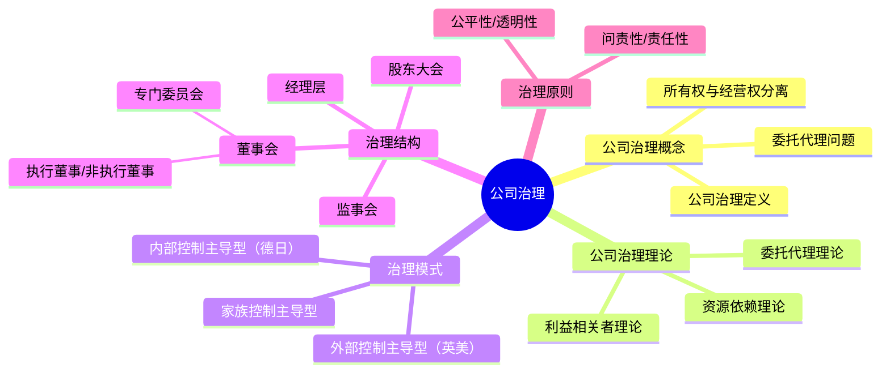

## 📍 章节定位

| 项目 | 信息 |
|------|------|
| **所属科目** | 🎯 公司战略与风险管理 |
| **难度等级** | ⭐⭐ |
| **历年分值** | 3-5分 |
| **建议学时** | 4-6h |
| **核心地位** | 战略与治理衔接章节，客观题为主 |

## 📝 考情分析

本章聚焦公司治理的基本理论和治理结构，历年分值约 3-5 分，以客观题为主，偶有简答题。

### 命题规律与重点考查趋势

近五年考查频率较高的考点分布如下：

| 考点 | 出题频次 | 题型偏好 | 难度 |
|------|----------|----------|------|
| 所有权与经营权分离 | ★★★★ | 单选 | 易 |
| 委托代理理论 | ★★★★ | 单选/多选 | 易 |
| 三大治理模式辨识 | ★★★★★ | 单选/案例 | 中 |
| 治理结构四机构权责 | ★★★★ | 多选/简答 | 中 |
| 董事会专门委员会 | ★★★★ | 多选 | 中 |
| 独立董事制度 | ★★★ | 单选 | 中 |
| OECD 公司治理原则 | ★★★ | 多选 | 中 |
| 利益相关者理论 | ★★ | 单选 | 易 |

### 命题热点

1. **治理模式辨识**：给定国家或企业特征判断属于哪种治理模式。命题陷阱：英美是"外部控制主导型"（股权分散、资本市场约束），德日是"内部控制主导型"（股权集中、银行主导），东亚是"家族控制主导型"。
2. **治理结构权责**：股东大会（最高权力）、董事会（决策与监督）、监事会（独立监督）、经理层（执行）的权责划分。
3. **专门委员会**：审计委员会、薪酬与考核委员会、提名委员会、战略与风险管理委员会的职能。
4. **独立董事制度**：上市公司独立董事占比不低于 1/3，专门委员会中独立董事占多数。

### 与前后章联系

- **承前**：本章承接第 1 章"权力与利益相关者"和第 4 章"战略实施"。公司治理是战略实施的组织保障。
- **启后**：本章的治理结构与第 6 章"风险管理"、第 7 章"内部控制"密切相关。审计委员会同时是内部控制和风险管理的重要组成。

### 学习方法建议

- **模式对比法**：将英美、德日、东亚三种治理模式成对对比记忆；
- **结构图示法**：绘制"股东会-董事会-监事会-经理层"的权责关系图；
- **案例锚定法**：以中国上市公司治理实践（如阿里合伙人制度、万科股权之争）加深理解。

## 🧠 知识框架

## 📖 核心精讲

### 一、公司治理的概念

#### （一）公司治理的起源

公司治理源于现代公司制度中**所有权与经营权分离**所产生的委托代理问题。股东（委托人）将经营权交给管理层（代理人），但二者利益可能不一致，导致代理人可能损害委托人利益。

**委托代理问题的具体表现**：

| 代理问题类型 | 含义 | 案例 |
|--------------|------|------|
| **道德风险** | 代理人努力程度不可观察，可能偷懒 | 管理层在职消费过度、消极决策 |
| **逆向选择** | 委托人无法完全了解代理人能力 | 聘任不合格高管 |
| **内部人控制** | 管理层实际控制公司，损害股东利益 | 国企高管滥用职权、关联交易 |
| **短期主义** | 管理层追求短期业绩，牺牲长期价值 | 削减研发投入粉饰业绩 |

#### （二）公司治理的定义

公司治理是通过一套正式或非正式的、内部或外部的制度或机制，协调公司与所有利益相关者之间的利益关系，确保公司决策科学化，最终维护各方利益。

公司治理的核心：在所有权与经营权分离的情况下，通过制度安排，解决委托代理问题，实现股东和其他利益相关者利益最大化。

**公司治理的广义与狭义之分**：

| 维度 | 狭义公司治理 | 广义公司治理 |
|------|-------------|-------------|
| 范围 | 股东与管理层关系 | 企业与所有利益相关者关系 |
| 核心 | 委托代理问题 | 协调多方利益 |
| 涉及主体 | 股东、董事会、管理层 | 股东、员工、客户、供应商、政府、社区等 |

### 二、公司治理理论

| 理论 | 核心观点 | 治理含义 |
|------|----------|----------|
| **委托代理理论** | 股东与管理层存在信息不对称和利益冲突，需通过激励和监督解决代理问题 | 建立激励机制（股权激励）和监督机制（董事会、监事会） |
| **利益相关者理论** | 企业不仅要对股东负责，还要对所有利益相关者（员工、客户、供应商、社区等）负责 | 治理结构需考虑多方利益，引入利益相关者代表 |
| **资源依赖理论** | 董事会是连接企业与外部关键资源的纽带，通过引入外部董事获取资源 | 引入外部董事、独立董事拓展资源网络 |

**委托代理理论的三个核心要素**：
- **信息不对称**：代理人掌握更多信息；
- **利益不一致**：委托人追求股东价值，代理人追求自身利益；
- **契约不完全**：无法穷尽所有情况，需通过治理机制补充。

**解决委托代理问题的两类机制**：

| 机制类型 | 具体方式 | 案例 |
|----------|----------|------|
| **激励机制（内在）** | 股权激励、绩效奖金、股票期权 | 华为全员持股、阿里合伙人股权激励 |
| **监督机制（外在）** | 董事会监督、监事会监督、外部审计、市场监管 | 上市公司独立董事制度、证监会监管 |

### 三、公司治理模式

| 治理模式 | 代表国家 | 股权结构 | 治理核心 | 银行角色 | 董事会结构 | 优点 | 缺点 |
|----------|----------|----------|----------|----------|-----------|------|------|
| **外部控制主导型** | 英美 | 股权分散 | 资本市场外部约束 | 不直接参与治理 | 外部董事为主 | 市场约束强、流动性好、透明度高 | 短期主义、易被恶意收购 |
| **内部控制主导型** | 德日 | 股权集中 | 内部股东直接监督 | 主银行深度参与 | 内部董事为主 | 注重长期、稳定、协同 | 缺乏外部市场约束、透明度低 |
| **家族控制主导型** | 东亚（韩国、东南亚、中国港台） | 家族控股 | 家族控制经营权 | 一般不参与 | 家族成员为主 | 决策快、凝聚力强、长期导向 | 外部人利益受损、治理透明度低、传承难 |

> 📌 **内部控制主导型治理模式**亦称"关系控制主导型治理模式""德日治理模式"，股权集中，股东可通过内部机制直接监督管理层。

**三种治理模式的对比案例**：

| 模式 | 典型企业 | 治理特征 |
|------|----------|----------|
| 外部控制主导型 | 苹果、微软 | 股权分散，机构投资者为主，独立董事占多数 |
| 内部控制主导型 | 丰田、西门子 | 主银行持股，法人交叉持股，内部董事为主 |
| 家族控制主导型 | 三星、李嘉诚长江实业 | 家族控股，家族成员担任高管 |

**中国上市公司的治理模式特点**：
- 股权相对集中（国有股或民营大股东为主）；
- 引入独立董事制度（≥1/3）；
- 监事会与董事会并存（双层制特点）；
- 实际控制人概念重要。

### 四、公司治理结构

公司治理结构是企业内部权力分配与制衡的制度安排：

| 治理机构 | 职权 | 定位 | 关键权限 |
|----------|------|------|----------|
| **股东大会** | 最高权力机构，决定重大事项 | 所有者代表 | 修改章程、增资减资、利润分配、董事监事选举、重大资产重组 |
| **董事会** | 决策机构，对股东大会负责 | 决策与监督 | 战略决策、聘任高管、年度预算、风险管理 |
| **监事会** | 监督机构，监督董事、高管履职 | 独立监督 | 财务监督、合规监督、提起诉讼 |
| **经理层** | 执行机构，组织实施董事会决议 | 经营管理 | 日常经营决策、组织实施年度经营计划 |

**股东大会的职权（部分）**：
- 决定公司的经营方针和投资计划；
- 选举和更换董事、监事，决定其报酬；
- 审议批准董事会、监事会报告；
- 审议批准公司年度财务预算、决算方案；
- 审议批准利润分配方案和弥补亏损方案；
- 对公司增减资、发行债券、合并分立等作出决议；
- 修改公司章程。

**董事会的专门委员会**：

| 委员会 | 主要职责 | 独立董事要求 |
|--------|----------|--------------|
| **审计委员会** | 监督财务报告和内部控制、外部审计 | 主任须为会计专业人士，独立董事占多数 |
| **薪酬与考核委员会** | 制定董事和高管薪酬方案 | 独立董事占多数 |
| **提名委员会** | 遴选董事和高管候选人 | 独立董事占多数 |
| **战略与风险管理委员会** | 审议战略规划和重大投资 | 至少 1 名独立董事 |

> 📌 **独立董事制度**：上市公司董事会中独立董事占比不低于 1/3，审计委员会、薪酬委员会、提名委员会中独立董事占多数。独立董事应当独立履行职责，不受上市公司主要股东、实际控制人或者其他利害关系人影响。

**独立董事的任职条件**：
- 具备上市公司运作基本知识，熟悉相关法律法规；
- 具有 5 年以上法律、经济、会计、金融等工作经验；
- 与公司、控股股东无利益关系（独立性要求）。

**案例锚定——中国公司治理实践**：

| 企业 | 治理特点 |
|------|----------|
| 阿里巴巴 | "合伙人制度"——合伙人有权提名简单多数董事，超越同股同权 |
| 腾讯 | 大股东南非报业（Naspers）长期持股，管理层高度自主 |
| 万科 | 股权分散，长期由管理层主导，2015-2017 年宝能系举牌引发控制权之争 |
| 国有企业 | 国资委代表国家行使股东权，董事会中外部董事占多数（央企外部董事 ≥1/2） |

### 五、公司治理原则（OECD原则）

OECD（经合组织）公司治理原则涵盖六个方面：

1. **确保有效公司治理框架的基础**：法律、监管和制度框架应透明、可执行；
2. **股东权利和关键所有权功能**：保护股东基本权利（登记过户、转让股份、获取信息、参加股东大会、投票表决、分享利润）；
3. **机构投资者、证券交易所和其他中介机构**：发挥市场参与者作用，促进治理；
4. **利益相关者的权利**：保护利益相关者合法权益，建立受损补偿机制；
5. **信息披露和透明度**：及时准确披露财务状况、经营成果、所有权结构和治理结构；
6. **董事会责任**：董事会对公司战略指导和对管理层有效监督，包括风险管理、薪酬、信息披露。

**信息披露的主要内容**：
- 财务状况和经营成果；
- 公司目标；
- 主要股份所有权和投票权；
- 董事、高管薪酬；
- 关联交易；
- 可预见风险因素；
- 治理结构和政策。

### 六、公司治理与内部控制、风险管理的关系

| 维度 | 公司治理 | 内部控制 | 风险管理 |
|------|----------|----------|----------|
| 范围 | 全公司治理结构和机制 | 经营活动的合规和效率 | 风险识别、评估和应对 |
| 重点 | 权力制衡和决策科学 | 控制目标和控制活动 | 风险偏好和风险应对 |
| 主导机构 | 董事会 | 管理层 | 董事会风险管理委员会 |
| 框架 | OECD 原则 | COSO 内部控制框架 | COSO 企业风险管理框架 |

**三者关系**：公司治理是顶层设计，内部控制是基础保障，风险管理是核心机制。三者共同构成企业的治理与风险防控体系。审计委员会同时是公司治理、内部控制、风险管理的重要交汇点。

### 七、公司治理的评价与改进

**公司治理评价的维度**：

| 评价维度 | 关键指标 |
|----------|----------|
| **股东权益保护** | 股东大会出席率、中小股东参与度、累积投票制实施 |
| **治理结构完整性** | 董事会构成、专门委员会设置、监事会运作 |
| **信息披露质量** | 信息披露及时性、完整性、真实性、自愿性披露程度 |
| **利益相关者保护** | 员工权益、客户权益、供应商权益、社会责任履行 |
| **治理效率** | 决策效率、执行效率、监督效率 |

**中国上市公司治理评价指标体系（南开治理指数）**：

| 一级指标 | 二级指标示例 |
|----------|-------------|
| 股东治理 | 关联交易、独立性、中小股东权益 |
| 董事会治理 | 董事会构成、运作、薪酬、独立性 |
| 监事会治理 | 监事会规模、构成、运作 |
| 经理层治理 | 任职资格、薪酬、考核、激励 |
| 信息披露 | 真实性、及时性、完整性 |
| 利益相关者治理 | 员工、客户、供应商、社会责任 |

### 八、董事会秘书制度

**董事会秘书**是上市公司的高级管理人员，主要职责包括：
- 负责公司股东大会和董事会会议的筹备；
- 负责信息披露事务；
- 负责投资者关系管理；
- 负责公司治理相关事务；
- 协助董事会行使职权。

### 九、高管薪酬与股权激励

**高管薪酬的构成**：

| 薪酬构成 | 性质 | 案例 |
|----------|------|------|
| 基本年薪 | 固定薪酬，保障基本生活 | CEO 年薪 200 万元 |
| 绩效奖金 | 浮动薪酬，与短期业绩挂钩 | 与年度利润挂钩的奖金 |
| 股权激励 | 长期激励，与公司价值绑定 | 股票期权、限制性股票、员工持股计划 |
| 福利待遇 | 补充福利 | 补充养老金、医疗保险 |

**股权激励的常见模式**：

| 模式 | 含义 | 案例 |
|------|------|------|
| **股票期权** | 给予高管以约定价格购买公司股票的权利 | 阿里、腾讯高管期权 |
| **限制性股票** | 给予高管股票，但需满足服务期或业绩条件 | 华为员工持股（虚拟受限股） |
| **员工持股计划（ESOP）** | 员工通过持股平台持有公司股票 | 华为投资控股全员持股 |
| **股票增值权** | 高管享有股价增值部分，不实际持有股票 | 部分国企高管激励 |

**股权激励的治理意义**：
- 解决委托代理问题，使管理层与股东利益一致；
- 长期激励，避免短期主义；
- 吸引和留住核心人才；
- 提升公司价值。

### 十、中国公司治理的法律法规体系

| 层级 | 法律法规 | 主要内容 |
|------|----------|----------|
| 法律 | 《公司法》《证券法》 | 公司组织形式、股东权利、信息披露 |
| 行政法规 | 《股票发行与交易管理暂行条例》 | 上市公司治理要求 |
| 部门规章 | 证监会《上市公司治理准则》《上市公司章程指引》 | 治理结构、运作规范 |
| 自律规则 | 交易所《上市规则》《上市公司规范运作指引》 | 上市后的治理要求 |
| 公司内部 | 公司章程、治理制度 | 公司治理具体规则 |

### 十一、公司治理的常见问题与改进

**中国上市公司治理的常见问题**：

| 问题类型 | 具体表现 | 改进建议 |
|----------|----------|----------|
| **大股东"掏空"行为** | 关联交易、资金占用、违规担保 | 完善关联交易决策程序、独立董事审核、信息披露 |
| **内部人控制** | 管理层实际控制公司，股东会形同虚设 | 强化董事会独立性、引入战略投资者、股权激励 |
| **信息披露不规范** | 选择性披露、延迟披露、虚假陈述 | 完善信息披露制度、强化董秘责任、监管处罚 |
| **独立董事"不独立"** | 独立董事沦为"花瓶"，不敢发表独立意见 | 改进独立董事提名机制、强化独立董事责任 |
| **监事会功能虚化** | 监事会缺乏独立性和专业性 | 提升监事专业能力、引入外部监事 |
| **决策与执行不分** | 董事长兼任总经理，权力过度集中 | 董事长与总经理分设 |

### 十二、ESG 与公司治理

ESG（环境 Environment、社会 Social、治理 Governance）是近年公司治理领域的热点，强调企业在环境、社会、治理三方面的可持续发展表现。

| 维度 | 关注点 | 案例 |
|------|--------|------|
| **E（环境）** | 碳排放、能源消耗、污染治理、资源利用 | 比亚迪新能源汽车、隆基绿能 |
| **S（社会）** | 员工权益、产品质量、社区关系、社会责任 | 腾讯公益、阿里巴巴乡村振兴 |
| **G（治理）** | 董事会独立性、股东权益、信息披露、反腐败 | 上市公司治理评级 |

**ESG 与公司治理的关系**：
- ESG 中的 G（治理）即为公司治理，是 ESG 的核心；
- 良好的公司治理是 ESG 落地的组织保障；
- ESG 评级已成为投资者评估企业可持续发展能力的重要依据；
- 监管机构推动上市公司 ESG 信息披露（如证监会、交易所要求披露 ESG 报告）。

## 💡 典型例题

**【例题 1】（单选题，治理模式辨识）**

下列关于公司治理模式的表述，正确的是（ ）。
A. 英美模式以内部控制为主导
B. 德日模式股权分散
C. 东亚家族模式以家族控制为特征
D. 外部控制主导型注重长期稳定

**答案**：C

**解析**：A 错误，英美模式以外部控制主导；B 错误，德日模式股权集中；D 错误，外部控制主导型容易导致短期主义。东亚家族模式以家族控制为特征，决策快但治理透明度低。

**【例题 2】（单选题，委托代理理论）**

下列属于委托代理问题表现的是（ ）。
A. 股东通过股东大会选举董事
B. 管理层在职消费过度，损害股东利益
C. 监事会对董事履职进行监督
D. 独立董事对重大关联交易发表独立意见

**答案**：B

**解析**：委托代理问题是代理人（管理层）可能损害委托人（股东）利益的现象。B "管理层在职消费过度"是典型的道德风险表现。A、C、D 都是治理机制（应对代理问题的措施），不是代理问题本身。

**【例题 3】（多选题，董事会专门委员会）**

下列属于上市公司董事会专门委员会的有（ ）。
A. 审计委员会
B. 薪酬与考核委员会
C. 提名委员会
D. 战略与风险管理委员会
E. 风险控制委员会

**答案**：ABCD

**解析**：上市公司董事会通常设四个专门委员会：审计委员会、薪酬与考核委员会、提名委员会、战略与风险管理委员会。E 风险控制委员会不在标准四个委员会之列（部分企业自设，但非标准）。

**【例题 4】（多选题，独立董事制度）**

关于上市公司独立董事制度，下列说法正确的有（ ）。
A. 独立董事占比不低于 1/3
B. 审计委员会中独立董事应占多数
C. 提名委员会中独立董事应占多数
D. 独立董事应当独立履行职责，不受主要股东影响
E. 独立董事可以同时在 5 家以上上市公司任职

**答案**：ABCD

**解析**：A、B、C、D 都是独立董事制度的要求。E 错误，独立董事原则上最多同时在 3 家境内上市公司担任独立董事（不能在 5 家以上）。

**【例题 5】（单选题，公司治理理论）**

"企业不仅要对股东负责，还要对员工、客户、供应商、社区等利益相关者负责"这一观点属于（ ）。
A. 委托代理理论
B. 利益相关者理论
C. 资源依赖理论
D. 交易成本理论

**答案**：B

**解析**：利益相关者理论认为企业应对所有利益相关者负责，而非仅股东。委托代理理论关注股东与管理层关系；资源依赖理论关注董事会与外部资源关系；交易成本理论不属于公司治理三大理论。

**【例题 6】（综合题，治理结构分析与改进）**

某上市公司治理结构存在以下问题：(1) 董事会成员 7 人，其中独立董事 2 人；(2) 审计委员会主任由财务总监兼任；(3) 总经理兼任董事长；(4) 监事会成员 3 人，其中 2 人为职工代表，1 人为大股东派驻的财务人员。

要求：分析该公司治理结构存在的问题并提出改进建议。

**答案**：

| 问题 | 违反要求 | 改进建议 |
|------|----------|----------|
| 独立董事仅 2 人，占比 2/7=28.6% | 独立董事占比应不低于 1/3（≥33.3%） | 增加独立董事至 3 人，使占比达 3/8=37.5% |
| 审计委员会主任由财务总监兼任 | 审计委员会主任须为会计专业人士且独立董事担任 | 改由具备会计专业背景的独立董事担任审计委员会主任 |
| 总经理兼任董事长 | 决策权与执行权应分离，避免权力过度集中 | 董事长与总经理分设，由不同人员担任 |
| 监事会中 1 名为大股东派驻财务人员 | 监事应独立，大股东派驻财务人员缺乏独立性 | 改由独立监事担任，或由中小股东提名监事 |

**解析**：本题综合考查公司治理结构的具体要求。关键点：①独立董事占比 ≥1/3；②审计委员会独立董事占多数且主任为会计专业人士；③董事长与总经理原则上分设；④监事会独立性要求。改进建议应针对每个问题提出具体可操作的方案。

**【例题 7】（简答题，OECD 公司治理原则）**

简述 OECD 公司治理原则的六个方面，并说明信息披露的主要内容。

**答案**：

OECD 公司治理原则的六个方面：
1. 确保有效公司治理框架的基础（法律、监管和制度框架）；
2. 股东权利和关键所有权功能（保护股东基本权利）；
3. 机构投资者、证券交易所和其他中介机构（发挥市场参与者作用）；
4. 利益相关者的权利（保护利益相关者合法权益）；
5. 信息披露和透明度（及时准确披露财务状况、经营成果、所有权结构和治理结构）；
6. 董事会责任（战略指导和管理层监督）。

信息披露的主要内容包括：
- 财务状况和经营成果；
- 公司目标；
- 主要股份所有权和投票权；
- 董事、高管薪酬；
- 关联交易；
- 可预见风险因素；
- 治理结构和政策。

**解析**：本题考查 OECD 六原则的完整记忆和信息披露七要素的精确列举。记忆口诀："框股机利信董"+"财目股薪关风治"。

**【例题 8】（单选题，股权激励）**

某公司向高管授予股票期权，约定高管在服务期满 4 年后可以约定价格购买公司股票。该股权激励的主要治理意义是（ ）。
A. 提高高管基本薪酬水平
B. 解决委托代理问题，使高管与股东利益一致
C. 增加公司当期现金流出
D. 降低公司税负

**答案**：B

**解析**：股权激励的核心治理意义是解决委托代理问题，使管理层与股东利益一致，避免短期主义。A 错误，股权激励不是基本薪酬；C 错误，股票期权行权前不产生现金流出；D 不是主要治理意义。

## 🎯 记忆口诀

- **治理三模式**："英（英美）外（外部控制）德（德日）内（内部控制）家（家族）控"——英美股权分散+市场约束；德日股权集中+银行参与；东亚家族控股+家族经营。
- **委托代理四问题**："道（道德风险）逆（逆向选择）内（内部人控制）短（短期主义）"——代理人可能偷懒、不胜任、控制公司、追求短期。
- **治理三理论**："委（委托代理）利（利益相关者）资（资源依赖）"——代理问题、多方利益、外部资源。
- **治理结构四机构**："股（股东会）董（董事会）监（监事会）经（经理层）"——权力递减、互相制衡。股东会最高权、董事会决策监督、监事会独立监督、经理层执行。
- **四专门委员会**："审（审计）薪（薪酬）提（提名）战（战略）"——审计主任须会计专业独立董事，前三个独立董事占多数。
- **独立董事核心**："占比三分之一，专门委员会占多数"。
- **OECD 六原则**："框（框架）股（股东）机（机构）利（利益相关者）信（信息披露）董（董事会）"。
- **信息披露七内容**："财目股薪关风治"——财务、目标、股权、薪酬、关联交易、风险、治理结构。
- **治理内控风险三者关系**："治理顶层、内控基础、风险核心"——审计委员会是三者交汇点。

## ✅ 同步练习

**1. [单选]** 公司治理的核心问题是（ ）。
A. 提高企业盈利能力  B. 解决委托代理问题  C. 扩大市场份额  D. 降低生产成本

**2. [多选]** 上市公司董事会专门委员会包括（ ）。
A. 审计委员会  B. 薪酬与考核委员会  C. 提名委员会  D. 战略与风险管理委员会

**3. [多选]** 下列属于公司治理理论的有（ ）。
A. 委托代理理论  B. 利益相关者理论  C. 资源依赖理论  D. 价值链理论

**4. [简答]** 简述公司治理结构中股东大会、董事会、监事会、经理层的各自定位。

**5. [案例分析]** 某上市公司董事会成员全部由公司高管担任，无独立董事，审计委员会由财务总监兼任主任。请分析该公司治理结构存在的问题并提出改进建议。

> 参考答案：1.B  2.ABCD  3.ABC  4.见核心精讲"公司治理结构"  5.问题：①董事会全部由高管担任，缺乏独立性；②无独立董事，违反上市公司治理要求；③审计委员会由财务总监兼任，缺乏独立性。建议：①引入独立董事，占比不低于1/3；②审计委员会主任应由独立董事担任，且会计专业人士；③各专门委员会中独立董事应占多数；④实现决策权与执行权分离。
