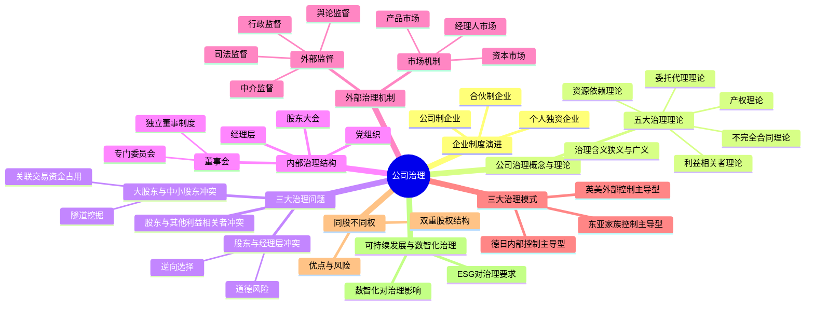

## 1. 章节定位

| 项目 | 信息 |
|------|------|
| 所属科目 | 公司战略与风险管理 |
| 难度等级 | 2 |
| 历年分值 | 3-5 分 |
| 建议学时 | 4-6 小时 |
| 知识关联章节 | 第4章战略实施（组织结构是治理载体）、第6章风险管理（治理是风控基础） |

## 2. 考情分析

本章聚焦公司治理的基本理论、治理结构与内外部治理机制，并延伸至同股不同权、可持续发展管理与数智化治理。历年分值约 3-5 分，以客观题为主，偶有简答题涉及治理问题辨识与机制设计。

**命题规律**：本章理论性强、概念密集，客观题集中在治理理论辨识、治理结构权责划分、三大治理模式对比、独立董事制度、同股不同权特征等知识点。主观题常以案例形式考查治理问题辨识（如委托代理冲突类型、隧道挖掘行为判断）及治理机制完善建议。

**高频考点分布**：

1. **企业制度演进**：个人独资企业、合伙制企业、公司制企业三类型的特征对比与优缺点。
2. **公司治理概念**：公司治理的广义与狭义理解，所有权与经营权分离是治理产生的根源。
3. **公司治理五大理论**：产权理论、委托代理理论、不完全合同理论、资源依赖理论、利益相关者理论的辨识与应用。
4. **三大治理问题**：股东与经理层的委托代理冲突（道德风险、逆向选择）、大股东与中小股东的隧道挖掘（关联交易、资金占用）、股东与其他利益相关者的冲突。
5. **内部治理结构**：股东大会（最高权力机构）、董事会（决策与监督）、经理层（执行）、党组织（政治核心）的权责划分；独立董事制度与董事会专门委员会。
6. **外部治理机制**：市场机制（产品市场、资本市场、经理人市场）与外部监督（行政、司法、中介、舆论监督）。
7. **三大治理模式**：英美外部控制主导型、德日内部控制主导型、东亚家族控制主导型的特征对比。
8. **同股不同权（双重股权结构）**：含义、优点（保持控制权稳定、利于长期决策）、风险（代理人风险加剧、中小股东权益受损）。
9. **可持续发展管理与公司治理**：ESG对治理结构优化、治理机制完善、信息披露质量提升的要求。
10. **数智化与公司治理**：数智化对治理效率、信息透明度、决策优化、外部治理机制赋能的影响。

**备考建议**：

- 用"问题导向"线索串联本章：所有权与经营权分离→产生委托代理问题→需要治理机制→内部治理（结构）+外部治理（市场与监督）；
- 三大治理模式用"股权结构"记忆：英美=股权分散+资本市场约束；德日=股权集中+银行主导；东亚=家族控股+内部人控制；
- 三大治理问题用"冲突双方"辨识：股东vs经理层（道德风险/逆向选择）、大股东vs中小股东（隧道挖掘）、股东vs其他利益相关者（特别是债权人、员工）。

## 3. 知识框架

## 4. 核心精讲

### 一、企业制度演进

公司治理问题的产生根源于企业制度的演进，特别是公司制企业中所有权与经营权的分离。

| 企业类型 | 特征 | 优点 | 缺点 |
|----------|------|------|------|
| **个人独资企业** | 由一个自然人投资，财产为投资人个人所有 | 设立简便；决策灵活；利润独享；无双重征税 | 难以筹集大额资金；无限责任；存续受限于投资人寿命 |
| **合伙制企业** | 两个或两个以上合伙人共同出资、共负盈亏 | 筹资能力增强；专业互补；税负较轻 | 合伙人承担无限连带责任（普通合伙人）；转让困难；存续不稳定 |
| **公司制企业** | 独立法人，所有权与经营权分离 | 有限责任；筹资能力强；存续稳定；股权可转让 | 设立程序复杂；存在代理成本；双重征税（公司所得税+股东个人所得税） |

> **记忆要点**：公司制企业是公司治理问题产生的制度基础——所有权与经营权分离导致委托代理关系出现，进而产生治理需求。

### 二、公司治理的概念

**公司治理**有狭义与广义两层含义：

| 层次 | 含义 | 关注焦点 |
|------|------|----------|
| **狭义公司治理** | 企业所有者（主要是股东）对经营者的一种监督与制衡机制 | 所有者与经营者的权利义务关系；通过制度安排合理配置所有者与经营者之间的权利与责任 |
| **广义公司治理** | 通过一套包括正式或非正式的内部或外部的制度或机制，来协调公司与所有利益相关者之间的利益关系 | 股东、债权人、供应商、雇员、政府、社区等所有利益相关者之间的利益关系 |

公司治理的**核心问题**：代理问题——在所有权与经营权分离的情况下，如何使拥有控制权的经营者为所有者的利益最大化服务。

### 三、公司治理理论

| 理论 | 核心观点 | 对治理的启示 |
|------|----------|-------------|
| **产权理论** | 产权是剩余索取权与剩余控制权的统一；私有产权的清晰界定是效率的前提 | 明晰产权是公司治理的基础；剩余索取权与剩余控制权应尽可能匹配 |
| **委托代理理论** | 所有权与经营权分离形成委托代理关系；由于信息不对称、契约不完全，代理人可能偏离委托人利益 | 需要通过激励约束机制（薪酬激励、监督机制）使代理人利益与委托人利益趋于一致 |
| **不完全合同理论** | 由于人的有限理性、交易成本的存在，契约总是不完全的；剩余控制权（产权）的配置至关重要 | 治理结构的设计应关注剩余控制权的合理配置，以应对契约未预见的情况 |
| **资源依赖理论** | 企业依赖外部环境获取资源；董事会是连接企业与外部资源的关键机制 | 董事会的构成应考虑获取外部资源的能力（如引入具有行业经验、政府关系、金融背景的董事） |
| **利益相关者理论** | 企业不仅要为股东服务，还要考虑债权人、员工、供应商、客户、社区等利益相关者的利益 | 治理目标应从"股东利益最大化"拓展为"利益相关者利益平衡"；治理结构应容纳利益相关者代表 |

> **记忆要点**：产权理论讲"基础"（产权清晰）；委托代理理论讲"问题"（代理人偏离）；不完全合同理论讲"配置"（剩余控制权）；资源依赖理论讲"资源"（董事会连接外部）；利益相关者理论讲"范围"（从股东到利益相关者）。

### 四、公司治理的三大问题

| 治理问题 | 冲突双方 | 主要表现 | 治理对策 |
|----------|----------|----------|----------|
| **委托代理问题（第一类代理问题）** | 股东 vs 经理层 | **道德风险**（经理层偷懒、在职消费、过度投资）；**逆向选择**（经理层隐瞒信息、操纵业绩） | 薪酬激励（股权激励、绩效奖金）；董事会监督；外部审计；经理人市场约束 |
| **隧道挖掘问题（第二类代理问题）** | 大股东 vs 中小股东 | 大股东通过**关联交易**转移利益；**资金占用**（大股东违规占用上市公司资金）；**利益输送**（低价转让资产、高价收购大股东资产） | 独立董事制度；关联交易披露与表决回避；累积投票制；中小股东权益保护机制 |
| **股东与其他利益相关者冲突** | 股东 vs 债权人/员工/社区等 | 股东通过高风险项目损害债权人利益；过度裁员损害员工利益；忽视环保损害社区利益 | 债权人保护条款（债务契约）；员工参与治理（职工董事）；社会责任与ESG披露 |

**隧道挖掘的常见手法**：

1. **关联交易**：大股东利用控制权，使上市公司与其关联方进行不公允的交易（如高价采购、低价销售）；
2. **资金占用**：大股东直接违规借用上市公司资金，长期不还；
3. **担保掏空**：上市公司为大股东及其关联方提供违规担保；
4. **资产置换**：以劣质资产置换上市公司的优质资产；
5. **现金股利政策操纵**：大股东在高分红年度套现，或在需要再融资时压低分红。

> **案例锚定**：中国资本市场早期隧道挖掘问题突出，如ST猴王、ST猴王集团占用上市公司资金；ST达尔曼大股东通过关联交易转移资产。近年来监管趋严，《公司法》《证券法》修订强化了中小股东保护。

### 五、内部治理结构

公司内部治理结构是通过"三会一层"（股东大会、董事会、监事会、经理层）的权责划分形成的制衡机制。中国上市公司治理结构中，党组织发挥政治核心作用。

#### （一）股东大会

股东大会是公司的**最高权力机构**，由全体股东组成。

| 职权类别 | 具体内容 |
|----------|----------|
| **决定类** | 决定公司的经营方针和投资计划；选举和更换非由职工代表担任的董事、监事；决定有关董事、监事的报酬事项 |
| **审批类** | 审议批准董事会、监事会的报告；审议批准公司的年度财务预算方案、决算方案；审议批准公司的利润分配方案和弥补亏损方案 |
| **决议类** | 对公司增加或者减少注册资本作出决议；对发行公司债券作出决议；对公司合并、分立、解散、清算或者变更公司形式作出决议；修改公司章程 |

**股东大会的表决机制**：

| 事项类型 | 表决要求 |
|----------|----------|
| 普通决议 | 出席会议股东所持表决权的**过半数**通过 |
| 特别决议 | 出席会议股东所持表决权的**三分之二以上**通过（修改章程、增减注册资本、合并分立解散等） |
| 关联交易表决 | 关联股东**回避表决**，由非关联股东表决 |
| 中小股东权益保护 | 单独或合计持股**3%以上**股东可提出临时提案；持股**10%以上**可请求召开临时股东大会 |

#### （二）董事会

董事会是股东大会选举产生的决策机构，对股东大会负责，是公司治理的**核心**。

| 职权类别 | 具体内容 |
|----------|----------|
| **执行类** | 召集股东大会；执行股东大会决议 |
| **决策类** | 决定公司的经营计划和投资方案；制订年度财务预算方案、决算方案、利润分配方案、弥补亏损方案；制订增减注册资本、发行债券方案；拟订合并分立解散方案 |
| **人事类** | 决定聘任或解聘公司经理及其报酬事项；根据经理提名，决定聘任或解聘副经理、财务负责人及其报酬事项 |
| **治理类** | 制定公司的基本管理制度 |

**董事会的构成**：

| 类别 | 含义 | 特点 |
|------|------|------|
| **内部董事（执行董事）** | 同时担任公司管理职务的董事 | 熟悉公司业务；但缺乏独立性 |
| **外部董事** | 不在公司担任管理职务的董事 | — |
| **独立董事** | 独立于公司股东且不在公司担任除董事外其他职务的外部董事 | 上市公司独立董事占比不低于**1/3**；至少包括一名会计专业人士 |

**独立董事的独立性要求**：不得与公司存在重大利益关系，具体包括：①最近一年内不在公司或其附属企业任职；②不直接或间接持有公司发行股份1%以上；③不是公司前10名股东；④不在与公司存在重大业务往来的单位任职等。

**董事会专门委员会**：上市公司董事会应设立以下专门委员会，其中审计、薪酬与考核、提名委员会中**独立董事应占多数**并担任召集人：

| 专门委员会 | 主要职责 |
|------------|----------|
| **审计委员会** | 监督内部审计制度及实施；审查财务信息及其披露；审查内控制度；提议聘请或更换外部审计机构 |
| **薪酬与考核委员会** | 制定董事及高管薪酬方案；制定考核标准并进行考核 |
| **提名委员会** | 研究董事、高管的选择标准和程序；广泛搜寻合格人选；对候选人进行审查并提出建议 |
| **战略与风险管理委员会** | 对公司长期发展战略规划、重大投资融资方案、风险管理制度进行研究和审议 |

#### （三）监事会

监事会是公司的**独立监督机构**，对股东大会负责，与董事会并行。

| 职权 | 内容 |
|------|------|
| **财务监督** | 检查公司财务 |
| **行为监督** | 对董事、高级管理人员执行职务的行为进行监督；对违反法律法规、公司章程或股东会决议的董事、高管提出罢免建议 |
| **纠正权** | 当董事、高管的行为损害公司利益时，要求予以纠正 |
| **提案权** | 提议召开临时股东大会；向股东大会提出提案 |
| **诉讼权** | 对董事、高管损害公司利益的行为，代表公司向人民法院提起诉讼 |

**监事会构成**：成员不少于3人，由股东代表和职工代表组成，其中**职工代表比例不低于1/3**。

#### （四）经理层

经理层是公司的**执行机构**，由董事会聘任或解聘，对董事会负责。

主要职权：主持公司的生产经营管理工作；组织实施董事会决议；组织实施公司年度经营计划和投资方案；拟订公司内部管理机构设置方案和基本管理制度；制定公司的具体规章；提请聘任或解聘副经理、财务负责人；决定聘任或解聘除应由董事会决定聘任或解聘以外的负责管理人员。

#### （五）党组织的政治核心作用

在中国特色现代企业制度下，党组织在公司治理中发挥**领导核心和政治核心作用**。国有企业重大经营管理事项须经党委会前置研究讨论后，再交由董事会决策。上市公司党建工作中，党组织发挥"把方向、管大局、保落实"的作用。

### 六、外部治理机制

外部治理机制通过市场机制和外部监督约束经营者和控股股东的行为。

#### （一）市场机制

| 市场类型 | 治理机制 | 作用方式 |
|----------|----------|----------|
| **产品市场** | 竞争压力 | 产品市场竞争激烈时，经营不善的企业会被淘汰；经营业绩差反映管理层能力不足，面临被解雇风险 |
| **资本市场** | 接管威胁与股价信号 | 经营业绩差导致股价下跌，可能引发恶意收购；股价表现与管理层薪酬挂钩（通过股权激励） |
| **经理人市场** | 声誉机制 | 职业经理人市场对管理者的声誉进行评估；业绩优秀者获得更高薪酬的职位；业绩差者被市场淘汰 |

#### （二）外部监督

| 监督类型 | 监督主体 | 主要内容 |
|----------|----------|----------|
| **行政监督** | 证券监管机构（证监会）、国资监管机构（国资委） | 审批核准、信息披露监管、违法违规查处、公司治理规范 |
| **司法监督** | 法院、检察院 | 通过民事诉讼（股东代表诉讼、证券欺诈赔偿）、刑事追究（内幕交易、操纵市场等罪名）维护各方权益 |
| **中介监督** | 会计师事务所、律师事务所、评级机构 | 外部审计对财务信息真实性的鉴证；法律意见书对合规性的判断；信用评级对偿债能力的评估 |
| **舆论监督** | 媒体、自媒体、分析师 | 揭露公司治理问题（如财务造假、关联交易）；引导公众关注；倒逼监管介入 |

> **案例锚定**：瑞幸咖啡财务造假案——浑水机构发布做空报告（中介/舆论监督）→ 针对性调查 → SEC处罚 → 退市。体现了外部监督链条的协同作用。

### 七、三大治理模式对比

| 维度 | 英美模式（外部控制主导型） | 德日模式（内部控制主导型） | 东亚模式（家族控制主导型） |
|------|---------------------------|---------------------------|---------------------------|
| **股权结构** | 股权分散，机构投资者为主 | 股权集中，银行和法人相互持股 | 家族控股，股权高度集中 |
| **治理核心** | 资本市场（外部控制） | 银行和法人股东（内部控制） | 家族控制（内部人控制） |
| **董事会特征** | 单层制，独立董事为主 | 双层制（监事会+董事会），职工参与 | 家族成员主导，独立性弱 |
| **监督机制** | 资本市场接管、外部审计、诉讼 | 银行监督、监事会监督 | 家族监督、关系网络 |
| **利益相关者** | 股东至上 | 兼顾员工、银行等利益相关者 | 家族利益优先 |
| **典型国家** | 美国、英国 | 德国、日本 | 韩国、新加坡、中国台湾等 |
| **优势** | 市场效率高；资源配置灵活；透明度高 | 长期关系稳定；抗收购能力强；兼顾利益相关者 | 决策效率高；长期导向；代理成本低 |
| **劣势** | 短期主义；易被恶意收购；代理成本高 | 市场流动性差；外部约束弱；透明度不足 | 中小股东权益受损；隧道挖掘风险；治理透明度低 |

### 八、同股不同权（双重股权结构）

**同股不同权**是指公司发行具有不同表决权的多类股份，通常表现为创始人/管理层持有高表决权股份（如B类股，每股10票或更多），公众投资者持有低表决权股份（如A类股，每股1票）。

| 要素 | 内容 |
|------|------|
| **结构特征** | 发行A类股（1股1票，公众持有）和B类股（1股多票，创始人/管理层持有） |
| **采用动因** | 保持创始团队控制权稳定；抵御恶意收购；支持长期战略决策；适应创新导向企业需要 |
| **适用场景** | 科技创新企业（需要长期投入、抵御短期主义）；创始人价值突出的企业 |

**双重股权结构的优点**：

1. **稳定控制权**：创始团队即使持股比例下降，仍能保持对公司的控制，利于长期战略实施；
2. **抵御恶意收购**：避免公司被恶意收购方夺取控制权；
3. **支持长期主义**：减少资本市场短期业绩压力，支持研发投入和创新；
4. **吸引人才**：可通过发行低表决权股份融资或用于股权激励，而不稀释控制权。

**双重股权结构的风险**：

1. **代理人风险加剧**：创始团队拥有超强控制权，外部股东监督能力被削弱，委托代理问题更为突出；
2. **中小股东权益受损**：创始团队可能利用控制权进行利益输送、关联交易等隧道挖掘行为；
3. **内部人控制**：缺乏有效制衡，决策失误的风险增大；
4. **治理透明度下降**：控制权集中导致信息披露质量可能下降。

**中国的实践**：科创板、创业板允许设置特别表决权（WVR）结构，但对持有主体资格、表决权差异比例（不超过10倍）、特殊事项一票一权等作出了限制，以平衡控制权稳定与中小股东保护。

### 九、可持续发展管理与公司治理

可持续发展管理以**ESG（环境Environmental、社会Social、治理Governance）**为核心，对公司治理提出了新要求。

| 治理影响 | 具体要求 |
|----------|----------|
| **优化公司治理结构** | 建立更加多元化的董事会，引入独立董事和职工董事；确保各利益相关者权益得到保障 |
| **完善公司治理机制** | 建立科学的决策机制、合理的内部控制机制、有效的监督机制；运营活动符合可持续发展要求 |
| **提升公司治理水平** | 促使内部治理更加规范、透明和高效；减少经营风险和法律、声誉风险 |
| **提高信息披露质量** | 及时、准确披露环境、社会和治理（ESG）方面的关键绩效指标；强化审计委员会对ESG信息披露的监督职责 |
| **推动公司治理国际化** | 适应国际市场竞争环境；满足国际消费者和国际供应链合作伙伴的要求；逐步提高治理标准 |

### 十、数智化与公司治理

**数智化**是数字化、智能化的深度融合，涵盖大数据、人工智能、移动互联网、云计算、物联网、区块链等现代前沿信息技术，驱动企业技术变革、组织变革、管理变革。

**数智化对公司治理的影响**：

| 影响维度 | 具体表现 |
|----------|----------|
| **提升治理效率** | 降低利益相关方获取信息的成本和门槛；调动市场各方参与公司治理的积极性；减少"搭便车"现象；延伸信息流通渠道 |
| **提高信息透明度** | 打破信息孤岛；降低信息不对称；区块链技术通过分布式记账提高信息质量；互联网和移动通信帮助投资者实时获取公司动态 |
| **优化企业决策** | 从经验判断转向数据驱动；数字化董事会流程提高决策质量；大数据分析和人工智能帮助把握市场趋势和客户需求 |
| **赋能外部治理机制** | 资本市场治理：数据精准治理、信息传播网络、治理主体多元化；产品市场治理：消费者和投资者参与监督；控制权市场治理：重塑内部权力分配格局 |

> **记忆要点**：数智化治理的四个关键词——**效率**（降低治理成本）、**透明**（打破信息不对称）、**决策**（数据驱动）、**赋能**（外部治理机制强化）。

## 5. 典型例题

**【例题 1】（单选题，治理理论辨识）**

下列关于公司治理理论的说法中，正确的是（ ）。
A. 产权理论认为剩余索取权与剩余控制权应当分离
B. 委托代理理论强调通过激励约束机制使代理人利益与委托人利益趋于一致
C. 不完全合同理论认为契约能够预见所有未来情况
D. 资源依赖理论认为董事会只是内部监督机构，与外部资源无关

**答案**：B

**解析**：A错误，产权理论认为产权是剩余索取权与剩余控制权的统一，两者应尽可能匹配，而非分离；C错误，不完全合同理论认为由于人的有限理性和交易成本，契约总是不完全的，无法预见所有情况；D错误，资源依赖理论认为董事会是连接企业与外部资源的关键机制，并非单纯的内部监督机构。B正确，委托代理理论的核心就是通过激励约束机制解决代理问题。

**【例题 2】（单选题，治理问题辨识）**

某上市公司大股东通过低价向其关联方转让公司优质资产的方式，将公司利益输送给自己。这种行为属于（ ）。
A. 道德风险
B. 逆向选择
C. 隧道挖掘
D. 内部人控制

**答案**：C

**解析**：大股东通过关联交易转移上市公司利益的行为属于隧道挖掘（第二类代理问题），是大股东对中小股东的利益侵害。道德风险和逆向选择是股东与经理层之间的委托代理问题（第一类代理问题）。内部人控制是经营层控制公司的现象，与本题大股东掏空行为的主体不同。

**【例题 3】（单选题，独立董事制度）**

根据我国上市公司治理要求，下列关于独立董事的说法中，正确的是（ ）。
A. 独立董事占比不得低于董事会成员的1/2
B. 独立董事中至少包括一名会计专业人士
C. 独立董事可以持有公司5%以上的股份
D. 审计委员会中独立董事应占少数

**答案**：B

**解析**：A错误，独立董事占比不得低于1/3；B正确，独立董事中至少包括一名会计专业人士；C错误，独立董事不得直接或间接持有公司发行股份1%以上；D错误，审计、薪酬与考核、提名委员会中独立董事应占多数并担任召集人。

**【例题 4】（单选题，治理模式辨识）**

某国公司治理的主要特征是：股权分散、机构投资者为主、资本市场接管是主要约束机制、董事会以独立董事为主。该国公司治理模式属于（ ）。
A. 德日模式
B. 英美模式
C. 东亚模式
D. 家族模式

**答案**：B

**解析**：股权分散、机构投资者为主、资本市场（接管威胁）是主要约束机制、单层制董事会且独立董事为主，这些都是英美模式（外部控制主导型）的典型特征。德日模式是股权集中、银行主导、双层制；东亚模式是家族控股、内部人控制。

**【例题 5】（多选题，双重股权结构）**

下列关于双重股权结构的表述中，正确的有（ ）。
A. 双重股权结构有利于保持创始团队的控制权稳定
B. 双重股权结构能够完全消除委托代理问题
C. 双重股权结构可能加剧代理人风险
D. 双重股权结构下中小股东的监督能力被削弱
E. 双重股权结构不利于公司进行长期战略投入

**答案**：ACD

**解析**：B错误，双重股权结构不能消除委托代理问题，反而可能加剧代理人风险；E错误，双重股权结构恰恰有利于长期战略投入（减少短期主义压力）。ACD均正确：A保持控制权稳定、C代理人风险加剧、D中小股东监督能力削弱。

**【例题 6】（多选题，外部治理机制）**

下列属于公司外部治理机制的有（ ）。
A. 产品市场竞争
B. 资本市场接管威胁
C. 经理人市场声誉机制
D. 独立董事制度
E. 证券监管机构的行政处罚

**答案**：ABCE

**解析**：D错误，独立董事制度属于内部治理结构（董事会构成），不是外部治理机制。ABCE均属于外部治理机制：ABC属于市场机制（产品市场、资本市场、经理人市场），E属于外部监督（行政监督）。

**【例题 7】（综合题，治理问题分析与机制完善）**

某创业板上市公司股权结构中，创始人甲及其一致行动人合计持股45%，为控股股东。近年来该公司出现以下情况：(1) 甲将其控制的另一家企业的产品以高于市场价30%的价格销售给上市公司；(2) 上市公司为甲控制的关联企业违规提供担保3亿元；(3) 公司独立董事仅占董事会成员的1/4，且审计委员会召集人由创始人甲的弟弟（非独立董事）担任；(4) 公司未按规定披露重大关联交易。

要求：(1) 指出该公司存在的公司治理问题；(2) 针对发现的问题提出完善建议。

**答案**：

(1) 该公司存在的治理问题：

- **隧道挖掘问题**：甲通过高价关联交易（情形1）和违规担保（情形2）将上市公司利益输送给自己及其关联方，侵害了中小股东权益，属于典型的大股东隧道挖掘行为；
- **独立董事制度不健全**：独立董事占比仅1/4，低于1/3的法定要求；审计委员会召集人由非独立董事（甲的弟弟）担任，违反"审计委员会中独立董事应占多数并担任召集人"的规定，且甲的弟弟作为关联方应当回避；
- **信息披露违规**：未按规定披露重大关联交易（情形4），违反了信息披露的真实性、完整性、及时性要求，损害了投资者的知情权；
- **内部控制失效**：违规担保能够发生，说明公司内部控制和风险管理制度存在重大缺陷。

(2) 完善建议：

- **加强关联交易管理**：建立关联交易公允性评估机制；严格执行关联股东表决回避制度；重大关联交易须经独立董事事前认可并提交股东大会审议；
- **完善独立董事制度**：将独立董事占比提高至1/3以上；选举会计专业人士担任独立董事；审计委员会召集人改由独立董事担任；保障独立董事的知情权和独立性；
- **强化信息披露**：严格按照《信息披露管理办法》披露关联交易、对外担保等重大事项；建立信息披露责任追究机制；
- **健全内部控制**：完善对外担保的审批流程和额度控制；加强内部审计力量；建立风险预警机制；
- **保护中小股东权益**：推行累积投票制选举董事；完善中小股东股东大会召集权和提案权；建立中小股东维权机制。

## 6. 记忆口诀

**治理理论五要点**：产权讲基础（剩余索取权与控制权匹配）；代理讲问题（激励约束）；合同讲配置（剩余控制权）；资源讲连接（董事会连外部）；相关讲范围（从股东到利益相关者）。

**三大治理问题**：股东vs经理层（道德风险+逆向选择）；大股东vs中小股东（隧道挖掘+关联交易）；股东vs利益相关者（债权人+员工+社区）。

**内部治理四机构**：股东大会（最高权力-决定类/审批类/决议类）；董事会（决策核心-内部董事+独立董事+专门委员会）；监事会（独立监督-财务监督+行为监督）；经理层（执行机构）。

**三大治理模式**：英美（股权分散+资本市场+独立董事）；德日（股权集中+银行主导+双层制）；东亚（家族控股+内部人控制）。

**双重股权结构**：优点（稳控制、防收购、支持长期、吸引人才）；风险（代理人风险加剧、中小股东受损、内部人控制、透明度下降）。

**数智化治理四影响**：效率（降成本、调动参与）；透明（破孤岛、降不对称）；决策（数据驱动、数字化流程）；赋能（资本市场+产品市场+控制权市场）。

## 7. 同步练习

**1.（单选题）** 下列不属于外部控制主导型治理模式特征的是（　）。

A. 股权在资本结构中所占比重较大，企业的资产负债率较低
B. 股权分散且流动性较高，不存在掌握绝对控制权的大股东
C. 公司的经营权主要集中在经理层手中
D. 实行双层董事会制，即分别设立监事会和执行董事会

**2.（单选题）** 甲公司是一家新成立的大型股份有限公司，近期正在组建监事会。根据公司法规定，下列关于监事会的表述中，不正确的是（　）。

A. 监事会成员一般为三人以上
B. 监事的任期为每届三年
C. 监事会对董事会负责，有权提议召开董事会并向董事会提案
D. 监事会可以要求董事、高级管理人员提交执行职务的报告

**3.（单选题）** 恒信公司是一家智能家居生产销售公司。该公司按照公司章程的规定在董事会中设置负责审计、信息审核和内部控制审查相关工作的专门委员会，以此来推进董事会各项工作的开展，提高公司治理质量。下列选项中，属于该委员会职责的是（　）。

A. 研究董事、高级管理人员的选择标准和程序并提出建议
B. 研究董事与高级管理人员考核的标准，进行考核并提出建议
C. 研究关系到公司长期发展的重大事项并提出建议
D. 监督及评估公司的内部控制

**4.（单选题）** 任何一个企业的发展都离不开各利益相关者的投入或参与，企业追求的是利益相关者的整体利益，而不仅仅是某些主体的利益。这体现的是公司治理理论中的（　）。

A. 委托代理理论
B. 不完全契约理论
C. 利益相关者理论
D. 产权理论

**5.（单选题）** 甲公司是一家上市公司，主要经营新能源汽车的研发和生产，近期计划召开2025年的股东会。有关人员就股东享有的权利发表了如下看法，下列表述不正确的是（　）。

A. 优先股股东和普通股股东享有相同的权利
B. 根据股东所持股票类型分为普通股股东和优先股股东
C. 普通股股东有权在符合法定任职资格的情况下被选举为公司监事
D. 普通股股东享有增资优先认股权

**6.（单选题）** 除企业内部的各种监控机制外，还需要市场机制以及外部监督机制对公司进行监控和约束。下列不属于公司外部治理机制的是（　）。

A. 产品市场
B. 资本市场
C. 经理人市场
D. 资产市场

**7.（单选题）** S公司2018年第三季度末发生重大亏损，并持续至2018年底，而公司董事长、实际控制人苏某和总经理（苏某之子）二人在内幕信息敏感期内减持S公司股份，减持金额分别为近3亿元和近1亿元，避损金额分别为近5000万元和近3000万元。苏某父子的行为属于（　）。

A. 滥用公司资源
B. 关联性交易
C. 掠夺性财务活动
D. 直接占用公司资源

**8.（单选题）** 公司制企业与业主制、合伙制企业比较，下列不属于公司制企业特点的是（　）。

A. 企业存续期受制于企业业主的生命期
B. 在公司制企业中，所有权与经营权分离
C. 公司规模可以迅速增长，在很多领域能够实现规模经济
D. 公司制企业是现代经济生活中主要的企业存在形式

**9.（单选题）** T企业是一家合伙制企业。关于合伙制企业，下列表述不正确的是（　）。

A. 合伙人之间可能产生"搭便车"行为
B. 普通合伙人对企业债务承担无限责任
C. 合伙人的退伙会影响企业的生存和寿命
D. 与业主制企业相比，在基本特征上存在本质不同

**10.（单选题）** 下列关于股东与经理层之间利益冲突引发的治理问题理解不正确的是（　）。

A. 主要表现为"终极股东对于中小股东的隧道挖掘"问题
B. 本质上属于委托代理问题
C. 侵占资产，转移资产是该类问题的表现之一
D. 问题的形成，实际上是在所有权和经营权分离的公司制度下，委托代理关系所带来的必然结果

**11.（单选题）** 经理人对股东负有忠诚、勤勉的义务，然而由于委托代理问题和缺乏足够的监督，经理人在实际经营管理中通常会违背忠诚和勤勉义务。下列属于经理人违背忠诚义务表现的是（　）。

A. 工资、奖金等收入增长过快，侵占利润
B. 敷衍偷懒不作为
C. 财务杠杆过度保守
D. 经营过于求稳、缺乏创新

**12.（单选题）** 下列关于公司治理问题的说法中，正确的是（　）。

A. 中小股东的免费"搭便车"行为的直接后果是委托代理问题的产生
B. 过高的在职消费，是大股东与中小股东之间利益冲突问题（"隧道挖掘"问题）的表现
C. 广义的公司治理只包括所有者对经营者的监督与制衡机制
D. 股东与经理层之间利益冲突引发的代理问题主要表现为"经理层对于股东的内部人控制"问题

**13.（单选题）** 烟建公司是一家上市公司。该公司大股东李子在年度财务报表公布前夕知晓公司处于亏损状态，为避免持有的股份大幅度贬值，提前将自己手中的股份进行套现，获得了大量的现金。从掠夺性财务活动的角度分析，李子的上述做法属于（　）。

A. 内幕交易
B. 掠夺性融资
C. 直接占用资源
D. 掠夺性资本运作

**14.（单选题）** （2022年）乌粱矿业公司主营稀土矿的开采业务。据有关监管机构查明，该公司存在股东与经理层之间的利益冲突问题。下列乌粱矿业公司被查明的问题中，属于经理人违背对股东的勤勉义务的是（　）。

A. 管理者在职消费水平过高
B. 工资、奖金等收入增长过快，侵占利润
C. 管理者敷衍偷懒不作为，致使员工矿井操作存在诸多安全隐患
D. 盲目过度投资扩大稀土矿开采规模，经营行为短期化

**15.（单选题）** （2019年）佳宝公司是一家上市公司，最近连续两年亏损，经营陷入困境。经审计发现，佳宝公司的重大决策权一直被控股股东控制，控股股东把佳宝公司当作"提款机"，占用佳宝公司的资金累计高达10亿元。佳宝公司存在的公司治理问题属于（　）。

A. 股东与经理层之间的利益冲突问题
B. 大股东与其他股东之间利益冲突引发的代理问题
C. "内部人控制"问题
D. 股东与其他利益相关者之间利益冲突引发的代理问题

**16.（单选题）** （2019年）森杰公司在2017年完成发行上市后的首次定增，以每股1元的价格向两名控股股东发行5000万股。当时该公司股价为每股5元。森杰公司披露的2017年报显示，当年有净利润1.2亿元，市盈率为2.8倍。从大股东与中小股东之间利益冲突问题（"隧道挖掘"问题）角度看，森杰公司的上述做法属于掠夺性财务活动中的（　）。

A. 内幕交易
B. 掠夺性融资
C. 直接占用资源
D. 掠夺性资本运作

**17.（单选题）** 2018年11月，青达公司发布一份收购方案，计划向其终极股东甲公司定向发行3亿股股份，发行价格为每股8元，用于收购甲公司100%持有的乙公司的全部股权，由此计算乙公司整体估值超过20亿元。而乙公司被收购前账面净资产仅为2200万元。根据大股东与中小股东之间利益冲突问题（"隧道挖掘"问题），青达公司本次收购属于（　）。

A. 内幕交易
B. 资产租用和交易活动
C. 掠夺性资本运作
D. 费用分摊活动

**18.（单选题）** 米雪公司是一家冰激凌与茶饮品牌上市企业。为保证创始人或创始团队对公司实现有效控制，公司通过发行具有不同表决权的股票，使创始人或创始团队在引入外部资金的同时仍然能够保证其控制权不被稀释，继续保持对公司决策的影响力。下列选项中不属于米雪公司采取该股权结构的特点是（　）。

A. 控制权集中
B. 同股不同权
C. 现金流权与控制权分离
D. 股东权益的可变动性不同

**19.（多选题）** 根据资源依赖理论，下列属于董事会为企业获取资源的作用的主要表现有（　）。

A. 为企业带来忠告、建议形式的信息
B. 为企业获得和外部环境之间的信息通道
C. 为企业带来获取资源的优先条件
D. 提升企业的合法性

**20.（多选题）** 甲公司是一家公司制企业。随着公司的不断发展，该公司产生了一些治理问题。下列选项中，属于公司治理问题产生原因的有（　）。

A. 股权结构的分散化
B. 股权结构的集中化
C. 所有权和经营权的分离
D. 所有者与经营者合二为一

**21.（多选题）** 下列选项中，属于治理股东与经理层之间利益冲突问题的基本对策的有（　）。

A. 在法律、法规层次上明确对小股东的保护条款
B. 完善公司治理体系，加大监督力度
C. 企业的经营决策者必须要考虑所有利益相关者的利益并给予相应的报酬或是补偿
D. 强化监事会、审计委员会等的监督职能，形成企业内部权力制衡体系

**22.（多选题）** 在公司治理的主要问题中，大股东与中小股东之间利益冲突问题（"隧道挖掘"问题）主要表现在（　）。

A. 采取不恰当的经营策略
B. 商品服务交易活动
C. 直接借款
D. 建设个人帝国

**23.（多选题）** 2024年8月，某媒体报道了A市福寿小吃店未保存记载有关进货货物名称、数量、进货日期、供货者名称、住址、联系方式等内容的相关凭证的行为，违反了《A市小规模食品安全生产法》第十五条规定，所在地市场监管部门责令限期改正。本案例中涉及的外部监督机制有（　）。

A. 行政监督
B. 中介机构执业监督
C. 司法监督
D. 舆论监督

**24.（多选题）** 在以互联网信息技术为标志的第四次工业革命浪潮的推动下，管理实践不断发展和创新，从而实现了数字化与智能化的深度融合（即数智化）。近年来很多上市公司将数智化应用到公司治理当中来，以此驱动企业技术变革、组织变革、管理变革，从而实现产品服务创新和业务流程优化。下列选项中属于数智化对公司治理的影响的有（　）。

A. 提升治理效率
B. 提高信息透明度
C. 优化企业决策
D. 赋能外部治理机制

**25.（多选题）** 吉祥公司是全球领先的新能源电力系统提供商。下列选项中，属于吉祥公司股东会职能的有（　）。

A. 决定经营计划和投资方案
B. 决定公司关键人员人事任免职能
C. 决定公司利润分配、发行债券、注册资本变更等重大事项
D. 组织实施公司年度经营计划和投资方案

**26.（多选题）** 中银集团是一家大型国有企业，其设立了党委。依据《中国共产党国有企业基层组织工作条例（试行）》规定，公司拟利用两年时间，全面落实党委在公司治理结构中的法定地位。下列关于中银集团党委的相关说法中，正确的有（　）。

A. 党委书记可以由党员总经理担任，不可以单独配备
B. 中银集团的党委书记、董事长由一人担任
C. 中银集团重大经营管理事项必须经党委研究讨论后，再交由董事会或经理层做出决定
D. 中银集团的党委针对企业发展战略、中长期发展规划、重要改革方案研究讨论

**27.（多选题）** （2017年）当前，在国内上市公司中，大股东与中小股东之间利益冲突问题（"隧道挖掘"问题）有多种表现形式，其中包括（　）。

A. 掠夺性融资
B. 过高的在职消费
C. 产品购销的关联交易
D. 以对大股东有利的形式转移定价

**28.（多选题）** （2021年）亚奥公司是一家生产各类工程机械的上市公司，其终极股东为尚荣公司，2015—2016年间，亚奥公司存在的股东与经理层之间利益冲突问题多次被媒体曝光。下列各项中，属于该公司股东与经理层之间利益冲突问题表现的有（　）。

A. 将其生产的挖掘机、起重机以低于市场价格的价格出售给尚荣公司
B. 未经正常审批程序投资房地产业，造成巨额亏损
C. 部分关联交易未向投资者和社会公众披露
D. 为尚荣公司对外借款违规担保人民币2亿元

**29.（多选题）** 西风公司是一家新能源汽车生产企业，2018年成功上市。该公司总经理认为目前产品市场竞争非常激烈，自己必须付出更大的努力才能使公司在新能源汽车领域保持领先地位，否则一旦公司业绩不佳，就会导致自己的职业生涯受到影响。本案例中涉及的市场机制有（　）。

A. 产品市场
B. 资本市场
C. 经理人市场
D. 金融市场

**30.（多选题）** 华强集团是一家主营国际贸易的跨国企业，在全球贸易行业中占有重要的地位。该公司的所有权是由华强公司董事长刘华强的家族所拥有，随着刘华强年龄的增长，刘华强将自己的儿子培养成下一任董事长，自己退到幕后。下列关于华强集团所采用内部治理结构模式的优点有（　）。

A. 降低监督成本，提高治理效率
B. 大股东控股的股权结构可能产生侵占小股东利益的行为
C. 高度集中的决策机制有利于降低公司决策的协调成本
D. 股东不直接介入或插手企业经营决策

**31.（简答题）** （2022年）2013年，毕业于国内医学院的高晗与李宏分别出资60%、40%共同创立了研发和生产医疗试剂的安迪公司。2016年安迪公司在香港证券交易所挂牌上市。经多次增发股票，第一大股东高晗和第二大股东李宏分别持股25%和15%；高晗任董事长，李宏任总经理。公司上市后，李宏未能严格遵守资本市场的规则和港交所的规定，经常违反财务制度，随意使用公司资金，购买供李宏个人使用的高档家具和消费类电子产品；甚至与供应商签订虚假采购合同套取现金，与经销商签订虚假销售合同，虚增收入和利润，并且未如实发布真实财务报表。港交所对李宏的行为提出公开谴责，同时港监会对李宏和安迪公司实施了处罚。2017年1月，李宏获得高晗1.2亿元股权转让费后退出安迪公司，留下的总经理职位由高晗兼任。

2017年3月，经高晗提议并经股东会批准决定，安迪引入战略投资者富通公司，使后者成为仅次于高晗的第二大股东。富通公司的创始人和实际控制人张凯是高晗多年的朋友，高晗向其他股东隐瞒了与张凯的私人关系，并与张凯成为一致行动人。同年5月，高晗辞去公司总经理职务，由张凯接任。随后几年里，高晗暗中指使张凯在招标采购环节越过相关规章制度，与自己控制的多家公司签订长期供应协议；绕开董事会和股东会，为高晗控股的其他公司借款提供大额担保；未经董事会审批，擅自决定延长一家关联公司的安迪商标使用期限；违反人力资源招聘流程，直接安插家族成员担任安迪公司的监事、部门高管等职位，由安迪公司支付高额薪酬、奖金、在职消费费用等，引发员工强烈不满。高晗和张凯的行为触犯了相关法律法规底线，损害了公司、员工和供应商的利益。这些行为被媒体曝光后，主要供应商和员工采取一致行动，要求罢免张凯和高晗。2020年6月，安迪的员工举行罢工，主要供应商停止供货。面对生产经营停滞的困局，2020年9月，安迪董事会成立了运营委员会以维持公司的日常管理，同时宣布第三大股东王东担任该委员会负责人。同年11月，港交所对高晗和张凯的行为提出公开谴责。一个月后，安迪公司召开股东会，经多数股东联名提议和出席大会的股东投票作出决议：罢免高晗和张凯的职务。不久，高晗和张凯因涉嫌挪用资金罪遭到检方起诉。

要求：
（1）简析公司治理主要问题在本案例中的主要表现。
（2）简析2017年及以后公司内部治理结构在本案例中的主要表现。

**32.（简答题）** （2018年）四水集团是一家专门从事基础设施研发与建造、房地产开发及进出口业务的公司，1996年11月21日在证券交易所正式挂牌上市。2014年8月8日，四水集团收到证监局行政监管措施决定书，四水集团一系列违规问题被披露出来。

（1）未按规定披露重大关联交易。四水集团监事刘某同时担任F公司的董事长、法定代表人；刘某的配偶李某担任H贸易公司的董事、总经理、法定代表人。2012年度，四水集团与F公司关联交易总金额6712万元，与H贸易公司的关联交易总金额87306万元；2013年度，四水集团与H贸易公司的关联交易总金额为215395万元。这些关联交易均超过3000万元且超过四水集团最近一期经审计净资产的5%，根据证监会的规定，这些交易属于应当在年报中披露的重大关联交易。但是，四水集团均未在这两年的年度报告中披露上述重大关联交易。

（2）违规在关联公司间进行频繁的资金拆借，非法占用上市公司资金。四水集团无视证监会关于禁止上市公司之间资金相互拆借的有关规定，2012年4月至2014年8月，向关联公司H贸易公司、F公司拆借和垫付资金6笔，共27250万元。

（3）通过派发高额工资等方式变相占用上市公司非经营性资金。四水集团近年来效益很不佳，连续多年没有分红，公司股价也一直处于低迷状态。然而，2011—2013年，包括董事长在内的公司高管人数分别为17名、19名和16名，合计从公司领走1317万元、1436万元和1447万元薪酬，均超过同期四水集团归属于母公司股东的净利润水平。

（4）连续多年向公司董事、监事和高级管理人员提供购房借款。截至2013年12月31日，四水集团向公司董事、监事和高级管理人员提供购房借款金额达到610万元。上述行为违反了公司法关于"公司不得直接或通过子公司向董事、监事、高级管理人员提供借款"的相关规定。

（5）利用上市公司信用为关联公司进行大量违规担保。四水集团2011—2014年为公司高管所属的公司提供担保的金额分别为0.91亿元、5.2亿元、5.6亿元、7.7亿元。公司管理层将四水集团当作融资工具，为自己所属公司解决资金需求。一旦这些巨额贷款到期无法偿还，四水集团就必须承担起还款的责任。

四水集团管理层频繁的违规行为，导致四水集团的发展陷入举步维艰的地步。公司2011—2014年的经营状况不佳，扣除非经常性损益后的净利润出现连续大额亏损的状况。公司连续多年资产负债率高达70%以上，且流动资产和流动负债相差无几，财务风险很大。四水集团的每股收益连续多年走低，远低于上市公司平均水平，反映四水集团股东的获利水平很低。

要求：
依据"公司治理主要问题"，简要分析四水集团存在的公司治理问题的类型与主要表现。

---

**练习答案**：1.D（外部控制主导型治理模式特征：股权分散、单层董事会制（不设监事会）、经营权集中于经理层；"双层董事会制"属内部控制主导型治理模式的特征）　2.C（监事会对股东会负责，有权提议召开临时股东会会议并向股东会会议提案；"对董事会负责"表述错误）　3.D（监督及评估公司的内部控制属审计委员会职责；A属提名委员会、B属薪酬委员会、C属战略委员会职责）　4.C（利益相关者理论认为企业追求的是利益相关者的整体利益，而不仅仅是某些主体的利益）　5.A（优先股股东对公司日常经营管理的一般事项没有表决权，仅在修改章程中与优先股相关条款等涉及自身利益的特定事项时有投票权）　6.D（外部治理机制=市场机制（产品市场、资本市场、经理人市场）+外部监督机制（行政监管、司法监督、中介机构执业监督、舆论监督）；不存在"资产市场"）　7.C（苏某父子在内幕信息敏感期内提前套现，构成内幕交易，内幕交易属于掠夺性财务活动）　8.A（公司制企业以独立法人形态存在，所有权与经营权分离，企业存续期与业主生命期无关）　9.D（合伙制企业与业主制企业在基本特征上并无本质区别）　10.A（股东与经理层之间利益冲突引发的代理问题主要表现为"经理层对于股东的内部人控制"问题；"隧道挖掘"问题是大股东与中小股东之间利益冲突的表现）　11.A（过高在职消费、侵占资产、会计信息作假等属违背忠诚义务的表现；BCD属违背勤勉义务的表现）　12.D（A错：所有权与控制权分离的直接后果是委托代理问题的产生；B错：过高在职消费属股东与经理层之间利益冲突的表现；C错：广义的公司治理还涉及员工、债权人、供应商、政府等广泛利益相关者）　13.A（大股东在年度财务报表公布前夕根据内幕消息提前套现，属于内幕交易）　14.C（敷衍偷懒不作为致使矿井操作存在安全隐患，属违背勤勉义务；ABD属违背忠诚义务）　15.B（控股股东将佳宝公司当作"提款机"占用资金，属大股东与其他股东之间利益冲突引发的代理问题）　16.B（森杰公司以每股1元向两名控股股东发行5000万股（市价每股5元），属低价定向增发，本质是向大股东进行利益输送的掠夺性融资）　17.C（青达公司高价收购终极股东控制的乙公司股权，付出代价远高于被收购前账面净资产，属掠夺性资本运作）　18.A（双重股权结构特点：同股不同权、现金流权与控制权分离、股东权益的可变动性不同；选项A属于其对治理的正面影响）　19.ABCD（董事会为企业获取资源的作用：带来忠告、建议形式的信息；获得与外部环境之间的信息通道；带来获取资源的优先条件；提升企业的合法性）　20.AC（现代公司呈现出股权结构分散化、所有权和经营权分离等趋势，由此产生治理问题，使公司治理成为核心问题）　21.BD（解决股东与经理层之间冲突应从强化监督约束机制入手：完善治理体系、强化监事会与审计委员会监督、加强内部审计、完善外部监督；A属防止隧道挖掘问题的对策、C属解决股东与其他利益相关者冲突的因素）　22.ABC（隧道挖掘问题主要表现：滥用公司资源；占用公司资源（直接占用资源、关联性交易、掠夺性财务活动））　23.ACD（媒体曝光体现舆论监督；违反《A市小规模食品安全生产法》被处罚体现司法监督；市场监管部门责令限期改正体现行政监督）　24.ABCD（数智化对公司治理的影响：提升治理效率、提高信息透明度、优化企业决策、赋能外部治理机制）　25.BC（股东会的职能包括决定公司关键成员人事任免（董事、监事选举更换及薪酬安排）和决定公司重要事项（利润分配、发行债券、注册资本变更、章程修改等）；A属董事会职能、D属经理层职权）　26.BCD（确因工作需要由上级企业领导人员兼任董事长的，党委书记可以由党员总经理担任，也可以单独配备；选项A表述错误）　27.ACD（安迪案中ACD属大股东与中小股东之间利益冲突（隧道挖掘）问题的表现（直接占用资源、关联性交易）；选项B属股东与经理层之间利益冲突问题的表现）　28.BC（尚荣公司与亚奥公司之间的问题属"隧道挖掘"问题，AD属隧道挖掘问题的表现；BC属股东与经理层之间（内部人控制）问题的表现）　29.AC（产品市场竞争非常激烈、须付出更大努力保持领先地位，体现产品市场的约束；业绩不佳会影响职业生涯，体现经理人市场的约束）　30.AC（家族控制主导型治理模式的优点：两权合一有效减少委托代理问题、降低监督成本提高治理效率；高度集中的决策机制降低协调成本；B属其缺点、D属外部控制主导型治理模式的优点）　31.（1）①股东与经理层之间利益冲突问题（经理人违背忠诚义务）：过高在职消费（购买供李宏个人使用的高档家具和消费类电子产品）、侵占资产（经常违反财务制度随意使用公司资金、与供应商签订虚假采购合同套取现金）、会计信息作假（与经销商签订虚假销售合同虚增收入和利润、未如实发布真实财务报表）。②大股东与中小股东之间利益冲突问题（终极股东占用公司资源）：直接占用资源（绕开董事会和股东会为高晗控股的其他公司借款提供大额担保）；关联性交易（与自己控制的多家公司签订长期供应协议、未经董事会审批擅自决定延长关联公司的安迪商标使用期限、违反人力资源招聘流程直接安插家族成员担任监事和部门高管并支付高额薪酬）。③股东与其他利益相关者之间的利益冲突：与供应商（虚假采购合同套取现金、长期供应协议损害供应商利益）、与经销商（虚假销售合同虚增收入和利润）、与员工（安插家族成员任高管并支付高额薪酬引发员工强烈不满）。（2）①董事会（董事长）与总经理之间未发挥制衡作用——高晗任董事长兼总经理、张凯接任后暗中指使越权行事，损害公司利益；②股东会与董事会（董事长）、总经理之间最初未发挥制衡作用，事件曝光后股东会经多数股东联名提议和出席大会的股东投票作出决议罢免高晗和张凯，发挥了制衡作用。　32.四水集团存在的公司治理问题的类型是股东与经理层之间利益冲突问题，主要表现：①信息披露不完整、不及时——未按规定在年度报告中披露重大关联交易（关联交易金额均超3000万元且超过最近一期经审计净资产的5%）；②工资、奖金等收入增长过快，侵占利润——通过派发高额工资等方式变相占用上市公司非经营性资金（高管薪酬合计均超过同期归属于母公司股东的净利润水平）；③转移资产——违规在关联公司间进行频繁的资金拆借、非法占用上市公司资金，连续多年向董事、监事和高级管理人员提供购房借款；④违规担保、掠夺性财务活动——利用上市公司信用为高管所属公司大量违规担保，将四水集团当作融资工具，一旦贷款到期无法偿还，四水集团须承担还款责任。

