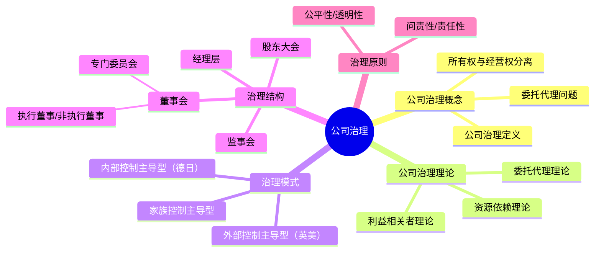

## 📍 章节定位

| 项目 | 信息 |
|------|------|
| **所属科目** | 🎯 公司战略与风险管理 |
| **难度等级** | ⭐⭐ |
| **历年分值** | 3-5分 |
| **建议学时** | 4-6h |
| **核心地位** | 战略与治理衔接章节，客观题为主 |

## 📝 考情分析

本章聚焦公司治理的基本理论和治理结构，以客观题为主，偶有简答题。

命题规律：
- **公司治理概念**：所有权与经营权分离、委托代理问题
- **治理理论**：委托代理理论、利益相关者理论
- **治理模式**：外部控制主导型（英美）vs 内部控制主导型（德日）vs 家族控制主导型
- **治理结构**：股东会、董事会、监事会、经理层的权责
- **治理原则**：OECD公司治理原则

本章相对独立，知识点多为概念性内容，需准确记忆。

## 🧠 知识框架

## 📖 核心精讲

### 一、公司治理的概念

#### （一）公司治理的起源

公司治理源于现代公司制度中**所有权与经营权分离**所产生的委托代理问题。股东（委托人）将经营权交给管理层（代理人），但二者利益可能不一致，导致代理人可能损害委托人利益。

#### （二）公司治理的定义

公司治理是通过一套正式或非正式的、内部或外部的制度或机制，协调公司与所有利益相关者之间的利益关系，确保公司决策科学化，最终维护各方利益。

公司治理的核心：在所有权与经营权分离的情况下，通过制度安排，解决委托代理问题，实现股东和其他利益相关者利益最大化。

### 二、公司治理理论

| 理论 | 核心观点 |
|------|----------|
| **委托代理理论** | 股东与管理层存在信息不对称和利益冲突，需通过激励和监督解决代理问题 |
| **利益相关者理论** | 企业不仅要对股东负责，还要对所有利益相关者（员工、客户、供应商、社区等）负责 |
| **资源依赖理论** | 董事会是连接企业与外部关键资源的纽带，通过引入外部董事获取资源 |

### 三、公司治理模式

| 治理模式 | 代表国家 | 特点 | 优点 | 缺点 |
|----------|----------|------|------|------|
| **外部控制主导型** | 英美 | 股权分散、资本市场发达、外部董事为主 | 市场约束强、流动性好 | 短期主义、易被恶意收购 |
| **内部控制主导型** | 德日 | 股权集中、银行主导、内部董事为主 | 注重长期、稳定 | 缺乏外部市场约束 |
| **家族控制主导型** | 东亚 | 家族控股、家族成员任高管 | 决策快、凝聚力强 | 外部人利益受损、治理透明度低 |

> 📌 **内部控制主导型治理模式**亦称"关系控制主导型治理模式""德日治理模式"，股权集中，股东可通过内部机制直接监督管理层。

### 四、公司治理结构

公司治理结构是企业内部权力分配与制衡的制度安排：

| 治理机构 | 职权 | 定位 |
|----------|------|------|
| **股东大会** | 最高权力机构，决定重大事项（修改章程、增资减资、利润分配、董事监事选举） | 所有者代表 |
| **董事会** | 决策机构，对股东大会负责，执行股东大会决议 | 决策与监督 |
| **监事会** | 监督机构，监督董事、高管履职 | 独立监督 |
| **经理层** | 执行机构，组织实施董事会决议 | 经营管理 |

**董事会的专门委员会**：
- **审计委员会**：监督财务报告和内部控制
- **薪酬与考核委员会**：制定董事和高管薪酬方案
- **提名委员会**：遴选董事和高管候选人
- **战略与风险管理委员会**：审议战略规划和重大投资

> 📌 **独立董事制度**：上市公司董事会中独立董事占比不低于1/3，审计委员会、薪酬委员会、提名委员会中独立董事占多数。

### 五、公司治理原则（OECD原则）

OECD公司治理原则涵盖六个方面：

1. **确保有效公司治理框架的基础**：法律、监管和制度框架
2. **股东权利和关键所有权功能**：保护股东权益
3. **机构投资者、证券交易所和其他中介机构**：发挥市场参与者作用
4. **利益相关者的权利**：保护利益相关者合法权益
5. **信息披露和透明度**：及时准确披露财务状况、经营成果、所有权结构和治理结构
6. **董事会责任**：董事会对公司战略指导和对管理层有效监督

## 💡 典型例题

**【单选】** 下列关于公司治理模式的表述，正确的是（ ）。
A. 英美模式以内部控制为主导
B. 德日模式股权分散
C. 东亚家族模式以家族控制为特征
D. 外部控制主导型注重长期稳定

**【参考答案】** C
解析：A错误，英美模式以外部控制主导；B错误，德日模式股权集中；D错误，外部控制主导型容易导致短期主义。

## 🎯 记忆口诀

- **治理三模式**："英（英美）外（外部控制）德（德日）内（内部控制）家（家族）控"
- **治理结构四机构**："股（股东会）董（董事会）监（监事会）经（经理层）"——权力递减、互相制衡
- **四专门委员会**："审（审计）薪（薪酬）提（提名）战（战略）"
- **OECD六原则**："框（框架）股（股东）机（机构）利（利益相关者）信（信息披露）董（董事会）"

## ✅ 同步练习

**1. [单选]** 公司治理的核心问题是（ ）。
A. 提高企业盈利能力  B. 解决委托代理问题  C. 扩大市场份额  D. 降低生产成本

**2. [多选]** 上市公司董事会专门委员会包括（ ）。
A. 审计委员会  B. 薪酬与考核委员会  C. 提名委员会  D. 战略与风险管理委员会

**3. [多选]** 下列属于公司治理理论的有（ ）。
A. 委托代理理论  B. 利益相关者理论  C. 资源依赖理论  D. 价值链理论

**4. [简答]** 简述公司治理结构中股东大会、董事会、监事会、经理层的各自定位。

**5. [案例分析]** 某上市公司董事会成员全部由公司高管担任，无独立董事，审计委员会由财务总监兼任主任。请分析该公司治理结构存在的问题并提出改进建议。

> 参考答案：1.B  2.ABCD  3.ABC  4.见核心精讲"公司治理结构"  5.问题：①董事会全部由高管担任，缺乏独立性；②无独立董事，违反上市公司治理要求；③审计委员会由财务总监兼任，缺乏独立性。建议：①引入独立董事，占比不低于1/3；②审计委员会主任应由独立董事担任，且会计专业人士；③各专门委员会中独立董事应占多数；④实现决策权与执行权分离。
