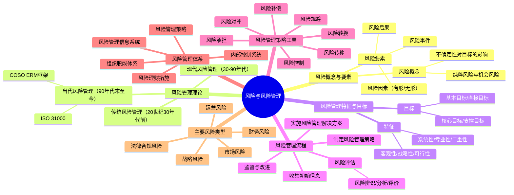
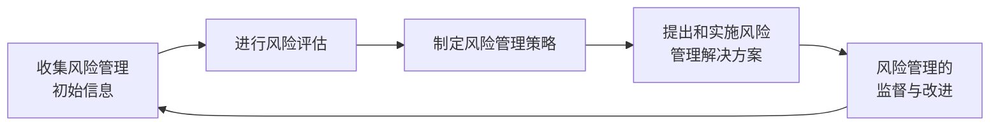

## 📍 章节定位

| 项目 | 信息 |
|------|------|
| **所属科目** | 🎯 公司战略与风险管理 |
| **难度等级** | ⭐⭐⭐⭐ |
| **历年分值** | 6-8分 |
| **建议学时** | 8-10h |
| **核心地位** | 风险管理篇总论，主观题高频考点 |

## 📝 考情分析

本章是风险管理部分的理论基石，涵盖风险概念、风险管理流程、风险管理策略工具和风险管理体系。近年命题趋势：

- **风险管理策略工具**：七种工具（承担、规避、转移、转换、对冲、补偿、控制）的辨析是高频客观题考点
- **风险管理流程**：五个步骤（收集信息→评估→制定策略→实施解决方案→监督改进）的顺序和内容
- **风险评估方法**：定性方法与定量方法的区分
- **企业面对的主要风险**：战略风险、市场风险、财务风险、运营风险、法律合规风险的识别与应对

本章常与第七章（内部控制）结合出主观题，要求判断风险类型并提出风险管理策略。

## 🧠 知识框架

## 📖 核心精讲

### 一、风险的概念与要素

#### （一）风险的概念

风险是指未来的不确定性对企业实现其经营目标的影响。风险既可能是负面的（损失），也可能是正面的（机遇）。

> 📌 **关键内涵**：①风险与战略和绩效相关；②风险是一系列可能结果而非单一结果；③风险兼具客观性与主观性；④风险与机遇并存。

**纯粹风险**：只有"带来损失"一种可能性的风险。
**机会风险**："带来损失"和"盈利"的可能性并存的风险。

#### （二）风险的要素

| 要素 | 含义 | 示例 |
|------|------|------|
| **风险因素** | 促使风险事件发生或增加其发生可能性的原因或条件 | 易燃材料存储、刹车失灵 |
| **风险事件** | 由风险因素引发的造成损失的场景或事实 | 火灾、车祸 |
| **风险后果** | 对目标产生的影响（正面/负面） | 财产损失、收入减少 |

风险因素分为：
- **有形风险因素**（实质性）：物质条件，如空气污染、刹车失灵
- **无形风险因素**：道德风险因素（欺诈、贪污）和心理风险因素（疏忽、过失）

按来源分为**外部风险因素**（经济、法律、社会、技术、自然）和**内部风险因素**（人力、管理、创新、财务、安全环保）。

### 二、风险管理的概念、特征与目标

#### （一）风险管理概念

风险管理是组织通过识别风险、分析风险、评价风险和进行风险决策，对风险进行有效控制与妥善处理，把风险可能造成的不良影响降至最低的管理过程。其本质是通过有效技术手段控制风险事件的不利影响，致力于为组织保持和创造价值。

#### （二）风险管理的特征

| 特征 | 要点 |
|------|------|
| **客观性** | 风险不以人的意志为转移，不可能彻底消除 |
| **战略性** | 主要运用于企业战略管理层面 |
| **可行性** | 风险损失成本与风险管理成本存在替代关系 |
| **系统性** | 全面性+广泛性+全员性 |
| **专业性** | 需要专业化管理人才 |
| **二重性** | 既管理纯粹风险，也管理投机风险 |

#### （三）风险管理目标

| 目标层次 | 内容 |
|----------|------|
| **基本目标** | 企业生存和发展，遵守法律法规 |
| **直接目标** | 恢复正常运转；实现持续稳定收益 |
| **核心目标** | 风险管理与总体战略目标匹配，企业价值最大化 |
| **支撑目标** | 加强企业文化建设，融入风险管理意识 |

#### （四）风险管理职能

风险管理具有**计划、组织、指导、控制**四大职能。

### 三、风险管理理论的演进

| 阶段 | 时期 | 代表性成果 |
|------|------|------------|
| **传统风险管理思想** | 20世纪30年代前 | 威雷特首次定义风险；以保险为主要工具 |
| **现代风险管理理论** | 30年代初-90年代末 | 内部控制理论发展；1992年COSO发布《内部控制整合框架》 |
| **当代风险管理理论** | 90年代末至今 | 2004年COSO《ERM整合框架》；2017年COSO《ERM与战略和绩效的整合》；ISO 31000 |

> 📌 **COSO框架演进**：1992年《内部控制整合框架》→2004年《企业风险管理—整合框架》→2017年《企业风险管理—与战略和绩效的整合》。2017版强调风险与价值、战略、绩效的关联。

### 四、风险管理流程

依据《中央企业全面风险管理指引》，风险管理基本流程包括五个步骤：

#### （一）收集风险管理初始信息

广泛、持续收集内外部初始信息（历史数据和预测数据），按风险类型分类收集：
- 战略风险：宏观环境、产业环境、竞争环境信息
- 市场风险：供需、价格、竞争、经济政策信息
- 财务风险：财务战略选择和财务管理状况指标
- 运营风险：生产运营、营销、研发、组织人员信息
- 法律合规风险：法律法规、政策信息

#### （二）进行风险评估

风险评估包括三个步骤：

| 步骤 | 含义 |
|------|------|
| **风险辨识** | 查找各业务单元、经营活动及业务流程中有无风险、有哪些风险 |
| **风险分析** | 对辨识出的风险进行定义和描述，分析发生可能性高低及条件 |
| **风险评价** | 评估风险对目标的影响程度、风险价值 |

**评估方法**：
- 定性方法：问卷调查、集体讨论、专家咨询、情景分析、政策分析、行业标杆比较、管理层访谈
- 定量方法：统计推论法、马尔科夫分析法
- 定量+定性：失效模式影响和危害度分析法、事件树分析法

#### （三）制定风险管理策略

风险管理策略是企业根据自身条件和外部环境，确定风险偏好、风险承受度、风险管理有效性标准，选择风险管理策略工具，确定资源配置原则的总体策略。

关键环节：确定**风险偏好**（愿意承担哪些风险）和**风险承受度**（最低限度和最高限度）。

#### （四）提出和实施风险管理解决方案

风险管理解决方案分为**外部解决方案**（外包给专业机构）和**内部解决方案**（组织职能体系、风险管理策略、金融工具、内部控制系统、信息系统）。

企业应制定**内控措施**，包括：岗位授权制度、报告制度、批准制度、责任制度、审计检查制度、考核评价制度、重大风险预警制度、企业法律顾问制度、重要岗位权力制衡制度。

**关键风险指标管理**六步：分析风险成因→量化关键成因→确定关键风险指标→建立预警系统→制定控制措施→跟踪监测。

#### （五）风险管理的监督与改进

**监督方法**：

| 方法 | 含义 |
|------|------|
| **压力测试** | 在极端情景下分析评估风险管理模型或内控流程的有效性 |
| **返回测试** | 将历史数据输入风险管理模型，对比结果与预测值检验有效性 |
| **穿行测试** | 将初始数据输入内控流程，穿越全流程和关键环节，对比运行结果与设计要求 |
| **风险控制自我评估（RCSA）** | 定期或不定期评价自身及子公司风险管理系统的有效性 |

### 五、风险管理策略工具

| 工具 | 含义 | 适用场景 |
|------|------|----------|
| **风险承担** | 接受风险，不采取行动 | 风险在承受度内；承担成本低 |
| **风险规避** | 退出或放弃产生风险的活动 | 风险超出承受度；有其他替代方案 |
| **风险转移** | 将风险转移给第三方 | 可通过保险、外包转移的风险 |
| **风险转换** | 将一种风险转换为另一种风险 | 转换后更易管理或成本更低 |
| **风险对冲** | 引入多个风险，使其相互抵消 | 金融风险（汇率、利率、价格） |
| **风险补偿** | 提前计提风险准备金 | 无法规避且影响重大的风险 |
| **风险控制** | 采取控制措施降低风险可能性或影响 | 可控的运营风险 |

> 📌 **策略选择原则**：战略/财务/运营/政治/法律风险→承担、规避、转换、控制；可通过保险/期货管理的风险→转移、对冲、补偿。

### 六、风险管理体系

全面风险管理体系包括五个方面：

1. **风险管理组织职能体系**：董事会→风险管理委员会→风险管理职能部门→业务单位
2. **风险管理策略**：风险偏好、承受度、策略工具选择
3. **风险理财措施**：损失融资、风险自保、应急资本等
4. **内部控制系统**：政策、制度、程序、措施（详见第七章）
5. **风险管理信息系统**：信息采集、存储、加工、分析、测试、传递

### 七、企业面对的主要风险

企业主要风险分为五大类：

| 风险类型 | 含义 | 主要表现 |
|----------|------|----------|
| **战略风险** | 内外部环境匹配失衡影响战略目标 | 战略制定/实施/调整/复盘风险 |
| **市场风险** | 外部市场复杂性和变动性带来不确定性 | 价格供需变化、供应链、信用、利率汇率、竞争 |
| **财务风险** | 财务活动不确定性 | 预算、融资、投资、资金运营、财务报告、担保 |
| **运营风险** | 日常运营不确定性 | 生产、营销、研发、组织人员、信息系统 |
| **法律合规风险** | 法律法规违反导致损失 | 法律风险（诉讼、违法）+合规风险（监管违规） |

## 💡 典型例题

**【多选】** 下列属于风险管理策略工具的有（ ）。
A. 风险承担  B. 风险规避  C. 风险消除  D. 风险对冲

**【参考答案】** ABD
解析：风险管理策略工具包括七种：风险承担、风险规避、风险转移、风险转换、风险对冲、风险补偿、风险控制。不存在"风险消除"工具，因为风险不可能彻底消除（客观性特征）。

## 🎯 记忆口诀

- **风险三要素**："因素（原因）→事件（事实）→后果（影响）"，因果链条要记牢
- **风险特征六字诀**："客（客观）战（战略）可（可行）系（系统）专（专业）二（二重）"
- **风险管理流程五步**："收（集信息）评（估）策（略）施（方案）监（督）"
- **七种策略工具**："承规转，移冲补控"——承担、规避、转换、转移、对冲、补偿、控制
- **监督四方法**："压（压力测试）返（返回测试）穿（穿行测试）自（自我评估）"
- **五大风险**："战（战略）市（市场）财（财务）运（运营）法（法律合规）"

## ✅ 同步练习

**1. [单选]** 企业为应对汇率波动风险，通过远期外汇合约锁定汇率。该风险管理策略工具属于（ ）。
A. 风险转移  B. 风险对冲  C. 风险规避  D. 风险补偿

**2. [多选]** 下列属于风险评估方法的有（ ）。
A. 情景分析  B. 统计推论法  C. 事件树分析法  D. 压力测试

**3. [多选]** 全面风险管理体系包括（ ）。
A. 风险管理组织职能体系  B. 风险管理策略  C. 内部控制系统  D. 风险管理信息系统

**4. [简答]** 简述风险管理基本流程的五个步骤。

**5. [案例分析]** 某制造企业主要原材料依赖进口，汇率波动对其成本影响较大。同时，该企业产品出口占比较高，面临国际贸易摩擦风险。请分析该企业面临的主要风险类型，并提出至少三种风险管理策略工具建议。

> 参考答案：1.B  2.ABCD  3.ABCD  4.见核心精讲"风险管理流程"  5.主要风险：市场风险（汇率、供需、竞争）；运营风险（供应链）；法律合规风险（贸易摩擦）。建议工具：风险对冲（远期外汇合约锁定汇率）、风险转移（购买出口信用保险）、风险控制（多元化供应商、开拓国内市场）、风险承担（承受度内风险自行承担）。
