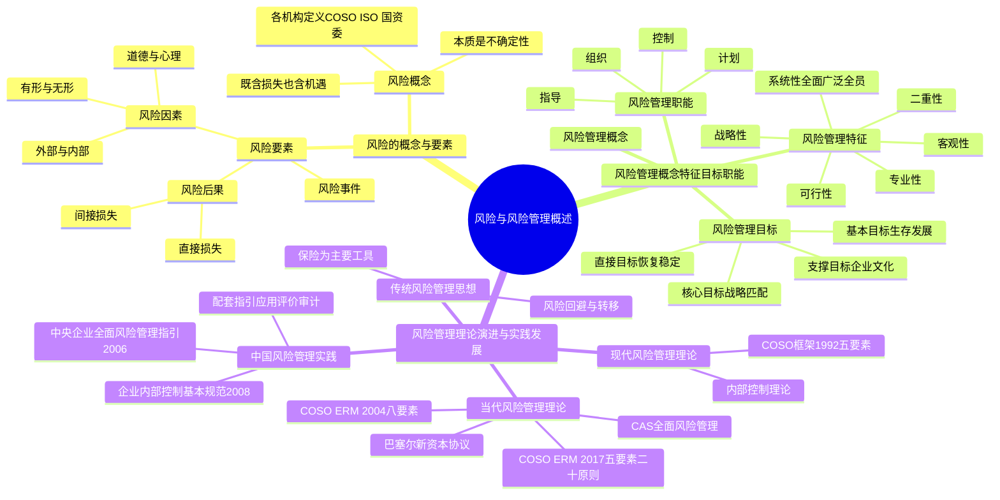

## 1. 章节定位

| 项目 | 信息 |
|------|------|
| 所属科目 | 公司战略与风险管理 |
| 难度等级 | 3 |
| 历年分值 | 3-5 分 |
| 建议学时 | 4-5 小时 |
| 知识关联章节 | 第5章公司治理（治理是风控基础）、第7章风险管理流程体系与方法（本章是流程篇的理论前导）、第8章企业面对的主要风险（本章定义风险概念） |

## 2. 考情分析

本章是风险管理部分的理论基石，阐述风险的基本概念、要素，以及风险管理的概念、特征、目标、职能，并梳理风险管理理论的演进历程。历年分值约 3-5 分，以客观题为主，偶有简答题涉及风险管理特征辨识或理论演进节点。

**命题规律**：本章概念密集、理论性强，客观题集中在风险概念理解、风险三要素辨识、风险管理特征判断、风险管理目标层次划分、风险管理理论演进的关键节点（COSO 1992、ERM 2004、ERM 2017）等。

**高频考点分布**：

1. **风险的概念**：风险的本质是不确定性；风险既可能是负面损失也可能是正面机遇；不同机构（COSO、ISO 31000、国资委）对风险的定义辨析。
2. **风险三要素**：风险因素（有形/无形、外部/内部）、风险事件、风险后果（直接损失/间接损失）的关系与辨识。
3. **风险分类**：纯粹风险 vs 机会风险；外部风险 vs 内部风险。
4. **风险管理的特征**：客观性、战略性、可行性、系统性（全面性、广泛性、全员性）、专业性、二重性。
5. **风险管理的目标**：基本目标（生存发展）、直接目标（恢复正常运转、稳定收益）、核心目标（与战略匹配、价值最大化）、支撑目标（企业文化建设）。
6. **风险管理的职能**：计划职能、组织职能、指导职能、控制职能。
7. **风险管理理论演进**：传统风险管理思想（20世纪30年代前）、现代风险管理理论（COSO 1992五要素）、当代风险管理理论（CAS全面风险管理、巴塞尔协议、COSO ERM 2004、COSO ERM 2017）。
8. **关键框架对比**：COSO内部控制框架（1992五要素）、ERM 2004（八要素）、ERM 2017（五要素二十原则）的演进。
9. **中国风险管理实践**：《中央企业全面风险管理指引》（2006）、《企业内部控制基本规范》（2008）及其配套指引。

**备考建议**：

- 用"要素链条"串联本章：风险因素→风险事件→风险后果，理解三者的因果关系；
- 风险管理特征用"客观战略可行系统专业二重"六词记忆；
- 风险管理目标用层次记忆：基本（生存）→直接（恢复）→核心（战略匹配）→支撑（文化）；
- 理论演进用时间轴记忆：传统（30年代前，保险为主）→现代（30-90年代，COSO 1992内部控制）→当代（90年代末至今，全面风险管理ERM）。

## 3. 知识框架

## 4. 核心精讲

### 一、风险的概念

风险是与人类生存发展共生的现象。企业对风险的态度，从最初的恐惧、逃避、抗争，转变为理解、接受和应用。风险和机遇总是相伴而生，管理风险与把握机遇的核心目标是一致的——实现企业价值。

**风险定义的演进**：

| 提出者/机构 | 时间 | 核心定义 |
|-------------|------|----------|
| 弗兰克·奈特 | 1921年 | 区分风险与不确定性：可量化的不确定性是"风险"，不可预测的不确定性不是"风险" |
| 威廉姆斯和汉斯 | 1964年 | 风险是在给定情况下和特定时间内，可能发生的结果间的差异；差异越大，风险越大 |
| COSO内控框架 | 1992年 | 风险是任何可能影响目标实现的负面因素 |
| COSO ERM 2004 | 2004年 | 不确定性既代表风险也代表机会，可能减少或增加价值 |
| COSO ERM 2017 | 2017年 | 风险是事项发生并影响实现战略和经营目标的可能性 |
| ISO 31000 | — | 风险是不确定性对目标的影响（影响包括积极、消极或两者兼有） |
| 国资委《中央企业全面风险管理指引》 | 2006年 | 未来的不确定性对企业实现其经营目标的影响 |

**风险的四个内涵**：

1. **风险与企业战略和绩效相关**：风险是影响企业实现战略目标的各种因素和事项；
2. **风险是一系列可能发生的结果**：不能简单理解为最有可能的结果，"范围"对应众多不确定性；
3. **风险既具有客观性又具有主观性**：风险是事件本身的不确定性，可由人的主观判断选择不同的风险；
4. **风险往往与机遇并存**：风险结果可正可负，风险孕育着机遇，是创造价值的基础。

**风险的分类**（按是否带来盈利机会）：

| 类型 | 特征 | 举例 |
|------|------|------|
| **纯粹风险** | 只有"带来损失"一种可能性 | 火灾、地震、车祸 |
| **机会风险** | "带来损失"和"盈利"的可能性并存 | 投资股票、新产品研发、市场扩张 |

### 二、风险的要素

风险由**风险因素、风险事件、风险后果**三个要素构成，三者相互依存、相互作用，共同构成风险的统一体。

#### （一）风险因素

**风险因素**是指促使某一风险事件发生，或增加其发生可能性的原因或条件，是风险事件发生的潜在原因。

**按性质分类**：

| 类型 | 含义 | 举例 |
|------|------|------|
| **有形风险因素（实质性风险因素）** | 直接影响事物物理功能的物质风险因素 | 汽车刹车系统失灵；水源污染；易燃易爆材料存储 |
| **无形风险因素** | 影响物质损失可能性和程度的非物质因素 | — |
| — 道德风险因素 | 与人的品德修养相关，因不诚实、不正当企图促使风险发生 | 欺诈、抢劫、盗窃、贪污 |
| — 心理风险因素 | 与人的心理状态相关，因主观过失或疏忽增加风险概率 | 司机注意力分散；外出忘记锁门 |

**按来源分类**：

| 类型 | 来源 | 具体因素 |
|------|------|----------|
| **外部风险因素** | 企业经营的外部环境 | 经济因素（经济形势、产业政策、融资环境、市场竞争）；法律因素（法律法规、监管要求）；社会因素（安全稳定、文化传统、社会信用、消费者行为）；科学技术因素（技术进步、工艺改进）；自然环境因素（自然灾害、环境状况） |
| **内部风险因素** | 企业的决策和经营活动 | 人力资源因素（职业操守、专业胜任能力）；管理因素（组织机构、经营方式、资产管理、业务流程）；创新活动因素（研究开发、技术投入、信息技术运用）；财务因素（经营成果、现金流量）；安全环保因素（营运安全、员工健康、环境保护） |

#### （二）风险事件

**风险事件**是指由风险因素引发的造成损失的场景或事实。

- 风险因素只是潜在的不确定性，只有通过风险事件的发生才能导致损失；
- 风险事件的发生使潜在的不确定性转化为现实的损失；
- 风险事件是导致损失的直接原因，是风险与后果的媒介物；
- 典型风险事件：火灾、洪水、地震、车祸、核泄漏、疾病、股市崩盘等。

#### （三）风险后果

**风险后果**是指对目标产生的影响。后果可能是确定的或不确定的，可能对目标产生正面或负面、直接或间接的影响。

- **正面影响**：促进企业目标实现、为企业创造价值；
- **负面影响**：即风险损失。

**损失的界定**：风险管理中的损失包含两方面内容（缺一不可）：
1. 非故意的、非预期的、非计划的；
2. 经济价值（能以货币衡量）的减少。

> 注意：折旧和捐赠虽有经济价值减少，但不属于非故意非预期非计划，故不是损失；受惊吓精神失常虽是非故意非预期，但不属于经济价值减少，也不是损失。

**损失的类型**：

| 类型 | 含义 | 举例 |
|------|------|------|
| **直接损失（实质损失）** | 风险事件导致的财产损毁和人身伤害 | 火灾烧毁的厂房；车祸造成的人身伤害 |
| **间接损失（派生损失）** | 由直接损失引起的其他损失 | 额外费用损失、收入损失、责任损失、声誉损失 |

> 间接损失有时会大于直接损失。例如，一家工厂火灾的直接损失是厂房设备损毁，但由此导致的订单违约赔偿、市场份额下降、品牌声誉受损等间接损失可能远超直接损失。

**三要素的关系**：风险因素引起风险事件发生或增加其发生概率→风险事件的发生造成风险后果→风险后果使风险因素和风险事件得以呈现或暴露，使风险最终形成。

### 三、风险管理的概念

**风险管理**是指在一个风险确定的环境中把风险降至最低程度的管理过程；是具体的组织（风险管理单位）通过识别风险、分析风险、评价风险和进行风险决策管理等方式，对风险进行有效控制与妥善处理，把风险可能造成的不良影响降至最低的管理过程。

**风险管理的本质**：通过有效的技术手段控制风险事件所带来的不利影响，将组织可能蒙受的损失降到最低，并致力于为组织保持和创造更大的价值。

**风险管理的三个独特内涵**：

1. **风险管理的决策主体是风险管理单位**：可以是个人、家庭、企业，也可以是政府、事业单位、社会团体或国际组织。不同主体的风险管理侧重点不同（个人家庭关注人身/财产/责任风险；企业关注战略/市场/运营/财务/法律合规风险；政府关注社会生命财产和责任风险）。
2. **风险管理的核心是平衡风险与机遇并致力于创造价值**：风险识别既关注危险因素也重视机遇因素；风险分析评价既预测损失也评估潜在收益；风险应对既降低损失也主动把握机遇。
3. **风险管理过程是决策和控制的过程**：风险识别、分析、评价是为了认识风险状况、作出风险管理决策，本质是通过合理科学的管理决策为组织实现价值保持和创造。

### 四、风险管理的特征

| 特征 | 含义 |
|------|------|
| **客观性** | 风险不以人的意志为转移，是客观存在；人们只能改变风险存在和发生的条件，降低频率和损失程度，但不能彻底消除风险 |
| **战略性** | 风险管理主要运用于企业战略管理层面，站在战略层面管理企业风险，降低风险损失期望值 |
| **可行性** | 风险损失成本与风险管理成本存在替代关系（风险管理成本越大，风险损失成本可能越低）；风险可预期、可减少、可分散、可转移 |
| **系统性** | 必须拥有一套系统的、规范的方法，建立健全全面风险管理体系（组织职能体系、风险管理策略、风险理财措施、内部控制系统、风险管理信息系统）。体现在三个方面：**全面性**（对风险的认识处理不能片面）、**广泛性**（涉及多门学科交叉）、**全员性**（治理层、管理层和所有员工共同参与） |
| **专业性** | 较强的风险管理能力意味着更明智的决策、更好的目标实现、更大的价值创造，要求专业人才实施专业化管理 |
| **二重性** | 既要管理纯粹风险，也要管理投机风险；商业使命包括：损失最小化管理、不确定性管理、绩效最优化管理 |

> **记忆要点**：风险管理六特征——**客战可系专二**（客观、战略、可行、系统、专业、二重）。系统性三方面——**全广员**（全面、广泛、全员）。

### 五、风险管理的目标

风险管理目标的设置原则：一致性（与总体战略目标一致）、现实性（具有客观可能性）、明晰性（明确且可评价）、层次性（按层级主次职能划分）。

| 目标层次 | 内容 |
|----------|------|
| **基本目标** | 企业与组织及成员的生存和发展；确保遵守法律法规；在面临损失时能够维持生存和发展 |
| **直接目标** | ①保证组织各项活动恢复正常运转；②尽快实现企业持续稳定的收益（通过经济补偿使生产经营及时恢复，尽快恢复到风险事件前水平并促进持续增长） |
| **核心目标** | 确保风险管理与总体战略目标相匹配；将风险控制在与总体战略目标相适应且可承受的范围内；实现企业价值最大化 |
| **支撑目标** | 加强企业文化建设；强化风险意识、构建风险组织、完善制度流程，使风险管理融入企业文化 |

> **记忆要点**：目标四层次——**基直核支**（基本生存、直接恢复、核心战略、支撑文化），由低到高、由生存到发展。

### 六、风险管理的职能

| 职能 | 内容 |
|------|------|
| **计划职能** | 通过风险识别、分析、评价和选择风险应对手段，设计管理方案，制订风险应对实施计划；编制风险应对预算 |
| **组织职能** | 根据风险管理计划，对风险管理单位的活动及其生产要素进行分派和组合；创造实现风险管理目标所需的人、财、物的结合 |
| **指导职能** | 对风险应对计划进行解释、判断，传达计划方案，交流信息和指挥活动；组织成员去实现风险管理计划 |
| **控制职能** | 对风险应对计划执行情况的检查、监督、分析和评价；根据事先设计的标准，对计划与实际不符之处予以纠正。范围包括：风险识别是否准确全面、风险估测是否有误、风险应对技术选择是否奏效、组合是否最佳、控制技术能否防止或减少风险、预算能否保障计划内事故得到及时补偿 |

### 七、风险管理理论的演进

#### （一）传统风险管理思想（20世纪30年代前）

| 时间节点 | 事件 |
|----------|------|
| 1901年 | 美国学者威雷特在博士论文《风险与保险的经济理论》中首次对风险作出定义 |
| 1915年 | 莱特纳发表《企业风险论》，阐述德国风险政策（控制、分散、转移、回避、抵消） |
| 1916年 | 亨利·法约尔在《工业管理和一般管理》中将安全活动列入企业六组活动之一 |
| 1921年 | 马歇尔在《企业管理》中提出"风险负担管理"观点（风险转移和风险排除） |
| 1929年 | 美国经济危机爆发，掀起风险管理研究热潮 |
| 1931年 | 美国管理协会倡导开展企业风险管理研究 |
| 1932年 | 纽约保险经纪协会成立 |

**传统风险管理思想的特点**：对象主要是不利风险；目的是减少不利风险对经营的影响；主要策略是风险回避和风险转移；保险是最主要的风险管理工具。

#### （二）现代风险管理理论（20世纪30年代初—20世纪90年代末）

现代风险管理理论的代表性成果是**内部控制理论**的发展：

| 时间 | 事件 | 要点 |
|------|------|------|
| 1949年 | 美国注册会计师协会（AICPA）提出内部控制概念 | — |
| 1953年 | AICPA审计程序委员会《审计程序公告第19号》 | 首次将内部控制划分为**内部会计控制**和**内部管理控制** |
| 1988年 | AICPA《审计准则公告第55号》 | 以"内部控制结构"代替"内部控制系统"；由**控制环境、会计系统、控制程序**三要素组成；首次将控制环境纳入内部控制范畴 |
| 1992年 | COSO发布《COSO框架》（内部控制整合框架） | 内部控制五要素：**控制环境、风险评估、控制活动、信息与沟通、监督** |

**COSO 1992内部控制框架的五要素**：

| 要素 | 地位 |
|------|------|
| **控制环境** | 实施内部控制的基础 |
| **风险评估** | 内部控制的重要前提 |
| **控制活动** | 内部控制的具体措施 |
| **信息与沟通** | 内部控制的必要条件 |
| **监督** | 内部控制的保证手段 |

**内部控制的三个目标**：经营的效率和有效性、财务报告的可靠性、遵循适用的法律法规。

#### （三）当代风险管理理论（20世纪90年代末至今）

当代风险管理理论的标志是**全面风险管理**思想的形成，有四大代表性成果：

**1. CAS全面风险管理标准（2001年）**

北美非寿险精算师协会（CAS）提出全面风险管理概念，将风险管理措施扩展到"研发"和"融资"。CAS将风险分为外部风险、金融风险、运营风险和战略风险四种类型，提出风险管理七步骤：环境扫描→风险识别→风险分析→风险集成→风险评估→风险管理→风险监控。

**2. 巴塞尔新资本协议（2004年）**

| 改进要点 | 内容 |
|----------|------|
| 全面风险管理理念 | 不再只关注信用风险，涵盖信用风险、市场风险和其他风险（利率风险、操作风险、法律和声誉风险） |
| 三大支柱 | 资本充足率、监管当局的监督检查、市场纪律 |
| 两大监管目标 | 提高监管资本的风险敏感度、激励商业银行提高风险管理水平 |
| 量化管理 | 信用风险（标准法、内部评级法）；操作风险（基本指标法、标准法、高级法等） |

**3. COSO ERM 2004《企业风险管理——整合框架》**

将内部控制整体框架拓展为全面风险管理框架，提出**八要素**：内部环境、目标设定、事项识别、风险评估、风险应对、控制活动、信息与沟通、监控。

> 全面风险管理定义：由主体的董事会、管理层和其他人员实施，应用于战略制定并贯穿于企业之中，旨在识别可能影响主体的潜在事项、管理风险以使其在主体的风险容量之内，并为主体目标的实现提供合理保证的过程。

**4. COSO ERM 2017《企业风险管理——与战略和绩效的整合》**

与ERM 2004相比的主要发展与变化：

| 变化要点 | 内容 |
|----------|------|
| 框架结构 | 首次采用"要素+原则"结构，包含**五大要素和二十项原则** |
| 含义简化 | 风险管理是组织在创造、保持和实现价值的过程中，结合战略制定和执行，赖以进行管理风险的文化、能力和实践 |
| 价值导向 | 不再侧重将风险降低到可接受水平，而是侧重于**创造、保持和实现价值** |
| 重新定位 | 将风险管理融入企业所有业务流程，从战略目标设定到经营目标形成，再到执行过程中绩效完成 |
| 绩效联系 | 加强风险管理与绩效的联系，探讨如何识别、评估影响绩效的各种风险 |
| 决策纳入 | 将风险管理纳入企业决策过程，尤其是战略目标选择、经营目标和绩效目标设定、资源分配计划制订 |

> **记忆要点**：ERM 2017的核心转变——从"降低风险"到"创造价值"；从"独立流程"到"融入业务"；从"风险容量"到"战略绩效"。

### 八、风险管理实践的发展

| 阶段 | 时间 | 特点 |
|------|------|------|
| **传统风险管理实践** | 20世纪初—70年代 | 萌芽（安全第一理念）、形成（1931年美国管理协会设立保险部门）、发展（1956年《风险管理——成本控制的新时期》论文推广风险管理职能） |
| **现代风险管理实践** | 20世纪70年代中后期—90年代末 | 1977年美国《反海外贿赂法案》推动内控；1983年《101条风险管理准则》；1985年成立COSO（Treadway委员会提议） |
| **当代风险管理实践** | 20世纪90年代末至今 | 风险管理标准化（ISO 31000系列、各国标准）；全面风险管理实施 |

**国际标准化组织（ISO）风险管理标准**：

| 标准 | 内容 |
|------|------|
| ISO Guide 73 | 风险管理术语（2002/2009版） |
| ISO 31000（2009/2018版） | 风险管理指南；2018版由原则、框架、流程三部分构成，聚焦价值创造维护实现，强调决策支持和高层领导者职责 |
| ISO/IEC 31010（2009/2019版） | 风险管理——风险评估技术 |
| ISO 31073:2022 | 风险管理——术语 |

**中国风险管理实践的关键文件**：

| 时间 | 文件 | 意义 |
|------|------|------|
| 2006年 | 国资委《中央企业全面风险管理指引》 | 我国第一个权威性的风险管理框架；标志着风险管理理论和实践进入新阶段 |
| 2008年 | 财政部等五部委《企业内部控制基本规范》 | 自2009年7月1日起在上市公司范围内施行 |
| 2010年 | 《企业内部控制配套指引》 | 包括应用指引、评价指引、审计指引，标志中国企业内部控制规范体系基本形成 |
| 2017年 | 财政部《小企业内部控制规范（试行）》 | 非上市小企业开展内部控制建设的指南 |
| 2019-2025年 | 国资委系列通知 | 持续完善中央企业内控体系建设；2025年要求以穿透式监管为主线、智能化转型为抓手 |

> **案例锚定**：S石油集团构建标准化风险管理体系——融入业务流程（投资决策前置风险评估）、标准化运作流程（德尔菲法+情景分析+历史数据复盘），覆盖战略/市场/运营/财务/合规各维度风险源。华润电力公司全面风险管理实践——董事会设审计与风险管理委员会，建立三级风险管理组织架构，采用"情景分析+压力测试"方法评估来水异常、电价政策等关键风险。

## 5. 典型例题

**【例题 1】（单选题，风险概念）**

下列关于风险的说法中，正确的是（ ）。
A. 风险只能带来损失，不能带来收益
B. 可以预测的不确定性称为风险，不可预测的不确定性不能称为风险
C. 风险是最有可能发生的结果
D. 风险与企业的战略和绩效无关

**答案**：B

**解析**：A错误，风险既可能是负面损失也可能是正面机遇；B正确，这是奈特对风险与不确定性的区分；C错误，风险是一系列可能发生的结果，不能简单理解为最有可能的结果；D错误，风险与企业战略和绩效相关，是影响企业实现战略目标的各种因素。

**【例题 2】（单选题，风险要素辨识）**

某企业仓库管理员下班时忘记关闭电源，导致仓库夜间发生火灾，烧毁价值500万元的库存商品，并因无法按期交货而支付违约金100万元。下列说法中，正确的是（ ）。
A. 忘记关闭电源属于风险事件
B. 火灾属于风险因素
C. 500万元库存商品损毁属于直接损失
D. 100万元违约金属于直接损失

**答案**：C

**解析**：A错误，忘记关闭电源属于风险因素（心理风险因素，因疏忽增加风险概率）；B错误，火灾属于风险事件（由风险因素引发的造成损失的场景）；C正确，500万元库存商品损毁是风险事件直接导致的财产损毁，属于直接损失（实质损失）；D错误，100万元违约金是由直接损失引起的派生损失，属于间接损失。

**【例题 3】（单选题，风险管理特征）**

下列各项中，体现风险管理"系统性"特征中"全员性"的是（ ）。
A. 风险管理涉及会计、法律、金融等多门学科
B. 风险管理单位对风险的认识处理不能片面
C. 企业治理层、管理层和所有员工共同参与风险管理
D. 风险管理主要运用于企业战略管理层面

**答案**：C

**解析**：A体现的是"广泛性"（涉及多门学科交叉）；B体现的是"全面性"（对风险的认识处理不能缺乏全面性）；C正确，体现"全员性"（治理层、管理层和所有员工参与）；D体现的是"战略性"，不是系统性。

**【例题 4】（单选题，风险管理目标）**

下列各项中，属于风险管理核心目标的是（ ）。
A. 企业在面临风险时能够维持生存和发展
B. 保证组织各项活动恢复正常运转
C. 确保风险管理与总体战略目标相匹配
D. 加强企业文化建设

**答案**：C

**解析**：A属于基本目标；B属于直接目标；C正确，属于核心目标（确保风险管理与总体战略目标相匹配，将风险控制在可承受范围内，实现企业价值最大化）；D属于支撑目标。

**【例题 5】（多选题，COSO框架演进）**

下列关于COSO框架演进的说法中，正确的有（ ）。
A. 1992年COSO内部控制框架包含五个要素
B. 2004年ERM框架将内部控制拓展为全面风险管理，包含八个要素
C. 2017年ERM框架采用"要素+原则"结构，包含五大要素和二十项原则
D. 2017年ERM框架仍侧重于将风险降低到可接受水平
E. 2017年ERM框架强调风险管理与战略、价值、绩效的关联性

**答案**：ABCE

**解析**：D错误，2017年ERM框架不再侧重将风险降低到可接受水平，而是侧重于创造、保持和实现价值。ABCE均正确：A（五要素：控制环境、风险评估、控制活动、信息与沟通、监督）；B（八要素：内部环境、目标设定、事项识别、风险评估、风险应对、控制活动、信息与沟通、监控）；C（五大要素二十原则）；E（强调与战略、价值、绩效的关联性、统一性、相容性）。

**【例题 6】（多选题，风险管理特征）**

下列属于风险管理特征的有（ ）。
A. 客观性
B. 战略性
C. 可行性
D. 系统性
E. 确定性

**答案**：ABCD

**解析**：E错误，风险管理的特征包括客观性、战略性、可行性、系统性、专业性、二重性，不包括"确定性"（风险的本质恰恰是不确定性）。ABCD均正确。

**【例题 7】（综合题，风险要素分析）**

某化工企业位于河流上游，生产过程中产生大量废水。由于环保设备老化（因素1）且操作人员疏忽未及时发现设备故障（因素2），导致废水未经处理直接排入河流，造成下游鱼类大量死亡，渔民经济损失严重。企业被环保部门处以罚款200万元，并需支付渔民赔偿金500万元，同时企业品牌声誉严重受损，股价下跌。

要求：(1) 指出本案例中的风险因素、风险事件和风险后果；(2) 分析风险因素的分类；(3) 说明风险后果中的直接损失和间接损失。

**答案**：

(1) 风险三要素：

- **风险因素**：环保设备老化（因素1，有形风险因素）；操作人员疏忽未及时发现设备故障（因素2，无形风险因素中的心理风险因素）；
- **风险事件**：废水未经处理直接排入河流（环境污染事件）；
- **风险后果**：下游鱼类大量死亡；渔民经济损失；企业被罚款200万元；支付赔偿金500万元；品牌声誉受损；股价下跌。

(2) 风险因素分类：

- 按性质分：环保设备老化属于**有形风险因素**（实质性风险因素，直接影响事物物理功能）；操作人员疏忽属于**无形风险因素**中的**心理风险因素**（因主观过失或疏忽增加风险概率）；
- 按来源分：两者均属于**内部风险因素**（来源于企业的决策和经营活动，表现为安全环保因素和管理因素）。

(3) 直接损失和间接损失：

- **直接损失（实质损失）**：罚款200万元、赔偿金500万元（风险事件直接导致的经济价值减少）；
- **间接损失（派生损失）**：品牌声誉受损（声誉损失）、股价下跌（收入损失/价值损失）、下游鱼类死亡导致的生态损失（责任损失）。间接损失有时会大于直接损失，本案例中品牌声誉受损和股价下跌的间接损失可能远超700万元的直接损失。

## 6. 记忆口诀

**风险定义四内涵**：战略相关（风险与战略绩效相关）；系列结果（非单一最可能结果）；主客并存（客观存在+主观判断）；机遇并存（正负两面）。

**风险三要素**：因素（原因条件）→事件（场景事实）→后果（目标影响），链条递进。

**风险因素双分类**：性质分有形无形（无形分道德心理）；来源分外部内部。

**损失两条件**：非故意非预期非计划 + 经济价值减少，缺一不可。直接损失=财产损毁+人身伤害；间接损失=额外费用+收入+责任+声誉。

**风险管理六特征**：客战可系专二（客观、战略、可行、系统、专业、二重）；系统性三方面=全广员（全面、广泛、全员）。

**风险管理四目标**：基直核支（基本生存、直接恢复、核心战略匹配、支撑文化）。

**风险管理四职能**：计组指控（计划、组织、指导、控制）。

**理论演进三阶段**：传统（30年代前，保险为主）→现代（30-90年代，COSO 1992五要素内控）→当代（90年代末至今，全面风险管理：CAS/巴塞尔/ERM 2004八要素/ERM 2017五要素二十原则）。

**ERM 2017核心转变**：从"降低风险"到"创造价值"；从"独立流程"到"融入业务"；从"风险容量"到"战略绩效"。

## 7. 同步练习

**1.（单选题）** 2023年7月，受5号台风影响，我国沿海部分地区出现8~10级阵风，自南向北出现大范围暴雨，局部地区有特大暴雨，引发部分城市内涝、洪水、泥石流等自然灾害。从风险的要素来看，本案例中的城市内涝、洪水、泥石流属于（　）。

A. 风险因素
B. 风险事件（事故）
C. 直接损失
D. 间接损失

**2.（单选题）** 南天公司是国内一家生产厨房用具的生产型企业。公司管理人员认为风险具有不确定性，要一分为二地看待公司所面临的风险，趋利避害。下列关于南天公司对风险含义的理解不正确的是（　）。

A. 公司经营中战略目标不同，企业面临的风险也就不同
B. 风险是一系列可能发生的结果，而不是最有可能的结果
C. 不能由人的主观判断来选择不同的风险
D. 有风险才有机会，风险是机遇存在的基础

**3.（单选题）** 甲公司是一家建筑公司，公司十分重视风险管理工作。公司董事会要求在进行风险管理时，要首先确定风险管理的目标，根据确定的目标实施风险管理措施。下列关于风险管理的目标表述不正确的是（　）。

A. 根据目标的层次，风险管理的目标可以分为基本目标、直接目标、核心目标及支撑目标等
B. 风险管理的基本目标是企业和组织在面临风险和意外事故的情形下能够维持生存和发展
C. 风险管理的直接目标是确保风险管理与总体战略目标相匹配
D. 风险管理的支撑目标是加强企业文化建设

**4.（单选题）** 天地公司是一家餐饮公司。公司近期组织人员学习了风险要素的相关知识，要求通过深入理解风险的要素，来做好本职范围内的风险防范工作。关于风险的要素，下列表述中不正确的是（　）。

A. 损失是指能以货币衡量的经济价值的减少
B. 风险因素是风险事件发生的潜在原因，是造成风险后果的内在或间接原因
C. 风险事件的发生会使潜在的危险转化为现实的损失
D. 风险因素根据其性质，可以分为有形风险因素和无形风险因素

**5.（单选题）** 龙江矿业公司制定了未来五年资产规模和利润翻番的战略目标，并围绕该目标实施了风险管理，确保将风险控制在与战略目标相适应且可承受的范围内，以保障企业价值创造的实现。本案例中，龙江矿业公司风险管理的目标属于（　）。

A. 基本目标
B. 直接目标
C. 核心目标
D. 支撑目标

**6.（单选题）** 华友公司于2006年成立，是一家面向国际市场的服装生产企业。2020年，面对全球性传染病暴发、订单和销售额大幅减少等情况，该公司加强风险管理，果断收缩原有业务，同时生产医用口罩、防护服等新产品，从而使公司平稳渡过难关，并创造出良好的效益。下列各项中，属于本案例所体现的风险管理的特征是（　）。

A. 战略性
B. 广泛性
C. 全员性
D. 专业性

**7.（单选题）** 情缘公司是一家从事进出口贸易的公司。近年来，由于国际环境复杂多变，公司管理层特别强调要加强风险管理。下列关于风险管理的概念的表述中，不正确的是（　）。

A. 风险管理的过程就是控制潜在风险、降低组织成本、维护组织利益的过程
B. 风险管理的决策主体是风险管理单位，可以是企业、政府、事业单位，但不包含个人和家庭
C. 风险管理的核心是降低损失并致力于创造价值
D. 风险管理过程实际上是一个管理决策和控制的过程，其本质是通过合理和科学的管理决策为组织实现价值保持和创造

**8.（单选题）** 北方公司是一家芯片制造企业，公司十分重视风险管理目标的设置工作。公司董事会要求根据层级、主次、职能等，将风险管理目标进行有效的划分，权责相应，以提升风险管理效果。北方公司在设置风险管理目标时遵循的原则是（　）。

A. 一致性原则
B. 现实性原则
C. 明晰性原则
D. 层次性原则

**9.（单选题）** （2018年）永泽公司是一家餐饮公司。2010年，一场传染病的流行使餐饮业进入"寒冬"。该公司在进行风险评估后认为，这场传染病的流行将使消费者的健康饮食意识大大增强，于是组织员工迅速开发并推出系列健康菜品，使公司营业额逆势上升。永泽公司的上述做法体现的风险管理特征是（　）。

A. 专业性
B. 战略性
C. 系统性
D. 二重性

**10.（单选题）** 咏梅公司主营羊绒制品的生产和销售。2016年冬天，因失火遭受巨大损失，该公司制定和实施了一系列完善风险管理、促进生产恢复和发展的措施，使公司在面临损失的情况下得到持续发展。本案例中，咏梅公司的风险管理目标属于（　）。

A. 核心目标
B. 基本目标
C. 支撑目标
D. 直接目标

**11.（单选题）** 如家商厦是一家大型零售商超公司，公司十分重视风险管理工作。为了加强消防安全管理，降低商场发生火灾的风险或损失，公司根据风险管理计划，投资900万元购置了防火装饰材料，更新了消防设施，并专门组建了日常消防减灾巡逻小组。如家商厦以上防灾措施体现的风险管理职能是（　）。

A. 计划职能
B. 组织职能
C. 指导职能
D. 控制职能

**12.（多选题）** 下列关于风险因素、风险事件和风险后果的关系的说法中，正确的有（　）。

A. 风险因素、风险事件和风险后果相互依存、相互作用
B. 风险因素引起风险事件发生或增加其发生的概率
C. 风险事件的发生造成风险后果
D. 风险后果的发生使风险因素和风险事件得以呈现或暴露，使风险最终形成

**13.（多选题）** 下列关于人们对风险内涵的理解，表述正确的有（　）。

A. 在一定具体情况下的风险，可以由人的主观判断来选择不同的风险
B. 风险是一系列可能发生的结果而不是最有可能的结果
C. 风险往往与机遇并存
D. 风险是可预测、可度量的负面因素

**14.（多选题）** 甲公司是一家生产光伏电池板的企业，公司管理层要求明确风险管理的目标，其中重点强调了风险管理的直接目标。下列各项中属于风险管理直接目标的有（　）。

A. 在风险事故出现，给企业带来损失和危害后，保证组织的各项活动恢复正常运转
B. 确保风险管理与总体战略目标相匹配
C. 在风险事故出现，给企业带来损失和危害后，尽快实现企业持续稳定的收益
D. 加强企业文化建设，从文化层面保障企业的可持续发展

**15.（多选题）** 美国COSO委员会于1992年发布了COSO《企业内部控制——整合框架》，进一步明确了内部控制的定义。下列各项中，关于该定义揭示的内部控制基本内涵的说法中正确的有（　）。

A. 内部控制是一种活动，包括目标和实现目标的手段
B. 内部控制可以为主体目标的实现提供合理的保证，但不能提供绝对的保证
C. 内部控制的目标包括经营目标、财务报告目标和合规目标等多个彼此独立又相互交叉的目标
D. 内部控制涉及组织中高层管理人员的活动

**16.（多选题）** 梦幻公司主要经营饮料的生产和销售业务，公司董事会要求强化风险管理的职能，降低风险事件发生的可能性或带来的损失。风险管理部门建议从多角度强化风险管理的控制职能。下列选项中，可以纳入风险管理控制职能范围的有（　）。

A. 风险的识别是否准确全面
B. 风险的估测是否有误
C. 风险应对技术的选择是否奏效
D. 风险应对技术的组合是否最佳

---

**练习答案**：1.B（风险事件是指造成损失的偶发事故，城市内涝、洪水、泥石流属于导致财产损失的风险事件）　2.C（风险是事件本身的不确定性，可以由人的主观判断来选择不同的风险）　3.C（风险管理的直接目标是保证组织各项活动恢复正常运转并尽快实现持续稳定的收益；确保风险管理与总体战略目标相匹配是核心目标）　4.A（损失须同时满足非故意的、非预期的、非计划的和经济价值的减少两个条件）　5.C（确保将风险控制在与战略目标相适应且可承受的范围内，属于核心目标）　6.A（站在战略层面收缩原有业务、生产新产品，体现风险管理的战略性）　7.B（风险管理的决策主体可以是个人、家庭和企业，也可以是政府、事业单位、社会团体等）　8.D（根据层级、主次、职能等将风险管理目标进行有效划分并权责相应，体现层次性原则）　9.D（将传染病的风险转化为增进企业价值的机会，体现风险管理的二重性）　10.D（制定和完善风险管理、促进生产恢复和发展的措施，体现直接目标）　11.B（根据风险管理计划对人、财、物进行分派和组合，体现组织职能）　12.ABCD（风险因素、风险事件和风险后果相互依存、相互作用，共同构成风险的统一体）　13.ABC（D错误：风险不一定是坏事，许多情况下风险孕育着机会，有风险是机会存在的基础）　14.AC（B属于核心目标，D属于支撑目标）　15.BC（A错误：内部控制是一个过程，是实现目标的手段而非目标本身；D错误：内部控制涉及组织各个层级人员的活动）　16.ABCD（风险的识别是否准确全面、风险的估测是否有误、风险应对技术的选择是否奏效及组合是否最佳等均可纳入风险管理控制职能范围）
