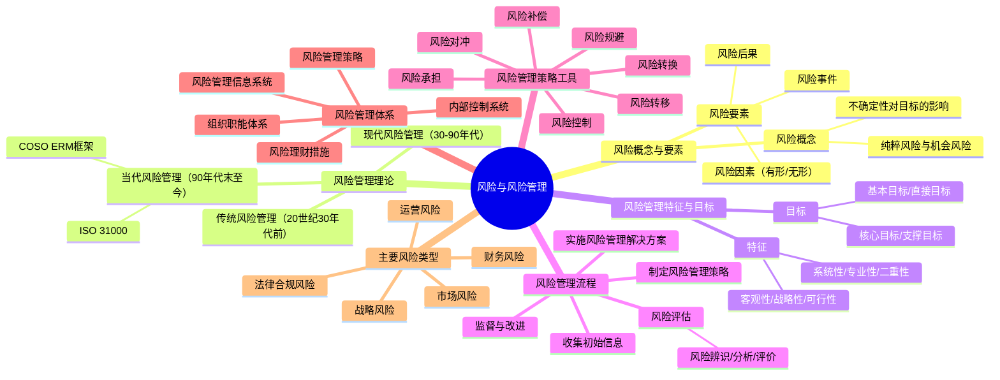
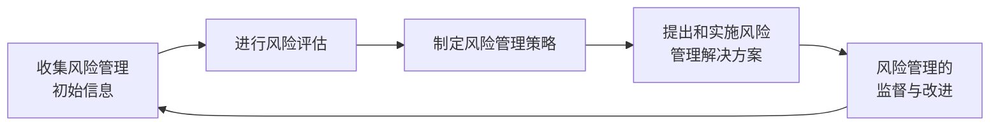

## 📍 章节定位

| 项目 | 信息 |
|------|------|
| **所属科目** | 🎯 公司战略与风险管理 |
| **难度等级** | ⭐⭐⭐⭐ |
| **历年分值** | 6-8分 |
| **建议学时** | 8-10h |
| **核心地位** | 风险管理篇总论，主观题高频考点 |

## 📝 考情分析

本章是风险管理部分的理论基石，涵盖风险概念、风险管理流程、风险管理策略工具和风险管理体系。历年分值约 6-8 分，主观题高频考点。

### 命题规律与重点考查趋势

近五年考查频率较高的考点分布如下：

| 考点 | 出题频次 | 题型偏好 | 难度 |
|------|----------|----------|------|
| 风险概念与要素 | ★★★ | 单选 | 易 |
| 风险管理特征六性 | ★★★★ | 多选 | 中 |
| 风险管理流程五步 | ★★★★★ | 简答/案例 | 中 |
| 风险评估三步骤 | ★★★ | 单选 | 易 |
| 风险评估方法分类 | ★★★★ | 多选 | 中 |
| 七种策略工具辨识 | ★★★★★ | 单选/案例 | 中 |
| 监督四方法 | ★★★ | 多选 | 中 |
| 五大风险类型辨识 | ★★★★★ | 案例 | 中 |
| COSO ERM 框架演进 | ★★ | 单选 | 易 |
| 风险管理体系五方面 | ★★★ | 多选 | 中 |

### 命题热点

1. **七种策略工具辨识**：通过案例描述判断属于哪种工具。命题陷阱：风险对冲是引入多个风险相互抵消（金融风险常用）；风险转换是一种风险转为另一种风险（如将市场风险转为信用风险）。
2. **五大风险类型辨识**：战略风险、市场风险、财务风险、运营风险、法律合规风险的识别。命题陷阱：汇率波动属"市场风险"而非"财务风险"；财务报表失真属"财务风险"。
3. **风险管理流程顺序**：收集信息→评估→策略→方案→监督改进，五步不可颠倒。
4. **风险评估方法分类**：定性方法、定量方法、定性与定量结合方法。

### 与前后章联系

- **承前**：本章承接第 5 章"公司治理"，风险管理是公司治理的核心内容之一。审计委员会、风险管理委员会是风险管理的治理层面。
- **启后**：本章的风险管理体系中的"内部控制系统"是第 7 章"内部控制"的内容。两章结合是综合题的常见出题方式。

### 学习方法建议

- **工具辨识法**：通过案例描述（如"购买保险"→风险转移、"远期外汇合约"→风险对冲）建立映射；
- **流程记忆法**：五步流程用口诀"收评策施监"快速回忆；
- **风险分类法**：五大风险类型配企业案例（华为、海尔、阿里等）加深理解；
- **对比记忆法**：风险承担 vs 风险规避、风险转移 vs 风险对冲、定性 vs 定量评估方法。

## 🧠 知识框架

## 📖 核心精讲

### 一、风险的概念与要素

#### （一）风险的概念

风险是指未来的不确定性对企业实现其经营目标的影响。风险既可能是负面的（损失），也可能是正面的（机遇）。

> 📌 **关键内涵**：①风险与战略和绩效相关；②风险是一系列可能结果而非单一结果；③风险兼具客观性与主观性；④风险与机遇并存。

**纯粹风险**：只有"带来损失"一种可能性的风险。
**机会风险**："带来损失"和"盈利"的可能性并存的风险。

#### （二）风险的要素

| 要素 | 含义 | 示例 |
|------|------|------|
| **风险因素** | 促使风险事件发生或增加其发生可能性的原因或条件 | 易燃材料存储、刹车失灵 |
| **风险事件** | 由风险因素引发的造成损失的场景或事实 | 火灾、车祸 |
| **风险后果** | 对目标产生的影响（正面/负面） | 财产损失、收入减少 |

风险因素分为：
- **有形风险因素**（实质性）：物质条件，如空气污染、刹车失灵
- **无形风险因素**：道德风险因素（欺诈、贪污）和心理风险因素（疏忽、过失）

按来源分为**外部风险因素**（经济、法律、社会、技术、自然）和**内部风险因素**（人力、管理、创新、财务、安全环保）。

### 二、风险管理的概念、特征与目标

#### （一）风险管理概念

风险管理是组织通过识别风险、分析风险、评价风险和进行风险决策，对风险进行有效控制与妥善处理，把风险可能造成的不良影响降至最低的管理过程。其本质是通过有效技术手段控制风险事件的不利影响，致力于为组织保持和创造价值。

#### （二）风险管理的特征

| 特征 | 要点 |
|------|------|
| **客观性** | 风险不以人的意志为转移，不可能彻底消除 |
| **战略性** | 主要运用于企业战略管理层面 |
| **可行性** | 风险损失成本与风险管理成本存在替代关系 |
| **系统性** | 全面性+广泛性+全员性 |
| **专业性** | 需要专业化管理人才 |
| **二重性** | 既管理纯粹风险，也管理投机风险 |

#### （三）风险管理目标

| 目标层次 | 内容 |
|----------|------|
| **基本目标** | 企业生存和发展，遵守法律法规 |
| **直接目标** | 恢复正常运转；实现持续稳定收益 |
| **核心目标** | 风险管理与总体战略目标匹配，企业价值最大化 |
| **支撑目标** | 加强企业文化建设，融入风险管理意识 |

#### （四）风险管理职能

风险管理具有**计划、组织、指导、控制**四大职能。

### 三、风险管理理论的演进

| 阶段 | 时期 | 代表性成果 |
|------|------|------------|
| **传统风险管理思想** | 20世纪30年代前 | 威雷特首次定义风险；以保险为主要工具 |
| **现代风险管理理论** | 30年代初-90年代末 | 内部控制理论发展；1992年COSO发布《内部控制整合框架》 |
| **当代风险管理理论** | 90年代末至今 | 2004年COSO《ERM整合框架》；2017年COSO《ERM与战略和绩效的整合》；ISO 31000 |

> 📌 **COSO框架演进**：1992年《内部控制整合框架》→2004年《企业风险管理—整合框架》→2017年《企业风险管理—与战略和绩效的整合》。2017版强调风险与价值、战略、绩效的关联。

### 四、风险管理流程

依据《中央企业全面风险管理指引》，风险管理基本流程包括五个步骤：

#### （一）收集风险管理初始信息

广泛、持续收集内外部初始信息（历史数据和预测数据），按风险类型分类收集：
- 战略风险：宏观环境、产业环境、竞争环境信息
- 市场风险：供需、价格、竞争、经济政策信息
- 财务风险：财务战略选择和财务管理状况指标
- 运营风险：生产运营、营销、研发、组织人员信息
- 法律合规风险：法律法规、政策信息

#### （二）进行风险评估

风险评估包括三个步骤：

| 步骤 | 含义 |
|------|------|
| **风险辨识** | 查找各业务单元、经营活动及业务流程中有无风险、有哪些风险 |
| **风险分析** | 对辨识出的风险进行定义和描述，分析发生可能性高低及条件 |
| **风险评价** | 评估风险对目标的影响程度、风险价值 |

**评估方法**：
- 定性方法：问卷调查、集体讨论、专家咨询、情景分析、政策分析、行业标杆比较、管理层访谈
- 定量方法：统计推论法、马尔科夫分析法
- 定量+定性：失效模式影响和危害度分析法、事件树分析法

#### （三）制定风险管理策略

风险管理策略是企业根据自身条件和外部环境，确定风险偏好、风险承受度、风险管理有效性标准，选择风险管理策略工具，确定资源配置原则的总体策略。

关键环节：确定**风险偏好**（愿意承担哪些风险）和**风险承受度**（最低限度和最高限度）。

#### （四）提出和实施风险管理解决方案

风险管理解决方案分为**外部解决方案**（外包给专业机构）和**内部解决方案**（组织职能体系、风险管理策略、金融工具、内部控制系统、信息系统）。

企业应制定**内控措施**，包括：岗位授权制度、报告制度、批准制度、责任制度、审计检查制度、考核评价制度、重大风险预警制度、企业法律顾问制度、重要岗位权力制衡制度。

**关键风险指标管理**六步：分析风险成因→量化关键成因→确定关键风险指标→建立预警系统→制定控制措施→跟踪监测。

#### （五）风险管理的监督与改进

**监督方法**：

| 方法 | 含义 |
|------|------|
| **压力测试** | 在极端情景下分析评估风险管理模型或内控流程的有效性 |
| **返回测试** | 将历史数据输入风险管理模型，对比结果与预测值检验有效性 |
| **穿行测试** | 将初始数据输入内控流程，穿越全流程和关键环节，对比运行结果与设计要求 |
| **风险控制自我评估（RCSA）** | 定期或不定期评价自身及子公司风险管理系统的有效性 |

### 五、风险管理策略工具

| 工具 | 含义 | 适用场景 |
|------|------|----------|
| **风险承担** | 接受风险，不采取行动 | 风险在承受度内；承担成本低 |
| **风险规避** | 退出或放弃产生风险的活动 | 风险超出承受度；有其他替代方案 |
| **风险转移** | 将风险转移给第三方 | 可通过保险、外包转移的风险 |
| **风险转换** | 将一种风险转换为另一种风险 | 转换后更易管理或成本更低 |
| **风险对冲** | 引入多个风险，使其相互抵消 | 金融风险（汇率、利率、价格） |
| **风险补偿** | 提前计提风险准备金 | 无法规避且影响重大的风险 |
| **风险控制** | 采取控制措施降低风险可能性或影响 | 可控的运营风险 |

> 📌 **策略选择原则**：战略/财务/运营/政治/法律风险→承担、规避、转换、控制；可通过保险/期货管理的风险→转移、对冲、补偿。

### 六、风险管理体系

全面风险管理体系包括五个方面：

1. **风险管理组织职能体系**：董事会→风险管理委员会→风险管理职能部门→业务单位
2. **风险管理策略**：风险偏好、承受度、策略工具选择
3. **风险理财措施**：损失融资、风险自保、应急资本等
4. **内部控制系统**：政策、制度、程序、措施（详见第七章）
5. **风险管理信息系统**：信息采集、存储、加工、分析、测试、传递

### 七、企业面对的主要风险

企业主要风险分为五大类：

| 风险类型 | 含义 | 主要表现 | 案例 |
|----------|------|----------|------|
| **战略风险** | 内外部环境匹配失衡影响战略目标 | 战略制定/实施/调整/复盘风险 | 诺基亚错失智能手机转型；新东方"双减"政策后战略转型 |
| **市场风险** | 外部市场复杂性和变动性带来不确定性 | 价格供需变化、供应链、信用、利率汇率、竞争 | 中航油衍生品巨亏；航空公司油价波动风险 |
| **财务风险** | 财务活动不确定性 | 预算、融资、投资、资金运营、财务报告、担保 | 恒大债务危机；瑞幸财务造假 |
| **运营风险** | 日常运营不确定性 | 生产、营销、研发、组织人员、信息系统 | 富士康产线事故；携程系统宕机 |
| **法律合规风险** | 法律法规违反导致损失 | 法律风险（诉讼、违法）+合规风险（监管违规） | 阿里"二选一"反垄断处罚；滴滴数据安全审查 |

**五大风险的详细辨识**：

#### （一）战略风险

战略风险包括：
- **战略制定风险**：战略目标不切实际、战略选择不当；
- **战略实施风险**：组织结构、文化、资源不匹配；
- **战略调整风险**：未能及时响应环境变化；
- **战略复盘风险**：缺乏有效的战略评估和反馈机制。

**案例锚定**：
- 诺基亚：从功能机向智能手机转型迟缓，错失市场主导地位；
- 新东方：受"双减"政策影响，K12 教培业务受冲击，战略转型直播带货；
- 苏宁：战略多元化过度（电商、地产、体育、金融），导致资金链断裂。

#### （二）市场风险

市场风险的主要因素：

| 因素 | 含义 | 案例 |
|------|------|------|
| **产品或服务价格风险** | 产品价格波动带来收入不确定性 | 大宗商品价格波动对制造业的影响 |
| **供应链风险** | 上游供应中断或价格波动 | 芯片短缺对汽车行业的影响 |
| **信用风险** | 客户或合作伙伴违约 | 应收账款坏账 |
| **利率风险** | 利率变动带来融资成本波动 | 浮动利率贷款的利息支出变化 |
| **汇率风险** | 汇率变动带来外币业务损失 | 出口企业汇率波动损失 |
| **股票价格风险** | 股价波动影响企业价值 | 上市公司市值波动 |
| **竞争对手行为风险** | 竞争对手行为带来不确定性 | 价格战、新产品颠覆 |

#### （三）财务风险

财务风险的主要表现：

| 财务活动 | 主要风险 |
|----------|----------|
| **预算管理** | 预算不切实际、执行偏差大 |
| **融资管理** | 融资结构不合理、利率风险、债务违约 |
| **投资管理** | 投资决策失误、投资回报不及预期 |
| **资金运营** | 现金流断裂、流动性风险 |
| **财务报告** | 财务信息失真、信息披露违规 |
| **担保管理** | 对外担保过多、被担保方违约 |

**案例锚定——恒大集团财务风险**：
- 高杠杆融资：负债规模超 2 万亿元；
- 现金流断裂：销售回款不足、融资渠道收紧；
- 投资过度：多元化扩张（汽车、健康、文旅）资金沉淀；
- 担保链风险：关联企业担保相互牵连。

#### （四）运营风险

运营风险的主要表现：

| 运营活动 | 主要风险 |
|----------|----------|
| **生产运营** | 产品质量、安全生产、产能不足或过剩 |
| **营销管理** | 品牌声誉、客户流失、市场推广失败 |
| **研究开发** | 研发失败、技术过时、知识产权侵权 |
| **组织人员** | 核心人才流失、人员结构失衡、人力成本上升 |
| **信息系统** | 系统故障、数据泄露、网络安全 |
| **业务外包** | 外包方违约、质量失控 |
| **自然与环境** | 自然灾害、环境污染 |
| **政治与法律** | 政策变化、国际政治风险 |

#### （五）法律合规风险

| 类型 | 含义 | 案例 |
|------|------|------|
| **法律风险** | 因违反法律法规导致诉讼、处罚 | 侵权诉讼、合同纠纷、税务违法 |
| **合规风险** | 因违反监管规则或行业规范导致处罚 | 阿里"二选一"反垄断处罚 182 亿元；滴滴数据安全审查 |

**法律风险 vs 合规风险**：
- 法律风险：违反法律法规，承担法律责任（如罚款、赔偿、刑事责任）；
- 合规风险：违反监管规则或行业规范，承担合规责任（如监管处罚、声誉损失）。

### 八、COSO 企业风险管理框架（ERM）

**COSO ERM 框架的演进**：

| 版本 | 年份 | 名称 | 核心内容 |
|------|------|------|----------|
| 第 1 版 | 2004 | 《企业风险管理——整合框架》 | 八要素、四目标、风险管理立方 |
| 第 2 版 | 2017 | 《企业风险管理——与战略和绩效的整合》 | 五要素、二十原则、强调风险与战略绩效关联 |

**2017 版 COSO ERM 五要素**：

| 要素 | 含义 |
|------|------|
| **治理与文化** | 董事会监督、运营结构、风险文化、吸引培养人才、风险偏好 |
| **战略与目标设定** | 业务环境、风险偏好、可替代战略、制定业务目标 |
| **执行** | 识别风险、评估严重性、排序风险、应对风险、建立风险组合观 |
| **审查与修订** | 评估重大变化、审查风险和绩效、追求改进 |
| **信息、沟通和报告** | 利用信息、沟通风险信息、报告风险、文化和绩效 |

**ISO 31000 风险管理标准**：
- 国际标准化组织发布；
- 提供风险管理的一般性指南；
- 强调风险管理原则、框架、过程三位一体；
- 适用于任何规模、任何行业的组织。

### 九、风险理财措施

风险理财是企业运用金融工具管理风险的方法：

| 工具 | 含义 | 适用 |
|------|------|------|
| **损失融资** | 为损失事件筹集资金（保险、自保、风险自留） | 可保风险 |
| **风险自保** | 企业内部建立准备金或自保公司 | 高频低损风险 |
| **应急资本** | 事先约定在风险事件发生时可获得的资本 | 重大突发事件 |
| **保险** | 向保险公司转移风险 | 可保风险（财产、责任） |
| **专业自保公司** | 企业设立的专属保险公司 | 大型企业集团 |
| **衍生品** | 期货、期权、远期、互换 | 金融风险（汇率、利率、商品价格） |

## 💡 典型例题

**【例题 1】（多选题，七种策略工具）**

下列属于风险管理策略工具的有（ ）。
A. 风险承担
B. 风险规避
C. 风险消除
D. 风险对冲

**答案**：ABD

**解析**：风险管理策略工具包括七种：风险承担、风险规避、风险转移、风险转换、风险对冲、风险补偿、风险控制。不存在"风险消除"工具，因为风险不可能彻底消除（客观性特征）。

**【例题 2】（单选题，策略工具辨识）**

某出口企业为应对汇率波动风险，与银行签订远期外汇合约锁定未来结汇汇率。该风险管理策略工具属于（ ）。
A. 风险转移
B. 风险对冲
C. 风险规避
D. 风险补偿

**答案**：B

**解析**：风险对冲是引入多个风险，使其相互抵消。远期外汇合约通过锁定汇率，将汇率波动的损失风险与合约收益相互对冲。风险转移是将风险转移给第三方（如保险）；风险规避是退出产生风险的活动；风险补偿是计提准备金。

**【例题 3】（单选题，风险类型辨识）**

某企业因宏观经济下行，下游客户应收账款违约率上升，导致坏账损失增加。该企业面临的风险属于（ ）。
A. 战略风险
B. 市场风险
C. 财务风险
D. 运营风险

**答案**：B

**解析**：信用风险属于市场风险的一种。下游客户违约是信用风险，归入市场风险。命题陷阱：考生可能误判为财务风险，但财务风险是"财务活动不确定性"（如融资、投资活动），客户违约属于外部市场信用风险。

**【例题 4】（多选题，风险评估方法）**

下列属于风险评估定性方法的有（ ）。
A. 问卷调查
B. 集体讨论
C. 统计推论法
D. 情景分析
E. 马尔科夫分析法

**答案**：ABD

**解析**：定性方法包括问卷调查、集体讨论、专家咨询、情景分析、政策分析、行业标杆比较、管理层访谈。C 统计推论法和 E 马尔科夫分析法是定量方法。

**【例题 5】（多选题，监督四方法）**

下列属于风险管理监督与改进方法的有（ ）。
A. 压力测试
B. 返回测试
C. 穿行测试
D. 风险控制自我评估（RCSA）
E. 内部审计

**答案**：ABCD

**解析**：监督方法包括压力测试、返回测试、穿行测试、风险控制自我评估（RCSA）。E 内部审计是审计控制方法，不属于四种监督方法之一。

**【例题 6】（单选题，风险管理流程）**

风险管理基本流程的第一步是（ ）。
A. 进行风险评估
B. 收集风险管理初始信息
C. 制定风险管理策略
D. 提出和实施风险管理解决方案

**答案**：B

**解析**：风险管理基本流程五步顺序为：①收集风险管理初始信息；②进行风险评估；③制定风险管理策略；④提出和实施风险管理解决方案；⑤风险管理的监督与改进。第一步是收集风险管理初始信息。

**【例题 7】（综合题，风险管理策略应用）**

某制造企业主要原材料依赖进口，汇率波动对其成本影响较大。同时，该企业产品出口占比较高，面临国际贸易摩擦风险。此外，企业近年扩张较快，负债率上升，存在资金链压力。请分析该企业面临的主要风险类型，并提出至少三种风险管理策略工具建议。

**答案**：

(1) 该企业面临的主要风险类型：

| 风险类型 | 具体表现 |
|----------|----------|
| **市场风险** | 汇率波动（进口原材料成本上升）、国际贸易摩擦（出口受限）、信用风险（海外客户违约） |
| **财务风险** | 负债率上升、资金链压力、偿债风险 |
| **运营风险** | 供应链依赖进口、原材料供应中断风险 |
| **法律合规风险** | 国际贸易摩擦带来的法律诉讼、关税政策变化 |

(2) 风险管理策略工具建议：

| 工具 | 具体应用 |
|------|----------|
| **风险对冲** | 通过远期外汇合约、外汇期权等衍生品对冲汇率波动风险 |
| **风险转移** | 购买出口信用保险，将海外客户违约风险转移给保险公司 |
| **风险控制** | 多元化供应商（开拓国内供应渠道）、优化库存管理、加强客户信用评估 |
| **风险规避** | 退出高风险海外市场，聚焦国内市场和稳定海外市场 |
| **风险承担** | 在承受度内的微小汇率波动自行承担，节约风险管理成本 |
| **风险补偿** | 计提坏账准备金、汇兑损失准备金，应对可能的损失 |

**解析**：本题综合考查五大风险类型辨识和七种策略工具的应用。关键是：①准确识别案例中的风险类型（汇率属市场风险，债务属财务风险，供应属运营风险）；②针对每种风险提出合适的策略工具，并说明具体应用方式。

## 🎯 记忆口诀

- **风险三要素**："因素（原因）→事件（事实）→后果（影响）"，因果链条要记牢。
- **风险分类**："纯粹（只有损失）vs 机会（损失+盈利）"。
- **风险因素两类**："有形（物质条件）+无形（道德风险+心理风险）"。
- **风险特征六字诀**："客（客观）战（战略）可（可行）系（系统）专（专业）二（二重）"——风险不可能彻底消除（客观性）。
- **风险管理目标四层**："基（基本）直（直接）核（核心）支（支撑）"——生存发展→稳定收益→战略匹配→文化意识。
- **风险管理流程五步**："收（集信息）评（估）策（略）施（方案）监（督）"——不可颠倒。
- **风险评估三步**："辨（辨识）析（分析）评（评价）"——查找→描述→评估。
- **风险评估方法三分类**："定（定性）量（定量）混（定性+定量）"——问卷情景属定性，统计马尔科夫属定量，失效模式事件树属混合。
- **七种策略工具**："承规转，移冲补控"——承担、规避、转换、转移、对冲、补偿、控制。
- **工具辨识信号词**："保险外包→转移；远期期权→对冲；准备金→补偿；退出活动→规避；不行动→承担；改流程→控制"。
- **监督四方法**："压（压力测试）返（返回测试）穿（穿行测试）自（自我评估）"。
- **五大风险**："战（战略）市（市场）财（财务）运（运营）法（法律合规）"。
- **市场风险七因素**："价（价格）链（供应链）信（信用）利（利率）汇（汇率）股（股价）竞（竞争）"。
- **风险管理体系五方面**："组（组织职能）策（策略）理（风险理财）内（内控）信（信息系统）"。
- **COSO ERM 演进**："92 内控→04 风险→17 战略绩效"——风险与战略绩效整合。
- **2017 COSO ERM 五要素**："治（治理文化）战（战略目标）执（执行）审（审查修订）信（信息沟通）"。
- **风险理财六工具**："损（损失融资）自（自保）应（应急资本）保（保险）专（专业自保）衍（衍生品）"。

## ✅ 同步练习

**1. [单选]** 企业为应对汇率波动风险，通过远期外汇合约锁定汇率。该风险管理策略工具属于（ ）。
A. 风险转移  B. 风险对冲  C. 风险规避  D. 风险补偿

**2. [多选]** 下列属于风险评估方法的有（ ）。
A. 情景分析  B. 统计推论法  C. 事件树分析法  D. 压力测试

**3. [多选]** 全面风险管理体系包括（ ）。
A. 风险管理组织职能体系  B. 风险管理策略  C. 内部控制系统  D. 风险管理信息系统

**4. [简答]** 简述风险管理基本流程的五个步骤。

**5. [案例分析]** 某制造企业主要原材料依赖进口，汇率波动对其成本影响较大。同时，该企业产品出口占比较高，面临国际贸易摩擦风险。请分析该企业面临的主要风险类型，并提出至少三种风险管理策略工具建议。

> 参考答案：1.B  2.ABCD  3.ABCD  4.见核心精讲"风险管理流程"  5.主要风险：市场风险（汇率、供需、竞争）；运营风险（供应链）；法律合规风险（贸易摩擦）。建议工具：风险对冲（远期外汇合约锁定汇率）、风险转移（购买出口信用保险）、风险控制（多元化供应商、开拓国内市场）、风险承担（承受度内风险自行承担）。
