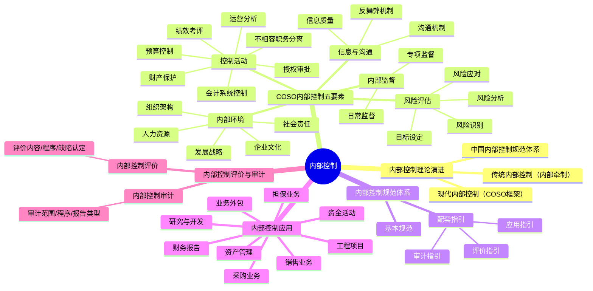

## 📍 章节定位

| 项目 | 信息 |
|------|------|
| **所属科目** | 🎯 公司战略与风险管理 |
| **难度等级** | ⭐⭐⭐⭐ |
| **历年分值** | 6-8分 |
| **建议学时** | 8-10h |
| **核心地位** | 风险管理篇实务，主观题常考章节 |

## 📝 考情分析

本章聚焦内部控制的理论框架与实务应用，是主观题和客观题的高频考点。

命题规律：
- **内部控制五要素**：内部环境、风险评估、控制活动、信息与沟通、内部监督的内涵与应用是客观题高频考点
- **内部控制应用**：资金活动、采购业务、资产管理、销售业务、研发、工程项目等具体应用指引
- **内部控制评价**：评价原则、评价内容、评价程序
- **内部控制审计**：审计范围、审计程序、审计报告类型
- **企业内部控制规范体系**：《基本规范》+《配套指引》（应用指引、评价指引、审计指引）

本章常与第六章结合考查，要求判断内控缺陷并提出改进建议。

## 🧠 知识框架

## 📖 核心精讲

### 一、内部控制理论演进

#### （一）内部控制的概念

内部控制是由企业董事会、监事会、经理层和全体员工实施的、旨在实现控制目标的过程。

**内部控制的目标**：
1. 合理保证企业经营管理合法合规
2. 合理保证资产安全
3. 合理保证财务报告及相关信息真实完整
4. 提高经营效率和效果
5. 促进企业实现发展战略

#### （二）COSO内部控制框架

1992年美国COSO发布《内部控制——整合框架》，明确了内部控制的**五个要素**：控制环境、风险评估、控制活动、信息与沟通、监督。

#### （三）中国内部控制规范体系

我国企业内部控制规范体系由"一个基本规范+三个配套指引"构成：

| 规范 | 发布时间 | 定位 |
|------|----------|------|
| 《企业内部控制基本规范》 | 2008年5月（五部委） | 基础性规范，上市公司2009年7月施行 |
| 《企业内部控制应用指引》 | 2010年4月 | 具体业务和事项的内控要求 |
| 《企业内部控制评价指引》 | 2010年4月 | 内控自我评价的规范 |
| 《企业内部控制审计指引》 | 2010年4月 | 外部审计的规范 |

### 二、内部控制五要素

#### （一）内部环境

内部环境是实施内部控制的基础，影响全体员工的控制意识。

| 要素 | 内容 |
|------|------|
| **组织架构** | 治理结构（股东会、董事会、监事会、经理层）和内部机构设置 |
| **发展战略** | 战略规划制定、实施与调整 |
| **人力资源** | 招聘、培训、考核、薪酬、退出 |
| **社会责任** | 安全生产、产品质量、环境保护、员工权益 |
| **企业文化** | 价值观、经营理念、行为规范、企业形象 |

#### （二）风险评估

风险评估是及时识别、系统分析经营活动中与实现内部控制目标相关的风险，合理确定风险应对策略。

风险评估流程：**目标设定→风险识别→风险分析→风险应对**。

#### （三）控制活动

控制活动是企业根据风险评估结果，采用相应的控制措施，将风险控制在可承受度之内。

**七种控制措施**：

| 控制措施 | 含义 | 应用 |
|----------|------|------|
| **不相容职务分离控制** | 不相容职务由不同人员担任 | 授权批准与业务经办、业务经办与会计记录、会计记录与财产保管、业务经办与稽核检查 |
| **授权审批控制** | 明确授权范围、权限、程序、责任 | 常规授权（制度化）和特别授权（临时性） |
| **会计系统控制** | 通过会计核算和监督 | 凭证、账簿、财务报告 |
| **财产保护控制** | 确保资产安全完整 | 限制接触、定期盘点、账实核对、财产保险 |
| **预算控制** | 通过预算实施控制 | 预算编制、执行、调整、考核 |
| **运营分析控制** | 对运营情况进行分析 | 因素分析、对比分析、趋势分析 |
| **绩效考评控制** | 通过绩效评价实施控制 | 设定指标、考核评价、奖惩兑现 |

> 📌 **高频考点——不相容职务四分离**：①授权批准与业务经办分离；②业务经办与会计记录分离；③会计记录与财产保管分离；④业务经办与稽核检查分离。

#### （四）信息与沟通

信息与沟通是及时、准确地收集、传递与内部控制相关的信息。

- **信息质量**：确保信息真实、准确、完整
- **沟通机制**：内部沟通（各层级之间）和外部沟通（与外部利益相关者）
- **反舞弊机制**：建立反舞弊举报渠道和调查程序

#### （五）内部监督

内部监督是企业对内部控制建立与执行情况进行监督评价。

| 监督类型 | 含义 |
|----------|------|
| **日常监督** | 持续性的、常规性的监督检查 |
| **专项监督** | 针对某项业务或特定事项的专门监督检查 |

### 三、内部控制应用

#### （一）资金活动

| 风险点 | 控制措施 |
|--------|----------|
| 筹资决策不当 | 科学论证筹资方案，审批程序规范 |
| 投资决策失误 | 可行性研究，集体决策，跟踪管理 |
| 资金调度不合理 | 统一调度，严格审批，月度资金计划 |

#### （二）采购业务

| 风险点 | 控制措施 |
|--------|----------|
| 采购计划不合理 | 编制采购计划，审批后执行 |
| 供应商选择不当 | 建立供应商准入和评价制度 |
| 验收不规范 | 严格验收程序，不相容职务分离 |

#### （三）销售业务

| 风险点 | 控制措施 |
|--------|----------|
| 销售策略不当 | 制定销售政策，审批信用额度 |
| 收款不及时 | 应收账款管理，定期对账，催收制度 |
| 客户信用风险 | 建立客户信用评估体系 |

#### （四）资产管理

确保资产安全完整，防止资产流失。包括存货管理、固定资产管理和无形资产管理。

#### （五）财务报告

确保财务报告真实完整。规范财务报告编制、对外提供和分析利用流程。

### 四、内部控制评价

#### （一）评价原则

- **全面性原则**：涵盖内部控制的所有要素和业务活动
- **重要性原则**：在全面基础上关注重要业务和高风险领域
- **客观性原则**：如实反映内部控制设计与运行情况

#### （二）评价内容

围绕内部控制五要素进行评价，重点关注：
- 内部控制设计是否有效
- 内部控制执行是否有效

#### （三）内部控制缺陷认定

| 缺陷类型 | 认定标准 |
|----------|----------|
| **重大缺陷** | 可能导致企业严重偏离控制目标 |
| **重要缺陷** | 严重程度低于重大缺陷，但仍可能导致偏离控制目标 |
| **一般缺陷** | 严重程度低于重大和重要缺陷 |

> 📌 **重大缺陷迹象**：董事/高管舞弊；更正已公布的财务报告；审计委员会和内审机构未有效发挥监督作用；缺乏内部控制评价监督。

#### （四）评价程序

1. 制定评价工作方案
2. 组成评价工作组
3. 实施现场测试（个别访谈、调查问卷、专题讨论、穿行测试、实地查验、抽样、比较分析）
4. 认定内部控制缺陷
5. 汇总评价结果
6. 编制评价报告

### 五、内部控制审计

内部控制审计是指会计师事务所接受委托，对特定基准日内部控制设计与运行的有效性进行审计。

#### （一）审计范围

审计范围覆盖企业内部控制整体，但以财务报告内部控制为核心。

#### （二）审计程序

1. 计划审计工作
2. 实施审计工作（自上而下方法）
3. 评价控制缺陷
4. 完成审计工作
5. 出具审计报告

#### （三）审计报告类型

| 报告类型 | 出具条件 |
|----------|----------|
| **标准审计报告** | 内部控制有效，无重大缺陷 |
| **带强调事项段的无保留意见** | 内部控制有效，但存在需强调事项 |
| **否定意见** | 存在重大缺陷 |
| **无法表示意见** | 审计范围受限，无法获取充分证据 |

### 六、内部控制与风险管理的关系

| 维度 | 内部控制 | 风险管理 |
|------|----------|----------|
| **范畴** | 风险管理的基础和组成部分 | 更宽泛，包含内部控制 |
| **目标** | 财务报告可靠、资产安全、合规 | 价值创造、战略实现 |
| **对象** | 业务和管理流程 | 战略、市场、运营等全方位 |
| **手段** | 制度、程序、措施 | 策略工具+内部控制+信息系统 |

> 📌 内部控制是全面风险管理的重要基础和必要举措。内控针对的是可控纯粹风险，控制对象是企业中的个人，目的是规范员工行为。

## 💡 典型例题

**【2023年简答题节选】** 某公司出纳员同时负责银行对账单的获取和银行存款余额调节表的编制。请指出该公司内部控制存在的问题并提出改进建议。

**【参考答案】**
存在的问题：出纳员同时负责银行对账单获取和银行存款余额调节表编制，违反了**不相容职务分离控制**原则。出纳（财产保管/业务经办）与对账（会计记录/稽核检查）属于不相容职务，不应由同一人担任。

改进建议：将银行对账单获取和银行存款余额调节表编制工作交由出纳以外的会计人员负责，实现不相容职务分离；定期由独立人员进行复核。

## 🎯 记忆口诀

- **内控五要素**："环（内部环境）评（风险评估）活（控制活动）信（信息与沟通）督（内部监督）"
- **控制活动七措施**："不（不相容分离）授（授权审批）会（会计系统）财（财产保护）预（预算）运（运营分析）绩（绩效考评）"
- **不相容职务四分离**："授权与经办，经办与记录，记录与保管，经办与稽核"
- **内控三规范**："基（基本规范）应（应用指引）评（评价指引）审（审计指引）"
- **缺陷三级**："重大-重要-一般"，重大可致严重偏离
- **审计报告四类型**："标（标准）强（强调）否（否定）无（无法表示）"

## ✅ 同步练习

**1. [单选]** 下列不属于内部控制控制活动的是（ ）。
A. 不相容职务分离控制  B. 授权审批控制  C. 内部环境控制  D. 预算控制

**2. [多选]** 下列属于不相容职务的有（ ）。
A. 授权批准与业务经办  B. 业务经办与会计记录  C. 会计记录与财产保管  D. 业务经办与稽核检查

**3. [多选]** 企业内部控制规范体系包括（ ）。
A. 《企业内部控制基本规范》  B. 《企业内部控制应用指引》  C. 《企业内部控制评价指引》  D. 《企业内部控制审计指引》

**4. [简答]** 简述内部控制缺陷的三个等级及其认定标准。

**5. [案例分析]** 某公司采购业务流程如下：采购员自行选择供应商并签订采购合同，货物到达后由采购员验收，验收入库单直接交财务部门付款。请分析该流程存在的内部控制缺陷，并提出改进建议。

> 参考答案：1.C（内部环境是五要素之一，不是控制活动） 2.ABCD  3.ABCD  4.见核心精讲"内部控制缺陷认定"  5.缺陷：①供应商选择与合同签订未分离；②采购与验收未分离（采购员自行验收）；③缺乏供应商准入和评价制度；④缺乏询价比价程序。建议：①建立供应商准入和评价制度，实行招标/比价采购；②采购与验收职务分离，由独立部门验收；③重大采购实行集体决策审批；④建立采购合同审批制度。
