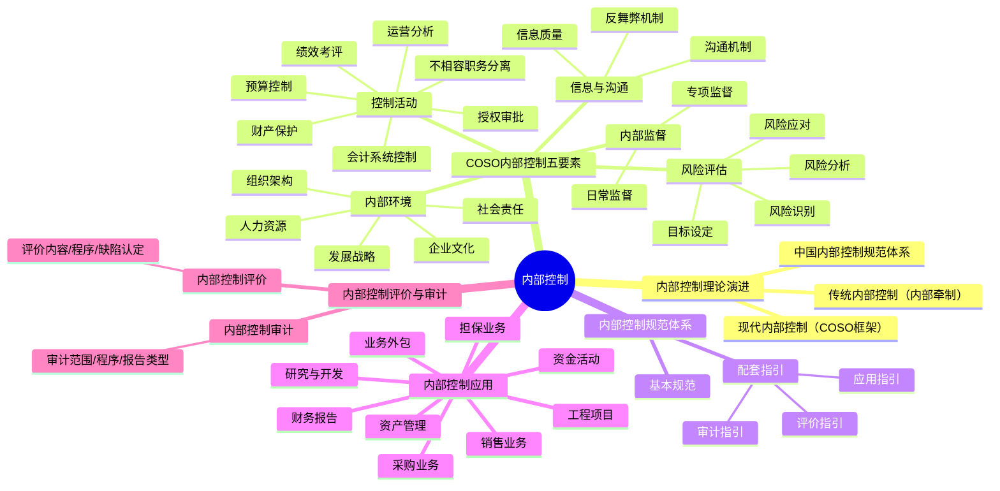

## 📍 章节定位

| 项目 | 信息 |
|------|------|
| **所属科目** | 🎯 公司战略与风险管理 |
| **难度等级** | ⭐⭐⭐⭐ |
| **历年分值** | 6-8分 |
| **建议学时** | 8-10h |
| **核心地位** | 风险管理篇实务，主观题常考章节 |

## 📝 考情分析

本章聚焦内部控制的理论框架与实务应用，是主观题和客观题的高频考点。历年分值约 6-8 分，主观题（简答/综合）和客观题（单选/多选）并重。

### 命题规律与重点考查趋势

近五年考查频率较高的考点分布如下：

| 考点 | 出题频次 | 题型偏好 | 难度 |
|------|----------|----------|------|
| 内部控制五要素辨识 | ★★★★★ | 单选/多选 | 易 |
| 不相容职务四分离 | ★★★★★ | 简答/案例 | 中 |
| 控制活动七措施 | ★★★★ | 单选/多选 | 中 |
| 内控应用指引（资金/采购/销售） | ★★★★ | 案例 | 中 |
| 内控缺陷三级认定 | ★★★★★ | 案例 | 中 |
| 重大缺陷迹象辨识 | ★★★★ | 多选 | 中 |
| 内部控制评价程序 | ★★★ | 简答 | 易 |
| 审计报告四类型 | ★★★★ | 单选/案例 | 中 |
| 内部控制与风险管理关系 | ★★★ | 简答 | 易 |
| 中国内部控制规范体系 | ★★★ | 多选 | 易 |

### 命题热点

1. **不相容职务分离的辨识**：给定案例描述（如出纳兼任对账），判断违反哪项不相容职务分离原则。命题陷阱：四分离包括"授权批准与业务经办、业务经办与会计记录、会计记录与财产保管、业务经办与稽核检查"——记住"经办"出现的次数最多。
2. **内部控制缺陷等级认定**：给定案例描述（如董事舞弊、更正已公布财务报告），判断属于重大/重要/一般缺陷。命题陷阱：重大缺陷的四个迹象是必背考点，凡是涉及董事/高管舞弊、已公布财务报告更正的，一律认定为重大缺陷。
3. **内部控制审计报告类型**：给定审计发现，判断出具哪种审计报告。命题陷阱：存在重大缺陷→否定意见（不是保留意见）；审计范围受限→无法表示意见。
4. **控制活动的应用**：给定业务场景，判断属于哪种控制活动。命题陷阱：预算控制 vs 运营分析控制易混淆——预算控制是"通过预算编制、执行、调整、考核实施控制"，运营分析控制是"通过因素分析、对比分析、趋势分析实施控制"。
5. **内控应用指引的风险点与控制措施**：资金活动、采购业务、销售业务、资产管理的常见风险点及对应控制措施，是案例分析题的高频素材。

### 与前后章联系

- **承前**：本章承接第 6 章"风险与风险管理"——风险管理流程中的"内部控制系统"即本章内容。内部控制是风险管理的重要基础和必要举措。两章结合是综合题的常见出题方式，要求判断内控缺陷并提出改进建议。
- **启后**：本章的"信息系统控制"与第 8 章"信息技术应用"密切相关，信息系统的内部控制（一般控制与应用控制）是信息技术应用的重要内容。

### 学习方法建议

- **要素记忆法**：内控五要素用口诀"环评活信督"快速回忆，每个要素的核心内容配案例锚定；
- **对比记忆法**：内部控制 vs 风险管理（范畴、目标、对象、手段）、内控评价 vs 内控审计（主体、目标、程序）、不同审计报告类型的对比；
- **案例辨识法**：通过案例描述判断控制缺陷类型、审计报告类型、不相容职务违反情况；
- **流程梳理法**：内控评价六步程序（制定方案→组成工作组→现场测试→认定缺陷→汇总结果→编制报告）和内控审计五步程序（计划→实施→评价缺陷→完成→出具报告）需熟记顺序。

## 🧠 知识框架

## 📖 核心精讲

### 一、内部控制理论演进

#### （一）内部控制的概念

内部控制是由企业董事会、监事会、经理层和全体员工实施的、旨在实现控制目标的过程。

> 📌 **关键内涵**：①内部控制是"全过程"而非"瞬间"管理；②实施主体是"全员"（董事会、监事会、经理层、员工），不仅是财务或审计部门；③目标是"合理保证"而非"绝对保证"。

**内部控制的五个目标**：

| 序号 | 目标 | 类别 |
|------|------|------|
| 1 | 合理保证企业经营管理合法合规 | 合规目标 |
| 2 | 合理保证资产安全 | 资产目标 |
| 3 | 合理保证财务报告及相关信息真实完整 | 报告目标 |
| 4 | 提高经营效率和效果 | 经营目标 |
| 5 | 促进企业实现发展战略 | 战略目标 |

> 📌 **目标层次**：前三个是"合理保证"型目标（可控性强），后两个是"促进"型目标（受外部因素影响大，内控只能起促进作用）。命题陷阱：内控只能"合理保证"而非"绝对保证"目标的实现，因为存在客观局限性。

**内部控制的固有局限性**：
- 决策判断失误导致的偏差；
- 串通舞弊导致控制失效（两人以上合谋绕过控制）；
- 管理层凌驾于内部控制之上（管理层越权）；
- 控制措施的成本效益考量（成本过高时放弃控制）；
- 突发事件和外部环境变化。

#### （二）内部控制理论发展阶段

| 阶段 | 时期 | 核心内容 | 代表成果 |
|------|------|----------|----------|
| **内部牵制阶段** | 20世纪初-40年代 | 以账目间核对和岗位分离为核心 | 1912年蒙哥马利《审计理论与实务》 |
| **内部控制制度阶段** | 40年代-80年代 | 区分会计控制和管理控制 | 1958年AICPA《独立审计人员公认审计标准》 |
| **内部控制结构阶段** | 80年代-90年代 | 控制环境、会计系统、控制程序三要素 | 1988年AICPA《审计准则公告第55号》 |
| **内部控制框架阶段** | 90年代至今 | 五要素整合框架 | 1992年COSO《内部控制——整合框架》、2013年修订版 |

#### （三）COSO内部控制框架

1992年美国COSO发布《内部控制——整合框架》，明确了内部控制的**五个要素**：控制环境、风险评估、控制活动、信息与沟通、监督。

2013年COSO发布修订版《内部控制——整合框架》，主要变化：
- 保留五要素框架；
- 将"控制环境"改为"内部环境"（Control Environment 译为内部环境更准确）；
- 引入17项原则（每要素对应若干原则），共77个关注点；
- 扩展了报告目标（包含财务报告和非财务报告）；
- 强化了对技术变化和业务环境的考虑。

**2013版COSO五要素对应的17项原则**：

| 要素 | 原则数 | 核心原则示例 |
|------|--------|--------------|
| **内部环境** | 5 | 诚信与道德价值观、董事会独立性、组织结构、commitment to competence、问责制 |
| **风险评估** | 4 | 明确目标、风险识别、舞弊风险识别、应对变化 |
| **控制活动** | 3 | 选择与开发控制活动、选择开发一般控制（IT）、部署控制活动（政策+程序） |
| **信息与沟通** | 3 | 获取与使用相关信息、内部沟通、外部沟通 |
| **内部监督** | 2 | 持续评估与单独评估、评价缺陷 |
| **合计** | **17** | —— |

#### （四）中国内部控制规范体系

我国企业内部控制规范体系由"一个基本规范+三个配套指引"构成：

| 规范 | 发布时间 | 定位 | 内容要点 |
|------|----------|------|----------|
| 《企业内部控制基本规范》 | 2008年5月（五部委：财政部、证监会、审计署、银监会、保监会） | 基础性规范，上市公司2009年7月施行 | 内控定义、五要素、五目标、基本要求 |
| 《企业内部控制应用指引》 | 2010年4月 | 具体业务和事项的内控要求 | 18项应用指引（组织架构、发展战略、人力资源、社会责任、企业文化、资金活动、采购业务、资产管理、销售业务、研究与开发、工程项目、担保业务、业务外包、财务报告、全面预算、合同管理、内部信息传递、信息系统） |
| 《企业内部控制评价指引》 | 2010年4月 | 内控自我评价的规范 | 评价原则、内容、程序、缺陷认定、报告 |
| 《企业内部控制审计指引》 | 2010年4月 | 外部审计的规范 | 审计范围、计划、实施、报告 |

> 📌 **18项应用指引分类记忆**：①内部环境类5项（组织架构、发展战略、人力资源、社会责任、企业文化）；②业务流程类9项（资金活动、采购业务、资产管理、销售业务、研究与开发、工程项目、担保业务、业务外包、财务报告）；③控制手段类4项（全面预算、合同管理、内部信息传递、信息系统）。

**适用范围**：
- 上市公司（强制执行）；
- 非上市大中型企业（鼓励执行）；
- 小型企业（参照执行）。

**案例锚定——中国内控实践**：

| 企业 | 内控实践特点 |
|------|-------------|
| 中国石油 | 建立内控体系覆盖全部业务，实施内控自我评价与缺陷整改 |
| 中国银行 | 依据COSO框架构建全面风险管理与内控体系，引入巴塞尔协议要求 |
| 华为 | 内控体系涵盖业务流程、IT系统、组织架构，实施全球统一内控标准 |
| 阿里巴巴 | 平台型企业的特殊内控——除常规内控外，强化数据治理与合规审查 |

### 二、内部控制五要素

#### （一）内部环境

内部环境是实施内部控制的基础，影响全体员工的控制意识，是其他要素的基石。内部环境不好，其他要素再完善也难以发挥作用。

| 要素 | 内容 | 关键控制点 |
|------|------|------------|
| **组织架构** | 治理结构（股东会、董事会、监事会、经理层）和内部机构设置 | 董事会下设专门委员会；不相容岗位分离；权责对等 |
| **发展战略** | 战略规划制定、实施与调整 | 战略委员会审议；避免盲目扩张；动态调整机制 |
| **人力资源** | 招聘、培训、考核、薪酬、退出 | 关键岗位轮岗；薪酬与绩效挂钩；退出机制规范 |
| **社会责任** | 安全生产、产品质量、环境保护、员工权益 | 安全生产责任制；产品质量追溯；环保投入保障 |
| **企业文化** | 价值观、经营理念、行为规范、企业形象 | 诚信价值观；反舞弊文化；领导层以身作则 |

**组织架构的关键控制**：
- 治理结构：股东会、董事会、监事会、经理层的权责划分清晰；
- 内部机构：按业务性质设置，避免职能重叠或缺失；
- 不相容岗位分离：决策、执行、监督相互独立。

**人力资源的关键控制**：
- 招聘环节：背景调查、能力评估；
- 培训环节：岗前培训、定期培训；
- 考核环节：业绩考核、合规考核；
- 薪酬环节：薪酬与绩效、合规挂钩；
- 退出环节：交接清晰、知识产权保护、竞业限制。

**案例锚定——华为的内部环境建设**：
- 组织架构：轮值CEO制度+董事会集体决策，避免个人集权；
- 发展战略：战略研究院前瞻布局，避免短期主义；
- 人力资源：全员持股+末位淘汰，激励与约束并重；
- 社会责任：每年发布可持续发展报告，强化供应链社会责任；
- 企业文化："以客户为中心、以奋斗者为本"的核心价值观深入人心。

#### （二）风险评估

风险评估是及时识别、系统分析经营活动中与实现内部控制目标相关的风险，合理确定风险应对策略。

风险评估流程：**目标设定→风险识别→风险分析→风险应对**。

| 步骤 | 内容 | 方法 |
|------|------|------|
| **目标设定** | 明确与内控目标一致的经营目标 | 战略目标分解、年度经营目标 |
| **风险识别** | 识别影响目标实现的内外部风险 | 风险清单、流程图分析、头脑风暴 |
| **风险分析** | 分析风险发生可能性和影响程度 | 风险矩阵、定性/定量分析 |
| **风险应对** | 选择风险应对策略 | 风险承担、规避、转移、转换、对冲、补偿、控制（详见第6章） |

> 📌 **风险评估与风险管理的关系**：本章的风险评估是 COSO 内控五要素之一，范围限定于"与内控目标相关的风险"；第 6 章的风险管理范围更广，包括战略风险、市场风险、财务风险、运营风险、法律合规风险。两章的风险评估流程一致。

**案例分析——某制造企业的风险评估**：
某家电制造企业进行风险评估，识别出以下风险：
- 原材料价格波动风险（市场风险）；
- 应收账款坏账风险（信用风险）；
- 产品质量事故风险（运营风险）；
- 环保合规风险（法律合规风险）。

通过风险矩阵分析，确定原材料价格波动和应收账款坏账为高风险，需采取风险对冲（远期合约）和风险控制（信用评估）措施。

#### （三）控制活动

控制活动是企业根据风险评估结果，采用相应的控制措施，将风险控制在可承受度之内。控制活动是内控五要素中的"执行"环节，直接影响内控的有效性。

**七种控制措施**：

| 控制措施 | 含义 | 应用 | 案例 |
|----------|------|------|------|
| **不相容职务分离控制** | 不相容职务由不同人员担任 | 授权批准与业务经办、业务经办与会计记录、会计记录与财产保管、业务经办与稽核检查 | 出纳与会计分离、采购与验收分离 |
| **授权审批控制** | 明确授权范围、权限、程序、责任 | 常规授权（制度化）和特别授权（临时性） | 重大采购需集体决策、超额支出需总经理审批 |
| **会计系统控制** | 通过会计核算和监督 | 凭证、账簿、财务报告 | 复式记账、账证核对、账账核对、账实核对 |
| **财产保护控制** | 确保资产安全完整 | 限制接触、定期盘点、账实核对、财产保险 | 仓库专人管理、定期盘点、贵重资产保险 |
| **预算控制** | 通过预算实施控制 | 预算编制、执行、调整、考核 | 年度预算审批、超预算审批、预算执行分析 |
| **运营分析控制** | 对运营情况进行分析 | 因素分析、对比分析、趋势分析 | 月度经营分析会、KPI达成分析 |
| **绩效考评控制** | 通过绩效评价实施控制 | 设定指标、考核评价、奖惩兑现 | 平衡计分卡、KPI考核、绩效奖金 |

> 📌 **高频考点——不相容职务四分离**：①授权批准与业务经办分离；②业务经办与会计记录分离；③会计记录与财产保管分离；④业务经办与稽核检查分离。

**不相容职务分离的实务应用**：

| 业务场景 | 不相容职务 | 分离要求 |
|----------|-----------|----------|
| 货币资金 | 出纳与会计 | 出纳只管钱，会计只管账；出纳不能编制银行存款余额调节表 |
| 采购业务 | 采购与验收、采购与付款 | 采购员不能自行验收；采购员不能直接付款 |
| 销售业务 | 销售与收款 | 销售员不能直接收款（特殊行业除外） |
| 存货管理 | 保管与记账、保管与盘点 | 仓库管理员不能负责存货账务；盘点需独立人员参加 |
| 固定资产 | 资产管理、记账、处置 | 资产使用、记账、处置应分离 |

**授权审批控制的两种类型**：

| 类型 | 含义 | 案例 |
|------|------|------|
| **常规授权** | 制度化的、长期有效的授权 | 部门经理可审批10万元以下采购 |
| **特别授权** | 临时性的、针对特定事项的授权 | 董事会特别授权CEO处理某项重大并购 |

#### （四）信息与沟通

信息与沟通是及时、准确地收集、传递与内部控制相关的信息，确保信息在企业内部和外部有效流动。

**信息与沟通的三个方面**：

| 方面 | 内容 | 案例 |
|------|------|------|
| **信息质量** | 确保信息真实、准确、完整、及时 | 建立信息质量审核机制、数据校验 |
| **沟通机制** | 内部沟通（各层级之间）和外部沟通（与外部利益相关者） | 例会制度、报告制度、对外信息披露 |
| **反舞弊机制** | 建立反舞弊举报渠道和调查程序 | 举报热线、举报邮箱、调查程序、举报人保护 |

**反舞弊机制的重点**：
- 建立举报渠道：举报热线、举报邮箱、网络举报平台；
- 保护举报人：保密制度、禁止报复；
- 调查程序：独立调查、证据保全、处理结果反馈；
- 重点防范：高管舞弊、财务造假、关联交易侵占、商业贿赂。

**信息系统在信息与沟通中的作用**：
- 集成化：ERP系统整合业务数据，确保数据一致性；
- 实时性：业务发生即时记录，缩短信息传递时滞；
- 可追溯：操作日志、审批痕迹可追溯；
- 自动化控制：系统自动校验、自动审批、自动预警。

**案例锚定——阿里巴巴的信息与沟通机制**：
- 内部沟通：钉钉协同平台、阿里味儿内部论坛、季度全员大会；
- 外部沟通：定期财报披露、投资者关系管理、监管沟通；
- 反舞弊：廉政合规部、阿里举报平台、零容忍舞弊政策。

#### （五）内部监督

内部监督是企业对内部控制建立与执行情况进行监督评价，确保内控持续有效。

| 監督类型 | 含义 | 实施方式 | 频率 |
|----------|------|----------|------|
| **日常监督** | 持续性的、常规性的监督检查 | 内审部门日常审计、管理层日常检查、员工自查 | 持续 |
| **专项监督** | 针对某项业务或特定事项的专门监督检查 | 专项审计、专项检查、专题评估 | 不定期 |

**日常监督的方式**：
- 管理层日常监督：日常管理活动中实时监督；
- 内部审计：内审部门日常审计工作；
- 职能部门监督：财务、合规、风险等职能部门的日常检查；
- 员工监督：员工对内控执行的自我监督和相互监督。

**专项监督的触发条件**：
- 重大业务变化（并购、重组、新业务）；
- 重大风险事件发生；
- 监管要求变化；
- 内控评价发现重大问题；
- 关键人员变动。

**内部监督与内部审计的关系**：
内部审计是内部监督的重要方式，但不是唯一方式。内部监督还包括管理层日常监督、职能部门监督等。内部审计具有独立性和系统性，是内部监督的核心。

**案例锚定——海尔的内部监督体系**：
- 日清日高模式：每日工作日清，及时发现问题；
- 内部审计：集团审计中心独立运作；
- 专项监督：针对重大投资、关联交易开展专项审计；
- 自主经营体：每个经营体自我监督，实现全员内控。

### 三、内部控制应用

内部控制应用指引覆盖企业主要业务和事项，本节重点讲解资金活动、采购业务、销售业务、资产管理、研究与开发、工程项目、担保业务、业务外包、财务报告等九类业务的风险点与控制措施。

#### （一）资金活动

资金活动包括筹资、投资和资金营运三个环节。

**筹资活动的风险点与控制措施**：

| 风险点 | 控制措施 |
|--------|----------|
| 筹资决策不当，资本结构不合理 | 科学论证筹资方案，集体决策审批 |
| 筹资成本过高，债务违约风险 | 多方比价，合理确定筹资方式和期限 |
| 募集资金使用不规范 | 专户存储，专款专用，跟踪管理 |
| 信息披露不及时 | 按规定披露筹资信息 |

**投资活动的风险点与控制措施**：

| 风险点 | 控制措施 |
|--------|----------|
| 投资决策失误，盲目投资 | 可行性研究，集体决策，跟踪管理 |
| 投资项目实施失控 | 派驻董事/财务总监，定期报告 |
| 投资退出机制缺失 | 制定退出方案，及时止损 |

**资金营运的风险点与控制措施**：

| 风险点 | 控制措施 |
|--------|----------|
| 资金调度不合理，闲置或短缺 | 统一调度，严格审批，月度资金计划 |
| 账户管理混乱 | 严禁出租出借账户，不相容职务分离 |
| 资金挪用风险 | 限额管理，大额支出审批 |

**案例锚定——恒大集团资金活动失控**：
- 高杠杆融资：负债规模超2万亿元，资本结构严重失衡；
- 募集资金挪用：部分募集资金未按约定用途使用；
- 资金调度失控：子公司资金被母公司占用，导致全集团资金链断裂；
- 投资决策失误：多元化投资（汽车、健康、文旅）大量沉淀资金。

#### （二）采购业务

采购业务涉及采购计划、供应商选择、价格谈判、合同签订、验收、付款等环节。

| 风险点 | 控制措施 |
|--------|----------|
| 采购计划不合理 | 编制采购计划，审批后执行；与生产计划衔接 |
| 供应商选择不当 | 建立供应商准入和评价制度，定期考核 |
| 采购价格不合理 | 比价采购、招标采购，建立价格数据库 |
| 验收不规范 | 严格验收程序，不相容职务分离，独立验收 |
| 付款审批不严 | 三单匹配（订单、收货单、发票），审批后付款 |

**采购业务的控制要点——三单匹配**：
采购业务付款前需核对三单一致：采购订单、收货单（验收单）、供应商发票。三单金额、数量、规格一致方可付款，防止虚构采购、虚开发票。

**案例锚定——华为的供应链内控**：
- 供应商管理：分级管理（战略供应商、合格供应商、潜在供应商），定期考核；
- 采购透明：电子采购平台公开招标，杜绝暗箱操作；
- 阳光采购：采购人员利益冲突申报，禁止接受供应商礼品；
- 三单匹配：ERP系统自动核对订单、收货、发票，不一致自动拦截。

#### （三）销售业务

销售业务涉及销售策略、客户信用、合同签订、发货、收款等环节。

| 风险点 | 控制措施 |
|--------|----------|
| 销售策略不当 | 制定销售政策，审批信用额度，定期评估 |
| 客户信用风险 | 建立客户信用评估体系，分级授信，动态调整 |
| 合同签订不规范 | 标准合同模板，法务审核，权限管理 |
| 发货不规范 | 审核订单，授权发货，独立核对 |
| 收款不及时 | 应收账款管理，定期对账，催收制度，账龄分析 |

**应收账款的内控要点**：
- 客户信用评估：销售前评估客户信用，分级授信；
- 信用额度管理：设定信用额度和信用期，超额度需审批；
- 应收账款账龄分析：定期分析账龄，识别坏账风险；
- 催收制度：建立分级催收机制，逾期应收专人催收；
- 坏账核销：坏账核销需严格审批，防止舞弊。

#### （四）资产管理

资产管理确保资产安全完整，防止资产流失。包括存货管理、固定资产管理和无形资产管理。

**存货管理的风险点与控制措施**：

| 风险点 | 控制措施 |
|--------|----------|
| 存货积压或短缺 | 科学制定存货定额，定期分析库存 |
| 存货保管不善 | 仓库专人管理，限制接触，定期盘点 |
| 存货账实不符 | 定期盘点，账实核对，差异处理 |
| 存货报废处理不规范 | 严格审批报废，独立核销 |

**固定资产管理的风险点与控制措施**：

| 风险点 | 控制措施 |
|--------|----------|
| 固定资产购置不当 | 可行性研究，预算管理，集体决策 |
| 固定资产闲置 | 定期盘点，优化配置，及时处置 |
| 固定资产盘点不准 | 定期盘点，标签管理，账实核对 |
| 固定资产处置不规范 | 严格审批，独立评估，公开处置 |

**无形资产管理的风险点与控制措施**：

| 风险点 | 控制措施 |
|--------|----------|
| 无形资产权属不清 | 及时登记注册，明确权属 |
| 无形资产被侵权 | 加强知识产权保护，监测侵权行为 |
| 无形资产价值评估不当 | 独立评估，定期复核 |

#### （五）研究与开发

研究与开发业务涉及研发立项、研发过程、研发成果转化等环节。

| 风险点 | 控制措施 |
|--------|----------|
| 研发项目论证不充分 | 可行性研究，专家评审，集体决策 |
| 研发过程管理失控 | 阶段性评审，里程碑管理，预算控制 |
| 研发成果转化不力 | 建立成果转化机制，知识产权保护 |
| 研发人员流失风险 | 激励机制，保密协议，竞业限制 |

**研发内控的关键控制点**：
- 立项审批：研发项目需可行性研究和专家评审，重大研发集体决策；
- 过程管理：阶段性评审，里程碑验收，预算控制；
- 成果管理：研发成果需评估、验收、登记，知识产权保护；
- 人员管理：研发人员保密协议、竞业限制、激励机制。

**案例锚定——华为研发内控**：
- 研发投入：年研发投入超千亿，研发占比超15%；
- 立项管理：IPD集成产品开发流程，分阶段评审；
- 成果管理：全球专利申请量第一，知识产权布局完善；
- 人员激励：研发人员股权激励，保留核心人才。

#### （六）工程项目

工程项目涉及立项、招标、建设、验收等环节。

| 风险点 | 控制措施 |
|--------|----------|
| 立项不当 | 可行性研究，集体决策，审批程序 |
| 招标不规范 | 公开招标，评标独立，禁止串标 |
| 工程建设失控 | 监理制度，过程监督，变更审批 |
| 竣工验收不规范 | 独立验收，决算审计 |

#### （七）担保业务

担保业务涉及担保评估、审批、执行、监控等环节。

| 风险点 | 控制措施 |
|--------|----------|
| 担保评估不当 | 资信评估，风险评估，独立审核 |
| 担保审批不严 | 集体决策，权限管理，董事会审议 |
| 担保监控缺失 | 跟踪被担保方财务状况，预警机制 |
| 担保代偿风险 | 反担保措施，风险准备 |

**担保内控的关键要求**：
- 严禁对外担保（除子公司外）；
- 严禁为个人提供担保；
- 单笔担保和累计担保需董事会或股东大会审议；
- 关联方担保需独立董事审核。

**案例锚定——上市公司违规担保**：
- ST康得新：违规为关联方提供担保超百亿元，未履行审批程序；
- ST康美：实控人违规占用资金和担保，导致公司巨额损失；
- 教训：担保内控失控是上市公司退市的重要原因。

#### （八）业务外包

业务外包涉及外包决策、外包商选择、外包执行、外包监控等环节。

| 风险点 | 控制措施 |
|--------|----------|
| 外包决策不当 | 评估核心业务，避免核心业务外包 |
| 外包商选择不当 | 资质评估，多方比选，合同约束 |
| 外包质量失控 | 服务水平协议（SLA），过程监督 |
| 外包信息安全风险 | 保密协议，数据隔离，权限控制 |

#### （九）财务报告

财务报告确保财务报告真实完整。规范财务报告编制、对外提供和分析利用流程。

| 风险点 | 控制措施 |
|--------|----------|
| 财务报告编制不规范 | 会计政策一致，编制流程规范 |
| 财务信息失真 | 账务核对，审计监督，反舞弊机制 |
| 财务报告披露不及时 | 严格披露时限，董秘负责制 |
| 财务报告分析利用不足 | 定期分析，决策支持 |

**财务报告内控的关键控制**：
- 会计政策：会计政策一经确定不得随意变更，变更需说明；
- 财务结账：月度结账、年度结账流程规范化；
- 报表编制：财务报表需经过复核、审批后对外披露；
- 审计沟通：与外部审计师保持沟通，配合审计工作；
- 业绩预告：业绩预告需审慎，重大差异需说明。

**案例锚定——瑞幸咖啡财务造假案**：
- 财务报告失真：虚增收入22亿元，财务数据严重失真；
- 内控失效：管理层凌驾于内部控制之上，串通舞弊；
- 监督失效：审计委员会未有效发挥作用；
- 教训：财务报告内控是上市公司合规的生命线，管理层舞弊可致退市。

### 四、内部控制评价

内部控制评价是企业董事会或类似权力机构对内部控制的有效性进行全面评价、形成评价结论、出具评价报告的过程。

#### （一）评价原则

- **全面性原则**：涵盖内部控制的所有要素和业务活动，贯穿决策、执行、监督全过程；
- **重要性原则**：在全面基础上关注重要业务事项和高风险领域；
- **客观性原则**：如实反映内部控制设计与运行情况，准确揭示经营风险和管理薄弱环节。

#### （二）评价内容

围绕内部控制五要素进行评价，重点关注：
- 内部控制设计是否有效（设计有效性）；
- 内部控制执行是否有效（运行有效性）。

**设计有效性 vs 运行有效性**：

| 维度 | 设计有效性 | 运行有效性 |
|------|-----------|-----------|
| 关注点 | 内控是否设计合理，能否满足控制目标 | 内控是否按设计执行，执行是否持续 |
| 评价方法 | 流程图分析、风险控制矩阵、穿行测试 | 抽样测试、实地查验、观察 |
| 关键问题 | 控制是否存在？控制是否合理？ | 控制是否执行？执行是否一致？执行人员是否有权限？ |

#### （三）内部控制缺陷认定

内部控制缺陷按影响程度分为三级：

| 缺陷类型 | 认定标准 | 定量参考（利润总额） |
|----------|----------|---------------------|
| **重大缺陷** | 可能导致企业严重偏离控制目标 | 错报 ≥ 利润总额 5% |
| **重要缺陷** | 严重程度低于重大缺陷，但仍可能导致偏离控制目标 | 利润总额 3% ≤ 错报 < 5% |
| **一般缺陷** | 严重程度低于重大和重要缺陷 | 错报 < 利润总额 3% |

> 📌 **重大缺陷迹象（必背考点）**：①董事、监事、高管舞弊；②更正已公布的财务报告；③审计委员会和内审机构未有效发挥监督作用；④缺乏内部控制评价监督。

**内部控制缺陷的认定流程**：
1. 评价工作组初步认定；
2. 内部控制评价部门复核；
3. 董事会或类似权力机构最终认定。

**缺陷整改**：
- 重大缺陷：立即整改，向董事会报告，必要时披露；
- 重要缺陷：限期整改，跟踪验证；
- 一般缺陷：纳入持续改进，定期整改。

#### （四）评价程序

内部控制评价程序包括六个步骤：

| 步骤 | 内容 | 关键要求 |
|------|------|----------|
| 1. 制定评价工作方案 | 明确评价范围、内容、时间、人员 | 经董事会批准 |
| 2. 组成评价工作组 | 抽调内审、财务、业务人员 | 独立性要求 |
| 3. 实施现场测试 | 个别访谈、调查问卷、专题讨论、穿行测试、实地查验、抽样、比较分析 | 多种方法结合 |
| 4. 认定内部控制缺陷 | 按重大/重要/一般三级认定 | 按定量定性标准 |
| 5. 汇总评价结果 | 形成评价底稿、汇总表 | 证据充分 |
| 6. 编制评价报告 | 出具内控自我评价报告 | 董事会审议通过 |

**现场测试的七种方法**：

| 方法 | 含义 | 适用场景 |
|------|------|----------|
| **个别访谈** | 与相关人员一对一访谈 | 了解内控设计、执行情况 |
| **调查问卷** | 发放问卷收集信息 | 大范围评价、员工反馈 |
| **专题讨论** | 召集相关人员集中讨论 | 复杂业务、跨部门事项 |
| **穿行测试** | 将初始数据输入内控流程，穿越全流程 | 验证内控设计有效性 |
| **实地查验** | 现场查看实物资产、业务流程 | 资产管理、生产现场 |
| **抽样** | 抽取样本测试控制执行情况 | 验证运行有效性 |
| **比较分析** | 对比不同期间、不同业务数据 | 发现异常、识别风险 |

#### （五）内部控制评价报告

内部控制评价报告是企业对内部控制有效性进行自我评价后出具的报告。

**评价报告的主要内容**：
- 董事会声明（对内控有效性负责）；
- 内控评价工作的总体情况；
- 内控评价的依据；
- 内控缺陷认定及整改情况；
- 内控有效性的结论。

**评价报告的披露要求**：
- 上市公司应在年度报告中披露内控评价报告；
- 评价报告需经董事会审议通过；
- 存在重大缺陷的需披露缺陷情况及整改计划。

### 五、内部控制审计

内部控制审计是指会计师事务所接受委托，对特定基准日内部控制设计与运行的有效性进行审计。

> 📌 **内控评价 vs 内控审计的对比**：

| 维度 | 内部控制评价 | 内部控制审计 |
|------|-------------|-------------|
| **主体** | 企业自身（董事会或类似机构） | 外部会计师事务所 |
| **性质** | 自我评价 | 外部审计 |
| **目标** | 评价内控有效性，发现缺陷 | 对内控有效性发表审计意见 |
| **范围** | 内部控制整体（五要素全覆盖） | 财务报告内部控制为核心 |
| **报告对象** | 董事会，对外披露 | 股东，对外披露 |
| **依据** | 《企业内部控制评价指引》 | 《企业内部控制审计指引》 |

#### （一）审计范围

审计范围覆盖企业内部控制整体，但以**财务报告内部控制**为核心。

**财务报告内部控制** vs **非财务报告内部控制**：

| 类型 | 含义 | 审计要求 |
|------|------|----------|
| **财务报告内部控制** | 与财务报告可靠性相关的内控 | 必须审计，发表审计意见 |
| **非财务报告内部控制** | 与经营效率、合规、战略等相关的内控 | 关注重大缺陷，在审计报告中说明 |

#### （二）审计程序

内部控制审计采用**自上而下**的审计方法：

| 步骤 | 内容 | 关键要求 |
|------|------|----------|
| 1. 计划审计工作 | 评估风险、确定审计范围 | 风险导向，关注高风险领域 |
| 2. 实施审计工作 | 自上而下方法（公司层面→业务层面→账户层面） | 先识别企业层面控制，再测试业务层面控制 |
| 3. 评价控制缺陷 | 评价缺陷的严重程度 | 按重大/重要/一般分级 |
| 4. 完成审计工作 | 评价审计证据、形成结论 | 证据充分、结论可靠 |
| 5. 出具审计报告 | 按四种类型出具报告 | 按准则要求出具 |

**自上而下审计方法的核心逻辑**：
1. **公司层面控制**：评估治理结构、内部环境、IT一般控制等；
2. **业务层面控制**：评估重要业务流程的控制（如收入确认、采购付款）；
3. **账户层面控制**：评估重要账户的控制（如应收账款、存货、固定资产）。

**审计测试的方法**：
- **询问**：与相关人员沟通了解内控；
- **观察**：实地观察控制执行情况；
- **检查**：检查文件、记录、报告；
- **重新执行**：审计人员重新执行控制程序。

#### （三）审计报告类型

| 报告类型 | 出具条件 | 说明 |
|----------|----------|------|
| **标准审计报告** | 内部控制有效，无重大缺陷 | 无保留意见 |
| **带强调事项段的无保留意见** | 内部控制有效，但存在需强调事项 | 如期后事项、重大变化 |
| **否定意见** | 存在重大缺陷 | 须说明重大缺陷的性质 |
| **无法表示意见** | 审计范围受限，无法获取充分证据 | 如管理层不配合、记录缺失 |

> 📌 **审计报告类型选择原则**：①无重大缺陷且范围未受限→标准审计报告；②无重大缺陷但有需强调事项→带强调事项段的无保留意见；③存在重大缺陷→否定意见；④审计范围严重受限→无法表示意见。注意：不存在"保留意见"类型，只有上述四种。

**否定意见审计报告的常见情形**：
- 财务报告内部控制存在重大缺陷（如管理层凌驾于内控之上、严重财务造假）；
- 内部控制设计存在重大缺陷且未整改；
- 内部控制执行存在重大缺陷（如长期不执行关键控制）。

**无法表示意见审计报告的常见情形**：
- 管理层不提供必要的文件和信息；
- 内部控制记录严重缺失；
- 关键管理人员不配合审计；
- 审计范围受到严重限制（如时间限制、地点限制）。

### 六、内部控制与风险管理的关系

| 维度 | 内部控制 | 风险管理 |
|------|----------|----------|
| **范畴** | 风险管理的基础和组成部分 | 更宽泛，包含内部控制 |
| **目标** | 财务报告可靠、资产安全、合规 | 价值创造、战略实现 |
| **对象** | 业务和管理流程 | 战略、市场、运营等全方位 |
| **风险类型** | 可控纯粹风险 | 纯粹风险+机会风险 |
| **控制对象** | 企业中的个人（员工行为） | 企业整体风险 |
| **目的** | 规范员工行为，防止错弊 | 价值创造、风险与收益平衡 |
| **手段** | 制度、程序、措施 | 策略工具+内部控制+信息系统 |
| **主导部门** | 管理层、内审部门 | 董事会、风险管理委员会 |

> 📌 内部控制是全面风险管理的重要基础和必要举措。内控针对的是可控纯粹风险，控制对象是企业中的个人，目的是规范员工行为；风险管理针对的是企业整体风险，包括机会风险，目的是价值创造。

### 七、信息系统的一般控制与应用控制

信息系统的内部控制分为一般控制和应用控制，是信息技术环境下内控的重要组成部分。

| 控制类型 | 含义 | 主要内容 |
|----------|------|----------|
| **一般控制** | 对整个信息系统环境的控制 | IT治理、系统开发、系统运维、访问安全、变更管理 |
| **应用控制** | 对具体业务应用系统的控制 | 输入控制、处理控制、输出控制 |

**信息系统一般控制（ITGC）**：

| 控制要素 | 关键控制 |
|----------|----------|
| **IT治理与管理** | IT战略与业务战略对齐，IT组织架构，IT制度 |
| **系统开发与维护** | 系统开发周期管理，测试与验收，文档管理 |
| **访问与安全** | 用户权限管理，密码管理，访问日志，防火墙 |
| **系统运维** | 备份恢复，灾备中心，性能监控，容量管理 |
| **变更管理** | 变更申请、审批、测试、上线，版本控制 |

**信息系统应用控制（ITAC）**：

| 控制环节 | 关键控制 | 案例 |
|----------|----------|------|
| **输入控制** | 数据有效性校验、完整性校验、合理性校验 | ERP系统对采购订单金额校验 |
| **处理控制** | 处理逻辑正确性、数据一致性、断点处理 | 系统自动计算应付账款金额 |
| **输出控制** | 输出审批、输出分发、输出保留 | 财务报表审批后对外披露 |

**案例锚定——银行业信息系统内控**：
- 一般控制：核心系统访问权限分级管理，关键操作双人复核；
- 应用控制：交易系统自动校验交易合法性，异常交易自动拦截；
- 灾备控制：两地三中心灾备架构，确保业务连续性。

## 💡 典型例题

**【例题 1】（2023年简答题节选，不相容职务分离）**

某公司出纳员同时负责银行对账单的获取和银行存款余额调节表的编制。请指出该公司内部控制存在的问题并提出改进建议。

**【参考答案】**
存在的问题：出纳员同时负责银行对账单获取和银行存款余额调节表编制，违反了**不相容职务分离控制**原则。出纳（财产保管/业务经办）与对账（会计记录/稽核检查）属于不相容职务，不应由同一人担任。

改进建议：将银行对账单获取和银行存款余额调节表编制工作交由出纳以外的会计人员负责，实现不相容职务分离；定期由独立人员进行复核。

---

**【例题 2】（单选题，控制活动辨识）**

下列各项中，不属于内部控制控制活动的是（ ）。
A. 不相容职务分离控制
B. 授权审批控制
C. 内部环境控制
D. 预算控制

**答案**：C

**解析**：控制活动包括七种措施：不相容职务分离控制、授权审批控制、会计系统控制、财产保护控制、预算控制、运营分析控制、绩效考评控制。内部环境是内部控制的五要素之一，不是控制活动。命题陷阱：内部环境是"五要素"，控制活动是"五要素之一"中的"七措施"，二者是包含关系。

---

**【例题 3】（多选题，内部控制缺陷认定）**

下列情况中，应认定为内部控制重大缺陷的有（ ）。
A. 董事、监事和高级管理人员发生舞弊
B. 企业更正已公布的财务报告
C. 审计委员会和内部审计机构未有效发挥监督作用
D. 企业缺乏内部控制评价监督制度

**答案**：ABCD

**解析**：重大缺陷的四个迹象（必背）：①董事、监事、高管舞弊；②更正已公布的财务报告；③审计委员会和内审机构未有效发挥监督作用；④缺乏内部控制评价监督。ABCD 均属于重大缺陷迹象，凡是涉及高管舞弊、已公布财务报告更正的，一律认定为重大缺陷。

---

**【例题 4】（单选题，审计报告类型）**

注册会计师在对某公司内部控制进行审计时，发现该公司财务报告内部控制存在一项重大缺陷，但管理层已开始整改但截至基准日尚未完成。注册会计师应当出具的审计报告类型是（ ）。
A. 标准审计报告
B. 带强调事项段的无保留意见
C. 否定意见
D. 无法表示意见

**答案**：C

**解析**：存在重大缺陷，无论是否在整改，只要截至基准日尚未完成整改，控制仍然无效，注册会计师应当出具否定意见的审计报告。注意：内控审计不存在"保留意见"，重大缺陷→否定意见，审计范围受限→无法表示意见。

---

**【例题 5】（多选题，内部控制五要素）**

下列属于 COSO 内部控制五要素的有（ ）。
A. 内部环境
B. 风险评估
C. 控制活动
D. 信息与沟通
E. 内部监督

**答案**：ABCDE

**解析**：COSO 内部控制五要素包括：内部环境、风险评估、控制活动、信息与沟通、内部监督。口诀："环评活信督"。注意：COSO ERM（风险管理）框架是五要素（治理与文化、战略与目标设定、执行、审查与修订、信息沟通和报告），与内控五要素不同，不要混淆。

---

**【例题 6】（综合题，内部控制缺陷分析）**

某上市公司内部控制存在以下问题：
(1) 出纳员负责银行对账单获取和银行存款余额调节表编制；
(2) 销售部门负责人审批信用额度，同时负责发货；
(3) 仓库管理员负责存货的保管、记账和盘点；
(4) 财务报告编制人员未经过独立复核即对外披露；
(5) 公司董事发生舞弊行为。

要求：分析上述内控存在的问题及缺陷等级。

**答案**：

| 问题 | 违反的内控要求 | 缺陷等级 |
|------|---------------|----------|
| (1) 出纳兼任对账 | 不相容职务分离（出纳与对账分离） | 重要缺陷 |
| (2) 销售负责人同时审批和发货 | 不相容职务分离（授权批准与业务经办分离） | 重要缺陷 |
| (3) 仓库管理员保管+记账+盘点 | 不相容职务分离（保管与记账、保管与盘点分离） | 重要缺陷 |
| (4) 财务报告未独立复核 | 会计系统控制、财务报告内控 | 重要缺陷 |
| (5) 董事舞弊 | 重大缺陷迹象（董事舞弊） | **重大缺陷** |

**解析**：本题综合考查不相容职务分离和缺陷等级认定。关键点：①多个不相容职务违反构成重要缺陷（可能导致偏离控制目标但严重程度低于重大缺陷）；②董事舞弊是重大缺陷的明确迹象，无论金额大小一律认定为重大缺陷。注意缺陷等级的认定原则：单个缺陷可能是一般/重要，但若涉及重大缺陷迹象（如董事舞弊、已公布报告更正），直接认定为重大缺陷。

---

**【例题 7】（案例分析，内控改进建议）**

某公司采购业务流程如下：采购员自行选择供应商并签订采购合同，货物到达后由采购员验收，验收入库单直接交财务部门付款。请分析该流程存在的内部控制缺陷，并提出改进建议。

**答案**：

存在的缺陷：
1. 供应商选择与合同签订未分离，采购员自行决定供应商，缺乏供应商准入和评价制度；
2. 采购与验收未分离，采购员自行验收，违反不相容职务分离原则；
3. 缺乏询价比价程序，可能导致采购价格不合理；
4. 缺乏采购合同审批制度，重大采购未集体决策；
5. 验收后直接付款，缺乏三单匹配（订单、收货单、发票）。

改进建议：
1. 建立供应商准入和评价制度，实行招标/比价采购；
2. 采购与验收职务分离，由独立的验收部门验收；
3. 重大采购实行集体决策审批，建立采购合同审批制度；
4. 付款前进行三单匹配，金额、数量、规格一致方可付款；
5. 建立采购价格数据库，定期分析采购价格合理性。

## 🎯 记忆口诀

- **内控五要素**："环（内部环境）评（风险评估）活（控制活动）信（信息与沟通）督（内部监督）"——内部环境是基础，控制活动是执行。
- **内控五目标**："合（合规）资（资产）报（报告）效（效率）战（战略）"——前三个合理保证，后两个促进。
- **控制活动七措施**："不（不相容分离）授（授权审批）会（会计系统）财（财产保护）预（预算）运（运营分析）绩（绩效考评）"。
- **不相容职务四分离**："授权与经办，经办与记录，记录与保管，经办与稽核"——"经办"出现三次，是核心。
- **内控规范体系**："基（基本规范）应（应用指引）评（评价指引）审（审计指引）"——一规范+三指引。
- **18项应用指引分类**："环（环境类5）业（业务类9）控（控制手段类4）"——5+9+4=18。
- **缺陷三级**："重大-重要-一般"，重大可致严重偏离。
- **重大缺陷四迹象**："董（董事高管）舞（舞弊）报（更正报告）监（审计委员会内审未发挥）缺（缺乏评价监督）"——必背考点。
- **评价程序六步**："方（方案）组（工作组）测（现场测试）认（认定缺陷）汇（汇总）报（编制报告）"。
- **现场测试七方法**："访（访谈）问（问卷）论（讨论）穿（穿行）查（查验）样（抽样）析（比较分析）"。
- **审计报告四类型**："标（标准）强（强调）否（否定）无（无法表示）"——不存在保留意见！
- **审计程序五步**："计（计划）实（实施）评（评价缺陷）完（完成）出（出具报告）"。
- **审计自上而下三层次**："公（公司层面）业（业务层面）账（账户层面）"。
- **IT控制两类**："一（一般控制）应（应用控制）"——一般控制管环境，应用控制管业务。
- **应用控制三环节**："输（输入）处（处理）输（输出）"。
- **内控 vs 风险管理**："内控基础（针对可控纯粹风险，控制个人）；风险全面（含机会风险，价值创造）"。

## ✅ 同步练习

**1. [单选]** 下列不属于内部控制控制活动的是（ ）。
A. 不相容职务分离控制  B. 授权审批控制  C. 内部环境控制  D. 预算控制

**2. [多选]** 下列属于不相容职务的有（ ）。
A. 授权批准与业务经办  B. 业务经办与会计记录  C. 会计记录与财产保管  D. 业务经办与稽核检查

**3. [多选]** 企业内部控制规范体系包括（ ）。
A. 《企业内部控制基本规范》  B. 《企业内部控制应用指引》  C. 《企业内部控制评价指引》  D. 《企业内部控制审计指引》

**4. [简答]** 简述内部控制缺陷的三个等级及其认定标准。

**5. [案例分析]** 某公司采购业务流程如下：采购员自行选择供应商并签订采购合同，货物到达后由采购员验收，验收入库单直接交财务部门付款。请分析该流程存在的内部控制缺陷，并提出改进建议。

> 参考答案：1.C（内部环境是五要素之一，不是控制活动） 2.ABCD  3.ABCD  4.见核心精讲"内部控制缺陷认定"  5.缺陷：①供应商选择与合同签订未分离；②采购与验收未分离（采购员自行验收）；③缺乏供应商准入和评价制度；④缺乏询价比价程序。建议：①建立供应商准入和评价制度，实行招标/比价采购；②采购与验收职务分离，由独立部门验收；③重大采购实行集体决策审批；④建立采购合同审批制度。
