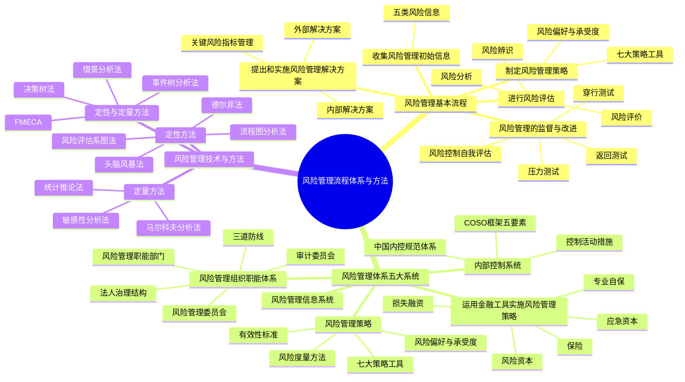

## 1. 章节定位

| 项目 | 信息 |
|------|------|
| 所属科目 | 公司战略与风险管理 |
| 难度等级 | 4 |
| 历年分值 | 6-8 分 |
| 建议学时 | 8-10 小时 |
| 知识关联章节 | 第6章风险与风险管理概述（本章是理论落地）、第8章企业面对的主要风险（本章方法用于应对具体风险）、第5章公司治理（治理结构是风控组织基础） |

## 2. 考情分析

本章是风险管理部分的核心操作章节，系统阐述风险管理的基本流程、风险管理体系五大系统、七大风险管理策略工具、内部控制系统以及十一种风险管理技术与方法。历年分值约 6-8 分，既有客观题也有主观题，主观题常以案例形式考查风险管理策略工具选择、内部控制要素辨识、风险评估方法应用等。

**命题规律**：本章内容操作性强、方法密集，客观题集中在流程步骤辨识、策略工具含义判断、内控五要素内容、风险度量方法特征、风险管理技术方法的适用范围与优缺点。主观题常以案例形式考查风险管理策略工具的选择与应用、内部控制缺陷分析、风险评估系图法的应用。

**高频考点分布**：

1. **风险管理基本流程五步骤**：收集初始信息→风险评估→制定风险管理策略→提出和实施风险管理解决方案→监督与改进。
2. **风险评估三步骤**：风险辨识、风险分析、风险评价的含义与区别。
3. **风险偏好与风险承受度**：两者概念区别、确定时考虑的因素。
4. **七大风险管理策略工具**：风险承担、风险规避、风险转移、风险转换、风险对冲、风险补偿、风险控制的含义、适用条件与案例辨识。
5. **风险度量方法**：最大可能损失、概率值、期望值、波动性、在险值（VaR）、直观方法。
6. **运用金融工具实施风险管理**：损失融资、风险资本、应急资本、保险、专业自保的含义与特点。
7. **内部控制系统**：COSO框架五要素（控制环境、风险评估、控制活动、信息与沟通、监控）；中国《基本规范》五要素；内控目标；控制活动措施（不相容职务分离、授权审批、会计系统、财产保护、预算、运营分析、绩效考评）。
8. **风险管理组织职能体系**：三道防线（第一道：业务单位；第二道：风险管理职能部门和风险管理委员会；第三道：内部审计部门和审计委员会）。
9. **风险管理监督方法**：压力测试、返回测试、穿行测试、风险控制自我评估（RCSA）。
10. **十一种风险管理技术与方法**：头脑风暴法、德尔菲法、FMECA、流程图分析法、马尔科夫分析法、风险评估系图法、情景分析法、敏感性分析法、事件树分析法、决策树法、统计推论法的适用范围与优缺点。

**备考建议**：

- 用"流程链条"串联本章：收集信息→评估→策略→解决方案→监督，理解五步骤的递进关系；
- 七大策略工具用"承担规避转移转换对冲补偿控制"记忆，注意区分风险转移（转移给第三方）与风险对冲（引入多个风险互相冲抵）；
- 内控五要素用"环评活信监"（环境、评估、活动、信息、监控）记忆；
- 十一种技术方法用表格对比记忆适用范围、定性/定量、优缺点。

## 3. 知识框架

## 4. 核心精讲

### 一、风险管理的基本流程

根据《中央企业全面风险管理指引》，风险管理基本流程分为五项主要工作：

#### （一）收集风险管理初始信息

企业要广泛地、持续不断地收集与本企业风险和风险管理相关的内部、外部初始信息，包括历史数据和预测数据。应把收集初始信息的职责分工落实到各有关职能部门和业务单位。

| 风险类型 | 收集内容 |
|----------|----------|
| **战略风险** | 国内外企业战略风险失控案例；国内外宏观环境、产业环境、竞争环境及企业内部环境信息 |
| **市场风险** | 国内外企业忽视市场风险案例；市场供给、需求、价格、竞争及经济政策信息 |
| **财务风险** | 国内外企业财务风险失控案例；全面反映本企业财务战略选择和财务管理状况的指标、数据 |
| **运营风险** | 国内外企业运营风险案例；本企业生产运营、市场营销、研发、组织人员、信息系统等信息 |
| **法律合规风险** | 国内外企业法律风险案例；政治、法律法规、政策等信息及企业内部法律风险因素 |

企业要对收集的初始信息进行必要的筛选、提炼、对比、分类、组合，以便进行风险评估。

#### （二）进行风险评估

风险评估包括**风险辨识、风险分析、风险评价**三个步骤：

| 步骤 | 含义 |
|------|------|
| **风险辨识** | 查找企业各业务单元、各项重要经营活动及重要业务流程中有无风险，有哪些风险 |
| **风险分析** | 对辨识出的风险及其特征进行明确的定义和描述，分析和描述风险发生可能性的高低、风险发生的条件 |
| **风险评价** | 评估风险对企业实现目标的影响程度、风险的价值等 |

**风险评估的方法**：应将定性与定量方法相结合。

- **定性方法**：问卷调查、集体讨论、专家咨询、情景分析、政策分析、行业标杆比较、管理层访谈、调查研究等；
- **定量方法**：统计推论法、马尔科夫分析法等；
- **既定性又定量方法**：失效模式影响和危害度分析法（FMECA）、事件树分析法等。

企业应根据风险发生可能性的高低和对目标影响程度，绘制**风险坐标图**，对各项风险进行比较，初步确定管理的先后顺序和策略。风险评估应动态管理，定期或不定期实施。

#### （三）制定风险管理策略

风险管理策略是指企业根据自身条件和外部环境，围绕企业发展战略，确定风险偏好、风险承受度、风险管理有效性标准，选择适合的风险管理策略工具，并确定资源配置原则的总体策略。

制定策略的关键环节：根据不同业务特点统一确定风险偏好和风险承受度，明确风险的最低限度和不能超过的最高限度，据此确定风险预警线及相应对策。要防止两种错误倾向：①忽视风险，片面追求收益；②单纯为规避风险而放弃发展机遇。

#### （四）提出和实施风险管理解决方案

企业应根据风险管理策略，针对各类风险或每一项重大风险制订风险管理解决方案。方案包括风险解决的具体目标、所需组织领导、涉及的管理及业务流程、所需资源、风险事件前中后的应对措施及风险管理工具。

**解决方案的两种类型**：

| 类型 | 含义 | 注意事项 |
|------|------|----------|
| **外部解决方案** | 方案制订的外包（投资银行、信用评级公司、保险公司、律师事务所、会计师事务所、风险管理咨询公司等） | 注重成本收益平衡、外包质量、商业秘密保护、防止依赖性 |
| **内部解决方案** | 风险管理体系的运转，综合运用组织职能体系、风险管理策略、金融工具、内部控制系统、信息系统 | 满足合规要求；经营战略与风险管理策略一致；风险控制与运营效率相平衡 |

**内部控制措施（九项）**：内控岗位授权制度、内控报告制度、内控批准制度、内控责任制度、内控审计检查制度、内控考核评价制度、重大风险预警制度、企业法律顾问制度、重要岗位权力制衡制度。

**关键风险指标管理（六步）**：①分析风险成因，找出关键成因；②将关键成因量化确定度量；③形成关键风险指标；④建立风险预警系统；⑤制定风险控制措施；⑥跟踪监测关键成因变化。

#### （五）风险管理的监督与改进

企业应以重大风险、重大事件和重大决策、重要管理及业务流程为监督重点，对风险管理各环节实施监督，并依据发现的问题改进风险管理措施。

**四种监督方法**：

| 方法 | 含义 |
|------|------|
| **压力测试** | 在极端情景下，分析评估风险管理模型或内控流程的有效性，发现问题，制定改进措施，目的是防止出现重大损失事件 |
| **返回测试** | 将历史数据输入风险管理模型或内控流程中，把结果与预测值进行对比，以检验风险管理有效性 |
| **穿行测试** | 在正常运行条件下，将初始数据输入内控流程，穿越全流程和所有关键环节，把运行结果与设计要求对比，以发现内控流程缺陷 |
| **风险控制自我评估（RCSA）** | 公司定期或不定期地评价自己及子公司的风险管理系统、风险管理有效性及实施效率和效果 |

**监督与改进的职责分工**：①各有关部门和业务单位定期自查自检；②风险管理职能部门定期检查检验有效性；③内部审计部门每年至少一次对风险管理工作进行监督评价，报告直接报送董事会或其下设的风险管理委员会和审计委员会。

### 二、风险管理体系五大系统

企业风险管理体系包括**五大系统**：①风险管理的组织职能体系；②风险管理策略；③运用金融工具实施风险管理策略；④内部控制系统；⑤风险管理信息系统。

#### （一）风险管理的组织职能体系

组织职能体系主要包括：规范的公司法人治理结构、风险管理委员会、风险管理职能部门、审计委员会、企业其他职能部门及各业务单位。

**三道防线**：

| 防线 | 主体 |
|------|------|
| **第一道防线** | 各有关职能部门和业务单位 |
| **第二道防线** | 风险管理职能部门和董事会下设的风险管理委员会 |
| **第三道防线** | 内部审计部门和董事会下设的审计委员会 |

**董事会**就全面风险管理工作的有效性对股东会负责，主要职责包括：审议并提交年度工作报告；确定风险管理总体目标、风险偏好、风险承受度；批准风险管理策略和重大风险管理解决方案；批准重大决策的风险评估报告；批准风险管理监督评价审计报告等。

**风险管理委员会**对董事会负责，召集人应由不兼任总经理的董事长担任（或由外部董事/独立董事担任）。主要职责：提交全面风险管理年度报告；审议风险管理策略和重大风险管理解决方案；审议重大决策风险评估报告等。

**风险管理职能部门**对总经理负责，主要职责：研究提出全面风险管理工作报告；研究提出风险管理策略和重大风险管理解决方案并负责组织实施；负责建立风险管理信息系统；组织协调全面风险管理日常工作等。

**审计委员会**：企业应在董事会下设立审计委员会，内部审计部门对审计委员会负责。审计委员会负责审查企业内部控制，监督内部控制的有效实施和内部控制自我评价情况。审计委员会应定期与外聘及内部审计师会面，每年对其权限及有效性进行复核。

#### （二）风险管理策略

**风险管理策略的组成部分**：①风险偏好和风险承受度；②全面风险管理的有效性标准；③风险管理策略工具的选择；④风险管理的资源配置。

**风险偏好与风险承受度**：

| 概念 | 含义 | 表现形式 |
|------|------|----------|
| **风险偏好** | 企业在追求战略和业务目标时愿意接受的风险类型和程度（回答"希望承担什么风险"） | 具体目标偏好、分级范围偏好、明确上限或下限偏好 |
| **风险承受度** | 企业在追求目标过程中所能接受的风险水平或范围（可接受的绩效变化界限） | 绩效语言表达；可设置若干指标显示不同警示级别 |

> **记忆要点**：风险偏好可以只定性，但风险承受度一定要定量。风险偏好取决于：公司战略、治理结构、企业文化、风险管理能力。风险承受度取决于：战略及业务目标重要性、风险偏好整体约束、绩效管理严格程度、组织风险管理能力。

**风险度量方法**：

| 方法 | 含义 | 特点 |
|------|------|------|
| **最大可能损失** | 风险事件发生后可能造成的最大损失 | 最差情形逻辑；无法判断概率时使用 |
| **概率值** | 风险事件发生的概率或造成损失的概率 | 适用于结果简单（好坏/是否）的情况 |
| **期望值** | 概率加权平均值（统计期望值、效用期望值） | 综合概率值和最大损失两种方法 |
| **波动性** | 数据离散程度（方差或均方差/标准差） | 反映变量离期望值的距离 |
| **在险值（VaR）** | 正常市场条件下，给定时间段和置信区间内预期可能发生的最大损失 | 通用、直观、灵活；为巴塞尔协议采用；局限：适用范围小、数据要求严格、对"肥尾"效应无能为力 |
| **直观方法** | 不依赖概率统计的度量方法（如专家意见法） | 数据不足或需包含人们偏好时使用 |

**七大风险管理策略工具**：

| 工具 | 含义 | 适用条件/案例 |
|------|------|--------------|
| **风险承担（风险保留/自留）** | 企业对所面临的风险采取接受的态度，承担风险带来的后果 | 未能辨识的风险；风险在承受范围内；缺乏能力主动管理；无其他备选方案；成本效益考量最适宜。重大风险不应采用 |
| **风险规避** | 企业回避、停止或退出蕴含某一风险的商业活动或商业环境，避免成为风险所有人 | 退出某一市场；拒绝与信用不好的对手交易；放弃业绩不佳的分支机构；停止生产有安全隐患的产品；禁止金融投机 |
| **风险转移** | 企业通过合同或非合同方式将风险全部或部分转移到第三方，企业对转移后的风险不再拥有所有权 | 保险；非金融型风险转移（合资、外包、服务保证书、担保）；风险证券化 |
| **风险转换** | 企业通过战略调整等手段将面临的风险转换成另一个风险 | 战略调整；使用衍生产品。减少某一风险的同时增加另一风险（如放松信用标准增加应收账款但扩大销售） |
| **风险对冲** | 采取各种手段，引入多个风险因素或承担多个风险，使得这些风险能够互相冲抵 | 资产组合；多种外币结算；战略上的多种经营；IT运作中心设两个独立地点；期货套期保值。针对风险组合，不针对单一风险 |
| **风险补偿** | 企业对风险可能造成的损失采取适当措施进行补偿，主动承担风险并采取措施补偿可能的损失 | 财务补偿（风险准备金、应急资本）；人力补偿；物资补偿 |
| **风险控制** | 通过控制风险事件发生的动因、环境、条件等，减轻风险事件损失或降低发生概率 | 控制对象一般是可控风险（多数运营风险、合规性风险）。定期消防安全检查；员工行为规范培训；产品质量检验流程 |

> **记忆要点**：风险转移=转移给第三方（不降低严重程度）；风险对冲=引入多风险互相冲抵（针对组合）；风险转换=一种风险换成另一种（不直接降低总风险）；风险补偿=主动承担+补偿措施；风险控制=控制动因环境条件。

#### （三）运用金融工具实施风险管理策略

运用金融工具实施风险管理策略的主要措施分为**损失事件管理**和**套期保值**两类。

**损失事件管理**的五种措施：

| 措施 | 含义 | 特点 |
|------|------|------|
| **损失融资** | 对风险事件进行事后管理，为风险事件造成的财物损失融资 | 分为预期损失融资（运营资本一部分）和非预期损失融资（风险资本范畴）；最具共性最重要 |
| **风险资本** | 除经营资本外，企业为补偿风险造成的财务损失而需要的资本 | 使企业破产概率低于某一给定水平；取决于风险偏好；表现为风险准备金 |
| **应急资本** | 金融合约，规定在某时间段内特定事件发生时，企业有权从提供方募集股本或贷款 | 事前安排、事后生效；不涉及风险转移（区别于保险）；是一种融资选择权；可提供经营持续性保证 |
| **保险** | 金融合约，保险公司为预定损失支付补偿，投保人支付保险费 | 风险转移的传统手段；可保风险是纯粹风险，机会风险不可保 |
| **专业自保** | 非保险公司的附属机构，为母公司及子公司提供保险 | 优点：降低运营成本、改善现金流、保障项目更多、相对公平费率、保障稳定性、可再保险。缺点：增加资本投入、提高内部管理成本、减少其他保险可得性、损失储备金不足 |

#### （四）内部控制系统

**COSO内部控制框架（1992/2013修订）**：

| 项目 | 内容 |
|------|------|
| **三项目标** | 经营的效率和有效性；财务报告的可靠性（2013版扩展为"报告"目标）；遵循适用的法律法规 |
| **五大要素** | 控制环境、风险评估、控制活动、信息与沟通、监控 |
| **2013版新增** | 17项五要素构建原则 |

**中国《企业内部控制基本规范》（2008）**：

| 项目 | 内容 |
|------|------|
| **内控目标** | 合理保证经营管理合法合规、资产安全、财务报告及相关信息真实完整；提高经营效率和效果；促进企业实现发展战略（相比COSO增加了"资产安全"目标） |
| **五要素** | 内部环境、风险评估、控制活动、信息与沟通、内部监督 |
| **配套指引** | 应用指引（18项业务领域）、评价指引、审计指引 |

**控制活动的七种措施**：

| 措施 | 含义 |
|------|------|
| **不相容职务分离控制** | 授权批准与业务经办、业务经办与会计记录、会计记录与财产保管、业务经办与稽核检查等分离；核心是"内部牵制" |
| **授权审批控制** | 常规授权（日常经营管理中按既定职责和程序进行）和特别授权（对例外、非常规性交易的应急性授权）；重大业务实行集体决策审批或联签制度 |
| **会计系统控制** | 依法设置会计机构配备会计人员；建立岗位责任制；按规定取得填制原始凭证；凭证连续编号；合理设置账户登记账簿复式记账 |
| **财产保护控制** | 财产记录和实物保管；定期盘点和账实核对；限制接近（限制未经授权人员接触资产） |
| **预算控制** | 实施全面预算管理；明确各责任单位职责权限；规范预算编制、审定、下达和执行程序；强化预算约束 |
| **运营分析控制** | 经理层综合运用生产、购销、投资、筹资、财务等信息，通过因素分析、对比分析、趋势分析等方法定期开展运营情况分析 |
| **绩效考评控制** | 科学设置考核指标体系，对各责任单位和全体员工业绩定期考核客观评价，考评结果作为薪酬、职务晋升、评优、降级、调岗、辞退依据 |

**内部控制缺陷分类**：重大缺陷、重要缺陷、一般缺陷。重大缺陷应当由董事会予以最终认定。

**内部控制评价方法**：个别访谈法、调查问卷法、专题讨论会法、穿行测试和重新执行法、抽样法、比较分析法。

#### （五）风险管理信息系统

风险管理信息系统涵盖风险管理基本流程和内部控制系统各环节，包括信息的采集、存储、加工、分析、测试、传递、报告、披露。

| 功能 | 要求 |
|------|------|
| **信息采集** | 确保业务数据和风险量化值的一致性、准确性、及时性、可用性和完整性；未经批准不得更改 |
| **信息存储** | 建立良好的数据架构，解决数据标准化和存储技术问题 |
| **信息加工分析测试** | 能够进行各种风险的计量和定量分析、定量测试；实时反映风险矩阵和排序频谱、重大风险监控状态 |
| **信息传递** | 实现各职能部门、业务单位间集成与共享；确保沟通及时、准确、完整 |
| **信息报告和披露** | 对超过风险预警上限的重大风险实施信息报警；满足内部信息报告和对外信息披露要求 |

### 三、风险管理的技术与方法

风险管理技术与方法共有十一种，适用于风险辨识、分析及评价等风险评估各阶段。

| 方法 | 性质 | 适用范围 | 主要优点 | 局限性 |
|------|------|----------|----------|--------|
| **头脑风暴法** | 定性 | 风险识别阶段充分发挥专家意见 | 激发想象力创造力；利益相关者参与沟通；速度快易开展；数据需求少 | 参与者可能缺乏必要技术；意见分散难保证全面性；可能偏离主题 |
| **德尔菲法** | 定性 | 风险识别阶段专家取得一致性意见；解决复杂不确定性问题 | 匿名表达不受欢迎观点；所有观点同权重；专家不必聚集；有深思熟虑时间；意见具广泛代表性 | 权威人士影响他人；碍于情面不愿发表不同意见；不愿修改原意见；过程复杂耗时 |
| **FMECA（失效模式影响和危害度分析法）** | 定性+定量 | 失效模式分析；产品设计开发、生产使用阶段 | 广泛适用于系统硬件软件程序；识别组件失效模式及影响；设计初期发现问题；为维护监督提供依据 | 只能识别单个失效模式，无法识别组合；耗时开支大；复杂多层系统实施困难 |
| **流程图分析法** | 定性 | 企业生产或经营中的风险及其成因分析 | 清晰明了易于操作；组织规模越大流程越复杂越能体现优越性 | 使用效果依赖专业人员水平 |
| **马尔科夫分析法** | 定量 | 复杂系统中的不确定性事件及其状态改变 | 能计算出具有维修能力和多重降级状态的系统概率 | 假设状态变化概率固定；事项统计独立；需了解各种概率；矩阵运算复杂 |
| **风险评估系图法（风险矩阵）** | 定性 | 对风险进行初步定性分析；比较不同类型结果的风险 | 简单易用；快速分级；可视化工具直观明了 | 主观判断影响准确性；风险无法直接加权；无法数学运算得到总体风险等级 |
| **情景分析法** | 定性+定量 | 对企业面临的风险进行定性和定量分析 | 未来变化不大时能给出精确模拟结果 | 不确定性大时模拟不够现实；对数据有效性要求高；情景可能缺乏充分基础 |
| **敏感性分析法** | 定量 | 项目不确定性对结果产生的影响分析 | 为决策提供参考信息；为风险分析指明方向；帮助制定紧急预案 | 数据经常缺乏；未考虑各种因素变动概率，结果可能和实际相反 |
| **事件树分析法（ETA）** | 定性+定量 | 多环节故障发生后对各种可能后果的分析 | 清晰图形显示潜在情景；说明时机和依赖性；体现事件顺序；识别单点故障和脆弱性 | 需识别所有潜在初始事件；只分析成功失败状况；复杂系统难以构建 |
| **决策树法** | 定量 | 序贯决策问题；不确定性投资方案期望收益 | 提供清楚的图解说明；计算每条路径期望值；能计算最优路径及预期结果 | 大型项目可能过于复杂；可能过于简化环境；历史数据可能不适用 |
| **统计推论法** | 定量 | 各种风险分析和预测 | 数据充足可靠时简单易行；应用领域广泛 | 历史前提环境已变化不一定适用；未考虑因果关系，外推结果可能偏差 |

**统计推论法的三种类型**：

| 类型 | 含义 | 时间序列 |
|------|------|----------|
| **前推** | 根据历史经验和数据，向前推断未来事件发生的概率及后果 | 由后向前推算（最广泛应用） |
| **后推** | 手头没有历史数据时，把未知想象事件与已知事件联系，归结到有数据可查的初始事件 | 由前向后推算 |
| **旁推** | 利用类似项目的数据进行统计推论 | 利用其他项目历史记录推测新项目风险 |

## 5. 典型例题

**【例题 1】（单选题，风险管理策略工具）**

某企业为应对原材料价格波动风险，在期货市场上卖出与原材料现货数量相当的期货合约。该企业采用的风险管理策略工具是（ ）。
A. 风险转移
B. 风险规避
C. 风险对冲
D. 风险补偿

**答案**：C

**解析**：风险对冲是指采取各种手段，引入多个风险因素或承担多个风险，使得这些风险能够互相冲抵。在金融资产风险管理中，对冲包括使用衍生产品如利用期货进行套期保值。企业通过卖出期货合约对冲原材料价格波动风险，属于风险对冲。风险转移是将风险转移到第三方；风险规避是回避或退出蕴含风险的活动；风险补偿是主动承担风险并采取措施补偿。

**【例题 2】（单选题，内部控制要素）**

下列各项中，属于内部控制要素中"控制活动"的是（ ）。
A. 管理层的理念和经营风格
B. 不相容职务分离控制
C. 识别与实现控制目标相关的内部风险和外部风险
D. 对内部控制实施质量的评价

**答案**：B

**解析**：A属于"控制环境（内部环境）"要素；B正确，不相容职务分离控制是"控制活动"的具体措施；C属于"风险评估"要素；D属于"内部监督（监控）"要素。

**【例题 3】（单选题，风险度量方法）**

下列风险度量方法中，为《巴塞尔协议》所采用，具有通用、直观、灵活特点的是（ ）。
A. 最大可能损失
B. 概率值
C. 期望值
D. 在险值（VaR）

**答案**：D

**解析**：在险值（VaR）是指在正常的市场条件下，在给定的时间段和给定的置信区间内，预期可能发生的最大损失。在险值具有通用、直观、灵活的特点，为《巴塞尔协议》所采用。其局限性是适用的风险范围小，对数据要求严格，计算困难，对"肥尾"效应无能为力。

**【例题 4】（单选题，风险管理监督方法）**

下列关于风险管理监督方法的说法中，正确的是（ ）。
A. 压力测试是将历史数据输入模型中与预测值对比
B. 返回测试是在极端情景下分析评估内控流程有效性
C. 穿行测试是将初始数据输入内控流程穿越全流程和关键环节与设计要求对比
D. 风险控制自我评估是由外部中介机构对企业风险管理系统进行评价

**答案**：C

**解析**：A错误，将历史数据输入模型与预测值对比的是"返回测试"而非"压力测试"；B错误，在极端情景下分析评估的是"压力测试"而非"返回测试"；C正确，穿行测试是在正常运行条件下，将初始数据输入内控流程，穿越全流程和所有关键环节，把运行结果与设计要求对比；D错误，风险控制自我评估（RCSA）是公司自己定期或不定期评价，不是外部中介机构评价。

**【例题 5】（多选题，风险管理策略工具）**

下列各项中，属于风险管理策略工具的有（ ）。
A. 风险承担
B. 风险规避
C. 风险转移
D. 风险消除
E. 风险对冲

**答案**：ABCE

**解析**：风险管理策略工具共有7种：风险承担、风险规避、风险转移、风险转换、风险对冲、风险补偿、风险控制。D错误，不存在"风险消除"这一工具（风险具有客观性，不可能彻底消除）。

**【例题 6】（多选题，内部控制措施）**

下列各项中，属于企业内部控制措施的有（ ）。
A. 不相容职务分离控制
B. 授权审批控制
C. 财产保护控制
D. 预算控制
E. 绩效考评控制

**答案**：ABCDE

**解析**：控制措施一般包括：不相容职务分离控制、授权审批控制、会计系统控制、财产保护控制、预算控制、运营分析控制和绩效考评控制。此外还有内部报告控制、复核控制、人员素质控制等。ABCDE均正确。

**【例题 7】（综合题，风险管理策略应用）**

某外贸企业A公司主要向欧美市场出口电子产品，年出口额约5亿美元。近年来人民币汇率波动加大，公司利润受到严重影响。同时，公司部分客户因经济不景气出现拖欠货款情况。公司董事会决定加强风险管理。

要求：(1) 针对汇率波动风险，建议A公司应采用何种风险管理策略工具，并说明理由；(2) 针对应收账款回收风险，建议A公司应采用何种风险管理策略工具；(3) 说明A公司应如何建立风险管理组织职能体系的三道防线。

**答案**：

(1) 针对汇率波动风险，建议A公司采用**风险对冲**策略工具。

理由：汇率波动风险可以通过金融工具进行管理。A公司可以使用远期结售汇、外汇期权、外汇期货等衍生产品进行套期保值，引入与汇率波动方向相反的风险因素，使其与原有的汇率风险互相冲抵。风险对冲适用于可以通过金融手段管理的风险，能够有效降低汇率波动对公司利润的影响。此外，公司也可考虑采用**风险转移**（购买汇率保险）作为补充。

(2) 针对应收账款回收风险，建议A公司综合采用以下策略工具：

- **风险转移**：购买出口信用保险，将客户违约的财务损失风险转移给保险公司；或通过应收账款保理、福费廷等方式将风险转移给银行；
- **风险控制**：加强客户信用评估和分级管理；建立应收账款账龄分析和催收制度；对新客户实行预付款或信用证结算；定期跟踪客户经营状况；
- **风险规避**：对信用评级极差的客户，拒绝赊销交易，只接受预付款或信用证结算。

(3) A公司应建立风险管理组织职能体系的三道防线：

- **第一道防线**：各有关职能部门和业务单位（如出口业务部、财务部等）——执行风险管理基本流程，识别和管理本部门业务中的风险，是风险管理的第一责任主体；
- **第二道防线**：风险管理职能部门和董事会下设的风险管理委员会——研究提出风险管理策略和解决方案，组织协调全面风险管理工作，对各部门风险管理工作进行指导和监督；
- **第三道防线**：内部审计部门和董事会下设的审计委员会——独立于业务和风险管理职能部门，每年至少一次对风险管理工作进行监督评价，监督评价报告直接报送董事会。

## 6. 记忆口诀

**风险管理流程五步骤**：收信→评估→策略→方案→监督（收集信息→风险评估→制定策略→实施方案→监督改进）。

**风险评估三步骤**：辨识（有哪些风险）→分析（可能性与条件）→评价（影响程度与价值）。

**七大策略工具**：承担规避转移转换对冲补偿控制。
- 承担=接受；规避=退出；转移=给第三方；转换=换成另一种；对冲=多风险互抵；补偿=主动承担+补偿；控制=控制动因条件。

**风险度量六方法**：最大损失（最差情形）→概率值（好坏简单）→期望值（概率加权）→波动性（方差标准差）→在险值VaR（巴塞尔采用）→直观方法（专家意见）。

**内控五要素**：环评活信监（控制环境→风险评估→控制活动→信息与沟通→监控）。

**控制活动七措施**：不授会财预运绩（不相容职务分离→授权审批→会计系统→财产保护→预算→运营分析→绩效考评）。

**三道防线**：一道业务单位→二道风控部门和风控委员会→三道内审部门和审计委员会。

**四种监督方法**：压力测试（极端情景）→返回测试（历史数据对比预测）→穿行测试（穿越全流程对比设计）→RCSA（自我评估）。

**十一种技术方法**：头脑风暴→德尔菲→FMECA→流程图→马尔科夫→风险系图→情景分析→敏感性→事件树→决策树→统计推论。定性=头脑风暴/德尔菲/流程图/风险系图；定量=马尔科夫/敏感性/统计推论；定性+定量=FMECA/情景/事件树/决策树。
