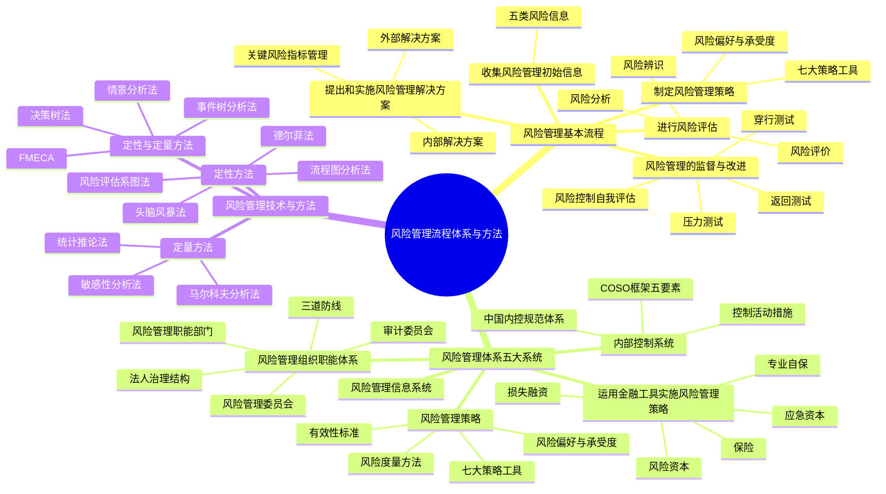

## 1. 章节定位

| 项目 | 信息 |
|------|------|
| 所属科目 | 公司战略与风险管理 |
| 难度等级 | 4 |
| 历年分值 | 6-8 分 |
| 建议学时 | 8-10 小时 |
| 知识关联章节 | 第6章风险与风险管理概述（本章是理论落地）、第8章企业面对的主要风险（本章方法用于应对具体风险）、第5章公司治理（治理结构是风控组织基础） |

## 2. 考情分析

本章是风险管理部分的核心操作章节，系统阐述风险管理的基本流程、风险管理体系五大系统、七大风险管理策略工具、内部控制系统以及十一种风险管理技术与方法。历年分值约 6-8 分，既有客观题也有主观题，主观题常以案例形式考查风险管理策略工具选择、内部控制要素辨识、风险评估方法应用等。

**命题规律**：本章内容操作性强、方法密集，客观题集中在流程步骤辨识、策略工具含义判断、内控五要素内容、风险度量方法特征、风险管理技术方法的适用范围与优缺点。主观题常以案例形式考查风险管理策略工具的选择与应用、内部控制缺陷分析、风险评估系图法的应用。

**高频考点分布**：

1. **风险管理基本流程五步骤**：收集初始信息→风险评估→制定风险管理策略→提出和实施风险管理解决方案→监督与改进。
2. **风险评估三步骤**：风险辨识、风险分析、风险评价的含义与区别。
3. **风险偏好与风险承受度**：两者概念区别、确定时考虑的因素。
4. **七大风险管理策略工具**：风险承担、风险规避、风险转移、风险转换、风险对冲、风险补偿、风险控制的含义、适用条件与案例辨识。
5. **风险度量方法**：最大可能损失、概率值、期望值、波动性、在险值（VaR）、直观方法。
6. **运用金融工具实施风险管理**：损失融资、风险资本、应急资本、保险、专业自保的含义与特点。
7. **内部控制系统**：COSO框架五要素（控制环境、风险评估、控制活动、信息与沟通、监控）；中国《基本规范》五要素；内控目标；控制活动措施（不相容职务分离、授权审批、会计系统、财产保护、预算、运营分析、绩效考评）。
8. **风险管理组织职能体系**：三道防线（第一道：业务单位；第二道：风险管理职能部门和风险管理委员会；第三道：内部审计部门和审计委员会）。
9. **风险管理监督方法**：压力测试、返回测试、穿行测试、风险控制自我评估（RCSA）。
10. **十一种风险管理技术与方法**：头脑风暴法、德尔菲法、FMECA、流程图分析法、马尔科夫分析法、风险评估系图法、情景分析法、敏感性分析法、事件树分析法、决策树法、统计推论法的适用范围与优缺点。

**备考建议**：

- 用"流程链条"串联本章：收集信息→评估→策略→解决方案→监督，理解五步骤的递进关系；
- 七大策略工具用"承担规避转移转换对冲补偿控制"记忆，注意区分风险转移（转移给第三方）与风险对冲（引入多个风险互相冲抵）；
- 内控五要素用"环评活信监"（环境、评估、活动、信息、监控）记忆；
- 十一种技术方法用表格对比记忆适用范围、定性/定量、优缺点。

## 3. 知识框架

## 4. 核心精讲

### 一、风险管理的基本流程

根据《中央企业全面风险管理指引》，风险管理基本流程分为五项主要工作：

#### （一）收集风险管理初始信息

企业要广泛地、持续不断地收集与本企业风险和风险管理相关的内部、外部初始信息，包括历史数据和预测数据。应把收集初始信息的职责分工落实到各有关职能部门和业务单位。

| 风险类型 | 收集内容 |
|----------|----------|
| **战略风险** | 国内外企业战略风险失控案例；国内外宏观环境、产业环境、竞争环境及企业内部环境信息 |
| **市场风险** | 国内外企业忽视市场风险案例；市场供给、需求、价格、竞争及经济政策信息 |
| **财务风险** | 国内外企业财务风险失控案例；全面反映本企业财务战略选择和财务管理状况的指标、数据 |
| **运营风险** | 国内外企业运营风险案例；本企业生产运营、市场营销、研发、组织人员、信息系统等信息 |
| **法律合规风险** | 国内外企业法律风险案例；政治、法律法规、政策等信息及企业内部法律风险因素 |

企业要对收集的初始信息进行必要的筛选、提炼、对比、分类、组合，以便进行风险评估。

#### （二）进行风险评估

风险评估包括**风险辨识、风险分析、风险评价**三个步骤：

| 步骤 | 含义 |
|------|------|
| **风险辨识** | 查找企业各业务单元、各项重要经营活动及重要业务流程中有无风险，有哪些风险 |
| **风险分析** | 对辨识出的风险及其特征进行明确的定义和描述，分析和描述风险发生可能性的高低、风险发生的条件 |
| **风险评价** | 评估风险对企业实现目标的影响程度、风险的价值等 |

**风险评估的方法**：应将定性与定量方法相结合。

- **定性方法**：问卷调查、集体讨论、专家咨询、情景分析、政策分析、行业标杆比较、管理层访谈、调查研究等；
- **定量方法**：统计推论法、马尔科夫分析法等；
- **既定性又定量方法**：失效模式影响和危害度分析法（FMECA）、事件树分析法等。

企业应根据风险发生可能性的高低和对目标影响程度，绘制**风险坐标图**，对各项风险进行比较，初步确定管理的先后顺序和策略。风险评估应动态管理，定期或不定期实施。

#### （三）制定风险管理策略

风险管理策略是指企业根据自身条件和外部环境，围绕企业发展战略，确定风险偏好、风险承受度、风险管理有效性标准，选择适合的风险管理策略工具，并确定资源配置原则的总体策略。

制定策略的关键环节：根据不同业务特点统一确定风险偏好和风险承受度，明确风险的最低限度和不能超过的最高限度，据此确定风险预警线及相应对策。要防止两种错误倾向：①忽视风险，片面追求收益；②单纯为规避风险而放弃发展机遇。

#### （四）提出和实施风险管理解决方案

企业应根据风险管理策略，针对各类风险或每一项重大风险制订风险管理解决方案。方案包括风险解决的具体目标、所需组织领导、涉及的管理及业务流程、所需资源、风险事件前中后的应对措施及风险管理工具。

**解决方案的两种类型**：

| 类型 | 含义 | 注意事项 |
|------|------|----------|
| **外部解决方案** | 方案制订的外包（投资银行、信用评级公司、保险公司、律师事务所、会计师事务所、风险管理咨询公司等） | 注重成本收益平衡、外包质量、商业秘密保护、防止依赖性 |
| **内部解决方案** | 风险管理体系的运转，综合运用组织职能体系、风险管理策略、金融工具、内部控制系统、信息系统 | 满足合规要求；经营战略与风险管理策略一致；风险控制与运营效率相平衡 |

**内部控制措施（九项）**：内控岗位授权制度、内控报告制度、内控批准制度、内控责任制度、内控审计检查制度、内控考核评价制度、重大风险预警制度、企业法律顾问制度、重要岗位权力制衡制度。

**关键风险指标管理（六步）**：①分析风险成因，找出关键成因；②将关键成因量化确定度量；③形成关键风险指标；④建立风险预警系统；⑤制定风险控制措施；⑥跟踪监测关键成因变化。

#### （五）风险管理的监督与改进

企业应以重大风险、重大事件和重大决策、重要管理及业务流程为监督重点，对风险管理各环节实施监督，并依据发现的问题改进风险管理措施。

**四种监督方法**：

| 方法 | 含义 |
|------|------|
| **压力测试** | 在极端情景下，分析评估风险管理模型或内控流程的有效性，发现问题，制定改进措施，目的是防止出现重大损失事件 |
| **返回测试** | 将历史数据输入风险管理模型或内控流程中，把结果与预测值进行对比，以检验风险管理有效性 |
| **穿行测试** | 在正常运行条件下，将初始数据输入内控流程，穿越全流程和所有关键环节，把运行结果与设计要求对比，以发现内控流程缺陷 |
| **风险控制自我评估（RCSA）** | 公司定期或不定期地评价自己及子公司的风险管理系统、风险管理有效性及实施效率和效果 |

**监督与改进的职责分工**：①各有关部门和业务单位定期自查自检；②风险管理职能部门定期检查检验有效性；③内部审计部门每年至少一次对风险管理工作进行监督评价，报告直接报送董事会或其下设的风险管理委员会和审计委员会。

### 二、风险管理体系五大系统

企业风险管理体系包括**五大系统**：①风险管理的组织职能体系；②风险管理策略；③运用金融工具实施风险管理策略；④内部控制系统；⑤风险管理信息系统。

#### （一）风险管理的组织职能体系

组织职能体系主要包括：规范的公司法人治理结构、风险管理委员会、风险管理职能部门、审计委员会、企业其他职能部门及各业务单位。

**三道防线**：

| 防线 | 主体 |
|------|------|
| **第一道防线** | 各有关职能部门和业务单位 |
| **第二道防线** | 风险管理职能部门和董事会下设的风险管理委员会 |
| **第三道防线** | 内部审计部门和董事会下设的审计委员会 |

**董事会**就全面风险管理工作的有效性对股东会负责，主要职责包括：审议并提交年度工作报告；确定风险管理总体目标、风险偏好、风险承受度；批准风险管理策略和重大风险管理解决方案；批准重大决策的风险评估报告；批准风险管理监督评价审计报告等。

**风险管理委员会**对董事会负责，召集人应由不兼任总经理的董事长担任（或由外部董事/独立董事担任）。主要职责：提交全面风险管理年度报告；审议风险管理策略和重大风险管理解决方案；审议重大决策风险评估报告等。

**风险管理职能部门**对总经理负责，主要职责：研究提出全面风险管理工作报告；研究提出风险管理策略和重大风险管理解决方案并负责组织实施；负责建立风险管理信息系统；组织协调全面风险管理日常工作等。

**审计委员会**：企业应在董事会下设立审计委员会，内部审计部门对审计委员会负责。审计委员会负责审查企业内部控制，监督内部控制的有效实施和内部控制自我评价情况。审计委员会应定期与外聘及内部审计师会面，每年对其权限及有效性进行复核。

#### （二）风险管理策略

**风险管理策略的组成部分**：①风险偏好和风险承受度；②全面风险管理的有效性标准；③风险管理策略工具的选择；④风险管理的资源配置。

**风险偏好与风险承受度**：

| 概念 | 含义 | 表现形式 |
|------|------|----------|
| **风险偏好** | 企业在追求战略和业务目标时愿意接受的风险类型和程度（回答"希望承担什么风险"） | 具体目标偏好、分级范围偏好、明确上限或下限偏好 |
| **风险承受度** | 企业在追求目标过程中所能接受的风险水平或范围（可接受的绩效变化界限） | 绩效语言表达；可设置若干指标显示不同警示级别 |

> **记忆要点**：风险偏好可以只定性，但风险承受度一定要定量。风险偏好取决于：公司战略、治理结构、企业文化、风险管理能力。风险承受度取决于：战略及业务目标重要性、风险偏好整体约束、绩效管理严格程度、组织风险管理能力。

**风险度量方法**：

| 方法 | 含义 | 特点 |
|------|------|------|
| **最大可能损失** | 风险事件发生后可能造成的最大损失 | 最差情形逻辑；无法判断概率时使用 |
| **概率值** | 风险事件发生的概率或造成损失的概率 | 适用于结果简单（好坏/是否）的情况 |
| **期望值** | 概率加权平均值（统计期望值、效用期望值） | 综合概率值和最大损失两种方法 |
| **波动性** | 数据离散程度（方差或均方差/标准差） | 反映变量离期望值的距离 |
| **在险值（VaR）** | 正常市场条件下，给定时间段和置信区间内预期可能发生的最大损失 | 通用、直观、灵活；为巴塞尔协议采用；局限：适用范围小、数据要求严格、对"肥尾"效应无能为力 |
| **直观方法** | 不依赖概率统计的度量方法（如专家意见法） | 数据不足或需包含人们偏好时使用 |

**七大风险管理策略工具**：

| 工具 | 含义 | 适用条件/案例 |
|------|------|--------------|
| **风险承担（风险保留/自留）** | 企业对所面临的风险采取接受的态度，承担风险带来的后果 | 未能辨识的风险；风险在承受范围内；缺乏能力主动管理；无其他备选方案；成本效益考量最适宜。重大风险不应采用 |
| **风险规避** | 企业回避、停止或退出蕴含某一风险的商业活动或商业环境，避免成为风险所有人 | 退出某一市场；拒绝与信用不好的对手交易；放弃业绩不佳的分支机构；停止生产有安全隐患的产品；禁止金融投机 |
| **风险转移** | 企业通过合同或非合同方式将风险全部或部分转移到第三方，企业对转移后的风险不再拥有所有权 | 保险；非金融型风险转移（合资、外包、服务保证书、担保）；风险证券化 |
| **风险转换** | 企业通过战略调整等手段将面临的风险转换成另一个风险 | 战略调整；使用衍生产品。减少某一风险的同时增加另一风险（如放松信用标准增加应收账款但扩大销售） |
| **风险对冲** | 采取各种手段，引入多个风险因素或承担多个风险，使得这些风险能够互相冲抵 | 资产组合；多种外币结算；战略上的多种经营；IT运作中心设两个独立地点；期货套期保值。针对风险组合，不针对单一风险 |
| **风险补偿** | 企业对风险可能造成的损失采取适当措施进行补偿，主动承担风险并采取措施补偿可能的损失 | 财务补偿（风险准备金、应急资本）；人力补偿；物资补偿 |
| **风险控制** | 通过控制风险事件发生的动因、环境、条件等，减轻风险事件损失或降低发生概率 | 控制对象一般是可控风险（多数运营风险、合规性风险）。定期消防安全检查；员工行为规范培训；产品质量检验流程 |

> **记忆要点**：风险转移=转移给第三方（不降低严重程度）；风险对冲=引入多风险互相冲抵（针对组合）；风险转换=一种风险换成另一种（不直接降低总风险）；风险补偿=主动承担+补偿措施；风险控制=控制动因环境条件。

#### （三）运用金融工具实施风险管理策略

运用金融工具实施风险管理策略的主要措施分为**损失事件管理**和**套期保值**两类。

**损失事件管理**的五种措施：

| 措施 | 含义 | 特点 |
|------|------|------|
| **损失融资** | 对风险事件进行事后管理，为风险事件造成的财物损失融资 | 分为预期损失融资（运营资本一部分）和非预期损失融资（风险资本范畴）；最具共性最重要 |
| **风险资本** | 除经营资本外，企业为补偿风险造成的财务损失而需要的资本 | 使企业破产概率低于某一给定水平；取决于风险偏好；表现为风险准备金 |
| **应急资本** | 金融合约，规定在某时间段内特定事件发生时，企业有权从提供方募集股本或贷款 | 事前安排、事后生效；不涉及风险转移（区别于保险）；是一种融资选择权；可提供经营持续性保证 |
| **保险** | 金融合约，保险公司为预定损失支付补偿，投保人支付保险费 | 风险转移的传统手段；可保风险是纯粹风险，机会风险不可保 |
| **专业自保** | 非保险公司的附属机构，为母公司及子公司提供保险 | 优点：降低运营成本、改善现金流、保障项目更多、相对公平费率、保障稳定性、可再保险。缺点：增加资本投入、提高内部管理成本、减少其他保险可得性、损失储备金不足 |

#### （四）内部控制系统

**COSO内部控制框架（1992/2013修订）**：

| 项目 | 内容 |
|------|------|
| **三项目标** | 经营的效率和有效性；财务报告的可靠性（2013版扩展为"报告"目标）；遵循适用的法律法规 |
| **五大要素** | 控制环境、风险评估、控制活动、信息与沟通、监控 |
| **2013版新增** | 17项五要素构建原则 |

**中国《企业内部控制基本规范》（2008）**：

| 项目 | 内容 |
|------|------|
| **内控目标** | 合理保证经营管理合法合规、资产安全、财务报告及相关信息真实完整；提高经营效率和效果；促进企业实现发展战略（相比COSO增加了"资产安全"目标） |
| **五要素** | 内部环境、风险评估、控制活动、信息与沟通、内部监督 |
| **配套指引** | 应用指引（18项业务领域）、评价指引、审计指引 |

**控制活动的七种措施**：

| 措施 | 含义 |
|------|------|
| **不相容职务分离控制** | 授权批准与业务经办、业务经办与会计记录、会计记录与财产保管、业务经办与稽核检查等分离；核心是"内部牵制" |
| **授权审批控制** | 常规授权（日常经营管理中按既定职责和程序进行）和特别授权（对例外、非常规性交易的应急性授权）；重大业务实行集体决策审批或联签制度 |
| **会计系统控制** | 依法设置会计机构配备会计人员；建立岗位责任制；按规定取得填制原始凭证；凭证连续编号；合理设置账户登记账簿复式记账 |
| **财产保护控制** | 财产记录和实物保管；定期盘点和账实核对；限制接近（限制未经授权人员接触资产） |
| **预算控制** | 实施全面预算管理；明确各责任单位职责权限；规范预算编制、审定、下达和执行程序；强化预算约束 |
| **运营分析控制** | 经理层综合运用生产、购销、投资、筹资、财务等信息，通过因素分析、对比分析、趋势分析等方法定期开展运营情况分析 |
| **绩效考评控制** | 科学设置考核指标体系，对各责任单位和全体员工业绩定期考核客观评价，考评结果作为薪酬、职务晋升、评优、降级、调岗、辞退依据 |

**内部控制缺陷分类**：重大缺陷、重要缺陷、一般缺陷。重大缺陷应当由董事会予以最终认定。

**内部控制评价方法**：个别访谈法、调查问卷法、专题讨论会法、穿行测试和重新执行法、抽样法、比较分析法。

#### （五）风险管理信息系统

风险管理信息系统涵盖风险管理基本流程和内部控制系统各环节，包括信息的采集、存储、加工、分析、测试、传递、报告、披露。

| 功能 | 要求 |
|------|------|
| **信息采集** | 确保业务数据和风险量化值的一致性、准确性、及时性、可用性和完整性；未经批准不得更改 |
| **信息存储** | 建立良好的数据架构，解决数据标准化和存储技术问题 |
| **信息加工分析测试** | 能够进行各种风险的计量和定量分析、定量测试；实时反映风险矩阵和排序频谱、重大风险监控状态 |
| **信息传递** | 实现各职能部门、业务单位间集成与共享；确保沟通及时、准确、完整 |
| **信息报告和披露** | 对超过风险预警上限的重大风险实施信息报警；满足内部信息报告和对外信息披露要求 |

### 三、风险管理的技术与方法

风险管理技术与方法共有十一种，适用于风险辨识、分析及评价等风险评估各阶段。

| 方法 | 性质 | 适用范围 | 主要优点 | 局限性 |
|------|------|----------|----------|--------|
| **头脑风暴法** | 定性 | 风险识别阶段充分发挥专家意见 | 激发想象力创造力；利益相关者参与沟通；速度快易开展；数据需求少 | 参与者可能缺乏必要技术；意见分散难保证全面性；可能偏离主题 |
| **德尔菲法** | 定性 | 风险识别阶段专家取得一致性意见；解决复杂不确定性问题 | 匿名表达不受欢迎观点；所有观点同权重；专家不必聚集；有深思熟虑时间；意见具广泛代表性 | 权威人士影响他人；碍于情面不愿发表不同意见；不愿修改原意见；过程复杂耗时 |
| **FMECA（失效模式影响和危害度分析法）** | 定性+定量 | 失效模式分析；产品设计开发、生产使用阶段 | 广泛适用于系统硬件软件程序；识别组件失效模式及影响；设计初期发现问题；为维护监督提供依据 | 只能识别单个失效模式，无法识别组合；耗时开支大；复杂多层系统实施困难 |
| **流程图分析法** | 定性 | 企业生产或经营中的风险及其成因分析 | 清晰明了易于操作；组织规模越大流程越复杂越能体现优越性 | 使用效果依赖专业人员水平 |
| **马尔科夫分析法** | 定量 | 复杂系统中的不确定性事件及其状态改变 | 能计算出具有维修能力和多重降级状态的系统概率 | 假设状态变化概率固定；事项统计独立；需了解各种概率；矩阵运算复杂 |
| **风险评估系图法（风险矩阵）** | 定性 | 对风险进行初步定性分析；比较不同类型结果的风险 | 简单易用；快速分级；可视化工具直观明了 | 主观判断影响准确性；风险无法直接加权；无法数学运算得到总体风险等级 |
| **情景分析法** | 定性+定量 | 对企业面临的风险进行定性和定量分析 | 未来变化不大时能给出精确模拟结果 | 不确定性大时模拟不够现实；对数据有效性要求高；情景可能缺乏充分基础 |
| **敏感性分析法** | 定量 | 项目不确定性对结果产生的影响分析 | 为决策提供参考信息；为风险分析指明方向；帮助制定紧急预案 | 数据经常缺乏；未考虑各种因素变动概率，结果可能和实际相反 |
| **事件树分析法（ETA）** | 定性+定量 | 多环节故障发生后对各种可能后果的分析 | 清晰图形显示潜在情景；说明时机和依赖性；体现事件顺序；识别单点故障和脆弱性 | 需识别所有潜在初始事件；只分析成功失败状况；复杂系统难以构建 |
| **决策树法** | 定量 | 序贯决策问题；不确定性投资方案期望收益 | 提供清楚的图解说明；计算每条路径期望值；能计算最优路径及预期结果 | 大型项目可能过于复杂；可能过于简化环境；历史数据可能不适用 |
| **统计推论法** | 定量 | 各种风险分析和预测 | 数据充足可靠时简单易行；应用领域广泛 | 历史前提环境已变化不一定适用；未考虑因果关系，外推结果可能偏差 |

**统计推论法的三种类型**：

| 类型 | 含义 | 时间序列 |
|------|------|----------|
| **前推** | 根据历史经验和数据，向前推断未来事件发生的概率及后果 | 由后向前推算（最广泛应用） |
| **后推** | 手头没有历史数据时，把未知想象事件与已知事件联系，归结到有数据可查的初始事件 | 由前向后推算 |
| **旁推** | 利用类似项目的数据进行统计推论 | 利用其他项目历史记录推测新项目风险 |

## 5. 典型例题

**【例题 1】（单选题，风险管理策略工具）**

某企业为应对原材料价格波动风险，在期货市场上卖出与原材料现货数量相当的期货合约。该企业采用的风险管理策略工具是（ ）。
A. 风险转移
B. 风险规避
C. 风险对冲
D. 风险补偿

**答案**：C

**解析**：风险对冲是指采取各种手段，引入多个风险因素或承担多个风险，使得这些风险能够互相冲抵。在金融资产风险管理中，对冲包括使用衍生产品如利用期货进行套期保值。企业通过卖出期货合约对冲原材料价格波动风险，属于风险对冲。风险转移是将风险转移到第三方；风险规避是回避或退出蕴含风险的活动；风险补偿是主动承担风险并采取措施补偿。

**【例题 2】（单选题，内部控制要素）**

下列各项中，属于内部控制要素中"控制活动"的是（ ）。
A. 管理层的理念和经营风格
B. 不相容职务分离控制
C. 识别与实现控制目标相关的内部风险和外部风险
D. 对内部控制实施质量的评价

**答案**：B

**解析**：A属于"控制环境（内部环境）"要素；B正确，不相容职务分离控制是"控制活动"的具体措施；C属于"风险评估"要素；D属于"内部监督（监控）"要素。

**【例题 3】（单选题，风险度量方法）**

下列风险度量方法中，为《巴塞尔协议》所采用，具有通用、直观、灵活特点的是（ ）。
A. 最大可能损失
B. 概率值
C. 期望值
D. 在险值（VaR）

**答案**：D

**解析**：在险值（VaR）是指在正常的市场条件下，在给定的时间段和给定的置信区间内，预期可能发生的最大损失。在险值具有通用、直观、灵活的特点，为《巴塞尔协议》所采用。其局限性是适用的风险范围小，对数据要求严格，计算困难，对"肥尾"效应无能为力。

**【例题 4】（单选题，风险管理监督方法）**

下列关于风险管理监督方法的说法中，正确的是（ ）。
A. 压力测试是将历史数据输入模型中与预测值对比
B. 返回测试是在极端情景下分析评估内控流程有效性
C. 穿行测试是将初始数据输入内控流程穿越全流程和关键环节与设计要求对比
D. 风险控制自我评估是由外部中介机构对企业风险管理系统进行评价

**答案**：C

**解析**：A错误，将历史数据输入模型与预测值对比的是"返回测试"而非"压力测试"；B错误，在极端情景下分析评估的是"压力测试"而非"返回测试"；C正确，穿行测试是在正常运行条件下，将初始数据输入内控流程，穿越全流程和所有关键环节，把运行结果与设计要求对比；D错误，风险控制自我评估（RCSA）是公司自己定期或不定期评价，不是外部中介机构评价。

**【例题 5】（多选题，风险管理策略工具）**

下列各项中，属于风险管理策略工具的有（ ）。
A. 风险承担
B. 风险规避
C. 风险转移
D. 风险消除
E. 风险对冲

**答案**：ABCE

**解析**：风险管理策略工具共有7种：风险承担、风险规避、风险转移、风险转换、风险对冲、风险补偿、风险控制。D错误，不存在"风险消除"这一工具（风险具有客观性，不可能彻底消除）。

**【例题 6】（多选题，内部控制措施）**

下列各项中，属于企业内部控制措施的有（ ）。
A. 不相容职务分离控制
B. 授权审批控制
C. 财产保护控制
D. 预算控制
E. 绩效考评控制

**答案**：ABCDE

**解析**：控制措施一般包括：不相容职务分离控制、授权审批控制、会计系统控制、财产保护控制、预算控制、运营分析控制和绩效考评控制。此外还有内部报告控制、复核控制、人员素质控制等。ABCDE均正确。

**【例题 7】（综合题，风险管理策略应用）**

某外贸企业A公司主要向欧美市场出口电子产品，年出口额约5亿美元。近年来人民币汇率波动加大，公司利润受到严重影响。同时，公司部分客户因经济不景气出现拖欠货款情况。公司董事会决定加强风险管理。

要求：(1) 针对汇率波动风险，建议A公司应采用何种风险管理策略工具，并说明理由；(2) 针对应收账款回收风险，建议A公司应采用何种风险管理策略工具；(3) 说明A公司应如何建立风险管理组织职能体系的三道防线。

**答案**：

(1) 针对汇率波动风险，建议A公司采用**风险对冲**策略工具。

理由：汇率波动风险可以通过金融工具进行管理。A公司可以使用远期结售汇、外汇期权、外汇期货等衍生产品进行套期保值，引入与汇率波动方向相反的风险因素，使其与原有的汇率风险互相冲抵。风险对冲适用于可以通过金融手段管理的风险，能够有效降低汇率波动对公司利润的影响。此外，公司也可考虑采用**风险转移**（购买汇率保险）作为补充。

(2) 针对应收账款回收风险，建议A公司综合采用以下策略工具：

- **风险转移**：购买出口信用保险，将客户违约的财务损失风险转移给保险公司；或通过应收账款保理、福费廷等方式将风险转移给银行；
- **风险控制**：加强客户信用评估和分级管理；建立应收账款账龄分析和催收制度；对新客户实行预付款或信用证结算；定期跟踪客户经营状况；
- **风险规避**：对信用评级极差的客户，拒绝赊销交易，只接受预付款或信用证结算。

(3) A公司应建立风险管理组织职能体系的三道防线：

- **第一道防线**：各有关职能部门和业务单位（如出口业务部、财务部等）——执行风险管理基本流程，识别和管理本部门业务中的风险，是风险管理的第一责任主体；
- **第二道防线**：风险管理职能部门和董事会下设的风险管理委员会——研究提出风险管理策略和解决方案，组织协调全面风险管理工作，对各部门风险管理工作进行指导和监督；
- **第三道防线**：内部审计部门和董事会下设的审计委员会——独立于业务和风险管理职能部门，每年至少一次对风险管理工作进行监督评价，监督评价报告直接报送董事会。

## 6. 记忆口诀

**风险管理流程五步骤**：收信→评估→策略→方案→监督（收集信息→风险评估→制定策略→实施方案→监督改进）。

**风险评估三步骤**：辨识（有哪些风险）→分析（可能性与条件）→评价（影响程度与价值）。

**七大策略工具**：承担规避转移转换对冲补偿控制。
- 承担=接受；规避=退出；转移=给第三方；转换=换成另一种；对冲=多风险互抵；补偿=主动承担+补偿；控制=控制动因条件。

**风险度量六方法**：最大损失（最差情形）→概率值（好坏简单）→期望值（概率加权）→波动性（方差标准差）→在险值VaR（巴塞尔采用）→直观方法（专家意见）。

**内控五要素**：环评活信监（控制环境→风险评估→控制活动→信息与沟通→监控）。

**控制活动七措施**：不授会财预运绩（不相容职务分离→授权审批→会计系统→财产保护→预算→运营分析→绩效考评）。

**三道防线**：一道业务单位→二道风控部门和风控委员会→三道内审部门和审计委员会。

**四种监督方法**：压力测试（极端情景）→返回测试（历史数据对比预测）→穿行测试（穿越全流程对比设计）→RCSA（自我评估）。

**十一种技术方法**：头脑风暴→德尔菲→FMECA→流程图→马尔科夫→风险系图→情景分析→敏感性→事件树→决策树→统计推论。定性=头脑风暴/德尔菲/流程图/风险系图；定量=马尔科夫/敏感性/统计推论；定性+定量=FMECA/情景/事件树/决策树。

## 7. 同步练习

**1.（单选题）** 下列关于风险管理策略的总体定位的表述中，不正确的是（ ）。

A. 风险管理策略在整个风险管理体系中起着统领全局的作用
B. 制定与企业战略保持一致的风险管理策略增加了企业战略实施失误的可能性
C. 风险管理策略是根据企业战略制定的全面风险管理的总体策略
D. 风险管理策略在企业战略管理过程中起着承上启下的作用

**2.（单选题）** 奥林游乐园拟开发"高峡探险"项目，并对开发项目失败的可能性进行分析、预测。奥林游乐园所采用的风险度量方法是（ ）。

A. 最大可能损失
B. 概率值
C. 在险值
D. 波动性

**3.（单选题）** 甲公司制定的资本结构政策是"资产负债率达到75%时候，就应当停止借款筹资"。这一表述体现的是（ ）。

A. 风险偏好
B. 风险承受度
C. 风险种类
D. 风险文化

**4.（单选题）** 图元煤矿建立了完善的内部控制系统。下列各项关于图元煤矿采用的内部控制措施中，符合我国《企业内部控制基本规范》关于内部环境要素要求的是（ ）。

A. 加强文化建设，培育"爱岗敬业、安全至上"的价值观
B. 投资授权审批与业务经办分离，相互监督，相互制约
C. 实施全面预算管理制度，明确开采、销售、研发、采购等各种业务的主管部门在预算管理中的职责权限
D. 使用采煤计划完成率、百万吨煤重伤率等关键绩效指标考核各业务单位

**5.（单选题）** 翡科公司是一家经营多年的房地产公司，伴随着房地产业的高速增长，同时出现了风险加大的问题，为此公司决定将一部分资金投入食品加工领域以分散风险。翡科公司采用的风险管理策略工具是（ ）。

A. 风险规避
B. 风险转移
C. 风险对冲
D. 风险补偿

**6.（单选题）** 方互科技公司成立了自己的专业自保公司，为母公司提供保险，并由母公司筹集保险费，建立损失储备金。下列各项中，不属于方互科技公司采用的上述损失事件管理办法的特点的是（ ）。

A. 降低了内部管理成本
B. 增加了资本投入
C. 可以提高服务水平
D. 可以通过租借的方式承保其他公司的风险

**7.（单选题）** 北明公司专注于体育文化设施系统集成以及体育资源的整合服务。该公司按照《企业内部控制基本规范》的要求，在董事会下设立了审计委员会。下列有关审计委员会的说法中，不正确的是（ ）。

A. 审计委员会成员之间的不同意见如无法内部调解，应提请董事会解决
B. 审计委员会应定期与外聘及内部审计师会面，讨论与审计相关的事宜，同时要求管理层出席
C. 审计委员会的主要活动之一是核查对外报告合规的情况
D. 确保充分且有效的内部控制是审计委员会的义务，其中包括负责监督内部审计部门的工作

**8.（单选题）** 天使投资公司使用风险管理模型来预测未来一段时期内的市场风险。为了验证模型的有效性，该公司收集过去一段时间内的历史市场数据，将这些数据输入到风险管理模型中，并将模型的输出结果与实际的市场变化进行对比，如果模型的输出结果与实际的市场变化在趋势和幅度上保持一致或相近，说明该风险管理模型是有效的。天使投资公司使用的风险管理监督方法是（ ）。

A. 压力测试
B. 返回测试
C. 穿行测试
D. 风险控制自我评估

**9.（单选题）** 甲公司是一家计划向移动互联网领域转型的大型传统媒体企业。为了更好地了解企业转型中存在的风险因素，甲公司聘请了20位相关领域的专家，根据甲公司面临的内外部环境，针对六个方面的风险因素，反复征询每个专家的意见，直到每一个专家不再改变自己的意见，达成共识为止。该种风险管理方法是（ ）。

A. 德尔菲法
B. 情景分析法
C. 头脑风暴法
D. 因素分析法

**10.（单选题）** 下列关于风险管理的监督与改进的相关说法中，不正确的是（ ）。

A. 企业风险管理职能部门应定期对各部门和业务单位风险管理工作实施情况和有效性进行检查和检验
B. 企业内部审计部门应每两年至少一次对各有关部门和业务单位的风险管理工作及其工作效果进行监督评价
C. 企业各有关部门和业务单位应定期对风险管理工作进行自查和检验
D. 风险管理基本流程的最后一个步骤是风险管理的监督与改进

**11.（单选题）** 永泰保险公司发行了一种收益与指定的巨灾损失相连接的债券，在未来规定期限内，如巨灾损失未发生，永泰保险公司便向债券承购者还本付息；如遭遇巨灾损失，永泰保险公司则按约不向债券承购者支付本息，使保险公司的损失得到相应的补偿。下列各项中属于永泰保险公司采用的风险管理策略工具的是（ ）。

A. 风险转换
B. 风险补偿
C. 风险转移
D. 风险对冲

**12.（单选题）** 安泰保险公司主要业务为财产保险，其客户以煤矿居多。安泰公司按照所需融资数额的一定比例，向投资者支付一笔费用来购买一种特定权利。安泰公司与投资人约定，一旦在约定时期内发生煤矿事故灾害，且煤矿企业和保险公司由此遭受的煤矿事故损失达到约定规模后，保险公司将立即向投资者发行资本票据，筹集现金或其他流动资产，用于处理煤矿事故灾害风险的赔款。根据以上信息可以判断，安泰公司的这一做法属于（ ）。

A. 损失融资
B. 保险
C. 应急资本
D. 套期保值

**13.（单选题）** 下列关于风险管理技术与方法的说法中，错误的是（ ）。

A. 头脑风暴法适用于在风险识别阶段充分发挥专家意见，对风险进行定性分析
B. 流程图分析法适用于对企业生产或经营中的风险及其成因进行定性分析
C. 情景分析法适用于对企业面临的风险进行定性和定量分析
D. 风险评估系图法适用于对不确定性投资方案期望收益的定量分析

**14.（单选题）** 广博公司是一家高铁运营企业。该公司按规则记录所有可能影响高铁正常运行系统的因素，分析每种因素对高铁运行系统工作及状态的影响，并将各种影响因素按其影响程度及发生概率进行排序，从而发现系统中潜在的薄弱环节，提出预防、改进措施，以消除或减少风险发生的可能性，保证系统的可靠性。下列各项中，属于广博公司采用的风险管理方法是（ ）。

A. 马尔科夫分析法
B. 失效模式、影响和危害度分析法
C. 情景分析法
D. 流程图分析法

**15.（单选题）** A公司是一家海运公司。为了转移公司与海运相关的船舶、货物、运营的损失及对他人的责任，该公司与某保险公司签订了一项金融合约，约定当风险发生时由保险公司承担相应的损失，但是作为补偿该公司应该向保险公司支付一定的保险费。A公司进行损失事件管理的手段属于（ ）。

A. 风险资本
B. 应急资本
C. 保险
D. 专业自保

**16.（单选题）** （2020年）甲公司每年最低运营资本是5000万元，有10%可能性维持运营需要5800万元；有5%可能性维持运营需要6200万元。若甲公司风险资本为1000万元，则该公司的生存概率为（ ）。

A. 90%~95%
B. 10%
C. 95%以上
D. 90%

**17.（单选题）** （2017年）面对未来国外经济形势不确定因素增加的局面，鑫华基金公司按照较好、一般、较差三种假设条件，对公司未来可能遇到的不确定因素及其对公司收入和利润的影响作出定性和定量分析。鑫华基金公司使用的风险管理技术与方法是（ ）。

A. 情景分析法
B. 敏感性分析法
C. 统计推论法
D. 马尔科夫分析法

**18.（单选题）** （2021年）丰源公司是一家多年从事制氧设备出口业务的国有企业。2019年初，面对国外市场环境趋紧、订单大幅减少造成的风险，该公司开辟了国内销售业务，两年多来取得良好的业绩。本案例中丰源公司的做法体现了《中央企业全面风险管理指引》中的（ ）。

A. 风险管理策略
B. 风险管理组织职能体系
C. 风险管理信息系统
D. 内部控制系统

**19.（单选题）** （2019年）科环公司计划在某市兴建一座垃圾处理厂，并对占用土地的价格、垃圾处理收入和建设周期等不可控因素的变化对该垃圾处理厂内部收益率的影响进行了分析。科环公司采取的风险管理方法是（ ）。

A. 马尔科夫分析法
B. 失效模式、影响和危害度分析法
C. 情景分析法
D. 敏感性分析法

**20.（单选题）** （2019年）厨具生产商佳乐公司为了分散经营风险，开展多元化经营，投资了一个环保项目。由于对该项目的前期调研不够充分，相关信息搜索不足，公司管理人员在分析项目运营风险时，无法判断风险发生的概率。在这种情况下，佳乐公司应采取的风险度量方法是（ ）。

A. 期望值
B. 在险值
C. 最大可能损失
D. 概率值

**21.（单选题）** （2018年）甲公司是一家白酒生产企业。为了进一步提高产品质量，甲公司通过图表形式将白酒生产按顺序划分为多个模块，并对各个模块逐一进行详细调查，识别出每个模块各种潜在的风险因素或风险事件，从而使公司决策者获得清晰直观的印象。根据上述信息，下列各项中，对甲公司采取的风险管理办法的描述错误的是（ ）。

A. 该方法的使用效果依赖于专业人员的水平
B. 该方法的优点是简单明了易于操作
C. 该方法可以对企业生产或经营中的风险及其成因进行定性分析
D. 该方法适用于组织规模较小、流程较简单的业务风险分析

**22.（单选题）** （2017年）下列各项关于风险管理解决方案的表述，错误的是（ ）。

A. 风险管理解决方案中的外部解决方案一般指方案制订的外包
B. 风险管理解决方案应有风险解决的具体目标和风险管理工具等方面的内容
C. 落实风险管理解决方案必须认识到风险管理是企业价值创造的根本源泉
D. 风险管理解决方案中的内部解决方案一般指风险管理策略

**23.（单选题）** （2017年）宏远海运公司为了加强对损失事件的管理成立了一家附属机构，其职责是用母公司提供的资金建立损失储备金，并为母公司提供保险。宏远海运公司管理损失事件的方法是（ ）。

A. 专业自保
B. 保险
C. 损失融资
D. 风险成本

**24.（单选题）** （2022年）2018年底，塔山投资公司对2019年的投资风险进行度量后宣称，在市场波动正常的情况下，该公司有90%可能性最大投资损失为5000万元。下列各项中，属于塔山投资公司采用的风险度量方法的特点的是（ ）。

A. 适用的风险范围大
B. 对数据要求不太严格
C. 计算相对容易
D. 通用、直观、灵活

**25.（单选题）** （2017年）甲公司是一家大型商场。开业以来，公司积累了丰富的销售数据。公司战略部门每年都会对这些数据进行收集整理，据此推算出未来年度企业的销售风险。根据上述信息，甲公司采用的风险管理方法是（ ）。

A. 正推法
B. 后推法
C. 前推法
D. 逆推法

**26.（多选题）** 某公司历史上一直购买灾害保险，但经过数据分析，认为保险公司历年的赔付不足以平衡相应的保险费用支出，而不再续保；同时，为了应付可能发生的灾害性事件，公司与银行签订了应急资本协议，规定在灾害发生时，由银行提供资本以保证公司的持续经营。根据以上信息可以判断，该公司目前所采用的风险对策为（ ）。

A. 风险补偿
B. 风险规避
C. 风险转移
D. 风险控制

**27.（多选题）** 能科公司的主营业务为有色金属矿产品的开发、生产、贸易和综合服务，该公司在风险管理过程中运用金融工具实施风险管理策略。下列各项中能够体现能科公司运用金融工具实施风险管理策略创造价值的是（ ）。

A. 在市场上通过期货的方式出卖产品，增加收入的稳定性，提高回报率
B. 通过自己的专业自保公司为其提供保险
C. 为可能给公司造成重大损失的风险事件进行损失融资
D. 设立风险资本，为公司在遭受风险时能够维持运营提供保证

**28.（多选题）** 下列各项中，属于企业一般不应把风险承担作为风险管理策略的情况是（ ）。

A. 企业管理层及全体员工都未辨识出风险
B. 企业以成本效益考虑，认为选择风险承担是最适宜的方案
C. 企业面临影响企业目标实现的重大风险
D. 企业缺乏能力对已经辨识出的风险进行有效管理与控制

**29.（多选题）** 甲公司在实施风险管理过程中，对由人为操作和自然因素引起的各种风险对企业影响的大小和发生的可能性进行分析，为确定企业风险的优先次序提供分析框架。该公司采取的上述风险管理方法属于（ ）。

A. 决策树法
B. 马尔科夫分析法
C. 流程图分析法
D. 风险评估系图法

**30.（多选题）** 下列各项关于风险评估的表述中，正确的有（ ）。

A. 风险评估应由企业组织有关职能部门和业务单位实施
B. 企业应当定期或不定期对新风险和原有风险的变化进行重新评估
C. 风险分析时无需进行风险之间的关系分析
D. 风险评价是评估风险对企业实现目标的影响程度、风险的价值等

**31.（多选题）** 主营化学药、中成药的研发、生产和销售业务的华风公司的风险管理部门与高层管理人员正在商议如何确定风险管理的有效性标准。下列关于风险管理有效性标准的说法中正确的有（ ）。

A. 风险管理有效性标准应当用于衡量全面风险管理体系的运行效果
B. 风险管理有效性标准应当在企业的风险评估中应用，并根据风险的变化随时调整
C. 风险管理的有效性标准要针对企业的全部风险，能够反映企业全部风险管理的现状
D. 风险管理有效性标准是企业衡量风险管理是否有效的标准

**32.（多选题）** 安迪公司最近承接了一项隧道建设项目，该公司根据以前完成的类似项目的相关数据，并结合环境变化，对新项目进行了风险评估和分析。下列各项中，属于该公司采用的上述风险分析方法特征的有（ ）。

A. 适合于各种风险分析预测
B. 在数据充足可靠的情况下简单易行
C. 能够计算到达一种情形的最优路径
D. 它生动地体现事件的顺序

**33.（多选题）** 甲公司主要经营环保设备销售、提供环保方案等业务。由于市场上相继出现农场环保设备，该公司正在考虑是否研发相关设备，因此分别对研发和不研发设备这两种方案下对应的净现金流进行预测，并比较这两个方案的投资净现金流量期望值，以判断是否进行新设备研发。下列各项中，属于该公司采用的风险管理方法优点的有（ ）。

A. 对于决策问题的细节提供了一种清楚的图解说明
B. 它能说明时机、依赖性，以及很繁琐的多米诺效应
C. 能够计算到达一种情形的最优路径
D. 清晰明了，易于操作

**34.（多选题）** 甲公司在运用金融工具来实施风险管理策略时，需要遵循的原则和要求包括（ ）。

A. 与企业整体风险管理策略一致
B. 成本与收益的平衡
C. 与企业所面对风险的性质相匹配
D. 需要判断风险的定价

**35.（多选题）** 下列属于美国COSO内部控制框架中风险评估要素应当坚持的原则的有（ ）。

A. 企业制定足够清晰的目标，以便识别和评估有关目标所涉及的风险
B. 企业在评估影响目标实现的风险时，考虑潜在的舞弊行为
C. 企业识别并评估可能会对内部控制系统产生重大影响的变更
D. 企业根据其目标，使员工各自担负起内部控制的相关责任

**36.（多选题）** 海悦公司是一家综合能源服务商。该公司根据风险管理策略，针对各类风险或每一项重大风险制订了风险管理内外部解决方案，其中在制定内部控制措施时应考虑的内容有（ ）。

A. 建立内部控制报告制度
B. 建立内部控制批准制度
C. 建立内部控制考核评价制度
D. 建立重要岗位权力制衡制度

**37.（多选题）** 下列风险管理方法中，既可以进行定性分析也可以进行定量分析的方法有（ ）。

A. 事件树分析法
B. 敏感性分析法
C. 失效模式、影响和危害度分析法
D. 情景分析法

**38.（多选题）** 丹木城市商业银行在董事会下设立风险管理委员会。从风险管理组织职能角度来看，下列各项属于该银行风险管理委员会应履行的职责有（ ）。

A. 研究提出跨职能部门的重大决策风险评估报告
B. 审议风险管理组织机构设置及其职责方案
C. 指导、监督信贷部、营运部、结算部等各个业务单位和职能部门的全面风险管理工作
D. 提交丹木城市商业银行全面风险管理年度报告

**39.（多选题）** 下列选项中，采用的风险管理策略工具是风险转移的有（ ）。

A. 公司明令禁止各子公司进行期货投机
B. 公司利用期货进行套期保值
C. 为公司的固定资产投保
D. 公司将未收回的应收账款出售给其他公司，且不再承担有关债务人未能如期付款的风险

**40.（多选题）** 下列关于美国COSO内部控制框架五要素的表述中，正确的有（ ）。

A. 控制环境决定了企业的基调，直接影响企业员工的控制意识
B. 信息与沟通的前提是使经营目标在不同层次上相互衔接、保持一致
C. 企业可以通过持续性的监控行为、独立评估或两者的结合来实现对内控系统的监控
D. 控制行为体现在整个企业的不同层次和不同部门中

**41.（多选题）** （2020年）甲公司在加强风险管理过程中采取了下列做法，其中符合我国《企业内部控制基本规范》关于信息与沟通要素要求的有（ ）。

A. 加强法制教育，建立健全法律顾问制度和重大法律纠纷案件备案制度
B. 建立举报投诉制度和举报人保护制度
C. 建立反舞弊机制，坚持惩防并举、重在预防的原则
D. 建立重大风险预警机制和突发事件应急处理机制

**42.（多选题）** （2021年）美邦公司是一家建筑装修企业，该公司的采购总监为了防范原材料和设备采购过程中可能发生的风险，梳理了从采购计划制定、供应商筛选、询议价格、制作订单、部门领导审核、采购合同签订、产品验收入库直到结算等各个环节的潜在风险，并找出导致风险发生的因素，分析风险发生后可能造成的损失。下列各项中，属于该公司采用的上述风险分析方法优点的有（ ）。

A. 使用效果较少依赖专业人员的水平
B. 定量分析准确率高
C. 组织规模越大，流程越复杂，越能体现出优越性
D. 清晰明了，易于操作

**43.（多选题）** （2018年）隆盛信托投资公司自成立以来，结合业务特点和内部控制要求设置内部机构，明确职责权限，将权利和责任落实到责任单位，同时综合运用风险规避、风险降低、风险分担和风险承受等风险应对策略，实现对风险的有效控制。根据我国《企业内部控制基本规范》，该公司的上述做法涉及的内部控制要素有（ ）。

A. 风险评估
B. 内部环境
C. 信息与沟通
D. 控制活动

**44.（多选题）** （2018年）2017年初，甲公司与乙银行签订了一份协议，约定甲公司一旦发生特定事件引起财务危机时，有权从乙银行取得500万贷款来应对风险。在协议中，双方明确了甲公司归还贷款的期限以及应当支付的利息和费用。下列各项表述中正确的有（ ）。

A. 甲公司采取的措施为其可持续经营提供了保证
B. 甲公司采取的措施不涉及风险补偿
C. 甲公司采取的措施是一个在一定条件下的融资选择权
D. 乙银行向甲公司提供贷款不承担甲公司发生特定事件的风险

**45.（多选题）** 某矿业集团近期收购了厄瓜多尔铜矿，集团风险管理部派王力驻该铜矿担任中方管理人员，并负责该铜矿的风险管理工作。根据该国现有情况，王力建议集团采取以下措施：向国际保险公司对该项目可能面临的政治风险投保，在原料、零配件的采购上适当以当地企业优先。王力用以应对该铜矿面临的风险的措施有（ ）。

A. 风险控制
B. 风险规避
C. 风险转移
D. 风险保留

**46.（多选题）** 金融工具在企业中的运用变得越来越常见，下列关于运用金融工具实施风险管理策略的特点的说法中错误的有（ ）。

A. 企业需要判断风险事件的可能性和损失的分布，不需要量化风险本身的价值
B. 应用范围一般包括声誉等难以衡量价值的风险，也可以消除战略失误造成的损失
C. 技术性弱
D. 企业可能通过使用金融工具来承担额外的风险，改善企业的财务状况，创造价值

**47.（多选题）** 新海公司为应对企业面临的风险因素所带来的不利影响，在风险管理工作中结合自身业务特别强化控制活动相关措施。在该公司管理层的下列讨论意见中，说法正确的有（ ）。

A. 不相容职务分离控制要求企业全面系统性分析、梳理业务流程中的不相容职务，防止出现或掩盖错误和舞弊行为
B. 企业对于重大的业务和事项，应当实行集体决策审批或者联签制度，任何个人不得单独进行决策或者擅自改变集体决策
C. 授权审批控制要求企业编制常规授权的指引，针对特别授权不需要做过多约束
D. 财产保护控制包括采用财产记录、使用保险箱储存现金和重要文件、为大楼或其内的区域设立门禁系统等手段

**48.（多选题）** 甲公司最近拟上马一个新项目，但由于涉及新领域，其风险收益存在较大不确定性，甲公司决定通过调查问卷方式向行业内若干专家进行咨询，收取意见，并在专家意见一致性基础上汇总得出结论，以控制项目的风险。下列关于甲公司采用的这种风险管理技术与方法的说法正确的有（ ）。

A. 参与者可能缺乏必要的技术或知识，无法提出有效的建议
B. 有些专家可能碍于情面，不愿意发表与其他人不同的意见
C. 由于观点是匿名的，因此专家更有可能表达出那些不受欢迎的看法
D. 权威人士的意见可能影响他人的意见

**49.（多选题）** 东湖银行主营小微企业借贷业务。该银行实行稳健经营，明确规定了贷款条件、贷款种类和限额、贷款审批程序以及对违约资金的处置方法等。下列各项中，属于东湖银行上述做法所涉及的风险管理策略组成部分的有（ ）。

A. 风险管理策略工具
B. 风险偏好
C. 风险承受度
D. 风险管理的资源配置

**50.（简答题）** 拓维科技公司是一家软件开发公司，拥有强大的技术团队和丰富的项目经验。公司重视技术团队的培训和发展，定期组织内部培训和外部专业培训，确保团队成员技能得到及时更新和提高。公司积极招聘具备潜力和才华的新员工，不断注入新鲜血液。但近年来，随着业务的快速发展，公司面临各种风险。为此拓维科技公司采取了一系列措施来应对风险，其中包括：

（1）对于软件项目开发过程中存在的技术风险，采用成熟的技术、团队成员熟悉的技术或迭代式的开发过程等方法将风险控制在一定范围内。

（2）完全陌生领域的项目利用保险来减轻损失，保险合同规定保险公司为预定的损失支付补偿，作为交换，在合同开始时，该公司要向保险公司支付保险费。

（3）软件开发过程需要大额资金，但是投资者的资金可能不足以维持，所以该公司与银行签订了应急资本协议，规定在资金严重短缺时，由银行提供资本以保证公司的持续经营。

为能够更准确地评估项目的潜在风险和收益，在进行风险度量时，首先对所有事件中每一事件发生的概率乘以该事件的影响，然后将这些乘积相加得到风险数值，根据所得到的风险数值，拓维科技公司通过关注行业动态和技术发展趋势，不断探索新技术、新方法和新解决方案。此外，公司还鼓励团队成员提出创新想法和建议，为公司的产品和服务注入源源不断的创新动力。

要求：

（1）简要分析拓维科技公司分别采用了哪些风险管理策略工具。

（2）简要分析拓维科技公司采用的风险度量方法。

**51.（简答题）** （2022年）云博公司成立于2015年，致力于智能机器人的研发和制造，其产品广泛应用于冶金、医疗、金融、物流等领域。

云博公司的销售业务由一位主管副总经理负责，主管副总经理根据业务能力选拔、任用多名分别负责不同类别产品的销售经理。每位销售经理管理一个由5至8位销售人员组成的销售组，负责某一类产品的销售。销售组的年度销售计划由销售经理提出，经主管副总经理批准后实施。公司员工包括销售人员的薪酬取决于对公司确定的各项业绩目标所做出的贡献，"唯业绩"观念被公司员工普遍接受。因此，销售经理们往往制定较高的年度销售目标，并把该目标按月分解并分配给组内每一位销售人员。截至2019年底，智能机器人市场一直供不应求，销售计划完成比较顺利，因此，主管副总经理对销售经理提出的销售计划往往不经仔细审核就签字通过。根据业绩目标完成情况，主管副总经理对销售经理进行季度考核和奖罚、销售经理对组内销售人员进行月度考核和奖罚。考核时间的短期化使销售人员时时感受到压力，彼此之间为完成业绩指标争夺客户的现象时有发生。在价格与合同管理上，公司为更快、更多地获取订单采用灵活的做法，赋予销售经理和销售人员可按最低8折价格与客户签订产品销售合同的权力。虽然公司制度规定销售合同须事先经财务、法务部门审核方能签订，但未得到严格执行。公司建立了对销售人员每半年进行一次职业规范、业务技能和相关法律法规培训的制度，但面对销售经理们销售任务重、抽不出时间参加培训的抱怨始终未能落实。

2020年初，由于流感爆发，云博公司的产品订单急剧减少。但销售经理们和主管副总经理一致认为，流感不会持久，市场需求会很快转旺，因此要求生产部门生产并储备比流感发生前更多的产品。一年后，流感并未缓解，市场仍然低迷，云博公司的大量产品滞销、积压。有的销售经理未进行资信调查就向新客户赊销产品，造成大量货款至今没有收回。还有个别销售经理与客户合谋，擅自突破公司规定的产品价格折扣底线，以极低的价格出售产品并从对方收取"报酬"。公司内部控制和审计部门对销售过程中的失控和混乱现象未能及时发现和纠正。这些原因导致公司销售业务走入困境。半年后，云博公司由于巨额亏损濒临破产。

要求：

（1）简要分析云博公司的销售业务存在的风险主要表现。

（2）依据我国《企业内部控制基本规范》的要求，简要分析云博公司的内部环境要素存在的内部控制缺陷。

**52.（综合题）** 资料一

甲公司是全球大型家电第一品牌，1984年成立于我国青岛。创业以来，甲公司坚持以用户需求为中心的创新体系驱动企业持续健康发展，从一家资不抵债、濒临倒闭的集体小厂发展成为全球最大的家用电器制造商之一。

甲公司在其国际化经营过程中，为了获得国外优秀的先进技术以及管理经验，该公司在东京、洛杉矶等地建立全资子公司，成立研发中心用于产品的研发。同时，该公司1996年在印尼设立第一家海外工厂，到2002年甲公司已经在全球设立了十余家工厂，并且在当地从事生产经营活动。随着电子商务的发展，甲公司有效运用因特网等现代营销方式与客户进行交流，根据当地消费者的需求制造本土化的产品，在最短的时间内将根据顾客的个性化需求设计生产的产品交到顾客手中，其价格甚至低于市场的平均价格，又由于有一流的技术和服务做保证，从而使得甲公司在国际市场上获得了极大的市场占有率。

甲公司的理念是市场需要什么样的产品，我们就开发什么样的产品，产品质量和服务是品牌的两大基石。在全球化竞争压力大的情况下，甲公司在海外继续发扬在国内成功的服务理念，力争比当地的同行做得更好。例如在美国的子公司A贸易公司创新性地开设了24小时免费服务电话，美国公司一般是1分钟以内接电话，而A贸易公司要求员工在5秒以内接听电话，使甲公司的服务变成了美誉。

资料二

在甲公司的发展过程中也存在着许多问题，比如组织体系方面。甲公司董事会下设审计委员会、薪酬委员会、提名委员会、战略委员会。其中，薪酬委员会的召集人由总经理兼董事长的张某担任。为了进一步完善公司的组织架构和风险管理能力，甲公司董事会下设置了风险管理委员会，风险管理委员会由企业各部门的经理与董事会的董事组成，召集人由总经理兼董事长的张某担任。风险管理委员会负责审议风险管理策略和重大风险管理解决方案，审议并向股东会提交企业全面风险管理年度工作报告等。除此之外，设立了企业风险管理部门，负责制定各项内部控制规章制度和执行风险管理措施，并对企业风险进行识别与分析。

资料三

为了更好地应对风险，甲公司将所面临的风险进行了分类，并且针对不同类型的风险，采用了灵活多样的风险管理策略工具。对于部分非重大风险，如果没有能力管理，就选择接受，在风险发生时，承担风险带来的后果。面对重大风险，对于能够通过和保险公司签订合同的，就通过合同将风险转移到第三方；对于不能将风险转移给第三方的情况，甲公司就会控制风险事件发生的动因、环境、条件等，争取最大程度地减轻风险事件发生时的损失。

要求：

（1）根据资料一，判断甲公司国际化经营的主要方式。

（2）根据资料一，分析甲公司的国际化经营的战略类型。

（3）根据资料一，分析甲公司国际化经营的主要动机。

（4）根据资料一，根据新兴市场中本土企业的战略选择的相关理论，分析甲公司采用的战略类型。

（5）根据资料二，根据公司治理与风险管理的相关要求，分析甲公司组织体系方面存在的不当之处，并说明理由。

（6）根据资料三，根据风险管理策略工具的相关内容，分析甲公司采用的风险管理策略工具。

---

**练习答案**：1.B（风险管理策略与企业战略保持一致会降低企业战略实施失误的可能性，选项B表述错误）　2.B（概率值适用于可能结果只有好坏、对错、输赢、生死等简单情况的度量，"开发项目失败的可能性"与概率值有关）　3.B（风险承受度指企业追求目标过程中所能接受的风险水平或范围，资产负债率界限体现的是风险承受度）　4.A（加强文化建设、培育"爱岗敬业、安全至上"的价值观属内部环境要素要求；BCD属控制活动）　5.C（风险对冲：引入多个风险因素使风险影响互相抵销，将部分资金投入食品加工领域分散风险属战略上的多种经营）　6.A（专业自保公司需与母公司之间进行险种和费率的多次协商，提高了内部管理成本，"降低内部管理成本"不属于其特点）　7.B（审计委员会应定期与外聘及内部审计师会面，讨论与审计相关的事宜，但无须管理层出席）　8.B（返回测试：将历史数据输入风险管理模型，把模型输出结果与预测值对比以检验风险管理有效性）　9.A（德尔菲法：反复征询专家意见直到每一个专家不再改变意见、达成共识）　10.B（企业内部审计部门应每年至少一次对各有关部门和业务单位的风险管理工作及其工作效果进行监督评价，而非每两年）　11.C（永泰保险公司将巨灾损失风险转移给资本市场（债券承购者），属风险转移）　12.C（应急资本：约定特定事件发生时企业有权从资本提供方处募集资本并为此缴纳费用；安泰公司与投资人约定灾后发行资本票据筹资）　13.D（决策树法适用于对不确定性投资方案期望收益的定量分析；风险评估系图法用于识别风险是否对企业产生重大影响并确定优先次序）　14.B（失效模式、影响和危害度分析法：按规则记录影响系统的因素、分析每种因素对系统的影响并按影响程度及发生概率排序，发现薄弱环节）　15.C（A公司通过保险合同将损失风险转移给保险公司并支付保险费，属损失事件管理中的保险）　16.A（风险资本1000万元介于800万（生存概率90%）与1200万（生存概率95%）之间，故生存概率为90%~95%）　17.A（情景分析法：按较好、一般、较差等假设情景对公司面临的风险进行定性和定量分析）　18.A（丰源公司面对国外订单减少的风险开辟国内销售业务，体现风险管理策略的运用）　19.D（敏感性分析法：研究项目各种不确定因素变化至一定幅度时对主要经济指标的影响）　20.C（无法判断风险发生的概率时，可将最大可能损失作为风险的度量方法）　21.D（流程图分析法组织规模越大、流程越复杂越能体现优越性，选项D说法错误）　22.D（内部解决方案一般指组织职能体系、风险管理策略、金融工具、内部控制系统、信息系统等的综合应用，而非仅指风险管理策略）　23.A（专业自保公司是非保险公司的附属机构，为母公司提供保险并由母公司筹集保险费建立损失储备金）　24.D（在险值指正常市场条件下、给定时间段和置信区间内预期可能发生的最大损失，具有通用、直观、灵活的特点；局限是适用风险范围小、对数据要求严格、计算困难）　25.C（前推法：根据历史经验和数据向前推断出未来事件发生的概率及其后果）　26.A（应急资本是企业实施风险补偿策略的一种方式，签订应急资本协议并放弃续保体现风险补偿；不再续保说明不涉及风险转移）　27.A（通过期货出卖产品增加收入稳定性、提高回报率，改善企业财务状况并创造价值；BCD属损失事件管理内容，不能创造价值）　28.C（企业面临影响目标实现的重大风险时，一般不应把风险承担作为风险管理策略）　29.D（风险评估系图法：分析风险对企业影响的大小和发生的可能性，为确定风险优先次序提供分析框架）　30.ABD（C错误：风险分析应包括风险之间的关系分析，以便发现各风险之间的自然对冲、正负相关性等组合效应）　31.ABD（C错误：风险管理有效性标准应针对企业的重大风险，能够反映企业重大风险管理的现状）　32.AB（利用以前类似项目数据并结合环境变化对新项目进行风险评估，属统计推论法中的旁推法；C属决策树法优点、D属事件树分析法特征）　33.AC（比较两方案净现金流量期望值属决策树法，AC为其优点；B属事件树分析法优点、D属流程图分析法优点）　34.ABC（运用金融工具实施风险管理策略的原则和要求：与企业整体风险管理策略一致、与所面对风险的性质相匹配、选择金融工具的要求、成本与收益平衡；D属其特点）　35.ABC（D"使员工各自担负起内部控制的相关责任"属控制环境要素应坚持的原则）　36.ABCD（制定内部控制措施一般至少包括：岗位授权、报告、批准、责任、审计检查、考核评价、重大风险预警、法律顾问、重要岗位权力制衡等制度）　37.ACD（定性和定量分析的方法：失效模式影响和危害度分析法、情景分析法、事件树分析法；敏感性分析法属定量分析）　38.BD（风险管理委员会职责多为"审议"类事项，另提交全面风险管理年度报告、办理董事会授权的有关全面风险管理的其他事项；AC属风险管理职能部门职责）　39.CD（为固定资产投保、出售应收账款且不再承担债务人违约风险属风险转移；A属风险规避、B属风险对冲）　40.ACD（B错误：使经营目标在不同层次上相互衔接、保持一致是"风险评估"的前提，而非信息与沟通）　41.BC（建立举报投诉和举报人保护制度、建立反舞弊机制属信息与沟通要求；A属内部环境要求、D属控制活动要求）　42.CD（流程图分析法优点：组织规模越大、流程越复杂越能体现优越性，清晰明了易于操作；使用效果依赖专业人员水平、属定性分析）　43.AB（结合业务特点设置内部机构、明确职责权限属内部环境；综合运用风险应对策略实现对风险的有效控制属风险评估）　44.ACD（应急资本可提供经营持续性的保证、是一个在一定条件下的融资选择权、提供方不承担特定事件发生的风险；应急资本是实施风险补偿策略的一种方式，选项B错误）　45.AC（向国际保险公司对政治风险投保属风险转移；在原料、零配件采购上以当地企业优先属风险控制）　46.ABC（运用金融工具需判断风险的定价并量化风险本身的价值（A错误）；应用范围一般不包括声誉等难以衡量价值的风险、难以消除战略失误造成的损失（B错误）；技术性强（C错误））　47.ABD（C错误：企业应编制常规授权的权限指引，并严格控制特别授权的范围、权限、程序和责任）　48.BCD（以调查问卷方式向专家征询意见并汇总一致性结论属德尔菲法；BD是其局限性、C是其优点；A属头脑风暴法的局限性）　49.ABC（明确承担什么风险（主营小微企业借贷）、承担多少风险（贷款限额）、如何管理重大风险（贷款条件与审批程序等）体现风险偏好与风险承受度、风险管理策略工具的选择；选项D风险管理资源配置未体现）　50.（1）①风险控制——采用成熟的技术、团队成员熟悉的技术或迭代式的开发过程等方法将技术风险控制在一定范围内；②风险转移——完全陌生领域的项目利用保险将损失转移给保险公司；③风险补偿——与银行签订应急资本协议，规定资金严重短缺时由银行提供资本以保证持续经营。（2）期望值——对每一事件发生的概率乘以该事件的影响，再将所有乘积相加得到风险数值。　51.（1）①销售政策和策略不当、市场预测不准确——销售经理往往制定较高目标、主管不经仔细审核就签字通过，流感爆发后仍要求生产储备更多产品导致大量滞销积压；②客户信用管理不到位、账款回收不力——未进行资信调查就向新客户赊销产品，造成大量货款未收回；③销售过程存在舞弊行为——个别销售经理与客户合谋突破折扣底线低价出售产品并收取"报酬"，公司因巨额亏损濒临破产。（2）内部环境要素缺陷：①内部机构设置与权责分配——销售计划不经仔细审核签字通过、合同须经财务法务部门审核却未严格执行；②内部审计——内部控制和审计部门未能及时发现和纠正销售过程中的失控和混乱现象；③人力资源政策——考核时间短期化使员工争夺客户、培训制度始终未能落实；④职业道德修养与专业胜任能力——"唯业绩"观念被普遍接受、员工培训未落实；⑤法制教育——未严格执行合同审核制度、法律法规培训未落实。　52.（1）对外直接投资中的全资子公司。（2）多国本土化战略——根据当地消费者的需求制造本土化的产品。（3）寻求现成资产——为获得国外先进技术与管理经验，在东京、洛杉矶等地建立全资子公司和研发中心。（4）"抗衡者"战略——家电产业全球化竞争压力大，甲公司在海外发扬国内成功的服务理念，力争比当地同行做得更好。（5）①薪酬委员会召集人由总经理兼董事长张某担任，存在不当之处——薪酬委员会中独立董事应担任召集人；②风险管理委员会召集人由总经理兼董事长担任，存在不当之处——召集人应由不兼任总经理的董事长担任，董事长兼任总经理的应由外部董事或独立董事担任；③风险管理委员会负责审议并向股东会提交企业全面风险管理年度工作报告，存在不当之处——应由董事会负责审议并向股东会提交。（6）①风险承担——对部分非重大风险，如果没有能力管理就选择接受，在风险发生时承担风险带来的后果；②风险转移——面对重大风险，能够通过和保险公司签订合同的就通过合同将风险转移给第三方；③风险控制——对于不能转移给第三方的风险，控制风险事件发生的动因、环境、条件等，争取最大程度减轻损失。
