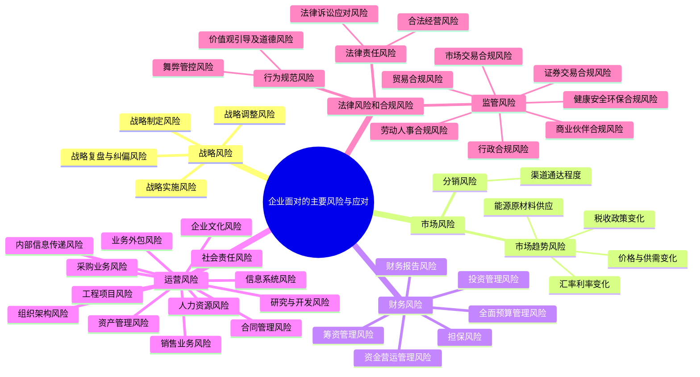

## 1. 章节定位

| 项目 | 信息 |
|------|------|
| 所属科目 | 公司战略与风险管理 |
| 难度等级 | 5 |
| 历年分值 | 10-15 分 |
| 建议学时 | 12-15 小时 |
| 知识关联章节 | 第6章风险与风险管理概述（五大风险类型总体定义）、第7章风险管理流程体系与方法（流程方法支撑本章应对措施）、第3章战略选择（战略风险源头）、第4章战略实施（运营风险源头） |

## 2. 考情分析

本章是公司战略与风险管理科目的"压轴大章"，系统阐述企业面对的五大类主要风险及其应对措施，是历年主观题、案例分析题的核心命题章节。历年分值约 10-15 分，主观题几乎每年必考。

**命题规律**：本章以案例分析题为主，客观题为辅。案例题常要求"识别企业面临的风险类型"并"提出管控措施"，考查风险辨识能力与应对措施的对应关系。客观题集中在五大风险类型的分类辨识、运营风险十三项业务的归属、财务风险六领域的辨识、法律风险与合规风险的区分等。

**高频考点分布**：

1. **五大风险类型辨识**：给定案例描述，判断属于战略风险、市场风险、财务风险、运营风险还是法律合规风险。命题陷阱：汇率波动属"市场风险"而非"财务风险"；客户违约属"市场风险（信用风险）"而非"运营风险"；财务报告失真属"财务风险"。
2. **战略风险四阶段**：战略制定风险、战略实施风险、战略调整风险、战略复盘与纠偏风险。
3. **市场风险两类**：市场趋势风险（产品或服务的价格及供需变化、能源、原材料、配件等物资供应、税收政策、汇率利率等）、分销风险（产品销售渠道的通达程度）。
4. **财务风险六领域**：全面预算、筹资、资金营运、投资、财务报告、担保，每个领域的风险表现与管控措施。
5. **运营风险十三项业务**：组织架构、人力资源、社会责任、企业文化、采购业务、资产管理、销售业务、研究与开发、工程项目、业务外包、合同管理、内部信息传递、信息系统。
6. **法律风险 vs 合规风险**：法律风险侧重民事责任，合规风险侧重行政责任和道德责任。监管风险七类（贸易、市场交易、劳动人事、证券交易、健康安全环保、行政、商业伙伴）。
7. **风险管控措施对应**：给定案例中企业存在的风险，要求提出具体管控措施。

**备考建议**：

- 用"五大风险"框架串联本章：战略风险（内部决策）→市场风险（外部市场）→财务风险（资金活动）→运营风险（日常经营）→法律合规风险（合规底线）；
- 运营风险十三项业务用"组人社文采资销研工外合信信"十三字记忆；
- 财务风险六领域用"预筹营投报担"六字记忆；
- 案例题答题套路：先判定风险类型→再列举风险表现→最后对应管控措施；
- 法律风险三分类（法律责任、行为规范、监管）与监管风险七类需准确区分。

## 3. 知识框架

## 4. 核心精讲

企业面对的主要风险分为五大类：战略风险、市场风险、财务风险、运营风险、法律风险和合规风险。本章依据《企业内部控制应用指引》系统阐述各类风险的主要表现与应对措施。

### 一、战略风险与应对

**战略风险**是指企业在战略制定、实施、调整和复盘纠偏过程中，因决策不当或环境变化导致战略目标无法实现的可能性。

#### （一）战略风险的主要表现

| 风险阶段 | 主要表现 |
|----------|----------|
| **战略制定风险** | 缺乏明确发展战略或发展战略偏离主业；发展战略过于激进，脱离企业实际能力或偏离主业；频繁调整发展战略，导致资源浪费、员工困惑 |
| **战略实施风险** | 实施主体缺失或职责不清，战略难以落实；缺乏有效的实施路径与资源配置；战略与组织结构、企业文化不匹配 |
| **战略调整风险** | 内外部环境发生重大变化时未能及时调整战略；战略调整缺乏充分论证与审批程序 |
| **战略复盘与纠偏风险** | 缺乏战略实施情况的监控与评估；发现问题未能及时纠偏；战略复盘机制缺失 |

#### （二）战略风险的应对措施

1. **关于战略制定**：
   - 建立健全发展战略制定机制，董事会负责审批，战略委员会或相关机构负责研究论证；
   - 发展战略应立足主业，结合宏观经济形势、行业发展趋势与企业实际能力，经充分调研论证后制定；
   - 战略目标应分解为年度经营计划，明确实施路径与资源配置方案。

2. **关于战略实施**：
   - 明确战略实施主体与职责分工，将战略目标分解到各业务单元与职能部门；
   - 优化组织结构以匹配战略实施需要，合理配置人力、财力、物力资源；
   - 培育支撑战略实施的企业文化，建立战略实施的激励约束机制。

3. **关于战略调整**：
   - 建立战略调整的触发机制，当内外部环境发生重大变化时及时评估战略适应性；
   - 战略调整应经充分论证并按权限审批，避免频繁随意调整。

4. **关于战略复盘与纠偏**：
   - 建立战略实施监控与评估机制，定期跟踪战略执行情况；
   - 发现偏差及时分析原因并采取纠偏措施，形成"制定—实施—监控—纠偏"的闭环管理。

> **案例锚定**：文天公司因战略制定过于激进、偏离主业，在多元化扩张中资源分散导致主业竞争力下降，最终被迫剥离副业回归核心业务。该公司战略制定阶段未充分论证自身能力与行业前景，战略实施阶段资源配置失衡，属于典型的战略风险案例。

### 二、市场风险与应对

**市场风险**是指企业因外部市场环境变化而可能遭受损失的风险，主要包括市场趋势风险和分销风险。

#### （一）市场趋势风险

**市场趋势风险**包括以下方面：

| 风险因素 | 具体内容 |
|----------|----------|
| **产品或服务的价格及供需变化** | 市场需求下降、产品价格下跌、供给过剩导致库存积压；替代品出现导致需求转移 |
| **能源、原材料、配件等物资供应的充足性、稳定性和价格变化** | 上游供应商垄断导致供应中断；原材料价格大幅上涨侵蚀利润；单一供应商依赖风险 |
| **税收政策和利率、汇率变化** | 出口退税政策调整影响外销利润；利率上升增加融资成本；汇率波动影响进出口贸易与外币资产负债价值 |
| **潜在进入者、竞争者、与替代品的竞争** | 新进入者打破市场格局；竞争者采取价格战等激烈竞争手段；替代品技术突破分流市场需求 |

#### （二）分销风险

**分销风险**是指企业产品销售渠道的通达程度不利于企业产品销售的风险。

| 风险表现 | 具体内容 |
|----------|----------|
| **分销渠道结构不合理** | 渠道层级过多导致层层加价、信息失真；过度依赖单一渠道或少数大客户 |
| **渠道商管理失效** | 经销商库存积压严重、串货乱价；渠道终端形象与服务质量参差不齐 |
| **渠道冲突** | 线上线下渠道冲突；多渠道并存导致内部竞争与利益分配矛盾 |

#### （三）市场风险的应对措施

1. **关于市场趋势风险**：
   - 建立市场趋势监测与预警机制，定期收集分析行业数据、竞争对手动态、政策变化等信息；
   - 加强供应链管理，建立多元化供应商体系，签订长期供货协议锁定价格与供应量；
   - 运用金融工具（如远期合同、期权、套期保值）管理汇率、利率、商品价格波动风险；
   - 加强产品研发与品牌建设，提升产品差异化程度以应对价格竞争；
   - 建立市场退出或转型机制，在行业衰退时及时调整业务方向。

2. **关于分销风险**：
   - 优化分销渠道结构，减少不必要的中间环节，建立线上线下融合的全渠道体系；
   - 建立渠道商评估与动态管理机制，定期考核经销商的库存、销售、服务表现；
   - 加强渠道终端管理，统一门店形象与服务标准，建立渠道冲突协调机制；
   - 拓展多元化销售渠道，降低对单一渠道或少数大客户的依赖。

> **案例锚定**：讯云公司主营消费电子产品，因未能及时洞察到行业从功能型向智能型的技术换代趋势，产品滞销导致库存积压；同时过度依赖少数大型经销商，经销商压价导致利润空间被压缩。该公司面临市场趋势风险（产品供需与价格变化）和分销风险（渠道结构不合理）的双重市场风险。

### 三、财务风险与应对

**财务风险**是指企业在财务活动中因管理不当而可能遭受损失的风险，主要包括全面预算管理风险、筹资管理风险、资金营运管理风险、投资管理风险、财务报告风险和担保风险。

#### （一）全面预算管理风险

| 风险表现 | 管控措施 |
|----------|----------|
| 预算编制不健全、不科学，可能导致企业经营缺乏约束或盲目经营 | 建立健全全面预算管理制度，明确预算编制、审批、执行、分析、考核流程；预算编制应上下结合、分级编制、逐级汇总 |
| 预算执行缺乏刚性、考核不严，可能导致预算管理流于形式 | 强化预算执行刚性，建立预算执行监控与差异分析机制；预算调整应严格审批；将预算执行结果纳入绩效考核 |
| 预算目标不合理、不科学，可能导致资源浪费或战略目标无法实现 | 预算目标应结合战略目标、历史数据与市场预测科学制定；建立预算目标的动态评估机制 |

#### （二）筹资管理风险

| 风险表现 | 管控措施 |
|----------|----------|
| 筹资决策不当，引发资本结构不合理或无效融资，可能导致企业筹资成本过高或债务危机 | 科学论证筹资方案，综合考虑筹资规模、结构、成本与风险；合理搭配股权融资与债务融资，优化资本结构 |
| 未按审批权限筹资，筹资资金用途不当，可能导致企业资金链条断裂或严重违规 | 严格筹资审批权限与程序，筹资资金应按规定的用途使用；建立筹资后评价机制 |
| 债务过高、还款期限结构不合理，增加偿债风险 | 合理安排债务期限结构，避免还款集中；建立偿债能力监测预警机制，保持合理的资产负债率 |

#### （三）资金营运管理风险

| 风险表现 | 管控措施 |
|----------|----------|
| 资金调度不合理、营运不畅，可能导致企业陷入财务困境或资金冗余 | 科学编制资金计划，加强资金收支的统一调度与集中管理；建立资金头寸监测机制 |
| 资金活动管控不严，可能导致资金被挪用、侵占或欺诈 | 严格资金支付审批权限，不相容岗位分离；加强银行账户管理，定期对账；推行网银支付与电子审批，留痕可追溯 |
| 现金流管理不善，导致资金链断裂 | 加强现金流量预测与监控，建立现金流压力测试机制；保持合理的现金储备 |

#### （四）投资管理风险

| 风险表现 | 管控措施 |
|----------|----------|
| 投资决策失误，引发盲目扩张或丧失发展机遇，可能导致投资失败 | 建立严格的投资决策程序，开展充分的可行性研究与尽职调查；投资方案应经集体决策与审批 |
| 投资后缺乏有效管控，可能导致投资损失 | 加强投资项目的投后管理，建立投资项目的跟踪评估机制；明确投后管理的责任主体 |
| 投资结构不合理，分散资源，影响主业发展 | 投资应聚焦主业、服务战略，避免盲目多元化；建立投资组合管理机制，分散非系统性风险 |

#### （五）财务报告风险

| 风险表现 | 管控措施 |
|----------|----------|
| 财务报告失真，可能导致企业声誉受损、面临监管处罚或法律诉讼 | 严格执行会计准则，建立健全会计核算与财务报告编制流程；加强财务报告的内部审核与审计 |
| 财务报告编制不规范、披露不完整，可能导致决策失误 | 规范财务报告编制标准，确保信息披露真实、完整、准确；建立财务报告披露的审批机制 |
| 会计政策选用不当或随意变更，影响财务信息可比性 | 合理选用会计政策，变更应经充分论证与审批，并在报告中充分披露 |

#### （六）担保风险

| 风险表现 | 管控措施 |
|----------|----------|
| 对担保申请人的资信调查不深入，可能导致企业承担连带责任 | 严格审查担保申请人的资信状况、偿债能力与担保事项的合法性；建立担保风险评估制度 |
| 担保审批权限与程序不规范，可能导致担保风险失控 | 严格担保审批权限与程序，重大担保应经董事会审批；建立担保台账，跟踪被担保人经营与财务状况 |
| 担保金额过大、对象过于集中，增加代偿风险 | 合理控制担保总额与单笔担保金额，避免对单一对象的担保过度集中；要求被担保人提供反担保 |

> **案例锚定**：长果公司因全面预算管理松懈，预算执行缺乏刚性，各部门超预算支出导致现金流紧张；同时盲目为关联方提供担保，未深入调查被担保方资信，最终因被担保方违约承担巨额代偿责任，引发财务危机。该公司面临财务风险中的预算管理风险与担保风险。

### 四、运营风险与应对

**运营风险**是指企业在日常经营活动中因内部管理不当而可能遭受损失的风险。运营风险涵盖企业内部管理的十三项业务，是案例分析题的高频考点。

#### （一）组织架构风险

| 风险表现 | 管控措施 |
|----------|----------|
| 治理结构形同虚设，缺乏科学决策、良性运行机制和执行力，可能导致企业经营失败 | 完善法人治理结构，明确董事会、监事会、经理层的职责权限；建立科学决策机制与制衡机制 |
| 内部机构设计不科学，权责分配不合理，可能导致机构重叠、职能交叉或缺失、推诿扯皮 | 科学设计内部组织机构，明确各部门职责权限与汇报关系；建立权责对等的责任体系 |

#### （二）人力资源风险

| 风险表现 | 管控措施 |
|----------|----------|
| 人力资源缺乏或过剩、结构不合理、开发机制不健全，可能导致企业发展战略难以实现 | 制定科学的人力资源规划，合理配置人员结构；建立人才引进、培养、储备机制 |
| 人力资源激励约束制度不合理、关键岗位人员管理不完善，可能导致人才流失或商业秘密泄露 | 建立科学的薪酬激励与绩效考核体系；加强关键岗位人员管理与保密协议约束 |
| 人力资源退出机制不当，可能导致法律诉讼或企业声誉受损 | 规范员工退出程序，依法合规处理劳动关系；做好退出员工的知识转移与工作交接 |

#### （三）社会责任风险

| 风险表现 | 管控措施 |
|----------|----------|
| 安全生产措施不到位，可能导致安全事故 | 建立健全安全生产管理体系，落实安全生产责任制；定期开展安全检查与隐患排查 |
| 环境保护投入不足，造成环境污染或资源枯竭 | 加大环保投入，建立环境管理体系；依法披露环境信息，履行环保责任 |
| 促进就业和员工权益保护不够，可能影响企业发展和社会稳定 | 依法用工，保障员工合法权益；建立和谐的劳动关系 |

#### （四）企业文化风险

| 风险表现 | 管控措施 |
|----------|----------|
| 缺乏积极向上的企业文化，可能导致员工丧失信心、企业缺乏凝聚力 | 培育积极向上的企业文化，明确企业使命、愿景与价值观；加强企业文化宣贯与落地 |
| 企业文化与战略不匹配，可能影响战略实施 | 推动企业文化与战略的协同，通过文化变革支撑战略转型 |

#### （五）采购业务风险

| 风险表现 | 管控措施 |
|----------|----------|
| 供应商选择不当、采购方式不合理、招投标或定价机制不科学，可能导致采购物资质次价高、舞弊或欺诈 | 建立供应商评估与准入制度，合格供应商清单动态管理；规范采购方式与招投标流程；建立比价与定价机制 |
| 采购验收不规范、付款审核不严，可能导致采购物资、资金损失或信用受损 | 严格采购验收制度，由独立于采购的机构或人员验收；加强付款审核，与合同、发票、验收单核对 |

> **案例锚定**：广尚科技公司在采购需求与计划管理方面，各分公司对相同物资的采购需求未有效整合，导致库存账实不符；供应商选择与管理缺乏统一机制，同类物料合同价格差异大；在供应商履约监督和付款审核方面存在薄弱环节，多种物料延期交付导致成本远超计划。该公司应对措施包括：规范采购计划审批与采购预算管理、建立供应商评估准入与动态管理制度、严格执行采购验收制度、定期对采购供应情况进行分析评估。

#### （六）资产管理风险

| 风险表现 | 管控措施 |
|----------|----------|
| 存货积压或短缺，可能导致流动资金占用过度或生产中断 | 科学制定存货定额，建立存货预警机制；加强存货盘点，确保账实相符 |
| 固定资产维护不当、使用效率低下，可能导致资产贬值或闲置 | 建立固定资产日常维护与定期检修制度；提高资产利用率，及时处置闲置资产 |
| 无形资产权属不清、保护不力，可能导致权属纠纷或价值流失 | 加强无形资产权属管理，及时办理登记注册；建立无形资产保护机制，防范侵权 |

#### （七）销售业务风险

| 风险表现 | 管控措施 |
|----------|----------|
| 销售政策和策略不当、市场预测不准确，可能导致销售不畅、库存积压 | 科学制定销售政策与策略，加强市场调研与需求预测；建立销售策略动态调整机制 |
| 客户信用管理不到位、结算方式选择不当，可能导致账款回收困难或坏账损失 | 建立客户信用档案与信用评估体系，实施分级管理；合理选择结算方式，加强应收账款催收 |
| 销售过程缺乏有效管控，可能导致舞弊或商业贿赂 | 规范销售流程，加强销售合同审批与执行监控；建立反商业贿赂机制 |

> **案例锚定**：广尚科技公司在销售业务方面，销售政策和策略制定不当，未能及时洞察教育市场变化，部分业务线收入明显下滑；基于乐观预期储备大量原材料而实际需求远低于预期，造成库存周转率大幅下降；未设立专门的信用管理部门，由销售部门负责信用管理，客户经理未详细考察客户信用情况，应收账款回收不力。该公司应对措施包括：制定适当的销售政策和策略并建立动态调整机制、建立健全客户信用档案管理体系、明确应收账款催收与监督职责。

#### （八）研究与开发风险

| 风险表现 | 管控措施 |
|----------|----------|
| 研发计划制定不当、研发人员配备不合理，可能导致研发失败或资源浪费 | 科学制定研发计划，合理配置研发资源与人员；建立研发项目立项评审机制 |
| 研发过程管理不善、研发成果转化不足，可能导致研发投入无法收回 | 加强研发过程跟踪管理，建立研发里程碑评审机制；建立研发成果转化与知识产权保护机制 |
| 核心研发人员流失，可能导致技术秘密泄露 | 建立研发人员激励与保留机制；加强核心技术人员的保密约束 |

#### （九）工程项目风险

| 风险表现 | 管控措施 |
|----------|----------|
| 工程立项缺乏可行性研究、决策不当，可能导致项目失败或资源浪费 | 严格工程立项的可行性研究与决策审批；建立项目后评价机制 |
| 工程招标不规范、造价控制不严，可能导致工程质次价高或舞弊 | 规范工程招投标流程，加强工程造价审核与变更管理 |
| 工程质量、进度、安全管理不善，可能导致工程事故或延期交付 | 建立工程质量、进度、安全管理体系；加强工程监理与验收 |

#### （十）业务外包风险

| 风险表现 | 管控措施 |
|----------|----------|
| 外包方案制定不合理、承包方选择不当，可能导致外包失败或核心能力流失 | 科学论证外包方案，严格评估选择承包方；避免外包核心业务 |
| 外包过程监控不力、外包成果验收不严，可能导致质量不达标或商业秘密泄露 | 加强外包过程监控，建立外包成果验收制度；签订保密协议 |

#### （十一）合同管理风险

| 风险表现 | 管控措施 |
|----------|----------|
| 合同订立未经审核、条款设计不当，可能导致法律纠纷或经济损失 | 建立合同审核机制，重大合同应经法务审核与集体决策；规范合同条款设计 |
| 合同履行监控不力、违约应对不当，可能导致权益受损 | 建立合同履行跟踪机制，及时预警违约风险；建立合同纠纷应对机制 |

#### （十二）内部信息传递风险

| 风险表现 | 管控措施 |
|----------|----------|
| 内部信息传递不及时、不准确、不完整，可能导致决策失误 | 建立规范的内部信息传递流程与渠道；明确信息传递的内容、时限与责任 |
| 内部报告体系缺失或失效，可能导致管理层无法及时掌握经营状况 | 建立多层次内部报告体系，定期向管理层报告经营、财务、风险状况 |
| 信息传递中泄密，可能导致商业秘密外泄 | 加强信息传递的保密管理，建立信息分级与权限控制机制 |

#### （十三）信息系统风险

| 风险表现 | 管控措施 |
|----------|----------|
| 信息系统缺乏规划或规划不合理，造成信息孤岛或重复建设 | 合理制定信息系统整体规划和发展计划，与企业组织架构、业务范围、技术能力匹配 |
| 系统开发不符合内控要求、授权管理不当，导致系统性风险 | 规范信息系统开发流程，将关键控制点嵌入系统程序；实施操作权限管理，不相容职责分离 |
| 系统运行维护和安全措施不到位，导致信息泄露或系统瘫痪 | 建立日常运行维护、变更管理、安全管理控制体系；建立数据备份与恢复机制；定期开展信息系统风险评估 |

**信息系统安全控制三大方面**：

| 控制类型 | 内容 |
|----------|------|
| **资产安全控制** | 建立信息系统资产管理制度，完善设备管理要求 |
| **信息安全控制** | 依照法律法规与安全技术标准制定信息安全实施规范；确定信息系统安全等级，建立授权使用制度；建立数据备份管理制度；委托外部机构运维的应审查资质并签订保密协议 |
| **访问安全控制** | 严格管理重要业务系统的访问权限，定期审阅系统账号；安装安全软件防范恶意软件；加强网络安全，防范网络攻击和非法侵入；涉密数据传输采取加密等技术手段 |

### 五、法律风险和合规风险与应对

**法律风险**是指企业在经营过程中因自身经营行为的不规范或外部法律环境发生重大变化而造成不利法律后果的可能性。

**合规风险**是指企业因违反法律或监管要求而受到制裁、遭受金融损失，以及因未能遵守所有适用法律、法规、行为准则或相关标准而给企业信誉带来损失的可能性。

> **关键区分**：法律风险侧重于**民事责任**的承担；合规风险侧重于**行政责任和道德责任**的承担。

**法律风险和合规风险的来源因素**：

1. 国内外与企业相关的政治、法律环境变化可能引发的风险；
2. 影响企业的新法律法规和政策颁布可能引发的风险；
3. 员工的道德操守不当可能引发的风险；
4. 企业签订重大协议和有关贸易合同的条款设计不当等可能引发的风险；
5. 企业发生重大法律纠纷案件所引发的风险；
6. 企业和竞争对手的知识产权可能引发的风险。

法律风险和合规风险在企业风险管理实务中一般按**法律责任风险、行为规范风险和监管风险**三类采取相应的应对措施。

#### （一）法律责任风险与应对

**法律责任风险**是指因个人或团体的疏忽或过失行为，造成他人的财产损失或人身伤亡，按照法律、契约应负法律责任或契约责任的风险。在企业经营管理中，是指在业务活动中发生违规行为，或因日常经营和业务活动违反法律规定，导致发生争议、法律纠纷而造成经济损失的风险。

| 主要表现 | 管控措施 |
|----------|----------|
| **合法经营风险**：公司生产经营违反相关法律法规或其他规定、流程手续、资质要求等，可能导致法律制裁、重大财务损失和声誉损失 | **健全违法违规问责和处罚体系**：建立法律合规问责和处罚制度，规定违法违规当事人与所属上级领导共同承担责任；完善监控机制，制定纠正和预防措施，持续改进法律合规管理体系 |
| **法律诉讼应对风险**：公司面临外部诉讼纠纷时未能积极妥善应对，或应诉行为不当，可能导致企业承担潜在利益损失 | **构建实施法律管理制度规范及应对策略**：配置专业法务人员，建立法律管理制度规范及符合企业核心利益的应对策略；重视事后评估，透过案件分析经营管理的现实和潜在风险，提出防范建议 |

#### （二）行为规范风险与应对

**行为规范**是指社会群体或个人在参与社会活动中所遵循的规则、准则的总称。

| 主要表现 | 管控措施 |
|----------|----------|
| **价值观引导及道德风险**：企业管理层未引导员工建立正确的价值观，员工或其他利益相关者的潜在不道德行为，可能导致企业声誉受到负面影响 | **制定实施员工职业道德规范**：制定员工职业道德规范，定期组织培训，要求员工确认知晓程度；关注潜在的利益冲突行为并展开调查，确保企业在法律规范下经营运作 |
| **舞弊管控风险**：公司管理层未识别出舞弊的高风险岗位并对其风险进行控制，可能导致公司面临直接经济损失或形象受损 | **制定廉洁与反舞弊管理措施**：有效防范管理层违规决策、挪用企业资金、贪污企业资产、收受贿赂等行为；防范员工或合作伙伴的潜在违法行为；建立反舞弊情况通报制度，定期通报并反思评价控制缺陷 |

#### （三）监管风险与应对

**监管风险**是指由于法律或监管规定的变化，可能影响企业正常运营，或削弱其竞争能力、生存能力的风险。

| 监管风险类型 | 主要表现 | 管控措施 |
|--------------|----------|----------|
| **贸易合规风险** | 未能有效识别进出口产品在进出口海关、进出口国可能遇到的监管要求，或未能准确理解政府贸易规定、海关规定 | 加强贸易合规风险预判和应对，关注政府贸易监管要求，识别和防范违反贸易规定、海关规定、地缘政治规则的风险；交易前收集信息，明确不确定因素，制定应对方案 |
| **市场交易合规风险** | 未能识别和遵守反商业贿赂、反垄断、反不正当竞争等市场交易行为的监管要求 | 构建市场交易合规制度体系，收集法律规定与国际组织规章，制定符合国内外标准的反商业贿赂、反垄断、反不正当竞争等制度体系 |
| **劳动人事合规风险** | 未能识别和防范违反国家和劳动保障机构制定的相关法规（个人所得税、薪酬、休假、反歧视等） | 规范劳动用工的全流程管理，严格招聘程序，加强入职审查，建立合法合规的劳动合同管理制度与合理的工资结构，制定符合实际的绩效考核机制 |
| **证券交易合规风险** | 上市公司未能识别和遵守证券监督管理要求（证券交易所的股票交易规则及内控标准等） | 建立实施完善的证券业务制度规范，强化合规性监督，对执业行为的合规性进行审查监督；严格限定不同岗位人员的操作权限 |
| **健康安全环保合规风险** | 未能识别并遵守国家健康、安全和环保方面的法律与规范；未对员工提供安全、环保意识培训；安全管理体系不健全 | 建立完善的健康安全环保管理体系，严格遵守法律法规；对突发事件制定应急预案；定期组织员工培训，加强安全、环保意识 |
| **行政合规风险** | 未能按时向税务机关、工商机关等提交税务报告、年检报告等资料，受到监管机构的检查批评或处罚 | 建立完善的行政合规风险管控机制，时刻关注政府监管要求，严格按要求报送税务报告、年检报告等；加强对财税风险的监控、评估预测并制定应对方案 |
| **商业伙伴合规风险** | 未能有效筛选或识别商业伙伴的不合规行为，可能导致企业遭受行政处罚、经济或声誉损失 | 建立商业伙伴合规风险管控机制，重点关注与各类商业伙伴合作义务及责任相关的合规义务履行能力；根据合作类型和合规风险等级，对商业伙伴开展动态风险评估和闭环管理 |

> **案例锚定**：津味饮料公司2017年10月成立后凭借新零售模式和激进的市场扩张策略迅速崛起，2019年顺利上市。然而2020年8月公司自曝2019年虚构交易达22亿元人民币，陷入严重的法律与合规危机。该公司面临的法律风险和合规风险主要表现为：(1) **法律责任风险**——合法经营风险（系统性财务造假严重违反《证券法》）、法律诉讼应对风险（遭遇多起集体诉讼，投资者索赔金额高达数亿美元）；(2) **行为规范风险**——价值观引导及道德风险（公司内部形成"唯业绩论"的企业文化，部分区域经理和门店运营人员通过虚构订单、虚增销量完成业绩指标，管理层对此采取默许态度）；(3) **监管风险**——证券交易合规风险（一系列违规行为导致1.9亿元的民事罚款）。该公司采取的管控措施包括：建立严格的问责处罚制度（开除涉事高管并重组董事会）、配置专业法务团队、制定《员工职业道德规范》和《合规管理制度》、完善证券事务管理制度、优化财务报告相关的内部控制等。

## 5. 典型例题

**【例题 1】（单选题，风险类型辨识）**

下列各项中，属于市场风险的是（ ）。
A. 企业因战略制定过于激进而偏离主业
B. 企业因汇率波动导致出口收入减少
C. 企业因预算管理松懈导致现金流紧张
D. 企业因未按时提交年检报告被工商机关处罚

**答案**：B

**解析**：A属于战略风险（战略制定风险）；B正确，汇率波动属于市场风险中的市场趋势风险（税收政策和利率、汇率变化）；C属于财务风险（全面预算管理风险）；D属于法律风险和合规风险中的监管风险（行政合规风险）。

**【例题 2】（单选题，运营风险辨识）**

下列各项中，不属于运营风险的是（ ）。
A. 组织架构设计不科学导致机构重叠
B. 采购验收不规范导致采购物资质次价高
C. 客户信用管理不到位导致坏账损失
D. 利率上升导致融资成本增加

**答案**：D

**解析**：A属于运营风险中的组织架构风险；B属于运营风险中的采购业务风险；C属于运营风险中的销售业务风险（客户信用管理）；D属于市场风险中的市场趋势风险（利率变化），不属于运营风险。

**【例题 3】（单选题，法律风险与合规风险区分）**

下列关于法律风险和合规风险的说法中，正确的是（ ）。
A. 法律风险侧重于行政责任的承担
B. 合规风险侧重于民事责任的承担
C. 法律风险侧重于民事责任的承担，合规风险侧重于行政责任和道德责任的承担
D. 法律风险和合规风险的含义完全相同

**答案**：C

**解析**：法律风险侧重于民事责任的承担；合规风险侧重于行政责任和道德责任的承担。AB选项说反了；D错误，两者含义不同，侧重不同。

**【例题 4】（多选题，运营风险十三项业务）**

下列各项中，属于运营风险的有（ ）。
A. 组织架构风险
B. 社会责任风险
C. 工程项目风险
D. 业务外包风险
E. 担保风险

**答案**：ABCD

**解析**：运营风险包括十三项业务：组织架构、人力资源、社会责任、企业文化、采购业务、资产管理、销售业务、研究与开发、工程项目、业务外包、合同管理、内部信息传递、信息系统。E错误，担保风险属于财务风险，不属于运营风险。

**【例题 5】（多选题，监管风险七类）**

下列各项中，属于监管风险的有（ ）。
A. 贸易合规风险
B. 市场交易合规风险
C. 证券交易合规风险
D. 健康安全环保合规风险
E. 法律诉讼应对风险

**答案**：ABCD

**解析**：监管风险包括七类：贸易合规风险、市场交易合规风险、劳动人事合规风险、证券交易合规风险、健康安全环保合规风险、行政合规风险、商业伙伴合规风险。E错误，法律诉讼应对风险属于法律责任风险，不属于监管风险。

**【例题 6】（多选题，财务风险六领域）**

下列各项中，属于财务风险的有（ ）。
A. 全面预算管理风险
B. 筹资管理风险
C. 资金营运管理风险
D. 投资管理风险
E. 财务报告风险
F. 担保风险

**答案**：ABCDEF

**解析**：财务风险包括六个领域：全面预算管理风险、筹资管理风险、资金营运管理风险、投资管理风险、财务报告风险、担保风险。六项均正确。

**【例题 7】（多选题，战略风险四阶段）**

战略风险的主要表现包括（ ）。
A. 战略制定风险
B. 战略实施风险
C. 战略调整风险
D. 战略复盘与纠偏风险
E. 战略放弃风险

**答案**：ABCD

**解析**：战略风险包括四个阶段：战略制定风险、战略实施风险、战略调整风险、战略复盘与纠偏风险。E错误，"战略放弃风险"不属于战略风险的四个阶段。

**【例题 8】（综合题，风险辨识与应对）**

某家电制造企业近年来出现以下情况：(1) 公司战略制定时过于激进，同时进入多个不相关行业，资源分散导致主业竞争力下降；(2) 主要原材料铜的价格大幅上涨，公司未采取套期保值措施，成本激增；(3) 公司为关联方提供大额担保，未深入调查被担保方资信，被担保方违约后公司承担巨额代偿责任；(4) 公司采购部门负责人利用职权指定供应商，收取回扣，导致采购价格高于市场价20%；(5) 公司未按时向税务机关报送税务报告，受到税务机关处罚。

要求：(1) 分别指出上述各项情况属于哪种风险类型；(2) 针对情况(4)说明应采取的管控措施。

**答案**：

(1) 风险类型辨识：

- 情况(1)属于**战略风险**（战略制定风险——发展战略过于激进，脱离企业实际能力或偏离主业）；
- 情况(2)属于**市场风险**（市场趋势风险——能源、原材料、配件等物资供应的价格变化）；
- 情况(3)属于**财务风险**（担保风险——对担保申请人的资信调查不深入，担保金额过大）；
- 情况(4)属于**运营风险**（采购业务风险——供应商选择不当、定价机制不科学，导致舞弊）；
- 情况(5)属于**法律风险和合规风险**（监管风险——行政合规风险，未按时提交税务报告受到处罚）。

(2) 针对情况(4)采购业务风险，应采取的管控措施：

- **供应商管理方面**：建立供应商评估与准入制度，制定合格供应商清单并动态调整；对供应商进行资信审查，避免单一供应商垄断；
- **采购流程方面**：规范采购方式与招投标流程，建立比价与定价机制；不相容岗位分离（采购、验收、付款应由不同部门或人员负责）；
- **验收与付款方面**：严格采购验收制度，由独立于采购的机构或人员按合同约定进行验收；加强付款审核，与合同、发票、验收单核对一致后方可付款；
- **监督问责方面**：建立采购业务的监督检查机制，定期审计采购流程；对舞弊行为严肃问责，追究当事人及上级领导责任；
- **廉洁管理方面**：制定廉洁与反舞弊管理措施，防范采购人员收受回扣等违法行为。

## 6. 记忆口诀

**五大风险类型**：战略（内部决策）→市场（外部市场）→财务（资金活动）→运营（日常经营）→法律合规（合规底线）。记忆：战市财运法。

**战略风险四阶段**：制定→实施→调整→复盘纠偏。记忆：制实调复。

**市场风险两类**：市场趋势风险（价格供需、能源供应、税收利率汇率、竞争）+ 分销风险（渠道通达）。记忆：趋势+分销。

**财务风险六领域**：全面预算、筹资、资金营运、投资、财务报告、担保。记忆：预筹营投报担。

**运营风险十三项业务**：组织架构、人力资源、社会责任、企业文化、采购业务、资产管理、销售业务、研究与开发、工程项目、业务外包、合同管理、内部信息传递、信息系统。记忆：组人社文采资销研工外合信信（十三字）。

**法律风险三分类**：法律责任风险（民事）、行为规范风险（道德）、监管风险（行政）。记忆：法行监。

**监管风险七类**：贸易、市场交易、劳动人事、证券交易、健康安全环保、行政、商业伙伴。记忆：贸市劳证健行商。

**法律风险 vs 合规风险**：法律侧重民事，合规侧重行政和道德。

**信息系统安全控制三方面**：资产安全、信息安全、访问安全。记忆：产信访。

**案例题答题套路**：先判定风险类型→再列举风险表现→最后对应管控措施（三步法）。

**风险应对总思路**：建立制度→明确职责→流程管控→监督问责→持续改进（五步闭环）。

## 7. 同步练习

**1.（单选题）** 某公司使用核材料设备生产A产品，2010年该设备使用寿命到期，在对该设备处理过程中产生了核废弃物，影响了附近居民的健康，公司因此受到监管部门的行政处罚。依材料分析，该公司由此产生的风险属于（ ）。

A. 战略风险
B. 市场风险
C. 财务风险
D. 合规风险

**2.（单选题）** 乐太公司是一家食品添加剂生产企业，该公司为应对法律风险和合规风险制定和实施了一系列风险管控措施。下列各项措施中，属于应对行为规范风险的管控措施是（ ）。

A. 制定廉洁及反舞弊管理措施
B. 建立符合实际的绩效考核机制
C. 关注政府对食品添加剂生产的监管要求，识别和防范各种潜在合规风险
D. 建立完善的安全管理体系

**3.（单选题）** 乙公司的某产品经理为了增加销售数量，对大客户或者小额消费者组成的团购集体放松信用管理，最终导致账款回收不力，给乙公司带来了巨大的坏账压力。乙公司销售业务管理存在的风险主要表现为（ ）。

A. 销售过程存在舞弊行为，可能导致企业利益受损
B. 客户信用管理不到位，账款回收不力等，可能导致销售款项不能收回或遭受欺诈
C. 销售政策和策略不当，市场预测不准确，可能导致销售不畅、库存积压、经营难以为继
D. 供应商选择不当，采购方式不合理，可能导致销售款项不能收回或遭受欺诈

**4.（单选题）** 岭南公司是一家小型家电生产企业。由于金融危机的影响，导致岭南公司大量产品积压。为了尽快解决资金占用问题，岭南公司与乙公司签订赊销合同。信用期结束后，乙公司迟迟未支付这笔货款，岭南公司为此计提了坏账准备。依据风险来源应考虑的因素，岭南公司面对的风险属于（ ）。

A. 市场风险
B. 运营风险
C. 战略风险
D. 法律和合规风险

**5.（单选题）** 清水公司是从事特种高分子薄膜研发、生产和销售的高新技术企业。为强化风险管控，该公司聘请专业讲师，定期组织员工参加培训，提高员工的业务水平和合规意识，增强员工的责任感和使命感，全面提升员工的文化修养和内在素质。上述措施主要体现的是（ ）。

A. 保护员工权益
B. 安全生产管理
C. 企业文化建设
D. 组织架构优化调整

**6.（单选题）** 中安公司委托外部服务公司检查本公司的内部控制是否存在漏洞。下列各项中，属于该公司财务报告方面可能存在的风险表现是（ ）。

A. 不能有效利用财务报告，难以及时发现企业经营管理中存在的问题，可能导致企业财务和经营风险失控
B. 不编制预算或预算不健全，可能导致企业经营缺乏约束或盲目经营
C. 销售过程存在舞弊行为，可能导致企业利益受损
D. 外包范围和价格确定不合理，承包方选择不当，可能导致企业遭受损失

**7.（单选题）** Y百货公司因未能准确把握政府对企业产品定价的要求，违反价格法相关条款被市场监管局罚款43万元并责令立即改正违法行为。Y百货公司面临的风险属于市场风险中的（ ）。

A. 分销风险
B. 市场趋势风险
C. 战略制定风险
D. 投资风险

**8.（单选题）** X集团在2010年开启多元化战略，在多元化战略指引下衍生出了体育、快消品、健康、旅游、金融、服务、高科技、影视文化及汽车九大产业。由于X集团缺乏足够的战略实施人员和战略资源来支持多元化进程，致使这些产业板块大多处于长期大额亏损状态，同时由于一直忽略主业的发展，导致主业的市场占有率从最高点的20%下降到不足1%。X集团面临的战略风险主要表现为（ ）。

A. 战略制定风险
B. 战略实施风险
C. 战略调整风险
D. 战略复盘风险

**9.（单选题）** F公司根据发展战略和年度生产经营计划，综合考虑预算期内经济政策、市场环境等因素，按照上下结合、分级编制、逐级汇总的程序，选择弹性预算方法编制年度全面预算，并按照相关法律法规及企业章程的规定报经审议批准。批准后，F公司以文件形式下达给各个部门执行。根据上述资料，F公司应对全面预算管理风险时重点关注的方面是（ ）。

A. 预算编制与下达
B. 预算指标分解和责任落实
C. 预算执行
D. 预算分析与调整

**10.（单选题）** A公司是一家集生活用纸研究、生产、销售于一体的公司，为了更好地应对采购业务风险，公司董事会要求建立和完善采购物资定价机制，根据适用的采购方式科学确定采购价格，避免采购物资质次价高。A公司董事会提出的应对采购业务风险的管控措施属于（ ）。

A. 采购供应商管理
B. 采购过程管理
C. 采购业务评估
D. 采购付款管理

**11.（多选题）** 随着医疗保险制度的逐步完善，药品价格改革的降价效应得到了进一步显现。今后，药品价格主要由市场决定，以及政府的药品降价政策将使国内药品的总体价格水平不断下降。双成公司是一家生物制药公司，公司已形成规模销售的产品，今后将面临激烈的市场竞争和强劲的竞争对手，因而本公司产品降价趋势明显，这将对公司的盈利能力产生一定不利影响。根据以上信息可以判断，双成公司可能面对的风险类型包括（ ）。

A. 市场风险
B. 法律和合规风险
C. 运营风险
D. 战略风险

**12.（多选题）** 甲公司是一家环保设备制造商。2010年，甲公司未按审批的投资方案进行投资，盲目上马房地产项目，并把原以投资建设环保项目为由从银行取得的贷款转而投入了房地产开发。几年后，政府为给房地产行业"降温"，专门出台了紧缩型的宏观调控政策，由于甲公司未能准确把握监管当局的政策导向和市场环境的变化，导致甲公司开发的商品房销售极不理想，最终导致房地产业务没有达到发展目标。上述案例所涉及的风险有（ ）。

A. 法律和合规风险
B. 财务风险
C. 战略风险
D. 市场风险

**13.（多选题）** 作为传统品牌的H辣酱，其核心产品就是辣酱，产品结构单一，不能通过多元化的品种来应对消费者需求的变化，无法增加产品附加值；对此，H辣酱经过董事会审批后决定走产品多元化道路，由于缺乏完整的战略布局，没有达到多元化发展的总体战略目标。H辣酱面对的风险有（ ）。

A. 市场风险
B. 运营风险
C. 法律与合规风险
D. 战略风险

**14.（多选题）** 太阳公司主要业务为电石及其系列延伸产品的生产和销售。该公司每年定期对合同履行的总体情况和重大合同履行的具体情况进行分析评价，对于发现的执行缺陷，及时采取措施予以改进。同时充分利用信息系统，通过定期对合同的统计、分类和归档，详细登记合同的订立、履行和变更等信息，实现对合同的全流程闭环管理。太阳公司上述举措主要应对合同管理风险中的（ ）。

A. 合同订立
B. 合同履行
C. 合同登记
D. 合同管理后评估

**15.（多选题）** 云涌公司管理层利用激烈的头脑风暴讨论公司战略风险的影响因素，有人认为包括宏观环境、行业状况与竞争对手情况；有人则认为企业拥有的各种有形、无形资源及人力资源很重要；有人则提出企业的研发能力与综合组织管理能力很关键；还有人认为高层的管理经验及知识结构是至关重要的影响因素。以上讨论涉及的战略风险影响因素有（ ）。

A. 企业的战略环境
B. 企业的战略资源
C. 企业的战略定位
D. 企业领导者的领导力

**16.（多选题）** 高新技术企业Z公司早在1995年就成立知识产权部，并引入专业的科研、律师团队进行全流程管理。此外，为保证公司知识产权战略的有效实施，Z公司制定了员工保密协议，并及时就研发成果向国家专利行政部门申请专利保护。Z公司逐步建立起由论证预研、集成产品开发模块及专利地图三个有机统一的环节组成的集成产品研发模块体系。依材料分析，Z公司的举措规避的研发管理风险有（ ）。

A. 研究项目未经科学论证或论证不充分，可能导致创新不足或资源浪费
B. 研发成果转化应用不足、保护措施不力，可能导致企业利益受损
C. 研发人员配备不合理或研发过程管理不善，可能导致研发成本过高、舞弊或研发失败
D. 立项缺乏可行性研究或者可行性研究流于形式，决策不当

**17.（多选题）** 勤奋公司根据自身发展战略和规划，结合企业资金状况以及筹资可能性，制定投资项目规划，科学确定投资项目，拟定投资方案。同时按照规定的权限和程序对投资项目进行决策审批，其中，对于股权类投资项目，重点审查投资方案是否合理可行，投资项目是否符合国家产业政策及相关法律法规的规定，是否符合企业整体战略目标和规划，尽调工作是否充分、尽调发现的问题及风险是否可控、投资目标能否达成等。根据上述资料，勤奋公司应对投资管理风险时重点关注的方面有（ ）。

A. 投资方案可行性论证
B. 投资方案决策
C. 投资方案实施
D. 投资处置

**18.（多选题）** 冬猎公司的管理层认为对外提供担保时要非常谨慎，重大业务担保要进行集体决策。下列属于该企业在办理担保业务时可能存在的风险有（ ）。

A. 对担保申请人的资信状况调查不深入，审批不严或越权审批，可能导致企业担保决策失误或遭受欺诈
B. 对被担保人出现财务困难或经营陷入困境等状况监控不力，应对措施不当，可能导致企业承担法律责任
C. 担保范围不合理，可能导致企业遭受损失
D. 担保过程中存在舞弊行为，可能导致经办审批等相关人员涉案或企业利益受损

**19.（多选题）** 科万建设公司每年承担数亿元工程项目的建设任务，下列各项中属于该企业在工程项目方面可能面临的风险有（ ）。

A. 立项缺乏可行性研究或者可行性研究流于形式，决策不当，盲目上马，可能导致难以实现预期效益或项目失败
B. 项目招标"暗箱"操作，存在商业贿赂，可能导致中标人实质上难以承担工程项目、中标价格失实及相关人员涉案
C. 工程造价信息不对称，技术方案不落实，预算脱离实际，可能导致项目投资失控
D. 对工程建设进度缺乏有效监控或监管不严，可能导致工程项目进度严重落后于项目计划

**20.（多选题）** 凯悦公司是一家电动车制造和出口商。该公司为应对法律风险和合规风险，制定实施了一系列风险管控措施。下列各项措施中，属于该公司应对监管风险的管控措施有（ ）。

A. 关注政府对贸易和电动车出口的监管要求，识别和防范各种潜在合规风险
B. 严格遵守法律法规，建立完善的安全管理体系，对突发事件制定相关的应急预案
C. 严格招聘程序，加强对劳动者入职审查，建立并执行合法合规的劳动合同管理制度
D. 制定员工职业道德规范，并定期组织培训

**21.（简答题）** 一家百年巨头企业，巅峰时期全球有近15万名员工，业务遍及150多个国家和地区，占据着全球相机和胶卷市场的半壁江山，它就是曾经的相机、影像的代名词——无形公司。2000年以来，由于传统相机市场被数码相机快速抢占，传统胶卷市场开始迅速萎缩，每年以20%的幅度锐减，消费者热衷于数码相机而非传统的胶卷相机，市场销售数据表明数码相机已经从商用逐步转向民用，并最终用10年左右时间取代传统相机。在此期间无形公司却并未制定有效的市场竞争策略，没有及时把握市场环境所发生的巨大变化。2003年，无形影像部门的利润从2000年的143亿美元暴跌至42亿美元。无形公司在数码相机领域的发力，远不能弥补传统相机和胶卷两块主营业务的"坍塌"。无形公司没有及时调整自己的产品结构，至此公司失去了市场的核心地位。

要求：
（1）简要分析无形公司所面临的市场风险表现。
（2）简要分析无形公司管理层可以采取的应对该风险的管控措施。

**22.（简答题）** （2021年）煌水乳业公司成立于2002年，2013年正式挂牌上市。2016年12月16日，一家国际著名调查机构发布做空煌水乳业的报告，指出煌水乳业在苜蓿草和产奶量等方面数据造假。随后数月，国内一家银行发现，煌水乳业大量单据造假，将账上30亿资金转出投资房地产，无法收回。此外，业内人士也发现了煌水乳业多处编制财务报告的内控缺陷。（1）煌水乳业在2016年3月报表中显示公司流动资金充足，并对企业的持续经营能力表示肯定。然而分析2016年度的财务报表后显示，煌水乳业2016年的经营活动在收入、成本、借款等方面存在不实问题，企业未来的持续经营能力存在重大不确定性，财务报表存在重大错报风险。（2）煌水乳业在2014年4~6月向迪科种业公司累计购买约685万元的种子，这笔交易并未在中期报告中及时披露，而在后期发现执行董事于坤间接持有迪科种业公司的控股权，该购买行为被证明为关联交易。2014年12月23日，煌水乳业将其当年4月建立的子公司富浩股份转让予新成立的兴旺畜牧公司，后者由刘冰个人百分百控股。然而此次交易不具有正当的商业理由，且煌水乳业2015年财务报告并未披露此次处置子公司的作价，业内人士质疑煌水乳业建立富浩公司的目的很可能就是利用关联方转移资产。

煌水乳业频繁出现财务报告虚假与不实问题，与其内部治理结构的缺陷不无关联。煌水乳业自上市以来，董事会主席兼CEO的张凯始终维持公司最大股东身份，对公司具有绝对的控制和管理权力，掌控公司所有的重大事项决策权，并直接负责公司所有业务的运营和管理。煌水乳业未设置监事会，监事会的职能主要由审计委员会以及独立董事履行。煌水乳业的独立董事中王光和李良都曾是BM会计师事务所的合伙人，而煌水乳业一直以来聘用BM事务所进行外部审计，会计师事务所的合伙人任职客户公司重要岗位，削弱了注册会计师的独立性，煌水乳业的独立董事及其聘用的会计师事务所都没有严格履行其对公司财务报告审核监督的责任。煌水乳业的审计委员会由3名独立非执行董事组成。年报公布的审计委员会两次会议显示，审计费用以及年度和半年度的财务报告审计均被顺利通过，并未发现财务报表和审计过程中存在的诸多问题，审计委员会并没有尽到应尽的职责。

要求：
（1）依据财务报告风险与应对的内容，简要分析煌水乳业财务报告存在的主要风险。
（2）依据组织架构风险与应对的内容，简要分析煌水乳业存在的主要风险。
（3）简要分析煌水乳业公司内部治理结构存在的主要缺陷。

**23.（简答题）** 起浪公司是一家经营连锁零售的企业。近年来，除了零售主业外，起浪公司的投资版图更是遍布地产、金融、物流、体育、电竞等行业，发展速度迅猛，但在这"光鲜"的发展背后，却隐藏着不少财务隐患。（1）自2012年起起浪公司走上多元化扩张的道路，先后进行了十几次投资。起浪公司主要依靠借款进行筹集资金，且借款额度在不断增加。从2019年开始，起浪公司几乎百分之百的筹资都来自借款，这种融资方式使得公司背上了沉重的债务包袱，资本结构缺乏合理性，增加其流动性风险。截至2020年2月，起浪公司的短期借款、应付票据和应付账款的金额合计高达553亿元，且出现了大面积商票逾期，纠纷不断，起浪公司这样单一的筹资方式，给企业带来严重的资金链问题，引发财务危机。（2）由于没有为多元化战略进行合理的现金预算管理，投资活动的现金流出持续增加，紧接着公司业绩持续下滑，无法获得足够的融资，现金流入逐年减少，但起浪公司依旧没有停止扩张的步伐。一方面，2021年起浪公司将公开募集到的1亿元资金违规变更用途，建立了对主业（零售业务）并无益处的民营银行，加剧了资金链的紧张情况；另一方面长期股权投资短期内难以见效。（3）起浪公司在2019年3月报表中显示公司流动资金充足，并对企业的持续经营能力表示肯定。然而分析2019年度的财务报表后显示，起浪公司2019年的经营活动在收入、成本、借款等方面存在不实问题，企业未来的持续经营能力存在重大不确定性，财务报表存在重大错报风险。（4）起浪公司实控人李某根据公司的担保标准和担保条件对乙公司进行了资信调查和风险评估，在未报经董事会或类似权力机构批准的情况下，即做出接受乙公司担保申请的决定，为其提供不可撤销的连带责任保证担保，金额高达2.51亿元。

要求：
（1）简要分析起浪公司财务风险主要表现。
（2）针对投资风险，简要说明起浪公司应采取的管控措施。

**24.（综合题）** 资料一：2003年，在个人音响领域经营多年的张煌创立了力益公司，进军国内需求旺盛的MP3播放器市场，推出力益公司的开山之作MX系列。力益公司创立之初就推崇"小而美"的策略，致力于开发优质的MP3产品。张煌对于上市产品的审核标准十分苛刻，多数开发的产品因"不够完美"被否定。力益公司对产品品质的严格把控受到市场认同，其产品成为国产MP3高品质的代表，也因此拥有了大量忠实用户，并创造了国内MP3历史上多个"第一"。2006年，力益公司的MP3播放器在国际市场已经是一个很知名的品牌，产品远销欧美日韩等数十个国家。2006年初，国内MP3产业还正处于繁荣时期，张煌却看到了全球MP3产业的衰势，开始着手战略转型。进入2007年，国内MP3市场盛极而衰。此时，力益公司破釜沉舟地放弃了国内MP3市场"领头羊"的地位，转向互联网智能手机的研发。2008年，力益公司开始在智能手机领域投入全部的精力，致力开发高端智能手机。2009年2月18日，国内第一款大屏幕全触屏智能机力益M8正式上市。凭借着"国产智能手机先驱者"的名号，2009年力益M8站稳了国产智能手机的领先地位。2010年到2014年，力益公司延续着做MP3产品时的策略，崇尚"小而美"，不追求扩大市场份额，专注制造精品。与产品开发同步，力益公司强化营销体系建设，在实施多重营销策划方案的同时，不断扩展专卖店和维修中心。2013年力益公司国内专卖店数量超过1000家，维修中心数量突破100家。力益公司内部采取员工股票和期权激励制度，吸引和鼓励更多的人才致力于公司的技术和产品创新。

资料二：随着通信网络技术的发展，智能手机行业迎来了巨大的机遇。自2009年开始，各大手机厂商纷纷发力智能手机，疯抢市场份额。2009年到2013年，在国内智能手机发展的初期，智能手机的销量与国内三大电信运营商密切相关。凭借与三大电信运营商良好的合作关系，"中旺""华夏""盟进""联展"（简称"中华盟联"）四大厂商的手机常常与电信运营商套餐绑定，迅速占据了一大部分市场份额。2013年到2016年，在"中华盟联"统治市场的后期，"00""VV""XM"等手机厂商开始异军突起，凭借出色的营销渠道网络和庞大的广告投放，不断从线下和线上掠取智能手机市场份额。然而，力益这个国产智能手机的先驱者却迷失了方向。公司实施"小而美"策略，既没有在前期抓住与三大电信运营商合作的机遇，也没有在后期强化营销扩大市场份额。公司一年只开发上市两部精品手机，广告投入与渠道建设也停滞不前。力益公司逐渐失去市场份额，成为一个小众品牌。在规模经济显著且已进入成熟期的产业中，产品差异逐渐变小，投资者和供应链都开始拒绝"小而美"，新一轮的手机技术竞争需要大量投入。

资料三：2014年，力益公司全年手机销量不到400万台，而彼时的"学徒"、现在的竞争对手"XM"公司全年手机销量则超过6000万台，成为国内第一。在严峻的市场形势下，2014年底张煌重新出山，担任力益公司董事长，启动了新一轮战略转型：（1）调整发展理念，摒弃"小而美"，启动"大而全"，接受两家大公司的投资总计6.5亿美元，确立了大力提高市场份额的战略目标；（2）实施机海战术，全面扩大产品线，2015年全年发布6款手机，覆盖了高、中、低三种不同档次和价格的产品线；（3）对内理清管理职责，对外加大营销力度，同时运用新的投资，扩张线下门店，广告、公关宣传等营销手段在线上线下全面展开。然而，自2016年起，力益公司再次遭受重创。主要原因是由于专业经验不足与评价体系不完善，力益手机大量使用了LFK公司的手机芯片。LFK芯片用料廉价，CPU核心技术落后，与竞争对手GT芯片相比差距明显。力益公司巨资开发的PR6和PR7系列，由于"内芯"这一致命缺陷，市场并不买账。2018年力益手机全年销量仅405万台，市场占比仅有0.1%，形势异常严峻。2018年底，在公司生死存亡关头，张煌又一次重新调整企业战略，确立了新的品牌口号"追求不止，只因热爱"，改用GT芯片，跟进全面屏技术，提升产能。营销策略上，线上启用新的意见领袖，在各大平台上投放广告，不断制造热门话题；线下大力投入整合专卖店，积极开展地铁、车站等推广活动。在多方发力作用下，力益手机一定程度上挽回了前几年的销售颓势。业界人士认为，在激烈的市场竞争和孱弱的底子下，力益公司依旧面临严峻考验。

要求：
（1）从差异化战略实施条件（资源能力）角度，简要分析力益公司开发高端MP3和高端智能手机成功的原因。
（2）依据资料一，简要分析力益公司对高端MP3和高端智能手机的研发类型、动力来源、研发定位。
（3）运用"与电信运营商密切程度"和"营销力度"两个战略特征各分为"高""低"两个档次，将智能手机生产厂商"中旺""华夏""盟进""联展""00""VV""XM""力益"进行战略群组划分。
（4）依据集中化竞争战略的风险，简要分析力益公司在2010年到2014年实施"小而美"策略失败的原因。
（5）简要分析2009—2014年与2015年以后，力益手机市场营销组合的变化。
（6）简要分析2013年以后力益手机所面临的运营风险（影响因素）。

---

**练习答案**：1.D（合规风险：企业因违反法律或监管要求而受到制裁、遭受金融损失，侧重行政责任和道德责任的承担，"受到监管部门的行政处罚"体现合规风险）　2.A（制定廉洁及反舞弊管理措施属于应对行为规范风险的管控措施；BCD属于应对监管风险的管控措施）　3.B（销售业务风险表现之一：客户信用管理不到位，账款回收不力等，可能导致销售款项不能收回或遭受欺诈）　4.A（信用期结束乙公司迟迟未支付货款，属于市场风险中主要客户、主要供应商的信用风险）　5.C（聘请专业讲师定期组织培训，提高员工业务水平和合规意识，增强责任感和使命感，体现企业文化建设）　6.A（不能有效利用财务报告属财务报告风险表现；B属全面预算管理风险、C属销售业务风险、D属业务外包风险）　7.A（分销风险表现之一：未能准确把握政府对企业产品定价的要求，违反价格法相关条款被罚款并责令改正）　8.B（战略实施风险：缺乏足够的战略实施人员和战略资源，致使各产业板块大多长期大额亏损、主业市场占有率严重下降）　9.A（预算编制与下达：按照上下结合、分级编制、逐级汇总的程序编制并报经审议批准，以文件形式下达执行）　10.B（采购过程管理：建立采购物资定价机制，根据适用的采购方式科学确定采购价格，避免采购物资质次价高）　11.AC（药品价格下降、竞争激烈体现市场风险；产品降价趋势明显影响盈利能力，体现运营风险中市场营销策略可能引发的风险）　12.ABCD（未按审批方案投资、挪用贷款投入房地产属财务风险中的投资管理问题；房地产业务未达目标属战略风险；擅自改变贷款用途属合规风险；未把握政策导向和市场环境变化、商品房销售不理想属市场风险）　13.ABD（产品结构单一属运营风险；不能通过多元化品种应对消费者需求变化属市场风险；缺乏完整战略布局未达多元化目标属战略制定风险）　14.CD（定期分析评价合同履行情况并对执行缺陷及时改进属合同管理后评估；利用信息系统详细登记合同订立、履行和变更信息属合同登记；题目未涉及合同履行的具体内容）　15.ABD（宏观环境、行业状况与竞争对手情况属战略环境；有形无形资源及人力资源属战略资源；高层管理经验及知识结构属领导者领导力；研发能力与综合组织管理能力属战略能力但选项未提及）　16.ABC（引入专业科研律师团队表明研发人员配备合理；制定保密协议、申请专利保护表明研发成果保护措施有力；论证预研表明研究项目经过科学论证；D属工程项目管理风险表现）　17.AB（制定投资项目规划、科学确定投资项目、拟定投资方案属投资方案可行性论证；按规定权限程序决策审批、重点审查投资方案属投资方案决策）　18.ABD（企业担保风险三表现：资信调查不深入审批不严或越权审批、对被担保人监控不力应对措施不当、担保过程中存在舞弊；C"担保范围不合理"不属于）　19.ABCD（工程项目管理风险七表现，ABCD均为其中表现）　20.ABC（关注监管要求识别合规风险、建立安全管理体系制定应急预案、严格招聘程序加强入职审查均属应对监管风险的管控措施；D制定员工职业道德规范属应对行为规范风险的管控措施）　21.（1）市场趋势风险表现：①未制定有效的市场竞争策略——未开展对整体市场、竞争对手的分析以及对不同层次客户需求的调研（"未制定有效的市场竞争策略，没有及时把握市场环境所发生的巨大变化"）；②未能把握监管当局的政策导向及宏观环境、市场环境的变化——可能导致企业产品、服务的推广及销售受到影响；③未能预测并适应消费者偏好的变化——未及时调整产品和服务结构，导致失去核心市场地位（"没有及时调整自己的产品结构，至此公司失去了市场的核心地位"）。（2）管控措施：①定期开展整体市场趋势、竞争对手分析，运用大数据深入挖掘、掌握各类客户需求，及时更新市场竞争策略，保持自身经营特色并维护品牌形象；②主动识别、管理和应对政策法规中对企业不利的因素，与政府相关部门建立良好的沟通，及时获知政策导向并采取相应措施；③及时预测市场未来走势并制定应急方案，核心产品销售量下滑时后续产品及时补位，避免市场占有率下降。　22.（1）财务报告风险：①编制财务报告违反会计法律法规和国家统一的会计准则制度——可能导致企业承担法律责任和声誉受损（向迪科种业公司购买种子被证明为关联交易、将子公司富浩股份转让予新成立的兴旺畜牧公司，涉嫌利用关联方转移资产）；②提供虚假财务报告，误导财务报告使用者，造成决策失误，干扰市场秩序——做空报告指出其在苜蓿草和产奶量等方面数据造假，大量单据造假将账上30亿资金转出投资房地产无法收回；③不能有效利用财务报告，难以及时发现企业经营管理中存在的问题——报表显示公司流动资金充足，但财务报表存在重大错报风险、持续经营能力存在重大不确定性。（2）组织架构风险：①治理结构形同虚设，缺乏科学决策、良性运行机制和执行力——董事会主席兼CEO张凯始终维持最大股东身份，对公司具有绝对的控制和管理权力，直接负责所有业务的运营和管理；②组织机构设置不科学，权责分配不合理——未设置监事会，监事会职能主要由审计委员会以及独立董事履行；独立董事及其聘用的会计师事务所均未严格履行对公司财务报告审核监督的责任。（3）内部治理结构缺陷：①股东会（股东）——张凯始终维持公司最大股东身份，直接负责公司所有业务的运营和管理；②董事会——董事长、CEO、最大股东三者集中于一人，缺乏制衡；独立董事王光和李良曾为BM会计师事务所合伙人而公司一直聘用BM事务所进行外部审计，削弱了注册会计师的独立性；审计委员会由3名独立非执行董事组成，却未发现财务报表和审计过程中存在的诸多问题，未尽到应尽职责；③监事会——未设置监事会，监事会职能由审计委员会及独立董事履行；④经理层——张凯对公司具有绝对的控制和管理权力，三者集中于一人缺乏制衡。　23.（1）①全面预算管理风险——不编制预算或预算不健全，可能导致企业经营缺乏约束或盲目经营（没有为多元化战略进行合理的现金预算管理，投资活动现金流出持续增加）；②筹资管理风险——筹资决策不当引发资本结构不合理或无效融资（几乎百分之百筹资来自借款、单一筹资方式引发财务危机）；未按审批的筹资方案执行筹资活动、未及时偿还债务（短期借款、应付票据和应付账款合计高达553亿元，大面积商票逾期、纠纷不断）；③投资管理风险——投资决策失误引发盲目扩张或丧失发展机遇（先后进行十几次投资、长期股权投资短期内难以见效）；未按审批的投资方案执行投资活动（将公开募集到的1亿元资金违规变更用途建立民营银行，加剧资金链紧张）；④财务报告风险——不能有效利用财务报告，难以及时发现企业经营管理中存在的问题（2019年3月报表显示流动资金充足，但财务报表存在重大错报风险）；⑤担保风险——对担保申请人资信状况调查不深入、审批不严或越权审批（未报经董事会或类似权力机构批准即接受乙公司担保申请）。（2）应对投资管理风险的管控措施：①加强对投资方案的可行性研究，重点对投资目标、规模、方式、资金来源、风险与收益等作出客观评价；②按照规定的权限和程序对投资项目进行决策审批，重点审查投资方案是否合理可行，是否符合国家产业政策及相关法律法规的规定，是否符合企业整体战略目标和规划，重大投资项目实行集体决策或联签制度；③根据审批通过的投资方案，按照规定的权限和程序开展投资合同或协议的审批、签订，并制订切实可行的具体投资计划；④投资方案发生重大变更的，应当重新履行相应审批程序。　24.（1）①具有强大的研发能力和产品设计能力——创立之初推崇"小而美"策略，致力于开发优质的MP3产品，对上市产品审核标准苛刻，多数开发的产品因"不够完美"被否定；②具有很强的市场营销能力——强化营销体系建设，不断扩展专卖店和维修中心，2013年国内专卖店数量超过1000家、维修中心突破100家；③有能够确保激励员工创造性的激励体制、管理体制和良好的创造性文化——内部采取员工股票和期权激励制度；④具有从总体上提高某项经营业务质量、树立产品形象、保持先进技术和建立完善分销渠道的能力——对上市产品审核标准苛刻、专注制造精品。（2）①研发类型：产品研发——进军国内需求旺盛的MP3播放器市场、在智能手机领域投入全部精力开发高端智能手机；②动力来源：市场需求、市场竞争、创新文化——进军需求旺盛的MP3市场、国内MP3市场盛极而衰转向智能手机研发、员工股票和期权激励制度吸引人才创新；③研发定位：成为成功产品的创新模仿者。（3）战略群组划分（4个群组）：第一群组（与电信运营商密切程度高、营销力度高）：华夏；第二群组（与电信运营商密切程度高、营销力度低）：中旺、盟进、联展；第三群组（与电信运营商密切程度低、营销力度高）：00、VV、XM；第四群组（与电信运营商密切程度低、营销力度低）：力益。（4）①狭小的目标市场导致高成本——力益公司逐渐失去市场份额成为小众品牌，在规模经济显著且已进入成熟期的产业中投资者和供应链都开始拒绝"小而美"，新一轮手机技术竞争需要大量投入；②购买者群体之间需求差异变小——在规模经济显著且已进入成熟期的产业中，产品差异逐渐变小。（5）①产品策略：2009—2014年崇尚"小而美"、一年开发上市两部精品手机；2015年以后实施机海战术全面扩大产品线，全年发布6款手机覆盖高、中、低三档；②促销策略：2009—2014年广告投入停滞不前；2015年以后广告、公关宣传等营销手段线上线下全面展开；③分销策略：2009—2014年渠道建设停滞不前；2015年以后扩张线下门店；④价格策略：2009—2014年专注制造精品；2015年以后发布6款手机覆盖高、中、低三种不同档次和价格。（6）①企业产品结构、新产品研发可能引发的风险——实施"小而美"策略、一年只开发上市两部精品手机，逐渐失去市场份额成为小众品牌；②企业新市场开发、市场营销策略可能引发的风险——广告投入与渠道建设停滞不前；③企业组织效能、管理现状，企业文化及高、中层管理人员和重要业务专业人员的知识结构、专业经验等可能引发的风险——专业经验不足与评价体系不完善，大量使用LFK公司手机芯片；④质量、安全、环保、信息安全等管理中发生失误导致的风险——LFK芯片用料廉价、CPU核心技术落后，因"内芯"致命缺陷市场并不买账；⑤企业现有业务流程和信息系统操作运行情况的监管、运行评价及持续改进能力不足可能引发的风险——评价体系不完善，未能及时发现和纠正风险。
