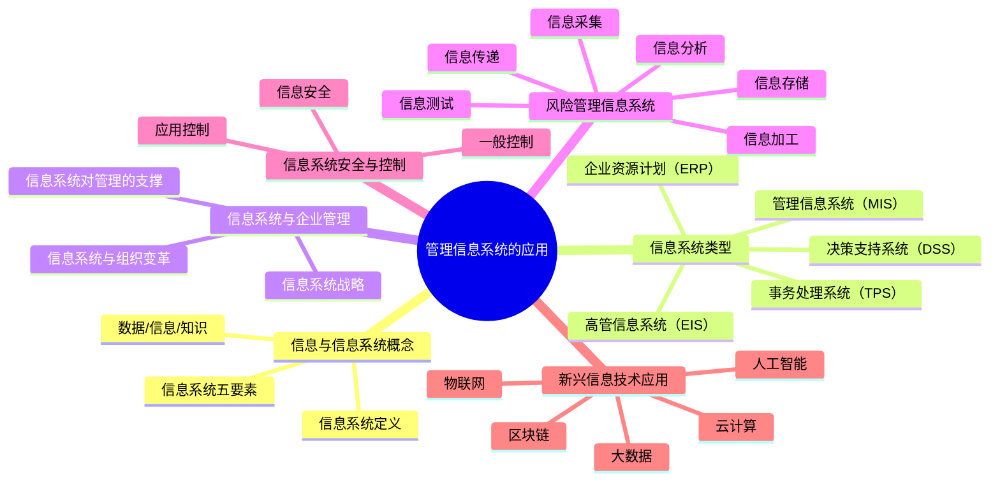

## 📍 章节定位

| 项目 | 信息 |
|------|------|
| **所属科目** | 🎯 公司战略与风险管理 |
| **难度等级** | ⭐ |
| **历年分值** | 2-3分 |
| **建议学时** | 3-4h |
| **核心地位** | 信息管理基础章，分值低但概念清晰 |

## 📝 考情分析

本章介绍管理信息系统的基本概念、类型和应用，分值最低（2-3分），以客观题为主，偶有简答题。本章知识点少且难度低，快速记忆即可应对。

### 命题规律与重点考查趋势

近五年考查频率较高的考点分布如下：

| 考点 | 出题频次 | 题型偏好 | 难度 |
|------|----------|----------|------|
| 数据/信息/知识区别 | ★★★★ | 单选 | 易 |
| 信息系统五要素 | ★★★ | 多选 | 易 |
| 信息系统类型辨识 | ★★★★★ | 单选 | 易 |
| TPS/MIS/DSS/EIS 层次对应 | ★★★★ | 单选 | 易 |
| ERP 特征与功能 | ★★★ | 单选 | 易 |
| 信息系统对管理的支撑 | ★★★ | 多选 | 易 |
| 信息系统战略三方面 | ★★ | 简答 | 中 |
| 风险管理信息系统六功能 | ★★★ | 简答/多选 | 中 |
| 信息系统安全与控制 | ★★ | 多选 | 中 |

### 命题热点

1. **信息系统类型辨识**：给定案例描述（如"运用模型辅助半结构化决策"），判断属于哪种信息系统。命题陷阱：DSS 与 EIS 的区别——DSS 服务中高层管理者，运用模型和数据辅助**半结构化决策**；EIS 服务高层管理者，提供关键指标和趋势分析支持**战略决策**。
2. **数据/信息/知识层次**：命题陷阱：数据是"未经处理的原始记录"，信息是"经过加工处理的数据"，知识是"经过提炼内化的信息"。
3. **信息系统五要素**：硬件、软件、数据、人员、程序——命题陷阱：人员容易被遗漏。
4. **风险管理信息系统功能顺序**：采集→存储→加工→分析→测试→传递。

### 与前后章联系

- **承前**：本章承接第 7 章"内部控制"——内部控制中的"信息系统控制"（一般控制与应用控制）是本章信息系统应用的具体体现。本章风险管理信息系统是第 6 章风险管理体系的五大方面之一。
- **启后**：本章是公司战略与风险管理科目的收尾章节，与战略实施（第 4 章）的"信息系统战略"相呼应。

### 学习方法建议

- **类型对比法**：将 TPS、MIS、DSS、EIS、ERP 五类系统按服务对象、功能、层次对比记忆；
- **层次记忆法**：从底层到高层（操作层→管理层→决策层→战略层）对应不同系统；
- **案例锚定法**：每个系统类型配企业案例（如超市收银系统→TPS，ERP→华为/海尔）加深理解；
- **功能流程法**：风险管理信息系统六功能按"采集→存储→加工→分析→测试→传递"流程记忆。

## 🧠 知识框架

## 📖 核心精讲

### 一、信息与信息系统概念

#### （一）数据、信息与知识

| 概念 | 含义 | 特征 | 案例 |
|------|------|------|------|
| **数据** | 客观事物的原始记录 | 未经处理，无意义 | "1000"——单纯的数字 |
| **信息** | 经过加工处理的数据，对决策有价值 | 有意义、有时效、可传递 | "本月销售额 1000 万元" |
| **知识** | 经过提炼和内化的信息，能指导行动 | 有经验性、可复用、可创新 | "促销活动可提升 20% 销量，应在新品上市时启用" |

> 📌 三者关系：数据→（加工）→信息→（提炼内化）→知识，层层递进。数据是基础，信息是加工后的有用形式，知识是指导行动的智慧。

**信息的特征**：
- 真实性：信息应真实反映客观情况；
- 时效性：信息的价值随时间衰减；
- 不完全性：信息不可能穷尽所有细节；
- 层次性：不同管理层级需要不同层次的信息；
- 可传递性：信息可在不同主体间传递；
- 可分享性：信息共享不会减少信息量（不同于物质资源）。

**信息的层次与管理决策的对应**：

| 管理层级 | 信息特征 | 决策类型 | 案例 |
|----------|----------|----------|------|
| **战略层（高层）** | 概要性、长期性、外部性强 | 非结构化决策 | 5 年战略规划 |
| **战术层（中层）** | 综合性、中期性、内外兼顾 | 半结构化决策 | 年度预算、市场分析 |
| **作业层（基层）** | 详细性、短期性、内部性强 | 结构化决策 | 日常订单处理 |

#### （二）信息系统定义

信息系统是收集、处理、存储和分发信息的有机整体，由硬件、软件、数据、人员和程序五要素构成。

**信息系统的五要素**：

| 要素 | 含义 | 案例 |
|------|------|------|
| **硬件** | 物理设备 | 服务器、计算机、网络设备 |
| **软件** | 程序和系统 | 操作系统、数据库、应用软件 |
| **数据** | 信息处理的原料和产品 | 客户数据、交易数据、财务数据 |
| **人员** | 系统的开发、使用、维护人员 | 程序员、系统管理员、终端用户 |
| **程序** | 业务流程和操作规范 | 数据录入流程、审批流程 |

> 📌 **命题陷阱**：五要素中的"人员"和"程序"容易被遗漏。人员是信息系统的核心要素，程序是连接硬件、软件、数据的纽带。

### 二、信息系统的类型

| 系统类型 | 英文缩写 | 服务对象 | 功能 | 案例 |
|----------|----------|----------|------|------|
| **事务处理系统** | TPS | 基层操作人员 | 日常事务的记录和处理（如订单、库存） | 超市收银系统、银行柜员系统 |
| **管理信息系统** | MIS | 中层管理者 | 生成管理报表，支持日常管理和控制 | 销售月报系统、库存管理系统 |
| **决策支持系统** | DSS | 中高层管理者 | 运用模型和数据辅助半结构化决策 | 投资决策支持系统、生产计划系统 |
| **高管信息系统** | EIS | 高层管理者 | 提供关键指标和趋势分析，支持战略决策 | 企业驾驶舱、KPI 监控仪表盘 |
| **企业资源计划** | ERP | 全企业 | 整合各业务流程，实现资源一体化管理 | SAP、Oracle、用友、金蝶 |

> 📌 **层次对应**：TPS→操作层；MIS→管理层；DSS/EIS→决策层。从底层到高层，数据从详细到概要。

**各类信息系统的详细对比**：

| 维度 | TPS | MIS | DSS | EIS | ERP |
|------|-----|-----|-----|-----|-----|
| 服务层级 | 操作层 | 管理层 | 决策层 | 战略层 | 全企业 |
| 数据特征 | 详细、实时 | 概要、定期 | 模型化、分析 | 关键指标、趋势 | 集成、共享 |
| 决策类型 | 结构化 | 结构化 | 半结构化 | 非结构化 | 跨层级 |
| 主要功能 | 记录、处理 | 报告、监控 | 分析、建议 | 监控、预警 | 整合、优化 |
| 使用频率 | 高频 | 中频 | 按需 | 定期 | 持续 |
| 复杂度 | 低 | 中 | 高 | 中 | 高 |

**事务处理系统（TPS）的特征**：
- 服务于基层操作人员，处理日常业务事务；
- 数据量大、处理频率高、实时性强；
- 是其他信息系统的数据来源；
- 案例：超市收银系统记录每笔销售，银行柜员系统处理每笔存取款。

**管理信息系统（MIS）的特征**：
- 服务于中层管理者，支持日常管理和控制；
- 基于 TPS 提供的数据生成管理报表；
- 主要功能：数据汇总、报表生成、异常报告；
- 案例：销售月报系统、库存周转分析系统。

**决策支持系统（DSS）的特征**：
- 服务于中高层管理者，辅助半结构化决策；
- 运用模型库、数据库、知识库；
- 强调"支持"而非"替代"决策；
- 案例：投资决策支持系统（项目可行性分析）、生产计划系统（线性规划优化）。

**高管信息系统（EIS）的特征**：
- 服务于高层管理者，支持战略决策；
- 提供关键绩效指标（KPI）和趋势分析；
- 界面友好， drill-down（下钻）功能；
- 案例：企业驾驶舱、CEO 仪表盘、实时 KPI 监控。

**DSS vs EIS 的关键区别**：

| 维度 | DSS | EIS |
|------|-----|-----|
| 服务对象 | 中高层管理者 | 高层管理者 |
| 决策类型 | 半结构化决策 | 战略决策（非结构化） |
| 核心功能 | 模型分析、方案比较 | 关键指标监控、趋势预警 |
| 数据特征 | 详细+模型 | 概要+趋势 |
| 使用方式 | 按需深度分析 | 日常监控+异常下钻 |

**企业资源计划（ERP）的特征**：

| 特征 | 说明 |
|------|------|
| **集成性** | 财务、采购、生产、销售、人力资源等模块集成，消除信息孤岛 |
| **实时性** | 业务数据实时更新、共享，支持实时决策 |
| **标准化** | 统一数据格式和业务流程，最佳实践固化 |
| **模块化** | 可按需选择功能模块，灵活部署 |

**主流 ERP 产品**：

| 产品 | 厂商 | 适用 | 特点 |
|------|------|------|------|
| SAP ERP | 德国 SAP | 大型企业 | 功能强大，实施复杂，成本高 |
| Oracle ERP | 美国 Oracle | 大型企业 | 集成度高，数据库优势 |
| 用友 U8/NC | 用友 | 中大型企业 | 国产领先，本地化好 |
| 金蝶 K3/EAS | 金蝶 | 中型企业 | 国产主流，性价比高 |
| Microsoft Dynamics | 微软 | 中型企业 | 与 Office 集成 |

**案例锚定——华为的 ERP 实践**：
- 华为早期使用 Oracle ERP，后转向自主开发 MetaERP；
- 集成研发（PLM）、供应链（SCM）、客户关系管理（CRM）；
- 实现"业财一体化"，业务数据实时转化为财务数据；
- 通过 ERP 支撑全球化运营和供应链协同。

**案例锚定——海尔的人单合一模式**：
- 海尔通过信息系统支撑"人单合一"模式，每个员工直接面向用户；
- 构建 COSMOPlat 工业互联网平台，实现大规模定制；
- 信息系统推动组织扁平化，从科层制转向平台型组织。

### 三、信息系统与企业管理

#### （一）信息系统对管理的支撑作用

| 支撑作用 | 具体表现 | 案例 |
|----------|----------|------|
| **提高运营效率** | 自动化处理事务，降低人力成本 | 电商自动化订单处理，物流自动化分拣 |
| **提升决策质量** | 提供及时准确的信息支持 | 数据驱动决策，BI 商业智能 |
| **增强竞争优势** | 通过信息系统创新业务模式 | 阿里巴巴电商平台、滴滴出行算法调度 |
| **促进组织变革** | 推动流程优化和组织扁平化 | 海尔"人单合一"基于信息系统重构组织 |
| **加强风险管理** | 实时监控风险，自动预警 | 银行风控系统、反欺诈系统 |

#### （二）信息系统战略

信息系统战略是企业总体战略的重要组成部分，确保信息系统与企业战略保持一致。

**信息系统战略的三方面**：

| 方面 | 含义 | 关键要求 |
|------|------|----------|
| **业务对齐** | 信息系统支撑业务目标实现 | 信息系统规划与企业战略规划同步 |
| **技术架构** | 合理的技术平台和架构设计 | 标准化、可扩展、安全可靠 |
| **数据治理** | 确保数据质量、安全和合规 | 数据标准、数据质量、数据安全、数据隐私 |

**信息系统战略与企业战略的关系**：
- 信息系统战略服务于企业总体战略；
- 信息系统应支撑业务战略实施；
- 信息系统可成为竞争优势的来源（如亚马逊的推荐算法、字节跳动的算法分发）；
- 信息系统战略需与企业组织架构、业务流程协同。

**信息系统战略的制定步骤**：
1. 业务战略分析：明确企业战略目标；
2. 信息系统现状评估：识别信息系统差距；
3. 信息系统需求识别：明确信息系统支撑需求；
4. 信息系统规划：制定信息系统建设蓝图；
5. 实施路径设计：分阶段实施计划。

#### （三）信息系统与组织变革

信息系统对组织变革的影响：

| 影响维度 | 具体表现 | 案例 |
|----------|----------|------|
| **组织结构** | 推动扁平化、网络化组织 | 海尔"人单合一"消除中层 |
| **业务流程** | 流程再造（BPR），消除冗余环节 | 福特汽车应付账款流程再造 |
| **决策模式** | 集中决策 vs 分散决策 | 数据中台支持一线决策 |
| **协作方式** | 跨部门、跨地域协作 | 钉钉、飞书协同办公 |
| **管理模式** | 数据驱动管理 | 字节跳动 OKR+数据驱动 |

**案例锚定——阿里巴巴的数据中台战略**：
- 业务中台：共享电商、支付、物流等业务能力；
- 数据中台：统一数据标准，赋能业务单元；
- 算法中台：提供推荐、搜索、风控算法能力；
- 通过中台战略支撑淘宝、天猫、菜鸟等多业务协同。

### 四、风险管理信息系统

风险管理信息系统是风险管理体系（第 6 章五大方面之一）的技术基石和信息枢纽，通过信息技术手段支持风险管理的全流程。

**风险管理信息系统的六大功能模块**：

| 功能 | 内容 | 关键要求 |
|------|------|----------|
| **信息采集** | 确保向系统输入的业务数据和风险数据真实、准确、完整 | 多渠道采集、自动化录入、数据校验 |
| **信息存储** | 建立风险数据库，分类存储历史和实时数据 | 数据安全、备份恢复、分类管理 |
| **信息加工** | 对数据进行清洗、转换、汇总 | 数据标准化、质量管控 |
| **信息分析** | 运用统计模型、风险模型进行分析评估 | 风险矩阵、VaR 模型、压力测试 |
| **信息测试** | 对风险指标进行监测和预警 | 关键风险指标（KRI）、阈值预警 |
| **信息传递** | 向管理层和相关部门及时传递风险信息 | 风险报告、仪表盘、自动推送 |

> 📌 **建设要求**：企业应确保信息采集的真实性、完整性；建立风险管理信息系统的组织保障；将信息系统与业务流程深度融合；保障信息安全和数据隐私。

**风险管理信息系统的应用案例**：

| 企业 | 应用场景 |
|------|----------|
| 中国银行 | 风险数据仓库整合全行风险数据，支持巴塞尔协议合规 |
| 蚂蚁集团 | 蚂蚁风控大脑实时监测交易风险，反欺诈系统秒级响应 |
| 平安集团 | 智能风控平台覆盖信用风险、市场风险、操作风险 |
| 招商银行 | 风险预警系统监控贷款客户财务状况，提前预警 |

**风险管理信息系统与内部控制的融合**：
- 风险管理信息系统支持内部控制的风险评估要素；
- 内部控制的信息系统控制（一般控制+应用控制）保障风险管理信息系统的安全；
- 两者共同构成企业的风险防控技术体系。

### 五、企业资源计划（ERP）

ERP 是整合企业各业务流程的综合信息系统，是企业信息化的核心。

**ERP 的核心特征**：

| 特征 | 说明 |
|------|------|
| **集成性** | 财务、采购、生产、销售、人力资源等模块集成，消除信息孤岛 |
| **实时性** | 业务数据实时更新、共享，支持实时决策 |
| **标准化** | 统一数据格式和业务流程，最佳实践固化 |
| **模块化** | 可按需选择功能模块，灵活部署 |

**ERP 的主要功能模块**：

| 模块 | 功能 | 案例 |
|------|------|------|
| **财务管理** | 总账、应收应付、固定资产、成本管理 | 月末结账、成本核算 |
| **采购管理** | 采购订单、供应商管理、入库、付款 | 三单匹配自动校验 |
| **库存管理** | 出入库、盘点、库存预警 | 安全库存自动预警 |
| **销售管理** | 销售订单、客户管理、发货、收款 | 信用额度自动校验 |
| **生产管理** | 生产计划、工单、物料需求计划（MRP） | 自动排产、物料齐套检查 |
| **人力资源管理** | 人事档案、薪酬、考勤、绩效 | 薪资自动计算 |

**ERP 实施的优点**：
1. **信息共享**：消除信息孤岛，部门间数据实时共享；
2. **流程优化**：基于最佳实践优化业务流程；
3. **决策支持**：提供实时、准确、全面的数据支持；
4. **效率提升**：自动化处理，减少人工操作；
5. **管控加强**：系统控制替代人工控制，规范化程度提升；
6. **业财一体化**：业务数据自动转化为财务数据。

**ERP 实施的风险**：
1. **成本高昂**：软件许可、实施服务、硬件投入；
2. **实施周期长**：通常 6 个月至 2 年；
3. **业务变革阻力**：员工对新流程不适应；
4. **数据迁移风险**：历史数据清洗、迁移可能失真；
5. **定制化陷阱**：过度定制导致升级困难；
6. **依赖风险**：系统故障可能导致业务中断。

**ERP 实施成功的关键因素**：

| 关键因素 | 说明 |
|----------|------|
| **高层领导支持** | "一把手工程"，高层全程参与 |
| **业务需求清晰** | 充分调研，明确业务需求 |
| **合适的产品选择** | 匹配企业规模和行业特点 |
| **变革管理** | 培训、沟通、激励相结合 |
| **分阶段实施** | 先核心模块后扩展，降低风险 |
| **数据质量管理** | 数据清洗、标准化、迁移 |
| **项目管理** | 范围、进度、成本、质量管控 |

**案例锚定——华为 ERP 实施**：
- 实施背景：华为全球化运营需要统一的信息系统；
- 实施过程：1997 年起与 IBM 合作，引入 Oracle ERP，实施 IPD、ISC 变革；
- 实施成果：业财一体化、全球供应链协同、决策数据化；
- 后续演进：2023 年完成 MetaERP 替换，实现自主可控。

**案例锚定——某制造企业 ERP 实施失败案例**：
- 失败原因：业务需求不清、过度定制、员工抵触、数据质量差；
- 教训：ERP 实施是"管理变革"而非"软件安装"，需业务驱动而非技术驱动。

### 六、信息系统安全与控制

信息系统安全与控制是保障信息系统可靠运行和数据安全的重要措施，与第 7 章内部控制中的信息系统控制相互呼应。

#### （一）信息安全的基本要求

| 要求 | 含义 |
|------|------|
| **机密性** | 信息不被未授权访问 |
| **完整性** | 信息不被篡改 |
| **可用性** | 信息和系统在需要时可用 |
| **可控性** | 对信息和系统的访问可控 |
| **不可抵赖性** | 行为主体不能否认其行为 |

#### （二）信息系统控制（与第 7 章呼应）

| 控制类型 | 含义 | 主要内容 |
|----------|------|----------|
| **一般控制（ITGC）** | 对整个信息系统环境的控制 | IT治理、系统开发、运维、访问安全、变更管理 |
| **应用控制（ITAC）** | 对具体业务应用系统的控制 | 输入控制、处理控制、输出控制 |

**信息系统一般控制的五要素**：
- IT 治理与管理：IT 战略与业务战略对齐；
- 系统开发与维护：系统开发生命周期管理；
- 访问与安全：用户权限、密码、访问日志；
- 系统运维：备份、灾备、监控；
- 变更管理：变更申请、审批、测试、上线。

**信息系统应用控制的三环节**：
- 输入控制：数据有效性、完整性、合理性校验；
- 处理控制：处理逻辑正确性、数据一致性；
- 输出控制：输出审批、分发、保留。

#### （三）信息系统安全威胁与防护

| 威胁类型 | 具体表现 | 防护措施 |
|----------|----------|----------|
| **网络攻击** | 黑客攻击、DDoS、SQL 注入 | 防火墙、入侵检测、漏洞扫描 |
| **数据泄露** | 内部人员泄露、外部窃取 | 数据加密、访问控制、DLP |
| **病毒木马** | 恶意软件感染 | 杀毒软件、安全补丁 |
| **社会工程** | 钓鱼邮件、电话诈骗 | 安全意识培训、多重验证 |
| **内部威胁** | 员工恶意或无意行为 | 权限管理、操作审计、离职管理 |

**案例锚定——重大信息安全事件**：
- 滴滴数据安全审查：涉嫌违规收集个人信息，被处罚 80 亿元；
- Equifax 数据泄露：1.43 亿用户信息泄露，源于未及时修补漏洞；
- 永恒之蓝勒索病毒：全球范围内攻击，影响医院、政府、企业。

### 七、新兴信息技术应用

新兴信息技术正在深刻改变企业管理方式，是信息系统应用的前沿领域。

#### （一）大数据

| 维度 | 内容 |
|------|------|
| **定义** | 规模巨大、类型多样、处理快速、价值密度低的数据集合 |
| **特征（4V）** | Volume（规模）、Variety（多样）、Velocity（速度）、Value（价值） |
| **应用** | 用户画像、精准营销、风险建模、运营优化 |
| **案例** | 阿里推荐算法、字节跳动内容分发、银行反欺诈模型 |

#### （二）云计算

| 维度 | 内容 |
|------|------|
| **定义** | 通过网络按需提供计算资源（服务器、存储、应用） |
| **服务模式** | IaaS（基础设施即服务）、PaaS（平台即服务）、SaaS（软件即服务） |
| **部署模式** | 公有云、私有云、混合云 |
| **应用** | 弹性计算、灾备、协同办公 |
| **案例** | 阿里云、腾讯云、华为云、AWS |

#### （三）人工智能（AI）

| 维度 | 内容 |
|------|------|
| **定义** | 模拟人类智能的计算系统 |
| **分支** | 机器学习、深度学习、自然语言处理、计算机视觉 |
| **应用** | 智能客服、智能风控、智能制造、自动驾驶 |
| **案例** | ChatGPT、蚂蚁风控大脑、特斯拉自动驾驶 |

#### （四）物联网（IoT）

| 维度 | 内容 |
|------|------|
| **定义** | 物物相连的互联网，实现物理设备的联网和数据采集 |
| **应用** | 智能制造、智慧物流、智能家居、智慧城市 |
| **案例** | 海尔工业互联网平台、小米智能家居生态 |

#### （五）区块链

| 维度 | 内容 |
|------|------|
| **定义** | 分布式账本技术，实现去中心化、不可篡改的数据记录 |
| **特征** | 去中心化、不可篡改、可追溯、智能合约 |
| **应用** | 供应链溯源、数字货币、电子凭证、跨境支付 |
| **案例** | 蚂蚁链、腾讯区块链、数字人民币 |

#### （六）数字化转型

数字化转型是企业利用数字技术重塑业务模式、运营模式和管理模式的过程。

**数字化转型的三个层次**：
1. **业务数字化**：将线下业务迁移到线上；
2. **数字业务化**：基于数据创造新业务；
3. **业务智能化**：利用 AI 实现业务自主决策。

**案例锚定——企业数字化转型**：

| 企业 | 数字化转型实践 |
|------|---------------|
| 阿里巴巴 | 从电商平台到数字经济体，云计算、金融科技、智能物流 |
| 平安集团 | "金融+科技"双驱动，寿险 AI 化、智慧城市 |
| 三一重工 | 智能制造+工业互联网平台"树根互联" |
| 美的集团 | 智能家居+工业互联网，从家电制造商到科技集团 |

## 💡 典型例题

**【例题 1】（单选题，信息系统类型辨识）**

能够运用模型和数据辅助半结构化决策的信息系统是（ ）。
A. 事务处理系统
B. 管理信息系统
C. 决策支持系统
D. 高管信息系统

**答案**：C

**解析**：决策支持系统（DSS）运用模型库、数据库、知识库，辅助中高层管理者进行半结构化决策。A TPS 处理日常事务；B MIS 生成管理报表；D EIS 提供关键指标和趋势分析支持战略决策。命题陷阱：DSS 与 EIS 的区别——DSS 是"模型分析、方案比较"，EIS 是"关键指标监控、趋势预警"。

---

**【例题 2】（单选题，数据信息知识）**

下列关于数据、信息、知识的表述，正确的是（ ）。
A. 数据是经过加工处理后的有用形式
B. 信息是未经处理的原始记录
C. 知识是经过提炼内化能指导行动的信息
D. 数据、信息、知识三者没有区别

**答案**：C

**解析**：数据是客观事物的原始记录（未经处理），信息是经过加工处理的数据，知识是经过提炼和内化能指导行动的信息。A 和 B 颠倒了数据和信息的概念，D 错误。三者关系：数据→（加工）→信息→（提炼内化）→知识。

---

**【例题 3】（单选题，信息系统层次对应）**

下列信息系统主要服务于基层操作人员的是（ ）。
A. 事务处理系统（TPS）
B. 管理信息系统（MIS）
C. 决策支持系统（DSS）
D. 高管信息系统（EIS）

**答案**：A

**解析**：TPS 服务于基层操作人员，处理日常事务（如订单、库存）；MIS 服务中层管理者；DSS 服务中高层管理者；EIS 服务高层管理者。层次对应：TPS→操作层，MIS→管理层，DSS/EIS→决策层/战略层。

---

**【例题 4】（多选题，信息系统五要素）**

信息系统由以下哪些要素构成？（ ）
A. 硬件
B. 软件
C. 数据
D. 人员
E. 程序

**答案**：ABCDE

**解析**：信息系统五要素：硬件、软件、数据、人员、程序。命题陷阱：人员容易被遗漏，但人员是信息系统的核心要素（开发、使用、维护人员）。

---

**【例题 5】（多选题，风险管理信息系统功能）**

下列属于风险管理信息系统功能模块的有（ ）。
A. 信息采集
B. 信息存储
C. 信息加工
D. 信息分析
E. 信息传递

**答案**：ABCDE

**解析**：风险管理信息系统六大功能：信息采集、信息存储、信息加工、信息分析、信息测试、信息传递。口诀："采存加析测传"。注意"信息测试"容易被遗漏——指对风险指标进行监测和预警。

---

**【例题 6】（多选题，ERP 特征）**

下列属于 ERP 核心特征的有（ ）。
A. 集成性
B. 实时性
C. 标准化
D. 模块化
E. 个性化定制

**答案**：ABCD

**解析**：ERP 核心特征包括集成性、实时性、标准化、模块化。E 个性化定制不是 ERP 的核心特征，过度定制反而是 ERP 实施的风险之一（定制化陷阱）。

---

**【例题 7】（简答题，ERP 实施优缺点与建议）**

某企业计划引入 ERP 系统整合各部门数据。请分析 ERP 实施的优点和风险，并提出实施建议。

**答案**：

ERP 实施的优点：
1. 信息共享：消除信息孤岛，部门间数据实时共享；
2. 流程优化：基于最佳实践优化业务流程；
3. 决策支持：提供实时、准确、全面的数据支持；
4. 效率提升：自动化处理，减少人工操作；
5. 业财一体化：业务数据自动转化为财务数据。

ERP 实施的风险：
1. 成本高昂：软件许可、实施服务、硬件投入；
2. 实施周期长：通常 6 个月至 2 年；
3. 业务变革阻力：员工对新流程不适应；
4. 数据迁移风险：历史数据清洗、迁移可能失真；
5. 定制化陷阱：过度定制导致升级困难。

实施建议：
1. 高层领导重视并全程参与（"一把手工程"）；
2. 充分调研需求，选择合适的 ERP 产品；
3. 做好员工培训和变革管理；
4. 分阶段实施，先核心模块后扩展；
5. 重视数据清洗和迁移质量；
6. 加强项目管理，控制范围、进度、成本。

**解析**：本题考查 ERP 的全面理解。关键点：①优点突出"集成"和"一体化"；②风险涵盖成本、周期、人员、数据、定制；③建议强调"一把手工程"、需求调研、变革管理、分阶段实施。命题陷阱：ERP 实施是"管理变革"而非"软件安装"，需业务驱动而非技术驱动。

---

**【例题 8】（单选题，信息系统战略）**

信息系统战略的三方面不包括（ ）。
A. 业务对齐
B. 技术架构
C. 数据治理
D. 软件开发

**答案**：D

**解析**：信息系统战略三方面：业务对齐、技术架构、数据治理。软件开发是技术架构的具体实施，不属于战略层面的三方面之一。

## 🎯 记忆口诀

- **数据信息知识**："数（数据）信（信息）知（知识）"——从原始到有价值到可行动，数据→加工→信息→提炼→知识。
- **信息特征六性**："真（真实性）时（时效性）不（不完全性）层（层次性）传（可传递性）享（可分享性）"。
- **信息系统五要素**："硬（硬件）软（软件）数（数据）人（人员）序（程序）"——人员容易被遗漏。
- **系统五类型**："T（TPS事务）M（MIS管理）D（DSS决策）E（EIS高管）E（ERP资源）"——从底层到高层再到全企业。
- **层次对应**："T 操（操作层）M 管（管理层）D 决（决策层）E 战（战略层）"。
- **DSS vs EIS**："D 模型分析半结构，E 关键指标战略层"。
- **ERP 四特征**："集（集成）实（实时）标（标准化）模（模块化）"。
- **ERP 实施成功六要素**："领（领导支持）需（需求清晰）选（产品选择）变（变革管理）分（分阶段）据（数据质量）"。
- **信息系统战略三方面**："业（业务对齐）技（技术架构）数（数据治理）"。
- **风险管理信息系统六功能**："采（采集）存（存储）加（加工）析（分析）测（测试）传（传递）"——按流程顺序。
- **信息安全五要求**："机（机密性）完（完整性）可（可用性）控（可控性）不（不可抵赖性）"。
- **IT 控制两类**："一（一般控制）应（应用控制）"——一般管环境，应用管业务。
- **应用控制三环节**："输（输入）处（处理）输（输出）"。
- **大数据 4V**："量（Volume）多（Variety）速（Velocity）值（Value）"。
- **云计算三模式**："I（IaaS）P（PaaS）S（SaaS）"——基础设施、平台、软件。
- **数字化转型三层次**："业（业务数字化）数（数字业务化）智（业务智能化）"。

## ✅ 同步练习

**1. [单选]** 下列系统中，主要服务于基层操作人员的是（ ）。
A. TPS  B. MIS  C. DSS  D. EIS

**2. [单选]** 经过加工处理后对决策有价值的数据称为（ ）。
A. 数据  B. 信息  C. 知识  D. 情报

**3. [多选]** 信息系统由以下哪些要素构成？（ ）
A. 硬件  B. 软件  C. 数据  D. 人员和程序

**4. [简答]** 简述风险管理信息系统的主要功能模块。

**5. [案例分析]** 某企业计划引入ERP系统整合各部门数据。请分析ERP实施的优点和风险，并提出实施建议。

> 参考答案：1.A  2.B  3.ABCD  4.见核心精讲"风险管理信息系统"  5.优点：信息共享消除信息孤岛、优化业务流程、提升决策效率、提高运营效率。风险：实施成本高、周期长、业务变革阻力大、数据迁移风险。建议：①高层领导重视并全程参与；②充分调研需求，选择合适的ERP产品；③做好员工培训和变革管理；④分阶段实施，先核心模块后扩展；⑤重视数据清洗和迁移质量。
