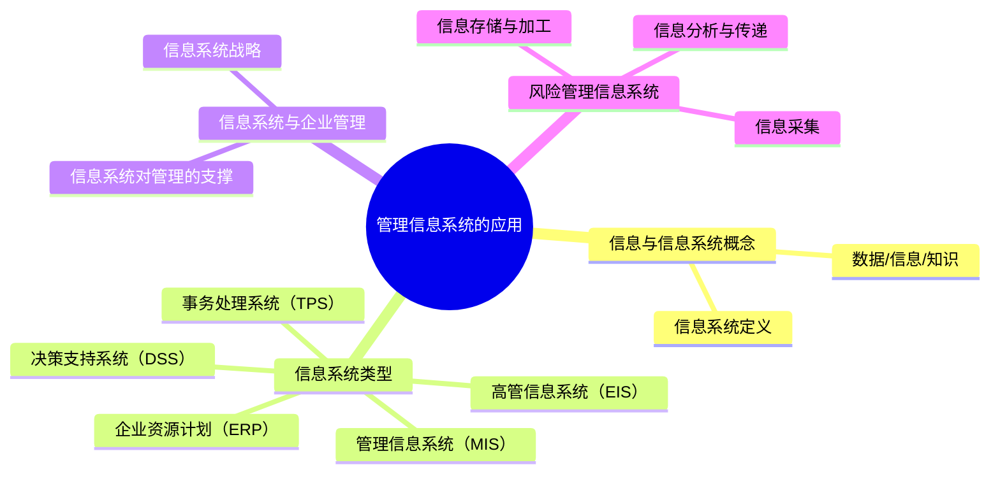

## 📍 章节定位

| 项目 | 信息 |
|------|------|
| **所属科目** | 🎯 公司战略与风险管理 |
| **难度等级** | ⭐ |
| **历年分值** | 2-3分 |
| **建议学时** | 3-4h |
| **核心地位** | 信息管理基础章，分值低但概念清晰 |

## 📝 考情分析

本章介绍管理信息系统的基本概念、类型和应用，分值最低，以客观题为主。

命题规律：
- **信息系统概念**：数据、信息、知识的区别
- **信息系统类型**：事务处理系统（TPS）、管理信息系统（MIS）、决策支持系统（DSS）、高管信息系统（EIS）
- **信息系统与战略**：信息系统对企业战略的支撑作用
- **风险管理信息系统**：在风险管理中的应用

本章知识点少且难度低，快速记忆即可应对。

## 🧠 知识框架

## 📖 核心精讲

### 一、信息与信息系统概念

#### （一）数据、信息与知识

| 概念 | 含义 | 特征 |
|------|------|------|
| **数据** | 客观事物的原始记录 | 未经处理，无意义 |
| **信息** | 经过加工处理的数据，对决策有价值 | 有意义、有时效、可传递 |
| **知识** | 经过提炼和内化的信息，能指导行动 | 有经验性、可复用、可创新 |

> 📌 三者关系：数据→（加工）→信息→（提炼内化）→知识，层层递进。

#### （二）信息系统定义

信息系统是收集、处理、存储和分发信息的有机整体，由硬件、软件、数据、人员和程序五要素构成。

### 二、信息系统的类型

| 系统类型 | 英文缩写 | 服务对象 | 功能 |
|----------|----------|----------|------|
| **事务处理系统** | TPS | 基层操作人员 | 日常事务的记录和处理（如订单、库存） |
| **管理信息系统** | MIS | 中层管理者 | 生成管理报表，支持日常管理和控制 |
| **决策支持系统** | DSS | 中高层管理者 | 运用模型和数据辅助半结构化决策 |
| **高管信息系统** | EIS | 高层管理者 | 提供关键指标和趋势分析，支持战略决策 |
| **企业资源计划** | ERP | 全企业 | 整合各业务流程，实现资源一体化管理 |

> 📌 **层次对应**：TPS→操作层；MIS→管理层；DSS/EIS→决策层。从底层到高层，数据从详细到概要。

### 三、信息系统与企业管理

#### （一）信息系统对管理的支撑作用

1. **提高运营效率**：自动化处理事务，降低人力成本
2. **提升决策质量**：提供及时准确的信息支持
3. **增强竞争优势**：通过信息系统创新业务模式
4. **促进组织变革**：推动流程优化和组织扁平化

#### （二）信息系统战略

信息系统战略是企业总体战略的重要组成部分，确保信息系统与企业战略保持一致。

信息系统战略的三方面：
- **业务对齐**：信息系统支撑业务目标实现
- **技术架构**：合理的技术平台和架构设计
- **数据治理**：确保数据质量、安全和合规

### 四、风险管理信息系统

风险管理信息系统是风险管理体系的技术基石和信息枢纽，通过信息技术手段支持风险管理的全流程。

**功能模块**：

| 功能 | 内容 |
|------|------|
| **信息采集** | 确保向系统输入的业务数据和风险数据真实、准确、完整 |
| **信息存储** | 建立风险数据库，分类存储历史和实时数据 |
| **信息加工** | 对数据进行清洗、转换、汇总 |
| **信息分析** | 运用统计模型、风险模型进行分析评估 |
| **信息测试** | 对风险指标进行监测和预警 |
| **信息传递** | 向管理层和相关部门及时传递风险信息 |

> 📌 **建设要求**：企业应确保信息采集的真实性、完整性；建立风险管理信息系统的组织保障；将信息系统与业务流程深度融合；保障信息安全和数据隐私。

### 五、企业资源计划（ERP）

ERP是整合企业各业务流程的综合信息系统，核心特征：

| 特征 | 说明 |
|------|------|
| **集成性** | 财务、采购、生产、销售、人力资源等模块集成 |
| **实时性** | 业务数据实时更新、共享 |
| **标准化** | 统一数据格式和业务流程 |
| **模块化** | 可按需选择功能模块 |

**ERP实施的优点**：信息共享、流程优化、决策支持、效率提升。
**ERP实施的风险**：成本高昂、实施周期长、业务变革阻力、数据迁移风险。

## 💡 典型例题

**【单选】** 能够运用模型和数据辅助半结构化决策的信息系统是（ ）。
A. 事务处理系统  B. 管理信息系统  C. 决策支持系统  D. 高管信息系统

**【参考答案】** C

## 🎯 记忆口诀

- **数据信息知识**："数（数据）信（信息）知（知识）"——从原始到有价值到可行动
- **系统四类型**："T（TPS事务）M（MIS管理）D（DSS决策）E（EIS高管）"——从底层到高层
- **信息系统五要素**："硬（硬件）软（软件）数（数据）人（人员）序（程序）"
- **风险管理信息系统六功能**："采（采集）存（存储）加（加工）析（分析）测（测试）传（传递）"

## ✅ 同步练习

**1. [单选]** 下列系统中，主要服务于基层操作人员的是（ ）。
A. TPS  B. MIS  C. DSS  D. EIS

**2. [单选]** 经过加工处理后对决策有价值的数据称为（ ）。
A. 数据  B. 信息  C. 知识  D. 情报

**3. [多选]** 信息系统由以下哪些要素构成？（ ）
A. 硬件  B. 软件  C. 数据  D. 人员和程序

**4. [简答]** 简述风险管理信息系统的主要功能模块。

**5. [案例分析]** 某企业计划引入ERP系统整合各部门数据。请分析ERP实施的优点和风险，并提出实施建议。

> 参考答案：1.A  2.B  3.ABCD  4.见核心精讲"风险管理信息系统"  5.优点：信息共享消除信息孤岛、优化业务流程、提升决策效率、提高运营效率。风险：实施成本高、周期长、业务变革阻力大、数据迁移风险。建议：①高层领导重视并全程参与；②充分调研需求，选择合适的ERP产品；③做好员工培训和变革管理；④分阶段实施，先核心模块后扩展；⑤重视数据清洗和迁移质量。
