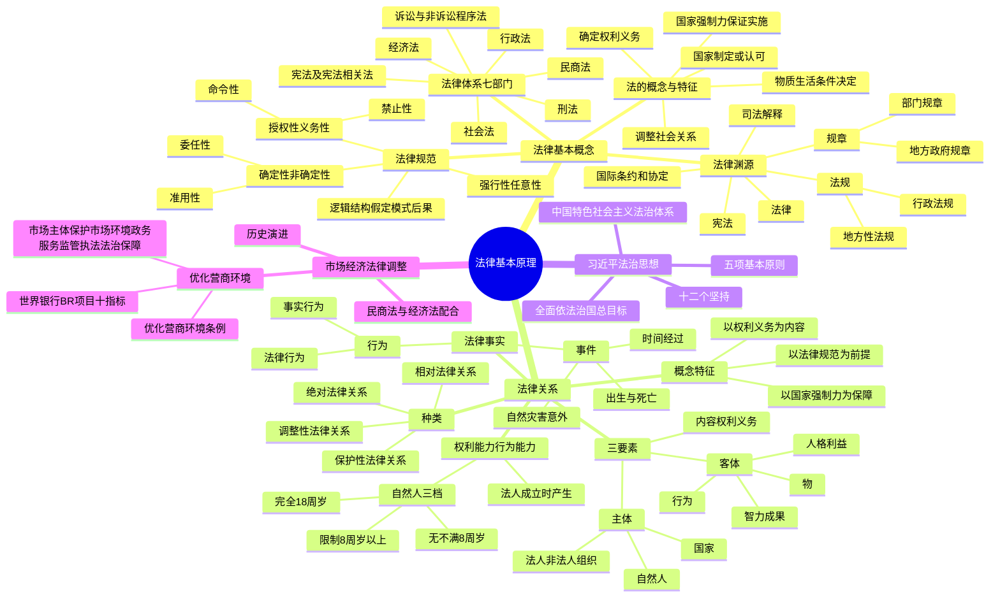

## 1. 章节定位

| 项目 | 信息 |
|------|------|
| 所属科目 | 经济法 |
| 难度等级 | 2 |
| 历年分值 | 2-4 分 |
| 建议学时 | 3-4 小时 |
| 知识关联章节 | 全部章节（基础理论）；第2章 基本民事法律制度（法律关系、法律事实）；第3章 物权法律制度（绝对法律关系）；第4章 合同法律制度（相对法律关系） |

## 2. 考情分析

本章是经济法科目的开篇章节，主要任务是搭建法律基础理论框架，分值约 2-4 分，命题以客观题为主，偶尔以主观题中"判断法律关系性质""识别法律渊源"等小问形式出现。

**命题规律**：本章侧重考查基本概念的辨析和法律条文的精准理解，考点相对分散但难度不大。近年命题趋势是结合习近平法治思想、优化营商环境等热点内容出题，体现教材政治性与时代性。考题多为概念判断、定义辨析、分类对应。

**高频考点分布**：

1. **法的概念与特征**：法的五大特征（物质生活条件决定、国家制定或认可、国家强制力保证实施、调整社会关系、确定权利义务），其中"国家强制性"与"主要依靠自觉遵守"的关系是易错点。
2. **法律体系**：七大法律部门（宪法及宪法相关法、刑法、行政法、民商法、经济法、社会法、诉讼与非诉讼程序法）的划分，特别是民商法与经济法的边界、经济法部门的内涵。
3. **法律渊源**：宪法、法律、法规（行政法规、地方性法规）、规章（部门规章、地方政府规章）、司法解释、国际条约和协定的制定主体与效力层级。地方性法规与地方政府规章的制定主体是高频考点。
4. **法律规范**：授权性/义务性（命令性、禁止性）规范、强行性/任意性规范、确定性/非确定性（委任性、准用性）规范的分类；法律规范的逻辑结构（假定、模式、后果）；法律规范与法律条文、规范性法律文件的区别。
5. **法律关系**：法律关系三要素（主体、客体、内容）；自然人行为能力的三分法（完全、限制、无）；法律关系客体四类（物、行为、人格利益、智力成果）及新型客体（数据、虚拟财产）；绝对法律关系与相对法律关系的区分。
6. **法律事实**：行为（法律行为、事实行为）与事件（出生死亡、自然灾害、时间经过）的分类。
7. **习近平法治思想**：核心要义"十二个坚持"；全面依法治国总目标；全面推进依法治国五项基本原则。
8. **优化营商环境**：《优化营商环境条例》基本原则；世界银行 BR 项目十项指标；市场主体保护、市场环境、政务服务、监管执法、法治保障五方面内容。

**联动考查方式**：

- 与第2章基本民事法律制度联动：法律关系主体、行为能力制度在民事法律行为效力判定中的应用；
- 与第3章物权法律制度联动：绝对法律关系的典型（物权法律关系）；
- 与第4章合同法律制度联动：相对法律关系的典型（债权法律关系）；任意性规范与强行性规范在合同效力判断中的作用；
- 与各章联动：法律渊源的效力层级判断，是各章具体制度适用法律时的基础。

**备考建议**：

- 重点把握法律渊源的制定主体和效力层级，可通过画"金字塔"图记忆；
- 区分"法律规范"与"法律条文"——法律规范是内容，法律条文是表现形式，二者非一一对应；
- 牢记自然人行为能力的三分法及各自的行为效力：完全行为能力人可独立实施；限制行为能力人实施需法定代理人代理或同意追认（纯获利益或与年龄智力相适应的除外）；无行为能力人由法定代理人代理；
- 习近平法治思想"十二个坚持"建议编成口诀整体记忆；
- 优化营商环境部分以记主体、记原则、记指标数量为主。

## 3. 知识框架

## 4. 核心精讲

### 4.1 法的概念与特征

**法**是反映由一定物质生活条件所决定的统治阶级意志的，由国家制定或认可并得到国家强制力保证实施的，赋予社会关系参加者权利与义务的社会规范的总称。马克思主义法学认为，从本质层面认识法，法是统治阶级意志的体现，这是对法本质认识的第一层次；法所反映的统治阶级意志受到物质生活条件的制约，这是对法本质的更深层次的认识。马克思指出："君主们在任何时候都不得不服从经济条件，并且从来不能向经济条件发号施令"，即表明统治阶级的意志必须服从于社会的物质生活条件。

法具有以下五大特征：

**（一）法是由一定物质生活条件所决定的统治阶级意志的体现**

统治阶级的意志通过法律的形式上升为国家意志。法作为统治阶级意志的体现，同时又具有代表全社会的属性：一方面，法代表的是统治阶级的整体意志，而不是统治阶级中个别人或个别集团的意志；另一方面，法也根据不同阶级、阶层和利益群体相互斗争和妥协的具体情况，尽可能关注被统治阶级和社会弱势群体等的权利和利益。但在本质上，法仍集中体现统治阶级的利益。按照马克思主义"经济基础决定上层建筑"的基本原理，作为上层建筑重要组成部分的法，是由具体的经济基础即特定物质生活条件所决定的。

**（二）法是由国家制定或认可的行为规范**

法由国家制定或认可，突出体现了法的国家意志性。"制定"即有权的国家机关根据调整社会关系和规范人的行为的需要，依照一定程序创制新的法律规范。通常，国家通过立法机关、行政机关立法的形式制定法律，也有一些国家通过司法机关判决的形式形成判例法。"认可"即由国家权力确认某种社会上已经通行的规则具有法律效力，这些规则可能来源于习惯、教义或礼仪等。

国家制定或认可的特征使法具有权威性和统一性。**法的权威性**是指法的不可违抗性，任何人均应遵守和执行；**法的统一性**是指不同法律规范之间在根本原则上是一致的，除极特殊情况外，一个国家只能有一个总的法律体系，且该法律体系内部各规范之间不能相互矛盾，在本国主权范围内具有普遍拘束力。

**（三）法是由国家强制力保证实施的行为规范**

任何一种社会规范都有一定的实施保证，如违反道德规范会受到舆论的谴责。法与其他类型的社会规范的不同在于，法是由国家强制力保证实施的。国家强制力由军队、警察、监狱等国家机构作为支持。需要特别注意的是，法具有国家强制性并不意味着法律规范的实施都是依靠国家强制而实现，也不等于国家强制力是保证法律实施的唯一力量。事实上，法律的实施主要依赖于社会主体的自觉遵守和执行。只有相关社会主体不遵守法律规定，并依照法律规范应当就不遵守法律规范的行为承担相应的法律责任时，才会由国家机器保证其实施。

**（四）法是调整社会关系的行为规范**

行为规范大致可以分为两大类：一类是**社会规范**，调整人与人之间的关系，约束人的行为；另一类是**技术规范**，调整人与自然、人与劳动工具之间的关系，如度量衡等，这些规范一般不属于法的范畴。随着管理科学的出现和发展，人类管理社会的规则也不断技术化，进而产生了**社会技术规范**，如环境保护、食品安全、建筑质量标准等。这些规范经国家制定或认可后，也纳入法律规范的范畴。

**（五）法是确定社会关系参加者的权利和义务的规范**

权利和义务是法调整社会关系参加者行为的基本表达形式。法通过确定各方的权利和义务，发挥影响人们的动机、指引人们的行为和调节社会关系的功能。法律所规定的权利义务不仅指个人、组织（法人和非法人组织）及国家（作为普通法律主体）的权利和义务，还包括国家机关及其公职人员在依法执行公务时所行使的职权和职责。

**法与道德的关系**：法律和道德都具有规范社会行为、调节社会关系、维护社会秩序的作用。法律是准绳，任何时候都必须遵循；道德是基石，任何时候都不可忽视。法律是成文的道德，道德是内心的法律。二者也存在区别：法律属于社会制度的范畴，道德属于社会意识形态的范畴；法律规范的主要内容是权利与义务并且强调两者之间的平衡，道德规范则强调对他人、对社会集体履行义务、承担责任；法律规范由国家强制力保证实施，而道德规范主要依靠社会舆论、人的内心信念以及宣传教育等手段来实现。

### 4.2 法律体系

**法律体系**是指一个国家的全部法律规范，按照一定的原则和要求，根据法律规范的调整对象和调整方法的不同，划分为若干法律部门，进而形成的有机联系、内在统一的整体。2011 年十一届全国人大四次会议宣布，以宪法为统帅，以宪法相关法、民法、商法等多个法律部门的法律为主干，由法律、行政法规、地方性法规等多个层次的法律规范构成的中国特色社会主义法律体系已经形成。

我国社会主义法律体系包含以下七个法律部门：

| 法律部门 | 含义 | 典型法律 |
|---------|------|---------|
| 宪法及宪法相关法 | 国家根本大法及直接保障宪法实施和国家政权运作的法律规范总和 | 《宪法》《选举法》《香港特别行政区基本法》 |
| 刑法 | 规定犯罪和刑罚的法律规范的总称；调整社会关系极其广泛；强制性最突出 | 《刑法》 |
| 行政法 | 规定行政主体的组织、职权、行使职权的方式、程序以及行使行政职权的法制监督，调整行政关系 | 《行政处罚法》《行政许可法》 |
| 民商法 | 规范民事、商事活动的法律规范的总称；调整平等主体之间的人身关系和财产关系 | 《民法典》《公司法》《证券法》《票据法》 |
| 经济法 | 调整因国家从社会整体利益出发对经济活动实行干预、管理或调控所产生的社会经济关系 | 《反垄断法》《企业所得税法》《企业国有资产法》 |
| 社会法 | 调整劳动关系、社会保障关系、社会福利和特殊群体权益保障方面关系 | 《劳动法》《社会保险法》《未成年人保护法》 |
| 诉讼与非诉讼程序法 | 规范解决社会纠纷的诉讼活动与非诉讼活动 | 《刑事诉讼法》《民事诉讼法》《行政诉讼法》《仲裁法》 |

**关键辨析——经济法部门与本教材名称的区别**：作为法律部门意义上的"经济法"，是调整因国家从社会整体利益出发对经济活动实行干预、管理或调控所产生的社会经济关系的法律规范的总称。按照全国人大的划分，税收法律制度、宏观调控和经济管理法律制度、维护市场秩序的法律制度、行业管理和产业促进法律制度、农业法律制度、自然资源法律制度、能源法律制度、产品质量法律制度、企业国有资产法律制度、金融监管法律制度、对外贸易和经济合作法律制度等都属于经济法部门。但本教材名称"经济法"并非法律部门意义上的"经济法"概念，而是"与市场经济活动相关的经济法律制度"的意思，内容涉及多个法律部门中与注册会计师执业活动密切相关的法律制度。

### 4.3 法律渊源

**法律渊源**是指法律的存在或表现形式，表明法的效力来源，包括法的创制方式和法律规范的外部表现形式。我国主要承继成文法传统，法律渊源主要表现为制定法，不包括判例法。我国的法律渊源主要有以下六类：

**（一）宪法**

宪法是由全国人民代表大会依特别程序制定的具有最高效力的根本大法。宪法具有最高的法律效力，一切法律、行政法规、地方性法规、自治条例和单行条例、规章都不得同宪法相抵触。广义的宪法不仅包括《中华人民共和国宪法》，还包括其他附属性宪法性文件，如《选举法》《香港特别行政区基本法》等。

**（二）法律**

法律是由**全国人民代表大会及其常委会**制定和修改的规范性法律文件的总称，在地位和效力上仅次于宪法，高于行政法规、地方性法规、规章。

- **基本法律**：全国人大制定和修改，调整国家和社会生活中带有普遍性的社会关系。如《刑法》《民法典》等。
- **一般法律**：全国人大常委会制定和修改，调整国家和社会生活中某一方面社会关系。如《公司法》《证券法》等。

在全国人大闭会期间，全国人大常委会可以对基本法律进行部分补充和修改，但不得同该法律的基本原则相抵触。全国人大常委会负责解释法律，其作出的法律解释与法律具有同等效力。

**（三）法规**

法规包括行政法规和地方性法规。

- **行政法规**：作为国家最高行政机关的**国务院**在法定职权范围内为实施宪法和法律而制定的规范性法律文件。其地位和效力仅次于宪法和法律。根据《立法法》第七十二条，行政法规可以就下列事项作出规定：①为执行法律的规定需要制定行政法规的事项；②宪法第八十九条规定的国务院行政管理职权的事项。如《市场主体登记管理条例》《证券公司监督管理条例》。
- **地方性法规**：有地方立法权的地方人民代表大会及其常委会就地方性事务以及根据本地区实际情况为执行法律、行政法规的需要而作具体规定的事项所制定的规范性法律文件。地方性法规不得与宪法、法律和行政法规相抵触，只在本辖区内适用。根据《立法法》第八十条，省、自治区、直辖市的人民代表大会及其常委会有权制定地方性法规；第八十一条规定，设区的市的人民代表大会及其常委会有权对"城乡建设与管理、生态文明建设、历史文化保护、基层治理等方面的事项"制定地方性法规。

2023 年《立法法》修正时明确：上海市人大及其常委会根据全国人大常委会的授权决定，制定**浦东新区法规**，在浦东新区实施；海南省人大及其常委会根据法律规定，制定**海南自由贸易港法规**，在海南自由贸易港范围内实施。同时规定，省、自治区、直辖市和设区的市、自治州可以协同制定地方性法规（区域协同立法）。

**（四）规章**

规章包括部门规章和地方政府规章。

- **部门规章**：国务院各部、委员会、中国人民银行、审计署和具有行政管理职能的直属机构以及法律规定的机构，就执行法律、国务院行政法规、决定、命令的事项在其职权范围内制定的规范性法律文件。如财政部发布的《企业会计准则——基本准则》、中国人民银行发布的《支付结算办法》、中国证监会发布的《上市公司信息披露管理办法》。**没有法律或者国务院的行政法规、决定、命令的依据，部门规章不得设定减损公民、法人和其他组织权利或者增加其义务的规范**，不得增加本部门的权力或者减少本部门的法定职责。
- **地方政府规章**：有权制定规章的地方人民政府，依据法律、行政法规和本省、自治区、直辖市的地方性法规制定的规范性法律文件。设区的市、自治州的人民政府"限于城乡建设与管理、生态文明建设、历史文化保护、基层治理等方面的事项"制定地方政府规章。没有法律、行政法规、地方性法规的依据，地方政府规章不得设定减损公民、法人和其他组织权利或者增加其义务的规范。

**（五）司法解释**

司法解释是最高人民法院、最高人民检察院在总结司法审判经验的基础上发布的指导性文件和法律解释的总称，如最高人民法院发布的《关于适用〈中华人民共和国民法典〉合同编通则若干问题的解释》《关于适用〈中华人民共和国民法典〉物权编的解释（一）》等。《立法法》第一百一十九条规定，最高人民法院、最高人民检察院作出的属于审判、检察工作中具体应用法律的解释，应当主要针对具体的法律条文，并符合立法的目的、原则和原意。最高人民法院、最高人民检察院以外的审判机关和检察机关，不得作出具体应用法律的解释。

**（六）国际条约和协定**

国际条约和协定是指我国作为国际法主体同其他国家或地区缔结的双边、多边协议和其他具有条约、协定性质的文件，如我国为加入世界贸易组织与相关国家签订的协议、我国与有关国家签订的双边投资保护协定等。上述文件生效以后，对缔约国的国家机关、组织和公民就具有法律上的约束力，形成法律渊源。

### 4.4 法律规范

#### 4.4.1 法律规范的概念与特征

**法律规范**是由国家制定或认可的，具体规定主体权利、义务及法律后果的行为准则。法律规范是法律构成的基本单位，具有如下特征：①法律规范具体规定权利、义务及法律后果；②法律规范规定主体的行为模式，具有可重复适用性和适用的普遍性；③法律规范的可操作性强，确定性程度高。

**法律规范与相关概念的辨析**：

1. **法律规范 vs 规范性法律文件**：规范性法律文件是以规范化的成文形式表现出来的各种法的形式的总称，是有权制定法律规范的国家机构制定或发布的、具有普遍拘束力的法律文件（如《公司法》《上市公司信息披露管理办法》）。规范性法律文件是表现法律内容的具体形式，是法律规范的载体。
2. **法律规范 vs 国家的个别命令**：后者也有法律效力，但其效力仅针对特定的主体或场合，不具有可重复适用性和普遍适用性（如立法机关的个别性决定、行政措施、司法机关的判决）。
3. **法律规范 vs 法律条文**：法律条文是法律规范的文字表述形式，是规范性法律文件的基本构成要素；法律规范是法律条文的内容，法律条文是法律规范的表现形式。**法律规范与法律条文不是一一对应的**——一项法律规范的内容可以表现在不同法律条文甚至不同的规范性法律文件中，同样，一个法律条文中也可以反映若干法律规范的内容。

#### 4.4.2 法律规范的种类

按照不同标准可以将法律规范进行不同的分类。在法的应用意义上，下列几种分类更为重要。

**（一）授权性规范与义务性规范**（按为主体提供行为模式的方式区分）

| 类型 | 含义 | 立法语言 |
|------|------|---------|
| 授权性规范 | 规定人们可以作出一定行为或者可以要求别人作出一定行为的法律规范 | "可以……""有权……""享有……权利" |
| 命令性规范（义务性规范的子类） | 规定人们的积极义务，即规定主体应当或必须作出一定积极行为的规范 | "应（当）……""（必）须……""有……义务" |
| 禁止性规范（义务性规范的子类） | 规定人们的消极义务（不作为义务），即禁止人们作出一定行为的规范 | "不得……""禁止……" |

**（二）强行性规范与任意性规范**（按是否允许当事人自主调整区分）

- **强行性规范**：所规定的义务具有确定的性质，不允许任意变动和伸缩的法律规范。例如《证券法》第一百二十八条第二款规定，证券公司必须将其证券经纪业务、证券承销业务、证券自营业务、证券做市业务和证券资产管理业务分开办理，不得混合操作。
- **任意性规范**：在法定范围内允许行为人自行确定其权利义务的具体内容的法律规范。它允许人们自行选择或协商确定作为与不作为、作为的方式以及法律关系中权利义务的具体内容。根据任意性规范协商确定的规则，在当事人之间具有法律拘束力，**只有在当事人没有约定的情况下，才适用法律的一般规定**。

**（三）确定性规范与非确定性规范**（按内容确定性程度区分）

- **确定性规范**：内容已经完备明确，无须再援引或参照其他规范来确定其内容的法律规范。绝大多数法律规范属于此种规范。
- **非确定性规范**：没有明确具体的行为模式或者法律后果，需要引用其他法律规范来说明或补充的规范。具体包括：
  - **委任性规范**：只规定某种概括性指示，具体内容则由有关国家机关通过相应途径或程序加以确定。如《反垄断法》第十二条第二款规定："国务院反垄断委员会的组成和工作规则由国务院规定。"
  - **准用性规范**：本身没有具体的规则内容，而是规定可以援引或参照其他有关规定内容的法律规范。如《民法典》第六百五十六条规定："供用水、供用气、供用热力合同，参照适用供用电合同的有关规定。"

#### 4.4.3 法律规范的逻辑结构

通常认为，一个完整的法律规范由**假定（条件）、模式、后果**三部分构成：

- **假定**：法律规范所规定适用该规范的条件和情况，指出在发生何种情况或具备何种条件时，法律规范中的行为模式开始发挥作用。
- **模式**：法律规范所规定的行为规则，包括可以做什么、应当做什么或禁止做什么，分别对应**可为模式、应为模式、勿为模式**。
- **后果**：法律规范所规定的行为应当承担的法律后果，分为**肯定式的法律后果（合法后果）**和**否定式的法律后果（违法后果）**。

在法律规范的逻辑结构上，假定、模式是后果的前提，后果是对主体遵守或违反假定和模式的评价。

### 4.5 法律关系

#### 4.5.1 法律关系的概念与特征

**法律关系**是根据法律规范产生、以主体间的权利与义务关系为内容表现的特殊的社会关系。法律关系是一个重要的法律概念，也是法律实务中最基本的分析工具，它解决的是何人对何种对象，享有何种权利、承担何种义务的问题。

法律关系具有以下特征：

1. **法律关系是以法律规范为前提的社会关系**。并非所有的社会关系都属于法律关系。友谊关系、爱情关系、政党或社会团体的内部关系等通常不涉及法律调整，不存在相应的法律关系。法律规范是抽象的、在一定范围内普遍适用的，而法律关系是对特定法律规范的具体化。
2. **法律关系是以权利义务为内容的社会关系**。法律关系是特定主体之间的具体的权利义务关系，是一种明确的、特定的权利义务关系。这种权利和义务可以是由法律明确规定的，也可以是由法律授权当事人在法律规定的范围内自行约定的。
3. **法律关系是以国家强制力为保障的社会关系**。当法律关系的义务主体不履行相应义务、侵犯其他主体的合法权利时，权利受侵害的一方就有权请求国家机关运用国家强制力，责令侵害方履行义务、承担不履行义务的法律责任。

#### 4.5.2 法律关系的种类

**（一）绝对法律关系与相对法律关系**（按主体是单方确定还是双方确定区分）

| 类型 | 主体特征 | 表现形式 | 典型 |
|------|---------|---------|------|
| 绝对法律关系 | 一方主体（权利人）确定具体；另一方主体（义务人）是除权利人以外的所有人 | 特定主体对其他一切主体 | 所有权等物权法律关系、人身权法律关系 |
| 相对法律关系 | 权利人和义务人都是确定的 | 特定主体对特定主体 | 债权法律关系、劳动法律关系、行政法律关系 |

**（二）调整性法律关系与保护性法律关系**（按产生依据是合法行为还是违法行为区分）

- **调整性法律关系**：不需要适用法律制裁，主体权利就能够正常实现的法律关系。建立在主体的合法行为基础上，是法的实现的正常形式。
- **保护性法律关系**：在主体的权利和义务不能正常实现的情况下，通过法律制裁而形成的法律关系。在违法行为的基础上产生，是法的实现的非正常形式。**刑事法律关系是最典型的保护性法律关系**。保护性法律关系的一方主体是国家，另一方是违法者。

#### 4.5.3 法律关系的基本构成

法律关系由**主体、客体和内容**三部分构成，此三者也被称为法律关系的三要素。

**（一）法律关系的主体**

法律关系的主体，即法律关系的参加者，是指参加法律关系，依法享有权利和承担义务的当事人。享有权利的一方称为权利人，承担义务的一方称为义务人。法律关系主体的种类包括：

1. **自然人**：既包括本国公民，也包括居住在一国境内或在境内活动的外国公民和无国籍人。
2. **法人和非法人组织**：
   - **法人**是具有民事权利能力和民事行为能力，依法独立享有民事权利和承担民事义务的组织。《民法典》将法人分为三类：
     - **营利法人**：以取得利润并分配给股东等出资人为目的成立的法人，包括有限责任公司、股份有限公司和其他企业法人等。
     - **非营利法人**：为公益目的或者其他非营利目的成立，不向出资人、设立人或者会员分配所取得利润的法人，包括事业单位、社会团体、基金会、社会服务机构等。
     - **特别法人**：包括特定的机关法人、农村集体经济组织法人、城镇农村的合作经济组织法人、基层群众性自治组织法人。
   - **非法人组织**：不具有法人资格，但是能够依法以自己的名义从事民事活动的组织，包括个人独资企业、合伙企业、不具有法人资格的专业服务机构等。
3. **国家**：在特定情况下，国家可以作为一个整体成为法律关系的主体。例如，国家作为主权者是国际公法关系的主体；在国内法上，国家可以直接以自己的名义参与国内法律关系（如发行国库券，或成为国家所有权关系主体）。大多数情况下，国家是以其机关或者授权的组织作为代表参加法律关系的。

**权利能力与行为能力**：

- **权利能力**是指权利主体享有权利和承担义务的能力，反映主体取得权利和承担义务的资格。《民法典》第十四条规定："自然人的民事权利能力一律平等。"自然人从出生时起到死亡时止，具有民事权利能力。
- **行为能力**是指权利主体能够通过自己的行为取得权利和承担义务的能力。行为能力必须以权利能力为前提。

**自然人民事行为能力三分法**（高频考点）：

| 类型 | 范围 | 行为效力 |
|------|------|---------|
| 完全民事行为能力人 | 18 周岁以上的成年人；16 周岁以上以自己劳动收入为主要生活来源的未成年人，视为完全民事行为能力人 | 可以独立实施民事法律行为 |
| 限制民事行为能力人 | 8 周岁以上的未成年人；不能完全辨认自己行为的成年人 | 实施民事法律行为由法定代理人代理或者经其法定代理人同意、追认；但可独立实施纯获利益的民事法律行为或者与其年龄、智力、精神健康状况相适应的民事法律行为 |
| 无民事行为能力人 | 不满 8 周岁的未成年人；不能辨认自己行为的成年人 | 由其法定代理人代理实施民事法律行为 |

判断限制民事行为能力人实施的民事法律行为是否与其年龄、智力、精神健康状况相适应，可从行为与本人生活相关联的程度，本人的智力、精神健康状况能否理解其行为并预见相应的后果，以及标的、数量、价款或者报酬等方面认定。

**法人权利能力与行为能力的特点**：法人的权利能力从法人成立时产生，其行为能力伴随着权利能力的产生而同时产生；法人终止时，其权利能力和行为能力同时消灭。自然人的行为能力一般通过自身实现，而法人的行为能力则通过法定代表人或其他代理人来实现。

**（二）法律关系的客体**

法律关系的客体，是指法律关系主体间权利义务所指向的对象。法律关系的客体通常包括以下几类：

1. **物**：法律关系主体支配的、在生产上和生活上所需要的客观实体。既可以是自然物（如森林、土地），也可以是人的劳动创造物（如建筑物、机器、各类产品）。广义上物的概念还包括货币及各种有价证券（如汇票、支票、股票、债券等）。
2. **行为**：一定的行为结果可以满足权利人的利益和需要。行为包括作为和不作为，前者如旅客运输合同的客体是运送旅客的行为，后者如竞业禁止合同的客体是不从事相同或相似的经营或执业活动。
3. **人格利益**：人身权法律关系的客体，也是诸多行政、刑事法律关系的客体。具体包括自然人的生命、身体、健康、姓名、肖像、名誉、荣誉、隐私等人身权和配偶、亲属等身份权，以及组织的名称、名誉权等人格权利和人格利益。
4. **智力成果**：人类智力活动创造的成果，包括科学著作、文学艺术作品、专利、商标等，是知识产权法律关系的客体。

**新型法律客体**：伴随经济社会快速发展，新型法律客体也不断衍生。如《民法典》第一百二十七条加入了对数据、网络虚拟财产保护的原则性规定；《数据安全法》第三条第一款规定，数据是指任何以电子或其他方式对信息的记录；《个人信息保护法》第四条第一款规定，个人信息是以电子或者其他方式记录的与已识别或者可识别的自然人有关的各种信息，不包括匿名化处理后的信息；其中，**匿名化**是指个人信息经过处理无法识别特定自然人且不能复原的过程。

**（三）法律关系的内容**

法律关系的内容即法律关系主体享有的权利和承担的义务。

- **权利**是法律允许权利人为了满足自己的利益可以作为或不作为，或者要求他人为一定行为或不为一定行为，并由他人的法律义务作为保证的资格。
- **义务**是法律规定的义务人应当按照权利人的要求为一定行为或不为一定行为，以满足权利人的利益的约束。

权利和义务之间关系密切：没有无义务的权利，也没有无权利的义务；不能一方只享受权利不承担义务，另一方只承担义务不享受权利；权利是权利人的行为自由，因此权利可以行使也可以放弃，但权利的行使有一定的界限，不得滥用权利。

#### 4.5.4 法律关系的变动原因——法律事实

**法律事实**是指法律规范所规定的，能够引起法律后果即法律关系产生、变更或消灭的客观现象。法律事实根据其是否以权利主体的意志为转移可以分为行为和事件两类。

**（一）行为**

行为是指以权利主体的意志为转移、能够引起法律后果的法律事实。根据人的行为是否属于表意行为，可以分为两类：

1. **法律行为**：以行为人的意思表示为要素的行为。行为人作出意思表示应当具有相应的行为能力。
2. **事实行为**：与表达法律效果、特定精神内容无关的行为，如创作行为、侵权行为等。由于事实行为通常与表意无关，因此事实行为构成通常不受行为人行为能力的影响。

**（二）事件**

事件是指与当事人意志无关，但能够引起法律关系发生、变更和消灭的客观情况，常见的有：

1. **人的出生与死亡**：能够引起民事主体资格的产生和消灭，也可能导致人格权的产生和继承的开始等。
2. **自然灾害与意外事件**：通常自然灾害等可构成法律上的不可抗力，常成为免除法律责任或消灭法律关系的原因。意外事件可能导致风险或不利后果的法律分配，也可能成为某些法律关系的免责事由。
3. **时间的经过**：可引起一些请求权的发生或消灭，例如时效的经过将导致债权的效力受到减损。

### 4.6 习近平法治思想引领全面依法治国基本方略

#### 4.6.1 全面依法治国新理念新思想新战略

**依法治国**是指依照法律治理国家的原则和方法。1997 年党的十五大报告明确提出"依法治国，建设社会主义法治国家"的治国基本方略。1999 年"依法治国"写入宪法，获得了宪法确认。党的十八大以来，党中央将依法治国提升至"全面推进依法治国"的新高度。

2020 年 11 月召开的中央全面依法治国工作会议，**首次明确习近平法治思想为全面依法治国的指导思想**。2025 年，经党中央批准，《习近平法治思想学习纲要（2025 年版）》把"坚持依法治国和依规治党有机统一"作为习近平法治思想核心要义的"第十二个坚持"，把"坚持在法治轨道上推进国家治理体系和治理能力现代化"发展为"坚持在法治轨道上全面建设社会主义现代化国家"。

党的二十大报告将"基本建成法治国家、法治政府、法治社会"确定为到 2035 年我国发展的总体目标之一，并首次于第七部分专章论述"坚持全面依法治国，推进法治中国建设"，从四方面提出重点要求：①完善以宪法为核心的中国特色社会主义法律体系；②扎实推进依法行政；③严格公正司法；④加快建设法治社会。

**全面推进依法治国的总目标**是建设中国特色社会主义法治体系、建设社会主义法治国家。

#### 4.6.2 习近平法治思想的核心要义

习近平法治思想是马克思主义法治理论中国化的最新成果，是习近平新时代中国特色社会主义思想的重要组成部分，是新时代全面依法治国必须长期坚持的指导思想。其核心要义即"**十二个坚持**"：

| 序号 | 核心要义 |
|------|---------|
| 一 | 坚持党对全面依法治国的领导 |
| 二 | 坚持以人民为中心 |
| 三 | 坚持中国特色社会主义法治道路 |
| 四 | 坚持依宪治国、依宪执政 |
| 五 | 坚持在法治轨道上全面建设社会主义现代化国家 |
| 六 | 坚持建设中国特色社会主义法治体系 |
| 七 | 坚持依法治国、依法执政、依法行政共同推进，法治国家、法治政府、法治社会一体建设 |
| 八 | 坚持全面推进科学立法、严格执法、公正司法、全民守法 |
| 九 | 坚持统筹推进国内法治和涉外法治 |
| 十 | 坚持建设德才兼备的高素质法治工作队伍 |
| 十一 | 坚持抓住领导干部这个"关键少数" |
| 十二 | 坚持依法治国和依规治党有机统一 |

#### 4.6.3 全面推进依法治国的基本原则

为实现全面推进依法治国的总目标，应坚持以下五项基本原则：

1. **坚持中国共产党的领导**。党的领导是中国特色社会主义最本质的特征，是社会主义法治最根本的保证。必须坚持党领导立法、保证执法、支持司法、带头守法，把依法治国基本方略同依法执政基本方式统一起来。
2. **坚持人民主体地位**。必须坚持法治建设为了人民、依靠人民、造福人民、保护人民，以保障人民根本权益为出发点和落脚点。
3. **坚持法律面前人人平等**。平等是社会主义法律的基本属性。任何组织和个人都必须尊重宪法法律权威，都必须在宪法法律范围内活动，都不得有超越宪法法律的特权。必须以规范和约束公权力为重点，做到有权必有责、用权受监督、违法必追究。
4. **坚持依法治国和以德治国相结合**。必须坚持一手抓法治、一手抓德治，既重视发挥法律的规范作用，又重视发挥道德的教化作用，以法治体现道德理念、强化法律对道德建设的促进作用，以道德滋养法治精神、强化道德对法治文化的支撑作用。
5. **坚持从中国实际出发**。必须从我国基本国情出发，发展符合中国实际、具有中国特色、体现社会发展规律的社会主义法治理论。汲取中华法律文化精华，借鉴国外法治有益经验，但绝不照搬外国法治理念和模式。

#### 4.6.4 建设中国特色社会主义法治体系

建设中国特色社会主义法治体系，是全面推进依法治国的总抓手，是国家治理体系的骨干工程。要加快形成**完备的法律法规体系、高效的法治实施体系、严密的法治监督体系、有力的法治保障体系**，形成**完善的党内法规体系**。

完善以宪法为核心的中国特色社会主义法律体系的主要标准：①法律部门要齐全；②不同法律部门内部基本的、主要的法律规范要齐备；③不同法律部门之间、不同的法律规范之间、不同层级的法律规范之间，要做到逻辑严谨、结构合理、和谐统一。法的生命力和权威在于实施，还需要建立高效的法治实施体系，建立严密的法治监督体系，健全法治保障体系，加强党内法规制度建设。

### 4.7 市场经济的法律调整与经济法律制度

#### 4.7.1 调整经济的法律制度的历史演进

法律对经济的调整自古就有。罗马私法即为典型的调整简单商品经济关系的法律制度。中世纪海上与陆上商事活动的发展，在商人自治基础上发展出商人习惯法，有效调整了商业活动中的经济关系。

**市场经济初期（自由竞争市场经济阶段）**：经济民主思想兴起，市场主体平等地位和自主选择权得到普遍尊重，经济主要靠市场机制这只"看不见的手"来调节；"夜警国家"成为界定国家职能的基本遵循，政府的经济职能受到限制和约束。**所有权神圣、契约自由和过错责任**被奉为近代私法三大原则。

**现代市场经济阶段**：自由竞争导致垄断，市场的极端个体理性使宏观经济失衡，信息及实力不对称使消费者无法与企业取得实质平等。这些变化使个人本位思想开始向社会本位思想演变。一方面，传统私法三原则逐渐软化——在保障所有权的前提下提倡所有权负有社会义务，强调契约自由的基础上平衡其与契约正义的关系，在过错责任基础上面对风险社会发展无过错责任加以协调；另一方面，自由放任的市场经济也逐步转向市场与政府的有机结合，旨在调控宏观经济、维护竞争秩序和保护消费者权益的经济法开始勃兴。

#### 4.7.2 市场经济条件下经济法律制度体系的基本理念与逻辑

现代市场经济条件下，民商法与经济法相互配合，形成调整经济关系、维护市场秩序的经济法律制度体系。

- **民法**：包括人身法和财产法。民法首先确立经济活动参与者的主体地位；民事财产法主要通过物权法、合同法、侵权责任法等保护市场主体对财产的所有和利用；保障市场主体按照意思自治原则自主达成交易；制裁侵害他人财产权和人身权的行为。
- **商法**：包括公司法、证券法、破产法、票据法、海商法、信托法、保险法等多个子部门。公司企业法律制度在商业组织设立、内部管理、对外交易关系调整等方面起到重要作用；证券法、银行法则着重解决商业组织融资法律关系；破产法律制度解决商业组织市场退出事务处理中的法律关系。
- **经济法**：以法律方式介入市场进行管理和调控。一方面，调整市场经营者之间的关系（如通过反垄断法禁止垄断，通过反不正当竞争法禁止恶性竞争行为）；另一方面，调整经营者与消费者之间的关系（如消费者权益保护法规制产品质量、广告、价格、计量等行为）。由此形成**市场规制法**。此外，通过**宏观调控法**（包括规划和产业法、财政法、税法、金融法、对外贸易法等）保障经济平稳运行。市场规制法和宏观调控法作为经济法之两翼，协调配合。

#### 4.7.3 高质量发展与优化营商环境建设

党的二十大报告明确"高质量发展是全面建设社会主义现代化国家的首要任务"，强调"优化营商环境""营造市场化、法治化、国际化一流营商环境"。

**（一）世界银行营商环境项目**

世界银行于 2001 年设立全球营商环境评估项目（Doing Business，DB 项目）。2021 年 9 月，世界银行决定中止 DB 项目评估与数据发布。2023 年 5 月世界银行发布更新后的评价项目（Business Ready，BR 项目）的最终体系文件。

更新后的 BR 项目指标仍为 10 项：**市场准入、获取经营场所、公共设施连接、雇佣劳动、获取金融服务、国际贸易、税收、争端解决、市场竞争、企业破产**。

相较于 DB 项目的 10 项指标，BR 项目变化包括：①增加"雇佣劳动"和"市场竞争"两项指标；②删除了"保护中小投资者"指标；③将原 DB 项目中"办理施工许可"和"产权登记"两项合并为"获取经营场所"；④拓展原 DB 项目相应指标的内涵与外延（如将"获得电力"拓展为"公共设施连接"，将"获得信贷"拓展为"获取金融服务"）。

BR 项目从衡量单个企业办事便利化程度，转向评估有利于私营企业发展的各类相关法律与政策；评估维度也从原有的监管框架和办理便利程度，拓展到评估**监管框架的完备性、公共服务的可及性以及企业办事便利度**三个层面。

**（二）优化营商环境的国内实践

2019 年国务院正式公布《优化营商环境条例》。根据《优化营商环境条例》，**营商环境**是指企业等市场主体在市场经济活动中所涉及的体制机制性因素和条件。优化营商环境应当秉持以下基本原则：

1. 国家持续深化简政放权、放管结合、优化服务改革的原则。
2. 坚持市场化、法治化、国际化原则。
3. 建立统一开放、竞争有序的现代市场体系原则。
4. 平等对待各类市场主体原则。

《优化营商环境条例》从五个方面作了具体规定：

- **市场主体保护**：坚持权利平等、机会平等、规则平等。包括保护经营自主权、平等保护要求、保护财产权和其他合法权益、保护知识产权、强化中小投资者保护。
- **市场环境**：持续深化商事制度改革、持续放宽市场准入、加大反垄断和反不正当竞争执法力度、建立健全人力资源市场体系、鼓励创新、严格落实减税降费政策、规范政府涉企资金行为、鼓励金融机构加大对民营企业中小企业支持力度、促进多层次资本市场规范健康发展、加强对公用企事业单位运营监管、规范行业协会商会服务、强化社会信用体系建设。
- **政务服务**：推进政务服务标准化、加快建设全国一体化在线政务服务平台、严格控制新设行政许可、依法削减进出口环节审批事项、精简办税资料和流程、加强不动产登记部门协作、构建亲清新型政商关系。
- **监管执法**：落实监管责任、健全公开透明的监管规则和标准体系、创新和完善信用监管、推行"双随机、一公开"监管、对新技术新产业新业态新模式实行包容审慎监管、运用互联网大数据等技术手段、建立健全跨部门跨区域行政执法联动响应和协作机制、全面落实行政执法公示制度等。
- **法治保障**：制定规范性文件应听取意见、公平竞争审查与合法性审查、行政规范性文件不得违法减损市场主体合法权益、完善多元纠纷解决机制、加强法治宣传教育。

国家建立和完善以市场主体和社会公众满意度为导向的营商环境评价体系，开展营商环境评价不得影响各地区各部门正常工作，不得影响市场主体正常生产经营活动或者增加市场主体负担。

## 5. 典型例题

**【例题 1】（法律渊源的制定主体与效力层级）**

请根据我国法律渊源的相关规定，回答下列问题：
（1）国务院制定的《市场主体登记管理条例》属于哪一类法律渊源？其效力层级如何？
（2）上海市人大及其常委会根据全国人大常委会的授权决定制定的浦东新区法规，属于哪一类法律渊源？在何地实施？
（3）最高人民法院发布的《关于适用〈中华人民共和国民法典〉合同编通则若干问题的解释》属于哪一类法律渊源？地方人民法院能否作出具体应用法律的解释？

**答案**：

（1）《市场主体登记管理条例》属于**行政法规**。行政法规是作为国家最高行政机关的国务院在法定职权范围内为实施宪法和法律而制定的规范性法律文件，其地位和效力仅次于宪法和法律，高于地方性法规、规章。

（2）浦东新区法规属于**地方性法规**的特殊类型。2023 年《立法法》修正时明确，上海市人大及其常委会根据全国人大常委会的授权决定，制定浦东新区法规，**在浦东新区实施**。这是为强化国家区域协调发展战略、支持上海浦东新区高水平改革开放而作出的特殊立法安排。

（3）属于**司法解释**。根据《立法法》第一百一十九条规定，最高人民法院、最高人民检察院作出的属于审判、检察工作中具体应用法律的解释，应当主要针对具体的法律条文，并符合立法的目的、原则和原意。**最高人民法院、最高人民检察院以外的审判机关和检察机关，不得作出具体应用法律的解释**，因此地方人民法院无权作出具体应用法律的解释。

**解析**：本例考查法律渊源六类的制定主体、效力层级及特殊规则。考生应特别注意：①行政法规的制定主体是国务院；②地方性法规的制定主体是有地方立法权的地方人大及其常委会（包括省、自治区、直辖市，设区的市，自治州）；③司法解释的制定主体仅"两高"，地方司法机关无权制定。

---

**【例题 2】（自然人行为能力的判定与法律行为效力）**

2024 年 3 月，下列主体实施了相应的民事法律行为：

（1）7 周岁的小学生甲（无任何劳动收入），独自到文具店购买了 50 元的彩色铅笔一套。
（2）15 周岁的中学生乙，独自到商场购买了价值 5 万元的钻石项链一条。
（3）16 周岁的丙，辍学后在工厂打工，每月工资 3000 元作为主要生活来源，独自签订了价值 8 万元的二手车买卖合同。
（4）85 周岁的丁，因老年痴呆不能辨认自己行为，独自接受了朋友赠送的价值 10 万元的字画一幅。

请分别判断各民事法律行为的效力，并说明理由。

**答案**：

（1）**甲为无民事行为能力人**。不满 8 周岁的未成年人为无民事行为能力人，由其法定代理人代理实施民事法律行为。甲独自购买文具的行为无效，应当由其法定代理人代理实施。

（2）**乙为限制民事行为能力人**。8 周岁以上的未成年人为限制民事行为能力人，实施民事法律行为由其法定代理人代理或者经其法定代理人同意、追认。购买 5 万元钻石项链与其年龄、智力不相适应，且非纯获利益，因此该行为效力待定，需经其法定代理人同意或追认后方为有效。

（3）**丙视为完全民事行为能力人**。16 周岁以上以自己的劳动收入为主要生活来源的未成年人，视为完全民事行为能力人，可以独立实施民事法律行为。丙签订的二手车买卖合同有效。

（4）**丁为无民事行为能力人**。不能辨认自己行为的成年人为无民事行为能力人，由其法定代理人代理实施民事法律行为。即使丁接受的是纯获利益的赠与，因属无民事行为能力人，仍应由其法定代理人代理实施，丁独自接受赠与的行为无效。

**解析**：本例考查自然人民事行为能力三分法的应用。关键要点：①年龄界限以"周岁"为准，不满 8 周岁为无行为能力；②"16 周岁以上以劳动收入为主要生活来源视为完全行为能力"是重要例外；③限制行为能力人可独立实施纯获利益或与其年龄智力相适应的行为；④无行为能力人即使实施纯获利益行为，也须由法定代理人代理（与限制行为能力人不同）。

---

**【例题 3】（法律规范种类与法律关系的综合判断）**

请分析下列法律规范分别属于何种分类，并说明理由：

（1）《民法典》第六百五十六条规定："供用水、供用气、供用热力合同，参照适用供用电合同的有关规定。"
（2）《证券法》第一百二十八条第二款规定："证券公司必须将其证券经纪业务、证券承销业务、证券自营业务、证券做市业务和证券资产管理业务分开办理，不得混合操作。"
（3）《反垄断法》第十二条第二款规定："国务院反垄断委员会的组成和工作规则由国务院规定。"

并据此回答：法律规范的逻辑结构包括哪三部分？

**答案**：

（1）**准用性规范**（属于非确定性规范）。该规范本身没有具体的规则内容，而是规定可以援引或参照其他有关规定（即供用电合同的规定）的内容。

（2）**强行性规范**（同时属于义务性规范中的命令性规范和禁止性规范的组合，"必须……分开办理"为命令性规范，"不得混合操作"为禁止性规范）。该规范所规定的义务具有确定的性质，不允许任意变动和伸缩。

（3）**委任性规范**（属于非确定性规范）。该规范只规定某种概括性指示，具体内容则由有关国家机关（即国务院）通过相应途径或程序加以确定。

**法律规范的逻辑结构**包括假定（条件）、模式、后果三部分：假定是法律规范所规定适用该规范的条件和情况；模式是法律规范所规定的行为规则，包括可为模式、应为模式、勿为模式；后果是法律规范所规定的行为应当承担的法律后果，分为肯定式的法律后果（合法后果）和否定式的法律后果（违法后果）。

**解析**：本例综合考查法律规范分类与逻辑结构。考生应掌握：①授权性/义务性（命令性、禁止性）的分类标志是行为模式（可、应、不得）；②强行性/任意性的分类标志是是否允许当事人自主调整；③确定性/非确定性的分类标志是内容是否完备明确，非确定性规范进一步分为委任性（指向其他机关确定）和准用性（指向其他规范参照）。

## 6. 记忆口诀

**法的五大特征**："物质决定、国家制定、强制保证、调整关系、权利义务"——物质生活条件决定、国家制定或认可、国家强制力保证实施、调整社会关系、确定权利义务。

**法律体系七部门**："宪刑行民经社诉"——宪法及宪法相关法、刑法、行政法、民商法、经济法、社会法、诉讼与非诉讼程序法。

**法律渊源六类与效力层级**："宪法最高法律其次，行政法规国务院，地方性法规地方人大，规章分部门与地方，司法解释两高作出，国际条约缔约生效"——效力层级：宪法 > 法律 > 行政法规 > 地方性法规/规章（同级行政法规效力高于地方性法规；部门规章与地方性法规效力相当，发生冲突由国务院提出意见）。

**法律规范三种分类**："授权义务分行为模式，强行任意分自主调整，确定非确定分内容完备"——三类分类标准。

**义务性规范两子类**："命令用'应当必须'，禁止用'不得禁止'"——立法语言判断标志。

**非确定性规范两子类**："委任指向其他机关，准用指向其他规范"——委任性规范委托其他机关确定具体内容，准用性规范参照其他法律规范。

**法律规范逻辑结构**："假定模式后果"——条件 + 行为规则（可、应、勿）+ 法律后果（合法、违法）。

**法律关系三特征**："法律规范为前提、权利义务为内容、国家强制力为保障"。

**法律关系三要素**："主体客体内容"——主体（自然人、法人非法人组织、国家）、客体（物、行为、人格利益、智力成果）、内容（权利义务）。

**绝对 vs 相对法律关系**："绝对对所有人（物权人身权），相对对特定人（债权）"——一方主体不确定时为绝对法律关系，双方主体均确定为相对法律关系。

**自然人行为能力三分法**："八周岁下无行为，八到十八限行为（十六劳动视完全），十八周岁满完全"——三档年龄界限，注意 16 周岁以上以劳动收入为主要生活来源视为完全行为能力人。

**法律事实两类**："行为表意分法律事实，事件客观无意志"——行为（法律行为以意思表示为要素、事实行为与表意无关）+ 事件（出生死亡、自然灾害意外、时间经过）。

**习近平法治思想十二个坚持**："党领导、为人民、走道路、依宪治、轨道建、体系建、共同推进一体建、科学严格公正全民、国内涉外统筹、队伍德才兼备、关键少数、依规治党有机统一"——记忆要点：党、人民、道路、宪法、轨道、体系、共同推进、十六字方针、涉外、队伍、关键少数、依规治党。

**全面依法治国五项原则**："党的领导、人民主体、人人平等、法德结合、中国实际"——五个坚持。

**中国特色社会主义法治体系五大子体系**："法规体系、实施体系、监督体系、保障体系、党内法规体系"——五大体系。

**近代私法三大原则**："所有权神圣、契约自由、过错责任"——市场经济初期私法基石。

**经济法两翼**："市场规制法（反垄断、反不正当竞争、消费者权益保护）、宏观调控法（规划产业、财政、税、金融、外贸）"。

**世界银行 BR 项目十指标**："市场准入、经营场所、公共设施、雇佣劳动、金融服务、国际贸易、税收、争端解决、市场竞争、企业破产"——注意与 DB 项目相比新增"雇佣劳动""市场竞争"，删除"保护中小投资者"，合并"办理施工许可+产权登记"为"获取经营场所"，拓展"获得电力"为"公共设施连接"、"获得信贷"为"获取金融服务"。

**《优化营商环境条例》四原则**："放管服改革、市场化法治化国际化、统一开放竞争有序、平等对待各类主体"。

**《优化营商环境条例》五方面**："主体保护、市场环境、政务服务、监管执法、法治保障"。

## 7. 同步练习

**1.（单选题）** 下列关于法律体系的表述中，错误的是（　）。

A. 一个国家的全部法律规范，根据法律规范的调整对象和调整方法的不同，划分为若干法律部门
B. 行政法调整的是一种纵向法律关系
C. 税收法律制度、企业国有资产法律制度属于经济法部门
D. 保障公民基本权利的法律属于社会法部门

**2.（单选题）** 下列选项中，属于我国基本法律的是（　）。

A. 《中华人民共和国刑法》
B. 《中华人民共和国公司法》
C. 《中华人民共和国证券法》
D. 《中华人民共和国未成年人保护法》

**3.（单选题）** 根据法律规范为主体提供行为模式的分类标准，法律规范可以分为授权性规范和义务性规范。下列法律规范中，与"当事人依法可以委托代理人订立合同"属于同一规范类型的是（　）。

A. 中华人民共和国境内经济活动中的垄断行为，适用本法
B. 公司股东依法享有资产收益、参与重大决策和选择管理者等权利
C. 未经证券交易所许可，任何单位和个人不得发布证券交易即时行情
D. 票据的签发、取得和转让，应当遵循诚实信用的原则，具有真实的交易关系和债权债务关系

**4.（单选题）** 下列各项中，不属于法人的是（　）。

A. 基金会
B. 个人独资企业
C. 居委会
D. 中国注册会计师协会

**5.（单选题）** 关于习近平法治思想引领全面依法治国基本方略，下列表述错误的是（　）。

A. 全面推进依法治国的总目标是建设中国特色社会主义法治体系，建设社会主义法治国家
B. 全面推进依法治国的总抓手是坚持中国共产党的领导，坚持人民主体地位
C. 党的领导是推进全面依法治国的根本保证
D. 中央全面依法治国委员会办公室设在司法部

**6.（单选题）** 下列关于法律渊源的表述中，正确的是（　）。

A. 全国人大常委会有权部分修改由全国人大制定的基本法律
B. 部门规章可设定减损公民、法人和其他组织权利或增加其义务的规范
C. 地方性法规是指地方人民政府就地方性事务制定的规范性法律文件的总称
D. 除最高人民法院外，其他国家机关无权解释法律

**7.（单选题）** 下列情形中，不属于法律关系的是（　）。

A. 甲向乙签发一张支票
B. 甲拾得乙遗失的手机
C. 甲借给乙1万元
D. 甲与乙谈恋爱

**8.（单选题）** 下列关于法律关系主体权利能力与行为能力的说法中，错误的是（　）。

A. 法人的行为能力通过法定代表人或者其他代理人实现
B. 权利能力是权利主体享有权利和承担义务的能力
C. 行为能力以权利能力为前提，无权利能力就谈不上行为能力
D. 所有法人都有权利能力，但并非所有法人都有行为能力

**9.（单选题）** 关于法律关系，下列表述错误的是（　）。

A. 刚出生的婴儿具有民事权利能力
B. 小刘16周岁，其工作收入是主要生活来源，小刘有民事权利能力，但是限制行为能力人
C. 甲7周岁，智力超群，是少年大学生，其为无民事行为能力人
D. 竞业禁止合同的客体是不作为的行为，即不从事相同或相似的经营活动

**10.（单选题）** 下列关于法律规范的表述，错误的是（　）。

A. 法律条文是法律规范的表现形式，法律规范不同于国家的个别命令
B. 一般认为，法律规范由假定（或称条件）、模式和后果三个部分构成
C. 法律规范逻辑结构中的模式分为可为模式、应为模式和勿为模式三种
D. "国务院反垄断委员会的组成和工作规则由国务院规定"属于准用性规范

**11.（单选题）** 下列有关高质量发展与优化营商环境建设的表述，错误的是（　）。

A. 高质量发展是全面建设社会主义现代化国家的首要任务
B. 世界银行于2001年设立全球营商环境评估项目
C. 国家应秉持持续深化简政放权、放管结合、优化服务改革的原则
D. 《优化营商环境条例》从市场主体保护、市场环境和法治保障三方面做了具体规定

**12.（单选题）** 下列选项中，属于事实行为的是（　）。

A. 王某未经孙某同意翻唱孙某的歌曲
B. 李某与赵某签订购买电脑的合同
C. 周某所在城市受台风影响发生洪水
D. 吴某因疾病死亡

**13.（单选题）** 推进全面依法治国的根本目的是（　）。

A. 坚持中国特色社会主义道路
B. 建设中国特色社会主义法治体系
C. 推进我国治理能力和治理体系的现代化
D. 依法保障人民权益

**14.（单选题）**（2024年）《优化营商环境条例》要求国家建立和完善营商环境评价体系，该体系的导向是（　）。

A. 构建统一开放的现代化市场体系
B. 简政放权，优化服务
C. 市场主体和社会公众满意度
D. 平等对待各类市场主体

**15.（单选题）**（2024年）任何组织和个人都必须在宪法法律范围内活动，都必须依照宪法法律行使权力或权利。这体现的是（　）。

A. 坚持人民主体地位
B. 坚持法律面前人人平等
C. 坚持依法治国和以德治国相结合
D. 坚持中国共产党的领导

**16.（单选题）**（2023年）根据基本民事法律制度的规定，下列属于绝对法律关系的是（　）。

A. 所有权法律关系
B. 行政处罚法律关系
C. 劳动合同法律关系
D. 买卖合同法律关系

**17.（单选题）**（2023年）根据民事法律制度的规定，旅客运输合同的客体是（　）。

A. 旅客
B. 合同
C. 票价
D. 运输行为

**18.（单选题）**（2022年）下列关于法律渊源的表述中，正确的是（　）。

A. 法律只能由全国人民代表大会制定
B. 全国人民代表大会闭会期间不得对法律进行修改
C. 全国人大常委会作出的法律解释与法律具有同等效力
D. 地方性法规的效力高于行政法规

**19.（单选题）**（2022年）《民法典》规定："设立营利法人应当依法制定法人章程"。该法律规范属于（　）。

A. 授权性规范
B. 禁止性规范
C. 任意性规范
D. 命令性规范

**20.（单选题）** 下列关于法律渊源的表述中，错误的是（　）。

A. 全国人大可以授权全国人大常委会制定相关法律
B. 省、自治区、直辖市的人民代表大会及其常委会，有权制定地方性法规
C. 设区的市的人民代表大会及其常委会有权对"城乡建设与管理、生态文明建设"等方面的事项制定地方性法规
D. 最高法、最高检作出的法律解释，需进一步明确具体含义的，应当向全国人大提出法律解释的要求

**21.（单选题）** 马克思所说的"君主们在任何时候都不得不服从经济条件，并且从来不能向经济条件发号施令。"这句话表明法的特征是（　）。

A. 法受物质生活条件的制约
B. 法是由国家强制力保障实施的行为规范
C. 法是国家意志的体现
D. 法是统治阶级意志的体现

**22.（单选题）** 下列关于法律规范的表述中错误的是（　）。

A. 法律规范的可操作性强，确定性程度高
B. 法律规范规定主体的行为模式，具有可重复适用性和适用的普遍性
C. 规范性法律文件是表现法律内容的具体形式，是法律规范的载体
D. 国家的个别命令针对不特定主体，可以反复适用

**23.（多选题）** 关于法的特征，下列表述正确的有（　）。

A. 法是行为规范、技术规范
B. 国家制定或认可的特征使法具有权威性和统一性
C. 环境保护、食品安全规范可以经国家制定或认可后，纳入法律规范的范畴
D. 法律所规定的权利和义务不包括国家机关及其公职人员在依法执行公务时所行使的职权和职责

**24.（多选题）** 下列各项中，属于我国法律渊源的有（　）。

A. 联合国宪章
B. 某公立大学的章程
C. 《最高人民法院公报》公布的案例
D. 我国与其他国家签订的双边投资保护协定

**25.（多选题）** 下列各项中，属于法律关系客体的有（　）。

A. 货币
B. 公民的姓名
C. 科学著作
D. 个人信息

**26.（多选题）** 下列关于法律关系主体的表述，正确的有（　）。

A. 小明今年13周岁，智力正常，但先天腿部残疾，小明属于无民事行为能力人
B. 公司属于营利法人，事业单位与社会团体属于非营利法人，机关法人属于特别法人
C. 自然人的民事权利能力一律平等
D. 8周岁的小红是无民事行为能力人，其独立实施的法律行为无效

**27.（多选题）** 下列关于法律规范的类型，表述正确的有（　）。

A. "居住权不得转让、继承。"该规范属于义务性规范
B. "代理人和相对人恶意串通，损害被代理人合法权益的，代理人和相对人应当承担连带责任。"该规范属于强行性规范
C. "主物转让的，从物随主物转让，但是当事人另有约定的除外。"该规范属于非确定性规范
D. "留置权人有权收取留置财产的孳息。"该规范属于授权性规范

**28.（多选题）** 下列选项中，不属于法律行为的有（　）。

A. 赵某出售二手手机一部
B. 承重墙被砸导致邻居房屋受损
C. 某省发生5级地震
D. 台风在我国沿海地区登陆

**29.（多选题）** 法律关系中，所有权法律关系，属于（　）。

A. 民事法律关系
B. 绝对法律关系
C. 行政法律关系
D. 保护性法律关系

**30.（多选题）** 根据民事法律制度的规定，下列关于自然人的行为能力，表述正确的有（　）。

A. 8周岁以上的未成年人是限制民事行为能力人
B. 不能完全辨认自己行为的成年人是限制民事行为能力人
C. 8周岁以下的未成年人是无民事行为能力人
D. 18周岁以上的自然人是成年人，可以独立进行民事活动，是完全行为能力人

**31.（多选题）** 下列关于法律与道德的关系的表述中，正确的有（　）。

A. 法律是成文的道德，道德是内心的法律
B. 法律属于社会制度，道德属于社会意识形态
C. 法律规定的是权利，道德强调的是义务
D. 法律由国家强制力保证实施，道德主要靠舆论、内心信仰和宣传教育等手段实现

**32.（多选题）**（2020年）根据全国人大常委会有关文件的规定，中国特色社会主义法律体系包括七个法律部门。下列各项中，属于民商法部门的有（　）。

A. 民法
B. 商法
C. 知识产权法
D. 经济法

**33.（多选题）**（2020年）根据民事法律制度的规定，下列各项中属于法律事实中的事件的有（　）。

A. 人的死亡
B. 侵权行为
C. 自然灾害
D. 时间的经过

**34.（多选题）** 下列关于法律规范与法律条文的表述中，正确的有（　）。

A. 法律规范是法律构成的基本单位，具体体现法律的属性，实现法律的功能
B. 法律条文的内容除法律规范外，还包括法律原则等法律要素
C. 法律规范是法律条文的表现形式
D. 法律规范与法律条文一一对应

**35.（多选题）** 根据《优化营商环境条例》，关于市场监管领域的行政执法，下列表述正确的有（　）。

A. 除直接涉及公共安全和人民群众生命健康等特殊行业、重点领域外，行政检查应通过随机抽取检查对象、随机选派执法检查人员、抽查事项及查处结果及时向社会公开的方式进行
B. 采用非强制性手段能够达到行政管理目的的，不得实施行政强制
C. 违法行为情节轻微或者社会危害较小的，可以不实施行政强制
D. 禁止将罚没收入与行政执法机关利益挂钩

---

**练习答案**：

1. D【解析】保障公民基本权利的法律属于宪法及宪法相关法，而非社会法部门。
2. A【解析】全国人大制定和修改的，调整国家和社会生活中带有普遍性的社会关系的规范性法律文件，属于基本法律，如《中华人民共和国刑法》《中华人民共和国民法典》等。全国人大常委会制定和修改的，调整某一方面社会关系的规范性法律文件，属于一般法律，如《中华人民共和国公司法》《中华人民共和国证券法》《中华人民共和国未成年人保护法》等。
3. B【解析】授权性规范是规定人们可以作出一定行为或者可以要求别人作出一定行为的法律规范，其立法语言为"可以……""有权……""享有……权利"等。义务性规范要求人们必须作出或不作出某种行为。选项A、D要求必须作出，选项C要求人们不作出某种行为，故选项A、C、D都属于义务性规范。选项B"公司股东依法享有……权利"属于授权性规范，与题干同一类型。
4. B【解析】非法人组织是不具有法人资格，但是能够依法以自己的名义从事民事活动的组织，包括个人独资企业、合伙企业、不具有法人资格的专业服务机构等。法人类型：营利法人（有限责任公司、股份有限公司和其他企业法人）、非营利法人（事业单位、社会团体、基金会、社会服务机构）、特别法人（特定的机关法人、农村集体经济组织法人、城镇农村的合作经济组织法人、基层群众性自治组织法人）。
5. B【解析】建设中国特色社会主义法治体系，是全面推进依法治国的总抓手，是国家治理体系的骨干工程。选项B将总抓手表述为"坚持中国共产党的领导，坚持人民主体地位"错误。
6. A【解析】选项B，没有法律或国务院的行政法规、决定、命令的依据，部门规章不得设定减损公民、法人和其他组织权利或增加其义务的规范。选项C，地方性法规是有地方立法权的地方人民代表大会及其常委会就地方性事务以及根据本地区实际情况执行法律、行政法规的需要所制定的规范性法律文件的总称。选项D，全国人大常委会负责解释法律，其作出的法律解释与法律具有同等效力。
7. D【解析】法律关系是一种社会关系，但并非所有的社会关系都是法律调整的对象，如友谊关系、爱情关系等，通常不涉及法律调整，不存在相应的法律规范，也就不存在相应的法律关系。选项D属于爱情关系，不成立法律关系。
8. D【解析】依法成立的法人，都是具有权利能力和行为能力的。法人的权利能力与行为能力同时产生、同时消灭。
9. B【解析】选项A，自然人从出生时起到死亡时止，具有民事权利能力。选项B，16周岁以上的未成年人，以自己的劳动收入为主要生活来源的，视为完全民事行为能力人。选项C，不满8周岁的未成年人是无民事行为能力人。选项D，法律关系的客体——行为，包括作为和不作为，前者如旅客运输合同的客体是运送旅客的行为，后者如竞业禁止合同的客体是不从事相同或相似的经营或执业活动。
10. D【解析】"国务院反垄断委员会的组成和工作规则由国务院规定"属于非确定性规范中的委任性规范。委任性规范只规定概括性指示，具体内容由有关国家机关确定；准用性规范则是规定援引或参照其他规范。
11. D【解析】《优化营商环境条例》从市场主体保护、市场环境、政务服务、监管执法和法治保障五个方面做了具体规定，选项D表述为三方面错误。
12. A【解析】选项A属于侵权行为，选项B属于法律行为，选项C、D属于事件。事件是与当事人意志无关，但能够引起法律关系发生、变更和消灭的客观情况。法律行为是依据当事人的意思表示而产生法律后果的行为；事实行为不以意思表示为核心，是依据法律规定产生法律后果，因此侵权行为属于事实行为。
13. D【解析】推进全面依法治国，根本目的是依法保障人民权益。
14. C【解析】《优化营商环境条例》要求国家建立和完善以市场主体和社会公众满意度为导向的营商环境评价体系，发挥营商环境评价对优化营商环境的引领和督促作用。
15. B【解析】坚持法律面前人人平等包括：任何组织和个人都必须尊重宪法法律权威，都必须在宪法法律范围内活动，都必须依照宪法法律行使权力或权利、履行职责或义务，都不得有超越宪法法律的特权。
16. A【解析】绝对法律关系以"特定主体对其他一切主体"的形式表现出来，典型的如所有权等物权法律关系、人身权法律关系等。相对法律关系的主体，无论是权利人还是义务人，都是确定的，它以"特定主体对特定主体"的形式表现出来，典型的如债权法律关系。此外，劳动法和行政法领域的法律关系也大都表现为相对法律关系的特点。
17. D【解析】法律关系的客体包括物、行为、人格利益和智力成果。行为包括作为和不作为，前者如旅客运输合同的客体是运送旅客的行为，后者如竞业禁止合同的客体是不从事相同或相似的经营或执业活动。
18. C【解析】选项A，法律由全国人民代表大会及其常委会制定。选项B，在全国人民代表大会闭会期间，全国人大常委会可对基本法律进行部分补充和修改，但是不得同该法律的基本原则相抵触。选项D，效力等级：①宪法>法律>行政法规>地方性法规>本级和下级地方政府规章；②宪法>法律>行政法规>部门规章。
19. D【解析】命令性规范是指规定人们的积极义务，即规定主体应当或必须作出一定积极行为的规范，其立法语言表达通常为"应（当）……""（必）须……""有……义务"等。"应当依法制定法人章程"属于命令性规范。
20. D【解析】最高人民法院、最高人民检察院作出的属于审判、检察工作中具体应用法律的解释，应当主要针对具体的法律条文，并符合立法的目的、原则和原意。遇法律的规定需要进一步明确具体含义的，或者法律制定后出现新的情况需要明确适用法律依据的两种情况，应当向全国人大常委会提出法律解释的要求或者提出制定、修改有关法律的议案，而非向全国人大提出。
21. A【解析】马克思所说的"君主们在任何时候都不得不服从经济条件，并且从来不能向经济条件发号施令"，即表明统治阶级的意志必须服从于社会的物质生活条件，体现法受物质生活条件制约的特征。
22. D【解析】国家个别命令的效力针对特定主体或场合，不具有可重复适用性和普遍适用性。选项D表述错误。
23. BC【解析】选项A，法是调整人的行为和社会关系的行为规范，属于行为规范里的社会规范；技术规范必须是经过国家制定或认可，才属于法律规范。选项D，法律所规定的权利和义务不仅指个人、组织及国家（作为普通法律主体）的权利和义务，还包括国家机关及其公职人员在依法执行公务时所行使的职权和职责。
24. AD【解析】选项A、D属于国际条约和协定。选项B，公立大学不是我国的立法主体，其章程不属于法律渊源。选项C，《最高人民法院公报》上公布的案例在我国是法院审理案件的参考，不是我国的法律渊源。
25. ABCD【解析】法律关系的客体包括：行为、物（货币）、人格利益（公民的姓名）和智力成果（科学著作）。随着经济社会快速发展，新型法律客体也不断衍生，如个人信息、数据。
26. BC【解析】选项A，8周岁以上的未成年人为限制民事行为能力人。选项D，不满8周岁的未成年人是无民事行为能力人，小红8周岁是限制民事行为能力人，其独立实施的超越行为能力的行为效力待定，与其行为能力相适应或纯获益的行为有效。
27. ABD【解析】选项A"居住权不得转让、继承"属于义务性规范中的禁止性规范。选项C"主物转让的，从物随主物转让，但是当事人另有约定的除外"属于任意性规范、确定性规范。
28. BCD【解析】法律事实可以分为两类：事件和行为。行为进一步分为法律行为与事实行为。选项A属于民事法律行为。选项B属于侵权行为，是事实行为。事件是指与当事人意志无关，但能够引起法律关系发生、变更和消灭的客观情况，包括：①人的出生与死亡；②自然灾害（选项C、D）与意外事件；③时间的经过。
29. AB【解析】所有权属于物权，物权法律关系属于民事法律关系，不属于行政法律关系，选项A正确、选项C错误。绝对法律关系中一方主体（权利人）确定，另一方是除了权利人以外的所有的人；所有权属于绝对法律关系，选项B正确。调整性法律关系是不需要适用法律制裁，主体权利就能正常实现的法律关系；保护性法律关系是在主体的权利和义务不能正常实现的情况下，通过法律制裁而形成的法律关系，刑事法律关系是最典型的保护性法律关系。因此所有权属于调整性法律关系，选项D错误。
30. ABD【解析】不满8周岁的未成年人是无民事行为能力人，民法上所称"不满"，不包括本数；"以下"，包括本数。因此，"不满8周岁"不能表述为"8周岁以下"，选项C表述错误。
31. ABD【解析】法律和道德都具有规范社会行为、调节社会关系、维护社会秩序的作用。法律是准绳，任何时候都必须遵循；道德是基石，任何时候都不可忽视。法律是成文的道德，道德是内心的法律。法律与道德也存在区别：法律属于社会制度的范畴，道德属于社会意识形态的范畴；法律规范的主要内容是权利与义务，并且强调两者之间的平衡，道德则强调对他人、对社会集体履行义务、承担责任；法律规范是由国家强制力保证实施的，而道德规范则主要依靠社会舆论、人的内心信念以及宣传教育等手段来实现。选项C说法片面，法律也规定义务，道德也涉及权利与义务的平衡。
32. ABC【解析】民商法是规范民事、商事活动的法律规范的总称。民法调整平等主体的自然人、法人和其他组织之间的人身关系和财产关系，主要包括物权、债权、婚姻、家庭、收养、继承等方面的法律规范。商法是在适应现代商事活动需要的基础上，从民法中分离而逐渐发展起来的法律部门，主要包括公司、证券、破产、保险、票据、海商等领域的法律规范。根据全国人大对社会主义法律体系的划分，知识产权法律制度也被划入民商法部门。选项D，"经济法"与"民商法"是并列的两大法律部门。
33. ACD【解析】事件是指与当事人意志无关，但能够引起法律关系发生、变更和消灭的客观情况，包括：①人的出生与死亡（选项A）；②自然灾害（选项C）与意外事件；③时间的经过（选项D）。侵权行为属于事实行为，属于行为而非事件。
34. AB【解析】选项C，法律条文是法律规范的表现形式，法律规范是法律条文的内容。选项D，法律规范与法律条文不是一一对应的——一项法律规范的内容可以表现在不同法律条文甚至不同的规范性法律文件中，一个法律条文中也可以反映若干法律规范的内容。
35. ABCD【解析】《优化营商环境条例》规定：除直接涉及公共安全和人民群众生命健康等特殊行业、重点领域外，行政检查应通过随机抽取检查对象、随机选派执法检查人员、抽查事项及查处结果及时向社会公开的方式进行；采用非强制性手段能够达到行政管理目的的，不得实施行政强制；违法行为情节轻微或者社会危害较小的，可以不实施行政强制；禁止将罚没收入与行政执法机关利益挂钩。本题四个选项表述均正确。
