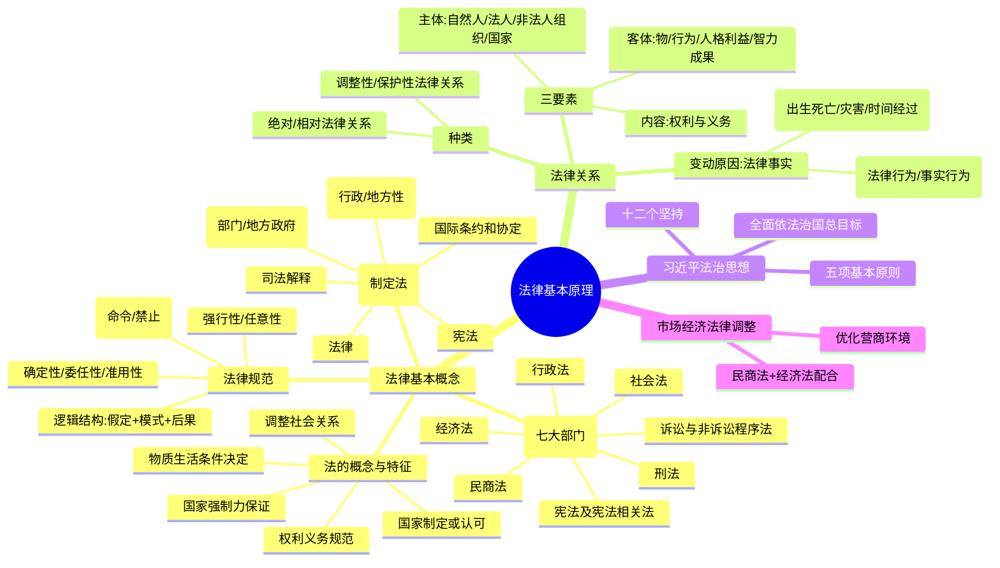

## 📍 章节定位

| 项目 | 信息 |
|------|------|
| **所属科目** | ⚖️ 经济法 |
| **难度等级** | ⭐ |
| **历年分值** | 1-2分 |
| **建议学时** | 2-3h |

## 📝 考情分析

本章是经济法科目的入门章节，理论性强但分值占比低，历年考试分值稳定在 1-2 分。命题以**单项选择题**为主，偶尔出现在多选题中，几乎不涉及案例分析题。

近年命题热点集中在：(1) 法律渊源的效力层级与制定主体；(2) 法律规范的种类辨析（授权性/义务性、强行性/任意性、确定性/委任性/准用性）；(3) 法律关系的主体、客体、内容三要素；(4) 自然人民事行为能力分类；(5) 习近平法治思想核心要义。考生应重点掌握"法律渊源效力排序"和"民事行为能力三分类"两个高频考点，对习近平法治思想第十二个坚持、世界银行 BR 项目等新增内容也应予以关注。

本章属于"性价比高"的章节，投入少、得分稳，建议用 2-3 小时通读即可，无需深挖法理。

## 🧠 知识框架

## 📖 核心精讲

### 一、法的概念与特征

**法**是反映由一定物质生活条件所决定的统治阶级意志的，由国家制定或认可并得到国家强制力保证实施的，赋予社会关系参加者权利与义务的社会规范的总称。

法的五大特征：

| 特征 | 关键要点 |
|------|----------|
| 物质生活条件决定 | 统治阶级意志受制于经济基础，"君主们不得不服从经济条件" |
| 国家制定或认可 | 制定=创制新规范；认可=确认既有规则（习惯/教义/礼仪） |
| 国家强制力保证 | 军队、警察、监狱；但主要依赖自觉遵守 |
| 调整社会关系 | 区别于调整人与自然关系的技术规范 |
| 确定权利义务 | 权利义务是法调整行为的基本表达形式 |

### 二、法律体系（七大法律部门）

我国社会主义法律体系包含七个法律部门：**宪法及宪法相关法、刑法、行政法、民商法、经济法、社会法、诉讼与非诉讼程序法**。

> **特别提示**：本教材名称虽为"经济法"，但并非法律部门意义上的经济法，而是"与市场经济活动相关的经济法律制度"的统称，涉及民法、商法、经济法多个部门。教材四编：法律概论、民事法律制度、商事法律制度、经济法律制度。

### 三、法律渊源（高频考点）

我国主要承继**成文法**传统，法律渊源主要表现为制定法，不包括判例法。效力层级如下表：

| 渊源类型 | 制定主体 | 效力层级 | 示例 |
|----------|----------|----------|------|
| **宪法** | 全国人大 | 最高 | 《宪法》 |
| **法律** | 全国人大及常委会 | 仅次于宪法 | 基本法律：《刑法》《民法典》；一般法律：《公司法》《证券法》 |
| **行政法规** | 国务院 | 仅次于法律 | 《市场主体登记管理条例》 |
| **地方性法规** | 省级、设区的市人大及常委会 | 仅本辖区适用 | 《北京市优化营商环境条例》 |
| **部门规章** | 国务院各部、委员会、央行、审计署等 |  | 《支付结算办法》《上市公司信息披露管理办法》 |
| **地方政府规章** | 有权地方人民政府 |  | 省级、设区的市政府制定 |
| **司法解释** | 最高法、最高检 |  | 《民法典合同编通则若干问题的解释》 |
| **国际条约和协定** | 我国作为国际法主体缔结 |  | 加入 WTO 协议、双边投资保护协定 |

> **重点法条**：《立法法》第七十二条规定，行政法规可以就下列事项作出规定：(1) 为执行法律的规定需要制定行政法规的事项；(2) 宪法第八十九条规定的国务院行政管理职权的事项。

**重要原则**：没有法律或者国务院的行政法规、决定、命令的依据，部门规章不得设定减损公民、法人和其他组织权利或者增加其义务的规范。

### 四、法律规范的种类（高频考点）

按行为模式分类：

| 分类 | 含义 | 立法语言 |
|------|------|----------|
| **授权性规范** | 规定可以作出或要求他人作出一定行为 | "可以…""有权…""享有…权利" |
| **命令性规范** | 规定积极义务（应作为） | "应(当)…""(必)须…""有…义务" |
| **禁止性规范** | 规定消极义务（不作为） | "不得…""禁止…" |

按自主调整性分类：

- **强行性规范**：义务具有确定性质，不允许任意变动。例如《证券法》第一百二十八条第二款规定，证券公司必须将其证券经纪业务、证券承销业务、证券自营业务、证券做市业务和证券资产管理业务分开办理，不得混合操作。
- **任意性规范**：法定范围内允许自行确定权利义务。仅在当事人没有约定的情况下，才适用法律的一般规定。

按内容确定性分类：

- **确定性规范**：内容已完备明确，无须援引其他规范。绝大多数法律规范属此。
- **委任性规范**：只规定概括性指示，具体内容由有关国家机关确定。如《反垄断法》第十二条第二款："国务院反垄断委员会的组成和工作规则由国务院规定。"
- **准用性规范**：本身没有具体规则内容，规定可以援引或参照其他规定。如《民法典》第六百五十六条："供用水、供用气、供用热力合同，参照适用供用电合同的有关规定。"

### 五、法律关系三要素

**法律关系**是根据法律规范产生、以主体间的权利与义务关系为内容表现的特殊的社会关系。三大特征：(1) 以法律规范为前提；(2) 以权利义务为内容；(3) 以国家强制力为保障。

#### （一）主体

法律关系主体包括：自然人、法人和非法人组织、国家（特定情况下）。

**自然人民事行为能力**（必考）：

| 类别 | 年龄/状态 | 法律行为能力 |
|------|-----------|--------------|
| **完全民事行为能力人** | 18周岁以上成年人；16周岁以上以自己劳动收入为主要生活来源的未成年人 | 可独立实施民事法律行为 |
| **限制民事行为能力人** | 8周岁以上的未成年人；不能完全辨认自己行为的成年人 | 由法定代理人代理或经其同意、追认；可独立实施纯获利益或与年龄智力相适应的行为 |
| **无民事行为能力人** | 不满8周岁的未成年人；不能辨认自己行为的成年人 | 由法定代理人代理实施 |

> 《民法典》第十四条：自然人的民事权利能力一律平等。权利能力从出生时起到死亡时止。

#### （二）客体

法律关系客体包括四类：**物**（含货币及有价证券）、**行为**（作为与不作为）、**人格利益**（生命健康姓名肖像名誉隐私等）、**智力成果**（著作、专利、商标等）。新型客体包括数据、网络虚拟财产等。

#### （三）内容

权利与义务。权利可以行使也可以放弃，但不得滥用权利。没有无义务的权利，也没有无权利的义务。

### 六、法律事实（引起法律关系变动）

| 类型 | 含义 | 举例 |
|------|------|------|
| **行为** | 以权利主体意志为转移 | 法律行为（以意思表示为要素，如合同）；事实行为（与表意无关，如创作、侵权） |
| **事件** | 与当事人意志无关 | 人的出生与死亡；自然灾害与意外事件；时间的经过 |

### 七、习近平法治思想

习近平法治思想是新时代全面依法治国必须长期坚持的指导思想。2025 年《习近平法治思想学习纲要（2025 年版）》将核心要义发展为**"十二个坚持"**：

1. 坚持党对全面依法治国的领导
2. 坚持以人民为中心
3. 坚持中国特色社会主义法治道路
4. 坚持依宪治国、依宪执政
5. 坚持在法治轨道上**全面建设社会主义现代化国家**（由原"推进国家治理体系和治理能力现代化"发展而来）
6. 坚持建设中国特色社会主义法治体系
7. 坚持依法治国、依法执政、依法行政共同推进，法治国家、法治政府、法治社会一体建设
8. 坚持全面推进科学立法、严格执法、公正司法、全民守法
9. 坚持统筹推进国内法治和涉外法治
10. 坚持建设德才兼备的高素质法治工作队伍
11. 坚持抓住领导干部这个"关键少数"
12. **坚持依法治国和依规治党有机统一**（新增的第十二个坚持）

**全面推进依法治国的总目标**：建设中国特色社会主义法治体系、建设社会主义法治国家。

**五项基本原则**：坚持中国共产党的领导；坚持人民主体地位；坚持法律面前人人平等；坚持依法治国和以德治国相结合；坚持从中国实际出发。

### 八、市场经济的法律调整与经济法律制度

现代市场经济条件下，**民商法与经济法相互配合**形成经济法律制度体系：

- **民法**：确立主体地位、保护人身权；通过物权法、合同法、侵权责任法保护财产、保障交易、制裁侵权。
- **商法**：公司法、证券法、破产法、票据法、海商法、信托法、保险法等。
- **经济法**：包括**市场规制法**（反垄断法、反不正当竞争法、消费者权益保护法）和**宏观调控法**（规划和产业法、财政法、税法、金融法、对外贸易法）两翼。

#### 优化营商环境

**世界银行 BR 项目**（Business Ready，2023 年 5 月发布更新体系）取代原 DB 项目（Doing Business）。BR 项目 10 项指标：市场准入、获取经营场所、公共设施连接、雇佣劳动、获取金融服务、国际贸易、税收、争端解决、市场竞争、企业破产。

> 与 DB 项目相比的变化：(1) 新增"雇佣劳动"和"市场竞争"两项指标；(2) 删除"保护中小投资者"指标；(3) 将"办理施工许可"和"产权登记"合并为"获取经营场所"；(4) 拓展原指标内涵外延（如"获得电力"拓展为"公共设施连接"，"获得信贷"拓展为"获取金融服务"）。

**《优化营商环境条例》**（2019 年国务院公布）四项基本原则：(1) 持续深化简政放权、放管结合、优化服务改革；(2) 坚持市场化、法治化、国际化原则；(3) 建立统一开放、竞争有序的现代市场体系；(4) 平等对待各类市场主体。具体规定涵盖市场主体保护、市场环境、政务服务、监管执法、法治保障五大方面。

## 💡 典型例题

**【例题 1】（单项选择题）**

根据法律基本原理的规定，下列关于我国法律渊源的表述中，正确的是（ ）。

A. 全国人大常委会制定的《公司法》属于基本法律
B. 国务院发布的《市场主体登记管理条例》属于地方性法规
C. 最高人民法院发布的《关于适用〈民法典〉合同编通则若干问题的解释》属于司法解释
D. 财政部发布的《企业会计准则——基本准则》属于地方政府规章

**答案**：C

**解析**：A 错误，《公司法》由全国人大常委会制定，属于一般法律而非基本法律（基本法律由全国人大制定）；B 错误，国务院发布的属于行政法规，不是地方性法规；C 正确，最高法、最高检发布的属于司法解释；D 错误，财政部发布的属于部门规章。

**【例题 2】（单项选择题）**

下列关于自然人民事行为能力的表述中，根据《民法典》正确的是（ ）。

A. 6 周岁的甲是限制民事行为能力人
B. 16 周岁的乙以自己劳动收入为主要生活来源，视为完全民事行为能力人
C. 不能完全辨认自己行为的丙是完全民事行为能力人
D. 8 周岁的丁是无民事行为能力人

**答案**：B

**解析**：A 错误，不满 8 周岁为无民事行为能力人；B 正确，16 周岁以上以自己劳动收入为主要生活来源的，视为完全民事行为能力人；C 错误，不能完全辨认自己行为的成年人为限制民事行为能力人；D 错误，8 周岁以上为限制民事行为能力人（注意"8 周岁以上"包含 8 周岁本数）。

## 🎯 记忆口诀

**口诀一：法律渊源效力排序**
> 宪法最高法律次，行政法规紧随后；
> 地方法规本辖区，部门规章政府规；
> 司法解释两最高，国际条约同等守。

**口诀二：民事行为能力三分类**
> 八周岁是个分界线，以下无行为要代理；
> 八到十八是限制，纯获利益可自己；
> 十六打工算成年，劳动收入主来源；
> 十八成年全自主，独立行为无需代。

**口诀三：法律规范分类对比**

| 分类标准 | 类型 | 识别关键词 |
|----------|------|------------|
| 行为模式 | 授权性 / 命令性 / 禁止性 | 可以 / 应当 / 不得 |
| 自主调整 | 强行性 / 任意性 | 必须 / 自行约定 |
| 内容确定 | 确定性 / 委任性 / 准用性 | 直接规定 / 由×规定 / 参照适用 |

## ✅ 同步练习

**1. （单选）下列各项中，属于我国法律渊源的是（ ）。**
A. 判例法
B. 最高人民法院发布的指导性案例
C. 国务院发布的《证券公司监督管理条例》
D. 某高校制定的校园管理规定

**2. （单选）根据《立法法》规定，下列主体中有权制定地方性法规的是（ ）。**
A. 县级人民政府
B. 设区的市的人民代表大会及其常委会
C. 国务院各部委
D. 最高人民法院

**3. （单选）下列关于法律规范种类表述正确的是（ ）。**
A. "国务院反垄断委员会的组成和工作规则由国务院规定"属于准用性规范
B. "供用水合同参照适用供用电合同的有关规定"属于委任性规范
C. "证券公司必须将其证券经纪业务、证券承销业务分开办理，不得混合操作"属于任意性规范
D. "自然人享有生命权、身体权、健康权"属于授权性规范

**4. （多选）根据习近平法治思想，下列属于"十二个坚持"的有（ ）。**
A. 坚持党对全面依法治国的领导
B. 坚持以人民为中心
C. 坚持依法治国和以德治国相统一（属五项基本原则）
D. 坚持依法治国和依规治党有机统一

**5. （单选）下列关于世界银行营商环境评估项目（BR 项目）的表述中，正确的是（ ）。**
A. BR 项目取代了原 DB 项目，评估指标数量大幅减少
B. BR 项目新增了"雇佣劳动"和"市场竞争"两项指标
C. BR 项目保留了"保护中小投资者"指标
D. BR 项目仅通过专业机构问卷调查采集数据

---

**参考答案**：1.C 2.B 3.D 4.ABD 5.B
