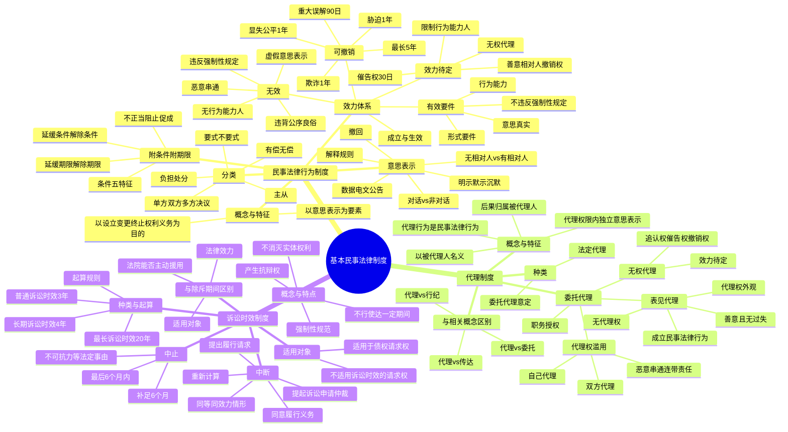

## 1. 章节定位

| 项目 | 信息 |
|------|------|
| 所属科目 | 经济法 |
| 难度等级 | 3 |
| 历年分值 | 4-6 分 |
| 建议学时 | 5-6 小时 |
| 知识关联章节 | 第1章 法律基本原理（法律关系、法律事实）；第3章 物权法律制度（处分行为、物权变动）；第4章 合同法律制度（合同效力、代位权、撤销权）；第5章 合伙企业法律制度（合伙事务执行、表见代理）；第6章 公司法律制度（法定代表人越权、表见代表）；第9章 票据与支付结算法律制度（票据行为无因性） |

## 2. 考情分析

本章是经济法科目的基础章节之一，分值约 4-6 分。命题以客观题为主，主观题常以案例分析题形式涉及合同效力、代理行为效力、诉讼时效抗辩等考点。本章是后续合同法、公司法、票据法等章节的基础，掌握本章对于理解后续各章的法律行为效力判断至关重要。

**命题规律**：本章命题注重理论与案例结合，重点考查法律行为效力体系（无效、可撤销、效力待定）的辨析，代理制度中无权代理与表见代理的区别，诉讼时效的中止与中断的应用。近年命题趋势是结合合同编司法解释（2023 年）、意思表示解释规则等新内容出题。

**高频考点分布**：

1. **民事法律行为的分类**：单方/双方/多方（决议）、有偿/无偿、负担/处分、要式/不要式、主/从民事法律行为——五组分类的含义与区分意义。
2. **意思表示**：意思表示的生效（对话方式、非对话方式、数据电文、公告方式）、撤回、解释规则（有相对人 vs 无相对人）、明示与默示、沉默作为意思表示的条件。
3. **民事法律行为的效力体系**：
   - **有效要件**：行为能力、意思表示真实、不违反强制性规定不违背公序良俗；形式要件。
   - **无效**：无行为能力人独立实施、虚假意思表示、恶意串通、违反强制性规定或违背公序良俗。注意"强制性规定不导致无效的除外"。
   - **可撤销**：重大误解（90 日）、欺诈、胁迫（1 年）、显失公平；撤销权除斥期间、撤销权放弃。
   - **效力待定**：限制行为能力人依法不能独立实施、无权代理。相对人催告权（30 日）、善意相对人撤销权。
4. **附条件与附期限**：条件的五项特征、延缓条件与解除条件、不正当阻止/促成条件的法律后果；附期限与附条件的区别。
5. **代理制度**：代理与委托、行纪、传达的区别；委托代理中的代理权、代理权滥用（自己代理、双方代理、恶意串通）；无权代理（效力待定，被代理人追认权、相对人催告权、善意相对人撤销权）；表见代理四个构成要件。
6. **诉讼时效制度**：诉讼时效与除斥期间的区别；普通诉讼时效（3 年）、长期诉讼时效（4 年）、最长诉讼时效（20 年）；起算规则；中止（最后 6 个月内、不可抗力等）、中断（请求、同意、起诉、仲裁等）；不适用诉讼时效的请求权。

**联动考查方式**：

- 与第4章合同法律制度联动：合同效力、代位权、撤销权、合同解除；
- 与第6章公司法律制度联动：法定代表人越权行为的效力（表见代表）、公司决议效力；
- 与第9章票据法律制度联动：票据行为无因性、票据代理；
- 与第8章破产法律制度联动：破产债权的诉讼时效。

**备考建议**：

- 系统梳理民事法律行为效力体系：有效、无效、可撤销、效力待定——四类效力的判定要件与法律后果；
- 重点掌握撤销权除斥期间：重大误解 90 日、其他 1 年、最长 5 年；胁迫从胁迫行为终止之日起算；
- 区分无权代理与表见代理的核心：相对人是否善意且无过失 + 是否存在代理权外观；
- 诉讼时效与除斥期间对比记忆：适用对象（债权请求权 vs 形成权）、法院能否主动援用、效力（抗辩权 vs 实体权利消灭）；
- 注意 2023 年合同编司法解释关于"强制性规定不导致无效的情形""缺乏判断能力认定""显失公平判断时点"的新规定。

## 3. 知识框架

## 4. 核心精讲

### 4.1 民事法律行为制度

#### 4.1.1 民事法律行为的概念与特征

根据《民法典》第一百三十三条规定，**民事法律行为**是民事主体通过意思表示设立、变更、终止民事法律关系的行为。民事法律行为是法律关系变动的原因之一，是民法最重要的法律事实。当事人可以通过民事法律行为自主设立、变更或终止某种法律关系，实现自己追求的法律效果，因此民事法律行为真正体现了意思自治精神。

民事法律行为具有以下特征：

1. **以意思表示为要素**。意思表示是指行为人将意欲达到某种预期法律后果的内在意思表现于外部的行为。如果行为人仅有内在意思而不表现于外，则不构成意思表示，民事法律行为不能成立；行为人表现于外的意思不是其内在意思的真实反映，则表明该意思表示有瑕疵，民事法律行为的效力同样受到影响。意思表示是民事法律行为的核心，也是民事法律行为与非表意行为（如事实行为等）相区别的重要标志。
2. **以设立、变更或终止权利义务为目的**。民事法律行为是有目的的行为，是当事人欲达到一定法律效果的行为。此处的"目的"仅指当事人实施民事法律行为所追求的法律后果，不包括行为人实施行为的动机。这一特征使得民事法律行为区别于其他法律事实，如侵权行为。侵权行为虽然也产生一定的法律后果，但这个法律后果并非由当事人自己主张，而是由法律规定的。

#### 4.1.2 民事法律行为的分类

**（一）单方、双方与多方民事法律行为**

《民法典》第一百三十四条规定，民事法律行为可以基于双方或者多方的意思表示一致成立，也可以基于单方的意思表示成立。

| 类型 | 含义 | 典型 |
|------|------|------|
| 单方民事法律行为 | 根据一方当事人的意思表示而成立，无须他方同意即可发生法律效力 | 撤销权行使、解除权行使、效力待定行为的追认、债务免除、遗嘱、抛弃动产 |
| 双方民事法律行为 | 因两个当事人之间意思表示一致而成立 | 合同 |
| 多方民事法律行为 | 三个以上的当事人意思表示一致而成立 | 决议 |

**决议**是典型的多方民事法律行为。决议在性质上与合同行为存在区别：决议当事人的意思表示可以多数决的方式作出，而且对没有表示同意的成员也具有拘束力；决议中的意思表示不仅对发出表示的成员有拘束力，而且主要对表示者共同代表的法人有拘束力。

**（二）有偿与无偿民事法律行为**

- **有偿民事法律行为**：当事人互为给付一定代价（包括金钱、财产、劳务）的民事法律行为，如买卖合同、承揽合同。
- **无偿民事法律行为**：一方当事人承担给付一定代价的义务，而他方当事人不承担相应给付义务的民事法律行为，如赠与行为、无偿委托、无偿消费借贷。

区分意义：①确定行为性质（买卖必须有偿、赠与必须无偿）；②认定行为效力（有偿行为显失公平可撤销，无偿行为不存在显失公平）；③确定行为人责任（有偿行为责任重于无偿行为）；④主张撤销权（有偿行为需相对人知道或应当知道，无偿行为不用考虑主观意图——《民法典》第 538 条、539 条）。

**（三）负担行为与处分行为**

- **负担行为**：使一方相对于他方承担一定给付义务的法律行为，产生的是债法上的法律效果。
- **处分行为**：直接导致权利发生变动的法律行为，物权行为是典型的处分行为。

区分意义：负担行为中的权利人享有要求履行的请求权，义务人的履行行为是请求权实现的重要前提；处分行为则直接使权利发生变动，并不需要义务人积极履行给付义务。

**（四）要式与不要式民事法律行为**

- **要式民事法律行为**：法律规定必须采取一定的形式或者履行一定的程序才能成立的民事法律行为，如票据行为。
- **不要式民事法律行为**：法律不要求采取特定形式，当事人自由选择形式即可成立的民事法律行为。

**（五）主与从民事法律行为**

- **主民事法律行为**：不需要有其他民事法律行为的存在就可以独立成立的民事法律行为。
- **从民事法律行为**：从属于其他民事法律行为而存在的民事法律行为，如为担保借贷合同履行而订立的担保合同。

从民事法律行为的效力依附于主民事法律行为：主民事法律行为不成立，从民事法律行为则不能成立；主民事法律行为无效，则从民事法律行为亦当然不能生效。但是，主民事法律行为履行完毕，并不必然导致从民事法律行为效力的丧失。

#### 4.1.3 意思表示

意思表示包括**意思**和**表示**两个方面。意思主要是指当事人欲使其内心意思发生法律上效力的效果意思；表示是指行为人将其内在的效果意思以一定方式表现于外部，为行为相对人所了解。

**（一）意思表示的种类与生效时间**

| 类型 | 含义 | 生效时间 | 典型 |
|------|------|---------|------|
| 无相对人的意思表示 | 不存在意思表示所针对的相对人 | 行为完成时生效 | 遗嘱行为、抛弃动产 |
| 有相对人的意思表示（对话方式） | 以对话方式作出 | 相对人知道其内容时生效 | 当面交谈、电话 |
| 有相对人的意思表示（非对话方式） | 以非对话方式作出 | 到达相对人时生效 | 要约承诺、债务免除、授予代理权、合同解除 |
| 数据电文形式 | 采用数据电文形式 | 指定系统：进入系统时生效；未指定：知道或应当知道进入系统时生效 | 电子邮件、电子数据交换 |
| 公告方式 | 以公告方式作出 | 公告发布时生效 | — |

注意：并非所有单方行为都是无相对人的意思表示，如撤销权的行使、法定代理人的追认为单方行为同时也是有相对人的意思表示。《民法典》第四百八十四条第二款规定的"承诺不需要通知的，根据交易习惯或者要约的要求作出承诺的行为时生效"属于例外情况。

**（二）明示、默示与沉默**

意思表示可以明示或者默示。**沉默只有在有法律规定、当事人约定或者符合当事人之间的交易习惯时，才可以视为意思表示**。例如《民法典》第一千一百二十四条规定，继承开始后，继承人放弃继承的，应当在遗产处理前，以书面形式作出放弃继承的表示；没有表示的，视为接受继承。此处"没有表示的"就属于法定沉默。

**（三）意思表示的撤回**

意思表示可以撤回。撤回意思表示的通知应当在意思表示到达相对人前或者与意思表示同时到达相对人。

**（四）意思表示的解释**

根据《民法典》第一百四十二条规定：

- **有相对人的意思表示的解释**：应当按照所使用的词句，结合相关条款、行为的性质和目的、习惯以及诚信原则，确定意思表示的含义。
- **无相对人的意思表示的解释**：不能完全拘泥于所使用的词句，而应当结合相关条款、行为的性质和目的、习惯以及诚信原则，确定行为人的真实意思。

#### 4.1.4 民事法律行为的成立与生效

**（一）民事法律行为的成立**

民事法律行为要产生法律效力，首先应当符合民事法律行为的构成要素，即必须具有**当事人、意思表示、标的**三个要素。一些特别的民事法律行为，除了上述三个要素以外，还必须具备其他特殊事实要素，如实践性民事法律行为的成立还必须有标的物的交付。

**（二）民事法律行为的生效**

民事法律行为的成立和生效是两个不同的概念。民事法律行为的成立是民事法律行为生效的前提；民事法律行为未成立，当然也谈不上生效。在大多数情况下，民事法律行为成立和生效是一致的，即在民事法律行为成立时即具有法律效力。

**民事法律行为有效的实质要件**：

1. **行为人具有相应的民事行为能力**。就自然人而言，完全民事行为能力人可以以自己的行为取得民事权利，履行民事义务；限制民事行为能力人只能从事与其年龄和智力程度相当的民事法律行为；无民事行为能力人不能独立实施民事法律行为。法人的民事行为能力是由法人核准登记的经营范围所决定的，但从维护相对人的利益和促进交易的角度出发，原则上认定法人超越经营范围从事的民事法律行为有效。《民法典》第五百零五条规定，当事人超越经营范围订立的合同，不得仅以超越经营范围为由确认合同无效。
2. **行为人的意思表示真实**。意思表示真实是指行为人在自觉、自愿的基础上作出符合其内在意志的表示行为。意思表示不真实的民事法律行为，可以撤销或宣告无效。意思表示真实包括两个方面：意思表示自愿，任何人不得强迫；行为人内在的效果意思和外在的表示一致。
3. **不违反法律、行政法规的强制性规定，不违背公序良俗**。意思表示的内容不得与法律的强制性或禁止性规范相抵触，也不得滥用法律的授权性或任意性规定规避强制性或禁止性规范。

**民事法律行为有效的形式要件**：《民法典》第一百三十五条规定："民事法律行为可以采用书面形式、口头形式或者其他形式；法律、行政法规规定或者当事人约定采用特定形式的，应当采用特定形式。"民事法律行为的形式主要有：①口头形式；②书面形式（数据电文属于书面形式的一种）；③推定形式（通过实施某种积极行为推定意思表示）；④沉默形式（仅在法律规定、当事人约定或符合交易习惯时视为意思表示）。

#### 4.1.5 无效民事法律行为

**无效民事法律行为**是指因欠缺民事法律行为的有效条件，不发生当事人预期法律后果的民事法律行为。其特征为：①**自始无效**——从行为开始时起就没有法律约束力；②**当然无效**——不论当事人是否主张、是否知道，也不论是否经过人民法院或者仲裁机构确认，该民事法律行为当然无效；③**绝对无效**——绝对不发生法律效力，不能通过当事人的行为进行补正。当事人通过一定行为消除无效原因，使之有效，这不是无效民事法律行为的补正，而是消灭旧的民事法律行为，成立新的民事法律行为。

根据《民法典》，无效民事法律行为包括以下种类：

**（一）无民事行为能力人独立实施的民事法律行为无效**

无民事行为能力人不能正确认识其行为的法律意义，依法不能进行民事活动，只能由其法定代理人代理。

**（二）以虚假意思表示实施的民事法律行为无效**

行为人与相对人以虚假的意思表示实施的民事法律行为无效。行为人如果以虚假的意思表示隐藏另外一个民事法律行为，被隐藏的民事法律行为的效力，依照有关法律规定处理（即"阴阳合同"中"阳合同"无效，"阴合同"的效力根据法律规定单独认定）。

**（三）恶意串通损害他人合法权益的民事法律行为无效**

指行为人故意合谋实施的损害其他自然人、法人、非法人组织的合法权益的行为。这类民事法律行为的主要特征是当事人之间互相串通、互相配合，共同实施了违法行为。在恶意串通损害他人合法权益的民事法律行为中，当事人所表达的意思是真实的，但这种意思表示是非法的，因此是无效的。

**（四）违反强制性规定或者违背公序良俗的民事法律行为无效**

根据《民法典》第一百五十三条第一款规定，违反法律、行政法规的强制性规定的民事法律行为无效，**但是该强制性规定不导致该民事法律行为无效的除外**。因此，并非违反法律的行为一律都是无效的。在下列情况中，原则上由行为人承担行政责任或者刑事责任即可实现强制性规定的立法目的，不应该认定民事法律行为无效：

1. 强制性规定旨在维护政府的税收、土地出让金等国家利益，认定合同有效不会影响该规范目的的实现；
2. 强制性规定旨在维护其他民事主体的合法利益而非合同当事人的民事权益，认定合同有效不会影响该规范目的的实现；
3. 强制性规定旨在要求当事人一方加强风险控制、内部管理等，对方无能力或者无义务审查合同是否违反强制性规定，认定合同无效将使其承担不利后果；
4. 当事人一方虽然在订立合同时违反强制性规定，但是在合同订立后其已经具备补正违反强制性规定的条件却违背诚信原则不予补正；
5. 法律、行政法规的强制性规定旨在规制合同订立后的履行行为，该合同的履行并非当然违法的行为。

此外，如果强制性规定虽然旨在维护社会公共秩序，但是合同的实际履行对社会公共秩序造成的影响显著轻微，认定合同无效将导致案件处理结果有失公平公正，则不应该认定合同无效。依据《民法典》第一百五十三条第二款规定，违背公序良俗的民事法律行为亦无效。

#### 4.1.6 可撤销的民事法律行为

**可撤销的民事法律行为**，是指依照法律规定，由于行为人的意思与表示不一致或者意思表示不自由，导致非真实的意思表示，可由当事人请求人民法院或者仲裁机构予以撤销的民事法律行为。

**与无效民事法律行为比较**的特点：①行为成立后的效力不同（可撤销行为在撤销前已生效；无效行为从一开始即不发生法律效力）；②主张权利的主体不同（可撤销行为须由撤销权人请求，法院不主动干预；无效行为司法机关和仲裁机构可主动宣告）；③行为效果不同（可撤销行为撤销权人未在规定期限内行使撤销权的，行为终局有效；一经撤销，效力溯及至行为开始；无效行为则自始无效、绝对无效）；④行使时间不同（可撤销行为的撤销权有时间限制；无效行为则不存在此种限制）。

**可撤销民事法律行为的种类**：

**（一）因重大误解而为的民事法律行为**

**重大误解**是指行为人对行为的性质、对方当事人或者标的物的品种、质量、规格、数量等产生错误认识，按照通常理解如果不发生该错误认识，行为人就不会作出相应意思表示。所谓按照通常理解错误是重大的，是指从一个处在行为人地位的普通人立场来看，错误认识会对交易的成立产生重大影响。例如，将 11.5 万元误认为 1.5 万元，将二套房误认为首套房，将 100 公斤误认为 100 斤，将铁螺母误认为铜螺母。但是，**基于交易习惯不构成重大误解的除外**，比如在古玩市场上对花瓶年代、手镯材质、钱币真假等发生错误认识。

**（二）受欺诈而为的民事法律行为**

**欺诈**指故意告知虚假情况，或者负有告知义务的人故意隐瞒真实情况，致使当事人基于错误认识作出意思表示。被欺诈的一方可以请求人民法院或者仲裁机构予以撤销。如果第三人实施欺诈行为，使一方在违背真实意思的情况下实施民事法律行为，**对方知道或者应当知道该欺诈行为的**，受欺诈方有权请求人民法院或者仲裁机构予以撤销。

**（三）受胁迫而为的民事法律行为**

**受胁迫而为的民事法律行为**指以给自然人及其近亲属等的人身权利、财产权利以及其他合法权益造成损害或者以给法人、非法人组织的名誉、荣誉、财产权益等造成损害为要挟，迫使其基于恐惧心理作出意思表示。胁迫既可以来自民事法律行为的相对人，也可以来自第三人，其法律效果一样，均导致民事法律行为的可撤销。

**（四）显失公平的民事法律行为**

**显失公平的民事法律行为**，是指一方利用对方处于危困状态、缺乏判断能力等情形，致使民事法律行为成立时当事人间的权利义务明显违反公平原则的民事法律行为。

- **危困状态**：处于危难、急迫、困窘的境地。例如，利用对方遭遇意外事故或罹患疾病后急需帮助，以低于市价 50% 价格购买其房屋。
- **缺乏判断能力**：由于年龄大、知识匮乏、经验缺乏或者智力低等原因，对需要一定专业知识或经验的复杂交易，难以认知其法律后果。根据《关于适用〈中华人民共和国民法典〉合同编通则若干问题的解释》第十一条，当事人一方是自然人，根据该当事人的年龄、智力、知识、经验并结合交易的复杂程度，能够认定其对合同的性质、合同订立的法律后果或者交易中存在的特定风险缺乏应有的认知能力的，即构成"缺乏判断能力"。

如果一方利用对方处于危困状态、缺乏判断能力的情节严重，那么即使交易中的价格未偏离市价，仍然可能构成显失公平。对民事法律行为是否显失公平进行判断的时间点，应当**以民事法律行为成立的时间点为标准**。在民事法律行为成立以后发生的情势变化，导致双方利益显失公平的，不属于显失公平的民事法律行为，而应当按照诚实信用原则处理。

**撤销权**：撤销权在性质上属于**形成权**，故依撤销权人的意思表示即可产生相应的法律效力，无须相对人同意。撤销权应依诉行使，由人民法院或仲裁机构作出。在以欺诈、胁迫的手段使对方在违背真实意思的情况下订立的合同中，只有**受损害方**才有权撤销。

**撤销权的存续期间（除斥期间）**：根据《民法典》第一百五十二条的规定，撤销权因下列情形消灭：

- 当事人自知道或者应当知道撤销事由之日起 **1 年**内没有行使撤销权；
- **重大误解**的当事人自知道或者应当知道撤销事由之日起 **90 日**内没有行使撤销权；
- 当事人受胁迫，自胁迫行为终止之日起 **1 年**内没有行使撤销权；
- 当事人知道撤销事由后明确表示或者以自己的行为表明放弃撤销权；
- 当事人自民事法律行为发生之日起 **5 年**内没有行使撤销权的，撤销权消灭（最长除斥期间）。

#### 4.1.7 效力待定的民事法律行为

**效力待定的民事法律行为**，是指民事法律行为成立时尚未生效，须经权利人追认才能生效的民事法律行为。追认的意思表示自到达相对人时生效。一旦追认，则民事法律行为自成立时起生效；如果权利人拒绝追认，则民事法律行为自成立时起无效。

**（一）限制民事行为能力人依法不能独立实施的民事法律行为**

《民法典》第一百四十五条规定，限制民事行为能力人实施的纯获利益的民事法律行为或者与其年龄、智力、精神健康状况相适应的民事法律行为有效；实施的其他民事法律行为经法定代理人同意或者追认后有效。法定代理人的追认权性质上属于形成权，仅凭其单方面意思表示就可以使效力待定的合同转化为有效合同。

为保护相对人利益，法律规定：

- **相对人的催告权**：相对人可以催告法定代理人在 **30 日**内予以追认。法定代理人未作表示的，**视为拒绝追认**。
- **善意相对人的撤销权**：合同被追认之前，善意相对人有撤销的权利。撤销应当以通知的方式作出。"善意"是指相对人在订立合同时不知道与其订立合同的人欠缺相应的行为能力。

**（二）无权代理人实施的民事法律行为**

根据《民法典》第一百七十一条的规定，行为人没有代理权、超越代理权或者代理权终止后，仍然实施代理行为，未经被代理人追认的，对被代理人不发生效力。

- 相对人可以催告被代理人自收到通知之日起 **30 日**内予以追认。被代理人未作表示的，视为拒绝追认。
- 被代理人已经开始履行民事法律行为中设定的义务的，**视为对民事法律行为的追认**。
- 民事法律行为被追认之前，善意相对人有撤销的权利。撤销应当以通知的方式作出。
- 行为人实施的行为未被追认的，善意相对人有权请求行为人履行债务或者就其受到的损害请求行为人赔偿，但是赔偿的范围不得超过被代理人追认时相对人所能获得的利益。
- 相对人知道或者应当知道行为人无权代理的，相对人和行为人按照各自的过错承担责任。

#### 4.1.8 民事法律行为被确认无效或被撤销的法律后果

根据《民法典》第一百五十七条的规定，民事法律行为无效、被撤销或者确定不发生效力后，行为人因该行为取得的财产，应当予以返还；不能返还或者没有必要返还的，应当折价补偿。有过错的一方应当赔偿对方由此所受到的损失；各方都有过错的，应当各自承担相应的责任。法律另有规定的，依照其规定。民事法律行为不成立，当事人请求返还财产、折价补偿或者赔偿损失的，参照适用上述规定。

**资金占用费的计算**：有权请求返还价款或者报酬的当事人一方请求对方支付资金占用费的，人民法院应当在当事人请求的范围内按照中国人民银行授权全国银行间同业拆借中心公布的 1 年期贷款市场报价利率（LPR）计算。但是，占用资金的当事人对于合同不成立、无效、被撤销或者确定不发生效力没有过错的，应当以中国人民银行公布的同期同类存款基准利率计算。

根据《民法典》第五百零七条的规定，合同不生效、无效、被撤销或者终止的，**不影响其中独立存在的有关解决争议方法的条款的效力**。例如，双方当事人约定用仲裁方式解决双方争议的条款继续有效。

#### 4.1.9 民事法律行为的附条件和附期限

**（一）附条件的民事法律行为**

**附条件的民事法律行为**是指在民事法律行为中规定一定条件，并且把该条件的成就与否作为民事法律行为效力发生或者消灭根据的民事法律行为。

**不得附条件的情形**：①条件与行为性质相违背的，如《民法典》第五百六十八条第二款规定，法定抵销不得附条件；②条件违背社会公共利益或社会公德的，如结婚、离婚等身份性民事法律行为原则上不得附条件。

**条件的五项特征**：①必须是将来发生的事实；②必须是将来不确定的事实；③条件应当是双方当事人约定的（非法律规定的）；④条件必须合法；⑤条件是可能发生的事实。所附条件不可能发生，当事人约定为生效条件的，应当认定民事法律行为不发生效力；当事人约定为解除条件的，应当认定未附条件。

**条件的分类**：

| 类型 | 别称 | 含义 |
|------|------|------|
| 附延缓条件 | 停止条件、生效条件 | 民事法律行为中所确定的权利和义务要在所附条件成就时才生效 |
| 附解除条件 | 消灭条件 | 民事法律行为中所确定的权利和义务在所附条件成就时失去法律效力 |

**附条件民事法律行为的效力**：条件成就与否未定之前，行为人一方不得损害另一方将来条件成就时可能得到的利益。条件成就与否未定之前，行为人也不得为了自己的利益，以不正当行为促成或阻止条件成就。《民法典》第一百五十九条规定，附条件的民事法律行为，当事人为自己的利益不正当地阻止条件成就的，视为条件已成就；不正当地促成条件成就的，视为条件不成就。

**（二）附期限的民事法律行为**

**附期限的民事法律行为**，指当事人设定一定的期限，并将期限的到来作为效力发生或消灭前提的民事法律行为。

| 类型 | 别称 | 含义 |
|------|------|------|
| 附延缓期限 | 始期 | 民事法律行为虽然已经成立，但是在所附期限到来之前不发生效力，待到期限届至时才产生法律效力 |
| 附解除期限 | 终期 | 民事法律行为在约定的期限到来时，该行为所确定的法律效力消灭 |

**附条件与附期限的区别**：附条件的民事法律行为是以未来不确定的事实作为民事法律行为效力产生或消灭的依据，所以该民事法律行为效力的产生或消灭具有不确定性；而附期限的民事法律行为是以一定期限的到来作为民事法律行为效力产生或消灭的依据，由于期限的到来是一个必然发生的事件，所以附期限的民事法律行为的效力的产生或消灭是确定的、可预知的。

### 4.2 代理制度

#### 4.2.1 代理的基本理论

**代理**是指代理人在代理权限内，以被代理人的名义与第三人实施民事法律行为，由此产生的法律后果直接由被代理人承担的一种法律制度。代理关系的主体包括**代理人、被代理人（本人）、第三人（相对人）**。代理关系包括三种关系：①被代理人与代理人之间的代理权关系；②代理人与第三人之间实施民事法律行为的关系；③被代理人与第三人之间承受代理行为法律后果的关系。

**代理的法律特征**：

1. **代理行为是民事法律行为**。代理行为以意思表示为核心。并非所有的民事法律行为都可以代理，依照法律规定、当事人约定或者民事法律行为的性质，应当由本人亲自实施的民事法律行为，不得代理，如立遗嘱、结婚等。
2. **代理人以被代理人的名义为民事法律行为**。代理的法律效果并非归属于行为人自身，而是由被代理人承受。（《民法典》第九百二十五条、第九百二十六条属于例外，即隐名代理与间接代理）
3. **代理人是在代理权限内独立向第三人为意思表示**。代理人在实施代理行为时应独立思考、自主作出意思表示。
4. **代理人所为的民事法律行为的法律效果归属于被代理人**。代理人不因其所实施的民事法律行为直接取得任何个人利益。

**（一）代理与相关概念的区别**

| 比较项 | 代理 | 委托 | 行纪 | 传达 |
|-------|------|------|------|------|
| 名义 | 以被代理人名义 | 受托人可以委托人名义也可以自己名义 | 以行纪人自己的名义 | 忠实传递委托人意思 |
| 事务 | 以意思表示为要素 | 不要求以意思表示为要素 | 商业活动 | 不进行意思表示 |
| 效果归属 | 直接由被代理人承受 | 视情况而定 | 先由行纪人承受，再通过其他法律关系转给委托人 | 委托人 |
| 行为能力 | 要求代理人具有相应行为能力 | — | — | 不以具有民事行为能力为条件 |
| 当事人 | 三方：被代理人、代理人、第三人 | 双方：委托人、受托人 | — | — |
| 有偿性 | 既可有偿也可无偿 | — | 必为有偿 | — |

**（二）代理的种类**

根据《民法典》的规定，代理可分为**委托代理**和**法定代理**两种：

- **委托代理**（意定代理）：基于被代理人授权的意思表示而发生的代理。委托代理的被代理人在授权时必须具有相应的民事行为能力。
- **法定代理**：依据法律规定而当然发生的代理，是为无民事行为能力人和限制民事行为能力人设立的代理方式。

#### 4.2.2 委托代理

**（一）委托代理概述**

委托授权为不要式行为，既可以采用书面形式，也可以采用口头或者其他方式授权。书面的委托形式是授权委托书，最典型的就是职务授权。根据《民法典》第一百七十条的规定，执行法人或者非法人组织工作任务的人员，就其职权范围内的事项，以法人或者非法人组织的名义实施的民事法律行为，对法人或者非法人组织发生效力。**法人或者非法人组织对执行其工作任务的人员职权范围的限制，不得对抗善意相对人**（职务代理中的表见代理）。

**（二）代理权**

代理权产生的根据，或基于法律规定（法定代理），或基于被代理人的授权行为（委托代理）。委托代理中的授权行为是一种**单方民事法律行为**，仅凭被代理人一方的意思表示，即可发生授权的效果。这种授权行为区别于被代理人与代理人之间的基础法律关系，基础法律关系可以是委托合同、合伙合同等双方民事法律行为，但授权行为一定是单方民事法律行为。被代理人的授权行为，既可以向代理人进行，也可以向相对人为之，两者效力相同。

**（三）代理权的滥用**

违背代理权的设定宗旨和代理行为的基本准则，损害被代理人利益，行使代理权的行为构成**滥用代理权**。滥用代理权的行为包括：

1. **自己代理**：代理人不得以被代理人的名义与自己实施民事法律行为，但是被代理人同意或者追认的除外。
2. **双方代理**：代理人不得以被代理人的名义与自己同时代理的其他人实施民事法律行为，但是被代理的双方同意或者追认的除外。
3. **代理人和第三人恶意串通**：代理人和相对人恶意串通，损害被代理人合法权益的，代理人和相对人应当承担**连带责任**。

自己代理与双方代理在民事法律行为类型上应当定性为**效力待定行为**，其行为效力取决于被代理人对意思表示追认与否。

**（四）无权代理**

**无权代理**就是没有代理权的代理，具备代理行为的表象但是欠缺代理权的行为。无权代理的情形一般包括：①没有代理权的代理行为；②超越代理权的代理行为；③代理权终止后的代理行为。

根据《民法典》第一百七十一条的规定，在无权代理情况下实施的民事法律行为**效力待定**：

- **被代理人的追认权**：无权代理经被代理人追认，即直接对被代理人发生法律效力。追认权性质上属于形成权。相对人可以催告被代理人自收到通知之日起 30 日内予以追认。被代理人未作表示的，视为拒绝追认。被代理人已经开始履行法律行为项下义务的，视为对无权代理行为的追认。
- **相对人的催告权**：相对人可以催告被代理人追认，催告在性质上属于意思通知行为，不属于形成权。
- **善意相对人的撤销权**：行为人实施的行为被追认前，善意相对人有撤销的权利。撤销应当以通知的方式作出。撤销权在性质上也属于形成权。撤销权的行使有两个条件：第一，只有善意相对人才可以行使撤销权；第二，撤销权的行使必须在被代理人行使追认权之前。
- **未追认的法律后果**：行为人实施的行为未被追认的，善意相对人有权请求行为人履行债务或者就其受到的损害请求行为人赔偿，但是赔偿的范围不得超过被代理人追认时相对人所能获得的利益。相对人知道或者应当知道行为人无权代理的，相对人和行为人按照各自的过错承担责任。

**（五）表见代理**

**表见代理**，指无权代理人的代理行为客观上存在使相对人相信其有代理权的情况，且相对人主观上为善意，因而可以向被代理人主张代理的效力。表见代理属于广义的无权代理的一种。《民法典》第一百七十二条规定，行为人没有代理权、超越代理权或者代理权终止后，仍然实施代理行为，相对人有理由相信行为人有代理权的，代理行为有效。法律确立表见代理规则的主要意义在于维护人们对代理制度的信赖，保护善意相对人，保障交易安全。

**表见代理的构成要件**：

1. **代理人无代理权**。如果代理人实际拥有代理权，则为有权代理，不发生表见代理。
2. **相对人主观上为善意且无过失**。即相对人不知道行为人行为时属于无权代理，且相对人的不知在主观上并无过错。
3. **客观上有使相对人相信无权代理人具有代理权的情形**，即存在代理权的外观。实践中通常表现为：合同签订人持有被代理人的介绍信或盖有印章的空白合同书，使得相对人相信其有代理权；无权代理人此前曾被授予代理权，且代理期限尚未结束，但实施代理行为时代理权已经终止。
4. **相对人基于这种客观情形而与无权代理人成立民事法律行为**。相对人虽有理由相信其有代理权，但最后并未成立民事法律行为，不发生表见代理。

**表见代理的法律效果**：对于本人来说，产生与有权代理一样的效果。即在相对人与被代理人之间发生法律关系。被代理人应受无权代理人与相对人实施的民事法律行为的拘束。被代理人不得以无权代理作为抗辩事由，主张代理行为无效。

### 4.3 诉讼时效制度

#### 4.3.1 诉讼时效基本理论

**诉讼时效**是指请求权不行使达一定期间而失去国家强制力保护的制度。诉讼时效属于法律事实中的事件，是基于一定的事实状态在法律规定的一定期间内持续存在而当然发生不为当事人意志所决定的某种法律效果。民法上建立诉讼时效制度，目的在于维护社会经济秩序的稳定、避免时间过长导致举证困难，同时也有利于督促权利人及时行使权利。

**诉讼时效的特点**：

1. 有债权人不行使权利的事实状态存在，而且该状态持续了一段期间。
2. **诉讼时效届满不消灭债权人实体权利，只是让债务人产生抗辩权**：
   - 诉讼时效期间的经过，不影响债权人提起诉讼，即不丧失起诉权；
   - 债权人起诉后，如果债务人主张诉讼时效的抗辩，法院在确认诉讼时效届满的情况下，应驳回其诉讼请求；**当事人未提出诉讼时效抗辩，人民法院不应对诉讼时效问题进行释明及主动适用诉讼时效的规定进行裁判**。当事人在一审期间未提出诉讼时效抗辩，在二审期间提出的，人民法院不予支持，但其基于新的证据能够证明对方当事人的请求权已过诉讼时效期间的情形除外；
   - 诉讼时效期间届满，当事人一方向对方当事人作出同意履行义务的意思表示或者自愿履行义务后，又以诉讼时效期间届满为由进行抗辩，人民法院不予支持。
3. **诉讼时效具有强制性**。法律关于诉讼时效的规定属于强制性规范，当事人对诉讼时效利益的预先放弃无效。诉讼时效的具体内容，如诉讼时效的期间、计算方法以及中止、中断的事由均由法律规定，当事人约定无效。

**诉讼时效的适用对象**：诉讼时效并非适用于所有的请求权。根据《民法典》第一百九十六条规定，下列请求权**不适用诉讼时效**的规定：

1. 请求停止侵害、排除妨碍、消除危险；
2. 不动产物权和登记的动产物权的权利人请求返还财产；
3. 请求支付抚养费、赡养费或者扶养费；
4. 依法不适用诉讼时效的其他请求权。

最高人民法院《关于审理民事案件适用诉讼时效制度若干问题的规定》第一条也规定了一些不适用诉讼时效的债权请求权：支付存款本金及利息请求权；兑付国债、金融债券以及向不特定对象发行的企业债券本息请求权；基于投资关系产生的缴付出资请求权。

**诉讼时效与除斥期间的区别**：

| 比较项 | 诉讼时效 | 除斥期间 |
|-------|---------|---------|
| 适用对象 | 一般适用于债权请求权 | 一般适用于形成权（追认权、解除权、撤销权等），也可能适用于请求权（如受遗赠权） |
| 援用主体 | 人民法院不能主动援用，须由当事人主张 | 无论当事人是否主张，人民法院均可主动审查 |
| 法律效力 | 届满只是让债务人取得抗辩权，债权人实体权利不消灭 | 届满，实体权利消灭 |
| 性质 | 法律事实中的事件 | 法律事实中的事件 |

#### 4.3.2 诉讼时效的种类与起算

**（一）诉讼时效的种类**

1. **普通诉讼时效**：根据《民法典》第一百八十八条规定，向人民法院请求保护民事权利的诉讼时效期间为 **3 年**。法律另有规定的，依照其规定。
2. **长期诉讼时效**：指时效期间比普通诉讼时效的 3 年要长，但不到 20 年的诉讼时效。如《民法典》第五百九十四条规定，因国际货物买卖合同和技术进出口合同争议提起诉讼或者申请仲裁的时效期间为 **4 年**。
3. **最长诉讼时效**：根据《民法典》第一百八十八条的规定，自权利受到损害之日起超过 **20 年**的，人民法院不予保护。与其他诉讼时效相比，最长诉讼时效期间从权利被侵害时计算，而非从权利人知道或者应当知道之时起算。最长诉讼时效期间可以适用诉讼时效的延长，但**不适用诉讼时效期间的中断、中止等规定**。

**（二）诉讼时效期间的起算**

诉讼时效期间自**权利人知道或者应当知道权利受到损害以及义务人之日**起计算。无民事行为能力人或者限制民事行为能力人的权利受到损害的，诉讼时效期间自其法定代理人知道或者应当知道权利受到损害以及义务人之日起计算。

各类民事法律关系的诉讼时效起算规则：

1. 附条件的或附期限的债的请求权，从条件成就或期限届满之日起算；
2. 约定有履行期限的债的请求权，从清偿期届满之日起算。当事人约定同一债务分期履行的，诉讼时效期间**自最后一期履行期限届满之日起计算**；
3. 未约定履行期限的合同，可以确定履行期限的，从履行期限届满之日起计算；不能确定履行期限的，从债权人要求债务人履行义务的宽限期届满之日起计算，但债务人在债权人第一次向其主张权利之时明确表示不履行义务的，从债务人明确表示不履行义务之日起计算；
4. 无民事行为能力人或者限制民事行为能力人对其法定代理人的请求权的诉讼时效期间，**自该法定代理终止之日起计算**；
5. 未成年人遭受性侵害的损害赔偿请求权的诉讼时效期间，**自受害人年满 18 周岁之日起计算**；
6. 请求他人不作为的债权请求权，应当自权利人知道义务人违反不作为义务时起计算；
7. 国家赔偿的诉讼时效的起算，自赔偿请求人知道或者应当知道国家机关及其工作人员行使职权时的行为侵犯其人身权、财产权之日起计算，但被羁押等限制人身自由期间不计算在内。

#### 4.3.3 诉讼时效的中止

**诉讼时效中止**，指在诉讼时效进行中，因一定的法定事由的发生而使权利人无法行使请求权，暂时停止计算诉讼时效期间。

**（一）诉讼时效中止的事由**

根据《民法典》第一百九十四条的规定，中止诉讼时效的事由包括：

1. 不可抗力；
2. 无民事行为能力人或者限制民事行为能力人没有法定代理人，或者法定代理人死亡、丧失民事行为能力、丧失代理权；
3. 继承开始后未确定继承人或者遗产管理人；
4. 权利人被义务人或者其他人控制；
5. 其他导致权利人不能行使请求权的障碍。

**（二）诉讼时效中止的时间**

只有在**诉讼时效的最后 6 个月内**发生中止事由，才能中止诉讼时效的进行。如果在诉讼时效期间的最后 6 个月以前发生权利行使障碍，而到最后 6 个月时该障碍已经消除，则不能发生诉讼时效的中止；如果该障碍在最后 6 个月时尚未消除，则应从最后 6 个月开始时起中止时效期间，直至该障碍消除。

**（三）诉讼时效中止的法律效力**

在诉讼时效中止的情况下，在时效中止的原因消除后，诉讼时效始终剩下 6 个月。即**自中止时效的原因消除之日起满 6 个月，诉讼时效期间届满**。在民法规定的最长诉讼时效期间内，诉讼时效中止的持续时间没有限制。

#### 4.3.4 诉讼时效的中断

**诉讼时效中断**，指在诉讼时效进行中，因法定事由的发生致使已经进行的诉讼时效期间全部归于无效，诉讼时效期间重新计算。

**（一）诉讼时效中断的法定事由**

根据《民法典》第一百九十五条的规定，有下列四种情形之一的，诉讼时效中断，从中断、有关程序终结时起，诉讼时效期间重新计算：

**1. 权利人向义务人提出履行请求**

指权利人在诉讼程序以外作出请求履行的主张。具有下列情形之一的，应当认定为"当事人一方提出要求"：

- 当事人一方直接向对方当事人送交主张权利文书，对方当事人签字、盖章、按指印或者虽未签字盖章但能够以其他方式证明该文书到达对方当事人的；
- 当事人一方以发送信件或者数据电文方式主张权利，信件或者数据电文到达或者应当到达对方当事人的；
- 当事人一方为金融机构，依照法律规定或者当事人约定从对方当事人账户中扣收欠款本息的；
- 当事人一方下落不明，对方当事人在国家级或者下落不明的当事人一方住所地的省级有影响的媒体上刊登具有主张权利内容的公告的；
- 权利人对同一债权中的部分债权主张权利，诉讼时效中断的效力及于剩余债权，但权利人明确表示放弃剩余债权的情形除外。

**2. 义务人同意履行义务**

义务人作出分期履行、部分履行、提供担保、请求延期履行、制定清偿债务计划等承诺或者行为，均属于义务人同意履行义务的行为。

**3. 权利人提起诉讼或者申请仲裁**

当事人一方向人民法院提交起诉状或者口头起诉的，诉讼时效从提交起诉状或者口头起诉之日起中断。权利人向人民调解委员会以及其他依法有权解决相关民事纠纷的国家机关、事业单位、社会团体等社会组织提出保护相应民事权利的请求，诉讼时效从提出请求之日起中断。权利人向公安机关、人民检察院、人民法院报案或者控告，请求保护其民事权利的，诉讼时效从其报案或者控告之日起中断。上述机关决定不立案、撤销案件、不起诉的，诉讼时效期间从权利人知道或者应当知道不立案、撤销案件或者不起诉之日起重新计算；刑事案件进入审理阶段，诉讼时效期间从刑事裁判文书生效之日起重新计算。

**4. 与提起诉讼或者申请仲裁具有同等效力的其他情形**

包括：①申请支付令；②申请破产、申报破产债权；③为主张权利而申请宣告义务人失踪或死亡；④申请诉前财产保全、诉前临时禁令等诉前措施；⑤申请强制执行；⑥申请追加当事人或者被通知参加诉讼；⑦在诉讼中主张抵销。

**（二）诉讼时效中断的特殊情形**

1. **连带债权债务**：对于连带债权人、连带债务人中的一人发生诉讼时效中断效力的事由，应当认定对其他连带债权人、连带债务人也发生诉讼时效中断的效力。
2. **代位权诉讼**：债权人提起代位权诉讼的，应当认定对债权人的债权和债务人的债权均发生诉讼时效中断的效力。
3. **债权转让与债务承担**：债权转让的，应当认定诉讼时效从债权转让通知到达债务人之日起中断。债务承担情形下，构成原债务人对债务承认的，应当认定诉讼时效从债务承担意思表示到达债权人之日起中断。债权转让只要转让通知到达债务人处即发生中断效力，债务承担则需要原债务人认可债务的存在方可发生中断效力。

**（三）诉讼时效中断的法律效力**

诉讼时效中断的法律效力为诉讼时效的重新起算，即已经经过的诉讼时效期间失去意义。诉讼时效的中断如果是一个时间点，则从该时间点重新起算诉讼时效。如果诉讼时效的中断是一个程序，则在相关程序终结时，诉讼时效重新起算。

## 5. 典型例题

**【例题 1】（民事法律行为效力的综合判断）**

2024 年 5 月，甲因急需资金周转，向乙借款。请根据下列不同情形，分别判断法律行为的效力：

（1）甲为 7 周岁的儿童，将自己的手机以 100 元卖给同学乙。
（2）甲为 16 周岁高中生，未经父亲同意，将自己价值 5000 元的电脑以 4500 元卖给乙。
（3）甲明知自己房屋市价为 200 万元，因欠赌债被债主乙威胁"不卖房就打断腿"，甲以 100 万元将房屋卖给乙。
（4）甲为古玩商，将一件价值 10 万元的真品瓷器误认为赝品，以 1 万元卖给乙。
（5）甲为逃避债务，与朋友乙签订虚假的房屋买卖合同，将自己房屋"卖"给乙。

**答案**：

（1）**无效**。甲不满 8 周岁，为无民事行为能力人，独立实施的民事法律行为无效。

（2）**效力待定**。甲为限制民事行为能力人，买卖电脑价值 4500 元，与其年龄智力不相适应（且非纯获利益），须经其法定代理人同意或追认后有效。乙可在追认前催告甲父亲在 30 日内追认，未作表示视为拒绝追认；乙若为善意，可在追认前撤销。

（3）**可撤销**。甲受乙胁迫在违背真实意思情况下订立合同，属于受胁迫的民事法律行为，甲有权自胁迫行为终止之日起 1 年内请求人民法院或仲裁机构撤销。

（4）**可撤销**。甲作为古玩商，对真品瓷器误认为赝品，构成重大误解（对标的物品种的误解）。甲有权自知道或应当知道撤销事由之日起 90 日内请求撤销。注意，本案因甲为古玩商，不属于"基于交易习惯不构成重大误解"的情形（古玩市场对年代、真假误认不构成重大误解，但本案为真品误认为赝品，性质上属对品种的误解）。

（5）**无效（阳合同无效）**。甲与乙以虚假意思表示签订的房屋买卖合同无效。若该虚假行为隐藏了其他法律行为（如赠与），被隐藏行为的效力依有关法律规定处理。

**解析**：本例综合考查民事法律行为效力体系。要点：①无行为能力人独立实施一律无效；②限制行为能力人实施与其年龄智力不相适应的行为效力待定；③胁迫致意思表示不自由为可撤销；④重大误解的判断应注意"基于交易习惯除外"的例外；⑤虚假意思表示无效，隐藏行为效力另行认定。

---

**【例题 2】（无权代理与表见代理的区分）**

A 公司业务员张三负责与 B 公司洽谈采购业务。2024 年 3 月，A 公司因张三违规将其辞退，但未及时通知 B 公司，也未收回盖有 A 公司公章的空白合同书。2024 年 5 月，张三持该空白合同书以 A 公司名义与 B 公司签订了一份标的额 50 万元的买卖合同，B 公司依约发货，张三收取货物后逃匿。B 公司要求 A 公司付款。

请分析：
（1）张三的行为属于何种性质？
（2）A 公司是否应对 B 公司承担付款责任？为什么？
（3）若 B 公司明知张三已被 A 公司辞退仍与其签约，结果如何？

**答案**：

（1）张三的行为属于**无权代理**。张三被辞退后代理权终止，仍然以 A 公司名义实施代理行为，符合"代理权终止后的代理行为"情形。

（2）A 公司**应当**对 B 公司承担付款责任。理由：张三的行为构成**表见代理**。本案满足表见代理四个构成要件：①张三代理权终止，无代理权；②B 公司主观上善意且无过失，不知道张三已被辞退；③客观上存在使 B 公司相信张三有代理权的情形（A 公司未通知 B 公司，未收回盖有公章的空白合同书，存在代理权外观）；④B 公司基于该客观情形与张三成立了 50 万元的买卖合同。表见代理产生与有权代理相同的法律效果，A 公司应受合同拘束，不得以张三无权代理抗辩。A 公司承担付款责任后，可向张三追偿。

（3）若 B 公司明知张三已被辞退仍与其签约，则 B 公司不构成善意相对人，**不构成表见代理**。此时张三的行为属于普通的无权代理，效力待定。若 A 公司拒绝追认，则该合同对 A 公司不发生效力，B 公司只能向张三主张权利；B 公司知道张三无权代理，按照各自的过错承担责任。

**解析**：本例考查无权代理与表见代理的区分。核心区别在于相对人是否善意且无过失 + 是否存在代理权外观。表见代理的法律效果是"代理行为有效"，被代理人须承受法律后果；无权代理则是效力待定，被代理人享有追认权或拒绝权。

---

**【例题 3】（诉讼时效的中止与中断）**

甲对乙享有 50 万元的债权，约定 2022 年 12 月 31 日到期。请回答下列问题：

（1）若甲在 2024 年 6 月 1 日首次向乙催讨，乙承诺 1 个月内还款但未履行，甲从未再主张权利。问：甲的债权诉讼时效期间应至何时届满？

（2）若甲从未向乙主张权利。2025 年 7 月 1 日，甲所在地区发生特大地震，导致甲通信中断、无法行使权利 3 个月。问：甲的债权诉讼时效期间应至何时届满？

（3）若 2024 年 8 月 1 日，乙向甲发出书面函件确认欠款 50 万元并承诺分期还款，但事后未履行。问：诉讼时效如何计算？

（4）若甲从未主张权利，至 2025 年 10 月 1 日起诉乙，乙在一审中未提出诉讼时效抗辩，在二审中提出。结果如何？

**答案**：

（1）诉讼时效期间原应自 2023 年 1 月 1 日起算 3 年，至 2025 年 12 月 31 日届满。2024 年 6 月 1 日甲催讨，乙承诺还款属于"义务人同意履行义务"，**发生诉讼时效中断**，自中断时起重新计算 3 年，至 2027 年 6 月 1 日届满。

（2）原诉讼时效自 2023 年 1 月 1 日起算，至 2025 年 12 月 31 日届满。地震发生在 2025 年 7 月 1 日（最后 6 个月内），属于不可抗力，发生**诉讼时效中止**。中止原因消除后（地震影响 3 个月，至 2025 年 9 月 30 日消除），自原因消除之日起满 6 个月，诉讼时效期间届满，即至 **2026 年 3 月 31 日**届满。

（3）乙向甲发出书面函件确认欠款并承诺分期还款，属于"义务人同意履行义务"，**发生诉讼时效中断**。自 2024 年 8 月 1 日起重新计算 3 年，至 **2027 年 8 月 1 日**届满。

（4）乙在一审中未提出诉讼时效抗辩，在二审中提出的，**人民法院不予支持**，但其基于新的证据能够证明对方当事人的请求权已过诉讼时效期间的情形除外。本题乙无新证据，故二审法院对乙的诉讼时效抗辩不予支持，甲的债权虽可能已过时效，但乙因未及时抗辩而丧失抗辩权。

**解析**：本例考查诉讼时效的中止与中断。要点：①普通诉讼时效 3 年；②中断事由包括请求、同意、起诉、仲裁等，中断后重新计算；③中止事由发生在最后 6 个月内，中止原因消除后补足 6 个月；④诉讼时效抗辩须在一审提出，二审提出原则上不予支持。

## 6. 记忆口诀

**民事法律行为两特征**："意思表示为要素，设立变更终止为目的"。

**民事法律行为五分类**："单方双方多方（决议）、有偿无偿、负担处分、要式不要式、主从"。

**意思表示生效规则**："对话知道时生效，非对话到达时生效，数据电文进系统时生效，公告发布时生效"。

**沉默作为意思表示**："法律规定、当事人约定、符合交易习惯"——三个条件之一即可。

**民事法律行为有效三实质要件**："行为能力、意思真实、不违反强制性规定不违背公序良俗"。

**无效民事法律行为四类**："无行为能力人独立实施、虚假意思表示、恶意串通、违反强制性规定或违背公序良俗"。

**可撤销民事法律行为四类**："重大误解 90 日、欺诈 1 年、胁迫 1 年、显失公平 1 年，最长 5 年除斥期间"。

**撤销权除斥期间**："重大误解 90 日，欺诈胁迫显失公平 1 年（胁迫从终止之日起算），最长 5 年"。

**效力待定民事法律行为**："限制行为能力人、无权代理；催告 30 日未表示视为拒绝追认；善意相对人追认前可撤销"。

**附条件五特征**："将来、不确定、双方约定、合法、可能"。

**附条件 vs 附期限**："条件不一定发生，期限一定到来；条件成就与否不确定，期限到来确定"。

**不正当阻止促成**："阻止条件成就视为已成就，促成条件成就视为不成就"。

**代理四特征**："民事法律行为、被代理人名义、代理权限内独立意思表示、后果归属被代理人"。

**代理 vs 委托 vs 行纪 vs 传达**："代理三方被代理人名义，委托双方任一名义，行纪行纪人自己名义有偿，传达忠实传递不要求行为能力"。

**代理权滥用三情形**："自己代理、双方代理（均效力待定）、恶意串通（连带责任）"。

**无权代理**："无权、越权、终止后；效力待定；追认权 30 日催告，未表示视为拒绝；善意相对人追认前可撤销"。

**表见代理四要件**："无代理权、善意且无过失、代理权外观、成立民事法律行为"——结果：代理行为有效，被代理人不得抗辩。

**诉讼时效三特点**："不行使达一定期间、不消灭实体权利只产生抗辩权、强制性规范"。

**诉讼时效与除斥期间区别**："时效适用债权请求权法院不主动援用产生抗辩权；除斥适用形成权法院主动援用实体权利消灭"。

**诉讼时效三档**："普通 3 年、长期 4 年（国际货物买卖和技术进出口）、最长 20 年（不适用中止中断）"。

**诉讼时效起算**："知道权利受损害 + 知道义务人；分期债务自最后一期届满起算；无/限制行为能力人对法定代理人请求权自法定代理终止起算；未成年性侵害自 18 周岁起算"。

**诉讼时效中止**："最后 6 个月内、不可抗力等五项事由、原因消除后补足 6 个月"。

**诉讼时效中断四事由**："请求、同意、起诉、仲裁（含同等效力情形）"——中断后重新计算。

**诉讼时效抗辩**："一审未提二审原则上不支持；法院不主动释明；自愿履行后不得以时效抗辩"。

**不适用诉讼时效的请求权**："停止侵害排除妨碍消除危险、不动产物权和登记动产物权返还、抚养赡养扶养费、存款本息国债金融债券本息、缴付出资请求权"。

**民事法律行为无效/被撤销法律后果**："返还财产、折价补偿、赔偿损失、争议解决条款独立有效"——资金占用费按 LPR 计算，无过错的按存款基准利率计算。
