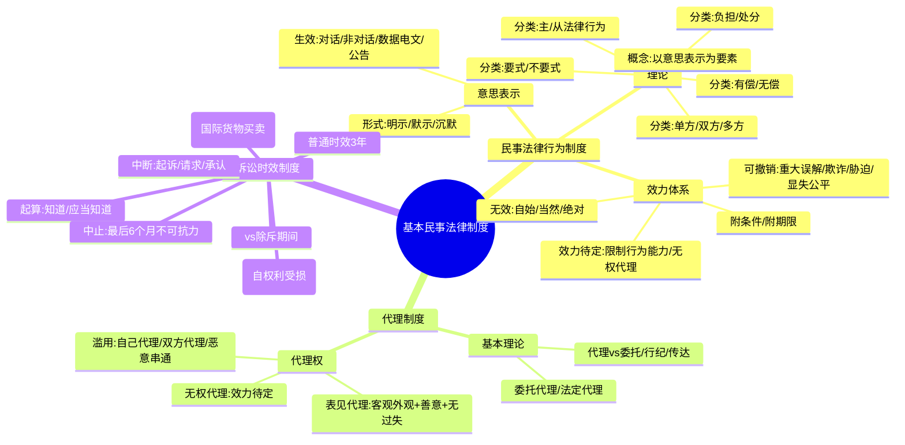

## 📍 章节定位

| 项目 | 信息 |
|------|------|
| **所属科目** | ⚖️ 经济法 |
| **难度等级** | ⭐⭐ |
| **历年分值** | 3-4分 |
| **建议学时** | 4-5h |

## 📝 考情分析

本章是经济法的基础章节，历年分值稳定在 3-4 分。命题以**单项选择题、多项选择题**为主，案例分析题中也可能涉及民事法律行为效力、诉讼时效等知识点。

近年命题热点集中在：(1) 民事法律行为效力体系（无效、可撤销、效力待定的辨析）；(2) 可撤销民事法律行为的种类及撤销权存续期间（重大误解 90 日、其他 1 年、最长 5 年）；(3) 表见代理的构成要件与法律后果；(4) 无权代理的效力待定处理；(5) 诉讼时效的中止与中断；(6) 诉讼时效与除斥期间的区别。

本章是民法部分的"地基"，知识点直接影响后续物权法、合同法、公司法等章节的理解。考生应重点掌握"民事法律行为效力四分类"和"诉讼时效中止与中断"两大高频考点，注意区分撤销权除斥期间（90 日/1 年/5 年）与诉讼时效期间（3 年/20 年）。

## 🧠 知识框架

## 📖 核心精讲

### 一、民事法律行为理论

**民事法律行为**是民事主体通过意思表示设立、变更、终止民事法律关系的行为（《民法典》第一百三十三条）。两大特征：(1) 以意思表示为要素；(2) 以设立、变更或终止权利义务为目的。

**民事法律行为分类**：

| 分类标准 | 类型 | 说明 |
|----------|------|------|
| 意思表示主体 | 单方/双方/多方 | 单方如撤销权行使；双方如合同；多方如决议 |
| 是否给付代价 | 有偿/无偿 | 区分意义：责任轻重、撤销权主张条件不同 |
| 行为效果 | 负担/处分 | 负担产生债法义务；处分直接导致权利变动 |
| 形式要求 | 要式/不要式 | 票据行为为法定要式 |
| 是否独立 | 主/从 | 担保合同是从合同，效力依附主合同 |

### 二、意思表示

意思表示包括**意思**（效果意思）和**表示**（外部表现）两个方面。

**意思表示的生效**：

| 类型 | 生效时点 |
|------|----------|
| 无相对人（如遗嘱、抛弃动产） | 完成时生效 |
| 有相对人·对话方式 | 相对人知道其内容时生效 |
| 有相对人·非对话方式 | 到达相对人时生效 |
| 数据电文（指定系统） | 进入特定系统时生效 |
| 数据电文（未指定系统） | 相对人知道或应当知道进入其系统时生效 |
| 公告方式 | 公告发布时生效 |

> **沉默的特殊规则**：沉默只有在有法律规定、当事人约定或者符合当事人之间的交易习惯时，才可以视为意思表示。如《民法典》第一千一百二十四条规定，继承开始后，继承人放弃继承应在遗产处理前以书面形式作出；没有表示的，视为接受继承。

意思表示可以撤回，撤回通知应在意思表示到达相对人前或同时到达。

### 三、民事法律行为的效力（高频考点）

民事法律行为的效力体系是本章核心，分为**有效、无效、可撤销、效力待定**四种状态。

#### （一）民事法律行为的有效要件

**实质要件**：(1) 行为人具有相应的民事行为能力；(2) 意思表示真实；(3) 不违反法律、行政法规的强制性规定，不违背公序良俗。

> 《民法典》第五百零五条：当事人超越经营范围订立的合同，不得仅以超越经营范围为由确认合同无效。

**形式要件**：民事法律行为可以采用书面形式、口头形式或者其他形式。形式包括口头形式、书面形式（含数据电文）、推定形式、沉默形式。

#### （二）无效民事法律行为

**特征**：自始无效、当然无效、绝对无效。

**种类**（5 类）：

| 种类 | 法条依据 | 关键要点 |
|------|----------|----------|
| 无民事行为能力人独立实施 | 《民法典》第144条 | 必须由法定代理人代理 |
| 虚假意思表示 | 《民法典》第146条 | 行为人与相对人以虚假意思表示实施的行为无效；隐藏行为的效力依有关法律规定处理 |
| 恶意串通损害他人合法权益 | 《民法典》第154条 | 当事人意思真实但非法，无效 |
| 违反强制性规定 | 《民法典》第153条第1款 | 但该强制性规定不导致行为无效的除外 |
| 违背公序良俗 | 《民法典》第153条第2款 | — |

> **不认定无效的例外情形**：(1) 强制性规定旨在维护政府税收、土地出让金等国家利益，认定合同有效不影响规范目的；(2) 旨在维护其他民事主体合法利益而非合同当事人权益；(3) 旨在要求一方加强风险控制、内部管理，对方无能力或无义务审查；(4) 一方订立时违反但订立后具备补正条件却违背诚信不予补正；(5) 强制性规定旨在规制合同订立后的履行行为。

#### （三）可撤销民事法律行为

**与无效民事法律行为的区别**：

| 区别点 | 可撤销 | 无效 |
|--------|--------|------|
| 成立后效力 | 撤销前已生效 | 自始无效 |
| 主张主体 | 仅撤销权人 | 司法/仲裁机构可主动宣告 |
| 行为效果 | 撤销后溯及无效；不行使则终局有效 | 自始、绝对无效 |
| 时间限制 | 有除斥期间 | 无时间限制 |

**四种类型**：

| 类型 | 关键要点 | 撤销权除斥期间 |
|------|----------|----------------|
| **重大误解** | 对行为性质、对方当事人、标的物品种质量规格数量等产生错误认识；按通常理解如果不发生该错误就不会作出意思表示；古玩市场交易等基于交易习惯不构成重大误解 | 自知道或应当知道撤销事由之日起 **90 日** |
| **受欺诈** | 故意告知虚假情况或负有告知义务的人故意隐瞒真实情况；第三人欺诈，对方知道或应当知道的，可撤销 | 1 年 |
| **受胁迫** | 给自然人及其近亲属人身/财产权利等造成损害要挟，迫使其基于恐惧作出意思表示；可来自相对人或第三人 | 自胁迫行为终止之日起 **1 年** |
| **显失公平** | 一方利用对方处于**危困状态**、**缺乏判断能力**等情形，致使成立时权利义务明显违反公平原则；以民事法律行为成立时为判断时间点 | 1 年 |

> **撤销权存续期间**（《民法典》第152条）：(1) 一般情形自知道或应当知道撤销事由之日起 1 年内；(2) 重大误解为 90 日；(3) 受胁迫自胁迫行为终止之日起 1 年；(4) 当事人知道撤销事由后明确表示或以行为表明放弃撤销权的，撤销权消灭；(5) 自民事法律行为发生之日起 **5 年**内没有行使的，撤销权消灭（最长保护期）。

撤销权性质上属于**形成权**，应依诉行使（向人民法院或仲裁机构提出）。

#### （四）效力待定民事法律行为

**两类**：

1. **限制民事行为能力人依法不能独立实施的行为**（《民法典》第145条）
   - 法定代理人追认权（形成权），追认意思表示自到达相对人时生效
   - 相对人催告权：法定代理人在 **30 日**内予以追认；未作表示的，视为拒绝追认
   - 善意相对人撤销权：合同被追认前可撤销，撤销应以通知方式作出

2. **无权代理人实施的行为**（《民法典》第171条）
   - 行为人没有代理权、超越代理权或代理权终止后实施代理行为
   - 被代理人追认权；相对人催告权（30 日内追认，未作表示视为拒绝）
   - 善意相对人撤销权
   - 被代理人已经开始履行义务的，视为追认

#### （五）附条件与附期限

| 类型 | 是否确定发生 | 分类 |
|------|--------------|------|
| **附条件** | 不确定事实 | 延缓条件（生效条件）/解除条件（消灭条件） |
| **附期限** | 必然到来的事实 | 延缓期限（始期）/解除期限（终期） |

> **条件特征**：(1) 将来发生的事实；(2) 将来不确定的事实；(3) 双方当事人约定；(4) 必须合法；(5) 可能发生的事实。条件不可能发生，约定为生效条件的，行为不发生效力；约定为解除条件的，视为未附条件。

> **拟制规则**（《民法典》第159条）：当事人为自己的利益不正当地阻止条件成就的，视为条件已成就；不正当地促成条件成就的，视为条件不成就。

### 四、代理制度

#### （一）代理的概念与特征

**代理**是代理人在代理权限内，以被代理人名义与第三人实施民事法律行为，由此产生的法律后果直接由被代理人承担的制度。

主体三方：代理人、被代理人（本人）、第三人（相对人）。关系三重：代理权关系、代理行为关系、后果承受关系。

**四大特征**：(1) 代理行为是民事法律行为；(2) 代理人以被代理人名义实施；(3) 代理人在代理权限内独立为意思表示；(4) 法律效果归属于被代理人。

> 不得代理的行为：依照法律规定、当事人约定或民事法律行为性质应当由本人亲自实施的行为，如立遗嘱、结婚等，不得代理。

#### （二）代理与相关概念的区别

| 区别点 | 代理 | 委托 | 行纪 | 传达 |
|--------|------|------|------|------|
| 名义 | 被代理人名义 | 委托人或自己名义 | 行纪人自己名义 | — |
| 事务性质 | 必为民事法律行为 | 可为事务性行为 | 商业活动 | 忠实传递意思 |
| 效果归属 | 直接归属被代理人 | 看名义 | 先归行纪人，再转移 | — |
| 是否独立意思表示 | 是 | 是 | 是 | 否 |
| 是否需行为能力 | 需要 | — | — | 不需要 |
| 身份行为 | 不得代理 | — | — | 可借助传达 |

#### （三）代理权的滥用

| 类型 | 法律效果 |
|------|----------|
| **自己代理** | 代理人以被代理人名义与自己实施民事法律行为；效力待定，被代理人同意或追认的除外（《民法典》第168条第1款） |
| **双方代理** | 代理人同时代理双方实施民事法律行为；效力待定，被代理的双方同意或追认的除外（《民法典》第168条第2款） |
| **代理人与第三人恶意串通** | 损害被代理人合法权益的，代理人和相对人承担**连带责任** |

#### （四）无权代理

无权代理包括三种情形：没有代理权、超越代理权、代理权终止后的代理。

**法律效果**：效力待定。

- 被代理人追认权（形成权）：追认后产生与有权代理相同的法律后果
- 相对人催告权：30 日内追认，未作表示视为拒绝追认
- 善意相对人撤销权：在被代理人追认前可撤销
- 被代理人已经开始履行义务的，视为追认
- 行为未被追认的，善意相对人有权请求行为人履行债务或赔偿损害（赔偿范围不得超过被代理人追认时相对人所能获得的利益）
- 相对人知道或应当知道无权代理的，相对人和行为人按各自过错承担责任

#### （五）表见代理（高频考点）

**表见代理**指无权代理人的代理行为客观上存在使相对人相信其有代理权的情况，且相对人主观上为善意，因而可以向被代理人主张代理的效力（《民法典》第172条）。

**四个构成要件**：

1. 代理人无代理权（如有权代理则不发生表见代理）
2. 相对人主观上为善意且无过失
3. 客观上存在使相对人相信无权代理人有代理权的情况（代理权外观，如持有介绍信或盖有印章的空白合同书）
4. 相对人基于该客观情形与无权代理人成立民事法律行为

**法律效果**：产生与有权代理一样的效果，被代理人应受拘束，不得以无权代理作为抗辩事由主张代理行为无效。

> **表见代理 vs 无权代理**：表见代理是绝对有效，被代理人不能拒绝；无权代理是效力待定，被代理人可以追认或拒绝。

### 五、诉讼时效制度

#### （一）诉讼时效的概念

**诉讼时效**是请求权不行使达一定期间而失去国家强制力保护的制度。属于法律事实中的事件。

**三大特点**：
1. 有债权人不行使权利的事实状态持续一段期间
2. **诉讼时效届满不消灭债权人实体权利**，只是让债务人产生抗辩权（不丧失起诉权；当事人未提出抗辩，法院不主动适用；一审未提二审原则上不支持，但有新证据除外；时效届满后自愿履行或同意履行的，再以时效抗辩不予支持）
3. 诉讼时效具有强制性，当事人对诉讼时效利益的预先放弃无效

**不适用诉讼时效的请求权**（《民法典》第196条）：
- 请求停止侵害、排除妨碍、消除危险
- 不动产物权和登记的动产物权的权利人请求返还财产
- 请求支付抚养费、赡养费或扶养费
- 依法不适用诉讼时效的其他请求权

> 另：支付存款本金及利息请求权；兑付国债、金融债券、向不特定对象发行的企业债券本息请求权；基于投资关系产生的缴付出资请求权，也不适用。

#### （二）诉讼时效 vs 除斥期间

| 区别点 | 诉讼时效 | 除斥期间 |
|--------|----------|----------|
| 适用对象 | 一般适用于债权请求权 | 一般适用于形成权（追认权、解除权、撤销权等） |
| 援用主体 | 当事人主张后法院才能审查（法院不主动援用） | 法院可主动审查 |
| 法律效力 | 届满后债务人有抗辩权，债权人实体权利不消灭 | 届满后实体权利消灭 |
| 是否可中断/中止 | 可适用 | 不适用 |

#### （三）诉讼时效的种类

| 种类 | 期间 | 起算点 | 适用 |
|------|------|--------|------|
| 普通诉讼时效 | **3 年** | 自权利人知道或应当知道权利受到损害以及义务人之日起 | 一般民事权利 |
| 长期诉讼时效 | 4 年 | 同上 | 国际货物买卖合同和技术进出口合同争议（《民法典》第594条） |
| 最长诉讼时效 | **20 年** | 自权利受到损害之日起 | 适用延长，但不适用中断、中止 |

#### （四）诉讼时效的中止

**概念**：在诉讼时效进行中，因法定事由使权利人无法行使请求权，暂时停止计算诉讼时效期间。

**时间要求**：在诉讼时效期间的**最后 6 个月内**发生中止事由。如最后 6 个月前发生障碍，到最后 6 个月时已消除，不能中止；如最后 6 个月时尚未消除，自最后 6 个月开始时起中止。

**法定事由**（《民法典》第194条）：
1. 不可抗力
2. 无民事行为能力人或限制民事行为能力人没有法定代理人，或法定代理人死亡、丧失民事行为能力、丧失代理权
3. 继承开始后未确定继承人 or 遗产管理人
4. 权利人被义务人或其他人控制
5. 其他导致权利人不能行使请求权的障碍

**法律效力**：自中止时效的原因消除之日起满 **6 个月**，诉讼时效期间届满。

#### （五）诉讼时效的中断

**概念**：因法定事由致使已经进行的诉讼时效期间全部归于无效，诉讼时效期间重新计算。

**法定事由**（《民法典》第195条）：
1. **权利人向义务人提出履行请求**（包括送交主张权利文书、发送信件或数据电文、金融机构扣收欠款本息、刊登主张权利公告、对部分债权主张权利等）
2. **义务人同意履行义务**（分期履行、部分履行、提供担保、请求延期履行、制定清偿债务计划等）
3. **权利人提起诉讼或申请仲裁**
4. 与提起诉讼或申请仲裁具有同等效力的其他情形（申请支付令、申请破产、申报破产债权、申请宣告失踪或死亡、申请诉前财产保全、申请强制执行、申请追加当事人、在诉讼中主张抵销等）

**特殊中断情形**：
- 连带债权人/债务人中一人发生中断效力的事由，对其他连带债权人/债务人也发生中断效力
- 债权人提起代位权诉讼的，对债权人债权和债务人债权均发生中断效力
- 债权转让的，诉讼时效从债权转让通知到达债务人之日起中断
- 债务承担情形下，构成原债务人对债务承认的，从债务承担意思表示到达债权人之日起中断

**法律效力**：诉讼时效重新起算，已经过的期间失去意义。

> **中止 vs 中断的区别**：中止是"暂停"（事由发生在最后 6 个月内，事由消除后剩 6 个月）；中断是"重新开始"（已经过的期间全部作废）。

## 💡 典型例题

**【例题 1】（单项选择题）**

根据民事法律制度的规定，下列关于可撤销民事法律行为的表述中，正确的是（ ）。

A. 重大误解的当事人自知道或者应当知道撤销事由之日起 1 年内没有行使撤销权的，撤销权消灭
B. 受胁迫的当事人自胁迫行为发生之日起 1 年内没有行使撤销权的，撤销权消灭
C. 显失公平的民事法律行为，当事人自民事法律行为发生之日起 5 年内没有行使撤销权的，撤销权消灭
D. 当事人知道撤销事由后明确表示放弃撤销权的，仍可在 1 年内行使撤销权

**答案**：C

**解析**：A 错误，重大误解的撤销权除斥期间为 90 日，不是 1 年；B 错误，受胁迫的撤销权自胁迫行为**终止**之日起 1 年内，而非胁迫行为发生之日起；C 正确，自民事法律行为发生之日起 5 年内没有行使撤销权的，撤销权消灭（最长保护期）；D 错误，当事人知道撤销事由后明确表示放弃撤销权的，撤销权消灭。

**【例题 2】（单项选择题）**

下列关于表见代理的表述中，正确的是（ ）。

A. 表见代理属于无效民事法律行为
B. 表见代理的法律效果由代理人和被代理人承担连带责任
C. 相对人主观上为善意且无过失是表见代理的构成要件之一
D. 被代理人可以无权代理为由主张代理行为无效

**答案**：C

**解析**：A 错误，表见代理产生与有权代理一样的效果，是有效的；B 错误，表见代理的法律效果直接由被代理人承担；C 正确，相对人主观上为善意且无过失是表见代理的构成要件；D 错误，被代理人不得以无权代理作为抗辩事由。

**【例题 3】（案例分析题）**

2024 年 3 月 1 日，甲公司业务员王某持甲公司盖有公章的空白合同书与乙公司签订了一份价值 50 万元的买卖合同。事实上，王某已于 2024 年 1 月底从甲公司离职，甲公司未通知乙公司。乙公司依约发货后，甲公司以王某已离职、无权代理为由拒绝付款。

**问题**：甲公司拒绝付款的理由是否成立？说明理由。

**答案**：不成立。理由：王某的行为构成表见代理。王某虽已离职无代理权，但其持有甲公司盖有公章的空白合同书，客观上存在使相对人乙公司相信其有代理权的情形；乙公司不知王某已离职（甲公司未通知），主观上为善意且无过失；乙公司基于该客观情形与王某签订了买卖合同。表见代理产生与有权代理一样的效果，被代理人甲公司应受拘束，不得以无权代理为由主张代理行为无效，故甲公司应向乙公司付款。

## 🎯 记忆口诀

**口诀一：民事法律行为效力四分类**
> 有效三要件：能力、真实、不违法；
> 无效五类型：无行能、虚假意、恶意串、违强制、背公序；
> 可撤销四类：误解、欺诈、胁迫、显失公；
> 效力待定两：限行能、无权代。

**口诀二：撤销权除斥期间**
> 误解九十其他年，胁迫终止一年算；
> 行为发生五年整，最长保护不过期。

**口诀三：诉讼时效中止 vs 中断**
> 中止最后六个月，事由消除再加六；
> 中断重新开始算，已经过的全作废；
> 中止暂停像休息，中断清零像重启。

**口诀四：表见代理四要件**
> 无权代理是前提，善意无过失要牢记；
> 客观外观存在权，行为成立才构成。

## ✅ 同步练习

**1. （单选）下列关于意思表示生效的表述中，根据《民法典》正确的是（ ）。**
A. 无相对人的意思表示，到达相对人时生效
B. 以对话方式作出的意思表示，相对人知道其内容时生效
C. 以非对话方式作出的意思表示，行为作出时生效
D. 以公告方式作出的意思表示，公告发布后合理期限生效

**2. （单选）根据《民法典》规定，下列各项中属于无效民事法律行为的是（ ）。**
A. 限制民事行为能力人依法不能独立实施的民事法律行为
B. 8 周岁的未成年人独立实施的购买作业本的民事法律行为
C. 行为人以虚假意思表示实施的民事法律行为
D. 显失公平的民事法律行为

**3. （多选）根据代理法律制度的规定，下列关于无权代理的说法中正确的有（ ）。**
A. 无权代理经被代理人追认，对被代理人发生法律效力
B. 相对人可以催告被代理人自收到通知之日起 30 日内予以追认
C. 被代理人未作表示的，视为拒绝追认
D. 善意相对人在被代理人追认前有权撤销，撤销应以诉讼方式作出

**4. （单选）下列关于诉讼时效的表述中，正确的是（ ）。**
A. 诉讼时效期间届满，债权人实体权利消灭
B. 人民法院应主动适用诉讼时效规定进行裁判
C. 当事人在一审期间未提出诉讼时效抗辩，在二审期间提出的，人民法院不予支持，但基于新的证据能够证明对方请求权已过诉讼时效期间的除外
D. 诉讼时效期间届满后，债务人自愿履行义务后又以诉讼时效届满为由抗辩的，人民法院应予支持

**5. （单选）根据《民法典》规定，自权利受到损害之日起超过（ ）的，人民法院不予保护。**
A. 3 年
B. 4 年
C. 20 年
D. 5 年

---

**参考答案**：1.B 2.C 3.ABC 4.C 5.C
