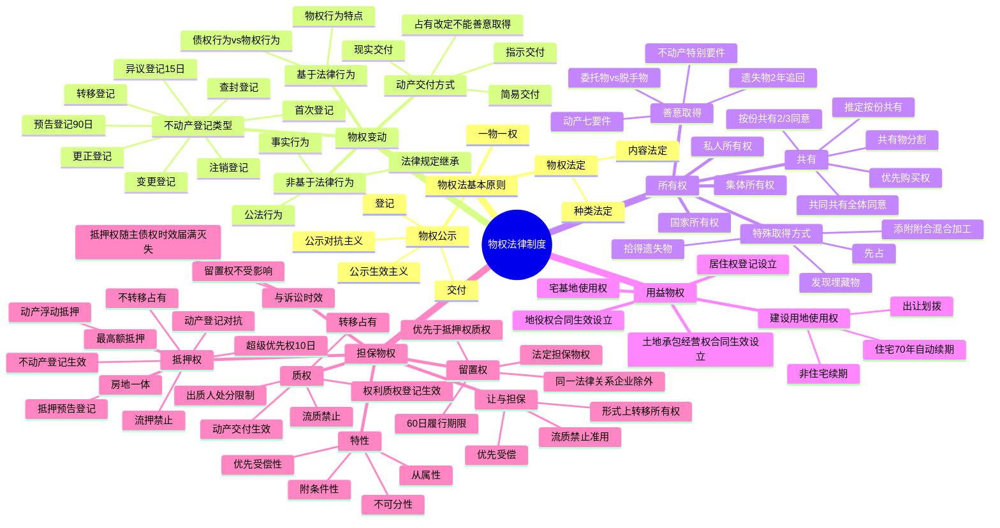

## 1. 章节定位

| 项目 | 信息 |
|------|------|
| 所属科目 | 经济法 |
| 难度等级 | 4 |
| 历年分值 | 6-8 分 |
| 建议学时 | 8-10 小时 |
| 知识关联章节 | 第1章 法律基本原理（绝对法律关系）；第2章 基本民事法律制度（物权行为、处分行为）；第4章 合同法律制度（合同效力与物权变动区分）；第6章 公司法律制度（股权出质）；第8章 企业破产法律制度（别除权、抵押预告登记）；第9章 票据与支付结算法律制度（票据质权） |

## 2. 考情分析

本章是经济法科目的重点章节之一，分值约 6-8 分。命题以主观题（案例分析题）为主，常与合同法结合考查"买卖合同 + 物权变动 + 善意取得"综合题；客观题则集中在物权变动公示方式、抵押权设立、留置权优先受偿等知识点。

**命题规律**：本章命题注重理论与实务结合，重点考查物权变动规则（动产交付、不动产登记）、善意取得制度、共有物处分、抵押权设立与实现、流押流质禁止、担保物权竞合等。近年命题趋势是结合《民法典担保制度解释》（2021 年）的新规则出题，如动产抵押正常经营活动中买受人规则、抵押预告登记、价款超级优先权、让与担保等。

**高频考点分布**：

1. **物权法基本原则**：物权法定（种类法定、内容法定）、一物一权、物权公示（交付、登记）；公示生效主义 vs 公示对抗主义。
2. **物权变动**：动产交付（现实交付、简易交付、指示交付、占有改定——不能用于善意取得）；不动产登记（首次、变更、转移、注销、更正、异议、预告、查封登记）；非基于法律行为的物权变动（事实行为、法律规定、公法行为）。
3. **所有权**：国家所有权、集体所有权、私人所有权；共有（按份共有 vs 共同共有、推定规则、重大修缮 2/3 同意或全体同意、按份共有人优先购买权、共有物分割）；善意取得（动产七要件、不动产特别要件、脱手物与委托物）；添附（附合、混合、加工）。
4. **用益物权**：土地承包经营权、建设用地使用权（出让与划拨、住宅 70 年自动续期、非住宅续期规则）、宅基地使用权、居住权、地役权。
5. **担保物权总论**：从属性、附条件性、优先受偿性、不可分性；担保物权与诉讼时效（抵押权随主债权时效届满而灭失、留置权不受影响）；担保物权消灭事由。
6. **抵押权**：可抵押财产、禁止抵押财产、动产浮动抵押（财产确定四情形）、房地一体原则；抵押权设立（不动产登记生效、动产登记对抗）；抵押物转让规则；流押禁止；抵押权实现顺序；抵押预告登记；动产抵押的超级优先权（价款 10 日内登记）；最高额抵押（债权确定六情形）。
7. **质权**：动产质权（交付生效）、权利质权（汇票本票支票、债券存款单、仓单提单、基金份额股权、知识产权、应收账款）；流质禁止；出质人处分限制。
8. **留置权**：法定担保物权；成立要件（合法占有、债权届清偿期、同一法律关系——企业之间除外）；留置权优先于抵押权、质权；60 日履行期限。
9. **让与担保**：形式上转移所有权、流质禁止准用、债务人不履行时债权人优先受偿。

**联动考查方式**：

- 与第4章合同法律制度联动：买卖合同 + 物权变动 + 善意取得；多重买卖的履行顺序；租赁与抵押的冲突（在后抵押不破在先租赁）；
- 与第8章破产法律制度联动：抵押预告登记在破产中的效力；别除权；
- 与第6章公司法律制度联动：股权出质、股权善意取得。

**备考建议**：

- 物权变动公示方式必须精准记忆：动产交付为原则、不动产登记为原则；特殊动产（船舶、航空器、机动车）登记对抗；
- 善意取得七要件是核心：法律行为 + 无处分权 + 善意 + 合理价格 + 已交付/已登记 + 委托物 + 转让合同有效；
- 共有物处分规则：按份共有 2/3 以上同意、共同共有全体同意；按份共有人优先购买权只能在同等条件下行使；
- 抵押权与质权的区分：抵押不转移占有，质权必须转移占有；抵押权不动产登记生效、动产登记对抗，质权交付或登记生效；
- 担保物权竞合规则：留置权 > 质权/抵押权（动产上）；登记的抵押权 > 未登记的抵押权 > 普通债权；
- 流押流质禁止的实质：履行期届满前约定"不履行则财产归债权人"无效，但可就财产优先受偿。

## 3. 知识框架

## 4. 核心精讲

### 4.1 物权法律制度概述

#### 4.1.1 物的概念与种类

物权法上的物指的是**有体物**，是除人的身体之外，凡能为人力所支配、独立满足人类社会生活需要之物。物权法上的物具有以下特点：①有体性（行为、智力成果、权利均不是物权法上的物，但权利经法律特别规定可成为物权客体，如股权、票据权利出质构成权利质权）；②可支配性；③在人的身体之外（人体器官如脱离人的身体则可成为物）。

**物的种类**：

1. **流通物、限制流通物与禁止流通物**——按流通性分类。《民法典》第二百四十二条规定："法律规定专属于国家所有的不动产和动产，任何组织或者个人不能取得所有权。"
2. **动产与不动产**——不可移动或移动将损害其价值的物为不动产（土地、海域、房屋、林木等地上定着物）；动产是指不动产以外的物。区分意义：物权变动要求有别（动产交付、不动产登记）；确定诉讼管辖（不动产纠纷由不动产所在地法院管辖）。
3. **可替代物与不可替代物**——该分类仅限于动产。区分意义：可替代物可同类物替代履行；不可替代物一旦损害只能金钱赔偿。
4. **消费物与非消费物**——该分类仅限于动产。消费物的使用权人一般是所有权人；以让与为目的的消费物（金钱）移转占有即移转所有权。
5. **可分物与不可分物**——分割共有物时，可分物可进行实物分割。
6. **主物与从物**——在无法律特别规定或当事人特别约定时，从物的权利归属与主物一致。
7. **原物与孳息物**——孳息分天然孳息与法定孳息。《民法典》第三百二十一条规定："天然孳息，由所有权人取得；既有所有权人又有用益物权人的，由用益物权人取得。当事人另有约定的，按照其约定。法定孳息，当事人有约定的，按照约定取得；没有约定或者约定不明确的，按照交易习惯取得。"

#### 4.1.2 物权的概念与特点

根据《民法典》第一百一十四条第二款规定，**物权**是权利人依法对特定的物享有直接支配和排他的权利。与债权相比，物权具有以下特点：

| 特点 | 物权 | 债权 |
|------|------|------|
| 支配性 | 支配权，无须第三人协助 | 请求权，有赖于债务人履行 |
| 排他性 | 一物之上只能成立一项所有权 | 兼容性，双重买卖均可有效 |
| 绝对性 | 对抗所有人，绝对权/对世权 | 仅对特定债务人，相对权/对人权 |

**物权的种类**：①自物权（所有权，完全物权）和他物权（用益物权、担保物权，限制物权）；②用益物权（针对使用价值）和担保物权（针对交换价值）；③动产物权与不动产物权；④独立物权（所有权、土地使用权）与从物权（担保物权从属于债权，地役权从属于需役地）。

#### 4.1.3 物权法律制度的基本原则

**（一）物权法定原则**

《民法典》第一百一十六条规定："物权的种类和内容，由法律规定。"此称物权法定原则，包括两方面含义：①**种类法定**——不得创设民法或其他法律所不承认的物权；②**内容法定**——不得创设与物权法定内容相异的内容。

物权法定原则旨在限制当事人的物权创设自由，原因在于物权具有绝对效力，如果允许当事人任意设置，可能不利于交易安全。债权则不同，其效力仅及于当事人自己，属于相对权，故债权内容可由当事人自由设定，债权类型亦为开放。

《民法典》第一百一十六条所称"法律"，**不限于《民法典》，包括一切由全国人大及其常务委员会制定的"法律"，但不包括行政法规与地方性法规，亦不包括司法解释与司法判例**。

**物权法定原则的效力**：①违反种类法定，在法定物权种类之外创设物权，该物权创设行为无效（但物权法上无效的约定在合同法上仍可能有效，可主张违约责任）；②设定与法定物权相异的内容，该设定行为无效（如质权不转移占有则无效）。

**（二）物权客体特定原则（一物一权原则）**

物权只存在于确定的一物之上，物尚未存在或尚未确定不可能存在物权；一项行为亦只能处分一物。一物一权原则与以下情形并不矛盾：①多人共同对一物享有一项物权；②在一物之上成立数个互不冲突的物权（如所有权与他物权共容、用益物权与担保物权共容）。

**（三）物权公示原则**

物权以法定方式公之于外，称公示原则。公示方式依动产、不动产而有不同：**动产以交付占有为公示手段，不动产以登记为公示手段**。《民法典》第二百零八条规定："不动产物权的设立、变更、转让和消灭，应当依照法律规定登记。动产物权的设立和转让，应当依照法律规定交付。"

**公示的效力**：

1. **物权移转效力**——若通过交付移转动产的占有，则推定为动产物权移转；若通过登记变更登记权利人，则推定为不动产物权移转。根据公示对物权移转效力的影响程度不同，有公示生效主义与公示对抗主义两种立场：
   - **公示生效主义**：物权移转，非经法定公示不得生效。动产原则上公示生效。不动产物权原则上须经依法登记才能发生效力，未经登记不发生效力。
   - **公示对抗主义**：物权的享有与变动只需当事人意思即为已足，不以公示为前提。公示的效力只在于对抗第三人。例如，土地承包经营权自土地承包经营合同生效时设立，未经登记不得对抗善意第三人；地役权自地役权合同生效时设立；动产抵押自抵押合同生效时设立，未经登记不得对抗善意第三人。
2. **物权推定效力**——动产占有人被推定为动产所有权人，不动产登记簿上记载的权利人及其所享有的权利被推定为真实。《民法典》第二百一十七条规定："不动产权属证书是权利人享有该不动产物权的证明。不动产权属证书记载的事项，应当与不动产登记簿一致；记载不一致的，除有证据证明不动产登记簿确有错误外，以不动产登记簿为准。"
3. **公信效力**——如果采用公示生效主义立场，法定公示方式为权利变动与享有的法律表征，第三人有理由对其表示信赖，因而，公示能够产生公信力。公信效力是善意取得的必要条件。

### 4.2 物权变动

#### 4.2.1 物权变动的形态与原因

**物权变动**是指物权的发生（取得、设定）、变更或消灭。

**物权取得**分原始取得与继受取得：原始取得非自他人之手继受而来（如先占无主物、收取孳息、建造房屋）；继受取得（传来取得）自前手继受而来，可能是移转型（所有权让与）或创设型（设立限制物权）。

**物权变动的原因**分两大类：基于法律行为的物权变动；非基于法律行为的物权变动。

**非基于法律行为的物权变动**主要包括三类：①基于事实行为——《民法典》第二百三十一条规定，因合法建造、拆除房屋等事实行为设立或者消灭物权的，自事实行为成就时发生效力；②基于法律规定——《民法典》第二百三十条规定，因继承取得物权的，自继承开始时发生效力；③基于公法行为——《民法典》第二百二十九条规定，因人民法院、仲裁机构的法律文书或者人民政府的征收决定等，导致物权设立、变更、转让或者消灭的，自法律文书或者征收决定等生效时发生效力。

非基于法律行为的物权变动不必以公示为前提。但依《民法典》第二百三十二条规定，取得不动产物权之人再处分物权时，"依照法律规定需要办理登记的，未经登记，不发生物权效力"。

#### 4.2.2 物权行为

**债权行为**的效力在当事人之间确立债权债务关系；**物权行为**直接发生物权让与、变更或废止效力。物权行为的特点（与债权行为比较）：

| 比较项 | 债权行为 | 物权行为 |
|--------|---------|---------|
| 法律效果 | 不会直接引起积极财产减少，但消极财产（义务）增加 | 直接导致行为人积极财产减少 |
| 处分权 | 不要求处分权（出卖他人之物的买卖合同亦可有效） | 出让人需要对标的物具有处分权（无权处分效力待定） |
| 兼容性 | 可反复作出，同一标的物上数个买卖合同均可有效 | 同一物只能被转让一次 |

《民法典》第五百九十七条第一款规定："因出卖人未取得处分权致使标的物所有权不能转移的，买受人可以解除合同并请求出卖人承担违约责任。"

#### 4.2.3 物权变动的公示方式

**（一）动产物权变动的公示方式——交付**

《民法典》第二百二十四条规定："动产物权的设立和转让，自交付时发生效力，但是法律另有规定的除外。"交付有现实交付与交付替代两种形态：

| 交付方式 | 含义 | 法律依据 |
|---------|------|---------|
| 现实交付 | 将物直接交由对方占有 | — |
| 简易交付 | 动产物权设立和转让前，权利人已经占有该动产的，物权自民事法律行为生效时发生效力 | 《民法典》第226条 |
| 指示交付 | 动产物权设立和转让前，第三人占有该动产的，负有交付义务的人可以通过转让请求第三人返还原物的权利代替交付 | 《民法典》第227条 |
| 占有改定 | 动产物权转让时，当事人又约定由出让人继续占有该动产的，物权自该约定生效时发生效力 | 《民法典》第228条 |

**重要提示**：《民法典》第二百二十八条规定的**占有改定不能满足善意取得制度意义上的"交付"要求**——这是高频考点。

**（二）不动产物权变动的公示方式——登记**

《民法典》第二百零九条第一款规定："不动产物权的设立、变更、转让和消灭，经依法登记，发生效力；未经登记，不发生效力，但是法律另有规定的除外。"

我国实行**不动产统一登记制度**。需要登记的不动产物权包括：①集体土地所有权；②房屋等建筑物、构筑物所有权；③森林、林木所有权；④耕地、林地、草地等土地承包经营权；⑤建设用地使用权；⑥宅基地使用权；⑦海域使用权；⑧地役权；⑨抵押权；⑩法律规定需要登记的其他不动产权利。

**登记类型**：

| 类型 | 含义 |
|------|------|
| 首次登记 | 不动产权利第一次登记。未办理首次登记的，不得办理其他类型登记 |
| 变更登记 | 不动产登记事项发生不涉及权利转移的变更（权利人姓名、不动产坐落、用途、面积变更等） |
| 转移登记 | 不动产权利在不同主体之间发生转移（买卖、互换、赠与、作价出资、继承等） |
| 注销登记 | 不动产权利消灭（不动产灭失、权利人放弃、被没收征收收回等） |
| 更正登记 | 权利人、利害关系人认为登记簿记载事项错误，登记簿记载的权利人书面同意更正或有证据证明登记确有错误的，登记机构应当更正 |
| 异议登记 | 登记簿记载的权利人不同意更正的，利害关系人可申请异议登记。申请人在异议登记之日起 **15 日内**不起诉，异议登记失效 |
| 预告登记 | 当事人签订买卖房屋或其他不动产物权协议，为保障将来实现物权，可申请预告登记。**自能够进行不动产登记之日起 90 日内**未申请登记的，预告登记失效 |
| 查封登记 | 司法机关或行政机关依法裁定、决定查封或以其他形式限制不动产权利 |

### 4.3 所有权

#### 4.3.1 所有权的概念与类型

**所有权**是指在法律限制范围内，对物为全面支配的权利。《民法典》第二百四十条规定："所有权人对自己的不动产或者动产，依法享有占有、使用、收益和处分的权利。"四项权能：占有、使用、收益、处分（事实处分与法律处分）。

**所有权的法定分类**（按所有制划分）：

1. **国家所有权**：《民法典》第二百四十六条第一款规定："法律规定属于国家所有的财产，属于国家所有即全民所有。"第二款规定："国有财产由国务院代表国家行使所有权。"国家所有权的客体极为广泛：矿藏、水流、海域、无居民海岛，城市土地，法律规定属于国家所有的农村和城市郊区的土地，森林、山岭、草原、荒地、滩涂等自然资源，野生动植物资源，无线电频谱资源，文物，国防资产，铁路、公路、电力设施、电信设施和油气管道等基础设施。
2. **集体所有权**：《民法典》第二百六十一条规定："农民集体所有的不动产和动产，属于本集体成员集体所有。"包括三种形式：村集体所有、农村集体经济组织所有、乡（镇）集体所有。
3. **私人所有权**：《民法典》第二百六十六条规定："私人对其合法的收入、房屋、生活用品、生产工具、原材料等不动产和动产享有所有权。"此处所称私人，并不局限于自然人，民法上的法人尤其是营利法人亦包括在内。

#### 4.3.2 共有

物可为单一主体独自享有所有权，亦可在不作质的分割的情况下由数个主体共享，前者称单一所有，后者称共有。共有包括**按份共有**和**共同共有**。

**共有形态的推定**：共有人对共有的不动产或者动产没有约定为按份共有或者共同共有，或者约定不明确的，**除共有人具有家庭关系等外，视为按份共有**。

**共有的一般效力**：

1. 共有人按照约定管理共有的不动产或者动产；没有约定或者约定不明确的，各共有人都有管理的权利和义务。
2. 共有物的分割方式：达不成协议的，可分割且不因分割减损价值的，应当对实物予以分割；难以分割或会减损价值的，应当对折价或者拍卖、变卖取得的价款予以分割。共有人分割所得的不动产或者动产有瑕疵的，其他共有人应当分担损失。
3. 对外债权债务：因共有的不动产或者动产产生的债权债务，在对外关系上，共有人享有连带债权、承担连带债务，但法律另有规定或者第三人知道共有人不具有连带债权债务关系的除外。

**按份共有 vs 共同共有**：

| 比较项 | 按份共有 | 共同共有 |
|--------|---------|---------|
| 含义 | 对同一个所有权作量上分割，按份共有人按份额享有所有权 | 共同共有人对共有财产共同享有所有权，不分份额 |
| 重大修缮、变更性质或用途 | 经占份额 **2/3 以上**的按份共有人同意 | 经**全体共同共有人**同意 |
| 管理费用负担 | 按份额负担 | 共同负担 |
| 共有物分割 | 没有约定的可随时请求分割 | 共有的基础丧失或有重大理由时可请求分割 |
| 内部债权债务 | 按份额享有债权、承担债务，超额承担可追偿 | 共同享有债权、承担债务，无追偿问题 |
| 共有物处分 | 多数决（2/3 以上份额同意） | 全体一致同意 |
| 份额处分 | 可自由转让份额，其他共有人有优先购买权 | 不分份额，无份额转让问题 |

**按份共有人的优先购买权**：

1. 优先购买权以交易为前提——因继承、遗赠等非交易方式发生转让时，其他共有人不得主张优先购买。共有份额在共有人之间相互转让时，除非另有约定，其他共有人不得主张优先购买。
2. 优先购买权需在同等条件下行使——综合考虑转让价格、价款履行方式及期限等因素。
3. 优先购买权需在期限内行使——有约定按约定；没有约定或约定不明的，按通知载明期间；通知未载明或短于 15 日的，为 15 日；转让人未通知的，为知道或应当知道最终同等条件之日起 15 日；转让人未通知且无法确定的，为共有份额权属转移之日起 6 个月。
4. 两个以上按份共有人主张优先购买且协商不成时，按照转让时各自份额比例行使。
5. 其他按份共有人以优先购买权受到侵害为由，仅请求撤销共有份额转让合同或者认定该合同无效的，**不予支持**。

#### 4.3.3 善意取得制度

**善意取得制度**旨在保护交易安全，当真权利人与善意第三人及其所代表的交易安全之间发生利益冲突时，法律选择保护交易安全。《民法典》第三百一十一条第一款规定："无处分权人将不动产或者动产转让给受让人的，所有权人有权追回；除法律另有规定外，符合下列情形的，受让人取得该不动产或者动产的所有权：（1）受让人受让该不动产或者动产时是善意的；（2）以合理的价格转让；（3）转让的不动产或者动产依照法律规定应当登记的已经登记，不需要登记的已经交付给受让人。"

**（一）动产善意取得的构成要件**

1. **依法律行为转让所有权**——善意取得只能在交易中发生。其他非因法律行为而发生的物权变动，均不存在善意取得。
2. **转让人无处分权**——必以转让人无处分权为前提。
3. **受让人为善意**——指不知道转让人无处分权且对此不知无重大过失。第三人善意系推定，真权利人主张受让人不构成善意时，须负举证责任。**善意的判断时点以"受让动产时"为准**，一般以动产交付时为准。受让人受让动产时，交易的对象、场所或者时机等不符合交易习惯的，应当认定受让人具有重大过失。
4. **以合理的价格转让**——应根据转让标的物的性质、数量以及付款方式等具体情况，参考转让时交易地市场价格以及交易习惯等因素综合认定。
5. **物已交付**——动产以交付为所有权转移的标志。**占有改定不能满足善意取得制度意义上的"交付"要求**；转让人将船舶、航空器和机动车等特殊动产交付给受让人的，符合善意取得的交付要件。
6. **转让人基于真权利人意思合法占有标的物**——基于真权利人意思而合法占有之物，称**委托物**（如保管、承租）；非基于真权利人意思而占有之物称**脱手物**（如遗失物、盗窃物）。善意取得制度适用于委托物，不适用于脱手物。

**遗失物（脱手物）的特别规则**：《民法典》第三百一十二条规定："所有权人或者其他权利人有权追回遗失物。该遗失物通过转让被他人占有的，权利人有权向无处分权人请求损害赔偿，或者**自知道或者应当知道受让人之日起 2 年内**向受让人请求返还原物；但是受让人通过拍卖或者向具有经营资格的经营者购得该遗失物的，权利人请求返还原物时应当支付受让人所付的费用。权利人向受让人支付所付费用后，有权向无处分权人追偿。"

7. **转让合同有效**——《民法典物权编解释一》第二十条规定，转让合同无论是无效还是被撤销，标的物受让人均不得主张善意取得。

**（二）动产善意取得的法律效果**

1. **直接法律效果——所有权发生转移**：善意受让人取得标的物所有权，真权利人的所有权随之失去。善意受让人取得动产后，该动产上的原有权利消灭，但善意受让人在受让时知道或者应当知道该权利的除外。
2. **间接法律效果——赔偿请求权**：真权利人有权向无权处分之转让人请求损害赔偿。

**（三）不动产善意取得**

不动产善意取得的构成要件及法律效果与动产相似，特别之处：①**交付问题**——以登记为要件；②**善意问题**——具备下列情形之一时，应认定不动产受让人知道转让人无处分权从而不构成善意：登记簿上存在有效的异议登记；预告登记有效期内未经预告登记权利人同意；登记簿已记载司法机关或行政机关依法裁定、决定查封或以其他形式限制不动产权利；受让人知道登记簿记载的权利主体错误；受让人知道他人已经依法享有不动产物权。**特别法律效果**：善意取得不动产，不消除不动产上其他已登记之物权。

**（四）限制物权的善意取得**

《民法典》第三百一十一条第三款规定，限制物权的善意取得，参照所有权善意取得之规定适用。

#### 4.3.4 动产所有权的特殊取得方式

1. **先占**：以所有权人的意思占有无主动产，先占人取得无主动产的所有权。
2. **拾得遗失物**：发现他人遗失之物而实施占有。拾得行为不足以令拾得人取得所有权，负有归还权利人的义务。遗失物自发布招领公告之日起 **1 年内**无人认领的，归国家所有。拾得人虽不能取得所有权，却可享有费用偿还请求权；在遗失人发出悬赏广告时，还享有悬赏报酬请求权。
3. **发现埋藏物**：除法律另有规定外，参照拾得遗失物的有关规定适用。
4. **添附**：附合、混合与加工的总称。《民法典》第三百二十二条规定，因加工、附合、混合而产生的物的归属，有约定的按照约定；没有约定或约定不明确的依照法律规定；法律没有规定的，按照充分发挥物的效用以及保护无过错当事人的原则确定。
   - **附合**：动产附合于不动产（不动产所有人取得附合之物所有权）；动产附合于动产（按各动产附合时价值共有，但可视主物，由主物所有人取得合成物所有权）。
   - **混合**：所有权不属同一人的动产相互混杂，难以识别或分离。准用动产附合规则。
   - **加工**：在他人之动产上进行改造或劳作并生成新物。只要加工或改造的价值不明显低于材料价值，即取得新物所有权。
   - 因添附失去所有权之人，有权请求有过错之人或取得添附新物所有权之人赔偿损失。

### 4.4 用益物权

**用益物权**是以使用他人之物为目的的物权，对他人所有的不动产或者动产依法享有占有、使用和收益的权利。用益物权仅涉及物的使用价值，不包含处分权能。《民法典》规定的用益物权包括**土地承包经营权、建设用地使用权、宅基地使用权、居住权与地役权**。

| 用益物权 | 设立时点 | 登记效力 |
|---------|---------|---------|
| 土地承包经营权 | 自土地承包经营权合同生效时设立 | 互换、转让的，未经登记不得对抗善意第三人 |
| 建设用地使用权 | 自登记时设立 | 登记生效 |
| 宅基地使用权 | — | — |
| 居住权 | 自登记时设立 | 登记生效 |
| 地役权 | 自地役权合同生效时设立 | 未经登记不得对抗善意第三人 |

#### 4.4.1 建设用地使用权

《民法典》所称的建设用地使用权在《城市房地产管理法》中被称为土地使用权，两概念均指国有建设用地使用权。

**（一）建设用地使用权的取得**

1. **创设取得**——对应国有土地一级市场：
   - **无偿划拨**：县级以上人民政府依法批准，在土地使用者缴纳补偿、安置等费用后将该幅土地交付其使用，或将土地使用权无偿交付给土地使用者使用。可划拨的情形：国家机关用地和军事用地；城市基础设施用地和公益事业用地；国家重点扶持的能源、交通、水利等项目用地；法律、行政法规规定的其他用地。**用于商业开发的建设用地不得以划拨方式取得**。
   - **有偿出让**：国家将国有土地使用权在一定年限内出让给土地使用者，由土地使用者向国家支付土地使用权出让金。可采取拍卖、招标或者双方协议的方式。工业、商业、旅游、娱乐和商品住宅等经营性用地以及同一土地有两个以上意向用地者的，**应当采取招标、拍卖等公开竞价的方式出让**。

2. **移转取得**——对应国有土地二级市场：转让、互换、出资、赠与或抵押。

**住宅建设用地使用权期限届满的，自动续期**。续期费用的缴纳或者减免，依照法律、行政法规的规定办理。非住宅建设用地使用权期限届满后的续期，依照法律规定办理。

**出让最高年限**：①居住用地 70 年；②工业用地 50 年；③教育、科技、文化、卫生、体育用地 50 年；④商业、旅游、娱乐用地 40 年；⑤综合或者其他用地 50 年。

**（二）集体经营性建设用地**

2019 年修订后的《土地管理法》第六十三条规定，土地利用总体规划、城乡规划确定为工业、商业等经营性用途，并经依法登记的集体经营性建设用地，土地所有权人可以通过出让、出租等方式交由单位或者个人使用，并应当签订书面合同。出让、出租等应当经本集体经济组织成员的村民会议 **2/3 以上成员或者 2/3 以上村民代表的同意**。通过出让等方式取得的集体经营性建设用地使用权可以转让、互换、出资、赠与或者抵押。

### 4.5 担保物权

#### 4.5.1 担保物权概述

**担保物权**是以担保债权实现为目的的物权。担保物权人在债务人不履行到期债务或者发生当事人约定的实现担保物权的情形，依法享有就担保财产优先受偿的权利。《民法典》物权编担保物权分编规定了**抵押权、质权与留置权**三种担保物权。

**担保物权的分类**：意定担保物权（抵押权、质权，由当事人合意设立）与法定担保物权（留置权，符合法定要件时直接由法律设立）。

**担保物权的特性**：

1. **从属性**——担保物权自身不能独立存在，系从属于债权的从属物权，体现在成立、转让与消灭各个方面。成立上的从属性：若无旨在担保的债权，担保物权不能成立；转让上的从属性：担保物权不能脱离所担保的债权单独转让，所担保的债权转让时，担保物权随之转让；消灭上的从属性：担保物权随债的消灭而消灭。
2. **权利行使的附条件性**——担保物权被有效设立后不能被马上行使。行使条件是债务人不履行到期债务或者发生当事人约定的实现担保物权的情形。
3. **优先受偿性**——担保物权人可就担保物变价之后的价金优先于普通债权人得到清偿。
4. **不可分性**——物的分割、被担保之债的分割不导致担保物权分割；物部分灭失，剩余部分仍担保债之全部；债权部分清偿，不产生担保物权部分消灭之效力。

**担保物权与诉讼时效**：

- 主债权诉讼时效期间届满后，抵押权人主张行使抵押权的，人民法院不予支持；抵押人以主债权诉讼时效期间届满为由主张不承担担保责任的，人民法院应予支持。
- 主债权诉讼时效期间届满后，财产被留置的债务人或者对留置财产享有所有权的第三人请求债权人返还留置财产的，人民法院不予支持；债务人或第三人请求拍卖、变卖留置财产并以所得价款清偿债务的，人民法院应予支持。**留置权不因主债权诉讼时效届满而消灭**。
- 主债权诉讼时效期间届满的法律后果，以登记作为公示方式的权利质权，参照适用抵押权的规定；动产质权、以交付权利凭证作为公示方式的权利质权，参照适用留置权的规定。

**担保物权的消灭**：①主债权消灭；②担保物权实现；③债权人放弃担保物权；④法律规定担保物权消灭的其他情形。

#### 4.5.2 抵押权

**（一）抵押权的概念与抵押财产范围**

**抵押权**是指为担保债务的履行，债务人或者第三人不转移财产的占有，将该财产抵押给债权人，债务人不履行到期债务或者发生当事人约定的实现抵押权的情形，债权人有权就该财产优先受偿。抵押权不移转抵押物的占有，不影响使用，堪称最理想的担保物权。

**可抵押财产**（《民法典》第三百九十五条）：①建筑物和其他土地附着物；②建设用地使用权；③海域使用权；④生产设备、原材料、半成品、产品；⑤正在建造的建筑物、船舶、航空器；⑥交通运输工具；⑦法律、行政法规未禁止抵押的其他财产。另依《农村土地承包法》规定，土地经营权亦可抵押。

**禁止抵押的财产**：①土地所有权；②宅基地、自留地、自留山等集体所有的土地使用权，但法律规定可以抵押的除外；③学校、幼儿园、医院等以公益为目的的非营利法人的教育设施、医疗卫生设施和其他公益设施；④所有权、使用权不明或者有争议的财产；⑤依法被查封、扣押、监管的财产；⑥法律、行政法规规定不得抵押的其他财产。

**（二）动产浮动抵押**

企业、个体工商户、农业生产经营者可以将现有的以及将有的生产设备、原材料、半成品、产品抵押，债务人不履行到期债务或者发生当事人约定的实现抵押权的情形，债权人有权就**抵押财产确定时**的动产优先受偿。

**抵押财产确定情形**（《民法典》第四百一十一条）：①债务履行期届满，债权未实现；②抵押人被宣告破产或者解散；③当事人约定的实现抵押权的情形；④严重影响债权实现的其他情形。

**（三）房地一体原则**

土地与建筑物相互紧密结合，故在确定抵押财产时实行房地一体原则：以建筑物抵押的，该建筑物占用范围内的建设用地使用权一并抵押；以建设用地使用权抵押的，该土地上的建筑物一并抵押，但土地上的新增建筑物不作为抵押财产。乡镇、村企业的建设用地使用权不得单独抵押，以乡镇、村企业的厂房等建筑物抵押的，其占用范围内的建设用地使用权一并抵押。

**（四）抵押权的设定**

1. **抵押合同**：设立抵押权，当事人应当采取书面形式订立抵押合同。
2. **登记效力**：
   - **登记生效**：以建筑物和其他土地附着物、建设用地使用权、海域使用权以及正在建造的建筑物抵押的，**抵押权自登记时设立**。
   - **登记对抗**：以动产或者家庭承包方式取得的土地经营权抵押的，**抵押权自抵押合同生效时设立，未经登记，不得对抗善意第三人**。

**重要规则**：动产抵押即使已经登记，也**不得对抗正常经营活动中已支付合理价款并取得抵押财产的买受人**。

**（五）抵押担保的范围**

抵押权的担保范围包括主债权及其利息、违约金、损害赔偿金、保管担保财产和实现担保物权的费用。当事人另有约定的，按照约定。

**抵押物范围的特别处理**：①抵押物登记记载的内容与抵押合同约定的内容不一致的，以登记记载的内容为准；②抵押权设立后，抵押财产被添附的处理规则；③从物产生于抵押权设立前，抵押权效力及于从物，但当事人另有约定的除外；从物产生于抵押权设立后，抵押权效力不及于从物，但在抵押权实现时可一并处分；④以违法的建筑物抵押的，抵押合同无效（一审法庭辩论终结前已办理合法手续的除外）；⑤抵押人以划拨建设用地上的建筑物抵押，抵押权依法实现时，拍卖、变卖建筑物所得价款应当优先用于补缴建设用地使用权出让金。

**抵押物的物上代位**：担保期间，担保财产毁损、灭失或者被征收等，担保物权人可以按照原抵押权顺位就获得的保险金、赔偿金或者补偿金等优先受偿。

**（六）流押合同之禁止**

《民法典》第四百零一条规定："抵押权人在债务履行期限届满前，与抵押人约定债务人不履行到期债务时抵押财产归债权人所有的，**只能依法就抵押财产优先受偿**。"即当事人在抵押合同中约定债务履行期届满抵押权人未受清偿时抵押物的所有权转移为债权人所有的内容无效。该内容的无效不影响抵押合同其他部分内容的效力，抵押权人仍然可以对抵押财产进行合理折价或对其拍卖、变卖并就所得价款优先受偿。

**（七）抵押物转让及其限制**

抵押物的所有权人仍是抵押人，故除非当事人另有约定，否则抵押人有权转让抵押物所有权，抵押权的存续也不会因为抵押财产转让而受影响。具体规则：①抵押人转让抵押财产的，应当及时通知抵押权人；②抵押权人能够证明抵押财产转让可能损害抵押权的，可以请求抵押人将转让所得的价款向抵押权人提前清偿债务或者提存。

**当事人约定禁止或限制转让抵押财产**：①未将约定登记——抵押人违反约定转让抵押财产，抵押权人请求确认转让合同无效的，不予支持；抵押财产已经交付或者登记，抵押权人请求确认转让不发生物权效力的，不予支持，但是抵押权人有证据证明受让人知道的除外；抵押权人请求抵押人承担违约责任的，可依法予以支持。②已将约定登记——抵押人违反约定转让抵押财产，抵押权人请求确认转让合同无效的，不予支持；抵押财产已经交付或者登记，抵押权人主张转让不发生物权效力的，应予支持，但是因受让人代替债务人清偿债务导致抵押权消灭的除外。

**（八）抵押与租赁**

"在后抵押不破在先租赁"——抵押权设立前抵押财产已出租并转移占有的，原租赁关系不受该抵押权的影响，抵押权实现后，租赁合同在有效期内对抵押物的受让人继续有效。

**（九）抵押权的实现顺序**

同一抵押财产为数项债权设定抵押时：

1. 抵押权已登记的，**按照登记的先后顺序清偿**；
2. 抵押权已登记的**先于未登记的受偿**（仅适用于登记产生对抗效力的抵押权类型）；
3. 抵押权均未登记的，**按照债权比例清偿**（仅适用于登记产生对抗效力的抵押权类型）；
4. 抵押权人可以放弃抵押权或者抵押权的顺位，抵押权人与抵押人也可以协议变更抵押权顺位以及被担保的债权数额等内容，但抵押权的变更，未经其他抵押权人书面同意，不得对其他抵押权人产生不利影响；
5. 除抵押之外还存在其他担保时，若债务人以自己的财产设定抵押，抵押权人放弃该抵押权、抵押权顺位或者变更抵押权的，其他担保人在抵押权人丧失优先受偿权益的范围内免除担保责任。

**（十）抵押预告登记**

当事人办理抵押预告登记后，预告登记权利人请求就抵押财产优先受偿，经审查已经办理建筑物所有权首次登记，且不存在预告登记失效等情形的，人民法院应予支持，并应当认定**抵押权自预告登记之日起设立**。

抵押人破产时，预告登记权利人主张就抵押财产优先受偿的，人民法院应当在受理破产申请时抵押财产的价值范围内予以支持，但在人民法院受理破产申请前一年内，债务人对没有财产担保的债务设立抵押预告登记的除外。

**（十一）动产抵押权人的超级优先权**

《民法典》第四百一十六条规定，动产抵押担保的主债权是抵押物的价款，标的物交付后 **10 日内**办理抵押登记的，该抵押权人优先于抵押物买受人的其他担保物权人受偿，但是**留置权人除外**。抵押物的价款债权人就该抵押物所享有的抵押权优先于除留置权外的其他担保物权，该优先性甚至可回溯至办理抵押登记前 10 日，故称超级优先权。

**（十二）最高额抵押

**最高额抵押**是指抵押人与抵押权人协议，在最高债权额限度内，以抵押物对一定期间内连续发生的债权作担保。

**债权确定情形**（《民法典》第四百二十三条）：①约定的债权确定期间届满；②没有约定债权确定期间或者约定不明确，抵押权人或者抵押人自最高额抵押权设立之日起满 2 年后请求确定债权；③新的债权不可能发生；④抵押权人知道或应当知道抵押财产被查封、扣押；⑤债务人、抵押人被宣告破产或者解散；⑥法律规定债权确定的其他情形。

最高额抵押担保的债权确定前，债权可转让，但最高额抵押权不得转让，当事人另有约定的除外。

#### 4.5.3 质权

**质权**包括动产质权与权利质权两类。

**（一）质权的客体**

1. **动产质权**：除法律、行政法规禁止转让的动产外，原则上所有动产均可出质。
2. **权利质权**：债务人或者第三人有权处分的下列权利可以出质：①汇票、本票、支票；②债券、存款单；③仓单、提单；④可以转让的基金份额、股权；⑤可以转让的注册商标专用权、专利权、著作权等知识产权中的财产权；⑥现有的以及将有的应收账款；⑦法律、行政法规规定可以出质的其他财产权利。

**应收账款**是指权利人因提供一定的货物、服务或设施而获得的要求义务人付款的权利，包括：①销售产生的债权；②出租产生的债权；③提供服务产生的债权；④公路、桥梁、隧道、渡口等不动产收费权；⑤提供贷款或其他信用产生的债权。

**（二）质权的设定**

1. **质押合同**：设立质权，当事人应当采用书面形式订立质押合同。
2. **交付或登记生效**：
   - **动产**：质权自出质人**交付质押财产时设立**。金钱一般不能出质，但以特户、封金、保证金等形式特定化后移交债权人占有作为债权的担保，债权人亦可以该金钱优先受偿。若当事人约定出质人代质权人占有质物，则质权不生效。
   - **证券权利**：以汇票、本票、支票、债券、存款单、仓单、提单出质的，质权自权利凭证交付质权人时设立；没有权利凭证的，质权自办理出质登记时设立。以汇票出质，当事人以背书记载"质押"字样并在汇票上签章，汇票已经交付质权人的，人民法院应当认定质权自汇票交付质权人时设立。
   - **基金份额与股权**：质权自办理出质登记时设立。
   - **知识产权**：质权自办理出质登记时设立。
   - **应收账款**：质权自办理出质登记时设立。中国人民银行征信中心是应收账款质押的登记机构。

**（三）质权的效力**

1. **质押担保的范围**：主债权及其利息、违约金、损害赔偿金、保管担保财产和实现质权的费用。
2. **质权人的优先受偿权**：债务人不履行到期债务或者发生当事人约定的实现质权的情形，质权人可以与出质人协议以质押财产折价，也可以就拍卖、变卖质押财产所得的价款优先受偿。**流质合同被禁止**——质权人在债务履行期届满前与出质人约定债务人不履行到期债务时质押财产归债权人所有的，该约定无效，质权人只能就质押财产优先受偿。
3. **质权人的孳息收取权**：质权人有权收取质押财产的孳息，但合同另有约定的除外。所收取的孳息应当先充抵收取孳息的费用。
4. **质权人的义务**：保管义务（因保管不善致使质押财产毁损灭失的应当承担赔偿责任）；返还义务（债务人履行债务或出质人提前清偿所担保债权的，质权人应当返还质押财产）。
5. **质物处分限制**：①对质权人的限制——质权人在质权存续期间未经出质人同意擅自使用、处分质押财产或转质，给出质人造成损害的应当承担赔偿责任；②对出质人的限制——基金份额、股权出质后不得转让，但经出质人与质权人协商同意的除外；知识产权中的财产权出质后不得转让或许可他人使用；应收账款出质后不得转让。

#### 4.5.4 留置权

**（一）留置权的概念与性质**

**留置权**是指债务人不履行到期债务，债权人可以留置已经合法占有的债务人或第三人的动产，并有权就该动产优先受偿。留置权属于**法定担保物权**，不必有当事人之间的担保合同，只要具备法定要件即可成立。不过，当事人可以特约排除留置权。

**（二）留置权的成立要件**

1. **债权人合法占有债务人或第三人之动产**：可被留置的动产，如果属于同一法律关系，不必属于债务人所有。企业之间留置的动产与债权并非同一法律关系，债权人留置第三人的财产，第三人请求返还的，人民法院应予支持。
2. **债权已届清偿期**：债权人的债权未届清偿期，其交付或返回所占有标的物的义务已届履行期的，不能行使留置权。但是债权人能够证明债务人无支付能力的除外。
3. **动产之占有与债权属同一法律关系**：《民法典》第四百四十八条规定，债权人留置的动产应当与债权属于同一法律关系，**但是企业之间留置的除外**。

**（三）留置权的效力**

1. **留置担保的范围**：主债权及利息、违约金、损害赔偿金、留置物保管费用和实现留置权的费用。
2. **留置物的范围**：留置财产为可分物的，留置财产的价值应当相当于债务的金额；留置物为不可分物的，留置权人可以就其留置物的全部行使留置权。
3. **留置权人的优先受偿权**：债务人逾期未履行债务的，留置权人可以与债务人协议以留置财产折价，也可以就拍卖、变卖留置财产所得的价款优先受偿。
4. **留置权人的孳息收取权**：所收取的孳息应当先充抵收取孳息的费用。
5. **留置权人的保管义务**：因保管不善致使留置财产毁损、灭失的，应当承担赔偿责任。
6. **留置权人的通知义务**：债权人与债务人应当在合同中约定留置财产后的债务履行期限，没有约定或约定不明确的，债权人留置债务人财产后，应当确定 **60 日以上**的期限，通知债务人在该期限内履行债务。
7. **抵押权、质权与留置权的效力等级**：同一动产上已设立抵押权或者质权，该动产又被留置的，**留置权人优先受偿**；同一财产既设定抵押权又设定质权的，拍卖、变卖该财产所得价款按照登记、交付的时间先后确定清偿顺序。

**（四）留置权的消灭**

留置权因下列原因消灭：①债权消灭；②债务人另行提供担保并被留置权人接受；③留置权人对留置财产丧失占有。

#### 4.5.5 让与担保

**让与担保**是非典型担保，根据《民法典担保制度解释》第六十八条：

1. **让与担保中所有权的效力**：债务人或者第三人与债权人约定将财产形式上转移至债权人名下，债务人不履行到期债务，债权人有权对财产折价或者以拍卖、变卖该财产所得价款偿还债务的，人民法院应当认定该约定有效。当事人已经完成财产权利变动的公示，债务人不履行到期债务，债权人请求参照民法典关于担保物权的有关规定就该财产优先受偿的，人民法院应予支持。

2. **流质的禁止**：债务人或者第三人与债权人约定将财产形式上转移至债权人名下，债务人不履行到期债务，财产归债权人所有的，人民法院应当认定该约定无效，但是不影响当事人有关提供担保的意思表示的效力。当事人已经完成财产权利变动的公示，债务人不履行到期债务，债权人请求对该财产享有所有权的，人民法院不予支持；债权人请求参照民法典关于担保物权的规定对财产折价或者以拍卖、变卖该财产所得的价款优先受偿的，人民法院应予支持；债务人履行债务后请求返还财产，或者请求对财产折价或者以拍卖、变卖所得的价款清偿债务的，人民法院应予支持。

在让与担保等非典型担保中，仍应适用流质（流押）禁止规定。当事人在债务履行期限届满前签订的以物抵债协议，实际上是具有担保性质的合同，一般认定为让与担保。

## 5. 典型例题

**【例题 1】（动产善意取得）**

甲将其价值 10 万元的相机交由乙保管。乙因资金周转困难，将相机以 8 万元价格卖给不知情的丙，丙支付价款后乙将相机交付给丙。事后甲发现，要求丙返还相机。

请回答：
（1）丙能否依据善意取得制度取得相机的所有权？为什么？
（2）若乙并未将相机直接交付给丙，而是约定由乙继续使用相机 1 个月，结果如何？
（3）若甲的相机是被乙盗窃后卖给丙的（丙不知情且支付合理价款），结果如何？
（4）甲的权利如何救济？

**答案**：

（1）**丙能依据善意取得制度取得相机的所有权**。理由：①乙以买卖合同转让相机所有权（依法律行为转让）；②乙为保管人，无处分权；③丙不知情且无重大过失，构成善意；④8 万元为合理价格；⑤相机已经交付；⑥相机为乙基于甲的意思合法占有的委托物（保管合同）；⑦买卖合同有效。符合动产善意取得的七要件。

（2）**丙不能善意取得**。理由：占有改定不能满足善意取得制度意义上的"交付"要求。乙与丙约定由乙继续占有相机，构成占有改定，不符合善意取得的交付要件，甲有权向丙请求返还相机。

（3）**丙不能善意取得**。理由：盗窃物属于脱手物，非基于真权利人意思而占有，不适用善意取得制度。但根据《民法典》第三百一十二条，甲自知道或应当知道受让人丙之日起 2 年内可以向丙请求返还原物；若丙通过拍卖或向具有经营资格的经营者购得，甲请求返还时应支付丙所付费用，甲支付后可向乙追偿。

（4）甲的所有权因乙的无权处分而失去，甲有权向无权处分人乙请求损害赔偿。

**解析**：本例考查动产善意取得的核心要件。重点：①七要件必须同时满足；②占有改定不能用于善意取得；③脱手物（盗窃物、遗失物）不适用善意取得，但遗失物有 2 年追回期。

---

**【例题 2】（共同共有与抵押权）**

甲与乙系夫妻，共同共有一套房屋（登记在甲名下）。甲未征得乙同意，将房屋以市价 300 万元卖给不知情的丙，并办理了过户登记。

请回答：
（1）甲与丙之间的买卖合同是否有效？为什么？
（2）丙能否取得房屋所有权？为什么？
（3）若甲未征得乙同意，将房屋抵押给丁银行，丁银行能否取得抵押权？

**答案**：

（1）**买卖合同有效**。理由：买卖合同属于债权行为，不以处分权为有效要件。根据《民法典》第五百九十七条第一款规定，因出卖人未取得处分权致使标的物所有权不能转移的，买受人可以解除合同并请求出卖人承担违约责任。即出卖他人之物的买卖合同亦可有效。

（2）**丙能取得房屋所有权**。理由：①甲以买卖合同转让房屋所有权（依法律行为转让）；②甲为共同共有房屋登记权利人但无单独处分权，构成无权处分；③丙不知情且无重大过失，构成善意；④300 万元为合理价格；⑤房屋已经办理过户登记；⑥房屋为甲基于乙的意思（夫妻共同共有）合法占有的委托物；⑦买卖合同有效。符合不动产善意取得的要件。乙因此失去所有权的，有权向甲请求损害赔偿。

（3）**丁银行能否取得抵押权视是否构成善意取得而定**。若丁银行在设立抵押权时不知道甲无单独处分权，且符合善意取得其他要件（已办理抵押登记、合理对价等），则丁银行可参照善意取得制度取得抵押权。但若登记簿上存在异议登记、预告登记有效期内未经同意、已记载查封等限制情形，则丁银行不构成善意。

**解析**：本例考查共同共有物处分与善意取得。关键要点：①债权行为（买卖合同）有效，物权行为效力待定；②共同共有物处分须全体共有人同意，否则构成无权处分；③不动产善意取得以登记为要件。

---

**【例题 3】（担保物权竞合）**

甲公司为向乙银行贷款 500 万元，将其所有的一台生产设备抵押给乙银行并办理了登记。后甲公司又将该设备出质给丙公司，交付了设备。因甲公司经营困难，丁公司为甲公司维修该设备（在丙公司占有期间）后未获维修费，遂留置该设备。

请回答：
（1）乙银行的抵押权与丙公司的质权，何者优先？
（2）丁公司的留置权与乙银行的抵押权、丙公司的质权，何者优先？
（3）若乙银行的抵押权未办理登记，结果如何？

**答案**：

（1）**乙银行的抵押权优先于丙公司的质权**。理由：同一财产既设定抵押权又设定质权的，拍卖、变卖该财产所得价款按照登记、交付的时间先后确定清偿顺序。乙银行抵押权已登记，丙公司质权以交付为设立时点，按时间先后确定。

（2）**丁公司的留置权优先于乙银行的抵押权和丙公司的质权**。理由：同一动产上已设立抵押权或者质权，该动产又被留置的，**留置权人优先受偿**。

（3）**留置权仍优先于未登记的抵押权**。但乙银行的抵押权未登记，不得对抗善意第三人（包括丙公司）。具体顺序：丁公司留置权 > 丙公司质权 > 乙银行未登记抵押权（不得对抗善意第三人）。

**解析**：本例考查担保物权竞合规则。核心要点：①留置权 > 抵押权、质权（无论是否登记、设立先后）；②抵押权与质权竞合，按登记/交付时间先后确定；③未登记动产抵押权不得对抗善意第三人。

## 6. 记忆口诀

**物权法三原则**："法定、特定、公示"——物权法定（种类 + 内容）、一物一权、物权公示（交付、登记）。

**物权法定**："种类法定 + 内容法定；法律专属，不含行政法规、地方性法规、司法解释"。

**物权公示方式**："动产交付、不动产登记；船舶航空器机动车登记对抗"。

**物权变动公示主义**："生效主义登记才生效，对抗主义合同生效即设立未登记不能对抗善意第三人"。

**动产交付四方式**："现实交付直接占有，简易交付已占有生效，指示交付转让返还请求权，占有改定继续占有——不能善意取得"。

**不动产登记八类型**："首次、变更、转移、注销、更正、异议（15 日）、预告（90 日）、查封"。

**物权行为 vs 债权行为**："债权不要求处分权可重复作出，物权要求处分权同一物只能转让一次"。

**非基于法律行为的物权变动**："事实行为（建造拆除）、法律规定（继承）、公法行为（判决征收）——不必公示，但再处分需登记"。

**共有推定**："无约定非家庭关系推定按份共有；家庭关系推定共同共有"。

**共有物处分**："按份共有 2/3 以上同意，共同共有全体同意"。

**按份共有人优先购买权**："交易前提、同等条件、期限内行使（一般 15 日，未通知 6 个月）、份额比例、不得请求撤销合同"。

**动产善意取得七要件**："法律行为、无处分权、善意、合理价格、已交付、委托物、合同有效"。

**善意判断时点**："动产以交付时为准；不动产以登记时为准"。

**委托物 vs 脱手物**："委托物基于真权利人意思（保管、租赁），适用善意取得；脱手物非基于真权利人意思（遗失、盗窃），不适用善意取得"。

**遗失物追回规则**："2 年内可向受让人请求返还；拍卖或经营者购得需支付费用"。

**占有改定**："不能用于善意取得"——高频考点。

**添附三类型**："附合（动产附合不动产归不动产所有人；动产附合动产视主物）、混合（准用附合）、加工（加工价值不低于材料价值取得新物）"。

**用益物权五类型**："土地承包经营权（合同生效设立）、建设用地使用权（登记设立）、宅基地使用权、居住权（登记设立）、地役权（合同生效设立）"。

**建设用地使用权出让最高年限**："住宅 70、工业 50、教科文卫体 50、商旅娱 40、综合 50"。

**住宅续期**："住宅 70 年自动续期，非住宅须提前 1 年申请续期"。

**担保物权四特性**："从属性、附条件性、优先受偿性、不可分性"。

**担保物权消灭**："主债权消灭、担保物权实现、债权人放弃、法律规定其他情形"。

**抵押权 vs 质权 vs 留置权**："抵押不转移占有（不动产登记生效，动产登记对抗）；质权转移占有（动产交付生效，权利登记生效）；留置权法定（同一法律关系，企业间除外）"。

**禁止抵押六类财产**："土地所有权、集体土地使用权（除法律规定）、公益设施、权属不明财产、被查封扣押监管财产、其他"。

**房地一体原则**："建筑物抵押范围含土地使用权；土地使用权抵押含已有建筑物；新增建筑物不属抵押财产"。

**流押流质禁止**："履行期届满前约定'不履行则财产归债权人'无效，但可就财产优先受偿"。

**抵押物转让规则**："抵押人可转让，应通知抵押权人；可能损害抵押权可请求提前清偿或提存；约定禁转让已登记的不能物权变动"。

**抵押权实现顺序**："登记先后→已登记先于未登记→均未登记按债权比例→可放弃变更但不得损及他抵押权人"。

**价款超级优先权**："动产抵押担保价款，交付后 10 日内登记，优先于其他担保物权（留置权除外）"。

**最高额抵押债权确定六情形**："约定期间届满、设立满 2 年请求确定、新债权不可能、抵押物被查封扣押、破产解散、其他法定"。

**抵押预告登记**："已办理建筑物所有权首次登记且无失效情形，抵押权自预告登记之日起设立"。

**担保物权与诉讼时效**："抵押权随主债权时效届满而灭失；留置权不受影响；登记式权利质权参照抵押权；动产质权参照留置权"。

**权利质权客体**："汇本支票、债券存款单、仓单提单、基金份额股权、知识产权、应收账款、其他"。

**质权设立**："动产交付生效；证券权利凭证交付或登记生效；基金份额股权登记生效；知识产权登记生效；应收账款登记生效"。

**出质人处分限制**："基金份额股权、知识产权、应收账款出质后不得转让（除协商同意）"。

**留置权三成立要件**："合法占有动产、债权届清偿期、同一法律关系（企业间除外）"。

**留置权 60 日**："留置后应给债务人 60 日以上履行期限（无约定时）"。

**担保物权竞合规则**："留置权 > 质权/抵押权；抵押权与质权按登记/交付时间先后；未登记抵押权不得对抗善意第三人"。

**让与担保**："形式上转移所有权、流质禁止准用、债务人不履行时债权人优先受偿；债务履行后债务人可请求返还"。

**以物抵债**："债务履行期届满前签订的以物抵债协议一般认定为让与担保；约定'不履行则财产归债权人'无效，但优先受偿有效"。
