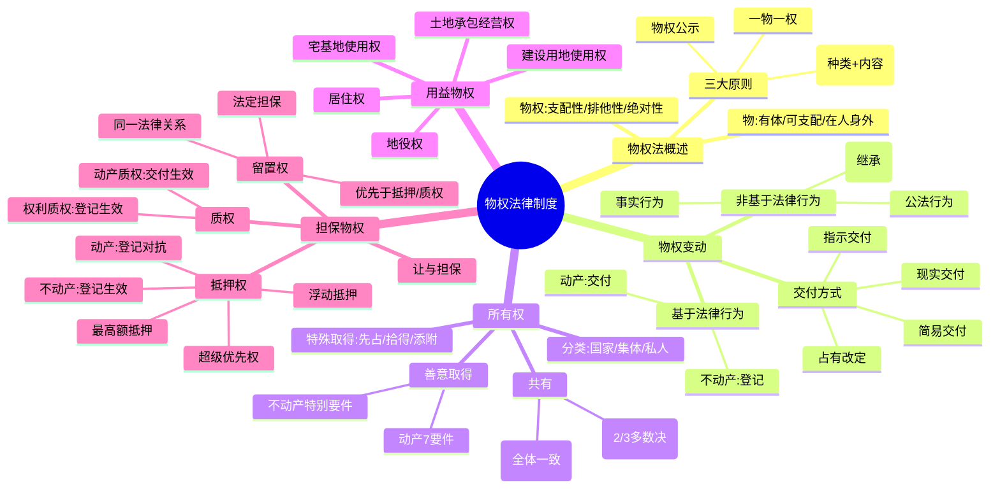

## 📍 章节定位

| 项目 | 信息 |
|------|------|
| **所属科目** | ⚖️ 经济法 |
| **难度等级** | ⭐⭐⭐ |
| **历年分值** | 4-5分 |
| **建议学时** | 5-6h |

## 📝 考情分析

本章是经济法的重点章节，历年分值稳定在 4-5 分，部分年份在案例分析题中涉及担保物权、善意取得等知识点。命题以**单选、多选**为主，案例分析题常与合同法、公司法结合考查。

近年命题热点集中在：(1) 物权变动公示方式（动产交付 vs 不动产登记，含简易交付、指示交付、占有改定）；(2) 善意取得制度构成要件（动产 7 要件、不动产特别要件）；(3) 共有制度（按份共有 vs 共同共有的处分规则、优先购买权）；(4) 抵押权（房地一体、流押禁止、动产抵押登记对抗、超级优先权、最高额抵押）；(5) 质权设定（动产交付、权利质权登记）；(6) 留置权成立要件与优先效力（留置权 > 登记抵押权 > 未登记抵押权）；(7) 担保物权竞存时的清偿顺序。

本章难度中等偏上，关键在于准确把握"动产 vs 不动产"公示方式差异以及"善意取得 vs 担保物权竞存"两大易混点。建议结合担保物权对比表系统记忆。

## 🧠 知识框架

## 📖 核心精讲

### 一、物权法概述

**物权**是权利人依法对特定的物享有直接支配和排他的权利（《民法典》第114条）。三大特点：**支配性**、**排他性**（一物之上只能成立一项所有权）、**绝对性**（对世权）。

**物权法三大基本原则**：

| 原则 | 内容 | 法律依据 |
|------|------|----------|
| **物权法定原则** | 种类法定 + 内容法定，不得创设法律未规定的物权或与法定内容相异的内容 | 《民法典》第116条 |
| **一物一权原则** | 物权只存在于确定的一物之上；一项行为只能处分一物（不矛盾：多人共有一物；一物上数个不冲突物权） | — |
| **物权公示原则** | 动产以**交付占有**为公示；不动产以**登记**为公示 | 《民法典》第208条 |

> **物权法定中的"法律"**：仅指全国人大及其常委会制定的"法律"，不包括行政法规、地方性法规，也不包括司法解释与司法判例。

### 二、物权变动

#### （一）物权变动的原因

**基于法律行为的物权变动**：需公示（动产交付/不动产登记）。

**非基于法律行为的物权变动**（不必公示即可生效）：
1. **基于事实行为**：因合法建造、拆除房屋等事实行为设立或消灭物权的，自事实行为成就时发生效力（《民法典》第231条）
2. **基于法律规定**：因继承取得物权的，自继承开始时发生效力（《民法典》第230条）
3. **基于公法行为**：因人民法院、仲裁机构的法律文书或人民政府的征收决定等导致物权变动的，自法律文书或征收决定等生效时发生效力（《民法典》第229条）

> **特别规定**（《民法典》第232条）：取得不动产物权之人再处分物权时，依照法律规定需要办理登记的，未经登记，不发生物权效力。

#### （二）动产物权变动的公示方式——交付

> 《民法典》第224条：动产物权的设立和转让，自交付时发生效力，但是法律另有规定的除外。

**交付方式**：

| 方式 | 含义 | 法律依据 |
|------|------|----------|
| **现实交付** | 直接将物交由对方占有 | 最典型形态 |
| **简易交付** | 受让人已占有动产，物权自民事法律行为生效时发生效力 | 《民法典》第226条 |
| **指示交付** | 第三人占有动产，转让人通过转让请求第三人返还原物的权利代替交付 | 《民法典》第227条 |
| **占有改定** | 出让人与受让人约定由出让人继续占有动产，物权自约定生效时发生效力 | 《民法典》第228条 |

> **重要提示**：占有改定不能满足善意取得制度意义上的"交付"要求。

#### （三）不动产物权变动的公示方式——登记

> 《民法典》第209条第1款：不动产物权的设立、变更、转让和消灭，经依法登记，发生效力；未经登记，不发生效力，但是法律另有规定的除外。

**登记类型**：首次登记、变更登记、转移登记、注销登记、更正登记、异议登记、预告登记、查封登记。

**预告登记**（《民法典》第221条）：当事人签订买卖房屋或其他不动产物权的协议，为保障将来实现物权，可申请预告登记。预告登记后，未经预告登记权利人同意处分该不动产的，不发生物权效力；债权消灭或自能够进行不动产登记之日起 **90 日**内未申请登记的，预告登记失效。

**公示生效 vs 公示对抗**：

| 类型 | 适用情形 | 规则 |
|------|----------|------|
| **公示生效主义** | 不动产物权变动；动产质权设立 | 非经公示不生效 |
| **公示对抗主义** | 土地承包经营权互换转让；地役权设立；动产抵押；特殊动产（船舶、航空器、机动车）物权变动 | 自合同生效时设立，未登记不得对抗善意第三人 |

> 《民法典》第225条：船舶、航空器和机动车等的物权设立、变更、转让和消灭，未经登记，不得对抗善意第三人。但转让人转移这些特殊动产所有权，受让人已支付对价并取得占有，虽未经登记，转让人的债权人主张其为"善意第三人"的，不予支持。

### 三、所有权

#### （一）所有权的法定分类

| 类型 | 行使主体 | 客体范围 |
|------|----------|----------|
| **国家所有权** | 国务院代表国家行使（《民法典》第246条第2款） | 矿藏、水流、海域、无居民海岛、城市土地、国防资产等 |
| **集体所有权** | 村集体经济组织/村民委员会/乡镇集体经济组织代表行使 | 法律规定属于集体所有的土地、森林、山岭、草原、荒地、滩涂等 |
| **私人所有权** | 自然人、法人（含营利法人） | 合法收入、房屋、生活用品、生产工具、原材料等 |

#### （二）共有制度（高频考点）

| 区别点 | 按份共有 | 共同共有 |
|--------|----------|----------|
| 份额 | 按份额享有所有权 | 不分份额，共同享有所有权 |
| 推定 | 共有人没有约定或约定不明，除具有家庭关系等外，**视为按份共有** | 家庭关系中的共有（夫妻共同财产、遗产、家庭承包财产等） |
| 重大修缮、变更性质或用途 | 经占份额 **2/3 以上**的按份共有人同意 | 经**全体共同共有人**同意 |
| 管理费用负担 | 按份额负担 | 共同负担 |
| 内部债权债务 | 按份额享有/承担；超额可追偿 | 共同享有/承担 |
| 共有物处分 | 多数决（2/3以上份额）；不足构成无权处分 | 全体一致同意；擅转让构成无权处分（效力待定） |
| 份额处分 | 可自由转让份额；其他共有人同等条件下有优先购买权 | 无份额，不存在份额处分 |
| 分割请求 | 没有约定或约定不明确的，可随时请求分割 | 共有的基础丧失或有重大理由方可请求分割 |

**按份共有人优先购买权**要点：
- 以**交易**为前提（继承、遗赠等非交易方式不适用）
- 共有人之间相互转让，除非另有约定，否则其他共有人不得主张优先购买
- 需在**同等条件**下行使（综合转让价格、履行方式、期限等确定）
- 行使期间：有约定从约定；通知载明期间从其规定；未载明或短于 15 日为 15 日；未通知为知道或应当知道之日起 15 日；无法确定的为权属转移之日起 6 个月

#### （三）善意取得制度（必考）

**制度价值**：保护交易安全，从静态安全保护过渡到动态安全保护。

> 《民法典》第311条第1款：无处分权人将不动产或者动产转让给受让人的，所有权人有权追回；除法律另有规定外，符合下列情形的，受让人取得该不动产或者动产的所有权：(1) 受让人受让该不动产或者动产时是善意的；(2) 以合理的价格转让；(3) 转让的不动产或者动产依照法律规定应当登记的已经登记，不需要登记的已经交付给受让人。

**动产善意取得 7 要件**：

| 序号 | 要件 | 关键点 |
|------|------|--------|
| 1 | 依法律行为转让所有权 | 限于交易行为；非基于法律行为变动不适用 |
| 2 | 转让人无处分权 | 若有处分权则适用正常物权变动规则 |
| 3 | 受让人为善意 | 不知转让人无处分权且对此不知无重大过失；善意系推定，由真权利人负举证责任；判断时点以"受让动产时"为准（一般以交付时为准） |
| 4 | 以合理的价格转让 | 综合标的物性质、数量、付款方式、市场价格、交易习惯等认定；无偿受让不保护 |
| 5 | 物已交付 | 占有改定不能满足交付要求；船舶、航空器、机动车交付符合要件 |
| 6 | 转让人基于真权利人意思合法占有标的物 | 适用于**委托物**（保管、租赁等）；不适用于**脱手物**（遗失物、盗窃物） |
| 7 | 转让合同有效 | 转让合同无效或被撤销，受让人不得主张善意取得（《民法典物权编解释一》第20条） |

**不动产善意取得特别要件**：
- 以**登记**为要件（非交付）
- 受让人不构成善意的情形：(1) 登记簿上存在有效的异议登记；(2) 预告登记有效期内未经预告登记权利人同意；(3) 登记簿已记载司法机关或行政机关依法裁定、决定查封或以其他形式限制不动产权利的事项；(4) 受让人知道登记簿上记载的权利主体错误；(5) 受让人知道他人已经依法享有不动产物权
- 善意取得不动产，**不消除**不动产上其他已登记之物权

**法律效果**：
- 直接效果：受让人取得所有权；真权利人所有权失去；动产原有权利消灭（受让人知道或应知除外）
- 间接效果：真权利人有权向无权处分人请求损害赔偿

**遗失物的特殊规则**（《民法典》第312条）：
- 所有权人有权追回遗失物
- 自知道或应当知道受让人之日起 **2 年**内可向受让人请求返还原物
- 受让人通过拍卖或向具有经营资格的经营者购得的，权利人请求返还时应支付受让人所付费用（买回规则）
- 权利人支付费用后，可向无权处分人追偿

### 四、用益物权

**用益物权**是对他人所有的不动产或动产，依法享有占有、使用和收益的权利。仅涉及物的使用价值，不含处分权能。

**5 类用益物权及设立规则**：

| 用益物权 | 设立时点 | 登记效力 |
|----------|----------|----------|
| 土地承包经营权 | 土地承包经营权合同生效时设立 | 互换、转让的，未经登记不得对抗善意第三人 |
| **建设用地使用权** | 登记时设立 | 登记生效 |
| 宅基地使用权 | — | — |
| **居住权** | 登记时设立 | 登记生效（《民法典》新增） |
| 地役权 | 地役权合同生效时设立 | 未经登记不得对抗善意第三人 |

#### 建设用地使用权要点

**取得方式**：
- **创设取得**：无偿划拨（仅限国家机关用地、军事用地、城市基础设施和公益事业用地、国家重点扶持的能源交通水利等项目用地）和有偿出让
- **移转取得**：转让、互换、出资、赠与、抵押

**出让最高年限**：

| 用途 | 最高年限 |
|------|----------|
| 居住用地 | **70 年** |
| 工业用地 | 50 年 |
| 教育、科技、文化、卫生、体育用地 | 50 年 |
| 商业、旅游、娱乐用地 | **40 年** |
| 综合或其他用地 | 50 年 |

> 《民法典》第359条：住宅建设用地使用权期限届满的，**自动续期**。续期费用的缴纳或减免依照法律、行政法规规定办理。非住宅建设用地使用权期限届满后的续期，依照法律规定办理。

### 五、担保物权

#### （一）担保物权概述

**担保物权**是以担保债权实现为目的的物权，针对物的**交换价值**。

**四大特性**：
1. **从属性**：成立、转让、消灭均从属于债权
2. **权利行使的附条件性**：债务人不履行到期债务或发生约定情形时方可行使
3. **优先受偿性**：就担保物变价后的价金优先于普通债权人受偿
4. **不可分性**：物的分割、债的分割不导致担保物权分割；部分清偿不消灭担保物权

**消灭事由**：(1) 主债权消灭；(2) 担保物权实现；(3) 债权人放弃担保物权；(4) 法律规定的其他情形。

**三种担保物权对比**：

| 项目 | 抵押权 | 质权 | 留置权 |
|------|--------|------|--------|
| 性质 | 意定担保物权 | 意定担保物权 | 法定担保物权 |
| 客体 | 不动产、动产、权利 | 动产、权利 | 仅动产 |
| 占有转移 | **不转移**占有 | 转移占有 | 已合法占有 |
| 设立 | 抵押合同+登记/生效 | 质押合同+交付/登记 | 法定要件成就 |
| 优先级 | 看登记先后 | 看交付/登记先后 | **最高**（优先于抵押权、质权） |

#### （二）抵押权（高频考点）

**概念**：为担保债务履行，债务人或第三人不转移财产占有，将该财产抵押给债权人，债务人不履行到期债务或发生约定情形时，债权人就该财产优先受偿。

**可抵押财产**（《民法典》第395条）：建筑物和其他土地附着物；建设用地使用权；海域使用权；生产设备、原材料、半成品、产品；正在建造的建筑物、船舶、航空器；交通运输工具；法律、行政法规未禁止抵押的其他财产。

**禁止抵押的财产**（《民法典》第399条）：
1. 土地所有权
2. 宅基地、自留地、自留山等集体所有的土地使用权（但法律规定可抵押的除外）
3. 学校、幼儿园、医院等以公益为目的的非营利法人的教育设施、医疗卫生设施和其他公益设施
4. 所有权、使用权不明或有争议的财产
5. 依法被查封、扣押、监管的财产
6. 法律、行政法规规定不得抵押的其他财产

**房地一体原则**：以建筑物抵押的，该建筑物占用范围内的建设用地使用权一并抵押；以建设用地使用权抵押的，该土地上的建筑物一并抵押（但新增建筑物不作为抵押财产）。

**抵押权设立（登记效力）**：

| 抵押财产类型 | 登记效力 | 设立时点 |
|--------------|----------|----------|
| 建筑物和其他土地附着物 | **登记生效** | 登记时设立 |
| 建设用地使用权 | 登记生效 | 登记时设立 |
| 海域使用权 | 登记生效 | 登记时设立 |
| 正在建造的建筑物 | 登记生效 | 登记时设立 |
| 动产（含生产设备等） | **登记对抗** | 抵押合同生效时设立；未经登记不得对抗善意第三人 |
| 家庭承包方式取得的土地经营权 | 登记对抗 | 抵押合同生效时设立 |

> **重要**：动产抵押即使已登记，也**不得对抗**正常经营活动中已支付合理价款并取得抵押财产的买受人。

**流押合同之禁止**（《民法典》第401条）：抵押权人在债务履行期限届满前，与抵押人约定债务人不履行到期债务时抵押财产归债权人所有的，**只能依法就抵押财产优先受偿**（约定无效，但不影响其他部分效力）。

**抵押物转让规则**（《民法典》第406条）：
- 抵押人转让抵押财产的，应当及时通知抵押权人
- 抵押权人能够证明转让可能损害抵押权的，可请求抵押人将转让所得价款向抵押权人提前清偿债务或提存
- 转让价款超过债权数额的部分归抵押人所有，不足部分由债务人清偿
- 当事人约定禁止或限制转让且已登记的，抵押人违反约定转让，抵押权人主张转让不发生物权效力的，应予支持（除非受让人代偿债务导致抵押权消灭）

**抵押权实现的清偿顺序**：

| 情形 | 清偿规则 |
|------|----------|
| 抵押权均已登记 | 按登记先后顺序清偿 |
| 已登记 vs 未登记 | 已登记先于未登记受偿 |
| 均未登记 | 按债权比例清偿 |

**抵押与租赁的关系**："在后抵押不破在先租赁"——抵押权设立前抵押财产已出租并转移占有的，原租赁关系不受抵押权影响。

**动产抵押权人的超级优先权**（《民法典》第416条）：动产抵押担保的主债权是抵押物的价款，标的物交付后 **10 日内**办理抵押登记的，该抵押权人优先于抵押物买受人的其他担保物权人受偿，**但留置权人除外**。

**最高额抵押**：抵押人与抵押权人协议，在最高债权额限度内，以抵押物对一定期间内连续发生的债权作担保。债权确定前，债权可转让，但最高额抵押权不得转让（另有约定除外）。债权确定情形（《民法典》第423条）：约定期间届满；无约定或约定不明，设立后满 2 年请求确定；新债权不可能发生；抵押财产被查封扣押；债务人/抵押人破产或解散等。

#### （三）质权

**质权**是债务人或第三人将其动产或权利出质给债权人占有，债务人不履行到期债务时，债权人就该动产或权利优先受偿。

**质权客体**：仅动产或权利（不动产不能设质）。

**权利质权客体**（《民法典》第440条）：汇票、本票、支票；债券、存款单；仓单、提单；可转让的基金份额、股权；可转让的知识产权中的财产权；现有的及将有的应收账款；法律、行政法规规定可出质的其他财产权利。

**质权设立**：

| 客体类型 | 设立时点 |
|----------|----------|
| 动产 | 出质人交付质押财产时设立 |
| 汇票、本票、支票、债券、存款单、仓单、提单（有权利凭证） | 权利凭证交付质权人时设立 |
| 上述证券权利（无权利凭证） | 办理出质登记时设立 |
| 基金份额、股权 | 办理出质登记时设立 |
| 知识产权中的财产权 | 办理出质登记时设立 |
| 应收账款 | 办理出质登记时设立（登记机构为中国人民银行征信中心） |

> **流质禁止**：质权人在债务履行期届满前，与出质人约定债务人不履行到期债务时质押财产归债权人所有的，约定无效，质权人只能就质押财产优先受偿。

**质权人的义务**：(1) 保管义务（因保管不善致使质押财产毁损灭失的，承担赔偿责任）；(2) 返还义务（债务人履行债务或出质人提前清偿的，应返还质押财产）。

**出质人处分限制**：基金份额、股权、知识产权中的财产权、应收账款出质后，不得转让，但经出质人与质权人协商同意的除外。转让所得价款应向质权人提前清偿债务或提存。

#### （四）留置权

**留置权**是债务人不履行到期债务，债权人可留置已合法占有的债务人或第三人的动产，并有权就该动产优先受偿。属于**法定担保物权**，不必有担保合同。

**成立要件**：

1. **债权人合法占有债务人或第三人之动产**（同一法律关系下，可留置第三人财产；企业之间留置不受同一法律关系限制）
2. **债权已届清偿期**（未届清偿期一般不能留置，但能证明债务人无支付能力的除外）
3. **动产之占有与债权属同一法律关系**（企业之间留置除外，《民法典》第448条）

**留置权人的权利义务**：
- 优先受偿权
- 孳息收取权（先充抵收取费用）
- 保管义务（保管不善承担赔偿责任）
- **通知义务**：未约定履行期限的，应确定 **60 日以上**期限通知债务人履行；未按期通知直接变价处分的，承担赔偿责任（鲜活易腐等不易保管动产除外）

**担保物权优先顺序**：

> **同一动产上已设立抵押权或质权，该动产又被留置的，留置权人优先受偿。**

| 同一财产上担保物权竞存 | 清偿顺序 |
|------------------------|----------|
| 留置权 vs 抵押权/质权 | **留置权优先** |
| 抵押权 vs 质权 | 按登记/交付的时间先后确定 |
| 多个抵押权 | 已登记按时间先后；已登记优先未登记；均未登记按债权比例 |
| 动产抵押超级优先权 vs 其他担保物权 | 超级优先权优先（但留置权除外） |

**留置权消灭事由**：(1) 债权消灭；(2) 债务人另行提供担保并被留置权人接受；(3) 留置权人对留置财产丧失占有。

#### （五）让与担保（《民法典担保制度解释》新增）

**让与担保**：债务人或第三人与债权人约定将财产形式上转移至债权人名下，债务人不履行到期债务时，债权人有权对财产折价或以拍卖、变卖该财产所得价款偿还债务。

> 《民法典担保制度解释》第68条第1款：当事人已完成财产权利变动的公示，债务人不履行到期债务，债权人请求参照民法典关于担保物权的有关规定就该财产优先受偿的，人民法院应予支持。

> **流质（流押）禁止在让与担保中适用**：约定债务人不履行到期债务时财产归债权人所有的，约定无效，但不影响提供担保的意思表示效力。债权人不能直接获得所有权，只能就财产折价或拍卖、变卖价款优先受偿。

## 💡 典型例题

**【例题 1】（单项选择题）**

根据物权法律制度的规定，下列关于不动产登记的表述中，正确的是（ ）。

A. 不动产物权设立均须经登记才能发生效力
B. 土地承包经营权自登记时设立
C. 预告登记后，债权消灭的，预告登记自动失效
D. 异议登记之日起 15 日内不起诉的，异议登记失效

**答案**：D

**解析**：A 错误，"法律另有规定"除外（如土地承包经营权自合同生效时设立、地役权自合同生效时设立）；B 错误，土地承包经营权自土地承包经营权合同生效时设立；C 错误，预告登记后债权消灭或自能够进行不动产登记之日起 90 日内未申请登记的，预告登记失效，不是"自动"失效；D 正确，异议登记之日起 15 日内不起诉的，异议登记失效。

**【例题 2】（单项选择题）**

甲将一台电脑借给乙使用，乙未经甲同意将该电脑以合理价格卖给不知情的丙，并已完成交付。根据物权法律制度的规定，下列表述正确的是（ ）。

A. 甲有权追回电脑，丙不能取得所有权
B. 丙基于善意取得制度取得电脑所有权
C. 丙不能取得电脑所有权，因为乙是无权处分
D. 丙只有在甲同意后才能取得电脑所有权

**答案**：B

**解析**：本题符合动产善意取得的全部要件：(1) 依法律行为（买卖合同）转让所有权；(2) 乙无处分权；(3) 丙不知情且无重大过失（善意）；(4) 以合理价格转让；(5) 物已交付；(6) 乙基于真权利人甲的意思（借用）合法占有电脑（属委托物）；(7) 转让合同有效。故丙基于善意取得制度取得电脑所有权，甲只能向乙请求损害赔偿。

**【例题 3】（案例分析题）**

2024 年 1 月，甲公司为向乙银行贷款 1000 万元，以自己的厂房设定抵押并办理了登记。2024 年 3 月，甲公司又以该厂房占用范围内的建设用地使用权向丙银行抵押贷款 500 万元并办理登记。2024 年 6 月，甲公司在该土地上新增建造了一栋办公楼。2024 年 12 月，甲公司无力清偿到期债务，乙银行和丙银行均主张行使抵押权。该厂房和建设用地使用权拍卖所得 1500 万元，办公楼拍卖所得 400 万元。

**问题**：(1) 乙银行和丙银行的抵押权如何实现？(2) 办公楼所得价款能否用于清偿乙、丙银行的债权？

**答案**：
(1) 乙银行抵押权设立时间为 2024 年 1 月，丙银行抵押权设立时间为 2024 年 3 月，均办理了登记。根据"抵押权已登记的，按照登记的先后顺序清偿"规则，乙银行优先于丙银行受偿。由于实行"房地一体"原则，以建筑物抵押的，该建筑物占用范围内的建设用地使用权一并抵押；以建设用地使用权抵押的，该土地上的建筑物一并抵押，但**新增建筑物不作为抵押财产**。故厂房拍卖所得 1500 万元，由乙银行优先受偿 1000 万元，剩余 500 万元由丙银行受偿（恰好满足丙银行的债权）。

(2) 办公楼属于抵押权设立后新增的建筑物，不作为抵押财产。根据《民法典》规定，新增建筑物所得价款，抵押权人**无权优先受偿**。故办公楼拍卖所得 400 万元不能用于优先清偿乙、丙银行的债权，应归甲公司所有（用于一般破产财产或一般债权人受偿）。

## 🎯 记忆口诀

**口诀一：物权变动公示方式**
> 动产交付不动产登记，特殊动产登记对抗；
> 善意取得占有改定不行，预告九十日内要登记。

**口诀二：善意取得七要件**
> 法律行为+无处分+善意+合理价+已交付+委托物+合同有效。
> 遗失物二年内可追回，拍卖经营购得要付钱。

**口诀三：共有处分规则**
> 按份二之三同意，共同全体一致；
> 份额可转优先购，十五日内要主张。

**口诀四：担保物权优先顺序**
> 留置最高留置最高，抵押质权看时间；
> 登记优先未登记，未登记按比例；
> 超级优先十日内，价款抵押优先人。

**口诀五：抵押设立规则**

| 类型 | 设立规则 |
|------|----------|
| 不动产抵押 | 登记生效（不登记抵押权不设立） |
| 动产抵押 | 合同生效时设立，登记对抗 |
| 动产质权 | 交付生效 |
| 权利质权 | 登记生效（有凭证的交付生效） |
| 留置权 | 法定成立，无需合意 |

## ✅ 同步练习

**1. （单选）下列关于物权变动的表述中，根据《民法典》正确的是（ ）。**
A. 因继承取得物权的，自办理继承登记时发生效力
B. 因合法建造房屋设立物权的，自办理房屋所有权首次登记时发生效力
C. 因人民法院的法律文书导致物权变动的，自法律文书生效时发生效力
D. 因人民政府的征收决定导致物权消灭的，自办理注销登记时发生效力

**2. （单选）根据物权法律制度的规定，下列关于按份共有的表述中，正确的是（ ）。**
A. 按份共有人转让其共有份额的，其他共有人在同等条件下享有优先购买权
B. 按份共有物处分需经全体共有人一致同意
C. 按份共有人对共有物作重大修缮的，需经占份额 1/2 以上的按份共有人同意
D. 共有人之间相互转让共有份额的，其他共有人仍有权主张优先购买

**3. （多选）根据物权法律制度的规定，下列财产中不得抵押的有（ ）。**
A. 土地所有权
B. 所有权有争议的财产
C. 正在建造的建筑物
D. 学校的教育设施

**4. （单选）同一动产上已设立抵押权，该动产又被留置的，关于清偿顺序的表述正确的是（ ）。**
A. 按照抵押权设立的时间先后清偿
B. 留置权人优先受偿
C. 按照债权比例清偿
D. 抵押权人优先受偿

**5. （单选）甲以一套房屋为债权人乙设定抵押并办理登记，后甲未经乙同意将该房屋卖给丙并办理了过户登记。根据《民法典》规定，下列表述正确的是（ ）。**
A. 买卖合同无效，因为甲未经抵押权人乙同意
B. 买卖合同有效，但抵押权人乙可主张转让不发生物权效力
C. 买卖合同有效，抵押权继续存在于该房屋上，乙仍可行使抵押权
D. 买卖合同有效，乙的抵押权消灭

---

**参考答案**：1.C 2.A 3.ABD 4.B 5.C
