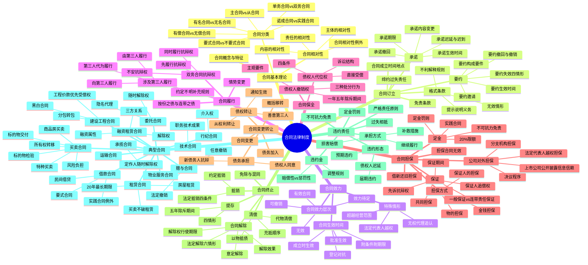

## 1. 章节定位

| 项目 | 信息 |
|------|------|
| 所属科目 | 经济法 |
| 难度等级 | 5 |
| 历年分值 | 10-15 分 |
| 建议学时 | 14-18 小时 |
| 知识关联章节 | 第1章 法律基本原理（法律关系）；第2章 基本民事法律制度（民事法律行为效力、代理）；第3章 物权法律制度（合同效力与物权变动区分、担保物权）；第5章 合伙企业法律制度（合伙合同）；第6章 公司法律制度（公司对外担保、决议程序）；第8章 企业破产法律制度（未履行完毕合同的处理）；第9章 票据与支付结算法律制度（票据原因关系） |

## 2. 考情分析

本章是经济法科目的核心重点章节，分值约 10-15 分，是历年主观题（案例分析题）的必考章节。本章内容覆盖面极广，从合同订立到终止的全流程，加上保证、定金等担保制度，以及买卖、赠与、借款、租赁、融资租赁、承揽、建设工程、委托、运输、行纪、技术、物业服务等多种典型合同，几乎是半部民法典的体量。

**命题规律**：本章命题以案例分析题为主，常以"合同订立 → 合同效力 → 合同履行 → 合同担保 → 合同解除 → 违约责任"全流程为主线，穿插考查保证、抵押、代位权、撤销权、抗辩权等具体制度。客观题则集中在要约承诺规则、格式条款、抗辩权适用条件、保证期间与诉讼时效、定金罚则、合同解除权、违约金调整、买卖合同风险负担、承租人优先购买权等知识点。近年命题趋势是结合《民法典合同编通则解释》（2023 年）的新规则出题，如情势变更、违约金调整、合同解除、缔约过失责任等。

**高频考点分布**：

1. **合同订立程序**：要约的构成（内容具体确定 + 受约束意思）、要约邀请的识别、要约的撤回与撤销（不可撤销情形）、要约失效四情形；承诺的生效（到达主义）、承诺迟延与迟到的区分、实质性变更的识别（八大要素）；合同成立时间与地点；格式条款（提示说明义务、无效情形、不利解释规则）；缔约过失责任（四种情形 + 信赖利益赔偿）。
2. **合同效力**：合同生效时间（成立时生效、批准生效、登记生效 vs 登记对抗）；效力层次（有效、效力待定、可撤销、无效）；无权代理追认、法定代表人越权、超越经营范围；附条件合同（延缓条件、解除条件、不正当地阻止/促成）；附期限合同。
3. **合同履行**：约定不明的补充规则（六项）；向第三人履行（真正利他合同 vs 不真正利他合同）、由第三人履行、第三人代为履行（合法利益）；按份之债与连带之债；双务合同三大抗辩权（同时履行、先履行、不安抗辩权）；情势变更（重新协商义务 + 法院变更/解除）。
4. **合同保全**：债权人代位权（四条件、诉讼结构、直接受偿规则）；债权人撤销权（三种处分行为、主观要件、一年与五年除斥期间、必要费用负担）。
5. **合同担保**：担保合同无效情形（公益法人担保）；公司对外担保（法定代表人越权担保、决议程序、上市公司公开披露信息信赖、分支机构担保）；借新还旧场合担保责任；保证方式（一般保证 vs 连带责任保证、约定不明推定一般保证）；先诉抗辩权及其四例外；保证期间（六个月、除斥期间性质、诉讼时效起算）；共同担保（物保与人保并存规则）；保证人追偿权；定金（实践合同、20%限额、定金罚则、不可抗力免责、违约金与定金择一）。
6. **合同变更与转让**：债权转让（通知生效、不得对抗善意第三人、从权利一并转让、债务人抗辩与抵销）；债务承担（债权人同意、新债务人抗辩）；债务加入（连带债务）；债权债务概括移转。
7. **合同终止**：清偿（代物清偿、以物抵债、充抵顺序）；抵销（法定抵销四条件、约定抵销）；提存（四情形、五除斥期间、风险转移）；免除与混同；合同解除（意定解除、法定解除六情形、解除权行使期限一年、解除效果）。
8. **违约责任**：严格责任原则；违约形态（预期违约、届期违约、债权人迟延）；承担方式（继续履行、补救措施、损害赔偿——可期待利益）；违约金（赔偿性 vs 惩罚性、调整规则、过分高于 30% 标准）；定金罚则与违约金择一；过失相抵；不可抗力免责。
9. **典型合同——买卖合同**：标的物交付与所有权转移；风险负担（交付主义、在途货物规则）；标的物检验（两年最长合理期限）；分期付款买卖（1/5 解除权）；试用买卖；商品房买卖（销售广告要约认定、预售许可、法定解除权、与贷款合同的关系）。
10. **典型合同——赠与合同**：单务无偿诺成合同；任意撤销（公证、公益道德义务不得撤销）与法定撤销（三种情形、一年与六个月除斥期间）；瑕疵担保责任减免。
11. **典型合同——借款合同**：要式合同（自然人之间例外）；自然人之间借款为实践合同；禁止高利放贷；预先扣息禁止；民间借贷（LPR 四倍上限、互联网平台责任、法定代表人责任、与买卖合同混合处理）。
12. **典型合同——租赁合同**：20 年最长期限；不定期租赁三情形；买卖不破租赁；次承租人代为履行；房屋租赁（无效情形、承租人优先购买权、同住人权利）。
13. **典型合同——融资租赁合同**：三方关系、融资属性、租金构成；承租人破产租赁物不属于破产财产；出租人解除权四情形；承租人索赔权；象征性价款视为所有权归属承租人。
14. **典型合同——承揽合同**：承揽人主要工作亲自完成；定作人随时解除权（赔偿本应获得报酬减去节省利益）。
15. **典型合同——建设工程合同**：黑白合同规则；分包与转包禁止；承包人垫资；工程价款优先受偿权（18 个月、优于抵押权、消费者交付请求权优先）；实际施工人诉讼地位。
16. **典型合同——委托合同**：特别委托与概括委托；隐名代理（披露义务与选择权）；委托人支付费用报酬义务；随时解除权。
17. **其他典型合同**：运输合同（承运人留置权）；行纪合同（介入权）；技术合同（职务技术成果优先受让权）；物业服务合同（前期物业服务合同、业主共同决定程序）。

**联动考查方式**：

- 与第3章物权法律制度联动：买卖合同 + 物权变动 + 善意取得；合同效力与物权变动区分；租赁与抵押冲突；让与担保；
- 与第6章公司法律制度联动：公司对外担保决议程序、法定代表人越权担保；
- 与第8章破产法律制度联动：未履行完毕合同的处理、别除权；
- 与第2章基本民事法律制度联动：合同效力层次、代理制度、意思表示瑕疵。

**备考建议**：

- 合同订立程序要熟练区分要约与要约邀请，掌握要约撤回（生效前）、要约撤销（生效后承诺前）的时点要求；
- 格式条款的三层规制（订入控制 + 效力控制 + 解释控制）必须完整掌握；
- 三大抗辩权要区分适用前提：同时履行抗辩权（无先后顺序）、先履行抗辩权（有先后顺序，先履行方未履行）、不安抗辩权（先履行方对后履行方履约能力担忧）；
- 保证期间与保证债务诉讼时效的关系：保证期间内行使权利 → 保证责任不消灭 → 开始计算诉讼时效；保证期间内未行使权利 → 保证责任消灭；
- 定金罚则与违约金只能择一适用，但定金不足以弥补损失时可并处赔偿，总和不超过实际损失；
- 买卖合同风险负担以"交付"为标准，而非所有权转移；但在途货物自合同成立时风险转移；
- 建设工程价款优先受偿权优于抵押权，但消费者房屋交付请求权优先于该优先受偿权；
- 民间借贷利率上限为合同成立时一年期 LPR 的四倍，注意是"合同成立时"而非"起诉时"。

## 3. 知识框架

## 4. 核心精讲

### 4.1 合同的基本理论

**合同**是民事主体之间设立、变更、终止民事法律关系的协议。合同是平等主体之间的民事法律关系，任何一方不论其所有制性质及行政地位，都不能将自己的意志强加给对方。合同是双方民事法律行为，其成立不但需要当事人有意思表示，而且要求当事人之间的意思表示一致。

**合同法的特征**：(1) 合同制度属私法范畴，当事人自由约定合法时产生相当于法律的效力；(2) 合同制度体现意思自治原则，主要通过任意性规范调整合同关系；(3) 合同制度规范财产交易，从动态角度为财产关系提供法律保护。

**《民法典》合同编的适用范围**：(1) 不仅调整因合同产生的债权债务关系，其部分规定还适用于非因合同产生的债权债务关系（如侵权之债），但根据其性质不能适用的除外；(2) 可以类推适用于有关身份关系的协议（婚姻、收养、监护等），没有规定的可根据其性质参照适用合同编；(3) 涉外合同当事人可以选择处理合同争议所适用的法律，但中外合资经营企业合同、中外合作经营企业合同、中外合作勘探开发自然资源合同只能适用中华人民共和国法律。

**合同的分类**：

| 分类标准 | 类型 | 法律意义 |
|---------|------|---------|
| 是否规定确定名称与规则 | 有名合同 vs 无名合同 | 法律适用不同：有名合同直接适用，无名合同参照最相类似合同 |
| 是否相互负有对价义务 | 单务合同 vs 双务合同 | 双务合同存在同时履行抗辩权和风险负担问题 |
| 是否还需实际交付 | 诺成合同 vs 实践合同 | 成立要件不同；实践合同中作为成立要件的给付义务违反不产生违约责任 |
| 是否有偿 | 有偿合同 vs 无偿合同 | 责任轻重不同；撤销权主观要件不同 |
| 是否须特定形式 | 要式合同 vs 不要式合同 | 要式合同未采法定形式不能成立 |
| 是否独立存在 | 主合同 vs 从合同 | 从合同效力依附于主合同 |

常见的**实践合同**有：保管合同、自然人之间的借贷合同、定金合同。注意：赠与合同、质押合同不是实践合同。

**合同的相对性**体现在四个方面：

1. **主体的相对性**：只有合同当事人一方能够向另一方基于合同提出请求或提起诉讼；合同关系以外的人不能依据合同提出请求；当事人不能向第三人提出合同上的请求。
2. **内容的相对性**：只有合同当事人才能享有合同权利并承担义务；合同规定权利原则上不及于第三人；当事人无权为第三人设定合同义务。
3. **责任的相对性**：合同责任只能在合同当事人之间发生；违约当事人应对违约后果承担违约责任，对履行辅助人的行为负责；因第三人原因造成债务不能履行时，债务人仍应向债权人承担违约责任。
4. **合同相对性的例外**：(1) 合同保全（代位权、撤销权）突破合同相对性；(2) "买卖不破租赁"使承租人可以租赁合同对抗新的所有权人；(3) 分包人与承包人共同对发包人承担连带责任、单式联运合同中某一区段的承运人与总的承运人共同向托运人承担连带责任。

### 4.2 合同的订立

#### 4.2.1 要约

**要约**是希望和他人订立合同的意思表示。要约应当符合两个条件：(1) 内容具体确定（具备未来合同的必要内容，能够确定当事人名称、标的和数量的，一般应认定合同成立）；(2) 表明经受要约人承诺，要约人即受该意思表示约束。

**要约邀请**是希望他人向自己发出要约的表示。拍卖公告、招标公告、招股说明书、债券募集办法、基金招募说明书、商业广告和宣传、寄送的价目表等性质均为要约邀请。但若商业广告内容符合要约规定（如悬赏广告），则视为要约。根据《商品房买卖合同解释》，商品房销售广告和宣传资料原则上为要约邀请，但就开发规划范围内房屋及相关设施所作说明和允诺具体确定，并对合同订立及房屋价格确定有重大影响的，构成要约，即使未订入合同亦为合同内容，违反应承担违约责任。

**要约的生效时间**：以对话方式作出的，相对人知道其内容时生效；以非对话方式作出的，到达相对人时生效；采用数据电文形式的，指定特定系统的，进入该系统时生效，未指定特定系统的，相对人知道或应当知道进入其系统时生效。

**要约的撤回与撤销**：

- **撤回**：在要约生效前进行。撤回要约的通知应当在要约到达受要约人之前或者与要约同时到达受要约人。
- **撤销**：在要约生效后、承诺作出前进行。但有下列情形之一的，要约不得撤销：(1) 要约人以确定承诺期限或者以其他形式明示要约不可撤销；(2) 受要约人有理由认为要约是不可撤销的，并已经为履行合同作了合理准备工作。

**要约的失效**四情形：(1) 要约被拒绝；(2) 要约被依法撤销；(3) 承诺期限届满，受要约人未作出承诺；(4) 受要约人对要约的内容作出实质性变更。

#### 4.2.2 承诺

**承诺**是受要约人同意要约的意思表示。承诺应当由受要约人向要约人作出，并在要约确定的期限内到达要约人。

**承诺期限的起算**：要约以信件或电报作出的，自信件载明的日期或电报交发之日开始计算；信件未载明日期的，自投寄该信件的邮戳日期开始计算；要约以电话、传真、电子邮件等快速通讯方式作出的，自要约到达受要约人时开始计算。要约没有确定承诺期限的，对话方式应当即时承诺，非对话方式应当在合理期限内到达。

**承诺的生效时间**：以对话方式作出的，相对人知道其内容时生效；以通知方式作出的，通知到达相对人时生效；不需要通知的，根据交易习惯或者要约要求作出承诺的行为时生效。**承诺生效时合同成立**。

**承诺的撤回**：撤回承诺的通知应当在承诺通知到达要约人之前或者与承诺通知同时到达要约人。承诺生效后合同成立，因此承诺不存在撤销问题。

**承诺的迟延与迟到**：

| 类型 | 情形 | 法律效果 |
|------|------|---------|
| 迟延承诺 | 超过承诺期限发出，或承诺期限内发出但按通常情形不能及时到达 | 除要约人及时通知有效外，为新要约 |
| 迟到承诺 | 承诺期限内发出，按通常情形能及时到达，但因其他原因超过期限到达 | 除要约人及时通知不接受外，为有效承诺 |

**承诺的内容**：承诺内容应当与要约内容一致。受要约人对要约内容作出**实质性变更**的，为新要约。有关合同标的、数量、质量、价款或者报酬、履行期限、履行地点和方式、违约责任和解决争议方法等内容的变更，是对要约内容的实质性变更。承诺对要约内容作出**非实质性变更**的，除要约人及时表示反对或者要约表明承诺不得作任何变更外，该承诺有效，合同内容以承诺内容为准。

#### 4.2.3 合同成立的时间与地点

**合同成立的时间**：

1. 承诺生效时合同成立（大部分合同）；
2. 采用合同书形式订立的，自当事人均签名、盖章或按指印时合同成立（最后一方时间为成立时间）；
3. 采用信件、数据电文等形式订立合同，要求签订确认书的，签订确认书时合同成立。

特别注意：当事人未采用法定或约定的书面形式、合同书形式，或未签名、盖章、按指印的，但一方履行了主要义务，对方接受的，合同仍然成立。

**合同成立的地点**：

1. 承诺生效的地点（大部分合同）；
2. 采用数据电文形式的，收件人主营业地为合同成立地点；没有主营业地的，其住所地为合同成立地点；
3. 采用合同书形式的，最后签名、盖章或按指印的地点为合同成立地点。

#### 4.2.4 格式条款

**格式条款**是一方当事人为了重复使用而预先拟定，并在订立合同时不允许对方协商变更的条款。认定格式条款的核心标准是**不允许对方磋商修改**。

《民法典》对格式条款的三层规制：

1. **订入控制**（是否成为合同内容）：提供方应遵循公平原则确定权利义务，并采取合理方式提示对方注意免除或减轻其责任等与对方有重大利害关系的条款，按对方要求予以说明。提供方未尽提示或说明义务，致使对方没有注意或理解该条款的，对方可以主张该条款不成为合同内容。提供方对已尽合理提示及说明义务承担举证责任。
2. **效力控制**（是否有效）：格式条款具有《民法典》规定的合同无效和免责条款无效情形，或提供方不合理地免除或减轻其责任、加重对方责任、限制对方主要权利，或排除对方主要权利的，该条款无效。
3. **解释控制**（如何解释）：对格式条款理解发生争议的，应按通常理解予以解释；有两种以上解释的，应作出不利于提供格式条款一方的解释；格式条款和非格式条款不一致的，应采用非格式条款。

**认定格式条款的注意事项**：(1) 合同中载明"本合同不属于格式条款"的约定无效（强制性规定不允许排除）；(2) 采用第三方起草的合同示范文本，只要不允许对方协商修改，仍属于格式条款；(3) 仅以未实际重复使用为由主张不是格式条款的，不予支持，"重复使用"是对常见现象的描述，不是认定要件。

#### 4.2.5 免责条款

**无效免责条款**：(1) 造成对方人身损害的；(2) 因故意或者重大过失造成对方财产损失的。

#### 4.2.6 缔约过失责任

**缔约过失责任**是当事人在订立合同过程中，因故意或过失致使合同未成立、未生效、被撤销或无效，给他人造成损失而应承担的损害赔偿责任。

**四种情形**：(1) 假借订立合同，恶意进行磋商；(2) 故意隐瞒与订立合同有关的重要事实或者提供虚假情况；(3) 泄露或者不正当地使用在订立合同过程中知悉的商业秘密或者其他应当保密的信息；(4) 有其他违背诚实信用原则的行为。

**缔约过失责任与违约责任的区别**：

| 区别点 | 缔约过失责任 | 违约责任 |
|-------|------------|---------|
| 产生时间 | 合同成立之前 | 合同生效之后 |
| 适用范围 | 合同未成立、未生效、无效、被撤销 | 生效合同 |
| 赔偿范围 | 信赖利益损失 | 可期待利益损失（通常≥信赖利益） |

### 4.3 合同的效力

#### 4.3.1 合同的生效时间

| 合同类型 | 生效时间 |
|---------|---------|
| 依法成立的合同 | 原则上自成立时生效 |
| 法律、行政法规规定应当办理批准等手续的 | 办理批准等手续后生效 |
| 法律、行政法规规定应当办理登记手续但未规定登记后生效的 | 未登记不影响合同效力，但合同标的物所有权及其他物权不能转移 |
| 附生效条件的合同 | 自条件成就时生效 |
| 附解除条件的合同 | 自条件成就时失效 |
| 附生效期限的合同 | 自期限届至时生效 |
| 附终止期限的合同 | 自期限届满时失效 |

**批准生效合同的特殊规则**：合同获得批准前，当事人一方起诉请求对方履行合同主要义务，经释明后拒绝变更诉讼请求的，应判决驳回。有义务办理申请批准等手续的一方当事人未按规定办理的，不影响合同中履行报批等义务条款及相关条款的效力。对方有权提出以下诉讼请求：(1) 请求继续履行报批义务；(2) 解除合同并请求承担违反报批义务的赔偿责任；(3) 在法院判决履行报批义务后仍不履行的，可主张解除合同并参照违约责任请求赔偿；(4) 因迟延履行报批义务等可归责于当事人的原因导致合同未获批准时，可请求赔偿损失。

**附条件合同的特殊规则**：当事人为自己的利益不正当地阻止条件成就的，视为条件已成就；不正当地促成条件成就的，视为条件不成就。

#### 4.3.2 合同效力的层次

合同根据效力层次分为**有效合同、效力待定的合同、可撤销合同及无效合同**。此部分内容在第二章民事法律行为制度部分已作详细分析，此处重点介绍合同编的特别规定：

1. **无权代理人订立的合同**：被代理人已经开始履行合同义务或者接受相对人履行的，视为对合同的追认。
2. **法定代表人或负责人越权订立的合同**：除相对人知道或者应当知道其超越权限外，该代表行为有效，订立的合同对法人或者非法人组织发生效力。
3. **超越经营范围订立的合同**：应当依照《民法典》总则编和合同编的有关规定确定，不得仅以超越经营范围确认合同无效。

### 4.4 合同的履行

#### 4.4.1 约定不明时合同内容的确定规则

合同生效后，当事人就质量、价款、履行地点等内容没有约定或约定不明确的，可以协议补充；不能达成补充协议的，按照合同相关条款或者交易习惯确定。仍不能确定的，适用下列规则：

1. **质量**：强制性国家标准 → 推荐性国家标准 → 行业标准 → 通常标准或符合合同目的的特定标准；
2. **价款或报酬**：按订立合同时履行地的市场价格；应执行政府定价或指导价的，依照规定；
3. **履行地点**：给付货币的，在接受货币一方所在地；交付不动产的，在不动产所在地；其他标的，在履行义务一方所在地；
4. **履行期限**：债务人可随时履行，债权人可随时请求履行，但应给对方必要准备时间；
5. **履行方式**：按有利于实现合同目的的方式履行；
6. **履行费用**：由履行义务一方负担；因债权人原因增加的，由债权人负担。

#### 4.4.2 涉及第三人的履行

| 类型 | 含义 | 违约责任承担 |
|------|------|------------|
| 真正的利他合同 | 法律规定或当事人约定第三人可直接请求债务人向其履行，第三人未在合理期限内明确拒绝 | 第三人可直接请求债务人履行，债务人未履行或履行不符合约定的，第三人可请求债务人承担违约责任；债务人对债权人的抗辩可向第三人主张 |
| 不真正的利他合同 | 当事人约定由债务人向第三人履行 | 债务人未向第三人履行或履行不符合约定的，应当向债权人承担违约责任 |
| 由第三人履行的合同 | 当事人约定由第三人向债权人履行 | 第三人不履行或履行不符合约定的，债务人应当向债权人承担违约责任 |
| 第三人代为履行 | 债务人不履行债务，第三人对履行该债务具有合法利益 | 第三人有权向债权人代为履行；债权人无正当理由不得拒绝；债权人接受履行后，其对债务人的债权转让给第三人，担保权利亦一同转让 |

**具有合法利益的第三人**包括：(1) 保证人或提供物的担保的第三人；(2) 担保财产的受让人、用益物权人、合法占有人；(3) 担保财产上的后顺位担保权人；(4) 对债务人的财产享有合法权益且该权益将因财产被强制执行而丧失的第三人；(5) 承租人拖欠租金场合的次承租人。**不具有合法利益的第三人**包括：法人或非法人组织的普通债权人；自然人的同事、同学或陌生人。

#### 4.4.3 按份之债和连带之债

- **按份之债**：债权人为二人以上，标的可分，按份额各自享有债权或负担债务。份额难以确定的，视为份额相同。
- **连带之债**：部分或全部债权人均可请求债务人履行全部债务，或债权人可请求部分或全部债务人履行全部债务。由法律规定或当事人约定。

**连带债务的内部关系**：实际承担债务超过自己份额的连带债务人，有权就超出部分在其他连带债务人未履行的份额范围内向其追偿，并相应享有债权人的权利（法定代位权），但不得损害债权人利益。被追偿的连带债务人不能履行其应分担份额的，其他连带债务人应在相应范围内按比例分担。

**连带债务的外部关系（效力规则）**：

| 事由 | 效力 |
|------|------|
| 清偿、抵销、提存 | 绝对效力（其他债务人对债权人的债务在相应范围内消灭） |
| 免除 | 限制绝对效力（在该连带债务人应承担份额范围内，其他债务人对债权人的债务消灭） |
| 混同 | 限制绝对效力（扣除该债务人应承担份额后，债权人对其他债务人的债权继续存在） |
| 给付受领迟延 | 对其他连带债务人发生效力 |

#### 4.4.4 双务合同履行中的抗辩权

| 抗辩权 | 适用情形 | 行使效果 |
|--------|---------|---------|
| 同时履行抗辩权 | 当事人互负债务，没有先后履行顺序，应同时履行 | 一方在对方履行前有权拒绝其履行请求；对方履行不符合约定的，有权拒绝相应的履行请求 |
| 先履行抗辩权 | 当事人互负债务，有先后履行顺序，先履行一方未履行 | 后履行一方有权拒绝其履行请求；先履行一方履行不符合约定的，后履行一方有权拒绝相应的履行请求 |
| 不安抗辩权 | 应当先履行债务的当事人，有确切证据证明对方存在法定情形 | 可以中止履行，但应及时通知对方；对方提供适当担保时，应恢复履行；对方在合理期限内未恢复履行能力且未提供适当担保的，视为以自己行为表明不履行主要债务，中止履行方可解除合同并请求承担违约责任 |

**不安抗辩权的法定情形**：(1) 经营状况严重恶化；(2) 转移财产、抽逃资金，以逃避债务；(3) 丧失商业信誉；(4) 有丧失或者可能丧失履行债务能力的其他情形。主张不安抗辩权没有确切证据中止履行的，应当承担违约责任。

#### 4.4.5 情势变更

**情势变更**是合同成立后，合同的基础条件发生了当事人在订立合同时无法预见的、不属于商业风险的重大变化，继续履行合同对于当事人一方明显不公平的情形。

**适用要点**：

1. 既可能是因不可抗力造成的，也可能是因其他不可归责于双方当事人的事由造成的（如施工中遇到双方难以预见的复杂地质情况；政策调整或市场供求关系异常变动导致价格异常剧烈涨跌）。但合同涉及市场属性活跃、长期以来价格波动较大的大宗商品以及股票、期货等风险投资型金融产品的除外。
2. 构成情势变更时，当事人负有**重新协商**的义务。
3. 在合理期限内协商不成的，当事人可以请求人民法院或仲裁机构变更或者解除合同。当事人请求变更的，法院不得解除；一方请求变更、对方请求解除的，或一方请求解除、对方请求变更的，法院应结合案件实际情况，根据公平原则判决变更或者解除。

### 4.5 合同的保全

#### 4.5.1 债权人代位权

**债权人代位权**是债务人怠于行使其对第三人（次债务人）享有的到期债权或与该债权有关的从权利，危及债权人债权实现时，债权人为保障自己的债权，可以自己的名义代位行使债务人对次债务人的债权的权利。

**代位权行使的四条件**：

1. 债权人对债务人的债权合法；
2. 债务人怠于行使其到期债权或与该债权有关的从权利，影响债权人的到期债权实现（债务人不以诉讼或仲裁方式向次债务人主张权利即构成怠于）；
3. 债务人的债权已到期（债权人的债权原则上也应到期；但债权人的债权到期前，债务人的债权存在诉讼时效期间即将届满或未及时申报破产债权等情形，影响债权人债权实现的，债权人可以代位行使）；
4. 债务人的债权不是专属于债务人自身的债权（抚养费、赡养费、扶养费请求权；人身损害赔偿请求权；劳动报酬请求权超过生活必需费用部分除外；请求支付基本养老保险金、失业保险金、最低生活保障金等权利）。债权人的债权不受是否专属于债权人自身的限制。

**代位权诉讼的结构**：债权人是原告，次债务人是被告，债务人为诉讼上应当追加的第三人。代位权诉讼由被告住所地人民法院管辖，但依法应适用专属管辖规定的除外。债权人胜诉的，诉讼费用由次债务人承担，且从实现的债权中优先支付；其他必要费用由债务人承担。

**代位权行使的法律效果**：人民法院认定代位权成立的，由债务人的相对人向债权人履行义务，债权人接受履行后，债权人与债务人、债务人与相对人之间相应的权利义务终止。债权人提起代位权诉讼后，债务人无正当理由减免相对人的债务或延长相对人的履行期限，债务人及其相对人均不得以此对抗债权人。

#### 4.5.2 债权人撤销权

**债权人撤销权**是债务人实施了减少财产行为，危及债权人债权实现时，债权人请求人民法院撤销债务人处分行为的权利。撤销权必须依诉讼程序行使，故又称废罢诉权。

**撤销权的成立要件**：

1. 债权人须以自己的名义行使；
2. 债权人对债务人存在有效债权（可到期也可不到期）；
3. 债务人实施了减少财产的处分行为：
   - **无偿行为**：放弃债权（到期、未到期均可）、放弃债权担保或恶意延长到期债权的履行期，影响债权人债权实现；无偿转让财产，影响债权人债权实现。此类行为**不要求受让人主观恶意**。
   - **有偿行为**：以明显不合理的低价转让财产或以明显不合理的高价受让他人财产或为他人的债务提供担保，影响债权人债权实现，**且相对人知道或应当知道**该情形。转让价格未达到交易时交易地市场交易价或指导价 70% 的，一般认定为"明显不合理的低价"；受让价格高于 30% 的，一般认定为"明显不合理的高价"。债务人与相对人存在亲属关系、关联关系的，不受上述 70%/30% 限制。
4. 债务人的处分行为有害于债权人债权的实现。

**撤销权行使的期限**：自债权人知道或应当知道撤销事由之日起**一年**内行使；自债务人的行为发生之日起**五年**内没有行使的，撤销权消灭。"五年"为除斥期间，不适用诉讼时效中止、中断或延长的规定。

**撤销权行使的法律效果**：撤销权行使范围以债权人的债权为限。人民法院撤销债务人影响债权人债权实现的行为后，债务人的处分行为归于无效，双方返还，受益人应返还从债务人获得的财产。撤销权行使的目的是恢复债务人的责任财产，债权人就撤销权行使的结果**并无优先受偿权利**。

**撤销权诉讼的结构**：债权人为原告，债务人和债务人的相对人为共同被告，由债务人或相对人的住所地人民法院管辖，但依法应适用专属管辖规定的除外。债权人行使撤销权的必要费用（包括合理的律师代理费、差旅费等），由债务人负担。

### 4.6 合同的担保

#### 4.6.1 担保方式与担保合同无效

**五种主要担保方式**：保证、抵押、质押、留置、定金。

| 担保方式 | 设立依据 | 担保基础 |
|---------|---------|---------|
| 保证、抵押、质押、定金 | 当事人合同约定（约定担保） | 保证为人的担保，抵押/质押为物的担保，定金为金钱担保 |
| 留置 | 法律直接规定（法定担保） | 物的担保 |

**反担保**：担保人为换取自身担保，可要求债务人或第三人提供反担保。反担保方式可以是债务人提供的抵押或质押，也可以是其他人提供的保证、抵押或质押。**留置和定金不能作为反担保方式**。债务人自己向原担保人提供反担保的，保证不得作为反担保方式。

**担保合同无效的情形**：除违反法律、行政法规强制性规定或违背公序良俗外，还包括：以公益为目的的非营利性学校、幼儿园、医疗机构、养老机构等提供担保的，原则上担保合同无效。但下列情形除外：(1) 在购入或以融资租赁方式承租教育设施、医疗卫生设施、养老服务设施和其他公益设施时，出卖人、出租人为担保价款或租金实现而在该公益设施上保留所有权；(2) 以教育设施、医疗卫生设施、养老服务设施和其他公益设施以外的不动产、动产或财产权利设立担保物权。登记为营利法人的学校、幼儿园、医疗机构、养老机构等提供担保，当事人不得以其不具有担保资格为由主张担保合同无效。

**担保合同无效的赔偿责任**：

| 情形 | 担保人赔偿责任 |
|------|-------------|
| 主合同有效，第三人物保无效，债权人与担保人均有过错 | 不超过债务人不能清偿部分的 1/2 |
| 主合同有效，第三人物保无效，担保人有过错而债权人无过错 | 对债务人不能清偿部分承担赔偿责任 |
| 主合同有效，第三人物保无效，债权人有过错而担保人无过错 | 不承担赔偿责任 |
| 主合同无效导致第三人物保无效，担保人无过错 | 不承担赔偿责任 |
| 主合同无效导致第三人物保无效，担保人有过错 | 不超过债务人不能清偿部分的 1/3 |

#### 4.6.2 公司对外担保

**1. 法定代表人的越权担保**

公司法定代表人违反公司法关于公司对外担保决议程序的规定，超越权限代表公司与相对人订立担保合同：

- 相对人**善意**的（订立担保合同时不知道且不应当知道法定代表人超越权限），担保合同对公司发生效力，相对人有权请求公司承担担保责任；
- 相对人**非善意**的，担保合同对公司不发生效力，相对人请求公司承担赔偿责任的，参照主合同有效而担保合同无效的情形处理。

相对人有证据证明已对公司决议进行了合理审查的，应当认定其构成善意，但公司有证据证明相对人知道或应当知道决议系伪造、变造的除外。

**2. 对外担保的决议**

公司作出对外担保的有效决议是公司承担担保责任的前提。但有下列情形之一的，公司不得以其未依照公司法作出决议为由主张不承担担保责任：(1) 金融机构开立保函或担保公司提供担保；(2) 公司为其全资子公司开展经营活动提供担保；(3) 担保合同系由单独或共同持有公司 2/3 以上对担保事项有表决权的股东签字同意。上述第二、第三种情形**不适用于上市公司**对外提供担保。

**3. 对上市公司公开披露信息的信赖**

- 相对人根据上市公司公开披露的关于担保事项已经董事会或股东大会决议通过的信息，与上市公司订立担保合同的，担保合同对上市公司发生效力，上市公司承担担保责任；
- 相对人未根据上市公司公开披露的信息与上市公司订立担保合同的，上市公司主张担保合同对其不发生效力且不承担担保责任或赔偿责任的，应予支持。

**4. 公司分支机构的担保**

| 分支机构类型 | 规则 |
|------------|------|
| 一般公司分支机构 | 未经公司股东（大）会或董事会决议以自己名义对外担保，相对人不得请求公司或其分支机构承担担保责任，但相对人不知道且不应当知道分支机构对外提供担保未经公司决议程序的除外 |
| 金融机构分支机构 | 在营业执照经营范围内开立保函或经有权从事担保业务的上级机构授权开立保函的，不得以违反公司法决议程序为由主张不承担担保责任；未经金融机构授权提供保函之外的担保，不承担担保责任，但相对人不知道且不应当知道的除外 |
| 担保公司分支机构 | 未经担保公司授权对外提供担保，不承担担保责任，但相对人不知道且不应当知道的除外 |

**5. 借新还旧场合的担保责任**

主合同当事人协议以新贷偿还旧贷：

- 旧贷担保人：不承担担保责任；
- 新贷担保人：新贷与旧贷担保人相同的，承担担保责任；新贷与旧贷担保人不同，或旧贷无担保新贷有担保的，不承担担保责任，但债权人有证据证明新贷担保人提供担保时对以新贷偿还旧贷的事实知道或应当知道的除外。

#### 4.6.3 保证

**1. 保证方式**

| 保证方式 | 含义 | 先诉抗辩权 |
|---------|------|----------|
| 一般保证 | 债务人不能履行债务时，由保证人承担保证责任 | 享有 |
| 连带责任保证 | 保证人和债务人对债务承担连带责任 | 不享有 |

**约定不明推定规则**：当事人在保证合同中对保证方式没有约定或约定不明确的，**按照一般保证**承担保证责任（与原《担保法》推定连带责任相反）。

**先诉抗辩权**是指在主合同纠纷未经审判或仲裁，并就债务人财产依法强制执行用于清偿债务前，保证人可拒绝承担保证责任。但下列情形下保证人不得行使先诉抗辩权：(1) 债务人下落不明，且无财产可供执行；(2) 人民法院已经受理债务人破产案件；(3) 债权人有证据证明债务人的财产不足以履行全部债务或丧失履行债务能力；(4) 保证人书面表示放弃先诉抗辩权。

一般保证的保证人在主债务履行期限届满后，向债权人提供债务人可供执行财产的真实情况，债权人放弃或怠于行使权利致使该财产不能被执行的，保证人在其提供可供执行财产的价值范围内不再承担保证责任。

**2. 保证人资格限制**

- 主债务人不得同时为自身保证人；
- 机关法人不得为保证人（经国务院批准为使用外国政府或国际经济组织贷款进行转贷的除外）；
- 以公益为目的的非营利性学校、幼儿园、医疗机构、养老机构等非营利法人、非法人组织原则上不得为保证人。

**3. 共同保证**

| 类型 | 含义 |
|------|------|
| 按份共同保证 | 保证人与债权人约定按份额对主债务承担保证义务 |
| 连带共同保证 | 各保证人约定均对全部主债务承担保证义务 |

注意：连带共同保证的"连带"是**保证人之间**的连带，而非保证人与主债务人之间的连带。

同一债务有两个以上保证人的，保证人应按保证合同约定的保证份额承担保证责任；没有约定保证份额的，债权人可以请求任何一个保证人在其保证范围内承担保证责任。同一债务有两个以上保证人，保证人之间相互有追偿权，债权人未在保证期间内依法向部分保证人行使权利，导致其他保证人在承担保证责任后丧失追偿权，其他保证人主张在其不能追偿的范围内免除保证责任的，应予支持。

**4. 保证责任的范围**

保证担保的责任范围包括主债权及其利息、违约金、损害赔偿金和实现债权的费用。保证合同对责任范围另有约定的，从其约定。没有约定或约定不明确的，保证人应当对全部债务承担责任。

**5. 主合同变更与保证责任承担**

| 变更情形 | 保证责任 |
|---------|---------|
| 未经保证人书面同意，减轻债务 | 保证人仍对变更后的债务承担保证责任 |
| 未经保证人书面同意，加重债务 | 保证人对加重的部分不承担保证责任 |
| 未经保证人书面同意，变更履行期限 | 保证期间不受影响 |
| 债权人转让债权未通知保证人 | 该转让对保证人不发生效力 |
| 约定禁止债权转让，债权人未经书面同意转让 | 保证人对受让人不再承担保证责任 |
| 未经保证人书面同意，允许债务人转移全部或部分债务 | 保证人对未经其同意转移的债务不再承担保证责任 |
| 第三人加入债务 | 保证人的保证责任不受影响 |

**6. 保证期间与保证的诉讼时效**

**保证期间**是确定保证人承担保证责任的期间，性质上属于**除斥期间**，不发生诉讼时效的中止、中断和延长。债权人没有在保证期间主张权利的，保证人免除保证责任。

| 约定情形 | 保证期间 |
|---------|---------|
| 约定的保证期间早于主债务履行期限或与主债务履行期限同时届满 | 视为没有约定，为主债务履行期限届满之日起 6 个月 |
| 约定保证人承担保证责任直至主债务本息还清时为止等类似内容 | 视为约定不明，为主债务履行期限届满之日起 6 个月 |
| 没有约定或约定不明确 | 主债务履行期限届满之日起 6 个月 |

**主张权利的方式**：一般保证中表现为对债务人提起诉讼或申请仲裁；连带责任保证中表现为向保证人请求承担保证责任。

**保证债务诉讼时效的起算**：

- 一般保证：从保证人拒绝承担保证责任的权利消灭之日起，开始计算；
- 连带责任保证：从债权人请求保证人承担保证责任之日起，开始计算。

**7. 共同担保下的保证责任（物保与人保并存）**

被担保的债权既有物的担保又有人的担保的，债务人不履行到期债务或发生约定情形时：

1. 有约定的，按照约定实现债权；
2. 没有约定或约定不明确的，**债务人自己提供物的担保**的，债权人应当先就该物的担保实现债权（保证人在物的担保不足清偿时承担补充清偿责任）；
3. 没有约定或约定不明确的，**第三人提供物的担保**的，债权人可以就物的担保实现债权，也可以请求保证人承担保证责任（物保与保证居于同一清偿顺序）。

提供担保的第三人承担担保责任后，有权向债务人追偿。

**8. 保证人的追偿权**

保证人承担保证责任后，除当事人另有约定外，有权在其承担保证责任的范围内向债务人追偿，享有债权人对债务人的权利，但不得损害债权人的利益。

#### 4.6.4 定金

**定金**系以确保合同的履行为目的，由当事人一方在合同订立前后、合同履行前预先交付于另一方的金钱或其他代替物的法律制度。定金合同自实际交付定金之时起成立，故为**实践性合同**。

**定金的效力**：

1. 定金一旦交付，定金所有权发生移转；
2. 给付定金一方不履行约定债务，致使不能实现合同目的的，无权请求返还定金；收受定金一方不履行约定债务，致使不能实现合同目的的，应当**双倍返还定金**；
3. 在迟延履行或其他违约行为时，并不能当然适用定金罚则，只有因当事人一方违约致使**合同目的不能实现**时才可适用；
4. 当事人约定的定金数额不得超过主合同标的额的**20%**，超过部分无效；
5. 因不可抗力致使主合同不能履行的，不适用定金罚则；因合同关系以外第三人的过错致使主合同不能履行的，适用定金罚则，受定金处罚的一方当事人可依法向第三人追偿；
6. 当事人既约定违约金又约定定金的，一方违约时，对方只能选择适用违约金条款或定金条款，**不能同时并用**；
7. 双方当事人均具有致使不能实现合同目的的违约行为，其中一方请求适用定金罚则的，不予支持；当事人一方仅有轻微违约，对方具有致使不能实现合同目的的违约行为，轻微违约方可以主张适用定金罚则；
8. 当事人一方已经部分履行合同，对方接受并主张按照未履行部分所占比例适用定金罚则的，应予支持；对方主张按照合同整体适用定金罚则的，不予支持，但部分未履行致使不能实现合同目的的除外。

### 4.7 合同的变更和转让

#### 4.7.1 合同的变更

《民法典》所称合同的变更仅指**合同内容的变更**，不包括合同主体的变更（合同主体的变更属于合同的转让）。

- 经当事人协商一致，可以变更合同；法律、行政法规规定变更合同应当办理批准等手续的，应当办理相应手续；
- 当事人对合同变更的内容约定不明确的，**推定为未变更**；
- 合同的变更，除当事人另有约定外，仅对变更后未履行的部分有效，对已履行的部分**无溯及力**。

#### 4.7.2 债权转让

**债权转让**是债权人将债权全部或部分转让给第三人的法律制度。债权人转让权利的，**无须债务人同意**，但应当**通知债务人**。未经通知，该转让对债务人不发生效力。债权人转让权利的通知不得撤销，但经受让人同意的除外。

**禁止债权转让的情形**：(1) 根据债权性质不得转让（基于债务人特定身份、技能等产生的债权）；(2) 按照当事人约定不得转让；(3) 依照法律规定不得转让。

| 约定类型 | 对抗效力 |
|---------|---------|
| 约定非金钱债权不得转让 | 不得对抗善意第三人 |
| 约定金钱债权不得转让 | 不得对抗第三人（金钱是普遍接受的交换媒介） |

**债权转让的效力**：

- 对债权人：全部转让的，原债权人脱离债权债务关系；部分转让的，原债权人就转让部分丧失债权；
- 对受让人：取得与债权有关的从权利（如抵押权），但专属于债权人自身的除外；从权利不因未办理转移登记或未转移占有而受影响；
- 对债务人：(1) 债务人对让与人的抗辩可向受让人主张（债权无效、诉讼时效已过等）；(2) 债务人接到债权转让通知时，债务人对让与人享有债权，且债务人的债权先于转让的债权到期或同时到期，或债务人的债权与转让的债权基于同一合同产生的，债务人可向受让人主张抵销；(3) 因债权转让增加的履行费用，由让与人负担。

**债权的多重让与**：让与人将同一债权转让给两个以上受让人，债务人以已经向最先通知的受让人履行为由主张其不再履行债务的，应予支持。"最先通知的受让人"是指最先到达债务人的转让通知中载明的受让人。

#### 4.7.3 债务承担

债务人将债务的全部或部分转移给第三人的，应当经**债权人同意**。债务人或第三人可以催告债权人在合理期限内予以同意，债权人未作表示的，视为不同意。

- 新债务人可以主张原债务人对债权人的抗辩；
- 原债务人对债权人享有债权的，新债务人**不得**向债权人主张抵销；
- 新债务人应当承担与主债务有关的从债务，但专属于原债务人自身的除外。

**并存的债务承担**（债务加入）：第三人以担保为目的加入债的关系，与原债务人共同承担同一债务，原则上不以债权人同意为必要。

**债务加入**的独立规则：第三人与债务人约定加入债务并通知债权人，或第三人向债权人表示愿意加入债务，债权人未在合理期限内明确拒绝的，债权人可以请求第三人在其愿意承担的债务范围内和债务人承担**连带债务**。

#### 4.7.4 债权债务的概括移转

合同权利义务的概括移转，是合同一方当事人将自己在合同中的权利义务一并转让的法律制度。当事人一方经对方当事人同意，可以将自己在合同中的权利义务一并转让给第三人。

- 意定的概括移转：基于转让合同方式进行；
- 法定的概括移转：因某一法定事实发生导致，最典型的是合同当事人发生**合并或分立**时。

合同的权利和义务一并转让的，适用债权转让、债务转移的有关规定。

### 4.8 合同的权利义务终止

#### 4.8.1 合同终止的情形

债权债务终止的情形包括：(1) 债务已经按照约定履行（清偿）；(2) 债务相互抵销；(3) 债务人依法将标的物提存；(4) 债权人免除债务；(5) 债权债务同归于一人（混同）；(6) 法律规定或当事人约定终止的其他情形。

合同的权利义务终止，不影响合同中**结算条款、清理条款以及解决争议方法条款**的效力。

#### 4.8.2 清偿

**清偿**（履行）是债权债务消灭的最主要和最常见的原因。

**代物清偿**与**以物抵债**的区别：

- 代物清偿是实践合同，在债务人交付替代物后，代物清偿合同成立，同时原债务消灭；
- 以物抵债协议较为复杂：债权人与债务人在债务履行期限届满后订立以物抵债协议，不存在影响合同效力情形的，该协议自成立时生效。债务人不履行以物抵债协议且经催告后在合理期限内仍不履行的，债权人享有**替代权**（有权请求债务人履行原债务）。

**清偿充抵顺序**：债务人对同一债权人负担的数项债务种类相同，给付不足以清偿全部债务的，除当事人另有约定外：(1) 由债务人在清偿时指定；(2) 未作指定的，优先履行已到期的债务；(3) 均到期的，优先履行对债权人缺乏担保或担保最少的债务；(4) 均无担保或担保相等的，优先履行债务人负担较重的债务；(5) 负担相同的，按债务到期的先后顺序履行；(6) 到期时间相同的，按债务比例履行。

债务人在履行主债务外还应支付利息和实现债权的有关费用，给付不足以清偿全部债务的，除当事人另有约定外，按下列顺序履行：(1) 实现债权的有关费用；(2) 利息；(3) 主债务。

#### 4.8.3 抵销

**法定抵销**的条件：(1) 须双方互负有债务，互享有债权；(2) 须双方债务的给付为同一种类（不 要求数额或价值相等）；(3) 须对方的债务届清偿期（一项债务已届清偿期而另一项未届清偿期的，未到期的债务人可主张抵销，因期限利益原则上属于债务人）；(4) 须双方的债务均为可抵销的债务。

**不可抵销的债务**：(1) 法律规定不得抵销的债务（如因侵害自然人人身权益或故意、重大过失侵害他人财产权益产生的损害赔偿债务，侵权人不得主张抵销）；(2) 根据债务性质不能抵销的债务（以提供劳务或不作为为债务内容的）；(3) 当事人约定不得抵销的债务。

法定抵销权性质上属于**形成权**，当事人主张抵销的，应当通知对方，通知自到达对方时生效。抵销不得附条件或附期限。法定抵销**不具有溯及既往**的效力。

**约定抵销**：当事人互负债务，标的物种类、品质不相同的，经双方协商一致，也可以抵销。

#### 4.8.4 提存

**提存的原因**：(1) 债权人无正当理由拒绝受领；(2) 债权人下落不明；(3) 债权人死亡未确定继承人、遗产管理人，或丧失民事行为能力未确定监护人；(4) 法律规定的其他情形。

**提存的法律效果**：

- 标的物提存后，毁损、灭失的风险由**债权人**承担；
- 提存期间，标的物的孳息归债权人所有；
- 提存费用由债权人负担；
- 标的物不适于提存或提存费用过高的，债务人可以拍卖或变卖标的物，提存所得价款；
- 提存成立的，视为债务人在其提存范围内已经履行债务；
- 债权人可随时领取提存物，但债权人对债务人负有到期债务的，在债权人未履行债务或提供担保前，提存部门根据债务人要求应拒绝其领取；
- 债权人领取提存物的权利，自提存之日起**5 年**内不行使则消灭，提存物扣除提存费用后归国家所有。此处"5 年"为不变期间，不适用诉讼时效中止、中断或延长的规定。

#### 4.8.5 合同的解除

**意定解除**：

1. **约定解除权**：双方在订立合同时约定合同当事人一方解除合同的事由，事由发生时解除权人可通过行使解除权终止合同。法律规定或当事人约定了解除权行使期限，期限届满当事人不行使的，解除权消灭；没有规定或约定的，经对方催告后在合理期限内不行使的，该权利消灭。
2. **附解除条件**：双方在订立合同时约定合同解除的条件，条件成就时合同自动失效，不需要任何一方行使权利或作出意思表示。
3. **协议解除**：以一个新的合同解除旧的合同。

**法定解除**（《民法典》第 563 条）的六情形：

1. 因**不可抗力**致使不能实现合同目的；
2. 在履行期限届满之前，当事人一方**明确表示或以自己的行为表明不履行主要债务**（预期违约）；
3. 当事人一方**迟延履行主要债务，经催告后在合理期限内仍未履行**（须迟延"主要"债务 + 催告程序）；
4. 当事人一方迟延履行债务或有其他违约行为**致使不能实现合同目的**（不强调"主要"债务，不需要催告程序）；
5. 以持续履行的债务为内容的不定期合同，当事人可以随时解除合同，但应在合理期限之前通知对方；
6. 法律规定其他解除情形（如承揽合同中定作人随时解除权、货运合同中托运人单方解除权、委托合同双方随时解除权等）。

**解除权的行使期限**：法律规定或当事人约定解除权行使期限，期限届满当事人不行使的，该权利消灭。没有规定或约定的，自解除权人知道或应当知道解除事由之日起**1 年**内不行使，或经对方催告后在合理期限内不行使的，该权利消灭。

**解除权的行使方式**：当事人一方依法主张解除合同的，应当通知对方。合同自通知到达对方时解除；通知载明债务人在一定期限内不履行债务则合同自动解除，债务人在该期限内未履行债务的，合同自通知载明的期限届满时解除。对方有异议的，任何一方可请求法院或仲裁机构确认解除行为的效力。当事人一方未通知对方，直接以提起诉讼或申请仲裁的方式主张解除合同，法院或仲裁机构确认该主张的，合同自起诉状副本或仲裁申请书副本送达对方时解除。

**合同解除的效果**：尚未履行的，终止履行；已经履行的，根据履行情况和合同性质，当事人可以请求恢复原状或采取其他补救措施，并有权请求赔偿损失。合同因违约解除的，解除权人可以请求违约方承担违约责任。主合同解除后，担保人对债务人应当承担的民事责任仍应当承担担保责任，但担保合同另有约定的除外。

### 4.9 违约责任

#### 4.9.1 违约责任的基本理论

**违约责任**是合同当事人因违反合同义务所承担的责任。《民法典》规定的违约损害赔偿责任采用**严格责任**原则，只要合同当事人有违约行为存在且给相对人造成损失，无论导致违约的原因是什么，除法定或约定免责事由外，均不得主张免责。

违约责任的特点：(1) 以合同的有效存在为前提；(2) 是合同当事人不履行合同义务所产生的责任；(3) 具有相对性（当事人一方因第三人原因造成违约的，应当向对方承担违约责任；当事人一方和第三人之间的纠纷，依照法律规定或按照约定解决）。

#### 4.9.2 违约形态

| 违约形态 | 含义 |
|---------|------|
| 预期违约（明示） | 履行期限到来前，一方无正当理由明确表示将不履行合同 |
| 预期违约（默示） | 履行期限到来前，一方以行为表明将不履行合同 |
| 届期违约（不履行） | 履行期限到来后，当事人不履行合同义务 |
| 届期违约（不适当履行） | 履行在质量、数量等方面不符合约定（不完全履行或瑕疵履行） |
| 迟延履行 | 履行在时间上迟延 |
| 债权人迟延（受领迟延） | 债权人对给付未受领或未提供必要协助 |

因当事人一方的违约行为，损害对方人身权益、财产权益的，受损害方有权选择请求其承担违约责任或侵权责任。

#### 4.9.3 违约责任的承担方式

**1. 继续履行**

- 金钱债务：一定可以请求继续履行；
- 非金钱债务：可以请求履行，但有下列情形之一的除外：(1) 法律上或事实上不能履行；(2) 债务的标的不适于强制履行或履行费用过高；(3) 债权人在合理期限内未请求履行。非金钱债务存在上述除外情形之一，致使不能实现合同目的的，法院或仲裁机构可根据当事人请求终止合同权利义务关系，但不影响违约责任的承担。

**2. 补救措施**

债务人的履行在质量、数量等方面不符合约定的，债权人可根据合同履行情况请求债务人采取补救履行措施，包括修理、重作、更换、退货、减少价款或报酬等。

**3. 损害赔偿**

- **赔偿损失**：损失赔偿额应当相当于因违约所造成的损失，包括合同履行后可以获得的利益，但不得超过违约方订立合同时预见到或应当预见到的因违反合同可能造成的损失。当事人可在合同中约定因违约产生的损失赔偿额的计算方法。
  - 可期待利益的计算：可在扣除非违约方为订立、履行合同支出的费用等合理成本后，按照非违约方能够获得的生产利润、经营利润或转售利润等计算；
  - 非违约方依法行使合同解除权并实施替代交易的，按替代交易价格与合同价格的差额确定；替代交易价格明显偏离市场价格的，按市场价格与合同价格的差额确定；
  - 非违约方依法行使合同解除权但未实施替代交易的，按违约行为发生后合理期间内合同履行地的市场价格与合同价格的差额确定；
  - 定期合同中一方不履行金钱债务，对方解除并要求赔偿的，按非违约方寻找替代交易的合理期限对应的价款、租金等扣除履约成本确定。

- **支付违约金**：
  - 约定的违约金低于造成的损失的，当事人可请求法院或仲裁机构予以增加；
  - 约定的违约金过分高于造成的损失的，当事人可请求法院或仲裁机构予以适当减少。约定的违约金超过造成损失的 **30%** 的，一般可认定为过分高于造成的损失；
  - 当事人就迟延履行约定违约金的，违约方支付违约金后，还应当履行债务；
  - **赔偿性违约金**：以当事人遭受的实际损失为基准，兼顾合同主体、交易类型、合同履行情况、当事人过错程度、履约背景等因素进行调整；
  - **惩罚性违约金**：不适合以事后的实际损失为基准进行调整，只有在违约金数额与当事人施加压力的目的相比显著不合比例时才应予以调整；
  - 无论是赔偿性还是惩罚性违约金，**恶意违约**的当事人一方请求减少违约金的，一般不予支持。

- **适用定金罚则**：当事人在合同中既约定违约金又约定定金的，一方违约时，对方可选择适用违约金或定金条款，但两者不可同时并用。买卖合同约定的定金不足以弥补一方违约造成的损失，对方请求赔偿超过定金部分的损失的，法院可以并处，但定金和损失赔偿的数额总和不应高于因违约造成的损失。

**4. 过失相抵规则**

- 当事人一方违约后，对方应当采取适当措施防止损失的扩大；没有采取适当措施致使损失扩大的，不得就扩大的损失请求赔偿。当事人因防止损失扩大而支出的合理费用由违约方承担；
- 当事人一方违约造成对方损失，对方对损失的发生有过错的，可以减少相应的损失赔偿额。

**5. 法定免责事由——不可抗力**

不可抗力是"不能预见、不能避免且不能克服的客观情况"。常见的不可抗力有：(1) 自然灾害（地震、台风、洪水、海啸等）；(2) 政府行为（订立合同后发生且不能预见的）；(3) 社会异常现象（罢工、骚乱等）。

不可抗力免责的要点：

1. 不可抗力并非当然免责，要根据不可抗力对合同履行的影响决定部分或全部免除责任；
2. 当事人**迟延履行后**发生不可抗力的，**不能免除责任**；
3. 主张不可抗力的一方要履行两项义务：及时通知对方以减轻可能给对方造成的损失；提供有关不可抗力的证明。

### 4.10 几类主要的典型合同

#### 4.10.1 买卖合同

**买卖合同**是出卖人转移标的物的所有权于买受人，买受人支付价款的合同。买卖合同是双务、有偿、诺成的合同，除法律有特别规定或当事人有特别约定外，为非要式合同。

**1. 标的物的风险负担**

风险负担是指在发生不可归责于双方当事人的原因导致标的物发生毁损、灭失时，应由谁负担由此导致的损失。

| 情形 | 风险承担 |
|------|---------|
| 一般规则 | 标的物交付之前由出卖人承担，交付之后由买受人承担（无论动产还是不动产，以"交付"而非"所有权转移"为标准） |
| 因买受人原因致使未按约定期限交付 | 买受人自违反约定之时起承担 |
| 出卖在途标的物 | 自合同成立时起由买受人承担（但出卖人知道或应当知道已毁损灭失未告知的，由出卖人承担） |
| 标的物需要运输，交付地点不明 | 出卖人交付给第一承运人后，由买受人承担 |
| 买受人违反约定未收取 | 自违反约定之日起由买受人承担 |
| 因标的物质量不符合致使不能实现合同目的，买受人拒绝接受或解除 | 由出卖人承担 |

标的物毁损、灭失的风险由买受人承担的，不影响买受人请求出卖人承担违约责任的权利。

**2. 标的物的检验**

- 当事人约定检验期限的，买受人应在检验期限内将数量或质量不符合约定的情形通知出卖人，怠于通知的视为符合约定；
- 没有约定检验期限的，买受人应在发现或应当发现不符合约定的合理期限内通知；
- 买受人在合理期限内未通知或自收到标的物之日起**两年**内未通知的，视为符合约定，但对标的物有质量保证期的，适用质量保证期；
- 出卖人知道或应当知道提供的标的物不符合约定的，买受人不受上述通知时间的限制；
- "两年"是最长的合理期限，为不变期限，不适用诉讼时效中止、中断或延长的规定。

**3. 特种买卖合同**

| 类型 | 要点 |
|------|------|
| 分期付款买卖 | 买受人未支付到期价款达到全部价款的 1/5，经催告后在合理期限内仍未支付的，出卖人可请求一并支付全部价款或解除合同；解除的双方互相返还，出卖人可请求支付使用费。分期付款要求至少分三次支付 |
| 凭样品买卖 | 出卖人交付的标的物应与样品及其说明的质量相同；买受人不知道样品有隐蔽瑕疵的，即使交付与样品相同，仍应符合同种标的物的通常标准 |
| 试用买卖 | 试用期限不明的由出卖人确定；试用期届满未作表示视为购买；已支付部分或全部价款，或实施出卖、出租、设立担保物权等非试用行为的，视为同意购买。约定"试用符合要求应当购买"等四种情形的，不属于试用买卖 |
| 招标投标买卖 | 招标公告为要约邀请，投标为要约，定标为承诺；合同自中标通知书到达中标人时成立 |
| 商品房买卖 | 销售广告原则上为要约邀请，但说明允诺具体确定且对合同订立及房价确定有重大影响的为要约；预售未取得许可的合同无效，但起诉前取得的合同有效；法定解除权四种情形；商品房买卖合同与贷款合同具有经济上的一体性 |
| 互易合同 | 参照买卖合同规定，属双务、诺成合同 |

#### 4.10.2 赠与合同

**赠与合同**是赠与人将自己的财产无偿给予受赠人，受赠人表示接受赠与的合同。赠与合同是**单务、无偿、诺成合同**。

**赠与人的责任**：

- 因赠与人故意或重大过失致使应当交付的赠与财产毁损、灭失的，应承担损害赔偿责任；
- 赠与的财产有瑕疵的，赠与人**不承担责任**；
- 附义务的赠与，赠与的财产有瑕疵的，赠与人在附义务的限度内承担与出卖人相同的责任；
- 赠与人故意不告知瑕疵或保证无瑕疵，造成受赠人损失的，应承担损害赔偿责任；
- 赠与合同成立后，赠与人经济状况显著恶化，严重影响其生产经营或家庭生活的，可以不再履行赠与义务。

**赠与合同的撤销**：

| 类型 | 行使条件 | 行使期限 |
|------|---------|---------|
| 任意撤销 | 赠与财产权利转移之前 | 无特别期限，但须在权利转移前 |
| 法定撤销（赠与人） | 受赠人严重侵害赠与人或其近亲属合法权益；对赠与人有扶养义务而不履行；不履行赠与合同约定的义务 | 自知道或应当知道撤销原因之日起 1 年 |
| 法定撤销（继承人、法定代理人） | 因受赠人的违法行为致使赠与人死亡或丧失民事行为能力 | 自知道或应当知道撤销事由之日起 6 个月 |

**任意撤销的限制**：经过公证的赠与合同或依法不得撤销的具有救灾、扶贫、助残等公益、道德义务性质的赠与合同，不得撤销。对于这类赠与合同，如果赠与人不交付赠与的财产，受赠人可以请求交付。

法定撤销情形下，撤销权人撤销赠与的，可以向受赠人请求返还赠与的财产。

#### 4.10.3 借款合同

**借款合同**是借款人向贷款人借款，到期返还借款并支付利息的合同。借款合同原则上是要式合同（书面形式），但自然人之间借款另有约定的除外。

**自然人之间的借款合同**是**实践合同**，自贷款人提供借款时成立。除此之外的借款合同是诺成合同。借款合同转移的是货币的**所有权**，而非使用权。

**双方当事人的权利义务**：

- 贷款人未按约定日期、数额提供借款，造成借款人损失的，应赔偿损失；
- 借款人未按约定日期、数额收取借款的，应按约定日期、数额支付利息；
- 借款人未按约定用途使用借款的，贷款人可停止发放借款、提前收回借款或解除合同；
- **禁止高利放贷**，借款利率不得违反国家有关规定；
- 借款合同对支付利息没有约定的，视为没有利息；约定不明确的，自然人之间借款视为没有利息，其他借款按当地或当事人的交易方式、交易习惯、市场利率等因素确定；
- **利息不得预先在本金中扣除**，预先扣除的应按实际借款数额返还借款并计算利息；
- 借款人提前偿还借款的，除当事人另有约定外，应按实际借款期间计算利息。

**民间借贷的特殊规则**：

1. **范围**：民间借贷指自然人、法人、非法人组织之间及其相互之间进行资金融通的行为。金融机构及其分支机构发放贷款不属于民间借贷。
2. **利率上限**：双方约定的利率不得超过合同成立时一年期贷款市场报价利率（LPR）的**四倍**。
3. **互联网借贷平台**：仅提供媒介服务的不承担担保责任；明示或以其他证据证明提供担保的，承担担保责任。
4. **法定代表人责任**：以单位名义签订民间借贷合同，款项系个人使用的，可列为共同被告或第三人；以个人名义签订，款项用于单位生产经营的，可请求单位与个人共同承担责任。
5. **民间借贷与买卖合同混合**：当事人以订立买卖合同作为民间借贷合同的担保，借款到期不能还款，出借人请求履行买卖合同的，应按民间借贷法律关系审理。
6. **逾期利率**：有约定的从其约定，但不超过 LPR 四倍；未约定或约定不明的，区分情况处理。

#### 4.10.4 租赁合同

**租赁合同**是出租人将租赁物交付承租人使用、收益，承租人支付租金的合同。租赁合同为有偿、双务、诺成合同。

**租赁期限**：不得超过 **20 年**，超过部分无效。租赁期限届满可续订，但续订之日起仍不得超过 20 年。

**不定期租赁的三情形**：(1) 租赁期限 6 个月以上未采用书面形式，无法确定租赁期限的；(2) 当事人对租赁期限没有约定或约定不明确，依法仍不能确定的；(3) 租赁期届满，承租人继续使用租赁物，出租人没有提出异议的，原租赁合同继续有效，但租赁期限为不定期。对于不定期租赁，双方当事人均可以随时解除合同，但应在合理期限之前通知对方。

**买卖不破租赁**：租赁物在承租人按照租赁合同占有期限内发生所有权变动的，不影响租赁合同的效力。所有的所有权让与均不破租赁，并非仅限于买卖。

**次承租人的代为履行**：承租人拖欠租金的，次承租人可以代承租人支付其欠付的租金和违约金，但转租合同对出租人不具有法律约束力的除外。次承租人代为支付的租金和违约金，可以充抵次承租人应当向承租人支付的租金；超出其应付租金数额的，可以向承租人追偿。

**房屋租赁合同的特殊规则**：

1. **房屋租赁的无效情形**：(1) 出租人就未取得建设工程规划许可证或未按规划许可证规定建设的房屋订立的租赁合同无效（一审法庭辩论终结前取得的，认定有效）；(2) 出租人就未经批准或未按批准内容建设的临时建筑订立的租赁合同无效；(3) 租赁期限超过临时建筑使用期限的，超过部分无效。
2. **承租人的优先购买权**：出租人出卖租赁房屋的，承租人享有以同等条件优先购买的权利。但下列情形承租人不得主张优先购买权：房屋按份共有人行使优先购买权的；出租人将房屋出卖给近亲属的；出租人履行通知义务后，承租人在 15 日内未明确表示购买的。出租人侵害承租人优先购买权的，承租人可请求出租人承担赔偿责任，但不得主张出租人与第三人签订的房屋买卖合同无效。
3. **同住人的权利**：承租人在房屋租赁期间死亡的，与其生前共同居住的人或共同经营人可以按照原租赁合同租赁该房屋。

#### 4.10.5 融资租赁合同

**融资租赁合同**是出租人根据承租人对出卖人、租赁物的选择，向出卖人购买租赁物，提供给承租人使用，承租人支付租金的合同。典型的融资租赁关系涉及三方当事人（出租人、承租人、出卖人），内容涉及租赁和买卖两个方面。

**融资租赁合同的特点**：

1. 虽具有租赁的性质，但其目的是**融资**；
2. 租金是融资的对价，而非标的物使用的对价，应根据购买租赁物的大部分或全部成本以及出租人的合理利润确定；
3. 承租人占有租赁物期间，租赁物毁损、灭失的风险由**承租人**承担；
4. 出租人享有租赁物的所有权，承租人破产的，租赁物**不属于破产财产**；
5. 承租人解除合同的权利应受到限制，无正当、充分的理由不得解除合同。

**出租人的解除权**四情形：(1) 承租人未按约定支付租金，符合约定解除条件，经催告后在合理期限内仍不支付的；(2) 承租人未经出租人同意，将租赁物转让、抵押、质押、投资入股或以其他方式处分的；(3) 合同对欠付租金解除情形没有明确约定，但承租人欠付租金达到两期以上，或数额达到全部租金 15% 以上，经催告后在合理期限内仍不支付的；(4) 承租人违反合同约定，致使合同目的不能实现的其他情形。

**承租人的索赔权**：出租人、出卖人、承租人可约定，出卖人不履行买卖合同义务的，由承租人行使索赔权利。承租人行使索赔权利的，出租人应当予以协助。承租人对出卖人行使索赔权，不影响其履行融资租赁合同项下支付租金的义务，但承租人依赖出租人的技能确定租赁物或出租人干预选择租赁物的，承租人可请求减免相应租金。

**租赁期满归属**：当事人可约定租赁期限届满租赁物的归属；没有约定或约定不明确的，租赁物的所有权归**出租人**。当事人约定租赁期限届满租赁物归承租人所有，承租人已支付大部分租金但无力支付剩余租金，出租人解除合同收回租赁物的，收回租赁物的价值超过承租人欠付的租金及其他费用的，承租人可请求相应返还。当事人约定租赁期限届满，承租人仅需向出租人支付象征性价款的，视为约定的租金义务履行完毕后租赁物的所有权归**承租人**。

#### 4.10.6 承揽合同

**承揽合同**是承揽人按照定作人的要求完成工作，交付工作成果，定作人支付报酬的合同。承揽合同是双务、有偿、诺成的合同。

**承揽人的主要义务**：

- 应以自己的设备、技术和劳力完成主要工作（当事人另有约定的除外）；
- 将主要工作交由第三人完成的，应经定作人同意，并就该第三人完成的工作成果向定作人负责；未经定作人同意的，定作人可以解除合同；
- 可将辅助工作交由第三人完成，并就该第三人完成的工作成果向定作人负责；
- 不得擅自更换定作人提供的材料，不得更换不需要修理的零部件。

**定作人的随时解除权**：定作人在承揽人完成工作前可以**随时解除**承揽合同，这是承揽合同的一个特点。因承揽合同是为满足定作人的特殊需要而订立的。但定作人因此造成承揽人损失的，应当赔偿承揽人本应获得的报酬，从中减去承揽人节省的利益。

#### 4.10.7 建设工程合同

**建设工程合同**是承包人进行工程建设，发包人支付价款的合同，包括工程勘察、设计、施工合同。建设工程合同本质上属于承揽合同，没有规定的部分适用承揽合同的有关规定。建设工程合同应当采用书面形式。

**1. 黑白合同规则**

采用招投标方式订立合同的，招标人和中标人另行签订的建设工程施工合同约定的工程范围、建设工期、工程质量、工程价款等实质性内容，与中标合同不一致的，一方当事人请求按照中标合同确定权利义务的，应予支持。招标人和中标人另行约定的实质性内容无效，但不影响依据情事变更等规定协商变更中标合同的内容。

**2. 分包与转包**

- 总承包人或勘察、设计、施工承包人经发包人同意，可将自己承包的部分工作交由第三人完成；
- 第三人就其完成的工作成果与总承包人或承包人向发包人承担**连带责任**；
- 承包人不得将其承包的全部建设工程转包给第三人，或将其支解后以分包名义分别转包；
- 禁止承包人将工程分包给不具备相应资质条件的单位；
- 禁止分包单位将其承包的工程再分包；
- 建设工程主体结构的施工必须由承包人自行完成。

**3. 承包人垫资**

- 当事人对垫资和垫资利息有约定，承包人可请求按照约定返还垫资及其利息，但约定利息高于同类贷款利率或同期 LPR 的部分除外；
- 当事人对垫资没有约定的，按照工程欠款处理；
- 当事人对垫资利息没有约定的，承包人无权请求支付利息。

**4. 工程价款优先受偿权**

- 承包人可与发包人协议将该工程折价，也可申请人民法院将该工程依法拍卖，建设工程的价款就该工程折价或拍卖的价款**优先受偿**；
- 建筑工程承包人的优先受偿权**优于抵押权和其他债权**；
- 商品房消费者以居住为目的购买房屋并已支付全部价款，其房屋交付请求权**优先于**建设工程价款优先受偿权、抵押权以及其他债权；
- 承包人应在合理期限内行使建设工程价款优先受偿权，但最长不得超过 **18 个月**，自发包人应当给付建设工程价款之日起算；
- 发包人与承包人约定放弃或限制建设工程价款优先受偿权，损害建筑工人利益的，约定无效。

**5. 实际施工人的诉讼地位**

- 实际施工人可以以转包人、违法分包人为被告提起诉讼；
- 实际施工人以发包人为被告主张权利的，法院应当追加转包人或违法分包人为本案第三人，在查明发包人欠付转包人或违法分包人建设工程价款的数额后，判决发包人在欠付建设工程价款范围内对实际施工人承担责任。

#### 4.10.8 委托合同

**委托合同**是委托人和受托人约定，由受托人处理委托人事务的合同。委托分为特别委托与概括委托。

**受托人的义务**：

- 应按照委托人的指示处理委托事务，原则上应亲自处理；
- 经委托人同意，可以转委托。转委托经同意或追认的，委托人可就委托事务直接指示转委托的第三人，受托人仅就第三人的选任及其对第三人的指示承担责任；转委托未经同意或追认的，受托人应对转委托的第三人的行为承担责任（紧急情况除外）；
- 应按照委托人的要求报告委托事务的处理情况；委托合同终止时，应报告委托事务的结果；
- 处理委托事务取得的财产，应当转交给委托人。

**隐名代理**：

1. 受托人以自己的名义，在委托人授权范围内与第三人订立的合同，第三人在订立合同时知道受托人与委托人之间的代理关系的，该合同**直接约束委托人和第三人**，但有确切证据证明该合同只约束受托人和第三人的除外。
2. 第三人不知道受托人与委托人之间的代理关系的：
   - 受托人因第三人的原因对委托人不履行义务的，受托人应向委托人披露第三人，委托人因此可以行使受托人对第三人的权利（但第三人如果知道该委托人存在就不会与受托人订立合同的除外）；
   - 受托人因委托人的原因对第三人不履行义务的，受托人应向第三人披露委托人，第三人因此可以选择受托人或委托人作为相对人主张其权利，但**不得变更选定的相对人**。

**委托合同的费用与报酬**：委托人应预付处理委托事务的费用；受托人垫付必要费用的，委托人应偿还该费用及其利息；受托人完成委托事务的，委托人应向其支付报酬；因不可归责于受托人的事由，委托合同解除或委托事务不能完成的，委托人应向受托人支付相应的报酬。

**委托合同的随时解除权**：在无偿委托合同和一些有偿委托合同中（如刑事辩护委托合同、税务咨询合同），双方当事人均可以随时解除委托合同，且不需要说明理由；解除方只需赔偿因解除时间不当给对方造成的直接损失，除非解除方对于解除时间不当没有过错。但在商品房委托销售合同等有偿委托合同中，当事人在未提出正当理由的情况下随时解除合同的，解除方应当赔偿对方的直接损失和合同履行后可以获得的利益。

#### 4.10.9 其他典型合同

**1. 运输合同**

运输合同是承运人将旅客或货物从起运地点运输到约定地点，旅客、托运人或收货人支付票款或运输费用的合同。分为客运合同、货运合同和多式联运合同。

- 运输合同一般为格式合同，订立具有强制性；
- 客运合同自承运人向旅客出具客票时成立；
- 货运合同中，托运人在承运人将货物交付收货人之前，可要求承运人中止运输、返还货物、变更到达地或将货物交给其他收货人，但应赔偿承运人因此受到的损失；
- 托运人或收货人不支付运费、保管费等运输费用的，承运人对相应的运输货物享有**留置权**；
- 收货人不明或收货人无正当理由拒绝受领货物的，承运人可依法**提存**货物。

**2. 行纪合同**

行纪合同是行纪人以自己的名义为委托人从事贸易活动，委托人支付报酬的合同。

- 行纪人以自己的名义与第三人订立合同（区别于委托合同的受托人原则上以委托人名义）；
- 行纪合同为有偿合同（委托合同可有偿可无偿）；
- 行纪人处理委托事务支出的费用，除当事人另有约定外，**自行承担**（委托合同的受托人费用由委托人承担）；
- 行纪人对与第三人订立的合同直接享有权利、承担义务；
- **介入权**：行纪人卖出或买入具有市场定价的商品，除委托人有相反意思表示外，行纪人自己可以作为买受人或出卖人，且仍可要求委托人支付报酬。

**3. 技术合同**

技术合同是当事人就技术开发、转让、许可、咨询或服务订立的确立相互之间权利和义务的合同，包括技术开发合同、技术转让合同、技术许可合同、技术咨询合同和技术服务合同五种。

**职务技术成果**是执行法人或非法人组织的工作任务，或主要是利用法人或非法人组织的物质技术条件所完成的技术成果。职务技术成果的使用权、转让权属于法人或非法人组织，法人或非法人组织订立技术合同转让职务技术成果时，职务技术成果的完成人享有以同等条件**优先受让**的权利。非职务技术成果的使用权、转让权属于完成技术成果的个人。

在技术转让合同和技术许可合同中，当事人可约定实施专利、使用技术秘密后续改进的技术成果的分享办法；没有约定或约定不明确的，一方后续改进的技术成果，其他各方**无权分享**。

**4. 物业服务合同**

物业服务合同是物业服务人在物业服务区域内，为业主提供建筑物及其附属设施的维修养护、环境卫生和相关秩序的管理维护等物业服务，业主支付物业费的合同。物业服务合同应当采用书面形式订立。

- 物业服务人公开作出的有利于业主的服务承诺，为物业服务合同的组成部分；
- 建设单位与物业服务人订立的前期物业服务合同对后来出现的业主也具有法律拘束力；
- 前期物业服务合同约定的服务期限届满前，业主委员会或业主与新物业服务人订立的物业服务合同一旦生效，前期物业服务合同即终止；
- 物业服务人的选聘、解聘应由全体业主依照法定程序共同决定：应当由专有部分面积占比 2/3 以上的业主且人数占比 2/3 以上的业主参与表决，并经参与表决专有部分面积过半数的业主且参与表决人数过半数的业主同意。

## 5. 典型例题

**【例题 1 - 单选题】要约与承诺**

甲公司于 2024 年 3 月 1 日向乙公司发出要约，载明"出售 A 型号设备 100 台，单价 1 万元，价款 100 万元，承诺期限为 3 月 10 日前"。3 月 5 日，甲公司因市场价格上涨，向乙公司发出撤销要约的通知。3 月 8 日，乙公司收到撤销通知。3 月 9 日，乙公司发出承诺通知，载明"同意购买 100 台 A 型号设备，单价 1 万元，但要求甲公司提供一年免费保修"。3 月 12 日，甲公司收到承诺通知。关于本案，下列说法正确的是（ ）。

A. 要约已被撤销，乙公司的承诺为新要约
B. 要约未被撤销，乙公司的承诺有效，合同成立
C. 要约未被撤销，但乙公司对要约内容作了实质性变更，承诺为新要约
D. 要约已被撤回，合同不成立

**答案：C**

**解析**：本题考查要约撤销、承诺内容变更。(1) 关于要约撤销：要约确定了承诺期限（3 月 10 日前），属于《民法典》规定的"要约人以确定承诺期限明示要约不可撤销"的情形，要约**不得撤销**。故 A、D 项错误。(2) 关于承诺内容变更：乙公司的承诺增加了"一年免费保修"条款，属于对要约内容的变更。有关违约责任的变更属于实质性变更，故该承诺为新要约，合同不成立。故 B 项错误，C 项正确。

---

**【例题 2 - 单选题】格式条款**

甲银行在与乙消费者签订的借款合同中约定："甲银行有权根据市场情况随时调整贷款利率，无需通知乙消费者。"该条款为甲银行预先拟定、重复使用且不允许乙消费者协商修改的条款。关于该条款，下列说法正确的是（ ）。

A. 该条款有效，因为是双方真实意思表示
B. 该条款无效，因为甲银行不合理地限制了乙消费者的主要权利
C. 该条款未订入合同，因为甲银行未尽提示说明义务
D. 该条款效力待定，须经乙消费者追认

**答案：B**

**解析**：本题考查格式条款的效力控制。该条款为格式条款（预先拟定、重复使用、不允许协商修改）。根据《民法典》规定，提供格式条款一方不合理地免除或减轻其责任、加重对方责任、限制对方主要权利或排除对方主要权利的，该条款无效。甲银行约定可随时调整利率且无需通知，明显限制了乙消费者知情权和价格确定性权利，属于"不合理地限制对方主要权利"，该条款无效。故 B 项正确。A 项错误，格式条款即使为双方意思表示，也不得违反效力控制规则。C 项错误，题目未涉及提示说明义务问题。D 项错误，格式条款无效无需追认。

---

**【例题 3 - 多选题】不安抗辩权**

甲公司与乙公司签订买卖合同，约定甲公司先发货，乙公司后付款。合同签订后，甲公司在发货前发现以下情形之一时，可以行使不安抗辩权中止履行的有（ ）。

A. 乙公司经营状况严重恶化
B. 乙公司转移财产、抽逃资金，以逃避债务
C. 乙公司丧失商业信誉
D. 乙公司因不可抗力致使不能实现合同目的

**答案：A、B、C**

**解析**：本题考查不安抗辩权的适用情形。根据《民法典》第 527 条规定，应当先履行债务的当事人，有确切证据证明对方有下列情形之一的，可以中止履行：(1) 经营状况严重恶化；(2) 转移财产、抽逃资金，以逃避债务；(3) 丧失商业信誉；(4) 有丧失或者可能丧失履行债务能力的其他情形。A、B、C 项分别对应前三项情形，正确。D 项"因不可抗力致使不能实现合同目的"属于法定解除权（《民法典》第 563 条第一项）的情形，而非不安抗辩权的法定情形，故 D 项错误。另外，主张不安抗辩权必须有**确切证据**，没有确切证据中止履行的，应当承担违约责任。

---

**【例题 4 - 案例分析题】保证与定金**

2024 年 1 月，甲公司向乙银行借款 500 万元，借款期限 1 年。丙公司为该笔借款提供保证担保，与乙银行签订保证合同，约定"丙公司承担保证责任直至甲公司本息还清时为止"。同时，甲公司向乙银行交付定金 50 万元。2024 年 6 月，甲公司因经营不善被法院受理破产申请。2024 年 12 月，借款到期，甲公司无力偿还。乙银行遂请求丙公司承担保证责任。

要求：
(1) 分析丙公司的保证方式及保证期间。
(2) 分析乙银行能否在请求丙公司承担保证责任的同时主张适用定金罚则。
(3) 分析在甲公司被受理破产的情况下，丙公司能否行使先诉抗辩权。

**【答案与解析】**

(1) **保证方式与保证期间**：

① 保证方式：保证合同约定"丙公司承担保证责任直至甲公司本息还清时为止"，属于约定不明，根据《民法典》规定，当事人对保证方式没有约定或约定不明确的，按照**一般保证**承担保证责任。因此丙公司为一般保证人。

② 保证期间：保证合同约定"承担保证责任直至主债务本息还清时为止"属于约定不明，视为没有约定，保证期间为主债务履行期限届满之日起 **6 个月**。借款期限 1 年，2024 年 12 月到期，保证期间为 2024 年 12 月至 2025 年 6 月。

(2) **定金罚则的适用**：

① 本案中定金 50 万元，主合同标的额 500 万元，定金数额未超过主合同标的额的 20%，符合定金数额限制。

② 根据《民法典》规定，当事人既约定违约金又约定定金的，一方违约时，对方可以选择适用违约金或定金条款，但两者不可同时并用。本案中乙银行并未主张违约金，而是请求丙公司承担保证责任，定金罚则针对的是甲公司（主债务人）的违约行为，乙银行可以主张适用定金罚则（甲公司不履行债务，无权请求返还定金）。

③ 但需注意，乙银行对甲公司主张定金罚则（不返还 50 万元定金）与对丙公司主张保证责任是针对不同主体的请求，可以同时主张，但乙银行从定金和保证责任中获得的清偿总额不应超过实际损失。

(3) **先诉抗辩权**：

① 丙公司作为一般保证人，原则上享有先诉抗辩权。

② 但根据《民法典》规定，有下列情形之一的，保证人不得行使先诉抗辩权：债务人下落不明且无财产可供执行；**人民法院已经受理债务人破产案件**；债权人有证据证明债务人的财产不足以履行全部债务或丧失履行债务能力；保证人书面表示放弃先诉抗辩权。

③ 本案中，甲公司已被法院受理破产申请，属于上述第二项情形，因此**丙公司不得行使先诉抗辩权**，乙银行可以直接请求丙公司承担保证责任。

---

**【例题 5 - 案例分析题】债权人撤销权**

甲公司欠乙公司货款 300 万元，到期未还。2024 年 3 月，甲公司将其所有的一套价值 200 万元的房产以 80 万元的价格转让给丙公司（丙公司为甲公司的关联公司，知道甲公司欠乙公司债务）。2024 年 4 月，甲公司又将其对丁公司的 100 万元债权无偿转让给戊公司。2024 年 5 月，乙公司得知上述两笔交易。2024 年 10 月，乙公司向法院提起撤销权诉讼。

要求：
(1) 分析乙公司能否撤销甲公司向丙公司低价转让房产的行为。
(2) 分析乙公司能否撤销甲公司向戊公司无偿转让债权的行为。
(3) 分析乙公司行使撤销权的期限及费用承担。

**【答案与解析】**

(1) **撤销甲公司向丙公司低价转让房产的行为**：

① 甲公司以 80 万元转让价值 200 万元的房产，转让价格仅为市场价的 40%，未达到交易时交易地市场交易价 70% 的标准，属于"明显不合理的低价"。

② 该处分行为影响债权人乙公司债权的实现。

③ 受让人丙公司为甲公司的关联公司，且知道甲公司欠乙公司债务，主观上知道该情形。

④ 由于甲公司与丙公司存在关联关系，不受 70%/30% 限制，但仍需受让人知道或应当知道该情形。本案丙公司知道甲公司欠债，满足主观要件。

⑤ 因此，乙公司**可以撤销**甲公司向丙公司低价转让房产的行为。

(2) **撤销甲公司向戊公司无偿转让债权的行为**：

① 甲公司将 100 万元债权无偿转让给戊公司，属于无偿转让财产（或放弃债权）的行为。

② 该处分行为影响债权人乙公司债权的实现。

③ 对于无偿转让行为，**不要求受让人主观恶意**，即不需要戊公司知道甲公司欠债。

④ 因此，乙公司**可以撤销**甲公司向戊公司无偿转让债权的行为。

(3) **行使期限及费用承担**：

① **行使期限**：撤销权应当自债权人知道或应当知道撤销事由之日起 **1 年**内行使；自债务人的行为发生之日起 **5 年**内没有行使的，撤销权消灭。乙公司于 2024 年 5 月得知，2024 年 10 月起诉，未超过 1 年；两笔交易均发生在 2024 年 3-4 月，未超过 5 年。故乙公司行使撤销权未超期。

② **费用承担**：债权人行使撤销权的必要费用（包括合理的律师代理费、差旅费等），由**债务人**甲公司负担。

③ **法律效果**：撤销权行使范围以债权人的债权 300 万元为限。一旦法院撤销，甲公司的处分行为归于无效，受益人（丙公司、戊公司）应返还从甲公司获得的财产。乙公司就撤销权行使的结果**无优先受偿权利**。

## 6. 记忆口诀

**合同订立口诀**：
- 要约两要件：内容确定 + 受约束；要约邀请不约束；撤回生效前，撤销承诺前；四种失效记清楚：拒绝、撤销、届满、实质变更。
- 承诺到达即生效，迟延为新约，迟到为有效；实质变更八要素：标的数量质量价、期限地点方式、违约责任争议解。

**格式条款三层规制口诀**：订入控制（提示说明）→ 效力控制（无效情形）→ 解释控制（不利解释）。

**缔约过失口诀**：恶意磋商、隐瞒虚假、泄露滥用、违背诚信；赔偿信赖利益非期待。

**三大抗辩权口诀**：
- 同时履行：无顺序，同时来，对方不履我不履；
- 先履行抗辩：有顺序，先不履，后可拒绝；
- 不安抗辩：先履行方担忧，确切证据可中止，通知对方等担保，不恢复可解合同。

**代位权口诀**：债权合法、怠于行使、债权到期、非专属自身；原告债权人、被告次债务、第三人是债务人；直接受偿新规则。

**撤销权口诀**：放弃债权无偿转，低价高价担保人；无偿不要主观恶，有偿要相对人知；一年五年双除斥；费用债务人来担。

**保证方式口诀**：约定不明推一般（与担保法相反）；一般保证有先诉，连带保证无先诉；先诉抗辩四例外：下落不明、破产受理、财产不足、书面放弃。

**保证期间口诀**：六个月是默认期；除斥期间不中断；一般保证起诉算，连带保证请求算。

**定金口诀**：实践合同交付生；20% 上限记清楚；不履行致目的无，罚则才能适用；违约金定金择一用；不可抗力可免责。

**债权转让口诀**：无须同意要通知；通知不得撤销受让同意除外；金钱债权不得对抗第三人，非金钱债权不得对抗善意第三人；从权利一并转，抗辩抵销可主张。

**合同解除口诀**：不可抗力目的无；预期违约明确表示；迟延主要经催告；迟延违约目的无；不定期合同随时解；法定其他如承揽；一年除斥要知道。

**违约金调整口诀**：赔偿性看实际损失，惩罚性看合比例；超过损失 30% 为过分高于；恶意违约不减金；迟延履行付金后仍要履。

**买卖合同风险负担口诀**：交付为标准非所有权；在途货物合同成立时转移；买受人违约未收取，自违约之日起承担；质量不合格拒收解除，出卖人承担风险。

**建设工程价款优先受偿权口诀**：18 个月行使期；优于抵押和债权；消费者交付请求权更优先；损害建筑工人利益约定无效。

**民间借贷利率口诀**：合同成立时 LPR 四倍；逾期利率也受限；违约金利息总计不超四倍。

**承租人优先购买权口诀**：同等条件才优先；共有人优先更优先；卖近亲属不可主张；通知 15 日不买视为放弃；侵害可赔不可主张买卖无效。
