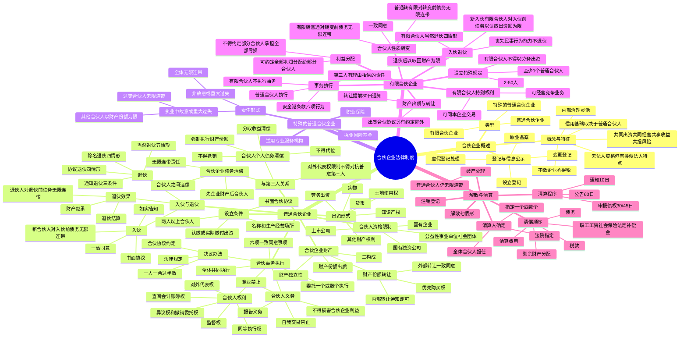

## 1. 章节定位

| 项目 | 信息 |
|------|------|
| 所属科目 | 经济法 |
| 难度等级 | 3 |
| 历年分值 | 5-8 分 |
| 建议学时 | 6-8 小时 |
| 知识关联章节 | 第1章 法律基本原理（非法人组织）；第2章 基本民事法律制度（合伙协议、连带债务）；第4章 合同法律制度（合伙协议性质、连带债务清偿）；第6章 公司法律制度（与公司组织形式对比）；第8章 企业破产法律制度（合伙企业破产） |

## 2. 考情分析

本章是经济法科目的重要章节，分值约 5-8 分。命题以主观题（案例分析题）为主，常以"合伙企业设立 → 合伙人入伙退伙 → 合伙债务清偿 → 合伙企业解散清算"为主线，重点考查普通合伙与有限合伙的区别、合伙人责任承担、入伙退伙的法律后果、特殊的普通合伙企业的责任形式等。客观题则集中在合伙人资格限制、出资形式、财产份额转让规则、事务执行决议办法、竞业禁止与自我交易禁止、当然退伙与除名退伙的区别、有限合伙人的特殊权利等知识点。

**命题规律**：本章命题注重对比考查普通合伙企业与有限合伙企业的异同，特别是合伙人的责任承担、事务执行权限、财产份额转让、入伙退伙规则等方面的差异。近年命题趋势是结合私募投资基金、员工持股平台等实务场景考查有限合伙企业的特殊规则。

**高频考点分布**：

1. **合伙企业概述**：合伙企业的五大特征（共同出资、共同经营、共享收益、共担风险；信用基础；无法人资格但有类似法人特点；内部治理灵活；不缴企业所得税）；普通合伙企业与有限合伙企业的区分。
2. **普通合伙企业设立**：五条件（两人以上合伙人、书面合伙协议、认缴或实际缴付出资、名称和生产经营场所、其他条件）；合伙人资格限制（国有独资公司、国有企业、上市公司、公益性事业单位社会团体不得成为普通合伙人）；出资形式（货币、实物、知识产权、土地使用权或其他财产权利、劳务——普通合伙人可劳务出资）。
3. **合伙企业财产**：三构成（合伙人出资、以合伙企业名义取得的收益、依法取得的其他财产）；财产独立性（清算前不得分割、私自处分不得对抗善意第三人）；财产份额转让（外部转让须一致同意、内部转让通知即可、同等条件下其他合伙人优先购买权）；财产份额出质（须一致同意，否则无效）。
4. **合伙事务执行**：两种形式（全体共同执行、委托一个或数个执行）；六项一致同意事项（改变名称、改变经营范围或主要经营场所、处分不动产、转让或处分知识产权和其他财产权利、以合伙企业名义为他人担保、聘任非合伙人担任经营管理人员）；合伙人权利（同等执行权、对外代表权、监督权、查阅会计账簿权、异议权和撤销委托权）；合伙人义务（报告义务、竞业禁止、自我交易禁止、不得损害合伙企业利益）；决议办法（合伙协议约定 → 一人一票过半数 → 法律规定）。
5. **合伙企业与第三人关系**：对外代表权限制不得对抗善意第三人；合伙企业债务清偿（先以合伙企业财产清偿，不足部分合伙人无限连带责任）；合伙人个人债务清偿（不得抵销、不得代位、可以分取收益清偿或强制执行财产份额）。
6. **入伙与退伙**：入伙条件（一致同意、书面协议、如实告知）；新合伙人对入伙前债务承担无限连带责任；自愿退伙（协议退伙四情形、通知退伙三条件）；强制退伙（当然退伙五情形、除名退伙四情形）；退伙效果（财产继承、退伙结算）；退伙人对退伙前债务承担无限连带责任。
7. **特殊的普通合伙企业**：适用专业服务机构；责任形式（执业中故意或重大过失：过错合伙人无限连带、其他合伙人以财产份额为限；非故意或重大过失及其他债务：全体无限连带）；执业风险基金与职业保险。
8. **有限合伙企业**：2-50 人、至少 1 个普通合伙人；有限合伙人不得以劳务出资；有限合伙人不执行事务、不得对外代表（安全港条款八项行为）；有限合伙人可同本企业交易、可经营竞争业务（合伙协议另有约定除外）；有限合伙人财产份额出质与转让；新入伙有限合伙人对入伙前债务以认缴出资额为限；有限合伙人退伙后以退伙时取回财产为限；合伙人性质转变规则。
9. **合伙企业解散与清算**：解散七情形；清算人确定（15 日内）；清算程序（通知 10 日、公告 60 日、申报债权 30/45 日）；清偿顺序（清算费用 → 职工工资、社会保险费用、法定补偿金 → 税款 → 债务 → 剩余财产分配）；注销登记；合伙企业破产后普通合伙人仍承担无限连带责任。

**联动考查方式**：

- 与第4章合同法律制度联动：合伙协议的性质、连带债务的清偿、合伙企业的合同行为；
- 与第6章公司法律制度联动：合伙企业与公司在组织形式、责任承担、治理结构上的对比；
- 与第8章破产法律制度联动：合伙企业不能清偿到期债务的处理、合伙企业破产。

**备考建议**：

- 重点对比普通合伙与有限合伙在合伙人责任、事务执行、出资形式、财产份额转让、入伙退伙规则等方面的差异；
- 记住"先企业后个人"的债务清偿原则：合伙企业债务先以合伙企业财产清偿，不足部分合伙人才承担无限连带责任；
- 区分当然退伙（法定事由自动发生）与除名退伙（其他合伙人一致同意决议）；
- 特殊的普通合伙企业的责任分担是重点：过错合伙人无限连带，无过错合伙人以财产份额为限，但仅限于执业活动中因故意或重大过失造成的债务；
- 有限合伙人的"安全港条款"八项行为不视为执行合伙事务，需准确记忆；
- 退伙人对退伙前债务承担无限连带责任，但有限合伙人退伙后仅以退伙时取回财产为限。

## 3. 知识框架

## 4. 核心精讲

### 4.1 合伙企业法律制度概述

**合伙企业**是自然人、法人和其他组织依照《合伙企业法》在中国境内设立的普通合伙企业和有限合伙企业。

**合伙企业的五大特征**：

1. 合伙企业是合伙人共同出资、共同经营、共享收益、共担风险的自愿联合形成的经济组织。其中最关键的是**共担风险**——直接或变相约定一方当事人无论企业盈亏均有权获得投资回报的协议，违背了合伙的基本原则，不构成合伙协议。
2. 合伙企业的信用基础最终取决于普通合伙人的偿债能力。合伙企业首先以自有财产清偿债务，但对其债务兜底的最终是承担无限连带责任的普通合伙人。
3. 合伙企业无法人资格，但具有许多类似法人的特点（可以自己的名义从事法律行为、拥有独立财产、先以企业财产清偿债务、可以自己名义起诉应诉等）。
4. 合伙企业的内部治理和利益分配高度灵活，主要由合伙协议规范。
5. 合伙企业并非企业所得税纳税人，由合伙人分别缴纳所得税。

**合伙企业的类型**：

| 类型 | 合伙人组成 | 责任承担 |
|------|----------|---------|
| 普通合伙企业 | 普通合伙人 | 全体无限连带责任 |
| 特殊的普通合伙企业 | 普通合伙人（专业服务机构） | 区分故意/重大过失与非故意/重大过失 |
| 有限合伙企业 | 普通合伙人 + 有限合伙人 | 普通合伙人无限连带，有限合伙人以认缴出资额为限 |

### 4.2 普通合伙企业

#### 4.2.1 普通合伙企业的设立条件

1. **有两个以上合伙人**：合伙人为自然人的，应当具有完全民事行为能力。**不得成为普通合伙人的主体**：国有独资公司、国有企业、上市公司以及公益性的事业单位、社会团体。
2. **有书面合伙协议**：合伙协议经全体合伙人签名、盖章后生效。修改或补充合伙协议，应当经全体合伙人一致同意，但合伙协议另有约定的除外。
3. **有合伙人认缴或实际缴付的出资**：合伙人可以用货币、实物、知识产权、土地使用权或其他财产权利出资，也可以用**劳务出资**（区别于公司出资形式）。劳务出资的评估办法由全体合伙人协商确定，并在合伙协议中载明。
4. **有合伙企业的名称和生产经营场所**：普通合伙企业应在名称中标明"普通合伙"字样，特殊的普通合伙企业标明"特殊普通合伙"字样。
5. 法律、行政法规规定的其他条件。

#### 4.2.2 合伙企业财产

**合伙企业财产的构成**：(1) 合伙人的出资；(2) 以合伙企业名义取得的收益；(3) 依法取得的其他财产。

**合伙企业财产的性质**：合伙企业财产独立于合伙人个人财产。合伙人在合伙企业清算前，不得请求分割合伙企业的财产（法律另有规定的除外）。合伙人私自转移或处分合伙企业财产的，合伙企业不得以此对抗**善意第三人**。

**合伙人财产份额的转让**：

| 转让类型 | 条件 | 优先购买权 |
|---------|------|----------|
| 外部转让（向合伙人以外的人转让） | 除合伙协议另有约定外，须经其他合伙人**一致同意** | 同等条件下，其他合伙人有优先购买权 |
| 内部转让（合伙人之间转让） | 应当**通知**其他合伙人 | 无优先购买权问题 |

**合伙人财产份额的出质**：合伙人以其在合伙企业中的财产份额出质的，须经其他合伙人**一致同意**；未经一致同意的，出质行为无效，由此给善意第三人造成损失的，由行为人依法承担赔偿责任。

#### 4.2.3 合伙事务执行与损益分配

**合伙事务执行的两种形式**：

1. **全体合伙人共同执行合伙事务**：合伙协议未约定或全体合伙人未决定委托执行事务合伙人的，全体合伙人均为执行事务合伙人。
2. **委托一个或数个合伙人执行合伙事务**：委托后，其他合伙人不再执行合伙事务。

**须经全体合伙人一致同意的六项事项**（除合伙协议另有约定外）：

1. 改变合伙企业的名称；
2. 改变合伙企业的经营范围、主要经营场所的地点；
3. 处分合伙企业的不动产；
4. 转让或处分合伙企业的知识产权和其他财产权利；
5. 以合伙企业名义为他人提供担保；
6. 聘任合伙人以外的人担任合伙企业的经营管理人员。

**合伙人的权利**：

| 权利 | 内容 |
|------|------|
| 同等执行权 | 各合伙人无论出资多少，都有权平等享有执行合伙企业事务的权利 |
| 对外代表权 | 执行合伙事务的合伙人对外代表合伙企业 |
| 监督权 | 不执行合伙事务的合伙人有权监督执行事务合伙人 |
| 查阅会计账簿权 | 合伙人有权查阅合伙企业会计账簿等财务资料 |
| 异议权和撤销委托权 | 合伙人分别执行事务的，可对其他合伙人执行的事务提出异议；受委托执行事务的合伙人不按约定执行的，其他合伙人可决定撤销委托 |

**合伙人的义务**：

1. **报告义务**：执行事务合伙人应定期向其他合伙人报告事务执行情况以及合伙企业的经营状况和财务状况；
2. **竞业禁止**：合伙人不得自营或同他人合作经营与本合伙企业相竞争的业务。违反的，该收益归合伙企业所有；
3. **自我交易禁止**：除合伙协议另有约定或经全体合伙人一致同意外，合伙人不得同本合伙企业进行交易。违反的，该合伙人所取得收益归合伙企业所有；
4. **不得损害合伙企业利益**：不得将应当归属合伙企业的利益或商业机会据为己有，不得侵占合伙企业财产。

**合伙事务执行的决议办法**：(1) 按合伙协议约定的表决办法办理；(2) 合伙协议未约定或约定不明确的，实行**一人一票**并经全体合伙人**过半数**通过的表决办法；(3) 法律另有规定的，从其规定。

**合伙企业的损益分配原则**：

1. 按合伙协议的约定办理；
2. 合伙协议未约定或约定不明确的，由合伙人协商决定；
3. 协商不成的，由合伙人按照**实缴出资比例**分配、分担；
4. 无法确定出资比例的，由合伙人**平均**分配、分担；
5. 合伙协议**不得约定**将全部利润分配给部分合伙人或由部分合伙人承担全部亏损。

#### 4.2.4 合伙企业与第三人的关系

**合伙企业对外代表权的限制**：合伙企业对合伙人执行合伙事务以及对外代表合伙企业权利的限制，**不得对抗善意第三人**。善意第三人是指不知道且没有理由知道合伙企业所作内部限制，本着合法交易目的与合伙企业建立法律关系的主体。

**合伙企业债务的清偿**：

1. **第一顺序**：合伙企业对其债务，应先以其**全部财产**进行清偿；
2. **第二顺序**：合伙企业不能清偿到期债务的，合伙人承担**无限连带责任**；
3. **合伙人之间的追偿**：合伙人清偿数额超过规定亏损分担比例的，有权向其他合伙人追偿。

注意：合伙人的无限责任和连带责任，均以**合伙企业财产不足以清偿到期债务**为发生前提。合伙人之间的分担比例对债权人没有约束力。

**合伙人个人债务的清偿**：

1. 合伙人发生与合伙企业无关的债务，相关债权人**不得以**其债权抵销其对合伙企业的债务，**不得代位行使**合伙人在合伙企业中的权利；
2. 合伙人自有财产不足清偿其与合伙企业无关的债务的，该合伙人可以以其从合伙企业中**分取的收益**用于清偿；
3. 债权人也可以依法请求人民法院**强制执行**该合伙人在合伙企业中的财产份额用于清偿。强制执行时，应通知全体合伙人，其他合伙人有优先购买权；其他合伙人未购买又不同意转让给他人的，办理退伙结算或削减相应财产份额的结算。

#### 4.2.5 入伙与退伙

**入伙**：

- **条件**：除合伙协议另有约定外，应当经全体合伙人**一致同意**，并依法订立书面入伙协议；
- **告知义务**：订立入伙协议时，原合伙人应当向新合伙人**如实告知**原合伙企业的经营状况和财务状况；
- **新合伙人的责任**：新合伙人对入伙前合伙企业的债务承担**无限连带责任**。

**退伙的原因**：

| 类型 | 情形 |
|------|------|
| 协议退伙（约定合伙期限） | (1) 合伙协议约定的退伙事由出现；(2) 经全体合伙人一致同意；(3) 发生合伙人难以继续参加合伙的事由；(4) 其他合伙人严重违反合伙协议约定的义务 |
| 通知退伙（未约定合伙期限） | 须同时满足三条件：(1) 合伙协议未约定合伙期限；(2) 退伙不给合伙企业事务执行造成不利影响；(3) 提前 30 日通知其他合伙人 |
| 当然退伙（法定） | (1) 作为合伙人的自然人死亡或被依法宣告死亡；(2) 个人丧失偿债能力；(3) 作为合伙人的法人或其他组织依法被吊销营业执照、责令关闭、撤销或被宣告破产；(4) 法律规定或合伙协议约定合伙人必须具有相关资格而丧失该资格；(5) 合伙人在合伙企业中的全部财产份额被人民法院强制执行 |
| 除名退伙（决议） | (1) 未履行出资义务；(2) 因故意或重大过失给合伙企业造成损失；(3) 执行合伙事务时有不正当行为；(4) 发生合伙协议约定的事由 |

**当然退伙**以退伙事由实际发生之日为退伙生效日。**除名退伙**应当书面通知被除名人，被除名人接到除名通知之日除名生效；被除名人有异议的，可以自接到除名通知之日起 30 日内向人民法院起诉。

**合伙人丧失民事行为能力的处理**：合伙人被依法认定为无民事行为能力人或限制民事行为能力人的，经其他合伙人一致同意，可以依法转为有限合伙人，普通合伙企业依法转为有限合伙企业。其他合伙人未能一致同意的，该合伙人退伙。

**退伙的效果**：

1. **财产继承**（合伙人死亡或被依法宣告死亡）：继承人在以下条件下取得合伙人资格：(1) 有合法继承权；(2) 合伙协议约定或全体合伙人一致同意；(3) 继承人愿意。继承人为无民事行为能力人或限制民事行为能力人的，经全体合伙人一致同意，可以依法成为有限合伙人。
2. **退伙结算**（其他退伙情形）：按照退伙时的合伙企业财产状况进行结算，退还退伙人的财产份额。退伙人对给合伙企业造成损失负有赔偿责任的，相应扣减。退伙时有未了结事务的，待事务了结后结算。
3. **退伙人的责任**：退伙人对基于其**退伙前**的原因发生的合伙企业债务，承担**无限连带责任**。

### 4.3 特殊的普通合伙企业

**特殊的普通合伙企业**通常是以专业知识和专门技能为客户提供有偿服务的专业服务机构（如会计师事务所、律师事务所等）。名称中应当标明"特殊普通合伙"字样。

**责任形式**：

| 情形 | 责任承担 |
|------|---------|
| 合伙人在执业活动中**因故意或重大过失**造成合伙企业债务 | 过错合伙人承担无限责任或无限连带责任；**其他合伙人以其在合伙企业中的财产份额为限**承担责任 |
| 合伙人在执业活动中**非因故意或重大过失**造成的合伙企业债务以及合伙企业的其他债务 | 全体合伙人承担**无限连带责任** |

**责任追偿**：合伙人执业活动中因故意或重大过失造成的合伙企业债务，以合伙企业财产对外承担责任后，该合伙人应当按照合伙协议的约定对给合伙企业造成的损失承担赔偿责任。

**执业风险防范**：特殊的普通合伙企业应当建立**执业风险基金**、办理**职业保险**。执业风险基金应当单独立户管理。

### 4.4 有限合伙企业

#### 4.4.1 有限合伙企业设立的特殊规定

**人数**：有限合伙企业由 **2 个以上 50 个以下**合伙人设立，但法律另有规定的除外。有限合伙企业**至少应当有 1 个普通合伙人**。

**合伙人资格**：国有独资公司、国有企业、上市公司以及公益性的事业单位、社会团体不得成为有限合伙企业的**普通合伙人**（可以成为有限合伙人）。

**有限合伙人出资形式**：可以用货币、实物、知识产权、土地使用权或其他财产权利作价出资，但**不得以劳务出资**。

**组织形式变化**：有限合伙企业仅剩有限合伙人的，应当**解散**；仅剩普通合伙人的，应当**转为普通合伙企业**。

#### 4.4.2 有限合伙企业事务执行的特殊规定

**事务执行**：有限合伙企业由**普通合伙人**执行合伙事务。有限合伙人不执行合伙事务，不得对外代表有限合伙企业。

**有限合伙人的"安全港条款"**——下列行为不视为执行合伙事务：

1. 参与决定普通合伙人入伙、退伙；
2. 对企业的经营管理提出建议；
3. 参与选择承办有限合伙企业审计业务的会计师事务所；
4. 获取经审计的有限合伙企业财务会计报告；
5. 对涉及自身利益的情况，查阅有限合伙企业财务会计账簿等财务资料；
6. 在有限合伙企业中的利益受到侵害时，向有责任的合伙人主张权利或提起诉讼；
7. 执行事务合伙人怠于行使权利时，督促其行使权利或为了本企业的利益以自己的名义提起诉讼；
8. 依法为本企业提供担保。

**表见代理责任**：第三人有理由相信有限合伙人为普通合伙人并与其交易的，该有限合伙人对该笔交易承担与普通合伙人同样的责任。有限合伙人未经授权以有限合伙企业名义与他人进行交易，给有限合伙企业或其他合伙人造成损失的，该有限合伙人应当承担赔偿责任。

#### 4.4.3 有限合伙企业的利益分配

有限合伙企业**不得将全部利润分配给部分合伙人**；但是，**合伙协议另有约定的除外**（与普通合伙企业不同，有限合伙企业可以约定将全部利润分配给部分合伙人）。

但是，《合伙企业法》**不允许**合伙协议约定部分合伙人承担全部亏损或部分合伙人完全不承担亏损。

#### 4.4.4 有限合伙人的特别权利

| 权利 | 普通合伙人 | 有限合伙人 |
|------|----------|----------|
| 同本企业进行交易 | 除合伙协议另有约定或经全体一致同意外，不得 | 可以，但合伙协议另有约定的除外 |
| 经营与本企业相竞争的业务 | 不得 | 可以，但合伙协议另有约定的除外 |
| 财产份额出质 | 须经其他合伙人一致同意 | 可以，但合伙协议另有约定的除外 |
| 财产份额对外转让 | 须经其他合伙人一致同意 | 按合伙协议约定，提前 30 日通知 |

#### 4.4.5 有限合伙企业的入伙与退伙

**入伙**：新入伙的有限合伙人对入伙前有限合伙企业的债务，**以其认缴的出资额为限**承担责任（与普通合伙企业新合伙人对入伙前债务承担无限连带责任不同）。

**有限合伙人当然退伙**四情形：(1) 作为合伙人的自然人死亡或被依法宣告死亡；(2) 作为合伙人的法人或其他组织依法被吊销营业执照、责令关闭、撤销或被宣告破产；(3) 法律规定或合伙协议约定合伙人必须具有相关资格而丧失该资格；(4) 合伙人在合伙企业中的全部财产份额被人民法院强制执行。

注意：有限合伙人当然退伙的情形比普通合伙人少了"个人丧失偿债能力"一项，因为有限合伙人本身只承担有限责任。

**有限合伙人丧失民事行为能力**：作为有限合伙人的自然人在有限合伙企业存续期间丧失民事行为能力的，其他合伙人**不得因此要求其退伙**（与普通合伙人不同）。

**有限合伙人继承人的权利**：作为有限合伙人的自然人死亡、被依法宣告死亡或作为有限合伙人的法人及其他组织终止时，其继承人或权利承受人可以依法取得该有限合伙人在有限合伙企业中的资格。

**有限合伙人退伙后的责任**：有限合伙人退伙后，对基于其退伙前的原因发生的有限合伙企业债务，**以其退伙时从有限合伙企业中取回的财产**承担责任。

#### 4.4.6 合伙人性质转变

除合伙协议另有约定外，普通合伙人转变为有限合伙人，或有限合伙人转变为普通合伙人，应当经**全体合伙人一致同意**。

| 转变方向 | 对转变前债务的责任 |
|---------|-----------------|
| 有限合伙人转变为普通合伙人 | 对作为有限合伙人期间有限合伙企业发生的债务承担**无限连带责任** |
| 普通合伙人转变为有限合伙人 | 对作为普通合伙人期间合伙企业发生的债务承担**无限连带责任** |

### 4.5 合伙企业的解散与清算

#### 4.5.1 合伙企业的解散

合伙企业有下列情形之一的，应当解散：

1. 合伙期限届满，合伙人决定不再经营；
2. 合伙协议约定的解散事由出现；
3. 全体合伙人决定解散；
4. 合伙人已不具备法定人数满 **30 天**；
5. 合伙协议约定的合伙目的已经实现或无法实现；
6. 依法被吊销营业执照、责令关闭或被撤销；
7. 法律、行政法规规定的其他原因。

#### 4.5.2 合伙企业的清算

**清算人的确定**：

- 由全体合伙人担任；
- 经全体合伙人过半数同意，可以自合伙企业解散事由出现后 **15 日内**指定一个或数个合伙人，或委托第三人担任清算人；
- 自解散事由出现之日起 15 日内未确定清算人的，合伙人或其他利害关系人可以申请人民法院指定清算人。

**通知和公告债权人**：

- 清算人自被确定之日起 **10 日内**将合伙企业解散事项通知债权人；
- 于 **60 日内**在报纸上公告；
- 债权人应当自接到通知书之日起 **30 日内**，未接到通知书的自公告之日起 **45 日内**，向清算人申报债权。

**清算人的职责**：(1) 清理合伙企业财产，分别编制资产负债表和财产清单；(2) 处理与清算有关的合伙企业未了结事务；(3) 清缴所欠税款；(4) 清理债权、债务；(5) 处理合伙企业清偿债务后的剩余财产；(6) 代表合伙企业参加诉讼或仲裁活动。

**财产清偿顺序**：

1. **清算费用**（管理财产费用、处分财产费用、清算过程中的其他费用）；
2. **职工工资、社会保险费用和法定补偿金**；
3. **缴纳所欠税款**；
4. **清偿债务**；
5. **剩余财产分配**（按合伙协议约定 → 协商决定 → 实缴出资比例 → 平均分配）。

违反《合伙企业法》规定，应当承担民事赔偿责任和缴纳罚款、罚金，其财产不足以同时支付的，**先承担民事赔偿责任**。

**注销登记**：清算人应当自清算结束之日起 **30 日内**向登记机关申请注销登记。经注销登记，合伙企业终止。合伙企业注销后，原普通合伙人对合伙企业存续期间的债务**仍应承担无限连带责任**。

**合伙企业不能清偿到期债务的处理**：债权人可以依法向人民法院提出破产清算申请，也可以要求普通合伙人清偿。合伙企业依法被宣告破产的，普通合伙人对合伙企业的债务**仍应承担无限连带责任**。

## 5. 典型例题

**【例题 1 - 单选题】合伙企业财产份额转让**

甲、乙、丙三人共同投资设立普通合伙企业 A，合伙协议未对财产份额转让作特别约定。现甲拟将其在合伙企业中的全部财产份额转让给丁。关于本案，下列说法正确的是（ ）。

A. 甲可以自由转让其财产份额给丁，无需经乙、丙同意
B. 甲转让财产份额给丁，须经乙、丙一致同意
C. 甲转让财产份额给丁，仅需通知乙、丙
D. 甲转让财产份额给丁，须经乙、丙过半数同意

**答案：B**

**解析**：本题考查合伙人财产份额的外部转让规则。根据《合伙企业法》规定，除合伙协议另有约定外，合伙人向合伙人以外的人转让其在合伙企业中的全部或部分财产份额时，须经其他合伙人**一致同意**。本题合伙协议未作特别约定，故甲转让财产份额给丁须经乙、丙一致同意。B 项正确。A 项错误，外部转让非自由转让。C 项错误，通知即可是内部转让（合伙人之间转让）的规则。D 项错误，法律要求的是"一致同意"而非"过半数同意"。另外，在同等条件下，其他合伙人（乙、丙）享有优先购买权。

---

**【例题 2 - 单选题】特殊的普通合伙企业责任**

甲、乙、丙、丁共同设立特殊的普通合伙企业（会计师事务所）。在执业过程中，甲因重大过失出具了虚假审计报告，给客户造成损失 500 万元。合伙企业财产仅有 200 万元。关于本案，下列说法正确的是（ ）。

A. 甲、乙、丙、丁均对该 500 万元债务承担无限连带责任
B. 甲承担无限责任，乙、丙、丁以其在合伙企业中的财产份额为限承担责任
C. 甲、乙、丙、丁均以其在合伙企业中的财产份额为限承担责任
D. 甲承担无限责任，乙、丙、丁不承担任何责任

**答案：B**

**解析**：本题考查特殊的普通合伙企业的责任形式。根据《合伙企业法》规定，一个合伙人或数个合伙人在执业活动中**因故意或重大过失**造成合伙企业债务的，应当承担无限责任或无限连带责任，**其他合伙人以其在合伙企业中的财产份额为限**承担责任。本题中甲因**重大过失**出具虚假审计报告，属于执业活动中因重大过失造成合伙企业债务，故甲承担无限责任，乙、丙、丁（无过错合伙人）以其在合伙企业中的财产份额为限承担责任。B 项正确。A 项错误，这是非因故意或重大过失情形下的责任承担方式。C 项错误，这是有限责任公司的责任形式。D 项错误，无过错合伙人仍需以财产份额为限承担责任。另外，以合伙企业财产对外承担责任后，甲应当按照合伙协议的约定对给合伙企业造成的损失承担赔偿责任。

---

**【例题 3 - 多选题】有限合伙人的特殊权利**

关于有限合伙人的权利，下列说法正确的有（ ）。

A. 有限合伙人可以同本有限合伙企业进行交易，但合伙协议另有约定的除外
B. 有限合伙人可以自营或同他人合作经营与本有限合伙企业相竞争的业务，但合伙协议另有约定的除外
C. 有限合伙人可以将其在有限合伙企业中的财产份额出质，但合伙协议另有约定的除外
D. 有限合伙人可以按照合伙协议的约定向合伙人以外的人转让其在有限合伙企业中的财产份额，但应当提前 30 日通知其他合伙人

**答案：A、B、C、D**

**解析**：本题考查有限合伙人的特别权利。有限合伙人相比普通合伙人享有更多的灵活权利：

- A 项正确：有限合伙人可以同本有限合伙企业进行交易（普通合伙人原则上不得），但合伙协议另有约定的除外；
- B 项正确：有限合伙人可以经营竞争业务（普通合伙人不得），但合伙协议另有约定的除外；
- C 项正确：有限合伙人可以将其财产份额出质（普通合伙人出质须经一致同意），但合伙协议另有约定的除外；
- D 项正确：有限合伙人可以按合伙协议约定向合伙人以外的人转让财产份额，应提前 30 日通知其他合伙人（普通合伙人外部转让须经一致同意）。在同等条件下，其他合伙人有优先购买权。

---

**【例题 4 - 案例分析题】普通合伙企业入伙退伙与债务清偿**

甲、乙、丙三人于 2022 年 1 月共同设立普通合伙企业 A，从事建材销售。合伙协议约定：三人出资比例分别为 50%、30%、20%，利润分配和亏损分担按出资比例。2023 年 3 月，丁经甲、乙、丙一致同意入伙，丁出资 10 万元，占 10% 份额（其他三人份额相应稀释）。2023 年 6 月，丙因个人丧失偿债能力，当然退伙。2023 年 10 月，A 企业因经营不善欠 B 公司货款 200 万元到期不能清偿。经查，A 企业现有财产仅 50 万元。其中 100 万元债务系 2023 年 2 月（丁入伙前）所欠，另 100 万元系 2023 年 8 月（丙退伙后）所欠。

要求：
(1) 分析丁对 2023 年 2 月所欠的 100 万元债务是否承担责任。
(2) 分析丙对 2023 年 8 月所欠的 100 万元债务是否承担责任。
(3) 分析 B 公司如何实现其 200 万元债权。

**【答案与解析】**

(1) **丁对入伙前债务的责任**：

根据《合伙企业法》规定，新合伙人对**入伙前**合伙企业的债务承担**无限连带责任**。丁于 2023 年 3 月入伙，2023 年 2 月所欠的 100 万元债务属于丁入伙前的债务，因此丁对该 100 万元债务承担无限连带责任。

(2) **丙对退伙后债务的责任**：

根据《合伙企业法》规定，退伙人对基于其**退伙前**的原因发生的合伙企业债务，承担无限连带责任。丙于 2023 年 6 月退伙，2023 年 8 月所欠的 100 万元债务系丙退伙后发生的，不属于"基于退伙前的原因发生的债务"，因此丙对该 100 万元债务**不承担责任**。

但丙对 2023 年 2 月所欠的 100 万元债务（丙退伙前发生）仍应承担无限连带责任。

(3) **B 公司债权的实现**：

① **第一顺序**：A 企业对其债务，应先以其全部财产进行清偿。A 企业现有财产 50 万元，应首先用于清偿 B 公司的债务。

② **第二顺序**：A 企业财产不足清偿部分（200 - 50 = 150 万元），由合伙人承担无限连带责任。

③ 对于 2023 年 2 月的 100 万元债务（入伙前、丙退伙前）：
- 甲、乙、丙（退伙人对退伙前债务仍承担责任）、丁（新合伙人对入伙前债务承担责任）均承担无限连带责任。
- B 公司可以请求甲、乙、丙、丁中任何一人或数人清偿该 100 万元扣除 A 企业已清偿部分后的余额。

④ 对于 2023 年 8 月的 100 万元债务（丙退伙后）：
- 甲、乙、丁承担无限连带责任，丙不承担责任。
- B 公司可以请求甲、乙、丁中任何一人或数人清偿。

⑤ **合伙人之间的追偿**：合伙人实际清偿数额超过其应承担份额的，有权向其他合伙人追偿。亏损分担比例为：甲 50%、乙 30%、丙 20%（丁入伙后份额稀释，具体按新合伙协议确定）。

---

**【例题 5 - 案例分析题】有限合伙企业事务执行**

甲（普通合伙人）、乙（普通合伙人）、丙（有限合伙人）共同设立有限合伙企业 B，从事股权投资。合伙协议未对有限合伙人行为作特别约定。在经营过程中，丙实施了以下行为：(1) 对 B 企业的经营管理提出建议；(2) 参与选择承办 B 企业审计业务的会计师事务所；(3) 未经授权以 B 企业名义与 C 公司签订投资协议，给 B 企业造成损失 50 万元；(4) 自营与 B 企业相竞争的业务。

要求：分析丙上述行为的合法性及法律后果。

**【答案与解析】**

(1) **对 B 企业的经营管理提出建议**：

根据《合伙企业法》规定，有限合伙人对企业的经营管理提出建议，**不视为执行合伙事务**，属于"安全港条款"列举的行为之一。因此丙的行为合法，不产生执行合伙事务的法律后果。

(2) **参与选择承办 B 企业审计业务的会计师事务所**：

根据《合伙企业法》规定，有限合伙人参与选择承办有限合伙企业审计业务的会计师事务所，**不视为执行合伙事务**，属于"安全港条款"列举的行为之一。因此丙的行为合法。

(3) **未经授权以 B 企业名义与 C 公司签订投资协议**：

根据《合伙企业法》规定，有限合伙人不执行合伙事务，不得对外代表有限合伙企业。有限合伙人未经授权以有限合伙企业名义与他人进行交易，给有限合伙企业或其他合伙人造成损失的，该有限合伙人应当承担**赔偿责任**。因此丙应当对 B 企业的 50 万元损失承担赔偿责任。

另外，如果 C 公司有理由相信丙为普通合伙人并与其交易的，丙对该笔交易承担与普通合伙人同样的责任。

(4) **自营与 B 企业相竞争的业务**：

根据《合伙企业法》规定，有限合伙人**可以**自营或同他人合作经营与本有限合伙企业相竞争的业务，但合伙协议另有约定的除外。本题合伙协议未作特别约定，因此丙自营竞争业务**合法**，不承担法律责任。（注意：如果是普通合伙人，则不得经营竞争业务）

## 6. 记忆口诀

**合伙企业特征口诀**：共同出资经营，共享收益共担风险；信用基础普通合伙人；无法人但似法人；治理灵活不缴税。

**合伙人资格限制口诀**：国有独资、国有、上市、公益，不得当普通合伙人。

**出资形式口诀**：货币实物知产土，其他权利加劳务（普通合伙人可劳务出资，有限合伙人不可）。

**财产份额转让口诀**：外部转让一致同意，内部转让通知即可；同等条件优先买；出质一致同意否则无效。

**六项一致同意事项口诀**：改名改范围改场所，处分不动产，处分知识产权其他财产，为他人担保，聘任外人管经营。

**决议办法口诀**：协议约定 → 一人一票过半数 → 法律规定。

**损益分配口诀**：协议约定 → 协商决定 → 实缴比例 → 平均分担；不得全归部分人，不得部分人担全亏。

**债务清偿口诀**：先企业后个人，无限连带两层次；个人债务不得抵销不得代位，分取收益可清偿，强制执行有优先。

**入伙退伙口诀**：
- 入伙：一致同意 + 书面协议 + 如实告知 + 入伙前债务无限连带；
- 协议退伙四情形：事由出现、一致同意、难以参加、严重违约；
- 通知退伙三条件：未约期限、不影响、提前 30 日；
- 当然退伙五情形：死亡、丧失偿债能力、吊销破产、丧失资格、强制执行；
- 除名退伙四情形：未出资、故意重大过失损失、不正当行为、约定事由；
- 退伙人对退伙前债务无限连带。

**特殊普通合伙责任口诀**：故意重大过失——过错者无限连带，无过者份额为限；非故意重大过失——全体无限连带。

**有限合伙人口诀**：2-50 人至少一普通；不执行事务不代表；安全港八项不视为执行；可交易可竞争可出质可转让；入伙前以认缴为限；退伙后以取回为限。

**有限与普通对比口诀**：
- 出资：普通可劳务，有限不可；
- 事务：普通执行，有限不执行；
- 竞业：普通禁止，有限可以；
- 交易：普通禁止，有限可以；
- 出质：普通一致同意，有限可以；
- 转让：普通一致同意，有限通知 30 日；
- 入伙前债务：普通无限连带，有限以认缴为限；
- 退伙后债务：普通无限连带，有限以取回为限；
- 丧失行为能力：普通可转为有限或退伙，有限不退伙。

**解散清算口诀**：七情形解散；15 日定清算人；10 日通知 60 日公告；30/45 日申报债权；清偿顺序：清算费→工资社保补偿金→税款→债务→剩余分配；破产普通合伙人仍连带。
