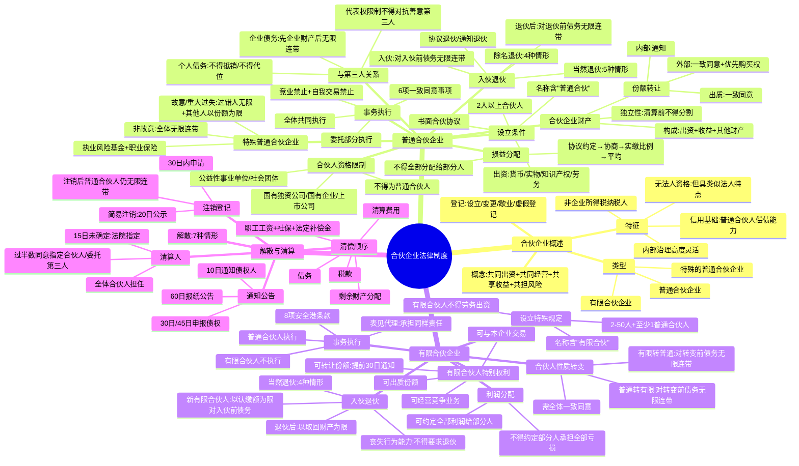

## 📍 章节定位

| 项目 | 信息 |
|------|------|
| **所属科目** | ⚖️ 经济法 |
| **难度等级** | ⭐⭐ |
| **历年分值** | 3-4分 |
| **建议学时** | 4-5h |

## 📝 考情分析

本章是经济法的**次重点章节**，历年分值稳定在 3-4 分，以客观题为主，偶与公司法结合出案例分析题。本章内容相对独立，理解难度不高，但细节考点较多。

近年命题热点集中在：(1) 合伙企业的特征（共担风险、无法人资格、不缴纳企业所得税、以自己名义起诉应诉）；(2) 普通合伙企业设立条件与合伙人资格限制（国有独资公司、国有企业、上市公司、公益性事业单位不得成为普通合伙人）；(3) 合伙企业财产的独立性与份额转让规则（外部转让一致同意、内部转让通知、优先购买权、出质规则）；(4) 合伙事务执行（6 项一致同意事项、竞业禁止、自我交易禁止）；(5) 合伙企业与第三人关系（对外代表权限制不得对抗善意第三人、合伙企业债务与合伙人个人债务的清偿规则）；(6) 入伙退伙（新合伙人对入伙前债务的责任、当然退伙与除名退伙的区分、退伙后责任）；(7) 特殊的普通合伙企业（故意或重大过失的责任分担）；(8) 有限合伙企业特殊规则（人数限制、出资形式限制、安全港条款、利润分配灵活性、合伙人转变责任承担）；(9) 合伙企业解散与清算（清算人确定、清偿顺序）。

本章学习关键在于**对比记忆普通合伙与有限合伙的差异**，重点把握责任承担规则和份额转让规则。命题常以小案例形式考查责任分担，建议结合对比表系统记忆。

## 🧠 知识框架

## 📖 核心精讲

### 一、合伙企业法律制度概述

#### （一）合伙企业的概念与特征

**合伙企业**是自然人、法人和其他组织依照《合伙企业法》在中国境内设立的普通合伙企业和有限合伙企业。合伙是两个以上的人为共同营业目的，通过自愿约定组成的共同出资、共同经营、共享收益、共担风险的联合体。

**合伙企业的五大特征**：

| 特征 | 内容 |
|------|------|
| **共同出资、共同经营、共享收益、共担风险** | 最关键的是**共担风险**——合伙人共同承担经营风险，是合伙区别于其他合同关系的核心。直接或变相约定一方无论企业盈亏均获得投资回报的协议，不构成合伙协议 |
| **信用基础取决于普通合伙人偿债能力** | 合伙企业债务最终由承担无限连带责任的普通合伙人兜底，这是合伙企业区别于公司的关键特征 |
| **无法人资格，但具类似法人特点** | 合伙企业可以自己名义从事法律行为、拥有独立财产、以自己名义起诉应诉；但法律上不具法人资格，属非法人组织 |
| **内部治理和利益分配高度灵活** | 主要由合伙协议规范，法律强制性规范很少 |
| **非企业所得税纳税人** | 生产经营所得和其他所得由合伙人分别缴纳所得税，合伙企业本身不缴纳企业所得税 |

> **关键考点**：合伙企业属于**非法人组织**（非"特别法人"），合伙企业财产独立于合伙人（非"就是合伙人的财产"），合伙企业可以自己名义参与诉讼（非"不能以自己名义参与诉讼"）。（2024 年真题）

#### （二）合伙企业的类型

| 类型 | 合伙人组成 | 责任承担 |
|------|------------|----------|
| **普通合伙企业** | 普通合伙人 | 合伙人对合伙企业债务承担无限连带责任 |
| **特殊的普通合伙企业** | 普通合伙人（特殊形态） | 故意或重大过失的合伙人承担无限责任，其他合伙人以财产份额为限 |
| **有限合伙企业** | 普通合伙人 + 有限合伙人 | 普通合伙人无限连带责任；有限合伙人以认缴出资额为限 |

#### （三）合伙企业的登记与信息公示

**设立登记事项**（8 项）：名称、合伙类型、经营范围、主要经营场所、合伙人出资额、执行事务合伙人、合伙人名称或姓名住所及承担责任方式、其他法定事项。

**备案事项**（6 项）：合伙协议、合伙期限、出资数额及缴付期限和方式、联络员、受益所有人信息、其他法定事项。

**变更登记**：自作出变更决议或法定变更事项发生之日起 **30 日内**申请。

**歇业备案**：因自然灾害、事故灾难等造成经营困难的，可自主决定歇业，期限最长不超过 **3 年**。

**虚假登记的处理**：提交虚假材料取得登记的，登记机关可撤销登记；直接责任人自登记被撤销之日起 **3 年内**不得再次申请合伙企业登记。

### 二、普通合伙企业

#### （一）普通合伙企业的设立条件

| 条件 | 具体要求 |
|------|----------|
| **合伙人** | 2 人以上；自然人的应具有完全民事行为能力 |
| **书面合伙协议** | 全体合伙人协商一致以书面形式订立；经全体合伙人签名、盖章后生效 |
| **出资** | 合伙人认缴或实际缴付的出资 |
| **名称和生产经营场所** | 名称中标明"普通合伙"字样；主要经营场所只能有一个 |
| **其他条件** | 法律、行政法规规定的其他条件 |

**合伙人资格的限制**：

> **不得成为普通合伙人的主体**：国有独资公司、国有企业、上市公司以及公益性的事业单位、社会团体。这些主体可以成为有限合伙人。

**出资方式**：货币、实物、知识产权、土地使用权或其他财产权利，**也可以用劳务出资**（与公司出资形式不同，体现合伙企业的灵活性）。以非货币财产出资的，可由全体合伙人协商确定或委托法定评估机构评估；以劳务出资的，评估办法由全体合伙人协商确定并在合伙协议中载明。

#### （二）合伙企业财产与合伙人份额转让

**合伙企业财产的构成**：①合伙人的出资（原始财产）；②以合伙企业名义取得的收益（营业收入、投资收益等）；③依法取得的其他财产（如接受赠与、侵权赔偿金等）。

**合伙企业财产的性质**：具有独立性。合伙人在合伙企业清算前**不得请求分割**合伙企业财产；私自转移或处分合伙企业财产的，合伙企业不得以此对抗善意第三人。

**合伙人财产份额的转让规则**：

| 转让类型 | 规则 |
|----------|------|
| **外部转让**（向合伙人以外的人） | 除合伙协议另有约定外，须经其他合伙人**一致同意**；同等条件下其他合伙人有**优先购买权** |
| **内部转让**（合伙人之间） | 应当**通知**其他合伙人（无须一致同意） |
| **财产份额出质** | 须经其他合伙人**一致同意**；未经同意的出质行为无效，给善意第三人造成损失的由行为人赔偿 |

> **内部转让的特殊约定**：合伙协议明确约定合伙人之间转让份额需经全体合伙人一致同意的，且不违反法律强制性规定和公序良俗的，法院认定有效。在其他合伙人未同意前，转让协议成立但未生效。

#### （三）合伙事务执行与损益分配

**合伙事务执行的形式**：①全体合伙人共同执行；②委托一个或数个合伙人执行（其他合伙人不再执行事务）。

**应当经全体合伙人一致同意的事项**（6 项，除合伙协议另有约定外）：

| 事项 | 内容 |
|------|------|
| ① 改变合伙企业名称 | — |
| ② 改变经营范围、主要经营场所地点 | — |
| ③ 处分合伙企业不动产 | — |
| ④ 转让或处分合伙企业知识产权和其他财产权利 | — |
| ⑤ 以合伙企业名义为他人提供担保 | — |
| ⑥ 聘任合伙人以外的人担任经营管理人员 | — |

**合伙人的义务**：

| 义务类型 | 内容 |
|----------|------|
| **竞业禁止** | 合伙人不得自营或同他人合作经营与本合伙企业相竞争的业务；违反者收益归合伙企业所有 |
| **自我交易禁止** | 除合伙协议另有约定或经全体合伙人一致同意外，合伙人不得同本合伙企业进行交易；违反者收益归合伙企业所有 |
| **忠实义务** | 不得从事损害合伙企业利益的活动；将应归合伙企业的利益或商业机会据为己有的，应退还 |

**合伙事务执行的决议办法**：①合伙协议约定的表决办法；②合伙协议未约定或约定不明确的，实行**一人一票并经全体合伙人过半数通过**；③《合伙企业法》另有规定的从其规定。

**损益分配原则**：

> **分配顺序**：合伙协议约定 → 协商决定 → 按实缴出资比例分配分担 → 平均分配分担。

**禁止性规定**：合伙协议**不得约定**将全部利润分配给部分合伙人或由部分合伙人承担全部亏损。

#### （四）合伙企业与第三人的关系

**合伙企业对外代表权**：全体合伙人共同执行事务的，全体合伙人都有对外代表权；委托部分合伙人执行的，只有受委托的合伙人有对外代表权。

> **代表权限制不得对抗善意第三人**：合伙企业对合伙人执行合伙事务以及对外代表合伙企业权利的限制，不得对抗善意第三人。善意第三人指不知道且没有理由知道合伙企业内部限制的相对人。

**合伙企业债务的清偿**（两层责任）：

| 层次 | 责任主体 | 规则 |
|------|----------|------|
| 第一顺序 | 合伙企业 | 先以全部财产进行清偿 |
| 第二顺序 | 全体合伙人 | 合伙企业不能清偿到期债务的，合伙人承担**无限连带责任** |

> **合伙人之间的追偿权**：合伙人清偿数额超过规定亏损分担比例的，有权向其他合伙人追偿。合伙人之间的分担比例对债权人没有约束力。

**合伙人个人债务的清偿规则**：

| 规则 | 内容 |
|------|------|
| **不得抵销** | 合伙人发生与合伙企业无关的债务，相关债权人不得以其债权抵销其对合伙企业的债务 |
| **不得代位** | 相关债权人不得代位行使合伙人在合伙企业中的权利 |
| **可强制执行份额** | 合伙人自有财产不足清偿的，可以其从合伙企业中分取的收益清偿；债权人也可请求法院强制执行该合伙人在合伙企业中的财产份额 |
| **优先购买权** | 法院强制执行份额时，应通知全体合伙人，其他合伙人有优先购买权 |

#### （五）入伙和退伙

**入伙的条件与责任**：

| 要素 | 内容 |
|------|------|
| 入伙条件 | 除合伙协议另有约定外，须经全体合伙人**一致同意**，并依法订立书面入伙协议 |
| 告知义务 | 原合伙人应向新合伙人如实告知原合伙企业的经营状况和财务状况 |
| 新合伙人责任 | 新合伙人对**入伙前**合伙企业的债务承担**无限连带责任** |

**退伙的类型**：

| 退伙类型 | 适用情形 |
|----------|----------|
| **协议退伙** | 合伙协议约定合伙期限的：①约定退伙事由出现；②全体一致同意；③发生难以继续参加合伙的事由；④其他合伙人严重违反合伙协议义务 |
| **通知退伙** | 合伙协议未约定合伙期限的：在不给事务执行造成不利影响的情况下，提前 **30 日**通知其他合伙人 |
| **当然退伙** | ①自然人死亡或被宣告死亡；②个人丧失偿债能力；③法人或非法人组织被吊销营业执照、责令关闭、撤销或被宣告破产；④法律规定或协议约定必须具有相关资格而丧失该资格；⑤合伙人在合伙企业中的全部财产份额被法院强制执行 |
| **除名退伙** | ①未履行出资义务；②因故意或重大过失给合伙企业造成损失；③执行合伙事务时有不正当行为；④发生合伙协议约定的事由。经其他合伙人一致同意决议除名，书面通知被除名人，接到通知之日生效；被除名人有异议可自接到通知之日起 **30 日**内起诉 |

> **当然退伙 vs 除名退伙的区分**：当然退伙是因法定事由自动发生；除名退伙是经其他合伙人一致同意的主动行为。当然退伙以退伙事由实际发生之日为生效日；除名退伙以被除名人接到除名通知之日为生效日。

**退伙的效果**：

| 情形 | 处理方式 |
|------|----------|
| 合伙人死亡或被宣告死亡 | 继承人按合伙协议约定或经全体合伙人一致同意，可取得合伙人资格；继承人不愿意成为合伙人、未取得相关资格、或合伙协议约定不能成为合伙人的，退还财产份额；继承人为无民事行为能力人或限制民事行为能力人的，经全体一致同意可转为有限合伙人 |
| 其他退伙情形 | 进行退伙结算：按退伙时合伙企业财产状况结算，退还财产份额；造成损失的相应扣减；未了结事务待了结后结算 |
| 退伙后的责任 | 退伙人对基于其**退伙前**的原因发生的合伙企业债务，承担**无限连带责任** |

#### （六）特殊的普通合伙企业

**适用范围**：以专业知识和专门技能为客户提供有偿服务的专业服务机构（如会计师事务所、律师事务所）。名称中应标明"特殊普通合伙"字样。

**责任形式**：

| 情形 | 责任承担 |
|------|----------|
| **故意或重大过失**造成的合伙企业债务 | 过错合伙人承担无限责任或无限连带责任；**其他合伙人以其在合伙企业中的财产份额为限**承担责任 |
| **非故意或重大过失**造成的合伙企业债务及合伙企业的其他债务 | 全体合伙人承担**无限连带责任** |

> **责任追偿**：合伙人执业活动中因故意或重大过失造成的合伙企业债务，以合伙企业财产对外承担责任后，该合伙人应按合伙协议约定对给合伙企业造成的损失承担赔偿责任。

**执业风险防范**：特殊的普通合伙企业应当建立**执业风险基金**、办理**职业保险**。执业风险基金应单独立户管理。

### 三、有限合伙企业

#### （一）有限合伙企业设立的特殊规定

| 要素 | 规则 |
|------|------|
| **人数** | 2 人以上 50 人以下；至少 1 个普通合伙人；法律另有规定的除外 |
| **名称** | 标明"有限合伙"字样 |
| **有限合伙人出资形式** | 货币、实物、知识产权、土地使用权或其他财产权利；**不得以劳务出资** |
| **登记事项** | 应载明有限合伙人姓名或名称及认缴的出资数额 |

> **组织形式变化**：有限合伙企业仅剩有限合伙人的，应当**解散**；仅剩普通合伙人的，应当**转为普通合伙企业**。

**国有独资公司、国有企业、上市公司以及公益性的事业单位、社会团体不得成为有限合伙企业的普通合伙人**（但可以成为有限合伙人）。

#### （二）有限合伙企业事务执行的特殊规定

**事务执行**：由**普通合伙人**执行合伙事务；有限合伙人不执行合伙事务，不得对外代表有限合伙企业。

**有限合伙人的"安全港条款"**（不视为执行合伙事务的 8 种行为）：

| 序号 | 行为 |
|------|------|
| ① | 参与决定普通合伙人入伙、退伙 |
| ② | 对企业的经营管理提出建议 |
| ③ | 参与选择承办有限合伙企业审计业务的会计师事务所 |
| ④ | 获取经审计的有限合伙企业财务会计报告 |
| ⑤ | 对涉及自身利益的情况，查阅有限合伙企业财务会计账簿等财务资料 |
| ⑥ | 在有限合伙企业中的利益受到侵害时，向有责任的合伙人主张权利或提起诉讼 |
| ⑦ | 执行事务合伙人怠于行使权利时，督促其行使权利或为本企业利益以自己名义提起诉讼 |
| ⑧ | 依法为本企业提供担保 |

> **表见普通合伙人的责任**：第三人有理由相信有限合伙人为普通合伙人并与其交易的，该有限合伙人对该笔交易承担与普通合伙人同样的责任。有限合伙人未经授权以有限合伙企业名义与他人交易，给合伙企业或其他合伙人造成损失的，承担赔偿责任。

#### （三）有限合伙企业利润分配与有限合伙人特别权利

**利润分配的特殊规则**：

| 规则 | 内容 |
|------|------|
| **全部利润可分配给部分合伙人** | 有限合伙企业的合伙协议可以约定部分合伙人（通常是有限合伙人）享有全部企业利润或一定期限/特定项目的全部利润（**与普通合伙企业不同**） |
| **不得约定部分人承担全部亏损** | 合伙协议**不允许**约定部分合伙人承担全部亏损或部分合伙人完全不承担亏损（区分权益投资与债权投资） |

> **2025 年真题考点**：合伙协议约定"有限合伙人不承担企业损失，全部损失由普通合伙人承担"的，该约定**无效**。

**有限合伙人的特别权利**（与普通合伙人对比）：

| 权利 | 普通合伙人 | 有限合伙人 |
|------|------------|------------|
| 与本企业进行交易 | 除合伙协议另有约定或全体一致同意外，**不得** | **可以**，但合伙协议另有约定的除外 |
| 经营与本企业相竞争的业务 | **不得** | **可以**，但合伙协议另有约定的除外 |
| 财产份额出质 | 须经其他合伙人**一致同意** | **可以**出质，但合伙协议另有约定的除外 |
| 财产份额对外转让 | 须经其他合伙人**一致同意**，其他合伙人有优先购买权 | 按合伙协议约定转让，应提前 **30 日**通知其他合伙人；其他合伙人有优先购买权 |

#### （四）有限合伙企业入伙和退伙的特殊规定

**入伙的特殊责任**：

| 合伙人类型 | 对入伙前债务的责任 |
|------------|---------------------|
| 新入伙的普通合伙人 | 承担**无限连带责任** |
| 新入伙的有限合伙人 | 以其**认缴的出资额为限**承担责任 |

**有限合伙人当然退伙的情形**（4 种，与普通合伙人不同）：①作为合伙人的自然人死亡或被依法宣告死亡；②作为合伙人的法人或其他组织依法被吊销营业执照、责令关闭、撤销或被宣告破产；③法律规定或合伙协议约定必须具有相关资格而丧失该资格；④合伙人在合伙企业中的全部财产份额被法院强制执行。

> **有限合伙人丧失民事行为能力的处理**：作为有限合伙人的自然人在有限合伙企业存续期间丧失民事行为能力的，其他合伙人**不得**因此要求其退伙（与普通合伙人不同，因有限合伙人不负责事务执行）。

**有限合伙人退伙后的责任**：有限合伙人退伙后，对基于其退伙前的原因发生的有限合伙企业债务，以其**退伙时从有限合伙企业中取回的财产**承担责任。

#### （五）合伙人性质转变的特殊规定

| 转变方向 | 程序 | 责任承担 |
|----------|------|----------|
| 普通合伙人 → 有限合伙人 | 除合伙协议另有约定外，经全体合伙人**一致同意** | 对作为普通合伙人期间合伙企业发生的债务承担**无限连带责任** |
| 有限合伙人 → 普通合伙人 | 除合伙协议另有约定外，经全体合伙人**一致同意** | 对作为有限合伙人期间有限合伙企业发生的债务承担**无限连带责任** |

### 四、合伙企业的解散和清算

#### （一）合伙企业的解散

**解散情形**（7 种）：①合伙期限届满，合伙人决定不再经营；②合伙协议约定的解散事由出现；③全体合伙人决定解散；④合伙人已不具备法定人数满 **30 天**；⑤合伙协议约定的合伙目的已经实现或无法实现；⑥依法被吊销营业执照、责令关闭或被撤销；⑦法律、行政法规规定的其他原因。

#### （二）合伙企业的清算

**清算人的确定**：

| 顺序 | 规则 |
|------|------|
| ① | 由全体合伙人担任 |
| ② | 经全体合伙人**过半数同意**，可以自解散事由出现后 **15 日内**指定一个或数个合伙人担任 |
| ③ | 委托第三人担任 |
| ④ | 自解散事由出现之日起 15 日内未确定的，合伙人或利害关系人可申请**人民法院指定** |

> **2024 年真题考点**：有限合伙企业确定清算人时，经全体合伙人过半数同意可指定合伙人或委托第三人；15 日内未确定的，合伙人或利害关系人可申请法院指定。有限合伙人也可参与表决。

**通知和公告债权人**：清算人自被确定之日起 **10 日内**通知债权人，并于 **60 日内**在报纸上公告。债权人应自接到通知书之日起 **30 日内**，未接到通知书的自公告之日起 **45 日内**申报债权。

**财产清偿顺序**：

| 顺序 | 项目 |
|------|------|
| ① | 清算费用（管理、处分合伙企业财产的费用，清算过程中的其他费用） |
| ② | 职工工资、社会保险费用和法定补偿金 |
| ③ | 缴纳所欠税款 |
| ④ | 清偿债务 |
| ⑤ | 剩余财产按损益分配规则分配（协议约定→协商→实缴比例→平均） |

> **民事赔偿优先**：违反《合伙企业法》规定，应承担民事赔偿责任和缴纳罚款、罚金，其财产不足以同时支付的，**先承担民事赔偿责任**。

**注销登记**：清算人应自清算结束之日起 **30 日内**向登记机关申请注销登记。符合条件的可按简易程序办理（公示期 **20 日**）。合伙企业注销后，原**普通合伙人对合伙企业存续期间的债务仍应承担无限连带责任**。

**合伙企业不能清偿到期债务的处理**：债权人可依法向人民法院提出破产清算申请，也可要求普通合伙人清偿。合伙企业依法被宣告破产的，普通合伙人对合伙企业的债务仍应承担无限连带责任。

## 💡 典型例题

### 例题 1（2024 年单选题）

根据合伙企业法律制度的规定，下列关于合伙企业的表述中，正确的是（　）。
A. 合伙企业属于特别法人
B. 合伙企业不缴纳企业所得税
C. 合伙企业的财产就是合伙人的财产
D. 合伙企业不能以自己的名义参与诉讼

**答案：B**

**解析**：①选项 A 错误，合伙企业属于**非法人组织**，不是特别法人。②选项 B 正确，合伙企业的生产经营所得和其他所得由合伙人分别缴纳所得税，合伙企业本身不缴纳企业所得税。③选项 C 错误，合伙企业财产相对于合伙人个人财产具有独立性，独立于合伙人。④选项 D 错误，合伙企业可以以自己的名义起诉和应诉。

### 例题 2（2024 年单选题）

赵某、钱某、孙某、李某是甲有限合伙企业的合伙人，为吸引周某入伙，拟在合伙协议中进行特殊约定。下列拟约定条款中，符合《合伙企业法》规定的是（　）。
A. 周某享有甲房地产项目的全部利润
B. 周某每年获得 5% 的投资回报，无论甲盈亏与否
C. 周某不承担入伙后甲的亏损
D. 周某对入伙前甲的债务不承担责任

**答案：A**

**解析**：①选项 A 正确，有限合伙企业的合伙协议可以约定部分合伙人享有全部企业利润或一定期限或特定项目的全部利润。②选项 B 错误，无论企业盈亏均获得固定回报的约定违背了"共担风险"原则，不构成合伙协议。③选项 C 错误，合伙协议不允许约定部分合伙人完全不承担亏损。④选项 D 错误，新入伙的有限合伙人对入伙前有限合伙企业的债务，以其认缴的出资额为限承担责任（这是法定责任，不能约定免除）。

### 例题 3（2024 年单选题）

甲普通合伙企业有赵某、钱某、孙某、李某四名合伙人，其合伙协议约定合伙人内部转让全部财产份额的，需经赵某同意。后李某拟向钱某转让财产份额。根据合伙企业法律制度的规定，下列表述中，正确的是（　）。
A. 李某向钱某转让部分财产份额的，无须通知赵某
B. 李某向钱某转让部分财产份额的，孙某享有优先购买权
C. 李某向钱某转让全部财产份额的，应当通知其他合伙人
D. 该约定因违反《合伙企业法》的规定而无效

**答案：C**

**解析**：①合伙人之间转让在合伙企业中的全部或者部分财产份额时，应当**通知其他合伙人**，这是法律的最低要求，不论合伙协议是否存在其他有效约定。②选项 C 正确，李某向钱某转让全部财产份额的，应当通知其他合伙人。③选项 D 错误，合伙协议约定内部转让需经赵某同意，不违反法律强制性规定和公序良俗，法院通常认定有效，但其他合伙人未同意前转让协议成立但未生效。

### 例题 4（2025 年单选题）

某有限合伙企业，张某、王某为普通合伙人，孙某、赵某为有限合伙人。合伙协议约定，有限合伙人不承担企业损失，全部损失由普通合伙人承担。根据合伙企业法律制度的规定，该合伙协议的效力为（　）。
A. 有效
B. 无效
C. 可撤销
D. 效力待定

**答案：B**

**解析**：《合伙企业法》不允许合伙协议约定部分合伙人承担全部亏损或部分合伙人完全不承担亏损。有限合伙人的投资依然属于权益投资，约定有限合伙人不承担企业损失违背了法律规定，该约定**无效**。

### 例题 5（2025 年单选题）

根据合伙法律制度的规定，下列属于普通合伙人当然退伙的情形的是（　）。
A. 执行合伙事务时有不当行为
B. 因故意或重大过失给合伙企业造成损失
C. 未履行出资义务
D. 合伙人在合伙企业中的全部财产份额被人民法院强制执行

**答案：D**

**解析**：①选项 ABC 均属于**除名退伙**的情形（经其他合伙人一致同意决议除名）。②选项 D 正确，合伙人在合伙企业中的全部财产份额被人民法院强制执行，属于**当然退伙**的法定情形。当然退伙以退伙事由实际发生之日为生效日，无需其他合伙人同意。

### 例题 6（案例分析题）

甲、乙、丙三人于 2023 年 1 月共同设立一家普通合伙企业 A，从事餐饮经营。甲以货币出资 50 万元，乙以房屋作价 30 万元出资，丙以劳务作价 20 万元出资。合伙协议约定：甲负责日常经营，乙、丙不参与经营；利润按出资比例分配。2024 年 3 月，甲以合伙企业名义与丁签订食材采购合同，但合伙协议约定甲签订 10 万元以上合同需经乙、丙同意，该合同金额为 30 万元，丁不知此内部限制。2024 年 6 月，丙因个人债务被债权人戊追索，丙自有财产不足清偿。

要求：根据上述资料，回答下列问题：
(1) 丙以劳务出资是否合法？说明理由。
(2) 合伙企业是否应向丁履行合同义务？说明理由。
(3) 戊可以采取何种方式实现债权？

**答题思路**：

(1) **合法**。根据《合伙企业法》规定，合伙人可以用货币、实物、知识产权、土地使用权或其他财产权利出资，也可以用**劳务出资**。这是合伙企业区别于公司出资形式的灵活性体现。以劳务出资的，评估办法由全体合伙人协商确定并在合伙协议中载明。

(2) **应履行**。根据《合伙企业法》规定，合伙企业对合伙人执行合伙事务以及对外代表合伙企业权利的限制，**不得对抗善意第三人**。丁不知道合伙企业内部对甲的限制，属于善意第三人，合伙企业不得以内部限制为由拒绝履行合同义务。

(3) 戊可采取以下方式实现债权：①丙可以以其从合伙企业中分取的**收益**用于清偿；②戊可以依法请求人民法院**强制执行**丙在合伙企业中的财产份额用于清偿。但戊**不得**以其债权抵销其对合伙企业的债务，也**不得代位行使**丙在合伙企业中的权利。法院强制执行份额时，应通知全体合伙人，其他合伙人有优先购买权。

## 🎯 记忆口诀

### 1. 合伙企业五大特征
**"共出共经共收共担，信用靠普通，无法人但像法人，治理灵活不交税"**
> 共同出资、共同经营、共享收益、共担风险；信用基础靠普通合伙人偿债能力；无法人资格但具类似法人特点；内部治理灵活；不缴纳企业所得税。

### 2. 不得成为普通合伙人的主体
**"国国公上公"**
> 国有独资公司、国有企业、上市公司、公益性事业单位和社会团体。

### 3. 普通合伙 6 项一致同意事项
**"名范产知保聘"**
> 改变名**名**称、改变经**范**围和场所、处分不动**产**、处分**知**识产权和其他财产权利、为他人提**保**担保、**聘**任非合伙人管理人员。

### 4. 当然退伙 vs 除名退伙
**"当然自动发生，除名主动决议"**
> 当然退伙：死亡/丧失偿债能力/吊销破产/丧失资格/份额被强制执行（5 种，自动发生）。
> 除名退伙：未出资/故意重大过失造成损失/不正当行为/约定事由（4 种，经其他合伙人一致同意决议）。

### 5. 普通合伙 vs 有限合伙对比
**"普无有限有限有"**
> 普通合伙人对债务承担无限连带责任；有限合伙人以认缴出资额为限承担责任。

### 6. 有限合伙人"八个可以"
**"决进选查诉督保"**
> 参与决定入退伙、提建议、选会计师事务所、查阅财务资料、起诉侵权、督促或代表诉讼、提供担保——加上"获取审计报告"，共 8 项安全港行为。

### 7. 有限合伙人特别权利
**"交易竞争出质转让四自由"**
> 可与本企业交易、可经营竞争业务、可出质份额、可转让份额（但合伙协议另有约定的除外）。

### 8. 清偿顺序
**"费工税债余"**
> 清算费用 → 职工工资社保法定补偿金 → 税款 → 债务 → 剩余财产分配。

### 9. 退伙后责任
**"退前无限连带，有限退后取回"**
> 普通合伙人退伙后对退伙前债务承担无限连带责任；有限合伙人退伙后以退伙时取回的财产为限承担责任。

### 10. 合伙人性质转变责任
**"转变前债务，一律无限连带"**
> 无论普通转有限还是有限转普通，对转变前的债务都承担无限连带责任。

## ✅ 同步练习

### 一、单项选择题

1. 根据合伙企业法律制度的规定，下列关于合伙企业特征的表述中，错误的是（　）。
A. 合伙企业是合伙人共同出资、共同经营、共享收益、共担风险的自愿联合
B. 合伙企业的信用基础最终取决于普通合伙人的偿债能力
C. 合伙企业具有法人资格
D. 合伙企业不缴纳企业所得税

2. 根据合伙企业法律制度的规定，下列主体中，可以成为普通合伙人的是（　）。
A. 国有独资公司
B. 上市公司
C. 公益性社会团体
D. 具有完全民事行为能力的自然人

3. 根据合伙企业法律制度的规定，合伙人以（　）出资的，其评估办法由全体合伙人协商确定并在合伙协议中载明。
A. 货币
B. 实物
C. 知识产权
D. 劳务

4. 甲普通合伙企业的合伙人张某欲将其在合伙企业中的财产份额转让给合伙人以外的人李某。根据合伙企业法律制度的规定，下列表述中，正确的是（　）。
A. 张某可以自由转让，无须其他合伙人同意
B. 除合伙协议另有约定外，须经其他合伙人一致同意
C. 须经其他合伙人过半数同意
D. 须经其他合伙人 2/3 以上同意

5. 根据合伙企业法律制度的规定，合伙企业对合伙人执行合伙事务以及对外代表合伙企业权利的限制，下列表述中，正确的是（　）。
A. 可以对抗所有第三人
B. 不得对抗善意第三人
C. 可以对抗恶意第三人，但不得对抗善意第三人
D. 一律不得对抗第三人

6. 根据合伙企业法律制度的规定，新合伙人对入伙前合伙企业的债务承担的责任是（　）。
A. 不承担责任
B. 以其出资额为限承担责任
C. 承担无限连带责任
D. 以其分取的收益为限承担责任

7. 根据合伙企业法律制度的规定，下列属于普通合伙人当然退伙情形的是（　）。
A. 未履行出资义务
B. 执行合伙事务时有不正当行为
C. 个人丧失偿债能力
D. 因故意或重大过失给合伙企业造成损失

8. 根据合伙企业法律制度的规定，特殊的普通合伙企业的合伙人在执业活动中因故意或重大过失造成合伙企业债务的，下列表述中，正确的是（　）。
A. 全体合伙人均承担无限连带责任
B. 仅过错合伙人承担无限责任或无限连带责任，其他合伙人以财产份额为限承担责任
C. 全体合伙人均以财产份额为限承担责任
D. 过错合伙人以财产份额为限承担责任，其他合伙人承担无限连带责任

9. 根据合伙企业法律制度的规定，有限合伙企业的人数限制是（　）。
A. 2 人以上 30 人以下
B. 2 人以上 50 人以下
C. 2 人以上 100 人以下
D. 2 人以上，无上限

10. 根据合伙企业法律制度的规定，有限合伙人（　）。
A. 可以用劳务出资
B. 不得用劳务出资
C. 经全体合伙人同意可以用劳务出资
D. 经合伙协议约定可以用劳务出资

11. 根据合伙企业法律制度的规定，合伙企业解散后，清算人应当自被确定之日起（　）内通知债权人。
A. 5 日
B. 10 日
C. 15 日
D. 30 日

12. 根据合伙企业法律制度的规定，有限合伙人转变为普通合伙人的，对其作为有限合伙人期间有限合伙企业发生的债务承担（　）。
A. 以其认缴的出资额为限承担责任
B. 以其退伙时取回的财产为限承担责任
C. 无限连带责任
D. 不承担责任

### 二、案例分析题

甲、乙、丙三人共同设立一家普通合伙企业 A，从事贸易经营。合伙协议约定：甲为执行事务合伙人，乙、丙不参与经营；利润和亏损按 4:3:3 比例分配。2024 年 5 月，甲以合伙企业名义向丁借款 100 万元用于经营，到期未能清偿。2024 年 8 月，乙因个人投资失败，自有财产不足以清偿其对戊的 50 万元个人债务。2024 年 10 月，丙提出退伙，其他合伙人未予同意。

要求：根据上述资料，回答下列问题：
(1) 丁的 100 万元债权应如何实现？甲、乙、丙各自承担什么责任？
(2) 戊能否要求以乙在合伙企业中的财产份额直接清偿？戊可以采取哪些合法方式实现债权？
(3) 丙能否退伙？如能，需满足什么条件？

**参考答案**：

**一、单项选择题**
1. C（合伙企业无法人资格，属于非法人组织）
2. D（国有独资公司、国有企业、上市公司、公益性事业单位和社会团体不得成为普通合伙人）
3. D（以劳务出资的，评估办法由全体合伙人协商确定并在合伙协议中载明）
4. B（除合伙协议另有约定外，外部转让须经其他合伙人一致同意）
5. B（合伙企业对合伙人代表权的限制不得对抗善意第三人）
6. C（新合伙人对入伙前合伙企业债务承担无限连带责任）
7. C（个人丧失偿债能力属于当然退伙；ABD 属于除名退伙情形）
8. B（故意或重大过失造成的债务，过错合伙人承担无限责任或无限连带责任，其他合伙人以财产份额为限）
9. B（有限合伙企业由 2 人以上 50 人以下合伙人设立）
10. B（有限合伙人不得以劳务出资）
11. B（清算人自被确定之日起 10 日内通知债权人）
12. C（有限合伙人转变为普通合伙人的，对其作为有限合伙人期间的债务承担无限连带责任）

**二、案例分析题**

(1) **丁的债权实现方式**：①丁应首先要求合伙企业 A 以其全部财产清偿 100 万元债务（第一顺序）。②合伙企业财产不足清偿的，甲、乙、丙作为普通合伙人对不足部分承担**无限连带责任**。③合伙人内部按 4:3:3 比例分担亏损，但该比例对债权人丁没有约束力，丁可向任一合伙人主张全部未清偿部分。④某一合伙人清偿数额超过其应承担份额的，有权向其他合伙人追偿。

(2) **戊不能直接以乙的份额清偿**，但可采取以下合法方式：①乙可以以其从合伙企业中分取的**收益**用于清偿对戊的债务；②戊可以依法请求人民法院**强制执行**乙在合伙企业中的财产份额用于清偿。③戊**不得**以其债权抵销其对合伙企业的债务，也**不得代位行使**乙在合伙企业中的权利。④法院强制执行乙的份额时，应通知全体合伙人，其他合伙人有**优先购买权**；其他合伙人未购买又不同意转让给他人的，为乙办理退伙结算或削减份额结算。

(3) **丙能否退伙视情况而定**：①如合伙协议约定了合伙期限，丙可基于以下事由协议退伙：约定退伙事由出现、全体一致同意、发生难以继续参加合伙的事由、其他合伙人严重违反协议义务。②如合伙协议未约定合伙期限，丙在不给合伙企业事务执行造成不利影响的情况下，提前 **30 日**通知其他合伙人即可退伙，无须其他合伙人同意。③丙退伙后，对基于其**退伙前**的原因发生的合伙企业债务，仍承担**无限连带责任**。
