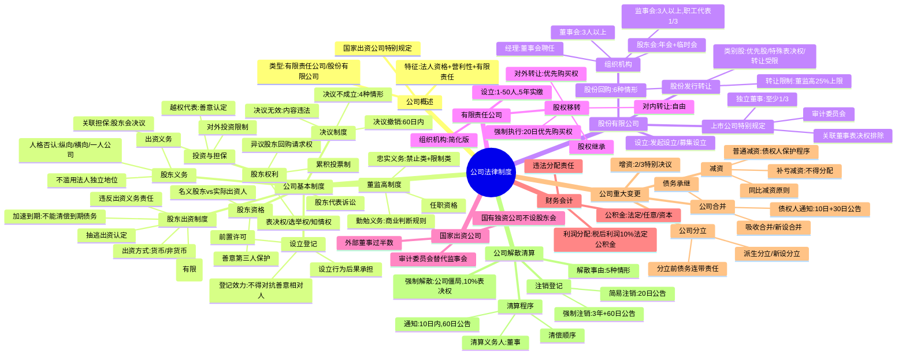

## 📍 章节定位

| 项目 | 信息 |
|------|------|
| **所属科目** | ⚖️ 经济法 |
| **难度等级** | ⭐⭐⭐⭐⭐ |
| **历年分值** | 8-10分 |
| **建议学时** | 10-12h |

## 📝 考情分析

本章是经济法的**核心重难点章节**，历年分值稳定在 8-10 分，是案例分析题的**必考章节**，常与证券法、破产法结合出综合题。2023 年《公司法》修订（2024 年 7 月 1 日施行）带来诸多新规则，是命题重点。

近年命题热点集中在：(1) 公司分类与法人独立地位否认（纵向人格混同、横向人格混同、一人公司举证责任倒置）；(2) 股东出资制度（5 年实缴期限、加速到期、出资方式、违反出资义务的责任、抽逃出资认定）；(3) 股东资格确认（名义股东与实际出资人）；(4) 股东权利（知情权的不正当目的、累积投票制、异议股东回购请求权、股东代表诉讼）；(5) 公司治理（股东会/董事会/监事会职权与议事规则、特别决议事项、上市公司组织机构特别规定、独立董事制度）；(6) 股份发行与转让（类别股、股份转让限制、股份回购情形）；(7) 有限责任公司股权移转（对外转让的优先购买权、股权继承、强制执行）；(8) 公司决议效力（不成立、无效、撤销之诉）；(9) 公司合并分立（程序、债权人保护、债务承接）；(10) 公司减资（普通减资程序、补亏减资、违法减资责任）；(11) 公司解散与清算（强制解散公司僵局、清算程序、简易注销）。

本章学习关键在于**构建"公司生命周期"知识链**：设立→治理→出资→运行→变更→解散清算，并准确把握 2023 年《公司法》修订的新规则。案例分析题常围绕股东出资责任、公司治理决议效力、股权转让纠纷、人格否认等展开，建议结合对比表系统记忆。

## 🧠 知识框架

## 📖 核心精讲

### 一、公司概述

**公司**是以股东为承担有限责任之成员的营利性法人（《公司法》《民法典》）。三大特征：

| 特征 | 内容 |
|------|------|
| **法人资格** | 公司具有民事权利能力和行为能力，法律地位独立于股东；公司以其全部财产对公司债务承担责任 |
| **营利性** | 以取得利润并分配给股东等出资人为目的而成立的法人 |
| **股东有限责任** | 股东以其认缴的出资额（有限责任公司）或认购的股份（股份有限公司）为限对公司承担责任 |

**公司的类型**：我国《公司法》规定了两种基本公司类型。

| 区别点 | 有限责任公司 | 股份有限公司 |
|--------|--------------|--------------|
| 股东人数 | 1-50人 | 无上限（发起人1-200人） |
| 股权流动性 | 对外转让受优先购买权制约 | 股份自由转让为原则 |
| 筹资方式 | 不可公开发行股份 | 可公开发行股份募集资金 |
| 出资期限 | 5年实缴制 | 实缴制（2023年修订） |

**分公司与子公司**：分公司不具有法人资格，其民事责任由本公司承担；母子公司互为独立法人，各自独立承担民事责任。

> **2023年《公司法》修订要点**：2023年12月29日修订通过，自2024年7月1日起施行。主要变化：有限责任公司5年实缴期限、股份有限公司改行实缴制、国家出资公司专章规定、独立董事制度入法、类别股制度、审计委员会替代监事会等。

### 二、公司基本法律制度

#### （一）公司设立与登记制度

**登记效力**：公司登记事项未经登记或未经变更登记，**不得对抗善意相对人**。

**公司设立行为法律后果的承担**：

| 情形 | 法律后果承担 |
|------|--------------|
| 以设立中公司名义为设立公司实施民事活动 | 公司承受；公司未成立的，设立时股东承受（2人以上连带债权债务） |
| 以自己名义为设立公司目的从事民事活动 | 第三人有选择权：可请求公司承担，也可请求设立时股东承担 |
| 设立行为致他人侵权 | 按上述规则承担；有过错股东承担终局责任 |

#### （二）公司投资与担保制度

**对外投资限制**：公司向其他企业投资，按章程由董事会或股东会决议；章程有限额规定的，不得超过。国有独资公司、国有企业、上市公司不得成为合伙企业普通合伙人。

**担保的限制**（高频考点）：

| 担保类型 | 决议机关 | 表决规则 |
|----------|----------|----------|
| **关联担保**（为公司股东或实际控制人提供担保） | **股东会**决议 | 接受担保的股东或受实际控制人支配的股东不参加表决；由出席会议的**其他股东所持表决权过半数**通过 |
| **非关联担保** | 章程规定（董事会或股东会） | 按章程规定 |

**法定代表人越权担保**：区分债权人是否善意。债权人对公司决议进行**合理审查**的，构成善意；但公司能证明债权人明知决议系伪造、变造的除外。

#### （三）股东出资制度（必考）

**出资方式**：货币；实物、知识产权、土地使用权、股权、债权等可以用货币估价并可以依法转让的非货币财产。**不得作为出资的财产**：劳务、信用、自然人姓名、商誉、特许经营权或者设定担保的财产。

**出资期限**（2023年修订重点）：

| 公司类型 | 出资期限 |
|----------|----------|
| **有限责任公司** | 全体股东认缴出资额自公司成立之日起 **5 年**内缴足 |
| **股份有限公司** | 实缴制（公司成立前按认购股份全额缴纳出资） |

> **加速到期**：公司不能清偿到期债务的，公司或者已到期债权的债权人有权要求已认缴出资但未届出资期限的股东**提前缴纳出资**。股东应将出资缴纳至公司（非直接向债权人承担赔偿责任）。"不能清偿到期债务"无须达到破产标准，无须先行强制执行。

**出资义务的履行**：

| 出资类型 | 履行要求 |
|----------|----------|
| 货币出资 | 足额存入公司银行账户 |
| 非货币财产出资 | 依法办理财产权移转手续 |
| 需权属登记的财产（房屋、土地使用权、知识产权等） | 已交付使用但未办权属变更：责令期内办理；已办权属变更但未交付：应交付，交付前不享有股东权利 |

**违反出资义务的责任**（高频考点）：

| 责任类型 | 内容 |
|----------|------|
| **继续履行** | 公司或其他股东请求全面履行；**设立时其他股东在出资不足范围内承担连带责任** |
| **董事会催缴、股东失权** | 宽限期≥60日；届满仍未履行，董事会决议发失权通知，失权股权应转让或减资注销，6个月内未处理的由其他股东按出资比例足额缴纳 |
| **股东权利受限** | 公司可限制其利润分配请求权、新股优先认购权、剩余财产分配请求权 |
| **股东资格解除** | 未履行出资义务或抽逃全部出资，经催告合理期间未缴纳/返还，股东会决议解除资格（仅有限责任公司） |
| **补充清偿责任** | 公司债权人请求其在**未出资本息范围内**对公司债务不能清偿部分承担补充赔偿责任；发起人承担连带责任（可追偿） |
| **董事、高级管理人员责任** | 增资时未履行出资义务，未尽忠实勤勉义务的董事、高管承担相应责任 |
| **股权转让后的出资责任** | 转让已认缴未届期股权：受让人承担缴纳义务，转让人承担补充责任；转让出资不足股权：转让人与受让人在出资不足范围内承担连带责任（受让人不知道且不应知道的由转让人承担） |

**抽逃出资**的认定（4种情形）：①虚构债权债务关系将出资转出；②制作虚假财务会计报表虚增利润进行分配；③利用关联交易将出资转出；④其他未经法定程序将出资抽回的行为。

> **诉讼时效**：股东违反出资义务的民事责任，**不适用诉讼时效抗辩**。公司或债权人请求股东履行出资义务或返还出资，被告股东不得以诉讼时效为由抗辩。

#### （四）股东资格确认

**名义股东与实际出资人**：

| 层面 | 规则 |
|------|------|
| 内部关系（实际出资人vs名义股东） | 实际出资人依双方合同主张投资权益，人民法院支持；名义股东以登记为由否认实际出资人权利的，不予支持 |
| 外部关系（公司vs名义股东） | 名义股东不得以仅为名义股东为由对抗公司债权人；承担赔偿责任后可向实际出资人追偿 |
| 第三人善意取得 | 第三人凭借对登记内容的善意信赖，可接受名义股东对股权的处分；实际出资人不能主张处分行为无效 |

> **冒名出资**：冒用他人名义出资并将该他人登记为股东的，被冒名人不承担补足出资责任或赔偿责任，**冒名登记行为人**承担相应责任。

#### （五）股东权利

**股东权利类型**：参与管理权（表决权、选举权、知情权、提案权、诉讼权等）和资产收益权（股利分配请求权、剩余财产分配请求权、新股优先认购权、股份转让权等）。

**重要股东权利详解**：

**1. 知情权**（高频考点）：

| 公司类型 | 查阅范围 | 限制 |
|----------|----------|------|
| 有限责任公司 | 章程、股东名册、股东会会议记录、董事会决议、监事会决议、财务会计报告；**会计账簿、会计凭证**（须书面请求说明目的） | 公司有合理根据认为有不正当目的可拒绝，15日内书面答复 |
| 股份有限公司 | 同上；会计账簿、会计凭证须**连续180日以上单独或合计持股3%以上** | 同上 |

> **三种"不正当目的"**：①自营或为他人经营业务与公司主营业务有实质性竞争关系（章程另有规定或全体股东另有约定除外）；②为向他人通报信息损害公司合法利益；③3年内曾通过查阅会计账簿向他人通报信息损害公司合法利益。

**2. 累积投票制**：股东会选举董事或监事时，每一股份拥有与应选董事或监事人数相同的表决权，股东拥有的表决权可集中使用。**控股股东控股比例30%以上的上市公司应当采用累积投票制**。

**3. 异议股东股份回购请求权**（必考）：

| 情形 | 有限责任公司 | 股份有限公司（公开发行股份的除外） |
|------|--------------|------------------------------------|
| 连续5年不分配利润，5年连续盈利，符合分配条件 | ✓ | ✓ |
| 公司转让主要财产 | ✓ | ✓ |
| 章程规定营业期限届满或解散事由出现，股东会决议修改章程使公司存续 | ✓ | ✓ |
| 公司合并、分立 | ✓ | ✓（但未规定按合理价格收购） |
| 控股股东滥用股东权利严重损害公司或其他股东利益 | ✓ | ✗ |

> **行使程序**：股东会决议作出之日起60日内不能达成收购协议的，可自决议作出之日起**90日内**向人民法院提起诉讼。公司收购的本公司股权或股份，应当在**6个月内**依法转让或注销。

**4. 股东代表诉讼**（必考）：

| 程序 | 内容 |
|------|------|
| **前置程序** | 书面请求监事会（针对董事、高管）或董事会（针对监事）向人民法院提起诉讼 |
| **直接起诉** | 监事会/董事会拒绝起诉，或收到请求之日起**30日内**未起诉，或情况紧急不立即起诉将使公司利益受难以弥补损害的，股东可为自己利益以自己名义直接起诉 |
| **股东资格** | 有限责任公司：任何股东；股份有限公司：**连续180日以上单独或合计持股1%以上** |
| **双重代表诉讼** | 全资子公司的董事、监事、高管或他人给全资子公司造成损失的，股东可依照上述程序请求子公司监事会、董事会起诉或以自己名义直接起诉 |

#### （六）股东义务与法人独立地位否认（必考）

**股东义务**：出资义务；善意行使股权的义务（不得滥用股东权利）；不滥用公司法人独立地位和股东有限责任的义务。

**法人独立地位否认（揭开公司面纱）**（《公司法》第23条）：

| 类型 | 适用情形 | 法律后果 |
|------|----------|----------|
| **纵向人格混同** | 股东与公司在财产、业务、人员等方面混同，难以区分 | 股东对公司债务承担连带责任 |
| **横向人格混同** | 同一股东控制下的两个以上公司混同 | 各公司对任一公司的债务承担连带责任 |
| **一人公司** | 股东不能证明公司财产独立于股东自己财产 | 股东对公司债务承担连带责任（举证责任倒置） |

> **人格混同的典型表现**：股东无偿使用公司资金或财产不作财务记载；股东用公司资金偿还股东债务；公司账簿与股东账簿不分；股东自身收益与公司盈利不加区分；公司财产记载于股东名下由股东占有使用。

**法律后果**：公司行为被视为股东的行为，股东对公司债务承担连带责任；横向否认情况下，各公司对任一公司的债务承担连带责任。**否认法人独立地位并非彻底否定其法人资格**，仅在具体法律关系中产生上述后果。

#### （七）董事、监事、高级管理人员制度

**任职资格禁止情形**（5种）：①无民事行为能力或限制民事行为能力；②因贪污、贿赂、侵占财产、挪用财产或破坏社会主义市场经济秩序被判刑，或因犯罪被剥夺政治权利，执行期满未逾5年（缓刑考验期满未逾2年）；③担任破产清算公司董事、厂长、经理且对破产负有个人责任，破产清算完结未逾3年；④担任因违法被吊销营业执照、责令关闭公司法定代表人且负有个人责任，被吊销/关闭未逾3年；⑤个人因所负数额较大债务到期未清偿被列为失信被执行人。

**忠实义务**（禁止类规则）：①侵占公司财产、挪用公司资金；②将公司资金以个人名义开立账户存储；③利用职权贿赂或收受非法收入；④接受他人与公司交易的佣金归为己有；⑤擅自披露公司秘密；⑥违反对公司忠实义务的其他行为。

**忠实义务**（限制类规则，须报告并经董事会或股东会决议通过）：

| 行为 | 约束条件 |
|------|----------|
| **关联交易** | 向董事会或股东会报告，并按章程规定经决议通过；关联董事不得参与表决，其表决权不计入表决权总数；无关联关系董事不足3人的，提交股东会审议 |
| **利用公司商业机会** | 须报告并经决议批准；或根据法律、行政法规或章程规定，公司不能利用该商业机会 |
| **经营同类业务** | 须报告并经决议通过；"自营"包括直接经营（担任管理职务）和间接经营（拥有股权但不担任管理职务） |

> **归入权**：董事、监事、高级管理人员违反忠实义务所得收入应当归公司所有。

**勤勉义务**：执行职务时勤勉尽责，为公司的最大利益尽到管理者通常应有的合理注意。**商业判断规则**：只要管理者在决策时没有利益冲突，是在当时掌握的信息和认知条件下作出的诚实、善意的决策，即使该决策事后被证明是失败的，也不能追究其责任。

#### （八）股东会和董事会决议制度（必考）

**决议不成立**（4种情形）：

| 情形 | 性质 |
|------|------|
| 未召开股东会、董事会会议作出决议 | 事实上未作出 |
| 股东会、董事会会议未对决议事项进行表决 | 事实上未作出 |
| 出席会议的人数或所持表决权数未达到法定或章程规定 | 程序不达标 |
| 同意决议事项的人数或所持表决权数未达到法定或章程规定 | 程序不达标 |

**决议无效**：决议**内容**违反法律、行政法规的无效。有资格提起无效之诉的人包括公司股东、董事、监事等，以及与所诉决议有直接利害关系的高管、员工、债权人。

**决议撤销**：

| 要件 | 内容 |
|------|------|
| 撤销事由 | 会议召集程序、表决方式违反法律、行政法规或公司章程；或决议内容违反公司章程 |
| 行使期间 | 自决议作出之日起**60日内**；未被通知的股东自知道或应当知道之日起60日内，自决议作出之日起**1年内**不行使消灭 |
| 轻微瑕疵例外 | 召集程序或表决方式仅有轻微瑕疵，对决议未产生实质影响的，不予撤销 |
| 原告资格 | **只能由股东提起** |

> **决议被宣告无效、撤销或确认不成立的法律后果**：公司应向登记机关申请撤销已办理的登记；但公司根据该决议与**善意相对人**形成的民事法律关系不受影响。

### 三、股份有限公司

#### （一）股份有限公司的设立

**设立方式**：发起设立（发起人认购全部股份）和募集设立（发起人认购部分股份，其余向社会公开募集或向特定对象募集）。

**设立条件**：

| 条件 | 内容 |
|------|------|
| 发起人 | 1人以上200人以下，半数以上在中国境内有住所 |
| 财产条件 | 发起人认购股份≥公司设立时应发行股份总数的**35%**（募集设立）；注册资本为已发行股份的股本总额（实缴制） |
| 组织条件 | 名称、住所、章程、组织机构 |

**设立程序**（募集设立）：签订发起人协议→报经批准（前置许可）→制定章程→认购股份缴纳出资（成立前全额缴足，验资）→召开成立大会（股款缴足之日起30日内召开，提前15日通知）→制作股东名册→设立登记（成立大会结束后30日内）。

#### （二）股份有限公司的组织机构

**股东会职权**（9项）：选举和更换董事、监事；审议批准董事会、监事会报告；审议批准利润分配方案和弥补亏损方案；增减注册资本决议；发行公司债券决议；合并、分立、解散、清算或变更公司形式决议；修改章程；章程规定的其他职权。

**股东会会议**：

| 类型 | 召开要求 |
|------|----------|
| 年会 | 每年召开一次；上市公司年度股东会于上一会计年度结束后6个月内举行 |
| 临时会议 | 2个月内召开的情形：董事人数不足法定或章程规定人数的2/3；未弥补亏损达股本总额1/3；单独或合计持股10%以上股东请求；董事会认为必要；监事会提议召开；章程规定其他情形 |

**召集与通知**：

| 程序 | 要求 |
|------|------|
| 召集主持 | 董事会召集，董事长主持→副董事长→过半数董事推举一名董事；董事会不履行，监事会召集主持；监事会不履行，连续90日以上单独或合计持股10%以上股东自行召集主持 |
| 通知 | 年会：会议召开**20日前**通知；临时会议：**15日前**通知 |
| 临时提案权 | 单独或合计持股**1%以上**股东，可在会议召开10日前提出临时提案，书面提交董事会；董事会收到后2日内通知其他股东 |

**表决和决议**：

| 决议类型 | 表决要求 |
|----------|----------|
| 普通决议 | 出席会议股东所持表决权**过半数**通过 |
| 特别决议 | 出席会议股东所持表决权的**2/3以上**通过（修改章程、增减注册资本、合并分立解散或变更公司形式） |

> **特别提示**：《公司法》未规定出席股东会会议的最低人数和持股比例要求。只要满足提前通知的程序要求，一名股东出席即可召开有效会议。

**董事会**：3人以上；职工人数300人以上的，董事会成员中应当有职工代表（除依法设监事会并有职工代表的外）。董事任期每届不超过3年，连选连任。

**董事会会议**：每年度至少召开2次，提前10日通知；过半数董事出席方可举行；决议经全体董事过半数通过；一人一票。

**监事会**：3人以上，职工代表比例不低于1/3；监事任期3年。每6个月至少召开1次会议。

#### （三）上市公司组织机构的特别规定

| 特别规定 | 内容 |
|----------|------|
| 股东会特别决议事项增加 | 一年内购买、出售重大资产或担保金额超过公司资产总额**30%**的，股东会2/3以上通过 |
| 独立董事 | 至少包括1/3独立董事；至少1名会计专业人士 |
| 审计委员会 | 替代监事会；独立董事过半数，会计专业人士任召集人 |
| 董事会秘书 | 上市公司高级管理人员 |
| 关联董事表决权排除 | 关联董事不得行使表决权，不得代理其他董事行使；无关联关系董事过半数通过；不足3人的提交股东会审议 |
| 控股子公司持股限制 | 上市公司控股子公司不得取得该上市公司股份；因合并、质权行使等原因持有的，不得行使表决权 |

**独立董事的特别职权**（须经全体独立董事过半数同意）：①独立聘请中介机构审计、咨询或核查；②提议召开临时股东会；③提议召开董事会会议；④依法公开向股东征集股东权利；⑤对可能损害上市公司或中小股东权益的事项发表独立意见。

> **独立董事任职要求**：原则上最多在3家境内上市公司兼任；每年现场工作时间不少于15日；连续2次未亲自出席也不委托其他独立董事出席的，30日内提议召开股东会解除职务；连任时间不得超过6年。

#### （四）股份有限公司的股份

**股份类型**（2023年修订新增类别股）：

| 类型 | 特征 |
|------|------|
| 面额股 vs 无面额股 | 择一采用；无面额股所得股款至少1/2计入注册资本 |
| 普通股 vs 优先股/劣后股 | 优先股在利润分配、剩余财产分配上优先；劣后股分配次序居后 |
| 特殊表决权股 | 每股表决权多于或少于普通股；公开发行公司不得发行（除非公开发行前已发行）；监事或审计委员会成员选举更换时与普通股每股表决权数相同 |
| 转让受限股 | 章程限制转让；公开发行公司不得发行（除非公开发行前已发行） |

**股份转让限制**：

| 主体 | 限制 |
|------|------|
| 发起人 | 公司公开发行股份前已发行的股份，自股票上市交易之日起**1年内**不得转让 |
| 董事、监事、高级管理人员 | 任职期间每年转让股份不得超过其所持本公司股份总数的**25%**；所持股份自公司股票上市交易之日起1年内不得转让；离职后**半年内**不得转让 |
| 上市公司董监高禁止买卖期间 | 年度报告、半年度报告公告前15日内；季度报告、业绩预告、业绩快报公告前5日内；重大事件发生至披露之日 |

**股份回购**（6种情形）：

| 情形 | 决议主体 | 处理期限 |
|------|----------|----------|
| 减少注册资本 | 股东会决议 | 自收购之日起**10日内**注销 |
| 与持有本公司股份的其他公司合并 | 股东会决议 | **6个月内**转让或注销 |
| 员工持股计划或股权激励 | 董事会决议（2/3以上董事出席） | **3年内**转让或注销，合计不超过已发行股份总数10% |
| 异议股东要求收购（合并、分立决议） | 无需决议 | 6个月内转让或注销 |
| 转换可转换为股票的公司债券 | 董事会决议 | 3年内转让或注销，合计不超过10% |
| 上市公司维护公司价值及股东权益 | 董事会决议 | 3年内转让或注销，合计不超过10% |

> **重要**：公司不得接受本公司的股份作为质权的标的。

### 四、有限责任公司

#### （一）有限责任公司的设立

| 条件 | 内容 |
|------|------|
| 股东 | 1人以上50人以下 |
| 财产 | 全体股东认缴出资额自公司成立之日起**5年内**缴足 |
| 组织 | 章程、组织机构 |

#### （二）有限责任公司组织机构特点

**股东会特别决议事项**：修改章程、增减注册资本、合并、分立、解散或变更公司形式，必须经代表**2/3以上表决权**的股东通过。

> **有限责任公司 vs 股份有限公司股东会决议的表决基数**：有限责任公司以**全体股东**的表决权为基数；股份有限公司以**出席股东会**的股东所持表决权为基数。

**书面一致同意**：有限责任公司股东以书面形式一致表示同意的，可以不召开股东会会议，直接作出决定，由全体股东在决定文件上签名或盖章。

**不设监事会的情形**：规模较小或股东人数较少的，可设1名监事；经全体股东一致同意，也可不设监事。

#### （三）有限责任公司的股权移转（必考）

**股权移转类型**：基于股东法律行为的自愿转让、基于法院强制执行的强制移转、基于自然人股东死亡的股权继承。

**股权转让规则**：

| 转让类型 | 规则 |
|----------|------|
| **对内转让**（股东之间） | 自由转让，无任何限制 |
| **对外转让**（向股东以外的人） | 应书面通知其他股东（数量、价格、支付方式、期限）；其他股东在**同等条件**下享有优先购买权；自接到通知之日起**30日内**未答复视为放弃；两个以上股东行使的，协商确定购买比例，协商不成按转让时各自的出资比例 |
| **强制执行** | 通知公司及全体股东；其他股东同等条件下有优先购买权；自人民法院通知之日起满**20日**不行使视为放弃 |
| **股权继承** | 章程无另外规定的情况下，自然人股东死亡后合法继承人可直接继承股东资格；其他股东**不得**主张优先购买权（章程另有规定或全体股东另有约定除外） |

> **优先购买权的行使限制**：转让股东在获知其他股东有意行使优先购买权后**有权拒绝转让**（章程另有规定或全体股东另有约定的除外）。其他股东因转让股东撤回转让意思受有损失的，可主张赔偿。

> **优先购买权行使期限**：其他股东自知道或应当知道行使优先购买权同等条件之日起**30日内**，最长不超过股权变更登记之日起**1年**。

**股权移转后的程序**：股东转让股权应书面通知公司变更股东名册；受让人自记载于股东名册时起可向公司主张行使股东权利。公司应注销原股东出资证明书，向新股东签发出资证明书，修改章程和股东名册（章程修改不需再由股东会表决）。

### 五、国家出资公司组织机构的特别规定

| 特别规定 | 内容 |
|----------|------|
| 适用范围 | 国有独资公司、国有资本控股公司（有限责任公司和股份有限公司） |
| 履行出资人职责机构 | 国资监督管理机构等根据授权代表本级政府履行出资人职责 |
| 国有独资公司股东会 | **不设股东会**，由履行出资人职责机构行使股东会职权；可授权董事会行使部分职权，但章程制定修改、合并分立解散破产、增减注册资本、分配利润由履行出资人职责机构决定 |
| 国有独资公司董事会 | 成员中**外部董事过半数**，并应有职工代表；董事长、副董事长由履行出资人职责机构指定 |
| 国有独资公司监事会 | 在董事会中设置审计委员会行使监事会职权的，不设监事会或监事 |
| 兼职限制 | 董事、高管未经履行出资人职责机构同意，不得在其他公司或经济组织兼职 |

### 六、公司的财务、会计

**利润分配财务规则**（顺序）：

1. 公司只能向股东分配**税后利润**
2. 分配当年税后利润前，提取税后利润的**10%**为法定公积金（累计达注册资本**50%**以上的可不再提取）
3. 法定公积金不足以弥补以前年度亏损的，先用当年利润弥补亏损
4. 可自愿提取任意公积金（股东会决议）
5. 弥补亏损和提取公积金后所余税后利润，按持股比例分配（有限责任公司按实缴出资比例，全体股东另有约定除外；股份有限公司按股份比例，章程另有规定除外）

> **分配期限**：股东会作出分配利润决议的，董事会应当在决议作出之日起**6个月内**进行分配。

**违法利润分配的责任**：

| 责任类型 | 内容 |
|----------|------|
| **财产返还责任**（无过错责任） | 无论股东是否知情，都应将违法分配的利润退还公司 |
| **损害赔偿责任** | 违法分配给公司造成损失的，股东及负有责任的董事、监事、高级管理人员承担赔偿责任 |

**公积金**：

| 类型 | 来源 | 用途 |
|------|------|------|
| 法定公积金 | 税后利润的10%（累计达注册资本50%可不再提取） | 弥补亏损、扩大生产经营、转增注册资本（转增后留存不少于转增前注册资本的**25%**） |
| 任意公积金 | 税后利润（股东会决议提取） | 同上 |
| 资本公积金 | 股票发行溢价、无面额股股款未计入注册资本部分 | 弥补亏损（在任意公积金和法定公积金不足后使用）、扩大生产经营、转增注册资本 |

### 七、公司重大变更

#### （一）公司合并

**合并方式**：吸收合并（一个公司吸收其他公司，被吸收公司解散）和新设合并（两个以上公司合并设立新公司，合并各方解散）。

**合并程序**（5步）：

| 步骤 | 内容 |
|------|------|
| 签订合并协议 | 合并各方签订协议 |
| 编制资产负债表及财产清单 | 各方编制 |
| 作出合并决议 | 股东会特别决议（2/3以上）；公司与其持股**90%以上**公司合并，被合并公司不需股东会决议但应通知其他股东（其他股东有回购请求权）；合并价款不超过本公司净资产**10%**的可不经股东会决议（章程另有规定除外），但应经董事会决议 |
| 通知债权人 | 自决议作出之日起**10日内**通知债权人，**30日内**公告；债权人自接到通知之日起30日内，未接到通知的自公告之日起**45日内**，可要求清偿债务或提供担保 |
| 办理登记 | 变更登记、注销登记、设立登记 |

> **债务承接**：合并各方的债权、债务由合并后存续公司或新设公司承继。

#### （二）公司分立

**分立方式**：派生分立（公司以部分财产另设新公司，原公司存续）和新设分立（公司以全部财产分别归入新设公司，原公司解散）。

**分立程序**：与合并程序基本相同，但债权人**没有**要求公司清偿债务或提供担保的权利。

> **债务承担规则**：公司分立前的债务由分立后的公司承担**连带责任**；但公司在分立前与债权人就债务清偿达成书面协议另有约定的除外。

#### （三）公司增资

**增资程序**：董事会制订方案→股东会特别决议（2/3以上）→签订增资协议→履行批准程序（涉及国有股权）→修订章程→缴纳出资→变更登记。

**股东增资优先认缴权**：有限责任公司股东的增资优先认缴权是法定权利，认缴金额以实缴出资比例为准（全体股东另有约定除外）；股份有限公司股东不享有新股优先认购权（章程另有规定或股东会决议另有决定的除外）。

#### （四）公司减资（高频考点）

**减资方式**：①返还出资或股款；②减免出资或购股义务；③缩减股权或股份（弥补亏损时）。

**普通减资程序**：

| 步骤 | 内容 |
|------|------|
| 作出减资决议 | 股东会特别决议（2/3以上） |
| 编制资产负债表及财产清单 | — |
| 履行债权人保护程序 | 自决议作出之日起**10日内**通知债权人，**30日内**公告；债权人自接到通知之日起30日内，未接到通知的自公告之日起**45日内**，可要求清偿债务或提供担保（无论债务是否到期，相当于"加速到期"） |
| 变更公司登记 | 申请变更登记 |

> **同比例减资原则**：公司减少注册资本应当按照股东出资或持有股份的比例相应减少。不同比减资需"法律另有规定、有限责任公司全体股东另有约定或股份有限公司章程另有规定"。

**补亏减资**（特殊规则）：

| 要点 | 内容 |
|------|------|
| 适用前提 | 公司通过三种公积金（任意、法定、资本）仍无法弥补全部亏损 |
| 限制一 | 不得向股东分配 |
| 限制二 | 不得免除股东缴纳出资或股款的义务 |
| 后果 | 在法定公积金和任意公积金累计额达到公司注册资本50%前，不得分配利润 |
| 债权人保护 | 不适用普通减资的债权人保护措施，但应在报纸或公示系统公告 |

**违法减资的法律后果**：

| 责任类型 | 内容 |
|----------|------|
| **内部责任** | 返还财物（股东退还收到的出资）；恢复原状（恢复出资义务记载）；损害赔偿（股东及负有责任的董事、监事、高管对公司损失承担赔偿责任） |
| **外部责任** | 减资对起诉的债权人不产生法律效力；股东在减资金额范围内对债权人承担**补充赔偿责任**（类似未履行出资义务或抽逃出资） |

### 八、公司解散和清算

#### （一）公司解散

**解散事由**（5种情形）：①章程规定营业期限届满或章程规定的其他解散事由出现；②股东会决议解散；③因公司合并或分立需要解散；④依法被吊销营业执照、责令关闭或被撤销；⑤人民法院依法判决予以解散。

**强制解散（公司僵局）**（必考）：

| 要件 | 内容 |
|------|------|
| 经营管理发生严重困难 | 公司组织机构运行状态严重障碍（股东会机制失灵、无法作出有效决议、董事长期冲突等），**不应片面理解为资金缺乏、严重亏损等经营性困难** |
| 继续存续会使股东利益受到重大损失 | — |
| 通过其他途径不能解决 | — |
| 主体资格 | 持有公司**10%以上表决权**的股东 |

> **强制解散之诉的特殊规则**：股东不得以知情权、利润分配请求权等权益受损害，或公司亏损、财产不足偿还债务，或公司被吊销营业执照未清算为由提起解散公司诉讼。股东提起解散公司之诉同时申请清算的，法院对清算申请不予受理。应当注重调解（回购股份、股权转让、减资、分立等方式）。

**强制解散公司的具体事由**（公司法司法解释）：①公司持续2年以上无法召开股东会；②股东表决时无法达到法定或章程规定比例，持续2年以上不能作出有效股东会决议；③公司董事长期冲突且无法通过股东会解决；④经营管理发生其他严重困难。

#### （二）公司清算

**清算义务人**：**董事**是公司的清算义务人。解散事由出现之日起**15日内**成立清算组。清算义务人未及时履行清算义务给公司或债权人造成损失的，承担赔偿责任。

**清算程序**（6步）：

| 步骤 | 内容 |
|------|------|
| 通知债权人并公告 | 清算组自成立之日起**10日内**通知债权人，**60日内**公告 |
| 债权申报登记 | 债权人自接到通知之日起30日内，未接到通知的自公告之日起**45日内**申报债权；申报期间清算组不得对债权人清偿 |
| 清理公司财产，制订清算方案 | 报股东会或人民法院确认 |
| 清偿债务，分配剩余财产 | 按法定顺序清偿（见下表） |
| 财产不足偿债 | 依法向人民法院申请破产清算 |
| 确认清算报告，申请注销登记 | 清算结束之日起**30日内**申请注销登记 |

**清偿顺序**：

| 顺序 | 清偿项目 |
|------|----------|
| 1 | 清算费用 |
| 2 | 职工的工资、社会保险费用和法定补偿金 |
| 3 | 缴纳所欠税款 |
| 4 | 清偿公司债务 |
| 5 | 剩余财产分配（有限责任公司按出资比例，股份有限公司按股份比例） |

> **清算组成员义务**：负有忠实义务和勤勉义务。怠于履行清算职责给公司造成损失的，承担赔偿责任；因故意或重大过失给债权人造成损失的，承担赔偿责任。

#### （三）注销登记

| 程序 | 适用情形 | 要求 |
|------|----------|------|
| **简易注销** | 公司在存续期间未产生债务或已清偿全部债务 | 全体股东承诺；公告期限不少于**20日**；公告期满无异议的，20日内申请注销；承诺不实的，股东对注销前债务承担连带责任 |
| **强制注销** | 公司被吊销营业执照、责令关闭或撤销，满3年未申请注销 | 公告期限不少于**60日**；公告期满无异议的，登记机关注销；原公司股东、清算义务人责任不受影响 |

## 💡 典型例题

**【例题 1】（单项选择题）**

根据公司法律制度的规定，下列关于股东出资的表述中，正确的是（ ）。

A. 股东以非货币财产出资后因市场变化导致出资财产贬值的，应当补足出资
B. 股东以房屋出资已交付公司使用但未办理权属变更手续的，一律认定为未履行出资义务
C. 有限责任公司全体股东认缴的出资额自公司成立之日起5年内缴足
D. 公司不能清偿到期债务的，已认缴出资但未届出资期限的股东应当直接向公司债权人承担赔偿责任

**答案**：C

**解析**：A 错误，出资人以符合法定条件的非货币财产出资后，因市场变化或其他客观因素导致出资财产贬值，公司、其他股东或公司债权人无权请求该出资人承担补足出资责任；B 错误，已交付使用但未办权属变更的，应责令当事人在合理期间内办理权属变更手续，在期间内办理的应认定已履行出资义务；C 正确，2023年修订的《公司法》规定有限责任公司5年实缴期限；D 错误，加速到期时股东应将出资缴纳至公司，而非直接向债权人承担赔偿责任。

**【例题 2】（单项选择题）**

根据公司法律制度的规定，下列关于公司为股东提供担保的表述中，正确的是（ ）。

A. 公司为公司股东提供担保的，由董事会决议
B. 接受担保的股东可以参加表决，但其表决权不计入表决权总数
C. 该项表决由出席会议的其他股东所持表决权的过半数通过
D. 公司章程对担保总额有限额规定的，不得超过规定的限额

**答案**：D

**解析**：A 错误，公司为公司股东或实际控制人提供担保的，应当经**股东会**决议（而非董事会）；B 错误，接受担保的股东或受实际控制人支配的股东**不得参加**表决（而非参加但不计入）；C 错误，由出席会议的**其他股东所持表决权过半数**通过，表述看似正确但结合 B 选项理解，关键在于"不得参加表决"；D 正确，公司章程对担保总额或单项担保数额有限额规定的，不得超过规定的限额。

**【例题 3】（单项选择题）**

甲有限责任公司有股东A、B、C三人，分别持股60%、25%、15%。股东A拟将其持有的20%股权转让给公司以外的第三人D。根据公司法律制度的规定，下列表述正确的是（ ）。

A. 股东A转让股权无须通知股东B和C
B. 股东B和C在同等条件下享有优先购买权，行使期限为自接到通知之日起60日内
C. 股东B和C协商不成确定购买比例的，按照转让时各自的出资比例行使优先购买权
D. 股东A在其他股东表示行使优先购买权后，仍可拒绝转让股权

**答案**：D

**解析**：A 错误，股东向股东以外的人转让股权的，应当将股权转让的数量、价格、支付方式和期限等事项书面通知其他股东；B 错误，行使期限为自接到书面通知之日起**30日内**（非60日）；C 错误，两个以上股东行使优先购买权的，协商确定购买比例，协商不成的按照转让时各自的**出资比例**行使优先购买权——表述看似正确，但应仔细辨析；D 正确，根据公司法司法解释，转让股东在获知其他股东有意行使优先购买权后有权拒绝转让股权（章程另有规定或全体股东另有约定的除外），其他股东因撤回转让受有损失的可主张赔偿。

**【例题 4】（案例分析题）**

2024年8月，甲有限责任公司（成立于2024年7月1日）的股东A认缴出资500万元，占公司注册资本50%，出资期限为2029年6月30日。2025年3月，甲公司因经营困难无法清偿到期债务200万元。债权人乙公司调查发现A尚未实缴任何出资。同时，甲公司的董事C在明知公司经营困难的情况下，仍未催缴A的出资。

**问题**：(1) 乙公司能否要求股东A提前缴纳出资？依据是什么？(2) 董事C是否需要承担责任？(3) 如果A将股权转让给D，受让人D是否需要承担出资义务？

**答案**：

(1) 可以。根据《公司法》关于**加速到期**的规定，公司不能清偿到期债务的，公司或者已到期债权的债权人有权要求已认缴出资但未届出资期限的股东提前缴纳出资。本案中，甲公司无法清偿到期债务200万元，符合加速到期的适用条件。但需要注意，A应将出资缴纳至公司，而非直接向乙公司承担赔偿责任。

(2) 需要承担责任。根据《公司法》规定，公司成立后，董事会应当对股东的出资情况进行核查，发现股东未按期足额缴纳出资的，应当由公司向该股东发出书面催缴书。**未及时履行催缴义务，给公司造成损失的，负有责任的董事应当承担赔偿责任**。本案中，董事C在明知公司经营困难、A未实缴出资的情况下仍未催缴，属于未及时履行催缴义务，给公司造成损失，应承担赔偿责任。

(3) 需要承担。根据《公司法》规定，有限责任公司股东转让已认缴出资但未届出资期限的股权的，由**受让人承担缴纳该出资的义务**；受让人未按期足额缴纳出资的，**转让人对受让人未按期缴纳的出资承担补充责任**。本案中，A将股权转让给D，D作为受让人承担缴纳出资的义务；如果D未按期足额缴纳，A承担补充责任。

**【例题 5】（案例分析题）**

张三和李四共同设立甲有限责任公司，张三持股80%，李四持股20%。张三同时设立乙有限责任公司（张三持股100%）。甲公司和乙公司使用相同的办公地址、相同的财务人员、相同的银行账户。张三经常将甲公司的资金无偿转入乙公司用于经营。后甲公司拖欠债权人丙公司货款500万元无力偿还。丙公司调查发现甲公司账户余额仅剩10万元。

**问题**：(1) 丙公司能否要求张三对甲公司的债务承担连带责任？依据是什么？(2) 丙公司能否要求乙公司对甲公司的债务承担连带责任？依据是什么？(3) 如果张三仅持有甲公司股权（不存在乙公司），但甲公司财产与张三个人财产混同，举证责任如何分配？

**答案**：

(1) 可以。根据《公司法》第23条第1款规定，公司股东滥用公司法人独立地位和股东有限责任，逃避债务，严重损害公司债权人利益的，应当对公司债务承担连带责任。本案中，张三作为甲公司股东，将甲公司资金无偿转入乙公司，存在**纵向人格混同**（财产混同、人员混同、业务混同），滥用公司法人独立地位和股东有限责任，严重损害债权人丙公司的利益，应当对甲公司债务承担连带责任。

(2) 可以。根据《公司法》第23条第2款规定，股东利用其控制的两个以上公司实施前款规定行为的，各公司应当对任一公司的债务承担连带责任。本案中，张三控制甲公司和乙公司两个公司，利用关联关系转移甲公司资产至乙公司，构成**横向人格混同**，乙公司应当对甲公司的债务承担连带责任。

(3) 举证责任由张三承担。根据《公司法》第23条第3款规定，只有一个股东的公司，股东不能证明公司财产独立于股东自己的财产的，应当对公司债务承担连带责任。这是**举证责任倒置**的规定。如果张三仅持有甲公司股权（甲公司为一人公司），则张三需要证明甲公司财产独立于其个人财产；不能证明的，即应对甲公司债务承担连带责任。

## 🎯 记忆口诀

**口诀一：公司分类与特征**
> 法人营利有限责任，有限五人（1-50）股份无限；
> 有限五年实缴股份实缴，国有独资不设股东会。

**口诀二：股东出资责任**
> 五年实缴加速到期，董事会催缴宽限六十；
> 失权通知六十日内转，六个月内不转其他缴；
> 补充清偿本息为限，发起人连带可追偿；
> 抽逃出资四种情形，诉讼时效不能用。

**口诀三：公司担保决议规则**
> 关联担保股东会决议，被担保股东不参加；
> 其他股东过半数通过，非关担保看章程；
> 善意审查代表有效，明知伪造非善意。

**口诀四：人格否认三种情形**
> 纵向混同股东公司连，横向混同各公司连；
> 一人公司举证责任倒，财产独立要证明；
> 人员业务财务三混同，一套人马两块牌子。

**口诀五：股东权利要点**
> 知情权账簿有限公司任意，股份公司一八零日三以上；
> 累积投票上市公司三成控，异议股东回购五项情形；
> 代表诉讼前置三十日，双重代表全资子公司；
> 股份回购六种情形，十日注销减资用。

**口诀六：股权转移规则**
> 对内自由对外优先，三十日内不答放弃；
> 同等条件综合判断，转让股东可反悔；
> 强制执行二十日优先，继承股东资格直接继；
> 章程另有规定从其规，绝对禁止通常无效。

**口诀七：公司合并分立减资**
> 合并十通知三十公告，四十五日内可要偿；
> 分立十通知三十公告，债权人无要偿权；
> 分立前债务连带承担，另有协议除外可免责；
> 减资十通知三十公告，四十五日内可要偿；
> 补亏减资不分配不免除，同比减资为原则。

**口诀八：决议效力三分类**
> 不成立四情形：未开未表决、人数不够、票数不够；
> 无效内容违法，撤销六十日内提；
> 轻微瑕疵不撤销，善意相对人受保护。

**口诀九：清算顺序**
> 清算费用第一位，职工工资社保补偿；
> 税款清偿第三位，公司债务第四位；
> 剩余财产按比例，有限出资股份股；
> 简易注销二十日，强制注销六十日。

## ✅ 同步练习

**1. （单选）根据公司法律制度的规定，下列关于有限责任公司股东出资期限的表述中，正确的是（ ）。**
A. 全体股东认缴的出资额自公司成立之日起3年内缴足
B. 全体股东认缴的出资额自公司成立之日起5年内缴足
C. 全体股东认缴的出资额自公司成立之日起10年内缴足
D. 全体股东认缴的出资额自公司成立之日起由股东自由约定

**2. （单选）根据公司法律制度的规定，下列关于一人有限责任公司的表述中，正确的是（ ）。**
A. 一人有限责任公司不适用法人独立地位否认制度
B. 一人有限责任公司的股东不能证明公司财产独立于股东自己财产的，应当对公司债务承担连带责任
C. 一人有限责任公司必须设立股东会
D. 一人有限责任公司的股东只能是自然人

**3. （多选）根据公司法律制度的规定，下列关于股东知情权的表述中，正确的有（ ）。**
A. 有限责任公司股东可以要求查阅公司会计账簿、会计凭证
B. 股份有限公司股东查阅会计账簿、会计凭证须连续180日以上单独或合计持股3%以上
C. 公司有合理根据认为股东查阅会计账簿有不正当目的的，可以拒绝提供查阅
D. 公司拒绝提供查阅的，应当自股东提出书面请求之日起30日内书面答复股东

**4. （单选）根据公司法律制度的规定，下列关于公司决议效力的表述中，正确的是（ ）。**
A. 决议不成立之诉只能由股东提起
B. 决议撤销之诉自决议作出之日起90日内提出
C. 公司股东会、董事会的决议内容违反法律、行政法规的无效
D. 决议被宣告无效后，公司根据该决议与第三人形成的所有民事法律关系均无效

**5. （单选）甲有限责任公司股东A持股70%，股东B持股30%。股东A拟将其持有的20%股权转让给公司以外的第三人C。根据公司法律制度的规定，下列表述正确的是（ ）。**
A. 股东B在同等条件下享有优先购买权，自接到书面通知之日起60日内未答复视为放弃
B. 股东A在其他股东表示行使优先购买权后，仍可拒绝转让股权（章程另有规定除外）
C. 股东A未通知股东B即转让股权给C的，该股权转让合同无效
D. 股东B主张优先购买权的期限最长不超过股权变更登记之日起2年

**6. （多选）根据公司法律制度的规定，下列情形中，异议股东可以请求公司按照合理价格收购其股权的有（ ）。**
A. 公司连续5年不向股东分配利润，而公司该5年连续盈利，且符合分配利润条件
B. 公司转让主要财产
C. 公司章程规定的营业期限届满，股东会决议修改章程使公司存续
D. 公司合并、分立

**7. （单选）根据公司法律制度的规定，下列关于公司减资的表述中，正确的是（ ）。**
A. 公司减少注册资本，债权人有权要求公司清偿债务或提供担保，且有权令减资程序中止
B. 公司以减资方式弥补亏损的，不得向股东分配，但可以免除股东缴纳出资的义务
C. 公司减少注册资本应当按照股东出资或持有股份的比例相应减少（同比减资原则）
D. 补亏减资后，在法定公积金和任意公积金累计额达到公司注册资本30%前，不得分配利润

**8. （案例分析题）**
甲股份有限公司（上市公司）董事会由7名董事组成，其中独立董事3名（含会计专业人士1名）。2025年5月，甲公司拟为股东乙公司提供担保5000万元。甲公司章程规定，公司对外担保由董事会决议。董事会审议该担保事项时，董事丙（与乙公司有关联关系）参加了表决并投了赞成票，最终该担保议案以5票赞成通过（含丙的1票）。

**问题**：(1) 甲公司为股东乙公司提供担保，应当由董事会还是股东会决议？(2) 董事丙参加表决并投票的行为是否合法？该决议是否有效？(3) 独立董事的设置是否符合法律规定？

**9. （案例分析题）**
甲有限责任公司有股东A、B、C三人，分别认缴出资600万元、300万元、100万元（出资期限均为2029年12月31日），公司成立于2024年8月1日。2025年6月，甲公司因经营亏损无法清偿到期债务400万元。债权人丁公司发现A、B、C三人均未实缴任何出资。同时查明，A曾将其对甲公司的部分股权（认缴出资200万元）于2025年3月转让给E，E知道A未实缴出资。

**问题**：(1) 丁公司能否要求A、B、C提前缴纳出资？依据是什么？(2) 丁公司能否要求E承担出资责任？依据是什么？(3) 如果A未实缴出资且经公司催缴宽限期届满仍未缴纳，公司可以采取什么措施？

---

**参考答案**：1.B 2.B 3.ABC 4.C 5.B 6.ABCD 7.C

**8. 答案要点**：
(1) 应当由**股东会**决议。根据《公司法》规定，公司为公司股东或实际控制人提供担保的，应当经股东会决议（关联担保必须股东会决议，不能由董事会决议，即使章程规定由董事会决议也无效）。接受担保的股东乙公司或受乙公司支配的股东不得参加表决，由出席会议的其他股东所持表决权过半数通过。
(2) 董事丙参加表决的行为**不合法**。根据上市公司关联董事表决权排除制度，董事与董事会会议决议事项所涉及的企业或个人有关联关系的，不得对该项决议行使表决权，也不得代理其他董事行使表决权。由于丙参加了表决且其票数计入，该决议的程序违法，可能导致决议被撤销。
(3) 独立董事设置**符合**法律规定。上市公司董事会成员中应当至少包括1/3独立董事，甲公司董事会7名董事中3名为独立董事（超过1/3），且至少包括1名会计专业人士，符合要求。

**9. 答案要点**：
(1) 可以。根据《公司法》**加速到期**规定，公司不能清偿到期债务的，公司或者已到期债权的债权人有权要求已认缴出资但未届出资期限的股东提前缴纳出资。本案中，甲公司无法清偿到期债务400万元，符合加速到期条件。A、B、C三人均未实缴出资，丁公司作为已到期债权的债权人有权要求其提前缴纳出资。
(2) 可以要求E承担出资责任。根据《公司法》规定，未按照公司章程规定出资日期缴纳出资或非货币财产实际价额显著低于认缴出资额的股东转让股权的，**转让人与受让人在出资不足的范围内承担连带责任**；受让人不知道且不应当知道存在上述情形的，由转让人承担。本案中，A未实缴出资即转让股权给E，且E**知道**A未实缴出资（不构成善意），因此E与A在出资不足范围内承担连带责任。
(3) 公司可以采取以下措施：①董事会核查并发出书面催缴书，载明缴纳出资的宽限期（不少于60日）；②宽限期届满A仍未履行出资义务的，公司经董事会决议可以向A发出失权通知，自通知发出之日起A丧失其未缴纳出资的股权；③失权股权应依法转让或相应减少注册资本并注销该股权，6个月内未转让或注销的，由公司其他股东按其出资比例足额缴纳相应出资；④公司或债权人可请求A在未出资本息范围内对公司债务不能清偿部分承担补充赔偿责任；⑤公司可根据章程或股东会决议限制A的利润分配请求权、新股优先认购权、剩余财产分配请求权等股东权利。
