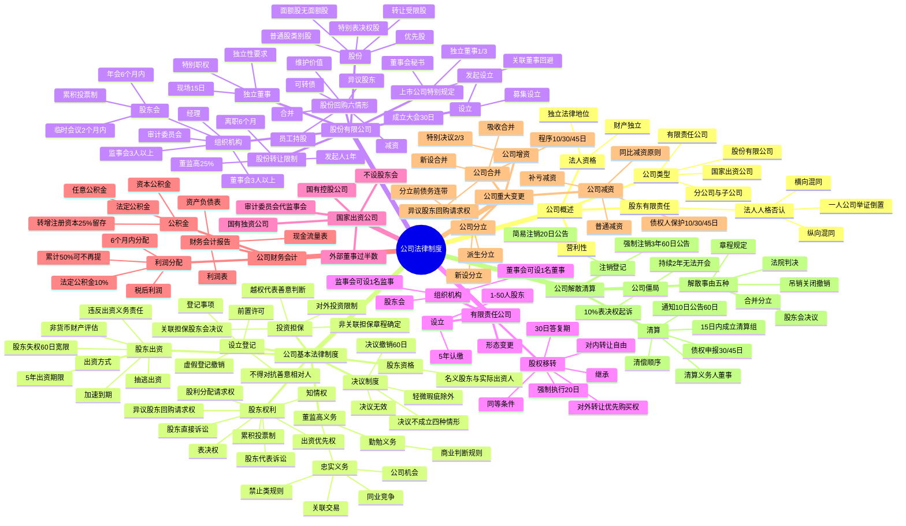

## 1. 章节定位

| 项目 | 信息 |
|------|------|
| 所属科目 | 经济法 |
| 难度等级 | 4 |
| 历年分值 | 10-15 分 |
| 建议学时 | 12-15 小时 |
| 知识关联章节 | 第1章 法律基本原理（法人制度）；第2章 基本民事法律制度（法律行为、代理、诉讼时效）；第3章 物权法律制度（股权出质）；第4章 合同法律制度（合同效力、担保合同）；第5章 合伙企业法律制度（组织形式对比）；第7章 证券法律制度（股份发行、信息披露）；第8章 企业破产法律制度（破产清算、破产撤销权）；第9章 票据与支付结算法律制度（公司作为票据主体） |

## 2. 考情分析

本章是经济法科目的核心重点章节，分值约 10-15 分，是案例分析题的"主战场"之一。命题以主观题（案例分析题）为主，常围绕"公司决议效力 + 股东权利保护 + 公司担保 + 股权转让 + 法人人格否认"出综合题；客观题则集中在股东出资义务、董监高义务、股份回购、公司合并分立程序等知识点。

**命题规律**：本章命题注重对 2023 年新修订《公司法》（2024 年 7 月 1 日施行）新规则的考查，如 5 年出资期限、加速到期、股东失权、法人人格否认横向适用、类别股、独立董事新规、补亏减资、简易注销等。近年命题趋势是结合公司治理实务、关联交易、对赌协议等热点问题出题，强调理论与实务结合。

**高频考点分布**：

1. **公司法人资格与有限责任**：公司法人独立地位、股东有限责任原则；法人人格否认（纵向混同、横向混同、一人公司举证责任倒置）。
2. **公司设立与登记**：前置许可、登记事项与效力（不得对抗善意相对人）、虚假登记的撤销、公司设立行为法律后果的承担。
3. **公司投资与担保**：对外投资限制；公司担保（关联担保须经股东会决议、非关联担保由章程确定决议机关）；越权代表与善意相对人判断标准。
4. **股东出资制度**：5 年出资期限（2023 年新法）；出资方式（货币、非货币财产；不得出资的财产）；非货币财产评估作价；出资义务履行（权属变更、交付使用）；加速到期；股东失权；抽逃出资；违反出资义务的民事责任（不适用诉讼时效抗辩）。
5. **股东资格与股东权利**：名义股东与实际出资人；股东权利体系（表决权、选举权、知情权、出资优先权、股利分配请求权、异议股东回购请求权、股东代表诉讼、股东直接诉讼）。
6. **董监高义务**：忠实义务（禁止类规则、限制类规则——关联交易、公司机会、同业竞争）；勤勉义务（商业判断规则）；违反义务的赔偿责任。
7. **公司决议制度**：决议不成立（四种情形）、决议无效（内容违反法律行政法规）、决议撤销（召集程序、表决方式违法违章，或内容违章；60 日撤销权；轻微瑕疵除外）。
8. **股份有限公司组织机构**：股东会（年会、临时会议、召集、表决、累积投票制）；董事会（组成、任期、职权）；监事会；审计委员会；上市公司特别规定（独立董事、董事会秘书、关联董事回避）。
9. **独立董事制度**：独立性要求、任职条件、特别职权、履职要求（每年现场工作不少于 15 日）、履职保障。
10. **股份发行与转让**：股份类型（面额股/无面额股、普通股/类别股——优先股、特殊表决权股、转让受限股）；股份转让限制（发起人 1 年、董监高任职期间每年 25%、离职后 6 个月）；股份回购六种情形。
11. **有限责任公司股权移转**：股权对外转让（其他股东优先购买权、30 日答复期、同等条件）；股权强制执行；股权继承。
12. **公司重大变更**：公司合并（吸收合并、新设合并；合并程序——签订协议、编制资产负债表、决议、通知债权人 10/30/45 日；异议股东回购请求权）；公司分立（派生分立、新设分立；分立前债务连带责任）；公司增资；公司减资（普通减资、补亏减资；同比减资原则）。
13. **公司解散与清算**：解散事由（五种）；公司僵局与强制解散（持续 2 年无法召开股东会等）；清算义务人（董事）；清算程序（通知公告、债权申报、清偿顺序）；简易注销；强制注销。

**联动考查方式**：

- 与第7章证券法律制度联动：股份公开发行、信息披露、上市公司治理；
- 与第8章破产法律制度联动：公司清算转破产清算、破产撤销权与抽逃出资；
- 与第4章合同法律制度联动：公司担保合同效力、关联交易合同效力；
- 与第3章物权法律制度联动：股权出质、非货币财产出资的权属变动。

**备考建议**：

- 2023 年新《公司法》的变化是命题重点：5 年出资期限、加速到期、股东失权、横向法人人格否认、类别股、独立董事新规、补亏减资、简易注销等必须精准掌握；
- 公司担保规则是案例分析题高频考点：关联担保必须股东会决议、非关联担保由章程确定、越权代表下善意相对人判断（关联担保严苛、非关联担保宽松）；
- 股东出资义务的责任体系复杂：继续履行、董事会催缴与股东失权、股东权利受限、股东资格解除、补充清偿责任、董监高责任、股权转让后的责任、名义股东责任、抽逃出资责任——必须系统记忆；
- 公司决议效力三分法（不成立、无效、撤销）是基础，必须能区分适用情形；
- 公司合并分立的程序和债权人保护机制是常考对比点：合并有债权人清偿/担保请求权，分立无此权利但分立后公司承担连带责任；
- 股权转让的优先购买权规则要分清有限责任公司（法定优先购买权）与股份有限公司（章程约定）的区别。

## 3. 知识框架

## 4. 核心精讲

### 4.1 公司概述

#### 4.1.1 公司的概念与特征

根据我国《公司法》和《民法典》的规定，公司是以股东为承担有限责任之成员的营利性法人。其普遍特征有三：

1. **公司具有法人资格**——公司具有民事权利能力和行为能力，法律地位独立于股东、管理人员和员工。公司可以拥有自己的财产，与他人签订合同，可以起诉和应诉，以其全部财产对公司债务承担责任。公司拥有独立于股东的主体资格，意味着公司不会因某些股东的离去而解散，可以永久存续；公司的财产与股东的财产相互独立，公司财产通常不得用于清偿股东个人债务。
2. **公司具有营利性**——以实现利润并将利润分配给成员为存在目的。《民法典》规定，以取得利润并分配给股东等出资人为目的而成立的法人，为营利法人。
3. **股东原则上承担有限责任**——股东除按章程规定缴纳出资或股款外，通常不对公司债务承担责任。《公司法》规定："公司以其全部财产对公司的债务承担责任""有限责任公司的股东以其认缴的出资额为限对公司承担责任；股份有限公司的股东以其认购的股份为限对公司承担责任"。例外是股东滥用公司法人独立地位和股东有限责任逃避债务、严重损害公司债权人利益时，可能丧失有限责任保护（法人人格否认）。

#### 4.1.2 公司的类型

我国《公司法》规定了两种基本公司类型：

| 比较项 | 有限责任公司 | 股份有限公司 |
|--------|------------|------------|
| 股东人数 | 1-50 人 | 发起人 1-200 人，股东无上限 |
| 股权流动性 | 对外转让受优先购买权制约 | 股份转让相对自由 |
| 公开发行 | 不可公开发行股份募集资金 | 可以依法公开发行股份 |
| 出资期限 | 5 年认缴制 | 实缴制 |
| 表决权 | 按出资比例（章程可另定） | 一股一权（类别股除外） |
| 决议基数 | 全体股东表决权 | 出席股东所持表决权 |

此外，《公司法》专章规定了**国家出资公司**，包括国有独资公司、国有资本控股的有限责任公司和股份有限公司。

**分公司与子公司**：分公司不具有法人资格，其民事责任由设立该分公司的本公司承担；分公司具有经营资格，可以自己名义订立合同、参加民事诉讼。母公司和子公司互为独立法人，各自独立承担民事责任。

### 4.2 公司基本法律制度

#### 4.2.1 公司设立与登记制度

**（一）前置许可**

前置许可分公司设立许可（公司设立本身就须事先获得政府主管部门许可，如设立证券公司、保险公司）和经营范围许可（仅就经营范围内某个营业项目申请许可，如烟草销售、易燃易爆物品生产经营）。

**（二）登记制度**

公司登记机关是县级以上地方人民政府市场监督管理部门。公司登记事项包括：①名称；②住所；③注册资本；④经营范围；⑤法定代表人的姓名；⑥有限责任公司股东、股份有限公司发起人的姓名或名称。

**登记的效力**：《公司法》规定，"公司登记事项未经登记或者未经变更登记，不得对抗善意相对人"。这是对公司"善意相对人"产生的对抗效力，而非设定权利或单纯公示效力。例如，公司内部虽通过变更法定代表人的决议但未做变更登记，公司不得以原法定代表人已被撤职为由，对善意相对人主张不履行合同义务。

**虚假登记的撤销**：提交虚假材料或采取其他欺诈手段取得公司登记的，登记机关应撤销登记。相关公司无法联系或拒不配合的，登记机关可公示 45 日，公示期内无异议的可撤销登记。直接责任人自登记被撤销之日起 3 年内不得再次申请公司登记。

**（三）公司设立行为法律后果的承担**

| 情形 | 法律后果承担 |
|------|------------|
| 以设立中公司名义为设立公司实施民事活动 | 公司承受；公司未成立的，由设立时股东承受（2 人以上连带） |
| 以自己名义为设立公司之目的从事民事活动 | 第三人有选择权，可请求公司或设立时股东承担 |
| 设立行为侵权 | 按上述规则承担；内部有过错股东承担终局责任，公司或无过错股东可追偿 |

#### 4.2.2 公司投资与担保制度

**（一）对外投资的限制**

公司可以向其他企业投资。但国有独资公司、国有企业、上市公司等不得投资成为合伙企业的普通合伙人（仅得作为有限合伙人）。公司向其他企业投资，按章程规定由董事会或股东会决议；章程对投资总额及单项投资数额有限额规定的，不得超过限额。

**（二）担保的限制**

| 担保类型 | 决议机关 | 表决规则 |
|---------|---------|---------|
| 关联担保（为股东或实际控制人提供担保） | 必须股东会决议 | 接受担保的股东或受实际控制人支配的股东回避；出席会议的其他股东所持表决权过半数通过 |
| 非关联担保（为股东、实际控制人以外的人提供担保） | 章程确定（董事会或股东会） | 章程规定 |

**越权代表与善意相对人**：法定代表人或其他负责人未经授权擅自为他人提供担保的，构成"越权代表"。区分债权人是否善意认定代表行为效力：

- **关联担保**：债权人主张担保合同有效，须证明其在订立合同时审查了股东会决议，决议的表决程序符合《公司法》规定（排除被担保股东表决权、出席其他股东过半数通过），签字人员符合章程规定。
- **非关联担保**：只要债权人能证明其在订立担保合同时对董事会决议或股东会决议进行了审查，同意决议的人数及签字人员符合章程规定，即构成善意（公司能证明债权人明知章程对决议机关有明确规定的除外）。

债权人对公司机关决议内容的审查一般限于**形式审查**，只要求尽到必要注意义务。公司以决议系伪造、程序违法、签章不实、担保金额超过法定限额等事由抗辩债权人非善意的，法院一般不予支持（公司能证明债权人明知决议系伪造或变造的除外）。

#### 4.2.3 股东出资制度

**（一）出资期限**

2023 年新修订《公司法》（2024 年 7 月 1 日施行）的关键变化：

- **有限责任公司**：全体股东认缴的出资额由股东按章程规定自公司成立之日起 **5 年内** 缴足（此前为自由约定）。新法施行前已设立公司出资期限超过 5 年的，应逐步调整至 5 年以内。
- **股份有限公司**：取消认缴制，改行**实缴制**，发起人和认股人应在公司成立前按认购股份全额缴纳出资。

**加速到期**：公司不能清偿到期债务的，公司或已到期债权的债权人有权要求已认缴出资但未届出资期限的股东提前缴纳出资。股东应将出资缴纳至公司（而非直接向债权人赔偿）。适用条件是"公司不能清偿到期债务"，无须达到破产标准。

**（二）出资方式**

| 可出资财产 | 不得出资财产 |
|----------|------------|
| 货币 | 劳务 |
| 实物 | 信用 |
| 知识产权 | 自然人姓名 |
| 土地使用权 | 商誉 |
| 股权 | 特许经营权 |
| 债权 | 设定担保的财产 |
| 其他可估价并可依法转让的非货币财产 | |

非货币财产出资应当评估作价，不得高估或低估。未依法评估的，公司、其他股东或债权人请求认定出资人未履行出资义务的，法院应委托评估机构评估；评估价额显著低于章程所定价额的，认定未依法全面履行出资义务。出资后因市场变化等客观因素导致出资财产贬值的，出资人不承担补足责任。

**（三）出资义务的履行**

- 以房屋、土地使用权、需办理权属登记的知识产权等财产出资，已交付公司使用但未办理权属变更手续的，法院应责令在合理期间内办理；办理了权属变更手续的，认定已履行出资义务；出资人可主张自实际交付使用时享有相应股东权利。
- 已办理权属变更手续但未交付使用的，公司或其他股东可主张向公司交付，并在实际交付前不享有相应股东权利。
- 以划拨土地使用权或设定权利负担的土地使用权出资的，应责令在合理期间内办理土地变更手续或解除权利负担；逾期未办理或未解除的，认定未依法全面履行出资义务。
- 以不享有处分权的财产出资，按无权处分规则处理；公司符合善意取得条件的，可取得财产所有权。

**（四）股东失权制度（2023 年新法）**

公司成立后，董事会应对股东出资情况进行核查，发现未按期足额缴纳的，应向该股东发出书面催缴书，可载明缴纳出资的宽限期（自发出催缴书之日起不得少于 **60 日**）。宽限期届满仍未履行的，公司经董事会决议可向该股东发出失权通知（书面形式），自通知发出之日起该股东丧失其未缴纳出资的股权。丧失的股权应依法转让或相应减少注册资本并注销；**6 个月内**未转让或注销的，由公司其他股东按出资比例足额缴纳。股东对失权有异议的，自接到失权通知之日起 **30 日**内可向法院起诉。

**（五）抽逃出资**

公司成立后股东不得抽逃出资。认定抽逃出资的情形：①通过虚构债权债务关系将出资转出；②制作虚假财务会计报表虚增利润进行分配；③利用关联交易将出资转出；④其他未经法定程序将出资抽回的行为。

抽逃出资的责任：股东返还出资本息；协助抽逃出资的其他股东、董事、监事、高级管理人员或实际控制人承担连带责任；债权人在抽逃出资本息范围内对公司债务不能清偿部分承担补充赔偿责任（仅能追究一次）。

**（六）违反出资义务的民事责任**

1. **继续履行出资义务**——公司或其他股东请求全面履行，法院支持。设立时股东未按章程实际缴纳出资或非货币财产实际价额显著低于认缴额的，设立时其他股东在出资不足范围内承担连带责任。
2. **董事会催缴与股东失权**——见上文。
3. **股东权利受限、股东资格解除**——公司可依章程或股东会决议对利润分配请求权、新股优先认购权、剩余财产分配请求权等作合理限制。有限责任公司股东未履行出资义务或抽逃全部出资，经催告在合理期间内仍未缴纳或返还的，公司可以股东会决议解除该股东资格。
4. **补充清偿责任**——债权人在未出资本息范围内对公司债务不能清偿部分承担补充赔偿责任（仅能追究一次）。设立时股东未履行义务的，发起人承担连带责任。
5. **董事、高级管理人员责任**——增资时股东未履行义务，未尽忠实勤勉义务的董监高承担相应责任。
6. **股权转让后的出资责任**——转让已认缴但未届出资期限股权的，受让人承担缴纳义务；受让人未按期足额缴纳的，转让人承担补充责任。未按期缴纳或非货币财产实际价额显著低于认缴额的股东转让股权的，转让人与受让人在出资不足范围内承担连带责任（受让人不知道且不应当知道的，由转让人承担）。
7. **名义股东责任**——名义股东不得以仅为名义股东为由对抗公司债权人，在未出资本息范围内承担补充赔偿责任后可向实际出资人追偿。冒用他人名义出资的，由冒名登记行为人承担责任，被冒名人不承担责任。
8. **诉讼时效**——公司或其他股东请求全面履行出资义务或返还出资的，被告股东不得以诉讼时效抗辩。债权人的债权未过诉讼时效期间的，被告股东也不得以出资义务超过诉讼时效抗辩。

#### 4.2.4 股东资格确认

**（一）有限责任公司**

股东向公司认缴出资后即成为公司股东。记载于股东名册的股东，可依股东名册主张行使股东权利。

**名义股东与实际出资人**：实际出资人与名义股东约定由名义股东出面行使股权、实际出资人享受投资权益的，如无其他违法情形该约定有效。实际出资人以其实际履行了出资义务为由向名义股东主张权利的，法院支持；名义股东以股东名册记载、登记机关登记为由否认实际出资人权利的，法院不予支持。实际出资人请求公司变更股东、签发出资证明书等突破双方合同范围的，应参照有限责任公司股权转让规定处理。

名义股东不得以仅为名义股东为由对抗公司债权人。第三人凭借对登记内容的善意信赖，可接受名义股东对股权的处分，实际出资人不能主张处分行为无效（第三人明知名义股东非实际出资人的除外）。

**（二）股份有限公司**

公司发行的股票均应为记名股票。目前上市公司和非上市公众公司的股份采取电子簿记形式，集中登记、存管于证券登记结算机构。证券登记结算机构出具的证券登记记录是证券持有人持有证券的合法证明。

#### 4.2.5 股东权利

**（一）股东权利的类型**

股东权利分为**参与管理权**（股东会参加权、提案权、质询权、表决权、累积投票权、股东会召集请求权和自行召集权、知情权、提起诉讼权等）和**资产收益权**（股利分配请求权、剩余财产分配权、新股认购优先权、股份质押权和股份转让权等）。

**（二）主要股东权利**

1. **表决权**：普通股股东通常享有表决权，优先股股东一般无表决权或仅享有有限表决权。有限责任公司按出资比例行使（章程可另定）；股份有限公司一股一权（类别股除外）。公司持有的本公司股份没有表决权。上市公司控股子公司持有上市公司股份的，不得行使所持股份对应的表决权。

2. **累积投票制**：股东会选举董事、监事时，每一股份拥有与应选董事或监事人数相同的表决权，股东拥有的表决权可以集中使用。**控股股东控股比例在 30%以上的上市公司，应当采用累积投票制**。

3. **知情权**：有限责任公司和股份有限公司股东均有权查阅、复制公司章程、股东名册、股东会会议记录、董事会会议决议、监事会会议决议和财务会计报告。有限责任公司任何股东可要求查阅公司会计账簿、会计凭证，应向公司提出书面请求说明目的；公司有合理根据认为有不正当目的可能损害公司合法利益的，可拒绝提供，应自提出书面请求之日起 **15 日内**书面答复并说明理由。股份有限公司连续 **180 日**以上单独或合计持有公司 **3%以上**股份的股东要求查阅会计账簿、会计凭证的，适用上述规定（章程对持股比例有较低规定的从其规定）。公司证明股东有下列情形之一的，认定查阅请求具有"不正当目的"：①股东自营或为他人经营业务与公司主营业务有"实质性竞争关系"（章程另有规定或全体股东另有约定除外）；②股东查阅会计账簿是为向他人通报信息，他人获知后公司合法利益可能遭受损害；③股东在提出查阅请求之日前 3 年内曾通过查阅会计账簿向他人通报信息损害公司合法利益。

4. **出资优先权**：有限责任公司股东的增资优先认缴权是法定权利，认缴金额以实缴出资比例为准（除非全体股东另有约定）；股份有限公司股东不享有新股优先认购权（除非章程另有规定或股东会决议另有决定）。

5. **股利分配请求权**：利润分配方案由董事会制定，股东会以普通多数决议通过后，董事会应在股东会决议作出之日起 **6 个月内**进行分配。有限责任公司按股东实缴出资比例分配（全体股东约定除外）；股份有限公司按股东所持股份比例分配（章程另有规定除外）。股东会已作出含具体分配方案的有效决议，公司无正当理由拒不执行的，法院应判决公司依决议履行；未提交决议的，法院驳回（除非公司不分配利润是因部分股东滥用股东权利所致且损害其他股东利益）。

6. **异议股东股份回购请求权**：有限责任公司和股份有限公司（公开发行股份的公司除外）有下列情形之一的，对股东会该项决议投反对票的股东可请求公司按合理价格收购其股权：①公司连续 **5 年**不向股东分配利润，而公司该 5 年连续盈利，并且符合分配利润条件；②公司转让主要财产；③公司章程规定的营业期限届满或章程规定的其他解散事由出现，股东会通过决议修改章程使公司存续。自股东会决议作出之日起 **60 日**内不能达成收购协议的，股东可自决议作出之日起 **90 日**内向法院起诉。有限责任公司另外还有公司合并、分立两种情形；股份有限公司发生合并、分立时异议股东也有权要求回购，但《公司法》未规定公司须按合理价格收购。有限责任公司控股股东滥用股东权利严重损害公司或其他股东利益的，其他股东也有权请求公司按合理价格收购其股权。公司收购的本公司股权或股份，应在 **6 个月内**依法转让或注销。

**（三）股东的诉讼权利**

1. **股东代表诉讼**（代位诉讼）：当董事、监事、高级管理人员或他人违反法律、行政法规或章程给公司造成损失，公司拒绝或怠于追责时，具备法定资格的股东有权代表其他股东代替公司提起诉讼。

   - **股东资格**：有限责任公司任何股东；股份有限公司连续 **180 日**以上单独或合计持有公司 **1%以上**股份的股东。
   - **程序**：①对董事、高管——书面请求监事会起诉；对监事——书面请求董事会起诉。②监事会或董事会拒绝、30 日内未起诉或情况紧急的，股东可以自己名义直接起诉。③**双重代表诉讼**：公司全资子公司的董监高或他人给全资子公司造成损失的，股东可依照上述规定请求全资子公司监事会、董事会起诉或以自己名义直接起诉。

2. **股东直接诉讼**：董事、高级管理人员违反法律、行政法规或章程规定损害股东利益的，股东可依法向法院起诉。

#### 4.2.6 股东义务

1. **出资义务**——按法律规定和章程约定按期足额缴纳出资。
2. **善意行使股权的义务**——不得滥用股东权利损害公司或其他股东利益。控股股东不得利用其与公司的关联关系损害公司利益。
3. **不滥用公司法人独立地位和股东有限责任的义务**——即法人人格否认制度。

**法人人格否认**（《公司法》第二十三条）：

| 类型 | 适用情形 | 法律后果 |
|------|---------|---------|
| 纵向法人人格否认 | 股东滥用公司法人独立地位和股东有限责任，逃避债务，严重损害公司债权人利益（股东与公司"纵向人格混同"——财产、业务、人员混同） | 股东对公司债务承担连带责任 |
| 横向法人人格否认 | 股东利用其控制的两个以上公司实施前款规定行为（同一股东控制下的两个以上公司"横向人格混同"） | 各公司对任一公司的债务承担连带责任 |
| 一人公司特殊规则 | 只有一个股东的公司，股东不能证明公司财产独立于股东自己的财产 | 股东对公司债务承担连带责任（举证责任倒置） |

**纵向人格混同**的常见认定情形：股东无偿使用公司资金或财产不作财务记载；股东用公司资金偿还股东债务或供关联公司无偿使用不作财务记载；公司账簿与股东账簿不分；股东自身收益与公司盈利不加区分；公司财产记载于股东名下由股东占有使用。

**横向人格混同**的典型表现（指导案例15号"徐工集团案"）：受同一股东或控制人控制的数个公司在人员、业务、财务等方面混同——人员混同（经理、财务负责人、出纳会计、工商手续经办人均相同，交叉任职）；业务混同（实际经营均涉及相同业务，共用销售手册、经销协议，对外宣传信息混同）；财务混同（使用共同账户，资金支配无法区分，债权债务、业绩、账务及返利均计算在一个公司名下）。

法院否认公司法律独立地位并非彻底否定其法人资格，而是在某一具体法律关系中：①公司行为被视为股东行为，股东对公司债务承担连带责任；②横向否认下，各公司对任一公司债务承担连带责任。

#### 4.2.7 董事、监事、高级管理人员制度

**（一）任职资格**

不得担任公司董监高的情形：①无民事行为能力或限制民事行为能力；②因贪污、贿赂、侵占财产、挪用财产或破坏社会主义市场经济秩序被判处刑罚，或因犯罪被剥夺政治权利，执行期满未逾 **5 年**，被宣告缓刑的自缓刑考验期满之日起未逾 **2 年**；③担任破产清算的公司、企业的董事或厂长、经理，对该公司、企业破产负有个人责任的，自破产清算完结之日起未逾 **3 年**；④担任因违法被吊销营业执照、责令关闭的公司、企业的法定代表人并负有个人责任的，自被吊销营业执照、责令关闭之日起未逾 **3 年**；⑤个人因所负数额较大债务到期未清偿被法院列为失信被执行人。

**（二）法定义务**

董监高对公司负有**忠实义务**和**勤勉义务**。控股股东、实际控制人不担任公司董事但实际执行公司事务的，同样负有忠实义务和勤勉义务。

**1. 忠实义务**——应采取措施避免自身利益与公司利益冲突，不得利用职权牟取不正当利益。包括禁止类规则和限制类规则。

**禁止类规则**（绝对禁止）：①侵占公司财产、挪用公司资金；②将公司资金以个人名义或其他个人名义开立账户存储；③利用职权贿赂或收受其他非法收入；④接受他人与公司交易的佣金归为己有；⑤擅自披露公司秘密；⑥违反对公司忠实义务的其他行为。违反禁止类规则所得收入应当归公司所有（归入权）。

**限制类规则**（须报告并经决议批准）：

- **关联交易**：董监高直接或间接与本公司订立合同或交易，应就有关事项向董事会或股东会报告，并按章程规定经董事会或股东会决议通过。董监高的近亲属、董监高或其近亲属直接或间接控制的企业、其他关联人，与公司订立合同或交易，适用前述规定。董事会决议时，关联董事不得参与表决，其表决权不计入表决权总数；出席董事会的无关联关系董事人数不足三人的，应提交股东会审议。

- **利用公司商业机会**：董监高不得利用职务便利为自己或他人谋取属于公司的商业机会。但下列情形可以利用：①向董事会或股东会报告并按章程规定经决议批准；②根据法律、行政法规或章程规定，公司不能利用该商业机会。

- **经营同类业务**（同业竞争）：董监高未向董事会或股东会报告并按章程规定经决议通过，不得自营或为他人经营与其任职公司同类的业务。审判实践对"自营"或"为他人经营"做较宽泛解释，包括直接经营（担任管理职务）和间接经营（拥有其他公司股权但不担任管理职务、通过亲属持股等）。

**2. 勤勉义务**——在执行职务时应尽最大努力为公司或股东的整体利益服务。勤勉义务有两层含义：积极要求（勤谨履职、认真尽责）和消极抗辩（保护公司管理者——商业判断规则）。

**商业判断规则**：只要公司管理者在决策时没有利益冲突，是在当时掌握的信息和认知条件下作出的诚实、善意的决策，即使该决策事后证明是失败的，也不能追究其责任。

《公司法》未集中列举违反勤勉义务的行为，而是在出资、财务资助、利润分配、减资等规范中规定董监高的特定职责。审判实践中被确认违反勤勉义务的行为：越权行为（令公司从事经营范围外营业活动造成损失）、违法行为（指使公司偷逃税款或违反环保法规）、失职行为（应签订书面合同而未签订致公司无法维权、在违法信息披露文件上签字、未及时催缴出资等）。

**3. 损害赔偿责任**：董监高执行公司职务时违反法律、行政法规或章程规定，给公司造成损失的，应承担赔偿责任。

#### 4.2.8 公司决议制度

**（一）决议的法律特征**

决议由决议机构成员按一定程序作出的意思表示构成，可以是全体一致或依特定表决规则形成。决议依表决规则作出之时即告成立，无法定形式。会议记录只是证明决议存在的书面证据，而非决议的法定形式。

决议的约束力：①对参与作出决议的人（赞同、弃权、反对）均有约束力；②对决议机构成员或公司全体股东有约束力（包括未出席未表决的股东）；③调整公司内部关系，不调整公司与第三人之间的关系。

**（二）决议的成立**

有下列情形之一的，公司股东会、董事会的决议**不成立**：①未召开股东会、董事会会议作出决议；②股东会、董事会会议未对决议事项进行表决；③出席会议的人数或所持表决权数未达到本法或章程规定的人数或所持表决权数；④同意决议事项的人数或所持表决权数未达到本法或章程规定的人数或所持表决权数。有资格提起决议不成立之诉的人包括公司股东、董事、监事等。

**（三）决议无效与撤销**

| 类型 | 事由 | 起诉主体 | 起诉期限 | 法律效果 |
|------|------|---------|---------|---------|
| 决议无效 | 决议内容违反法律、行政法规 | 股东、董事、监事等；其他有直接利害关系的人（高管、员工、债权人） | 无期限限制 | 自作出之时起无法律效力 |
| 决议撤销 | 会议召集程序、表决方式违反法律、行政法规或章程；或决议内容违反章程 | 仅股东 | 自决议作出之日起 **60 日**内（未被通知的股东自知道或应当知道之日起 60 日内，自决议作出之日起 1 年内不行使消灭） | 撤销后决议失去效力 |

**轻微瑕疵除外**：会议召集程序或表决方式仅有轻微瑕疵，对决议未产生实质影响的，决议可以不予撤销。常见"轻微瑕疵"是公司在会议通知时间或方式、召开地点和方式等方面与法律或章程不符，但原告股东仍出席了会议或参与了决议形成，其参与公司决议的权利未受实质性影响。

**决议被宣告无效、撤销或确认不成立的法律后果**：公司应向登记机关申请撤销根据该决议已办理的登记；但公司根据该决议与善意相对人形成的民事法律关系（如与善意相对人订立的合同）不受影响。

**诉讼当事人**：原告请求确认决议不成立、无效或撤销决议的案件，应列公司为被告；决议涉及的其他利害关系人可列为第三人；一审法庭辩论终结前，其他有原告资格的人以相同诉讼请求申请参加的，可列为共同原告。

### 4.3 股份有限公司

#### 4.3.1 股份有限公司的设立

**（一）设立方式**

| 设立方式 | 含义 | 出资要求 |
|---------|------|---------|
| 发起设立 | 由发起人认购设立公司时应发行的全部股份 | 发起人认足章程规定的股份，公司成立前全额缴纳股款 |
| 募集设立 | 由发起人认购部分股份，其余向特定对象或社会公开募集 | 发起人认购的股份不得少于公司章程规定的设立时应发行股份总数的 **35%**；实行实缴制 |

**（二）设立条件**

1. **发起人条件**：1 人以上 200 人以下，其中半数以上在中国境内有住所。
2. **财产条件**：注册资本为登记的已发行股份的股本总额（全部为实缴资本）。
3. **组织条件**：名称（须标明"股份有限公司"或"股份公司"字样）、住所、章程、组织机构。

**公司章程**应载明：名称和住所；经营范围；设立方式；注册资本、已发行股份数和设立时发行的股份数，面额股的每股金额；发行类别股的每类别股的股份数及其权利义务；发起人姓名或名称、认购股份数、出资方式和时间；董事会组成、职权、任期和议事规则；法定代表人产生、变更办法；监事会组成、职权、任期和议事规则；利润分配办法；解散事由与清算办法；通知和公告办法等。修改章程应经出席股东会会议的代表 **2/3 以上**表决权的股东通过。

**（三）设立程序**

1. 签订发起人协议；
2. 报经有关部门批准（如需）；
3. 制定公司章程；
4. 认购股份、缴纳出资（募集设立的，发起人应公告招股说明书、制作认股书；股款缴足后应经验资机构验资；设立时应发行股份未募足，或股款缴足后发起人 30 日内未召开成立大会的，认股人可要求返还股款加算银行同期存款利息）；
5. 召开成立大会（募集设立的，发起人应自股款缴足之日起 **30 日内**召开；应在召开 **15 日前**通知认股人或公告；应有持有表决权过半数的认股人出席方可举行；职权包括审议筹办情况报告、通过章程、选举董事监事、审核设立费用、审核非货币财产出资作价、可决议不设立公司等；决议经出席认股人所持表决权过半数通过）；
6. 制作股东名册并置备于公司；
7. 设立登记（董事会应于成立大会结束后 **30 日内**向登记机关申请）。

#### 4.3.2 股份有限公司的组织机构

**（一）股东会**

1. **职权**：选举和更换董事、监事；审议批准董事会、监事会报告；审议批准利润分配方案和弥补亏损方案；增减注册资本决议；发行公司债券决议；合并、分立、解散、清算或变更公司形式决议；修改章程等。一人股份公司不设股东会。

   上市公司股东会特别职权：聘用解聘会计师事务所；审议一年内购买出售重大资产超过最近一期经审计总资产 30%事项；审议批准变更募集资金用途；审议股权激励计划；审议批准特定对外担保（本公司及控股子公司对外担保总额超过最近一期经审计净资产 50%后提供的任何担保；公司对外担保总额超过最近一期经审计总资产 30%后提供的任何担保；一年内担保金额超过最近一期经审计总资产 30%的担保；为资产负债率超过 70%的担保对象提供的担保；单笔担保额超过最近一期经审计净资产 10%的担保；对股东、实际控制人及其关联方提供的担保）。

2. **年会与临时会议**：年会应每年召开一次，上市公司年度股东会应于上一会计年度结束后的 **6 个月内**举行。有下列情形之一的，应在 **2 个月内**召开临时股东会：①董事人数不足规定人数或章程所定人数的 2/3；②公司未弥补的亏损达股本总额 1/3；③单独或合计持有公司 10%以上股份的股东请求；④董事会认为必要；⑤监事会提议召开；⑥章程规定的其他情形。

3. **会议召集**：股东会会议由董事会召集，董事长主持。董事会不能或不履行召集职责的，监事会应及时召集和主持；监事会不召集和主持的，连续 90 日以上单独或合计持有公司 10%以上股份的股东可自行召集和主持。召开股东会应于会议召开 **20 日前**通知各股东；临时股东会应于会议召开 **15 日前**通知。单独或合计持有公司 1%以上股份的股东，可在股东会召开 **10 日前**提出临时提案并书面提交董事会；董事会应在收到提案后 **2 日内**通知其他股东并提交股东会审议。

4. **表决和决议**：股东出席股东会会议，所持每一股份有一表决权（类别股除外）。公司持有的本公司股份没有表决权。普通事项决议应经出席会议的股东所持表决权过半数通过。特别事项（修改章程、增减注册资本、合并、分立、解散或变更公司形式）应经出席会议的股东所持表决权的 **2/3 以上**通过。

5. **累积投票制**：股东会选举董事、监事，可按章程规定或股东会决议实行累积投票制（每一股份拥有与应选董事或监事人数相同的表决权，可集中使用）。控股股东控股比例在 30%以上的上市公司，应当采用累积投票制。

**（二）董事会**

1. **组成**：成员 3 人以上，可以有公司职工代表。职工人数 **300 人以上**的股份有限公司，除依法设监事会并有公司职工代表的外，董事会成员中应当有公司职工代表。董事会设董事长 1 人，可设副董事长，由董事会以全体董事过半数选举产生。
2. **任期与解任**：董事任期由章程规定，每届不得超过 **3 年**，连选可连任。股东会可决议解任董事，决议作出之日解任生效。无正当理由在任期届满前解任董事的，该董事可要求公司赔偿。
3. **职权**：召集股东会会议并报告工作；执行股东会决议；决定经营计划和投资方案；制订利润分配方案和弥补亏损方案；制订增减注册资本及发行公司债券方案；制订合并、分立、解散或变更公司形式方案；决定内部管理机构设置；决定聘任或解聘经理及其报酬事项；制定基本管理制度等。**章程对董事会职权的限制不得对抗善意相对人**。
4. **审计委员会**：股份有限公司可按章程规定在董事会中设置由董事组成的审计委员会，行使《公司法》规定的监事会职权，不设监事会或监事。审计委员会成员 3 名以上，过半数成员不得在公司担任除董事以外的其他职务，且不得与公司存在任何可能影响其独立客观判断的关系。审计委员会决议应经成员过半数通过，表决一人一票。
5. **董事会会议**：每年度至少召开两次会议，每次应于会议召开 **10 日前**通知全体董事和监事。代表 1/10 以上表决权的股东、1/3 以上董事或监事会可提议召开临时董事会会议。董事会会议应有过半数董事出席方可举行；决议应经全体董事过半数通过；表决一人一票。董事应本人出席，因故不能出席的，可书面委托其他董事代为出席，委托书应载明授权范围。
6. **会议记录及董事责任**：董事会对会议所议事项决定作成会议记录，出席董事应在会议记录上签名。董事对董事会决议承担责任。董事会决议违反法律、行政法规或章程、股东会决议，给公司造成严重损失的，参与决议的董事对公司负赔偿责任；但经证明在表决时曾表明异议并记载于会议记录的，该董事可免除责任。

**（三）经营管理团队**

股份有限公司设经理，由董事会决定聘任或解聘。经理对董事会负责，列席董事会会议。董事会可决定由董事会成员兼任经理。公司的经理、副经理、财务负责人，上市公司董事会秘书和章程规定的其他人员，均属高级管理人员，对公司负有与董事、监事一样的忠实义务和勤勉义务。上市公司总经理必须专职，在集团等控股股东单位不得担任除董事以外的其他职务。

**（四）监事会**

1. **组成**：成员 3 人以上，应包括股东代表和适当比例的公司职工代表（职工代表比例不得低于 **1/3**）。监事会设主席 1 人，可设副主席，由全体监事过半数选举产生。董事、高级管理人员不得兼任监事。
2. **职权**：检查公司财务；对董监高执行职务行为进行监督，对违反法律、行政法规、章程或股东会决议的董监高提出解任建议；当董监高行为损害公司利益时要求其纠正；提议召开临时股东会会议，在董事会不履行召集职责时召集和主持股东会会议；向股东会会议提出提案；对违反法律、行政法规或章程规定、损害公司利益的董监高提起诉讼等。
3. **任期**：每届 3 年，连选可连任。
4. **会议**：每 6 个月至少召开一次会议。监事可提议召开临时监事会会议。决议应经全体监事过半数通过，表决一人一票。

**（五）上市公司组织机构的特别规定**

1. **增加股东会特别决议事项**：上市公司一年内购买、出售重大资产或向他人提供担保金额超过公司资产总额 30%的，应由股东会作出决议，并经出席会议的股东所持表决权的 2/3 以上通过。
2. **设立独立董事**（详见下文）。
3. **审计委员会前置审议**：上市公司在董事会中设置审计委员会的，董事会对下列事项作出决议前应经审计委员会全体成员过半数通过：①聘用、解聘承办公司审计业务的会计师事务所；②聘任、解聘财务负责人；③披露财务会计报告；④国务院证券监督管理机构规定的其他事项。
4. **设立董事会秘书**：负责股东会和董事会会议筹备、文件保管、股东资料管理、信息披露事务等，是上市公司高级管理人员。
5. **关联关系董事表决权排除**：上市公司董事与董事会会议决议事项所涉及的企业或个人有关联关系的，应及时向董事会书面报告。有关联关系的董事不得对该项决议行使表决权，也不得代理其他董事行使表决权。该董事会会议由过半数的无关联关系董事出席即可举行，决议须经无关联关系董事过半数通过。出席董事会的无关联关系董事人数不足 **3 人**的，应提交上市公司股东会审议。
6. **信息披露**：上市公司应依法披露股东、实际控制人的信息，相关信息应真实、准确、完整。禁止违反法律、行政法规的规定代持上市公司股票。
7. **控股子公司持股限制**：上市公司控股子公司不得取得该上市公司的股份。因公司合并、质权行使等原因持有的，不得行使所持股份对应的表决权，并应及时处分相关上市公司股份。

#### 4.3.3 上市公司独立董事制度

**（一）独立董事的概念和独立性要求**

独立董事是指不在上市公司担任除董事外的其他职务，并与其所受聘的上市公司及其主要股东、实际控制人不存在直接或间接利害关系，或其他可能影响其进行独立客观判断关系的董事。上市公司董事会成员中应至少包括 **1/3** 独立董事。董事会下设薪酬与考核、审计、提名等专门委员会的，独立董事应在审计委员会、提名委员会、薪酬与考核委员会成员中过半数，并担任召集人。

**不得担任独立董事的人员**：①在上市公司或其附属企业任职的人员及其配偶、父母、子女、主要社会关系；②直接或间接持有上市公司已发行股份 1%以上或者是前 10 名股东中的自然人股东及其配偶、父母、子女；③在直接或间接持有上市公司已发行股份 5%以上的股东或前 5 名股东任职的人员及其配偶、父母、子女；④在上市公司控股股东、实际控制人的附属企业任职的人员及其配偶、父母、子女；⑤与上市公司及其控股股东、实际控制人或其各自附属企业有重大业务往来的人员，或在有重大业务往来的单位及其控股股东、实际控制人任职的人员；⑥为上市公司及其控股股东、实际控制人或其各自附属企业提供财务、法律、咨询、保荐等服务的人员；⑦最近 12 个月内曾经具有上述情形的人员；⑧其他不具备独立性的情形。

独立董事原则上最多在 **3 家**境内上市公司兼任独立董事。

**（二）独立董事的任职条件**

具备担任上市公司董事资格；符合独立性要求；具备上市公司运作的基本知识；具有 **5 年以上**履行独立董事职责所必需的法律、会计或经济等工作经验；具有良好的个人品德，不存在重大失信等不良记录。

**（三）独立董事的设置要求**

上市公司应在章程中明确聘任适当人员担任独立董事，其中至少包括 **1 名会计专业人士**。应在董事会中设置审计委员会（成员为不担任高管的董事，独立董事应过半数，并由会计专业人士担任召集人）。可在董事会中设置提名、薪酬与考核、战略等专门委员会（提名委员会、薪酬与考核委员会中独立董事应过半数并担任召集人）。

**（四）独立董事的提名和任免**

- **提名**：董事会、单独或合并持有已发行股份 1%以上的股东可提出候选人。提名人不得提名与其存在利害关系的人员。
- **选任**：股东会选举两名以上独立董事的，应实行累积投票制。独立董事每届任期与其他董事相同，连任时间不得超过 **6 年**。
- **辞职**：独立董事辞职应向董事会提交书面辞职报告。辞职导致董事会或专门委员会中独立董事所占比例不符合规定或欠缺会计专业人士的，拟辞职的独立董事应继续履行职责至新任独立董事产生之日，上市公司应自辞职之日起 **60 日内**完成补选。

**（五）独立董事的职责和特别职权**

**职责**：①参与董事会决策并对所议事项发表明确意见；②对上市公司与其控股股东、实际控制人、董监高之间的潜在重大利益冲突事项进行监督；③对经营发展提供专业、客观建议；④其他法定职责。

**特别职权**：①独立聘请中介机构进行审计、咨询或核查；②向董事会提议召开临时股东会；③提议召开董事会会议；④依法公开向股东征集股东权利；⑤对可能损害上市公司或中小股东权益的事项发表独立意见；⑥其他职权。行使第①至③项职权的，应经全体独立董事过半数同意。

**须经全体独立董事过半数同意后提交董事会审议的事项**：①应当披露的关联交易；②上市公司及相关方变更或豁免承诺的方案；③被收购上市公司董事会针对收购所作出的决策及采取的措施；④其他事项。

**（六）独立董事的履职要求**

- 独立董事应亲自出席董事会会议，因故不能亲自出席的，应事先审阅会议材料形成明确意见，并书面委托其他独立董事代为出席。**连续两次**未能亲自出席也不委托其他独立董事代为出席的，董事会应在事实发生之日起 **30 日内**提议召开股东会解除其职务。
- 独立董事每年在上市公司的现场工作时间应不少于 **15 日**。
- 工作记录及上市公司向独立董事提供的资料应至少保存 **10 年**。
- 两名及以上独立董事认为会议材料不完整、论证不充分或提供不及时的，可书面提议延期召开会议或延期审议该事项，董事会应予以采纳。

#### 4.3.4 股份有限公司的股份及其发行、转让和回购

**（一）股份及其类型**

1. **面额股与无面额股**：股份有限公司的全部股份，根据章程规定，择一采用面额股或无面额股。面额股的每一股金额相等；发行无面额股所得股款，至少应将股款的 **1/2** 计入注册资本。公司可在章程中规定将已发行的面额股全部转换为无面额股或反之。

2. **普通股与类别股**：

   | 类别股类型 | 特征 | 限制 |
   |----------|------|------|
   | 优先股 | 利润分配或剩余财产分配次序优先于普通股 | 通常无表决权；累计 3 个会计年度或连续 2 个会计年度未按约定支付股息的，表决权恢复 |
   | 劣后股（后配股） | 分配次序居于普通股之后 | 通常出现在公司困境或破产重整时 |
   | 特别表决权股 | 每股表决权多于或少于普通股 | 不改变每股收益权；监事或审计委员会成员选举和更换时与普通股每股表决权数相同；公开发行股份的公司不得发行（除非公开发行前已经发行） |
   | 转让受限股 | 章程限制转让 | 公开发行股份的公司不得发行（除非公开发行前已经发行） |

   发行类别股的公司，股东会作出修改章程、增减注册资本、合并、分立、解散或变更公司形式等可能影响类别股股东权利的决议，除应经出席股东会会议股东所持表决权的 2/3 以上通过外，还应经出席类别股股东会议的股东所持表决权的 2/3 以上通过。

**（二）股份发行**

公司发行新股，股东会应对下列事项作出决议：新股种类及数额；发行价格；起止日期；向原有股东发行新股的种类及数额；发行无面额股的计入注册资本的金额。公司章程或股东会可授权董事会在 3 年内决定发行不超过已发行股份 50%的股份（以非货币财产作价出资的应经股东会决议；董事会决议应经全体董事 2/3 以上通过）。

**（三）股份转让**

1. **转让方式**：股东转让股份应在依法设立的证券交易场所进行或按国务院规定的其他方式进行。记名股票由股东以背书方式或法律、行政法规规定的其他方式进行；转让后由公司将受让人的姓名或名称及住所记载于股东名册。股东会会议召开前 **20 日内**或公司决定分配股利的基准日前 **5 日内**，不得变更股东名册。

2. **转让限制**：

   | 限制对象 | 限制内容 |
   |--------|---------|
   | 公司公开发行股份前已发行的股份 | 自公司股票在证券交易所上市交易之日起 **1 年内**不得转让 |
   | 公司董事、监事、高级管理人员 | 在就任时确定的任职期间每年转让的股份不得超过其所持有本公司股份总数的 **25%**；所持本公司股份自公司股票上市交易之日起 **1 年内**不得转让；离职后 **半年内**不得转让 |
   | 上市公司董监高在特定期间 | 年度报告、半年度报告公告前 **15 日内**；季度报告、业绩预告、业绩快报公告前 **5 日内**；重大事件发生之日或决策过程中至依法披露之日内 |

3. **股份回购**：原则上禁止公司回购自己的股份，只允许法定事由下的回购。

   | 回购事由 | 决议主体 | 处理方式 | 数量/期限限制 |
   |--------|---------|---------|------------|
   | 减少注册资本 | 股东会决议 | 自收购之日起 **10 日内**注销 | — |
   | 与持有本公司股份的其他公司合并 | 股东会决议 | **6 个月内**转让或注销 | — |
   | 用于员工持股计划或股权激励 | 董事会决议（2/3 以上董事出席） | **3 年内**转让或注销 | 合计不得超过已发行股份总数的 **10%** |
   | 异议股东要求收购 | 不必经股东会或董事会决议 | **6 个月内**转让或注销 | — |
   | 转换可转换为股票的公司债券 | 董事会决议（2/3 以上董事出席） | **3 年内**转让或注销 | 合计不得超过已发行股份总数的 **10%** |
   | 上市公司为维护公司价值及股东权益所必需 | 董事会决议（2/3 以上董事出席） | **3 年内**转让或注销 | 合计不得超过已发行股份总数的 **10%** |

   上市公司收购本公司股份应依《证券法》履行信息披露义务；为实施员工持股或股权激励、转换债券或维护公司价值而收购的，应通过公开的集中交易方式进行。公司不得接受本公司的股份作为质权的标的。

### 4.4 有限责任公司

#### 4.4.1 有限责任公司的设立

**（一）设立条件**

1. **股东条件**：1 个以上 50 个以下股东出资设立，允许设立一人有限责任公司。
2. **财产条件**：注册资本为登记的全体股东认缴的出资额，全体股东认缴的出资额由股东按章程规定自公司成立之日起 **5 年内**缴足。
3. **组织条件**：股东共同制定公司章程（应载明名称和住所、经营范围、注册资本、股东姓名或名称、股东出资额及方式和日期、公司机构及其产生办法职权议事规则、法定代表人产生变更办法等）。章程修改须经股东会代表 **2/3 以上**表决权的股东通过。

**（二）设立程序**

有限责任公司成立后应向股东签发**出资证明书**（载明公司名称、成立日期、注册资本、股东姓名或名称及认缴和实缴的出资额及方式和日期、出资证明书编号和核发日期；由法定代表人签名并公司盖章）。

有限责任公司应置备**股东名册**（记载股东姓名或名称及住所、认缴和实缴的出资额及方式和日期、出资证明书编号、取得和丧失股东资格的日期）。记载于股东名册的股东，可依股东名册主张行使股东权利。

#### 4.4.2 有限责任公司的组织机构

**（一）股东会**

1. **职权**：与股份有限公司股东会职权一致。特殊之处：股东以书面形式一致表示同意的，可以不召开股东会会议，直接作出决定，由全体股东在决定文件上签名或盖章。一人有限责任公司不设股东会。

2. **股东会会议**：分为定期会议（按章程规定按时召开）和临时会议（代表 1/10 以上表决权的股东、1/3 以上的董事或监事会提议召开时，应召开临时会议）。

3. **会议召集**：首次股东会会议由出资最多的股东召集和主持。以后的股东会会议由董事会召集，董事长主持；董事会不能或不履行召集职责的，由监事会召集和主持；监事会不召集和主持的，代表 1/10 以上表决权的股东可自行召集和主持。召开股东会会议应于会议召开 **15 日前**通知全体股东（章程另有规定或全体股东另有约定的除外）。

4. **股东会决议**：股东会会议由股东按照出资比例行使表决权（章程另有规定除外）。特别决议（修改章程、增减注册资本、合并、分立、解散或变更公司形式）必须经代表 **2/3 以上**表决权的股东通过；普通决议应经代表过半数表决权的股东通过。

   **注意**：有限责任公司股东会决议的表决结果计算以**全体股东的表决权**为基数（除非章程另有规定）；股份有限公司股东会决议的表决以**出席股东会的股东所持表决权**为基数。

**（二）董事会**

有限责任公司设董事会（成员 3 人以上）。规模较小或股东人数较少的可不设董事会，设一名董事（可兼任经理）。董事任期和董事会职权与股份有限公司相同。董事会会议应有过半数董事出席方可举行；决议应经全体董事过半数通过；表决一人一票。

**（三）经理**

经理并非有限责任公司的必设职位。设经理的，由董事会决定聘任或解聘；经理对董事会负责，列席董事会会议。董事可兼任经理。

**（四）监事会**

有限责任公司设监事会（成员 3 人以上）。规模较小或股东人数较少的可不设监事会，设 1 名监事；经全体股东一致同意，也可不设监事。可在董事会中设置审计委员会行使监事会职权，不设监事会或监事。监事会成员应包括股东代表和适当比例的公司职工代表（职工代表比例不得低于 1/3）。监事会每年度至少召开 1 次会议。

#### 4.4.3 有限责任公司的股权移转

**（一）股权移转的概念和类型**

股权移转分为：基于股东法律行为的自愿转让、基于法院强制执行的强制移转、基于自然人股东死亡的股权继承。从受让人角度分为对内移转（现有股东之间）和对外移转（向股东以外的人转让）。

**（二）股权转让规则**

1. **股东之间转让**：有限责任公司股东之间可以相互转让全部或部分股权，未设任何限制。

2. **对外转让的优先购买权**：股东向股东以外的人转让股权的，应将股权转让的数量、价格、支付方式和期限等事项书面通知其他股东，其他股东在同等条件下享有优先购买权。股东自接到书面通知之日起 **30 日内**未答复的，视为放弃优先购买权。两个以上股东行使优先购买权的，协商确定购买比例；协商不成的，按照转让时各自的出资比例行使。

   **同等条件**通常包括转让的数量、价格、支付方式和期限等事项（如支付担保、保证金、违约赔偿等）。法院或仲裁机构有权审查各项条件的合理性，排除不合常理、明显意图阻却其他股东行使优先购买权的条件。

   **转让股东的撤回权**：转让股东在获知其他股东有意行使优先购买权后有权拒绝转让股权。其他股东因转让股东撤回转让意思而受有损失，可主张赔偿。

   **侵害优先购买权的救济**：转让股东未通知其他股东或以欺诈、恶意串通等手段妨碍其他股东行使优先购买权的，其他股东主张按同等条件购买拟转让股权的，法院支持；但应自"知道或应当知道"行使优先购买权同等条件之日起 **30 日内**提出，最长不超过"股权变更登记之日起 **1 年**"。

3. **股权强制执行**：法院依强制执行程序移转股东股权的，应通知公司及全体股东，其他股东在同等条件下有优先购买权。其他股东自法院通知之日起满 **20 日**不行使的，视为放弃。

4. **股权继承**：在公司章程没有另外规定的情况下，自然人股东死亡后，其合法继承人可以直接继承股东资格。其他股东主张优先购买权的，法院不予支持（章程另有规定或全体股东另有约定的除外）。

5. **章程对股权转让的限制**：公司章程对股权转让另有规定的，从其规定。但绝对禁止股权转让的规定，通常认定无效。指导案例96号（宋文军诉西安市大华餐饮有限公司股东资格确认纠纷案）中，章程规定"人走股留"（持股人辞职、调离或被辞退、解除劳动合同的，所持股份由企业收购），法院结合职工持股公司的历史背景、股权结构特点、职工股东是否得到公平对待等综合分析章程条款的合法性。

**（三）股权移转后的相关程序**

股东转让股权的，应书面通知公司请求变更股东名册；需要办理变更登记的，并请求公司向登记机关办理变更登记。公司拒绝或合理期限内不予答复的，转让人、受让人可向法院起诉。股权转让的，受让人自记载于股东名册起可向公司主张行使股东权利。公司应注销原股东出资证明书、向新股东签发出资证明书，并相应修改章程和股东名册——该项章程修改不需再由股东会表决。

#### 4.4.4 有限责任公司与股份有限公司的组织形态变更

有限责任公司和股份有限公司之间可以相互转化形态，应符合对方设立条件。公司变更前的债权、债务由变更后的公司承继。

有限责任公司变更为股份有限公司的，折合的实收股本总额不得高于原有限责任公司净资产额。有限责任公司按原账面净资产值折股整体变更为股份有限公司的，持续经营时间可以从有限责任公司成立之日起计算（中国证监会要求公开发行股票的股份有限公司须设立并持续经营 3 年以上）。

### 4.5 国家出资公司组织机构的特别规定

2023 年《公司法》在原国有独资公司专节基础上设"国家出资公司的特别规定"专章，主要修订三方面：①适用范围扩大到国有独资、国有控股的有限责任公司和股份有限公司；②明确由国有资产监督管理机构等代表本级政府履行出资人职责；③加强国有独资公司董事会建设（外部董事过半数、设审计委员会、不设监事会）。

**（一）国家出资公司的范围**

国家出资公司包括国家出资的国有独资公司、国有资本控股公司（有限责任公司和股份有限公司）。

**（二）履行出资人职责的机构**

国家出资公司由国务院或地方人民政府分别代表国家依法履行出资人职责。国务院或地方人民政府可授权国有资产监督管理机构或其他部门、机构代表本级人民政府履行出资人职责。履行出资人职责的机构就重要的国家出资公司的重大事项作出决定前，应报本级政府批准。

**（三）党在国家出资公司中的领导作用**

国家出资公司中中国共产党的组织按党章规定发挥领导作用，研究讨论公司重大经营管理事项。

**（四）国有独资公司的章程制定和组织机构**

1. **公司章程**：由履行出资人职责的机构制定。
2. **不设股东会**：由履行出资人职责的机构行使股东会职权。可授权公司董事会行使部分职权，但章程制定和修改、合并、分立、解散、申请破产、增减注册资本、分配利润应由履行出资人职责的机构决定。
3. **董事会**：董事会成员中应过半数为**外部董事**，并应有公司职工代表。履行出资人职责的机构负责委派董事会成员（职工代表由公司职工代表大会选举产生）。董事长、副董事长由履行出资人职责的机构从董事会成员中指定。
4. **经理**：由董事会聘任或解聘。经履行出资人职责的机构同意，董事会成员可兼任经理。董事、高管未经履行出资人职责的机构同意，不得在其他有限责任公司、股份有限公司或其他经济组织兼职。
5. **不设监事会**：在董事会中设置由董事组成的审计委员会行使监事会职权的，不设监事会或监事。

### 4.6 公司的财务、会计

#### 4.6.1 公司财务会计报告

公司应在每一会计年度终了时编制财务会计报告，并依法经会计师事务所审计。财务会计报告主要包括：资产负债表、利润表、现金流量表、附注。

**编制与验证**：财务会计报告由董事会负责编制，对其真实性、完整性和准确性负责。公司除法定会计账簿外不得另立会计账簿；对公司资金不得以任何个人名义开立账户存储。公司聘用、解聘承办公司审计业务的会计师事务所，依章程规定由股东会、董事会或监事会决定；解聘时应允许会计师事务所陈述意见。公司应向聘用的会计师事务所提供真实、完整的会计凭证、会计账簿、财务会计报告及其他会计资料。

**公示**：有限责任公司应按章程规定的期限将财务会计报告送交各股东；股份有限公司的财务会计报告应在召开股东会年会 **20 日前**置备于本公司供股东查阅；公开发行股份的股份有限公司应公告其财务会计报告。

#### 4.6.2 利润分配与公积金规则

**（一）利润分配的财务规则**

1. 公司只能向股东分配"税后利润"；
2. 分配当年税后利润前，必须提取税后利润的 **10%** 入法定公积金，法定公积金累计额为公司注册资本的 **50%** 以上的，可以不再提取；
3. 法定公积金不足以弥补以前年度亏损的，在提取法定公积金前应先用当年利润弥补亏损；
4. 公司可自愿从税后利润中提取"任意公积金"，但须由股东会作出决议；
5. 弥补亏损和提取公积金后所余税后利润，有限责任公司按股东实缴的出资比例分配（全体股东约定除外）；股份有限公司按股东所持股份比例分配（章程另有规定除外）。

股东会作出分配利润决议的，董事会应在决议作出之日起 **6 个月内**进行分配。

**（二）违法利润分配的法律责任**

1. **财产返还责任**（无过错责任）：无论股东对违法分配是否知情，都应将违反规定分配给自己的利润退还公司。
2. **损害赔偿责任**：违法分配给公司造成损失的，股东及负有责任的董事、监事、高级管理人员应承担赔偿责任。

**（三）公积金规则**

| 公积金类型 | 来源 | 用途 |
|----------|------|------|
| 法定公积金（法定盈余公积金） | 从税后利润中依法提取（10%，累计达注册资本 50% 可不再提） | 弥补亏损、扩大生产经营、转为增加注册资本（转增后所留存不得少于转增前注册资本的 **25%**） |
| 任意公积金（任意盈余公积金） | 从税后利润中自愿提取（股东会决议） | 同上 |
| 资本公积金 | 直接由资本原因形成（股份发行溢价款、发行无面额股所得股款未计入注册资本的金额等） | 弥补亏损（仅在任意公积金和法定公积金不足时方可使用）、扩大生产经营、转为增加注册资本 |

公司弥补亏损的顺序：①当年利润；②任意公积金和法定公积金；③资本公积金（仍不足时）；④减少注册资本（最后手段）。

### 4.7 公司重大变更

#### 4.7.1 公司合并

**（一）公司合并的方式**

| 方式 | 含义 | 特征 |
|------|------|------|
| 吸收合并 | 一个公司吸收其他公司加入本公司，被吸收的公司解散 | 存续公司承继全部债权债务 |
| 新设合并 | 两个以上公司合并设立一个新的公司，合并各方解散 | 新公司承继全部债权债务 |

**（二）公司合并的程序**

1. **签订合并协议**（应包括合并各方名称住所、合并后公司名称住所、债权债务处理办法、资产状况及处理办法、增资发行股份总额种类数量等）；
2. **编制资产负债表及财产清单**；
3. **参与合并的公司各自作出合并决议**（股东会特别决议：有限责任公司经代表 2/3 以上表决权的股东通过；股份有限公司经出席会议的股东所持表决权的 2/3 以上通过）。

   **简化决议程序**：公司与其持股 **90%以上**的公司合并，被合并的公司不需经股东会决议，但应通知其他股东，其他股东有权请求公司按合理价格收购其股权或股份。公司合并支付的价款不超过本公司净资产 **10%**的，可不经股东会决议（章程另有规定除外）；但应经董事会决议。

4. **通知债权人**：公司应自作出合并决议之日起 **10 日内**通知债权人，并于 **30 日内**在报纸上或国家企业信用信息公示系统公告。债权人自接到通知书之日起 **30 日内**，未接到通知书的自公告之日起 **45 日内**，可以要求公司清偿债务或提供相应的担保。
5. **依法进行公司登记**（变更登记、注销登记、设立登记）。

**（三）公司合并各方的债权、债务的承接**

参与合并的各公司的债权、债务由存续公司或新设公司承继。法定合并的便利：消灭公司的债务转移不需要经过债权人同意，直接由合并后的公司承继；消灭公司的人格可以直接消灭，不需要经过清算程序；不需要征求每一个股东的意见。

**（四）公司合并中的股东权保护**

1. **特别多数决制度**：合并必须经股东会特别决议。
2. **异议股东股份收买请求权**：有限责任公司股东在股东会对合并或分立决议投反对票的，可请求公司按合理价格收购其股权；自决议作出之日起 60 日内不能达成收购协议的，可自决议作出之日起 90 日内向法院起诉。股份有限公司股东因对合并或分立决议持异议，可要求公司收购其股份，公司收购后应在 6 个月内转让或注销。

#### 4.7.2 公司分立

**（一）公司分立的方式**

| 方式 | 含义 |
|------|------|
| 派生分立（存续式分立） | 公司以部分财产另设一个或数个新的公司，原公司存续 |
| 新设分立 | 公司以全部财产分别归入两个以上的新设公司，原公司解散 |

分立与转投资、营业转让的区别：转投资和营业转让中，原公司取得对价（被投资公司股权或现金资产）；分立中，被分立公司的股东取得分出资产所换的股权。

**（二）公司分立的程序**

与公司合并基本相同：签订分立协议、编制资产负债表及财产清单、作出分立决议、通知债权人、办理工商变更登记。

**与合并程序的区别**：公司分立时，公司应自作出分立决议之日起 **10 日内**通知债权人，并于 **30 日内**在报纸上或国家企业信用信息公示系统公告，但**债权人没有要求公司清偿债务或提供相应担保的权利**。

**（三）公司分立中的债权人保护**

公司分立前的债务由分立后的公司承担**连带责任**。但是，公司在分立前与债权人就债务清偿达成的书面协议另有约定的除外。即除非经过债权人同意，分立后的所有存续公司都对分立前的公司债务承担连带责任。

#### 4.7.3 公司增资

公司增资的步骤：①董事会制订增资方案提交股东会审议；②股东会作出特别决议（有限责任公司经代表 2/3 以上表决权的股东通过；股份有限公司经出席会议的股东所持表决权的 2/3 以上通过）；决议应对原有股东是否享有及如何行使增资优先认缴权或新股优先认购权作出安排；③订立增资协议或新股认购协议；④履行可能的批准程序（如涉及国有股权）；⑤修订公司章程；⑥增资入股者缴纳出资或认购股份；⑦办理公司登记变更手续。

#### 4.7.4 公司减资

**（一）减资的方式**

1. **返还出资或股款**——将股东已缴付的出资财产或股款部分或全部返还股东；
2. **减免出资或购股义务**——部分或全部免除股东已认缴或认购但未实缴的出资金额；
3. **缩减股权或股份**——公司为弥补亏损而减资时，不向股东返还出资或股款，而是注销股东的一部分股权或股份。

**（二）普通减资的程序与债权人保护机制**

1. **作出减资决议**（董事会制订减资方案，股东会特别决议）；
2. **编制资产负债表及财产清单**；
3. **履行债权人保护程序**：公司应自股东会作出减资决议之日起 **10 日内**通知债权人，并于 **30 日内**在报纸上或国家企业信用信息公示系统公告。债权人自接到通知之日起 **30 日内**，未接到通知的自公告之日起 **45 日内**，有权要求公司清偿债务或提供相应的担保。债权人有权要求减资公司立即清偿债务，无论该债务是否到期（实质上导致公司未到期债务"加速到期"）；但无权令减资程序中止。
4. **变更公司登记**。

**同比减资原则**：公司减少注册资本应按照股东出资或持有股份的比例相应减少出资额或股份。如"法律另有规定、有限责任公司全体股东另有约定或股份有限公司章程另有规定"，公司也可实施不同比减资。

**（三）补亏减资**

公司弥补亏损的顺序：①当年利润弥补以前年度亏损；②公积金弥补亏损；③减少注册资本弥补亏损。

补亏减资有两个限制：①**不得向股东分配**——公司以减资方式补亏时不得借机向股东返还资产；公司以减资方式弥补亏损后，在法定公积金和任意公积金累计额达到公司注册资本 50%前，不得分配利润；②**不得免除股东缴纳出资或股款的义务**——公司不得在进行减资补亏的同时又实施以"免除股东缴纳出资或股款义务"为内容的减资。

补亏减资不发生公司资产向股东转移，也不导致公司资产减少，对债权人利益基本无影响，故普通减资的债权人保护措施不适用；但公司仍应在报纸上或国家企业信用信息公示系统公告。

**（四）违法减资的法律后果**

| 责任类型 | 内容 |
|--------|------|
| 内部法律责任 | ①返还财物（股东退还收到的财物）；②恢复原状（消除对股东出资义务的减免，恢复注册资本记载）；③损害赔偿（股东及负有责任的董事、监事、高级管理人员承担赔偿责任） |
| 外部法律责任 | 减资公司违反通知义务的，法院通常确认减资对起诉的债权人"不产生法律效力"或不能"对抗"该债权人——减资有效但对提起诉讼的债权人来说，公司资产并未因减资而减少，股东因减资取回的资产仍属于减资公司责任财产的一部分。法院通常判令减资公司的股东（有时是全体股东，有时只是参与减资的股东）在减资金额范围内对起诉的债权人承担"补充赔偿责任" |

### 4.8 公司解散和清算

#### 4.8.1 公司解散

**（一）公司解散事由**

公司解散的原因有五种情形：①公司章程规定的营业期限届满或章程规定的其他解散事由出现；②股东会决议解散；③因公司合并或分立需要解散；④依法被吊销营业执照、责令关闭或被撤销；⑤人民法院依法判决予以解散。

公司出现解散事由的，应在 **10 日内**将解散事由通过国家企业信用信息公示系统予以公示。

**解散事由的消除**：公司有上述第①项、第②项情形，且尚未向股东分配财产的，可通过修改公司章程或经股东会决议而存续。修改公司章程或经股东会决议，有限责任公司须经持有 2/3 以上表决权的股东通过，股份有限公司须经出席股东会会议的股东所持表决权的 2/3 以上通过。

**（二）强制解散（公司僵局）**

公司经营管理发生严重困难，继续存续会使股东利益受到重大损失，通过其他途径不能解决的，持有公司 **10%以上**表决权的股东，可以请求人民法院解散公司。

**强制解散公司的条件**（公司法司法解释）：有下列事由之一，公司继续存续会使股东利益受到重大损失，通过其他途径不能解决，提起解散公司诉讼，法院应予受理：①公司持续 **2 年以上**无法召开股东会，公司经营管理发生严重困难的；②股东表决时无法达到法定或章程规定的比例，持续 **2 年以上**不能作出有效的股东会决议，公司经营管理发生严重困难的；③公司董事长期冲突，且无法通过股东会解决，公司经营管理发生严重困难的；④经营管理发生其他严重困难，公司继续存续会使股东利益受到重大损失的情形。

**指导案例8号"林方清诉常熟市凯莱实业有限公司案"**：公司虽处于盈利状态，但其股东会机制长期失灵，内部管理有严重障碍，已陷入僵局状态，可以认定为公司经营管理发生严重困难。侧重点在于公司管理方面存有严重内部障碍，不应片面理解为公司资金缺乏、严重亏损等经营性困难。

**强制解散之诉的程序**：

- 股东不得以知情权、利润分配请求权等权益受到损害，或公司亏损、财产不足以偿还全部债务，或公司被吊销企业法人营业执照未进行清算等为由，提起解散公司诉讼。
- 股东提起解散公司诉讼，同时又申请人民法院对公司进行清算的，法院对清算申请不予受理。
- 应以公司为被告。原告以其他股东为被告一并起诉的，法院应告知将其他股东变更为第三人。
- 法院应注重调解。当事人协商一致以下列方式解决分歧的，法院应予支持：①公司回购部分股东股份；②其他股东受让部分股东股份；③他人受让部分股东股份；④公司减资；⑤公司分立；⑥其他能够解决分歧的方式。经调解公司收购原告股份的，公司应自调解书生效之日起 **6 个月内**将股份转让或注销。
- 法院关于解散公司诉讼作出的判决，对公司全体股东具有法律约束力。判决驳回后，股东又以同一事实和理由起诉的，法院不予受理。

#### 4.8.2 公司清算

**（一）清算义务人及其责任**

董事是公司的清算义务人。公司出现解散事由时（因合并或分立需要解散的除外），清算义务人应在解散事由出现之日起 **15 日内**成立清算组。清算义务人未及时履行清算义务，给公司或债权人造成损失的，应承担赔偿责任。

**（二）强制启动清算**

公司应启动清算而逾期不成立清算组或成立清算组后不清算的，利害关系人（公司股东、债权人等）可申请人民法院指定有关人员组成清算组进行清算。公司因被吊销营业执照、责令关闭或被撤销而解散的，作出决定的部门或公司登记机关也可申请人民法院指定清算组。

**（三）公司在清算期间的行为限制**

1. 清算期间，公司不再从事新的经营活动，仅限于清理已经发生但尚未了结的事务；
2. 清算期间，公司的代表机构为清算组；
3. 清算期间，公司财产在未按法定程序清偿前，不得分配给股东。

**（四）清算组及其组成**

清算组由公司清算义务人董事组成（章程另有规定或股东会决议另选他人的除外）。人民法院组织清算组时，成员可从公司股东、董事、监事、高级管理人员、依法设立的律师事务所、会计师事务所、破产清算事务所等社会中介机构及其具备相关专业知识并取得执业资格的人员中产生。

**清算组的职权**：①清理公司财产，分别编制资产负债表和财产清单；②通知、公告债权人；③处理与清算有关的公司未了结业务；④清缴所欠税款及清算过程中产生的税款；⑤清理债权、债务；⑥分配公司清偿债务后的剩余财产；⑦代表公司参与民事诉讼活动。

**清算组的义务**：清算组成员履行清算职责负有忠实义务和勤勉义务。怠于履行清算职责给公司造成损失的，应承担赔偿责任；因故意或重大过失给债权人造成损失的，应承担赔偿责任。

**（五）清算程序**

1. **通知债权人并公告**：清算组应自成立之日起 **10 日内**通知债权人，并于 **60 日内**在报纸上或国家企业信用信息公示系统公告。
2. **债权申报和登记**：债权人应自接到通知之日起 **30 日内**，未接到通知的自公告之日起 **45 日内**，向清算组申报债权。申报债权期间，清算组不得对债权人进行清偿。
3. **清理公司财产，制订清算方案**：清算方案报股东会或人民法院确认。
4. **清偿债务，分配剩余财产**：公司财产在分别支付清算费用、职工的工资、社会保险费用和法定补偿金，缴纳所欠税款，清偿公司债务后的剩余财产，有限责任公司按股东出资比例分配，股份有限公司按股东持有的股份比例分配。
5. **财产不足偿债，申请破产清算**：清算组发现公司财产不足清偿债务的，应依法向人民法院申请破产清算。人民法院受理破产申请后，清算组应将清算事务移交给人民法院指定的破产管理人。
6. **确认清算报告，申请注销登记**：清算组应制作清算报告，报股东会或人民法院确认，并报送公司登记机关申请注销公司登记。清算组应自清算结束之日起 **30 日内**向登记机关申请注销登记。

#### 4.8.3 注销登记

**（一）简易注销程序**

公司在存续期间未产生债务或已清偿全部债务的，经全体股东承诺，可按简易程序注销公司登记。应通过国家企业信用信息公示系统公告，公告期限不少于 **20 日**。公告期满无异议的，公司可在 **20 日内**向登记机关申请注销。股东对债务情况承诺不实的，应对注销登记前的债务承担连带责任。

不适用简易注销的情形：公司注销依法须经批准的；公司被吊销营业执照、责令关闭、撤销或被列入经营异常名录的。

**（二）强制注销程序**

公司被吊销营业执照、责令关闭或被撤销，满 **3 年**未向公司登记机关申请注销的，公司登记机关可通过国家企业信用信息公示系统公告，公告期限不少于 **60 日**。公告期满无异议的，公司登记机关可注销公司登记。原公司股东、清算义务人的责任不受影响。

## 5. 典型例题

### 例题1：公司担保与越权代表

甲公司为有限责任公司，章程规定公司对外担保由董事会决议。甲公司法定代表人 A 未经任何决议，擅自以甲公司名义为其朋友 B 的个人债务提供连带责任保证。B 的债权人 C 起诉要求甲公司承担保证责任。C 在签订保证合同时未审查任何公司决议。问：甲公司是否应承担保证责任？

**答案与解析**：

本案属于非关联担保（B 不是甲公司股东或实际控制人）。根据《公司法》，非关联担保由章程确定决议机关（本案为董事会）。法定代表人 A 未经决议擅自提供担保，构成越权代表。

债权人 C 是否善意决定保证合同效力。非关联担保下，只要债权人能证明其在订立担保合同时对董事会决议或股东会决议进行了审查，同意决议的人数及签字人员符合章程规定，即构成善意。本案中 C 未审查任何决议，不构成善意。

因此，A 的越权代表行为无效，甲公司不承担保证责任。C 只能向 A 个人主张赔偿。

### 例题2：股东失权制度

甲有限责任公司有股东 A、B、C，分别认缴出资 400 万、300 万、300 万，章程规定出资期限为公司成立之日起 3 年内。公司成立 2 年时，A 实缴 200 万，尚有 200 万未缴纳。公司董事会核查发现后向 A 发出书面催缴书，载明 60 日宽限期。宽限期届满 A 仍未缴纳。公司经董事会决议向 A 发出失权通知。问：

（1）A 丧失的股权数额是多少？
（2）丧失的股权应如何处理？
（3）A 的救济途径是什么？

**答案与解析**：

（1）A 丧失其未缴纳出资的股权，即 200 万元对应的股权部分（已实缴的 200 万不丧失）。

（2）丧失的股权应依法转让，或相应减少注册资本并注销该股权；**6 个月内**未转让或注销的，由公司其他股东（B、C）按照其出资比例（B：300/600=50%，C：300/600=50%）足额缴纳相应出资。

（3）A 对失权有异议的，应自接到失权通知之日起 **30 日内**向人民法院提起诉讼。

### 例题3：法人人格否认（横向混同）

张三分别持有甲公司 80% 股权、乙公司 70% 股权、丙公司 60% 股权。三家公司的经理、财务负责人、出纳会计均相同；实际经营中均涉及建材销售业务，对外宣传信息混同；使用共同银行账户，资金支配无法区分。丁公司与甲公司签订买卖合同，甲公司拖欠货款 500 万元。丁公司起诉要求甲、乙、丙三公司承担连带清偿责任。问：丁公司的主张是否成立？

**答案与解析**：

成立。根据《公司法》第二十三条第二款，股东利用其控制的两个以上公司实施滥用公司法人独立地位和股东有限责任、逃避债务、严重损害公司债权人利益行为的，各公司应当对任一公司的债务承担连带责任。

本案符合横向法人人格否认的认定条件（参照指导案例15号"徐工集团案"）：①三家公司受同一股东张三实际控制；②人员混同——经理、财务负责人、出纳会计均相同；③业务混同——均涉及建材销售，对外宣传信息混同；④财务混同——使用共同银行账户，资金支配无法区分。三公司表征人格的因素高度混同，各自财产无法区分，已丧失独立人格。

因此，甲、乙、丙三公司应对甲公司拖欠丁公司的 500 万元债务承担连带清偿责任。

### 例题4：公司决议撤销

甲有限责任公司于 2025 年 3 月 1 日召开股东会，作出修改公司章程的决议。股东 A 持股 20%，未接到会议通知，未参加会议。2025 年 5 月 15 日，A 得知该决议事项。2025 年 8 月 20 日，A 向法院起诉请求撤销该决议。问：法院是否应支持 A 的请求？

**答案与解析**：

应支持。《公司法》规定，股东会、董事会的会议召集程序、表决方式违反法律、行政法规或公司章程，或决议内容违反公司章程的，股东可请求人民法院撤销。本案中 A 未被通知参加股东会会议，召集程序违法。

关于撤销权的行使期限：未被通知参加股东会会议的股东自知道或应当知道股东会决议作出之日起 **60 日内**可请求撤销；自决议作出之日起 **1 年内**没有行使撤销权的，撤销权消灭。

A 于 2025 年 5 月 15 日得知决议，2025 年 8 月 20 日起诉，距离得知之日已超过 60 日（约 97 日），但距离决议作出之日（2025 年 3 月 1 日）未超过 1 年。

但严格按 60 日起算，A 的撤销权已消灭——A 应在 2025 年 7 月 14 日前起诉。因此法院应驳回 A 的诉讼请求。

### 例题5：公司合并的债权人保护

甲有限责任公司于 2025 年 1 月 10 日作出与乙公司合并（吸收合并，甲存续，乙解散）的股东会决议。甲公司于 2025 年 1 月 20 日向已知债权人 A 发出通知书，并于 2025 年 1 月 25 日在报纸上公告。债权人 A 于 2025 年 1 月 25 日接到通知。债权人 B 未接到通知，于 2025 年 3 月 5 日看到公告。问：

（1）A、B 各应在何时之前要求甲公司清偿债务或提供担保？
（2）如果甲公司未通知已知债权人 A，合并效力如何？

**答案与解析**：

（1）根据《公司法》，公司应自作出合并决议之日起 **10 日内**通知债权人，并于 **30 日内**在报纸上或国家企业信用信息公示系统公告。债权人自接到通知书之日起 **30 日内**，未接到通知书的自公告之日起 **45 日内**，可以要求公司清偿债务或提供相应的担保。

- A 接到通知，应自 2025 年 1 月 25 日起 30 日内（即 2025 年 2 月 24 日前）要求清偿或担保；
- B 未接到通知，自公告之日（2025 年 1 月 25 日）起 45 日内（即 2025 年 3 月 10 日前）要求清偿或担保。

（2）甲公司未通知已知债权人 A，违反法定通知义务。参照违法减资的处理规则，法院通常确认合并对 A "不产生法律效力"或不能"对抗"A——即合并有效，但对 A 来说，甲公司资产并未因合并而减少，乙公司的债务仍由甲公司承继并清偿。甲公司及其股东可能需在相应范围内对 A 承担补充赔偿责任。

## 6. 记忆口诀

### 6.1 公司担保决议规则

> **关联担保股东会，被保股东要回避；**
> **非关担保看章程，董事会或股东会；**
> **越权代表看善意，形式审查即足够。**

### 6.2 股东出资期限与失权

> **五年认缴是新法，加速到期不能清；**
> **催缴宽限六十日，失权通知董事会；**
> **六月转让或注销，其他股东按比缴。**

### 6.3 股东权利体系

> **表决知情提提案，累积投票小股东；**
> **优先认缴有限责任公司，异议回购五年限；**
> **代表诉讼百分一，双重代位子公司。**

### 6.4 法人人格否认

> **纵向混同股东公司，横向混同兄弟公司；**
> **一人公司举证倒，财产独立须自证；**
> **人员业务财务混，连带责任不可逃。**

### 6.5 董监高忠实义务

> **忠实义务两分类，禁止规则六不准；**
> **限制规则三利益，关联机会同业争；**
> **报告决议先取得，归入权利归公司。**

### 6.6 公司决议效力

> **决议不成立四情形，未开未表决人数不够；**
> **决议无效内容违，法律法规硬规定；**
> **决议撤销六十日，程序违章或内容违章；**
> **轻微瑕疵不实质，法院不予撤销决。**

### 6.7 股份回购六情形

> **减资合并员工持，异议可债护价值；**
> **减资十日注销快，合并六月转或销；**
> **员工转债护价值，三年转让或注销；**
> **百分之十是上限，集中交易要公开。**

### 6.8 公司合并分立程序

> **合并十日通知到，三十日内报纸公告；**
> **接到通知三十日，未接公告四十五；**
> **清偿担保债权人，异议回购九十日；**
> **分立通知同样十，但无清偿担保权；**
> **分立之前债连带，除非协议另有约。**

### 6.9 公司减资规则

> **减资十日通知到，三十日内报纸公告；**
> **接到通知三十日，未接公告四十五；**
> **同比减资是原则，不同比减资须约定；**
> **补亏减资不分配，公积金足五十方分红。**

### 6.10 公司清算顺序

> **董事义务十五日，成立清算组开始；**
> **通知十日公告六十，申报三十四十五；**
> **清算费用第一顺，工资社保补偿金；**
> **税款债务依次清，剩余财产按比 分；**
> **简易注销二十日，强制注销三六十。**

---

**本章总结**：公司法律制度是经济法科目的核心章节，2023 年新《公司法》（2024 年 7 月 1 日施行）带来了 5 年出资期限、加速到期、股东失权、横向法人人格否认、类别股、独立董事新规、补亏减资、简易注销等多项重大变化。复习时应当以"公司从生到死"的全生命周期为主线，重点掌握公司设立登记、股东出资义务、公司担保规则、股东权利保护、董监高义务、公司决议效力、股份有限公司组织机构、股份发行转让回购、有限责任公司股权移转、公司合并分立减资、公司解散清算等核心知识点。案例分析题应熟练运用法人人格否认、公司担保越权代表、股东出资责任、决议效力、股权转让优先购买权、公司合并分立债权人保护等规则。

## 7. 同步练习

**1.（单选题）** 下列关于公司登记制度的表述中，不符合《公司法》规定的是（　）。
A. 公司营业执照应当载明公司的名称、住所、注册资本、经营范围、法定代表人姓名等事项
B. 公司歇业的期限最长不得超过5年
C. 公司变更登记事项涉及修改公司章程的，应当提交修改后的公司章程
D. 公司变更法定代表人的，变更登记申请书由变更后的法定代表人签署

**2.（单选题）** 在甲有限责任公司设立过程中，设立时股东王某以甲公司名义与他人签订了一份房屋 租赁合同。甲公司成立后，将该房屋作为甲公司办公用房。下列关于房屋租赁合同责 任承担的表述中，符合公司法律制度规定的是（　）。
A. 甲公司承担
B. 王某承担
C. 甲公司、王某连带承担
D. 先由甲公司承担，王某承担补充责任

**3.（单选题）** 公司股东会的决议内容违反公司章程的，未被通知参加股东会会议的股东自知道或者 应当知道股东会决议作出之日起60日内，可以请求人民法院撤销；自决议作出之日 起一定期限内没有行使撤销权的，撤销权消灭。这里的法定期限是（　）。
A. 6个月
B. 1年
C. 3年
D. 5年

**4.（单选题）** 下列各项中，关于股份有限公司股份转让限制的表述，符合公司法律制度规定的 是（　）。
A. 上市公司年度报告、半年度报告公告前30日内，董事、监事、高级管理人员可以买卖本公司股份
B. 股份在法律、行政法规规定的限制转让期限内出质的，质权人不得在限制转让期限内行使质权
C. 公司公开发行股份前已发行的股份，自公司股票在证券交易所上市交易之日起3年内不得转让
D. 公司董事、监事、高级管理人员离职后1年内，不得转让所持有的本公司股份

**5.（单选题）** 某有限责任公司于2025年4月18日召开股东会，选举公司的监事。下列人员中可以 担任公司监事的是（　）。
A. 负较大数额债务到期未清偿被人民法院列为失信被执行人的乙
B. 曾因贪污被判处有期徒刑，2024年2月13日刑满释放的甲
C. 曾担任某公司的董事，该公司于2023年7月被宣告破产，对公司破产负有个人责任的丙
D. 曾因挪用财产被判处有期徒刑，2020年3月15日刑满释放的丁

**6.（单选题）** 某上市公司拟聘任独立董事一名。甲为该公司人力资源总监的大学同学，乙为在该公 司中持股7%某国有企业的负责人。丙曾任该公司财务部经理，半年前离职。丁为 某律师事务所的合伙人，该事务所担任该公司法律顾问。根据上市公司独立董事管理 办法的规定，可以担任该公司独立董事的是（　）。
A. 甲
B. 丙
C. 丁
D. 乙

**7.（单选题）** 关于公司的设立登记，下列表述不正确的是（　）。
A. 公司名称、住所、法定代表人姓名、注册资本等属于公司登记事项
B. 公司章程、经营期限属于公司备案事项
C. 公司登记申请人可以委托其他自然人或者中介机构代其办理登记
D. 设立股份有限公司的，董事会应当授权代表，于公司成立大会结束后3个月内向公司登记机关申请设立登记

**8.（单选题）** 甲、乙、丙、丁共同出资设立了A有限责任公司，甲、乙各出资10丙、丁各出资 40甲、乙任公司董事，以下关于公司解散的说法错误的是（　）。
A. 甲、乙、丙、丁均具有提起解散公司诉讼的资格
B. A公司连续五年盈利，但都作出不分配利润的决议，甲提起解散公司的诉讼，法院应当受理
C. 由于甲、乙不和，A公司连续两年召开股东会无法形成决议，公司经营发生严重困难，丙、丁提起解散公司的诉讼，法院应当受理
D. 由于甲、乙不和，A公司董事会无法召集，通过股东会也无法解决，公司经营陷入僵局，丙、丁提起解散公司的诉讼，法院应当受理

**9.（单选题）** 张某、李某为甲有限责任公司的股东，分别持股65%35张某为公司董事长。为 谋求更大的市场空间，张某提出吸收合并乙公司的发展战略。关于甲公司的合并行 为，下列表述正确的是（　）。
A. 甲公司内部的合并决议，无需经过李某的同意
B. 在合并决议作出之日起10日内，甲公司须通知其债权人
C. 债权人自接到通知之日起30日内，有权对甲公司的合并行为提出异议
D. 合并乙公司后，甲公司无须对原乙公司的债权人负责

**10.（单选题）** 某有限责任公司董事会由11名董事组成，设董事长一人，未设副董事长。下列关于 该有限责任公司董事会及其决议的表述中，错误的是（　）。
A. 董事会应有6人以上出席才可以召开
B. 董事会决议应经出席会议董事过半数通过
C. 董事辞任的，应当以书面形式通知公司，公司收到通知之日辞任生效
D. 董事长和副董事长不履行召集和主持董事会职务的，由过半数的董事共同推举一名董事召集和主持

**11.（单选题）** 某股份有限公司已发行股份1000万股，股东甲持有100万股。董事换届选举，股东 会决定采用累积投票制，共有13个候选人竞选9个董事席位，甲支持的候选人为自己 和乙。表决时甲可以为自己和乙投票的最大票数是（　）。
A. 900万票
B. 1800万票
C. 1300万票
D. 2600万票

**12.（单选题）** 甲股份有限公司未弥补的亏损达股本总额的1/3，准备召开临时股东会，李某为甲公 司的董事长，下列关于召开临时股东会以及决议、通知事项的说法中，正确的 是（　）。
A. 召开临时股东会，应当于会议召开20日前通知各股东
B. 单独或者合计持有公司3%上股份的股东，才可以在股东会会议召开10日前提出临时提案并书面提交董事会
C. 临时股东会不得对通知中未列明的事项作出决议
D. 临时股东会会议由总经理负责主持

**13.（单选题）** 某有限责任公司股东甲以其名下的一套房产出资。甲于2月10日将房产交付公司，但 未办理权属变更手续。6月7日，股东乙诉至人民法院，要求甲履行出资义务。6月 30日，人民法院责令甲于10日内办理权属变更手续。7月8日，甲完成权属变更手 续。根据公司法律制度的规定，甲享有股东权利的起始日期是（　）。
A. 6月30日
B. 2月10日
C. 7月8日
D. 2月5日

**14.（单选题）** 根据公司法律制度的规定，下列关于公司组织机构的表述中，错误的是（　）。
A. 公司只有一个股东时，不设股东会
B. 有限责任公司董事会成员中应当有公司职工代表
C. 规模较小或者股东人数较少的有限责任公司，可以不设监事会，经全体股东一致同意，也可以不设监事
D. 公司的经理、副经理、财务负责人，上市公司董事会秘书，属于高级管理人员

**15.（单选题）** 关于股份有限公司中审计委员会的相关规定，下列表述错误的是（　）。
A. 股份有限公司在董事会中设置审计委员会的，可由审计委员会行使监事会职权，不再设监事会
B. 审计委员会成员为3名以上
C. 审计委员会作出决议，应当经审计委员会成员的过半数通过
D. 审计委员会成员不得在公司担任其他职务

**16.（单选题）** 下列关于股份有限公司组织机构的表述中，错误的是（　）。
A. 监事会决议应当经全体监事的过半数通过
B. 股份有限公司董事会人数应当在3人以上，任期由公司章程规定，但每届任期不得超过三年，连选可以连任
C. 经理对董事会负责，应列席董事会会议
D. 股东会可以决议解任董事，决议到达董事时解任生效

**17.（单选题）** 下列有关国有独资公司的表述中，不符合法律规定的是（　）。
A. 国有独资公司章程由履行出资人职责的机构制定
B. 国有独资公司的董事会获得履行出资人职责的机构授权，可以决定公司利润分配事项
C. 国有独资公司不设股东会，由履行出资人职责的机构行使股东会职权
D. 国有独资公司的董事会成员中，应当过半数为外部董事，并应当有公司职工代表

**18.（单选题）** 某有限责任公司的自然人股东甲死亡。公司章程对于股权继承无特别规定。根据公司 法律制度的规定，甲的合法继承人享有的权利是（　）。
A. 继承甲的股东资格，并享有全部股东权利
B. 继承甲的股东资格，但表决权受一定限制
C. 继承甲所持股权的财产利益，但不得继承股东资格
D. 继承甲所持股权的财产利益，但继承股东资格须经其他股东过半数通过

**19.（单选题）** 根据公司法律制度的规定，董事、监事、高级管理人员的下列行为中符合规定的 是（　）。
A. 侵占公司财产、挪用公司资金
B. 利用职权贿赂或者收受其他非法收入
C. 擅自与本公司进行交易
D. 按公司章程经董事会决议通过谋取属于公司的商业机会

**20.（单选题）** （2024年）赵某是某非上市股份有限公司的股东，已连续持股2%6个月，该公司没 有对股东知情权另作规定。赵某的知情权包括（　）。
A. 复制会计账簿
B. 查阅会计凭证
C. 复制股东名册
D. 查阅董事会会议记录

**21.（单选题）** （2024年）某股份有限公司经营亏损，拟通过减少注册资本弥补亏损。目前亏损120万 元，盈余公积金100万元，资本公积金10万元，实收股本200万元，可用于弥补亏损 的注册资本最大额为（　）。
A. 10万元
B. 110万元
C. 20万元
D. 120万元

**22.（单选题）** （2024年）2023年8月，甲有限责任公司成立，该公司于2024年7月30日召开股东会 会议，作出将出资期限从50年调整为10年的决议。根据公司法律制度的规定，该决 议的效力是（　）。
A. 可撤销
B. 无效
C. 不成立
D. 有效

**23.（单选题）** （2024年）甲、乙、丙三人发起设立某有限责任公司。甲以机器设备出资100万元，该 机器设备在出资时的实际价额为40万元。乙对此知情，丙对此不知情。一年后，甲将 其股权转让给不知情的丁。后该公司经营不善，无法偿还对戊的债务。根据公司法律 制度的规定，下列表述中，正确的是（　）。
A. 甲应当在30万元本息范围内承担责任
B. 乙应当在30万元本息范围内承担责任
C. 丙应当在60万元本息范围内承担责任
D. 丁应当在60万元本息范围内承担责任

**24.（单选题）** （2024年）甲公司持有乙公司65%股份，甲公司拟与乙公司合并。甲公司合并支付的 价款3亿元，占净资产的16.3关于甲、乙公司各自的决议，下列表述正确的 是（　）。
A. 乙公司需要经股东会决议
B. 乙公司需要经董事会决议，不需要股东会决议
C. 甲公司需要经董事会决议，不需要股东会决议
D. 甲公司与乙公司都不需要股东会决议

**25.（单选题）** （2023年）根据公司法律制度的规定，下列关于有限责任公司股东查阅会计账簿的表述 中，正确的是（　）。
A. 股东行使查阅权可以采取口头形式或者书面形式
B. 股东行使查阅权，不能自己查阅，应当由会计师辅助进行
C. 股东行使查阅权须经公司同意
D. 股东行使查阅权被公司拒绝，股东应当自行举证证明没有不正当目的

**26.（单选题）** （2023年）王某是小马科技有限公司的经理。在经过该公司董事李某的同意后，王某自 营与该公司同类的业务，但因行情惨淡，王某并未从自营业务中获利。根据公司法律 制度的规定，下列表述中，正确的是（　）。
A. 王某的行为未违反忠实义务
B. 李某无权同意王某自营与该公司同类业务
C. 王某的行为属于关联交易
D. 由于王某并未获利，该公司无权要求王某承担赔偿责任

**27.（单选题）** （2022年）下列关于公司与其股东之间关系的表述中，正确的是（　）。
A. 有限责任公司的股东以其实缴的出资额为限对公司承担责任
B. 在有限责任制度下，股东个人的财富状况与公司的风险存在直接关联
C. 股东未履行或者未全面履行出资义务的，应对公司全部债务承担连带责任
D. 公司拥有独立于股东的主体资格，有其权利能力和行为能力

**28.（单选题）** （2022年）根据公司法律制度的规定，股份有限公司的股东因对股东会作出的公司合 并、分立决议持异议，要求公司收购其股份的，公司收购的股份应当在一定期限内转 让或者注销，该期限是（　）。
A. 10日
B. 3个月
C. 6个月
D. 1年

**29.（单选题）** 根据公司法律制度的规定，下列关于股份发行的说法中，正确的是（　）。
A. 公司的股份不得采用无面额股
B. 公司采用无面额股的，应当将发行股份所得股款的2/3以上计入注册资本
C. 公司发行的股票，可以为记名股票，也可以为无记名股票
D. 公司同次发行的同类别股份，每股的发行条件和价格应当相同

**30.（单选题）** 上市公司在董事会中设置审计委员会的，董事会对下列事项作出决议前，无需经审计 委员会全体成员过半数通过的是（　）。
A. 聘用、解聘承办公司审计业务的会计师事务所
B. 聘任、解聘财务负责人
C. 披露财务会计报告
D. 召集股东会会议

**31.（单选题）** 甲向乙借用一台机床。借用期间，未经乙同意，甲以所有权人名义，以该机床作为出 资，与他人共同设立有限责任公司丙。公司其他股东对甲并非机床所有人的事实并不 知情。乙发现上述情况后，要求返还机床。根据公司法律制度和物权法律制度的规 定，下列表述中，正确的是（　）。
A. 甲出资无效，不能取得股东资格，乙有权要求返还机床
B. 甲出资无效，应以其他方式补足出资，乙有权要求返还机床
C. 甲出资有效，乙无权要求返还机床，但甲应向乙承担赔偿责任
D. 甲出资有效，乙无权要求返还机床，但丙公司应向乙承担赔偿责任

**32.（单选题）** 下列不属于董事、监事、高级管理人员违反勤勉义务的情形的是（　）。
A. 董事会未对股东出资情况进行核查
B. 高级管理人员违反规定为他人取得本公司股份提供财务资助
C. 公司违反规定减少注册资本给公司造成损失，负有责任的董事应当承担赔偿责任
D. 擅自经营与其任职公司相竞争的业务

**33.（单选题）** 某上市公司董事会成员共9名，监事会成员共3名。下列关于该公司董事会召开的情 形中，符合公司法律制度规定的是（　）。
A. 经2名董事提议可召开临时董事会会议
B. 此次会议有4名董事出席
C. 经监事会提议可召开临时董事会会议
D. 董事会每年召开1次会议，并在会议召开10日前通知全体董事和监事

**34.（单选题）** 根据公司法律制度的规定，关于股份的种类与发行，下列表述错误的是（　）。
A. 公司可以根据公司章程的规定将已发行的面额股全部转换为无面额股或者将无面额股全部转换为面额股
B. 股东会可以授权董事会在3年内决定发行不超过已发行股份70%股份
C. 公开发行股份的公司不得发行特殊表决权股、转让受限股，公开发行前已发行的除外
D. 公司发行特殊表决权股的，对于监事或者审计委员会成员的选举和更换，类别股与普通股每一股的表决权数相同

**35.（单选题）** 某公司注册资本为500万元，2021年该公司提取的法定公积金累计额为150万元，提 取的任意公积金累计额为70万元。当年，该公司拟用公积金转增公司资本90万元。 下列有关该公司拟用公积金转增资本的方案中，符合公司法律制度规定的是（　）。
A. 用法定公积金20万元、任意公积金70万元转增资本
B. 用法定公积金30万元、任意公积金60万元转增资本
C. 用法定公积金40万元、任意公积金50万元转增资本
D. 用法定公积金50万元、任意公积金40万元转增资本

**36.（单选题）** 2022年3月1日，某股份有限公司股东会决定解散该公司（非因公司合并和分立而解 散），并自行进行清算，下列行为中，符合公司法律制度规定的是（　）。
A. 清算组应当自成立之日起15内通知债权人，并于60日内在报纸上或国家企业信用信息公示系统公告
B. 清算组由3名董事组成
C. 公司在2022年4月10日成立了清算组
D. 清算期间公司可以从事与清算无关的经营活动

**37.（多选题）** 根据公司法律制度的规定，下列关于股份有限公司股东会的表述中，正确的有（　）。
A. 单独或者合计持有公司10%上股份的股东请求召开临时股东会会议的，董事会、监事会应当在收到请求之日起10日内作出是否召开临时股东会会议的决定，并书面答复股东
B. 董事人数不足公司章程所定人数的1/3时，应当在2个月内提议召开临时股东会
C. 控股股东控股比例在30%上的上市公司，应当采取累积投票制
D. 公司增加或减少注册资本，应当经代表2/3以上表决权的股东通过

**38.（多选题）** 根据公司法律制度的规定，下列情形中，人民法院应当确认董事会决议不成立的 有（　）。
A. 董事会决议内容违反法律规定
B. 董事会会议未对决议事项进行表决
C. 出席会议的人数未达到《公司法》或者公司章程规定的人数
D. 同意决议事项的人数未达到《公司法》或者公司章程规定的人数

**39.（多选题）** 根据公司法律制度的规定，下列关于名义股东与实际出资人的表述中，正确的 有（　）。
A. 实际出资人与名义股东因投资权益的归属发生争议，实际出资人以其实际履行了出资义务为由向名义股东主张权利的，人民法院应予支持
B. 在名义股东与实际出资人之间确定投资权益的归属时，应当依据名义股东与实际出资人之间的合同约定
C. 名义股东将登记于其名下的股权转让给善意第三人的，实际出资人有权主张取回
D. 实际出资人请求公司变更自己为股东的，应参照有限责任公司股权转让的规定处理

**40.（多选题）** 甲有限责任公司未设董事会，股东乙为董事。根据公司法律制度的规定，在公司章程 无特别规定的情形下，乙可以行使的职权有（　）。
A. 决定公司的投资方案
B. 召集股东会会议
C. 决定公司的利润分配方案
D. 制定公司的基本管理制度

**41.（多选题）** 根据公司法律制度的规定，在公司章程没有特别规定时，优先股股东可以出席股东会 会议并参与表决的事项有（　）。
A. 公司合并
B. 变更公司形式
C. 累计减少公司注册资本超过10%
D. 公司解散

**42.（多选题）** 下列关于有限责任公司股东转让股权的说法中，正确的有（　）。
A. 股东之间可以自由转让股权
B. 股东向股东以外的人转让股权的，应当将股权转让的数量、价格、支付方式和期限等事项书面通知其他股东，在同等条件下，其他股东有优先购买权
C. 多个股东主张优先购买权的，按照出资比例行使权利
D. 股东转让已认缴出资但未届出资期限的股权的，由转让人承担缴纳该出资的义务

**43.（多选题）** 某股份有限公司在经营期间，董事陈某违反法律规定执行职务，给公司造成巨大损 失，股东欲提起诉讼，要求陈某承担责任，其中股东王某持股1.5持有时间 190日，股东张某持股0.6持有时间200日，股东李某持股0.5持有时间 180日。根据公司法律制度的规定，下列关于提起诉讼的表述中，正确的有（　）。
A. 王某不能单独通过监事会提起诉讼
B. 王某、张某、李某均可以单独通过监事会提起诉讼
C. 特殊情况下，王某有权直接提起诉讼
D. 张某和李某可联合通过监事会提起诉讼

**44.（多选题）** 下列关于有限责任公司设立时责任承担的表述中，符合公司法律制度规定的 有（　）。
A. 有限责任公司设立时的股东为设立公司从事的民事活动，其法律后果由公司承受
B. 公司未成立的，其法律后果由公司设立时的股东承受；设立时的股东为二人以上的，享有连带债权，承担连带债务
C. 设立时的股东为设立公司以自己的名义从事民事活动产生的民事责任，第三人只能请求公司承担
D. 设立时的股东因履行公司设立职责造成他人损害的，公司或者无过错的股东承担赔偿责任后，可以向有过错的股东追偿

**45.（多选题）** 下列关于股份有限公司设立的表述中，符合公司法律制度规定的有（　）。
A. 设立股份有限公司，应当有1人以上200人以下为发起人，其中应当有半数以上的发起人在中华人民共和国境内有住所
B. 设立股份有限公司，应当由发起人共同制订公司章程
C. 股份有限公司的注册资本为在公司登记机关登记的已发行股份的股本总额，在发起人认购的股份缴足前，不得向他人募集股份
D. 以募集设立方式设立股份有限公司的，发起人认购的股份不得少于公司章程规定的公司设立时应发行股份总数的35%

**46.（多选题）** 根据公司法律制度的规定，下列关于独立董事的表述中，正确的有（　）。
A. 独立董事连选可以连任，但连任时间不得超过6年
B. 连续180日持有上市公司已发行股份1%上的股东才可以提出独立董事候选人，但是不得担任独立董事
C. 上市公司独立董事占董事会成员的比例不得低于1/3，且至少包括一名会计专业人士
D. 独立董事每年在上市公司的现场工作时间应当不少于15日

**47.（多选题）** 甲股份公司于2021年3月1日成立，下列有关股份收购事项，符合《公司法》规定的 有（　）。
A. 甲公司拟与乙公司合并，将乙公司持有的本公司股份收购，并于购回后第8个月注销
B. 甲公司拟与乙公司合并，股东张某对合并决议持异议，张某要求公司收购其股份
C. 甲公司拟减资100万元，购回发行在外的相应股份，并于购回后第30日注销
D. 甲公司拟推行员工奖励计划，购回已发行股份的5并于购回后第7个月奖励给职工

**48.（多选题）** 根据公司法律制度的规定，下列关于分公司与子公司的表述中，正确的有（　）。
A. 分公司不具有法人资格，但是具有经营资格
B. 分公司可以自行设立股东会、董事会等机构
C. 子公司为独立法人，独立承担民事责任
D. 分公司可以以自己的名义订立合同、参加民事诉讼

**49.（多选题）** 某有限责任公司股东甲、乙、丙的持股比例分别为9%9？82%公司未设监事会 和董事会，乙任监事，丙任董事。甲发现丙将公司资产擅自低于市价转让给丙妻，严 重损害公司利益，遂书面请求乙对丙提起诉讼。乙碍于情面，未提起诉讼。甲的下列 行为中，符合公司法律制度规定的有（　）。
A. 以自己的名义对丙提起诉讼，要求其赔偿公司损失
B. 提议召开临时股东会，要求丙对相关事项作出说明
C. 请求公司按合理价格回购自己的股权
D. 以公司监督机构失灵、公司和股东利益受到严重损害为由，请求人民法院解散公司

**50.（多选题）** 根据公司法律制度的规定，下列关于有限责任公司股东出资的表述中，正确的 有（　）。
A. 全体股东认缴的出资额由股东按照公司章程的规定自公司成立之日起5年内缴足
B. 股东未按照公司章程规定的出资日期缴纳出资的，董事会应当发出书面催缴书，催缴书中载明宽限期的，宽限期不得少于30日
C. 宽限期限届满，股东未履行出资义务的，董事会向股东发出书面失权通知的，通知到达股东时，股东丧失其未缴纳出资的股权
D. 公司不能清偿到期债务的，公司或者已到期债权的债权人有权要求已认缴出资但未届出资期限的股东提前缴纳出资

**51.（多选题）** 根据公司法律制度的规定，下列关于优先股的说法正确的有（　）。
A. 股份有限公司都可以向不特定对象发行优先股
B. 发行人要求回购优先股的，必须完全支付所欠股息，但商业银行发行优先股补充资本的除外
C. 公司累计3个会计年度或连续2个会计年度未按约定支付优先股股息的，优先股股东表决权恢复
D. 对于股息可累积到下一会计年度的优先股，表决权恢复直至公司全额支付所欠股息

**52.（多选题）** （2024年）甲、乙、丙、丁四人拟出资设立有限责任公司。甲拟用其姓名出资，乙拟用 其对他人享有的债权出资，丙拟用其持有其他公司的股权投资，丁拟用建设用地使用 权出资。上述符合公司法律制度规定的有（　）。
A. 甲
B. 乙
C. 丙
D. 丁

**53.（多选题）** （2024年）刘某和朱某设立一家规模较小的股份有限公司。根据公司法律制度的规定， 下列各方案中，属于该公司组织机构设置可以采用的有（　）。
A. 不设董事会，仅设1名董事；不设监事会，也不设监事
B. 不设董事会和监事会，仅设1名董事和1名监事
C. 不设董事会，仅设1名董事；设成员为15人的监事会
D. 设成员为21人的董事会，并设审计委员会；不设监事会，也不设监事

**54.（多选题）** （2024年）根据公司法律制度的规定，下列各项中，属于强制注销程序的条件的 有（　）。
A. 公告期限届满后，未有异议
B. 公司登记机关通过国家企业信用信息公示系统公告的期限不少于60日
C. 公司歇业满6个月未向公司登记机关申请注销公司登记
D. 公司被吊销营业执照，责令关闭或者被撤销，满3年未向公司登记机关申请注销公司登记

**55.（多选题）** （2024年）根据公司法律制度的规定，下列事项中，属于股份有限公司应当通过国家企 业信用信息公示系统公示的有（　）。
A. 认股人认购的股份
B. 经营期限
C. 发起人的股份变更信息
D. 行政许可取得、变更、注销等信息

**56.（多选题）** （2024年）根据公司法律制度规定，属于公司适用简易注销程序条件的有（　）。
A. 通过国家企业信用信息公示系统公告不少于20日
B. 公司在存续期间未产生债务或已清偿全部债务
C. 公司债务情况已取得半数股东承诺
D. 公告期限届满后，无异议

**57.（多选题）** （2023年）根据公司法律制度的规定，下列纠纷中，以公司为被告的有（　）。
A. 董事会决议无效诉讼
B. 解散公司诉讼
C. 异议股东股份回购请求权诉讼
D. 利润分配诉讼

**58.（多选题）** （2023年）根据公司法律制度的规定，下列情形中，应履行法定减资程序的有（　）。
A. 当公司出现严重亏损时，减少公司注册资本弥补亏损
B. 减免股东认缴而未实缴的出资
C. 派生分立导致原公司资本减少
D. 根据章程规定的特定条件回购职工股，并在回购后注销股份

**59.（多选题）** （2023年）根据公司法律制度的规定，下列关于公司分立的表述，正确的有（　）。
A. 公司新设分立，应经过解散清算程序
B. 对公司分立决议投反对票的股东可以请求公司收购其股权
C. 公司派生分立导致原公司资本减少的，原公司减资不需要经过法定减资程序
D. 公司应当自作出分立决议之日起60日内通知债权人并予以公告

**60.（多选题）** （2022年）为维护公司价值和股东权益所必需，某上市公司董事会经股东会授权，召开 董事会会议作出回购公司股份的决议。该公司董事会有9人，此次董事会会议共有 6名董事参加，在表决时，4名董事投赞成票，2名董事投反对票。公司拟根据本次决 议实施回购计划，但公司监事李某对此提出异议。根据公司法律制度的规定，下列表 述中，正确的有（　）。
A. 股东会授权董事会作出回购决议不违反《公司法》的规定
B. 此次董事会会议的出席人数不符合《公司法》的规定
C. 此次回购决议未依法获得通过
D. 李某可以向人民法院请求宣告此次董事会决议无效

**61.（多选题）** （2022年）美美公司和丽丽公司合并为美丽公司，根据公司法律制度的规定，下列表述 正确的有（　）。
A. 该合并方式属于吸收合并
B. 美美公司与丽丽公司均需要进行解散清算
C. 美美公司与丽丽公司需要进行注销登记
D. 美美公司与丽丽公司的债权债务由美丽公司承继

**62.（多选题）** （2022年）有限公司股东会通过分立的特别决议，股东赵某投赞成票，股东钱某投反对 票，股东孙某弃权，股东李某未参加。对此下列表述正确的有（　）。
A. 决议对赵某有约束力
B. 决议对钱某有约束力
C. 决议对孙某有约束力
D. 决议对李某有约束力

**63.（多选题）** 根据公司法律制度的规定，关于公司提供担保的说法，正确的有（　）。
A. 公司为他人提供担保，可以由董事会或者股东会进行决议
B. 公司为公司股东或者实际控制人提供担保，只能经股东会决议通过，且接受担保的股东不得参加担保事项的表决
C. 公司章程可以对公司提供担保的数额作出限制性规定句1
D. 法定代表人未经股东会同意，为实际控制人提供担保的，不得对抗善意的债权人

**64.（多选题）** 根据公司法律制度的规定，关于股东起诉请求公司分配利润的案件中，表述正确的 有（　）。
A. 若有限责任公司以及非公开发行的股份有限公司连续五年不向股东分配利润，而公司该五年连续盈利，并且符合公司法规定的分配利润条件的，对股东会决议投反对票的股东可以要求公司以合理价格回购其股权
B. 有限责任公司按照股东认缴的出资比例分配税后利润
C. 一审法庭辩论终结前，其他股东基于同一分配方案请求分配利润并申请参加诉讼的，应当列为共同原告
D. 股东会作出分配利润的决议的，董事会应当在股东会决议作出之日起六个月内进行分配

**65.（多选题）** 2022年3月1日，甲公司股票成功在上海证券交易所上市交易。根据公司及相关法律 制度的规定，下列表述正确的有（　）。
A. 公司无需向股东披露董事、监事、高级管理人员从公司获得报酬的情况
B. 出席会议的无关联董事不足3人的，应当将该事项提交上市公司股东会审议
C. 甲公司在一年内向他人提供担保的金额超过资产总额30%，应当由股东会作出特别决议
D. 甲公司控股子公司可以取得甲公司的股份

**66.（多选题）** 根据公司法律制度的规定，关于上市公司独立董事的表述中，正确的有（　）。
A. 因独立董事辞职导致独立董事中欠缺会计专业人士的，公司应当自该事实发生之日起30日内完成补选
B. 独立董事原则上最多在3家境内上市公司兼任独立董事
C. 独立董事工作记录及上市公司向独立董事提供的资料，应当至少保存15年
D. 上市公司股东会选举两名以上独立董事的，应当实行累积投票制

**67.（案例分析题）** 甲有限责任公司成立于2021年，主要经营煤炭生意。股东是A公司以及庄某、石某。 章程规定公司的注册资本是1000万元，三个股东的出资比例是5：3：2，各股东应当 在公司成立时一次性缴清全部出资。A公司以一栋建筑物出资，评估作价500万元， 交付公司使用同时办理了权属变更手续；庄某和石某以货币出资，公司成立时庄某实 际支付了100万元，石某实际支付了50万元。 A公司委派白某担任甲公司的董事长兼监事会主席。2022年，赵某欲人股甲公司，但 赵某是以朋友李某的名义入股，赵某与李某之间签订股权代持协议。白某、庄某和石 某一致表示同意，于是章程规定赵某以现金出资50万元，但赵某在章程规定的出资 期限内只缴付了30万元。 2023年，庄某将其在甲公司中的股权转让给了明知其未缴清出资的朋友杜某。 2023年底，石某将其已缴纳出资部分的股权转让给了蔡某。 2024年开始，公司经营逐渐陷人困境，尚欠债权人乙公司100万元借款到期未归还。 债权人请求股东李某在公司财产不足以清偿的范围内以欠缴的20万元出资本息承担 清偿责任，被李某以其仅为名义股东而非实际出资人为由拒绝。

要求：根据以上事实并结合法律规定，回答下列问题。
（1）甲公司成立时三位股东是否已经履行完毕出资义务？并说明理由。
（2）白某担任甲公司的董事长兼监事会主席，是否符合规定？并说明理由。
（3）庄某将其在甲公司中的股权转让给杜某，未出资部分的责任由谁承担？并说明理由。
（4）蔡某何时取得股东权利？并说明理由。
（5）李某拒绝清偿债权人的理由是否成立？并说明理由。

**68.（案例分析题）** A股份有限公司2023年度有关事项如下： （1）公司召开董事会通过以下决议：①根据经理丙的提议解聘财务负责人甲；②决定 发行公司债券，责成董事乙准备有关发行文件报送有关部门。已知股东会并未对董事 作此授权。 （2）该公司注册资本5000万元人民币，2022年度税后利润3000万元。公司自成立以 来没有发生亏损，已提取法定公积金累积额为2600万元。公司决定不再提取法定公 积金。 （3）公司经理丙擅自与A公司签订买卖合同实施交易，从中获得利润2万元。之后丙 又将其持有的A公司全部股份转让给丁。 （4）公司某次董事会上以累积投票制的方式增选乙为董事。

要求：根据上述情况回答下列问题。
（1）A公司董事会通过的两项决议是否符合我国《公司法》的规定？并说明理由。
（2）A公司不提取法定公积金的做法是否符合我国《公司法》的规定？并说明理由。
（3）公司经理丙将其持有的A公司股份转让给丁是否符合我国《公司法》的规定？并说明理由。
（4）公司经理丙擅自与A公司实施交易是否符合规定？丙从该公司营业活动中获得的收入应如何处理？
（5）董事会上以累积投票制的方式增选乙为董事，是否符合规定？并说明理由。

---

**练习答案**：

1. B【解析】选项B，公司歇业的期限最长不得超过3年。

2. A【解析】发起人以设立中的公司的名义订立合同，公司成立后承担该合同义务。

3. B【解析】公司股东会、董事会的会议召集程序、表决方式违反法律、行政法规或者公司章程，或者决议内容违反公司章程的，股东自决议作出之日起60日内，可以请求人民法院撤销。未被通知参加股东会会议的股东自知道或者应当知道股东会决议作出之日起60日内，可以请求人民法院撤销；自决议作出之日起1年内没有行使撤销权的，撤销权消灭。

4. B【解析】选项A，上市公司董事、监事、高级管理人员在下列期间不得买卖本公司股票：①上市公司年度报告、半年度报告公告前15日内；②上市公司季度报告、业绩预告、业绩快报公告前5日内；③自可能对本公司证券及其衍生品种交易价格产生较大影响的重大事件发生之日或在决策过程中，至依法披露之日内。选项C，公司公开发行股份前已发行的股份，自公司股票在证券交易所上市交易之日起1年内不得转让。选项D，董事、监事、高级管理人员离职后半年内，不得转让其所持有的本公司股份。

5. D【解析】有下列情形之一的，不得担任公司的董事、监事、高级管理人员：①无民事行为能力或者限制民事行为能力；②因贪污、贿赂、侵占财产、挪用财产或者破坏社会主义市场经济秩序，被判处刑罚，或者因犯罪被剥夺政治权利，执行期满未逾5年，被宣告缓刑的，自缓刑考验期满之日起未逾2年；③担任破产清算的公司、企业的董事或者厂长、经理，对该公司、企业的破产负有个人责任的，自该公司、企业破产清算完结之日起未逾3年；④担任因违法被吊销营业执照、责令关闭的公司、企业的法定代表人，并负有个人责任的，自该公司、企业被吊销营业执照、责令关闭之日起未逾3年；⑤个人因所负数额较大的债务到期未清偿被人民法院列为失信被执行人。

6. A【解析】选项A，甲只是大学同学，可以担任独立董事。选项B，最近一年内曾经在上市公司任职的人员，不得担任独立董事。选项C，为上市公司及其控股股东、实际控制人或者其各自附属企业提供财务、法律、咨询、保荐等服务的人员，包括但不限于提供服务的中介机构的项目组全体人员、各级复核人员、在报告上签字的人员、合伙人、董事、高级管理人员及主要负责人。选项D，在直接或间接持有上市公司已发行股份5%上的股东单位或者在上市公司前五名股东单位任职的人员，不得担任独立董事。

7. D【解析】设立股份有限公司的，董事会应当授权代表，于公司成立大会结束后30日内向公司登记机关申请设立登记。

8. B【解析】单独或者合计持有公司10%上表决权的股东，以下列事由之一提起解散公司诉讼，并符合公司法规定的，人民法院应予受理：①公司持续两年以上无法召开股东会，公司经营管理发生严重困难的；②股东表决时无法达到法定或者公司章程规定的比例，持续两年以上不能做出有效的股东会决议，公司经营管理发生严重困难的；③公司董事长期冲突，且无法通过股东会解决，公司经营管理发生严重困难的；④经营管理发生其他严重困难，公司继续存续会使股东利益受到重大损失的情形。选项A、C、D表述正确。公司连续五年盈利，但都作出不分配利润的决议，股东可以要求公司回购股权，选项B表述错误。

9. B【解析】选项A，股东会作出修改公司章程、增加或者减少注册资本的决议，以及公司合并、分立、解散或者变更公司形式的决议，应当经代表2/3以上表决权的股东通过。据此可知，仅张某同意，不满足“ 代表2/3以上表决权的股东通过” 的要求。因此，还须取得李某的同意。选项B、C，公司合并，应当由合并各方签订合并协议，并编制资产负债表及财产清单。公司应当自作出合并决议之日起10日内通知债权人，并于30日内在报纸上或者国家企业信用信息公示系统公告。债权人自接到通知之日起30日内，未接到通知的自公告之日起45日内，可以要求公司清偿债务或者提供相应的担保。选项D，公司合并时，合并各方的债权、债务，应当由合并后存续的公司或者新设的公司承继。据此可知，合并乙公司后，甲公司须对原乙公司的债权人负责。

10. B【解析】选项A，董事会会议应当有过半数的董事出席方可举行。选项B，董事会作出决议，应当经全体董事的过半数通过，而不是出席会议董事的过半数。选项C，董事辞任的，应当以书面形式通知公司，公司收到通知之日辞任生效。董事在任期内辞任导致董事会成员低于法定人数的，在改选出的董事就任前，原董事仍应当依照法律、行政法规和公司章程的规定，履行董事职务。选项D，董事会会议由董事长召集和主持；董事长不能履行职务或者不履行职务的，由副董事长召集和主持；副董事长不能履行职务或者不履行职务的，由过半数的董事共同推举一名董事召集和主持。

11. A【解析】股份有限公司股东会选举董事、监事，可以按照公司章程的规定或者股东会的决议，实行累积投票制。累积投票制，是指股东会选举董事或者监事时，每一股份拥有与应选董事或者监事人数相同的表决权，股东拥有的表决权可以集中使用。题目中，应选董事是9人，甲持有100万股，因此是100× 9=900（万票）。

12. C【解析】选项A，临时股东会会议应当于会议召开15日前通知各股东。选项B，单独或者合计持有公司1%上股份的股东，可以在股东会会议召开10日前提出临时提案并书面提交董事会。选项D，临时股东会应当由董事会召集，董事长主持。

13. B【解析】本题容易错选C。出资人以房屋、土地使用权或者需要办理权属登记的知识产权等财产出资，已经交付公司使用但未办理权属变更手续的，当公司、其他股东或者公司债权人主张认定出资人未履行出资义务的，人民法院应当责令当事人在指定的合理期间内办理权属变更手续；在前述期间内办理了权属变更手续的，人民法院应当认定其已经履行了出资义务；出资人主张自其实际交付财产给公司使用时享有相应的股东权利的，人民法院应予支持。

14. B【解析】本题容易错选C。有限责任公司董事会成员为3人以上，其成员中可以有公司职工代表。职工人数300人以上的有限责任公司，除依法设监事会并有公司职工代表的外，其董事会成员中应当有公司职工代表。

15. D【解析】本题容易错选A。股份有限公司可以按照公司章程的规定在董事会中设置由董事组成的审计委员会，行使《公司法》规定的监事会的职权，不设监事会或者监事（选项A）。审计委员会成员为3名以上（选项B），过半数成员不得在公司担任除董事以外的其他职务（选项D），且不得与公司存在任何可能影响其独立客观判断的关系。公司董事会成员中的职工代表可以成为审计委员会成员。审计委员会作出决议，应当经审计委员会成员的过半数通过（选项C）。

16. D【解析】本题容易错选A。选项D，股东会可以决议解任董事，决议作出之日解任生效，不是到达董事时生效。

17. B【解析】本题容易错选D。选项B，履行出资人职责的机构可以授权公司董事会行使股东会的部分职权，但公司章程的制定和修改，公司的合并、分立、解散、申请破产，增加或者减少注册资本，分配利润，应当由履行出资人职责的机构决定。

18. A【解析】本题容易错选D。自然人股东死亡后，其合法继承人可以直接继承股东资格；但是，公司章程另有规定的除外。

19. D【解析】本题容易错选C。选项C，董事、监事、高级管理人员，直接或者间接与本公司订立合同或者进行交易，应当就与订立合同或者进行交易有关的事项向董事会或者股东会报告，并按照公司章程的规定经董事会或者股东会决议通过。选项D，董事、监事、高级管理人员，不得利用职务便利为自己或者他人谋取属于公司的商业机会。但是，有下列情形之一的除外：①向董事会或者股东会报告，并按照公司章程的规定经董事会或者股东会决议通过；②根据法律、行政法规或者公司章程的规定，公司不能利用该商业机会。

20. C【解析】股份有限公司中，股东有权查阅、复制公司章程、股东名册、股东会会议记录、董事会会议决议、监事会会议决议、财务会计报告，对公司的经营提出建议或者质询。连续180日以上单独或者合计持有公司3%上股份的股东有权要求查阅公司的会计账簿、会计凭证（但不能复制）；公司章程对持股比例有较低规定的，从其规定。

21. A【解析】公积金弥补公司亏损，应当先使用任意公积金和法定公积金；仍不能弥补的，可以按照规定使用资本公积金。公司依照前述规定弥补亏损后，仍有亏损的，可以减少注册资本弥补亏损。

22. B【解析】全体股东认缴的出资额由股东按照公司章程的规定自公司成立之日起5年内缴足。公司股东会、董事会的决议内容违反法律、行政法规的无效。

23. C【解析】选项A、B、C，有限责任公司设立时，股东未按照公司章程规定实际缴纳出资，或者实际出资的非货币财产的实际价额显著低于所认缴的出资额的，设立时的其他股东与该股东“ 在出资不足的范围内” 承担连带责任。因此甲、乙、丙是在60万元本息范围内承担责任。选项D，未按照公司章程规定的出资日期缴纳出资或者作为出资的非货币财产的实际价额显著低于所认缴的出资额的股东转让股权的，转让人与受让人在出资不足的范围内承担连带责任；受让人不知道且不应当知道存在上述情形的，由转让人承担责任。题目中受让人丁不知情，因此不承担责任。

24. A【解析】公司与其持股90%上的公司合并，被合并的公司不需经股东会决议，但应当通知其他股东，其他股东有权请求公司按照合理的价格收购其股权或者股份。公司合并支付的价款不超过本公司净资产10%，可以不经股东会决议：但是，公司章程另有规定的除外。公司依照前述规定合并不经股东会决议的，应当经董事会决议。

25. C【解析】选项A，股东可以要求查阅公司会计账簿、会计凭证。股东要求查阅公司会计账簿、会计凭证的，应当向公司提出书面请求，说明目的。选项B，股东查阅《公司法》规定的公司文件材料，可以委托会计师事务所、律师事务所等中介机构进行。选项D，公司应当证明股东的查阅请求具有不正当目的，而非股东自行举证。

26. B【解析】选项A、B，董事、监事、高级管理人员不得自营或为他人经营与其任职公司同类的业务，但是向董事会或股东会报告，并按照公司章程的规定经董事会或股东会决议通过的除外。选项C，关联交易是指董事、监事、高级管理人员及其关联方直接或间接与本公司订立合同或进行交易。选项D，董事、监事、高级管理人员执行公司职务时违反法律、行政法规、公司章程规定，给公司造成损失的，应当承担赔偿责任。

27. D【解析】选项A，有限责任公司的股东以其认缴的出资额为限对公司承担责任。选项B，在有限责任制度下，股东个人的财富状况与公司的风险没有直接关联。选项C，股东未履行或未全面履行出资义务，在一定条件下须对公司债务承担补充清偿责任。

28. C【解析】股东因对股东会作出的公司合并、分立决议持异议，要求公司收购其股份的，公司收购的股份应当在6个月内转让或者注销。

29. D【解析】选项A，公司的全部股份，根据公司章程的规定择一采用面额股或者无面额股。选项B，采用无面额股的，应当将发行股份所得股款的1/2以上计人注册资本。选项C，公司发行的股票，应当为记名股票。

30. D【解析】上市公司在董事会中设置审计委员会的，董事会对下列事项作出决议前应当经审计委员会全体成员过半数通过：①聘用、解聘承办公司审计业务的会计师事务所（选项A）；②聘任、解聘财务负责人（选项B）；③披露财务会计报告（选项C）；④国务院证券监督管理机构规定的其他事项。

31. C【解析】出资人以不享有处分权的财产出资，当事人之间对于出资行为效力产生争议的，应当按照无权处分的规则进行处理：即该出资行为并非一概无效，公司只要符合善意取得条件，即可取得该财产的所有权。此时，公司取得财产所有权，原所有权人只能要求无权处分的出资人赔偿损失。

32. D【解析】选项D，属于违反忠实义务。

33. C【解析】选项A、C、D，董事会每年度至少召开两次会议，每次会议应当于会议召开10日前通知全体董事和监事。经代表1/10以上表决权的股东、1/3以上的董事（至少3名董事）或者监事会提议，可以召开股份有限公司临时董事会会议。选项B，董事会会议应有过半数的董事出席方可举行。

34. B【解析】选项B，公司章程或者股东会可以授权董事会在3年内决定发行不超过已发行股份50%股份。但以非货币财产作价出资的应当经股东会决议。

35. A【解析】对用任意公积金转增资本的，法律没有限制，但用法定公积金转增注册资本时，转增后所留存的该项公积金不得少于转增前公司注册资本的25%本题中，法定公积金是150万元，注册资本是500万元，则转增后留存的法定公积金不得少于500× 25？25（万元），即最多转增150- 125=25（万元），因此选项A正确。

36. B【解析】选项A，清算组应当自成立之日起10日内通知债权人，并于60日内在报纸上或国家企业信用信息公示系统公告。选项B、C，公司应当在解散事由出现之日起15日内成立清算组，董事为公司清算义务人。选项D，清算期间，公司存续，但不得开展与清算无关的经营活动。

37. AC【解析】选项B，股份有限公司召开临时股东会的情形：①董事人数不足《公司法》规定的人数或者公司章程所定人数的2/3时；②公司未弥补的亏损达股本总额的1/3时；③单独或者合计持有公司股份10%上的股东请求时；④董事会认为必要时；⑤监事会提议召开时。选项D，股东会会议作出修改公司章程、增加或者减少注册资本的决议，以及公司合并、分立、解散或者变更公司形式的决议，股份有限公司应当经出席会议的股东所持表决权的2/3以上通过。

38. BCD【解析】有下列情形之一的，公司股东会、董事会的决议不成立：①未召开股东会、董事会会议作出决议；②股东会、董事会会议未对决议事项进行表决；③出席会议的人数或者所持表决权数未达到《公司法》或者公司章程规定的人数或者所持表决权数；④同意决议事项的人数或者所持表决权数未达到《公司法》或者公司章程规定的人数或者所持表决权数。选项A，董事会决议内容违法属于决议无效。

39. ABD【解析】股东姓名或名称未经登记，不得对抗善意相对人。因此名义股东擅自处分股权，第三人凭借对公司登记内容的善意信赖，可以取得股权，实际出资人不能主张处分行为无效。

40. ABD【解析】选项A，决定公司的“ 经营计划” 和“ 投资方案” 属于董事会的职权。选项C，审议批准公司的利润分配方案属于股东会的职权。

41. ABCD【解析】除以下情况外，优先股股东不出席股东会会议，所持股份没有表决权：①修改公司章程中与优先股相关的内容；②一次或累计减少公司注册资本超过10%？公司合并、分立、解散或变更公司形式；④发行优先股；⑤公司章程规定的其他情形。

42. AB【解析】选项C，多个股东主张行使优先购买权的，协商确定各自的购买比例；协商不成的，按照转让时各自的出资比例行使优先购买权。选项D，股东转让已认缴出资但未届出资期限的股权的，由受让人承担缴纳该出资的义务；受让人未按期足额缴纳出资的，转让人对受让人未按期缴纳的出资承担补充责任。

43. CD【解析】公司董事给公司造成损失的，有限责任公司的股东、股份有限公司连续180日以上单独或者合计持有公司1%上股份的股东，可以书面请求监事会向人民法院提起诉讼。监事会收到书面请求后拒绝提起诉讼或者自收到请求之日起30日内未提起诉讼或者情况紧急、不立即提起诉讼将会使公司利益受到难以弥补的损害的，有限责任公司的股东、股份有限公司连续180日以上单独或者合计持有公司1%上股份的股东，有权为公司的利益以自己的名义直接向人民法院提起诉讼。所以选项A、B错误，选项C、D正确。

44. ABD【解析】选项C，设立时的股东为设立公司以自己的名义从事民事活动产生的民事责任，第三人有权选择请求公司或者公司设立时的股东承担。

45. ABCD【解析】本题选项A、B、C、D表述均正确。

46. ACD【解析】选项B，上市公司董事会、监事会、单独或者合并持有上市公司已发行股份1%上的股东可以提出独立董事候选人，并经股东会选举决定。选项B中连续180日表述不正确。很会解题独立董事必须保持独立性。选项B，直接或者间接持有上市公司已发行股份1%上的自然人股东及其配偶、父母、子女，不得担任独立董事。

47. BD【解析】选项A，公司因合并收购本公司股份的，应当在6个月内转让或者注销。选项B，股东因对股东会作出的公司合并、分立决议持异议，要求公司收购其股份的，公司可以收购本公司股份。选项C，因减少公司注册资本收购本公司股份的，应当自收购之日起10日内注销。选项D，公司将股份奖励给本公司职工的，不得超过本公司已发行股份总额的10所收购的股份应当在3年内转让给职工。

48. ACD【解析】选项B，分公司没有自己的股东会、董事会等机构，只有本公司任命的负责人和其他管理人员。

49. AC【解析】本题容易错选B。选项A，有限责任公司董事给公司造成损失的行为，股东可以书面请求监事会向人民法院提起诉讼。以上请求被拒绝，或者自收到请求之日起30日内未提起诉讼，或者情况紧急、不立即提起诉讼将会使公司利益受到难以弥补的损害的，符合条件的股东有权为公司的利益以自己的名义直接向人民法院提起诉讼。选项B，代表1/10以上表决权的股东、1/3以上的董事或者监事会可以提议召开临时股东会会议，甲不符合前述要求。选项C，有限责任公司的控股股东滥用股东权利，严重损害公司或者其他股东利益的，其他股东有权请求公司按照合理的价格收购其股权。选项D，公司经营管理发生严重困难，继续存续会使股东利益受到重大损失，通过其他途径不能解决的，持有公司10%上表决权的股东，可以请求人民法院解散公司。

50. AD【解析】本题容易错选C。选项B，股东未按照公司章程规定的出资日期缴纳出资，公司依照规定发出书面催缴书催缴出资的，可以载明缴纳出资的宽限期；宽限期自公司发出催缴书之日起，不得少于60日。选项C，宽限期届满，股东仍未履行出资义务的，公司经董事会决议可以向该股东发出失权通知，通知应当以书面形式发出。自通知发出之日起，该股东丧失其未缴纳出资的股权。

51. BCD【解析】本题容易错选A。上市公司可以发行优先股，非上市公众公司可以向特定对象发行优先股。

52. BCD【解析】选项A，股东不得以劳务、信用、自然人姓名、商誉、特许经营权或者设定担保的财产。选项B、C、D，股东可以用货币出资，也可以用实物、知识产权、土地使用权、股权、债权等可以用货币股价并可以依法转让的非货币财产作价出资；但是，法律、行政法规规定不得作为出资的财产除外。

53. BCD【解析】选项A、B，规模较小或者股东人数较少的股份有限公司，可以不设董事会，设一名董事。规模较小或者股东人数较少的股份有限公司，可以不设监事会，设一名监事。选项C，公司设监事会的，监事会成员为3人以上。选项D，股份有限公司可以按照公司章程的规定在董事会中设置由董事组成的审计委员会，行使公司法规定的监事会的职权，不设监事会或者监事。公司设董事会的，董事会成员为3人以上。

54. ABD【解析】公司被吊销营业执照、责令关闭或者被撤销，满3年未向公司登记机关申请注销公司登记的，公司登记机关可以通过国家企业信用信息公示系统予以公告，公告期限不少于60日。公告期限届满后，未有异议的，公司登记机关可以注销公司登记。

55. CD【解析】公司登记事项应当依法公示。公司登记机关应当将登记事项通过国家企业信用信息公示系统向社会公示。此外，公司还应按照规定通过国家企业信用信息公示系统公示下列事项：①有限责任公司股东认缴和实缴的出资额、出资方式和出资日期，股份有限公司发起人认购的股份数；②有限责任公司股东、股份有限公司发起人的股权、股份变更信息；③行政许可取得、变更、注销等信息；④法律、行政法规规定的其他信息。选项B，经营期限属于备案事项。

56. ABD【解析】通过简易程序注销公司登记，应当通过国家企业信用信息公示系统予以公告，公告期限不少于20日。公告期限届满后，未有异议的，公司可以在20日内向公司登记机关申请注销公司登记。选项A、D正确。公司在存续期间未产生债务，或者已清偿全部债务的，经全体股东承诺，可以按照规定通过简易程序注销公司登记。选项B正确，选项C错误。

57. ABCD【解析】选项A，原告请求确认股东会、董事会决议不成立、无效或者撤销决议的案件，应当列公司为被告。选项B，股东提起解散公司诉讼应当以公司为被告。选项C，股东会作出对股东权益产生重大和实质影响的决议时，对该决议有异议的股东，有权要求公司以公平价格回购其所持出资额或者股份，从而退出公司。选项D，股东请求公司分配利润案件，应当列公司为被告。

58. ABD【解析】公司减少注册资本，指公司根据需要，依照法定条件和程序，减少公司的注册资本额。选项A，当公司出现严重亏损时，可以通过减资弥补亏损。选项B，公司为避免资本闲置、向股东返还出资或者减免股东认而未缴的出资，可依法定程序减少注册资本。选项C，派生分立导致原公司资本减少时，原公司减资不需要经过法定的减资程序。选项D，公司依照法律规定、公司章程（如章程规定特定条件下应回购职工股）、合同约定（如对赌协议中股份回购条款）或者调解协议（如公司为避免法院强制解散而回购异议股东股份），回购股东的股份后，如果注销则公司必须减少注册资本。

59. BC【解析】选项A，涉及公司消灭，如新设分立，不需要经过解散清算程序。选项B，对公司分立决议投反对票的股东，可以请求公司回购其所持有的股权。选项C，当公司派生分立导致原公司资本减少时，原公司减资不需要经过法定的减资程序。选项D，公司应当自作出分立决议之日起10日内通知债权人，并于30日内在报纸上或者国家企业信用信息公示系统公告。

60. AC【解析】选项A、B，上市公司为维护公司价值及股东权益所必需而收购本公司股份的，可以按照公司章程或者股东会的授权，经2/3以上董事出席的董事会会议决议。选项C，董事会作出决议，必须经全体董事的过半数通过。选项D，同意决议事项的人数或者所持表决权数未达到公司法或者公司章程规定的人数或者所持表决权数的，该决议不成立，而非无效。

61. CD【解析】选项A，一个公司吸收其他公司为吸收合并，被吸收的公司解散；两个以上公司合并设立一个新的公司为新设合并，合并各方解散。题目中是新设合并，不是吸收合并。选项B、C，除公司因合并或分立而解散，不必进行清算外，公司解散必须经过法定清算程序。因合并或分立而解散，虽不必进行清算，但应当办理注销登记。选项D，公司合并时，合并各方的债权、债务，应当由合并后存续的公司或者新设的公司承继。

62. ABCD【解析】首先，决议对参与作出决议的人具有约束力，包括表示赞同的、弃权的和反对的决议参加者。其次，决议对决议机构成员或公司的全体股东具有约束力。例如，公司股东会的决议对未出席会议也未参加表决的股东亦有约束力。

63. ABCD【解析】选项D，为公司股东或者实际控制人提供担保的，应当经股东会决议。法定代表人未经股东会决议擅自提供担保，构成越权代表。债权人善意时，代表行为有效；反之，代表行为无效。

64. ACD【解析】选项B，有限责任公司按照实缴的出资比例分配利润，全体股东约定不按照出资比例分配利润的除外；股份有限公司按照股东所持有的股份比例分配利润，公司章程另有规定的除外。

65. BC【解析】选项A，公司应当定期向股东披露董事、监事、高级管理人员从公司获得报酬的情况。选项B，上市公司董事与董事会会议决议事项所涉及企业或者个人有关联关系的，该董事应当及时向董事会书面报告。有关联关系的董事不得对该项决议行使表决权，也不得代理其他董事代为行使表决权。该董事会会议由过半数的无关联关系董事出席方可举行，董事会会议所作决议须经无关联关系董事过半数通过。选项C，上市公司在一年内购买、出售重大资产或者向他人提供担保的金额超过公司资产总额30%，应当由股东会作出决议，并经出席会议的股东所持表决权的2/3以上通过。选项D，上市公司控股子公司不得取得该上市公司的股份。

66. BD【解析】选项A，因独立董事辞职导致独立董事中欠缺会计专业人士的，公司应当自该事实发生之日起60日内完成补选。选项C，独立董事工作记录及上市公司向独立董事提供的资料，应当至少保存10年。

67.（1）A公司以建筑物作价出资符合规定。根据规定，出资人以房屋作价出资，交付且办理权属变更手续的应当认定其已经履行了出资义务。庄某按章程应当以现金300万元出资，仅出资100万元；石某按章程应当出资200万元，仅出资50万元，所以两位自然人股东没有完全履行自己的出资义务，应当承担继续履行出资义务。
67.（2）白某担任甲公司的董事长兼监事会主席，不符合规定。根据规定，董事、高级管理人员不得兼任监事。
67.（3）庄某和杜某承担连带责任。根据规定，未按照公司章程规定的出资日期缴纳出资或者作为出资的非货币财产的实际价额显著低于所认缴的出资额的股东转让股权的，转让人与受让人在出资不足的范围内承担连带责任；受让人不知道且不应当知道存在上述情形的，由转让人承担责任。
67.（4）蔡某的姓名记载于股东名册时取得股东权利。根据规定，股权转让的，受让人自记载于股东名册时起可以向公司主张行使股东权利。
67.（5）李某拒绝清偿债权人的理由不成立。根据规定，公司债权人以登记于公司登记机关的股东未履行出资义务为由，请求其对公司债务不能清偿的部分在未出资本息范围内承担补充赔偿责任，股东以其仅为名义股东而非实际出资人为由进行抗辩的，人民法院不予支持。

68.（1）第一项决议符合规定。根据规定，董事会有权根据经理的提名决定聘任或解聘公司副经理、财务负责人及其报酬事项。第二项决议不符合规定。根据规定，股东会才有权对发行公司债券作出决议。董事会只能是在股东会授权的情况下，才能对发行公司债券作出决议。
68.（2）符合规定。根据规定，法定公积金累计额为公司注册资本的50%上的，可以不再提取。
68.（3）不符合规定。根据规定，高级管理人员在就任时确定的任职期间每年转让的股份不得超过其所持有本公司股份总数的25%
68.（4）不符合规定。根据规定，董事、监事、高级管理人员，直接或者间接与本公司订立合同或者进行交易，应当就与订立合同或者进行交易有关的事项向董事会或者股东会报告，并按照公司章程的规定经董事会或者股东会决议通过。违反前述规定所得的收入应当归公司所有，即丙从中获得利润2万元应当归A公司所有。
68.（5）不符合规定。根据规定，股东会选举董事、监事，可以依照公司章程的规定或者股东会的决议，实行累积投票制。董事会会议不实行累积投票制，且非职工董事由股东会议选任。
