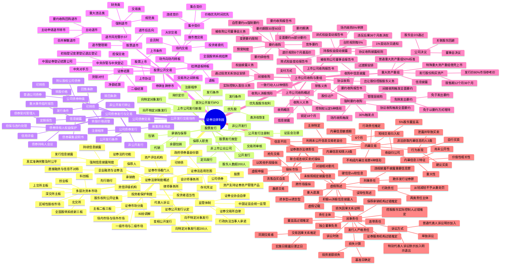

## 1. 章节定位

| 项目 | 信息 |
|------|------|
| 所属科目 | 经济法 |
| 难度等级 | 5 |
| 历年分值 | 15-20 分 |
| 建议学时 | 18-22 小时 |
| 知识关联章节 | 第1章 法律基本原理（法律渊源）；第2章 基本民事法律制度（代理、诉讼时效）；第3章 物权法律制度（权利质权、证券质押）；第4章 合同法律制度（承销协议、受托管理协议）；第6章 公司法律制度（股份发行、公司治理、董监高义务）；第8章 企业破产法律制度（债券违约与破产程序衔接）；第9章 票据与支付结算法律制度（证券结算与票据结算比较） |

## 2. 考情分析

本章是经济法科目的"重中之重"，分值约 15-20 分，是分值最高、篇幅最大、难度最高的章节。命题以主观题（案例分析题）为主，常以"上市公司收购 + 信息披露 + 虚假陈述/内幕交易法律责任"为综合考查主线；客观题则覆盖面极广，从证券发行注册制、多层次资本市场、公司债券发行条件、上市退市制度，到权益变动披露时点、要约收购规则、重大资产重组标准等。

**命题规律**：本章命题注重体系性与实务性结合，重点考查注册制改革后的发行制度、上市公司收购的核心规则（5%举牌、30%强制要约、要约收购程序）、重大资产重组（借壳上市认定与发行股份购买资产）、以及证券欺诈三类法律责任（虚假陈述民事赔偿的构成要件、内幕交易的认定、操纵市场的类型）。近年命题趋势是结合《虚假陈述侵权民事赔偿规定》（2022 年）、特别代表人诉讼制度、注册制改革配套规则出题。

**高频考点分布**：

1. **证券法律制度基本原理**：证券的范围（股票、公司债券、可转债、存托凭证）；公开发行的认定（向不特定对象发行、向特定对象发行累计超 200 人）；多层次资本市场体系（主板、科创板、创业板、北交所、全国股转系统、区域性股权市场）；证券市场分类（一级/二级市场、场内/场外市场）。
2. **证券监管体制**：中国证监会统一监管；证券业协会、证券交易所自律管理；行政执法当事人承诺制度。
3. **强制信息披露制度**：发行信息披露（招股说明书、募集说明书）、持续信息披露（定期报告、临时报告）；信息披露真实、准确、完整、及时、公平。
4. **投资者保护制度**：投资者适当性管理；股东权利公开征集；先行赔付；纠纷调解；代表人诉讼（普通代表人诉讼 + 特别代表人诉讼"默示加入、明示退出"）。
5. **证券市场看门人制度**：保荐人、承销商、证券服务机构（会计师事务所、律师事务所、资产评估机构、资信评级机构、财务顾问）的勤勉尽责义务与连带责任。
6. **股票发行注册制**：公开发行注册程序（交易所审核 + 证监会注册）；IPO 条件；上市公司发行新股（向不特定对象发行、向特定对象发行）；承销与保荐（包销、代销）；优先股发行与交易。
7. **公司债券**：普通公司债券 vs 可转债 vs 附认股权公司债券；公开发行条件（积极条件、消极条件）；非公开发行（仅向专业投资者、不得超 200 人）；债券受托管理人；债券持有人会议；可转债的转股价格、赎回条款、回售条款。
8. **股票上市与退市**：上市条件；主动退市（三种模式）vs 强制退市（重大违法类、交易类、财务类、规范类）；退市风险警示（*ST）；退市整理期；退市后去向。
9. **场内交易与结算**：集中竞价（集合竞价、连续竞价）、大宗交易、做市商交易；成交原则（价格优先、时间优先）；二级结算；中央对手方；净额结算；货银对付；中央存管与中央登记；停牌复牌停市。
10. **挂牌、退板、转板**：全国股转系统挂牌条件；退板；转板机制（场外向场内、交易所之间）。
11. **上市公司收购**：控制权认定（5 种情形）；一致行动人（12 种情形）；收购人消极情形；收购人义务（信息披露、禁售、锁定 18 个月）；权益变动披露（5%举牌、台阶规则、1%变动、协议收购披露规则、简式 vs 详式权益变动报告书）；要约收购（全面要约 vs 部分要约、自愿要约 vs 强制要约、要约期限 30-60 日、底价规则、预受、竞争要约、要约期满）；强制要约收购（30%触发点、场内/协议/间接收购的不同后果）；免除发出要约（免于以要约方式增持、免于发出要约）；协议收购（过渡期安排、出让方控股股东义务、股份过户、管理层收购）；间接收购。
12. **上市公司重大资产重组**：普通重大资产重组标准（50% 三项指标）；特殊重大资产重组（借壳上市，控制权变更 36 个月内 100% 指标）；发行股份购买资产（发行价不低于市场参考价 80%、限售期）；信息披露与公司决议（董事会、股东会 2/3 通过、关联股东回避）。
13. **虚假陈述**：虚假记载、误导性陈述、重大遗漏、未按照规定披露信息；诱多型 vs 诱空型；行政责任（两类主体、从轻/减轻/不予/从重处罚）、刑事责任（欺诈发行证券罪、违规披露不披露重要信息罪）、民事责任（责任主体、连带责任、过错推定、不同主体的免责抗辩、交易因果关系推定、损失计算、基准日、诉讼时效）；诉讼方式（单独诉讼、普通代表人诉讼"明示加入"、特别代表人诉讼"默示加入、明示退出"）。
14. **内幕交易**：内幕信息三特征（重大性、尚未公开性、价值性）；内幕信息敏感期；内幕信息知情人（9 类）；非法获取内幕信息的人（3 类）；行为表现（自行买卖、建议买卖、泄露并导致买卖）；行政责任推定；短线交易归入权（6 个月、5% 股东董监高）；利用未公开信息交易（"老鼠仓"）。
15. **操纵市场**：联合或连续买卖式操纵；对敲（相对委托）；洗售（自买自卖）；虚假申报；蛊惑交易；抢先交易；跨市场操纵；以其他手段操纵。

**联动考查方式**：

- 与第6章公司法律制度联动：股份发行与公司治理、董监高义务、股东会决议；
- 与第2章基本民事法律制度联动：代理制度（证券经纪）、诉讼时效（虚假陈述民事诉讼时效）、共同侵权（连带责任）；
- 与第8章破产法律制度联动：债券违约与破产程序的衔接、债券受托管理人参与破产程序；
- 内部综合联动：上市公司收购 + 信息披露 + 虚假陈述/内幕交易法律责任（最典型综合题命题模式）。

**备考建议**：

- 本章内容庞杂，必须建立体系化框架：以"发行—交易—收购—重组—欺诈责任"为主线串联全章；
- 上市公司收购是核心中的核心：5%举牌、30%强制要约、要约收购程序、免除发出要约的各类情形必须精准记忆；
- 虚假陈述民事赔偿是近年高频考点：构成要件（侵权行为、主观过错、交易因果关系、损失因果关系）、不同主体的免责抗辩、损失计算（实施日、揭露日、基准日）必须理解透彻；
- 内幕交易的认定：内幕信息敏感期的确定、知情人的范围、行政责任推定与反驳；
- 区分易混淆概念：公开发行 vs 非公开发行、全面要约 vs 部分要约、自愿要约 vs 强制要约、普通重大资产重组 vs 借壳上市、诱多型 vs 诱空型虚假陈述、内幕交易 vs 老鼠仓；
- 关注数字考点：5%、30%、200 人、50%、100%、2/3、18 个月、6 个月、30-60 日、3 日、36 个月等。

## 3. 知识框架

## 4. 核心精讲

### 4.1 证券法律制度概述

#### 4.1.1 企业融资与证券法

资金如企业血脉，企业发展需吸收外部资金，社会上闲散资金也需投资渠道，二者匹配即为**直接融资**。但直接融资面临**信息不对称**难题：资金富裕方出让资金所有权后，难以评估资金稀缺方风险，也难以监控其履约。

商业社会发明了**证券**作为融资工具，将融资权利等额量化为小额、标准化的证券，便利融资交易、权利行使和交易转让，增强流动性。但标准化证券不能解决信息不对称问题，**现代证券法主要被用来解决信息不对称问题**——以美国 1933 年《证券法》为滥觞，遵循**强制信息披露原则**，要求发行人公开发行时履行信息披露义务，并通过证券欺诈法律责任制度（虚假陈述、内幕交易、操纵市场）保证信息真实性与获得信息的机会平等。这种监管哲学仍要求投资者在获得充分信息的情况下**自行承担投资风险**，政府不代替投资者挑选融资企业。

我国《证券法》于 1998 年通过，2005 年大幅修订，2019 年修订（2020 年 3 月 1 日施行）在证券定义、注册制改革、投资者保护和违法惩戒方面均有突破。

#### 4.1.2 《证券法》的适用范围

**（一）证券的范围**

《证券法》第二条界定其适用范围：

1. **股票、公司债券、存托凭证**——最主要的证券形式，国务院还可依法认定其他证券。
2. **政府债券、证券投资基金份额**——上市交易适用《证券法》；发行适用其他法律法规。
3. **资产支持证券、资产管理产品**——发行交易管理办法由国务院依照《证券法》原则规定，属"准证券"。

**证券的具体类型**：

| 证券类型 | 含义 | 特点 |
|---------|------|------|
| 股票 | 股份的纸面形式，公司签发的证明股东所持股份的凭证 | 收益性、流通性、非返还性、风险性；分普通股与优先股、A股/B股/境外上市外资股 |
| 公司债券 | 发行人依法定程序发行、约定一定期限还本付息的有价证券 | 债权凭证；有偿还期限；通常固定利率；破产时优先于股东受偿 |
| 可转债 | 发行人依法定程序发行、一定期间内可依约定条件转换成股票的公司债券 | 兼有债券与股票双重属性；混合型融资投资工具；公司债券与认股权的组合体 |
| 存托凭证 | 存托人签发、以境外证券为基础在中国境内发行、代表境外基础证券权益的证券 | 涉及基础证券发行人、存托人、存托凭证持有人三方主体；存托协议约定权利义务 |

**（二）证券公开发行**

证券发行分公开发行与非公开发行。《证券法》第九条规定，**公开发行证券必须符合法定条件并依法报经国务院证券监督管理机构或国务院授权部门注册，未经注册不得公开发行**。

**公开发行的认定**有两种情形：
1. **向不特定对象发行证券**——发行人对购买人无任何资质要求，强调销售方式的随机性或公开性。
2. **向特定对象发行证券累计超过 200 人**（依法实施员工持股计划的员工人数不计算在内）——特定对象通常指合格投资者。

此外，非公开发行证券不得采用广告、公开劝诱和变相公开方式；**若采用广告、公开劝诱等方式宣传证券发行活动，无论拟发行对象人数多少，即构成公开发行**。

**（三）证券市场**

1. **一级市场与二级市场**：发行市场为一级市场，交易市场为二级市场。公开发行的证券应在依法设立的证券交易所上市交易或在国务院批准的其他全国性证券交易场所交易；非公开发行的证券可在证券交易所、其他全国性证券交易场所、区域性股权市场转让。

2. **场内市场与场外市场**：场内市场指证券交易所市场；场外市场泛指证券交易所外交易场所。随着技术进步，场外市场又分**集中交易的公开型场外市场**（如全国股转系统）和**非集中交易的场外市场**（如区域性股权市场）。二者区别主要体现在上市标准/挂牌门槛和信息披露严苛程度。

3. **主板、二板、三板**：
   - **主板**：服务成熟型企业，上交所主板、深交所主板，突出"大盘蓝筹"特色；
   - **二板**：科创板（面向世界科技前沿、国家重大需求）、创业板（服务成长型创新创业企业）、北交所（服务创新型中小企业）；
   - **三板**：全国股转系统（新三板），服务中小微企业。

**（四）我国多层次资本市场**

| 市场 | 定位 | 特点 |
|------|------|------|
| 上交所主板 | 大盘蓝筹 | 业务模式成熟、经营业绩稳定、规模较大 |
| 科创板 | 科技创新企业 | 关键核心技术、科技创新能力突出、成长性强 |
| 深交所主板 | 成熟企业 | — |
| 创业板 | 成长型创新创业企业 | 创新驱动，传统产业与新技术新业态融合 |
| 北交所 | 创新型中小企业 | 公司制证券交易所；发行人为全国股转系统连续挂牌满 12 个月创新层公司；向不特定合格投资者公开发行 |
| 全国股转系统（新三板） | 中小微微企业 | 公开型场外市场；分基础层、创新层；不设财务门槛；多元化交易机制（做市、集合竞价、大宗交易） |
| 区域性股权市场 | 所在省级行政区域内中小微企业 | 私募股权市场；非公开发行；不得集中交易；权益持有人不得超 200 人 |

**区域性股权市场的限制**：①不得将权益拆分为均等份额公开发行；②不得采取集中交易方式；③不得将权益按标准化交易单位持续挂牌交易；④权益持有人累计不得超过 200 人；⑤不得以集中交易方式进行标准化合约交易。

#### 4.1.3 证券市场监管体制

**（一）政府统一监管**

中国证监会依法对全国证券市场实行**集中统一监督管理**。其职责包括：制定规章规则并审批核准注册备案；对证券发行交易登记托管结算等行为监督管理；对证券发行人、证券公司、证券服务机构、证券交易场所、证券登记结算机构监督管理；监督检查信息披露；指导和监督证券业协会；监测防范处置风险；开展投资者教育；查处违法行为等。

中国证监会的法定权限包括：现场检查权、调查取证权、询问权、查阅复制权、封存扣押权、冻结查封权、限制证券买卖、阻止出境等。

**行政执法当事人承诺制度**：证券监管机构对涉嫌违法的单位或个人调查期间，被调查当事人承诺纠正违法行为、赔偿投资者损失、消除不良影响并经认可后，终止案件调查的执法方式。其特征：
1. 仅适用于调查期间（收到调查法律文书之日至作出行政处罚决定前）；
2. 当事人书面申请；
3. 证监会认可后中止调查，签署承诺认可协议（载明纠正措施、承诺金数额及交纳方式等）；
4. 当事人完全履行后终止调查。

**（二）行业自律管理**

1. **中国证券业协会**：全国性自律管理组织，会员为各类证券经营机构。职责包括教育组织会员遵守法律法规、维护会员合法权益、督促投资者保护、制定实施自律规则、制定业务规范、调解纠纷等。

2. **证券交易场所**：包括证券交易所和国务院批准的其他全国性证券交易场所。我国现有上海、深圳、北京三家证券交易所。上交所、深交所为会员制，北交所为公司制。证券交易所职能包括提供交易场所设施、制定业务规则、依法审核公开发行申请、审核安排上市交易决定终止上市、提供非公开发行证券转让服务、组织监督交易、监管会员与上市公司、管理公布市场信息、投资者教育保护等。

证券交易所自律管理主要体现在：对证券交易活动的一线监管（制定交易规则、公布行情、实时监控、异常交易报告、限制交易）；对上市公司及相关信息披露义务人监管；对会员监管；对证券服务机构监管。

#### 4.1.4 强制信息披露制度

**信息披露的要求**：真实、准确、完整、及时、公平。

**信息披露的类型**：
1. **发行信息披露**：公开发行证券须依法披露招股说明书、公司债券募集办法、财务会计报告等。信息披露义务人未按照规定披露信息或披露文件存在虚假记载、误导性陈述、重大遗漏，致使投资者遭受损失的，承担赔偿责任。
2. **持续信息披露**：定期报告（年度报告、中期报告、季度报告）和临时报告（发生重大事件时）。

#### 4.1.5 投资者保护制度

1. **投资者适当性管理**：证券公司向投资者销售证券、提供服务，应了解投资者基本情况、财产状况、金融资产状况、投资知识和经验、专业能力等相关信息，如实说明证券、服务的重要内容，充分揭示风险。投资者分为**专业投资者**和**普通投资者**。
2. **股东权利公开征集**：上市公司董事会、独立董事、持有 1% 以上有表决权股份的股东、投资者保护机构，可以作为征集人公开请求上市公司股东委托其代为出席股东会并行使表决权。
3. **先行赔付**：发行人因欺诈发行、虚假陈述等违法行为给投资者造成损失的，发行人的控股股东、实际控制人、相关证券公司可以委托投资者保护机构就赔偿事宜与投资者达成协议，予以先行赔付。
4. **纠纷调解**：投资者与发行人、证券公司等发生纠纷，投资者保护机构可进行调解。
5. **代表人诉讼**：见下文虚假陈述民事责任部分。

#### 4.1.6 证券市场看门人制度

**证券市场看门人**指为证券发行上市交易提供专业服务、发挥核查验证把关作用的机构和人员，包括**保荐人、承销商、证券服务机构**（会计师事务所、律师事务所、资产评估机构、资信评级机构、财务顾问等）。

看门人的核心义务是**勤勉尽责**，对所依据的文件资料内容的真实性、准确性、完整性进行核查和验证。若其制作、出具的文件有虚假记载、误导性陈述或重大遗漏，给他人造成损失的，应当与发行人、上市公司承担**连带赔偿责任**，但能够证明自己没有过错的除外（过错推定）。

### 4.2 股票的发行

#### 4.2.1 股票公开发行注册制

我国股票发行实行**注册制**。公开发行的股票，由发行人向证券交易所申报，证券交易所审核同意后报中国证监会履行注册程序。证监会认为存在需要进一步说明事项的，可问询或要求交易所进一步问询；认为交易所审核意见依据不充分的，可退回补充审核。

**注册制与核准制的区别**：注册制下，证监会不实质审查发行人的盈利能力和投资价值，而由交易所审核发行条件、上市条件和信息披露要求，证监会履行注册程序，更强调信息披露的真实性、准确性、完整性，由投资者自行判断投资价值并承担风险。

#### 4.2.2 股票发行的类型

| 类型 | 含义 | 特点 |
|------|------|------|
| 公开发行 | 向不特定对象发行或向特定对象发行累计超 200 人 | 须依法注册；适用《证券法》严格程序 |
| 非公开发行 | 向特定对象发行且股东人数不超 200 人 | 不适用注册程序；不得广告公开劝诱变相公开 |

#### 4.2.3 非上市公众公司及定向发行

**非上市公众公司**指股票未在证券交易所上市交易但股东人数超过 200 人的股份有限公司。其股票可在全国股转系统公开转让。

**定向发行**（非公开发行）：非上市公众公司向特定对象发行股票，股东人数累计不超过 200 人的，豁免向证监会注册，由全国股转系统自律管理；超过 200 人的，须报证监会核准。

#### 4.2.4 首次公开发行股票（IPO）

**IPO 条件**（以主板为例）：
1. 具备健全且运行良好的组织机构；
2. 具有持续经营能力；
3. 最近三年财务会计报告被出具无保留意见审计报告；
4. 发行人及其控股股东、实际控制人最近三年不存在贪污、贿赂、侵占财产、挪用财产或破坏社会主义市场经济秩序的刑事犯罪；
5. 经国务院批准的国务院证券监督管理机构规定的其他条件。

**科创板、创业板、北交所**的上市条件各有特色，尤其在市值及财务指标方面更为多样化和包容化。

**IPO 程序**：发行人制作注册申请文件 → 向证券交易所申报 → 交易所审核问询 → 交易所形成审核意见报证监会 → 证监会注册（同意或不予注册）→ 发行上市。

**询价定价**：首次公开发行股票，应当向证券公司、基金管理公司、信托公司、财务公司、保险公司、合格境外机构投资者和人民币合格境外机构投资者、私募基金管理人等专业机构投资者询价。

#### 4.2.5 上市公司发行新股

**向不特定对象发行新股**（公开发行）：须经股东会决议，由董事会决议确定发行方案，报交易所审核并报证监会注册。

**向特定对象发行新股**（非公开发行）：发行对象不超过 35 名；发行价格不低于定价基准日前 20 个交易日公司股票均价的 80%；限售期 6 个月（控股股东、实际控制人或其控制的关联人 18 个月）。

#### 4.2.6 公开发行股票的承销与保荐

**承销方式**：

| 承销方式 | 含义 | 风险承担 |
|---------|------|---------|
| 代销 | 证券公司代发行人发售证券，未售出部分退还发行人 | 发行风险由发行人承担 |
| 包销（全额包销） | 证券公司将未售出证券全部自行买入 | 发行风险由证券公司承担 |
| 余额包销 | 证券公司承诺购入包销期满未售出证券 | 发行风险由证券公司承担 |

**保荐制度**：发行人申请首次公开发行股票并上市，应当聘请保荐人保荐。保荐人的职责包括尽职推荐发行人证券发行上市、持续督导发行人履行规范运作、信守承诺、信息披露等义务。保荐人应当遵守业务规则和行业规范，诚实守信，勤勉尽责。

#### 4.2.7 优先股的发行与交易

**优先股**是相对于普通股而言的股份，股东在分配利润和剩余财产方面优先于普通股股东，但一般不参与公司决策管理等。

**发行条件**：上市公司可向不特定对象发行优先股，或向特定对象发行优先股。公开发行优先股的条件包括：①已发行的优先股不得超过公司普通股股份总数的 50%，且筹资金额不得超过发行前净资产的 50%。

**优先股股东的特殊权利**：
1. **优先分配利润**——公司分配利润时，优先股股东优先于普通股股东。
2. **优先分配剩余财产**——公司清算时，优先股股东优先于普通股股东分配剩余财产。
3. **表决权限制与恢复**——优先股股东一般不出席股东会，所持股份不计入出席股东会有表决权股份总数。但公司累计 3 个会计年度或连续 2 个会计年度未按约定支付优先股股息的，优先股股东表决权恢复。

### 4.3 公司债券的发行与交易

#### 4.3.1 公司债券的一般理论

**公司债券**是公司依照法定程序发行、约定在一定期限还本付息的有价证券。与股票相比，公司债券的特点：①持有人是债权人；②享有按约定给付利息的请求权；③到期须偿还本金；④破产时优先于股东受偿；⑤利率一般固定，风险较小；⑥股份有限公司和有限责任公司均可发行（股票只能由股份有限公司发行）。

**公司债券的种类**：

| 分类 | 类型 | 含义 |
|------|------|------|
| 按是否带权益色彩 | 普通公司债券 | 到期还本付息的债券 |
| | 可转债 | 在一定期间内可依约定条件转换成股票的公司债券 |
| | 附认股权公司债券 | 附随投资者认股选择权的公司债券 |
| 按发行方式 | 公开发行公司债券 | 向公众投资者或专业投资者公开发行 |
| | 非公开发行公司债券 | 仅向专业投资者发行，不得超 200 人 |

**可转债与附认股权公司债券的区别**：可转债投资者行使转股权后，债券权益转换为股东权益，身份发生变化；附认股权公司债券投资者行使认股权后，通常不丧失债权人身份，仅叠加股东身份。

#### 4.3.2 公司债券的发行

**（一）公开发行条件**

**积极条件**：①具备健全且运行良好的组织机构；②最近 3 年平均可分配利润足以支付公司债券 1 年的利息；③具有合理的资产负债结构和正常的现金流量；④国务院规定的其他条件。

**面向普通投资者公开发行的额外标准**：①最近 3 年无债务违约或延迟支付本息；②最近 3 年平均可分配利润不少于债券 1 年利息的 1.5 倍；③最近一期末净资产不少于 250 亿元；④最近 36 个月内累计公开发行债券不少于 3 期、发行规模不少于 100 亿元。未达标准的，仅限专业投资者认购。

**消极条件**（不得再次公开发行）：①对已公开发行公司债券或其他债务有违约或延迟支付本息仍处于继续状态；②违反规定改变公开发行公司债券所募资金用途。

**（二）公开发行的注册程序**

1. 制作注册申请文件并向交易所申报；
2. 交易所审核（5 个工作日内决定是否受理；2 个月内出具审核意见）；
3. 证监会注册（自交易所受理之日起 3 个月内作出同意或不予注册的决定）；
4. 公开发行公司债券可一次注册分期发行，注册决定 2 年内有效，募集说明书自最后签署之日起 6 个月内有效。

**（三）非公开发行**

非公开发行公司债券应当向专业投资者发行，不得采用广告、公开劝诱和变相公开方式，每次发行对象不得超过 200 人。承销机构或依法自行销售的发行人应在每次发行完成后 5 个工作日内向中国证券业协会报备。

**（四）募集资金用途**

公开发行公司债券筹集资金必须按募集说明书所列用途使用；改变用途必须经债券持有人会议决议。不得用于弥补亏损和非生产性支出。

#### 4.3.3 公司债券持有人的权益保护

**1. 信用评级**：资信评级机构为公开发行公司债券进行信用评级，债券期限 1 年以上的，存续期间每年至少公布一次定期跟踪评级报告。

**2. 债券受托管理人**：公开发行公司债券强制受托管理，非公开发行可约定受托管理。受托管理人由本次发行的承销机构或其他经证监会认可的机构担任，应为证券业协会会员，为本次发行提供担保的机构不得担任。职责包括：持续关注发行人和保证人资信；监督募集资金使用；每年公告受托管理事务报告；发行人不能偿还债务时要求追加担保并申请财产保全；接受委托以自己名义代表债券持有人提起诉讼或参与破产程序等。

**3. 债券持有人会议**：公开发行公司债券应设立债券持有人会议，募集说明书应说明召集程序、会议规则等。债券持有人会议决议对同期全体债券持有人发生效力（包括未投赞成票的，但募集办法另有约定除外）。应召集会议的情形包括：拟变更募集说明书约定；发行人不能按期支付本息；发行人减资合并分立解散破产；担保物发生重大变化等。

**4. 担保和违约处理**：增信机制包括第三方担保、商业保险、资产抵押质押、限制债务规模等。发行人应在募集说明书中约定违约情形、违约责任及争议解决机制。

#### 4.3.4 可转换公司债券

**发行条件**：除符合公司债券发行条件外，还应当符合上市公司发行新股的条件。向不特定对象发行可转债的，主板上市公司应最近三个会计年度盈利且最近三个会计年度加权平均净资产收益率平均不低于 6%。

**转股期限**：可转债自发行结束之日起 **6 个月**后方可转换为公司股票。

**转股价格**：
- 向不特定对象发行：不低于募集说明书公告日前 20 个交易日股票交易均价和前 1 个交易日均价，且**不得向上修正**。
- 向特定对象发行：不低于认购邀请书发出前 20 个交易日均价和前 1 个交易日均价，且**不得向下修正**。

**转股价格调整条款**：因配股、增发、送股、派息、分立等引起股份变动时应同时调整转股价格。约定向下修正条款的，须经出席会议股东所持表决权 2/3 以上同意，持有可转债的股东应回避；修正后的价格不低于股东会召开日前 20 个交易日和前 1 个交易日均价。

**赎回条款**：发行人可按事先约定条件和价格赎回尚未转股的可转债。

**回售条款**：债券持有人可按事先约定条件和价格将债券回售给发行人。上市公司改变募集资金用途的，应赋予债券持有人一次回售权利。

### 4.4 股票的公开交易

#### 4.4.1 股票上市与退市

**（一）股票上市条件**

《证券法》规定，申请股票上市交易应向证券交易所提出申请，由交易所审核同意并签订上市协议。以《上交所股票上市规则》为例，主板上市条件包括：
1. 符合《证券法》、证监会规定的发行条件；
2. 发行后的股本总额不低于 5000 万元；
3. 公开发行的股份达到公司股份总数的 25% 以上；公司股本总额超过 4 亿元的，公开发行股份比例为 10% 以上；
4. 市值及财务指标符合规定标准；
5. 交易所要求的其他条件。

科创板、创业板、北交所的上市条件各有特色，市值及财务指标更为多元化。

**（二）股票终止上市（退市）**

退市分**主动退市**和**强制退市**，实践中最常见的是强制退市。

**1. 主动退市**：基于上市公司意思自治的终止上市。三种模式：
- 上市公司基于内部决议主动向交易所提出退市申请（须经出席会议股东所持表决权 2/3 以上通过，且除董事高管、5% 以上股东外的其他股东 2/3 以上通过）；
- 通过要约收购、回购导致股权分布不再具备上市条件；
- 因新设或吸收合并不再具有独立主体资格，或股东会决议解散。

主动退市的特殊性：①股票不进入退市整理期交易；②不一定要进入全国股转系统，可选择其他证券交易场所或依法作其他安排；③可随时向交易所提出重新上市申请。

**2. 强制退市**：

| 类型 | 含义 |
|------|------|
| 重大违法类强制退市 | 欺诈发行、重大信息披露违法或其他严重损害证券市场秩序的重大违法行为；涉及国家安全、公共安全、生态安全、生产安全、公众健康安全等领域违法行为 |
| 交易类强制退市 | 交投不活跃、股权分布不合理、市值过低等不再适合公开交易 |
| 财务类强制退市 | 财务指标不满足交易所要求 |
| 规范类强制退市 | 信息披露、规范运作等方面不满足交易所要求 |

**退市风险警示**：当上市公司出现财务状况异常或其他未规范运作情形，导致股票存在被终止上市风险时，交易所先采取风险警示措施，在公司股票简称前冠以"**\*ST**"字样。

**退市整理期**：交易所作出终止上市决定后，公司股票并非立即退出交易，而是有一个缓冲阶段——退市整理期。进入退市整理期交易的股票在其简称前冠以"退市"标识。退市整理期通常不适用于主动退市公司和交易类强制退市公司。

**退市后去向**：强制退市公司应进入全国股转系统交易；因欺诈发行强制退市的公司不得申请重新上市。主动退市公司可选择在其他证券交易场所交易或依法作其他安排，也可随时申请重新上市。

#### 4.4.2 股票场内交易和结算

**（一）场内交易一般规则**

1. **投资者委托**：投资者通过证券公司进行证券交易，须在证券登记结算机构开立证券账户，使用实名账户。
2. **会员制**：进入实行会员制的证券交易所参与集中交易的，必须是交易所会员。非会员不得直接参与股票集中交易。
3. **经纪证券公司的义务**：妥善保存客户开户资料、委托记录、交易记录等，保存期限不少于 20 年。证券公司不得将投资者账户提供给他人使用。

**（二）场内交易方式**

| 交易方式 | 含义 | 特点 |
|---------|------|------|
| 集中竞价 | 集合竞价（产生开盘价）+ 连续竞价（市价成交） | 价格优先、时间优先；我国 A 股市场最主要交易方式 |
| 大宗交易 | 对交易规模非常大的交易采用特殊处理 | 协议大宗交易（协商定价）+ 盘后定价大宗交易（收盘价撮合） |
| 做市商交易 | 证券商双边报价，以自有资金和证券与投资者交易 | 价格来自券商报价；北交所、科创板引入做市商机制 |

**集中竞价的成交原则**：
- **价格优先**：较高价格买进申报优先于较低价格买进申报；较低价格卖出申报优先于较高价格卖出申报。
- **时间优先**：买卖方向、价格相同的，先申报者优先于后申报者。

**（三）证券结算**

1. **二级结算**：证券公司根据投资者委托参与场内集中交易并承担清算交收责任；证券登记结算机构根据成交结果与证券公司进行证券和资金的清算交收，并为证券公司客户办理证券的登记过户手续。

2. **中央对手方**：证券登记结算机构作为中央对手方提供证券结算服务，是结算参与人共同的清算交收对手，进行净额结算。即无论终端成交投资者为谁，结算一方为证券公司，另一方始终为证券登记结算机构。

3. **净额结算**：对买入和卖出交易的证券或资金进行轧差，以净额进行交收。我国场内交易结算主要是多边净额结算。

4. **货银对付**：证券和资金的交收互为条件，结算参与人履行资金交收义务的相应证券完成交收，履行证券交收义务的相应资金完成交收。共同对手方制度为货银对付提供保障。

5. **担保交收**：作为共同对手方的证券登记结算机构承担对结算参与人的履约义务，不以任何一个对手方结算参与人正常履约为前提；若一方不能正常履约，共同对手方也应先对守约方履约。

**（四）股票中央存管和中央登记**

1. **中央存管**：在证券交易所或国务院批准的其他全国性证券交易场所交易的证券，都应全部存管在证券登记结算机构。我国证券登记结算机构为中国证券登记结算公司。

2. **中央登记**：公开公司的持有人名册皆由证券登记结算机构进行登记，通过初始登记、变更登记和退出登记证明并确认所存管证券的权利归属和变动情况。

**（五）停牌、复牌、停市**

- **停牌**：上市公司股票暂停交易；**复牌**：停牌股票恢复交易。上市公司可向交易所申请停牌或复牌，但不得滥用损害投资者合法权益。交易所也可依业务规则决定停牌或复牌。
- **停市**：因不可抗力、意外事件、重大技术故障、重大人为差错等突发性事件影响证券交易正常进行时，交易所可采取技术性停牌、临时停市等措施。交易所对其采取措施造成的损失不承担民事赔偿责任，但存在重大过错的除外。

#### 4.4.3 挂牌、退板和转板

**（一）挂牌**

股份有限公司申请股票在全国股转系统挂牌的条件：①依法设立且合法存续的股份有限公司，股本总额不低于 500 万元；②股权明晰，股票发行和转让行为合法合规；③公司治理健全，合法规范经营；④业务明确，具有持续经营能力；⑤主办券商推荐并持续督导；⑥持续经营不少于两个完整会计年度；⑦其他条件。

股东人数未超 200 人的公司申请挂牌，证监会豁免注册，由全国股转系统审核。股东人数超 200 人的，须报证监会履行注册程序。

**（二）退板**

全国股转系统的退板分强制退板和申请退板两类。

**（三）转板**

- **场外向场内转板**：在全国股转系统挂牌的公司，达到股票上市条件的，可直接向证券交易所申请上市交易。
- **交易所之间转板**：符合条件的北交所上市公司可申请转板至科创板或创业板。此种转板属于股票上市地变更，不涉及股票公开发行，依法无需经证监会注册，由交易所审核决定。

### 4.5 上市公司收购和重组

#### 4.5.1 上市公司收购概述

**上市公司收购**指收购人通过证券交易所证券交易持有一个上市公司股份达到一定比例，或通过其他合法方式控制一个上市公司股份达到一定程度，导致其获得或可能获得对该公司实际控制权的行为。

**控制权认定**（5 种情形）：①投资者为上市公司持股超过 50% 的控股股东；②投资者可实际支配上市公司股份表决权超过 30%；③投资者通过实际支配股份表决权能够决定公司董事会超过半数成员选任；④投资者依其可实际支配的股份表决权足以对股东会决议产生重大影响；⑤证监会认定的其他情形。

**一致行动人**（12 种情形，无相反证据则认定）：投资者之间有股权控制关系；受同一主体控制；董事监事高管主要成员交叉任职；参股并可对重大决策产生重大影响；银行外法人为投资者取得股份提供融资；存在合伙合作联营等经济利益关系；持有投资者 30% 以上股份的自然人与投资者持有同一上市公司股份；在投资者任职的董事监事高管与投资者持有同一上市公司股份；上述自然人和人员的亲属与投资者持有同一上市公司股份；上市公司董事高管及其亲属同时持有本公司股份或与其控制的企业同时持有本公司股份；上市公司董事高管和员工与其控制或委托的法人组织持有本公司股份；其他关联关系。一致行动人应当合并计算其所持有的股份。

**收购人消极情形**（不得收购上市公司）：①负有数额较大债务到期未清偿且处于持续状态；②最近 3 年有重大违法行为或涉嫌重大违法行为；③最近 3 年有严重的证券市场失信行为；④收购人为自然人存在《公司法》第一百七十八条规定情形；⑤其他情形。收购人应聘请专业机构担任财务顾问。

**收购人的义务**：
1. **信息披露义务**：持股 30% 以下应履行持股权益变动披露义务；实施要约收购应编制要约收购报告书；以协议方式收购超 30% 符合免除要约规定的应编制上市公司收购报告书。
2. **要约收购人的禁售义务和平等对待义务**：要约收购公告后至收购期限届满前，不得卖出被收购公司股票，也不得采取要约规定以外形式和超出要约条件买入股票；应公平对待所有股东，同一种类股份股东应得到同等对待。
3. **锁定义务**：收购人持有的被收购上市公司股票，在收购行为完成后 **18 个月**内不得转让（同一实际控制人控制的不同主体之间转让除外）。

#### 4.5.2 持股权益变动披露

**（一）场内收购的权益变动披露**

**1. 5% 举牌（卡点披露且停止买卖）**：通过证券交易所证券交易，投资者及其一致行动人拥有权益的股份达到一个上市公司已发行股份的 **5%**，应当在该事实发生之日起 **3 日内**编制权益变动报告书，向证监会、交易所报告，通知该上市公司并公告；在上述期限内不得再行买卖该上市公司股票。

**2. 台阶规则**：达至 5% 后，每增加或减少 **5%**（触及 5% 整数倍，如 10%、15%），应在事实发生之日起 3 日内进行权益披露，并在事实发生之日起至公告后 3 日内不得再行买卖该上市公司股票。

**3. 1% 变动规则**：达至 5% 后，每增加或减少 **1%**，应在事实发生的**次日**通知上市公司并公告，但不需要停止买卖。

**违反后果**：未遵循"5% 卡点披露"和"台阶规则"而买入股份的，在买入后 **36 个月内**，对超过规定比例部分的股份不得行使表决权。

**（二）协议收购的权益变动披露**

协议收购的投资者无法单方面控制协议购买股份数量，不适用"卡点 5%"披露，而适用以下规则：
1. 拟达到或超过 5%：在触及或跨越 5% 之日起 3 日内履行披露义务。
2. 达到 5% 后每增减达到或超过 5%（触及或跨越 5% 整数倍）：在 3 日内履行披露义务。
3. 在作出报告、公告前，不得再行买卖该上市公司股票。

**（三）简式 vs 详式权益变动报告书**

| 类型 | 适用情形 | 内容 |
|------|---------|------|
| 简式权益变动报告书 | 持股 5% 以上但未达 20%，且不是第一大股东或实际控制人 | 基本信息持股目的等 7 项内容 |
| 详式权益变动报告书 | 持股 5% 以上但未达 20% 且为第一大股东或实际控制人；或持股 20% 以上未超过 30% | 简式内容 + 控股股东实际控制人股权结构、同业竞争关联交易、后续计划等 |

#### 4.5.3 要约收购制度

**（一）要约收购的概念、特点和分类**

要约收购是收购人在证券交易所集中竞价系统之外，公开、直接向被收购公司所有股东发出要约购买其所持股票的收购方式。

**特点**：①价格形式上最为公平（同一价格适用所有受要约人，且有底价规则限制）；②排斥其他收购方式（要约收购期间不得采用其他方式和超出要约条件买入）；③是证券交易所之外唯一被允许的公开收购方式。

**分类**：

| 分类标准 | 类型 | 含义 |
|---------|------|------|
| 按预定收购比例 | 全面要约 | 向所有股东发出收购全部股份的要约 |
| | 部分要约 | 向所有股东发出收购部分股份的要约 |
| 按是否法律强制 | 自愿要约 | 收购人自愿决定 |
| | 强制要约 | 持股达 30% 后法律强制发出 |

无论自愿要约还是强制要约，预定收购股份比例不得低于该上市公司已发行股份的 5%。

**（二）要约收购的规则**

1. **编制要约收购报告书并提示性公告**：收购人应编制要约收购报告书，聘请财务顾问，通知被收购公司，对要约报告书摘要作出提示性公告。自作出提示性公告起 60 日内未公告要约收购报告书的，应通知被收购公司并公告，此后每 30 日公告一次直至公告要约收购报告书。收购人在公告要约收购报告书前可自行取消收购计划，但自公告之日起 12 个月内不得再次对同一上市公司进行收购。

2. **要约期限**：不得少于 **30 日**，不得超过 **60 日**（竞争要约除外）。承诺期内收购人不得撤销收购要约。

3. **变更要约**：变更必须及时公告，且不得：①降低收购价格；②减少预定收购股份数额；③缩短收购期限。收购要约期限届满前 **15 日内**不得变更要约（竞争要约除外）。

4. **竞争要约**：发出初始要约的收购人变更要约距初始要约届满不足 15 日的，应延长收购期限（不少于 15 日，不超过最后一个竞争要约期满日）。竞争要约收购人最迟不得晚于初始要约届满前 15 日发出提示性公告。

5. **底价规则**：要约价格不得低于要约收购提示性公告日前 **6 个月**内收购人取得该种股票所支付的最高价格。要约价格低于提示性公告前 30 个交易日该种股票每日加权平均价格算术平均值的，财务顾问应进行分析说明。

6. **要约收购的排他性**：收购人公告后至收购期限届满前，不得卖出被收购公司股票，也不得采取要约规定以外形式和超出要约条件买入。

7. **被收购公司董事会义务**：①公告董事会意见的义务——对收购人主体资格、资信情况及收购意图调查，对要约条件分析，对股东是否接受要约提出建议，聘请独立财务顾问；在收购人公告要约收购报告书后 **20 日内**公告董事会报告书与独立财务顾问专业意见。②不得恶意处置公司资产——提示性公告后至要约收购完成前，未经股东会批准，董事会不得通过处置资产、对外投资、调整主营业务、担保、贷款等方式对资产负债权益或经营成果造成重大影响。③要约收购期间董事不得辞职。

8. **预受制度**：预受是被收购公司股东同意接受要约的初步意思表示，在要约收购期限内不可撤回之前不构成承诺。预受股票在要约收购期间不得转让。在要约收购期限届满 **3 个交易日前**，预受股东可撤回预受；届满前 3 个交易日内不得撤回。收购人应依约购买预受股份，不按约定支付或购买的，自事实发生之日起 **3 年内**不得收购上市公司。

9. **要约期满**：部分要约收购人按约定条件购买预受股份，预受数量超过预定收购数量时按同等比例收购；以终止上市地位为目的的或因不符合免除要约规定而发出全面要约的，应购买预受的全部股份。收购期限届满后 3 个交易日内办理股份过户；15 日内向交易所提交书面报告并公告。收购完成后股权分布不符合上市交易要求的，交易所依法终止上市。剩余股东有强制出售权——可在合理期限内以要约同等条件向收购人出售股票。

**（三）强制要约收购制度**

**触发点**：通过证券交易所证券交易，投资者持有或通过协议其他安排共同持有一个上市公司已发行的有表决权股份达到 **30%**，继续进行收购的，应当依法向该上市公司所有股东发出全面要约或部分要约。

**不同收购方式触发强制要约的后果**：

| 收购方式 | 触发 30% 后的后果 |
|---------|-----------------|
| 场内收购 | 可发出全面要约或部分要约 |
| 协议收购 | 超过 30% 部分应改以要约方式进行；符合免除要约规定可履行协议，不符合应发出全面要约 |
| 间接收购 | 应向所有股东发出全面要约；预计 30 日内无法发出的，应在 30 日内促使其控制的股东减持至 30% 或以下 |

**免除发出要约**：

1. **免于以要约方式增持股份**（《上市公司收购管理办法》第六十二条）：①同一实际控制人控制的不同主体之间转让，未导致实际控制人变化；②上市公司面临严重财务困难，收购人挽救方案经股东会批准且承诺 3 年内不转让；③证监会认定的其他情形。

2. **免于发出要约**（第六十三条，10 种情形）：①国有资产无偿划转变更合并；②上市公司向特定股东回购减资；③取得上市公司发行新股且承诺 3 年不转让；④持股达 30% 以上 1 年后每 12 个月增持不超 2%；⑤持股达 50% 以上继续增持不影响上市地位；⑥金融机构承销贷款等业务导致持股超 30% 无实际控制意图；⑦继承；⑧约定购回式证券交易购回；⑨优先股表决权恢复；⑩证监会认定的其他情形。

#### 4.5.4 协议收购

**协议收购**是收购人和被收购公司控股股东之间通过协议转让股权方式完成控制权转移的收购方式。

**1. 过渡期安排**：自签订收购协议起至股份完成过户的期间。过渡期内：收购人不得通过控股股东提议改选董事会（确有理由的，来自收购人的董事不得超过董事会成员 1/3）；被收购公司不得为收购人及其关联方提供担保；不得公开发行股份募集资金，不得进行重大购买出售资产及重大投资行为或与收购人及其关联方进行其他关联交易（挽救危机公司除外）。

**2. 出让股份之控股股东的义务**：应对收购人的主体资格、诚信情况及收购意图进行调查并在权益变动报告书中披露。未清偿对公司的负债、未解除公司为其负债提供的担保或存在其他损害公司利益情形的，被收购公司董事会应及时披露并采取有效措施维护公司利益。

**3. 股份过户**：协议收购相关当事人应向证券登记结算机构申请办理拟转让股份的临时保管手续。收购报告书公告后 30 日内仍未完成过户的应公告说明理由，未完成期间每隔 30 日公告进展。

**4. 管理层收购**：上市公司董事、高级管理人员、员工或其控制或委托的法人或其他组织对本公司进行收购。特别要求：①独立董事比例达 1/2 以上；②聘请资产评估机构提供评估报告；③全体独立董事 2/3 以上同意后提交董事会，经非关联董事决议后提交股东会，经非关联股东过半数通过；④独立董事聘请独立财务顾问出具专业意见；⑤董事高管存在《公司法》第一百八十一条至一百八十四条规定情形或最近 3 年有证券市场不良诚信记录的不得收购。

#### 4.5.5 间接收购

**间接收购**指收购人虽不是上市公司股东，但通过投资关系、协议、其他安排导致其拥有权益的股份达到或超过 5% 的情形。

**规制要点**：
1. 间接收购同样遵循强制要约收购规则：拥有权益股份超 30% 应发出全面要约。
2. 间接收购同样遵循收购信息披露规则：5% 以上未超 30% 应履行权益预警披露义务。
3. 间接收购中上市公司实际控制人负有配合义务：实际控制人及受其支配的股东应配合上市公司真实、准确、完整披露有关实际控制人发生变化的信息；拒不配合导致上市公司无法履行信息披露义务的，上市公司有权对其提起诉讼。

#### 4.5.6 收购中的信息披露

| 信息披露文件 | 适用情形 |
|-------------|---------|
| 要约收购报告书 | 收购人主动采用要约收购，或不符合免除要约规定须改以要约方式收购 |
| 上市公司收购报告书 | 触发强制要约义务但符合免除发出要约情形 |
| 被收购公司董事会报告书 | 收购人公告要约收购报告书后 20 日内，被收购公司董事会应公告 |

#### 4.5.7 上市公司重大资产重组

**（一）重大资产重组的界定和类型**

**普通重大资产重组标准**（达到之一即构成）：
1. 购买、出售资产总额占上市公司最近一个会计年度经审计合并财务报告期末资产总额的 **50%** 以上；
2. 购买、出售资产最近一个会计年度营业收入占上市公司同期经审计合并财务报告营业收入的 **50%** 以上，且超过 5000 万元；
3. 购买、出售资产净额占上市公司最近一个会计年度经审计合并财务报告期末净资产额的 **50%** 以上，且超过 5000 万元。

**特殊重大资产重组（借壳上市）标准**：上市公司自控制权发生变更之日起 **36 个月**内，向收购人及其关联人购买资产，导致以下根本变化情形之一：①购买资产总额占控制权变更前一个会计年度末资产总额 100% 以上；②购买资产营业收入占 100% 以上；③购买资产净额占 100% 以上；④为购买资产发行的股份占首次向收购人购买资产的董事会决议前一个交易日股份 100% 以上；⑤可能导致主营业务根本变化；⑥证监会认定的其他情形。

**（二）发行股份购买资产**

**发行价格**：不得低于市场参考价的 **80%**。市场参考价为本次发行股份购买资产的董事会决议公告日前 20 个交易日、60 个交易日或 120 个交易日的公司股票交易均价之一。

**限售期**：

| 情形 | 限售期 |
|------|--------|
| 一般情形 | 自股份发行结束之日起 **12 个月** |
| 特定对象为控股股东、实际控制人或其控制的关联人 | **36 个月** |
| 特定对象通过认购取得实际控制权 | **36 个月** |
| 特定对象用于认购股份的资产持续拥有权益时间不足 12 个月 | **36 个月** |
| 借壳上市情形下原控股股东、原实际控制人及其关联人 | **36 个月** |

**（三）公司决议程序**

1. **董事会决议**：重大资产重组构成关联交易的，应经全体独立董事过半数同意后提交董事会审议。
2. **股东会决议**：必须经出席会议股东所持表决权的 **2/3 以上**通过。关联股东应回避表决。除董事高管、5% 以上股东外，其他股东的投票情况应单独统计并披露。

### 4.6 证券欺诈的法律责任

《证券法》规定了几类证券欺诈行为的法律责任，主要包括虚假陈述、内幕交易和操纵市场。

#### 4.6.1 虚假陈述行为

**（一）虚假陈述的概念和分类**

**虚假陈述**指信息披露义务人违反证券法律规定，在证券发行或交易过程中，对重大事件作出违背事实真相的虚假记载、误导性陈述，或在披露信息时发生重大遗漏、不正当披露信息的行为。

**应承担民事法律责任的虚假陈述**分为：
1. **虚假记载**——信息披露文件中对相关财务数据进行重大不实记载，或对其他重要信息作出与真实情况不符的描述。
2. **误导性陈述**——披露信息隐瞒了相关部分重要事实，或未及时披露更正确认信息，致使已披露信息因不完整、不准确而具有误导性。
3. **重大遗漏**——对重大事件或重要事项等应披露信息未予披露。
4. **未按照规定披露信息**——未按规定的期限、方式等要求及时、公平披露信息。

**其他分类**：
- **诱多型**虚假陈述：发布虚假利多消息或隐瞒利空消息，使投资者在高位追涨。
- **诱空型**虚假陈述：发布虚假利空消息或隐瞒利好消息，使投资者低价卖出。
- **硬信息**披露虚假陈述（已发生的经营财务信息）vs **软信息**披露虚假陈述（盈利预测等预测性信息）。
- 积极信息披露义务人的虚假陈述 vs 消极信息披露人编造传播虚假信息（适用《证券法》第五十六条）。

**（二）虚假陈述的行政法律责任**

**两类责任主体**：
1. 发行人或上市公司的董事、监事和高级管理人员——负有保证信息披露真实准确完整及时公平的义务，能够证明已尽忠实勤勉义务没有过错的除外。
2. 董事监事高管之外的其他人员——确有证据证明其行为与信息披露违法行为具有直接因果关系的，承担行政责任。

**控股股东、实际控制人指使的认定**：受控股股东、实际控制人指使未按规定披露信息或披露信息有虚假记载、误导性陈述、重大遗漏的，应同时认定控股股东、实际控制人的违法责任。直接授意、指挥从事信息披露违法行为的，认定为指使。

**从轻或减轻处罚情形**：未直接参与；发现前主动要求纠正或报告；获悉后提出质疑并采取措施；配合调查且有立功表现；受他人胁迫；其他情形。

**不予行政处罚情形**：在会议记录中投反对票并记载具体异议；因不可抗力失去人身自由等无法履职；对违法行为不负主要责任的人员事后及时报告；其他情形。不得单独作为不予处罚情形的：不直接从事经营管理；能力不足无相关背景；任职时间短；相信专业机构意见；受股东实际控制人控制或外部干预。

**从重处罚情形**：不配合监管甚至暴力威胁干扰执法；变造隐瞒毁灭证据或提供伪证；两次以上违反并受处罚或纪律处分；有不良诚信记录；其他情形。

**（三）虚假陈述的刑事法律责任**

《刑法》规定两种罪名：**欺诈发行证券罪**（发行时虚假陈述）和**违规披露、不披露重要信息罪**（上市公司虚假陈述）。利用相同虚假财务数据先后实施两类行为的，分别构成犯罪的应同时追究刑事责任。

**（四）虚假陈述的民事法律责任**

**1. 责任承担主体和责任形式**

| 责任主体 | 归责原则 | 法律依据 |
|---------|---------|---------|
| 发行人、上市公司 | 严格责任（不问过错） | 《证券法》第八十五条 |
| 控股股东、实际控制人、董事、监事、高级管理人员、其他直接责任人员 | 过错推定（能证明无过错除外） | 《证券法》第八十五条 |
| 保荐人、承销的证券公司及其直接责任人员 | 过错推定 | 《证券法》第八十五条 |
| 证券服务机构（会计师事务所、律师事务所、资产评估机构、资信评级机构、财务顾问等） | 过错推定 | 《证券法》第一百六十三条 |

**连带责任**：发行人是首要信息披露义务人和"默认"责任主体，其他责任主体与发行人承担连带责任。

**特殊情形**：
- 控股股东、实际控制人组织、指使发行人实施虚假陈述的，原告可直接以该控股股东、实际控制人为被告请求赔偿；发行人承担赔偿后可向其追偿。
- 保荐机构、承销机构等以与发行人有补偿约定为由请求发行人或控股股东补偿的，法院不予支持（防止责任"转嫁"给投资者）。
- 重大资产重组交易对方提供信息不符合真实准确完整要求导致虚假陈述的，应与发行人等承担连带责任。
- 发行人供应商、客户、金融机构等明知财务造假仍配合的，应与发行人等承担连带责任。

**2. 民事责任构成要件**

虚假陈述民事责任作为特殊侵权责任，构成要件包括：①客观侵权行为（虚假陈述行为）；②侵权人主观要件；③交易因果关系（信赖）；④客观损害后果；⑤损失因果关系。

**（1）客观侵权行为要件**

2015 年立案登记制度改革后，虚假陈述民事诉讼不再以行政处罚或刑事判决为前置程序。原告应提交：证明身份的文件；信息披露义务人实施虚假陈述的证据；因虚假陈述进行交易的凭证及损失证据。

**重大性认定**：有下列情形之一的，法院应认定虚假陈述内容具有重大性：①属于《证券法》第八十条第二款、第八十一条第二款规定的重大事件；②属于监管部门规章和规范性文件中要求披露的重大事件或重要事项；③虚假陈述的实施、揭露或更正导致相关证券交易价格或交易量产生明显变化。被告能证明虚假陈述并未导致价格或交易量明显变化的，应认定不具有重大性。

**（2）不同责任主体的主观归责原则与免责抗辩**

**发行人的董事、监事、高级管理人员**：根据工作岗位和职责、在信息披露文件形成和发布中的作用、核验信息的措施等审查认定。不能提供勤勉尽责证据，仅以不从事日常经营管理、无相关背景、相信发行人或证券服务机构意见等为由主张无过错的，不予支持。依照《证券法》第八十二条第四款以书面方式发表附具体理由意见并依法披露的，可认定无过错（但审议审核时投赞成票的除外）。

**独立董事**：能证明下列情形之一的应认定无过错：①签署文件前对不属于自身专业领域问题借助会计法律等专门职业帮助仍未发现；②揭露日或更正日前发现虚假陈述后及时提出异议并监督整改或书面报告；③在独立意见中发表保留意见、反对意见或无法表示意见并说明具体理由（投赞成票的除外）；④因发行人拒绝阻碍其履职导致无法判断并及时书面报告；⑤其他勤勉尽责情形。外部监事、职工监事参照适用。

**保荐机构、承销机构**：能证明下列情形的应认定无过错：①已按法律法规和行业执业规范要求进行审慎尽职调查；②对没有证券服务机构专业意见支持的重要内容经审慎调查和独立判断有合理理由相信真实；③对证券服务机构出具专业意见的重要内容经审慎核查和必要调查复核形成合理信赖。

**证券服务机构**：按照法律法规和行业执业规范，结合核查验证工作底稿等认定是否存在过错。责任限于其工作范围和专业领域。依赖保荐机构或其他证券服务机构的基础工作或专业意见致使存在虚假陈述，能证明经审慎核查和必要调查复核形成合理信赖的，应认定无过错。

**会计师事务所**：能证明下列情形之一的应认定无过错：①按执业准则规则保持必要职业谨慎仍未发现错误；②审计必须依赖的金融机构、供应商、客户等提供不实证明文件保持必要职业谨慎仍未发现；③已对舞弊迹象提出警告并发表审慎审计意见；④其他情形。

**（3）交易因果关系的推定**

**对"同期交易者"交易因果关系的推定**：原告能证明下列情形的，法院应认定交易因果关系成立：①信息披露义务人实施了虚假陈述；②原告交易的是与虚假陈述直接关联的证券；③原告在虚假陈述实施日之后、揭露日或更正日之前实施了相应交易（诱多型中买入，诱空型中卖出）。

**被告推翻交易因果关系推定**：能证明下列情形之一的，法院应认定交易因果关系不成立：①交易发生在虚假陈述实施前或揭露更正后；②交易时知道或应当知道存在虚假陈述或已被市场广泛知悉；③交易受到虚假陈述后发生的收购、重大资产重组等其他重大事件影响；④交易构成内幕交易、操纵市场等违法行为；⑤其他不具有交易因果关系的情形。

**虚假陈述实施日的确定**：
- 在证券交易场所网站或符合条件媒体上公告发布信息披露文件的，以披露日为实施日；
- 通过业绩说明会、接受新闻媒体采访等方式实施的，以内容在具有全国性影响的媒体上首次公布之日为实施日；
- 信息披露文件在交易日收市后发布的，以其后的第一个交易日为实施日；
- 因未及时披露更正确认信息构成误导性陈述或未及时披露重大事件构成重大遗漏的，以应当披露信息期限届满后的第一个交易日为实施日。

**虚假陈述揭露日或更正日的确定**：揭露日指虚假陈述在具有全国性影响的媒体上首次被公开揭露并为证券市场知悉之日。除当事人有相反证据外，下列日期认定为揭露日：①监管部门以涉嫌信息披露违法为由立案调查的信息公开之日；②证券交易场所等自律管理组织因虚假陈述采取自律管理措施的信息公布之日。更正日指信息披露义务人自行更正虚假陈述之日。

**（4）损失及损失因果关系的证明**

**损失计算**：以原告因虚假陈述而实际发生的损失为限，包括投资差额损失、投资差额损失部分的佣金和印花税。

**投资差额损失计算**（集中竞价交易市场中）：
- 诱多型（买入）：实施日后、揭露日或更正日前买入，揭露日或更正日后、基准日前卖出的，按买入均价与卖出均价差额乘以卖出数量；基准日前未卖出的，按买入均价与基准价格差额乘以未卖出数量。
- 诱空型（卖出）：实施日后、揭露日或更正日前卖出，揭露日或更正日后、基准日前买回的，按买回均价与卖出均价差额乘以买回数量；基准日前未买回的，按基准价格与卖出均价差额乘以未买回数量。

**基准日的确定**：
1. 自揭露日或更正日起，集中交易累计成交量达到可流通部分 100% 之日为基准日；
2. 自揭露日或更正日起，集中交易累计换手率在 10 个交易日内达到 100% 的，以第 10 个交易日为基准日；在 30 个交易日内未达到 100% 的，以第 30 个交易日为基准日；
3. 揭露日或更正日起至基准日期间每个交易日收盘价的平均价格为基准价格；
4. 无法依前述确定的，法院可根据有专门知识的人的专业意见确定基准价格。

**损失因果关系的证明**：法院应查明虚假陈述与原告损失之间的因果关系及其他导致损失的原因。被告能证明原告损失部分或全部由他人操纵市场、证券市场风险、证券市场对特定事件的过度反应、上市公司内外部经营环境等其他因素导致的，对减轻或免除责任的抗辩应予支持。

**3. 虚假陈述民事诉讼的诉讼方式**

《证券法》第九十五条规定了三种诉讼方式：

| 诉讼方式 | 特点 | 参与方式 |
|---------|------|---------|
| 单独诉讼 | 传统诉讼形式 | 投资者个别起诉 |
| 普通代表人诉讼 | 诉讼标的同一种类且一方人数众多 | 投资者通过登记参与，"明示加入"；判决对参加登记的投资者发生效力 |
| 特别代表人诉讼 | 投资者保护机构受 50 名以上投资者委托作为代表人 | 证券登记结算机构确认的权利人默认列入，"默示加入、明示退出"；投资者未声明退出的视为同意参加 |

**4. 诉讼时效**

以揭露日或更正日起算诉讼时效。揭露日与更正日不一致的，以在先的为准。对虚假陈述责任人中一人发生诉讼时效中断效力的事由，对其他连带责任人也发生时效中断效力。

#### 4.6.2 内幕交易行为

**（一）内幕交易的概念**

**内幕交易**指证券交易内幕信息的知情人员和非法获取内幕信息的人利用内幕信息进行证券交易的行为。主体是内幕信息知情人员和非法获取内幕信息的人；行为特征是通过掌握的内幕信息自行买卖证券，或建议他人买卖证券，或泄露信息导致他人买卖证券。

**（二）内幕信息**

**内幕信息**指证券交易活动中涉及发行人的经营、财务或对该发行人证券市场价格有重大影响的尚未公开的信息。三特征：

1. **重大性**——发生可能对上市公司股票交易价格等产生较大影响的应予以临时报告的重大事件，属于内幕信息。
2. **尚未公开性**——内幕信息产生至公开之间的时期称为"**内幕信息敏感期**"。内幕信息的形成时间：重大事件的发生时间或计划方案的形成时间；影响内幕信息形成的动议、筹划、决策或执行人员的初始时间。内幕信息的公开指在国务院证券期货监督管理机构指定的报刊、网站等媒体披露。
3. **价值性（相关性）**——涉及发行人经营、财务或对证券市场价格有重大影响。

**（三）内幕交易行为的认定**

**内幕信息知情人**（9 类）：
1. 发行人董事、监事、高级管理人员；
2. 持有公司 5% 以上股份的股东及其董事、监事、高级管理人员，公司实际控制人及其董事、监事、高级管理人员；
3. 发行人控股或实际控制的公司及其董事、监事、高级管理人员；
4. 因所任公司职务或因业务往来可获取内幕信息的人员；
5. 上市公司收购人或重大资产交易方及其控股股东、实际控制人、董事、监事、高级管理人员；
6. 因职务工作可获取内幕信息的证券交易场所、证券登记结算机构、证券公司、证券服务机构有关人员；
7. 因职责工作可获取内幕信息的证券监督管理机构工作人员；
8. 因法定职责对证券发行交易或上市公司及其收购、重大资产交易进行管理可获取内幕信息的主管部门、监管机构工作人员；
9. 可获取内幕信息的其他人员。

**非法获取内幕信息的人**（3 类）：
1. 利用窃取、骗取、套取、窃听、利诱、刺探或私下交易等手段获取内幕信息的；
2. 内幕信息知情人员的近亲属或关系密切的人员，在敏感期内从事或明示暗示他人从事或泄露信息导致他人从事与内幕信息有关的交易，交易行为明显异常且无正当理由或正当信息来源的；
3. 在敏感期内与内幕信息知情人联络接触，从事或明示暗示他人从事或泄露信息导致他人从事相关交易，交易行为明显异常且无正当理由或正当信息来源的。

**行为表现**：
1. **自行买卖**——敏感期内自行买卖与内幕信息直接相关的发行人证券；
2. **建议买卖**——敏感期内明示或暗示建议他人买卖；
3. **泄露内幕信息并导致他人买卖**——敏感期内泄露信息导致他人买卖，不论泄露时主观状态。

**行政责任推定**：在内幕信息敏感期内，知情人或非法获取人买卖相关证券又不能给出正当理由或正当信息来源的，通常即被推定从事内幕交易。监管机构提供证据证明下列情形之一即可推定内幕交易成立：①知情人进行与内幕信息有关的交易；②知情人的配偶父母子女等密切关系人交易与内幕信息基本吻合；③因履行工作职责知悉内幕信息并进行交易；④非法获取内幕信息并进行交易；⑤信息公开前与知情人联络接触且交易与内幕信息高度吻合。

当事人可举证推翻推定：对敏感期内交易活动作出合理说明或提供证据排除利用内幕信息的可能。例如提供事先签订的载明明确交易条款的书面合同证明交易是为履行先前合同（但合同条款有交易选择权特别是日期选择权的，证明力度不够）。

**不构成内幕交易罪的情形**：①持有或通过协议共同持有 5% 以上股份的股东收购上市公司股份的；②按事先订立的书面合同指令计划从事交易的；③依据已被他人披露的信息而交易的；④交易具有其他正当理由或正当信息来源的。

**（四）短线交易**

《证券法》第四十四条规定，上市公司、股票在国务院批准的其他全国性证券交易场所交易的公司持有 **5% 以上**股份的股东、董事、监事、高级管理人员，将其持有的该公司股票或其他具有股权性质的证券在买入后 **6 个月内**卖出，或在卖出后 6 个月内又买入，由此所得收益归该公司所有，公司董事会应当收回其所得收益。

**短线交易归入权**：不论是否存在内幕信息，不论是否知悉内幕信息，也不论是否利用内幕信息，一概将 6 个月内交易收益收归公司所有。公司董事会不执行的，股东有权要求 30 日内执行；未执行的，股东可为了公司利益以自己名义直接提起诉讼（股东派生诉讼），且无须满足《公司法》关于股东派生诉讼的持股条件和持股期限要求。

**（五）利用未公开信息交易（"老鼠仓"）**

《证券法》第五十四条规定，禁止证券交易场所、证券公司、证券登记结算机构、证券服务机构和其他金融机构的从业人员、有关监管部门或行业协会工作人员，利用因职务便利获取的内幕信息以外的其他未公开信息，违反规定从事与该信息相关的证券交易活动，或明示暗示他人从事相关交易活动。

**与内幕交易的区别**：

| 比较项 | 老鼠仓 | 内幕交易 |
|--------|--------|---------|
| 主体范围 | 特定（金融机构从业人员、监管人员） | 较广（内幕信息知情人及非法获取人） |
| 所利用信息 | 内幕信息以外的其他未公开信息 | 涉及发行人经营财务的重大性未公开信息 |

#### 4.6.3 操纵市场行为

**操纵市场**指行为人利用资金、持股或信息等优势或利用其他手段影响或意图影响证券市场价格，扰乱证券市场秩序的行为。

**《证券法》第五十五条规定的操纵市场行为类型**：

| 类型 | 含义 | 特点 |
|------|------|------|
| 联合或连续买卖式操纵 | 单独或合谋集中资金持股信息优势联合或连续买卖 | 关键辨别操纵意图（区别于正常投资和合法收购） |
| 对敲（相对委托） | 与他人串通以事先约定时间价格方式相互交易 | 虚假交易；两个以上操纵者；事先合谋；反向交易 |
| 洗售（自买自卖） | 在自己实际控制的账户之间交易 | 虚假交易；自买自卖；"实际控制"是认定关键 |
| 虚假申报 | 不以成交为目的频繁或大量申报并撤销申报 | 误导投资者；不以反向交易为要件 |
| 蛊惑交易 | 利用虚假或不确定的重大信息诱导投资者交易 | 区别于内幕交易（利用真实确定信息）和虚假陈述（行为主体无操纵意图） |
| 抢先交易 | 对证券发行人公开评价预测建议并进行反向交易 | 经典模式：提前交易→公开评价→反向交易 |
| 跨市场操纵 | 利用在其他相关市场的活动操纵证券市场 | 如利用期货市场影响股票市场 |
| 以其他手段操纵 | 概括性条款 | 如利用修改计算机信息系统存储数据方法操纵股价 |

**操纵市场行为给投资者造成损失的，行为人应当依法承担赔偿责任。**

**程序化交易**与操纵市场的区别：程序化交易是通过计算机程序自动生成或下达交易指令的交易形式，应符合证监会规定并向证券交易所报告，不得影响交易所系统安全或正常交易秩序。程序化交易在监管范畴内合法，但若影响交易价格和交易量则构成操纵市场。

## 5. 典型例题

### 例题 1：权益变动披露与要约收购

甲公司为 A 股上市公司，总股本 1 亿股。投资者李某于 2024 年 3 月 1 日（周一）通过证券交易所集中竞价交易持有 A 公司股份达到 5%。3 月 15 日通过集中竞价增持至 8%。4 月 10 日通过协议受让控股股东王某持有的 25% 股份。4 月 20 日继续通过集中竞价增持至 30.5%。

**问题**：
1. 李某在 3 月 1 日、3 月 15 日应履行哪些信息披露义务？是否有买卖限制？
2. 李某协议受让 25% 股份应如何处理？是否触发强制要约义务？
3. 李某继续增持至 30.5% 应如何处理？

**答案要点**：

1. **3 月 1 日（达 5%）**：应在事实发生之日起 3 日内（即 3 月 6 日前）编制简式权益变动报告书，向证监会、交易所报告，通知 A 公司并公告；在 3 月 1 日至公告日期间不得再行买卖 A 公司股票。

   **3 月 15 日（从 5% 增至 8%，未触及 10% 台阶）**：每增加 1% 应在次日（3 月 16 日）通知 A 公司并公告，但不需要停止买卖。

2. **协议受让 25% 股份**：李某通过协议转让方式拟达到或超过 5%（此处达 33%），应在触及或跨越 5% 整数倍之日起 3 日内履行披露义务（编制详式权益变动报告书，因持股超 20%）。在作出报告公告前不得再行买卖 A 公司股票。

   **是否触发强制要约**：李某协议受让后持股将达 33%（8% + 25%），超过 30% 的法定临界点。除非符合免除发出要约的情形，李某应在与王某签订股份转让协议后、履行协议前，向 A 公司除王某外的其他所有股东发出**全面要约**。若符合免除发出要约情形（如同一实际控制人控制不同主体之间转让），可直接履行协议。

3. **继续增持至 30.5%**：若李某已通过协议收购持股达 33%，再通过集中竞价增持至 30.5%（此处假设为不同情景，即李某从 30% 以下通过集中竞价增持至 30.5%），则触发强制要约收购义务——通过证券交易所证券交易持股达 30% 继续增持的，应采取要约方式进行，可发出全面要约或部分要约（预定收购比例不低于 5%）。

### 例题 2：虚假陈述民事责任

B 上市公司于 2022 年 4 月 30 日公告 2021 年年度报告，虚增利润 5000 万元。2023 年 6 月 15 日，证监会以 B 公司涉嫌信息披露违法为由立案调查并公开信息。2023 年 12 月 20 日，B 公司公告自行更正虚假陈述。投资者张某于 2022 年 5 月 10 日买入 B 公司股票 1 万股，买入均价 20 元/股，于 2023 年 7 月 10 日卖出 5000 股，卖出均价 10 元/股。剩余 5000 股持有至基准日，基准价格为 8 元/股。

**问题**：
1. 虚假陈述实施日、揭露日、更正日分别如何认定？
2. 张某是否属于"同期交易者"？交易因果关系是否成立？
3. 张某的投资差额损失如何计算？

**答案要点**：

1. **实施日**：2022 年 4 月 30 日（年报公告日）。**揭露日**：2023 年 6 月 15 日（证监会立案调查信息公开之日，除非当事人有相反证据反驳）。**更正日**：2023 年 12 月 20 日（B 公司自行更正之日）。揭露日在更正日之前，以揭露日为准。

2. **张某属于"同期交易者"**：①B 公司实施了虚假陈述（虚增利润）；②张某交易的是与虚假陈述直接关联的证券（B 公司股票）；③张某在实施日（2022 年 4 月 30 日）之后、揭露日（2023 年 6 月 15 日）之前买入了 B 公司股票（2022 年 5 月 10 日买入）。本案为诱多型虚假陈述（虚增利润为利多消息），张某在揭露日前买入，交易因果关系推定成立。

3. **投资差额损失计算**（诱多型，买入）：
   - 已卖出部分：买入均价（20 元）与卖出均价（10 元）差额 × 卖出数量（5000 股）=（20-10）× 5000 = 50,000 元；
   - 未卖出部分：买入均价（20 元）与基准价格（8 元）差额 × 未卖出数量（5000 股）=（20-8）× 5000 = 60,000 元；
   - 投资差额损失合计 = 50,000 + 60,000 = 110,000 元；
   - 另加投资差额损失部分的佣金和印花税。

### 例题 3：内幕交易认定

C 上市公司拟进行重大资产重组，该事项于 2024 年 1 月 10 日形成动议。C 公司董事长赵某的配偶钱某于 2024 年 1 月 15 日买入 C 公司股票 10 万股。2024 年 2 月 20 日，C 公司公告重大资产重组事项。2024 年 3 月，证监会对钱某立案调查。

**问题**：
1. 内幕信息敏感期如何确定？
2. 钱某是否构成内幕交易？为什么？
3. 钱某可以如何抗辩？

**答案要点**：

1. **内幕信息敏感期**：自内幕信息形成之时（2024 年 1 月 10 日动议形成时间）至公开之时（2024 年 2 月 20 日公告日）。钱某 1 月 15 日买入股票处于敏感期内。

2. **钱某构成内幕交易**。钱某属于"内幕信息知情人员的近亲属"（董事长赵某的配偶），在敏感期内从事与内幕信息有关的证券交易，相关交易行为明显异常（买入时间与内幕信息形成时间基本一致），且无正当理由或正当信息来源的，被推定为非法获取内幕信息并从事内幕交易。在行政查处中，只要是内幕信息知情人的近亲属在敏感期内进行相关交易又不能给出正当理由或正当信息来源的，通常即被推定从事内幕交易。

3. **钱某可举证推翻推定**：对敏感期内交易活动作出合理说明或提供证据排除利用内幕信息的可能。例如：①提供事先签订的载明明确交易条款的书面合同证明交易是为履行先前合同（但合同有交易选择权特别是日期选择权的证明力度不够）；②证明交易具有其他正当理由或正当信息来源；③证明交易行为与内幕信息无关（如基于已公开的市场分析或个人投资策略）。需要注意的是，单纯否认知悉内幕信息通常不足以推翻推定。

## 6. 记忆口诀

### 6.1 证券法体系总纲

> **发行注册交易明，收购重组欺诈停。**
> **五举三十强要约，虚假内幕操纵清。**

解释：发行注册制，交易信息披露，收购重组规则，欺诈法律责任（虚假陈述、内幕交易、操纵市场）。5% 举牌披露，30% 强制要约。

### 6.2 多层次资本市场

> **主板蓝筹科创创，北交所新三板块。**
> **区域股权私募性，二百人限莫逾越。**

解释：主板（大盘蓝筹）、科创板、创业板、北交所、新三板（全国股转系统）、区域性股权市场（私募，200 人限制）。

### 6.3 权益变动披露规则

> **五举三日报公告，买卖停到公告后。**
> **每五台阶同此理，百分之一次日告。**
> **协议不卡五整数，三日披露停买卖。**
> **违反三十六个月，超比表决权不保。**

解释：5% 举牌 3 日内报告公告，停止买卖至公告后 3 日；每 5% 台阶同此规则；每 1% 变动次日通知公告不停买卖；协议收购不卡点，触及或跨越 5% 整数倍 3 日内披露；违反规则买入后 36 个月内超比例部分不得行使表决权。

### 6.4 要约收购核心规则

> **三十六十要约期，不可撤销十五变。**
> **底价六月最高价，预受三日前可撤。**
> **要约排他不另买，董事会见二十日。**
> **期满三月不收购，违约三年禁再收。**

解释：要约期限 30-60 日，不可撤销，届满前 15 日不得变更；底价为前 6 个月最高价；预受可在届满 3 个交易日前撤回，最后 3 个交易日不得撤回；要约排他性；被收购公司董事会 20 日内公告意见；收购人期满不按约购买预受股份的，3 年内不得收购上市公司。

### 6.5 强制要约触发与豁免

> **三十触发强要约，场内全面部分选。**
> **协议超三全面约，间接超三全面要。**
> **同控不变化免增，财困挽救三年诺。**
> **国划回购新股继承，五十以上二增免。**

解释：30% 触发强制要约；场内收购可全面或部分要约；协议收购超 30% 发全面要约；间接收购超 30% 发全面要约。免于以要约方式增持：同一实际控制人不变化、财务困难挽救方案承诺 3 年不转让。免于发出要约：国有资产划转、回购减资、新股发行承诺 3 年不转让、继承、持股 50% 以上每 12 个月增持 2% 以内等。

### 6.6 重大资产重组标准

> **五十总额收净额，五千万加是重组。**
> **控变三十六月内，一百以上借壳数。**
> **发行股份八十价，十二一般三十六。**
> **股东会要三分二，关联回避独董过。**

解释：普通重大资产重组 50% 标准（资产总额、营业收入、净资产）且 5000 万元；借壳上市为控制权变更 36 个月内购买资产达 100% 以上；发行股份购买资产价格不低于市场参考价 80%，一般限售 12 个月，特殊情形 36 个月；股东会 2/3 通过，关联股东回避，独立董事过半数同意。

### 6.7 虚假陈述民事责任

> **发行严格连带走，控股董监推定错。**
> **独董五情形可免，保荐勤勉底稿托。**
> **交易因果推定立，同期交易信赖说。**
> **实施揭露更正日，基准百量十三十。**
> **普通明示加入诉，特别默示退出可。**

解释：发行人严格责任，控股股东、董监高过错推定与发行人连带；独立董事 5 种情形免责；保荐机构以勤勉尽责底稿抗辩；交易因果关系推定（同期交易者）；实施日、揭露日/更正日、基准日（累计成交量达可流通 100%，或 10/30 个交易日）；普通代表人诉讼"明示加入"，特别代表人诉讼"默示加入、明示退出"。

### 6.8 内幕交易认定

> **重大未公有价值，三性特征内幕信。**
> **敏感期从形成起，指定媒体披露终。**
> **九类知情三非法，自行建议泄露行。**
> **行政推定可反驳，正当理由来源明。**
> **短线六月五股董，收益归司归入权。**
> **老鼠仓人金融机构，非公开信息别内幕。**

解释：内幕信息三特征（重大性、尚未公开性、价值性）；敏感期从信息形成至指定媒体披露；9 类知情人，3 类非法获取人；行为表现（自行买卖、建议买卖、泄露导致买卖）；行政责任推定可反驳；短线交易 6 个月、5% 股东董监高、收益归公司（归入权）；老鼠仓主体为金融机构从业人员，利用非公开信息（区别于内幕信息）。

### 6.9 操纵市场八类型

> **连续联合买卖式，对敲洗售虚假报。**
> **蛊惑抢先跨市场，其他手段概括到。**
> **连续看意图，对敲有合谋。**
> **洗售控账户，虚假不成交。**
> **蛊惑假信息，抢先反向跑。**

解释：8 类操纵市场行为；联合或连续买卖看操纵意图（区别合法收购），对敲需有合谋，洗售关键是实际控制账户，虚假申报不以成交为目的，蛊惑交易利用虚假或不确定信息，抢先交易需有反向交易。

### 6.10 公司债券核心

> **公司债三条件：组织利润现金流。**
> **公开发行的注册，交易所审证监注。**
> **受托管理强公开，持有人会议全体效。**
> **可转六月方转股，底价不向上修正。**
> **赎回回售可约定，改变用途一回售。**

解释：公司债券公开发行三条件（健全组织、3 年平均可分配利润够付 1 年利息、合理资产负债和正常现金流）；交易所审核 + 证监会注册；公开发行强制受托管理，债券持有人会议决议对全体持有人有效；可转债发行结束 6 个月后方可转股，转股价格不得向上修正；可约定赎回和回售条款，改变募集资金用途应赋予一次回售权。

### 6.11 退市制度

> **主动退市三模式，决议要约合并散。**
> **强制退市四类型，违法交易财规范。**
> **风险警示冠 ST，退市整理退市标。**
> **强制进三板，欺诈不重来。**
> **主动可选场，随时可重来。**

解释：主动退市三种模式（决议申请、要约收购/回购、合并/解散）；强制退市四类型（重大违法类、交易类、财务类、规范类）；退市风险警示冠以 *ST，退市整理期冠以"退市"标识；强制退市进入全国股转系统，欺诈发行退市不得重新上市；主动退市可选择其他交易场所，可随时申请重新上市。

### 6.12 证券结算五原则

> **二级结算券商责，中央对手净额算。**
> **货银对付互条件，担保交收守约先。**
> **中央存管中登公司，中央登记权属明。**
> **结算资金免执行，二十年限保凭证。**

解释：二级结算（证券公司对投资者、中登公司对证券公司）；中央对手方；净额结算（轧差交收）；货银对付（证券和资金交收互为条件）；担保交收（共同对手方先对守约方履约）；中央存管（全部证券存管于中登公司）；中央登记（持有人名册由中登公司登记）；结算资金和证券免于强制执行；保存期限不少于 20 年。
