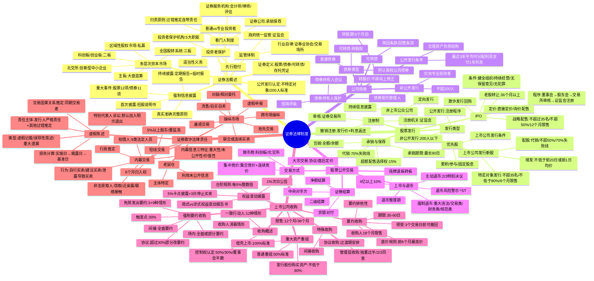

## 📍 章节定位

| 项目 | 信息 |
|------|------|
| **所属科目** | ⚖️ 经济法 |
| **难度等级** | ⭐⭐⭐⭐⭐ |
| **历年分值** | 8-10分 |
| **建议学时** | 10-12h |

## 📝 考情分析

本章是经济法的**核心重难点章节**，历年分值稳定在 8-10 分，是案例分析题的**必考章节**，常与公司法结合出综合题。2019 年《证券法》修订（2020 年 3 月 1 日施行）全面推行注册制、强化投资者保护、加重违法惩戒，是命题核心。

近年命题热点集中在：(1) 证券公开发行与注册制（公开发行的认定、注册程序、撤销注册、欺诈发行回购）；(2) 强制信息披露制度（信息披露的原则、首次披露与持续披露、定期报告与临时报告、重大事件界定、董监高责任）；(3) 投资者保护制度（普通投资者与专业投资者区分、适当性义务、投资者保护机构五大职能、先行赔付）；(4) 股票发行（IPO 条件与程序、询价与配售、战略配售、老股转让、上市公司发行新股条件）；(5) 公司债券发行与交易（公开发行条件、可转债发行条件与转股、债券持有人会议、债券受托管理人）；(6) 上市公司收购（一致行动人认定、持股权益变动披露的"5%/台阶规则"、要约收购规则、强制要约收购触发与豁免、协议收购过渡期安排、间接收购）；(7) 重大资产重组（普通重大资产重组与借壳上市的标准、发行股份购买资产、限售规则）；(8) 虚假陈述民事责任（责任主体与归责原则、交易因果关系推定、损失计算、特别代表人诉讼）；(9) 内幕交易（内幕信息三特征、知情人与非法获取人认定、行为表现、行政推定）；(10) 操纵市场（七种类型操纵行为的辨析）。

本章学习关键在于**构建"证券全生命周期"知识链**：发行→上市→交易→收购→重组→违法责任，并准确把握 2019 年《证券法》修订的新规则。案例分析题常围绕虚假陈述民事赔偿、内幕交易认定、要约收购义务展开，建议结合对比表系统记忆。

## 🧠 知识框架

## 📖 核心精讲

### 一、证券法律制度概述

#### （一）证券的定义与公开发行

**证券的形式**：《证券法》第 2 条规定，股票、公司债券、存托凭证和国务院依法认定的其他证券的发行和交易适用本法。

| 证券类型 | 特征 |
|----------|------|
| **股票** | 股东权凭证，收益性、流通性、非返还性、风险性；A 股（人民币普通股）、B 股（境内上市外资股）、境外上市外资股 |
| **公司债券** | 债权凭证，约定还本付息，有期限、固定利率、风险较小、破产时优先于股票受偿 |
| **可转债** | 兼具债券与股票双重属性，附转股权的公司债券；属于具有股权性质的证券 |
| **存托凭证** | 由存托人签发、以境外证券为基础在中国境内发行、代表境外基础证券权益的证券 |

**公开发行的认定**（《证券法》第 9 条）：

| 情形 | 是否公开发行 |
|------|--------------|
| 向不特定对象发行证券 | 公开发行 |
| 向特定对象发行证券累计超过 200 人（员工持股计划的员工人数不计） | 公开发行 |
| 非公开发行采用广告、公开劝诱、变相公开方式 | 视为公开发行 |
| 股东人数未超过 200 人的发行 | 非公开发行（私募） |

> **关键标准**："200 人"是判断应否履行注册程序的重要标准。公开发行证券必须依法注册，未经依法注册任何单位和个人不得公开发行证券。

#### （二）多层次资本市场

| 市场 | 定位 | 特征 |
|------|------|------|
| **主板**（上交所、深交所） | 大盘蓝筹，业务模式成熟、经营业绩稳定、规模较大 | 上市条件高 |
| **科创板**（上交所） | 世界科技前沿、国家重大需求、关键核心技术 | 允许未盈利企业上市 |
| **创业板**（深交所） | 成长型创新创业企业，支持传统产业与新技术深度融合 | 2 年主营业务、董高无重大变化 |
| **北交所** | 创新型中小企业，重点支持先进制造业和现代服务业 | 公司制证券交易所，注册制 |
| **全国股转系统**（新三板） | 创新型、创业型、成长型中小微企业 | 公开型场外市场，分基础层、创新层 |
| **区域性股权市场** | 所在省级行政区域内中小微企业 | 私募股权市场，不得集中交易，200 人上限 |

#### （三）证券市场监管体制

**政府统一监管**：中国证监会依法对全国证券市场实行集中统一监督管理。法定权限包括现场检查权、调查取证权、封存扣押权、冻结查封权、限制证券买卖、阻止出境等。

**行政执法当事人承诺制度**（《证券法》第 171 条）：

| 要素 | 内容 |
|------|------|
| 适用阶段 | 调查期间（收到调查法律文书之日起至作出行政处罚决定前） |
| 申请方式 | 当事人书面申请 |
| 法律效果 | 与证监会签署承诺认可协议后中止调查；完全履行后终止调查 |
| 承诺金 | 当事人为适用承诺制度而交纳的资金，可从承诺金中扣除已先行赔付金额 |

**行业自律管理**：中国证券业协会（自律管理组织，8 项职责）；证券交易场所（上交所、深交所、北交所、全国股转系统）。

#### （四）强制信息披露制度（必考）

**信息披露的原则**（《证券法》第 78 条）：

| 原则类型 | 具体要求 |
|----------|----------|
| **实质原则** | 真实、准确、完整 |
| **形式原则** | 简明清晰、通俗易懂 |
| **禁止情形** | 不得有虚假记载、误导性陈述或者重大遗漏 |
| **董事高管义务** | 及时、公平（对所有投资者同时披露） |
| **跨境披露** | 境外披露的信息应当在境内同时披露 |

**信息披露的分类**：

| 分类标准 | 类型 |
|----------|------|
| 是否强制 | 强制信息披露 vs 自愿信息披露 |
| 内容性质 | 客观信息（硬信息） vs 主观信息（软信息/预测性信息） |
| 发生阶段 | 首次信息披露 vs 持续信息披露 |

> **自愿披露**：信息披露义务人可自愿披露与投资者作出价值判断和投资决策有关的信息，但不得与依法披露的信息相冲突，不得误导投资者。自愿披露一旦选择，其披露要求等同于强制披露。

**首次信息披露文件**：

| 文件 | 适用情形 |
|------|----------|
| **招股说明书** | 公开发行股票最基本的法律文件，有效期 6 个月（自公开发行前最后一次签署之日起） |
| **债券募集说明书** | 公司债券发行 |
| **上市公告书** | 证券上市交易前披露 |

**持续信息披露**：

| 类型 | 时间要求 | 内容 |
|------|----------|------|
| **年度报告** | 每会计年度结束之日起 **4 个月内** | 财务会计报告须经符合《证券法》规定的会计师事务所审计 |
| **中期报告** | 每会计年度上半年结束之日起 **2 个月内** | — |
| **临时报告** | 重大事件发生时立即披露 | 股票 12 项重大事件、债券 11 项重大事件 |

**股票重大事件**（部分必考）：①经营方针、经营范围重大变化；②一年内购买、出售重大资产超过公司资产总额 30%；③订立重要合同、提供重大担保或关联交易；④重大债务违约；⑤重大亏损或损失；⑥董事、1/3 以上监事或经理发生变动；⑦持有 5% 以上股份股东或实际控制人持股情况发生较大变化；⑧分配股利、增资、减资、合并、分立、解散等决定；⑨重大诉讼、仲裁；⑩涉嫌犯罪被立案调查等。

**临时报告披露时点**（"立即"的认定）：①董事会就该重大事件形成决议时；②有关各方就该重大事件签署意向书或协议时；③董事、高级管理人员知悉或应当知悉该重大事件发生时。"及时"指自起算日起或触及披露时点的**两个交易日内**。

**董事、高级管理人员的责任与免责**：

| 主体 | 归责原则 | 免责条件 |
|------|----------|----------|
| 发行人、上市公司 | **严格责任** | 不可免责 |
| 控股股东、实际控制人、董监高、保荐人、承销商 | **过错推定**（连带责任） | 能够证明自己没有过错 |
| 证券服务机构（会计师、律师、评估师等） | **过错推定**（连带责任） | 能够证明自己没有过错 |

> **董事、高管异议的特殊规则**：仅声称"无法保证"不构成免责。根据《虚假陈述侵权民事赔偿规定》，必须同时做到：①在公司公布该信息披露文件时以书面方式发表附具体理由的异议意见并依法披露；②在公司内部审议、审核该信息披露文件时**未投赞成票**（投反对票或弃权票）。行政责任认定要求更高——必须在表决时投**反对票**（弃权亦不构成不予处罚的考虑情形）。

#### （五）投资者保护制度（必考）

**普通投资者与专业投资者的区分**：

| 保护机制 | 内容 |
|----------|------|
| **适当性义务** | 证券公司应充分了解投资者基本情况，如实说明证券、服务的重要内容，充分揭示投资风险，销售、提供与投资者状况相匹配的证券、服务；违反导致投资者损失的，承担赔偿责任 |
| **举证责任倒置** | 普通投资者与证券公司发生纠纷的，证券公司应证明其行为符合法律、行政法规和证监会规定，不存在误导、欺诈等情形；不能证明的，承担赔偿责任 |

**投资者保护机构的五大职能**：

| 职能 | 要点 |
|------|------|
| **代理权征集** | 上市公司董事会、独立董事、持有 1% 以上有表决权股份的股东或投资者保护机构可作为征集人；禁止有偿征集 |
| **证券纠纷调解** | 普通投资者提出调解请求的，证券公司不得拒绝 |
| **证券支持诉讼** | 支持投资者向人民法院提起诉讼 |
| **股东派生诉讼** | 持股比例和持股期限不受《公司法》限制 |
| **特别代表人诉讼** | 受 50 名以上投资者委托可作为代表人；"默认加入、明示退出" |

**先行赔付**：发行人因欺诈发行、虚假陈述或其他重大违法行为给投资者造成损失的，发行人的控股股东、实际控制人、相关的证券公司可以委托投资者保护机构，就赔偿事宜与受到损失的投资者达成协议，予以先行赔付。先行赔付后，可依法向发行人以及其他连带责任人追偿。

#### （六）证券市场看门人制度

**看门人的范围**：证券中介机构（券商，从事承销、保荐、经纪等业务的证券公司）和证券服务机构（会计师事务所、资产评估机构、财务顾问、资信评级机构、律师事务所）。

**履职标准**："勤勉尽责、恪尽职守"。

**民事赔偿责任**：

| 责任类型 | 归责原则 |
|----------|----------|
| 普通民事侵权 | 会计师事务所仅在"恶意串通"或"明知"等故意状态下承担连带责任；过失按过错程度确定赔偿 |
| **证券虚假陈述** | 与发行人承担**连带赔偿责任**，除非能够证明自己没有过错（**过错推定**） |

### 二、股票的发行

#### （一）股票公开发行注册制

| 要素 | 内容 |
|------|------|
| 注册机关 | 中国证监会（或国务院授权的部门） |
| 审核主体 | 证券交易所等（判断是否符合发行条件、信息披露要求） |
| 注册有效期 | 证监会予以注册决定自作出之日起 **1 年内**有效 |
| 撤销注册 | 已发行未上市：发行人按发行价加算银行同期存款利息返还证券持有人；控股股东、实际控制人、保荐人承担连带责任（过错推定） |

#### （二）非上市公众公司及定向发行

**非上市公众公司**：未在证券交易所上市但具有"公众性"的股份有限公司，包括：①股票向特定对象发行或转让导致股东累计超过 200 人；②股票公开转让。

**定向发行的特定对象范围**：①公司股东；②公司董事、监事、高级管理人员、核心员工；③符合投资者适当性管理规定的自然人、法人及其他经济组织。股票未公开转让的公司确定发行对象时，第③项投资者合计不超过 35 名。

#### （三）首次公开发行股票（IPO）

**IPO 条件**（《证券法》第 12 条 + 《首次公开发行股票注册管理办法》）：

| 条件类别 | 具体要求 |
|----------|----------|
| **主体** | 依法设立且持续经营 3 年以上的股份有限公司；有限责任公司按原账面净资产值折股整体变更为股份有限公司的，持续经营时间可从有限责任公司成立之日起计算 |
| **组织** | 具备健全且运行良好的组织机构 |
| **持续经营能力** | 业务完整，资产完整，人员、财务、机构独立，不存在重大不利影响的同业竞争 |
| **财务会计** | 最近 3 年财务会计报告被出具无保留意见审计报告；内部控制制度健全且被有效执行 |
| **稳定性** | 主板：最近 3 年内主营业务和董事、高级管理人员无重大不利变化，实际控制人没有发生变更；科创板/创业板：最近 2 年 |
| **无犯罪** | 发行人及其控股股东、实际控制人最近 3 年不存在贪污、贿赂、侵占财产等刑事犯罪 |

**IPO 程序**：

| 步骤 | 内容 |
|------|------|
| 董事会决议 | 就发行方案、募集资金使用可行性等作出决议，提请股东会批准 |
| 股东会决议 | 包括发行种类和数量、发行对象、定价方式、募集资金用途等 |
| 交易所审核 | 5 个工作日内决定是否受理；主要通过审核问询方式开展审核工作 |
| 证监会注册 | 证监会基于交易所审核意见，20 个工作日内作出予以注册或不予注册的决定 |
| 发行上市 | 注册决定 1 年内有效，发行时点由发行人自主选择 |

> **不予注册或终止审核的再次申请**：自决定作出之日起 **6 个月后**，发行人可再次提出公开发行股票并上市申请。

**IPO 定价与配售方式**：

| 方式 | 适用情形 |
|------|----------|
| **直接定价网上发行** | 发行数量 2000 万股以下且无老股转让计划；尚未盈利的不得直接定价；对应市盈率不得超过同行业上市公司二级市场平均市盈率 |
| **网下询价配售并同步网上发行** | 主要方式；向证券公司、基金管理公司等专业机构投资者询价 |

**网下配售比例**：

| 板块 | 总股本 4 亿股以下 | 总股本超 4 亿股或尚未盈利 |
|------|---------------------|---------------------------|
| 主板 | 不低于 60% | 不低于 70% |
| 科创板/创业板 | 不低于 70% | 不低于 80% |

**战略配售**：

| 要素 | 要求 |
|------|------|
| 战略投资者数量 | 不超过 **35 名** |
| 配售比例 | 不超过本次公开发行证券数量的 **50%** |
| 持股期限 | 不少于 **12 个月**（自上市之日起计算） |
| 资金来源 | 自有资金认购，不得接受他人委托或委托他人参与 |
| 高管员工参与 | 通过设立资产管理计划，不得超过本次公开发行数量的 10% |

**老股转让**：首次公开发行证券时公司股东公开发售股份的行为。老股转让股东已持有时间应当在 **36 个月以上**；股份发售后公司的股权结构不得发生重大变化，实际控制人不得发生变更。

**欺诈发行回购**（《证券法》第 24 条第 2 款）：

| 要素 | 内容 |
|------|------|
| 适用情形 | 股票已发行并上市后发现发行注册过程中存在欺诈 |
| 回购主体 | 中国证监会责令发行人回购，或责令负有责任的控股股东、实际控制人买回 |
| 回购对象 | 自本次发行至欺诈发行揭露日或更正日期间买入且在回购时仍持有的投资者 |
| 排除情形 | ①对欺诈发行负有责任的董监高、控股股东、实际控制人持有的股票；②对欺诈发行负有责任的证券公司因包销买入的股票；③投资者知悉或应当知悉发行文件虚假后买入的股票 |

#### （四）上市公司发行新股

**配股与增发**：

| 类型 | 要点 |
|------|------|
| **配股** | 拟配售股份数量不超过本次配售前股本总额的 **50%**；应当采用**代销方式**；控股股东应公开承诺认配股份的数量；代销期限届满原股东认购股票数量未达到拟配售数量 **70%** 的为发行失败，按发行价加算银行同期存款利息返还认购股东 |
| **增发** | 发行价格应当不低于公告招股意向书前 **20 个交易日**或前 **1 个交易日**公司股票均价 |

**向特定对象发行股票**：

| 要素 | 要求 |
|------|------|
| 发行对象数量 | 每次不超过 **35 名** |
| 发行价格 | 不低于定价基准日前 20 个交易日公司股票均价的 **80%** |
| 定价基准日 | 一般为发行期首日；发行对象全部为"关联人"的可为董事会决议公告日、股东会决议公告日或发行期首日 |
| 限售期 | 一般 6 个月；属于"关联人"情形的 18 个月 |

#### （五）股票公开发行的承销和保荐

**承销方式**：

| 方式 | 特征 |
|------|------|
| **代销** | "尽全力承销"，承销期结束未售出股票退还发行人；代销期限届满向投资者出售股票数量未达到拟公开发行股票数量 **70%** 的为发行失败 |
| **包销** | 全额包销（按协议全部购入）或余额包销（售后剩余自行购入） |

> **承销规则**：承销期限最长不得超过 **90 日**；证券公司不得为本公司预留所代销的证券和预先购入并留存所包销的证券；超额配售选择权——主承销商可按同一发行价格额外发售不超过首次公开发行证券数量 **15%** 的股份。

**保荐制度**：保荐人由取得经营保荐业务许可证的证券公司担任（法定"垄断"业务）。法定保荐情形：①IPO；②北交所公开发行并上市；③上市公司发行新股、可转债；④公开发行存托凭证。

### 三、公司债券的发行与交易

#### （一）公司债券公开发行条件

**积极条件**（《公司债券发行与交易管理办法》）：

| 条件 | 内容 |
|------|------|
| 组织机构 | 具备健全且运行良好的组织机构 |
| 偿债能力 | 最近 3 年平均可分配利润足以支付公司债券 1 年的利息 |
| 财务结构 | 具有合理的资产负债结构和正常的现金流量 |
| 其他 | 国务院规定的其他条件 |

**面向普通投资者公开发行的额外标准**（5 个条件全部满足）：①最近 3 年无债务违约或延迟支付本息；②最近 3 年平均可分配利润不少于债券 1 年利息的 1.5 倍；③最近一期末净资产规模不少于 250 亿元；④最近 36 个月内累计公开发行债券不少于 3 期，发行规模不少于 100 亿元；⑤证监会规定的其他条件。未达标的仅限专业投资者参与认购。

**消极条件**：①对已公开发行公司债券或其他债务有违约或延迟支付本息的事实仍处于继续状态；②违反《证券法》规定改变公开发行公司债券所募资金用途。

#### （二）可转换公司债券

**发行条件**：除符合公司债券公开发行条件外，还应当符合上市公司发行新股的相关条件；主板上市公司向不特定对象发行可转债的，应当最近 3 个会计年度盈利，且最近 3 个会计年度加权平均净资产收益率平均不低于 6%。

**转股规则**：

| 要素 | 内容 |
|------|------|
| **转股期限** | 自发行结束之日起 **6 个月后**方可转换为公司股票 |
| **转股价格**（向不特定对象发行） | 不低于募集说明书公告日前 20 个交易日和前 1 个交易日发行人股票交易均价，且**不得向上修正** |
| **转股价格**（向特定对象发行） | 不低于认购邀请书发出前 20 个交易日和前 1 个交易日均价，且**不得向下修正** |
| **转股价格向下修正** | 须经出席会议股东所持表决权 2/3 以上同意；持有可转债的股东应回避；修正后的转股价格不低于股东会召开日前 20 个交易日和前 1 个交易日均价 |
| **赎回条款** | 发行人可按事先约定条件和价格赎回尚未转股的可转债 |
| **回售条款** | 债券持有人可按事先约定条件和价格回售给发行人；上市公司改变募集资金用途的，应赋予债券持有人一次回售权利 |

#### （三）公司债券持有人权益保护

**债券受托管理人**：公开发行公司债券强制聘请，由本次发行的承销机构或其他经证监会认可的机构担任；为本次发行提供担保的机构不得担任。

**债券持有人会议**：

| 要素 | 内容 |
|------|------|
| 设立要求 | 公开发行公司债券的应当设立 |
| 决议效力 | 除募集办法另有约定外，对同期全体债券持有人发生效力（包括未投赞成票的） |
| 应召集情形 | ①拟变更募集说明书约定；②发行人不能按期支付本息；③发行人减资、合并等可能影响偿债能力；④发行人分立、解散、申请破产；⑤单独或合计持有本期债券总额 10% 以上的债券持有人书面提议召开等 |
| 自行召集权 | 受托管理人应召集而未召集时，单独或合计持有 10% 以上的债券持有人有权自行召集 |

### 四、股票的公开交易

#### （一）股票上市与退市

**上市条件**（《上交所股票上市规则》）：①符合《证券法》、证监会规定的发行条件；②发行后的股本总额不低于 5000 万元；③公开发行的股份达到公司股份总数的 **25% 以上**；公司股本总额超过 4 亿元的，公开发行股份的比例为 **10% 以上**；④市值及财务指标符合规则标准。

**退市类型**：

| 类型 | 适用情形 |
|------|----------|
| **主动退市** | 上市公司基于内部决议主动申请退市或转市；股东会须经出席会议股东所持表决权 **2/3 以上**通过，且经出席会议的除董事高管、5% 以上股东以外的其他股东所持表决权 2/3 以上通过 |
| **强制退市** | 重大违法类（欺诈发行退市不得重新上市）、交易类、财务类、规范类 |

**退市风险警示与退市整理期**：

| 措施 | 标识 | 适用 |
|------|------|------|
| 退市风险警示 | **\*ST** | 财务状况异常或未规范运作，存在被终止上市风险 |
| 退市整理期 | "退市" | 强制退市公司股票终止上市前的缓冲阶段；主动退市和交易类强制退市不适用 |

#### （二）证券结算制度（必考）

| 原则 | 内容 |
|------|------|
| **二级结算** | 证券登记结算机构与证券公司进行清算交收；证券公司再与投资者结算 |
| **中央对手方** | 证券登记结算机构作为所有卖方的买方和所有买方的卖方，是结算参与人共同的清算交收对手 |
| **净额结算** | 对买入和卖出交易的证券或资金进行轧差，以净额进行交收（主要是多边净额结算） |
| **货银对付** | 证券和资金的交收互为条件，结算参与人履行资金交收义务的相应证券完成交收，反之亦然 |
| **担保交收** | 共同对手方先对守约方履约，再向违约方追偿 |

> **结算财产的免强制执行性**：证券登记结算机构收取的各类结算资金和证券，必须存放于专门的清算交收账户，只能按业务规则用于已成交证券交易的清算交收，**不得被强制执行**。

### 五、上市公司收购和重组

#### （一）上市公司收购概述

**控制权认定**（《上市公司收购管理办法》第 84 条）：①持股 50% 以上的控股股东；②可实际支配股份表决权超过 30%；③通过表决权能够决定公司董事会半数以上成员选任；④足以对股东会决议产生重大影响；⑤证监会认定的其他情形。

**一致行动人**（12 种情形，部分必考）：

| 情形 | 要点 |
|------|------|
| 股权控制关系 | 投资者之间有股权控制关系 |
| 同一主体控制 | 投资者受同一主体控制 |
| 交叉任职 | 主要董监高同时担任另一投资者董监高 |
| 参股重大影响 | 参股另一投资者可对重大决策产生重大影响 |
| 融资安排 | 银行以外的法人为投资者取得股份提供融资 |
| 亲属持股 | 持有投资者 30% 以上股份的自然人、任职董监高及其亲属与投资者持有同一上市公司股份 |

> 一致行动人应当合并计算其所持有的股份。

**收购人消极情形**（不得收购）：①负有数额较大债务到期未清偿且处于持续状态；②最近 3 年有重大违法行为或涉嫌重大违法行为；③最近 3 年有严重的证券市场失信行为；④收购人为自然人存在《公司法》第 178 条规定情形；⑤其他法定情形。

#### （二）持股权益变动披露（必考）

**场内收购的"5%/台阶规则"**（《证券法》第 63 条 + 《上市公司收购管理办法》第 13 条）：

| 触发情形 | 披露义务 | 停止买卖期间 |
|----------|----------|--------------|
| 持股达到 5%（卡点） | 事实发生之日起 **3 日内**编制权益变动报告书，报告、公告 | 事实发生之日起至公告日（含当日）不得买卖 |
| 5% 后每增减 5% 整数倍（台阶规则，如 10%、15%） | 事实发生之日起 **3 日内**编制权益变动报告书，报告、公告 | 事实发生之日起至公告后 **3 日内**不得买卖 |
| 5% 后每增减 1% | **次日**通知上市公司并公告 | 无需停止买卖 |

> **违反后果**：违反"5% 卡点披露且停止买卖规则"和"台阶规则"买入股份的，在买入后 **36 个月内**，对该超过规定比例部分的股份不得行使表决权。

**协议收购的权益变动披露**（《上市公司收购管理办法》第 14 条）：①拟达到或超过 5% 的，事实发生之日起 3 日内披露（不需拆分披露）；②5% 后每增减达到或超过 5% 的，3 日内披露；③作出报告、公告前不得再行买卖。

**权益变动报告书类型**：

| 类型 | 适用情形 |
|------|----------|
| **简式权益变动报告书** | 持股 5% 以上但未达到 20%，且不是第一大股东或实际控制人 |
| **详式权益变动报告书** | 持股 5% 以上未达 20% 且为第一大股东或实际控制人；或持股 20% 以上未超过 30% |

#### （三）要约收购制度（必考）

**要约收购规则**：

| 要素 | 内容 |
|------|------|
| **要约期限** | 不少于 **30 日**，不得超过 **60 日**（出现竞争要约的除外） |
| **要约不可撤销** | 收购要约确定的承诺期内，收购人不得撤销收购要约 |
| **变更要约的限制** | 不得降低收购价格、减少预定收购股份数额、缩短收购期限；期限届满前 **15 日内**不得变更（竞争要约除外） |
| **底价规则** | 要约价格不得低于要约收购提示性公告日前 **6 个月**内收购人取得该种股票所支付的最高价格 |
| **同等对待** | 收购条件适用于被收购公司所有股东；不同种类股份可提出不同条件 |
| **要约排他性** | 公告后至收购期限届满前，不得卖出被收购公司股票，也不得采取要约规定以外形式和超出要约条件买入 |
| **竞争要约** | 初始要约收购人变更距期限届满不足 15 日的应延长收购期限（不少于 15 日）；竞争要约最迟不得晚于初始要约期限届满前 15 日发出提示性公告 |

**被收购公司董事会义务**：①对收购人主体资格、资信情况及收购意图调查，对要约条件分析并提出建议；聘请独立财务顾问；②收购人公告要约收购报告书后 **20 日内**公告董事会报告书与独立财务顾问专业意见；③不得恶意处置公司资产；④要约收购期间董事不得辞职。

**预受制度**：

| 要素 | 内容 |
|------|------|
| 预受性质 | 同意接受要约的初步意思表示，不构成承诺 |
| 预受股东权利 | 在要约收购期限届满 **3 个交易日前**可撤回预受；届满前 3 个交易日内不得撤回 |
| 临时保管 | 证券登记结算机构临时保管的预受要约股票在要约收购期间不得转让 |
| 收购人义务 | 不按约定支付收购价款或购买预受股份的，自事实发生之日起 **3 年内**不得收购上市公司 |

**收购人限售义务**：收购人持有的被收购上市公司的股票，在收购行为完成后的 **18 个月**内不得转让。

#### （四）强制要约收购（必考）

**触发点**：通过证券交易所的证券交易，投资者持有或通过协议、其他安排与他人共同持有一个上市公司已发行的有表决权股份达到 **30%**，继续进行收购的，应当依法向该上市公司所有股东发出收购要约。

**触发情形的区别**：

| 收购方式 | 触发后义务 |
|----------|------------|
| **场内收购**达到 30% 后继续增持 | 可发出全面要约或部分要约 |
| **协议收购**拟超过 30% | 超过 30% 部分应改以要约方式进行；符合免除情形的可免于发出要约，否则应在履行协议前发出全面要约 |
| **间接收购**导致拥有权益超过 30% | 应向所有股东发出**全面要约**；预计 30 日内无法发出的应减持至 30% 或以下 |

**免除发出要约的情形**：

**1. 免于以要约方式增持股份**（3 种情形）：①同一实际控制人控制的不同主体之间转让，未导致实际控制人变化；②上市公司面临严重财务困难，重组方案经股东会批准且承诺 3 年内不转让；③证监会认定的其他情形。

**2. 免于发出要约**（9 种情形，部分必考）：①国有资产无偿划转、合并导致持股超 30%；②上市公司向特定股东回购股份减资导致持股超 30%；③取得上市公司发行新股导致持股超 30%，承诺 3 年不转让且股东会同意免于发出要约；④持股 30% 以上每 12 个月增持不超过 2%；⑤持股 50% 以上继续增持不影响上市地位；⑥金融机构承销、贷款等业务导致持股超 30% 无控制意图且有转让方案；⑦继承导致持股超 30%；⑧履行约定购回式证券交易协议购回股份；⑨优先股表决权恢复导致持股超 30%。

#### （五）特殊类型收购

**协议收购的过渡期安排**：自签订收购协议起至股份完成过户期间：①收购人不得通过控股股东提议改选董事会，确有理由改选的来自收购人的董事不得超过董事会成员的 **1/3**；②被收购公司不得为收购人及其关联方提供担保；③被收购公司不得公开发行股份募集资金，不得进行重大购买、出售资产及重大投资。

**管理层收购的特别规制**：①独立董事比例达到或超过 **1/2**；②聘请资产评估机构出具评估报告；③经全体独立董事 **2/3 以上**同意后提交董事会；④经董事会非关联董事决议后提交股东会；⑤经出席股东会的非关联股东所持表决权**过半数**通过；⑥董监高存在《公司法》第 181-184 条规定情形或最近 3 年有证券市场不良诚信记录的不得收购。

#### （六）上市公司重大资产重组

**普通重大资产重组标准**（达到其一即构成）：

| 标准 | 比例 | 金额 |
|------|------|------|
| 资产总额 | 占最近一期经审计合并资产总额 **50% 以上** | — |
| 营业收入 | 占同期经审计合并营业收入 50% 以上 | 且超过 5000 万元 |
| 资产净额 | 占最近一期经审计合并净资产额 50% 以上 | 且超过 5000 万元 |

**特殊重大资产重组（借壳上市）标准**：自控制权发生变更之日起 **36 个月内**，向收购人及其关联人购买资产导致：①购买的资产总额占控制权变更前一期资产总额 **100% 以上**；②营业收入占比 100% 以上；③资产净额占比 100% 以上；④为购买资产发行的股份占首次向收购人购买资产的董事会决议前一交易日股份比例 100% 以上；⑤可能导致主营业务根本变化等。

> **借壳上市**适用等同于 IPO 的发行条件，须报经证监会注册。

**发行股份购买资产**：

| 要素 | 要求 |
|------|------|
| 发行价格 | 不得低于市场参考价的 **80%**；市场参考价为董事会决议公告日前 20、60 或 120 个交易日均价之一 |
| 限售期（一般） | 自股份发行结束之日起 **12 个月**内不得转让 |
| 限售期（36 个月） | 特定对象为控股股东、实际控制人或其关联人；通过认购取得实际控制权；用于认购股份的资产持续拥有权益时间不足 12 个月 |
| 借壳上市特殊限售 | 原控股股东、原实际控制人及其关联人 **36 个月**内不得转让；其他特定对象 **24 个月**内不得转让 |

**公司决议程序**：①重大资产重组须经出席会议股东所持表决权的 **2/3 以上**通过；②构成关联交易的应经全体独立董事过半数同意后提交董事会；③关联股东应回避表决；④除董事高管、5% 以上股东以外的其他股东的投票情况应单独统计并披露。

### 六、证券欺诈的法律责任

#### （一）虚假陈述行为（必考）

**虚假陈述的类型**：

| 类型 | 定义 |
|------|------|
| **虚假记载** | 披露的信息中对相关财务数据进行重大不实记载，或对其他重要信息作出与真实情况不符的描述 |
| **误导性陈述** | 披露的信息隐瞒了与之相关的部分重要事实，或未及时披露相关更正、确认信息，致使已披露的信息因不完整、不准确而具有误导性 |
| **重大遗漏** | 对重大事件或重要事项等应当披露的信息未予披露 |
| **未按照规定披露信息** | 未按照规定的期限、方式等要求及时、公平披露信息 |

**虚假陈述的其它分类**：①"硬信息"披露虚假陈述 vs "软信息"披露虚假陈述（预测性信息有"安全港"）；②**诱多型**虚假陈述（发布虚假利多消息或隐瞒利空消息）vs **诱空型**虚假陈述（发布虚假利空消息或隐瞒利好消息）。

**民事责任承担主体与归责原则**（《证券法》第 85 条、第 163 条）：

| 主体 | 归责原则 | 责任形式 |
|------|----------|----------|
| **信息披露义务人**（发行人、上市公司） | **严格责任** | 承担赔偿责任 |
| 发行人控股股东、实际控制人、董监高、其他直接责任人员 | **过错推定** | 连带赔偿责任，能证明没有过错的除外 |
| 保荐人、承销证券公司及其直接责任人员 | **过错推定** | 连带赔偿责任，能证明没有过错的除外 |
| 证券服务机构（会计师、律师、评估师等） | **过错推定** | 连带赔偿责任，能证明没有过错的除外 |

> **过错的具体含义**（《虚假陈述侵权民事赔偿规定》第 13 条）：包括"故意"和"重大过失"两种情形。①故意制作、出具存在虚假陈述的信息披露文件，或明知存在虚假陈述而不予指明、予以发布；②严重违反注意义务，对虚假陈述的形成或发布存在过失。

**不同主体的免责证明**：

| 主体 | 免责证明要求 |
|------|--------------|
| 发行人董监高 | 根据工作岗位和职责、在信息披露资料形成和发布中所起作用、为核验信息所采取措施等综合认定；以书面方式发表附具体理由异议意见并依法披露，且在审议审核时未投赞成票 |
| 独立董事、外部监事、职工监事 | 5 种情形：借助专门职业帮助仍未发现问题；揭露日前发现并书面报告；在独立意见中发表保留、反对或无法表示意见并说明理由（投赞成票的除外）；因发行人阻碍无法判断并书面报告；其他勤勉尽责情形 |
| 保荐机构、承销机构 | 已审慎尽职调查；对无证券服务机构专业意见支持的重要内容有合理理由相信真实；对有专业意见的重要内容经审慎核查形成合理信赖 |
| 会计师事务所 | 按执业准则核查仍未发现错误；金融机构或发行人供应商客户提供不实证明文件且保持必要职业谨慎仍未发现；已对舞弊迹象提出警告并发表审慎审计意见 |

**交易因果关系推定**（《虚假陈述侵权民事赔偿规定》第 11 条）：

| 要件 | 内容 |
|------|------|
| 信息披露义务人实施了虚假陈述 | — |
| 原告交易的是与虚假陈述直接关联的证券 | — |
| 原告在虚假陈述**实施日之后**、**揭露日或更正日之前**实施了相应交易 | 诱多型：买入相关证券；诱空型：卖出相关证券 |

符合上述条件的即为"同期交易者"，交易因果关系推定成立。

**推翻交易因果关系推定的情形**（被告举证）：①原告的交易行为发生在虚假陈述实施前，或揭露、更正之后；②原告在交易时知道或应当知道存在虚假陈述，或已被市场广泛知悉；③原告的交易行为受收购、重大资产重组等其他重大事件影响；④原告的交易行为构成内幕交易、操纵市场等违法行为；⑤其他不具有交易因果关系的情形。

**关键时间点的确定**：

| 时间点 | 认定规则 |
|--------|----------|
| **虚假陈述实施日** | ①公告披露的以披露日为实施日；②业绩说明会等以具有全国性影响的媒体首次公布之日为实施日；③交易日收市后发布的以下一交易日为实施日；④重大遗漏以应当披露信息期限届满后的第一个交易日为实施日 |
| **虚假陈述揭露日** | 在具有全国性影响的媒体上首次被公开揭露并为市场知悉之日；监管部门立案调查信息公开之日、自律管理措施信息公布之日原则上认定为揭露日（可由当事人以相反证据反驳） |
| **虚假陈述更正日** | 信息披露义务人在证券交易场所网站或符合规定条件的媒体上自行更正虚假陈述之日 |
| **基准日** | 自揭露日或更正日起，被虚假陈述影响的证券集中交易累计成交量达到可流通部分 100% 之日；10 个交易日内达到的以第 10 个交易日为基准日；30 个交易日内未达到的以第 30 个交易日为基准日 |

**损失计算**：原告实际损失包括投资差额损失、投资差额损失部分的佣金和印花税。

**虚假陈述民事诉讼方式**（三种）：

| 类型 | 适用规则 |
|------|----------|
| **单独诉讼** | 投资者个别提起诉讼 |
| **普通代表人诉讼** | 10 人以上可推选 2-5 名代表人；投资者通过登记"明示加入" |
| **特别代表人诉讼** | 投资者保护机构受 50 名以上投资者委托作为代表人；"**默认加入、明示退出**"——未声明退出的视为同意参加 |

> **诉讼时效**：自揭露日或更正日起算（揭露日与更正日不一致的以在先的为准）。

#### （二）内幕交易行为（必考）

**内幕信息的三特征**：

| 特征 | 内容 |
|------|------|
| **重大性** | 《证券法》第 80 条第 2 款、第 81 条第 2 款规定的应予以临时报告的重大事件属于内幕信息 |
| **尚未公开性** | 内幕信息产生至公开之间的时期为"内幕信息敏感期"；公开指在证监会指定的报刊、网站等媒体披露 |
| **价值性（相关性）** | 涉及发行人的经营、财务或对该发行人证券市场价格有重大影响 |

**内幕信息知情人**（《证券法》第 51 条，9 类法定人员）：①发行人董监高；②持有 5% 以上股份的股东及其董监高，实际控制人及其董监高；③发行人控股或实际控制的公司及其董监高；④因所任公司职务或业务往来可获取内幕信息的人员；⑤上市公司收购人或重大资产交易方及其控股股东、实际控制人、董监高；⑥证券交易场所、证券登记结算机构、证券公司、证券服务机构的有关人员；⑦证监会工作人员；⑧有关主管部门、监管机构的工作人员；⑨其他可获取内幕信息的人员。

**非法获取内幕信息的人员**（《内幕交易案件若干问题解释》）：①利用窃取、骗取、套取、窃听、利诱、刺探或私下交易等手段获取的；②内幕信息知情人的近亲属或关系密切的人员，在敏感期内从事或明示暗示他人从事相关交易，且无正当理由或正当信息来源的；③在敏感期内与知情人联络、接触，从事或明示暗示他人从事相关交易，且无正当理由或正当信息来源的。

**内幕交易的行为表现**：

| 行为 | 要件 |
|------|------|
| **自行买卖** | 在敏感期内自行买卖与内幕信息直接相关的发行人证券 |
| **建议买卖** | 在敏感期内建议他人买卖相关证券；建议人为知情人或非法获取人；被建议人知道或应当知道建议人掌握内幕信息；建议行为导致相关证券买卖 |
| **泄露内幕信息并导致他人买卖** | 在敏感期内泄露内幕信息，不论泄露时的主观状态；信息接收者知道或应当知道是内幕信息；信息传递次数和层级不影响构成 |

> **行政推定**：只要当事人属于内幕信息知情人员或非法获取人员，又在敏感期内买卖相关证券，又不能给出正当理由或正当信息来源的，通常即被推定从事内幕交易。当事人可举证推翻（如提供事先签订的载明明确交易条款的书面合同）。

**不构成"内幕交易罪"的情形**：①持有 5% 以上股份的股东收购该上市公司股份的；②按照事先订立的书面合同、指令、计划从事交易的；③依据已被他人披露的信息而交易的；④交易具有其他正当理由或正当信息来源的。

#### （三）短线交易

**短线交易归入权**（《证券法》第 44 条）：

| 要素 | 内容 |
|------|------|
| 适用主体 | 上市公司、其他全国性证券交易场所交易公司持有 **5% 以上**股份的股东、董事、监事、高级管理人员 |
| 行为特征 | 将其持有的该公司股票或其他具有股权性质的证券在**买入后 6 个月内**卖出，或在**卖出后 6 个月内**又买入 |
| 法律后果 | 由此所得收益归该公司所有，公司董事会应当收回其所得收益 |
| 亲属范围 | 包括其配偶、父母、子女持有的及利用他人账户持有的股票或其他具有股权性质的证券 |
| 公司董事会怠于行使 | 股东有权要求董事会在 30 日内执行；未执行的，股东可为了公司利益以自己名义直接向人民法院提起诉讼（股东派生诉讼）；负有责任的董事承担连带责任 |
| 例外 | 证券公司因包销购入售后剩余股票而持有 5% 以上股份等情形 |

> **短线交易归入权的特点**：不论是否存在内幕信息，不论是否知悉内幕信息，也不论是否利用了内幕信息，一概将 6 个月内交易的收益收归公司所有。

#### （四）利用未公开信息交易（"老鼠仓"）

| 要素 | 内容 |
|------|------|
| 主体 | 证券交易场所、证券公司、证券登记结算机构、证券服务机构和其他金融机构的从业人员，有关监管部门或行业协会工作人员 |
| 行为 | 利用因职务便利获取的内幕信息以外的其他未公开信息，违反规定从事与该信息相关的证券交易活动，或明示暗示他人从事相关交易活动 |
| 与内幕交易的区别 | ①主体范围不同（老鼠仓主体特定，内幕交易主体广泛）；②所利用信息不同（老鼠仓利用内幕信息以外的未公开信息，内幕交易利用涉及发行人经营财务的内幕信息） |

#### （五）操纵市场行为（必考）

**《证券法》第 55 条规定的七种操纵市场行为**：

| 类型 | 特征 |
|------|------|
| **联合或连续买卖式操纵** | 单独或合谋，集中资金、持股或信息优势联合或连续买卖；关键辨析"操纵意图"——区别于合法收购行为 |
| **对敲（相对委托）式操纵** | 与他人串通，以事先约定的时间、价格、方式相互进行证券交易；虚假交易；两个以上操纵者；双方无控制关系；事先有合谋 |
| **洗售（自买自卖）操纵** | 在自己实际控制的账户之间进行证券交易；行为人既为买方又为卖方；"实际控制"是认定关键（5 种账户认定情形） |
| **虚假申报操纵** | 不以成交为目的，频繁或大量申报并撤销申报；误导投资者；不以是否有反向交易为要件 |
| **蛊惑交易操纵** | 利用虚假或不确定的重大信息，诱导投资者进行证券交易；行为主体无限制；有操纵意图 |
| **抢先交易操纵** | ①提前交易（如提前买入）；②对证券、发行人公开作出评价、预测或投资建议；③反向交易（如卖出）；评价真假不论 |
| **跨市场操纵** | 利用在其他相关市场的活动操纵证券市场（如利用期货市场影响股票市场） |

> **操纵市场与合法收购的区分**：通过连续购买大量持有上市公司股票以获得或巩固控制权的，意图在于控制权而非影响价格或交易量，属于合法收购行为而非操纵。

> **程序化交易**（《证券法》第 45 条）：通过计算机程序自动生成或下达交易指令的，应符合证监会规定并向证券交易所报告，不得影响系统安全或正常交易秩序。程序化交易如影响证券交易价格或交易量，也将构成操纵市场。

**操纵市场的民事责任**：操纵证券市场行为给投资者造成损失的，行为人应当依法承担赔偿责任。

## 💡 典型例题

**【例题 1】（单项选择题）**

根据证券法律制度的规定，下列关于证券公开发行的表述中，正确的是（ ）。

A. 向特定对象发行证券累计超过 100 人的，为公开发行
B. 未经依法注册，任何单位不得公开发行证券
C. 非公开发行证券可以采用广告方式宣传
D. 向公司员工实施员工持股计划的发行一律视为公开发行

**答案**：B

**解析**：A 错误，向特定对象发行证券累计超过 **200 人**（员工持股计划的员工人数不计）的才构成公开发行；B 正确，公开发行证券必须依法注册，未经依法注册任何单位和个人不得公开发行证券；C 错误，非公开发行证券不得采用广告、公开劝诱和变相公开方式；D 错误，依法实施员工持股计划的员工人数不计算在内，并非一律视为公开发行。

**【例题 2】（单项选择题）**

根据证券法律制度的规定，下列关于强制信息披露的表述中，正确的是（ ）。

A. 上市公司年度报告应当在每个会计年度结束之日起 3 个月内编制完成并披露
B. 上市公司中期报告应当在每个会计年度上半年结束之日起 2 个月内编制完成并披露
C. 上市公司董事、高级管理人员对定期报告有异议的，仅需在书面确认意见中发表意见即可免责
D. 自愿信息披露不适用强制信息披露的真实、准确、完整原则

**答案**：B

**解析**：A 错误，年度报告应在每会计年度结束之日起 **4 个月内**编制完成并披露；B 正确；C 错误，仅在书面确认意见中发表意见不构成免责，还必须在公司内部审议审核时**未投赞成票**（投反对票或弃权票）才能认定为没有过错；D 错误，自愿披露一旦选择，其披露要求（真实、准确、完整）等同于强制披露。

**【例题 3】（单项选择题）**

根据证券法律制度的规定，下列关于投资者保护的表述中，正确的是（ ）。

A. 普通投资者与证券公司发生纠纷的，由投资者承担举证责任
B. 投资者保护机构作为代表人参加诉讼，投资者未明确表示不愿意参加的视为同意参加
C. 投资者保护机构持有公司股份的，应当符合《公司法》关于持股比例和持股期限的规定才能提起股东派生诉讼
D. 上市公司董事会、独立董事、持有 3% 以上有表决权股份的股东均可作为征集人公开征集股东权利

**答案**：B

**解析**：A 错误，普通投资者与证券公司发生纠纷的，由**证券公司**承担举证责任（证明其行为符合规定，不存在误导、欺诈等情形）；B 正确，特别代表人诉讼采用"**默认加入、明示退出**"方式；C 错误，投资者保护机构提起股东派生诉讼时，**持股比例和持股期限不受《公司法》规定的限制**；D 错误，可以作为征集人的是持有 **1% 以上**有表决权股份的股东（而非 3%）。

**【例题 4】（单项选择题）**

根据证券法律制度的规定，下列关于持股权益变动披露的表述中，正确的是（ ）。

A. 投资者通过证券交易所交易持股达到 5% 的，应当在该事实发生之日起 5 日内编制权益变动报告书
B. 投资者持股达到 5% 后每增加或减少 1% 的，应当在该事实发生之日起 3 日内编制权益变动报告书
C. 投资者违反"5% 卡点披露规则"买入股份的，在买入后 24 个月内对该超过规定比例部分的股份不得行使表决权
D. 投资者持股达到 5% 后每增加或减少 5% 整数倍的，应当在该事实发生之日起至公告后 3 日内不得买卖该上市公司股票

**答案**：D

**解析**：A 错误，应在事实发生之日起 **3 日内**（而非 5 日内）编制权益变动报告书；B 错误，5% 后每增减 1% 的，应在事实发生的**次日**通知上市公司并公告（而非 3 日内编制报告书）；C 错误，违反规则买入的股份在买入后 **36 个月内**（而非 24 个月）不得行使表决权；D 正确，5% 后每增减 5% 整数倍的（台阶规则），应自事实发生之日起至公告后 3 日内不得买卖。

**【例题 5】（单项选择题）**

根据证券法律制度的规定，下列关于要约收购的表述中，正确的是（ ）。

A. 收购要约约定的收购期限不得少于 20 日，并不得超过 60 日
B. 收购人在收购要约期限届满前 15 日内不得变更收购要约，但出现竞争要约的除外
C. 收购要约的价格不得低于要约收购提示性公告日前 3 个月内收购人取得该种股票所支付的最高价格
D. 收购人持有的被收购上市公司的股票，在收购行为完成后的 12 个月内不得转让

**答案**：B

**解析**：A 错误，收购要约期限不得少于 **30 日**（而非 20 日），不得超过 60 日；B 正确，在收购要约期限届满前 15 日内不得变更收购要约，但出现竞争要约的除外；C 错误，要约价格不得低于提示性公告日前 **6 个月**内（而非 3 个月）收购人取得该种股票所支付的最高价格；D 错误，收购人持有的被收购上市公司股票在收购行为完成后的 **18 个月**内（而非 12 个月）不得转让。

**【例题 6】（单项选择题）**

根据证券法律制度的规定，下列关于内幕交易的表述中，正确的是（ ）。

A. 内幕信息知情人未自行买卖证券，也未建议他人买卖证券，但将内幕信息泄露给他人并导致接受者依此买卖证券的，不构成内幕交易
B. 内幕信息知情人的近亲属在敏感期内从事相关证券交易，无论是否有正当理由均构成内幕交易
C. 内幕交易行为人主观上必须有操纵证券市场价格的意图
D. 行为人仅泄露内幕信息但未导致他人买卖证券的，不构成内幕交易

**答案**：D

**解析**：A 错误，知情人未自行买卖也未建议他人买卖，但泄露内幕信息**导致他人买卖**的，也属内幕交易行为；B 错误，近亲属在敏感期内从事相关交易且**无正当理由或正当信息来源**的才构成内幕交易，如有正当理由则不构成；C 错误，内幕交易行为人**无操纵市场意图**（这是内幕交易与"利用信息优势联合或连续买卖式操纵"的关键区别）；D 正确，仅泄露信息但未导致他人买卖证券的不构成内幕交易。

**【例题 7】（案例分析题）**

2024 年 3 月 1 日，甲上市公司（上交所主板上市公司）董事会通过决议，拟向特定对象乙公司（甲公司控股股东的关联方）发行股票 5000 万股，发行价格为定价基准日前 20 个交易日股票均价的 80%。2024 年 3 月 5 日，甲公司召开股东会审议该事项，关联股东回避表决，决议经出席会议的非关联股东所持表决权 2/3 以上通过。2024 年 5 月 10 日，发行完成。2024 年 8 月 15 日，乙公司拟将其认购的全部股票转让给丙公司。

**问题**：(1) 甲公司向乙公司发行股票的发行价格是否符合规定？(2) 股东会的表决程序是否合法？(3) 乙公司能否在 2024 年 8 月 15 日转让其认购的股票？

**答案**：

(1) **符合**规定。根据《上市公司证券发行注册管理办法》规定，上市公司向特定对象发行股票的发行价格应当不低于定价基准日前 20 个交易日公司股票均价的 **80%**。本案中，甲公司发行价格为定价基准日前 20 个交易日股票均价的 80%，符合法律规定。同时，因乙公司为甲公司控股股东的关联方，属于"关联人"情形，定价基准日可以为董事会决议公告日，符合规定。

(2) **合法**。根据规定，上市公司股东会就发行证券事项作出决议，必须经出席会议的股东所持表决权的 **2/3 以上**通过；向本公司特定的股东及其关联人发行证券的，股东会就发行方案进行表决时，**关联股东应当回避**。本案中，甲公司股东会关联股东回避表决，决议经出席会议的非关联股东所持表决权 2/3 以上通过，程序合法。此外，上市公司就发行证券事项召开股东会，应当提供网络投票方式，并应对中小投资者表决情况单独计票。

(3) **不能**。根据规定，向特定对象发行的股票，自发行结束之日起 **6 个月内**不得转让；发行对象属于"关联人"情形的（包括上市公司的控股股东、实际控制人或其控制的关联人），其认购的股票自发行结束之日起 **18 个月内**不得转让。本案中，乙公司属于甲公司控股股东的关联方，为"关联人"，限售期为 **18 个月**。发行完成日为 2024 年 5 月 10 日，限售期至 2025 年 11 月 10 日届满。2024 年 8 月 15 日尚未满 18 个月，乙公司不能转让其认购的股票。

**【例题 8】（案例分析题）**

2023 年 6 月 30 日，甲上市公司公告其年度报告，载明 2022 年度净利润 5 亿元。2023 年 12 月 29 日，证监会以涉嫌信息披露违法为由对甲公司立案调查，相关信息于同日公开。经查，甲公司 2022 年度实际亏损 2 亿元，年报存在虚假记载。投资者 A 于 2023 年 7 月 10 日买入甲公司股票 1 万股，买入均价 20 元/股；2024 年 2 月 15 日以 10 元/股全部卖出。投资者 B 于 2023 年 7 月 10 日以 20 元/股卖出其原持有的甲公司股票 1 万股。

**问题**：(1) 本案中虚假陈述实施日、揭露日分别如何认定？(2) 投资者 A 是否有权请求甲公司承担虚假陈述民事赔偿责任？依据是什么？(3) 投资者 B 是否有权请求甲公司承担虚假陈述民事赔偿责任？依据是什么？

**答案**：

(1) **虚假陈述实施日**为 **2023 年 6 月 30 日**（甲公司公告年报之日，年报存在虚假记载）；**虚假陈述揭露日**为 **2023 年 12 月 29 日**（证监会立案调查信息公开之日，根据《虚假陈述侵权民事赔偿规定》原则上认定为揭露日）。

(2) **有权**请求甲公司承担赔偿责任。根据《虚假陈述侵权民事赔偿规定》第 11 条，原告在虚假陈述实施日之后、揭露日或更正日之前实施了相应交易行为的，交易因果关系成立。本案中，甲公司年报存在虚假记载，构成虚假陈述；投资者 A 在实施日（2023 年 6 月 30 日）之后、揭露日（2023 年 12 月 29 日）之前买入甲公司股票，属于"同期交易者"，交易因果关系推定成立。同时，甲公司作为信息披露义务人承担**严格责任**，投资者 A 有权请求其承担赔偿责任。

(3) **有权**请求甲公司承担赔偿责任。本案中，甲公司年报虚增利润属于**诱多型虚假陈述**（虚增净利润使股价虚高），诱使投资者在高位买入或在看似高位时卖出。投资者 B 在实施日之后、揭露日之前以 20 元/股卖出股票，由于诱多型虚假陈述使股价虚高，B 以虚高价格卖出股票看似未受损失，但实际上 B 因信赖该虚假信息作出卖出决策。但应注意的是：在诱多型虚假陈述中，原告的损失计算一般针对"在高位买入后股价下跌导致的损失"。投资者 B 是**卖出**而非买入，其在诱多型虚假陈述中主张赔偿通常需要证明其卖出行为因信赖虚假陈述而作出并遭受损失（如本应继续持有至揭露日后获得更高赔偿，但因虚假陈述提前卖出）。具体赔偿范围需结合损失因果关系证明。**严格而言**，诱多型虚假陈述中卖出股票的投资者通常不构成"同期交易者"——因为诱多型虚假陈述推定的是"在实施日后、揭露日前**买入**"相关证券。投资者 B 卖出股票不符合交易因果关系推定的条件，原则上不能直接推定交易因果关系成立。如 B 主张赔偿，需自行举证证明其交易行为与虚假陈述存在因果关系。

**【例题 9】（案例分析题）**

甲为 A 上市公司董事长。2024 年 1 月 10 日，A 公司与 B 公司签署重大资产重组意向书（拟购买 B 公司持有的核心资产，达到重大资产重组标准），该意向书未公告。2024 年 1 月 15 日，甲将其持有的 A 公司股票 50 万股以 15 元/股卖出。2024 年 1 月 20 日，A 公司公告重大资产重组事项，A 公司股票当日涨停至 18 元/股。2024 年 6 月 20 日，甲又买入 A 公司股票 50 万股。

**问题**：(1) 甲于 2024 年 1 月 15 日卖出股票的行为构成何种证券违法行为？说明理由。(2) 甲于 2024 年 6 月 20 日买入股票的行为是否构成短线交易？说明理由。(3) 如甲辩称"未自己利用内幕信息，只是告诉了妻子丙，是丙自行决定的交易"，是否影响内幕交易的认定？

**答案**：

(1) 构成**内幕交易**。根据《证券法》第 51 条、第 53 条规定，发行人的董事长属于法定内幕信息知情人；A 公司与 B 公司签署重大资产重组意向书属于涉及发行人的重大事件，具有重大性、尚未公开性（1 月 20 日才公告）、价值性，构成内幕信息。1 月 10 日至 1 月 20 日为内幕信息敏感期。甲作为知情人在敏感期内（1 月 15 日）自行卖出 A 公司股票，构成内幕交易。虽然甲是卖出而非买入（重大资产重组通常是利好消息），但内幕交易的认定不以是否获利为要件，只要在敏感期内买卖相关证券又无正当理由即构成。

(2) **构成**短线交易。根据《证券法》第 44 条规定，上市公司持有 5% 以上股份的股东、董事、监事、高级管理人员，将其持有的该公司股票在买入后 6 个月内卖出，或在卖出后 6 个月内又买入，由此所得收益归该公司所有。甲作为 A 公司董事长（即使持股未达 5%，但作为董监高仍受约束——注意：第 44 条对董事、监事、高级管理人员并无 5% 持股要求；5% 持股要求仅针对股东主体），在 2024 年 1 月 15 日卖出 50 万股，2024 年 6 月 20 日又买入 50 万股，时间间隔在 6 个月内（1 月 15 日至 6 月 20 日约 5 个月），构成短线交易。所得收益归 A 公司所有，公司董事会应当收回其所得收益。

(3) **不影响**内幕交易的认定。根据规定，内幕信息知情人泄露内幕信息并导致他人买卖证券的，构成内幕交易行为，**不论其泄露时的主观状态**（故意或过失均构成）。甲作为知情人将内幕信息泄露给其妻子丙（属于与知情人关系密切的人员），丙在敏感期内从事相关证券交易，且无正当理由或正当信息来源的，丙也构成内幕交易。即使甲辩称非故意泄露，也不影响内幕交易的认定；同时丙作为甲的近亲属，亦构成非法获取内幕信息的人员。

## 🎯 记忆口诀

**口诀一：证券公开发行认定**
> 不特定对象即公开，特定对象二百人限；
> 员工持股计划不算人，广告劝诱即公开；
> 公开必须经注册，未经注册不得发。

**口诀二：强制信息披露时点**
> 年报四个月中期两个月，临时报告立即发；
> 重大事件董事会决议时，意向书签时，知悉时；
> 及时两个交易日，董监高异议不投赞成票。

**口诀三：投资者保护机构五大职能**
> 代理征集一%股东，纠纷调解不能拒；
> 支持诉讼助维权，派生诉讼无期限；
> 特别代表五十人委托，默认加入明示退。

**口诀四：持股权益变动披露**
> 五个百分比卡点披，三个交易日内报告；
> 事实发生到公告日，期间不得再买卖；
> 台阶规则每五个百分比，公告后三日内停；
> 一个百分比次日告，不再停止自由买；
> 违规买入三十六个月，超过部分表决权无。

**口诀五：要约收购要点**
> 三十日至六十日，要约不可撤销；
> 变更不得降价格减数量缩期限，届满前十五日不可变；
> 底价前六月最高价，同等对待所有股东；
> 预受三个交易日前可撤回，收购人十八个月限售。

**口诀六：强制要约收购触发与豁免**
> 三十百分比触发点，场内全面或部分；
> 协议超过改要约，间接收购全面发；
> 同一控制财务困难，免于增持三情形；
> 国资划转新股回购，继承等九免要约。

**口诀七：虚假陈述民事责任**
> 发行人严格责，其他主体过错推；
> 连带赔偿能免责，证明无错可脱身；
> 同期交易者推定，实施日后揭露前；
> 诱多买入诱空卖，基准日定损失算；
> 特别代表人诉讼，默认加入明示退。

**口诀八：内幕交易认定**
> 知情人九类法定人，非法获取三种情；
> 内幕信息三特征，重大未公开有价值；
> 自行买卖建议买，泄露导致他人买；
> 行政推定交易异常非要件，正当理由可推翻。

**口诀九：操纵市场七种类型**
> 联合连续买卖操纵，对敲相对委托型；
> 洗售自买自卖控账户，虚假申报频撤单；
> 蛊惑交易假信息诱，抢先交易反向作；
> 跨市操纵期股连，七种手段禁操纵。

**口诀十：短线交易与老鼠仓**
> 短线交易六个月，五成股东董监高；
> 买入卖出或卖出买入，所得收益归公司；
> 老鼠仓主体特定，金融机构从业人员；
> 利用非公开信息交易，与内幕交易信息异。

**口诀十一：上市公司重大资产重组**
> 五十百分比普通重组，资产营业净资产；
> 借壳上市一百百分比，控制权变更三十六月内；
> 发行股份购买资产，不低于八十百分比；
> 十二个月一般限售，三十六月关联方。

**口诀十二：可转债核心要点**
> 六个月后可转股，转股价不向上修；
> 向下修正二三四，股东会六成通过；
> 持债股东要回避，修正价不低于均价；
> 赎回条款发行人，回售条款投资人；
> 改变用途给回售，一次权利要保障。

## ✅ 同步练习

**1. （单选）根据证券法律制度的规定，下列关于证券公开发行的表述中，正确的是（ ）。**
A. 向特定对象发行证券累计超过 50 人的，为公开发行
B. 向不特定对象发行证券的，为公开发行
C. 非公开发行证券可以采用公开劝诱方式
D. 依法实施员工持股计划的员工人数应计入公开发行人数认定

**2. （单选）根据证券法律制度的规定，下列关于强制信息披露的表述中，正确的是（ ）。**
A. 上市公司年度报告应当在每个会计年度结束之日起 3 个月内编制完成并披露
B. 上市公司中期报告应当在每个会计年度上半年结束之日起 2 个月内编制完成并披露
C. 上市公司董事会对临时报告信息披露不承担主要责任
D. 上市公司董事长、经理、董事会秘书对财务会计报告披露的真实性承担主要责任

**3. （多选）根据证券法律制度的规定，下列关于投资者保护机构的表述中，正确的有（ ）。**
A. 投资者保护机构受 50 名以上投资者委托，可以作为代表人参加诉讼
B. 特别代表人诉讼采用"默认加入、明示退出"的方式
C. 投资者保护机构持有公司股份的，提起股东派生诉讼时不受《公司法》关于持股比例和持股期限的限制
D. 投资者保护机构只能作为代表人参加诉讼，不能单独支持投资者起诉

**4. （单选）根据证券法律制度的规定，下列关于首次公开发行股票的表述中，正确的是（ ）。**
A. 发行人应当是依法设立且持续经营 5 年以上的股份有限公司
B. 最近 3 年财务会计报告被出具无保留意见审计报告
C. 中国证监会的予以注册决定自作出之日起 2 年内有效
D. 交易所作出终止发行上市审核决定的，发行人可立即再次提出申请

**5. （单选）甲上市公司拟向特定对象发行股票，发行对象为 35 名投资者。根据证券法律制度的规定，下列表述正确的是（ ）。**
A. 发行价格应当不低于定价基准日前 20 个交易日公司股票均价的 80%
B. 发行对象属于控股股东的关联方的，限售期为 6 个月
C. 发行对象为境外战略投资者的，每次发行对象不得超过 200 人
D. 上市公司董事会决议提前确定全部发行对象的，必须由证券公司承销

**6. （多选）根据证券法律制度的规定，下列关于持股权益变动披露的表述中，正确的有（ ）。**
A. 投资者通过证券交易所交易持股达到 5% 的，应当在该事实发生之日起 3 日内编制权益变动报告书
B. 投资者持股达到 5% 后每增加或减少 5% 整数倍的，应当在该事实发生之日起至公告后 3 日内不得买卖该上市公司股票
C. 投资者持股达到 5% 后每增加或减少 1% 的，应当在该事实发生的次日通知该上市公司并予公告
D. 投资者违反"5% 卡点披露规则"买入股份的，在买入后 24 个月内对该超过规定比例部分的股份不得行使表决权

**7. （单选）根据证券法律制度的规定，下列关于要约收购的表述中，正确的是（ ）。**
A. 收购要约约定的收购期限不得少于 30 日，并不得超过 60 日
B. 收购要约的价格不得低于要约收购提示性公告日前 3 个月内收购人取得该种股票所支付的最高价格
C. 收购人在收购要约期限届满前 10 日内不得变更收购要约
D. 收购人持有的被收购上市公司的股票，在收购行为完成后的 12 个月内不得转让

**8. （单选）根据证券法律制度的规定，下列关于强制要约收购的表述中，正确的是（ ）。**
A. 投资者持有上市公司已发行的有表决权股份达到 20%，继续进行收购的，应当依法发出收购要约
B. 通过证券交易所的证券交易持股达到 30% 后继续增持的，收购人只能发出全面要约
C. 协议收购拟超过 30% 的，超过部分应当改以要约方式进行
D. 间接收购导致拥有权益超过 30% 的，可发出部分要约

**9. （多选）根据证券法律制度的规定，下列情形中，属于内幕信息知情人的有（ ）。**
A. 发行人的董事、监事、高级管理人员
B. 持有公司 5% 以上股份的股东及其董事、监事、高级管理人员
C. 因所任公司职务可以获取公司有关内幕信息的人员
D. 上市公司收购人的控股股东

**10. （单选）根据证券法律制度的规定，下列关于短线交易的表述中，正确的是（ ）。**
A. 短线交易的适用主体仅限于持有 5% 以上股份的股东
B. 上市公司董事将其持有的该公司股票在买入后 6 个月内卖出，所得收益归公司所有
C. 短线交易归入权的行使以行为人利用内幕信息为前提
D. 公司董事会未按规定收回短线交易所得收益的，股东可以直接向人民法院提起诉讼，无需经过任何前置程序

**11. （单选）根据证券法律制度的规定，下列关于操纵市场行为的表述中，正确的是（ ）。**
A. 联合或连续买卖式操纵与合法收购行为的区别在于行为人是否具有操纵意图
B. 对敲操纵可以由单一操纵者完成
C. 蛊惑交易操纵行为人利用的是真实的、确定的重大信息
D. 抢先交易操纵的认定必须以反向交易为构成要件

**12. （案例分析题）**
2024 年 2 月 1 日，投资者甲通过证券交易所交易持有乙上市公司股票达到 6%。2024 年 2 月 5 日，甲编制了权益变动报告书并向证监会、证券交易所报告，通知乙公司，于同日公告。2024 年 3 月 10 日，甲继续增持乙公司股票，持股比例达到 11%。2024 年 3 月 12 日，甲才编制权益变动报告书并公告。2024 年 4 月 1 日，甲继续增持至 31%。

**问题**：(1) 甲于 2024 年 2 月 1 日至 2 月 5 日期间的买卖行为是否合法？说明理由。(2) 甲于 2024 年 3 月 10 日至 3 月 12 日期间的买卖行为是否合法？说明理由。(3) 甲继续增持至 31% 是否触发强制要约收购义务？如触发，应如何处理？

**13. （案例分析题）**
A 上市公司 2023 年年度报告于 2024 年 3 月 15 日公告，载明 2023 年度净利润 3 亿元。2024 年 6 月 1 日，证监会以涉嫌信息披露违法为由对 A 公司立案调查，相关信息于同日公开。经查，A 公司 2023 年度实际亏损 1 亿元，年报存在虚假记载。投资者 B 于 2024 年 3 月 20 日以 20 元/股买入 A 公司股票 1 万股，2024 年 6 月 5 日以 8 元/股卖出。投资者 C 于 2024 年 3 月 20 日以 20 元/股买入 A 公司股票 1 万股，至 2024 年 12 月 31 日仍持有。

**问题**：(1) 本案中虚假陈述实施日、揭露日分别如何认定？(2) 投资者 B 是否有权请求 A 公司承担虚假陈述民事赔偿责任？损失如何计算？(3) 投资者 C 是否有权请求 A 公司承担虚假陈述民事赔偿责任？损失如何计算？

---

**参考答案**：1.B 2.B 3.ABC 4.B 5.A 6.ABC 7.A 8.C 9.ABCD 10.B 11.A

**12. 答案要点**：
(1) **不合法**。投资者通过证券交易所交易持股达到 5% 时，应当在该事实发生之日起 3 日内编制权益变动报告书并报告、公告，且在事实发生之日起至公告日不得买卖该上市公司股票。甲于 2 月 1 日持股达到 6%（已经触及 5% 的整数倍），但直到 2 月 5 日才公告，期间不得买卖股票；如果甲在 2 月 1 日至 2 月 5 日期间买卖了股票，则违反了"5% 卡点披露且停止买卖规则"。此外，对于超过 5% 的部分（即 1%），在买入后 36 个月内不得行使表决权。

(2) **不合法**。投资者持股达到 5% 后每增减 5% 整数倍的（台阶规则），应自事实发生之日起 3 日内编制权益变动报告书并报告、公告，且自事实发生之日起至公告后 3 日内不得买卖该上市公司股票。甲于 3 月 10 日持股达到 11%（跨越 10% 整数倍），应于 3 月 10 日起 3 日内（即 3 月 12 日前）披露，并在事实发生之日起至公告后 3 日内不得买卖。甲于 3 月 12 日才公告，如在此期间有买卖行为则违规，对于超过 10% 的部分在买入后 36 个月内不得行使表决权。

(3) **触发**强制要约收购义务。投资者通过证券交易所的证券交易持有上市公司已发行的有表决权股份达到 30%，继续进行收购的，应当依法向该公司所有股东发出收购要约。本案中，甲持股达到 31%（超过 30%），触发强制要约收购义务，应当向乙公司所有股东发出全面要约或部分要约（除非符合免除发出要约的情形）。如果甲不符合免除发出要约的情形，应当在 30 日内将其持有的乙公司股份减持至 30% 或 30% 以下，或以发出全面要约的方式增持。

**13. 答案要点**：
(1) **虚假陈述实施日**为 2024 年 3 月 15 日（A 公司公告年报之日，年报存在虚假记载）；**虚假陈述揭露日**为 2024 年 6 月 1 日（证监会立案调查信息公开之日，原则上认定为揭露日）。

(2) **有权**请求 A 公司承担赔偿责任。根据《虚假陈述侵权民事赔偿规定》，原告在虚假陈述实施日之后、揭露日或更正日之前买入相关证券的，交易因果关系推定成立。投资者 B 在 2024 年 3 月 20 日（实施日后、揭露日前）买入 A 公司股票，属于"同期交易者"，交易因果关系推定成立。A 公司作为信息披露义务人承担严格责任。损失计算：B 在实施日之后、揭露日之前买入，在揭露日之后卖出，按买入股票的平均价格与卖出股票的平均价格之间的差额，乘以已卖出的股票数量。即：(20-8)×1 万股=12 万元（投资差额损失），加上投资差额损失部分的佣金和印花税。

(3) **有权**请求 A 公司承担赔偿责任。投资者 C 在 2024 年 3 月 20 日买入股票，属于"同期交易者"，交易因果关系推定成立。损失计算：C 在实施日之后、揭露日之前买入，基准日之前未卖出，按买入股票的平均价格与基准价格之间的差额，乘以未卖出的股票数量。基准日的确定：自揭露日（2024 年 6 月 1 日）起，A 公司股票集中交易累计成交量达到可流通部分 100% 之日为基准日；10 个交易日内达到的以第 10 个交易日为基准日；30 个交易日内未达到的以第 30 个交易日为基准日。基准价格为揭露日至基准日期间每个交易日收盘价的平均价格。损失 = (20-基准价格)×1 万股，加上投资差额损失部分的佣金和印花税。
