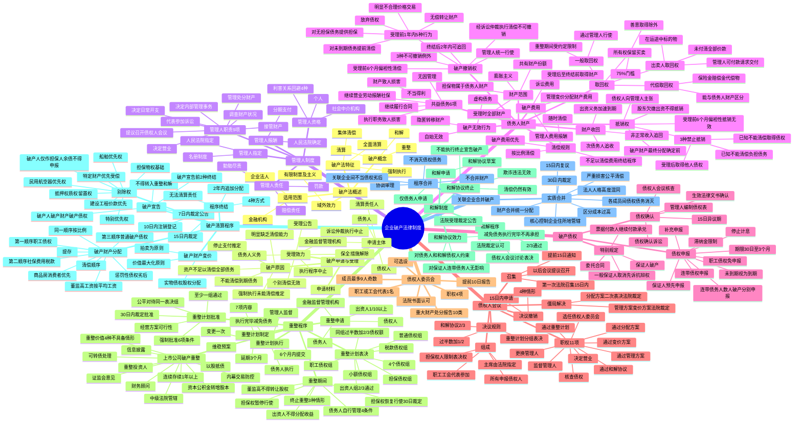

## 1. 章节定位

| 项目 | 信息 |
|------|------|
| 所属科目 | 经济法 |
| 难度等级 | 4 |
| 历年分值 | 10-15 分 |
| 建议学时 | 12-15 小时 |
| 知识关联章节 | 第1章 法律基本原理（法律渊源）；第2章 基本民事法律制度（诉讼时效、连带债务、保证）；第3章 物权法律制度（担保物权、所有权保留、取回权）；第4章 合同法律制度（双方均未履行完毕的合同、保证合同）；第6章 公司法律制度（出资义务、董事监事高管义务、清算义务）；第7章 证券法律制度（上市公司破产重整、信息披露、内幕交易防控）；第9章 票据与支付结算法律制度（票据付款人继续付款承兑的债权申报） |

## 2. 考情分析

本章是经济法科目的"重点章节"，分值约 10-15 分，主观题（案例分析题）与客观题并重，案例分析题常单独命题，是近年必考的案例分析题章节之一。命题常以"破产撤销权 + 取回权 + 抵销权 + 破产债权清偿顺序"为主线展开综合考查。

**命题规律**：本章命题注重体系性与实务性结合，重点考查破产原因的认定、破产申请受理的法律效力、管理人制度、债务人财产（尤其是破产撤销权与无效行为的区分、取回权的认定、抵销权的三种禁止情形）、破产费用与共益债务的区分与清偿顺序、破产债权的申报与确认、债权人会议的表决规则、重整程序（重整期间担保权暂停行使、重整计划分组表决、强制批准条件）、和解协议的效力、破产清算中的别除权与清偿顺序、关联企业合并破产。近年命题趋势是结合《破产法司法解释（二）》《破产法司法解释（三）》、《民商事审判会议纪要》以及《关于切实审理好上市公司破产重整案件工作座谈会纪要》（2024 年 12 月 31 日发布）出题。

**高频考点分布**：

1. **破产法律制度概述**：破产的概念（清算 + 重整 + 和解三位一体）；破产法的特征（集体清偿、全面清算、强制执行）；适用范围（企业法人）；域外效力（有限制的普及主义）。
2. **破产原因**：不能清偿到期债务 + 资产不足以清偿全部债务；不能清偿到期债务 + 明显缺乏清偿能力；强制执行未能清偿即可推定明显缺乏清偿能力；停止支付可推定不能清偿。
3. **破产申请主体**：债务人（重整、和解、清算均可申请）；债权人（重整、清算可申请，和解不可）；清算责任人（已解散未清算或未清算完毕且资产不足以清偿债务时申请清算）；国务院金融监督管理机构（金融机构重整、破产清算申请）。
4. **破产申请受理的效力**：个别清偿无效；保全措施解除；执行程序中止；已经开始尚未终结的诉讼/仲裁/执行中止；债务人的债务人或财产持有人向管理人清偿或交付；债务人的法定代表人等人员承担义务（妥善保管财产印章账簿文书、回答询问、未经许可不得离开住所地、不得新任其他企业董监高）。
5. **管理人制度**：管理人由人民法院指定；资格（由有关部门、机构的人员组成的清算组或者依法设立的律师事务所、会计师事务所、破产清算事务所等社会中介机构担任；不得担任的情形——4 种利害关系回避）；管理人职责（9 项）；管理人报酬由人民法院确定；管理人勤勉尽责义务、赔偿责任；管理人不得主动主张抵销（除非使债务人财产受益）。
6. **债务人财产**：膨胀主义（破产申请受理时属于债务人的全部财产 + 受理后至程序终结前债务人取得的财产）；出资义务加速到期（不受出资期限限制）；董事监事高管非正常收入追回（绩效奖金、普遍拖欠职工工资情况下获取的工资性收入、其他非正常收入）。
7. **破产撤销权**：受理前 1 年内 5 种可撤销行为（无偿转让财产、以明显不合理价格交易、对无财产担保债务提供财产担保、对未到期债务提前清偿、放弃债权）；受理前 6 个月内债务人有破产原因仍对个别债权人清偿的可撤销（偏袒性清偿）；3 种不可撤销的个别清偿例外（水电气费、劳动报酬人身损害赔偿金、使债务人财产受益的清偿）；经诉讼仲裁执行的个别清偿原则上不可撤销（恶意串通除外）；撤销权由管理人统一行使；破产清算程序终结后 2 年内债权人可行使撤销权追回财产。
8. **破产无效行为**：为逃避债务而隐匿、转移财产；虚构债务或者承认不真实的债务；无效行为自始无效，不受时间限制。
9. **取回权**：一般取回权（破产受理后形成、通过管理人行使、重整期间受约定条件限制）；出卖人取回权（在运途中标的物、买受人尚未收到且未付清全部价款、管理人可支付全部价款请求交付）；所有权保留买卖的处理（买受人已支付总价款 75% 以上或第三人善意取得的除外）；代偿取回权（保险金、赔偿金、代偿物能与债务人财产区分）。
10. **抵销权**：债权人向管理人主张；破产财产最终分配确定前提出；三种禁止抵销情形（债务人的债务人在受理后取得他人对债务人的债权、债权人已知不能清偿或破产申请事实而负担债务但法律规定的或 1 年前原因负担的除外、债务人的债务人已知不能清偿或破产申请事实而取得债权但法律规定的或 1 年前原因取得的除外）；股东欠缴出资或抽逃出资对债务人所负债务不得抵销；受理前 6 个月内偏袒性抵销可被认定无效。
11. **破产费用与共益债务**：破产费用（诉讼费用、管理变价分配债务人财产费用、管理人执行职务费用报酬及聘用工作人员费用）；共益债务（6 项——继续履行合同债务、无因管理债务、不当得利债务、继续营业劳动报酬社会保险费用及其他债务、管理人或相关人员执行职务致人损害债务、债务人财产致人损害债务）；由债务人财产随时清偿；不足以清偿所有破产费用和共益债务的先行清偿破产费用；不足以清偿所有破产费用或共益债务的按比例清偿；不足以清偿破产费用的终结破产程序（15 日内裁定）。
12. **破产债权申报**：债权申报期限自发布受理公告之日起计算，最短 30 日最长 3 个月；职工债权免申报（管理人调查后列清单公示）；未到期债权受理时视为到期；附利息债权自受理时停止计息；连带债权人可一人代表或共同申报；保证人可预先申报将来求偿权；连带债务人数人破产的可分别申报全部债权；补充申报（破产财产最后分配前，此前已进行的分配不再补充分配，审查确认费用由补充申报人承担）；滞纳金（受理后新发生的不得作为破产债权申报）。
13. **破产债权确认**：管理人编制债权表提交债权人会议核查；异议人 15 日内提起债权确认诉讼；15 日不是诉讼时效或除斥期间；生效法律文书确定的债权原则上直接确认（虚构或恶意诉讼除外，需通过审判监督程序撤销）。
14. **债权人会议**：所有依法申报债权的债权人为成员；担保权人未放弃优先受偿权对和解协议、破产财产分配方案不享有表决权；第一次债权人会议由人民法院召集（债权申报期限届满之日起 15 日内召开）；以后会议在人民法院认为必要时或管理人、债权人委员会、占债权总额 1/4 以上债权人提议时召开；决议规则——出席会议有表决权债权人过半数 + 所代表债权额占无财产担保债权总额 1/2 以上；15 日内请求人民法院撤销决议（4 种情形）；债权人会议僵局解决（财产管理方案、变价方案未通过由人民法院裁定；分配方案二次表决未通过由人民法院裁定）。
15. **债权人委员会**：可选设；成员不超过 9 人（奇数）+ 1 名职工或工会代表；人民法院书面认可；4 项职权；管理人实施 10 类重大财产处分行为应及时报告；管理人处分重大财产应事先制作方案并提交债权人会议表决，提前 10 日书面报告债权人委员会。
16. **重整程序**：重整申请主体多元化（债务人、债权人、出资人占注册资本 1/10 以上、金融监督管理机构）；重整期间（裁定重整之日起至重整程序终止，不包括执行期间）；债务人自行管理（4 个条件）；担保权暂停行使（非重整所需除外，担保物损坏或价值明显减少可申请恢复，30 日内裁定）；出资人不得请求投资收益分配；董监高未经同意不得转让股权；重整计划草案 6 个月内提交（可延期 3 个月）；分组表决（4 组 + 出资人组）；同组过半数 + 2/3 以上债权额通过；强制批准 6 项条件；重整计划对债务人、全体债权人、出资人、重整投资人均有约束力；执行完毕减免债务不再承担清偿责任。
17. **上市公司破产重整**：住所地中级人民法院管辖；连续存续 1 年以上；省级人民政府维稳预案；证监会就重整价值出具意见；不具备重整价值的 4 种情形；信息披露与内幕交易防控；重整投资人资格与股份锁定期；资本公积金转增股本；以股抵债；可转债处理；财务顾问聘请；退市公司重整参照适用。
18. **和解制度**：仅债务人可申请；债权人会议 2/3 以上通过；人民法院裁定认可；对债务人和全体和解债权人有约束力；对保证人和其他连带债务人无影响（不适用主债务减少从债务随之减少原则）；债务人不能执行或不执行的终止和解协议、宣告破产；和解债权人因执行和解协议所受清偿仍然有效。
19. **破产宣告**：7 日内作出裁定并公告；债务人称为破产人、债务人财产称为破产财产、债权称为破产债权；破产宣告后不得转入重整或和解；破产宣告前 2 种终结情形（第三人提供足额担保或清偿全部到期债务、债务人已清偿全部到期债务）。
20. **别除权**：对破产人特定财产享有担保权的优先受偿权；基础权利为担保物权（抵押权、质权、留置权）和法定特别优先权（船舶优先权、民用航空器优先权、建设工程价款优先受偿权）；别除权人享有破产申请权、应申报债权；重整程序中受限；破产人仅作为担保人的余债不得作为破产债权。
21. **破产财产分配顺序**：优先清偿破产费用和共益债务后——第一顺序职工债权（工资、医疗伤残补助、抚恤费用、应划入个人账户的基本养老保险和基本医疗保险费用、法律行政法规规定应支付的补偿金）；第二顺序社会保险费用和税款；第三顺序普通破产债权；同一顺序按比例分配；董监高工资按企业职工平均工资计算；惩罚性债权劣后（破产受理前产生的民事惩罚性赔偿金、行政罚款、刑事罚金）；商品房消费者交付请求权优先。
22. **破产程序终结**：4 种方式（和解重整完成、其他方式解决债务、破产财产不足以支付破产费用、破产财产分配完毕）；15 日内裁定；10 日内办理注销登记；2 年内追加分配；财产不足以支付分配费用的上交国库。
23. **关联企业合并破产**：实质合并（法人人格高度混同、区分成本过高、严重损害公平清偿利益；核心控制企业住所地法院管辖；各成员间债权债务消灭；30 日内裁定；15 日内复议）；程序合并（协调审理；不消灭债权债务关系；不合并财产；关联企业间不当债权劣后清偿）。

**联动考查方式**：

- 与第2章基本民事法律制度联动：诉讼时效（破产受理中断）、连带债务（数人破产分别申报）、保证（一般保证人破产取消先诉抗辩权、保证人预先申报）；
- 与第3章物权法律制度联动：担保物权（别除权、重整期间担保权暂停行使）、所有权保留（取回权处理）；
- 与第4章合同法律制度联动：双方均未履行完毕合同的解除或继续履行（共益债务）、保证合同；
- 与第6章公司法律制度联动：出资义务加速到期、董事监事高管义务、清算义务人；
- 与第7章证券法律制度联动：上市公司破产重整、信息披露、内幕交易防控、可转债处理；
- 内部综合联动：破产撤销权 + 取回权 + 抵销权 + 清偿顺序（最典型综合题命题模式）。

**备考建议**：

- 本章必须建立"破产程序全流程"知识链：破产原因 → 申请受理 → 管理人指定 → 债务人财产清理 → 债权申报 → 债权人会议 → 重整/和解/清算 → 财产分配；
- 破产撤销权是核心中的核心：受理前 1 年内 5 种可撤销行为、受理前 6 个月偏袒性清偿、3 种不可撤销例外必须精准记忆；
- 区分易混淆概念：破产撤销权 vs 破产无效行为、破产费用 vs 共益债务、一般取回权 vs 出卖人取回权 vs 代偿取回权、实质合并 vs 程序合并、重整 vs 和解；
- 关注数字考点：1 年、6 个月、2 年、30 日、3 个月、15 日、10 日、7 日、1/2、1/4、2/3、1/10、75%、9 人等；
- 上市公司破产重整是近年新增热点，需结合 2024 年《座谈会纪要》重点掌握。

## 3. 知识框架

## 4. 核心精讲

### 4.1 企业破产法律制度概述

#### 4.1.1 破产与破产法的概念和特征

**破产**是指对已经发生破产原因的企业法人，依法定程序进行债务清理、财产处置或者进行重整、和解，以使债权获得公平清偿、企业获得挽救或依法退出市场的法律制度。我国《企业破产法》采用"清算 + 重整 + 和解"三位一体的立法模式，集中体现了破产法的债务公平清偿功能与企业拯救功能。

**破产法的特征**：

1. **集体清偿**：破产程序是集体清偿程序，由全体债权人共同参与，按法定顺序和比例受偿，取代个别清偿的竞争。
2. **全面清算**：破产程序对债务人的全部财产进行清理、变价、分配，对全部债权进行确认、清偿，具有全面性。
3. **强制执行**：破产程序是司法程序，以国家强制力为后盾，对全体债权人和债务人均有约束力。

**破产法的立法目的**：公平清理债权债务，保护债权人和债务人的合法权益，维护社会主义市场经济秩序。

**破产法的适用范围**：《企业破产法》适用于企业法人。金融机构破产由国务院依据《企业破产法》和其他有关法律制定实施办法。农民专业合作社破产适用《企业破产法》的有关规定，但破产财产在清偿破产费用和共益债务后，应当优先清偿破产前与农民成员已发生交易但尚未结清的款项。

**破产法的域外效力**：依照《企业破产法》开始的破产程序，对债务人在中华人民共和国领域外的财产发生效力。这体现了有限制的普及主义。

#### 4.1.2 破产能力与破产原因

**破产能力**即主体适用破产法的资格。《企业破产法》第二条第一款规定，企业法人不能清偿到期债务，并且资产不足以清偿全部债务或者明显缺乏清偿能力的，依照本法规定清理债务。此即破产原因的规定。

**破产原因的两种组合**：

1. **不能清偿到期债务 + 资产不足以清偿全部债务**
2. **不能清偿到期债务 + 明显缺乏清偿能力**

**不能清偿到期债务**的认定需同时满足三个条件：债权债务关系依法成立；债务履行期限已经届满；债务人未完全清偿债务。

**资产不足以清偿全部债务**即资不抵债，通常以债务人的资产负债表、审计报告或资产评估报告为依据，资产总额小于负债总额即可认定。

**明显缺乏清偿能力**的认定：债务人账面资产虽大于负债，但存在下列情形之一的，人民法院应当认定其明显缺乏清偿能力：因资金严重困难或者财产无法变现等原因，无法清偿债务；法定代表人下落不明且无其他人员负责管理财产，无法清偿债务；经人民法院强制执行，无法清偿债务；长期亏损且经营扭亏困难，无法清偿债务；导致债务人丧失清偿能力的其他情形。

**停止支付**的推定效力：债务人停止支付到期债务并呈连续状况，如无相反证据，可推定为不能清偿到期债务。

**重整原因**：企业法人有明显丧失清偿能力可能的，可以依照《企业破产法》规定进行重整。即重整申请可在破产原因尚未实际发生但有可能发生时提出，比重整清算申请时间提前。

### 4.2 破产申请的提出与受理

#### 4.2.1 破产申请的提出

**（一）破产申请的主体**

| 申请主体 | 可申请的程序 | 条件 |
|---------|------------|------|
| 债务人 | 清算、重整、和解 | 债务人发生破产原因或明显丧失清偿能力可能（重整） |
| 债权人 | 清算、重整 | 债务人不能清偿到期债务 |
| 清算责任人 | 清算 | 企业法人已解散但未清算或未清算完毕，资产不足以清偿债务 |
| 出资人 | 重整 | 单独或合计持有债务人注册资本 1/10 以上 |
| 国务院金融监督管理机构 | 重整、清算 | 对金融机构进行重整或破产清算申请 |

**（二）破产申请的材料**

向人民法院提出破产申请，应当提交破产申请书和有关证据。破产申请书应当载明：申请人、被申请人的基本情况；申请目的；申请的事实和理由；人民法院认为应当载明的其他事项。债务人提出申请的，还应当向人民法院提交财产状况说明、债务清册、债权清册、有关财务会计报告、职工安置预案以及职工工资的支付和社会保险费用的缴纳情况。

**（三）破产申请的撤回**

人民法院受理破产申请前，申请人可以请求撤回申请。

#### 4.2.2 破产申请的受理

**（一）受理的审查与裁定**

债权人提出破产申请的，人民法院应当自收到申请之日起 5 日内通知债务人。债务人对申请有异议的，应当自收到人民法院的通知之日起 7 日内向人民法院提出。人民法院应当自异议期满之日起 10 日内裁定是否受理。除上述情形外，人民法院应当自收到破产申请之日起 15 日内裁定是否受理。有特殊情况需要延长受理期限的，经上一级人民法院批准，可以延长 15 日。

**（二）受理的法律效力**

1. **个别清偿无效**：人民法院受理破产申请后，债务人对个别债权人的债务清偿无效。
2. **保全措施解除**：有关债务人财产的保全措施应当解除。
3. **执行程序中止**：已经开始而尚未终结的执行程序应当中止。
4. **诉讼仲裁执行中止**：已经开始而尚未终结的民事诉讼或者仲裁应当中止；在管理人接管债务人的财产后，该诉讼或者仲裁继续进行。
5. **债务人的债务人或财产持有人义务**：债务人的债务人或者财产持有人应当向管理人清偿债务或者交付财产。
6. **债务人有关人员义务**：债务人的法定代表人应当妥善保管其占有和管理的财产、印章和账簿、文书等资料；根据人民法院、管理人的要求进行工作，并如实回答询问；列席债权人会议并如实回答债权人的询问；未经人民法院许可，不得离开住所地；不得新任其他企业的董事、监事、高级管理人员。
7. **受理公告**：人民法院应当自裁定受理破产申请之日起 25 日内通知已知债权人，并予以公告。

### 4.3 管理人制度

#### 4.3.1 管理人的资格与指定

**管理人**由人民法院指定。债权人会议认为管理人不能依法、公正执行职务或者有其他不能胜任职务情形的，可以申请人民法院予以更换。

**可以担任管理人的主体**：由有关部门、机构的人员组成的清算组或者依法设立的律师事务所、会计师事务所、破产清算事务所等社会中介机构。

**不得担任管理人的情形**：因故意犯罪受过刑事处罚；曾被吊销相关专业执业证书；与本案有利害关系；人民法院认为不宜担任管理人的其他情形。

**利害关系回避的具体情形**：与债务人、债权人有未了结的债权债务关系；在人民法院受理破产申请前三年内，曾为债务人提供相对固定的中介服务；现在是债务人或者债权人的控股股东、实际控制人；现在担任债务人、债权人的财务顾问、法律顾问；人民法院认为可能影响其公正履行管理人职责的其他情形。

#### 4.3.2 管理人的职责

管理人履行下列职责：

1. 接管债务人的财产、印章和账簿、文书等资料；
2. 调查债务人财产状况，制作财产状况报告；
3. 决定债务人的内部管理事务；
4. 决定债务人的日常开支和其他必要开支；
5. 在第一次债权人会议召开之前，决定继续或者停止债务人的营业；
6. 管理和处分债务人的财产；
7. 代表债务人参加诉讼、仲裁或者其他法律程序；
8. 提议召开债权人会议；
9. 人民法院认为管理人应当履行的其他职责。

在第一次债权人会议召开之前，管理人决定继续或者停止债务人的营业或者实施《企业破产法》第六十九条规定行为之一的，应当经人民法院许可。

管理人未依法勤勉尽责，忠实执行职务的，人民法院可以依法处以罚款；给债权人、债务人或者第三人造成损失的，依法承担赔偿责任。管理人没有正当理由不得辞去职务，辞去职务应当经人民法院许可。

#### 4.3.3 管理人的报酬

管理人报酬由人民法院确定。债权人会议对管理人报酬有异议的，应当向人民法院书面提出具体的请求和理由。人民法院应当自收到债权人会议异议书之日起 10 日内，就是否调整管理人报酬问题书面通知管理人、债权人委员会或者债权人会议主席。管理人报酬原则上应当根据破产案件审理进度和管理人履职情况分期支付。

### 4.4 债务人财产

#### 4.4.1 债务人财产的范围

我国立法采取**膨胀主义**，债务人财产包括破产申请受理时属于债务人的全部财产，以及破产申请受理后至破产程序终结前债务人取得的财产。债务人财产在破产宣告后改称为破产财产。

**债务人财产的认定**：除债务人所有的货币、实物外，债务人依法享有的可以用货币估价并可以依法转让的债权、股权、知识产权、用益物权等财产和财产权益，均认定为债务人财产。

**不属于债务人财产的财产**：

1. 债务人基于仓储、保管、承揽、代销、借用、寄存、租赁等合同或者其他法律关系占有、使用的他人财产；
2. 债务人在所有权保留买卖中尚未取得所有权的财产；
3. 所有权专属于国家且不得转让的财产；
4. 其他依照法律、行政法规不属于债务人的财产。

债务人已依法设定担保物权的特定财产，属于债务人财产。

#### 4.4.2 债务人财产的收回

**（一）出资义务加速到期**

债务人的出资人尚未完全履行出资义务的，管理人应当要求该出资人缴纳所认缴的出资，而不受出资期限的限制。出资人以认缴出资尚未届至公司章程规定的缴纳期限或者违反出资义务已经超过诉讼时效为由抗辩的，人民法院不予支持。

**（二）非正常收入追回**

债务人的董事、监事和高级管理人员利用职权从企业获取的非正常收入和侵占的企业财产，管理人应当追回。非正常收入包括：绩效奖金；普遍拖欠职工工资情况下获取的工资性收入；其他非正常收入。

因返还绩效奖金、其他非正常收入形成的债权，可以作为普通破产债权清偿；因返还普遍拖欠职工工资情况下获取的工资性收入形成的债权，按照该企业职工平均工资计算的部分作为拖欠职工工资清偿，高出部分作为普通破产债权清偿。

#### 4.4.3 破产撤销权与无效行为

**（一）破产撤销权**

破产撤销权是指管理人对债务人在破产案件受理前的法定期间内进行的欺诈逃债或损害公平清偿的行为，有不予承认、申请法院撤销，并追回财产的权利。撤销权由管理人统一行使。

**受理前 1 年内可撤销的 5 种行为**（《企业破产法》第三十一条）：

1. **无偿转让财产的**——包括无偿设置用益物权等其他无偿行为；
2. **以明显不合理的价格进行交易的**——付款条件、付款期限等其他交易条件明显不合理的也可以撤销；
3. **对没有财产担保的债务提供财产担保的**——补充设置物权担保或追加担保；但在可撤销期间内在设定债务的同时为债务提供的财产担保不包括在内（有对价行为）；
4. **对未到期的债务提前清偿的**——但破产申请受理前 1 年内债务人提前清偿的未到期债务在破产申请受理前已经到期的，管理人请求撤销不予支持，除非该清偿发生在受理前 6 个月内且债务人有破产原因；
5. **放弃债权的**——以明示或默示方式放弃对他人债权。

**受理前 6 个月内的偏袒性清偿**（《企业破产法》第三十二条）：债务人有破产原因仍对个别债权人进行清偿的，管理人有权请求人民法院予以撤销。但个别清偿使债务人财产受益的除外。

**3 种不可撤销的个别清偿例外**：

1. 债务人为维系基本生产需要而支付水费、电费等的；
2. 债务人支付劳动报酬、人身损害赔偿金的；
3. 使债务人财产受益的其他个别清偿。

**经诉讼、仲裁、执行程序对债权人进行的个别清偿**，管理人请求撤销的，人民法院不予支持。但是，债务人与债权人恶意串通损害其他债权人利益的除外。

**（二）破产无效行为**

涉及债务人财产的下列行为无效：

1. 为逃避债务而隐匿、转移财产的；
2. 虚构债务或者承认不真实的债务的。

无效行为自始无效，不受时间限制。管理人依据该规定提起诉讼，主张被隐匿、转移财产的实际占有人返还债务人财产，或者主张债务人虚构债务或者承认不真实债务的行为无效并返还债务人财产的，人民法院应予支持。

**（三）撤销权与无效行为的区别**

| 比较项 | 破产撤销权 | 破产无效行为 |
|-------|----------|-----------|
| 行为性质 | 在债务人有清偿能力时有效，丧失清偿能力时违背公平清偿 | 自始无效 |
| 时间限制 | 受理前 1 年内（5 种行为）或 6 个月内（偏袒清偿） | 无时间限制 |
| 行为类型 | 5 种可撤销行为 + 偏袒性清偿 | 隐匿转移财产、虚构债务 |
| 行使主体 | 管理人 | 管理人 |
| 法律后果 | 经法院撤销后失效 | 自始无效 |

**破产清算程序终结后的追回**：在破产清算程序终结后 2 年内，债权人可以行使破产撤销权或针对债务人的无效行为而追回财产。在此期间内追回的财产，应用于对全体债权人分配。2 年之后追回的财产一般不再按破产法规定用于全体债权人清偿，而是用于对追回财产的债权人个别清偿。

#### 4.4.4 取回权

**（一）一般取回权**

人民法院受理破产申请后，债务人占有的不属于债务人的财产，该财产的权利人可以通过管理人取回。

**特征**：取回权基础权利主要是物权（尤其是所有权）；在破产案件受理后形成；行使不受原约定条件、期限限制，也不受破产程序限制（重整程序除外）；在无争议时无须通过诉讼程序；权利人须通过管理人取回。

**重整期间的限制**：债务人重整期间，权利人要求取回债务人合法占有的权利人的财产，不符合双方事先约定条件的，人民法院不予支持。但因管理人或者自行管理的债务人违反约定，可能导致取回物被转让、毁损、灭失或者价值明显减少的除外。

**权利人行使取回权的费用**：权利人行使取回权时未依法向管理人支付相关的加工费、保管费、托运费、委托费、代销费等费用，管理人拒绝其取回相关财产的，人民法院应予支持。

**行使期限**：权利人行使取回权，应当在破产财产变价方案或者和解协议、重整计划草案提交债权人会议表决前向管理人提出。

**（二）出卖人取回权**

人民法院受理破产申请时，出卖人已将买卖标的物向作为买受人的债务人发运，债务人尚未收到且未付清全部价款的，出卖人可以取回在运途中的标的物。但是，管理人可以支付全部价款，请求出卖人交付标的物。

出卖人对在运途中标的物未及时行使取回权，在买卖标的物到达管理人后向管理人行使在运途中标的物取回权的，管理人不应准许。

**（三）所有权保留买卖合同的处理**

所有权保留买卖合同，是当事人约定买受人未履行支付价款或者其他义务，标的物的所有权属于出卖人的买卖合同。标的物不适用于不动产。出卖人对标的物保留的所有权，未经登记，不得对抗善意第三人。

**出卖人破产时**：管理人决定继续履行合同的，买受人应当按照原合同约定支付价款。买受人未依约支付价款或者将标的物出卖、出质或作出其他不当处分，给出卖人造成损害，出卖人管理人主张取回标的物的，人民法院应予支持；但买受人已支付标的物总价款 75% 以上或者第三人善意取得标的物所有权或其他物权的除外。管理人决定解除合同的，有权要求买受人交付买卖标的物。

**买受人破产时**：管理人决定继续履行合同的，原合同约定的支付价款或履行其他义务的期限在破产申请受理时视为到期。管理人无正当理由未及时支付价款或标的物被不当处分，出卖人有权主张取回标的物；但买受人已支付总价款 75% 以上或第三人善意取得的除外。管理人决定解除合同的，出卖人有权主张取回买卖标的物。

**（四）代偿取回权**

债务人占有的他人财产毁损、灭失，因此获得的保险金、赔偿金、代偿物尚未交付给债务人，或者代偿物虽已交付给债务人但能与债务人财产相区分的，权利人有权主张取回就此获得的保险金、赔偿金、代偿物。

代偿取回权行使的基本前提，是代偿物与债务人的其他财产能够加以区分。已经交付给债务人且不能与债务人财产区分的，按以下规则处理：财产毁损灭失发生在受理前的，作为普通破产债权清偿；发生在受理后的，作为共益债务清偿。

#### 4.4.5 抵销权

**破产抵销权**是指债权人在破产申请受理前对债务人即破产人负有债务的，无论是否已到清偿期限、标的是否相同，均可在破产财产最终分配确定前向管理人主张相互抵销的权利。

**行使主体**：只能由债权人向管理人提出行使，管理人（或债务人）不得主动主张债务抵销，但抵销使债务人财产受益的除外。

**行使时间**：债权人应当在破产财产最终分配确定之前向管理人主张破产抵销。破产清算程序中，是指破产财产分配方案提交债权人会议表决之前；重整与和解程序中，是指重整计划草案、和解协议草案提交债权人会议表决之前。

**管理人异议期限**：管理人收到债权人提出的主张债务抵销的通知后，经审查无异议的，抵销自管理人收到通知之日起生效。管理人对抵销主张有异议的，应当在约定的异议期限内或者自收到主张债务抵销的通知之日起 3 个月内向人民法院提起诉讼。

**管理人以下列理由提出异议的，人民法院不予支持**：

1. 破产申请受理时，债务人对债权人负有的债务尚未到期；
2. 破产申请受理时，债权人对债务人负有的债务尚未到期；
3. 双方互负债务标的物种类、品质不同。

**三种禁止抵销的情形**（《企业破产法》第四十条）：

1. **债务人的债务人在破产申请受理后取得他人对债务人的债权的**——债权转手后的抵销损害其他破产债权人利益；
2. **债权人已知债务人有不能清偿到期债务或者破产申请的事实，对债务人负担债务的**——但债权人因为法律规定或者有破产申请 1 年前所发生的原因而负担债务的除外；
3. **债务人的债务人已知债务人有不能清偿到期债务或者破产申请的事实，对债务人取得债权的**——但债务人的债务人因为法律规定或者有破产申请 1 年前所发生的原因而取得债权的除外。

**股东欠缴出资或抽逃出资对债务人所负债务不得抵销**：债务人股东因欠缴债务人的出资或者抽逃出资对债务人所负的债务，以及债务人股东滥用股东权利或者关联关系损害公司利益对债务人所负的债务，不得与债务人对其负有的债务抵销。

**受理前 6 个月内偏袒性抵销**：破产申请受理前 6 个月内，债务人有破产原因，债务人与个别债权人以抵销方式对个别债权人清偿，其抵销的债权债务属于上述第 2、3 项情形之一的，管理人在破产申请受理之日起 3 个月内向人民法院提起诉讼主张该抵销无效的，人民法院应予支持。

**担保债权抵销的例外**：债权人以对债务人特定财产享有优先受偿权的债权进行抵销，因未损害其他债权人的利益，不受上述禁止规定的限制。但用以抵销的债权大于债权人享有优先受偿权财产价值的除外。

### 4.5 破产费用与共益债务

#### 4.5.1 破产费用

人民法院受理破产申请后发生的下列费用，为破产费用：

1. 破产案件的诉讼费用；
2. 管理、变价和分配债务人财产的费用；
3. 管理人执行职务的费用、报酬和聘用工作人员的费用。

**特殊费用的参照处理**：此前债务人尚未支付的公司强制清算费用、未终结的执行程序中产生的评估费、公告费、保管费等执行费用，可以参照破产费用的规定由债务人财产随时清偿。此前债务人尚未支付的案件受理费、执行申请费，可以作为破产债权清偿。

#### 4.5.2 共益债务

人民法院受理破产申请后发生的下列债务，为共益债务：

1. 因管理人或者债务人请求对方当事人履行双方均未履行完毕的合同所产生的债务；
2. 债务人财产受无因管理所产生的债务；
3. 因债务人不当得利所产生的债务；
4. 为债务人继续营业而应支付的劳动报酬和社会保险费用以及由此产生的其他债务；
5. 管理人或者相关人员执行职务致人损害所产生的债务；
6. 债务人财产致人损害所产生的债务。

**继续营业借款**：破产申请受理后，经债权人会议决议通过，或者第一次债权人会议召开前经人民法院许可，管理人或者自行管理的债务人可以为债务人继续营业而借款。提供借款的债权人主张参照共益债务优先于普通破产债权清偿的，人民法院应予支持，但其主张优先于此前已就债务人特定财产享有担保的债权清偿的，人民法院不予支持。

#### 4.5.3 破产费用与共益债务的清偿

破产费用和共益债务由债务人财产随时清偿。债务人财产不足以清偿所有破产费用和共益债务的，先行清偿破产费用。债务人财产不足以清偿所有破产费用或者共益债务的，按照比例清偿。债务人财产不足以清偿破产费用的，管理人应当提请人民法院终结破产程序。人民法院应当自收到请求之日起 15 日内裁定终结破产程序，并予以公告。

**破产费用与共益债务的区别**：

| 比较项 | 破产费用 | 共益债务 |
|-------|--------|--------|
| 性质 | 程序性费用 | 实体性债务 |
| 产生原因 | 破产程序进行本身 | 维护全体债权人共同利益的实体行为 |
| 典型类型 | 诉讼费用、管理变价分配财产费用、管理人费用报酬 | 继续履行合同、无因管理、不当得利、继续营业、致人损害 |
| 清偿顺序 | 优先于共益债务 | 后于破产费用 |
| 共同点 | 均由债务人财产随时清偿，优先于其他债权 |

### 4.6 破产债权

#### 4.6.1 破产债权申报的一般规则

破产债权是依破产程序启动前原因成立的，经依法申报确认，并得由破产财产中获得清偿的可强制执行的财产请求权。人民法院受理破产申请时对债务人享有的债权称为破产债权。

**债权申报期限**：人民法院受理破产申请后，应当确定债权人申报债权的期限。债权申报期限自人民法院发布受理破产申请公告之日起计算，最短不得少于 30 日，最长不得超过 3 个月。

**职工债权免申报**：债务人所欠职工的工资和医疗、伤残补助、抚恤费用，所欠的应当划入职工个人账户的基本养老保险、基本医疗保险费用，以及法律、行政法规规定应当支付给职工的补偿金，不必申报，由管理人调查后列出清单并予以公示。职工对清单记载有异议的，可以要求管理人更正；管理人不予更正的，职工可以向人民法院提起债权确认诉讼。

**债权申报的一般规则**：

1. **未到期债权**：在破产申请受理时视为到期；
2. **附利息债权**：自破产申请受理时起停止计息；
3. **无利息债权**：无论是否到期均以本金申报；
4. **附条件、附期限债权和诉讼、仲裁未决债权**：债权人可以申报；
5. **连带债权**：可以由其中一人代表全体连带债权人申报，也可以共同申报；
6. **连带债务人数人破产**：债权人有权就全部债权分别在各破产案件中申报债权；
7. **补充申报**：在人民法院确定的债权申报期限内未申报债权的，可以在破产财产最后分配前补充申报；但此前已进行的分配不再对其补充分配。为审查和确认补充申报债权的费用，由补充申报人承担。

**滞纳金限制**：破产申请受理后，债务人欠缴款项产生的滞纳金，包括债务人未履行生效法律文书应当加倍支付的迟延利息和劳动保险金的滞纳金，债权人作为破产债权申报的，人民法院不予确认。

#### 4.6.2 破产债权申报的特别规定

**（一）保证人的债权申报**

债务人的保证人或者其他连带债务人已经代替债务人清偿债务的，以其对债务人的求偿权申报债权；尚未代替债务人清偿债务的，以其对债务人的将来求偿权预先申报债权。但债权人已向管理人申报全部债权的，保证人或连带债务人不能再申报债权。

**（二）保证人破产**

人民法院受理保证人破产案件的，保证人的保证责任不得因其破产而免除。保证债务已到期的，债权人可依保证合同的约定向保证人申报债权追偿。保证债务尚未到期的，将其未到期之保证责任视为已到期。

**一般保证人破产取消先诉抗辩权**：一般保证的保证人在主合同纠纷未经审判或者仲裁，并就债务人财产依法强制执行仍不能履行债务前，有权拒绝向债权人承担保证责任（先诉抗辩权）。但在人民法院受理债务人破产案件后，一般保证人不得行使先诉抗辩权。

保证人被裁定进入破产程序的，债权人有权申报其对保证人的保证债权。一般保证的保证人主张行使先诉抗辩权的，人民法院不予支持，但债权人在一般保证人破产程序中的分配额应予提存，待一般保证人应承担的保证责任确定后再按照破产清偿比例予以分配。

**（三）债务人和保证人均破产**

债务人、保证人均被裁定进入破产程序的，债权人有权向债务人、保证人分别申报债权。债权人向债务人、保证人均申报全部债权的，从一方破产程序中获得清偿后，其对另一方的债权额不作调整，但债权人的受偿额不得超出其债权总额。保证人履行保证责任后不再享有求偿权。

**（四）合同解除的损害赔偿**

管理人或者债务人依照破产法规定解除双方均未履行完毕的合同，对方当事人以因合同解除所产生的损害赔偿请求权申报债权，违约金不得作为破产债权申报。

**（五）委托合同**

债务人是委托合同的委托人，其破产案件被人民法院受理，受托人不知该事实，继续处理委托事务的，受托人以由此产生的请求权申报破产债权。受托人已知该事实，但为了债务人即全体债权人利益，在无法向管理人移交事务的紧急情况下应当继续处理委托事务，由此产生的请求权作为共益债务优先清偿。

**（六）票据**

债务人是票据的出票人，其破产案件被人民法院受理，该票据的付款人继续付款或者承兑的，付款人以由此产生的请求权申报债权。

#### 4.6.3 破产债权的确认

**管理人编制债权表**：管理人应当对所申报的债权进行登记造册，详尽记载申报人的姓名、单位、代理人、申报债权额、担保情况、证据、联系方式等事项，形成债权申报登记册，不允许以其认为申报债权超过诉讼时效或不能成立等为由拒绝编入债权申报登记册。管理人编制债权表并提交债权人会议核查。

**生效法律文书确认的债权**：已经生效法律文书确定的债权，管理人应当予以确认。管理人认为债权人据以申报债权的生效法律文书确定的债权错误，或者有证据证明债权人与债务人恶意通过诉讼、仲裁或者公证机关赋予强制执行力公证文书的形式虚构债权债务的，应当依法通过审判监督程序向作出该判决、裁定、调解书的人民法院或者上一级人民法院申请撤销生效法律文书，或者向受理破产申请的人民法院申请撤销或者不予执行仲裁裁决、不予执行公证债权文书后，重新确定债权。

**债权确认诉讼**：债务人、债权人对债权表记载的债权有异议的，应当说明理由和法律依据。经管理人解释或调整后，异议人仍然不服的，或者管理人不予解释或调整的，异议人应当在债权人会议核查结束后 15 日内向人民法院提起债权确认的诉讼。15 日的期限不是诉讼时效或权利除斥期间，超过该期限，异议人仍有权提起债权确认的诉讼。

**诉讼当事人**：债务人对债权表记载的债权有异议向人民法院提起诉讼的，应将被异议债权人列为被告。债权人对债权表记载的他人债权有异议的，应将被异议债权人列为被告；债权人对债权表记载的本人债权有异议的，应将债务人列为被告。

### 4.7 债权人会议与债权人委员会

#### 4.7.1 债权人会议的组成

**债权人会议**是由所有依法申报债权的债权人组成，以保障债权人共同利益为目的，为实现债权人的破产程序知情权、参与权，讨论决定有关破产事宜，表达债权人意志，协调债权人行为的破产议事机构。

**成员与表决权**：依法申报债权的债权人为债权人会议的成员，有权参加债权人会议，享有表决权。第一次会议确认债权后的债权人会议，只有债权得到确认者才有权参加并行使表决权。

**担保权人的表决权限制**：对债务人的特定财产享有担保权的债权人，未放弃优先受偿权利的，对于通过和解协议、通过破产财产的分配方案规定的事项不享有表决权。

**职工和工会代表**：债权人会议应当有债务人的职工和工会的代表参加，对有关事项发表意见。通常认为，债务人的职工和工会的代表在债权人会议上没有表决权，重整程序除外。

**债权人会议主席**：债权人会议设主席一人，由人民法院在有表决权的债权人中指定。由单位债权人出任债权人会议主席的，该单位应当指定一名常任代表履行主席职务。

**列席人员**：债务人的法定代表人有义务列席债权人会议。经人民法院决定，债务人企业的财务管理人员和其他经营管理人员也有义务列席债权人会议。管理人应当列席债权人会议。

#### 4.7.2 债权人会议的召集与职权

**召集**：第一次债权人会议由人民法院召集，自债权申报期限届满之日起 15 日内召开。以后的债权人会议，在人民法院认为必要时，或者管理人、债权人委员会、占债权总额 1/4 以上的债权人向债权人会议主席提议时召开。召开债权人会议，管理人应当提前 15 日通知已知的债权人。

**债权人会议的 11 项职权**：

1. 核查债权；
2. 申请人民法院更换管理人，审查管理人的费用和报酬；
3. 监督管理人；
4. 选任和更换债权人委员会成员；
5. 决定继续或者停止债务人的营业；
6. 通过重整计划；
7. 通过和解协议；
8. 通过债务人财产的管理方案；
9. 通过破产财产的变价方案；
10. 通过破产财产的分配方案；
11. 人民法院认为应当由债权人会议行使的其他职权。

#### 4.7.3 债权人会议的决议

**决议规则**：债权人会议的决议，由出席会议的有表决权的债权人过半数通过，并且其所代表的债权额占无财产担保债权总额的 1/2 以上。但是，法律对债权人会议通过和解协议与重整计划草案的决议有更为严格的规定。

**非现场表决**：债权人会议的决议除现场表决外，可以由管理人事先将相关决议事项告知债权人，采取通信、网络投票等非现场方式进行表决。管理人应当在债权人会议召开后的 3 日内，以信函、电子邮件、公告等方式将表决结果告知参与表决的债权人。

**决议的约束力**：债权人会议的决议，对于在该决议事项上有表决权的全体债权人均有约束力。

**决议的撤销**：债权人认为债权人会议的决议违反法律规定，损害其利益的，可以自债权人会议作出决议之日起 15 日内，请求人民法院裁定撤销该决议。可撤销的 4 种情形：债权人会议的召开违反法定程序；表决违反法定程序；决议内容违法；决议超出债权人会议的职权范围。

**债权人会议僵局的解决**：

- 通过债务人财产的管理方案和通过破产财产的变价方案经债权人会议表决未通过的，由人民法院裁定；
- 通过破产财产的分配方案经债权人会议二次表决仍未通过的，由人民法院裁定；
- 债权人对人民法院批准债务人财产管理方案和破产财产变价方案的裁定不服的，债权额占无财产担保债权总额 1/2 以上的债权人对人民法院批准破产财产分配方案的裁定不服的，可以自裁定宣布之日或者收到通知之日起 15 日内向该人民法院申请复议。复议期间不停止裁定的执行。

#### 4.7.4 债权人委员会

**设置**：在债权人会议中可以设置债权人委员会，由债权人会议根据案件具体情况决定是否设置。债权人委员会中的债权人代表由债权人会议选任、罢免。债权人委员会中还应当有一名债务人企业的职工代表或者工会代表。债权人委员会的成员人数原则上应为奇数，最多不得超过 9 人。出任债权人委员会的成员应当经人民法院书面认可。

**4 项职权**：

1. 监督债务人财产的管理和处分；
2. 监督破产财产分配；
3. 提议召开债权人会议；
4. 债权人会议委托的其他职权。

**管理人报告义务**：管理人实施下列行为，应当及时报告债权人委员会：

1. 涉及土地、房屋等不动产权益的转让；
2. 探矿权、采矿权、知识产权等财产权的转让；
3. 全部库存或者营业的转让；
4. 借款；
5. 设定财产担保；
6. 债权和有价证券的转让；
7. 履行债务人和对方当事人均未履行完毕的合同；
8. 放弃权利；
9. 担保物的收回；
10. 对债权人利益有重大影响的其他财产处分行为。

**重大财产处分**：管理人处分《企业破产法》第六十九条规定的债务人重大财产的，应当事先制作财产管理或者变价方案并提交债权人会议进行表决，债权人会议表决未通过的，管理人不得处分。管理人实施处分前，应当提前 10 日书面报告债权人委员会或者人民法院。

### 4.8 重整程序

#### 4.8.1 重整制度的一般理论

**重整**是指对已经或可能发生破产原因但又有挽救希望与价值的企业，通过对各方利害关系人的利益协调，借助法律强制进行股权、营业、资产重组与债务清理，以避免破产退出、获得事业更生的法律制度。

**重整制度的特征**：

1. **重整申请时间提前、启动主体多元化**：重整申请可在债务人有破产原因发生可能时就提出；可由债务人、债权人、出资人等多方主体提出；
2. **参与重整活动的主体多元化、重整措施多样化**；
3. **担保物权受限**：在担保物为企业重整所必需时，物权担保债权人的优先受偿权受到限制，原则上不能行使对担保物的变现权利；
4. **重整程序具有强制性**：经人民法院强制批准的重整计划对反对者亦有约束力；
5. **债务人可负责制定、执行重整计划**。

#### 4.8.2 重整期间

**重整期间**：自人民法院裁定债务人重整之日起至重整程序终止。重整期间不包括重整计划得到批准后的执行期间。

**（一）债务人自行管理**

经债务人申请，人民法院批准，债务人可以在管理人的监督下自行管理财产和营业事务。债务人同时符合下列条件的，经申请，人民法院可以批准债务人在管理人的监督下自行管理财产和营业事务：

1. 债务人的内部治理机制仍正常运转；
2. 债务人自行管理有利于债务人继续经营；
3. 债务人不存在隐匿、转移财产的行为；
4. 债务人不存在其他严重损害债权人利益的行为。

**（二）担保权暂停行使**

在重整期间，对债务人的特定财产享有的担保权暂停行使。但非企业重整中必需使用的担保财产，担保权人可以行使担保权。此外，担保物有损坏或者价值明显减少的可能，足以危害担保权人权利的，担保权人可以向人民法院请求恢复行使担保权。

人民法院应当自收到恢复行使担保物权申请之日起 30 日内作出裁定。经审查，担保物权人的申请不符合规定，或者管理人/自行管理的债务人有证据证明担保物是重整所必需，并且提供与减少价值相应担保或者补偿的，人民法院应当裁定不予批准恢复行使担保物权。担保物权人不服该裁定的，可以自收到裁定书之日起 10 日内向作出裁定的人民法院申请复议。人民法院裁定批准行使担保物权的，管理人或自行管理的债务人应当自收到裁定书之日起 15 日内启动对担保物的拍卖或变卖。

**（三）重整期间的其他规定**

- 债务人或者管理人为继续营业而借款的，可以参照共益债务优先受偿，还可以以债务人财产为该借款设定担保；
- 债务人合法占有的他人财产，该财产的权利人在重整期间要求取回的，应当符合事先约定的条件；
- 债务人的出资人不得请求投资收益分配；
- 债务人的董事、监事、高级管理人员未经人民法院同意不得向第三人转让其持有的债务人的股权。

**（四）重整程序的终止**

在重整期间，有下列情形之一的，经管理人或者利害关系人请求，人民法院应当裁定终止重整程序，并宣告债务人破产：

1. 债务人的经营状况和财产状况继续恶化，缺乏挽救的可能性；
2. 债务人有欺诈、恶意减少债务人财产或者其他显著不利于债权人的行为；
3. 由于债务人的行为致使管理人无法执行职务。

#### 4.8.3 重整计划的制定与批准

**（一）重整计划的制定**

重整计划草案由管理人或自行管理的债务人制作，应当自人民法院裁定债务人重整之日起 6 个月内，同时向人民法院和债权人会议提交。期限届满，经债务人或者管理人请求，有正当理由的，人民法院可以裁定延期 3 个月。债务人或者管理人未按期提出重整计划草案的，人民法院应当裁定终止重整程序，并宣告债务人破产。

**重整计划草案应当包括的内容**：

1. 债务人的经营方案；
2. 债权分类；
3. 债权调整方案；
4. 债权受偿方案；
5. 重整计划的执行期限；
6. 重整计划执行的监督期限；
7. 有利于债务人重整的其他方案。

**（二）重整计划草案的分组表决**

债权人参加讨论重整计划草案的债权人会议，依照下列债权分类，分组对重整计划草案进行表决：

1. 对债务人的特定财产享有担保权的债权；
2. 债务人所欠职工的工资和医疗、伤残补助、抚恤费用，所欠的应当划入职工个人账户的基本养老保险、基本医疗保险费用，以及法律、行政法规规定应当支付给职工的补偿金；
3. 债务人所欠税款；
4. 普通债权。

人民法院在必要时可以决定在普通债权组中设小额债权组对重整计划草案进行表决。

重整计划草案涉及出资人权益调整事项的，应当设出资人组，对该事项进行表决。出资人组的表决按照公司法规定的股东会的表决方式进行，经参与表决的出资人所持表决权 2/3 以上通过的，即为该组通过重整计划草案。

**重整计划不得规定减免**债务人欠缴的社会保险费用（应划入职工个人账户的基本养老保险、基本医疗保险费用除外）；该项费用的债权人不参加重整计划草案的表决。

**表决通过标准**：出席会议的同一表决组的债权人过半数同意重整计划草案，并且其所代表的债权额占该组债权总额的 2/3 以上的，即为该组通过重整计划草案。

**权益未受调整的债权人不参加表决**：权益因重整计划草案受到调整或者影响的债权人或者股东，有权参加表决；权益未受到调整或者影响的债权人或者股东，不参加重整计划草案的表决。

**（三）重整计划的批准**

各表决组均通过重整计划草案时，重整计划即为通过。自重整计划通过之日起 10 日内，债务人或者管理人应当向人民法院提出批准重整计划的申请。人民法院应当自收到申请之日起 30 日内裁定批准重整计划，终止重整程序，并予以公告。

**强制批准的 6 项条件**：部分表决组未通过重整计划草案的，债务人或者管理人可以同未通过重整计划草案的表决组协商。该表决组可以在协商后再表决一次。未通过重整计划草案的表决组拒绝再次表决或者再次表决仍未通过重整计划草案，但重整计划草案符合下列条件的，债务人或者管理人可以申请人民法院批准重整计划草案：

1. 按照重整计划草案，担保债权就该特定财产将获得全额清偿，其因延期清偿所受的损失将得到公平补偿，并且其担保权未受到实质性损害，或者该表决组已经通过重整计划草案；
2. 按照重整计划草案，职工债权、税款债权将获得全额清偿，或者相应表决组已经通过重整计划草案；
3. 按照重整计划草案，普通债权所获得的清偿比例，不低于其在重整计划草案被提请批准时依照破产清算程序所能获得的清偿比例，或者该表决组已经通过重整计划草案；
4. 重整计划草案对出资人权益的调整公平、公正，或者出资人组已经通过重整计划草案；
5. 重整计划草案公平对待同一表决组的成员，并且所规定的债权清偿顺序不违反法律规定；
6. 债务人的经营方案具有可行性。

人民法院应当审慎适用强制批准权。确需强制批准重整计划草案的，如债权人分多组的，还应当至少有一组利益受到重整计划草案不利影响的组别已经通过重整计划草案，且各表决组中反对者能够获得的清偿利益不低于依照破产清算程序所能获得的利益。

#### 4.8.4 重整计划的执行、监督与终止

**（一）重整计划的执行**

重整计划由债务人负责执行。人民法院裁定批准重整计划后，已接管财产和营业事务的管理人应当向债务人移交财产和营业事务。

债务人应严格执行重整计划，但因出现国家政策调整、法律修改变化等特殊情况，导致原重整计划无法执行的，债务人或管理人可以申请变更重整计划一次。债权人会议决议同意变更重整计划的，应自决议通过之日起 10 日内提请人民法院批准。

**重整计划的效力**：经人民法院裁定批准的重整计划，对债务人和全体债权人均有约束力，包括对债务人的特定财产享有担保权的债权人。债权人对债务人的保证人和其他连带债务人所享有的权利，不受重整计划的影响。

债权人未依法申报债权的，在重整计划执行期间不得行使受偿权利；在重整计划执行完毕后，可以按照重整计划规定的同类债权的清偿条件行使权利。按照重整计划减免的债务，自重整计划执行完毕时起，债务人不再承担清偿责任。

**（二）重整计划的监督**

在重整计划中应当规定对重整计划执行的监督期限。自人民法院裁定批准重整计划之日起，在重整计划规定的监督期内，由管理人监督重整计划的执行，债务人应当向管理人报告重整计划执行情况和债务人财务状况。监督期届满时，管理人应当向人民法院提交监督报告。自监督报告提交之日起，管理人的监督职责终止。经管理人申请，人民法院可以裁定延长重整计划执行的监督期限。

**（三）重整计划的终止**

债务人不能执行或者不执行重整计划，且不符合重整计划变更条件的，人民法院经管理人或者利害关系人请求，应当裁定终止重整计划的执行，并宣告债务人破产。

人民法院裁定终止重整计划执行的，债权人在重整计划中作出的债权调整的承诺失去效力，但为重整计划的执行提供的担保继续有效。债权人因执行重整计划所受的清偿仍然有效，债权未受清偿的部分作为破产债权。在重整计划执行中已经接受清偿的债权人，只有在其他同顺位债权人与自己所受的重整清偿达到同一比例时，才能继续接受破产分配。

#### 4.8.5 上市公司的破产重整

**（一）申请与受理**

上市公司破产重整案件应当由上市公司住所地中级人民法院管辖。向人民法院提交（预）重整申请时，上市公司住所地应当在该法院辖区内连续存续 1 年以上。

上市公司、债权人、单独或者合计出资占债务人注册资本 1/10 以上的出资人，可以依法向人民法院申请对上市公司进行破产重整。申请人应当提交关于上市公司具有重整可行性的报告、上市公司住所地省级人民政府出具的维稳预案等。

**不具备重整价值的 4 种情形**：

1. 上市公司因涉及国家安全、公共安全、生态安全、生产安全、公众健康安全等可能被证券交易所终止其股票上市交易的重大违法行为正在被有权机关立案调查或立案侦查且尚未结案；
2. 根据相关行政处罚事先告知书、行政处罚决定、人民法院生效裁判认定的事实等情况，上市公司可能被证券交易所终止其股票上市交易；
3. 上市公司因信息披露、规范运作等存在重大缺陷，可能被证券交易所终止其股票上市交易；
4. 其他违反证券监管法律法规，导致上市公司丧失重整价值的情形。

**（二）信息披露和内幕交易防控**

上市公司破产重整属于证券法规定的可能对上市公司股票交易价格产生较大影响的重大事件。上市公司内幕信息知情人员以及人民法院因审理上市公司破产重整相关案件而获取内幕信息的人员，应当严格遵守内幕信息知情人登记及内幕交易防控的要求。

**（三）重整计划草案的特殊规定**

- 重整计划草案应当在提交债权人会议 15 日前，在证券交易所网站和符合中国证监会规定条件的媒体上披露；
- 重整计划草案中涉及的资本公积金转增股本比例、重整投资人资格及获得股份的价格、股份锁定期应当符合中国证监会相关规定；
- 采取以股抵债方式清偿的，应当重点说明以股抵债价格是否客观反映公司股票的公允市价；
- 上市公司资产不足以清偿全部债务且普通债权人不能在重整计划中全额获得清偿的，原则上应对出资人权益进行调整；
- 涉及出资人权益调整的，应当设置出资人组对该事项进行表决，经参与表决的出资人所持表决权 2/3 以上通过即为该组表决通过；
- 关联股东应当回避表决且不得代理其他股东行使表决权。

**（四）可转债的处理**

上市公司被裁定破产重整的，所发行的可转换公司债券期限适用《企业破产法》第四十六条的规定。可转债募集说明书未对破产重整程序中的交易安排和转股权作特别约定的，相关主体应当及时召集持有人会议。交易期间不应晚于转股权行使期间，转股权行使期间的截止日不应晚于债权申报截止日。关于可转债的债权金额计算，应以票面金额加上到期利息进行确定。

### 4.9 和解制度

#### 4.9.1 和解的特征与一般程序

**和解**是客观上具有避免债务人破产作用的法律制度之一。在发生破产原因时，债务人可以提出和解申请及和解协议草案，由债权人会议表决，如获得通过，经人民法院裁定认可后生效执行，可以避免企业被破产清算。

**和解与重整的主要区别**：

| 比较项 | 和解 | 重整 |
|-------|------|------|
| 申请主体 | 仅债务人 | 债务人、债权人、出资人、金融监管机构 |
| 申请时间 | 发生破产原因后 | 破产原因可能发生时即可 |
| 担保权影响 | 不约束担保权人 | 担保权暂停行使 |
| 强制批准 | 无 | 有 |
| 适用对象 | 中小型企业、无重要财产担保企业 | 大中型企业 |

**和解程序**：

1. **申请**：债务人申请和解，应当提出和解协议草案；
2. **受理**：人民法院经审查认为和解申请符合法律规定的，应当受理其申请，裁定和解，予以公告，并召集债权人会议讨论表决和解协议草案；
3. **表决**：债权人会议通过和解协议的决议，由出席会议的有表决权的债权人过半数同意，并且其所代表的债权额占无财产担保债权总额的 2/3 以上；
4. **认可**：债权人会议通过和解协议的，由人民法院裁定认可，终止和解程序，并予以公告。

和解程序对就债务人特定财产享有担保权的权利人无约束力，该权利人自人民法院受理和解申请之日起，可以对担保物行使权利。

#### 4.9.2 和解协议的效力

**（一）对债务人和和解债权人的效力**

经人民法院裁定认可的和解协议，对债务人和全体和解债权人均有约束力。和解债权人是指人民法院受理破产申请时对债务人享有无物权担保等特别优先权的债权人。债务人应当按照和解协议规定的条件清偿债务。按照和解协议减免的债务，自和解协议执行完毕时起，债务人不再承担清偿责任。

在和解程序中，债权人未依法申报债权的，在债务人向债权人会议提交的和解协议草案付诸表决后，可以继续申报债权，但在和解协议执行期间不得行使权利；在和解协议执行完毕后，可以按照和解协议规定的清偿条件行使权利。

**（二）对保证人和其他连带债务人的效力**

和解债权人对债务人的保证人和其他连带债务人所享有的权利，不受和解协议的影响。即和解协议对债务人的保证人或连带债务人无效，和解债权人对债务人所作的债务减免清偿或延期偿还的让步，效力不及于债务人的保证人或连带债务人，他们仍应按原来债的约定或法定责任承担保证或连带责任。

在破产和解（也包括重整程序）中，不适用主债务减少从债务随之减少的原则。

**（三）和解协议的终止**

因债务人的欺诈或者其他违法行为而成立的和解协议，人民法院应当裁定无效，并宣告债务人破产。和解债权人因执行和解协议所受的清偿，在其他债权人所受清偿同等比例的范围内，不需要返还。

债务人不能执行或者不执行和解协议的，人民法院经和解债权人请求，应当裁定终止和解协议的执行，并宣告债务人破产。破产法上的和解协议只具有程序法上的意义，没有强制执行的效力。

人民法院裁定终止和解协议执行的，和解债权人在和解协议中作出的债权调整的承诺失去效力，但债务人方面为和解协议的执行提供的担保继续有效。和解债权人因执行和解协议所受的清偿仍然有效，不予退回，和解债权未受清偿的部分作为破产债权。

### 4.10 破产清算程序

#### 4.10.1 破产宣告

**破产宣告**是指法院依据当事人等的申请或法定职权裁定宣布债务人破产以清偿债务的活动。人民法院受理破产清算申请后，第一次债权人会议上无人提出重整或和解申请的，管理人应当及时向人民法院提出宣告破产的申请。人民法院应当自收到申请之日起 7 日内作出破产宣告裁定并进行公告。

**破产宣告的效力**：债务人被宣告破产后，在破产程序中的有关称谓发生相应变化，债务人称为破产人，债务人财产称为破产财产，破产申请受理时对债务人享有的债权称为破产债权。债务人被宣告破产后，不得再转入重整程序或和解程序。

**破产宣告前的终结**：破产宣告前，有下列情形之一的，人民法院应当裁定终结破产程序：

1. 第三人为债务人提供足额担保或者为债务人清偿全部到期债务的；
2. 债务人已清偿全部到期债务的。

#### 4.10.2 别除权

**别除权**是指债权人因其债权设有物权担保或享有法定特别优先权，而在破产程序中就债务人（即破产人）特定财产享有的优先受偿权利。

**别除权的特征**：

1. 别除权人行使优先受偿权原则上不受破产清算与和解程序的限制，但在重整程序中受到一定限制；
2. 别除权之债权属于破产债权，其担保物属于破产财产；
3. 别除权人享有破产申请权，也应当申报债权；
4. 别除权人就破产人的特定财产享有优先受偿权利，该项财产的变价款必须优先清偿别除权人的担保债权。

**别除权的基础权利**：

1. **担保物权**：抵押权、质权和留置权；船舶抵押权、民用航空器抵押权；
2. **法定特别优先权**：船舶优先权（《海商法》）、民用航空器优先权（《民用航空法》）、建设工程价款优先受偿权（《民法典》第八百零七条）、土地使用权出让金优先权。

**别除权的特殊问题**：

- 别除权人放弃优先受偿权或行使优先受偿权未能完全受偿的债权作为普通债权清偿；
- 破产人仅作为担保人为他人债务提供物权担保，担保物价款不足以清偿担保债额时，余债不得作为破产债权向破产人要求清偿，只能向原主债务人求偿；别除权人放弃优先受偿权利，其债权也不能转为对破产人的破产债权（两人之间只有担保关系，无基础债务关系）。

#### 4.10.3 破产财产的变价和分配

**（一）破产财产的变价**

破产财产的分配以货币分配为基本方式。管理人应当及时拟订破产财产变价方案，提交债权人会议讨论。变价出售破产财产原则上以拍卖方式进行，但债权人会议另有决议的除外。

破产财产处置应当以价值最大化为原则，兼顾处置效率。破产企业可以以全部或者部分变价方式出售。

**（二）破产财产的分配**

**破产财产清偿顺序**（《企业破产法》第一百一十三条）：

破产财产在优先清偿破产费用和共益债务后，依照下列顺序清偿：

1. **第一顺序**：破产人所欠职工的工资和医疗、伤残补助、抚恤费用，所欠的应当划入职工个人账户的基本养老保险、基本医疗保险费用，以及法律、行政法规规定应当支付给职工的补偿金；
2. **第二顺序**：破产人欠缴的除前项规定以外的社会保险费用和破产人所欠税款；
3. **第三顺序**：普通破产债权。

破产财产不足以清偿同一顺序的清偿要求的，按照比例分配。破产企业的董事、监事和高级管理人员的工资按照该企业职工的平均工资计算。

**惩罚性债权的劣后清偿**：破产财产依照《企业破产法》第一百一十三条规定的顺序清偿后仍有剩余的，可依次用于清偿破产受理前产生的民事惩罚性赔偿金、行政罚款、刑事罚金等惩罚性债权。

**因债务人侵权行为造成的人身损害赔偿**，可以参照职工债权顺序清偿，但其中涉及的惩罚性赔偿除外。

**商品房消费者权利保护**：商品房消费者以居住为目的购买房屋并已支付全部价款，主张其房屋交付请求权优先于建设工程价款优先受偿权、抵押权以及其他债权的，人民法院应当予以支持。在房屋不能交付且无实际交付可能的情况下，商品房消费者主张价款返还请求权优先于建设工程价款优先受偿权、抵押权以及其他债权的，人民法院应当予以支持。

**董监高工资的调整**：破产分配时，对债务人的董事、监事和高级管理人员在破产申请受理前拖欠的工资，应当按照企业拖欠职工工资的平均期间、以同期职工平均工资为标准予以调整，此前如有多发放的，应作为非正常收入予以追回。高出该企业职工平均工资计算的部分，可以作为普通破产债权清偿。

**第三方垫付和住房公积金**：由第三方垫付的职工债权，原则上按照垫付的职工债权性质进行清偿；由欠薪保障基金垫付的，应按照第二顺序清偿。债务人欠缴的住房公积金，按照债务人拖欠的职工工资性质清偿。

**税款滞纳金**：破产企业在破产案件受理前因欠缴税款产生的滞纳金属于普通破产债权，不享有与欠缴税款相同的优先受偿地位。破产案件受理后，欠缴税款的滞纳金应当停止计算，在破产程序中不得作为破产债权清偿。

**（三）破产分配的提存**

对附生效条件或者解除条件的债权，管理人应当将其分配额提存。在最后分配公告日，生效条件未成就或者解除条件成就的，提存的分配额应当分配给其他债权人；生效条件成就或者解除条件未成就的，提存的分配额应当交付给该债权人。

破产财产分配时，对于诉讼或者仲裁未决的债权，管理人应当依争议标的额将其分配额提存，按照诉讼或者仲裁结果处理。自破产程序终结之日起满 2 年仍不能受领分配的，人民法院应当将提存的分配额分配给其他债权人。

无法通知且无法直接交付，或者经通知债权人未受领也无法直接交付的破产财产分配额，管理人应当提存。债权人自最后分配公告之日起满 2 个月仍不领取的，视为放弃受领分配的权利。

#### 4.10.4 破产程序的终结

**（一）破产程序终结的方式**

破产程序终结方式主要有四种：

1. 因和解、重整程序完成而终结；
2. 因债务人以其他方式解决债务清偿问题（包括第三人代为清偿债务、自行和解）而终结；
3. 因债务人的破产财产不足以支付破产费用而终结；
4. 因破产财产分配完毕而终结。

**破产财产不足以支付破产费用**：破产申请受理后，经管理人调查，债务人财产不足以清偿破产费用且无人代为清偿或垫付的，人民法院应当依管理人申请宣告债务人破产并裁定终结破产清算程序。

**破产财产分配完毕**：破产人无财产可供分配的，管理人应当请求人民法院裁定终结破产程序。在破产人有财产可供分配的情况下，管理人在最后分配完结后，应当及时向人民法院提交破产财产分配报告，并提请人民法院裁定终结破产程序。人民法院应当自收到管理人终结破产程序的请求之日起 15 日内作出是否终结破产程序的裁定。

**注销登记**：管理人应当自破产程序终结之日起 10 日内，持人民法院终结破产程序的裁定，向破产人的原登记机关办理注销登记。

**（二）遗留事务的处理与追加分配**

在破产程序因债务人财产不足以支付破产费用而终结，或者因破产人无财产可供分配或破产财产分配完毕而终结时，自终结之日起 2 年内，有下列情形之一的，债权人可以请求人民法院按照破产财产分配方案进行追加分配：

1. 发现在破产案件中有可撤销行为、无效行为或者债务人的董事、监事和高级管理人员利用职权从企业获取非正常收入和侵占企业财产的情况，应当追回财产的；
2. 发现破产人有应当供分配的其他财产的。

有上述情形，但财产数量不足以支付分配费用的，不再进行追加分配，由人民法院将其上交国库。

**（三）无法清算破产案件的审理**

债务人发生破产原因，并不是《公司法》规定的解散事由。对未发生解散事由的债务人公司，董事等清算义务人是没有申请清算包括破产清算义务的。

在企业法人已解散但未清算的情况下，应当向人民法院申请破产清算的是清算义务人。在企业法人已解散但未清算完毕的情况下，因清算组已经成立，清算义务人的清算义务已经履行，所以应当向人民法院申请破产清算的是清算组即清算人，而不是清算义务人。

在破产清算程序中，负有妥善保管并向管理人移交公司财产、账册、重要文件等资料义务者，是破产法规定的公司法定代表人以及财务管理人员和其他经营管理人员等配合清算义务人，而不是清算义务人。不能简单地认为，只要在破产程序中因债务人财产、印章和账簿、文书下落不明等无法清算，就应当追究清算义务人的连带责任或相应责任。

### 4.11 关联企业合并破产

#### 4.11.1 关联企业合并破产概说

在市场经济中，企业集团与关联企业的存在已是常态。当关联企业成员之间存在法人人格高度混同、区分各关联企业成员财产的成本过高、严重损害债权人公平清偿利益时，可例外适用关联企业合并破产方式进行审理。

**关联企业在破产程序中的合并有两种**：

1. **实质合并**：通过对各关联企业资产与负债的合并处置，在破产程序中将多个关联企业视为一个单一企业，在统一财产分配与债务清偿的基础上进行破产程序，所有企业同类债权人的清偿率按相同原则确定，各企业的法人人格在破产程序进行的期间内不再独立。
2. **程序合并**（协调审理）：是对多个破产案件程序的合并审理，通过统一制定集团各企业相互协调衔接的重整计划、清算方案乃至整个集团企业合一的整体重整计划，达到企业挽救目的，或使破产财产实现更高的清算价值。但在程序合并中，各关联企业仍保持法人人格的独立，资产与债务清偿比例等分别确定。

#### 4.11.2 关联企业实质合并破产

**适用条件**：当关联企业成员之间存在法人人格高度混同、区分各关联企业成员财产的成本过高、严重损害债权人公平清偿利益时，可例外适用关联企业实质合并破产方式进行审理。

**程序**：

- 人民法院收到实质合并申请后，应当及时通知相关利害关系人并组织听证；
- 在收到申请之日起 30 日内作出是否实质合并审理的裁定；
- 相关利害关系人对实质合并审理裁定不服的，可以自裁定书送达之日起 15 日内向受理法院的上一级人民法院申请复议。

**管辖**：采用实质合并方式审理关联企业破产案件的，应由关联企业中的核心控制企业住所地人民法院管辖。核心控制企业不明确的，由关联企业主要财产所在地人民法院管辖。

**效力**：人民法院裁定采用实质合并方式审理破产案件的，各关联企业成员之间的债权债务归于消灭，各成员的财产作为合并后统一的破产财产，由各成员的债权人在同一程序中按照法定顺序公平受偿。

**实质合并破产中的"合并"性质**：实质合并破产中的"合并"，不是公司法、企业法上的组织合并，而只是在破产程序进行期间以对各关联企业的资产与负债统一处理为目的的法人人格模拟合并。法院实质合并破产的裁定，不具有对各关联企业实行公司法上组织合并程序的效力，更不进行公司合并的工商登记变更。

#### 4.11.3 关联企业程序合并破产

**协调审理**：多个关联企业成员均存在破产原因但不符合实质合并条件的，人民法院可根据相关主体的申请对多个破产程序进行协调审理，并可根据程序协调的需要，综合考虑破产案件审理的效率、破产申请的先后顺序、成员负债规模大小、核心控制企业住所地等因素，由共同的上级法院确定一家法院集中管辖。

**程序合并的效力**：协调审理不消灭关联企业成员之间的债权债务关系，不对关联企业成员的财产进行合并，各关联企业成员的债权人仍以该企业成员财产为限依法获得清偿。

**关联企业间不当债权的劣后清偿**：在程序合并中，关联企业成员之间不当利用关联控制关系形成的债权，应当劣后于其他普通债权顺序清偿，且该劣后债权人不得依据其他关联企业成员提供的物权担保就特定财产优先受偿。

## 5. 典型例题

### 例题 1：破产撤销权的认定（综合案例分析题）

**案情**：A 公司因经营不善，于 2024 年 3 月 1 日被人民法院裁定受理破产申请。经管理人调查，A 公司在破产受理前存在以下行为：

1. 2023 年 5 月，A 公司将一台价值 200 万元的设备无偿转让给其控股股东 B；
2. 2023 年 8 月，A 公司以明显不合理的低价将其房产转让给 C 公司（C 公司知道 A 公司财务状况恶化）；
3. 2023 年 10 月，A 公司对其原无财产担保的欠 D 公司的 100 万元债务提供了财产担保；
4. 2023 年 12 月，A 公司对未到期的欠 E 公司债务提前清偿 50 万元（该债务在破产受理前已经到期）；
5. 2024 年 1 月，A 公司在已经有破产原因的情况下，对债权人 F 公司的到期债务进行个别清偿 30 万元（非维系基本生产需要）。

**问题**：管理人能否主张撤销上述行为？说明理由。

**答案要点**：

1. **行为 1 可撤销**。受理前 1 年内无偿转让财产，属于《企业破产法》第三十一条第一项规定的可撤销行为。无偿转让财产无论受让人是否善意均可撤销。
2. **行为 2 可撤销**。受理前 1 年内以明显不合理价格交易，属于第三十一条第二项规定的可撤销行为。撤销后，买卖双方应当依法返还从对方获取的财产或价款，债务人所产生的应返还受让人已支付价款的债务作为共益债务清偿。
3. **行为 3 可撤销**。受理前 1 年内对没有财产担保的债务提供财产担保，属于第三十一条第三项规定的可撤销行为。其使被提供担保的债权人在破产程序中得到本不享有的优惠清偿利益。
4. **行为 4 不可撤销**。虽然是对未到期债务提前清偿，但该债务在破产申请受理前已经到期，且不属于发生在受理前 6 个月内且债务人有破产原因的情形，依据《破产法司法解释（二）》第十二条，管理人请求撤销不予支持。
5. **行为 5 可撤销**。受理前 6 个月内，债务人有破产原因仍对个别债权人进行清偿，属于《企业破产法》第三十二条规定的偏袒性清偿。该清偿非维系基本生产需要、非劳动报酬或人身损害赔偿、未使债务人财产受益，不属于不可撤销的例外。

### 例题 2：抵销权的认定

**案情**：G 公司被人民法院裁定受理破产申请。在破产受理前：

1. G 公司欠 H 公司货款 80 万元（受理前 1 年发生）；H 公司欠 G 公司借款 80 万元（受理后 H 公司从 I 公司处受让取得对 G 公司的债权）；
2. G 公司欠 J 公司货款 50 万元；J 公司在知道 G 公司有不能清偿到期债务事实后，仍与 G 公司签订买卖合同，对 G 公司负担 50 万元债务；
3. G 公司的股东 K 欠缴 G 公司出资 100 万元；G 公司欠 K 公司借款 100 万元。

**问题**：上述三种情形能否抵销？说明理由。

**答案要点**：

1. **情形 1 不得抵销**。债务人的债务人（H 公司）在破产申请受理后取得他人（I 公司）对债务人的债权，属于《企业破产法》第四十条第一项禁止抵销的情形。
2. **情形 2 不得抵销**。债权人（J 公司）已知债务人有不能清偿到期债务的事实，对债务人负担债务，属于第四十条第二项禁止抵销的情形。J 公司非因法律规定或破产申请 1 年前所发生的原因而负担债务。
3. **情形 3 不得抵销**。债务人股东因欠缴债务人的出资对债务人所负的债务，不得与债务人对其负有的债务抵销。这是《破产法司法解释（二）》第四十六条的明确规定，目的是维护资本充实原则。

### 例题 3：破产财产清偿顺序

**案情**：L 公司被人民法院裁定宣告破产。经管理人清理，破产财产总额为 1000 万元。破产费用 50 万元，共益债务 30 万元。L 公司所欠债务包括：

- 职工工资和医疗伤残补助 200 万元；
- 欠缴税款 100 万元；
- 普通破产债权 1500 万元；
- 破产受理前因侵权造成的人身损害赔偿 80 万元（含惩罚性赔偿 20 万元）；
- 破产受理前的行政罚款 40 万元。

**问题**：计算各项债权的清偿金额。

**答案要点**：

1. **优先清偿破产费用和共益债务**：1000 - 50 - 30 = 920 万元；
2. **第一顺序清偿**：职工债权 200 万元 + 人身损害赔偿中的补偿性部分 60 万元（80 - 20 = 60 万元，惩罚性赔偿除外）= 260 万元；剩余 920 - 260 = 660 万元；
3. **第二顺序清偿**：欠缴税款 100 万元；剩余 660 - 100 = 560 万元；
4. **第三顺序清偿**：普通破产债权 1500 万元，按比例清偿，清偿率 = 560/1500 ≈ 37.33%；
5. **惩罚性债权劣后清偿**：剩余 0 万元，惩罚性赔偿 20 万元、行政罚款 40 万元均无法获得清偿。

### 例题 4：重整计划分组表决

**案情**：M 公司被裁定重整。重整计划草案对债权分类如下：担保债权组（债权额 500 万元）、职工债权组（债权额 200 万元）、税款债权组（债权额 100 万元）、普通债权组（债权额 2000 万元）、出资人组。各组表决情况：

- 担保债权组：出席会议 8 人，5 人同意（代表债权额 300 万元）；
- 职工债权组：出席会议 6 人，4 人同意（代表债权额 150 万元）；
- 税款债权组：出席会议 2 人，2 人同意（代表债权额 100 万元）；
- 普通债权组：出席会议 50 人，35 人同意（代表债权额 1200 万元）；
- 出资人组：参与表决出资人所持表决权 70% 通过。

**问题**：各组是否通过重整计划草案？重整计划是否通过？

**答案要点**：

通过标准：出席会议的同一表决组的债权人过半数同意 + 其所代表的债权额占该组债权总额的 2/3 以上。

1. **担保债权组**：5/8 过半数（满足），300/500 = 60% < 2/3（不满足），未通过；
2. **职工债权组**：4/6 过半数（满足），150/200 = 75% > 2/3（满足），通过；
3. **税款债权组**：2/2 过半数（满足），100/100 = 100% > 2/3（满足），通过；
4. **普通债权组**：35/50 过半数（满足），1200/2000 = 60% < 2/3（不满足），未通过；
5. **出资人组**：经参与表决的出资人所持表决权 2/3 以上通过（70% > 2/3 ≈ 66.67%，满足），通过。

重整计划未通过（担保债权组和普通债权组未通过）。债务人或者管理人可以同未通过的表决组协商，该表决组可以在协商后再表决一次。如仍未通过，但重整计划草案符合强制批准的 6 项条件，债务人或者管理人可以申请人民法院强制批准。

## 6. 记忆口诀

### 6.1 破产原因口诀

**不能清偿到期债务**（基础前提） + **资产不足以清偿全部债务**或**明显缺乏清偿能力**（择一组合）

记忆：**"不能清偿"是基础，"资产不足"或"明显缺乏"二选一**

### 6.2 破产撤销权 5 种行为口诀

受理前 1 年内 5 种可撤销行为：

**"无偿转让、低价交易、补设担保、提前清偿、放弃债权"**

记忆：**"无、低、补、提、放"**（五个关键字）

### 6.3 3 种不可撤销的个别清偿例外口诀

**"水电气费维系生产、劳动报酬人身赔偿、财产受益其他清偿"**

记忆：**"水电、报酬、受益"**

### 6.4 破产无效行为口诀

**"隐匿转移为逃债、虚构承认不真实"**

记忆：**隐匿转移 + 虚构债务**（自始无效，无时间限制）

### 6.5 三种禁止抵销情形口诀

**"受理后取得他人债权、已知不能清偿负担债务、已知不能清偿取得债权"**

记忆：**"后取他人、已知负担、已知取得"**（均以"知道"或"受理后"为关键时点；均有"法律规定或 1 年前原因"的除外）

### 6.6 破产费用 vs 共益债务区分口诀

**破产费用**：**"诉讼、管理、报酬"**（程序性）
**共益债务**：**"履约、无因、不当、营业、职务损害、财产损害"**（实体性 6 项）

### 6.7 清偿顺序口诀

**"费用债务优先清，职工第一税第二，普通债权排第三，惩罚债权最后清"**

记忆：**破产费用和共益债务 → 职工债权 → 社保费用和税款 → 普通破产债权 → 惩罚性债权**

### 6.8 重整计划分组表决口诀

**"担保、职工、税款、普通四组，出资人单独一组，过半数 + 2/3 通过"**

### 6.9 强制批准 6 项条件口诀

**"担保全额加补偿、职工税款全清偿、普通不低于清算、出资公平且公正、同组公平不违法、经营方案要可行"**

### 6.10 关键数字汇总

| 事项 | 数字 |
|------|------|
| 撤销权 5 种行为 | 受理前 1 年内 |
| 偏袒性清偿 | 受理前 6 个月 |
| 债权申报期限 | 30 日至 3 个月 |
| 第一次债权人会议 | 债权申报期限届满后 15 日内 |
| 债权人会议通知 | 提前 15 日 |
| 债权人会议决议撤销 | 15 日内 |
| 债权确认诉讼 | 15 日内（非诉讼时效） |
| 重整计划草案提交 | 6 个月内（可延期 3 个月） |
| 重整计划批准 | 30 日内裁定 |
| 担保权恢复行使 | 30 日内裁定 |
| 担保权恢复行使复议 | 10 日内 |
| 出资人申请重整 | 持注册资本 1/10 以上 |
| 债权人会议提议召开 | 占债权总额 1/4 以上 |
| 一般决议 | 过半数 + 1/2 |
| 和解协议 | 过半数 + 2/3 |
| 重整计划 | 过半数 + 2/3 |
| 出资人组 | 2/3 以上 |
| 债权人委员会成员 | 最多 9 人（奇数） |
| 重大财产处分报告 | 提前 10 日 |
| 破产宣告 | 7 日内裁定公告 |
| 破产程序终结 | 15 日内裁定 |
| 注销登记 | 10 日内 |
| 追加分配 | 2 年内 |
| 债权人未领取分配额 | 2 个月视为放弃 |
| 所有权保留买卖 | 已支付 75% 以上除外 |
| 上市公司破产重整管辖 | 中级法院，连续存续 1 年以上 |

### 6.11 易混淆概念对比

| 概念 A | 概念 B | 区别要点 |
|-------|-------|---------|
| 破产撤销权 | 破产无效行为 | 撤销权有时间限制（1 年/6 个月），无效行为自始无效无时间限制 |
| 破产费用 | 共益债务 | 费用是程序性，债务是实体性；费用优先于债务清偿 |
| 一般取回权 | 出卖人取回权 | 一般取回权基于所有权；出卖人取回权针对在运途中标的物 |
| 实质合并 | 程序合并 | 实质合并消灭成员间债权债务、合并财产；程序合并不消灭、不合并 |
| 重整 | 和解 | 重整可多方申请、约束担保权、有强制批准；和解仅债务人申请、不约束担保权、无强制批准 |
| 别除权 | 取回权 | 别除权是就特定财产优先受偿；取回权是取回不属于债务人的财产 |
| 清算义务人 | 配合清算义务人 | 清算义务人启动清算程序；配合清算义务人保管财产账簿 |

---

*本章依据《中华人民共和国企业破产法》、《最高人民法院关于适用〈中华人民共和国企业破产法〉若干问题的规定（二）》、《最高人民法院关于适用〈中华人民共和国企业破产法〉若干问题的规定（三）》、《全国法院民商事审判工作会议纪要》、《全国法院破产审判工作会议纪要》、2024 年 12 月 31 日最高人民法院与中国证监会联合发布的《关于切实审理好上市公司破产重整案件工作座谈会纪要》等编写。*

## 7. 同步练习

**1.（单选题）** 根据企业破产法律制度的规定，下列表述中，错误的是（　）。
A. 个人独资企业和合伙企业可以参照《企业破产法》规定的破产清算程序进行清算
B. 《企业破产法》适用于我国所有的企业法人
C. 《企业破产法》的立法宗旨是公平清理债权债务，保护债权人和债务人的合法权益
D. 依照《企业破产法》开始的破产程序，对债务人在中华人民共和国领域外的财产不发生效力

**2.（单选题）** 下列关于破产费用与共益债务清偿的表述中，不符合《企业破产法》规定的是（　）。
A. 破产费用和共益债务由债务人财产随时清偿
B. 债务人财产不足以清偿所有破产费用和共益债务的，先行清偿共益债务
C. 债务人财产不足以清偿所有共益债务的，按照比例清偿
D. 债务人财产不足以清偿所有破产费用的，在按照比例清偿后，管理人应当提请人民法院终结破产程序

**3.（单选题）** 下列关于在破产财产分配的说法中，错误的是（　）。
A. 破产企业的董事、监事和高级管理人员的工资按照该企业职工的平均工资计算
B. 商品房消费者以居住为目的购买房屋并已支付全部价款，其房屋交付请求权优先于建设工程价款优先受偿权、抵押权以及其他债权
C. 在商品房不能交付且无实际交付可能的情况下，商品房消费者的价款返还请求权优先于建设工程价款优先受偿权、抵押权以及其他债权
D. 商业银行破产清算时，在支付清算费用、所欠职工工资和劳动保险费用后，应当优先支付税款

**4.（单选题）** 根据企业破产法律制度的相关规定，下列关于破产案件诉讼费用承担的表述中，正确 的是（　）。
A. 由债权人和债务人分担
B. 由破产申请人预先支付
C. 从债务人财产中随时拨付
D. 由全体债权人按比例分担

**5.（单选题）** 下列情形中，人民法院不能裁定终结破产程序的是（　）。
A. 债务人提出的和解协议获得通过，并已经履行完毕
B. 第三人为债务人清偿全部到期债务
C. 债务人的财产不足以支付全部破产费用且无人代为清偿或垫付
D. 债务人提出的重整计划获得通过之后，未能执行完毕

**6.（单选题）** 人民法院受理了乙企业的破产案件，乙企业的高级管理人员张某在乙企业有企业破产 法规定的破产原因的情况下依然获得了高额绩效奖金10万元，同时在普遍拖欠职工 工资的情况下获取了工资性收入5万元，其中高出乙企业普通职工平均工资的部分为 4.5万元，对此，下列说法正确的是（　）。
A. 管理人追回后，张某10万元绩效奖金和4.5万元工资收入应作为普通债权申报，5000元工资部分作为职工工资清偿
B. 管理人追回后，张某10万元绩效奖金应作为普通债权申报，5万元工资可作为职工工资清偿
C. 绩效奖金10万元和高出乙企业普通职工平均工资的4.5万元属于非正常收入，管理人应予追回作为债务人财产，张某不能再请求取得
D. 绩效奖金10万元属于非正常收入，工资收入5万元属于正常收入

**7.（单选题）** 根据《企业破产法》的规定，下列关于债权人委员会的表述中，正确的是（　）。
A. 债权人委员会在破产程序中属于必设机关
B. 债权人委员会的成员人数原则上应为奇数，最多不得超过5人
C. 债权人会议不得作出概括性授权，委托债权人委员会行使债权人会议的所有职权
D. 债权人委员会决定所议事项应获得全体成员一致通过，并作成议事记录

**8.（单选题）** 根据《破产审判会议纪要》的规定，下列关于关联企业实质合并的表述中，错误的 是（　）。
A. 适用实质合并规则进行和解的，各关联企业实行公司法上组织合并程序
B. 相关利害关系人对受理法院作出的实质合并审理裁定不服的，可以自裁定书送达之日起15日内向受理法院的上一级人民法院申请复议
C. 采用实质合并方式审理关联企业破产案件的，应由关联企业中的核心控制企业住所地人民法院管辖
D. 采用实质合并方式审理破产案件的，各关联企业成员之间的债权债务归于消灭

**9.（单选题）** 根据企业破产法律制度的规定，关于执行案件移送破产审查，下列表述不正确的 是（　）。
A. 执行案件移送破产审查，由被执行人住所地人民法院管辖
B. 执行法院作出移送决定后，应当书面通知所有已知执行法院，原则上执行法院应中止对被执行人的执行程序
C. 受移送法院的破产审判部门应当自收到移送的材料之日起30日内作出是否受理的裁定
D. 执行法院决定移送后对被执行人的查封、扣押、冻结措施应当解除

**10.（单选题）** 根据企业破产法律制度的规定，下列关于破产原因的表述中，错误的是（　）。
A. 只要债务人的一个债权人经人民法院强制执行未得到清偿，其每个债权人均有权提出破产申请，并不要求申请人自己已经采取了强制执行措施
B. 只要债务人不能清偿到期债务，债权人就可以向法院提出破产申请
C. 债务人账面资产虽大于负债，但法定代表人下落不明且无其他人员负责管理财产，无法清偿债务的，属于资不抵债
D. 相关当事人以对债务人的债务负有连带责任的人未丧失清偿能力为由，主张债务人不具备破产原因的，人民法院不予支持

**11.（单选题）** 人民法院受理了甲企业的破产案件，管理人接管甲企业后，乙企业向管理人提出取回 破产受理前出租给甲企业的一台机器设备，经查，该机器设备已在破产受理前被甲企 业转让给了丙企业，已知丙企业已经支付设备价款，但该机器设备并未交付。关于该 情形，下列说法正确的是（　）。
A. 乙企业有权取回该设备原物
B. 由于丙企业支付了设备价款，因此乙企业无权取回设备原物
C. 丙企业向甲企业支付的价款有权向管理人要求取回
D. 丙企业向甲企业支付的价款应作为共益债务清偿

**12.（单选题）** 下列关于重整的说法中，不符合《企业破产法》规定的是（　）。
A. 经人民法院裁定批准的重整计划，对债务人的特定财产享有担保权的债权也有约束力
B. 重整计划草案应当由债务人制作
C. 重整计划由债务人负责执行，由管理人进行监督
D. 人民法院裁定终止重整计划执行的，债权人在重整计划中作出的债权调整的承诺失去效力，但为重整计划的执行提供的担保继续有效

**13.（单选题）** （2024年）根据企业破产法律制度的规定，关于破产财产的分配顺序，下列表述正确的 是（　）。
A. 职工的法定补偿金优先于职工工资
B. 私法债权优先于公法债权
C. 基本养老保险、基本医疗保险以外的社会保险费用优先于税款
D. 税收债权优先于债务人侵权行为造成的人身损害赔偿债权

**14.（单选题）** （2023年）根据企业破产法律制度的规定，下列关于破产申请当事人的表述中，正确的 是（　）。
A. 担保债权人享有破产清算的申请权
B. 企业职工不享有破产重整的申请权
C. 税务机关享有破产和解的申请权
D. 社会保险机构享有破产和解的申请权

**15.（单选题）** （2023年）根据企业破产法律制度的规定，债务人的账面资产大于负债，但人民法院应 当认定债务人明显缺乏清偿能力的情形是（　）。
A. 经人民法院强制执行，无法清偿债务
B. 财产变现折损过大，无法清偿债务
C. 长期亏损，无法清偿债务
D. 法定代表人下落不明，无法清偿债务

**16.（单选题）** （2022年）根据企业破产法律制度的规定，下列破产受理前发生的费用中最优先清偿的 是（　）。
A. 执行申请费
B. 强制清算费用
C. 职工工资
D. 案件受理费

**17.（单选题）** （2019年）根据企业破产法律制度的规定，下列各项中，可以担任管理人的是（　）。
A. 因盗窃行为受过刑事处罚的张某
B. 破产申请受理前根据有关规定成立的行政清算组
C. 因违法行为被吊销执业证书的王某
D. 正在担任债务人财务顾问的李某

**18.（单选题）** 根据企业破产法律制度的规定，下列有关管理人的表述中，错误的是（　）。
A. 对于事实清楚、债权债务关系简单、债务人财产相对集中的破产案件，法院可以指定管理人名册中的个人为管理人
B. 管理人辞去职务应当经人民法院许可
C. 采取竞争方式指定管理人的，被指定为管理人的社会中介机构应经评审委员会成员的1/2以上通过
D. 管理人无正当理由拒绝人民法院指定的，编制管理人名册的人民法院可以决定停止其担任管理人1年至3年，但不得将其从管理人名册中除名

**19.（单选题）** 2023年6月法院受理甲公司破产申请，并指定了管理人。现查明，甲公司所占有的一 台精密仪器实为乙公司委托甲公司承运而交付给甲公司的。关于乙公司的取回权，下 列说法错误的是（　）。
A. 取回权应在破产财产变价方案或和解协议、重整计划草案提交债权人会议表决之前行使
B. 乙公司未在规定期限内行使取回权，则其取回权即归于消灭
C. 管理人否认乙公司的取回权时，乙公司可以诉讼方式主张其权利
D. 乙公司未支付相关运输、保管等费用时，管理人可拒绝其取回该仪器

**20.（单选题）** 甲企业于2024年1月4日被人民法院受理破产申请，张某作为甲企业的债权人，同时 是甲企业的债务人，欲将债权和债务抵销，于是向管理人申请。则下列债务申请抵销 不会被驳回的是（　）。
A. 张某于2024年1月6日取得乙企业对甲企业的债权10万元，欲抵销其欠甲企业的10万元
B. 张某欲将其债权60万元抵销于2023年3月15日欠甲企业的债务60万元
C. 张某于2023年11月11日得知甲企业不能清偿到期债务，于是于2023年11月15日从甲企业购买一台设备20万元，未支付货款，欲抵销甲企业欠张某的20万元
D. 张某于2023年12月12日得知甲企业欲申请破产，于是向甲企业销售一批货物，价值10万元，欲抵销其欠甲企业的10万元

**21.（单选题）** 根据破产法律制度的规定，下列关于债权人会议的表述，错误的是（　）。
A. 债权人会议的召开与表决违反法定程序，损害债权人利益的，债权人可以书面申请撤销债权人会议的决议
B. 对债务人的特定财产享有担保权的债权人，未放弃优先受偿权利的，对于通过和解协议和破产财产分配方案的决议没有表决权
C. 对于决定继续或者停止债务人的营业，债权人会议可以委托债权人委员会行使该职权
D. 债权人会议通过破产财产的分配方案事项时，经债权人会议表决未通过的，由人民法院裁定

**22.（多选题）** 2020年6月5日，甲企业因财产不足以支付破产费用而被法院裁定终结破产程序。 2021年1月24日，债权人张某发现甲企业还有可供分配的其他财产，于是向人民法院 提起诉讼，要求追加分配。则下列说法正确的有（　）。
A. 张某的请求符合规定
B. 张某的请求不符合规定
C. 张某认为，由于是其发现的可供分配财产，因此只能对其一人进行追加分配
D. 若财产数量不足以支付分配费用，则不再进行追加分配

**23.（多选题）** 下列选项中，关于管理人职责的说法，正确的有（　）。
A. 在第一次债权人会议召开之前，管理人有权自行决定继续或者停止债务人的营业
B. 管理人应当接管债务人的财产、印章和账簿、文书等资料
C. 管理人应当依法管理和处分债务人财产，审慎决定债务人内部管理事务，不得将自己的职责全部或者部分转让给他人
D. 管理人依法执行职务，向人民法院报告工作，并接受债权人会议和债权人委员会的监督

**24.（多选题）** 根据企业破产法律制度的规定，下列财产中，属于债务人财产的有（　）。
A. 破产申请受理时债务人租赁他人的厂房
B. 破产申请受理后债务人得到的银行存款利息
C. 破产申请受理时债务人用于抵押担保的财产
D. 破产申请受理时债务人对按份共有财产所享有的份额

**25.（多选题）** 根据企业破产法律制度的规定，下列关于破产申请受理的表述中，正确的有（　）。
A. 对债务人提出的破产申请，人民法院应当自收到破产申请之日起15日内通知债权人
B. 债务人以自己的财产向债权人提供物权担保的，人民法院受理破产申请后，债务人可以在担保物市场价值内向债权人进行清偿
C. 破产申请人没有预先交纳诉讼费用的，法院不予受理破产申请
D. 对人民法院不予受理破产申请的裁定和驳回破产申请的裁定不服的，申请人均可提出上诉

**26.（多选题）** 甲会计师事务所被人民法院指定为乙公司破产案件中的管理人。甲事务所向债权人会 议报告的有关报酬方案的下列内容中，符合企业破产法律制度规定的有（　）。
A. 将乙公司为他人设定抵押权的财产价值计入计酬基数
B. 甲事务所就自己为将乙公司的抵押财产变现而付出的合理劳动收取适当报酬
C. 对受当地政府有关部门指派参与破产企业清算工作的工作人员不发放报酬
D. 甲事务所聘用其他会计师事务所协助履行管理人职责所需费用从其报酬中支付

**27.（多选题）** 根据企业破产法律制度的规定，下列关于债权人会议的表述中，正确的有（　）。
A. 第一次债权人会议由管理人召集，自债权申报期限届满之日起15日内召开
B. 债务人财产管理方案在债权人会议上若不能获得通过，应由人民法院裁定
C. 债权人会议有权申请人民法院更换管理人
D. 凡是申报债权者均有权参加第一次债权人会议

**28.（多选题）** 甲公司被其债权人申请破产，人民法院受理该破产案件后发生的下列行为中，符合法 律规定的有（　）。
A. 甲公司的法定代表人张某到A公司担任董事
B. 管理人对破产申请受理前成立而甲公司和对方当事人均未履行完毕的合同，决定继续履行
C. 人民法院中止了破产申请受理前有关甲公司一宗民事诉讼案件的审理
D. 银行解除了破产申请受理前甲公司被冻结的账户

**29.（多选题）** 下列破产申请受理后发生的情形，属于共益债务的有（　）。
A. 管理人对破产财产进行分配而发生的费用
B. 管理人决定继续履行双方均未履行完毕的合同，因管理人请求对方当事人履行合同所产生的债务
C. 为债务人的继续营业而应支付的劳动报酬和社会保险费用
D. 管理人聘用整理债务人企业仓库工作人员的费用

**30.（多选题）** 下列关于破产债权确认的相关说法中，正确的有（　）。
A. 管理人收到债权申报材料后，不允许以其认为债权超过诉讼时效或债权不能成立为由拒绝编入债权申报登记册
B. 对管理人审查债权存在争议的，异议人可以在第一次债权人会议后书面向管理人提出
C. 经核查后仍存在异议的债权，由人民法院裁定该异议债权是否列入债权确认表内
D. 管理人依法编制的债权登记表，应当提交第一次债权人会议核查

**31.（多选题）** （2024年）2024年5月6日人民法院受理了甲公司的破产申请，管理人查明，2023年 10月9日，甲公司向乙公司出售价值100万元的设备，约定设备所有权自价款付清之 日转移给乙公司。乙公司按约支付第一批价款80万元，第二批价款按约应于2024年 12月1日支付。管理人决定继续履行该合同。下列表述中，正确的有（　）。
A. 乙公司有权解除合同
B. 管理人无权取回设备
C. 该合同属于双方均未履行完毕的合同
D. 管理人有权要求乙公司提前清偿第二期价款

**32.（多选题）** （2024年）2024年1月9日，债务人甲公司向法院申请破产，同年1月23日法院受理 破产申请。管理人查明2023年12月1日甲公司与乙公司签订借款合同，约定甲公司 从乙公司借款1000000元，借期三年，利率10%根据破产法律制度的规定，下列选 项正确的有（　）。
A. 乙公司应向管理人申报债权
B. 该借款合同应于2024年1月23日到期
C. 乙公司有权要求管理人提供担保
D. 管理人有权撤销借款合同

**33.（多选题）** 甲公司与乙公司签订了所有权保留买卖合同，约定甲公司作为卖方向乙公司交付一套 机器设备，乙公司支付完全部价款之前，甲公司保留该套设备的所有权，后人民法院 受理了乙公司的破产案件，管理人决定解除与甲公司的合同，关于该情况，下列说法 正确的有（　）。
A. 甲公司有权取回该机器设备
B. 管理人有权向甲公司主张返还之前乙公司已经支付的标的物价款
C. 如果合同总价款为100万元，乙公司已经支付80万元，而此时机器设备价值仅为30万元，由此给甲公司造成损失的，甲公司可以只返还10万元价款
D. 如果合同总价款为100万元，乙公司已经支付50万元，而此时机器设备价值仅为30万元，由此给甲公司造成损失的，甲公司不予以返还价款，以20万元作为破产债权申报

**34.（多选题）** 根据《企业破产法司法解释（二）》的规定，债务人已经发生了破产原因，仍在破产受 理前6个月内进行的下列个别清偿行为中，管理人请求撤销，人民法院不予支持的 有（　）。
A. 对有财产担保的债权进行个别清偿，担保财产市场价值150万元，清偿的债务额为100万元
B. 债务人为维系基本生产需要而支付的水电费
C. 债务人向职工支付劳动报酬
D. 债务人经诉讼执行程序对债权人的到期债务进行清偿

**35.（多选题）** 根据破产法律制度的规定，下列关于破产债权申报的表述中正确的有（　）。
A. 破产申请受理后，债务人欠缴款项产生的滞纳金，包括债务人未履行生效法律文书应当加倍支付的迟延利息和劳动保险金的滞纳金，不得作为破产债权申报
B. 主债务未到期的，保证债权在保证人破产申请受理时视为到期
C. 一般保证的保证人主张行使先诉抗辩权的，人民法院不予支持，但债权人在一般保证人破产程序中的分配额应予提存，待一般保证人应承担的保证责任确定后再按照破产清偿比例予以分配
D. 保证人被裁定进入破产程序的，保证人被确定应当承担保证责任，保证人的管理人不能就保证人实际承担的清偿额向主债务人或其他债务人行使求偿权

**36.（案例分析题）** 2022年10月12日，甲公司向人民法院提出破产清算申请，甲公司的普通债权人乙公 司认为破产清算的债务清偿率过低，遂向人民法院提出针对甲公司的破产和解申请。 经反复考量，甲公司向人民法院申请破产和解。其后，人民法院裁定和解。在和解过 程中发生以下事项。 （1）甲公司于2022年3月向丙公司借款100万元，借期六个月，并以自有的五辆汽车 为上述借款提供抵押担保。得知甲公司被裁定破产和解，丙公司拒绝参与和解，要求 行使抵押权清偿其到期债权。 （2）债权人会议通过了和解协议，在向人民法院提交和解协议等待裁定认可期间，甲 公司的债权人丁公司方才得知情况，遂要求申报债权，并在和解协议执行期间行使 权利。 （3）债权人戊公司对甲公司享有200万元债权，于2023年6月到期，该债权由庚合伙 企业提供保证担保。在和解协议中，甲公司对戊公司的债务履行期限约定将延长一年。 2023年7月，戊公司要求庚合伙企业承担保证责任。庚合伙企业以和解协议将债务履 行期限延期为由，拒绝承担保证责任。

要求：根据上述资料，分别回答下列问题。
（1）人民法院是否应受理乙公司提出的关于甲公司破产和解的申请？并说明理由。
（2）丙公司是否有权对五辆汽车行使抵押权？并说明理由。
（3）债权人会议表决通过和解协议的法定标准是什么？
（4）在和解协议执行期间，丁公司是否有权申报债权，是否有权按照和解协议规定的清偿条件行使权利？并说明理由。
（5）庚合伙企业以和解协议将履行期限延期为由，拒绝承担保证责任的主张是否成立？并说明理由。

**37.（案例分析题）** 2022年12月15日，甲房地产公司向人民法院提出破产申请，第一次债权人会议上无 人提出重整或和解申请，人民法院作出破产宣告裁定并公告。 管理人在清理甲公司债务中发现下列问题： （1）2021年8月，甲公司大股东张某控股的乙公司向丙银行借款2000万元，借款期限 12个月，甲公司以十套在建房屋为上述借款设定最高额抵押，约定担保金额不超过 2500万元。抵押担保设立后，因甲公司资金短缺，工程一直处于停工状态。2022年 8月借款到期，乙公司无力偿还借款。甲公司被宣告破产后，上述十套在建房屋拍卖 所得款为1800万元。丙银行主张对拍卖所得款优先受偿，并要求将剩余200万元本金 和利息及其他费用列人普通债权清偿。 （2）十套在建房屋拍卖后，承建该房屋建设项目的丁公司主张尚有300万元的建设工程 款未支付，请求优先从拍卖价款中获得清偿。 （3）税务机关得知甲公司破产后，提出甲公司在破产受理前欠缴税款400万元。该欠税 在破产受理前产生25万元滞纳金，破产受理后产生10万元滞纳金。税务机关要求上 述税款和滞纳金应优先于普通债权获得清偿。 2023年2月，甲公司主张公司经营状况不佳是受房地产、金融政策的影响。当前国家 对房地产及金融政策有所调整，公司的经营状况将有所好转。甲公司请求人民法院将 破产清算转为破产重整或破产和解。

要求：根据破产法律制度相关规定，回答下列问题。
（1）丙银行关于将剩余200万元本金、借款利息及其他费用列入普通债权清偿的主张是否成立？请说明理由。
（2）丁公司关于甲公司所欠其300万元建设工程款从房屋拍卖价款中优先清偿的主张是否成立？请说明理由。
（3）甲公司在破产受理前产生的欠税款和滞纳金是否能优先于普通破产债权清偿？请说明理由。
（4）税务机关关于破产受理后产生的欠税滞纳金优先于普通破产债权清偿的主张是否成立？请说明理由。
（5）甲公司请求人民法院将破产清算转为破产重整或破产和解，是否符合规定？请说明理由。

**38.（案例分析题）** （2024年）2023年5月16日，甲公司出现不能清偿到期债务且明显缺乏偿债能力的情 况，7月7日，甲公司向人民法院提出破产申请，7月28日，人民法院受理该申请并 指定管理人。 管理人在履行职责过程中，发现下列事实： 2022年3月，甲公司向乙公司购买一批价值10万元的货物，甲公司一直拖欠未支付货 款。2023年3月12日，人民法院判决甲公司支付乙公司10万元的货款及利息，乙公 司全部债权获得清偿，管理人请求撤销乙公司获得的清偿。 2023年4月1日，甲公司向丙公司借款100万元。5月1日，丙公司向甲公司采购价值 50万元的货物，丙公司未支付价款。8月1日，丙公司向管理人发出抵销50万元债务 的通知，管理人8月10日收到通知，8月12日管理人告知丙公司同意抵销。 2019年6月15日，丁公司向甲公司借款100万元，为期一年。到期后，甲公司一直未 主张权利。2023年9月1日，管理人向人民法院起诉丁公司偿还借款，丁公司以超过 诉讼时效为由抗辩。 2023年9月15日，甲公司召开第一次债权人会议，债权人会议决定接受戊公司的订 单，管理人负责组织生产。债权人李某主张决议未经过人民法院认可而无效。 2023年11月6日，占债权总额1/5的债权人王某为更换管理人，向债权人会议主席赵 某提议召开债权人会议，赵某拒绝召开债权人会议。

要求：根据上述资料回答下列问题。
（1）管理人请求撤销乙公司获得的清偿是否符合规定？并说明理由。
（2）丙公司申请的抵销何时生效？并说明理由。
（3）丁公司主张超过诉讼时效的抗辩是否符合规定？并说明理由。
（4）债权人李某主张决议未经过人民法院认可而无效是否符合规定？并说明理由。
（5）赵某拒绝召开债权人会议是否符合规定？并说明理由。

**39.（案例分析题）** （2023年）2022年8月19日，甲公司发生财务困难，不能清偿到期债务，遂向法院提 出破产申请。9月15日，法院受理破产申请，并指定管理人。管理人查明债务人存在 下列情况： 2020年4月1日，甲公司向银行借款300万元，借期2年。2022年2月10日，甲公司 向银行提前清偿300万元本息，管理人主张撤销并要求银行返还300万元本息。 甲公司向长期合作的丁公司提供50万元货物，丁公司尚未付款。2022年9月20日， 丁公司和戊公司签订债权转让协议，丁公司取得戊公司对甲公司的债权40万元，该债 权设定了足额担保。丁公司向管理人主张在40万元的范围内进行抵销。管理人主张不 可抵销。 乙公司向甲公司分期付款购买一设备，价款500万元，分10期支付，约定价款支付完 之前，设备所有权归甲公司。破产申请受理时，乙公司已支付50万元，管理人决定解 除合同，要求乙公司交回设备。 2022年3月，法院判决甲公司和庚公司就欠已公司的1000万元债务承担连带责任， 庚公司已破产，已公司拟向甲公司申报债权1000万元。 2022年10月，召开债权人会议，设立债权人委员会。之后，持有1/5债权额的债权人 向债权人会议主席提议召开债权人会议，更换债权人委员会代表。

要求：根据上述内容，分别回答下列问题。
（1）管理人主张撤销甲公司向银行的清偿并要求银行返还300万元本息是否合理？并说明理由。
（2）管理人主张不可抵销是否合理？并说明理由。
（3）管理人主张解除合同并要求取回设备是否合理？并说明理由。
（4）己公司拟向甲公司申报1000万元的债权是否合理？并说明理由。
（5）持有1/5债权额的债权人提议召开债权人会议是否合理？并说明理由。

**40.（案例分析题）** （2022年）2021年9月14日，甲公司因不能清偿到期债务且资产不足以清偿全部债务， 向人民法院提出破产申请。9月28日，人民法院受理破产案件，并指定管理人。管理 人在履行职责过程中，发现下列事实： （1）2017年5月，甲公司股东李某在公司高管王某协助下，抽逃出资40万元。管理人 起诉要求李某和王某承担返还抽逃出资的责任。李某和王某以超过诉讼时效为由提出 抗辩。 （2）2021年6月，甲公司将总价值140万元的5台工程机械抵押给乙银行，担保借款本 息总计123万元，并办理了抵押登记。 （3）2021年8月底，甲公司销售一批价值100万元的产品给丙公司，约定丙公司付清 价款之前甲公司保留所有权。9月5日，甲公司按约交付产品。人民法院受理破产案 件后，管理人决定继续履行该合同。丙公司得知甲公司进入破产程序后，拒绝支付剩 余的20万元货款。了解到该批产品仍在丙公司处，管理人主张取回该批产品。 （4）自2020年3月起，甲公司一直拖欠应当划入职工个人账户的职工基本养老保险费 用。甲公司工会要求代表职工向管理人申报债权。 （5）管理人将债权登记表提交债权人会议核查时，债权人赵某对债权登记表中记载的 丁公司300万元的债权表示异议，但管理人对此不予解释和调整。赵某遂向人民法院 提起诉讼。

要求：根据上述资料，分别回答下列问题。
（1）李某和王某关于返还抽逃出资的义务“ 已超过诉讼时效” 的抗辩是否成立？并说明理由。
（2）甲公司抵押给乙银行的5台工程机械是否属于债务人财产？并说明理由。
（3）管理人能否取回销售给丙公司的产品？并说明理由。
（4）甲公司拖欠的职工基本养老保险费用是否需要进行债权申报？管理人对该债权应如何操作？
（5）赵某应当向人民法院提起何种类型的诉讼？该诉讼的被告是谁？盎

**41.（案例分析题）** 2020年10月15日，甲公司因财务困境无法清偿到期债务而向人民法院提出破产申请。此前 一周，甲公司职工李某被拖欠多月工资，径行向人民法院提出针对甲公司的破产申请。 2020年11月10日，人民法院裁定受理甲公司破产案件，并采用竞争方式确定A会计 师事务所担任管理人，同时确定B会计师事务所作为管理人的接替人选。甲公司曾于 2016年9月1日聘用A会计师事务所担任其财务顾问，聘期1年。 管理人在清理债务人财产过程中发现： （1）甲公司于2020年5月8日提前向乙公司清偿债务100万元，该笔债务本应于 2020年10月10日到期。 （2）甲公司于2020年10月10日向丙公司订购了一批生产设备，约定货到付款。丙公 司于11月9日向甲公司发出该设备。在货物运送途中，丙公司于11月12日得知法院 受理甲公司破产案件，向承运人及管理人要求将设备运回，但未能实现。该批设备于 11月13日到达管理人。 （3）甲公司章程记载其股东王某应于2021年5月31日前向公司缴清价值50万元的实物 出资。王某已经向公司交付一批价值35万元的机械设备来履行出资义务。进入破产程序 后，管理人要求王某补缴剩余15万元出资，王某以其出资期限尚未届满为由拒绝。

要求：根据上述内容，分别回答下列问题。
（1）人民法院是否应当受理甲公司职工李某径行提起的破产申请？并说明理由。
（2）A会计师事务所与本案是否存在影响其忠实履行管理人职责的利害关系？并说明理由。
（3）管理人是否有权要求撤销甲公司向乙公司的提前清偿行为？并说明理由。
（4）管理人是否应当准许丙公司取回生产设备？并说明理由。
（5）王某是否有权以出资期限尚未届满为由拒绝补缴出资？并说明理由。

**42.（案例分析题）** 2019年9月5日，人民法院受理债权人针对债务人甲公司的破产申请。随后，甲公司 及甲公司股东张某（出资额占甲公司注册资本的比例为15%？向人民法院提出重整申 请，甲公司同时提出自行管理财产和营业事务的申请。9月18日，人民法院裁定甲公 司重整，批准甲公司自行管理财产和营业事务，并指定乙会计师事务所为管理人。 重整计划草案调减了甲公司出资人的相应权益，需债权人会议出资人组对此进行表决。 甲公司共有股东20人，其中10名股东赞成重整计划草案，合计出资比例为45？名 股东反对重整计划草案，合计出资比例为15%？余股东未参加表决。 重整期间，甲公司所欠丙银行一笔借款到期，该笔借款以甲公司正在使用的一台生产 设备为抵押担保。丙银行要求将该设备变卖以实现其抵押权。 重整期间，甲公司擅自将存放于公司仓库的一批贵重原材料转移给其他关联企业。部 分债权人将此情况报告了管理人乙会计师事务所。乙会计师事务所认为，人民法院已 批准甲公司自行管理财产和营业事务，因此管理人不负有义务。

要求：根据上述内容，分别回答下列问题。
（1）张某是否有资格向人民法院提出重整申请？并说明理由。
（2）重整计划草案是否通过了出资人组表决？并说明理由。
（3）重整期间，丙银行能否就甲公司抵押的设备实现抵押权？并说明理由。
（4）乙会计师事务所关于“ 乙会计师事务所认为，人民法院已批准甲公司自行管理财产和营业事务，因此管理人不负有义务” 的观点，是否正确？并说明理由。
（5）对于甲公司擅自转移财产的行为，债权人可以通过何种途径得到法律救济？并说明理由。

---

**练习答案**：

1. D【解析】选项D，我国《企业破产法》采取有限制的普及主义原则，依照《企业破产法》开始的破产程序，对债务人在中华人民共和国领域外的财产发生效力。

2. B【解析】债务人财产不足以清偿所有破产费用和共益债务的，先行清偿破产费用。

3. D【解析】选项D，商业银行破产清算时，在支付清算费用、所欠职工工资和劳动保险费用后，应当优先支付个人储蓄存款的本金和利息。

4. C【解析】破产案件的诉讼费用，属于破产费用，从债务人财产中随时拨付。

5. D【解析】破产程序终结方式主要有四种：其一，因和解、重整程序完成而终结；其二，因债务人以清算外的其他方式解决债务清偿问题（包括第三人代为清偿债务、自行和解）而终结；其三，因债务人的破产财产不足以支付破产费用且无人代为清偿或垫付而终结；其四，因破产财产分配完毕而终结。债务人提出的重整计划获得通过之后，未能执行完毕，应当直接宣告破产，进入清算程序，等清算完毕才会终止破产程序。所以选项D当选。

6. A【解析】债务人有《企业破产法》规定的发生破产原因时，债务人的董事、监事和高级管理人员利用职权获取的以下收入，人民法院应当认定为《企业破产法》规定的非正常收入：①绩效奖金；②普遍拖欠职工工资情况下获取的工资性收入；③其他非正常收入。债务人的董事、监事和高级管理人员因返还绩效奖金、非正常收入形成的债权，可以作为普通破产债权清偿。因返还普遍拖欠职工工资情况下获取的工资性收入形成的债权，依据《企业破产法》的规定，按照该企业职工平均工资计算的部分作为拖欠职工工资清偿；高出该企业职工平均工资计算的部分，可以作为普通破产债权清偿。

7. C【解析】选项A，债权人委员会为破产程序中的选任机关，由债权人会议根据案件具体情况决定是否设置。选项B，债权人委员会的成员人数最多不超过9人。选项D，债权人委员会决定所议事项应获得全体成员过半数通过，并作成议事记录。

8. A【解析】选项A，实质合并破产中的“ 合并”，不是公司法上的组织合并，而只是在破产程序进行期间以对各关联企业的资产与负债统一处理为目的的法人人格模拟合并。

9. D【解析】选项D，执行法院决定移送后、受移送法院裁定受理破产案件之前，对被执行人的查封、扣押、冻结措施不解除。

10. C【解析】本题容易锆选B。选项C，债务人账面资产虽大于负债，但法定代表人下落不明且无其他人员负责管理财产，无法清偿债务的，属于明显缺乏清偿能力。选项B，只要债务人不能清偿到期债务，债权人就可以申请破产，而是否资不抵债或者明显缺乏清偿能力，是法院在判断是否具有破产原因时考虑的。

11. A【解析】本题容易错选C。债务人占有的他人财产被违法转让给第三人，第三人已向债务人支付了转让价款，但依据规定未取得财产所有权，原权利人依法追回转让财产的，对因第三人已支付对价而产生的债务，人民法院应当按照以下规定处理：①转让行为发生在破产申请受理前的，作为普通破产债权清偿；②转让行为发生在破产申请受理后的，作为共益债务清偿。本题中，由于不满足善意取得的要件（未完成交付），因此丙企业不能取得设备所有权，乙企业有权取回该设备原物，同时由于转让行为发生在破产申请受理前，因此丙企业因支付对价而产生的债务应作为普通债权申报清偿。

12. B【解析】本题容易错选D。选项B，债务人自行管理财产和营业事务的，由债务人制作重整计划草案。管理人负责管理财产和营业事务的，由管理人制作重整计划草案。

13. B【解析】对于法律没有明确规定清偿顺序的债权，人民法院可以按照人身损害赔偿债权优先于财产性债权、私法债权优先于公法债权、补偿性债权优先于惩罚性债权的原则合理确定清偿顺序；因此选项B正确。因债务人侵权行为造成的人身损害赔偿，可以参照“ 职工债权” 的顺序清偿，但其中涉及的惩罚性赔偿除外；因此选项D中，债务人侵权行为造成的人身损害赔偿债权优先于税收债权。破产财产在优先清偿破产费用和共益债务后，依照下列顺序清偿：①破产人所欠职工的工资和医疗、伤残补助、抚恤费用，所欠的应当划入职工个人账户的基本养老保险、基本医疗保险费用，以及法律、行政法规规定应当支付给职工的补偿金；②破产人欠缴的除前项规定以外的社会保险费用和破产人所欠税款；③普通破产债权。因此选项A、C错误，职工的法定补偿金与职工工资是同一顺位，基本养老保险、基本医疗保险以外的社会保险费用与税款，是同一顺位。

14. A【解析】选项B，职工提出破产申请应经职工代表大会或者全体职工（会议）多数决议通过。选项C、D，税务机关和社会保险机构只享有对债务人的“ 破产清算” 申请权，但不享有和解和重整申请权；只有债务人可以申请和解。很会解题申请人破产程序债权人重整、破产清算债务人重整、和解、破产清算申请破产清算清算义务人或清算组破产清算税务机关、社会保险机构重整、破产清算国务院金融监督管理机构破产企业的职工重整、破产清算（职工代表大会或者全体职工会议多数决议）

15. A【解析】债务人账面资产虽大于负债，但存在下列情形之一的，人民法院应当认定其明显缺乏清偿能力：①因资金严重不足或者财产不能变现等原因，无法清偿债务；②法定代表人下落不明且无其他人员负责管理财产，无法清偿债务；③经人民法院强制执行，无法清偿债务；④长期亏损且经营扭亏困难，无法清偿债务；⑤导致债务人丧失清偿能力的其他情形。

16. B【解析】人民法院裁定受理破产申请的，此前债务人尚未支付的公司强制清算费用、未终结的执行程序中产生的评估费、公告费、保管费等执行费用，可以参照企业破产法关于破产费用的规定，由债务人财产随时清偿。此前债务人尚未支付的案件受理费、执行申请费，可以作为破产债权清偿。

17. B【解析】有下列情形之一的，不得担任管理人：①因故意犯罪受过刑事处罚（选项A）；②曾被吊销相关专业执业证书（选项C）；③与本案有利害关系（选项D）；④人民法院认为不宜担任管理人的其他情形。

18. D【解析】管理人无正当理由拒绝人民法院指定的，编制管理人名册的人民法院可以决定停止其担任管理人1年至3年，或者将其从管理人名册中除名。

19. B【解析】选项A说法正确、选项B说法错误，权利人行使取回权，应当在破产财产变价方案或者和解协议、重整计划草案提交债权人会议表决前向管理人提出。权利人在上述期限后主张取回相关财产的，应当承担延迟行使取回权增加的相关费用。据此可知，未在规定期限内行使取回权并不会导致取回权的消灭。选项C说法正确，权利人向管理人主张取回相关财产，管理人不予认可，权利人有权以债务人为被告向人民法院提起诉讼请求行使取回权。选项D说法正确，权利人行使取回权时未依法向管理人支付相关的加工费、保管费、托运费、委托费、代销费等费用，管理人拒绝其取回相关财产的，人民法院应予支持。

20. B【解析】债权人在破产申请受理前对债务人负有债务的，可以向管理人主张抵销。但是，有下列情形之一的，不得抵销：①债务人的债务人在破产申请受理后取得他人对债务人的债权的（选项A不当选）；②债权人已知债务人有不能清偿到期债务或者破产申请的事实，对债务人负担债务的；但是，债权人因为法律规定或者有破产申请一年前所发生的原因而负担债务的除外（选项C不当选）；③债务人的债务人已知债务人有不能清偿到期债务或者破产申请的事实，对债务人取得债权的；但是，债务人的债务人因为法律规定或者有破产申请一年前所发生的原因而取得债权的除外（选项D不当选）。

21. D【解析】债权人会议通过破产财产的分配方案事项时，经债权人会议“ 2次表决”仍未通过的，由人民法院裁定。债权额占无财产担保债权总额1/2以上的债权人对人民法院作出的裁定不服的，可以自裁定宣布之日或者收到通知之日起15日内向该人民法院申请复议。很会解题债权人会议行使下列职权：①核查债权；②申请人民法院更换管理人，审查管理人的费用和报酬；③监督管理人；④选任和更换债权人委员会成员；⑤决定继续或者停止债务人的营业；⑥通过重整计划；⑦通过和解协议；⑧通过债务人财产的管理方案；⑨通过破产财产的变价方案；⑩通过破产财产的分配方案；？人民法院认为应当由债权人会议行使的其他职权。债权人会议可以委托债权人委员会行使上述②③⑤项职权。|

22. AD【解析】在破产程序终结之日起2年内，债权人可以行使破产撤销权或者针对债务人的无效行为等法定情形而追回财产。在此期间追回的财产，应当按照破产财产分配方案，对全体债权人进行追加分配。但财产数量不足以支付分配费用的，不再进行追加分配，由人民法院将其上交国库。破产程序终结之日起2年后，追回的财产不再用于对全体债权人清偿，而是用于对追回财产的债权人个别清偿。

23. BCD【解析】在第一次债权人会议召开之前，管理人决定继续或者停止债务人的营业的，应当经人民法院许可。

24. BCD【解析】债务人基于仓储、保管、承揽、代销、借用、寄存、租赁等合同或者其他法律关系占有、使用的他人财产，不应认定为债务人财产。选项A不属于债务人财产。

25. BD【解析】选项A，债权人提出破产申请的，人民法院应当自收到申请之日起5日内通知债务人。债务人申请破产的，人民法院收到破产申请后，应在15日内审查，裁定是否受理。选项C，破产案件的诉讼费用，属于破产费用，从债务人财产中拨付。相关当事人以申请人未预先交纳诉讼费用为由，对破产申请提出异议的，人民法院不予支持。

26. BCD【解析】选项A，担保权人优先受偿的担保物价值不计人管理人报酬的标的额。选项B，管理人对担保物的维护、变现、交付等管理工作付出合理劳动的，有权向担保权人收取适当的报酬。选项C，清算组中有关政府部门派出的工作人员参与工作的，不收取报酬。选项D，会计师事务所通过聘用本专业的其他社会中介机构或者人员协助履行管理人职责的，所需费用从其报酬中支付。

27. BCD【解析】选项A，第一次债权人会议由人民法院召集，自债权申报期限届满之日起15日内召开。

28. BCD【解析】本题容易错选A。选项A，自人民法院受理破产申请的裁定送达债务人之日起至破产程序终结之日，债务人的有关人员不得新任其他企业的董事、监事、高级管理人员。前述所称有关人员，是指企业的法定代表人；经人民法院决定，可以包括企业的财务管理人员和其他经营管理人员。选项B，法院受理破产申请后，管理人对破产申请受理前成立而债务人和对方当事人均未履行完毕的合同有权决定解除或者继续履行，并通知对方当事人。选项C，法院受理破产申请后，已经开始而尚未终结的有关债务人的民事诉讼或者仲裁应当中止；在管理人接管债务人的财产后，该诉讼或者仲裁继续进行。选项D，法院受理破产申请后，有关债务人财产的保全措施应当解除，执行程序应当中止。

29. BC【解析】本题容易错选A。选项A、D属于破产费用。人民法院受理破产申请后发生的下列债务，为共益债务：①因管理人或者债务人请求对方当事人履行双方均未履行完毕的合同所产生的债务（选项B）；②债务人财产受无因管理所产生的债务；③因债务人不当得利所产生的债务；④为债务人继续营业而应支付的劳动报酬和社会保险费用以及由此产生的其他债务（选项C）；⑤管理人或者相关人员执行职务致人损害所产生的债务；⑥债务人财产致人损害所产生的债务。

30. ABCD【解析】本题容易漏选A。管理人应当依照企业破产法的规定对所申报的债权进行登记造册，详尽记载申报人的姓名、单位、代理人、申报债权额、担保情况、证据、联系方式等事项，形成债权申报登记册，不允许以其认为申报债权超过诉讼时效或不能成立等为由拒绝编入债权申报登记册。

31. BC【解析】出卖人破产时，其管理人决定继续履行合同的，买受人应当按照原合同的约定支付价款或者履行其他义务。买受人未依约支付价款或者履行完毕其他义务，或者将标的物出卖、出质或者作出其他不当处分，给出卖人造成损害，出卖人管理人依法主张取回标的物的，人民法院应予支持。但是，买受人已经支付标的物总价款75%上或者第三人善意取得标的物所有权或者其他物权的除外。因上述原因出卖人未能取回标的物的，管理人有权依法主张买受人继续支付价款、履行完毕其他义务，以及承担相应赔偿责任。题目中，乙公司付款80万元，已经达到总价款75%上，因此管理人不能取回标的物。

32. AB【解析】选项A，债权人应当在人民法院确定的债权申报期限内向管理人申报债权。选项B，未到期的债权，在破产申请受理时视为到期。选项C，乙公司要求管理人提供担保，没有法律依据。选项D，法院受理破产申请前一年内，涉及债务人财产的下列行为，管理人有权请求人民法院予以撤销：①无偿转让财产的；②以明显不合理的价格进行交易的；③对没有财产担保的债务提供财产担保的；④对未到期的债务提前清偿的；⑤放弃债权的。人民法院受理破产申请前六个月内，债务人有企业破产法第二条第一款规定的情形，仍对个别债权人进行清偿的，管理人有权请求人民法院予以撤销。但是，个别清偿使债务人财产受益的除外。本案不属于法律规定的可撤销的情况。

33. ABC【解析】选项A，买受人（乙公司）破产，其管理人决定解除所有权保留买卖合同，出卖人（甲公司）依据企业破产法的规定主张取回买卖标的物的，人民法院应予支持。选项B，出卖人取回买卖标的物，买受人管理人主张出卖人返还已支付价款的，人民法院应予支持。选项C，取回的标的物价值明显减少给出卖人造成损失的，出卖人可从买受人已支付价款中优先予以抵扣后，将剩余部分返还给买受人，本题选项C中，由于甲公司的损失为70万元，已经收到价款80万元，因此可以将扣除损失后的余款10万元返还。选项D，对买受人已支付价款不足以弥补出卖人标的物价值减损损失形成的债权，出卖人主张作为“ 共益债务” 清偿的，人民法院应予支持。因此20万元应作为共益债务清偿。

34. ABCD【解析】选项A不予以撤销，可撤销的“ 对个别债权人进行清偿”，是指对无物权担保债权人的个别清偿，对有物权担保债权人在担保物的市价范围内所做清偿不受限制。选项B、C不予以撤销，债务人对债权人进行的以下个别清偿，管理人依据《企业破产法》规定请求撤销的，人民法院不予支持：①债务人为维系基本生产需要而支付水费、电费等的；②债务人支付劳动报酬、人身损害赔偿金的；③使债务人财产受益的其他个别清偿。选项D不予以撤销，债务人经诉讼、仲裁、执行程序对债权人进行的个别清偿，管理人依据《企业破产法》的规定请求撤销的，人民法院不予支持，但是，债务人与债权人恶意串通损害其他债权人利益的除外。

35. ABC【解析】保证人被确定应当承担保证责任的，保证人的管理人可以就保证人实际承担的清偿额向主债务人或其他债务人行使求偿权。

36.（1）不应受理。根据规定，债务人可以依照企业破产法规定，直接向人民法院申请和解；也可以在人民法院受理破产申请后、宣告债务人破产前，向人民法院申请和解。即只有债务人可以申请和解，债权人不能申请债务人和解。
36.（2）丙公司有权对五辆汽车行使抵押权。根据规定，对债务人的特定财产享有担保权的权利人，自人民法院裁定和解之日起可以行使权利。
36.（3）债权人会议通过和解协议的决议，由出席会议的有表决权的债权人过半数同意，并且其所代表的债权额占无财产担保债权总额的三分之二以上。
36.（4）丁公司有权申报债权，但无权按照和解协议规定的清偿条件行使权利。根据规定，和解程序中，债权人未依照规定申报债权的，在债务人向债权人会议提交的和解协议草案付诸表决后，可以继续申报债权，但在和解协议执行期间不得行使权利；在和解协议执行完毕后，可以按照和解协议规定的清偿条件行使权利。
36.（5）该主张不成立。根据规定，和解债权人对债务人的保证人和其他连带债务人所享有的权利，不受和解协议的影响。

37.（1）不成立。根据规定，破产人仅作为担保人为他人债务提供物权担保，担保债权人的债权虽然在破产程序中可以构成别除权，但因破产人不是主债务人，在担保物价款不足以清偿担保债额时，余债不得作为破产债权向破产人要求清偿，只能向原主债务人求偿。
37.（2）成立。根据规定，发包人未按照约定支付价款的，承包人可以催告发包人在合理期限内支付价款。发包人逾期不支付的，除根据建设工程的性质不宜折价、拍卖外，承包人可以与发包人协议将该工程折价，也可以请求人民法院将该工程依法拍卖。建设工程的价款就该工程折价或者拍卖的价款优先受偿。
37.（3）税款优先于普通债权清偿。根据规定，破产财产在优先清偿破产费用和共益债务后，依照下列顺序清偿：①破产人所欠职工的工资和医疗、伤残补助、抚恤费用，所欠的应当划入职工个人账户的基本养老保险、基本医疗保险费用，以及法律、行政法规规定应当支付给职工的补偿金；②破产人欠缴的除前项规定以外的社会保险费用和破产人所欠税款；③普通破产债权。滞纳金不能优先于普通债权清偿。根据规定，破产企业在破产案件受理前因欠缴税款产生的滞纳金，属于普通债权，不享有与欠缴税款相同的优先受偿地位。
37.（4）不成立。根据规定，破产案件受理后，欠缴税款的滞纳金应当停止计算，在破产程序中不得作为破产债权清偿。
37.（5）不符合规定。根据规定，债务人被宣告破产后，不得再转人重整程序或和解程序。

38.（1）不符合规定。根据规定，债务人经诉讼、仲裁、执行程序对债权人进行的个别清偿，管理人依据企业破产法的规定请求撤销的，人民法院不予支持。但是，债务人与债权人恶意串通损害其他债权人利益的除外。
38.（2）8月10日生效。根据规定，管理人收到债权人提出的主张债务抵销的通知后，经审查无异议的，抵销自管理人收到通知之日起生效。
38.（3）不符合规定。根据规定，债务人无正当理由未对其到期债权及时行使权利，导致其对外债权在破产申请受理前一年内超过诉讼时效期间的，人民法院受理破产申请之日起重新计算上述债权的诉讼时效期间。
38.（4）不符合规定。根据规定，在第一次债权人会议召开之前，管理人决定继续或者停止债务人的营业的，应当经人民法院许可。本题是第一次债权人会议中决定的，债权人会议职权之一是“ 决定继续或者停止债务人的营业”，无需法院认可。
38.（5）符合规定。根据规定，第一次债权人会议以后的债权人会议，在人民法院认为必要时，或者管理人、债权人委员会、占债权总额1/4以上的债权人向债权人会议主席提议时召开。本题中，债权人王某占债权总额1/5，不符合要求，所以赵某拒绝召开债权人会议，符合规定。

39.（1）管理人的主张不合理。根据规定，破产申请受理前1年内债务人提前清偿的未到期债务，在破产申请受理前已经到期，管理人请求撤销该清偿行为的，人民法院不予支持。
39.（2）管理人主张不得抵销不合理。企业破产法规定不得抵销情形的债权人，主张以其对债务人特定财产享有优先受偿权的债权，与债务人对其不享有优先受偿权的债权抵销，债务人管理人以抵销存在企业破产法禁止抵销情形提出异议的，人民法院不予支持。但是，用以抵销的债权大于债权人享有优先受偿权财产价值的除外。本题中，丁公司在破产申请受理后取得的戊公司对甲公司债权40万元有足额的担保，因此可以在40万元的范围内抵销。
39.（3）管理人的主张合理。根据规定，所有权保留买卖合同中，出卖人破产，其管理人决定解除合同的，有权依法要求买受人向其交付买卖标的物。
39.（4）己公司的主张合理。根据规定，连带债务人数人被裁定适用破产程序的，其债权人有权就全部债权分别在各破产案件中申报债权。
39.（5）持有1/5债权额的债权人提议召开债权人会议不合理。根据规定，第一次债权人会议以后的债权人会议，在人民法院认为必要时，或者管理人、债权人委员会、占债权总额1/4以上的债权人向债权人会议主席提议时召开。

40.（1）李某和王某关于返还抽逃出资的义务“ 已超过诉讼时效” 的抗辩不能成立。根据规定，管理人代表债务人提起诉讼，主张返还抽逃出资的本息，出资人以违反出资义务已经超过诉讼时效为由抗辩的，人民法院不予支持。
40.（2）甲公司抵押给乙银行的5台工程机械属于债务人财产。根据规定，债务人已依法设定担保物权的特定财产，属于债务人财产。
40.（3）管理人不能取回销售给丙公司的产品。根据规定，在所有权保留买卖中，出卖人破产时，管理人决定继续履行合同的，买受人未依约支付价款给出卖人造成损害，出卖人的管理人依法主张取回标的物的，人民法院应予支持。但是，买受人已经支付标的物总价款75%上的除外。
40.（4）甲公司拖欠的职工基本养老保险费用无需进行债权申报。根据规定，债务人所欠的应当划入职工个人账户的基本养老保险费用，不必申报，由管理人调查后列出清单并予以公示。
40.（5）赵某应当向人民法院提起债权确认诉讼。该诉讼应当将被异议债权人即丁公司列为被告。

41.（1）人民法院不应受理甲公司职工李某径行提起的破产申请。根据规定，职工提出破产申请，应当经职工代表大会或者全体职工（会议）多数决议通过。
41.（2）A会计师事务所与本案不存在影响其忠实履行管理人职责的利害关系。根据规定，在人民法院受理破产申请前3年内，社会中介机构曾经担任债务人、债权人的财务顾问、法律顾问，人民法院可认定为存在利害关系。题目中A会计师事务所并不存在该情形。
41.（3）管理人无权要求撤销甲公司向乙公司的提前清偿行为。根据规定，破产申请受理前1年内债务人提前清偿的未到期债务，在破产申请受理前已经到期，管理人请求撤销该清偿行为的，人民法院不予支持。
41.（4）管理人应当准许丙公司取回生产设备。根据规定，人民法院受理破产申请时，出卖人已将买卖标的物向作为买受人的债务人发运，债务人尚未收到且未付清全部价款的，出卖人对在运途中标的物主张了取回权但未能实现，在买卖标的物到达管理人后，出卖人向管理人主张取回的，管理人应予准许。
41.（5）王某无权以出资期限尚未届满为由拒绝补缴出资。根据规定，破产程序中，出资人必须立即缴纳所认缴的出资，而不受出资期限的限制。

42.（1）张某有资格向人民法院提出重整申请。根据规定，债权人申请对债务人进行破产清算的，在人民法院受理破产申请后、宣告债务人破产前，债务人或者出资额占债务人注册资本1/10以上的出资人，可以向人民法院申请重整。题目中，张某出资额占甲公司注册资本的比例为15符合要求。
42.（2）重整计划草案经出资人组表决通过。根据规定，出资人组对重整计划草案中涉及出资人权益调整事项的表决，经参与表决的出资人所持表决权2/3以上通过的，即为该组通过重整计划草案。题目中，出席债权人会议的股东合计出资比例为60赞成的股东出资比例为45达到2/3以上，通过了重整计划。
42.（3）重整期间，丙银行不能就甲公司抵押的设备实现抵押权。根据规定，在重整期间，对债务人的特定财产享有的担保权暂停行使；但非企业重整中必需使用的担保财产，担保权人可以行使担保权。题目中，设定抵押的生产设备甲公司正在使用，因此丙银行不能就甲公司抵押的设备实现抵押权。
42.（4）乙会计师事务所的观点不正确。根据规定，经人民法院批准由债务人自行管理财产和营业事务的，管理人应当对债务人的自行管理行为进行监督。管理人发现债务人存在严重损害债权人利益的行为或者有其他不适宜自行管理情形的，可以申请人民法院作出终止债务人自行管理的决定。
42.（5）债权人可以向法院提出申请，作出终止债务人自行管理的决定。根据规定，债务人存在严重损害债权人利益的行为而管理人未申请人民法院作出终止决定的，债权人等利害关系人可以向人民法院提出申请。甲公司擅自转移财产属于严重损害债权人利益的行为，管理人应当申请人民法院作出终止债务人自行管理的决定。本案中，由于管理人怠于履行其监督义务，债权人可以直接向人民法院提出申请。
