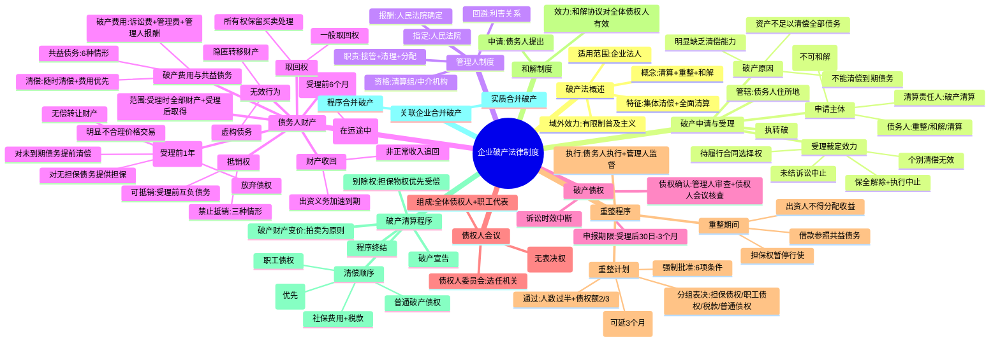

## 📍 章节定位

| 项目 | 信息 |
|------|------|
| **所属科目** | ⚖️ 经济法 |
| **难度等级** | ⭐⭐⭐ |
| **历年分值** | 4-5分 |
| **建议学时** | 5-6h |

## 📝 考情分析

本章是经济法的**次重点章节**，历年分值 4-5 分，客观题与案例分析题并重，案例分析题常单独命题或与公司法、合同法、担保法结合出综合题。

近年命题热点集中在：(1) 破产原因的认定（不能清偿到期债务 + 资产不足以清偿全部债务或明显缺乏清偿能力；强制执行未能清偿即可推定明显缺乏清偿能力）；(2) 破产申请的提出与受理（债权人的破产申请权、受理裁定的法律效力、个别清偿无效、保全措施解除与执行程序中止）；(3) 管理人制度（资格限制、与债权人或债务人的控股股东等存在夫妻关系等利害关系的回避）；(4) 债务人财产（出资义务的加速到期、非正常收入的追回）；(5) 破产撤销权与无效行为（受理前 1 年内 5 种可撤销行为、受理前 6 个月内的偏袒性清偿、隐匿转移财产和虚构债务的无效行为）；(6) 取回权（一般取回权、出卖人取回权、所有权保留买卖的处理、毁损灭失后代偿取回权与共益债务的认定）；(7) 抵销权（三种禁止抵销情形）；(8) 破产费用与共益债务（区分与清偿顺序）；(9) 破产债权申报（诉讼时效中断的重新计算）；(10) 债权人会议与债权人委员会（职工代表的列席权与表决权）；(11) 重整程序（重整期间担保权暂停行使、重整计划分组表决、强制批准条件）；(12) 破产清算（别除权、破产财产清偿顺序）。

本章学习关键在于**构建"破产程序全流程"知识链**：破产原因 → 申请受理 → 管理人指定 → 债务人财产清理 → 债权申报 → 债权人会议 → 重整/和解/清算 → 财产分配，并准确把握撤销权、取回权、抵销权、别除权等关键权利的行使条件。案例分析题常围绕撤销权行使、取回权认定、抵销权限制、清偿顺序展开，建议结合对比表系统记忆。

## 🧠 知识框架

## 📖 核心精讲

### 一、破产法律制度概述

**破产**是对丧失清偿能力的债务人，经法院审理，强制清算其全部财产，公平、有序清偿全体债权人的法律制度。广义的破产法不仅包括破产清算制度，还包括以挽救债务人、避免破产清算为目的的**重整、和解**等制度。

**破产清算与民事执行的区别**：

| 区别点 | 破产清算 | 民事执行 |
|--------|----------|----------|
| 债务人状态 | 已丧失清偿能力 | 通常具有清偿能力但拒不履行 |
| 清偿性质 | 全体债权人的**集体清偿** | 个别债权人的**个别清偿** |
| 执行范围 | 对债务人财产等法律关系的**全面清算** | 仅限于与所执行债务相关的财产 |
| 主体资格 | 清算完成后终结民事主体资格 | 不涉及主体资格消灭 |

**破产法的适用范围**：主体适用范围为所有**企业法人**；合伙企业、农民专业合作社、个人独资企业、资不抵债的民办学校等可参照适用破产清算程序。地域适用范围采取**有限制的普及主义**——破产程序对债务人在中华人民共和国领域外的财产发生效力。

### 二、破产申请与受理

#### （一）破产原因（必考）

根据《企业破产法》第 2 条，企业法人的破产原因是**不能清偿到期债务，并且资产不足以清偿全部债务或者明显缺乏清偿能力**。

| 破产原因类型 | 适用情形 |
|--------------|----------|
| 不能清偿到期债务 + 资产不足以清偿全部债务 | 主要适用于**债务人**提出破产申请且资不抵债情况通过形式审查即可判断的案件 |
| 不能清偿到期债务 + 明显缺乏清偿能力 | 主要适用于**债权人**提出破产申请和债务人提出申请但资不抵债状况不易判断的案件 |

> **"不能清偿到期债务"的认定**（同时存在）：①债权债务关系依法成立；②债务履行期限已经届满；③债务人未完全清偿债务。该规定实际上将"不能清偿"解释为"停止支付"，适用于债权人申请破产的情况，解决债权人举证困难问题。

> **"明显缺乏清偿能力"的认定**（账面资产虽大于负债，但存在下列情形之一）：①因资金严重不足或财产不能变现等原因，无法清偿债务；②法定代表人下落不明且无其他人员负责管理财产，无法清偿债务；③经人民法院强制执行，无法清偿债务；④长期亏损且经营扭亏困难，无法清偿债务；⑤导致债务人丧失清偿能力的其他情形。

> **重要考点**：只要债务人的**任一债权人**经人民法院强制执行未能得到清偿，其**每一个债权人**均有权提出破产申请，**不要求**申请人自己已经采取了强制执行措施。（2024 年案例分析题考点）

**重整申请的特殊原因**：债务人在尚未发生破产原因但**有明显丧失清偿能力可能**时，也可以依法申请重整（重整程序开始的原因更为宽松）。

#### （二）破产申请的提出

| 申请主体 | 可申请的程序 |
|----------|--------------|
| **债务人** | 重整、和解、破产清算 |
| **债权人** | 重整、破产清算（**不可申请和解**） |
| **清算责任人**（企业法人已解散但未清算或未清算完毕，资产不足以清偿债务的） | 破产清算 |
| **国务院金融监督管理机构**（金融机构有破产情形的） | 重整、破产清算 |

**破产案件的管辖**：地域管辖由**债务人住所地**人民法院管辖（债务人主要办事机构所在地；不明确或存在争议的，由注册登记地人民法院管辖）。

#### （三）破产申请的受理

**受理裁定的期限**：

| 情形 | 期限 |
|------|------|
| 债权人提出申请，债务人有异议的 | 自异议期满之日起 **10 日内**裁定 |
| 其他情形 | 自收到申请之日起 **15 日内**裁定 |
| 特殊情况需延长 | 经上一级人民法院批准可延长 **15 日** |

**受理裁定的法律效力**（必考）：

| 效力 | 内容 |
|------|------|
| **个别清偿无效** | 人民法院受理破产申请后，债务人对个别债权人的债务清偿无效（但以财产向债权人提供物权担保的，在担保物市场价值内的清偿不受限制） |
| **保全措施解除** | 有关债务人财产的保全措施应当解除（包括民事、行政、刑事保全措施） |
| **执行程序中止** | 有关债务人财产的执行程序应当中止（物权担保债权人对担保物的执行原则上不中止，除重整程序外） |
| **诉讼仲裁中止** | 已经开始而尚未终结的有关债务人的民事诉讼或仲裁应当中止；管理人接管后继续进行 |
| **待履行合同选择权** | 管理人有权决定解除或继续履行双方均未履行完毕的合同；自受理之日起 **2 个月内**未通知对方，或自收到对方催告之日起 **30 日内**未答复的，视为解除合同；决定继续履行的对方可要求提供担保 |
| **管辖变更** | 有关债务人的民事诉讼只能向受理破产申请的人民法院提起 |

### 三、管理人制度

**管理人的资格**：可由有关部门、机构的人员组成的清算组或者依法设立的律师事务所、会计师事务所、破产清算事务所等社会中介机构担任。

**不得担任管理人的情形**（利害关系回避）：

> **与债权人、债务人的控股股东、董事、监事、高级管理人员存在夫妻、直系血亲、三代以内旁系血亲或者近姻亲关系的**，认定为与本案有利害关系，不得担任管理人。（2024 年案例分析题考点）

**管理人的指定与报酬**：由人民法院指定；管理人报酬由人民法院确定。债权人会议和债权人委员会无权直接更换管理人，但债权人会议可委托债权人委员会申请人民法院更换管理人。

**管理人的职责**：接管债务人财产；调查债务人财产状况；决定债务人的内部管理事务；决定是否继续营业；管理和处分债务人财产；代表债务人参加诉讼或仲裁；提议召开债权人会议等。

### 四、债务人财产

#### （一）债务人财产的范围

我国立法采取**膨胀主义**：债务人财产包括破产申请受理时属于债务人的全部财产，以及破产申请受理后至破产程序终结前债务人取得的财产。债务人财产在破产宣告后改称为**破产财产**。

**不属于债务人财产的财产**（4 种）：①债务人基于仓储、保管、承揽、代销、借用、寄存、租赁等合同占有使用的他人财产；②债务人在所有权保留买卖中尚未取得所有权的财产；③所有权专属于国家且不得转让的财产；④其他依照法律、行政法规不属于债务人的财产。

#### （二）债务人财产的收回

**出资义务的加速到期**：债务人的出资人尚未完全履行出资义务的，管理人应当要求该出资人缴纳所认缴的出资，**不受出资期限的限制**。出资人以认缴出资尚未届至缴纳期限或违反出资义务已超过诉讼时效为由抗辩的，人民法院**不予支持**。（2025 年案例分析题考点）

**非正常收入的追回**：债务人的董事、监事和高级管理人员利用职权从企业获取的非正常收入和侵占的企业财产，管理人应当追回。非正常收入包括：①绩效奖金；②普遍拖欠职工工资情况下获取的工资性收入；③其他非正常收入。

> **工资债权的处理**（2024 年案例分析题考点）：因返还"普遍拖欠职工工资情况下获取的工资性收入"形成的债权，按照该企业**职工平均工资**计算的部分作为**拖欠职工工资**清偿；**高出**职工平均工资计算的部分，可以作为**普通破产债权**清偿。

#### （三）破产撤销权与无效行为（必考）

**破产无效行为**（《企业破产法》第 33 条，无时间限制）：

| 无效行为 | 内容 |
|----------|------|
| ① 为逃避债务而隐匿、转移财产 | 客观上构成逃避债务的后果即可，不要求主观上有逃避债务的目的 |
| ② 虚构债务或者承认不真实的债务 | — |

**破产撤销权**（《企业破产法》第 31 条，受理前 **1 年内**）：

| 可撤销行为 | 说明 |
|------------|------|
| ① 无偿转让财产的 | 包括无偿设置用益物权等其他无偿行为 |
| ② 以明显不合理的价格进行交易的 | 付款条件、付款期限等明显不合理的也可撤销；撤销后应返还财产或价款，债务人应返还价款的债务作为**共益债务**清偿 |
| ③ 对没有财产担保的债务提供财产担保的 | 对原无担保的债务补充设置物权担保或追加担保（设定债务同时提供担保的不包括在内） |
| ④ 对未到期的债务提前清偿的 | 但该债务在破产申请受理前已到期的，原则上不可撤销（除非发生在受理前 6 个月内且债务人有破产原因） |
| ⑤ 放弃债权的 | 包括放弃权利、不为诉讼时效中断、撤回诉讼等 |

**偏袒性清偿的撤销**（《企业破产法》第 32 条，受理前 **6 个月内**）：债务人有破产原因情形，仍对个别债权人进行清偿的，管理人有权请求撤销。但以下情形不可撤销：①债务人为维系基本生产需要而支付水费、电费等的；②债务人支付劳动报酬、人身损害赔偿金的；③使债务人财产受益的其他个别清偿；④债务人经诉讼、仲裁、执行程序对债权人进行的个别清偿（但恶意串通的除外）。

> **撤销权的行使主体**：由**管理人**统一行使。管理人不行使的，债权人可依据《民法典》撤销权规定提起诉讼，追回的财产归入债务人财产。

#### （四）取回权（必考）

**一般取回权**：人民法院受理破产申请后，债务人占有的不属于债务人的财产，该财产的权利人可以通过管理人取回。

| 取回权类型 | 规则 |
|------------|------|
| **一般取回权** | 权利人通过管理人取回原物；行使不受原约定条件、期限限制（重整程序除外）；应在破产财产变价方案或和解协议、重整计划草案提交债权人会议表决前提出 |
| **出卖人取回权**（在运途中） | 受理破产申请时，出卖人已将买卖标的物向买受人（债务人）发运，债务人尚未收到且未付清全部价款的，出卖人可取回在运途中的标的物；管理人可支付全部价款请求交付 |
| **代偿取回权** | 原物毁损灭失获得保险金、赔偿金、代偿物且能与债务人财产区分的，权利人可主张取回代偿物 |

> **原物毁损灭失的处理**（2024 年案例分析题考点）：债务人占有的他人财产毁损、灭失——①发生在破产申请受理**前**的，权利人因财产损失形成的债权作为**普通破产债权**清偿；②发生在破产申请受理**后**的，因管理人或相关人员执行职务导致权利人损害产生的债务，作为**共益债务**清偿。

**所有权保留买卖合同的处理**：标的物所有权未依法转移前一方破产的，管理人有权决定解除或继续履行。买受人已支付标的物总价款 **75% 以上**或第三人善意取得的，出卖人不得取回。

#### （五）抵销权（必考）

**抵销权**：债权人在破产申请受理前对债务人负有债务的，可以向管理人主张抵销。抵销权只能由债权人向管理人提出，管理人不得主动主张抵销（除非使债务人财产受益）。

**三种禁止抵销的情形**：

| 禁止情形 | 例外 |
|----------|------|
| ① 债务人的债务人在破产申请受理**后**取得他人对债务人的债权的 | 无例外 |
| ② 债权人**已知**债务人有不能清偿到期债务或破产申请的事实，对债务人**负担债务**的 | 债权人因法律规定或有破产申请 **1 年前**所发生的原因而负担债务的除外 |
| ③ 债务人的债务人**已知**债务人有不能清偿到期债务或破产申请的事实，对债务人**取得债权**的 | 债务人的债务人因法律规定或有破产申请 **1 年前**所发生的原因而取得债权的除外 |

> **股东出资不得抵销**：债务人的股东因欠缴出资或抽逃出资对债务人所负的债务，不得与其对债务人享有的破产债权抵销。股东滥用股东权利或关联关系损害公司利益对债务人所负的债务同样不得抵销。

#### （六）破产费用与共益债务（必考）

| 类型 | 内容 |
|------|------|
| **破产费用**（受理后发生） | ①破产案件的诉讼费用；②管理、变价和分配债务人财产的费用；③管理人执行职务的费用、报酬和聘用工作人员的费用 |
| **共益债务**（受理后发生） | ①因管理人或债务人请求对方当事人履行双方均未履行完毕的合同所产生的债务；②债务人财产受无因管理所产生的债务；③因债务人不当得利所产生的债务；④为债务人继续营业而应支付的劳动报酬和社会保险费用以及由此产生的其他债务；⑤管理人或相关人员执行职务致人损害所产生的债务；⑥债务人财产致人损害所产生的债务 |

> **清偿规则**：破产费用和共益债务由债务人财产**随时清偿**；不足以清偿所有的，**先行清偿破产费用**；不足以清偿所有破产费用或共益债务的，按照比例清偿；不足以清偿破产费用的，管理人应提请人民法院终结破产程序。

> **担保物权优先**：破产费用与共益债务优先于其他债权受偿，但仅限于债务人的**无担保财产**。对债务人特定财产享有担保权的权利人，仍对该特定财产享有优先于破产费用与共益债务受偿的权利。

### 五、破产债权

**破产债权**：人民法院受理破产申请时对债务人享有的债权。对破产人的特定财产享有担保权的债权也属于破产债权。

**债权申报期限**：自人民法院发布受理破产申请公告之日起计算，最短不得少于 **30 日**，最长不得超过 **3 个月**。

> **诉讼时效中断**：债务人对外享有债权的诉讼时效，自人民法院受理破产申请之日起中断。债务人无正当理由未对其到期债权及时行使权利，导致其对外债权在破产申请受理前 **1 年内**超过诉讼时效期间的，人民法院受理破产申请之日起**重新计算**该债权的诉讼时效期间。（2025 年案例分析题考点）

### 六、债权人会议

**债权人会议的组成**：依法申报债权的债权人为债权人会议的成员，均有表决权。债务人的职工代表**有权参加债权人会议，对有关事项发表意见**，但职工劳动债权能从破产财产中全额清偿时，职工代表**无表决权**。（2024 年案例分析题考点）

**债权人委员会**：为破产程序中的**选任机关**，由债权人会议根据案件具体情况决定是否设置（非必须设置）。债权人会议可授权债权人委员会决定是否继续债务人的营业等职权。

**债权人会议的表决**：债权人会议的决议，由出席会议的有表决权的债权人**过半数**通过，并且其所代表的债权额占**无财产担保债权总额的 1/2 以上**。

### 七、重整程序

**重整期间**：自人民法院裁定债务人重整之日起至重整程序终止。重整期间债务人的财产管理和营业事务可由债务人或管理人负责（经债务人申请、人民法院批准，债务人可在管理人监督下自行管理）。

**重整期间的特别效力**：

| 效力 | 内容 |
|------|------|
| **担保权暂停行使** | 对债务人特定财产享有的担保权暂停行使（但非重整必需的担保财产除外；担保物有损坏或价值明显减少可能的，担保权人可请求恢复行使） |
| **出资人不得分配收益** | 债务人的出资人不得请求投资收益分配 |
| **股权转让限制** | 债务人的董事、监事、高级管理人员未经人民法院同意不得向第三人转让其持有的债务人股权 |
| **借款优先受偿** | 为继续营业而借款的，可参照共益债务优先受偿，还可设定担保 |

**重整计划的制定**：由管理人或自行管理的债务人制作，应自裁定重整之日起 **6 个月内**提交，经请求有正当理由的可延期 **3 个月**。

**重整计划的表决**（分组表决）：

| 表决组 | 通过条件 |
|--------|----------|
| 对债务人特定财产享有担保权的债权组 | 出席会议的债权人**过半数**同意 + 所代表债权额占该组债权总额 **2/3 以上** |
| 职工债权组 | 同上 |
| 税款债权组 | 同上 |
| 普通债权组（可设小额债权组） | 同上 |
| 出资人组（涉及出资人权益调整时设置） | 参与表决的出资人所持表决权 **2/3 以上**通过 |

**重整计划的批准**：各表决组均通过的，自通过之日起 **10 日内**，债务人或管理人应向人民法院提出批准申请。人民法院应自收到申请之日起 **30 日内**裁定批准。

**重整计划的强制批准**（部分表决组未通过时）：至少有一组利益受到不利影响的组别通过，且符合 6 项条件（担保债权全额清偿+公平补偿+担保权未受实质性损害；职工债权和税款债权全额清偿；普通债权清偿比例不低于破产清算比例；出资人权益调整公平公正；公平对待同一表决组成员；经营方案具有可行性），人民法院可强制批准。

### 八、和解制度

**和解的特征**：和解申请只能由**债务人**提出；和解协议经债权人会议通过并经人民法院认可后，对全体债权人（包括未参加表决的债权人）均有约束力。

**和解协议的表决**：由出席会议的有表决权的债权人**过半数**同意，并且所代表的债权额占**无财产担保债权总额的 2/3 以上**。

### 九、破产清算程序

#### （一）破产宣告

人民法院受理破产清算申请后，第一次债权人会议上无人提出重整或和解申请的，管理人应提出宣告破产的申请。人民法院应自收到申请之日起 **7 日内**作出破产宣告裁定。债务人被宣告破产后，不得再转入重整程序或和解程序。

**破产宣告前终结破产程序的情形**：①第三人为债务人提供足额担保或为债务人清偿全部到期债务的；②债务人已清偿全部到期债务的。

#### （二）别除权

**别除权**：对破产人的特定财产享有担保权的权利人，对该特定财产享有优先受偿的权利。别除权人行使优先受偿权原则上不受破产清算与和解程序的限制，但在**重整程序中受到一定限制**。

别除权的基础权利包括抵押权、质权、留置权以及法定特别优先权（如船舶优先权、民用航空器优先权、建设工程价款优先受偿权等）。

> **别除权与破产债权的关系**：别除权之债权属于破产债权，其担保物属于破产财产。别除权人放弃优先受偿权或行使优先受偿权未能完全受偿的债权作为普通债权清偿。

#### （三）破产财产的清偿顺序（必考）

根据《企业破产法》第 113 条，破产财产在优先清偿破产费用和共益债务后，依照下列顺序清偿：

| 顺序 | 项目 |
|------|------|
| 优先清偿 | 破产费用和共益债务（随时清偿，优先于以下各顺序） |
| 第一顺序 | 破产人所欠职工的工资和医疗、伤残补助、抚恤费用，所欠的应当划入职工个人账户的基本养老保险、基本医疗保险费用，以及法律、行政法规规定应当支付给职工的补偿金 |
| 第二顺序 | 破产人欠缴的除前项规定以外的社会保险费用和破产人所欠税款 |
| 第三顺序 | 普通破产债权 |

> **同一顺序按比例分配**：破产财产不足以清偿同一顺序的清偿要求的，按照比例分配。

> **董监高工资的特殊处理**：破产企业的董事、监事和高级管理人员的工资按照该企业职工的**平均工资**计算，高出部分作为普通破产债权清偿。

> **税款滞纳金**：破产案件受理前因欠缴税款产生的滞纳金属于**普通破产债权**，不享有与欠缴税款相同的优先受偿地位；受理后滞纳金停止计算，不得作为破产债权清偿。

> **商品房消费者权利优先**：以居住为目的购买房屋并已支付全部价款的商品房消费者，其房屋交付请求权优先于建设工程价款优先受偿权、抵押权以及其他债权。

#### （四）破产程序的终结

**终结方式**（4 种）：①因和解、重整程序完成而终结；②因债务人以其他方式解决债务清偿问题而终结；③因债务人财产不足以支付破产费用而终结；④因破产财产分配完毕而终结。

管理人应自破产程序终结之日起 **10 日内**，持人民法院终结破产程序的裁定，向破产人的原登记机关办理注销登记。

### 十、关联企业合并破产

| 类型 | 说明 |
|------|------|
| **实质合并破产** | 多个关联企业成员因法人人格高度混同，区分各成员财产的成本过高以致无法区分，将其视为一个整体合并破产 |
| **程序合并破产** | 多个关联企业的破产案件由同一法院合并审理，但各企业仍保持独立的法人人格和财产界限 |

## 💡 典型例题

### 例题 1（2024 年案例分析题）

2023 年 9 月 15 日，债权人乙公司以甲公司不能清偿到期债务且明显缺乏清偿能力为由，申请甲公司破产。甲公司提出异议：债权人乙公司未就其债权申请强制执行，不能证明甲公司明显缺乏清偿能力。获悉，2023 年 8 月甲公司因拖欠丙公司货款被人民法院强制执行，仍无法完全清偿债务。

9 月 27 日，人民法院受理甲公司破产案件。在选择管理人时，发现丁律师事务所派出的一名律师与乙公司某董事为夫妻关系。

管理人履职过程中发现：在人民法院受理甲公司破产案件的前一周，甲公司执行董事王某利用职权，在普遍拖欠职工工资的情况下给自己发放了 2023 年 1-8 月工资。甲公司职工月平均工资为 4000 元，王某为 4 万元。管理人已依法追回发放给王某的工资。

**问题**：(1) 甲公司关于"债权人乙公司未就其债权申请强制执行，不能证明甲公司明显缺乏清偿能力"的主张是否成立？(2) 丁律师事务所能否担任本案破产管理人？(3) 王某因工资被追回而对公司享有的债权，属于何种破产债权？

**答案**：

(1) **不成立**。根据企业破产法律制度的规定，只要债务人的**任一债权人**经人民法院强制执行未能得到清偿，其**每一个债权人**均有权提出破产申请，并不要求申请人自己已经采取了强制执行措施。本案中甲公司因拖欠丙公司货款被强制执行仍无法完全清偿，即可认定甲公司明显缺乏清偿能力，乙公司有权申请甲公司破产。

(2) **不能**。根据规定，与债权人或债务人的控股股东、董事、监事、高级管理人员存在**夫妻、直系血亲、三代以内旁系血亲或者近姻亲关系**的，认定为与本案有利害关系，不得担任管理人。丁律师事务所派出的律师与乙公司某董事为夫妻关系，构成利害关系回避情形。

(3) 王某被追回的工资债权，按照甲公司职工平均工资（4000 元/月）计算的部分作为**拖欠职工工资**清偿；高出职工平均工资计算的部分（4 万-4 千=3.6 万/月），可以作为**普通破产债权**清偿。

### 例题 2（2024 年单选题）

根据企业破产法律制度的规定，下列关于债权人委员会的表述中，正确的是（　）。
A. 债务人的法定代表人有义务列席债权人委员会会议
B. 债权人委员会有权更换管理人
C. 破产重整程序启动后，应当设置债权人委员会
D. 债权人会议可以授权债权人委员会决定是否继续债务人的营业

**答案：D**

**解析**：①选项 A 错误，债务人的法定代表人有义务列席的是**债权人会议**，而非债权人委员会。②选项 B 错误，债权人会议可以委托债权人委员会行使申请人民法院更换管理人的职权，但**人民法院**有权决定更换管理人，债权人委员会本身无权更换。③选项 C 错误，债权人委员会为破产程序中的**选任机关**，由债权人会议根据案件具体情况决定是否设置，并非重整程序启动后必须设置。④选项 D 正确。

### 例题 3（2025 年案例分析题考点）

甲公司一项对外债权，因疏于管理，已于破产受理半年前超过诉讼时效，管理人主张重新计算该债权的诉讼时效。

**问题**：管理人主张重新计算该债权的诉讼时效是否成立？

**答案**：**成立**。根据《破产法司法解释（二）》第 19 条规定，债务人无正当理由未对其到期债权及时行使权利，导致其对外债权在破产申请受理前 **1 年内**超过诉讼时效期间的，人民法院受理破产申请之日起**重新计算**该债权的诉讼时效期间。本案中该债权在破产受理半年前（即 1 年内）超过诉讼时效，管理人有权主张重新计算。

### 例题 4（2024 年多项选择题）

2024 年 5 月 6 日，人民法院受理了甲公司的破产申请。管理人查明，2023 年 10 月 9 日，甲公司向乙公司出售价值 100 万元的设备，设备所有权自价款付清之日转移给乙公司。乙公司已按约支付第一期价款 80 万元，第二期价款按约应于 2024 年 12 月 1 日支付，管理人决定继续履行该合同。下列表述中，正确的有（　）。
A. 管理人无权取回设备
B. 乙公司有权解除合同
C. 该合同属于双方均未履行完毕的合同
D. 管理人有权要求乙公司提前清偿第二期价款

**答案：AC**

**解析**：①选项 A 正确，买受人已支付标的物总价款 75% 以上（80/100=80%）的，出卖人不得取回标的物。②选项 C 正确，该所有权保留买卖合同中双方均未履行完毕（买受人尚有第二期价款未付，出卖人所有权尚未转移），属于待履行合同，管理人有权决定解除或继续履行。③选项 B 错误，乙公司无权单方解除合同。④选项 D 错误，买受人破产时管理人决定继续履行合同的，原合同约定的支付期限在破产申请受理时视为到期，但本案是出卖人甲公司破产，乙公司作为买受人应按原合同约定支付价款，管理人不能要求提前清偿。

### 例题 5（案例分析题）

甲公司于 2024 年 3 月 1 日被人民法院受理破产申请。管理人调查发现：(1) 2023 年 6 月 1 日，甲公司无偿转让一批价值 200 万元的设备给关联方乙公司；(2) 2023 年 10 月 1 日，甲公司对原本没有财产担保的丙公司 300 万元债务提供了房产抵押担保；(3) 2023 年 12 月 1 日，甲公司在已具备破产原因的情况下，清偿了丁公司的到期债务 100 万元。

**问题**：管理人能否撤销上述行为？分别说明理由。

**答题思路**：

(1) **2023 年 6 月 1 日无偿转让设备的行为可以撤销**。根据《企业破产法》第 31 条规定，人民法院受理破产申请前 **1 年内**，债务人无偿转让财产的，管理人有权请求人民法院予以撤销。该行为发生在 2023 年 6 月 1 日，距 2024 年 3 月 1 日受理破产申请未超过 1 年，且属于无偿转让财产行为，管理人有权撤销。

(2) **2023 年 10 月 1 日对无财产担保债务提供担保的行为可以撤销**。根据《企业破产法》第 31 条规定，受理破产申请前 1 年内，债务人对没有财产担保的债务提供财产担保的，管理人有权请求撤销。该行为发生在受理前 1 年内，属于对原无担保的债务补充设置物权担保，管理人有权撤销。

(3) **2023 年 12 月 1 日对丁公司的清偿可以撤销**。根据《企业破产法》第 32 条规定，人民法院受理破产申请前 **6 个月内**，债务人有破产原因情形，仍对个别债权人进行清偿的，管理人有权请求撤销（但使债务人财产受益的除外）。该清偿行为发生在受理前 6 个月内，且甲公司当时已具备破产原因，管理人有权撤销。

## 🎯 记忆口诀

### 1. 破产原因
**"不能清偿到期债，资不抵债或缺乏能力"**
> 不能清偿到期债务 + 资产不足以清偿全部债务（资不抵债）/ 明显缺乏清偿能力。重整申请更宽松：有明显丧失清偿能力可能即可。

### 2. 破产申请主体与可申请程序
**"债务人三选，债权人两选（无和解），清算人仅清算"**
> 债务人可申请重整/和解/清算；债权人可申请重整/清算（不可申请和解）；清算责任人仅可申请破产清算。

### 3. 受理前 1 年内可撤销行为（5 项）
**"无偿低价担保提前放弃"**
> 无偿转让财产、以明显不合理价格交易、对无担保债务提供财产担保、对未到期债务提前清偿、放弃债权。

### 4. 破产无效行为
**"隐匿转移虚构债务"**
> 为逃避债务而隐匿、转移财产；虚构债务或者承认不真实的债务。无时间限制，自始无效。

### 5. 不得抵销的三种情形
**"受理后取得债权不抵，明知有破产事由负担债务不抵，明知有破产事由取得债权不抵"**
> ①债务人的债务人在受理后取得他人对债务人的债权；②债权人已知破产事由对债务人负担债务（1 年前原因除外）；③债务人的债务人已知破产事由对债务人取得债权（1 年前原因除外）。

### 6. 破产费用 vs 共益债务
**"费用为程序，共益为营业"**
> 破产费用：诉讼费 + 管理变价分配财产费 + 管理人执行职务费报酬。
> 共益债务：履行合同债务 + 无因管理债务 + 不当得利债务 + 继续营业劳动报酬社保 + 执行职务致人损害 + 财产致人损害。

### 7. 清偿顺序
**"费共职税普"**
> 破产费用和共益债务（优先）→ 职工债权（工资医疗伤残抚恤社保补偿金）→ 社保费用和税款 → 普通破产债权。

### 8. 重整计划表决组
**"担职税普出"**
> 担保债权组、职工债权组、税款债权组、普通债权组（可设小额债权组）、出资人组（涉及出资人权益调整时）。

### 9. 重整计划通过条件
**"人过半，债三分之二"**
> 出席会议的债权人过半数同意 + 所代表债权额占该组债权总额 2/3 以上。

### 10. 取回权毁损灭失的处理
**"受理前普通债权，受理后共益债务"**
> 原物毁损灭失发生在受理前 → 普通破产债权；发生在受理后 → 共益债务。

### 11. 所有权保留买卖 75% 规则
**"七五以上不可取回"**
> 买受人已支付标的物总价款 75% 以上的，出卖人不得取回标的物。

### 12. 管理人利害关系回避
**"夫妻直系三代旁系近姻亲"**
> 与债权人、债务人的控股股东、董事、监事、高级管理人员存在夫妻、直系血亲、三代以内旁系血亲或近姻亲关系的，不得担任管理人。

## ✅ 同步练习

### 一、单项选择题

1. 根据企业破产法律制度的规定，下列关于破产原因的表述中，正确的是（　）。
A. 债务人不能清偿到期债务即可申请破产
B. 债务人资产不足以清偿全部债务即可申请破产
C. 债务人不能清偿到期债务并且资产不足以清偿全部债务或者明显缺乏清偿能力的，具备破产原因
D. 债权人申请破产须证明债务人资不抵债

2. 根据企业破产法律制度的规定，债权人可以申请债务人进行的程序是（　）。
A. 重整、和解、破产清算
B. 重整、破产清算
C. 和解、破产清算
D. 仅破产清算

3. 根据企业破产法律制度的规定，人民法院受理破产申请后，债务人对个别债权人的债务清偿的效力为（　）。
A. 有效
B. 可撤销
C. 无效
D. 效力待定

4. 根据企业破产法律制度的规定，人民法院受理破产申请前（　）内，债务人无偿转让财产的，管理人有权请求人民法院予以撤销。
A. 6 个月
B. 1 年
C. 2 年
D. 3 年

5. 根据企业破产法律制度的规定，下列涉及债务人财产的行为中，属于无效行为的是（　）。
A. 以明显不合理的价格进行交易
B. 对没有财产担保的债务提供财产担保
C. 对未到期的债务提前清偿
D. 为逃避债务而隐匿、转移财产

6. 根据企业破产法律制度的规定，债权人已知债务人有不能清偿到期债务的事实，对债务人负担债务的，下列关于抵销权的表述中，正确的是（　）。
A. 可以抵销
B. 不得抵销，但因法律规定或有破产申请 1 年前所发生的原因而负担债务的除外
C. 一律不得抵销
D. 经管理人同意可以抵销

7. 根据企业破产法律制度的规定，下列关于破产费用与共益债务清偿的表述中，正确的是（　）。
A. 破产费用和共益债务按照比例同时清偿
B. 先清偿共益债务，后清偿破产费用
C. 先清偿破产费用，后清偿共益债务
D. 由债权人会议决定清偿顺序

8. 根据企业破产法律制度的规定，对破产人的特定财产享有担保权的权利人，对该特定财产享有优先受偿的权利。此项权利在破产法理论上称为（　）。
A. 取回权
B. 抵销权
C. 别除权
D. 撤销权

9. 根据企业破产法律制度的规定，破产财产在优先清偿破产费用和共益债务后，第一顺序清偿的是（　）。
A. 普通破产债权
B. 破产人所欠税款
C. 破产人所欠职工的工资和相关费用
D. 破产人欠缴的社会保险费用

10. 根据企业破产法律制度的规定，重整计划草案应当自人民法院裁定债务人重整之日起（　）内提交。
A. 3 个月
B. 6 个月
C. 9 个月
D. 1 年

11. 根据企业破产法律制度的规定，下列关于重整期间担保权的表述中，正确的是（　）。
A. 担保权不受影响，可以正常行使
B. 对债务人特定财产享有的担保权暂停行使
C. 担保权一律暂停行使，无例外
D. 担保权由管理人决定是否行使

12. 根据企业破产法律制度的规定，买受人已支付标的物总价款（　）以上的，出卖人不得取回所有权保留买卖的标的物。
A. 50%
B. 60%
C. 75%
D. 80%

### 二、案例分析题

甲公司因不能清偿到期债务，债权人 A 公司于 2024 年 4 月 1 日向人民法院申请甲公司破产清算。人民法院于 2024 年 4 月 20 日受理破产申请并指定了管理人。管理人调查发现以下情况：

(1) 2023 年 5 月，甲公司将一套价值 500 万元的厂房无偿转让给其关联方 B 公司。
(2) 2023 年 8 月，甲公司在已具备破产原因的情况下，清偿了 C 公司的到期债务 200 万元。
(3) 2023 年 11 月，甲公司对原本没有财产担保的 D 公司 300 万元债务提供了机器设备抵押担保。
(4) 甲公司占有的 E 公司一批原材料，在 2024 年 5 月（受理后）因管理人管理不善全部毁损，E 公司请求赔偿。

要求：根据上述资料，分别回答下列问题：
(1) 管理人能否撤销甲公司向 B 公司无偿转让厂房的行为？说明理由。
(2) 管理人能否撤销甲公司对 C 公司的清偿行为？说明理由。
(3) 管理人能否撤销甲公司对 D 公司债务提供担保的行为？说明理由。
(4) 甲公司对 E 公司的赔偿债务应如何处理？说明理由。

**参考答案**：

**一、单项选择题**
1. C（破产原因是不能清偿到期债务 + 资产不足以清偿全部债务或明显缺乏清偿能力）
2. B（债权人可申请重整和破产清算，不可申请和解）
3. C（受理后债务人对个别债权人的债务清偿无效）
4. B（受理前 1 年内无偿转让财产可撤销）
5. D（隐匿转移财产和虚构债务为无效行为，无时间限制；ABC 为可撤销行为，须在受理前 1 年内）
6. B（已知破产事由负担债务不得抵销，但 1 年前原因除外）
7. C（先清偿破产费用，后清偿共益债务；不足的按比例清偿）
8. C（别除权——担保物权人对特定财产的优先受偿权）
9. C（第一顺序为职工工资和相关费用）
10. B（重整计划草案应在裁定重整之日起 6 个月内提交）
11. B（重整期间对债务人特定财产享有的担保权暂停行使，但非重整必需的除外）
12. C（买受人已支付总价款 75% 以上的，出卖人不得取回）

**二、案例分析题**

(1) **可以撤销**。根据《企业破产法》第 31 条规定，人民法院受理破产申请前 **1 年内**，债务人无偿转让财产的，管理人有权请求人民法院予以撤销。甲公司于 2023 年 5 月无偿转让厂房，距 2024 年 4 月 20 日受理破产申请未超过 1 年（约 11 个月），且属于无偿转让财产行为，管理人有权撤销。

(2) **可以撤销**。根据《企业破产法》第 32 条规定，人民法院受理破产申请前 **6 个月内**，债务人有破产原因情形，仍对个别债权人进行清偿的，管理人有权请求撤销（使债务人财产受益的除外）。甲公司于 2023 年 8 月清偿 C 公司 200 万元，距 2024 年 4 月 20 日受理未超过 6 个月前（约 8 个月——注意：此处超过 6 个月，**不可撤销**）。

**更正**：(2) **不可以撤销**。甲公司于 2023 年 8 月清偿 C 公司，距 2024 年 4 月 20 日受理破产申请已超过 6 个月（约 8 个月），不满足受理前 6 个月内的条件，管理人对该清偿行为**无权撤销**。但若甲公司清偿时已具备破产原因且 C 公司与甲公司存在关联关系等恶意情形，可考虑通过其他途径处理。

(3) **可以撤销**。根据《企业破产法》第 31 条规定，受理破产申请前 1 年内，债务人对没有财产担保的债务提供财产担保的，管理人有权请求撤销。甲公司于 2023 年 11 月对 D 公司原无担保的债务提供机器设备抵押担保，距 2024 年 4 月 20 日受理未超过 1 年（约 5 个月），属于对原无担保债务提供财产担保的行为，管理人有权撤销。

(4) **作为共益债务清偿**。根据《破产法司法解释（二）》规定，债务人占有的他人财产毁损、灭失发生在破产申请受理**后**的，因管理人或相关人员执行职务导致权利人损害产生的债务，作为**共益债务**清偿。E 公司的原材料于 2024 年 5 月（受理后）因管理人管理不善毁损，甲公司对 E 公司的赔偿债务应作为共益债务，由债务人财产随时清偿，优先于普通破产债权。
