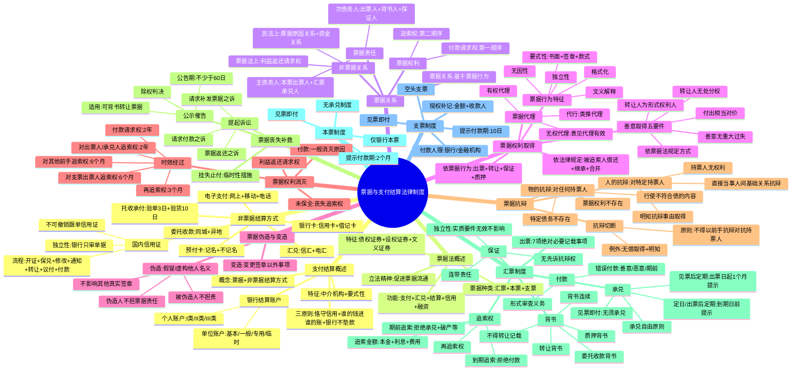

## 1. 章节定位

| 项目 | 信息 |
|------|------|
| 所属科目 | 经济法 |
| 难度等级 | 3 |
| 历年分值 | 4-5分 |
| 建议学时 | 5-6h |

## 2. 考情分析

本章是经济法的**次重点章节**，历年分值 4-5 分，客观题与案例分析题并重，案例分析题常单独命题，是近年必考的案例分析题章节之一。

近年命题热点集中在：(1) 票据权利的取得（依票据行为取得、依法律规定取得、善意取得的五项要件）；(2) 票据行为的无因性与独立性（基础关系瑕疵不影响票据行为效力、各票据行为独立生效）；(3) 票据权利善意取得（转让人为形式权利人但无处分权、受让人善意无重大过失、付出相当对价）；(4) 票据伪造与变造（被伪造人不承担票据责任、不影响其他真实签章效力）；(5) 票据抗辩切断（物的抗辩与人的抗辩、抗辩切断的两种例外）；(6) 票据保证（独立性——被保证人债务因实质要件欠缺无效时不影响保证效力、连带责任、不享有先诉抗辩权）；(7) 汇票的承兑与追索权（承兑自由原则、期前追索权与到期追索权、追索金额范围、再追索权）；(8) 票据贴现（国家特许经营、无因性不适用、善意取得救济）；(9) 票据时效（付款请求权 2 年、追索权 6 个月、再追索权 3 个月）；(10) 票据丧失补救（挂失止付、公示催告、提起诉讼）。

本章学习关键在于**构建"票据关系全流程"知识链**：票据行为（出票/背书/承兑/保证）→ 票据权利（付款请求权/追索权）→ 票据抗辩（物的抗辩/人的抗辩/抗辩切断）→ 票据消灭（付款/时效/保全失败）→ 票据救济（挂失止付/公示催告/诉讼）。案例分析题常围绕票据保证独立性、善意取得、抗辩切断、贴现效力展开，建议结合 2024、2025 年真题系统掌握。

## 3. 知识框架

## 4. 核心精讲

### 一、支付结算概述

#### （一）支付结算的概念与方式

**支付结算**是指单位、个人在社会经济活动中使用票据、银行卡、汇兑、托收承付、委托收款、信用证、电子支付等结算方式进行货币给付及资金清算的行为。货币结算分为**现金结算**和**非现金结算**；我国实行现金管理制度，除按规定可使用现金的情形外，单位之间的货币结算都需通过银行转账进行。

**支付结算的特征**：

| 特征 | 内容 |
|------|------|
| 必须通过法律规定的中介机构进行 | 银行（含农村信用社）是主要中介机构；非银行金融机构和其他单位未经中国人民银行批准不得经营支付结算业务；依法设立并取得支付业务许可的有限责任公司或股份有限公司可从事支付业务 |
| 必须遵循法律规定的特定形式要求 | 必须使用按中国人民银行统一规定印制的票据凭证和结算凭证；未使用统一印制票据的，**票据无效**；未使用统一格式结算凭证的，银行不予受理 |

**支付结算的三原则**（《支付结算办法》2024年修正第16条）：

| 原则 | 内容 |
|------|------|
| 恪守信用，履约付款 | 承担付款义务的一方应按约定金额、时间和方式支付；银行应以善意且符合规定的正常操作程序审查票据和结算凭证 |
| 谁的钱进谁的账，由谁支配 | 银行应遵循委托人意志，准确及时办理支付结算；除法律另有规定外，银行不得为任何单位或个人查询、冻结、扣款 |
| 银行不垫款 | 银行只是中介机构，不承担垫付款项责任；账户内须有足够资金保证支付 |

#### （二）银行结算账户

**银行结算账户的种类**（按存款人不同）：

| 类型 | 适用对象 | 子类 |
|------|----------|------|
| 单位银行结算账户 | 以单位名称开立（个体工商户以字号或经营者姓名开立纳入单位管理） | 基本存款账户、一般存款账户、专用存款账户、临时存款账户 |
| 个人银行结算账户 | 自然人因投资、消费、结算等开立 | I类户、II类户、III类户 |

**单位银行结算账户四类的对比**：

| 账户类型 | 功能特点 | 特殊要求 |
|----------|----------|----------|
| 基本存款账户 | 办理日常转账结算和现金收付的主办账户 | 一个单位只能开立一个；企业由核准制改为备案制 |
| 一般存款账户 | 借款转存、借款归还和其他结算 | 可现金缴存，**不得现金支取**；在基本户开户行以外的银行开立 |
| 专用存款账户 | 特定资金专项管理和使用 | 适用于基本建设资金、证券交易结算资金等15种资金 |
| 临时存款账户 | 临时需要并在规定期限内使用 | 有效期最长**不得超过2年**；建筑施工可按项目合同数开立 |

**个人银行账户分类管理**：

| 类型 | 功能 |
|------|------|
| I类户 | 存款、购买投资理财产品、转账、消费缴费、支取现金（全功能） |
| II类户 | 存款、购买理财、限额消费缴费、限额向非绑定账户转出；经面对面确认可存取现金、非绑定账户转入 |
| III类户 | 限额消费缴费、限额向非绑定账户转出 |

同一银行法人为同一个人开立II类户、III类户的数量原则上分别不得超过**5个**。

### 二、票据与票据法概述

#### （一）票据的概念和种类

**票据**是出票人签发的、承诺由本人或者委托他人在见票时或者在票载日期无条件支付一定金额给持票人的有价证券。我国《票据法》第2条规定的"票据"是**汇票、本票和支票**的合称。

| 票据种类 | 定义 | 出票人责任 |
|----------|------|------------|
| 汇票 | 出票人签发，委托付款人在见票时或指定日期无条件支付确定金额给收款人或持票人的票据 | 委托票据，担保承兑和付款 |
| 本票 | 出票人签发，承诺自己在见票时无条件支付确定金额给收款人或持票人的票据 | 自付票据，自己承担付款义务 |
| 支票 | 出票人签发，委托办理支票存款业务的银行或其他金融机构在见票时无条件支付确定金额给收款人或持票人的票据 | 委托票据，付款人限于银行 |

#### （二）票据的特征

票据作为有价证券的独特性质：

| 特征 | 内容 |
|------|------|
| 债权证券和金钱证券 | 持票人对票据债务人享有请求支付一定金额的债权 |
| 设权证券 | 权利由出票这种票据行为创设，没有票据就没有票据权利 |
| 文义证券 | 票据权利义务严格依照票据记载的文义而定，文义之外的理由不得作为根据；保护善意持票人 |

**纸质票据与电子票据**：自2017年1月1日起，单张出票金额在300万元以上应全部通过电票办理；自2018年1月1日起，单张出票金额在100万元以上的商业汇票原则上全部通过电子商业汇票办理。2024年起，**中国票据业务系统**取代电子商业汇票系统，整合纸质票据和电子票据交易。

> **电子票据的特殊规则**：①票据行为只能在票据业务系统中实施；②签章只能是电子签名；③票据交付变为电子交付；④出票或背书记载"不得转让"的，后续无法再背书转让；⑤系统自动发起付款提示，影响遵期提示规则的适用。

#### （三）票据法的立法精神——促进票据流通

票据法的特殊设计旨在**促进票据流通**，通过两种方法保护票据受让人利益：

| 方法 | 具体制度 |
|------|----------|
| 使受让人迅速取得权利 | 票据凭证格式严格规定、背书或交付转让无须通知债务人、易于辨别前手是否有权转让 |
| 使受让人安全取得权利 | 票据行为独立性、善意取得制度、抗辩切断制度、追索权制度、利益偿还请求权、公示催告制度 |

### 三、票据关系

#### （一）票据关系与非票据关系

**票据关系**是基于票据行为而发生的、以请求支付票据金额为内容的债权债务关系。**非票据关系**是与票据有密切联系但并非基于票据行为的法律关系。

| 非票据关系类型 | 内容 |
|----------------|------|
| 票据法上的非票据关系 | 如利益返还请求权关系 |
| 民法上的非票据关系（票据基础关系） | 票据原因关系（买卖、租赁等）、票据资金关系（出票人与付款人之间的资金安排） |

#### （二）票据权利

**票据权利**是持票人基于票据行为取得的、向票据债务人请求支付票据金额的权利，包括**付款请求权**和**追索权**两个方面。

| 权利类型 | 性质 | 对象 |
|----------|------|------|
| 付款请求权 | 第一顺序权利 | 主债务人（本票出票人、汇票承兑人） |
| 追索权 | 第二顺序权利 | 偿还义务人（出票人、背书人、保证人、承兑人） |

#### （三）票据责任

**票据责任**是票据债务人基于票据行为向持票人支付票据金额的义务。

| 债务人类型 | 包括 | 特点 |
|------------|------|------|
| 主债务人 | 本票出票人、汇票承兑人 | 最后持票人应首先对其请求付款；为最终偿还义务人，不享有再追索权 |
| 次债务人 | 汇票出票人、背书人及保证人；本票背书人及保证人；支票出票人、背书人及保证人 | 只能在追索关系中对其主张追索权；偿还后可向前手再追索 |

> **重要提示**：支票的付款人以及未经承兑的汇票付款人，**并非票据义务人**，仅是票据关系的"关系人"——未在票据上签章，不承担票据债务。

### 四、票据权利的取得

#### （一）票据权利的取得原因

| 取得原因 | 具体情形 |
|----------|----------|
| 依票据行为取得 | ①依出票行为；②依转让（转让背书、空白票据单纯交付、善意取得）；③依票据保证；④依票据质押 |
| 依法律规定取得 | ①被追索人（含保证人）偿还后取得；②因继承、法人合并或分立、税收等原因取得 |

#### （二）票据行为的特征

| 特征 | 内容 |
|------|------|
| 要式性 | 必须书面记载于票据、行为人必须签章、每种行为有特定款式（绝对必要记载事项、相对必要记载事项、任意记载事项等） |
| 文义解释为主 | 原则上仅使用文义解释（《票据法》第4条第1、3款） |
| 格式化 | 当事人只能按法定要求作为，法律效果明确 |
| 独立性 | 各票据行为独立生效，一个无效原则上不影响其他（《票据法》第6条、第14条第2款、第49条） |
| 无因性 | 票据基础关系瑕疵不影响票据行为效力 |

**票据行为款式（记载事项）分类**：

| 记载事项类型 | 未记载/记载的后果 |
|--------------|-------------------|
| 绝对必要记载事项 | 未记载则票据行为**无效**（如票据金额） |
| 相对必要记载事项 | 未记载则依法确定（如付款日期、付款地） |
| 任意记载事项 | 不记载不生效，记载则发生票据法效力（如"不得转让"） |
| 记载不生票据法上效力事项 | 不产生票据法效力，但可能产生民法效力（如背书附条件） |
| 记载无效事项 | 该记载无效但不影响票据行为效力（如免除担保责任记载） |
| 记载使票据行为无效事项 | 导致整个票据行为无效（如出票附条件、承兑附条件） |

#### （三）票据行为的代理

**票据代理的生效要件**：①须明示本人（被代理人）名义并表明代理意思；②代理人签章；③代理人有代理权。

**无权代理的处理**：

| 情形 | 法律效果 |
|------|----------|
| **不符合表见代理要件**（相对人明知或因过失不知） | 代理行为对被代理人不生效力；相对人不能取得票据权利；**无权代理人承担票据责任**（《票据法》第5条第2款） |
| 符合表见代理要件 | 相对人取得票据权利；**被代理人承担票据责任**；无权代理人不承担票据责任 |

> **票据代行**：行为人在票据上记载他人之名或盖他人之章，未签署自己姓名。类推适用代理规定——有授权则本人承担，无授权则构成票据伪造。

#### （四）票据权利的善意取得（必考）

**善意取得**是指无处分权人处分他人票据权利，受让人依票据法规定的转让方式取得票据，并且善意且无重大过失，则可取得票据权利的制度。

**善意取得的五项要件**：

| 要件 | 内容 |
|------|------|
| ① **转让人是形式上的票据权利人** | 转让人须为票据记载的最后持票人（收款人或被背书人） |
| ② **转让人没有处分权** | 如前手无完全民事行为能力、意思表示不真实、无权代理且不符合表见代理、票据被伪造等 |
| ③ **受让人依票据法规定的转让方式取得** | 基于背书转让方式取得，背书须符合一般形式和实质要件 |
| ④ **受让人善意且无重大过失** | 不知转让人无处分权，且非因重大过失不知情；受让人无义务审查转让人与前手之间的法律关系 |
| ⑤ **受让人付出相当对价** | 无偿取得票据的受让人权利不得优于前手（《票据法》第11条） |

**善意取得的法律后果**：①受让人取得票据权利；②原权利人丧失票据权利；③无权处分人以自己名义签章的承担背书人票据责任，未以自己名义签章的（伪造人）不承担票据责任；④原权利人未在票据上签章的不承担票据责任，曾签章的原则上承担票据责任。

#### （五）票据基础关系对票据行为效力的影响

**票据行为的无因性**：最高人民法院近年来明确承认票据行为无因性理论——**票据基础关系的瑕疵不影响票据行为的效力**，但适用范围仍有限制。

| 基础关系瑕疵情形 | 票据行为效力 |
|------------------|--------------|
| 原因关系合同未成立、无效或被撤销 | 票据行为**有效** |
| 票据权利买卖（票据贴现形式） | 构成"票据贴现"，受特许经营限制；贴现人无资格的，转让背书无效，无因性不适用 |

> **无因性的适用限制**：票据贴现属于国家特许经营业务，只有经批准的金融机构才有资格从事。其他组织和个人从事票据贴现业务，转让背书行为无效，贴现款和票据应当相互返还。但贴现人又将票据背书转让时，符合善意取得要件的，新持票人取得票据权利。

**赠与等无偿原因的特别规则**：《票据法》第11条第1款承认赠与等无偿原因可以是票据授受的合法原因，但**持票人所取得的票据权利不得优于其前手**。

### 五、票据的伪造和变造

**票据伪造**是假冒或虚构他人名义而为的票据行为。

| 伪造类型 | 法律效果 |
|----------|----------|
| 假冒他人名义 | 类似于无权代理；狭义无权代理则票据行为不生效力；符合表见代理要件则票据行为有效 |
| 虚构他人名义 | 票据行为**无效** |

> **伪造的法律后果**（《票据法》第14条第2款）：①被伪造人**不承担**票据责任；②伪造人未以自己名义签章，**不承担票据责任**（但可能承担刑事、行政、民事赔偿责任）；③**不影响票据上其他真实签章的效力**（体现票据行为独立性）。

**票据变造**是没有变更权限的人变更票据上签章以外的其他记载事项的行为。由于电子商业票据业务的推广，票据变造的情形已极为罕见。

### 六、票据权利的消灭

#### （一）追索权因未进行票据权利保全而消灭

**票据权利的保全**包括**遵期提示**和**依法取证**：

| 保全行为 | 具体要求 | 未进行的后果 |
|----------|----------|--------------|
| 遵期提示承兑 | 定日付款/出票后定期付款：到期日前提示；见票后定期付款：出票日起**1个月**内提示 | 丧失对**出票人之外**的前手的追索权（仍保留对出票人的追索权） |
| 遵期提示付款 | 见票即付汇票：出票日起1个月内；远期汇票：到期日起10日内；本票：出票日起2个月内；支票：出票日起10日内 | 丧失对**出票人、汇票承兑人之外**的前手的追索权 |
| 依法取证 | 取得拒绝证明或退票理由书；付款人破产或被责令终止业务的，以相关文书替代 | 未取得证明或行使追索权时不出示的，不能行使对前手的追索权（仍享有对出票人、承兑人的追索权） |

#### （二）票据时效（必考）

| 权利类型 | 时效期间 | 起算点 |
|----------|----------|--------|
| 持票人对**汇票承兑人、本票出票人**的付款请求权及追索权 | 2年 | 票据到期日；见票即付的自出票日 |
| 持票人对**支票出票人**的追索权 | 6个月 | 出票日 |
| 持票人对**其他前手**的追索权 | 6个月 | 被拒绝承兑或被拒绝付款之日 |
| **被追索人对前手**的再追索权 | 3个月 | 清偿日或被提起诉讼之日 |

> **票据时效的中止、中断**（《票据法司法解释》第19条）：票据时效可发生中断、中止，但**只对发生时效中断事由的当事人有效**，持票人对其他票据债务人的时效计算不受影响。

> **利益返还请求权**（《票据法》第18条）：持票人因超过票据权利时效或因票据记载事项欠缺而丧失票据权利的，仍享有民事权利，可请求出票人或承兑人返还与未支付的票据金额相当的利益。该权利**非票据权利**，适用民法上诉讼时效的一般规定。

### 七、票据抗辩（必考）

#### （一）物的抗辩（绝对抗辩）

**物的抗辩**是票据所记载的债务人可以对**任何持票人**主张的抗辩：

| 情形 | 内容 |
|------|------|
| 票据所记载的全部票据权利均不存在 | 出票行为因法定形式要件欠缺无效；票据权利已消灭（如已全额付款） |
| 特定债务人的债务不存在 | 签章人为无/限制民事行为能力人；狭义无权代理的本人；票据伪造的被伪造人；票据变造前签章的债务人；对特定债务人的票据时效经过；对特定债务人的追索权因未保全而丧失 |
| 票据权利的行使不符合债的内容 | 行使时间、地点、方式不符合记载或法律规定；除权判决后持票据（而非除权判决）主张权利 |

#### （二）人的抗辩（相对抗辩）

**人的抗辩**是票据债务人仅可对**特定持票人**主张的抗辩：

| 情形 | 内容 |
|------|------|
| 持票人不享有票据权利 | 票据上仍有权利，但占有人并非真正权利人 |
| 持票人不能证明其权利 | 背书不连续且不能证明中断原因 |
| 背书记载"不得转让" | 记载人对其直接后手的后手不承担票据责任 |
| 直接当事人间的基础关系抗辩 | 《票据法》第13条第2款：票据债务人可对不履行约定义务的与自己有直接债权债务关系的持票人抗辩 |
| 持票人未给付对价而取得票据 | 无偿取得票据的，权利不得优于前手（《票据法》第11条） |
| 持票人明知抗辩事由而取得票据 | 《票据法》第13条第1款：明知票据债务人与出票人或与前手之间存在抗辩事由仍受让的，可对其主张抗辩（要求"明知"，非"应知"） |

#### （三）抗辩切断制度（必考）

**抗辩切断**（《票据法》第13条第1款）：除上述两种例外情形外，票据债务人**不得**以自己与出票人或与持票人前手之间的抗辩事由对抗持票人。

| 抗辩切断的两种例外（可对抗持票人） |
|------------------------------------|
| ① 持票人**无偿取得**票据（前手权利未受抗辩切断保护时） |
| ② 持票人**明知**抗辩事由而取得票据 |

> **抗辩切断与善意取得的关系**：两者目的均在于保障持票人利益，但是不同制度。善意取得处理的是无权处分下受让人是否取得权利的问题；抗辩切断处理的是前手间基础关系抗辩能否对抗持票人的问题。善意取得的构成要件（善意无重大过失、给付相当对价）使善意受让人必然受到抗辩切断保护。

### 八、票据丧失及补救

| 救济方式 | 性质 | 适用范围 | 关键时限 |
|----------|------|----------|----------|
| 挂失止付 | 临时性措施 | 已承兑的商业汇票、支票、填明"现金"和代理付款人的银行汇票、填明"现金"的银行本票 | 付款人收到通知书之日起**12日内**未收到法院止付通知的，自第13日起挂失止付失效 |
| 公示催告 | 非讼程序 | 可以背书转让的票据（填明"现金"的银行汇票、银行本票、现金支票不得申请） | 公告期不得少于**60日**，且届满日不得早于票据付款日后15日；申请人应在届满次日起**1个月内**申请除权判决 |
| 提起民事诉讼 | 诉讼程序 | 票据返还之诉、请求补发票据之诉、请求付款之诉 | 利害关系人因正当理由未申报权利的，自知道或应知判决公告之日起**1年内**可起诉请求撤销除权判决 |

> **挂失止付非公示催告前置程序**：失票人可不申请挂失止付，直接向法院申请公示催告。申请挂失止付的当事人，必须在通知挂失止付后**3日内**向法院申请公示催告或起诉。

### 九、汇票的具体制度

#### （一）汇票的出票

**汇票出票的绝对必要记载事项**（《票据法》第22条，7项）：①表明"汇票"的字样；②无条件支付的委托；③确定的金额；④付款人名称；⑤收款人名称；⑥出票日期；⑦出票人签章。未记载任一事项的，汇票无效。

**银行汇票的特殊金额**：银行汇票存在三个金额——出票金额、实际结算金额、多余金额。其中**实际结算金额**是票据法意义上的票据金额。

#### （二）汇票的背书

**背书**包括转让背书、委托收款背书和质押背书。

**转让背书禁止的两类情形**：

| 禁止情形 | 效果 |
|----------|------|
| 出票人记载"不得转让" | 汇票不得转让；收款人背书转让的，背书行为无效，取得票据的人不取得票据权利（《票据法司法解释》第47条、第52条） |
| 法定的转让背书禁止 | 填明"现金"的银行汇票不得背书转让；期后背书禁止 |

> **背书人记载"不得转让"的效力**（与出票人记载不同）：背书人记载"不得转让"的，**不影响后手背书行为的效力**，但背书人仅对其直接后手承担票据责任，不对其直接后手的后手承担票据责任（《票据法》第34条、《票据法司法解释》第50条、第53条）。

**转让背书的效力**：

| 效力 | 内容 |
|------|------|
| 权利转移效力 | 被背书人取得票据权利，原权利人权利消灭；并有抗辩切断的适用 |
| 权利担保效力 | 背书人对所有后手承担担保承兑和担保付款责任；例外：记载"不得转让"的、回头背书 |
| 权利证明效力 | 背书连续证明票据权利（《票据法》第31条）；第一背书人应为收款人，最后持有人应为最后被背书人 |

> **回头背书的追索限制**（《票据法》第69条）：持票人为出票人的，对其前手无追索权；持票人为背书人的，对其后手无追索权。

#### （三）汇票的承兑

**承兑**是远期汇票的付款人在票据正面作出承诺在到期日无条件支付票据金额的记载并签章的票据行为。

| 汇票类型 | 是否需提示承兑 | 提示承兑期限 |
|----------|----------------|--------------|
| 见票即付 | 无须承兑 | — |
| 定日付款、出票后定期付款 | 应当提示承兑 | 到期日前 |
| 见票后定期付款 | 应当提示承兑 | 出票日起**1个月**内 |

**承兑的程序**：①持票人提示承兑；②付款人签发回单；③付款人自收到汇票之日起**3日内**承兑或拒绝承兑。

> **承兑自由原则**：付款人是否承兑是其自由。即便付款人与出票人之间有承兑协议，付款人拒绝承兑的，仍发生拒绝承兑的法律效果；其违约责任属民法问题。

**承兑的效力**：①付款人成为票据债务人（承兑人），是汇票上的**主债务人**；②持票人取得对承兑人的付款请求权；③持票人即使未按期提示付款或依法取证，**也不丧失对承兑人的追索权**。

> **承兑附条件的效力**（《票据法》第43条）：承兑附有条件的，**视为拒绝承兑**（承兑行为无效）。

#### （四）汇票的保证（必考）

**票据保证**是票据债务人之外的人，为担保特定票据债务人的债务履行，以负担同一内容的票据债务为目的的票据行为。

**票据保证的独立性**（《票据法》第49条）——必考：

| 被保证人债务无效的原因 | 保证人是否承担保证责任 |
|------------------------|------------------------|
| 因汇票记载事项欠缺（形式要件）而无效 | 保证人**不承担**票据责任 |
| **因实质要件欠缺而无效**（如欠缺民事行为能力、签章伪造、无权代理、欺诈、胁迫等） | **不影响**保证人承担票据责任 |

> **票据保证与民法保证的区别**：票据保证人不享有**先诉抗辩权**；持票人可直接对保证人行使权利，无须在被保证人迟延履行后才能主张。票据保证赋予持票人更优厚的保护。

**票据保证人的责任三重特性**：

| 特性 | 内容 |
|------|------|
| 从属性 | 保证人与被保证人负同一责任；行使权利顺序一致 |
| 独立性 | 被保证人债务因实质要件欠缺无效时，保证仍有效 |
| 连带性 | 保证人与被保证人对持票人承担连带责任；保证人为二人以上的，保证人之间承担连带责任 |

**票据保证的款式**：

| 记载事项类型 | 内容 |
|--------------|------|
| 绝对必要记载事项 | 保证文句（"保证"字样）、保证人名称和住所、保证人签章 |
| 相对必要记载事项 | 被保证人名称（未记载的，已承兑的以承兑人为被保证人，未承兑的以出票人为被保证人）；保证日期（未记载的，以出票日期为保证日期） |
| 记载不生票据法上效力事项 | 保证附条件（《票据法》第48条）：所附条件不具有票据法上的效力，不影响保证责任 |

> **票据保证必须在票据上记载**（《票据法司法解释》第61条）：保证人未在票据或粘单上记载"保证"字样而另行签订保证合同或保证条款的，**不属于票据保证**，适用《民法典》关于保证的规定。**电子商业汇票的保证必须通过票据业务系统进行保证记载**，否则不构成票据保证。（2024年案例分析题考点）

#### （五）汇票的付款

**付款人的审查义务**：

| 审查事项 | 审查性质 |
|----------|----------|
| **票据权利的真实性**（背书连续、票据形式） | **形式审查**义务（无实质审查义务） |
| 提示付款人身份的真实性 | **实质审查**义务 |

**错误付款的法律效果**（《票据法》第57条第2款）：

| 付款人过错状态 | 法律效果 |
|----------------|----------|
| 善意且无重大过失 | 付款与一般付款效力相同，票据关系全部消灭；真正权利人权利消灭，只能依侵权或不当得利向获得金额者主张 |
| 恶意或重大过失 | "自行承担责任"——付款不发生通常效力，票据关系不消灭，真正权利人权利仍存在，各票据债务人（含承兑人）责任继续存在 |
| **期前错误付款**（《票据法》第58条） | 远期汇票到期日前付款，即使付款人善意且无过失，仍"自行承担所产生的责任"（法律效果同恶意或重大过失付款） |

#### （六）汇票的追索权和再追索权

**追索权的取得**：

| 追索权类型 | 发生原因 |
|------------|----------|
| 到期追索权 | 汇票到期被拒绝付款（《票据法》第61条第1款） |
| 期前追索权 | ①被拒绝承兑（含承兑附条件）；②承兑人或付款人死亡、逃匿；③承兑人或付款人被宣告破产或因违法被责令终止业务活动（《票据法》第61条第2款） |

**追索权的行使**：

| 步骤 | 要求 |
|------|------|
| 通知 | 自收到拒绝证明之日起**3日内**书面通知直接前手（可同时通知其他追索义务人）；未通知仍可行使追索权，但应赔偿迟延通知造成的损失（以汇票金额为限） |
| 选择被追索人 | 出票人、背书人、承兑人、保证人承担**连带责任**；可不按顺序对一人、数人或全体行使追索权；对一人或数人追索后，仍可对其他人行使追索权 |
| **追索金额**（《票据法》第70条） | ①被拒绝付款的汇票金额；②自到期日或提示付款日至清偿日按中国人民银行规定利率计算的利息；③取得拒绝证明和发出通知书的费用 |
| **再追索金额**（《票据法》第71条） | ①已清偿的全部金额；②自清偿日至再追索清偿日按央行规定利率计算的利息；③发出通知书的费用 |

> **再追索权**：被追索人清偿后，与持票人享有同一权利，可向其前手再追索。但保证人清偿后，可向被保证人及其前手追索（《票据法》第52条）；基于回头背书限制（《票据法》第69条），对其后手无再追索权。

### 十、本票的具体制度

| 项目 | 内容 |
|------|------|
| 种类 | 我国现行法下仅有**银行本票**（无商业本票）；均为见票即付（无远期本票） |
| 出票人 | 经中国人民银行当地分支行批准办理银行本票业务的银行机构 |
| **绝对必要记载事项**（6项） | 表明"本票"字样、无条件支付的承诺、确定金额、收款人名称、出票日期、出票人签章 |
| 提示付款期限 | 自出票日起**2个月**内（《票据法》第78条） |
| 超过提示付款期限的后果 | 丧失对**出票人之外**的前手的追索权（《票据法》第79条） |
| 与汇票的区别 | 无承兑制度、无付款人（出票人自付）、出票人为最终票据责任人 |

### 十一、支票的具体制度

| 项目 | 内容 |
|------|------|
| 付款人限制 | 必须是办理支票存款业务的银行或其他金融机构 |
| 特点 | 仅为见票即付（无远期支票）；不得承兑；主要发挥支付功能 |
| **绝对必要记载事项**（6项） | 表明"支票"字样、无条件支付的委托、确定金额、付款人名称、出票日期、出票人签章 |
| 授权补记事项 | ①支票金额（未补记前不得使用）；②收款人名称（《票据法》第85条、第86条） |
| 提示付款期限 | 自出票日起**10日**内；异地使用的支票由中国人民银行另行规定 |
| 超过提示付款期限的后果 | 丧失对**出票人之外**的前手的追索权 |
| 空头支票 | 出票人存款金额不足支付支票金额的，付款人不予付款 |

> **支票的"不得转让"记载**：基于《票据法》第93条第1款、第27条第2款，出票人可记载"不得转让"字样。

### 十二、非票据结算方式

#### （一）汇兑

**汇兑**是汇款人委托银行将其款项支付给收款人的结算方式，分为**信汇**和**电汇**两种。适用于单位和个人的各种款项结算，不受金额起点限制。

| 操作 | 规则 |
|------|------|
| 撤销 | 汇款人对汇出银行**尚未汇出**的款项可申请撤销 |
| 退汇 | 汇款人对**已汇出**的款项可申请退汇；汇入银行对收款人拒绝接受的汇款应立即办理退汇；向收款人发出取款通知经过**2个月**无法交付的，应主动办理退汇 |

#### （二）托收承付

**托收承付**是根据买卖合同由收款人发货后委托银行向异地付款人收取款项，由付款人向银行承认付款的结算方式。每笔金额起点为**1万元**（新华书店系统为1000元）。

**适用条件**（严格）：①收款单位和付款单位须为国有企业、供销合作社及经营管理较好的城乡集体所有制工业企业；②款项须为商品交易及因商品交易产生的劳务供应款项（代销、寄销、赊销商品款项不得办理）；③须签有符合法律规定的买卖合同并订明使用异地托收承付结算方式；④须具有商品确已发运的证件；⑤收付双方须重合同守信用（累计三次收不回货款或三次无理拒付的，暂停办理）。

**承付方式**：

| 承付方式 | 承付期 |
|----------|--------|
| 验单付款 | **3天**，从付款人开户银行发出承付通知的次日算起（遇法定休假日顺延） |
| 验货付款 | **10天**，从运输部门向付款人发出提货通知的次日算起 |

#### （三）委托收款

**委托收款**是收款人委托银行向付款人收取款项的结算方式，适用范围广泛，同城和异地均可办理。

**付款规则**：①以银行为付款人的，银行应在当日将款项主动支付给收款人；②以单位为付款人的，银行应及时通知付款人，付款人应于接到通知的当日书面通知银行付款；未在接到通知日的次日起**3日内**通知银行付款的，视同同意付款。

#### （四）国内信用证

**国内信用证**是银行依照申请人申请开立的、对相符交单予以付款的承诺。我国的信用证是以人民币计价、**不可撤销的跟单信用证**，适用于国内企事业单位之间的货物和服务贸易。

**信用证的独立性原则**：

| 独立性表现 | 内容 |
|------------|------|
| 银行只处理单据 | 银行处理的只是单据，而不是单据所涉及的货物或服务；只对单据进行表面审核 |
| 信用证与贸易合同相互独立 | 即使信用证含有对合同的援引，银行也与该合同无关且不受其约束 |
| 银行付款承诺不受申请人与开证行、申请人与受益人之间关系影响 | 受益人不得利用银行之间或申请人与开证行之间的契约关系 |
| 只能用于转账结算 | 不得支取现金 |

**信用证业务流程关键时限**：

| 环节 | 时限 |
|------|------|
| 通知行通知信用证 | 收到信用证次日起**3个营业日内**通知受益人 |
| 议付行决定是否议付 | 受理议付申请的次日起**5个营业日内**审核并决定 |
| 开证行/保兑行审核单据 | 收到单据的次日起**5个营业日内**核对是否相符交单 |
| 即期信用证付款 | 收到单据次日起5个营业日内支付 |
| 远期信用证发出到期付款确认书 | 收到单据次日起5个营业日内发出 |
| 拒付通知 | 收到单据的次日起**5个营业日内**一次性将全部不符点通知交单行或受益人 |

> **议付的追索权**：议付行议付时必须与受益人书面约定是否有追索权。约定有追索权的，到期不获付款可向受益人追索；约定无追索权的，不得追索（受益人存在信用证欺诈的除外）。**保兑行议付时，对受益人不具有追索权**（受益人存在信用证欺诈的除外）。

#### （五）银行卡

**银行卡的分类**：

| 分类标准 | 类型 |
|----------|------|
| 按结算方式 | **信用卡**（贷记卡、准贷记卡）、**借记卡**（转账卡、专用卡、储值卡） |
| 按使用对象 | 单位卡、个人卡 |
| 按币种 | 人民币卡、外币卡 |
| 按信息载体 | 磁条卡、芯片（IC）卡 |

**银行卡使用的关键规则**：

| 项目 | 规则 |
|------|------|
| 单位卡账户资金 | 一律从基本存款账户转账存入，不得存取现金，不得将销货收入存入 |
| **ATM取现上限**（借记卡） | 每卡每日累计不超过**2万元** |
| **ATM现金提取**（信用卡） | 每卡每日累计不得超过人民币**1万元** |
| 信用卡透支利率 | 自2021年1月1日起，由发卡机构与持卡人自主协商确定，取消上限和下限管理 |
| 信用卡滞纳金 | 已取消；对于违约逾期未还款，发卡机构应与持卡人通过协议约定是否收取违约金 |
| 挂失服务 | 发卡银行应提供**24小时**挂失服务 |

#### （六）预付卡

**预付卡**是发卡机构以特定载体和形式发行的、可在发卡机构之外购买商品或服务的预付价值。

| 预付卡类型 | 特点 |
|------------|------|
| 记名预付卡 | 应可挂失、可赎回，**不得设置有效期** |
| 不记名预付卡 | 一般不挂失、不赎回；有效期不得低于**3年** |

> **预付卡不得具有透支功能**。预付卡发行与受理属国家特许经营业务。

#### （七）电子支付

**电子支付**是单位、个人直接或授权他人通过电子终端发出支付指令，实现货币支付与资金转移的行为。

**电子支付的分类**：

| 分类标准 | 类型 |
|----------|------|
| 按电子终端 | 网上支付、电话支付、移动支付、销售点终端交易、自动柜员机交易 |
| 按业务类型（非银行支付机构） | 储值账户运营I类（互联网支付或互联网+移动支付）、储值账户运营II类（预付卡）、支付交易处理I类（银行卡收单）、支付交易处理II类（仅移动/电话/电视支付） |

**电子支付的基本流程**：①电子支付指令的发起；②电子支付指令的确认（发起行应能向客户提供纸质或电子交易回单，保存记录至交易后**5年**）；③电子支付指令的执行（执行后客户不得要求变更或撤销）；④电子支付指令的接收。

## 5. 典型例题

### 例题 1（2024 年案例分析题）

2024年1月7日，A公司为支付B公司软件开发服务费，在票据业务系统中向B公司签发了由C公司承兑、金额为200万元、2024年7月6日到期的电子商业承兑汇票。为提升票据信用，2024年1月8日，D公司、E公司、F公司先后与B公司签订保证合同，为C公司的票据债务提供保证。D公司、E公司通过票据业务系统在该汇票上进行了保证记载，**F公司未通过票据业务系统在该汇票上进行保证记载**。

2024年1月9日，B公司为偿付所欠G公司租金，将前述汇票背书转让给G公司。次日，G公司按照约定将该汇票背书转让给H保理公司。

2024年7月6日，票据业务系统自动向C公司发起提示付款申请，因C公司当日未处理，票据业务系统对该申请自动拒付。H公司向人民法院起诉，对A公司、B公司、C公司、D公司、E公司、F公司、G公司进行追索。A公司主张，H公司取得汇票缺乏真实交易关系，不享有票据权利。D公司主张，其应当就票据债务承担按份清偿责任。E公司主张，H公司应当先向C公司进行追索。F公司主张其不应承担票据保证责任。

**问题**：(1) A公司关于H公司取得汇票缺乏真实交易关系不享有票据权利的主张是否成立？(2) D公司关于按份清偿责任的主张是否成立？(3) E公司关于H公司应先向C公司追索的主张是否成立？(4) F公司关于其不应承担票据保证责任的主张是否成立？

**答案**：

(1) **不成立**。根据票据法律制度的规定，票据的转让应当具有真实交易关系和债权债务关系，但票据行为具有无因性，基础关系的瑕疵不影响票据行为的效力。H公司基于背书转让取得汇票并支付了对价，有权取得票据权利。

(2) **不成立**。根据票据法律制度的规定，票据保证人应当与被保证人对持票人承担**连带责任**；保证人为二人以上的，保证人之间承担连带责任。因此D公司应承担连带清偿责任，而非按份清偿责任。

(3) **不成立**。根据票据法律制度的规定，票据保证人**不享有先诉抗辩权**。持票人可直接对保证人行使权利，无须先向被保证人（C公司）追索。

(4) **成立**。根据票据法律制度的规定，票据保证是一种票据行为，必须在票据上记载有关事项才能发生票据保证的效力。F公司未通过票据业务系统在该汇票上进行保证记载，不属于票据保证，不承担票据保证责任。

### 例题 2（2025 年多项选择题）

根据票据法律制度的规定，下列有关票据消灭时效的表述中，正确的有（　）。
A. 汇票的被追索人对前手的再追索权，消灭时效期间为6个月
B. 持票人对支票出票人的追索权，消灭时效期间为6个月
C. 持票人对本票出票人的追索权，消灭时效期间为2年
D. 持票人对汇票承兑人的付款请求权，消灭时效期间为1年

**答案：BC**

**解析**：①选项A错误，汇票的被追索人对前手的再追索权，消灭时效期间为**3个月**（自清偿日或被提起诉讼之日起算）。②选项B正确，持票人对支票出票人的追索权，消灭时效期间为6个月，自出票日起算。③选项C正确，持票人对本票出票人的追索权，消灭时效期间为2年。④选项D错误，持票人对汇票承兑人的付款请求权，消灭时效期间为**2年**。

### 例题 3（2025 年案例分析题）

2024年12月14日，A公司为支付房租，在票据业务系统向B公司签发并承兑了一张300万元的电子商业承兑汇票，到期日为2025年5月13日。2025年1月16日，B公司与C贸易公司约定，B公司将该汇票转让给C贸易公司，转让价格为298万元。次日，C贸易公司向B公司支付了298万元价款，B公司将该汇票背书转让给C贸易公司。

2025年1月18日，C贸易公司将该汇票背书转让给D公司，用以支付之前拖欠的设备款。2025年3月8日，D公司将该汇票背书转让给E公司，用以支付原料采购款，同时与E公司达成书面协议，约定：E公司自愿放弃对D公司的票据追索权。2025年3月30日，E公司将该汇票背书转让给F公司，用以支付侵害F公司专利的损害赔偿。2025年4月3日，E公司将其与D公司达成的放弃追索权协议复印件邮寄给F公司，要求F公司也放弃追索权。2025年4月7日，F公司收到邮件后未予答复。

汇票到期后，票据业务系统自动向A公司提示付款，A公司拒绝付款。F公司向各前手追索。A公司主张B公司和C贸易公司之间票据背书行为无效。B公司辩称，G公司不属于被背书人，不能取得票据权利。D公司辩称，E公司放弃了追索权，并且已将该事实通知F公司，F公司对其不享有追索权。C贸易公司辩称，E公司与F公司之间不存在交易关系，F公司不能取得票据权利。

**问题**：(1) A公司关于B公司和C贸易公司之间票据背书行为无效的主张是否成立？(2) D公司关于E公司放弃追索权并通知F公司后F公司对其不享有追索权的主张是否成立？(3) C公司关于E公司与F公司不存在交易关系F公司不能取得票据权利的主张是否成立？

**答案**：

(1) **成立**。根据票据法律制度的规定，**票据贴现属于国家特许经营业务**，只有经批准的金融机构才有资格从事票据贴现业务。B公司与C贸易公司约定以298万元购买300万元的汇票，实质是票据贴现行为，C贸易公司并非经批准的金融机构，故该背书转让行为无效。

(2) **不成立**。根据票据法律制度的规定，票据债务人原则上不得以自己与持票人的前手之间的抗辩事由对抗持票人，即**抗辩切断**原则。E公司放弃追索权的约定是E公司与D公司之间的内部约定，属于D公司与E公司之间的抗辩事由。F公司不知情（4月3日邮寄，4月7日收到，未予答复，不能认定为明知），D公司不得以此对抗F公司。且F公司是基于侵权损害赔偿背书取得票据，支付了对价。

(3) **不成立**。根据票据法律制度的规定，票据行为具有无因性，基础关系的瑕疵不影响票据行为的效力。E公司与F公司之间是侵权损害赔偿关系，属于真实的债权债务关系，F公司支付了对价（以票据抵偿损害赔偿债务），可以取得票据权利。

### 例题 4（2024 年单选题）

根据票据法律制度的规定，下列关于票据保证的表述中，正确的是（　）。
A. 票据保证人享有先诉抗辩权
B. 被保证人的债务因实质要件欠缺而无效的，不影响票据保证的效力
C. 票据保证人与被保证人对持票人承担按份责任
D. 保证人未在票据上记载"保证"字样而另行签订保证合同的，构成票据保证

**答案：B**

**解析**：①选项A错误，票据保证人**不享有先诉抗辩权**。②选项B正确，被保证人的债务因实质要件欠缺（如欠缺民事行为能力、签章伪造、无权代理、欺诈、胁迫等）而无效的，不影响票据保证的效力（《票据法》第49条）。③选项C错误，票据保证人与被保证人承担**连带责任**，而非按份责任。④选项D错误，未在票据上记载"保证"字样而另行签订保证合同的，**不属于票据保证**，适用《民法典》关于保证的规定。

### 例题 5（案例分析题）

甲公司签发一张以A银行为付款人、以乙公司为收款人的汇票，金额100万元。A银行予以承兑。乙公司将汇票背书转让给丙公司。丙公司为支付货款，将汇票背书转让给丁公司，并在背书时记载"不得转让"字样。丁公司又将汇票背书转让给戊公司。戊公司向A银行提示付款被拒绝，遂向甲公司、乙公司、丙公司、丁公司追索。

**问题**：(1) 丙公司记载"不得转让"字样的效力如何？(2) 戊公司能否向丙公司追索？说明理由。

**答案**：

(1) 丙公司记载"不得转让"字样**有效**，但效力不同于出票人记载。根据《票据法》第34条，背书人记载"不得转让"的，**不影响后手背书行为的效力**（丁公司仍可背书转让给戊公司），但背书人（丙公司）**仅对其直接后手（丁公司）承担票据责任**，不对其直接后手的后手（戊公司）承担票据责任。

(2) **不能**向丙公司追索。根据《票据法》第34条及《票据法司法解释》第50条、第53条，背书人记载"不得转让"字样后，仅对其直接后手承担票据责任，对后手的被背书人不承担票据责任。戊公司为丙公司的后手的后手，丙公司对戊公司不承担票据责任。

## 6. 记忆口诀

**票据种类与特征**：
- 汇票委托支票银，本票自付仅银行
- 设权文义要式性，独立无因促流通

**票据权利两顺序**：
- 付款请求第一序，追索第二保实现
- 主债本票出票人，汇票承兑是主债

**善意取得五要件**：
- 形式权利无处分，票据方式善无重
- 相当对价不可少，五项具备取权利

**票据抗辩切断口诀**：
- 物的抗辩对一切，人的抗辩对特定
- 抗辩切断护持票，例外无偿与明知

**票据时效口诀**：
- 主债付款请二载（2年）
- 支票出票追半年（6个月）
- 前手追索也是半（6个月）
- 再追索权仅三月（3个月）

**票据保证三特性**：
- 从属独立连带性
- 形式无效保证免，实质无效保证存
- 不享先诉抗辩权，直接追索也可以

**追索权行使要点**：
- 三日通知直接前手
- 连带责任不按序
- 本金利息加费用
- 清偿之后可再追

**背书"不得转让"区分**：
- 出票记载全禁转，收款人转也无效
- 背书记载仅限责，后手转仍有效力

**公示催告关键期**：
- 公告不少于六十日
- 届满次月内申请判决
- 撤销判决一年内
